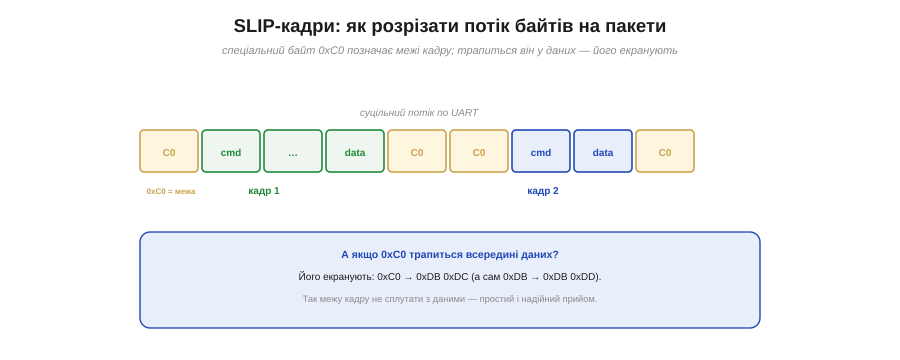
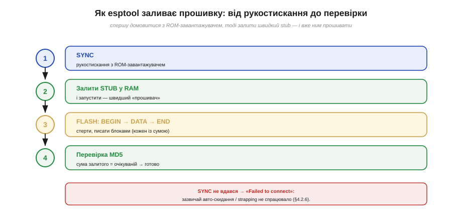

# ⚙️ Як esptool розмовляє з ROM-завантажувачем: SLIP-кадри, stub, перевірка

> Алгоритмічна вставка до **теми [§4.2.5 «Прошивка у Flash»](ch21-toolchain.md)**. Ми бачили, що образ тече в чіп по UART, а приймає його **завантажувач у ROM**. Тут — як саме `esptool` із ним домовляється, щоб байти дійшли **надійно**, навіть якщо лінія шумить.

## Задача

Чіп у режимі завантаження виконує крихітну незмінну програму — **ROM-завантажувач**. `esptool` на ПК мусить, спілкуючись із ним по простому послідовному дроту, надійно записати мегабайти у Flash. Проблем одразу три: як **розрізати** суцільний потік байтів на пакети, як зробити це **швидко** (ROM-завантажувач повільний) і як **переконатися**, що записане справді записалося правильно.

## Ідея: кадрування, stub і перевірка

ROM-завантажувач розуміє невеликий набір **команд** (SYNC, FLASH_BEGIN, FLASH_DATA, FLASH_END…). Але по UART іде суцільний потік байтів — де в ньому межі команди? Тут і потрібне **кадрування SLIP** (*Serial Line IP*): спеціальний байт **0xC0** позначає **межу кадру** (Рис. 4.2.5a.1). А щоб цей байт можна було передати й усередині даних, його **екранують**: 0xC0 → 0xDB 0xDC. Простий і надійний спосіб знайти пакети в потоці.


*Рис. 4.2.5a.1. SLIP ріже потік на кадри байтом-роздільником 0xC0. Якщо 0xC0 трапляється в даних — його екранують (0xC0 → 0xDB 0xDC), щоб не сплутати з межею. Так на голому UART виходить надійний обмін пакетами.*

Друга хитрість — **stub**. ROM-завантажувач малий і повільний, тож `esptool` спершу заливає в **RAM** свій маленький «прошивач» — **stub-loader** — і запускає його. Далі вся справжня прошивка йде вже **через stub**: швидше, з підтримкою стиснення й більших можливостей. Ось чому в логах ви бачите «*Uploading stub… Running stub…*» **перед** самим записом.

## Псевдокод: повна послідовність

Уся розмова вкладається в чотири кроки (Рис. 4.2.5a.2):

```
1. SYNC          → рукостискання з ROM-завантажувачем (чи на зв'язку?)
2. завантажити STUB у RAM і запустити   → швидкий «прошивач»
3. для кожної ділянки:
     FLASH_BEGIN  → стерти потрібний регіон
     FLASH_DATA   → слати блоками; КОЖЕН блок із контрольною сумою
     FLASH_END
4. ПЕРЕВІРКА: порахувати MD5 залитого регіону на чипі
            і звірити з очікуваним   → збіглося? готово.
```


*Рис. 4.2.5a.2. Чотири кроки. **SYNC** — переконатися, що чіп на зв'язку. **Stub** — залити в RAM швидкий прошивач. **FLASH** — стерти й писати блоками, кожен із контрольною сумою. **Перевірка MD5** — звірити суму залитого з очікуваною, щоб гарантувати: записалося саме те, що слали.*

Перевірка тут не формальність: кожен блок несе **контрольну суму** (тож зіпсований по дорозі блок одразу видно), а наприкінці **MD5** усього регіону доводить, що в чипі лежить рівно те, що ви слали. Про самі контрольні суми образу — окрема [математична вставка](ch21-s4-m-image-checksums.md).

## Складність і пастки

- **«Failed to connect»** — це майже завжди провал **кроку 1 (SYNC)**: чіп не ввійшов у режим завантаження. Причина зазвичай не в протоколі, а в **залізі** — не спрацювало авто-скидання чи strapping (§4.2.6); рятує ручний BOOT+EN.
- **Швидкість (baud).** Вища швидкість заливає швидше, але на поганому кабелі **частіше збоїть**; SLIP і контрольні суми це ловлять, та надійніше знизити baud.
- **Шум лінії** SLIP сам по собі не лікує — він лише кадрує; від спотворень рятують **контрольні суми** блоків.
- **Без stub** (режим сумісності) теж можна, але повільніше й з меншими можливостями.

> ▶️ Повернутися до теми: [§4.2.5 — Прошивка у Flash](ch21-toolchain.md)
