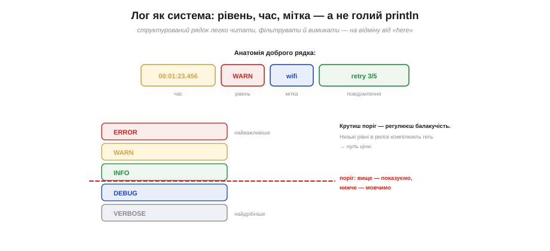
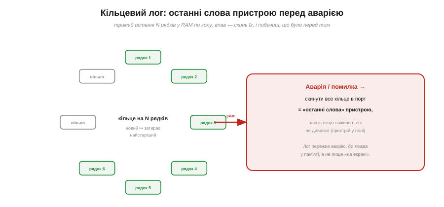

# ⚙️ Логування як інженерна система: рівні, мітки часу, кільцевий лог

> Алгоритмічна вставка до **теми [§4.2.8 «Відлагодження»](ch21-toolchain.md)**. `Serial.println("тут")` рятує раз, але швидко перетворюється на хаос. Тут — як зробити з друку **систему**, що допомагає, а не заважає.

## Задача

Розкидані по коду `println("here")`, `println(x)` мають кілька вад: вони **зливаються** в нечитну стіну, їх **не відфільтрувати**, у них нема **часу** (а коли це сталося?), вони **гальмують** систему — і, найгірше, **зникають разом** із пристроєм, коли той падає в полі, де ніхто не дивиться в монітор. Перетворімо друк на систему, що цих вад позбавлена.

## Ідея: рівень, час, мітка — і кільце на чорний день

Добрий лог-рядок **структурований** (Рис. 4.2.8a.1): **час** (коли), **рівень** важливості, **мітка** модуля (хто), і саме **повідомлення**. Структура одразу дає те, чого бракувало голому друку: рядки можна **читати**, **фільтрувати** й **зіставляти в часі**.


*Рис. 4.2.8a.1. Угорі — анатомія рядка: час · рівень · мітка · повідомлення. Унизу — драбина рівнів (ERROR→VERBOSE) із **порогом**: що вище порога — показуємо, нижче — мовчимо. Крутиш поріг — регулюєш балакучість, а низькі рівні в релізі взагалі компілюють геть, тож вони нічого не коштують.*

Ключова ідея — **рівні** (ERROR, WARN, INFO, DEBUG, VERBOSE). Кожен лог має рівень, а в системи є **поріг**: видно лише те, що важливіше за поріг. Так одним перемикачем робиш лог то докладним (ловиш баг), то тихим (реліз). А якщо поріг — **константа часу компіляції**, то відкинуті рівні зникають із коду зовсім: нуль витрат на DEBUG-логи у фінальній прошивці.

Друга ідея рятує там, де наживо ніхто не дивиться, — **кільцевий лог** (Рис. 4.2.8a.2): тримаємо останні N рядків у **кільцевому буфері** в RAM, де новий запис **затирає найстаріший**. Поки все гаразд, кільце просто крутиться. А коли стається аварія чи помилка — **скидаємо все кільце** в порт. Ось вони, «останні слова» пристрою: що саме він робив у секунди перед падінням, навіть якщо це сталося вночі в полі.


*Рис. 4.2.8a.2. Кільце на N рядків крутиться в RAM, новий запис затирає найстаріший. При аварії все кільце скидають у порт — і ви бачите передісторію збою, бо лог жив у пам'яті, а не лише «на екрані».*

## Псевдокод

```
// поріг — константа компіляції: нижчі рівні зникнуть зовсім
#define LOG_LEVEL  INFO

#define LOG(level, tag, msg) \
   if (level <= LOG_LEVEL) { \
       рядок = format(now(), name(level), tag, msg); \
       ring_push(рядок);          // завжди — у кільце
       if (level <= показувати) port_write(рядок);  // і, може, на екран
   }

ring_push(s):                     // кільцевий буфер
   buf[head] = s
   head = (head + 1) mod N        // по колу; старе затирається

on_crash():                       // останні слова
   for i in кільце від найстарішого: port_write(buf[i])
```

## Складність і пастки на МК

- **Лог повільний.** `Serial` блокує, поки байти підуть; **не логуй у перериванні** чи в гарячому циклі — зб'єш тайминг. У ISR лиш постав прапорець, а друкуй у головному циклі.
- **Поріг: компіляції чи виконання.** Компіляційний — найдешевший (відкинуте зникає); виконанний — гнучкіший (міняєш балакучість на ходу), але код лишається в образі.
- **Переповнення кільця** — це нормально: воно **на те й кільце**, щоб тримати лише свіже. Просто пам'ятай, що старіше за N рядків уже стерто.
- **Мітка часу переповнюється.** `millis()` колись завернеться (про це — §4.6); для різниць це байдуже, але абсолютний відлік це треба враховувати.
- **Скидання при аварії** має статися **до** перезапуску — вивантаж кільце в обробнику помилки, інакше «останні слова» загубляться.

> ▶️ Повернутися до теми: [§4.2.8 — Відлагодження](ch21-toolchain.md)
