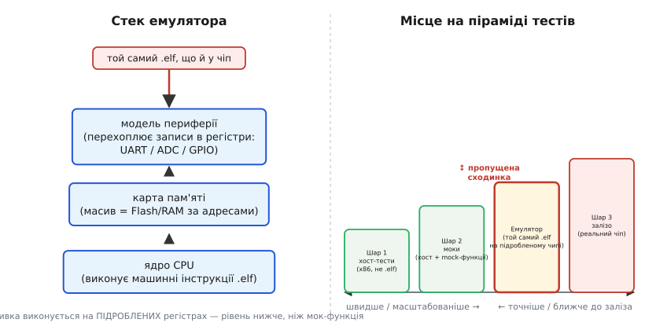

# ⚙️ Емулятори МК: ганяти реальну прошивку без чипа — QEMU, Renode, Wokwi

> Алгоритмічна вставка до **теми [§4.2.9 «Тестування прошивки»](ch21-toolchain.md)**. Тема побудувала піраміду з трьох шарів: хост-тести (Шар 1) → моки (Шар 2) → реальне залізо (Шар 3). Але між моком на ПК і живим чипом є пропущена сходинка — виконати **сам скомпільований бінар прошивки** на вигаданому процесорі, не переписуючи жодного рядка. Саме її закриває ця вставка. Важливо розрізнити: **емулятор ≠ мок**. Мок підміняє функцію-давач під чистою логікою, яка працює на x86, — скомпільованою заново для хоста. Емулятор виконує ту саму машинну інструкцію, що й чип, ту саму прошивку, той самий `.elf`.

## Задача

На хмарному CI немає фізичних плат. Тести на справжньому чипі (Шар 3) повільні, крихкі, «мерехтять» через нестабільне USB й специфіку апаратного скидання — і вимагають фізичної плати на кожен раннер. Хост-тести (Шар 1) швидкі, але вони виконують код, **перекомпільований під x86**: інший цільовий процесор компілятора, інші розміри типів і вирівнювання, немає reset-вектора, startup-секції, карти пам'яті й регістрів периферії (§4.2.4, §4.2.6). Іншими словами, це не та сама прошивка — це наближення логіки на іншій архітектурі.

Лишається сліпа пляма: **чи стартує і чи правильно працює саме той `.elf`, що поїде в чип?** Без п'ятдесяти фізичних плат цього не перевірити. Ціль формулюється точно: виконати немодифікований бінар прошивки на емульованому ядрі з підробленою периферією, детерміновано й масштабовано — тисяча запусків паралельно, без жодного чипа.

## Ідея: емулювати ядро, відобразити пам'ять, підробити периферію

Перша ідея — **симуляція набору інструкцій (instruction-set simulation)**. Програма на ПК читає машинні інструкції прошивки і виконує їх над масивом, що грає роль регістрів CPU: додає до `R0`, встановлює прапорець `Z`, переходить за умовою — точно так, як це робив би кремній. Тому ту саму бінарну прошивку — Xtensa для ESP32, Arm для більшості МК — можна запустити без жодного чипа: система команд однакова. Сучасні емулятори прискорюють це через **динамічну трансляцію (dynamic binary translation)**: блоки гостьових інструкцій перекладаються в хостові один раз, кешуються й потім виконуються нативно — саме тому QEMU іноді буває навіть швидшим за реальний чип при простих обчисленнях.

З ядра природно випливає наступне питання: де живе код і де живуть дані? Відповідь — **карта пам'яті (memory map)**. Емулятор виділяє великий масив і відображає в нього ті самі адресні діапазони Flash і RAM, що описані в лінкер-скрипті (§4.2.4): `.text` іде за адресами Flash, `.data` і `.bss` — у RAM. Читання й запис за будь-якою адресою просто звертаються до потрібної комірки масиву. Це і є та сама карта пам'яті зі §4.2.4/§4.2.6 — тільки реалізована в масиві на ПК.

Але що, якщо прошивка пише в регістр периферії? Регістр UART, таймера, GPIO живе за **фіксованою адресою** в тій самій карті пам'яті — це і є **відображена в пам'ять периферія (memory-mapped I/O, MMIO)**. Коли прошивка виконує запис за такою адресою, емулятор це **перехоплює** і вдає реакцію заліза: UART «надрукував» байт у свій stdout, таймер «цокнув», GPIO смикнув ніжку в журналі подій. Це принципова різниця між емулятором і моком: мок підміняє функцію-давач на рівні C (на хості немає жодних регістрів), а емулятор підробляє самі **адреси регістрів** — на рівень нижче. Тому код **драйвера**, що пише в регістри, тут виконується по-справжньому, а не обходиться підмінною функцією.


*Рис. 4.2.9a.1. Стек емулятора (ядро → пам'ять → периферія) виконує той самий `.elf`, що поїде в чип, перехоплюючи записи в регістри замість справжнього заліза; на осі точність↔швидкість він лягає між моками (Шар 2) і залізом (Шар 3).*

Три яруси — ядро, пам'ять, периферія — реалізовані по-різному в кожному з трьох поширених інструментів. Розгляньмо, що за чим стоїть.

## Троє інструментів, три рівні точності: QEMU, Renode, Wokwi

**QEMU** — повносистемний емулятор з підтримкою широкого спектра ядер: Arm Cortex-M, RISC-V, а для ESP32 — форк від Espressif. Ключова перевага QEMU — **швидкість**: завдяки динамічній трансляції образ запускається за частки секунди, і тисяча паралельних запусків у CI не виглядає фантастикою. Периферію QEMU моделює вибірково — лише те, що явно описано: UART, таймер, контролер переривань. Якщо код звертається до незмодельованого блока, він читає нулі або отримує помилку шини. Ніша QEMU: «чи живий образ, чи крутиться логіка» — швидкий CI-прогін функціональних тестів.

**Renode** цілить в іншу точність: **детерміновану модель цілої плати** і навіть кількох вузлів на спільній шині чи радіоканалі. Можна описати мережу з кількох МК, запустити їх одночасно й перевірити обмін між ними — без жодного заліза. Платформа описується декларативними `.repl`/`.resc`-файлами, а модель периферії там суттєво детальніша, ніж у QEMU. Ціна — нижча швидкість і складніше налаштування. Ніша Renode: інтеграційні тести драйверів, протоколів і міжвузлової взаємодії.

**Wokwi** — браузерний симулятор плати з **візуальною макеткою**: блимають справжні світлодіоди, дисплей показує піксельну картинку, давачі перетягуються мишкою. Підтримує ESP32 і Arduino-світ. Для CI є Wokwi CLI, що дозволяє запускати симуляцію у headless-режимі й перевіряти вивід. Ніша Wokwi: швидкий прототип, навчання, демонстрація — «подивитись, як воно блимає», до того як везти до залізного стенду.

Три інструменти утворюють вісь: **швидкість і масштабованість ↔ точність і повнота периферії** — і ця вісь лягає точно на ту саму логіку, що й піраміда тестів (швидко-багато у підніжжі, точно-мало на вершині). Подивімося, як усе це виглядає в реальному коді.

## Робочий код: емулятор у тесті

Перший фрагмент показує головне: прошивка для емулятора пишеться **звичайно** — через ті самі регістри, тими самими volatile-вказівниками. Жодного рядка «для емулятора».

```c
#include <stdint.h>
// Регістр FIFO передавача UART0 — фіксована адреса в карті пам'яті.
// У залізі тут периферія; в емуляторі цю саму адресу перехоплює модель.
#define UART0_FIFO  (*(volatile uint32_t *)0x3FF40000)

static void uart_putc(char c) {
    UART0_FIFO = (uint32_t)c;   // той самий запис, що й на чипі
}

int app_main(void) {
    const char *msg = "boot ok\n";
    for (const char *p = msg; *p; ++p)
        uart_putc(*p);          // емулятор «надрукує» це у свій stdout
    return 0;
}
```

Цей `.elf` без будь-яких змін запускається і в QEMU, і на реальному чипі — тому що код звертається до апаратних адрес, а емулятор просто перехоплює їх замість нас.

Другий фрагмент демонструє ту саму ідею там, де хост-тест (Шар 1) принципово безсилий: код **чекає апаратний прапорець** у регістрі статусу, і на x86 такого регістра просто немає.

```c
#include <stdint.h>
#define ADC_STATUS  (*(volatile uint32_t *)0x3FF49000)  // біт 0 = готово
#define ADC_RESULT  (*(volatile uint32_t *)0x3FF49004)

// Опитуємо периферію, поки не з'явиться вибірка. У залізі це справжній
// АЦП; в емуляторі модель сама виставить біт готовності й підсуне число —
// той самий драйвер, але прогін повторюваний і без жодного чипа.
uint16_t adc_read_blocking(void) {
    while ((ADC_STATUS & 0x1u) == 0u) { /* busy-wait на готовність */ }
    return (uint16_t)(ADC_RESULT & 0x0FFFu);  // 12-бітний результат
}
```

Емулятор грає роль АЦП: модель у потрібний момент виставляє біт у `ADC_STATUS` і кладе число в `ADC_RESULT`. Драйвер — запис і читання регістрів, опитування прапорця — виконується **по-справжньому**, а не обходиться mock-функцією. Ось чому хост-тест із моком і емулятор перевіряють різні речі: мок підміняє `adc_read_blocking()` цілком, емулятор змушує її тіло виконатись від початку до кінця — з реальним volatile і реальним spin-loop.

## Складність і пастки на МК

- **Емулятор не точно відтворює часову поведінку.** Швидкодія емуляції не відповідає швидкодії чипа; цикл-затримки, реальні гонки між перериваннями, часові межі ISR — не відтворюються точно. Усе, що залежить від залізного тактування (brownout, гонки між ISR і основним циклом), лишається прерогативою Шару 3 і живого заліза.

- **Модель периферії — неповна за визначенням.** Емулюють лише частину блоків і лише частину їхньої поведінки; незмодельований регістр читається як 0 або кидає виняток шини. Прошивка може «проходити» на емуляторі й падати на реальному чипі через дрібний апаратний нюанс.

- **Точність vs швидкість — це свідомий вибір.** QEMU швидкий, але грубший щодо периферії; точніша поциклова модель — повільніша. «Швидко проганяється» не дорівнює «точно як чип», і змішувати ці поняття — джерело хибної впевненості.

- **Аналогові й RF-речі майже не емулюються.** Шуми АЦП, дзвін на шині I²C, радіоканал, провали живлення й brownout — за межами будь-якого поширеного емулятора; число з «АЦП» в емуляторі ідеально чисте, у реальному житті — ні.

- **Та сама збірка, інакше підготовлена.** Образ для емулятора часом потребує іншого формату завантаження: без esptool-протоколу (§4.2.5), без strapping-ніжок (§4.2.6). Стартовий шлях до `main` інший — reset-послідовність емулятор може проходити не один-в-один із залізом.

- **Емулятор — сходинка, не заміна.** Він виявляє «чи живе сам бінар і чи правильно драйвер пише в регістри», але зеленого прогону на емуляторі замало, щоб довіряти прошивці без жодного фізичного димового тесту. Місце між Шаром 2 і Шаром 3 — не вище й не нижче.

> ▶️ Повернутися до теми: [§4.2.9 — Тестування прошивки](ch21-toolchain.md)
