# Розділ 4.2 — Тулчейн: як код стає прошивкою

У [Розділі 4.1](../ch20-mcu-esp32/ch20-mcu-esp32.md) ми розібрали, **що** таке мікроконтролер і як код керує залізом, записуючи біти в регістри: `OUT |= (1<<2)` — і ніжка піднімається. Але ми робили це немовби за помахом чарівної палички: написали зрозумілий людині текст, натиснули кнопку — і чіп ожив. Цей розділ **відкриває чарівну паличку**. Бо ядро не розуміє ані слова `OUT`, ані запису `(1<<2)`: воно виконує лише **числа** — голий машинний код. Між вашим текстом і ожилим залізом стоїть ціла **низка інструментів**, що по черзі перетворюють перше на друге. Цю низку звуть **тулчейном** (*toolchain* — «ланцюг інструментів»), і пройти його шлях — від тексту в редакторі до чисел у Flash — мета всього Розділу 4.2.

Будуємо, як завжди, від першопричин: спершу **що таке компіляція** взагалі (ця тема), далі — її [стадії](ch21-toolchain.md) і [лінкування](ch21-toolchain.md), потім — [образ прошивки](ch21-toolchain.md), [як він потрапляє у Flash](ch21-toolchain.md), що відбувається [до вашого `main()`](ch21-toolchain.md), [скільки коштує зручність фреймворку](ch21-toolchain.md) і як [ловити баги](ch21-toolchain.md). Наприкінці «Compile» перестане бути магією й стане зрозумілим конвеєром.

> 📜 **Перед матеріалом — історія:** [Грейс Гоппер — перший компілятор і перший «баг»](ch21-history-grace-hopper.md). Вона показує, *звідки* взялася сама ідея, що машина може перекладати наш код у свій, звідки слова «компілятор» і «баг», і чому колись у це не вірили.

---

## 4.2.1 Від тексту до машинного коду: що таке компіляція

Історія розділу подарувала нам **ідею**: машина може сама перекласти зрозумілий людині запис у свій машинний код. Тепер перетворімо цю ідею на чітке інженерне розуміння. Що таке **компіляція** насправді, чому вона взагалі потрібна — і чому це не один чарівний крок, а цілий конвеєр. Зрозумівши це, ви назавжди позбудетеся відчуття, що між вашим кодом і чипом діється щось незбагненне.

### Два світи: текст для людини, числа для машини

Почнімо з прірви, яку треба перейти. Те, що ви пишете, — **вихідний код** (*source code*): текст, розрахований на **людину**. Рядок `OUT |= (1<<2);` ви читаєте майже як речення: «увімкни біт 2 у регістрі OUT». А те, що виконує ядро, — **машинний код** (*machine code*): послідовність двійкових команд, тобто **чисел**, кожне з яких ядро тлумачить як інструкцію (згадаймо набір команд із [Модуля 3](../../block-3-digital-processor/ch18-processor-architecture/ch18-processor-architecture.md) і регістри з [§4.1.3](ch20-mcu-esp32.md)). Це **два різні описи** одного наміру: один — словами для нас, другий — числами для кремнію.

І прірва ця не примха, а наслідок того, як улаштоване ядро. Процесор — проста за духом машина: він лише вибирає з пам'яті чергове число, упізнає в ньому одну зі своїх небагатьох команд і виконує її (згадаймо цикл «вибірка → декодування → виконання» з [Модуля 3](../../block-3-digital-processor/ch18-processor-architecture/ch18-processor-architecture.md)). Жодних «слів», «змінних» чи «операторів» він не знає — тільки наперед домовлений набір **числових** команд. Тому будь-яку нашу думку, хоч яку струнку, доводиться зрештою звести до цього бідного, але блискавично швидкого алфавіту чисел. Перекинути місток через цю прірву — і є робота компілятора.

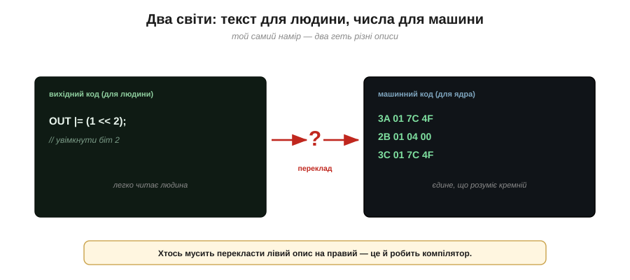
*Рис. 4.2.1.1. Прірва між двома описами. Ліворуч — вихідний код: текст, що його легко читає людина. Праворуч — машинний код: голі числа-команди, єдине, що розуміє ядро. Той самий намір — два геть різні представлення. Хтось мусить **перекласти** ліве на праве.*

### Що таке компіляція

Цей переклад і є **компіляція** (*compilation*): перетворення вихідного коду (тексту вищого рівня) на **машинний код** — рідні інструкції конкретного процесора. Програму, що його робить, звуть **компілятором** (*compiler*) — те саме слово, яке дала світу Грейс Гоппер. На вхід компілятор бере ваш текст, на виході видає числа, готові до виконання ядром.

Тут варто пояснити, **між чим і чим** іде переклад. Мови на кшталт C і C++, якими програмують мікроконтролери, звуть **високорівневими** (*high-level*): вони ближчі до людської думки — зі змінними, функціями, зрозумілими операторами. Машинний код — це найнижчий, **низькорівневий** (*low-level*) рівень: голі команди процесора. C тут — золота середина: достатньо людяний, щоб писати зручно, та достатньо «близький до заліза», щоб дати швидкий і компактний код, потрібний МК. Компілятор і є той міст, що спускає нас із високого рівня на низький.

Тут криється ще одна важлива тонкість: машинний код **прив'язаний до архітектури**. Інструкції, зрозумілі ядру Xtensa, — це не ті числа, що зрозумілі ядру RISC-V. Тому **той самий** вихідний текст компілятор переведе у **різний** машинний код залежно від того, під який чіп ви збираєте (пряме відлуння §4.1.7: оригінальний ESP32 на Xtensa й C3 на RISC-V потребують різного машинного коду з одного джерела).

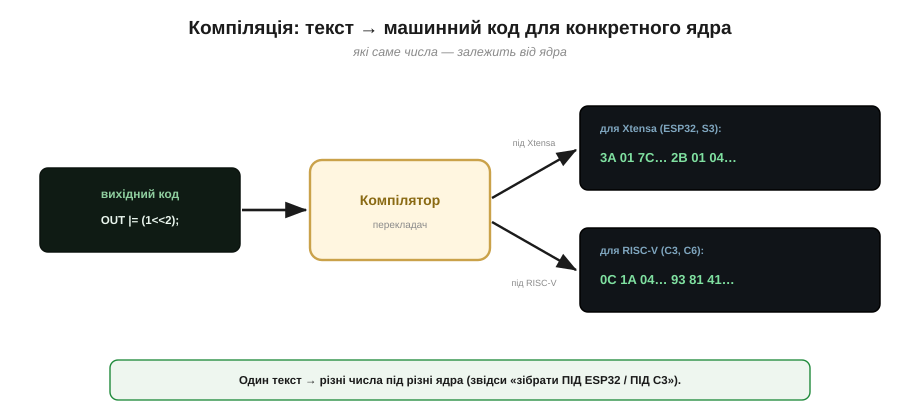
*Рис. 4.2.1.2. Що робить компілятор. Він бере людський текст і видає **числа** — машинні команди. Але які саме числа — залежить від **ядра**: для Xtensa один машинний код, для RISC-V інший. Один вихідний текст → різні прошивки під різні чипи. Тому й кажуть «зібрати **під** ESP32» чи «**під** C3».*

> 🔧 **Навіщо це.** Ось чому буває «помилка компіляції»: якщо ваш текст порушує правила мови, компілятор-перекладач **не може** його зрозуміти — і чесно зупиняється, не видавши прошивки. Це навіть благо: зламаний код **ніколи не доходить** до чипа, помилку видно ще на вашому ПК. Тому компілятор — ваш перший і найдешевший контролер якості: він ловить цілий клас помилок до того, як ви бодай торкнулися заліза.

### Чому не виконувати текст напряму? Компільоване проти інтерпретованого

Виникає природне питання: а навіщо взагалі **заздалегідь** усе перекладати? Чи не можна, щоб машина читала наш текст і робила написане **на ходу**? Можна — і це другий, інший підхід. Існує два способи виконати програму:

- **Компільований** (*compiled*, переклад наперед): увесь текст перекладають у машинний код **один раз**, ще до запуску; далі чіп виконує готові швидкі числа **напряму**. Так працюють C і C++ — мови, якими програмують мікроконтролери.
- **Інтерпретований** (*interpreted*, переклад на ходу): окрема програма-**інтерпретатор** під час роботи читає ваш текст рядок за рядком і **щоразу** виконує написане. Так працює Python (а на МК — його різновид MicroPython).

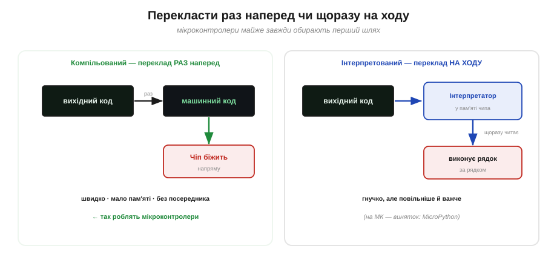
*Рис. 4.2.1.3. Два способи виконати програму. **Компільований:** переклали раз наперед — далі чіп біжить готовим машинним кодом, швидко й без посередника. **Інтерпретований:** інтерпретатор сидить у пам'яті й щоразу на ходу тлумачить ваш текст — гнучко, але повільніше й важче. Мікроконтролери майже завжди обирають **перший** шлях.*

Чому МК майже завжди обирають **компіляцію**? Бо переклад наперед дає те, що для них найцінніше: **швидкість** (ядро виконує готові інструкції, не марнуючи час на тлумачення), **малий розмір** (не треба тримати в дефіцитній пам'яті важкий інтерпретатор) і роботу **на голому залізі** без операційної системи. Інтерпретовані мови на МК існують (той-таки MicroPython), але це радше виняток для зручності, ніж основний шлях.

Платою за це є зручність розробки: компільований код треба **щоразу перезбирати й перезаливати** після кожної правки, тоді як інтерпретатор виконав би новий текст одразу. Це компроміс, який ми ще не раз зустрінемо в курсі: МК міняють трохи зручності розробника на багато ефективності виконання. Згадаймо й [§4.1.1](../ch20-mcu-esp32/ch20-mcu-esp32.md): ресурси МК скромні й полічені, тож «важкий, але зручний» інтерпретатор тут — розкіш не за кишенею, а «сухий і швидкий» машинний код — саме те, що треба.

### Компіляція — не один крок, а конвеєр

А тепер — найважливіше прозріння цієї теми, від якого розплутується весь розділ. Перетворення вашого тексту на прошивку, готову залити в чіп, — це **не один** магічний крок «компіляція». Це **конвеєр** із кількох окремих інструментів, кожен зі своєю вузькою роботою. Саме цей конвеєр і зветься **тулчейном**.

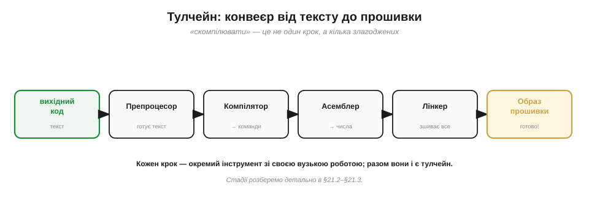
*Рис. 4.2.1.4. Шлях коду — це конвеєр. Вихідний текст проходить **препроцесор** (готує текст), **компілятор** (переклад у команди), **асемблер** (у числа), **лінкер** (зшиває все докупи) — і на виході постає **образ прошивки**, готовий до заливання. Кожен інструмент робить лише свою частину; разом вони і є тулчейн. Стадії ми розберемо детально далі.*

Те, що в побуті звуть одним словом «скомпілювати», насправді — кілька злагоджених кроків. Препроцесор готує текст; компілятор перекладає його в команди процесора; асемблер обертає ці команди на числа; лінкер зшиває всі шматки й бібліотеки в єдине ціле; на виході постає **образ прошивки**. Кожному з цих кроків ми присвятимо окрему тему ([§4.2.2](ch21-toolchain.md) про перші три, [§4.2.3](ch21-toolchain.md) про лінкер); зараз важлива сама картина — **конвеєр, а не диво**.

А навіщо взагалі дробити переклад на стадії — чи не простіше було б зробити все одним «чорним ящиком»? Тут діє та сама інженерна мудрість, що й усюди: **поділ праці**. Кожен інструмент конвеєра робить одну вузьку справу й робить її добре, а отже, його легше написати, перевірити й **замінити** окремо. Захотіли інший компілятор — підставили його, не чіпаючи решти; той самий лінкер служить різним мовам. Розбивши велику задачу на прості злагоджені кроки, її і будувати, і лагодити незрівнянно легше — а нам, зі свого боку, легше **зрозуміти**, бо кожну стадію можна вивчити окремо, що ми й зробимо далі.

### Не лише ваш код: бібліотеки докладаються

Є ще одна причина, чому шлях до прошивки — конвеєр, а не один крок. Ваш файл із кодом — **не вся** програма. Коли ви пишете `digitalWrite(2, HIGH)` чи `Serial.println("привіт")`, ви кличете **чужий**, уже написаний код — функції з **бібліотек** (ядра Arduino, ESP-IDF, стандартної бібліотеки мови). Самі ви їх не писали, але у вашій прошивці вони мусять опинитися — інакше виклику нема куди вести.

Тож тулчейн збирає докупи **кілька джерел**: ваш код, код бібліотек, готові шматки підтримки. Хтось мусить усе це знайти, перекласти й **зшити** в одне ціле, узгодивши, де що лежатиме. Саме цим займається останній інструмент конвеєра — **лінкер**, прямий нащадок Гопперового A-0 з історії розділу. Деталі зшивання — окрема [тема §4.2.3](ch21-toolchain.md); тут важлива думка: навіть «маленька» програма насправді склеюється з багатьох частин, і одна з причин існування тулчейну — упорати цю склейку.

### Крос-компіляція: будуємо на ПК для іншого чипа

І ще одна тонкість, без якої не зрозуміти роботи з МК. Запускаєте ви тулчейн **не** на самому мікроконтролері, а на своєму **ПК** (з ядром, скажімо, x86). А машинний код він готує **не** для вашого ПК, а **для чипа** (Xtensa чи RISC-V). Тобто збирання відбувається на одній машині, а результат призначений для **зовсім іншої**. Таке збирання «тут, а для туди» зветься **крос-компіляцією** (*cross-compilation*).

А чому б не зібрати програму **на самому** мікроконтролері? Бо це було б як просити рисове зернятко спекти собі піч. Компіляція — важка робота: їй потрібні багато пам'яті й обчислень, яких у скромного МК (згадаймо його кілобайти з [§4.1.2](../ch20-mcu-esp32/ch20-mcu-esp32.md)) просто нема. Натомість ваш ПК — потужний «завод», що залюбки збере прошивку за секунди, а тоді передасть її крихітному виконавцеві. Тому крос-компіляція для вбудованого світу — не дивина, а **норма**: будуємо на великому, виконуємо на малому.


*Рис. 4.2.1.5. Збираємо тут — а для туди. Тулчейн працює на потужному **ПК** (ядро x86), але готує машинний код **для мікроконтролера** (Xtensa/RISC-V). Результат на самому ПК виконати не можна — це «чужі» для нього числа; зате чіп біжить ним чудово. Це й є крос-компіляція: машина-будівельник і машина-ціль — різні.*

> 🔧 **Навіщо це.** Звідси дві практичні речі. По-перше, готова прошивка **не запуститься** на вашому ПК подвійним кліком — це код для іншого ядра, ПК його не розуміє. По-друге, для кожного типу чипа потрібен **свій** тулчейн (точніше, своя «ціль» у ньому): зібрати під ESP32 і під C3 — це налаштувати компілятор на різні ядра. На щастя, середовища на кшталт Arduino чи ESP-IDF ховають це від вас: ви лише обираєте плату зі списку, а вони підставляють потрібну ціль самі.

### Що насправді робить компілятор: один рядок → кілька команд

Щоб остаточно прогнати відчуття магії, погляньмо, **на що** перетворюється бодай один наш рядок. Візьмімо знайоме `OUT |= (1<<2);` — увімкнути біт 2. Для ядра це не одна дія, а **кілька** дрібніших машинних команд, і всі вони зрештою — числа.

**Приклад (один рядок C → машинні команди).** Простежмо переклад одного оператора:

```
вихідний код (C):
    OUT |= (1 << 2);

машинні команди (ідея — «читай-зміни-запиши» з §4.1.3):
    load   r1, [адреса OUT]    ; 1) прочитати поточне значення регістра
    or     r1, r1, 0x04        ; 2) накласти маску  (1<<2 = 0b100 = 0x04)
    store  [адреса OUT], r1    ; 3) записати назад у регістр

а це, своєю чергою, — лише числа:
    3A 01 .. ..   2B 01 04   3C 01 .. ..
```

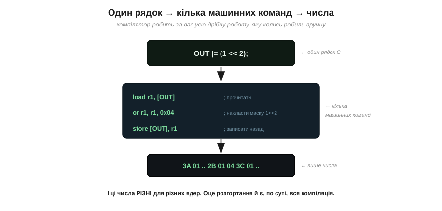
*Рис. 4.2.1.6. Розгортання одного рядка. `OUT |= (1<<2)` — для ядра не одна дія, а **три** дрібніші команди (прочитати → накласти маску → записати), і всі вони зрештою — голі числа. Саме цю марудну роботу «розписати намір на машинні кроки» компілятор і бере на себе.*

Зверніть увагу на три речі. По-перше, **один** зрозумілий рядок розгорнувся у **кілька** машинних команд — компілятор зробив за вас усю дрібну роботу (саме ту, що колись робили вручну, з історії розділу). По-друге, кінцевий результат — **голі числа**, єдине, що розуміє ядро. По-третє, ці числа **різні** для різних ядер: показані тут умовні коди для Xtensa й RISC-V не збіглися б. Оце розгортання «людський рядок → жменя машинних чисел під конкретний чіп» і є, по суті, вся компіляція.

> 🔧 **Навіщо це.** Це розгортання пояснює дві щоденні речі. Чому прошивка у Flash виходить **більшою**, ніж здається з вашого короткого коду: кожен ваш рядок стає кількома командами, та ще й бібліотеки докладаються. І чому, зазирнувши налагоджувачем «під капот», ви бачите не свої рядки, а їхній **машинний переклад** — асемблер: корисно навчитися впізнавати в ньому свій код, коли полюєте на хитрий баг (про відлагодження — наприкінці розділу).

Отже, компіляція — це переклад нашого тексту в рідні числа процесора, зроблений **наперед** і **під конкретне ядро**, а «скомпілювати» насправді означає прогнати код цілим **конвеєром** інструментів. Магії більше нема — є зрозумілий механічний переклад, який можна простежити крок за кроком. Лишилося роздивитися цей конвеєр зблизька: з яких саме стадій він складається й що робить кожна. Із цього починає [наступна тема §4.2.2](ch21-toolchain.md).

---

## 4.2.2 Препроцесор, компілятор, асемблер (стадії)

У [§4.2.1](ch21-toolchain.md) ми побачили тулчейн із висоти пташиного польоту — як конвеєр інструментів. Тепер спустімося й роздивімося перші **три** його стадії, що перетворюють **один** ваш файл із кодом на **один** файл машинного коду: **препроцесор**, **компілятор** і **асемблер**. (Зшивання багатьох файлів докупи — окрема робота лінкера, її розбере [§4.2.3](ch21-toolchain.md).) Найцікавіше тут — стежити, як на кожній межі ваш код **змінює форму**: з тексту з директивами → у чистий текст → в асемблерні мнемоніки → і нарешті в голі числа.

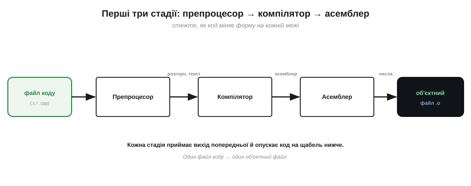
*Рис. 4.2.2.1. Перші три стадії конвеєра й що тече між ними. **Препроцесор** (текст → розгорнутий текст) → **компілятор** (текст → асемблер) → **асемблер** (асемблер → машинний код, об'єктний файл). Кожна стадія приймає вихід попередньої й видає щось «нижче рівнем». Один файл коду стає одним об'єктним файлом.*

Навіщо знати ці стадії поіменно? Бо різні негаразди живуть на різних стадіях — і, упізнавши, **де** саме щось пішло не так, ви заощаджуєте купу часу. Скарга на «неоголошене ім'я» — це компілятор на розборі; химерна підстановка тексту — препроцесор; а загадкове «асемблер не лягає на мій код» — оптимізатор. Знати конвеєр — значить бити точно в потрібний інструмент, а не сваритися на «компілятор узагалі».

### Препроцесор: машинка для тексту

Перша стадія працює ще **до** справжнього перекладу — і працює з вашим кодом **як із простим текстом**, не розуміючи його сенсу. Це **препроцесор** (*preprocessor*). Він виконує особливі вказівки — **директиви**, що починаються з `#`, — і всі вони зводяться до **маніпуляцій із текстом**:

- **`#include`** — «вклей сюди вміст іншого файлу». Коли ви пишете `#include <Arduino.h>`, препроцесор буквально **вставляє** весь текст того файлу-заголовка на це місце.
- **`#define`** — текстова **заміна**. `#define LED 2` означає «надалі скрізь заміни слово `LED` на `2`». Бувають і складніші, схожі на функції, макроси.
- **`#ifdef` / `#if` / `#endif`** — **умовне** включення: лишити чи викинути шматок коду залежно від умови (так, наприклад, той самий код збирають по-різному під різні плати).

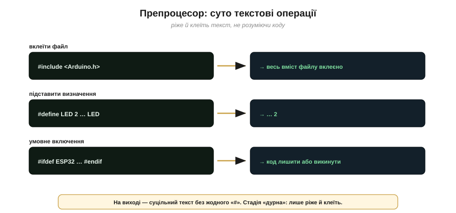
*Рис. 4.2.2.2. Що робить препроцесор — суто текстові операції. `#include` вклеює вміст заголовка; `#define` підставляє визначення (LED → 2); `#ifdef` лишає або викидає шматок. На виході — **один суцільний текст** чистого коду, де директив `#` уже нема. Препроцесор «дурний»: він не розуміє C, лише ріже й клеїть текст.*

Результат його роботи — єдиний **розгорнутий** текст програми (його звуть *одиницею трансляції*, *translation unit*): усі заголовки вклеєно, усі визначення підставлено, усі `#`-директиви зникли. Саме цей чистий текст і піде далі — справжньому перекладачеві.

Тут варто пояснити, **навіщо** взагалі ці `#include`. Файли-заголовки (*headers*, з розширенням `.h`) несуть **оголошення** — короткі «анонси» того, що десь існує: ось є функція `digitalWrite` з такими-то параметрами, ось константа `HIGH`. Вклеївши заголовок, ви **обіцяєте** компіляторові, що ці імена справжні, — і він спокійно дозволяє вами їх кликати, не бачачи самого їхнього коду (той код приєднається пізніше, на лінкуванні). А умовне включення `#ifdef` дає ще й чудову зручність: **один** набір файлів можна зібрати по-різному під різні плати чи режими — потрібні шматки лишити, зайві викинути, не плодячи копій програми.

> 🔧 **Навіщо це.** Пам'ятайте: препроцесор **не розуміє** коду, він лише підставляє текст наосліп — і це джерело класичних пасток. Скажімо, `#define KV 1+2` потім у виразі `KV*3` розгорнеться в `1+2*3` = 7, а не очікувані 9, бо це **сліпа** текстова вставка, а не «значення». Тому макроси-вирази беруть у дужки: `#define KV (1+2)`. Знати, де закінчується «дурна» текстова стадія й починається розумна, — значить не наступати на ці граблі.

### Компілятор: серце перекладу

Тепер — головна стадія, заради якої все й затівалося. **Компілятор** (*compiler*) бере чистий текст від препроцесора й перекладає його на **асемблер** — людиночитну форму машинних команд для **цільового** ядра. Це найрозумніший інструмент конвеєра, і робить він три речі заразом:

- **розбирає** (*parse*) код — перевіряє, чи він узагалі правильний: чи дотримано граматики мови, чи збігаються типи, чи оголошено все, що ви вживаєте. Саме тут народжується більшість «помилок компіляції»;
- **породжує команди** — перетворює правильний код у послідовність інструкцій цільового процесора;
- **оптимізує** — переписує цю послідовність так, щоб вона була швидшою чи меншою (про це окремо нижче).

Спинімося на **розборі**, бо саме він найчастіше вас зупиняє. Компілятор не «читає по верхах» — він прискіпливо розкладає ваш текст на граматичну структуру (як речення на члени) і перевіряє безліч правил: чи закрито дужки, чи стоять крапки з комою, чи оголошено кожне ім'я, перш ніж його вжито, чи **узгоджені типи** (не можна, скажімо, мовчки додати текстовий рядок до числа). Лише **бездоганно** правильний за цими правилами код він пропустить далі. А **породження** команд — крок, де нарешті проявляється «ціль»: під яке ядро ви збираєте, такі команди й постануть (Xtensa чи RISC-V — з [§4.2.1](ch21-toolchain.md)). Тому компілятор завжди знає, **для кого** перекладає.

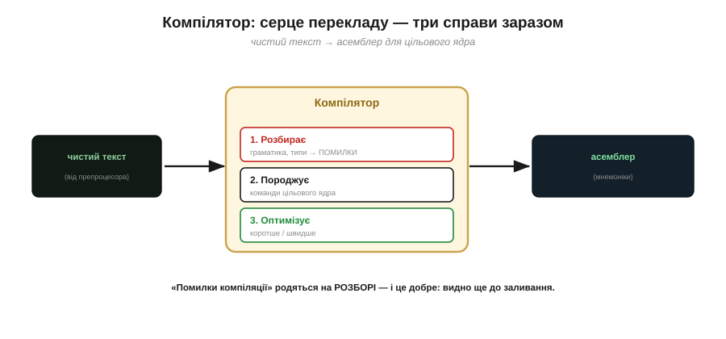
*Рис. 4.2.2.3. Серце тулчейну. Компілятор приймає чистий текст і робить три справи: **розбирає** (перевіряє граматику й типи — звідси «помилки компіляції»), **породжує** машинні команди для цільового ядра й **оптимізує** результат. На виході — асемблер: ті самі команди, але ще в людиночитних мнемоніках, не в числах.*

Завважте: з трьох стадій по-справжньому **розумний** лише компілятор. Препроцесор тупо клеїть текст, асемблер тупо міняє слова на числа — а от компілятор мусить **зрозуміти** ваш код, перевірити його й винахідливо перекласти. Тому й товсті книжки «про компіляцію» — це майже завжди книжки саме про цю середню, серцеву стадію.

> 🔧 **Навіщо це.** Майже всі «помилки компіляції», що зупиняють збірку, виникають саме на цій стадії — на **розборі**: забута крапка з комою, неоголошена змінна, неузгоджені типи. Це добра новина: компілятор **прискіпливо** перевіряє ваш код **до** заливання в чіп і чесно тицяє носом у рядок із проблемою. Навчитися читати його скарги — найшвидший спосіб ловити цілий клас помилок, не діставши паяльника.

> 📜 **Звідки взявся цей компілятор.** Майже напевно ваш — це **GCC**, вільний і переносний під будь-який чіп. Як уперте переконання Річарда Столмена про свободу софту (1983) виросло в компілятор, без якого не було б ані Arduino, ані ESP-IDF, — в [історії про Столмена і GCC](ch21-s2-history-gcc.md).

### Оптимізація: розумний перекладач, а не буквальний

Варто спинитися на третій справі компілятора окремо, бо вона часто дивує. Компілятор перекладає **не буквально**, слово в слово, а **розумно**: він має право переписати ваш код, аби лише результат робив **те саме**, тільки швидше чи компактніше. Він може прибрати обчислення, результат якого ніде не вживається; порахувати наперед те, що й так стале; розгорнути цикл; викинути «мертвий» код, до якого виконання ніколи не дійде.

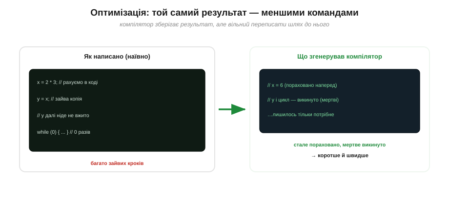
*Рис. 4.2.2.4. Компілятор-оптимізатор. Ліворуч — як ви написали (наївно, «у лоб»); праворуч — що він згенерував: те саме за змістом, але коротше й швидше (стале пораховано наперед, зайве викинуто). Компілятор зобов'язаний зберегти **результат**, але вільний переписати **шлях** до нього.*

Силу оптимізації зазвичай можна **регулювати**: компіляторові кажуть, чого ви хочете більше — швидкості, малого розміру чи, навпаки, простоти й передбачуваності (ці режими позначають як `-O0`, `-O2`, `-Os` тощо). І тут є чесний компроміс: що агресивніше компілятор переписує код, то він **швидший і менший**, але то й **важче його відлагоджувати** — бо згенерований асемблер уже мало схожий на ваш текст.

Саме в цьому й практичний наслідок: оптимізований асемблер **не лягає рядок-у-рядок** на ваш вихідний код — компілятор міг переставити, злити чи прибрати цілі шматки. Тому, коли пізніше ([§4.2.8](ch21-toolchain.md)) ви відлагоджуватимете програму й зазирнете в асемблер, не дивуйтеся, що він не точно повторює ваш текст: це слід роботи оптимізатора. Через це під час складного відлагодження оптимізацію часом тимчасово **прибирають** (`-O0`), щоб код знову став «прозорим».

І ще одне, що варто прийняти зі смиренням: сучасний оптимізатор майже завжди генерує **кращий** машинний код, ніж написала б людина вручну. Тому давнє ремесло «писати критичні шматки прямо в асемблері заради швидкості» нині майже відмерло: простіше скласти ясний код мовою високого рівня й довіритися компіляторові — він і швидкість дасть, і помилок наробить менше. Ваша справа — ясність задуму, його справа — ефективність виконання.

> ⚙️ **Глибше про оптимізатор.** Чим різняться `-O0`/`-O2`/`-Os`, що таке інлайн, чому «зникає» мій код — і як це інколи ламає прошивку (зниклий цикл-затримка, «закешоване» читання регістра й рятівне `volatile`) — у вставці [Що робить оптимізатор](ch21-s2-a-optimizer.md).

### Асемблер: мнемоніки → числа

Остання з трьох стадій — найпростіша. **Асемблер** (*assembler*; так звуть і інструмент, і саму низькорівневу мову) бере асемблерний текст від компілятора — мнемоніки на кшталт `or r1, r1, 0x04` — і перекладає його в **машинний код**, тобто в числа. Тут переклад майже **дослівний**, один-в-один: кожна асемблерна мнемоніка відповідає **одній** машинній команді, тобто одному наперед визначеному числу-коду. Жодного «розуму» вже не треба — лише словник «мнемоніка → число».

Власне, асемблер — це **людиночитне обличчя** машинного коду: мнемоніки `load`, `or`, `store` стоять рівно один-в-один за числами, тож, навчившись їх читати, ви фактично читаєте те, що виконує ядро. Саме тому асемблер і показують у налагоджувачах: він точно відбиває машинні команди, лишаючись хоч трохи зрозумілим людині — на відміну від голих чисел, у яких уже нічого не розбереш.

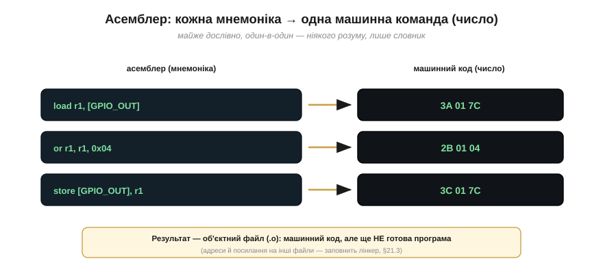
*Рис. 4.2.2.5. Асемблер — майже дослівний переклад. Кожен рядок-мнемоніка перетворюється на **одну** машинну команду (число) за фіксованим словником: `load` → свій код, `or` → свій, `store` → свій. Це найпростіша стадія: ніякого розбору й оптимізації, лише пряма заміна слів на числа.*

Результат асемблера — **об'єктний файл** (*object file*, з розширенням `.o`): машинний код вашого файлу. Та зверніть увагу — це ще **не готова програма**. У ньому лишаються «дірки»: посилання на функції з інших файлів і бібліотек, точні адреси, яких на цьому етапі ще не знати. Заповнити ці дірки й зшити всі об'єктні файли в одне ціле — робота **лінкера**, до якої перейде [§4.2.3](ch21-toolchain.md). Поки що маємо проміжний результат: один файл коду → один об'єктний файл.

Чому ж об'єктний файл «не готовий»? Бо ваш файл майже завжди кличе те, чого в ньому самому нема, — функції з інших ваших файлів і з бібліотек. На їхньому місці асемблер чесно лишає **порожні заготовки**: «тут має бути виклик `digitalWrite` — справжню адресу впишемо потім». Доки ці місця не заповнено, програму запустити не можна. Зате така **роздільність** дуже зручна: кожен файл компілюється сам по собі в свій `.o`, незалежно від інших.

> 🔧 **Навіщо це.** Звідси приємна річ — **роздільне** збирання. Велику програму ріжуть на багато файлів саме тому, що кожен перетворюється на свій об'єктний файл **окремо**; правка в одному файлі коштує перезбірки лише його, а не всіх десяти. Ось чому повторна збірка після дрібної зміни зазвичай **швидка**: тулчейн чіпає тільки те, що змінилося, а решту `.o` бере вже готовими. Перша збірка «з нуля» довга, наступні — миттєві саме через це.

### Простежмо один шматок крізь три стадії

Зберімо все докупи, провівши крихітний фрагмент крізь усі три стадії й дивлячись, як він **міняє форму** на кожній межі.

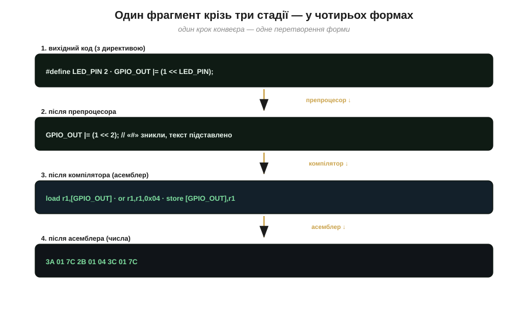
*Рис. 4.2.2.6. Той самий намір у чотирьох послідовних формах: вихідний код із директивою → розгорнутий текст (після препроцесора) → асемблерні мнемоніки (після компілятора) → машинні числа в об'єктному файлі (після асемблера). Один крок конвеєра — одне перетворення форми.*

**Приклад (фрагмент крізь три стадії).** Простежмо, що стається з парою рядків:

```
1) ВИХІДНИЙ КОД (з директивою #define):
     #define LED_PIN 2
     GPIO_OUT |= (1 << LED_PIN);

2) ПІСЛЯ ПРЕПРОЦЕСОРА (текст підставлено, # зникли):
     GPIO_OUT |= (1 << 2);          // LED_PIN → 2; заголовки вже вклеєно

3) ПІСЛЯ КОМПІЛЯТОРА (асемблер — мнемоніки):
     load   r1, [GPIO_OUT]
     or     r1, r1, 0x04            // 1<<2 пораховано → 0x04
     store  [GPIO_OUT], r1

4) ПІСЛЯ АСЕМБЛЕРА (об'єктний файл — числа):
     3A 01 7C   2B 01 04   3C 01 7C
```

Простежте поглядом цей спуск: директива `#define` зникла вже після препроцесора (її роботу зроблено — текст підставлено); вираз `(1 << LED_PIN)` компілятор порахував наперед у `0x04` (та сама оптимізація); а наприкінці від людської мови не лишилося нічого, крім чисел. Кожна стадія опустила код на щабель нижче — рівно так, як обіцяла оглядова схема.

Ця звичка — подумки прогнати підозрілий рядок крізь стадії — не раз вас виручить, коли прошивка поводитиметься дивно. Запитайте себе по черзі: що тут зробив **препроцесор** (чи правильно підставився текст і вклеїлися заголовки)? що побачив **компілятор** (чи нема плутанини з типами)? що міг переписати **оптимізатор**? Зазвичай причина дивної поведінки випливає сама, тільки-но ви перестаєте бачити в збиранні одне суцільне «диво» й починаєте розрізняти його кроки.

Отже, перші три кроки тулчейну перетворили **один** ваш файл на **один** об'єктний файл, послідовно знизивши код від тексту з директивами до голих чисел. Це поступове «зниження» (для нього навіть є фаховий термін — *lowering*) і є суттю всієї передньої частини тулчейну: щокроку відкидати по жмені людської зручності, наближаючись до того, що розуміє кремній. Та програма рідко складається з одного файлу — а ще їй потрібні бібліотеки, і всі ці шматки треба зшити в єдине ціле з узгодженими адресами, заповнивши ті порожні заготовки, що їх лишив асемблер. Як саме це робиться — розбирає [наступна тема §4.2.3](ch21-toolchain.md).

---

## 4.2.3 Лінкування: збираємо все докупи (об'єктні файли, бібліотеки, адреси)

[§4.2.2](ch21-toolchain.md) лишила нас із купкою **об'єктних файлів** (`.o`) — по одному на кожен файл коду, — і всі вони «з дірками»: у кожному є посилання на чуже (виклики функцій з інших файлів і бібліотек) без точних адрес. Тепер настав час **останнього** інструмента конвеєра, що зшиє все це в одну робочу програму, — **лінкера** (*linker*). Це той самий зшивач, чий прообраз ми бачили в Гопперовому A-0 ще в історії розділу. Лінкер часто здається найзагадковішим кроком — а насправді робить лише **дві** прості за ідеєю речі: з'єднує імена (заповнює дірки) і розкладає все по адресах.

Сама назва «лінкер» (від *link* — «зв'язувати») каже за себе: він **зв'язує** розрізнені шматки в одне. І ось чим він особливий серед усіх інструментів конвеєра: попередні стадії **знижували рівень** одного файлу (текст → числа), а лінкер уперше **збирає ціле з частин**. Тому його так легко проґавити в думках — здається, ніби після компіляції все вже готове. А насправді саме тут із купки окремих `.o` народжується програма, що нарешті знає себе **всю**.

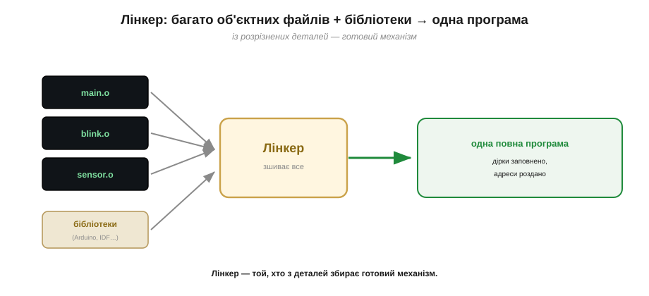
*Рис. 4.2.3.1. Робота лінкера одним поглядом. На вхід — усі ваші об'єктні файли (`.o`) **плюс** бібліотеки; на виході — **одна повна програма**, де всі дірки заповнено, а кожен шматок дістав свою адресу. Лінкер — той, хто з розрізнених деталей збирає готовий механізм.*

### Символи: імена, які треба з'єднати

Щоб зрозуміти лінкер, треба знати про **символи** (*symbols*). Кожен об'єктний файл несе свою «відомість» — таблицю символів, де записано дві речі: що цей файл **визначає** (тобто **дає** світові — які функції й змінні в ньому реально є) і що цей файл **потребує** (тобто кличе ззовні, але сам не має — це і є ті «дірки»).

Скажімо, файл `blink.o` **визначає** функцію `blink` (вона в ньому написана), але **потребує** `digitalWrite` (він її кличе, а коду її не має). Так кожен `.o` — це водночас і **постачальник** одних імен, і **прохач** інших.

Звідки лінкер знає, хто що дає й потребує? Із самої таблиці символів, яку компілятор і асемблер дбайливо вписали в кожен `.o`. Символ — це просто **ім'я**, прив'язане до місця: «функція `blink` починається ось тут». У визначених символів місце вже є; у потрібних (зовнішніх) воно поки порожнє — «адресу впишеш ти, лінкере». По суті, лінкер працює як **бюро знайомств**: в одній колонці — оголошення «шукаю того, хто вміє `digitalWrite`», в іншій — «я вмію `digitalWrite`, ось я»; його справа — звести пари.


*Рис. 4.2.3.2. Таблиця символів об'єктного файлу. Ліворуч — що файл **визначає** (дає: тут функцію `blink`). Праворуч — що **потребує** (кличе ззовні: `digitalWrite`) — це і є незаповнені «дірки». Кожен `.o` — і постачальник, і прохач імен водночас.*

### Розв'язання символів: з'єднати «потребує» з «є»

Головна робота лінкера — **розв'язання символів** (*symbol resolution*): для кожного «потребує X» знайти десь поміж усіх файлів і бібліотек той, хто «визначає X», і **з'єднати** їх — вписати в дірку справжню адресу того X. Знайшов на кожне «треба» своє «є» — програма зшита.

Шукає лінкер по **всіх** поданих йому файлах і бібліотеках, і діє за суворим правилом: кожне ім'я має бути визначене **рівно один раз** — не нуль (бо нема куди вести виклик) і не двічі (бо незрозуміло, котре визначення брати). І ось чому ці помилки виринають аж **тепер**, а не при компіляції: компілятор бачив лише **один** ваш файл і повірив на слово, що `digitalWrite` десь існує (ви ж пообіцяли це заголовком). По-справжньому перевірити, чи вона існує насправді, можна лише коли **всі** файли зійшлися разом — тобто на лінкуванні. Тому «не знайшов функцію» — це майже завжди скарга лінкера, а не компілятора.

А якщо **не** знайшов? Тоді лінкер зупиняється зі знаменитою скаргою «**undefined reference**» («невизначене посилання»): ви кличете щось, чого ніде нема — забули під'єднати потрібний файл чи бібліотеку. Буває й протилежна біда: дві різні частини **визначають** те саме ім'я — лінкер не знає, котре брати, і скаржиться на «**multiple definition**» («множинне визначення»).

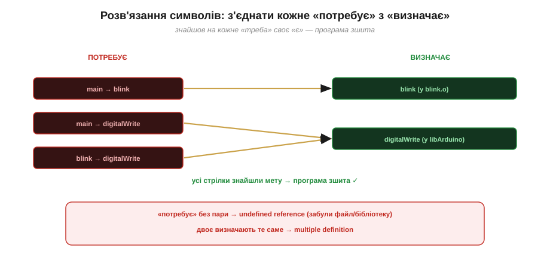
*Рис. 4.2.3.3. Серце лінкування. Для кожного «потребує» (ліворуч) лінкер шукає відповідне «визначає» (праворуч) і простягає між ними зв'язок. Усі стрілки знайшли мету — програма зшита. Якщо ж якесь «потребує» лишилось без пари — це **undefined reference**; якщо два файли визначають те саме — **multiple definition**.*

> 🔧 **Навіщо це.** Двох найчастіших скарг лінкера досить, щоб упізнавати половину «таємничих» збоїв збірки. «**undefined reference to digitalWrite**» майже завжди означає, що ви **забули** під'єднати файл чи бібліотеку, де ця функція живе (наприклад, не вказали потрібну бібліотеку проєкту). А «**multiple definition**» — що ви випадково **двічі** визначили те саме (часто — вписали повноцінне визначення в заголовок, що його вклеїли у два файли). Знаючи, що це **лінкер**, а не компілятор, ви шукаєте причину в **складі** проєкту, а не в синтаксисі окремого рядка.

### Бібліотеки: склад готового коду

Звідки ж береться код тих функцій, яких ви не писали, — `digitalWrite`, `Serial.println` і сотень інших? З **бібліотек** (*libraries*). Бібліотека — це, по суті, **архів уже скомпільованих** об'єктних файлів: ядро Arduino, стандартна бібліотека мови, ESP-IDF — усе це склади готового, перевіреного коду, що його хтось зібрав **до вас** і раз.

Коли лінкер бачить ваше «потребує `digitalWrite`», він іде на цей склад і **витягує лише те, що справді потрібно**, — саму `digitalWrite` (та все, що вона тягне за собою), а не весь архів. Тому до вашої прошивки потрапляє **тільки використаний** код бібліотек, а не вони цілком. І, що важливо, бібліотеки **не перекомпільовують** щоразу — вони вже готові `.o`, лінкерові лишається їх **дібрати**.

Це дає одразу два зиски. По-перше, **швидкість**: величезний код бібліотек скомпільовано раз і назавжди, а ваша щоденна збірка лише дібрає з нього потрібне, не перетравлюючи його наново. По-друге, **ощадність**: лінкер тягне в прошивку лише ті функції, що ви справді кличете, відкидаючи решту складу (це звуть «прибиранням мертвого коду»). Тому підключити велику бібліотеку заради однієї функції — **не страшно**: у чіп піде тільки використане, а не весь її обсяг. Такий спосіб збирання — коли готовий код беруть із бібліотек і **вшивають у саму програму** — звуть **статичним лінкуванням**: усе потрібне опиняється всередині одного образу, без зовнішніх залежностей під час роботи.

На «великих» комп'ютерах буває й інакше — **динамічне** лінкування, коли спільні бібліотеки лежать окремо й підвантажуються вже під час запуску програми (це ті `.dll` у Windows чи `.so` у Linux, що їх ділять між собою багато застосунків). Для мікроконтролера такий шлях майже не годиться: там нема ні файлової системи, ні операційної системи, яка підвантажила б щось «на ходу», та й зайвого місця катма. Тому вбудований світ майже завжди обирає **статичне** лінкування: усе своє нести з собою, в одному самодостатньому образі — точнісінько в дусі самодостатності МК із [§4.1.1](../ch20-mcu-esp32/ch20-mcu-esp32.md).

> 🔧 **Навіщо це.** Звідси дві щоденні речі. Перша: не бійтеся розміру, підключаючи бібліотеку, — прошивка зросте лише на те, що ви з неї **кличете**. Друга: якщо лінкер кричить «**undefined reference**» на функцію, що мала б бути в бібліотеці, — найімовірніше, ви **не вказали саму бібліотеку** проєктові (код її є, та лінкерові не сказали, де шукати). Тобто лікувати треба не код, а **склад** збірки — список під'єднаних файлів і бібліотек.

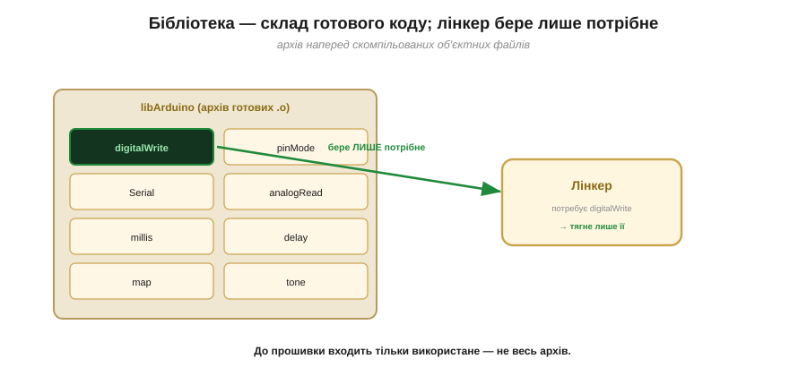
*Рис. 4.2.3.4. Бібліотека як склад. Це архів **наперед** скомпільованих об'єктних файлів (ядро Arduino, стандартна бібліотека…). На ваше «потребує `digitalWrite`» лінкер витягує зі складу **лише** цю функцію (і її залежності), а не весь архів. Звідси й береться код, якого ви не писали, — і саме тому до прошивки входить тільки **використане**.*

### Розкладання по адресах: де що житиме

Зшити імена — півсправи. Друга робота лінкера: вирішити, **де саме** в пам'яті чипа житиме кожен шматок, тобто дати кожному фрагменту коду й кожній змінній **остаточну адресу** на карті пам'яті (згадаймо карту з [§4.1.2](../ch20-mcu-esp32/ch20-mcu-esp32.md)). Код лягає в одну ділянку пам'яті, дані — в іншу; усе вишиковується за чіткою розкладкою.

І ось тепер дірки можна **остаточно** заповнити: щойно лінкер знає, що `digitalWrite` лежатиме, скажімо, за адресою `0x4000_0190`, він вписує саме це число в кожне місце, де її кликали. Орієнтуватися ж, куди що класти, лінкерові допомагає особливий **сценарій лінкування** (*linker script*) — файл, що описує карту пам'яті **конкретного** чипа: де у нього Flash під код, де RAM під дані, скільки чого. (Як саме код і дані розкладаються по ділянках-секціях — окрема [тема §4.2.4](ch21-toolchain.md); тут важлива сама ідея: лінкер **призначає адреси**.)

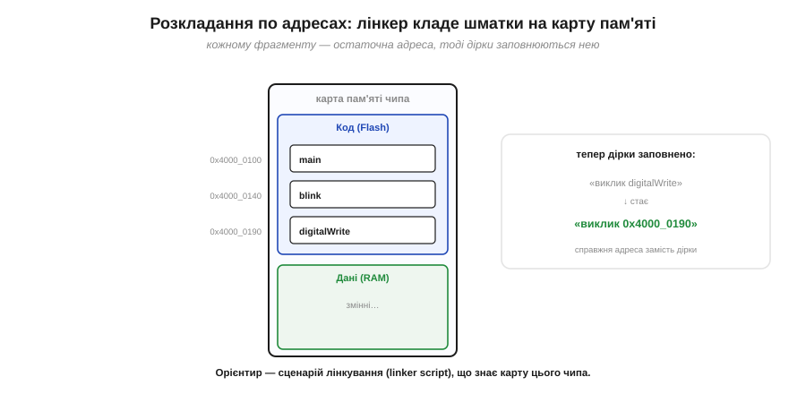
*Рис. 4.2.3.5. Друга робота лінкера. Він розкладає всі шматки на **карті пам'яті** чипа: код — в одну ділянку, дані — в іншу, кожному — своя адреса. Знаючи тепер, що `digitalWrite` лежить за `0x4000_0190`, лінкер вписує це число в усі місця, де її кликали. Орієнтир — **сценарій лінкування**, що знає карту пам'яті саме цього чипа.*

Зверніть увагу: сценарій лінкування **прив'язаний до чипа**, так само як машинний код прив'язаний до ядра ([§4.2.1](ch21-toolchain.md)). У ESP32 одна карта пам'яті, у іншого МК — зовсім інша; той самий код, зібраний під різні чипи, лінкер розкладе по **різних** адресах. Це ще одна причина, чому під кожну плату потрібна своя «ціль» у тулчейні: не лише компілятор має знати ядро, а й лінкер — карту пам'яті. Тому, до речі, готовий образ під один чіп не «оживе» на іншому, навіть спорідненому: адреси в ньому розраховані під чужу карту.

### Результат: один повний образ

Чому ж адреси не призначив раніше асемблер? Бо, складаючи окремий `.o`, він **не знав**, поряд із якими іншими файлами той опиниться й куди все ляже разом. Тому об'єктний код пишуть «**пересувним**» (*relocatable*): мовляв, «це почнеться там, де скажуть». Зібравши всіх докупи, лінкер нарешті вирішує остаточну розкладку, **зсуває** кожен шматок на його місце й виправляє всі внутрішні посилання під нові адреси. Цей зсув і називають **релокацією** — дати плаваючим адресам остаточний дім.

Зробивши обидві справи — з'єднавши всі імена й роздавши всі адреси, — лінкер видає **одну повну програму**: жодних незаповнених дірок, кожен шматок на своєму місці з відомою адресою. Це вже майже прошивка — лишається оформити її в остаточний **образ** для заливання в чіп, чим займеться [§4.2.4](ch21-toolchain.md).

### Простежмо лінкування на прикладі

Зведімо все докупи на крихітному проєкті з двох ваших файлів і однієї бібліотеки.

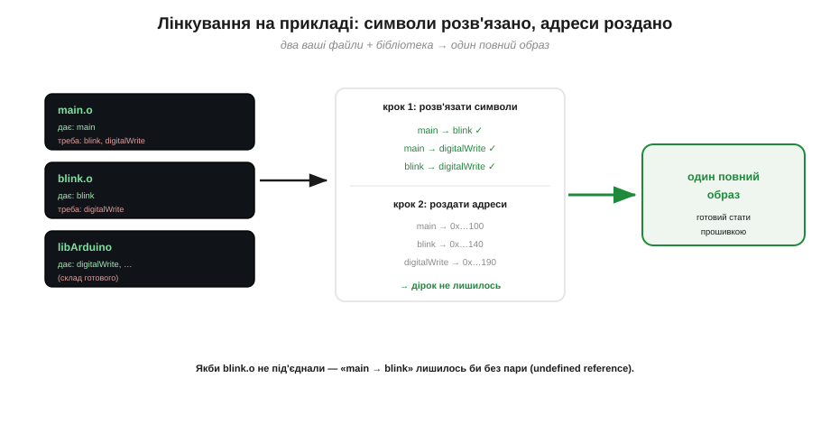
*Рис. 4.2.3.6. Лінкування крок за кроком: спершу кожне «потребує» з'єднують із «визначає» (символи розв'язано), тоді кожному шматку дають адресу — і дірки заповнюють цими адресами. На виході — один повний образ.*

**Приклад (зшивання трьох частин).** Хай проєкт складається з двох ваших файлів і бібліотеки:

```
НА ВХОДІ ЛІНКЕРА:
  main.o    визначає: main          потребує: blink, digitalWrite
  blink.o   визначає: blink         потребує: digitalWrite
  libArduino (бібліотека)  визначає: digitalWrite, … (багато іншого)

КРОК 1 — РОЗВ'ЯЗАННЯ СИМВОЛІВ (з'єднати «потребує» з «визначає»):
  main  → blink         : знайдено в blink.o       ✓
  main  → digitalWrite  : знайдено в libArduino    ✓
  blink → digitalWrite  : знайдено в libArduino    ✓
  усі «потребує» мають пару → дірок не лишилось

КРОК 2 — РОЗКЛАДАННЯ ПО АДРЕСАХ:
  main          → 0x4000_0100
  blink         → 0x4000_0140
  digitalWrite  → 0x4000_0190
  (тепер кожен виклик вписує точну адресу замість «дірки»)

РЕЗУЛЬТАТ: один повний образ — готовий стати прошивкою
```

Простежте логіку: спершу лінкер **з'єднав** усі прохання з постачальниками (зокрема витяг `digitalWrite` зі складу-бібліотеки), переконавшись, що жодне «потребує» не лишилось без відповіді; тоді **роздав адреси** й вписав їх у місця викликів. Якби, скажімо, `blink.o` не під'єднали, `main` лишився б із недосяжним «потребує blink» — і ми б дістали те саме «undefined reference». Так абстрактні «символи» й «адреси» виявляються найприземленішою бухгалтерією: хто кого кличе, хто де лежить і чи всі кінці зійшлися.

Отже, лінкер зшиває розрізнені об'єктні файли та потрібні шматки бібліотек у єдину програму: з'єднує всі імена й роздає всі адреси, заповнюючи дірки, що їх лишив асемблер. І знову згадаймо Гоппер: її A-0 понад сімдесят років тому робив по суті те саме — діставав підпрограми зі складу-стрічки й узгоджував адреси; сучасний лінкер — той самий зшивач, лише виріс і змужнів. На виході — повний, узгоджений код: один-єдиний файл, де кожен виклик веде куди слід, а кожна змінна має свою адресу. Та це ще не той файл, який заливають у чіп: його треба оформити в остаточний **образ прошивки** з його впорядкованими ділянками-секціями — і саме там код і дані остаточно посядуть свої місця у Flash та RAM. Цим і займеться [наступна тема §4.2.4](ch21-toolchain.md).

---

## 4.2.4 Образ прошивки й карта пам'яті (секції .text/.data/.bss)

[§4.2.3](ch21-toolchain.md) дала нам повну програму з усіма адресами. Лишилося зрозуміти, **як вона організована** в готовий **образ прошивки** й **куди лягає** в пам'яті чипа — у Flash і RAM. Виявиться, що програма зовсім не однорідна: у ній різні **сорти** вмісту з різними потребами, і тулчейн сортує їх по іменованих ділянках — **секціях** (*sections*). Класичних секцій три, і їхні назви — `.text`, `.data`, `.bss` — ви ще не раз побачите у звітах збірки. Розібравшись із ними, ви нарешті зрозумієте ті загадкові рядки «скетч займає стільки байтів програмної пам'яті й стільки динамічної».

Це не суха формальність: розуміючи секції, ви точно знаєте, **що чим коштує** — котрий шматок з'їдає дорогоцінну RAM, а котрий лягає в просторий Flash. А коли (рано чи пізно) пам'яті забракне, саме це знання підкаже, **де** її шукати й що скорочувати. Тож кілька дивних назв варті того, щоб розібратися в них раз і назавжди.

### Не все однакове: код, сталі, змінні

Чому програму взагалі ділять на секції? Бо її вміст **різнорідний**, і різним його сортам потрібне різне місце (згадаймо поділ Flash/RAM із [§4.1.2](../ch20-mcu-esp32/ch20-mcu-esp32.md) та [Модуля 3](../../block-3-digital-processor/ch19-memory-stack-heap/ch19-memory-stack-heap.md)):

- **код** (інструкції) — ніколи не змінюється під час роботи й мусить **пережити вимкнення** → йому місце у **Flash**;
- **сталі дані** — незмінні значення: константи, текстові рядки, **початкові значення** змінних — теж мають пережити вимкнення → **Flash**;
- **змінні** — те, що програма **міняє** на ходу, з частим швидким доступом → їм потрібна **RAM**.

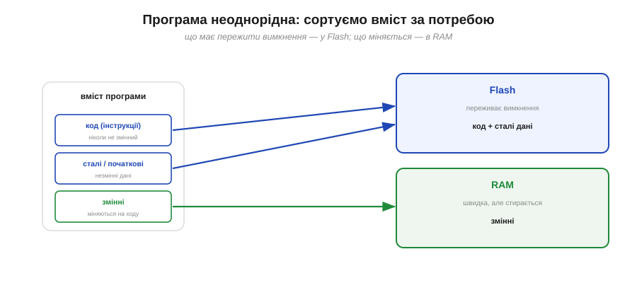
*Рис. 4.2.4.1. Програма неоднорідна. Код і сталі дані не змінюються й мусять пережити вимкнення — їм місце у **Flash**. Змінні живуть і міняються під час роботи — їм потрібна **RAM**. Тулчейн розкладає вміст по секціях саме за цією ознакою «що де має жити».*

Є, щоправда, і четвертий «мешканець» пам'яті, якого в образі нема зовсім, — те, що народжується **під час роботи**: стек викликів і динамічна купа (з [Модуля 3](../../block-3-digital-processor/ch19-memory-stack-heap/ch19-memory-stack-heap.md)). Їх ніхто не зберігає наперед — вони просто **виростають** у вільній RAM, коли програма вже біжить, і так само спадають. Тому в секції їх не кладуть і в образ не пишуть; але вільне місце під них у RAM лишити **конче** треба — інакше вони зіткнуться з вашими даними. Про це ще згадаємо, рахуючи оперативну пам'ять.

### Три класичні секції: .text, .data, .bss

Отже, лінкер розкладає все по трьох іменованих секціях:

- **`.text`** — це **код**, машинні інструкції вашої програми. Він **тільки читається** (виконується, не змінюється) і живе у **Flash**.
- **`.data`** — це змінні, що мають **ненульове початкове значення**. Наприклад, `int x = 5;`: сама змінна `x` житиме в RAM (бо її змінюватимуть), але звідкись треба взяти оту початкову **5** — і її зберігають у Flash.
- **`.bss`** — це змінні, ініціалізовані **нулем** (або взагалі без явного значення): `int y;` чи `int z = 0;`, а також великі нульові **буфери**. Вони теж житимуть у RAM, але їхнє початкове значення — просто **нуль**, тож зберігати його у Flash **не треба**: досить при старті обнулити відповідну ділянку RAM.


*Рис. 4.2.4.2. Три класичні секції. **`.text`** — код, тільки читається, у Flash. **`.data`** — змінні з ненульовим початком (`int x = 5`): живуть у RAM, а початкове значення лежить у Flash. **`.bss`** — нульові змінні й буфери (`int y`): живуть у RAM, у Flash місця не займають (бо нуль зберігати ні до чого). Назви дивні, та зміст простий.*

Звідки такі назви? Це історичний спадок старих систем — і знати його корисно, щоб вони не лякали. `.text` — бо колись машинний код звали «текстовою» ділянкою програми (на противагу даним). `.data` — очевидно, дані з початковими значеннями. А найзагадковіше `.bss` — це абревіатура давнього асемблера, *Block Started by Symbol*; сьогодні її просто читають як «секція нульових змінних». Імена прижилися ще пів століття тому й дожили до ESP32 без змін — ще одне відлуння тяглості, як і слово «компілятор» від Гоппер.

### Хитрість ініціалізованих змінних

Тут варто спинитися на `.data`, бо в ній ховається тонкість, яку новачки часто не помічають. Ось `int x = 5;`. Здавалося б, просто. Але згадаймо: при ввімкненні живлення **RAM порожня** (точніше, у ній випадкове «сміття») — там немає жодної п'ятірки. То **звідки** ж вона візьметься, коли програма зверне до `x`?

Розгадка: початкове значення `5` зберігають у **Flash** (у тій частині образу, що відповідає `.data`), а при старті його **копіюють** звідти в RAM, на місце змінної `x`. Тобто кожна ініціалізована змінна ніби має **дві адреси**: «склад» у Flash, де лежить її початкове значення, і «дім» у RAM, де вона житиме й мінятиметься. А ось `.bss` такого складу не потребує: її початок — нуль, тож при старті відповідну ділянку RAM просто **затирають нулями**, не читаючи нічого з Flash.

А куди ж потрапляють **константи** — оголошені `const` дані, текстові рядки на кшталт `"привіт"`? Вони незмінні, тож копіювати їх у дорогу RAM немає сенсу — їх лишають **у Flash** і читають просто звідти (для такого вмісту часто заводять окрему секцію «лише для читання», та за духом це той самий Flash, що й код). Звідси важливий практичний висновок: велика **константна** таблиця, позначена `const`, лягає у Flash і дефіцитної RAM **не торкається**, тоді як така сама **неконстантна** таблиця з'їла б цілий шмат RAM. Тому на МК усе незмінне сумлінно позначають `const` — це безкоштовно береже оперативну пам'ять.


*Рис. 4.2.4.3. Парадокс початкових значень. RAM при ввімкненні порожня. Тому `int x = 5` (`.data`) тримає свою «5» у **Flash** і при старті копіює її в RAM. А `int y` (`.bss`) копіювати нічого — її ділянку RAM просто **обнуляють**. Ось чому ініціалізована змінна коштує і Flash (на початкове значення), і RAM; а нульова — лише RAM.*

### Старт: копія з Flash у RAM, обнулення .bss

Хто ж виконує це копіювання й обнулення? Спеціальний крихітний **стартовий код**, що відпрацьовує **ще до** вашого `main()`/`setup()`. Перше, що він робить при ввімкненні: проходить `.data` — копіює початкові значення з Flash у RAM; і проходить `.bss` — затирає її нулями. Лише після цього всі ваші змінні мають правильний початковий стан, і керування передається вашому коду.


*Рис. 4.2.4.4. Що стається при ввімкненні, ще до `main()`. Стартовий код **копіює** початкові значення `.data` з Flash у їхній дім у RAM і **обнуляє** ділянку `.bss`. Аж тоді ваші змінні мають правильний початок — і починає працювати ваша програма. Звідси й важливе правило: до цього моменту покладатися на значення змінних не можна.*

Звідки взагалі береться цей стартовий код і що ще відбувається між скиданням і вашим `main()` — окрема [тема §4.2.6](ch21-toolchain.md); тут досить знати, що копіювання `.data` й обнулення `.bss` — це **наслідок** того, як улаштовано образ, і відбувається воно автоматично щоразу при старті.

Один наслідок варто закарбувати: **до** цього стартового кроку покладатися на значення глобальних змінних **не можна** — вони ще не ініціалізовані, у RAM поки сміття. Тому будь-яка робота з ними має початися аж тоді, коли керування дійшло до вашого `setup()`. На щастя, у звичному коді про це не думають: фреймворк подбав, щоб ваш код запустився вже **після** підготовки пам'яті. Та коли колись писатимете щось геть низькорівневе, порядок «спершу підготувати пам'ять, тоді працювати» доведеться тримати в голові.

### Образ прошивки: що саме заливають у Flash

Тепер ми готові сказати, що ж таке **образ прошивки** (*firmware image*) — той файл, який заливають у чіп. Це вміст, що має лягти у **Flash**: секція `.text` (увесь код) **плюс** початкові значення `.data` (плюс трохи службових даних). А ось `.bss` в образі **не зберігають зовсім** — навіщо везти у Flash купу нулів? Запам'ятовують лише її **розмір**, щоб стартовий код знав, скільки RAM обнулити.

Варто додати, що на реальному чипі образ — це не **лише** ваш код. Поряд із ним у Flash живуть ще **завантажувач** (*bootloader*), що першим бере керування, і **таблиця розділів** (*partition table*), що описує, де у Flash що лежить. На ESP32 Flash зовнішня й місткіша (згадаймо [§4.1.5](../ch20-mcu-esp32/ch20-mcu-esp32.md)), тож на ній уміщується кілька «розділів»: ваша програма, налаштування, а часом і дві версії прошивки — щоб оновлюватися «по повітрю», не втрачаючи робочої. Що то за завантажувач і навіщо він — окрема [тема §4.2.6](ch21-toolchain.md); тут досить знати, що «прошивка» в широкому сенсі — це кілька шматків у Flash, де ваш образ головний, але не єдиний.


*Рис. 4.2.4.5. Дві різні картини. **Образ у Flash** (що заливають): `.text` + початкові значення `.data`; `.bss` тут лише як записаний розмір, без самих нулів. **RAM під час роботи**: туди лягають `.data` (скопійована) і `.bss` (обнулена), а ще ростуть **стек** і **купа**. Тому розмір образу й витрата RAM — це **різні** числа.*

> 🧮 **А ще образ несе контрольну суму.** Щоб після заливання впевнитися, що він доїхав цілим, поряд кладуть контрольну суму. Як вони влаштовані — від простої байтової суми до CRC і криптохешу — і чим перевірка цілісності відрізняється від захисту від підміни, у вставці [Контрольні суми образу](ch21-s4-m-image-checksums.md).

Звідси випливає проста, але дуже корисна арифметика двох ресурсів:

- **скільки зайнято Flash** (розмір образу) = `.text` + `.data`;
- **скільки зайнято RAM** (під час роботи) = `.data` + `.bss` (а ще зверху — місце на **стек** і **купу** з [Модуля 3](../../block-3-digital-processor/ch19-memory-stack-heap/ch19-memory-stack-heap.md)).

Зверніть увагу: `.data` входить в **обидва** підрахунки (вона і у Flash — як початкове значення, і в RAM — як жива змінна), а `.bss` — лише в RAM. Саме ці два числа й показує вам середовище збірки.

### Підрахуймо: скільки Flash, скільки RAM

Застосуймо це на конкретних числах — рівно так, як читають **звіт збірки**.

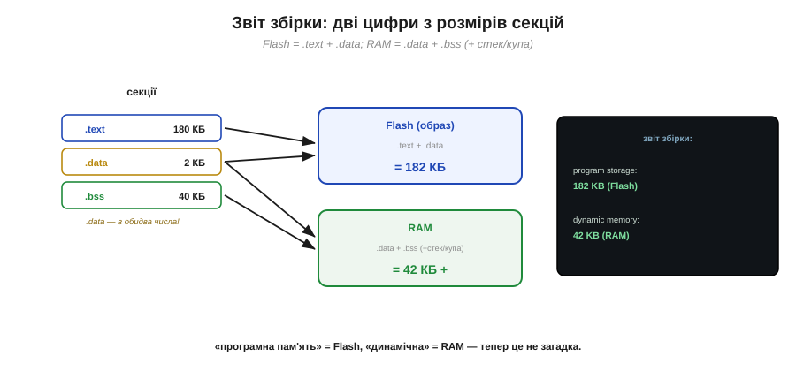
*Рис. 4.2.4.6. Як зі секцій постають два числа звіту. Flash (образ) = `.text` + `.data`; RAM = `.data` + `.bss` (+ запас на стек і купу). Те саме середовище збірки й показує рядком «програмна пам'ять … / динамічна пам'ять …». Тепер ці слова перестають бути загадкою.*

**Приклад (із секцій — у бюджет пам'яті).** Хай збірка дала такі розміри секцій:

```
секції:   .text = 180 КБ   (код)
          .data =   2 КБ   (змінні з ненульовим початком)
          .bss  =  40 КБ   (нульові змінні й буфери)

FLASH (образ) = .text + .data = 180 + 2 = 182 КБ
   (.bss у Flash НЕ зберігаємо — лише її розмір)

RAM (під час роботи) = .data + .bss = 2 + 40 = 42 КБ   (+ стек і купа)

чіп: Flash 4 МБ (= 4096 КБ),  RAM 320 КБ
   Flash:  182 / 4096 ≈ 4.5 %
   RAM:     42 / 320  ≈ 13 %   (+ лишити запас на стек/купу)
```

Упізнаєте? Це той самий **бюджет пам'яті**, що ми прикидали ще в [§4.1.1](../ch20-mcu-esp32/ch20-mcu-esp32.md), — лише тепер ми бачимо, **звідки** беруться ті числа: з розмірів секцій. Образ у Flash — це код плюс початкові значення; витрата RAM — це живі змінні плюс запас на стек і купу. Помітьте ще раз асиметрію: ті самі 2 КБ `.data` зайняли і Flash (як початкові значення), і RAM (як живі змінні) — єдина секція, що рахується **двічі**; а 40 КБ `.bss` коштували **лише** RAM, не додавши до образу й байта.

> 🔧 **Навіщо це.** Тепер рядок звіту «**Sketch uses 182 KB of program storage… 42 KB of dynamic memory**» читається як відкрита книга: «програмна пам'ять» — це Flash (`.text`+`.data`), «динамічна» — RAM (`.data`+`.bss`). Звідси й точні висновки, що́ чим коштує: велика **константна** таблиця (`const`) лягає у `.text`/Flash і RAM **не чіпає**; великий нульовий **буфер** іде в `.bss` і з'їдає **RAM**, не торкаючись образу; а кілька ініціалізованих масивів роздмухують **обидва** числа. Коли наступного разу забракне саме RAM — ви знатимете, що шукати треба `.bss` і `.data`, а не розмір коду.

Варто запам'ятати й одну закономірність із практики: на МК першою закінчується майже завжди **RAM**, а не Flash. Flash зазвичай просторий (мегабайти), а RAM скупа (кілобайти–сотні КБ), та ще й мусить умістити не лише ваші змінні, а й стек із купою, що ростуть під час роботи. Тому за Flash хвилюються рідко, а от за кожен кілобайт RAM — постійно: великі буфери, зайві копії даних, глибока рекурсія з'їдають її швидко. І найпідступніше: брак RAM часто проявляється **не** чесною помилкою при збірці, а **загадковим збоєм уже в роботі** — коли стек, розростаючись, налазить на ваші дані. Тому розуміти, що саме сидить у RAM (`.data` + `.bss` + стек + купа), — не академічна цікавість, а спосіб уникнути найкаверзніших багів.

> ⚙️ **А хто конкретно з'їв пам'ять?** Коли не влазить — точну відповідь дає **map-файл**: звіт лінкера, де видно розмір кожного символу й звідки він. Як його читати, не лякаючись обсягу, — у вставці [Читання map-файлу](ch21-s4-a-map-file.md).

Отже, готова програма оформлюється в образ прошивки, де код і дані розкладено по секціях `.text`/`.data`/`.bss`, а ці секції лягають у Flash і RAM за чіткими правилами — і навіть колись загадковий звіт збірки відтепер читається як відкрита книга. Образ готовий — лишилося **залити** його в чіп. Як саме байти образу потрапляють із вашого ПК у Flash мікроконтролера — по USB чи UART — розбирає [наступна тема §4.2.5](ch21-toolchain.md).

---

## 4.2.5 Прошивка у Flash: як код потрапляє в чіп (по USB/UART)

У нас на руках готовий **образ прошивки** ([§4.2.4](ch21-toolchain.md)) — файл байтів, що має лягти у Flash чипа. Лишилося найбуденніше й водночас найзагадковіше: як ці байти **фізично** перебираються з вашого ПК у мікросхему пам'яті на платі? Ви ж просто тиснете «Upload» — а за мить чіп уже біжить новим кодом. Розкриймо й цей фокус. У ньому три дійові особи: **дріт** (послідовний канал), **режим прошивки** (коли чіп слухає, а не виконує) і — найелегантніше — сам чіп, що **прошиває себе** за вказівками з ПК.

Варто наперед розвіяти один острах новачка: «а раптом заллю щось зламане — і чіп перетвориться на цеглину?» Майже завжди **ні**, і саме завдяки тому, як усе влаштовано: помічник усередині чипа, що приймає прошивку, **незнищенний**, тож новий, виправлений образ можна залити будь-коли. Тримаймо цю заспокійливу думку в голові, поки розбиратимемо механізм.

### Дріт між ПК і чипом: послідовний канал

Спершу — чим узагалі з'єднані ПК і чіп. Образ мандрує **послідовним каналом** (*serial*): по дроту, яким байти біжать **один за одним**, біт за бітом. Класично це **UART** — простий двопровідний інтерфейс (лінія передачі TX і приймання RX), що його ми докладно розберемо аж у Модулі 6; тут досить уявляти його як «дротяну стрічку, що несе байти по черзі». А оскільки сучасний ПК має не UART, а USB, на платі ставлять маленький **перетворювач USB↔UART**, що й зводить ці два світи. (Новіші чипи на кшталт ESP32-S3 чи C3 мають **власний** USB — тоді перетворювач не потрібен, і чіп під'єднується до ПК прямо.)


*Рис. 4.2.5.1. Дорога, якою їде образ. З ПК він виходить по **USB**, на платі **перетворювач USB↔UART** обертає його на простий послідовний потік, і той дротами TX/RX тече у чіп — байт за байтом. У новіших чипів є власний USB, тож перетворювач зайвий. Сам UART — тема Модуля 6; тут він просто «дріт, що несе байти».*

Завважте: цей канал **двосторонній**. Образ тече з ПК у чіп, але чіп **відповідає** назад — підтверджує отримане, звітує про збій; без зворотного слова ПК не знав би, чи дійшло. І ще приємна дрібниця: **той самий** послідовний канал ви потім використовуєте, щоб читати, що чіп друкує в `Serial` під час роботи (знаменитий «монітор порту»). Один і той самий дріт служить і для заливання прошивки, і для розмови з нею — лише в різні моменти. Тому, до речі, монітор порту й заливання не можна тримати ввімкненими водночас: вони б'ються за ту саму лінію, і середовище зазвичай саме закриває монітор на час Upload.

> 🔌 **Сам перетворювач USB↔UART зблизька.** Його піни (TX/RX/GND/DTR/RTS), вибір рівня 3.3/5 В, правило хреста TX↔RX і різні сімейства (CP210x, CH340, FT232) — у вставці [USB-UART адаптер](ch21-s5-c-usb-uart.md).

### Режим прошивки: чіп слухає, а не біжить

Тепер головна заковика. Зазвичай чіп, тільки-но ввімкнувся, **виконує** вашу програму — йому ніколи слухати, що там шле ПК. Щоб його прошити, він має перейти в особливий **режим прошивки** (*flash / download mode*): не бігти, а **завмерти й слухати** послідовну лінію, чекаючи команд «запиши ось це у Flash».

Як його туди загнати? Скиданням (*reset*) із одночасно затиснутою особливою «завантажувальною» ніжкою (на ESP32 це GPIO0, притиснутий до землі — згадаймо «вередливі» strapping-ніжки з [§4.1.5](../ch20-mcu-esp32/ch20-mcu-esp32.md)). Звучить як ручна морока — але насправді **за вас це робить плата**: той самий перетворювач USB↔UART має пару керувальних ліній, якими автоматично смикає скидання й GPIO0 у потрібний момент. Тому ви нічого не тиснете — інструмент із ПК сам перемикає чіп у режим прошивки, заливає й повертає назад.


*Рис. 4.2.5.2. Чіп має два режими. У **звичайному** він після ввімкнення виконує вашу програму. У **режимі прошивки** він натомість **слухає** послідовну лінію, чекаючи команд запису Flash. Перемикає його туди скидання із затиснутою завантажувальною ніжкою (GPIO0) — і робить це автоматично плата, а не ваші руки.*

Як саме плата «сама смикає» скидання й GPIO0? У перетворювача USB↔UART є дві службові лінії (історично названі DTR і RTS), і на платі їх хитро зведено так, щоб у потрібну мить одна притиснула скидання, а друга — GPIO0. Інструмент із ПК лише шарпає ці лінії за домовленою послідовністю — і чіп слухняно падає в режим прошивки, а тоді так само з нього виходить. Щоправда, на деяких дешевих чи саморобних платах цього автомата нема — тоді режим прошивки вмикають **руками**: затискають кнопку **BOOT** (вона тримає GPIO0) і коротко тиснуть **RESET**. Звідси й поширена порада з форумів «притримайте BOOT під час заливання» — це ручна заміна тієї автоматики.

### Хто пише у Flash: завантажувач у ROM

А тепер найхитріше питання: **хто саме** вписує байти у Flash? Адже ПК не дотягується до мікросхеми пам'яті напряму — він лише шле байти по дроту. Отже, щось **усередині** чипа мусить ці байти прийняти й запрограмувати ними Flash. І це «щось» — крихітний **завантажувач у ROM** (*ROM bootloader*): незмінна програмка, **вшита на заводі** в постійну пам'ять чипа (той самий ROM, що ми бачили в [§4.1.5](../ch20-mcu-esp32/ch20-mcu-esp32.md)). У режимі прошивки керування дістає саме він: приймає образ із послідовної лінії й власноруч пише його у Flash.

Ось у чому елегантність: чіп, по суті, **прошиває сам себе**. ПК не «записує в чіп» — він **диктує**, а внутрішній ROM-завантажувач слухняно виконує: «зітри отут», «запиши ці байти», «звітуй». Заводський завантажувач — той надійний помічник, що завжди на місці (його не можна стерти чи зіпсувати прошивкою), тож чіп ніколи не «закам'яніє» остаточно: хай би що ви залили, ROM-завантажувач знову прийме новий образ.

Тут ховається й елегантне розв'язання курячо-яєчної загадки. Подумайте: щоб залити **першу** в житті прошивку в новісінький, порожній чіп, у ньому вже має бути **щось**, що прийме байти, — але ж він порожній! Вихід — саме ROM-завантажувач: він лежить **не у Flash**, а в окремій незмінній пам'яті, вшитій на заводі, тож існує **завжди**, навіть коли Flash абсолютно чистий. Першу прошивку приймає він; усі наступні — теж він. Без цього заводського «зернятка» чіп справді був би мертвим каменем, який нічим оживити, — і саме воно ж є вашою страховкою від «цеглини».

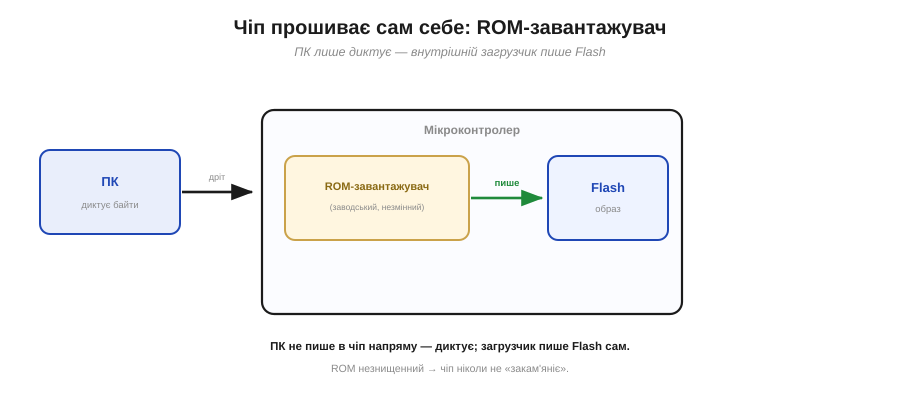
*Рис. 4.2.5.3. Чіп прошиває сам себе. ПК лише **диктує** байти по дроту; усередині чипа їх приймає **ROM-завантажувач** — незмінна заводська програмка — і власноруч пише образ у Flash. Оскільки цей завантажувач у ROM незнищенний, чіп ніколи не «закам'яніє»: новий образ можна залити завжди.*

### Протокол прошивки: стерти, записати, перевірити

ПК і ROM-завантажувач спілкуються за домовленим **протоколом** (для ESP32 інструмент зветься *esptool*). Розмова має три дії:

- **стерти** ділянку Flash. Це не примха: флеш-пам'ять улаштована так, що писати в неї можна лише по **попередньо стертому** місцю — спершу «очистити», тоді «записати», не навпаки;
- **передати образ блоками**: ПК шле байти не суцільним потоком, а порціями, до кожної додаючи **контрольну суму** — щоб ROM-завантажувач упевнився, що блок дійшов без спотворень (дріт неідеальний);
- **перевірити** результат: наприкінці часто звіряють контрольну суму всього записаного — чи лягло у Flash саме те, що слали.

> ⚙️ **Як цей протокол улаштований зсередини.** Кадрування SLIP (байт-роздільник 0xC0), хитрість зі «stub»-прошивачем у RAM заради швидкості й покрокова перевірка запису — у вставці [Як esptool розмовляє з ROM-завантажувачем](ch21-s5-a-flash-protocol.md).

Чому ж флеш узагалі вимагає «спершу стерти»? Бо фізично стирання переводить усі біти комірки в **одиниці**, а запис уміє лише **гасити** окремі біти в нулі — назад в одиницю один біт не повернеш, тільки стерши цілий блок. Звідси й непорушний порядок «очистити → записати». І ще одна важлива риса: кожне стирання потроху **зношує** флеш — комірка витримує десятки-сотні тисяч циклів перезапису, не більше.

> 🔧 **Навіщо це.** Для **розробки** цей знос — нескінченність: хоч прошивай тисячу разів на день роками, ресурсу флеш вистачить. А от у самій **програмі** писати у флеш **щосекунди** (наприклад, безперервно вести там лічильник) — погана ідея: так комірку справді можна «затерти до дірки» за місяці. Тому налаштування, калібрування й лічильники у флеш оновлюють **ощадливо** — лише коли справді змінилися, а не безперервно. Знаючи фізику флеш, ви самі уникнете цієї пастки.


*Рис. 4.2.5.4. Розмова ПК із ROM-завантажувачем. Спершу **стерти** ділянку (флеш пишеться лише по чистому). Тоді **передати образ блоками**, до кожного — контрольна сума (раптом дріт спотворив). Наприкінці — **звірити** записане. Лише так байти надійно опиняються у Flash.*

> 🔧 **Навіщо це.** Дві найчастіші причини, чому «не заливається». Перша: чіп **не зайшов у режим прошивки** — плата не змогла сама смикнути скидання й GPIO0 (тоді інструмент скаржиться, що не «бачить» чипа, і на деяких платах доводиться вручну притримати кнопку BOOT). Друга: ви вказали **не той порт** чи неузгоджену **швидкість** (baud). Знаючи, що заливання — це послідовна розмова в особливому режимі, ви шукатимете причину саме там: режим, порт, швидкість, кабель, — а не в самому коді.

Ще одна деталь пояснює, чому заливання — це часом **кілька** записів, а не один. Образ вашої програми — не єдине, що має лягти у Flash (згадаймо з [§4.2.4](ch21-toolchain.md) про завантажувач і таблицю розділів). Тому інструмент пише у Flash кілька шматків, кожен — за своїм **зсувом** (адресою): маленький завантажувач на початок, таблицю розділів слідом, а вашу програму — далі, на відведене їй місце. Через це у звіті заливання ви й бачите **кілька** рядків «`Writing at 0x…`» з різними адресами: це не один файл, а кілька частин прошивки, що займають свої місця у Flash.

### Весь цикл: натиснув Upload — що сталося

Зведімо всіх трьох дійових осіб в одну послідовність. Ви тиснете «Upload» — і за лаштунками інструмент із ПК робить ось що:


*Рис. 4.2.5.5. Що криється за кнопкою «Upload». (1) Інструмент **скиданням** заганяє чіп у режим прошивки; (2) прокидається **ROM-завантажувач** і слухає лінію; (3) інструмент **стирає** потрібну ділянку Flash; (4) **передає образ блоками** з контрольними сумами, а завантажувач їх **пише**; (5) наприкінці — **звірка**; (6) інструмент ще раз **скидає** чіп — уже у звичайний режим, і той запускає **нову** прошивку. Усе — за кілька секунд, без жодної вашої кнопки.*

Цікаво, що весь цей балет ви бачите лише як скромний рядок поступу в інструменті — крапки чи відсотки, що повзуть до ста. А за ними — і скидання, і перемикання режимів, і стирання, і потік блоків із перевірками. Тому, коли наступного разу спостерігатимете, як повзе «`Writing at 0x… (45 %)`», ви впізнаватимете в ньому кожен крок цього танцю.

Звідки взагалі береться той образ і чому чіп після скидання починає виконувати **саме** вашу програму, а не сидить у завантажувачі, — це вже про **reset-послідовність**, якій присвячено [наступну тему §4.2.6](ch21-toolchain.md). Тут важлива сама картина: «Upload» — це **скидання → слухати → стерти → записати з перевіркою → скинути → бігти**.

### Порахуймо: скільки триває заливання

Чому заливання то швидке, то млосно довге? Бо весь образ їде тонким послідовним дротом, і час залежить від **швидкості** цього дроту — числа в **бодах** (бітах за секунду), яке ви, певно, бачили в налаштуваннях. Прикиньмо.

**Приклад (час передачі образу).** Наш образ із [§4.2.4](ch21-toolchain.md) — **182 КБ**. Заливаємо на швидкості **460800 бод**.

```
образ = 182 КБ = 182 × 1024 ≈ 186 000 байтів

на кожен байт у UART іде ~10 бітів  (8 даних + старт + стоп)
отже пропускна здатність ≈ 460800 / 10 = 46 080 байтів/с

час передачі ≈ 186 000 / 46 080 ≈ 4 секунди

а на 115200 бод (вчетверо повільніше):
   46 080 / 4 ≈ 11 520 байтів/с
   186 000 / 11 520 ≈ 16 секунд
```


*Рис. 4.2.5.6. Час заливання = розмір ÷ швидкість. Той самий образ на 460800 бод летить за ~4 с, а на вчетверо повільнішій 115200 — повзе ~16 с. Тому швидкість і задирають якомога вище; та безмежно її не підняти — завеликий темп дріт уже не тягне.*

Ось чому в налаштуваннях заливання є вибір швидкості, і чому її задирають якомога вище: на 460800 бод прошивка летить за чотири секунди, а на старій 115200 — повзе всі шістнадцять. (Вище безмежно не підняти: завеликий темп дріт уже не тягне — спотворення, і доводиться відступати.) А ще звідси видно, чому **малий розмір образу** — це не лише про економію Flash, а й про швидший цикл «змінив → залив → перевірив»: менше байтів — менше чекати. Звідси й проста звичка доброго ритму розробки: тримати швидкість заливання високою, а образ — компактним; тоді ланцюжок «правка → Upload → перевірка» стискається до кількох секунд, і працювати стає легко, а не нудно-млосно.

Отже, заливання — це послідовна розмова ПК із вшитим у чіп ROM-завантажувачем: чіп переводять у режим прошивки, стирають Flash, передають образ блоками з перевіркою — і чіп, по суті, пише свій Flash сам, а заводський завантажувач у ROM водночас і помічник у цьому, і страховка від «цеглини». Образ уже в пам'яті. Лишилося останнє питання всього шляху: що відбувається в ту мить, коли чіп скидають і він **оживає**, — хто й як передає керування від заводського завантажувача до вашого `setup()`? Це й розбирає [наступна тема §4.2.6](ch21-toolchain.md).

---

## 4.2.6 Завантажувач (bootloader) і reset-послідовність (що виконується до main())

Образ у Flash ([§4.2.5](ch21-toolchain.md)), і ще в [§4.2.4](ch21-toolchain.md) ми мимохідь згадали якийсь «стартовий код, що відпрацьовує до `main()`». Час побачити повну картину тієї дивовижної миті — між **скиданням** і першим рядком вашого `setup()`. Бо, всупереч наївному уявленню, чіп після ввімкнення **не стрибає** одразу у ваш код. Спершу пробігає цілий **ланцюжок** помічників: кожен робить свій крок підготовки й передає естафету далі. Хто вони й навіщо — і є предмет цієї теми. А заодно ми зрозуміємо, **на що можна (і не можна) покладатися** у різні моменти старту.

Це не самі лише цікавинки «під капотом». Розуміючи, хто й коли передає керування, ви впевнено даєте раду цілому класу збоїв, що інакше здаються чорною магією: чому плата «крутиться» в перезапуску, чому щось працює лише з другого ввімкнення, чому до `setup()` нічого не варто чіпати. Тож пройдімо цей ланцюг по ланці.

### Скидання (reset): з чого все починається

Усе починається зі **скидання** (*reset*) — універсального «почати з чистого, відомого стану». Воно стається при ввімкненні живлення (а ще — від кнопки RESET чи особливих подій). У мить скидання ядро **примусово** приводять до відомого стану й змушують почати виконання з однієї наперед визначеної адреси — її звуть **вектором скидання** (*reset vector*). Згадаймо [§4.1.4](../ch20-mcu-esp32/ch20-mcu-esp32.md): тоді ж заводиться й такт. Важливо: чіп у цю мить **не знає** ані вашої програми, ані що йому робити, — він знає лише **одне**: звідки почати. За тією адресою хтось завбачливо поклав першу сходинку.

Скидання, до речі, буває з різних причин, і знати їх корисно. Найзвичніше — **ввімкнення живлення** (*power-on reset*). Але чіп скидається й тоді, коли напруга живлення **просіла** нижче безпечної (*brownout*) — щоб не «з'їхати з глузду» на голодному пайку; коли спрацював **сторожовий таймер**, бо програма зависла (про нього — в розділі про таймери); або коли скидання попросив сам код. Хай яка причина, наслідок один: усе починається **з тієї самої відомої точки**. У цьому й сенс «відомого стану»: байдуже, що було до скидання, — після нього чіп завжди в тому самому, передбачуваному вихідному положенні, звідки можна впевнено стартувати.


*Рис. 4.2.6.1. Скидання — стартовий постріл. При ввімкненні (чи від RESET) ядро примусово стає у відомий стан і починає виконувати код із однієї фіксованої адреси — **вектора скидання**. Чіп не «знає» вашої програми; він знає лише, **звідки почати**. Усе подальше — ланцюжок передавання естафети від цієї точки.*

### Завантажувач: хто вирішує, що запускати

За вектором скидання сидить не ваша програма, а **завантажувач** (*bootloader*) — невелика програма, чия єдина робота: **вирішити, що запускати**, підготувати ґрунт і **передати керування** далі. Це той розпорядник, що зустрічає чіп одразу після пробудження й каже: «так, цього разу запускаємо ось цю програму — ось вона, я її зараз і підготую».

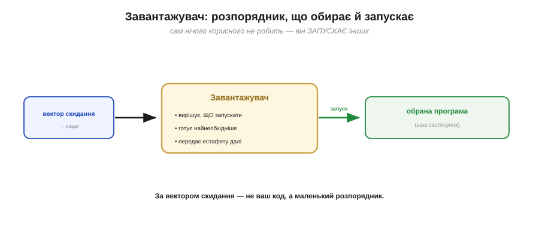
*Рис. 4.2.6.2. Робота завантажувача. За вектором скидання — не ваш код, а маленький **розпорядник**: він вирішує, що цього разу запускати (звичайну прошивку? режим оновлення?), готує найнеобхідніше й **передає естафету** обраній програмі. Сам по собі він нічого корисного не «робить» — він **запускає** інших.*

А навіщо взагалі цей зайвий посередник — чому б ядру після скидання не стрибнути прямо у вашу програму? Бо завантажувач дає дорогоцінну **гнучкість**. Це він вирішує, що цього разу запускати: звичайну прошивку — чи, скажімо, режим **оновлення**, коли треба прийняти й записати новий образ (саме так працює оновлення «по повітрю», що ми згадували в [§4.2.4](ch21-toolchain.md)). Це він може мати **запасний** план, якщо основна прошивка зіпсована, — і відкотитися до робочої версії. Зашити цей вибір намертво у вашу програму було б і незручно, і небезпечно: тоді одна крива прошивка — і чіп уже не оживити. Окремий розпорядник, що стоїть **перед** вашим кодом і завжди надійний, рятує від цього.

> 🔌 **А як завантажувач дізнається, що цього разу — прошивка?** За рівнем піна **IO0** у мить скидання (strapping). Як це влаштовано й як плата вводить чіп у режим завантаження сама — двома транзисторами на DTR/RTS — у вставці [Strapping-піни і схема авто-прошивки](ch21-s6-c-strapping.md).

### Два щаблі завантаження на ESP32

На ESP32 цей розпорядник — насправді **двоступеневий**, і обидва щаблі ми вже почасти знаємо.

- **Перший щабель — ROM-завантажувач** (той самий заводський, із [§4.2.5](ch21-toolchain.md), вшитий у ROM). Прокинувшись, він першим ділом дивиться на завантажувальну ніжку (GPIO0): затиснута — лізти в режим прошивки й слухати ПК; ні — **звичайний запуск**. У звичайному разі він зчитує з Flash наступного помічника.
- **Другий щабель — завантажувач у Flash** (його туди залив тулчейн — згадаймо «кілька шматків» із §4.2.5). Він уже розумніший: читає **таблицю розділів** (де у Flash що лежить), знаходить ваш застосунок, остаточно налаштовує такт (виводить PLL на робочі мегагерци з [§4.1.4](../ch20-mcu-esp32/ch20-mcu-esp32.md)) і **передає керування** вашому образу.


*Рис. 4.2.6.3. Двоступеневе завантаження ESP32. **1-й щабель** — ROM-завантажувач: перевіряє GPIO0 (прошивка чи запуск) і, якщо запуск, дістає з Flash наступного. **2-й щабель** — завантажувач у Flash: читає таблицю розділів, знаходить ваш застосунок, виводить такт на робочу частоту й передає керування образу. Естафету передано — далі вже ваш код.*

Чому ж аж **два** щаблі, а не один? Тому що в них різні чесноти, і потрібні обидва. Перший, **ROM**-завантажувач, незмінний і вшитий на заводі — він **завжди є** й ніколи не псується (його козир, як ми бачили в [§4.2.5](ch21-toolchain.md)), але саме через незмінність він простий і небагато вміє. Другий завантажувач лежить у **Flash** — тож його, навпаки, можна **оновлювати** й робити скільки завгодно розумним: розуміти таблицю розділів, обирати з кількох прошивок, тонко налаштовувати такт і пам'ять. Виходить найкраще з двох світів: незнищенний простак, що завжди підхопить чіп, передає естафету гнучкому розумнику, якого не страшно вдосконалювати.

### C-стартап: підготувати пам'ять перед main()

Та навіть діставши керування, ваш образ ще **не** одразу біжить вашим кодом. Першим у ньому відпрацьовує крихітний **стартовий код мови C** (*C runtime startup*; історично його звуть `crt0`) — той самий, що ми обіцяли в [§4.2.4](ch21-toolchain.md). Він робить службові приготування, без яких змінні були б сміттям:

- **копіює `.data`** з Flash у RAM (початкові значення займають свій «дім»);
- **обнуляє `.bss`** (нульові змінні й буфери);
- ставить **вказівник стека** на місце (готує стек до викликів);
- довершує дрібні апаратні приготування.

І лише **тоді**, коли пам'ять у порядку, він викликає **точку входу** вашої програми.

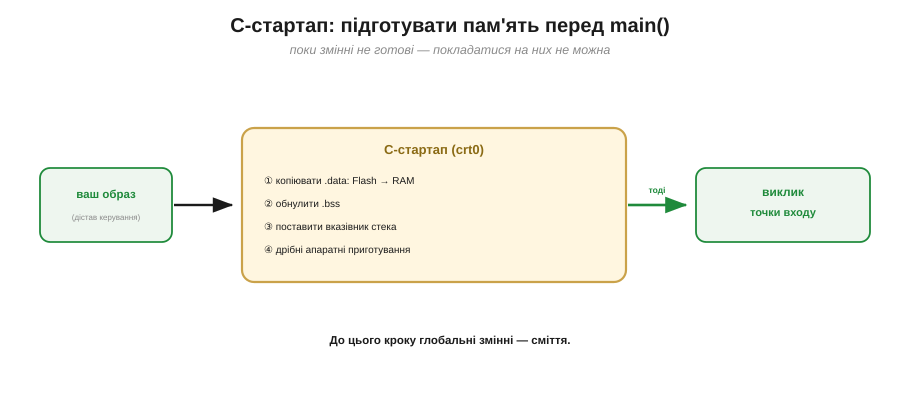
*Рис. 4.2.6.4. Останній помічник перед вашим кодом — стартовий код мови C. Він копіює `.data` з Flash у RAM, обнуляє `.bss`, ставить вказівник стека — і лише коли всі змінні мають правильний початок, **викликає точку входу** програми. Ось чому до цього кроку покладатися на значення глобальних змінних не можна.*

Чому **стек** ставлять одним із найперших? Бо без нього неможливий жоден виклик функції: стек — це місце, де зберігаються адреси повернення й локальні змінні (з [Модуля 3](../../block-3-digital-processor/ch19-memory-stack-heap/ch19-memory-stack-heap.md)). Поки вказівник стека не вказує на справжню вільну RAM, навіть простий виклик підпрограми звалив би машину. Тому стартовий код спершу готує саме його — і лише потім дозволяє собі викликати щось серйозне, зокрема точку входу вашої програми.

### Повна reset-послідовність

Зведімо весь ланцюжок в одну картину — від скидання до вашого `loop()`.

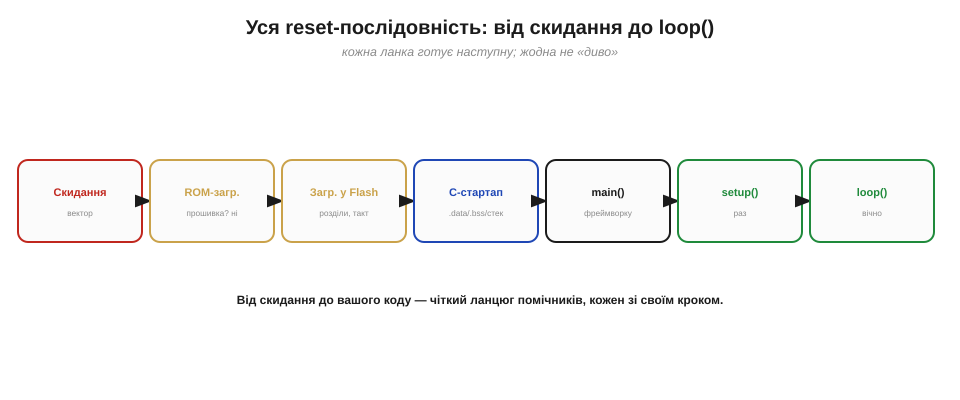
*Рис. 4.2.6.5. Уся reset-послідовність. **Скидання** → вектор скидання → **ROM-завантажувач** (прошивка? ні →) → **завантажувач у Flash** (таблиця розділів, такт, знайти застосунок) → **C-стартап** (`.data`/`.bss`, стек) → **main() фреймворку** → ваш **setup()** (раз) → **loop()** (вічно). Кожна ланка готує наступну; жодна не «диво».*

Озирніться на цей ланцюг — і зникне відчуття «дива». Жодна ланка не творить чуда: одна приводить чіп до відомого стану, друга вирішує, що запускати, третя готує такт і знаходить ваш код, четверта лагодить пам'ять, п'ята загортає все у звичний `setup()`/`loop()`. Розклавши «оживання» чипа на ці прості кроки, ви бачите його **наскрізь** — і тому не губитеся, коли щось іде не так на котромусь із них.

> 🔧 **Навіщо це.** Розуміючи цей ланцюг, ви не лякаєтесь однієї з найнеприємніших картин — **завантажувального циклу** (*boot loop*), коли плата раз за разом перезапускається. Це означає, що десь **на ранньому** кроці (у вашому `setup()` чи навіть раніше) стається збій, чіп скидається — і все починається спочатку, по колу. Знаючи послідовність, ви шукаєте винного від початку: чи не звертаєтесь до периферії, яку ще не ввімкнули; чи не покладаєтесь на щось, не готове на цьому кроці. Найперші рядки після старту мають бути **найнадійнішими** — бо помилка там валить усе ще до того, як ви встигнете щось побачити.

### Де насправді ваші setup() і loop()

І остання, дуже корисна несподіванка. У світі Arduino ви пишете `setup()` і `loop()` — і звикли думати, що це і є початок програми. Насправді **ні**. Справжню точку входу — `main()` — надає сам **фреймворк** (ядро Arduino), і вона від вас прихована. Той `main()` робить трохи власних приготувань, **один раз** кличе ваш `setup()`, а тоді **вічно** в циклі кличе ваш `loop()`. Тобто ваш код сидить **усередині** фреймворкового `main()`, як начинка.

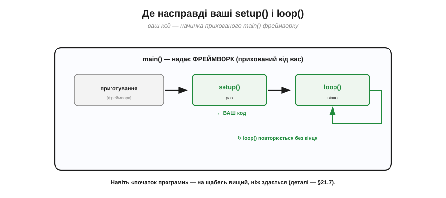
*Рис. 4.2.6.6. Ваш код — начинка чужого `main()`. Фреймворк (ядро Arduino) надає справжню точку входу `main()`: вона робить свої приготування, **раз** кличе ваш `setup()`, а тоді **вічно** крутить ваш `loop()`. Тому навіть «початок програми» — на щабель вищий, ніж здається; що саме й навіщо ховає фреймворк — тема [§4.2.7](ch21-toolchain.md).*

Тут ховається тонкість, важлива для всього, що ви писатимете далі. Ваш `loop()` — це **не** вічний цикл усередині вашої функції; навпаки, фреймворк кличе `loop()` знову й знову, **щоразу заново**. Тобто керування раз у раз **виходить** із вашого `loop()` і повертається до фреймворку (який тим часом устигає зробити свої службові справи — обслужити радіо, скинути сторожовий таймер), а тоді знову заходить. Звідси й залізне правило: ніколи не «зависайте» в `loop()` назавжди — віддавайте керування назад. Цей вічний цикл «зайшов — вийшов» — найпростіша модель виконання, і її переваги та межі ми ще розберемо окремо наприкінці модуля.

### Простежмо готовність крізь старт

Найкорисніше, що дає це знання, — точна відповідь на питання «**що готове, коли?**». Простежмо ланцюг ще раз, дивлячись, що на кожному кроці вже працює, а на що покладатися ще зарано.

**Приклад (що готове на кожному кроці старту).**

```
КРОК                                  такт     RAM/глобальні   периферія   ваш код
──────────────────────────────────────────────────────────────────────────────────
1. скидання (вектор скидання)         RC       сміття          —           ні
2. ROM-завантажувач (1-й щабель)      RC       —               мінімум     ні
3. завантажувач у Flash (PLL, app)    PLL ✓    —               базова      ні
4. C-стартап (.data/.bss, стек)       PLL ✓    готові ✓        —           ні
5. main() фреймворку → setup()        PLL ✓    готові ✓        налаштов.   ТАК ✓
```

Прочитайте таблицю згори вниз — і побачите, як чіп **поступово оживає**. Спершу він тактується від грубого внутрішнього RC, у RAM сміття, периферія мовчить. Аж на третьому кроці такт виходить на повну (PLL). На четвертому нарешті стають правильними глобальні змінні. І лише на п'ятому — коли все готове — керування доходить до **вашого** `setup()`, де вже можна спокійно працювати. Ось чому будь-яка ваша дія належить саме сюди: раніше частина машини ще не прокинулась.

З цієї таблиці випливає й просте правило безпеки: чим **раніше** ви хочете щось зробити, тим менше можете на що покладатися. Дочекайтеся `setup()` — і весь чіп уже до ваших послуг; полізете раніше — ризикуєте звернутись до того, чого ще нема. На щастя, у звичному коді ви й так починаєте з `setup()`, тож ця осторога спрацьовує сама собою, без жодних зусиль із вашого боку.

> 🔧 **Навіщо це.** Чіп не лише скидається з різних причин — він **пам'ятає**, чому скинувся, і вміє про це повідомити (на ESP32 — окремою функцією «причина скидання»). Це безцінно для діагностики: побачили, що плата перезапустилась через **brownout** — лагодьте живлення; через **сторожовий таймер** — шукайте, де програма зависла; просто «power-on» — отже, було чесне вимкнення. Тому, ловлячи примхливі перезапуски, першим ділом питають у самого чипа: а чому ти, власне, скинувся?

Уся ця послідовність триває лічені **мілісекунди**, яких ви ніколи й не помічаєте: натиснули RESET — і за мить уже блимає світлодіод, ніби нічого складного й не сталося. А сталося чимало: чіп привели до тями, обрали й знайшли прошивку, налагодили такт і пам'ять, загорнули ваш код у звичну обгортку. Те, що все це **невидиме й майже миттєве**, — заслуга цілого ланцюга помічників, кожен із яких робить свою справу швидко й мовчки.

Отже, між скиданням і вашим кодом пролягає чіткий ланцюг: вектор скидання → ROM-завантажувач → завантажувач у Flash → C-стартап → `main()` фреймворку → ваш `setup()`. Кожна ланка готує наступну, і жодна не чарівна. Ми згадали тут «фреймворк», що тихо надає `main()` і робить за вас купу приготувань. А чи завжди потрібен цей посередник — і скільки коштує його зручність проти роботи з «голим залізом» напряму? Це й зважує [наступна тема §4.2.7](ch21-toolchain.md).

---

## 4.2.7 «Голе залізо» vs фреймворк (Arduino/IDF): ціна абстракції

У [§4.2.6](ch21-toolchain.md) ми побачили, що за вашими `setup()`/`loop()` тихо стоїть **фреймворк** — він і `main()` надає, і купу приготувань робить за вас. Настав час спитати прямо: а що це за «фреймворк», і скільки коштує його зручність? Бо програмувати мікроконтролер можна **двома** дорогами: або говорити з залізом **напряму**, власноруч длубаючись у регістрах ([§4.1.3](../ch20-mcu-esp32/ch20-mcu-esp32.md)), — це звуть роботою на **«голому залізі»** (*bare metal*); або через **фреймворк** (Arduino, ESP-IDF), що загортає те саме залізо в зручні, людиночитні функції. У кожної дороги — своя ціна, і ця тема вчить її зважувати. Урок тут ширший за електроніку: це універсальний компроміс **абстракції**, з яким ви стикатиметесь у будь-якій інженерії.

Завважте: ми вже мовчки користалися фреймворком увесь час — і `setup()`/`loop()`, і `digitalWrite` з прикладів, — навіть не питаючи, що під ним. Тепер зробімо цей вибір **свідомим**: не «бо всі так роблять», а розуміючи, що саме виграємо й чим платимо.

### Два способи говорити з чипом

Уявімо найпростішу дію — перемкнути ніжку. Її можна написати двома мовами.

**Голим залізом** — звернутися до регістра напряму, як ми вчилися в §4.1.3: `GPIO_OUT |= (1 << 2);`. Ви самі знаходите в даташиті потрібний регістр, самі складаєте маску, самі відповідаєте за все. Це **щира правда** заліза, з повним контролем — але марудна, помилконебезпечна й **прив'язана до конкретного чипа** (на іншому МК регістр зветься інакше).

**Через фреймворк** — покликати готову, дружню функцію: `digitalWrite(2, HIGH);`. Жодних масок і адрес — лише ясний намір «постав на ніжці 2 високий рівень». Регістри сховано; за вас усе зробить бібліотека.

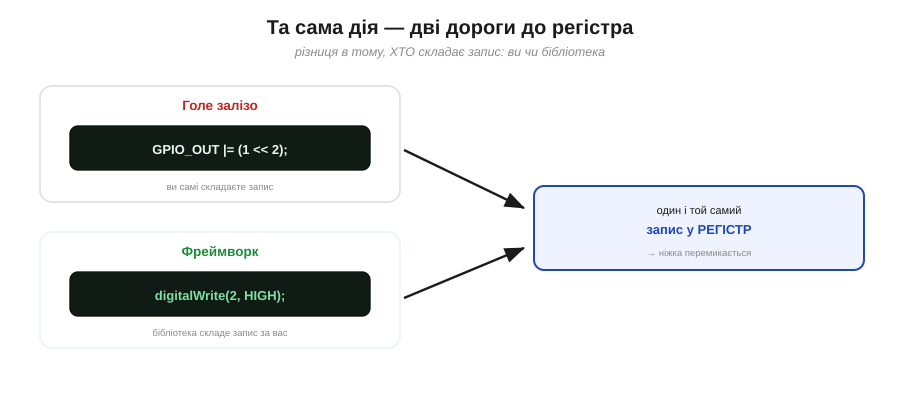
*Рис. 4.2.7.1. Та сама дія — дві дороги. **Голе залізо:** ви пишете в регістр напряму (`GPIO_OUT |= (1<<2)`) — повний контроль, та марудно й під конкретний чіп. **Фреймворк:** ви кличете дружню функцію (`digitalWrite(2, HIGH)`) — ясно й переносно, а регістри сховано. Обидва шляхи зрештою роблять **те саме** — пишуть у регістр; різниця в тому, **хто** складає той запис: ви чи бібліотека.*

### Голе залізо: ближче до правди, далі від зручності

Спинімося на голому залізі окремо, бо в ньому є і велич, і пастка. Велич — у тому, що ви тримаєте **повну** владу: жодного посередника, кожен біт під вашим контролем, код виходить найменшим і найшвидшим, який лише можливий. Це найчесніша розмова з кремнієм. Пастка ж — у **ціні** цієї влади. По-перше, ви мусите **знати залізо**: гортати даташит, вишукувати потрібний регістр, його адресу, призначення кожного біта — на **кожну** дрібну дію. По-друге, такий код **намертво прив'язаний до чипа**: регістри ESP32 — не ті, що в іншого МК, тож перенести програму означає переписати її низ. Те, що фреймворк ховає й уніфікує, на голому залізі лягає **на ваші плечі** — повністю.

### Фреймворк: дружня обгортка над залізом

**Фреймворк** (*framework*) — це шар готового коду, що **обгортає** залізо в зручні функції з людськими іменами. Замість «запиши біт 2 у регістр OUT» ви кажете `digitalWrite`; замість ручної возні з інтерфейсом зв'язку — `Serial.println`. Усередині ж — згадаймо [§4.1.3](../ch20-mcu-esp32/ch20-mcu-esp32.md) — кожна така функція **однаково** робить запис у memory-mapped регістр; фреймворк лише ховає цю чорну роботу від вас і робить її правильно.

Для ESP32 фреймворків переважно два: **Arduino** — простий і дружній до новачка, і **ESP-IDF** — офіційний, повносилий (на базі операційної системи реального часу, про яку — наприкінці модуля). Обидва дають те саме: ви пишете **намір**, а вони перекладають його на регістри.

А дають фреймворки куди більше за самі лише обгортки над ніжками. Це й готовий `main()` зі стартовими приготуваннями (саме той, що ми бачили в [§4.2.6](ch21-toolchain.md)); і зручні помічники часу, зв'язку, пам'яті; і — найцінніше — велетенський **запас готових бібліотек**: драйвери давачів, дисплеїв, мережеві стеки, що їх хтось уже написав і налагодив. Узяти готову бібліотеку давача замість того, щоб самому продиратися крізь його регістри по даташиту, — ось де фреймворк економить **дні** роботи, а не такти. У цьому й головний зиск: ви стаєте **на плечі** тисяч людей, що писали ці шари до вас.

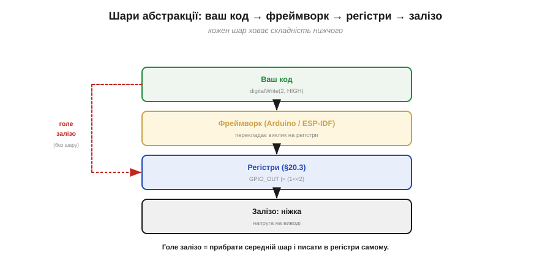
*Рис. 4.2.7.2. Фреймворк — це проміжний шар. Згори — **ваш код** (`digitalWrite`); під ним — **фреймворк** (Arduino чи ESP-IDF), що перекладає виклик на **регістри** (§4.1.3), а ті вже смикають **залізо**. Кожен шар ховає складність нижчого, лишаючи вам простіший інтерфейс. Голе залізо — це коли ви прибираєте середній шар і пишете в регістри самі.*

### Що таке абстракція — і чому в неї є ціна

Те, що робить фреймворк, зветься **абстракцією** (*abstraction*): сховати подробиці за простішим інтерфейсом. Це не примха електроніки, а **скрізь однаковий** закон. Педаль газу в авто — абстракція над двигуном: ви тиснете «їхати швидше», не думаючи про впорскування пального й оберти; зручно — та ви й не дотягнетесь до тонкощів, схованих за педаллю. Сама мова C, якою ви пишете, — абстракція над асемблером (згадаймо [§4.2.1](ch21-toolchain.md)); асемблер — над числами. Кожен поверх ховає нижчий, даючи простіший важіль ціною віддалі від деталей.

І ось головна думка теми: **будь-яка** абстракція щось **дає** і щось **бере**.

Дає вона багато: **читабельність** (`digitalWrite(2, HIGH)` зрозуміє кожен, а `GPIO_OUT |= (1<<2)` — лише втаємничений), **швидкість розробки** (не треба гортати даташит на кожну дію), **переносність** (той самий код працює на різних чипах — бібліотека сама підставить правильні регістри) і **менше помилок** (типову возню за вас уже налагодили інші).

Та й бере вона свою плату: **накладні витрати** (виклик функції з перевірками довший за один прямий запис), трохи **більший розмір**, **менше контролю** (обгортка може просто не давати доступу до якоїсь тонкої можливості заліза) і — найтонше — **віддаль від правди**: між вами й тим, що насправді коїться в кремнії, тепер стоїть шар, і коли щось іде не так, копати доводиться **крізь** нього.

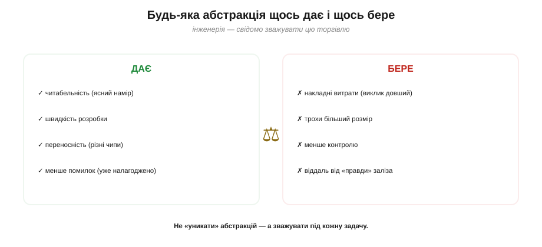
*Рис. 4.2.7.3. Ваги абстракції. На одній шальці — те, що фреймворк **дає**: читабельність, швидкість розробки, переносність, менше помилок. На другій — чим за це **платиш**: накладні витрати, більший розмір, менше контролю, віддаль від «правди» заліза. Інженерія — це не «уникати» абстракцій, а свідомо зважувати цю торгівлю під кожну задачу.*

### Коли що: фреймворк за замовчуванням, голе залізо за потребою

Як же обирати? Практична позиція проста: **за замовчуванням — фреймворк**. У переважній більшості випадків його зиски (швидкість, надійність, переносність) набагато переважують дрібну плату, а ваш час і нерви дорожчі за кілька зекономлених тактів. Писати все на голому залізі «бо так правильніше» — те саме марнотратство, що й перебір потужності з [§4.1.6](../ch20-mcu-esp32/ch20-mcu-esp32.md): робота на рівному місці.

До **голого заліза** спускаються лише там, де воно **справді потрібно**: коли треба видавити **максимальну швидкість** (гарячий цикл, де важить кожен такт); коли потрібен **тонкий контроль**, якого обгортка не дає; коли борешся за **кожен байт** розміру; або коли хочеш **зрозуміти/відлагодити**, що насправді робить залізо. І найкраще — що це не «або-або»: можна **змішувати**, пишучи майже все фреймворком, а в одному гарячому місці зійти до регістрів.


*Рис. 4.2.7.4. Розумна стратегія. **За замовчуванням — фреймворк:** швидко, надійно, переносно — для 99 % коду. **Голе залізо (регістри) — точково:** де треба гранична швидкість, тонкий контроль, мінімальний розмір чи глибоке розуміння. І це не «або-або»: здебільшого фреймворк, а в гарячих місцях — прямий доступ до регістрів.*

Парадокс, який варто прийняти: ознака **майстерності** — не в тому, щоб усе писати на голому залізі (це радше ознака новачка, що плутає «складніше» з «краще»), а в тому, щоб **не** робити цього без потреби. Зрілий інженер тягнеться до регістрів неохоче й точково — бо знає справжню ціну свого часу й вартість заплутаного коду, який потім комусь супроводжувати. Сила абстракції саме в тому, щоб **не думати** про нижчий рівень, поки він тебе не змусив.

### Arduino vs ESP-IDF: дві обгортки

Самі фреймворки теж лягають на шкалу — від найтоншого й найдружнішого до повносилого й офіційного.

**Arduino** — найтонша, найприязніша обгортка: мінімум зайвого, готові `setup()`/`loop()`, гори прикладів і бібліотек (відлуння історії ESP з §4.1.5). Ідеальний для навчання й швидких прототипів. Платить за простоту певною «стелею»: не до всіх тонкощів заліза дотягнешся, і подеколи він повільніший.

**ESP-IDF** — офіційний фреймворк Espressif: повний доступ до всіх можливостей чипа, побудований на операційній системі реального часу (FreeRTOS). Потужніший і гнучкіший — але й крутіший на вхід. Цікаво, що ці два не вороги: ядро Arduino для ESP32 збудоване **поверх** ESP-IDF, тож Arduino можна використовувати навіть як складову частину IDF-проєкту.

Як обирати між ними? За тим самим правилом «мірка від задачі» з [§4.1.6](../ch20-mcu-esp32/ch20-mcu-esp32.md). Учитеся, прототипуєте, робите типову річ — беріть **Arduino**: швидко, дружньо, прикладів безліч. Будуєте серйозний продукт, де потрібні всі можливості чипа, тонке керування задачами й пам'яттю, — **ESP-IDF**. А найзріліший шлях часто такий: почати на Arduino (швидко довести ідею), а як проєкт виросте — перейти на IDF, не викидаючи напрацьованого, бо Arduino там лишається доступним як складова.

> 📜 **Звідки взявся сам Arduino.** Його дружні `setup()`/`loop()` — спадок платформи **Wiring**, що її 2003 року створив студент Ернандо Барраґан; і ця історія повчальна не лише технічно, а й тим, як гучний наступник «стирає» тихішого попередника. [Arduino, Wiring і стерта глава Барраґана](ch21-s7-history-arduino.md).

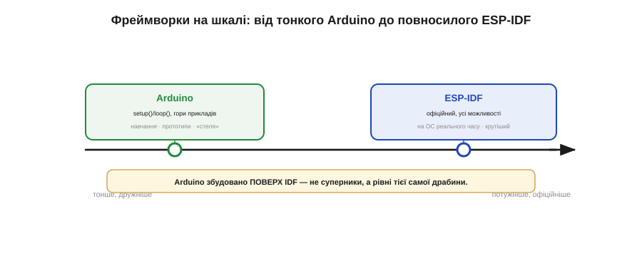
*Рис. 4.2.7.5. Фреймворки теж на шкалі. **Arduino** — найтонший і найдружніший (навчання, прототипи; проста, та з «стелею»). **ESP-IDF** — офіційний, повносилий (усі можливості, на базі ОС реального часу; потужніше, та крутіше на вхід). Причому Arduino збудовано **поверх** IDF — тож це не суперники, а різні рівні тієї самої драбини. Який брати — за тим самим правилом «мірка від задачі» (§4.1.6).*

> 🔧 **Навіщо це.** Дві поради на щодня. Перша: **починайте з фреймворку** (для навчання — з Arduino) і не соромтеся цього — професіонали роблять так само, бо цінують свій час. Друга, тонша: навіть користуючись фреймворком, **знати регістри корисно** — бо коли `digitalWrite` поводиться не так, як ви чекали, ви заглядаєте «під обгортку» (а ми знаємо з §4.1.3, що там — звичайний запис у регістр) і бачите правду. Абстракція звільняє від рутини, але **розуміння** того, що під нею, лишає вас господарем ситуації, а не заручником магії.

### Порахуймо: та сама дія двома способами

Дамо «ціні абстракції» конкретні числа — на тій самій дії «перемкнути ніжку».

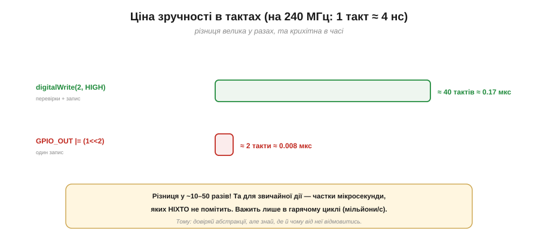
*Рис. 4.2.7.6. Ціна зручності в тактах. `digitalWrite(2, HIGH)` усередині робить перевірки (чи дійсний пін, який порт, яка маска) — тож коштує **десятки тактів**. Прямий `GPIO_OUT |= (1<<2)` — це **один-три** такти. Різниця в десятки разів! Та на 240 МГц навіть «десятки тактів» — це частки мікросекунди, тож для звичайних дій її **не видно** — вона важить лише в дуже гарячих циклах.*

**Приклад (ціна виклику).** Порівняймо два способи перемкнути ніжку:

```
через фреймворк:   digitalWrite(2, HIGH);
   усередині — перевірки (чи дійсний пін, який порт, яка маска),
   тоді запис у регістр.            ≈ десятки тактів

голим залізом:     GPIO_OUT |= (1 << 2);
   один запис у регістр.            ≈ 1–3 такти

різниця:  у ~10–50 разів швидше прямий запис

АЛЕ порахуймо в часі (на 240 МГц один такт ≈ 4 нс):
   digitalWrite ≈ 40 тактів ≈ 0.17 мкс
   регістр      ≈  2 такти  ≈ 0.008 мкс
   для звичайної дії (блимнути раз на секунду) — РІЗНИЦІ НЕ ВИДНО.
   Вона важить лише в гарячому циклі на мільйони перемикань/с.
```

Ось вона, ціна абстракції — і водночас її розумна оцінка. Так, прямий запис у регістр у десятки разів швидший. Та для **звичайного** коду ця перевага — мізерні частки мікросекунди, яких **ніхто не помітить**; платити за них втратою читабельності й переносності — нерозумно. І лише в **рідкісному** гарячому циклі, де ніжку смикають мільйони разів на секунду, ці такти раптом стають важливими — і **там** ви свідомо сходите до регістрів. Саме так зріло й користуються абстракцією: **довіряти їй за замовчуванням, але знати, де й чому від неї відмовитись**.

І ще одне, що приходить із досвідом: **передчасна** оптимізація — кидатися на голе залізо «про всяк випадок, раптом буде повільно» — частіше шкодить, ніж помагає. Спершу напишіть ясно, фреймворком; тоді **виміряйте**, чи справді щось гальмує; і лише як виявиться вузьке місце — зійдіть до регістрів **саме там**. Оптимізувати наосліп те, чого ніхто не міряв, — марнувати і свій час, і читабельність заради тактів, яких ніхто не помітить.

Отже, фреймворк — це дружня обгортка над регістрами: він дарує читабельність, швидкість і переносність ціною дрібних накладних витрат і віддалі від заліза; беруть його за замовчуванням, а до голого заліза сходять точково, де треба, — і це не компроміс із совістю, а **зріле володіння** інструментом, що вміє і ховати складність, і відкривати її на вимогу. Ми вже не раз згадували, що буває, коли «щось іде не так»: помилки компіляції, undefined reference, boot loop. Лишилося останнє вміння тулчейну — **знаходити** причину, коли прошивка вже в чипі, а поводиться не так. Інструменти цього полювання — Serial, JTAG/SWD — розбирає [остання тема розділу §4.2.8](ch21-toolchain.md).

---

## 4.2.8 Відлагодження: Serial, JTAG/SWD (інструменти)

Увесь цей розділ ми будували шлях від тексту до прошивки, що оживляє чіп. Та сподіватися на «залив — і запрацювало» наївно: код **раз у раз** поводиться не так, як задумано. Мистецтво знаходити **чому** зветься **відлагодженням** (*debugging*) — тим самим словом, що його подарував нам метелик у реле з [історії розділу](ch21-history-grace-hopper.md). На «великому» комп'ютері це звична справа; а ось на мікроконтролері відлагодження має свою прикрість, і долають її двома головними інструментами: **Serial** (друкувати «хлібні крихти») і **апаратним налагоджувачем** (JTAG/SWD), що зазирає всередину живого чипа.

Це вміння — не «додаток» до програмування, а **половина** ремесла: писати код ви будете годинами, а **шукати**, чому він не працює, — часом і довше. Тож опанувати інструменти полювання на баги так само важливо, як навчитися писати сам код. Почнімо з того, чому на МК воно складніше, ніж на ПК.

### Чому відлагодження на МК особливе

У чому ж прикрість? На комп'ютері програма виконується **на тій самій машині**, де ви сидите: можна поставити її на паузу, зазирнути в будь-яку змінну, пройти код по рядку. А програма мікроконтролера біжить на **окремому, запечатаному** чипі — і ви не бачите, що в нього всередині. Якщо вона зависла чи впала, чіп просто... мовчить або перезапускається, не кажучи й слова. Тож головна задача — здобути **спосіб спостерігати**, що коїться в тій сліпій коробці.

Найпримітивніший «налагоджувач» ви, до речі, вже знаєте — це **світлодіод**. Коли більше нічого нема, навіть одна ніжка з діодом каже багато: блимнув — отже, дійшов сюди; засвітився рівно — отже, завис ось на цьому; зморгнув N разів — отже, помилка номер N. Грубо, але часом це єдине, що лишається, коли й Serial недоступний (наприклад, у найперші миті старту з [§4.2.6](ch21-toolchain.md)). А загалом усі інструменти відлагодження роблять одне: **проривають** ту непрозорість запечатаного чипа, даючи бодай вузеньке вікно в його нутро. Що ширше вікно — то потужніший (і складніший) інструмент.


*Рис. 4.2.8.1. Чому на МК сліпо. **На ПК** програма біжить на вашій же машині — її легко спинити, зазирнути в змінні, пройти по кроках. **На МК** код виконується на окремому запечатаному чипі: зсередини його не видно, а впавши, він мовчить. Тому й потрібні особливі інструменти, щоб **зазирнути** в живий чіп.*

### Serial: друкувати «хлібні крихти»

Найпростіший і найуживаніший інструмент ви вже мимохідь знаєте. Це **Serial**: розкидати по коду `Serial.println(...)`, що друкують значення й повідомлення в той самий послідовний дріт (той, що для заливання, з [§4.2.5](ch21-toolchain.md)), а тоді читати їх на ПК у **моніторі порту**. Класичне «відлагодження друком»: лишаєш у коді хлібні крихти й дивишся, **доки** чіп ними йде і **де** збивається.

Його сила — у простоті: жодного зайвого заліза, працює завжди й усюди, опанувати — мить. Слабкості теж очевидні: друк **уповільнює** й змінює час (а часом саме час і є причиною бага); ви бачите **лише те, що здогадалися надрукувати**; не можна спинити чіп і роздивитися довільний стан. І все ж — **дев'ять із десяти** багів на МК ловлять саме монітором Serial, бо для більшості випадків цього досить.

Дві практичні дрібниці. По-перше, Serial треба **завести** — `Serial.begin(115200)` — і та сама швидкість (baud) має стояти в моніторі; інакше замість тексту посиплеться абракадабра (класична пастка новачка — згадаймо узгодження швидкості з §4.2.5). По-друге, тонша й підступніша: оскільки друк **забирає час**, він може **змінити поведінку** бага — додав `println`, і баг, чутливий до часу, зник; прибрав — повернувся. Такий «баг, що тікає від спостереження», навіть має ім'я — **гейзенбаг** (за принципом невизначеності). У таких випадках Serial безсилий, і починається царина апаратного налагоджувача. І не забувайте **прибирати** зайві крихти з готового коду: вони і час крадуть, і пам'ять.


*Рис. 4.2.8.2. Відлагодження друком. У код вставляють `Serial.println(...)`, що шлють значення й маркери тим самим дротом у **монітор порту** на ПК. Просто, без зайвого заліза, працює всюди — та сповільнює, змінює час і показує лише те, що ви здогадались надрукувати. Попри це, більшість багів на МК ловлять саме так.*

### Що друкувати: значення, маркери, помилки

Друкувати наосліп — марно; Serial працює, коли є **гіпотеза**. Три найкорисніші види крихт:

- **значення** — надрукувати змінну, щоб перевірити припущення («я думаю, тут `x` дорівнює 5» → друкуєш і дивишся, чи справді);
- **маркери проходження** — рядки «дійшов сюди», «вийшов звідти», щоб простежити, **куди** тече виконання й де спиняється (особливо цінно, коли чіп «зависає» — останній надрукований маркер указує місце);
- **повідомлення про помилки** — друк у тих гілках, які «не мали б трапитись».


*Рис. 4.2.8.3. Три види «крихт». **Значення** — перевірити припущення про дані. **Маркери** («дійшов сюди») — простежити потік і знайти, де чіп спинився (останній маркер = місце зависання). **Помилки** — у гілках, що «не мали б статись». Спершу гіпотеза — тоді крихта, що її перевіряє.*

Є й потужний спосіб **швидко** звузити коло крихтами — **поділ навпіл** (*bisection*). Замість сипати `println` усюди, ставлять **один** маркер десь посередині підозрілого шляху: дійшло до нього — отже, баг **далі**; не дійшло — отже, **раніше**. Тоді ділять навпіл уже ту половину — і так за кілька кроків заганяють причину в один-два рядки. Це той самий двійковий пошук: кожна крихта **вдвічі** зменшує область пошуку, тож навіть величезну програму «промацують» лічені рази, а не сотні.

Корисно й не **перебирати** з друком: суцільна стіна повідомлень ховає важливе незгірш за їхню відсутність. Тому досвідчені лишають у коді кілька **рівнів** балакучості (помилки — завжди, дрібні подробиці — лише коли ввімкнеш), щоб у спокійні часи монітор мовчав, а в годину пошуку — розповідав усе.

> ⚙️ **Друк, що виріс у систему.** Як перетворити розрізнені `println` на справжній лог — із рівнями, мітками часу й **кільцевим буфером**, що зберігає «останні слова» пристрою перед аварією, — у вставці [Логування як інженерна система](ch21-s8-a-logging.md).

> 🔧 **Навіщо це.** Тут оживає головна мораль метелика з історії розділу: шукай **доказ**, а не здогад. Відлагодження — це не «вдивлятися в код, доки осяє», а **наукова** робота: сформулюй гіпотезу про причину → постав крихту, що її **перевірить** → подивись на факт → звузь коло. Так найзаплутаніший баг розкладається на низку простих «так/ні», і ви методично заганяєте його в кут, замість безпорадно міняти рядки навмання.

### Апаратний налагоджувач: JTAG/SWD

Коли Serial безсилий — баг чутливий до часу, чіп падає **ще до** першого друку, треба роздивитися глибокий стан — беруть важчу артилерію: **апаратний налагоджувач**. Це окремий «зонд», під'єднаний до спеціальних **відлагоджувальних ніжок** чипа (інтерфейс **JTAG**, або його дводротова рідня **SWD** на ARM-чипах). Через нього можна те, чого Serial не вміє: **спинити** чіп на ходу (*halt*), пройти код **по рядку** (*step*), зазирнути в **будь-яку** змінну чи регістр, поставити **точку зупину** (*breakpoint* — спинитись, дійшовши до рядка) чи **сторожок на дані** (*watchpoint* — спинитись, коли змінна змінилась). Зонд дотягується **всередину** живого чипа — і робить його прозорим, як на ПК.

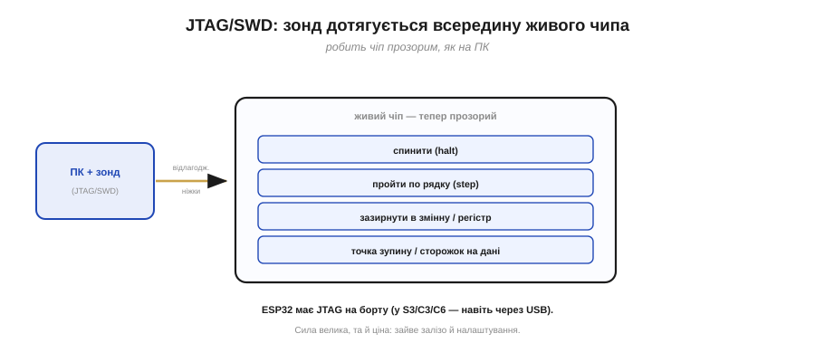
*Рис. 4.2.8.4. Апаратний налагоджувач. Зонд під'єднано до відлагоджувальних ніжок (JTAG / SWD), і через них видно нутро живого чипа: можна **спинити**, пройти **по кроку**, зазирнути в **будь-яку** змінну й регістр, поставити **точки зупину** й **сторожки** на дані. Те, що на ПК буденне, тут робить цей зонд — ціною зайвого заліза й налаштування.*

На практиці зв'язок із зондом дають через знайомий **налагоджувач** (для багатьох — це GDB): ставиш точку зупину на потрібний рядок, запускаєш — і програма спиняється рівно там, а ти роздивляєшся змінні, як на ПК. ESP32, до речі, має JTAG **на борту** (а в S3/C3/C6 його виведено навіть через USB — тож часом окремий зонд і не потрібен), і це робить таку розкіш доступною без дорогого окремого пристрою — варто лиш раз налаштувати. Сила тут велика, та й ціна є: трохи більше мороки з налаштуванням, тож тягнуться до нього **не щодня**.

> 🔌 **Сам зонд зблизька.** Які бувають зонди (J-Link, ST-Link, ESP-Prog, CMSIS-DAP), чим JTAG відрізняється від SWD по пінах і як це під'єднати — у вставці [Відлагоджувальні зонди](ch21-s8-c-debug-probes.md).

### Serial vs JTAG: коли що

Звідси й проста стратегія, що римується з [§4.2.7](ch21-toolchain.md). **Serial — за замовчуванням**: швидко, без заліза, і для більшості багів (перевірити значення, простежити потік) його цілком досить. **JTAG/SWD — для важких**: коли чіп падає до першого друку, коли баг тікає від друку, коли треба роздивитися все нутро. Більшість розробників живуть на Serial і тягнуться до JTAG зрідка — і це нормально. Зрештою, обидва інструменти служать одній меті — **зробити невидиме видимим**; різниться лише, наскільки глибоке вікно в чіп вам цього разу потрібне.

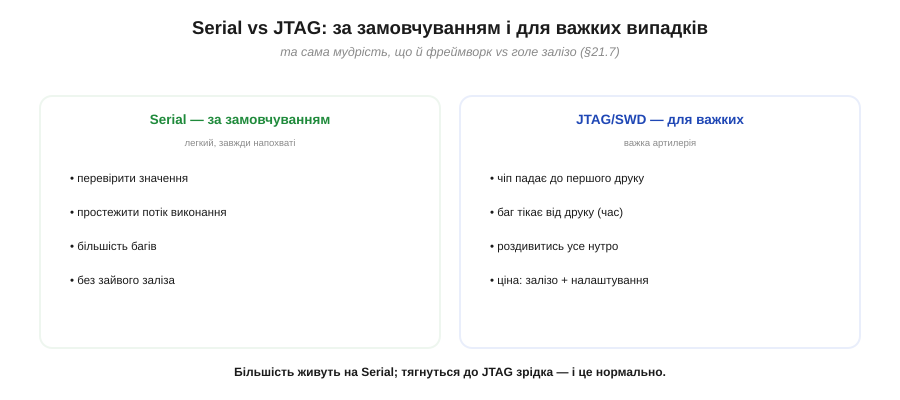
*Рис. 4.2.8.5. Дві снасті — різні випадки. **Serial** — легка й завжди напохваті: значення, маркери, більшість багів. **JTAG/SWD** — важка артилерія: спинити, пройти по кроку, зазирнути будь-куди — для аварій, тонкого часу й глибокого стану. Беруть Serial за замовчуванням, JTAG — коли він справді потрібен.*

> 🔧 **Навіщо це.** Практична звичка: **Serial — завжди перший**. Заведіть `Serial.begin` у `setup()` ще до того, як знадобиться щось ловити, — нехай він буде напохваті. Дев'ять із десяти загадок розкриваються кількома вчасними `println`, і лише десята жене вас по зонд. Не починайте з важкої артилерії там, де вистачить кількох хлібних крихт, — це той самий принцип «простіше за замовчуванням», що й із фреймворком у §4.2.7.

### Розшифруймо аварію

Окрема порода багів — **аварії** (*crash*), коли чіп не просто рахує не те, а валиться зовсім. Найчастіші їхні причини на МК варто знати в обличчя: звернення за **порожнім чи зіпсованим покажчиком** (як у прикладі нижче); **переповнення стека**, коли рекурсія чи величезні локальні змінні з'їли всю відведену йому RAM (згадаймо [§4.2.4](ch21-toolchain.md) — стек і дані налазять одне на одне); спроба чіпати **периферію, якої ще не ввімкнули** (привіт із [§4.2.6](ch21-toolchain.md)). Добре, що чіп при аварії не мовчить, а друкує підказку, — лишається її прочитати.

І наостанок — найкрасивіше, що зв'язує докупи **весь** розділ. Коли програма на ESP32 падає, чіп друкує «паніку» з **трасуванням** (*backtrace*) — і ось де знадобиться все, що ми вивчили.

**Приклад (адреси аварії → ваш рядок коду).** Чіп упав і надрукував у монітор:

```
Guru Meditation Error: Core 0 panic'ed (LoadProhibited)
Backtrace:  0x400d1a3c  0x400d1b08  0x400d2f50  …
```

Ці числа — **адреси** машинних команд (пам'ятаєте їх із [§4.2.3](ch21-toolchain.md) і [§4.2.4](ch21-toolchain.md)?), де стався збій. Самі по собі вони незрозумілі. Та тулчейн уміє **зворотне** перетворення: інструмент `addr2line` бере ваш `.elf`-файл (повний образ із §4.2.3) — і обертає адресу назад на **рядок вашого коду**:

```
addr2line  +  ваш .elf:
   0x400d1a3c   →   sensor.cpp : 42    (читання з порожнього покажчика)
```

Адреса перетворилася назад на ваш `sensor.cpp`, рядок 42. Замкнулося **коло** всього розділу: компілятор і лінкер перетворили ваш текст на адреси (§4.2.1–4.2.4), а тепер, ловлячи аварію, ви тим самим тулчейном вертаєте адресу назад у текст. (Сучасні середовища роблять це автоматично, друкуючи в аварії одразу назви ваших файлів і рядків.)

Гарнішої симетрії годі й уявити: усе, що ми вивчали, наосліп будуючи шлях «туди», тепер служить нам, коли йдемо «назад» — від голої адреси аварії до рядка, що її спричинив. Зрозумівши тулчейн, ви не лише вмієте **зібрати** прошивку — ви вмієте **прочитати** її аварії й допитати її в роботі. Оце й означає по-справжньому володіти інструментом, а не побожно тиснути «Upload» і сподіватися на краще.


*Рис. 4.2.8.6. Аварія розшифрована тим самим тулчейном. Чіп друкує **паніку** з адресами (backtrace). Інструмент `addr2line` + ваш `.elf` обертають кожну адресу назад на **файл і рядок** вашого коду. Це краса всього розділу в одній картинці: текст став адресами на шляху «туди» — і адреси стають текстом на шляху «назад».*

## 4.2.9 Тестування прошивки: юніт-тести на хості, симуляція периферії, тест на залізі

Усе, що ми будували в цьому розділі, врешті дає одне — робочу прошивку в чипі. Та «робоча» ще не означає «правильна». А перевіряти прошивку особливо **важко** й водночас особливо **конче**, і обидві причини серйозні. Важко — бо код живе не на вашому екрані, а в крихті, що смикає реальні ніжки, давачі й мотори; його не спиниш у довільному місці, не підглянеш легко, а рідкісний збій годі відтворити. Конче — бо ціна помилки в полі висока: пристрій уже в руках користувача чи замурований у стіні, виправлення туди просто так не доставиш, а в керуванні реальним світом баг інколи означає не зіпсований піксель, а зламаний механізм чи небезпеку (історію Therac-25, де помилки коду вбивали людей, ми ще згадаємо в §4.5).

Наївний підхід — «заливаю й дивлюся» — на маленькій іграшці працює, але швидко впирається в стіну: він повільний, ручний і **не вміє** ганяти важкі випадки (а що, як давач поверне −40 замість 25? а що, як живлення на мить просяде, як у §4.1.8?). Тому професійна прошивка перевіряється **шарами** — і ця тема про те, які вони й навіщо.

Придивімося, **чим саме** прошивка опирається перевірці, — бо звідси й випливе ліки. По-перше, вона **недетермінована** в дрібницях: те саме натискання чи вимір щоразу лягає в трохи інший момент відносно перерувань і таймерів, тож баг то спливає, то ховається. По-друге, ви не можете **спинити реальний світ**: давач не почекає, поки роздивитесь стан, а мотор не «відмотає» назад. По-третє, потрібного **заліза може ще й не бути** — прошивку часто починають писати раніше, ніж приїде плата. Кожна з цих перепон і підкаже свій шар захисту.

### Піраміда тестів: багато швидких, мало повільних

Уявімо всі тести прошивки складеними в **піраміду** (Рис. 4.2.9.1). Унизу, широкою основою, — багато **дешевих і швидких** тестів, що бігають на вашому ПК за секунди. Вище — менше тестів із **підробленим** залізом. На самій вершині — жменя **повільних** тестів на справжньому чипі. Що нижче — то дешевше, швидше й легше автоматизувати; що вище — то реалістичніше, але дорожче й повільніше.


*Рис. 4.2.9.1. Піраміда тестів. Основа — багато дешевих хост-тестів логіки (секунди, на ПК); середина — тести з підробленим залізом (моки); вершина — нечисленні повільні тести на справжньому чипі. Висновок: масу перевірок роби внизу, нагору винось лише те, що інакше не перевірити.*

Може виникнути спокуса спростити й перевіряти все **або лише** на залізі (бо «реально»), **або лише** на хості (бо «швидко»). Обидві крайнощі програють. Тільки на залізі — повільно, важко автоматизувати, а головне, не виманиш рідкісних випадків: спробуй змусь живлення просісти саме о потрібній секунді. Тільки на хості — швидко, та сліпо до самої **фізики**: тайминг, електрика, реальні примхи чипа лишаться неперевіреними. Тому й будують **піраміду**, а не стовп: кожен шар бере на себе те, що йому до снаги, і передає решту наступному.

Чому така форма? Бо більшість багів — у **логіці**, а логіку не треба ганяти на чипі. Розгляньмо шари знизу вгору.

### Шар 1 — юніт-тести на хості: логіка без чипа

Найбільший виграш дає проста ідея: **відділити логіку від заліза** (Рис. 4.2.9.2). У будь-якій прошивці є код, що насправді **нічого не знає** про конкретний чіп: скінченний автомат, обчислення, розбір вхідних даних, ухвалення рішень. Це чиста логіка — і її можна **скомпілювати й запустити прямо на ПК**, без жодного мікроконтролера. Згадайте розбір причини reset із §4.1.8: «якщо причина BROWNOUT і їх три поспіль — у безпечний режим» — це ж чисте рішення над числами, його легко перевірити, не вмикаючи чип.

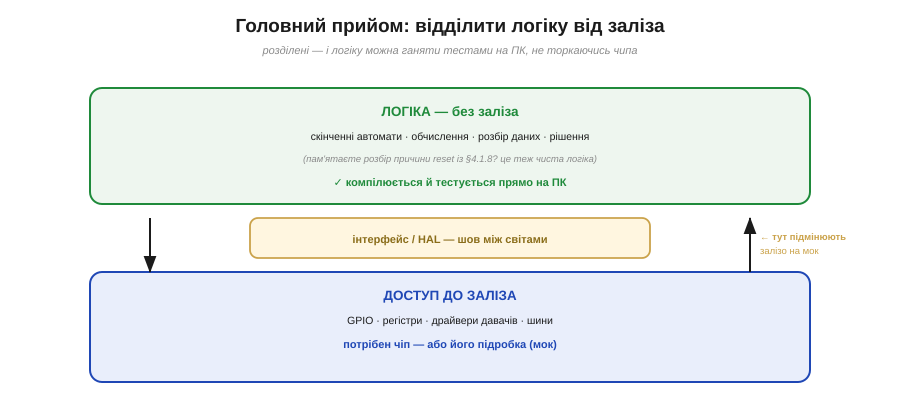
*Рис. 4.2.9.2. Головний прийом — провести межу між чистою логікою (автомати, обчислення, рішення) і доступом до заліза. Над межею код тестується прямо на ПК; на самій межі (шов, HAL) залізо можна підмінити моком. Висновок: розділення дає і тестовність, і чистішу архітектуру.*

Виграш тут не лише в тому, що не треба заліза, а й у **швидкості зворотного зв'язку** (Рис. 4.2.9.3). Цикл «залити й молитися» довгий: правка → компіляція → заливання → запуск на чипі → вдивляння в лог → здогад. Хвилини на кожну дрібницю. А юніт-тест на хості замикає те саме коло за **секунди**: правка → компіляція під ПК → запуск тестів → одразу зелено чи червоно, ще й автоматично. Коли перевірка коштує секунди, ви ганяєте її після кожної зміни — і ловите помилку в мить, коли її зробили, а не за тиждень у полі.


*Рис. 4.2.9.3. Дві петлі. Ліворуч «залити й молитися» — правка→компіляція→Flash→чип→лог→здогад, хвилини на дрібницю. Праворуч хост-тест — правка→компіляція під ПК→тести→зелено/червоно за секунди й автоматично. Висновок: швидкий зворотний зв'язок ловить помилку в мить, коли її зробили.*

> 🔧 **Навіщо це.** Розділивши логіку й залізо, ви дістаєте дві речі задарма: код стає **тестовним** на ПК і водночас **чистішим** — бо чітка межа «де логіка, а де доступ до заліза» сама собою впорядковує програму. Це не зайва дисципліна заради тестів, а просто гарна архітектура, у якої тестовність — приємний наслідок.

**Приклад (тест рішення без чипа).** Хай функція вирішує, вмикати помпу чи ні: вмикати, лише якщо бак не порожній **і** немає аварії. Це чиста логіка — перевірмо її на ПК, перебравши випадки, зокрема прикрі:

```
// логіка — нічого про залізо не знає:
bool pump_on(int level, bool alarm) {
    return level > 0 && !alarm;
}

// тест на хості — звичайна програма на ПК:
assert( pump_on(50, false) == true  );   // бак повний, тривоги нема → так
assert( pump_on( 0, false) == false );   // бак порожній → ні
assert( pump_on(50, true ) == false );   // аварія → ні попри повний бак
assert( pump_on( 0, true ) == false );   // обидві біди → точно ні
```

Жодного чипа, жодного давача — а ми вже впевнені, що ядро рішення поводиться правильно в усіх чотирьох кутах. Саме сюди, в основу піраміди, лягає **левова частка** тестів.

Що саме варто витягати в таку тестовну логіку? Майже все, що **думає**, а не **смикає ніжки**: розбір кадру протоколу, перевірку контрольної суми, перерахунок сирого виміру в градуси за калібруванням, скінченний автомат режимів пристрою, рішення «коли вмикати». Усе це — функції від входів до виходів, яким байдуже, звідки прийшли числа: зі справжнього давача чи з рядка в тесті. Витягнувши їх із-під заліза, ви дістаєте найцінніше — змогу **завалити** їх десятками граничних випадків за секунди й переконатися, що жоден кут не забутий.

А щоб логіку взагалі можна було відірвати від заліза, у місці їхнього стику лишають **шов** — інтерфейс, через який логіка просить «дай вимір» чи «увімкни вихід», не знаючи, хто за ним стоїть. У справжній прошивці за швом справжній драйвер, у тесті — підробка. Цей прийом «підставити залежність ззовні» (його звуть **упровадженням залежностей**, *dependency injection*) і робить логіку по-справжньому самостійною та перевірною.

Є й окрема, дуже практична сила хост-тестів — **захист від повернення** багів. Знайшли помилку? Перш ніж лагодити, напишіть на неї тест, який зараз **червоний**; полагодили — він зеленіє й лишається в наборі назавжди. Відтоді той самий баг не прослизне вдруге: будь-яка майбутня зміна, що його воскресить, одразу засвітить червоним. Так набір тестів поступово стає **пам'яттю** про всі граблі, на які ви вже наступали.

Самі тести теж мають форму, що склалася не випадково. Хороший тест читається в три такти: **підготуй** вихідні дані (стан, входи), **виконай** перевірювану дію один раз і **звір** результат з очікуваним. Цей лад («дано — коли — тоді») робить тест зрозумілим з першого погляду й таким, що сам документує **намір**: дивлячись на нього, наступний інженер — чи ви за півроку — одразу бачить, що код мусить робити в цьому випадку. Тест — ще й найчесніша документація, бо вона **не вміє брехати**: щойно опис розійшовся з кодом, тест червоніє.

### Шар 2 — симуляція периферії: підробити залізо

Та не вся прошивка — чиста логіка; багато коду таки **торкається заліза**: читає давач, смикає шину, чекає на відповідь. Як перевірити його, не маючи (чи не бажаючи мати) справжній давач під рукою — ще й у дивних умовах? Відповідь: **підмінити** залізо підробкою — **моком** (*mock*) (Рис. 4.2.9.4).

Тут і стає в пригоді той самий **шов** між логікою та залізом (Рис. 4.2.9.2). Код під тестом звертається не до конкретного давача, а до **інтерфейсу**; у реальному пристрої за тим інтерфейсом — справжнє залізо, а в тесті — **мок**, що повертає **сценарні** відповіді. І код не бачить різниці. Мок можна навчити повертати що завгодно: нормальні 25 °C, тоді 0, тоді −999 як ознаку помилки, тоді взагалі «таймаут».

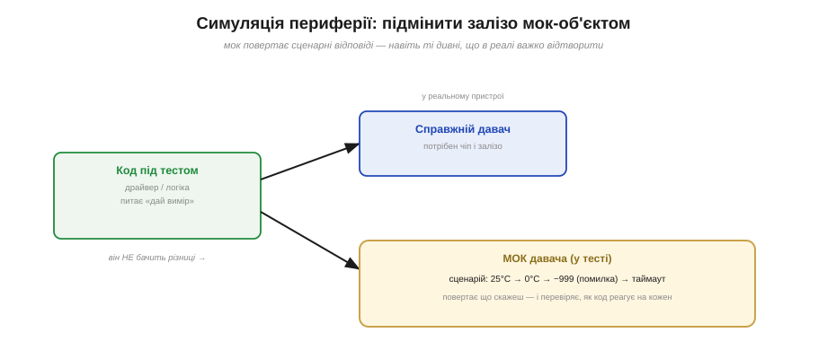
*Рис. 4.2.9.4. Симуляція периферії. Код під тестом звертається до інтерфейсу; у реальному пристрої за ним справжній давач, а в тесті — мок зі сценарними відповідями (25 °C → 0 → помилка → таймаут). Код не бачить різниці. Висновок: дивні випадки не чекають у полі — їх наказують мокові в тесті.*

Це і є відповідь на питання «а що, як давач поверне дурню»: ви не чекаєте, поки він поверне її в полі, — ви **наказуєте** мокові повернути її в тесті й дивитеся, чи код вистоїть. Так перевіряють саме **реакцію** коду на відмови, яких у реальному житті не виманиш на замовлення.

Мок корисний не лише тим, що **повертає** сценарні відповіді, — він ще й **запам'ятовує**, як його кликали. Часто головне питання до драйвера не «що він прочитав», а «що він **зробив**»: чи надіслав давачеві правильну команду, чи в правильному **порядку**, чи не забув кроку ініціалізації. Мок дає це перевірити: після виклику коду тест питає мок — «тебе попросили саме цю послідовність?» — і ловить помилку в протоколі, якої з самого результату не видно.

Особливо цінно, що моком легко пройти **шляхи помилок** — найгірше перевірені в будь-якій програмі. Що робить код, коли давач не відповів? коли шина дала збій? коли значення поза діапазоном? У житті ці випадки рідкісні й примхливі; мок відтворює їх **на замовлення** — і код, що їх обробляє, нарешті дістає свою перевірку, а не лишається написаним «про всяк випадок» і ні разу не випробуваним.

### Шар 3 — тест на залізі: бо дещо видно лише там

Хост-тести й моки ловлять майже все — крім того, що за своєю природою живе **тільки на залізі**. Реальний тайминг, гонки між перериваннями, просідання живлення (той самий brownout із §4.1.8), електричні примхи, дрібні відмінності справжньої периферії від її опису — цього мок не вигадає. Тому на вершині піраміди — тести на **справжньому чипі** (Рис. 4.2.9.5).

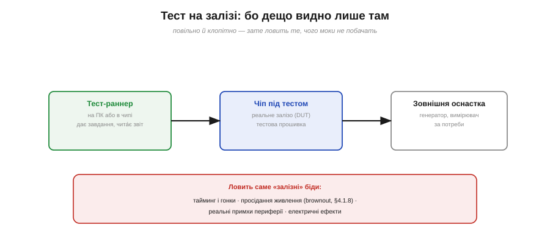
*Рис. 4.2.9.5. Тест на залізі (hardware-in-the-loop): тест-раннер роздає завдання справжньому чипу під тестом, за потреби — із зовнішньою оснасткою. Повільно й небагато — зате ловить тайминг, brownout, електрику й реальні примхи периферії, яких мок не вигадає.*

Це підхід «**апаратний-у-петлі**» (*hardware-in-the-loop*): справжній чіп під тестом (DUT), якому **тест-раннер** (на ПК чи в самому чипі) роздає завдання й читає звіти, а за потреби — ще й зовнішня оснастка: генератор сигналів, вимірювач. Такі тести повільні й гірше автоматизуються, тому їх **небагато** — лише на те, чого інакше не перевірити. Зате саме вони ловлять «залізні» біди, перед якими хост безсилий.

На практиці залізні тести тримають короткими й влучними. Найпростіший і найцінніший із них — **димовий** (*smoke test*): залив свіжу збірку, чіп стартував, блимнув, відповів по порту — отже, найгрубіше не зламано. Складніші перевіряють конкретні залізні вузли. Платять за це **крихкістю** й клопотом: апаратні тести легше «мерехтять» (то проходять, то ні — через тайминг, контакти, температуру), потребують стенда й живої плати. Саме тому їх і тримають **нагорі** піраміди — небагато й лише на те, що справді живе тільки в залізі.

### Що який шар ловить

Звідки впевненість, що потрібні **всі три** шари, а не один? Бо кожен бачить свій клас багів і **сліпий** до чужого (Рис. 4.2.9.6). Помилку в **логіці** — кривий автомат, хибне обчислення, поганий розбір даних — найдешевше зловить **хост**. Помилку в **драйвері чи протоколі** — неправильну послідовність, кепську реакцію на відмову — зловлять **моки**. А помилку **тамингу чи електрики** — гонку, brownout, реальну примху периферії — покаже лише **залізо**.


*Рис. 4.2.9.6. Кожен шар бачить свій клас багів: логіку ловить хост, драйвер/протокол — моки, тайминг/електрику — залізо. Висновок: один шар сліпий до двох третин бід, тому потрібні всі три.*

### Автоматизація: тести на кожну зміну

Сила хост-тестів розкривається повністю, коли їх **не треба згадувати запускати**. Налаштований раз, набір тестів сам біжить на кожну зміну коду — локально перед комітом і на сервері після нього (це й називають *continuous integration*, безперервна інтеграція). Зламав щось безневинною правкою — дізнаєшся **за хвилини**, а не за тижні в полі. Саме автоматичність перетворює тести з разової формальності на постійну сітку безпеки.

Корисно й бачити, **скільки** коду тести насправді торкаються (*покриття*, *coverage*) — не як самоціль (сто відсотків нічого не гарантують), а як підказку, які гілки логіки лишилися геть неперевіреними. А разом регресійні тести, автозапуск і покриття складаються в дисципліну, що коштує дешево, а береже дорого: більшість багів гине ще на вашому ПК, не доживши ні до чипа, ні тим паче до користувача.

### З чого почати на практиці

Якщо з усієї теми винести одну дію — то ось вона: **відокремте логіку від заліза**. Це найперший і найважливіший крок, бо саме він робить можливим усе решта — основу піраміди, найдешевші й найчисленніші тести. Далі — пишіть хост-тести на цю логіку (їх багато й вони швидкі), мокуйте шви там, де код таки торкається заліза, і тримайте **жменьку** димових тестів на справжньому чипі для того, що живе лише там.

І не лякайтеся масштабу: тестувати **все** з першого дня не треба. Почніть із найкаверзнішого — тієї логіки, де найлегше помилитися й найдорожче проґавити: розрахунку, від якого залежить безпека, автомата з десятком станів, розбору даних ззовні. Кілька тестів на найгостріший кут уже окуповуються, а далі сітка розростається сама — щоразу, коли ви виправляєте баг, додаєте регресійний тест чи витягаєте нову логіку з-під заліза. Тестовність — це не стан «усе або нічого», а звичка, що накопичується: сьогодні прикрили рішення про помпу, завтра — розбір протоколу, і примарних багів у полі стає дедалі менше.

Це не академічна розкіш, а ощадливість: година, вкладена в розділення й хост-тести, повертається днями, не витраченими на лови примарних багів у полі. Прошивці, яку легко тестувати, легко й **довіряти** — а довіра до власного коду й відрізняє інженера, що спить спокійно, від того, хто щоразу затамовує подих на «Upload». І це природне завершення всього розділу: ми навчилися **збирати** прошивку й **читати** її аварії — а тепер ще й **доводити**, що вона робить те, що мусить, не чекаючи, поки залізо скаже останнє слово.

---

На цьому **Розділ 4.2 завершено** — а з ним розвіяно й усю «магію» між вашим кодом і ожилим чипом. Ми пройшли повний шлях: від ідеї Гоппер, що машина може перекладати сама ([історія](ch21-history-grace-hopper.md)), через **компіляцію** ([§4.2.1](ch21-toolchain.md)) та її стадії — препроцесор, компілятор, асемблер ([§4.2.2](ch21-toolchain.md)) і **лінкер** ([§4.2.3](ch21-toolchain.md)); через **образ** із секціями `.text/.data/.bss` ([§4.2.4](ch21-toolchain.md)), його **заливання** у Flash ([§4.2.5](ch21-toolchain.md)) і **reset-послідовність** до `main()` ([§4.2.6](ch21-toolchain.md)); зважили **фреймворк проти голого заліза** ([§4.2.7](ch21-toolchain.md)), навчилися **ловити баги** ([§4.2.8](ch21-toolchain.md)) і, нарешті, **тестувати прошивку** ще до того, як баги дістануться поля (ця тема). Тепер за кнопкою «Upload» для вас немає таємниць — лише зрозумілий конвеєр інструментів.

І це не дрібне знання: розуміючи весь шлях від тексту до ожилого чипа, ви перестаєте бути заручником випадку — ви бачите, **де** що може зламатися, і знаєте, **яким** інструментом це полагодити. Така прозорість і відрізняє того, хто впевнено робить вбудовані системи, від того, хто наосліп тицяє кнопки в надії, що «якось запрацює».

А далі ми спустимося від тулчейну знову до **заліза** — і візьмемося за найперший і найпростіший спосіб чипа торкатися світу, який досі брали як належне: **цифрову ніжку**. Що насправді коїться всередині GPIO — на рівні транзисторів, рівнів і струмів — розкриє наступний розділ.

> ▶️ Далі: [Розділ 4.4 — GPIO глибоко](../ch22-gpio/ch22-gpio.md)
