# Розділ 4.4 — GPIO глибоко

Цифрова ніжка (*GPIO* — *general-purpose input/output*) — найперший і найпростіший спосіб, яким мікроконтролер торкається світу: засвітити світлодіод, прочитати кнопку, смикнути реле. Ми вже не раз нею користалися — `digitalWrite`, біти в регістрі OUT із [§4.1.3](../ch20-mcu-esp32/ch20-mcu-esp32.md), — та щоразу сприймали ніжку як просту «вмикачку»: поставив 1 — високо, 0 — низько. Цей розділ **відкриває** ніжку до самого дна: що вона таке на рівні **транзисторів, напруг і струмів**. Бо за невинним `digitalWrite(2, HIGH)` ховається маленька, але справжня електронна схема, і не знати її — означає рано чи пізно спалити ніжку, здивуватися «плаваючому» входу чи дрижанню кнопки.

Будуємо від першопричин: спершу **як ніжка-вихід фізично жене лінію** (двотактний каскад, ця тема); далі — [інший тип виходу](ch22-gpio.md) (open-drain), [пороги входу](ch22-gpio.md), [плаваючий пін і підтяжки](ch22-gpio.md), [дребезг кнопки](ch22-gpio.md), [межі струму й захист](ch22-gpio.md), [швидкий доступ через регістри](ch22-gpio.md) і нарешті [як під'єднати справжній давач](ch22-gpio.md). Усе, що знадобиться, ми вже маємо: **транзистор** (MOSFET із Модуля 2), **напругу й струм** (Модуль 1), **логічні рівні** (Модуль 3) і **регістри** (§4.1.3).

Чому це варто знати, якщо `digitalWrite` і так працює? Бо ніжка — це місце, де ваш код **фізично торкається** зовнішнього світу, з усіма його напругами, струмами й несподіванками. Більшість «загадкових» бід новачка — спалена ніжка, вхід, що «сам стрибає», кнопка, що рахується двічі, — живуть саме тут, на стику коду й заліза. Розуміючи ніжку до транзистора, ви їх просто не наживаєте.

---

## 4.4.1 Ніжка на рівні заліза: вихід push-pull (два транзистори)

Почнімо з найпростішого, що вміє ніжка, — бути **виходом**: видавати високий чи низький рівень. Здавалося б, що там складного — «з'єднав із плюсом або з мінусом». Та саме в тому, **як** це з'єднання робиться, і ховається вся суть: маленька пара транзисторів, яку звуть **двотактним** (*push-pull*) каскадом. Розберімо її — і ви назавжди зрозумієте, чому ніжка може напряму засвітити світлодіод, що означає «сильний нуль і сильна одиниця» і чому не можна виставити високий та низький рівень водночас.

### Що означає «вихід» на рівні заліза

Передусім: вихід не просто **повідомляє** число — він мусить **тримати** на лінії реальну напругу, активно її **живлячи**. Поставити «високий рівень» — це фізично **з'єднати** ніжку з шиною живлення (*VDD*, у нас зазвичай 3.3 В), щоб на ній була ця напруга; «низький» — з'єднати з землею (*GND*, 0 В). А оскільки до ніжки може бути щось під'єднане (світлодіод, вхід іншої мікросхеми), вона мусить ще й **давати або приймати струм**, аби втримати рівень. Згадаймо [Модуль 3](../../block-3-digital-processor/ch14-logic-levels/ch14-logic-levels.md): «1» — це діапазон напруг біля VDD, «0» — біля нуля; а щоб напруга **була**, потрібне джерело й шлях для струму (Модуль 1). Отже, вихід — це маленький **перемикач**, що приєднує ніжку то до VDD, то до GND.


*Рис. 4.4.1.1. Що означає «вихід». Ніжка-вихід не «показує» число, а **фізично приєднує** лінію або до **VDD** (тоді на ній високий рівень), або до **GND** (низький), активно живлячи напругу й проводячи струм. Це маленький перемикач на два положення — і питання лише в тому, **чим** його зробити.*

Це й відрізняє вихід від входу (про який — далі): вхід лише **слухає** напругу, яку хтось інший тримає, майже не споживаючи струму; вихід же **сам** її задає й тримає, готовий гнати чи приймати струм. Тому, коли ніжку роблять виходом, її не «питають» — їй **наказують**, а вона силою заліза втілює наказ у реальну напругу на дроті.

### Push-pull: два транзистори

Цим перемикачем служить пара **транзисторів** — польових (MOSFET), які ми розбирали в [Модулі 2](../../block-2-components-analog/ch12-mosfet/ch12-mosfet.md). Їх ставлять **одне над одним** між VDD і GND, а ніжку виводять із **середини**, між ними:

- **верхній** транзистор (P-канальний) працює **підтяжкою вгору**: коли він відкритий, ніжка приєднана до **VDD** → високий рівень;
- **нижній** транзистор (N-канальний) працює **підтяжкою вниз**: коли відкритий він, ніжка приєднана до **GND** → низький рівень.

У будь-яку мить відкритий **рівно один** із них — вони працюють **навперемінно** (звідси й «двотактний»). Це пряма рідня **CMOS-пари** з [§2.7.9](../../block-2-components-analog/ch12-mosfet/ch12-mosfet.md): та сама ідея «верхній P + нижній N», лише тепер вона жене не логічний вентиль, а зовнішню ніжку.

Чому саме MOSFET? Бо це майже ідеальний **електронний ключ** (згадаймо [§2.7.5](../../block-2-components-analog/ch12-mosfet/ch12-mosfet.md)): у відкритому стані його опір **дуже малий** (частки ома), тож він приєднує ніжку до шини майже без втрат і падіння напруги — звідси й «сильний» рівень. А керується він **полем** на затворі, тобто майже не споживає струму на саме керування. Два таких ключі, поставлені «стовпчиком» — один до VDD, другий до GND, — і дають довершений двопозиційний перемикач для ніжки: дешево, швидко, надійно. Власне, на цій парі стоїть уся цифрова техніка.

Звідки ж назва? «**Push-pull**» — «штовхай-тягни»: верхній транзистор, відкрившись, **штовхає** (push) струм із VDD назовні в ніжку, а нижній — **тягне** (pull) лінію вниз, до землі, приймаючи струм. По-нашому це «**двотактний**»: два транзистори, що працюють у два «такти» навперемінно, мов два поршні. Образ простий і точний — пара м'язів, що тягне ніжку то вгору, то вниз, і ніколи разом.

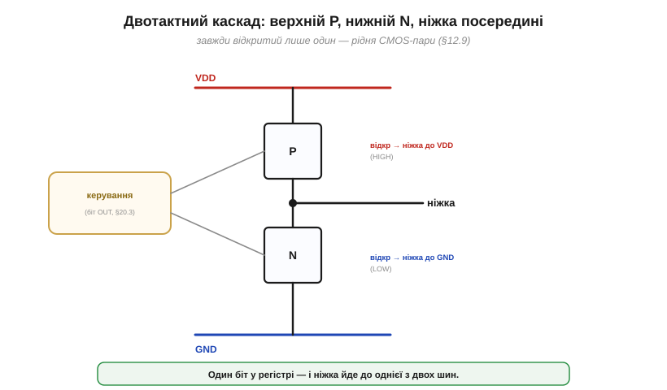
*Рис. 4.4.1.2. Серце виходу — **двотактний каскад**. Між VDD і GND — два транзистори; ніжка виходить із середини. **Верхній (P)** відкривається, щоб приєднати ніжку до VDD (HIGH); **нижній (N)** — щоб приєднати до GND (LOW). Завжди відкритий лише один. Це той самий CMOS-дует із §2.7.9, поставлений керувати ніжкою.*

### Хто керує: біт OUT обирає транзистор

А хто ж вирішує, котрий транзистор відкрити? Той самий **біт у регістрі OUT**, що ми писали в [§4.1.3](../ch20-mcu-esp32/ch20-mcu-esp32.md)! Коли ви робите `digitalWrite(2, HIGH)` (а під ним — `OUT |= (1<<2)`), цей біт через внутрішню логіку **відкриває верхній** транзистор і **закриває нижній**; запишете 0 — навпаки. Ось де змикаються дві половини курсу: абстрактний «біт у регістрі» з Розділу 4.1 фізично **смикає затвор** реального транзистора, і ніжка йде вгору чи вниз.


*Рис. 4.4.1.3. Місток від коду до заліза. Біт у регістрі **OUT** (той, що ви пишете `digitalWrite`/маскою з §4.1.3) через внутрішню логіку керує **затворами** обох транзисторів — і то завжди **навперемінно**: 1 → відкрити верхній (HIGH), 0 → відкрити нижній (LOW). Запис у регістр **фізично** перемикає, до якої шини приєднано ніжку.*

> 🔧 **Навіщо це.** Ось чому варто було морочитися з регістрами в §4.1.3: тепер видно, що `digitalWrite` — не «команда лампочці», а буквально **поворот затвора** транзистора всередині ніжки. Це знання рятує, коли ніжка поводиться дивно: ви розумієте, що між вашим бітом і дротом стоїть реальна електроніка зі своїми правилами — силою, межами, забороненими станами, — а не безтілесний «логічний рівень».

### HIGH і LOW: сильний нуль і сильна одиниця

Тепер — головна чеснота двотактного каскаду. Розгляньмо обидва стани.

**Високий рівень (HIGH):** відкрито верхній (P) транзистор, нижній закрито. Ніжка міцно приєднана до VDD — і не лише має напругу 3.3 В, а й може **віддавати струм назовні** (англійською — *source*, «джерело»): проштовхувати струм у те, що підключено до ніжки, наприклад світити світлодіодом на землю.

**Низький рівень (LOW):** відкрито нижній (N) транзистор, верхній закрито. Ніжка міцно сидить на GND — і може **приймати струм** із зовні (*sink*, «стік»): пропускати крізь себе струм у землю.

Закарбуймо ці два англійські слова, бо вони — у кожному даташиті. **Source** (буквально «джерело») — коли ніжка у HIGH **віддає** струм, тобто є його джерелом для навантаження. **Sink** («стік») — коли ніжка у LOW **приймає** струм, є його стоком у землю. Те, що двотактний вихід уміє **і те, й те**, причому сильно, — і є його перевага: він однаково певно тягне лінію вгору й вниз, тож швидко перемикає й легко розгойдує вхід наступної мікросхеми, не «провисаючи» в жодному стані.

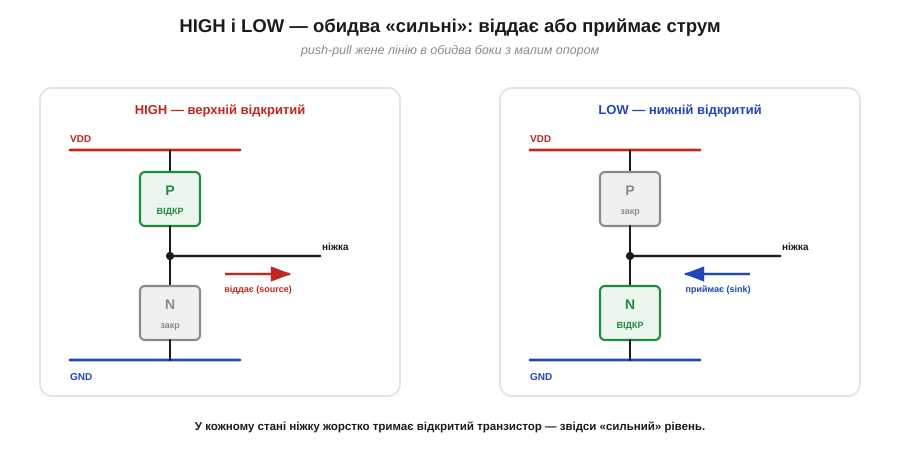
*Рис. 4.4.1.4. Два стани — і обидва **сильні**. **HIGH:** верхній транзистор приєднав ніжку до VDD; вона тримає 3.3 В і **віддає** струм (source) у навантаження. **LOW:** нижній приєднав ніжку до GND; вона тримає 0 В і **приймає** струм (sink). Завдяки тому, що в кожному стані ніжку жорстко тримає відкритий транзистор, обидва рівні «сильні» — низький опір і туди, і сюди.*

Ось у чому сила «push-pull»: він жене лінію **в обидва боки** — і вгору («push», штовхає), і вниз («pull», тягне), — причому **сильно**, з малим опором. Тому такий вихід швидкий і здатний живити реальне навантаження сам, без зовнішніх помічників. Це **типовий** вихід ніжки за замовчуванням. (Бувають і інші, «слабші» стилі виходу — лише з нижнім транзистором, або з підтяжкою-резистором; але це вже [наступні теми §4.4.2 і §4.4.4](ch22-gpio.md), а тут нам важлива саме сила двотактного.)

Щоб оцінити цю силу, уявімо вихід лише з **одним** транзистором — скажімо, тільки нижнім. Він уміє певно тягнути ніжку **вниз** (LOW), а от угору (HIGH) — ні: відкритого шляху до VDD нема, і лінія сама «спливе» хіба що через слабкий резистор-підтяжку. Виходить рівень **несиметричний**: сильний нуль, квола одиниця. Інколи це саме те, що треба (побачимо в §4.4.2), та як **універсальний** вихід двотактна пара тим і гарна, що **обидва** боки в неї однаково міцні.

### Заборонений стан: обидва ввімкнені (shoot-through)

Чому ж так наголошуємо, що відкритий **лише один** транзистор? Бо протилежне — катастрофа. Якби **обидва** відкрилися водночас, вони з'єднали б **VDD напряму з GND** крізь себе — коротке замикання живлення! Крізь пару ринув би величезний наскрізний струм (*shoot-through*), що марнує енергію, гріє чіп, а в гіршому разі й псує транзистори.

Саме тому керування зроблено **навперемінним** за побудовою: внутрішня логіка фізично не дає обом бути відкритими разом (а при перемиканні лишає крихітну «мертву паузу», коли закриті **обидва**, щоб вони не перетнулися). Тому й немає сенсу в питанні «а як виставити високий і низький водночас» — це не «обидва рівні», а коротке замикання, якого схема свідомо уникає.

Ця «мертва пауза» має й цікавий наслідок. В усталеному стані (постійно HIGH чи постійно LOW) двотактна пара майже не споживає — один транзистор закритий, наскрізного шляху нема. Але в **момент перемикання** обидва на коротку мить частково відкриті, і крізь них прослизає крихітний імпульс струму. Тому що **частіше** ніжка перемикається, то більше вона споживає — це і є динамічне споживання CMOS, той самий зв'язок «потужність зростає з частотою» з [§4.1.4](../ch20-mcu-esp32/ch20-mcu-esp32.md). На звичайних швидкостях — дрібниця, а на дуже швидких сигналах — уже відчутна стаття.


*Рис. 4.4.1.5. Чому завжди лише один. Якби відкрилися **обидва** транзистори, вони з'єднали б VDD із GND навпрост — **коротке замикання** живлення, крізь яке б'є руйнівний наскрізний струм (shoot-through). Тому керування навперемінне за будовою, а при перемиканні є крихітна «мертва пауза», коли закриті обидва. «Виставити HIGH і LOW разом» — не стан, а заборонене КЗ.*

> 🔧 **Навіщо це.** Двотактний вихід — причина, чому ніжка може **сама** засвітити світлодіод чи розгойдати вхід іншої мікросхеми: вона і дає струм (HIGH), і приймає (LOW), сильно тримаючи рівень. Запам'ятайте зв'язок: ваш запис у регістр OUT обирає, **котрий із двох транзисторів** відкрити, а отже — до якої шини приєднати ніжку. А ще пам'ятайте про межу: «сильно» не означає «безмежно» — скільки струму ніжка витримає, перш ніж згоріти, ми порахуємо в [§4.4.6](ch22-gpio.md).

### Порахуймо: ніжка живить світлодіод

Покажімо «силу» двотактного виходу на конкретній дії — найулюбленішій у новачка: засвітити світлодіод. З'єднаймо ніжку через резистор зі світлодіодом на землю. У стані **HIGH** ніжка приєднана до VDD і **жене струм** крізь резистор і світлодіод у землю.

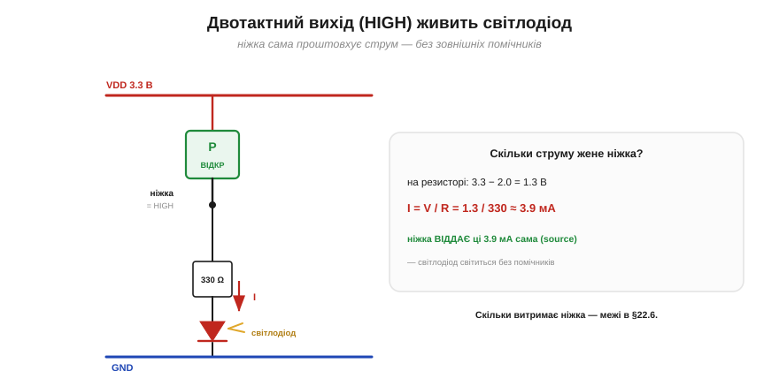
*Рис. 4.4.1.6. Двотактний вихід живить світлодіод. У стані HIGH верхній транзистор приєднав ніжку до 3.3 В, і вона **віддає** струм: VDD → ніжка → резистор → світлодіод → GND. Резистор задає величину струму; саме здатність ніжки сама проштовхнути цей струм і робить двотактний вихід таким зручним.*

**Приклад (струм світлодіода).** Ніжка у стані HIGH дає **3.3 В**. Світлодіод за робочого струму «з'їдає» на собі близько **2.0 В** (його пряме падіння), решта лягає на резистор **R = 330 Ом**. Скільки струму проштовхне ніжка?

```
напруга на резисторі = напруга ніжки − падіння на світлодіоді
                     = 3.3 В − 2.0 В = 1.3 В

струм (закон Ома, I = V/R):
   I = 1.3 В / 330 Ом ≈ 0.0039 А ≈ 3.9 мА
```

Ці ~3.9 мА ніжка **віддає сама** (source), просто бувши у стані HIGH, — і світлодіод світиться. Жодного зовнішнього підсилювача чи джерела не треба: двотактний транзистор усередині ніжки достатньо «сильний», щоб і втримати 3.3 В, і прогнати крізь себе ці міліампери. (Якби світлодіод був увімкнений навпаки — від VDD до ніжки, — то засвітився б він уже у стані **LOW**, коли ніжка **приймає** струм у землю. Такий «увімкнений нулем» спосіб — активний низький рівень, *active-low* — дуже поширений: багато готових модулів очікують саме його, тож звичка «0 = увімкнено» вам ще не раз знадобиться.) До речі, резистор тут не примха. Світлодіод сам по собі майже **не обмежує** струму — його вольт-амперна характеристика круто злітає вгору від певної напруги, — тож без резистора ніжка гнала б крізь нього стільки струму, скільки змогла б, аж до згоряння самого діода чи ніжки. Резистор — простий і надійний **обмежувач**, що задає безпечний струм; «просто ввімкнути світлодіод у ніжку» без нього — певний шлях щось спалити. А ось чи можна так само сміливо вішати на ніжку потужніше навантаження — і де межа, за якою вона згорить, — розберемо в §4.4.6.

Отже, ніжка-вихід — це двотактний каскад із двох транзисторів: верхній приєднує її до VDD (сильний HIGH, віддає струм), нижній — до GND (сильний LOW, приймає струм), а керує ними біт у регістрі OUT, відкриваючи завжди лише один, аби не сталося наскрізного КЗ. Це **типовий**, сильний вихід. Запам'ятайте з цієї теми опорну картинку: **дві ферми-транзистори між VDD і GND, ніжка з їхньої середини, і ваш біт, що відкриває завжди лише одну з двох**. На цьому образі стоятиме весь решта розділу — кожна наступна тема лише домальовуватиме до нього деталі.

Та існує й навмисне «однобокий» різновид виходу — лише з нижнім транзистором, — і він, попри уявну неповноцінність, незамінний у цілому класі задач. Чому й навіщо — розбирає [наступна тема §4.4.2](ch22-gpio.md).

---

## 4.4.2 Open-drain і навіщо він (wired-AND; зсув рівнів)

У [§4.4.1](ch22-gpio.md) ми милувалися силою двотактного виходу: дві ферми-транзистори, сильний нуль і сильна одиниця. А тепер навмисне **заберемо половину** цієї сили — викинемо верхній транзистор — і дістанемо вихід, що вміє лише тягнути вниз, а вгору «відпускає». Зветься він **open-drain** (відкритий стік). На перший погляд — каліцтво: навіщо вихід, що не вміє видати високий рівень сам? Та саме ця «вада» відмикає те, чого двотактний не може **в принципі**: безпечно вішати багато виходів на **один** дріт, робити логіку **самим дротом** (wired-AND) і легко зшивати чипи на **різних напругах**. Розберімо цей чудовий парадокс.

Це гарний приклад інженерного парадоксу: **навмисне послаблений** інструмент іноді корисніший за «повноцінний». Уся хитрість у тому, що сила двотактного виходу — гнати лінію вгору — стає **завадою**, коли виходів багато на одному дроті. Прибравши цю силу, ми й розв'язуємо проблему. Тримаймо це в голові: така логіка «менше — це більше» зустрінеться в інженерії ще не раз.

### Open-drain: лише нижній транзистор

Візьмімо двотактний каскад із §4.4.1 і **приберімо верхній** (P) транзистор. Лишається тільки нижній (N) — підтяжка вниз. Що тепер уміє ніжка?

- транзистор **відкритий** → ніжка приєднана до GND: **низький рівень**, сильний, приймає струм (як і раніше);
- транзистор **закритий** → ніжка не приєднана **ні до чого**. Вона не йде у HIGH — вона просто **відпущена**, «висить у повітрі» (стан високого опору, *Hi-Z*).

Тобто open-drain має лише два стани: «**тягну вниз**» і «**відпускаю**». Високого рівня він **не видає** сам — звідки й назва: «стік» транзистора (а це і є ніжка) лишається **відкритим**, ні до чого не приєднаним, коли транзистор закритий.

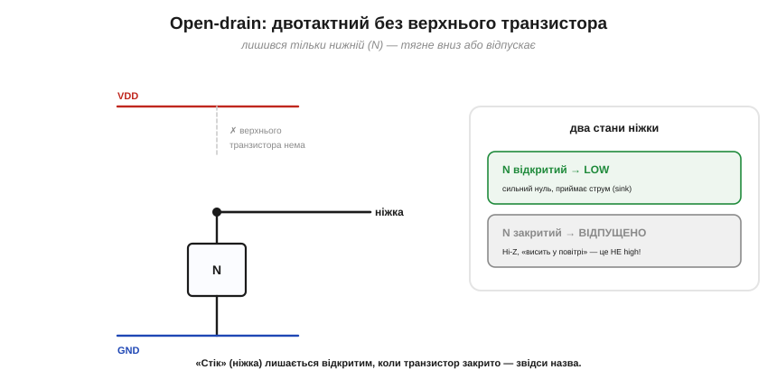
*Рис. 4.4.2.1. Open-drain — це двотактний каскад без верхнього транзистора. Лишився тільки нижній (N). Відкритий → ніжка міцно на **GND** (LOW). Закритий → ніжка **відпущена**, ні до чого не приєднана (Hi-Z) — це **не** HIGH, а «висить у повітрі». Два стани: «тягну вниз» і «відпускаю».*

Закарбуймо цей особливий стан — **високий опір** (*high impedance*, Hi-Z). Двотактна ніжка завжди в одному з двох станів: жене HIGH або жене LOW. А open-drain має ще й третій: **відпущено**, коли ніжка ні до чого не приєднана й нічого не нав'язує лінії — наче її там і нема. Це не «нуль» і не «одиниця», а **самоусунення**: «я мовчу, вирішуйте без мене». Саме ця здатність **відійти вбік** і дозволяє багатьом ділити один дріт без бійки.

### Сам по собі не вміє HIGH — потрібна підтяжка

Якщо open-drain не вміє видати високий рівень, **хто** ж його видає? Зовнішній **резистор-підтяжка** (*pull-up*), увімкнений між лінією та VDD. Він **слабко** тягне лінію вгору, до VDD. Поки транзистор закритий (ніжка відпущена), підтяжка спокійно піднімає лінію до VDD → **HIGH**. А щойно транзистор відкрився, він **перемагає** слабку підтяжку (бо сильний) і садить лінію на GND → **LOW**; підтяжка при цьому лише пропускає крізь себе невеликий струм.

Отже, разом — open-drain **плюс** підтяжка — поводяться як звичайний вихід: транзистор увімкнено → LOW, вимкнено → HIGH (через підтяжку). Тільки HIGH тут **слабкий** (його тримає кволий резистор), а LOW — **сильний** (його тримає транзистор). І сама підтяжка **обов'язкова**: без неї відпущена ніжка просто «висіла» б у повітрі, без певного рівня.

Зверни увагу на тонку, але важливу несиметрію: у звичайного двотактного виходу HIGH і LOW **однаково сильні** — обидва тримає свій транзистор. А в open-drain рівні **нерівноправні**: LOW активний і міцний, HIGH — пасивний, його лише «підтримує» резистор. Саме ця нерівність і є джерелом усіх особливостей, які ми зараз розберемо: і чому багато виходів мирно діляться лінією, і чому HIGH тут «повільніший» за LOW, і чому без підтяжки нічого не працює. Запам'ятай образ: **вниз — рвучко й сильно, вгору — м'яко й самопливом**.

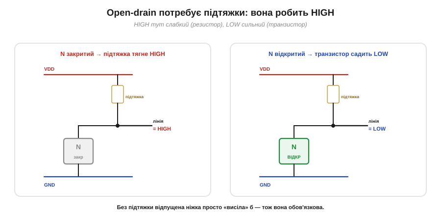
*Рис. 4.4.2.2. Щоб open-drain став корисним виходом, до лінії додають **підтяжку** (резистор до VDD). Транзистор **закритий** → підтяжка тягне лінію до VDD (HIGH, слабкий). Транзистор **відкритий** → він перемагає підтяжку й садить лінію на GND (LOW, сильний). Без підтяжки відпущена ніжка просто «висіла» б — тож вона обов'язкова. (Підтяжки докладно — у §4.4.4.)*

> 🔧 **Навіщо це.** Запам'ятайте суть одним рядком: open-drain уміє лише «**тягнути вниз або відпускати**», а високий рівень робить **підтяжка**. Звідси й перша практична осторога: на лінії open-drain **завжди** має бути підтяжка (зовнішня чи ввімкнена всередині чипа) — інакше «висока» одиниця просто не з'явиться, і ви ловитимете «загадку», що ніжка ніби не вмикається.

### Wired-AND: багато виходів на одній лінії

А тепер — заради чого все й затівалося. Раз open-drain **ніколи не жене HIGH**, а лише тягне вниз або відпускає, то на **одну** лінію (з однією спільною підтяжкою) можна безпечно повісити **скільки завгодно** таких виходів. І ось що вийде:

- якщо **хоч один** із них тягне вниз — лінія **LOW**;
- лінія стає **HIGH** лише тоді, коли **всі** до одного відпустили (і підтяжка нарешті її підняла).

Це і є **wired-AND** — логічне «І», зроблене **самим дротом**: рівень на лінії дорівнює логічному добутку всіх (де «відпустив» = 1). Жодних вентилів — лише дріт, підтяжка і гурт open-drain виходів.

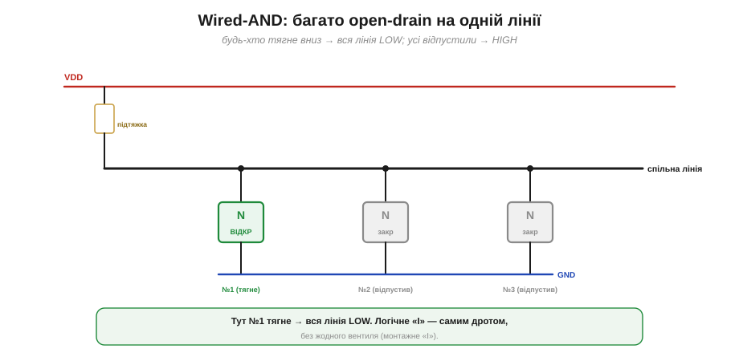
*Рис. 4.4.2.3. Кілька open-drain виходів на **спільній** лінії з однією підтяжкою. Будь-який, що тягне вниз, садить **усю** лінію в LOW; HIGH настає, лише коли **всі** відпустили. Логічне «І» — самим дротом, без жодного вентиля. Це й називають **wired-AND** (монтажне «І»).*

Чому саме «**AND**» (І), а не «OR» (АБО)? Це залежить від того, що вважати «активним сигналом». Якщо домовитися, що сигнал — це **високий** рівень («1»), то HIGH на спільній лінії буде лише тоді, коли **всі** учасники його відпустили, тобто **усі** кажуть «1», — це чисте логічне «**І**», звідси назва. А якщо подивитися з протилежного боку й вважати активною дією **тягнути вниз** (поширений у залізі «активний нуль»), то лінія впаде, щойно смикне **хоч хто** — і це вже радше «АБО» подій. Обидві назви описують **те саме залізо**, просто з різного боку логічної умовності. Не плутайтеся в словах — дивіться на дріт: **тягне хоч хто — лінія внизу; HIGH лише за загальної згоди**.

### Чому push-pull так не можна

Аби оцінити, **яку** проблему це розв'язує, спробуймо повісити на спільну лінію **двотактні** виходи — і побачимо катастрофу. Хай один із них жене **HIGH** (верхній транзистор приєднав лінію до VDD), а другий тієї ж миті жене **LOW** (його нижній транзистор приєднав ту саму лінію до GND). Що маємо? Пряме з'єднання VDD із GND **крізь два чипи** — те саме коротке замикання (shoot-through) з §4.4.1, лише тепер між двома мікросхемами. Великий струм, гарячі вихідні каскади, у гіршому разі — спалені ніжки.

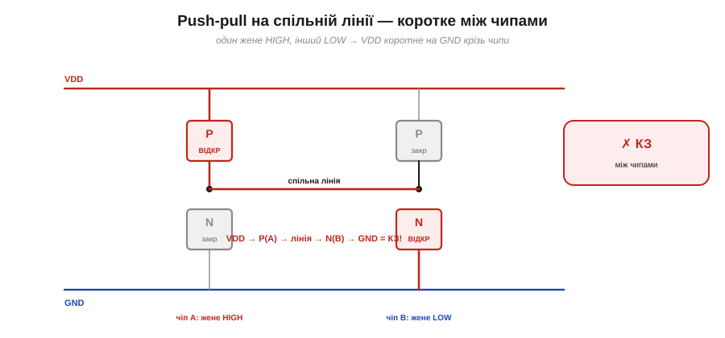
*Рис. 4.4.2.4. Чому двотактні виходи не можна об'єднувати. Якщо один жене лінію в HIGH (до VDD), а інший — у LOW (до GND), вони з'єднують VDD і GND навпрост **крізь себе**: те саме КЗ, що в §4.4.1, тільки між двома чипами. Open-drain цього позбавлений **за будовою** — він ніколи не жене вгору, тож зіткнутися «верхами» нема чому.*

Ось де сяє open-drain: він **за будовою** не вміє гнати вгору, тож на спільній лінії конфлікту просто не виникає — найгірше, що може статися, це що двоє водночас тягнуть **вниз**, а це безпечно (обидва ведуть до тієї самої землі).

### Навіщо: спільні шини й сигнали «хтось зайнятий»

Звідси два головні застосування. Перше — **спільні шини зв'язку**, де багато пристроїв слухають і говорять на одних і тих самих дротах. Найвідоміша — шина **I2C** (її ми розберемо в Модулі 6): два дроти, на них висить купа давачів — і кожен спілкується через open-drain із підтяжками, не боячись зіткнень. Без open-drain така спільна шина була б неможлива.

Друге — **сигнальні лінії «мені треба уваги»**. Уявіть кілька пристроїв, кожен із яких час від часу хоче сповістити процесор про подію. Якщо з'єднати їхні open-drain виходи в одну лінію з підтяжкою, то **будь-який** із них може смикнути її вниз («є подія!»), не питаючи дозволу й не конфліктуючи з рештою. Лінія сама збере «АБО» всіх тривог: спокійно-висока, поки тихо, і падає вниз, щойно **комусь** є що сказати.

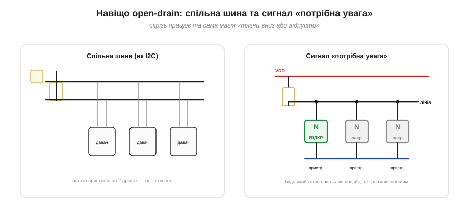
*Рис. 4.4.2.5. Дві коронні задачі open-drain. **Спільна шина** (як I2C): багато пристроїв на тих самих двох дротах, кожен через open-drain — без зіткнень. **Сигнал «потрібна увага»**: кілька пристроїв на одній лінії з підтяжкою; будь-який смикає її вниз, аби сповістити, не заважаючи іншим. Скрізь працює та сама магія «тягни вниз або відпусти».*

> 🔧 **Навіщо це.** Коли наступного разу побачите на платі **резистори-підтяжки** біля шини — особливо парами на сусідніх доріжках даних і такту — знайте: це майже напевно **open-drain шина**, як-от I2C. І найперше, що перевіряють, коли «шина мовчить», — чи ті підтяжки на місці й чи правильний у них номінал: без них уся ця елегантна спільна лінія просто «висить» у повітрі й нічого не передає. Ви вже не дивитиметеся на ті два резистори як на загадку — ви знаєте, навіщо вони там.

### Бонус: зсув рівнів (level shifting)

І ще один подарунок від open-drain, що випливає з його будови. Раз він **не задає** високого рівня сам (HIGH робить підтяжка, увімкнена до **тієї напруги, яку ви оберете**), то лінію можна підняти до будь-якого зручного VDD. А це дає простий спосіб **зшити чипи на різних напругах**. Хай один чіп працює на 3.3 В, інший на 5 В: якщо обидва спілкуються через open-drain, а спільну підтяжку ввімкнути до **нижчої** (3.3 В), то жоден чіп не нав'язує лінії свою напругу — кожен лише тягне її вниз або відпускає, а «верх» їм усім спільно задає підтяжка на безпечні 3.3 В. Так два світи напруг мирно живуть на одному дроті (про сумісність рівнів — згадаймо [§3.1](../../block-3-digital-processor/ch14-logic-levels/ch14-logic-levels.md) та 3.3 проти 5 В з Модуля 1).

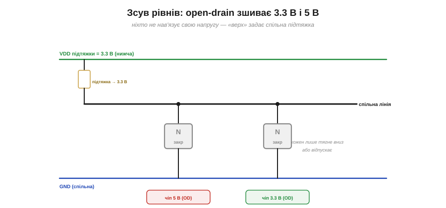
*Рис. 4.4.2.6. Open-drain як простий зсув рівнів. Чіп на 5 В і чіп на 3.3 В спілкуються через open-drain, а спільну підтяжку ввімкнено до **нижчої** напруги (3.3 В). Ніхто не нав'язує лінії свою напругу — усі лише тягнуть униз або відпускають, а «верх» задає підтяжка на безпечних 3.3 В. Два світи напруг — на одному дроті.*

Тут потрібна чесна засторога. Цей дармовий трюк працює **лише** доти, доки обидва чипи спілкуються **через open-drain** — бо вся ідея в тому, що **ніхто не жене лінію вгору силою**, а «верх» задає сама підтяжка. Щойно один із чипів матиме звичайний **двотактний** вихід, він спробує **нав'язати** лінії свої 5 В — і з'єднати таке напряму з 3.3-вольтовим входом небезпечно: можна спалити вхід. Для таких випадків існують окремі мікросхеми-перетворювачі рівнів; а простий «безкоштовний» зсув самою лиш підтяжкою — це привілей саме open-drain ліній. Тримайте різницю в голові, щоб не наробити лиха.

### Порахуймо: підтяжка та її струм

Лишилося відчути ціну підтяжки числами — і зрозуміти, як вибирають її номінал.

**Приклад (струм підтяжки).** Хай підтяжка **R = 4.7 кОм** до **VDD = 3.3 В**. Коли open-drain тягне лінію в **LOW**, через підтяжку біжить струм у землю крізь відкритий транзистор:

```
струм через підтяжку (стан LOW):
   I = VDD / R = 3.3 / 4700 ≈ 0.0007 А = 0.7 мА   (ніжка це приймає, sink)

у стані HIGH струму майже нема — підтяжка лише тримає рівень.

компроміс вибору R:
   менший R → лінія швидше повертається в HIGH (менше «розмазується»
              паразитною ємністю), АЛЕ більший струм у стані LOW;
   більший R → ощадніше, та повільніше — на швидких шинах сигнал «не встигає».
```

Ось і весь баланс: підтяжку роблять достатньо «сильною», щоб лінія встигала підстрибувати в HIGH (особливо на швидких шинах), але не настільки, щоб даремно палити струм у кожному LOW. Типові значення — одиниці кілоом, як наша 4.7 кОм; на швидких шинах беруть менші, на ощадних — більші.

Зверни увагу на ще одну приємну дрібницю: струм підтяжки тече **лише** у стані LOW. Лінія, що здебільшого «висить» у HIGH (як буває на спокійних шинах і лініях «потрібна увага»), у спокої майже **не споживає** — ще одна причина, чому ощадна, батарейна електроніка любить open-drain. Сильний двотактний вихід такого подарунка не дає: він тримає рівень активно в обидва боки.

Отже, open-drain — це навмисне «півтранзисторний» вихід: уміє лише тягнути вниз або відпускати, а високий рівень йому дає підтяжка. Ця «вада» обертається силою — багато виходів на одному дроті без конфлікту (wired-AND), спільні шини, сигнали «потрібна увага» й простий зсув рівнів. Ми двічі вже згадали, що ніжка може бути не лише виходом, а й **входом** — слухати рівень, який тримає хтось інший. Як саме ніжка-вхід **вирішує**, що на лінії — нуль чи одиниця, і де проходить межа між ними, розбирає [наступна тема §4.4.3](ch22-gpio.md).

## 4.4.3 Логічні пороги входу

У двох попередніх темах ніжка була **виходом**: вона **жене** напругу — або сама (push-pull, §4.4.1), або «півсилою» (open-drain, §4.4.2). Тепер розвернімо стрілку. Ніжка-**вхід** нічого не жене — вона **слухає**: на лінії є якась напруга, що її тримає хтось інший (кнопка, давач, інша мікросхема), і ніжка має **вирішити**, чи це нуль, чи одиниця. Питання просте на вигляд, та хитре по суті: напруга в реальному світі буває яка завгодно — 0.1 В, 1.4 В, 2.9 В, — а ядру потрібен чистий **біт**. Де ж провести межу? Виявляється, однієї межі замало: їх дві, між ними лежить «нічия земля», і саме ця конструкція робить цифрову логіку стійкою до бруду реального світу. Розберімо її по цеглинці.

### Вхід слухає, а не жене

Згадаймо §4.4.1: вихід **активно тримає** напругу, бо приєднує ніжку транзистором то до VDD, то до GND, віддаючи чи приймаючи струм. Вхід влаштований протилежно. Усередині нього сидить **компаратор** — крихітна схема, що порівнює напругу на ніжці з внутрішніми опорними рівнями й видає в ядро вже готовий **0 або 1**. Сама ніжка-вхід при цьому **високоомна**: вона майже не бере струму (одиниці нано- чи мікроампер), тобто практично не навантажує лінію, а лише **вимірює** її. Це як вольтметр: добрий вольтметр показує напругу, майже нічого з кола не «висмоктуючи».

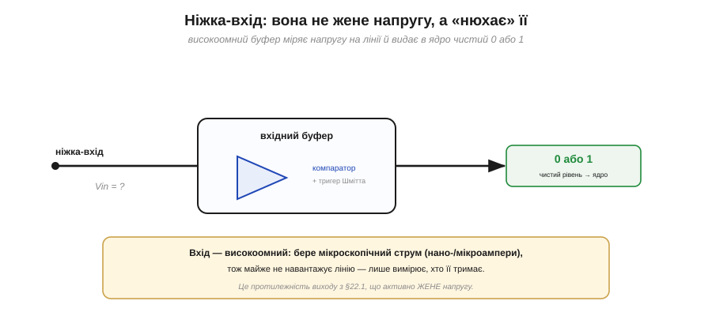
*Рис. 4.4.3.1. Ніжка-вхід не жене напругу, а «нюхає» її: високоомний буфер (компаратор із тригером Шмітта) міряє рівень на лінії й передає в ядро вже чистий біт. Струм входу мізерний — лінію він майже не навантажує. Це дзеркальна протилежність виходу з §4.4.1.*

Те, що вхід майже не споживає струму, — велика зручність: до нього можна під'єднати слабке джерело (наприклад, давач, що сам ледь-ледь «штовхає» напругу), і вхід його не «просадить». Але та сама високоомність має зворотний бік: якщо до ніжки **взагалі нічого** не приєднано, вона нічого не міряє — і «висить у повітрі», ловлячи наводки. Цю пастку («плаваючий вхід») і способи її уникнути розбере [§4.4.4](ch22-gpio.md); поки що нам досить знати, що вхід **читає** напругу, а не задає її.

> 🔧 **Навіщо це.** Запам'ятайте різницю в один рух: **вихід жене, вхід слухає**. Коли `digitalRead` повертає дивне — то «1», то «0» без причини, — перша підозра саме сюди: чи справді щось **тримає** напругу на ніжці? Високоомний вхід сам по собі рівня не має; його хтось мусить задати — джерело сигналу або підтяжка. Половина «глюків кнопки» — це не кнопка, а вхід, що лишився без певного рівня.

### Чому однієї межі замало

Найпростіша ідея — поставити **одну** межу посередині, скажімо на VDD/2 (для 3.3 В це 1.65 В): нижче — нуль, вище — одиниця. На папері працює, у житті — ні. Реальний сигнал ніколи не буває ідеально гладким: на нього накладається **шум** — дрібні коливання від сусідніх доріжок, живлення, радіоефіру. Якщо напруга повзе якраз біля єдиної межі, ці коливання штовхатимуть її то трохи вище, то трохи нижче порога — і вхід «брязкотітиме», видаючи 0-1-0-1 багато разів поспіль там, де мав бути один спокійний перехід. Один поріг — це лезо: будь-який подих шуму перекидає рішення туди-сюди.

Тому інженери зробили розумніше: розсунули межу надвоє й лишили поміж ними **нейтральну смугу**, де вхід просто «не певен». Це коштує трохи «чутливості», зате купує **стійкість**: дрібний шум уже не перекидає рішення, бо щоб змінити відповідь, напрузі треба перетнути не волосину, а цілу смугу.

### Два пороги, три зони: VIL і VIH

Звідси два названі пороги (їхні позначення прийшли з даташитів і варто їх упізнавати):

- **VIL** (*input low*) — найбільша напруга, яку вхід ще **гарантовано** читає як **0**. Усе, що нижче VIL, — певний нуль.
- **VIH** (*input high*) — найменша напруга, яку вхід **гарантовано** читає як **1**. Усе, що вище VIH, — певна одиниця.

Між ними — **заборонена (невизначена) зона**: тут виробник нічого не обіцяє, вхід може прочитати і так, і так. Тому справний сигнал у цій смузі **не затримують** — крізь неї лише швидко проскакують, переходячи з 0 у 1 чи навпаки.


*Рис. 4.4.3.2. Вхід ділить усю шкалу напруги на три зони. Зелена (нижче VIL) — гарантований 0; синя (вище VIH) — гарантована 1; сіра між ними — «невизначено». Для CMOS пороги орієнтовно VIL ≈ 0.3·VDD і VIH ≈ 0.7·VDD. Сіра смуга — навмисний «буфер» проти завад.*

Зверніть увагу: «1» — це **не** рівно VDD, а будь-що **вище VIH**. Сигнал, що просів до 2.9 В замість 3.3 В, для входу однаково чітка одиниця. І навпаки, «0» — не конче рівний нуль, а будь-що **нижче VIL**. Цифрова логіка тому й надійна, що не вимагає точних вольтів — лише **впевнено далеко** від середини.

### Запас завадостійкості: чому пороги «відступають»

Тепер з'єднаймо дві теми — вихід і вхід — на одному дроті: один чіп жене, інший слухає. Вихід теж не дає ідеальних 0 і VDD; його реальні рівні мають свої імена:

- **VOL** (*output low*) — найбільша напруга, яку вихід видає, коли жене **0** (трохи більша за нуль).
- **VOH** (*output high*) — найменша напруга, яку вихід видає, коли жене **1** (трохи менша за VDD).

Щоб усе працювало, рівні драйвера мають **з запасом** потрапляти в потрібні зони входу: «нуль» драйвера (VOL) — бути нижчим за VIL входу, а «одиниця» (VOH) — вищою за VIH. Різницю й називають **запасом завадостійкості** (*noise margin*):

> **NML = VIL − VOL** (запас для нуля) **·** **NMH = VOH − VIH** (запас для одиниці)

Це буквально «скільки вольтів шуму можна докинути, перш ніж рівень зіб'ється». Завада, менша за цей запас, рівень **не перекине**; більша — може. Ось чому пороги навмисно «відступають» від рівнів драйвера: відступ і є подушкою безпеки.

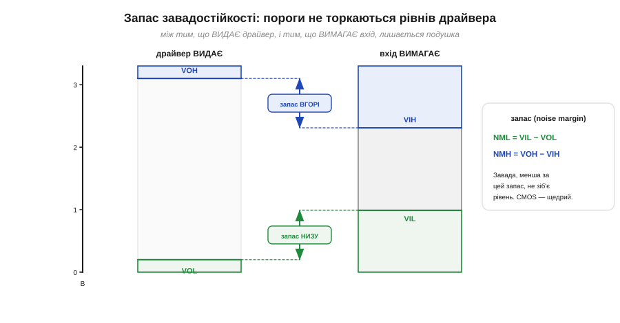
*Рис. 4.4.3.3. Те, що драйвер ВИДАЄ (VOL, VOH), і те, що вхід ВИМАГАЄ (VIL, VIH), навмисно не збігаються. Проміжки NML = VIL − VOL і NMH = VOH − VIH — це запас завадостійкості: подушка, у межах якої шум не зіб'є рівень. У CMOS ці запаси щедрі — близько 0.3·VDD кожен.*

> 🔧 **Навіщо це.** Звідси кілька дуже земних правил. По-перше, чому довгі дроти до кнопок і давачів — погана ідея: що довша лінія, то більше вона **ловить** наводок, і одного дня шум перевищить запас. По-друге, чому «майже одиниця» 2.9 В — це нормальна, надійна одиниця: вона все ще **вище** VIH із добрим запасом. По-третє, коли вхід «плаває» між зонами й читається випадково, ви тепер знаєте слова, якими це описати: сигнал застряг у **невизначеній зоні**, бо його ніхто не тримає певно.

### Гістерезис: тригер Шмітта

Дві межі вже краще за одну, але є ще розумніший хід — зробити так, щоб **самі пороги «пам'ятали»**, у якому стані ми зараз. Це і є **гістерезис**, а схему, що його дає, звуть **тригером Шмітта** (*Schmitt trigger*). Ідея: поріг на **ввімкнення** (коли напруга росте) — вищий, ніж поріг на **вимкнення** (коли падає). Позначмо їх **VT+** (верхній, спрацьовує на підйомі) і **VT−** (нижній, спрацьовує на спаді).

Працює так. Поки вхід читається як 0, він **не** перемкнеться в 1, доки напруга не підніметься аж до VT+. А коли вже перемкнувся в 1, він **не** впаде назад у 0, доки напруга не опуститься аж до VT−. Між VT− і VT+ — «мертва зона», де стан **не міняється взагалі**. Тому дрібний шум, що гойдає сигнал на пів-вольта туди-сюди, більше нічого не перекидає: щоб змінити рішення, треба пройти **всю** відстань від одного порога до іншого.

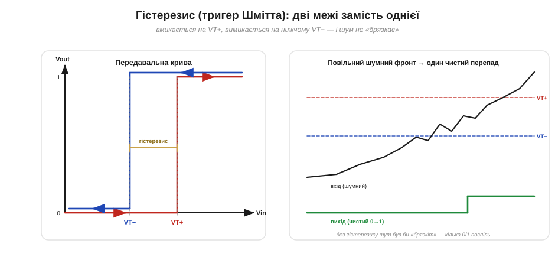
*Рис. 4.4.3.4. Ліворуч — передавальна крива з гістерезисом: вгору перемикає на VT+, вниз — на нижчому VT−, між ними петля «пам'яті». Праворуч — навіщо це: повільний шумний фронт, що біля однієї межі «брязкотів» би десятком 0/1, з тригером Шмітта дає **один** чистий перепад.*

Тригер Шмітта — рятівник для **повільних** і **шумних** сигналів: довгого пологого фронту з кнопки, виходу з ємнісного давача, сигналу з-за довгого дроту. Без нього такий млявий фронт, повзучи крізь невизначену зону, штампував би пачку хибних перемикань. Саме тому **входи багатьох мікроконтролерів — зокрема ESP32 — мають тригер Шмітта вбудованим**. Він не лікує всіх хвороб (механічний дребезг кнопки він не прибере — про це окрема [тема §4.4.5](ch22-gpio.md)), але дрібний електричний шум на фронті гасить чудово.

### Дві родини порогів: TTL і CMOS

Звідки беруться конкретні числа порогів? Історично склалися дві великі **родини** логіки, і їхні пороги різні.

- **TTL** (на біполярних транзисторах, класика 5-вольтового світу): пороги **фіксовані й «низькі» —** VIL ≈ 0.8 В, VIH ≈ 2.0 В незалежно від того, що живлення 5 В. Вони несиметричні, тиснуться до низу шкали — спадок біполярної схемотехніки.
- **CMOS** (на польових транзисторах, наш випадок): пороги задано **часткою живлення** — приблизно VIL ≈ 0.3·VDD і VIH ≈ 0.7·VDD. Вони майже симетричні відносно середини й «їдуть» разом із VDD.

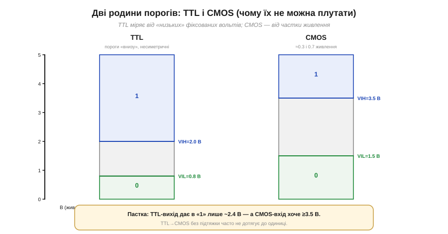
*Рис. 4.4.3.5. Дві родини на спільній шкалі 5 В. У TTL пороги тиснуться донизу (0.8 / 2.0 В) і несиметричні; у CMOS — біля 0.3 і 0.7 живлення, симетричні. Звідси класична пастка сумісності: TTL-вихід у «1» дає лише ~2.4 В, а 5-вольтовому CMOS-входу треба ≥3.5 В — без підтяжки одиниця може не «дотягтися».*

Це не занудство, а джерело реальних багів: з'єднати дві родини «в лоб» не завжди можна. Класичний приклад — TTL жене сигнал у CMOS: у «1» TTL-вихід ледь дає 2.4 В, а CMOS-вхід на 5 В хоче бачити щонайменше 3.5 В — і одиниця просто не розпізнається. Рятують або підтяжка, або спеціальні «сумісні» входи. Знати, **якої родини** кожен бік, — половина справи в налагодженні міжмікросхемних зв'язків.

### Пороги входу ESP32 (і чому 5 В спалить пін)

ESP32 — чистий **CMOS** на живленні 3.3 В, тож його вхідні пороги такі (з даташита, орієнтовно): **VIL ≈ 0.25·VDD ≈ 0.83 В**, **VIH ≈ 0.75·VDD ≈ 2.48 В**. Між 0.83 і 2.48 В — широка (~1.6 В) невизначена смуга, а входи, як ми згадали, мають **тригер Шмітта**. Для нас це означає просте робоче правило: щоб ESP32 певно бачив одиницю, тримай на ніжці **понад ~2.5 В**; щоб нуль — **менш як ~0.8 В**; середини уникай.


*Рис. 4.4.3.6. Пороги входу ESP32 від 3.3 В: VIL ≈ 0.83 В, VIH ≈ 2.48 В, із тригером Шмітта. Червоним — критичне застереження: ніжка **не 5-вольтотерпима**. Гранична напруга на піні ≈ VDD+0.3 = 3.6 В; подати 5 В прямо — спалити вхід.*

І ось найважливіше практичне попередження всієї теми: **ніжки ESP32 не «терплять» 5 В**. Абсолютний максимум напруги на піні — приблизно VDD + 0.3 В, тобто близько **3.6 В**. Подаси прямо 5-вольтовий сигнал (скажімо, з Arduino Uno або давача на 5 В) — і з великою ймовірністю **пошкодиш** вхід назавжди. П'ятивольтові сигнали заводять **тільки** через щось, що знижує напругу: дільник із двох резисторів, спеціальний перетворювач рівнів або вже знайомий нам open-drain із підтяжкою до 3.3 В (§4.4.2).

> 🔧 **Навіщо це.** Візьми за звичку: **перш ніж з'єднати щось із ніжкою — глянь у даташит на «Absolute Maximum Ratings»** і порівняй із напругою свого джерела. Цей один погляд рятує плати від тихої смерті. «Не 5-вольтотерпимий» — не дрібний нюанс, а різниця між «працює» і «купуй нову плату». Більшість спалених входів ESP32 — це саме недогляд із 5 вольтами там, де очікувалося 3.3.

### Порахуймо: запас завадостійкості

Відчуймо запас завадостійкості числами — на ланцюжку «CMOS-драйвер → вхід ESP32», обидва на 3.3 В.

**Приклад (запас завадостійкості).** Беремо пороги входу ESP32 і типові рівні CMOS-драйвера під легким навантаженням:

```
Вхід ESP32 (VDD = 3.3 В):
   VIL ≈ 0.25·VDD = 0.83 В        VIH ≈ 0.75·VDD = 2.48 В

CMOS-драйвер на 3.3 В (легке навантаження):
   VOL ≈ 0.1 В (майже 0)          VOH ≈ 3.2 В (майже VDD)

Запас завадостійкості:
   NML = VIL − VOL = 0.83 − 0.1  = 0.73 В   (для нуля)
   NMH = VOH − VIH = 3.20 − 2.48 = 0.72 В   (для одиниці)

→ Завада до ~0.7 В рівень не зіб'є. Це CMOS: щедрі,
  майже симетричні запаси з обох боків.

Та обережно: гарантія з даташита — гірша (повне навантаження):
   VOH(min) = 0.8·VDD = 2.64 В → NMH = 2.64 − 2.48 = 0.16 В
   На сильно навантаженій лінії рахуй саме цей, гірший випадок.
```

Висновок подвійний. У типовому випадку CMOS дає розкішний запас — близько 0.7 В з обох боків, тому такі з'єднання звичайно «просто працюють». Але **гарантований** даташитом найгірший випадок (повне навантаження виходу) куди скромніший — і якщо лінія важко навантажена або довга, орієнтуватися треба саме на нього. Це і є інженерна звичка: дивитися не лише на «зазвичай», а й на «найгірше, що обіцяно».

Отже, ніжка-вхід — це високоомний «вимірювач», що порівнює напругу з **двома** порогами: нижче VIL — нуль, вище VIH — одиниця, між ними — невизначеність, якої уникають. Відступ порогів від рівнів драйвера дає **запас завадостійкості**, а тригер Шмітта з парою VT−/VT+ додає «пам'ять», що гасить шум на повільних фронтах. Числа порогів залежать від родини (TTL чи CMOS), а для ESP32 вони складають 0.25 і 0.75 від 3.3 В — із суворим застереженням не подавати на пін 5 В. Лишилося одне велике питання, яке ми вже двічі зачепили: а що, як до входу **взагалі нічого** не приєднано — який рівень він прочитає тоді? Цей **плаваючий** вхід і рятівні **підтяжки** розбирає [наступна тема §4.4.4](ch22-gpio.md).

## 4.4.4 Плаваючий пін і підтяжки

У §4.4.3 ми лишили одне питання навмисно відкритим: вхід — високоомний «вимірювач», що зчитує напругу на лінії; а **що** він прочитає, коли до ніжки **взагалі нічого** не приєднано? Інтуїція підказує «нуль» — але це хибно. Нуль — це теж певна напруга (близько GND), яку хтось мусить **тримати**. Якщо ж лінію не тримає ніхто, на ній немає **жодного** означеного рівня: ніжка «плаває». І плаває вона, як ми зараз побачимо, найгіршим можливим чином — десь посеред шкали, у тій самій забороненій зоні, ловлячи кожну наводку. Ця тема — про те, чому так стається і як це лікують **підтяжками** (pull-up / pull-down): найдешевшими й найчастішими резисторами на будь-якій платі.

### Що читає вхід, до якого нічого не приєднано

Високоомний вхід майже не бере струму — це його чеснота (не навантажує джерело), але водночас його ахіллесова п'ята. Бо коли джерела **нема**, ніжці нема звідки взяти рівень. Вона перетворюється на крихітну **антену**: довгий металевий провідник, що вловлює наводки від сусідніх доріжок, від мережі 50 Гц, від радіоефіру, від руху вашої руки поряд. Ці наводки гойдають напругу на ніжці туди-сюди довкола середини шкали — а саме там, у невизначеній зоні між VIL і VIH, вхід «не певен». Результат — `digitalRead` повертає то 0, то 1, без жодної закономірності.

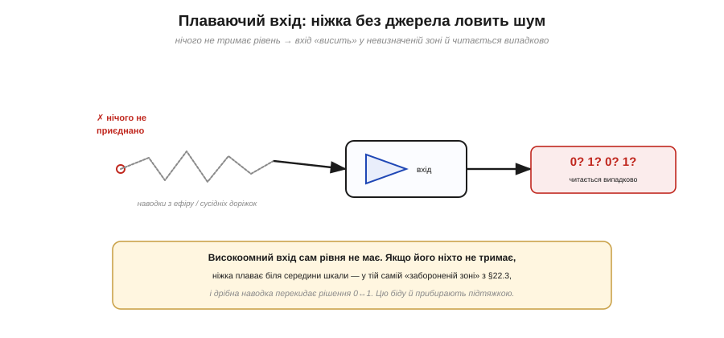
*Рис. 4.4.4.1. Якщо до високоомного входу нічого не приєднано, ніжка «висить» антеною й ловить наводки. Напруга плаває біля середини шкали — у забороненій зоні з §4.4.3 — і вхід читається випадково: 0, 1, 0, 1… Жодного джерела рівня немає, тож і рівня немає.*

Гірше того, шкода не лише в «випадкових» читаннях. Коли напруга надовго застрягає **посеред** діапазону, всередині вхідного буфера обидва транзистори (згадаймо комплементарну пару з §4.4.1) виявляються **прочиненими** одночасно — і крізь буфер тече наскрізний струм. Плаваючий вхід тому ще й **марно гріє** чіп і піднімає споживання, що особливо болить у батарейних пристроях. Підсумок простий і категоричний: **невикористаний цифровий вхід не можна лишати плаваючим**. Йому треба дати означений рівень спокою — і саме це робить підтяжка.

Цей ефект легко відчути на досліді: лиши вхід ESP32 ні до чого не приєднаним і читай `digitalRead` у циклі — побачиш, як значення стрибає саме тоді, коли підносиш палець чи рухаєш дріт поряд. Ніжка буквально працює радіоприймачем. У великій схемі таке «привидне» читання здатне зненацька «натиснути» неіснуючу кнопку чи збити логіку, а знайти причину важко: вона невидима й випадкова. Тому плаваючих входів просто не лишають — це гігієна, а не перестраховка.

### Підтяжка: резистор, що задає рівень спокою

**Підтяжка** — це резистор, що **слабко** прив'язує лінію до означеного рівня, поки її ніхто не тримає активно. Є два дзеркальні варіанти:

- **Pull-up** (підтяжка вгору) — резистор від лінії до **VDD**. У спокої він підтягує ніжку до VDD → стан спокою **HIGH (1)**.
- **Pull-down** (підтяжка вниз) — резистор від лінії до **GND**. У спокої він стягує ніжку до GND → стан спокою **LOW (0)**.

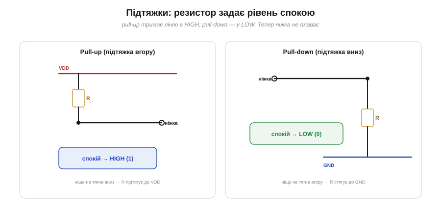
*Рис. 4.4.4.2. Дві дзеркальні підтяжки. Pull-up (резистор до VDD) задає спокій HIGH; pull-down (резистор до GND) — спокій LOW. Резистор «слабкий», тож будь-яке справжнє джерело легко його перемагає — а коли джерела нема, підтяжка втримує означений рівень.*

Ключове слово — **слабко**. Це той самий принцип, що в open-drain із §4.4.2: підтяжка тримає рівень лише доти, доки лінію не смикнув хтось **сильніший**. Натиснута кнопка, що замикає ніжку на GND, легко «переборює» pull-up і садить лінію в LOW; відпустиш кнопку — і кволий резистор спокійно повертає HIGH. Підтяжка не бореться з активним сигналом — вона лише заповнює **тишу**, задаючи рівень тоді, коли активного джерела немає. Тому її номінал беруть досить великим (кілоомами), щоб у «робочому» стані вона майже не заважала й не палила струму.

Звідси важливе застереження: на одній лінії має бути **щось одне** — або pull-up, або pull-down, але не обидва водночас. Якщо ненароком увімкнути обидві (скажімо, зовнішній pull-down і внутрішній pull-up разом), вони утворять **дільник напруги** й затягнуть ніжку кудись посередині — рівно в ту невизначену зону з §4.4.3, від якої ми тікаємо. Підтяжка має тягнути лінію певно в **один** бік; дві протилежні підтяжки нейтралізують одна одну й роблять тільки гірше.

### Класична кнопка: pull-up і логіка «active-low»

Найчастіше підтяжку зустрічають у схемі кнопки. Канонічне ввімкнення таке: **pull-up** тримає ніжку в HIGH, а **кнопка з'єднує ніжку з GND**. Поки кнопку не чіпають, лінію тримає резистор → вхід читає **HIGH (1)**. Натиснули — ніжка замикається на землю → вхід читає **LOW (0)**.

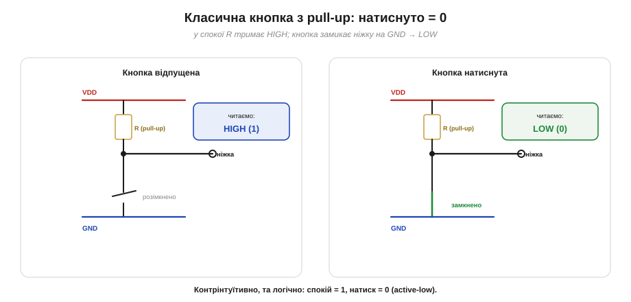
*Рис. 4.4.4.3. Кнопка з pull-up у двох станах. Відпущена (ліворуч): резистор тримає HIGH → читаємо 1. Натиснута (праворуч): кнопка замикає ніжку на GND, перемагаючи слабку підтяжку → читаємо 0. Натиск = нуль — це й називають логікою «active-low».*

Новачка це збиває з пантелику: натиснута кнопка дає **нуль**, а не одиницю. Така інверсна логіка зветься **active-low** («активний — низький»), і вона не примха, а давня, добре обґрунтована традиція цифрової схемотехніки: історично «стягнути вниз» було простіше й надійніше, ніж «підняти вгору», тож активним станом зробили саме LOW. Можна, звісно, зробити й навпаки — **pull-down** плюс кнопка до **VDD**: тоді спокій буде LOW, а натиск дасть HIGH (логіка «active-high»). Обидва варіанти робочі; pull-up + active-low просто історично поширеніший, і його ви бачитимете частіше.

А чому взагалі потрібен резистор — чому не з'єднати кнопку просто між ніжкою і GND, без нього? Бо тоді, **поки кнопку відпущено**, ніжка знову лишається ні до чого не приєднаною — і ми повертаємося до плаваючого входу з усіма його випадковими читаннями. Резистор і потрібен саме для того, щоб **стан спокою був означеним**.

> 🔧 **Навіщо це.** Запам'ятайте схему-заготовку: **кнопка → GND, плюс pull-up, у коді чекаємо LOW**. Коли в проєкті кнопка «сама себе натискає» або реагує через раз — найперше перевірте підтяжку: чи вона є, чи правильного боку, чи ввімкнена внутрішня. І не дивуйтеся інверсії: натиснуто — це `0`. У прошивці це часто пишуть явно, як-от `if (digitalRead(PIN) == LOW) { /* натиснуто */ }`, щоб не заплутатися.

### Який номінал брати

Підтяжка завжди компроміс — точно як у §4.4.2. Замалий резистор тримає рівень міцно і швидко, але в активному стані (коли лінію тягнуть у протилежний бік) марно палить струм. Завеликий — майже не споживає, зате тягне кволо: на довгій чи швидкій лінії він не встигає «перемогти» паразитну ємність, а ще стає вразливим до струмів витоку й наводок, і вхід знову починає «плисти». Золота середина для звичайних кнопок і повільних ліній — **близько 10 кОм**.

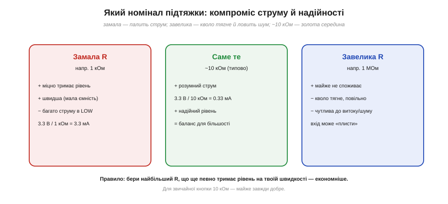
*Рис. 4.4.4.4. Компроміс номіналу. Замала R (≈1 кОм) — міцно й швидко, але 3.3 мА струму в активному стані. Завелика R (≈1 МОм) — майже без споживання, та кволо й чутливо до шуму. ~10 кОм — баланс для більшості випадків (0.33 мА).*

Практичне правило формулюють так: бери **найбільший** резистор, що ще певно тримає рівень на твоїй швидкості, — це найощадніше. Для кнопки, яку натискають раз на секунду, і 100 кОм підійде; для швидкої шини беруть одиниці кілоом.

> 🧮 **Звідки саме «10 кОм».** Три тиски — марний струм (знизу) та шум, витік і повільний фронт (згори) — затискають номінал у вузьке вікно. Як вони рахуються й чому ~10 кОм — золота середина: у вставці [Чому підтяжка саме 10 кОм](ch22-s4-m-pullup-value.md).

Чому більший резистор «повільніший», варто зрозуміти точніше. Будь-яка лінія має паразитну **ємність** (сам провідник, вхід мікросхеми, монтаж), і разом із підтяжкою вона утворює RC-ланку: коли активне джерело відпускає лінію, підтяжка заряджає цю ємність не миттєво, а за час близько **τ = R·C**. Для R = 10 кОм і типових ~50 пФ це лише пів мікросекунди, а для R = 1 МОм — уже десятки мікросекунд, протягом яких напруга «повзе» вгору крізь невизначену зону. Ось чому на швидких лініях підтяжку беруть меншою: щоб фронт устигав підстрибувати в HIGH між перемиканнями. Це та сама фізика, що й «слабкий, повільний HIGH» в open-drain із §4.4.2 — підтяжка скрізь поводиться однаково.

### Внутрішня підтяжка: вона вже в чипі

Резистори-підтяжки потрібні так часто, що виробники **вбудували їх у сам мікроконтролер**. Усередині біля кожної (майже) ніжки сидить підтяжка з вимикачем-транзистором; ви вмикаєте її **бітом у регістрі** — у коді це режим `INPUT_PULLUP` (або `INPUT_PULLDOWN`). Зовнішній резистор тоді не потрібен зовсім: кнопку чіпляють просто між ніжкою і GND, а підтяжку вмикає прошивка.

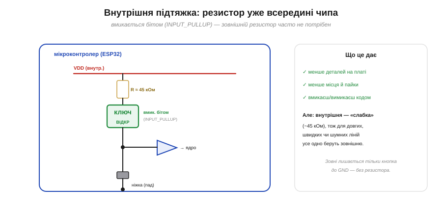
*Рис. 4.4.4.5. Підтяжка вже всередині: резистор (~45 кОм у ESP32) через транзистор-ключ під'єднано до внутрішнього VDD, а ключ вмикає біт `INPUT_PULLUP`. Зовні лишається тільки кнопка до GND — без жодного зовнішнього резистора.*

Зручність очевидна — менше деталей, менше пайки, перемикання прямо з коду. Та є нюанс: внутрішні підтяжки **слабкі**. У ESP32 вони близько **45 кОм** — це чимало, тож для довгих, швидких або шумних ліній внутрішньої може забракнути, і тоді ставлять зовнішню, меншу. Для звичайної кнопки на короткому дроті внутрішньої цілком досить.

Ще дві дрібниці про внутрішні підтяжки варто тримати в голові. По-перше, їхній опір має широкий **розкид** — у даташитах часто дають діапазон, а не точне число, — тож покладатися на конкретні «45 кОм» у розрахунках не варто: це орієнтир, а не константа. По-друге, налаштування підтяжки **скидається при перезавантаженні**: після кожного reset прошивка має знову викликати `pinMode(PIN, INPUT_PULLUP)`, інакше ніжка стартує без неї — класична причина «то працює, то ні» після ввімкнення живлення.

> 🔧 **Навіщо це.** `pinMode(PIN, INPUT_PULLUP)` — ваш найшвидший спосіб прибрати плаваючий вхід без жодного заліза. Призвичайтеся вмикати підтяжку **завжди**, коли налаштовуєте вхід під кнопку: один рядок коду економить резистор і рятує від «привидів» на ніжці. Але якщо лінія довга чи поруч сильні завади — не покладайтеся на кволі 45 кОм, додайте зовнішній резистор на кілька кілоом.

### Застереження ESP32: не всі ніжки однакові

Тут чатує пастка, на якій спотикаються майже всі новачки з ESP32. **Не кожна** ніжка має внутрішню підтяжку.

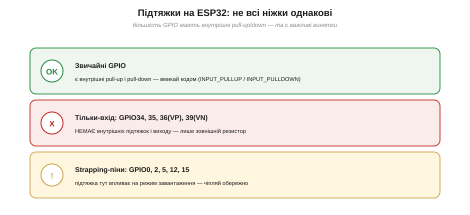
*Рис. 4.4.4.6. Три категорії ніжок ESP32. Звичайні GPIO мають і pull-up, і pull-down. Ніжки «тільки-вхід» GPIO34/35/36/39 не мають **ні** внутрішніх підтяжок, **ні** виходу — лише зовнішній резистор. Strapping-піни (0, 2, 5, 12, 15) при завантаженні читаються як режим, тож підтяжка на них впливає на запуск.*

Ніжки **GPIO34, 35, 36 (VP) і 39 (VN)** — «тільки-вхід»: у них немає ні вихідного каскаду, ні внутрішніх підтяжок. Повісите туди кнопку, розраховуючи на `INPUT_PULLUP`, — і вона не запрацює, бо підтягувати нема чим; для цих ніжок підтяжка **тільки зовнішня**. Окрема обережність — зі **strapping-пінами** (GPIO0, 2, 5, 12, 15): їхній рівень у момент скидання задає **режим завантаження** чипа, тож зайва підтяжка чи притиснута до них кнопка можуть завадити ESP32 нормально стартувати. Це не означає «не використовуй їх» — лише «знай, що там, і чіпляй свідомо».

Практично з усього цього випливає проста звичка: перш ніж обрати ніжку, зазирни в розпіновку плати й переконайся, що вона вміє те, що тобі треба. Для кнопки з внутрішньою підтяжкою бери звичайний GPIO (скажімо, 4, 13, 14, 25, 26, 27), а GPIO34–39 лишай для випадків, де підтяжку даси зовні або вона не потрібна зовсім — як-от аналоговий вхід чи вже готовий цифровий сигнал від іншої мікросхеми. Одна хвилина звірки з розпіновкою економить годину пізнішого «чому воно не реагує».

### Порахуймо: струм підтяжки і кнопка

Відчуймо числами, скільки коштує підтяжка в кнопковій схемі.

**Приклад (струм через кнопку з pull-up).** Кнопка з підтяжкою **R = 10 кОм** до **VDD = 3.3 В**:

```
Кнопка ВІДПУЩЕНА:
   ніжка = HIGH; вхід високоомний, струму майже нема.
   спожив ≈ 0.

Кнопка НАТИСНУТА (ніжка замкнена на GND через кнопку):
   через підтяжку тече  I = VDD / R = 3.3 / 10000 = 0.33 мА
   ніжка сидить на ~0 В = LOW (читаємо 0).

Якщо взяти ВНУТРІШНЮ підтяжку ESP32 (R ≈ 45 кОм):
   I = 3.3 / 45000 ≈ 0.073 мА  — ще ощадніше (бо слабша)

Висновок: струм тече ЛИШЕ поки кнопку натиснуто.
0.33 мА — дрібниця для звичайного пристрою; та якщо кнопку
довго тримають натиснутою в батарейному приладі — беруть
більший R, щоб зменшити цей струм.
```

Числа підтверджують інтуїцію: у спокої кнопкова схема не споживає нічого, а під час натиску струм визначає підтяжка — більший резистор означає менший струм. Тому для рідкісних натисків байдуже, а для довгих утримань в автономних пристроях номінал підбирають ощадніше.

Отже, плаваючий вхід — це ніжка без означеного рівня: вона ловить шум і читається випадково, та ще й марно гріє чіп. Лікують це **підтяжкою** — слабким резистором до VDD (pull-up, спокій HIGH) або до GND (pull-down, спокій LOW); у кнопці це дає логіку active-low «натиснуто = 0». Номінал — компроміс струму й надійності (типово ~10 кОм), а часто й зовсім не потрібен зовні, бо підтяжка вже є **всередині** чипа (`INPUT_PULLUP`, ~45 кОм у ESP32) — з важливим винятком ніжок «тільки-вхід» і strapping-пінів. Та навіть із доброю підтяжкою кнопка приховує ще одну прикрість: механічні контакти, стикаючись, **деренчать**, і один натиск ніжка бачить як пачку швидких 0/1. Цей **дребезг** і способи його приборкати — у [наступній темі §4.4.5](ch22-gpio.md).

## 4.4.5 Дребезг контактів і його придушення (апаратно/програмно)

У §4.4.4 ми зібрали бездоганну кнопку: pull-up тримає чистий HIGH, натиск дає чистий LOW. На схемі — ідеал. А на ділі один-єдиний натиск мікроконтролер часто бачить як **пачку** швидких 0-1-0-1. Винна не електроніка, а **механіка**: коли два металеві контакти стикаються, вони не злипаються миттєво й намертво — вони кілька разів **відскакують**, як упущений на стіл м'ячик, перш ніж завмерти. Це явище звуть **дребезгом контактів** (англ. *contact bounce*), і воно псує життя кожному, хто хоч раз читав кнопку. Ця тема — про те, звідки береться дребезг, чому він ламає логіку й двома шляхами (залізом і кодом) приборкується.

### Що таке дребезг

Кнопка чи перемикач — це пружні металеві контакти. Коли ви тиснете, рухомий контакт **налітає** на нерухомий і, як усяке пружне тіло, **відбивається**: торкнувся — відскочив — торкнувся ближче — знову відскочив — і так кілька разів, доки коливання не згаснуть і контакт не приляже остаточно. Кожен дотик на коротку мить **замикає** коло, кожен відскік — **розмикає**. На лінії це виглядає як швидка серія перемикань між HIGH і LOW, що триває від часу першого дотику до повного заспокоєння.

> 🔌 **Сама деталь.** Що там усередині тактової кнопки, чому в неї чотири ніжки (а кнопка — одна), як її під'єднати й чому дребезг — її природна риса, а не брак: у вставці [Тактова кнопка зсередини](ch22-s5-c-tact-button.md).

> 📜 **Старий ворог.** Дребезг — не клопіт ери мікроконтролерів: телеграфні реле, крокова АТС Строуджера й уся телефонна мережа століття боролися за чистий контакт. Як це було — в історичній вставці [Дребезг старший за електроніку](ch22-s5-history-relay-bounce.md).

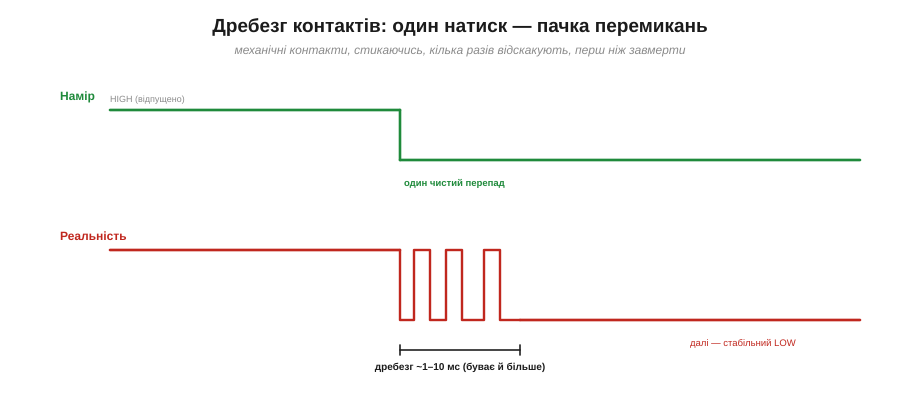
*Рис. 4.4.5.1. Угорі — чого ми хочемо: один чистий перепад HIGH→LOW. Унизу — що насправді: контакт кілька разів відскакує, даючи пачку перемикань протягом ~1–10 мс, і лише потім завмирає в стабільному LOW. Те саме, до речі, стається й при **відпусканні** кнопки.*

Скільки триває дребезг? Залежить від кнопки: від часток мілісекунди до десятків мілісекунд. Інженер Джек Ґанссл (Jack Ganssle) у відомому практичному дослідженні перемкнув десятки різних кнопок і виміряв їхній дребезг — і висновок повчальний: більшість деренчить менш як кілька мілісекунд, але трапляються й значно «балакучіші» екземпляри, а ще дешеві кнопки старіють і деренчать дедалі гірше. Звідси головна порада: не вгадуй «магічне число», а **виміряй або візьми з добрим запасом**. Для практики орієнтир простий — дребезг живе в діапазоні **одиниць–десятків мілісекунд**.

Варто додати дві деталі. По-перше, деренчить не лише замикання, а й **розмикання**: відпускаючи кнопку, контакти так само кілька разів «прощаються», перш ніж розійтися остаточно. По-друге, дребезг **не сталий**: він залежить від сили натиску, кута, а головне — від **зносу**. З часом контакти окиснюються, бруднішають, пружина слабшає — і колись тиха кнопка починає деренчати дедалі довше. Тому debounce — це не разове підлаштування під конкретний екземпляр, а **запас міцності** на все життя пристрою.

### Чому це ламає логіку

Здавалося б, кілька мілісекунд — мить, кого вони обходять? У тім-то й біда, що мікроконтролер **набагато швидший** за цю мить. Ядро ESP32 встигає за мілісекунду виконати сотні тисяч інструкцій, тож воно бачить **кожен** відскік як окрему, цілком справжню подію. Якщо ваш код рахує натиски «за перепадом» (а саме так найприродніше їх ловити — через переривання чи в циклі), то один фізичний натиск даватиме не одну подію, а п'ять, сім, десять.

Цікавий контраст: людина, читаючи ту саму кнопку очима по лампочці, дребезгу б **не помітила** — наше око надто повільне, щоб уловити десяток миготінь за 10 мс. А мікроконтролер на мегагерцах їх усі бачить. І байдуже, як саме ви читаєте ніжку — в циклі опитуванням чи апаратним перериванням: дребезг б'є **обидва** способи. Переривання навіть гірше: кожен відскік — окремий виклик обробника, тож без фільтра лічильник у перериванні розганяється ще охочіше.

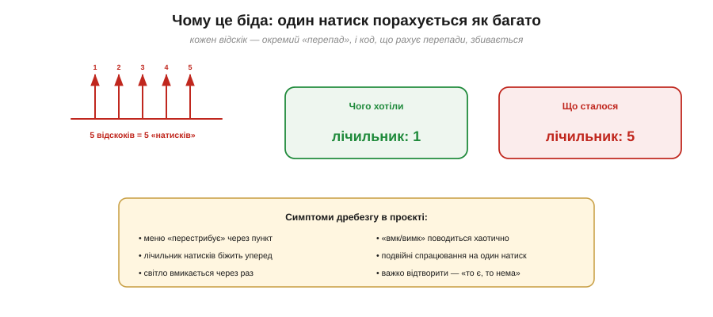
*Рис. 4.4.5.2. П'ять відскоків код сприймає як п'ять натисків: лічильник стрибає на 5 замість 1. Звідси знайомі симптоми — меню «перестрибує» пункт, перемикач світла спрацьовує через раз, кнопка «вмк/вимк» поводиться хаотично. Найгидкіше — що баг **погано відтворюється**: дребезг щоразу трохи інший.*

Парадокс у тому, що сам по собі мікроконтролер працює **бездоганно** — він чесно реагує на кожне перемикання, яке реально є на ніжці. Проблема не в коді й не в чипі, а в фізиці контакту. Тому й розв'язання — це **домовленість**: вважати пачку швидких перемикань протягом короткого вікна за **одну** подію. Реалізувати цю домовленість можна двома шляхами — залізом або кодом.

Перш ніж заглибитися, окинемо обидва оком. **Апаратний** шлях прибирає дребезг фізично — фільтром чи засувкою — ще до того, як сигнал торкнеться ніжки; він коштує зайвих деталей, зате нічого не вимагає від коду й годиться навіть для переривань. **Програмний** не додає жодної деталі, а лише вчить прошивку «не вірити» першим швидким перемиканням; він безкоштовний залізом, але витрачає дрібку процесорного часу й уваги. Обидва добрі — вибір залежить від того, чого в проєкті більше: вільних ніжок і деталей чи вільних тактів.

### Шлях перший, апаратний: RC-фільтр і тригер Шмітта

Згадаймо §4.4.4: лінія з підтяжкою й паразитною ємністю — це вже RC-ланка. Якщо **навмисно** додати конденсатор від ніжки до GND, ця ємність почне **згладжувати** швидкі стрибки: під час відскоків конденсатор не встигає ані повністю зарядитися, ані розрядитися, тож замість гострих 0-1-0-1 на ніжці виходить плавно «розмазаний» перехід. Лишається перетворити цей пологий фронт назад у чистий цифровий — і тут стає в пригоді **тригер Шмітта** з §4.4.3: завдяки гістерезису він перетинає кожен поріг лише раз і видає один акуратний перепад.

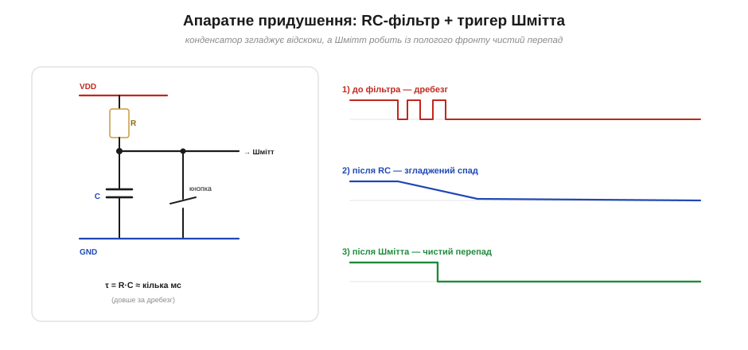
*Рис. 4.4.5.3. Апаратний ланцюжок: (1) до фільтра — дребезг; (2) конденсатор C разом із резистором R згладжує його в пологий спад; (3) тригер Шмітта перетворює пологий фронт на один чистий перепад. Сталу τ = R·C беруть більшою за час дребезгу — кілька мілісекунд.*

Номінал підбирають за тим самим принципом, що в §4.4.4: стала часу **τ = R·C** має бути помітно **довшою** за дребезг (щоб устигнути його згладити), але не настільки довгою, щоб реакція на натиск стала млявою. Кілька мілісекунд — звична величина (наприклад, R = 10 кОм і C = 100 нФ дають τ = 1 мс). Це надійний, «апаратно чесний» спосіб: він прибирає дребезг ще **до** того, як сигнал дійде до ядра, не марнуючи ані такту процесора.

Тонкість, про яку часто забувають: проста схема «pull-up + C» добре гасить дребезг при **відпусканні** (конденсатор неспішно заряджається крізь резистор), але при **натисканні** кнопка замикає конденсатор просто на землю — і той розряджається майже миттєво, тож відскоки на початку натиску можуть проскочити. Класичний засіб — поставити **невеликий послідовний резистор** між кнопкою і вузлом: тоді й розряд іде через опір, і обидва фронти згладжуються однаково. Дрібниця, та саме вона відрізняє «майже працює» від «працює завжди».

> 🔧 **Навіщо це.** Якщо кнопка вмикає щось критичне або висить на лінії переривання, де програмний debounce незручний, — поставте RC-фільтр прямо біля кнопки. Конденсатор на 100 нФ і резистор-підтяжка — копійчані деталі, а сигнал у мікроконтролер приходить уже чистий. Особливо це доречно, коли на тій самій ніжці ви хочете й апаратне переривання (про переривання — наступний розділ далі в модулі): чистий фронт там безцінний.

### Ідеальне залізо: SR-засувка для перекидного перемикача

Є й «золотий стандарт» апаратного придушення — **SR-засувка** (set-reset latch) у парі з **перекидним** (трипозиційним, SPDT) перемикачем. Ідея елегантна: щойно рухомий контакт торкнувся полюса A, засувка **запам'ятовує** цей стан і тримає його. Подальші відскоки контакта від A нічого не міняють — адже до протилежного полюса B контакт навіть не наближався, а змінити стан засувки може лише дотик до **іншого** полюса. Дребезг зникає не «згладжуванням», а **логічно**: повторні торкання того самого полюса засувці байдужі.

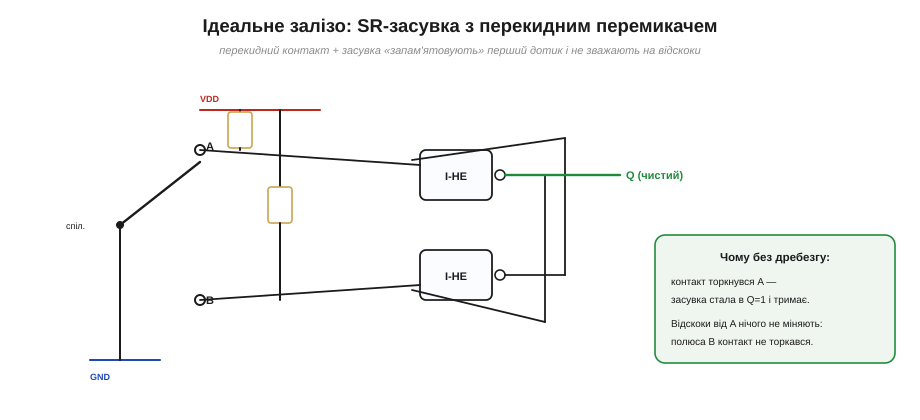
*Рис. 4.4.5.4. Перекидний перемикач і засувка на двох вентилях «І-НЕ». Дотик до полюса A ставить засувку в Q=1, і вона тримає цей стан. Відскоки від A не діють — щоб перекинути Q, контакт мусить торкнутися полюса B. Дребезг усунено самою логікою, без жодних таймінгів.*

Спосіб бездоганний, але має ціну: потрібен саме **перекидний** перемикач (три виводи), а звичайна кнопка-«пімпочка» його не має. Тому SR-засувку ставлять там, де перемикач і так трипозиційний (важелі, тумблери), а для простих кнопок частіше беруть RC або код.

### Шлях другий, програмний: зачекати й перечитати

Найпростіший програмний debounce — **«зачекати й перечитати»**. Алгоритм такий: помітили зміну рівня на ніжці → **зачекали** трохи довше за час дребезгу (зазвичай ~20 мс) → **перечитали** рівень. Якщо він і досі той самий — це справжній натиск, приймаємо; якщо ні — то був дребезг, ігноруємо. Ми просто **пропускаємо** галасливе вікно й дивимося на лінію тоді, коли вона вже завмерла.

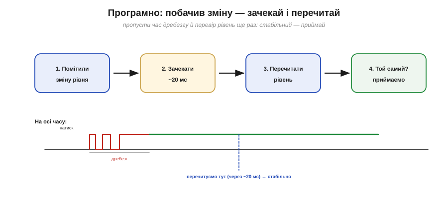
*Рис. 4.4.5.5. «Зачекати й перечитати»: після першої поміченої зміни код витримує паузу ~20 мс — довшу за дребезг, — і лише потім читає рівень. На осі часу видно: пачка відскоків відбувається на початку, а перевірка припадає на спокійну ділянку, тож читання стабільне.*

У найгрубішому вигляді цю паузу роблять блокувальною (`delay(20)`), і для простих скетчів цього досить: 20 мс людина не відчує, адже сам натиск триває ~100 мс. Та блокувати весь мікроконтролер на 20 мс заради однієї кнопки — марнотратство; правильніше відмірювати ці 20 мс **неблокувально**, через лічильник часу, який докладно розберемо в розділі про таймери далі в модулі. Зараз важлива сама ідея: дивитися на лінію після того, як дребезг ущух.

Є й третій програмний прийом — **блокування на час** (lockout): прийняти перше ж перемикання, а далі на ~20–50 мс просто **ігнорувати** будь-які зміни, поки дребезг ущухне. Він дає миттєву реакцію на перший дотик — на відміну від «зачекати й перечитати», що відповідає із затримкою, — але вимагає певності, що перше перемикання справжнє. Кожен із прийомів має свою нішу; об'єднує їх та сама думка — стиснути галасливе вікно в **одну** подію.

### Надійніше: N однакових відліків поспіль

Ще стійкіший програмний підхід — **інтегратор**, або «N однакових відліків». Замість одного перечитування ми **регулярно опитуємо** ніжку (скажімо, кожні 2 мс) і змінюємо збережений стан лише тоді, коли новий рівень протримався **N разів поспіль**. Один-два випадкові відскоки серед відліків лічильник щоразу **скидають**, тож пробитися крізь фільтр може лише по-справжньому стабільний рівень.

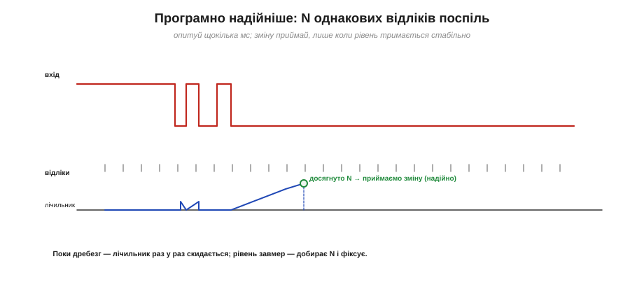
*Рис. 4.4.5.6. Інтегратор: ніжку опитують рівними відліками. Поки триває дребезг, лічильник однакових значень раз у раз скидається; коли рівень завмер, лічильник спокійно добирає N відліків — і аж тоді зміну приймають. Підхід чудово лягає на неблокувальний таймер.*

Цей спосіб не лише прибирає дребезг, а й гасить випадкові електричні «вкрапи»: одиничну наводку лічильник теж відкине, бо вона не протримається N відліків. Тому інтегратор люблять у відповідальних пристроях — він заразом і debounce, і фільтр шуму.

Ще один бік програмного підходу — **виявлення фронту**. Нас зазвичай цікавить не сам рівень, а **момент зміни**: перехід «відпущено→натиснуто». Тому код тримає **попередній** стабільний стан кнопки й оголошує «натиск» лише тоді, коли новий стійкий стан **відрізняється** від попереднього. Кожну кнопку фільтрують **окремо** — зі своїм збереженим станом і своїм лічильником, — інакше один debounce плутав би сусідів. По суті, кожна кнопка стає крихітним **автоматом станів**: «спокій → можливий натиск → підтверджено».

> ⚙️ **Три способи в коді.** Лічильник однакових відліків, мітка часу (не блокуючи цикл) і повноцінний автомат станів — три ідіоми антидребезгу з псевдокодом і порівнянням — у вставці [Антидребезг у коді](ch22-s5-a-debounce.md).

> 🔧 **Навіщо це.** Залізо чи код — як обрати? Програмний debounce **безкоштовний** за деталями, але «їсть» такти процесора й додає трохи затримки. Апаратний (RC, засувка) **розвантажує** код і дає чистий фронт навіть для переривань, але коштує зайвих компонентів і місця на платі. На практиці часто **поєднують**: дешевий RC згладжує найгірше, а легкий програмний фільтр доводить справу. Головне — **завжди** усувати дребезг там, де натиск щось рахує чи перемикає; «само воно не розсмокчеться».

### Порахуймо: вікно debounce

Підберімо числа для типової кнопки.

**Приклад (вибір вікна debounce).** Кнопка деренчить до ~10 мс; оберімо параметри двох програмних способів:

```
Запас: вікно debounce беремо більшим за дребезг → T = 20 мс.

Спосіб «зачекати й перечитати»:
   зміна → пауза 20 мс → перечитати.
   затримка реакції ≤ 20 мс — для людини непомітно
   (натиск триває ~100 мс, реакція людини ~150 мс).

Спосіб «N однакових» (опитування кожні 2 мс):
   треба N = 5 однакових поспіль, щоб прийняти:
   час підтвердження = N × період = 5 × 2 мс = 10 мс.
   менший період або більший N → надійніше, але повільніше.

Правило: вікно debounce > найдовшого дребезгу твоєї кнопки,
   але < ~50 мс, щоб натиск лишався «миттєвим» для людини.
```

Висновок інтуїтивно зрозумілий: вікно фільтра має бути **досить довгим**, щоб перекрити дребезг, і **досить коротким**, щоб людина не відчула затримки. Між «довшим за дребезг» (~10–20 мс) і «коротшим за людську непомітність» (~50 мс) лежить зручний коридор, у який майже завжди легко влучити.

Отже, дребезг — це механічні відскоки контактів (одиниці–десятки мілісекунд), які надто швидкий мікроконтролер чесно сприймає як багато окремих натисків. Лікують його залізом (RC-фільтр + тригер Шмітта; для перекидних перемикачів — SR-засувка) або кодом («зачекати й перечитати»; надійніше — N однакових відліків), а часто й поєднанням обох. Спільна ідея проста: **вважати пачку швидких перемикань за одну подію**. Ми вже двічі обережно згадували слово «межа струму»: ніжка тримає рівень не безмежно сильно, і світлодіод чи реле не можна вішати на неї як завгодно. Скільки струму ніжка справді витримує і як її захистити — розбирає [наступна тема §4.4.6](ch22-gpio.md).

## 4.4.6 Навантажувальна здатність і захист ніжки (source/sink ліміти)

У §4.4.1 ми побачили, що вихід не просто «оголошує» рівень, а **активно тримає** його, віддаючи чи приймаючи струм через транзистори. Тоді ми двічі обіцяли повернутися до питання: а **скільки** струму ніжка здатна так пропустити, перш ніж постраждати? Це питання не академічне: переплутати тут — означає буквально **спалити** ніжку (а часом і весь чіп). Ця тема — про межі струму ніжки (окремо «віддавати» й «приймати»), про те, що стається при перевищенні, і про три класичні способи захисту: **резистор** біля світлодіода, **транзистор-ключ** для великих навантажень і **діод** для індуктивних. Заразом розберемо, як уберегти ніжку-**вхід** від завеликої напруги.

### Source і sink: віддавати чи приймати струм

Згадаймо двотактний каскад. Коли ніжка в **HIGH**, відкрито верхній транзистор — ніжка з'єднана з VDD, і струм тече **з** ніжки в навантаження (далі — на GND). Це називають **source** (ніжка — «джерело» струму). Коли ніжка в **LOW**, відкрито нижній транзистор — ніжка з'єднана з GND, і струм тече **в** ніжку (з навантаження, що висить на VDD). Це **sink** (ніжка «поглинає» струм). Те саме залізо, лише напрямок струму протилежний.

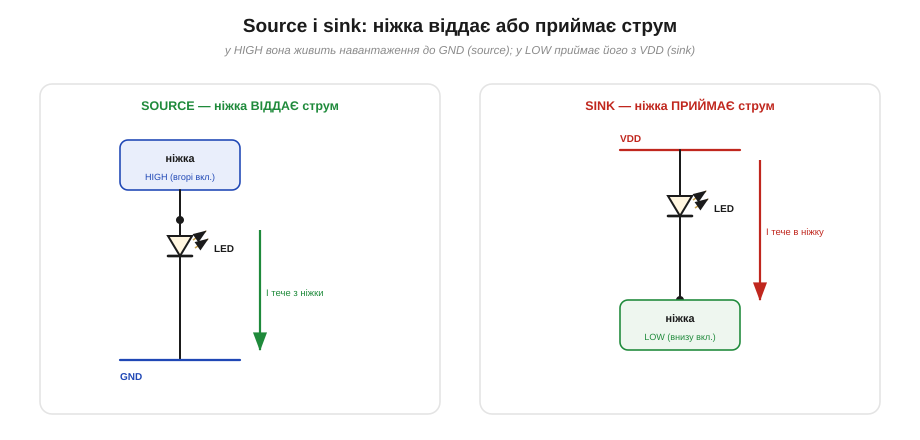
*Рис. 4.4.6.1. Дві ролі ніжки-виходу. Ліворуч — **source**: ніжка в HIGH живить світлодіод, що йде на GND, і струм витікає з ніжки. Праворуч — **sink**: світлодіод висить на VDD, ніжка в LOW «притягує» його катод до землі, і струм втікає в ніжку. Звідси й світлодіод можна засвітити двома способами — «від ніжки» або «в ніжку».*

Чому це важливо розрізняти? Бо в багатьох мікросхемах межі для source і sink **різні**: історично нижній транзистор (sink) часто міцніший, тож деякі чипи приймають більший струм, ніж віддають. До того ж саме від ролі залежить, як підмикати навантаження: світлодіод «у ніжку» (sink, катодом до ніжки) світитиметься, коли на ніжці **LOW** — знову та сама інверсна логіка, що з кнопкою в §4.4.4. Тримаймо обидві ролі в голові: «віддаю» і «приймаю» — це різні половини двотактного каскаду.

Тут варто пов'язати з §4.4.2: open-drain вихід уміє **лише приймати** (sink) — верхнього транзистора в нього нема, тож «віддавати» (source) він не може взагалі. Саме тому світлодіод до open-drain ніжки чіпляють катодом, щоб ніжка **притягувала** його до землі. Та й у звичайних двотактних ніжках схему «sink» (світлодіод від VDD у ніжку) часто люблять більше: нижній транзистор зазвичай міцніший, тож рівень LOW він тримає твердіше, ніж верхній — HIGH.

### Скільки струму — межа однієї ніжки

Тепер головне число. Кожна ніжка має **межу струму** — скільки вона безпечно пропустить. У ESP32 орієнтир такий: **близько 20 мА** у нормальній роботі й **близько 40 мА** як абсолютна стеля (силу виходу навіть можна налаштувати — від кількох до сорока мА). Перейдеш цю стелю — і фізика бере своє.

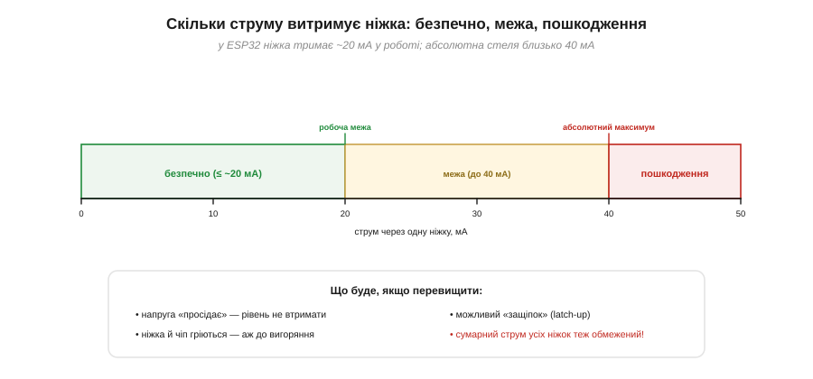
*Рис. 4.4.6.2. Шкала струму однієї ніжки ESP32: зелена зона (≤ ~20 мА) — безпечна робота; жовта (до ~40 мА) — гранична, на свій ризик; червона (понад 40 мА) — пошкодження. І окремо: сумарний струм **усіх** ніжок теж обмежений можливостями виводів живлення чипа.*

Що саме стається при перевищенні? По-перше, напруга на ніжці **просідає**: транзистор має свій внутрішній опір, і чим більший струм ви тягнете, тим більше на ньому «губиться» вольтів — рівень HIGH може впасти настільки, що приймач уже не впізнає одиницю (згадаймо пороги з §4.4.3). По-друге, на тому опорі виділяється **тепло** — ніжка й кристал гріються, аж до незворотного вигоряння. По-третє, у важких випадках спрацьовує **«защіпка»** (latch-up) — паразитна структура всередині чипа «замикається» накоротко й тягне руйнівний струм. А ще є **сумарна** межа: навіть якщо кожна ніжка окремо в нормі, усі разом течуть через спільні виводи живлення, які теж не безмежні. Тож бюджет струму рахують **двічі** — на ніжку й на весь чіп.

Те, що силу виходу можна **налаштувати**, — не дрібниця. Слабше налаштування ніжки менше гріє й менше «дзвенить» (дає чистіший фронт без викидів і завад), зате повільніше перемикає важке навантаження; сильніше — навпаки, швидше, але електрично галасливіше. Тому за замовчуванням беруть помірне (близько 20 мА) і піднімають лише там, де треба швидко гнати ємнісну лінію. Це ще один компроміс «швидко проти чисто», як ми вже бачили з підтяжками в §4.4.4.

> 🔧 **Навіщо це.** Запам'ятайте робочий орієнтир: **~20 мА на ніжку** — і живіть спокійно. Один звичайний світлодіод (через резистор) — це якраз кілька мА, тож пряме керування LED — нормально. А от реле, моторчик, лампа, смужка світлодіодів, динамік — це десятки й сотні мА; вішати їх **просто на ніжку не можна**. Перш ніж щось підмикати, грубо прикиньте струм навантаження й порівняйте з 20 мА: більше — потрібен підсилювач (транзистор), про який нижче.

### Найчастіший випадок: світлодіод і резистор

Найперше навантаження кожного початківця — світлодіод. І найперша помилка — підмкнути його до ніжки **без резистора**. Світлодіод сам по собі майже не обмежує струму: щойно напруга на ньому перевищує поріг (для червоного ~2 В), його опір стрімко падає, і він пропускає скільки дадуть. «Скільки дадуть» — це десятки мА, що миттю виходять за межу ніжки. Резистор послідовно з LED і **задає** струм у безпечне русло, і **береже** ніжку: він бере на себе різницю напруг і обмежує струм за законом Ома.

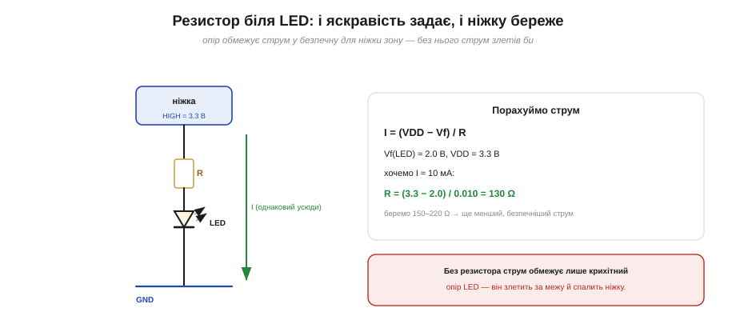
*Рис. 4.4.6.3. Резистор послідовно зі світлодіодом: струм один на весь ланцюжок, I = (VDD − Vf)/R. Для VDD = 3.3 В, Vf ≈ 2.0 В і бажаних 10 мА виходить R ≈ 130 Ω (беруть 150–220 Ω). Без резистора струм обмежував би лише крихітний власний опір LED — і ніжка згоріла б.*

Це той самий розрахунок, що ми вже бачили в §4.4.1, але тепер ясний його **другий** сенс: резистор тут не лише «про яскравість», а й **запобіжник** для ніжки. Узяти опір трохи більшим за розрахунковий — безпечніше (трохи тьмяніше світло, зате менший струм). Це найдешевший захист в електроніці: одна копійчана деталь рятує ніжку.

> 🧮 **Два бюджети й колір світлодіода.** Ніжка має дві межі — свою й чипа в сумі, — а резистор світлодіода рахують за кольором (синій/білий на 3.3 В капризні!). Формула, таблиця й розрахунок запасу — у вставці [Бюджет ніжки й порту](ch22-s6-m-pin-budget.md).

### Коли навантаження завелике: транзистор-ключ

А якщо навантаження таки більше за 20 мА — реле, моторчик, потужна стрічка? Тоді ніжка керує не самим навантаженням, а **транзистором**, що працює **ключем**. Ідея проста й могутня: ніжка подає крихітний струм на **затвор** (gate) польового транзистора — а той своїм каналом пропускає **великий** струм навантаження, узятий із **окремого** живлення. Ніжка майже не навантажується (затвор бере мізер), а вся «сила» тече повз неї.

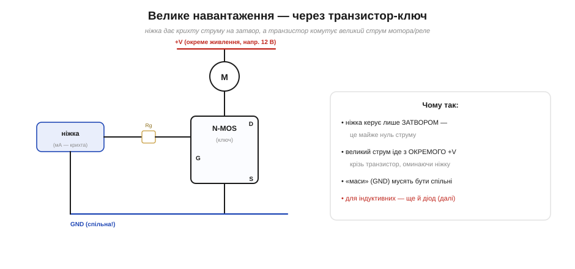
*Рис. 4.4.6.4. Велике навантаження вмикають транзистором. Ніжка через невеликий резистор керує затвором N-MOS; великий струм мотора йде з окремого живлення +V крізь транзистор на GND, оминаючи ніжку. Обов'язкова умова — **спільна земля** (GND) у мікроконтролера й силового живлення.*

Кілька важливих деталей. По-перше, **спільна земля**: «мінуси» мікроконтролера й силового живлення мусять бути з'єднані, інакше транзистор не «бачитиме» рівня від ніжки. По-друге, невеликий резистор у затворі (Rg) стримує кидок струму при перемиканні. По-третє, для звичайного логічного N-MOS ніжки 3.3 В часто досить, щоб відкрити його повністю, — але це треба перевіряти за порогом конкретного транзистора (буває, потрібен «logic-level» тип). Так одна слабка ніжка керує хоч мотором, хоч лампою — вона лише «натискає кнопку», а тягне струм транзистор.

Ключем може бути не лише польовий (MOSFET), а й біполярний (BJT) транзистор — тоді ніжка керує ним через струм бази (і резистор бази обов'язковий). MOSFET зручніший тим, що затвор бере майже нуль струму, тож сьогодні його беруть частіше. Є й інша вісь вибору: вмикати навантаження **знизу** (ключ між навантаженням і GND — простіше, наш випадок) чи **зверху** (між +V і навантаженням — складніше, та інколи потрібне). Для перших кроків досить нижнього ключа на N-MOS.

> 🔧 **Навіщо це.** Правило-рятівник: **усе, що сильніше за світлодіод, — через транзистор**. Спроба крутнути моторчик «прямо з ніжки» закінчується спаленою ніжкою (а часто й просадкою живлення, від якої перезавантажується весь чіп). Транзистор-ключ — копійчаний і простий; для індуктивних навантажень додайте до нього ще й діод, про який — просто зараз.

### Індуктивне навантаження: захисний діод

Реле, мотор, соленоїд мають **котушку** — індуктивність. А котушка має вперту властивість: вона **опирається зміні струму**. Поки транзистор увімкнено, крізь котушку тече струм. Щойно транзистор **вимикається**, котушка щосили намагається той струм **зберегти** — і, не маючи куди його дівати, **підстрибує напругою** на своїх кінцях до сотень вольтів (фізика: U = L·dI/dt, а різке вимкнення — це величезне dI/dt). Цей викид (його звуть зворотною ЕРС, back-EMF) б'є просто по транзистору й здатен його пробити, а наводкою дістати й ніжку.

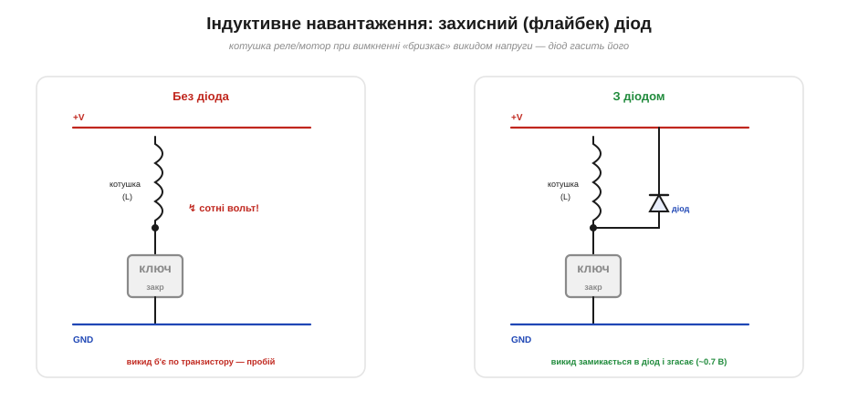
*Рис. 4.4.6.5. Ліворуч — без діода: вимкнення котушки дає викид у сотні вольт, що пробиває транзистор. Праворуч — захисний (флайбек) діод увімкнено паралельно котушці зворотно; при вимкненні струм котушки замикається крізь нього й спокійно згасає, а напруга обмежується лише ~0.7 В понад живлення.*

Ліки відомі й дешеві — **захисний (флайбек) діод** паралельно котушці, увімкнений «зворотно» (катодом до плюса). У звичайній роботі він замкнений і не заважає. А в мить вимкнення, коли котушка «бризкає» викидом, діод **відмикається** й дає струмові безпечний шлях по колу — той циркулює крізь котушку й діод, поступово згасаючи, а напруга на транзисторі лишається безпечною. Без перебільшення: на будь-якій котушці, що комутується транзистором, флайбек-діод **обов'язковий** — це не «покращення», а необхідність.

### Захист входу: послідовний резистор і діоди-обмежувачі

Досі йшлося про ніжку-вихід. Та ніжку-**вхід** теж треба берегти — від завеликої або від'ємної напруги. На щастя, всередині майже кожної ніжки вже є два **діоди-обмежувачі** (clamp/ESD-діоди): один до VDD, другий до GND. Якщо напруга на ніжці підскочить вище VDD, верхній діод відмикається й **відводить** надлишок у шину живлення; якщо впаде нижче нуля — нижній діод відводить струм із GND. Так ніжка лишається в безпечному «коридорі» від ~0 до VDD.

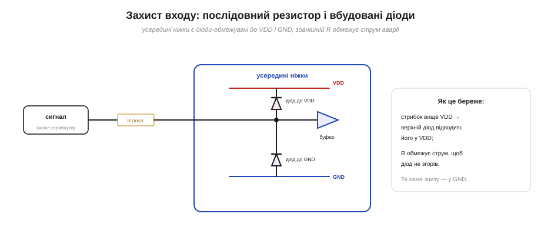
*Рис. 4.4.6.6. Усередині ніжки — діоди-обмежувачі до VDD і GND, що відводять викиди напруги. Та самі вони слабкі, тож зовнішній **послідовний резистор** обмежує струм аварії крізь них, рятуючи й діоди, і чіп. Той самий резистор гасить і статичні розряди (ESD).*

Але ці діоди **слабкі** — пропустити крізь себе великий струм надовго вони не можуть і самі згорять. Тому зовнішній **послідовний резистор** (одиниці–десятки кілоом) на лінії входу — добра звичка: він **обмежує** струм крізь обмежувальні діоди під час викиду, рятуючи їх. Саме тут коріниться застереження з §4.4.3, що ESP32 **не 5-вольтотерпимий**: подаси 5 В прямо на 3.3-вольтову ніжку — і верхній діод почне відводити струм у VDD без упину, аж поки не згорить. Послідовний резистор (а краще — дільник чи перетворювач рівнів) і робить таке з'єднання безпечним. Той самий резистор заразом гасить і **статичні розряди** (ESD) з пальців та одягу.

Береже резистор і у зворотний бік. Ніжку-**вихід** не можна замикати просто на VDD чи GND — у §4.4.1 ми бачили, що це фактично коротке замикання; а якщо така помилка можлива в монтажі, послідовний резистор обмежить струм аварії. Платою за захист на вході є невелике сповільнення: резистор разом із ємністю входу — це знову RC-ланка (§4.4.4), тож надто великий опір «розмаже» швидкий сигнал. Для повільних входів (кнопки, рівні) це байдуже, для швидких — резистор беруть помірний.

### Порахуймо: бюджет струму

Зведімо все в один числовий приклад — від світлодіода до реле.

**Приклад (бюджет струму).**

```
1) Світлодіод через резистор:
   Vf ≈ 2.0 В, VDD = 3.3 В, R = 220 Ω
   I = (3.3 − 2.0) / 220 = 1.3 / 220 ≈ 5.9 мА
   5.9 мА < 20 мА  →  ніжці безпечно, LED світить. OK.

2) Вісім таких світлодіодів на восьми ніжках:
   кожна ніжка:  ~6 мА   (окремо — OK)
   сумарно:      8 × 6 = 48 мА через спільні VDD/GND
   →  перевіряй СУМАРНИЙ ліміт чипа, не лише поніжковий!

3) Реле 12 В, котушка тягне 60 мА:
   60 мА  >>  20 мА  →  напряму на ніжку НЕ можна.
   рішення: транзистор-ключ + флайбек-діод (обов'язково).
```

Приклад показує всю логіку розділу разом: один світлодіод ніжці по силі; вісім — уже привід згадати про **сумарну** межу; реле — однозначно через транзистор і з діодом. Звичка рахувати цей бюджет **до** того, як щось підмкнути, економить спалені ніжки й годинами не відтворювані «загадки».

Отже, ніжка тримає рівень не безмежно: у ESP32 безпечно близько 20 мА (стеля ~40 мА), і є ще сумарна межа на весь чіп. Світлодіод вмикають **через резистор** (він і яскравість задає, і ніжку береже), сильніші навантаження — **через транзистор-ключ** (ніжка керує затвором, силу тягне окреме живлення), а індуктивні — обов'язково з **флайбек-діодом**. Вхід же береже **послідовний резистор** разом із вбудованими діодами-обмежувачами. Ми пройшли ніжку наскрізь — від транзисторів усередині до захисту назовні. Лишилося звести все докупи з боку **коду**: як прошивка керує цілими портами ніжок через регістри й бітові маски — швидко й по кілька ніжок разом. Це [наступна тема §4.4.7](ch22-gpio.md).

## 4.4.7 GPIO у прошивці: регістри й маски (швидкодія)

Дотепер ми дивилися на ніжку очима електрика — транзистори, струми, пороги. Тепер погляньмо очима **програміста**. У §4.1.3 ми вже з'ясували головне: периферія керується через **регістри** — особливі комірки в адресному просторі, де кожен біт щось вмикає чи показує (memory-mapped IO). GPIO — найясніший приклад цього принципу. Уся ця тема — про те, як код **торкається** ніжок напряму: який регістр за що відповідає, як бітовою **маскою** чіпнути одну ніжку, не зачепивши сусідніх, чому `digitalWrite` зручний, але повільний, і як змінити кілька ніжок **одночасно** однією дією.

### Регістр GPIO_OUT: один біт — одна ніжка

Стан усіх вихідних ніжок порту зібрано в **одному** регістрі — у ESP32 він зветься `GPIO_OUT`. Це 32-бітна комірка з фіксованою адресою, і кожен її біт відповідає одній ніжці: біт 0 — це GPIO0, біт 5 — GPIO5, і так далі. Записати «1» у біт n — ніжка GPIOn стає HIGH; записати «0» — стає LOW. Усе керування виходом зводиться до того, щоб **поставити потрібні біти** в цій комірці.


*Рис. 4.4.7.1. Регістр `GPIO_OUT` — 32 біти, по одному на ніжку. На малюнку біти 5 і 2 стоять у «1», тож GPIO5 і GPIO2 — HIGH; решта в «0» — LOW. Рівні **входів** так само читають із дзеркального регістра `GPIO_IN`, біт за бітом.*

Це пряме втілення ідеї з §4.1.3: «торкнутися заліза» означає **записати число у відому адресу**. Ніякої магії — лампочка спалахує тому, що в певному біті певної комірки з'явилася одиниця, і двотактний каскад (§4.4.1) приєднав ніжку до VDD.

Симетрично влаштовано читання й напрям. Рівні **входів** чіп складає в дзеркальний регістр `GPIO_IN`: прочитати його біт n — те саме, що зробити `digitalRead(n)`. А чи буде ніжка взагалі виходом, вирішує ще один регістр — `GPIO_ENABLE`: одиниця в його біті вмикає вихідний каскад, нуль лишає ніжку входом. Тобто три речі — «куди» (напрям), «що видати» (вихід) і «що там» (вхід) — це три окремі регістри, кожен по біту на ніжку.

### digitalWrite — це зручна обгортка

Чому ж тоді ми досі писали `digitalWrite(2, HIGH)`, а не чіпали регістр? Бо `digitalWrite` — **дружня обгортка** над тим самим записом у регістр. Усередині вона робить чимало роботи: за **номером піна** знаходить, який саме регістр і який біт йому відповідають, виконує перевірки (чи коректний пін, чи не зайнятий він периферією), а вже **потім** робить власне запис. Усе це коштує часу — на ESP32 один `digitalWrite` забирає **близько мікросекунди**. Прямий запис у регістр виконується за **одиниці–десятки наносекунд** — у десятки разів швидше.

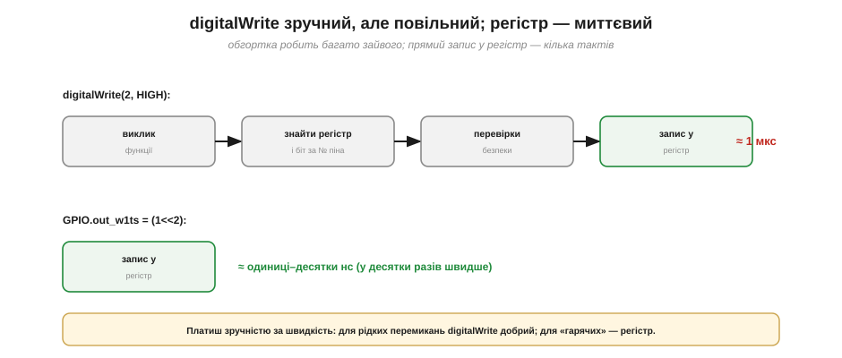
*Рис. 4.4.7.2. `digitalWrite` — це виклик функції: пошук регістра й біта за номером піна, перевірки безпеки й лише потім запис (~1 мкс). Прямий запис у регістр (`GPIO.out_w1ts = (1<<2)`) — одна машинна дія (~наносекунди). Зручність обгортки оплачується швидкістю.*

Висновок не «ніколи не вживайте `digitalWrite`», а **доречність**. Для звичайного коду, де ніжку перемикають зрідка, обгортка ідеальна: читабельна, безпечна, переносна між платами. Та коли треба «бити» ніжкою дуже **часто** й **точно** — формувати власний протокол «руками» (це називають *bit-banging*), видавати точні фронти, крутити крок мотора — мікросекунда на кожне перемикання стає неприпустимою розкішшю, і тоді спускаються на рівень регістрів.

Варто розуміти, **звідки** береться та мікросекунда. Левова частка — не сам запис (він миттєвий), а **пошук**: перетворити людський номер піна на адресу регістра й номер біта та ще перевірити купу умов. Саме за цю універсальність — той самий `digitalWrite(2, HIGH)` працює і на ESP32, і на Arduino Uno, і на сотні інших плат — ми й платимо швидкістю. Це загальний закон, який ми вже бачили з фреймворками (§4.2.7): **шар абстракції зручний і переносний, але повільніший за «голий» доступ**. Інженер обирає рівень свідомо, під задачу.

### Бітові маски: чіпнути один біт, не зачепивши інших

Головна складність прямої роботи з регістром: усі 32 ніжки сидять в **одній** комірці, а змінити нам треба зазвичай **одну**. Тут і потрібні **бітові маски**. Маска однієї ніжки — це число, де стоїть одиниця рівно в потрібному біті: `(1 << n)` (одиниця, зсунута ліворуч на n позицій). А далі — чотири базові операції побітної логіки з Модуля 3:

```
маска однієї ніжки:   mask = (1u << n)

увімкнути (set):    GPIO_OUT |=  mask;   // АБО: ставить біт у 1
вимкнути (clear):   GPIO_OUT &= ~mask;   // І з ~mask: ставить біт у 0
перемкнути (toggle):GPIO_OUT ^=  mask;   // ВИКЛЮЧНЕ-АБО: міняє біт
прочитати (read):   рівень = (GPIO_IN >> n) & 1;
```

Кожна працює «хірургічно»: чіпає лише свій біт, а решту лишає недоторканими. `|=` з маскою піднімає потрібний біт у 1 (бо «АБО 1» дає 1, «АБО 0» не змінює); `&= ~mask` саджає його в 0 (бо «І 0» дає 0, «І 1» не змінює); `^=` перевертає (бо «ВИКЛЮЧНЕ-АБО 1» інвертує); а `(REG >> n) & 1` зсуває потрібний біт у наймолодшу позицію й маскою «1» відрізає все зайве.


*Рис. 4.4.7.3. Чотири операції з маскою `(1<<3)`: **set** (`|=`) піднімає біт 3 у 1; **clear** (`&= ~`) саджає його в 0; **toggle** (`^=`) перевертає; **read** (`>>3 & 1`) видобуває його значення. Сусідні біти (ніжки) щоразу лишаються без змін.*

> 🔧 **Навіщо це.** Маски `(1<<n)` — це абетка вбудованого програмування; ви зустрічатимете їх скрізь, не лише в GPIO. Запам'ятайте трійцю: **`|=` увімкнути, `&= ~` вимкнути, `^=` перемкнути**. Найчастіша помилка початківця — написати `REG = mask` замість `REG |= mask`: перше **затирає всі інші ніжки** нулями, друге чіпає лише потрібну. Знак «дорівнює» без операції в роботі з регістрами — майже завжди баг.

Ще дві технічні дрібниці. По-перше, маску пишуть як `(1u << n)` — з `u` (unsigned): зсуви на велике число у знакових типах поводяться підступно, а беззнаковий тип безпечний. По-друге, для ширших **полів** (кількох сусідніх бітів) маску будують із кількох одиниць, і перед записом нового значення спершу **очищають** старі біти (`&= ~поле`), а вже тоді вставляють нові (`|= нове`) — інакше залишки старого зіпсують результат. Це той самий принцип «прочистити, потім записати», лише для групи бітів.

### Атомарність: регістри W1TS і W1TC

У записі `GPIO_OUT |= mask` причаїлася пастка. Ця коротка стрічка насправді — **три** окремі дії: прочитати регістр, виконати АБО з маскою, записати результат назад («читати-змінити-записати», read-modify-write). А що, як між кроком «прочитати» і кроком «записати назад» втрутиться **переривання** (наступний розділ далі в модулі) і теж змінить `GPIO_OUT`? Тоді ваш запис назад **затре** його зміну — і одна з ніжок «загубиться». Це класична **гонка даних**.


*Рис. 4.4.7.4. Угорі — небезпека: `REG |= mask` складається з трьох дій, і втручання між ними псує результат. Унизу — рятунок: окремі регістри `W1TS` (write-1-to-set) і `W1TC` (write-1-to-clear). Записуєш маску — і залізо саме ставить (чи скидає) **лише** ті біти, де в масці 1, не чіпаючи решти, **однією неподільною дією**.*

Розв'язання вбудоване в сам чіп — **окремі регістри** для встановлення й скидання бітів. Запис маски в `GPIO_OUT_W1TS` (*write-1-to-set*) **встановлює** ті біти, де в масці одиниця, а решту лишає як є; запис у `GPIO_OUT_W1TC` (*write-1-to-clear*) — **скидає** їх. Жодного «прочитати» не потрібно: ти не чіпаєш цілий регістр, а лише кажеш залізу «постав оці біти» — і воно робить це **атомарно**, однією дією, яку нічим не перервати посередині. Тому в надійному коді (особливо там, де ніжки чіпають і головний цикл, і переривання) користуються саме W1TS/W1TC, а не `|=`/`&=`.

> 🔧 **Навіщо це.** Якщо колись ніжка «самовільно» скидається або не вмикається в програмі з перериваннями — підозра номер один саме тут: десь `|=`/`&=` зіткнулися з перериванням. Лік простий: замінити їх на атомарні `out_w1ts`/`out_w1tc`. Це той випадок, коли «правильний» регістр позбавляє цілого класу плаваючих, важко відтворюваних багів.

Цей прийом ширший за GPIO. Майже вся периферія мікроконтролера керується регістрами, і скрізь, де біт чіпають і головний код, і переривання, чигає та сама гонка — тож апаратні «set/clear» регістри (під різними назвами) трапляються по всьому чипу. Є й програмна альтернатива, коли атомарного регістра нема: на час «читати-змінити-записати» **тимчасово вимкнути переривання** (критична секція). Але якщо залізо дає W1TS/W1TC — це і простіше, і дешевше, ніж вимикати переривання.

### Кілька ніжок одним записом — синхронно

Є ще одна суперсила прямої роботи з регістром, якої `digitalWrite` дати **не може** в принципі. Оскільки всі ніжки лежать в одній комірці, **одним** записом можна змінити **відразу кілька** — і всі вони перемкнуться в **ту саму мить**. А послідовні `digitalWrite` неминуче **зсунуті** в часі: поки відпрацює перший, минає мікросекунда, потім другий, третій — фронти «розповзаються».


*Рис. 4.4.7.5. Чотири `digitalWrite` піднімають ніжки по черзі — фронти зсунуті на мікросекунди. Один масковий запис `GPIO.out_w1ts = (1<<2)|(1<<3)|(1<<4)|(1<<5)` піднімає всі чотири **одночасно**. Для паралельної шини, кроку мотора чи точних фронтів ця синхронність — вирішальна.*

Збирають таку маску об'єднанням окремих масок через АБО: `(1<<2)|(1<<4)|(1<<5)`. Це незамінне там, де кілька ліній мусять змінитися **разом**: паралельна шина даних (усі біти байта виставити одночасно), керування кроковим мотором (фази), формування синхронних сигналів. Жодна послідовність `digitalWrite` такого не дасть — лише один запис у регістр.

Маленька, але важлива умова: синхронно, однією дією, змінюються лише ніжки **одного** регістра. На ESP32, де ніжки поділено на групи 0–31 і 32–39, об'єднати в одному записі можна тільки ніжки з тієї самої групи; «змішані» доведеться писати двома діями — тобто вже не зовсім одночасно. Тому, проєктуючи паралельну шину чи будь-що, що мусить перемикатися **строго разом**, ніжки під неї добирають із **однієї** групи — це й уможливлює той жаданий синхронний фронт одним записом.

### Карта GPIO-регістрів ESP32

Зведімо в одну картину, які регістри є й за що відповідають. Важлива деталь ESP32: ніжок більше за 32, тож вони **не вміщаються** в один 32-бітний регістр — їх поділено на дві групи. Ніжки 0–31 живуть у «перших» регістрах, а 32–39 — у «других» (з одиничкою в назві: `OUT1`, `IN1`, `ENABLE1`).


*Рис. 4.4.7.6. Основні GPIO-регістри ESP32: `GPIO_OUT/OUT1` — стан виходів; `W1TS/W1TC` — атомарні set/скид; `GPIO_ENABLE/ENABLE1` — напрям (вихід чи вхід); `GPIO_IN/IN1` — читання входів. Ніжки 0–31 і 32–39 — у різних регістрах. Усі мають фіксовані адреси в пам'яті (§4.1.3).*

Окремий регістр `GPIO_ENABLE` задає **напрям** ніжки: одиниця в біті вмикає вихідний каскад (ніжка стає виходом), нуль лишає її входом. Це, по суті, те, що під капотом робить `pinMode`. Звертаються до всіх цих регістрів кількома способами: у Arduino-стилі через структуру `GPIO` (наприклад, `GPIO.out_w1ts = mask`) чи макрос `REG_WRITE(addr, val)`, а в ESP-IDF — через готову функцію `gpio_set_level()`, яка сама вибере потрібний регістр.

Корисно усвідомити, що **жодної нової магії** тут нема: `pinMode` під капотом чіпає `GPIO_ENABLE`, `digitalWrite` — `GPIO_OUT` (точніше, його W1TS/W1TC), `digitalRead` читає `GPIO_IN`. Знайомі функції — лише ввічливі імена для записів у ці комірки. А ще варто пам'ятати: читаючи `GPIO_OUT`, ви дізнаєтесь, що **наказали** видати, а читаючи `GPIO_IN` — який рівень **насправді** на ніжці. Зазвичай вони збігаються, та розбіжність між ними — цінна підказка під час налагодження (наприклад, вихід «бореться» із зовнішнім сигналом, і реальний рівень не той, що наказано).

### Порахуймо: швидкість і синхронність

Зберімо все в кількох рядках коду.

**Приклад (швидко й синхронно).**

```
Перемкнути GPIO2:
   digitalWrite(2, !digitalRead(2));   // зручно, але ~2 мкс
   GPIO.out ^= (1 << 2);               // прямо, ~наносекунди

Запалити GPIO2, GPIO4, GPIO5 СИНХРОННО (в одну мить):
   mask = (1<<2)|(1<<4)|(1<<5) = 0b0011_0100 = 0x34
   GPIO.out_w1ts = 0x34;               // усі три — HIGH однією дією

Погасити ЛИШЕ GPIO4, не торкаючись інших (атомарно):
   GPIO.out_w1tc = (1 << 4);
```

Три рядки показують усе, заради чого спускаються на рівень регістрів: **швидкість** (наносекунди проти мікросекунд), **синхронність** (кілька ніжок разом) і **атомарність** (чіпнути одну ніжку, не наражаючись на гонку). Ціна — менша читабельність і прив'язка до конкретного чипа, тож у звичайному коді лишають дружній `digitalWrite`, а на регістри переходять там, де ці три переваги справді потрібні.

> ⚙️ **Найгостріше застосування швидкості.** Коли потрібного апаратного блока нема, протокол відтворюють **самим смиканням ніжок** — це біт-бенгінг. Як це робиться й чому тут конче потрібні швидкі регістри (а не `digitalWrite`) — у вставці [Біт-бенгінг](ch22-s7-a-bitbang.md).

Отже, керування ніжкою з коду — це запис бітів у регістр (`GPIO_OUT`), а `digitalWrite` лише зручна, але повільніша обгортка над тим самим. Окрему ніжку чіпають **маскою** `(1<<n)` через `|=`/`&= ~`/`^=`, рівень входу читають зсувом і маскою, гонок уникають **атомарними** `W1TS`/`W1TC`, а кілька ніжок міняють **синхронно** одним записом. Ми пройшли GPIO повністю — від транзисторів усередині (§4.4.1) до регістрів, якими його сіпає код. Залишилося зробити останній крок угору за абстракцією: побачити ніжки не нарізно, а як **інтерфейс модуля** — типового «цеглинку», яку підмикають до мікроконтролера. Цю об'єднавчу, підсумкову картину й малює [остання тема розділу — §4.4.8](ch22-gpio.md).

## 4.4.8 Абстрактна модель «модуля»: підключення дискретного давача

Ми пройшли ніжку наскрізь: транзистори всередині, пороги входу, підтяжки, дребезг, межі струму, регістри. Це був погляд «зблизька». Тепер відступімо на крок і подивімося, як інженер мислить **на практиці**, коли підмикає щось до плати. А мислить він рідко транзисторами — здебільшого він думає про **«модуль»**: готову цеглинку (давач, реле, дисплей, радіо) з кількома виводами й **відомою поведінкою**. Ця остання тема розділу — про таку абстракцію: як бачити будь-яку периферію як коробку з пінами, які чотири питання поставити собі перед з'єднанням, і як це працює на прикладі найпростішого — **дискретного** (двійкового) давача. Заразом вона зведе докупи весь розділ.

### Від транзисторів — до «модуля»

Уявімо давач руху, геркон чи мікросхему годинника. Усередині в них може бути що завгодно — кілька транзисторів, цілий процесор, складна аналогова схема. Та коли ви їх **під'єднуєте**, вам це майже не цікаво: вам важать лише **виводи** й **що на них відбувається**. Живлення (VCC і GND) — щоб модуль ожив; сигнальні лінії — щоб обмінюватися даними. Решта схована всередині, за «інтерфейсом».

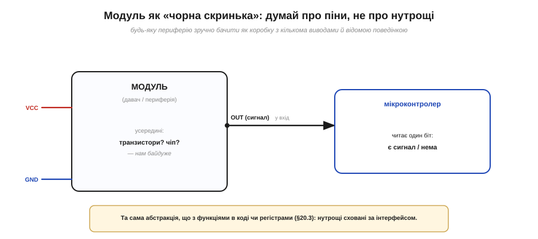
*Рис. 4.4.8.1. Будь-яку периферію зручно бачити «чорною скринькою»: кілька виводів (живлення VCC/GND і сигнал OUT) та документована поведінка. Що там усередині — транзистори чи цілий чіп — для підключення байдуже; важать піни та їхні рівні.*

Це не спрощення «для початківців», а **фундаментальний інженерний прийом** — ховати складність за інтерфейсом. Той самий принцип ми вже зустрічали тричі: функція в коді ховає свої рядки за іменем і аргументами; регістр (§4.1.3) ховає залізо за адресою й бітами; обгортка `digitalWrite` (§4.4.7) ховає регістр за зрозумілим викликом. У програмуванні це формалізував Девід Парнас ще 1972 року під назвою «приховування інформації» (information hiding), і відтоді воно — наріжний камінь будь-якої складної системи. «Модуль» на платі — те саме приховування, лише в залізі: ви довіряєте його документованій поведінці, не заглядаючи всередину.

Саме ця абстракція й зробила сучасну аматорську електроніку доступною. Замість того щоб із нуля проєктувати схему давача, ви купуєте готову **модуль-плату** (breakout): навколо чипа на ній уже зібрано все потрібне — підтяжки, стабілізатор, захист, — і виведено кілька зручних контактів. Ви оперуєте модулем як цеглинкою, а не як сотнею компонентів. Платою за зручність є та сама, що завжди: ви довіряєте чужому інтерфейсу, тож мусите **прочитати його опис** — яка напруга, який тип виходу, яка логіка. Абстракція не звільняє від розуміння, лише переносить його з рівня транзисторів на рівень пінів.

### Чотири питання для будь-якого з'єднання

Щоб підмкнути модуль правильно з першого разу, досить чесно відповісти собі на **чотири питання** — і кожне з них спирається на якусь тему цього розділу.

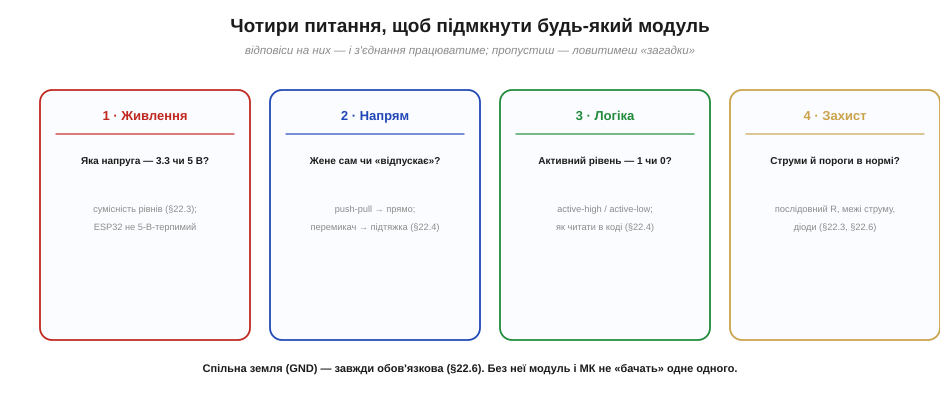
*Рис. 4.4.8.2. Контрольний список для будь-якого модуля. **1) Живлення:** яка напруга — 3.3 чи 5 В (сумісність рівнів, §4.4.3)? **2) Напрям:** модуль сам жене лінію чи лишає її «відпущеною» (тоді потрібна підтяжка, §4.4.4)? **3) Логіка:** активний стан — одиниця чи нуль (active-high/low)? **4) Захист:** чи в нормі струми й пороги (§4.4.6)? І наскрізна умова — **спільна земля**.*

Розгорнімо їх. **Живлення** — найперше: 3.3-вольтовий модуль і 5-вольтовий не завжди дружать напряму, бо ESP32 не 5-вольтотерпимий (§4.4.3, §4.4.6). **Напрям** сигналу вирішує, чи треба підтяжка: якщо модуль має повноцінний двотактний вихід — він жене лінію сам; якщо ж це просто контакт або open-drain (§4.4.2) — лінію хтось мусить підтягувати (§4.4.4). **Логіка** — це чи означає «подія» високий рівень, чи низький; від цього залежить, що писати в коді (`== HIGH` чи `== LOW`). **Захист** — чи не перевищено струм, чи не треба послідовний резистор на вході. І окремо, поза цими чотирма, — **спільна земля**: «мінуси» модуля й мікроконтролера мусять бути з'єднані, інакше вони просто не «бачитимуть» рівнів одне одного.

Кожне питання — це конкретний клас аварій, якщо на нього не відповісти. Помилка в **живленні** — найдорожча: 5 В на 3.3-вольтовій ніжці тихо вбивають вхід, і плата починає поводитися дивно вже назавжди. Забута **підтяжка** дає плаваючий вхід із §4.4.4 — давач «спрацьовує сам по собі». Переплутана **логіка** означає, що код реагує навпаки: двері зачинено, а програма думає, що відчинено. А відсутня **спільна земля** — найпідступніша: усе ніби з'єднано правильно, дроти на місці, та без спільного нуля рівні «висять» відносно різних опор, і сигнал то проходить, то ні. Чотири питання — це, по суті, перелік цих чотирьох пасток.

> 🔧 **Навіщо це.** Зробіть ці чотири питання звичкою — проговорюйте їх щоразу, перш ніж з'єднати дроти. Дев'ять із десяти «чомусь не працює» — це пропущена відповідь: подали 5 В на 3.3-вольтову ніжку, забули підтяжку, переплутали active-high з active-low або не з'єднали землі. Хвилина на чотири питання економить години на пошук «привида».

### Дискретний давач: вихід — один біт

Найпростіший модуль для першого досвіду — **дискретний** (двійковий) давач. Він видає лише **два** стани: «є подія» або «нема». Давач руху (PIR) каже «хтось ворушиться / тихо»; геркон — «магніт поруч / нема»; кінцевик — «важіль натиснуто / вільно»; ІЧ-давач перешкоди — «перешкода є / нема». По суті це **кнопка**, яку «натискає» не палець, а явище.

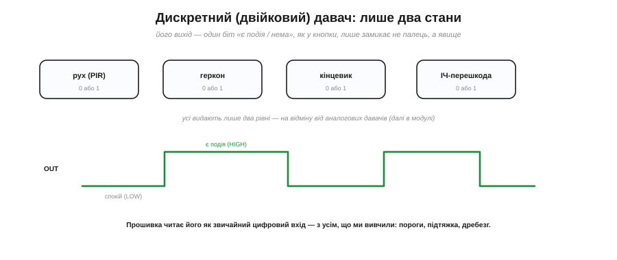
*Рис. 4.4.8.3. Дискретний давач видає один біт: рух, геркон, кінцевик, ІЧ-перешкода — усі лише «0 або 1». Його вихід у часі — це проста послідовність HIGH/LOW. Прошивка читає його як звичайний цифровий вхід, з усім, що ми вивчили: пороги, підтяжка, дребезг.*

Через цю простоту дискретний давач — ідеальний полігон для всього розділу: він підмикається до звичайного цифрового **входу**, а отже, до нього застосовні і пороги (§4.4.3), і підтяжки (§4.4.4), і навіть дребезг (§4.4.5) — механічні давачі (геркон, кінцевик) деренчать так само, як кнопка. Варто чітко відрізняти **дискретний** давач від **аналогового**, який ми вивчатимемо далі в модулі: аналоговий видає не «так/ні», а **плавну** величину (температуру, освітленість, відстань) у вигляді напруги, і читають його зовсім інакше. Дискретний же — це межа, поріг: спрацював чи ні. Корисно знати й термінологію контактів: **нормально розімкнений** (NO) у спокої розірваний і замикається при події, а **нормально замкнений** (NC) — навпаки, у спокої замкнений і розмикається. Від типу контакту залежить, який рівень буде «спокоєм», тож його теж дивляться в описі давача.

А його під'єднання залежить лише від одного: **сам** він жене лінію чи ні. Звідси два типові випадки.

### Випадок А: давач-«перемикач» (потрібна підтяжка)

Багато дискретних давачів усередині — це просто **ключ**: контакт, що замикає сигнальну лінію на GND, коли спрацьовує (геркон, кінцевик, давачі з «відкритим колектором»). Сам він нічого не жене вгору — отже, лінію треба **підтягнути**. Ставимо pull-up (зовнішній або внутрішній `INPUT_PULLUP`): у спокої лінія HIGH, а спрацювавши, давач садить її в LOW. Класична логіка **active-low**.


*Рис. 4.4.8.4. Давач-«ключ» на GND під'єднують через підтяжку: у спокої вона тримає HIGH (1), а коли давач замикається — лінія падає в LOW (0). У коді вмикаємо `INPUT_PULLUP` і чекаємо на LOW. Це точнісінько кнопка з §4.4.4, лише замикає її явище, а не палець.*

Пройдімо чотири питання для геркона. **Живлення:** геркон пасивний — окремого живлення не треба, лише дві ніжки. **Напрям:** це просто контакт, сам нічого не жене → потрібна підтяжка. **Логіка:** контакт на GND → спокій HIGH, замкнено LOW → active-low. **Захист:** це вхід, струму майже нема, послідовний резистор не обов'язковий. Усе сходиться — і код виходить тривіальний:

**Підмикаємо геркон (замикається біля магніту).**

```
Схема:   GPIO ──┬── геркон ── GND
                │
         (внутрішня підтяжка: INPUT_PULLUP)

Код:
   pinMode(REED, INPUT_PULLUP);
   bool magnet = (digitalRead(REED) == LOW);  // LOW = магніт поруч
```

Окреме слово про давачі з **відкритим колектором** (open-collector) чи відкритим стоком — це той самий open-drain із §4.4.2, лише в ролі давача: усередині транзистор, що тільки **притягує** лінію до GND, а високий рівень дає підтяжка. Зручність та сама, що в §4.4.2: кілька таких давачів можна повісити на **одну** лінію (wired-AND), і вона впаде в LOW, щойно спрацює **хоч який** із них. Тому open-collector-виходи й люблять у давачах: вони прості, дешеві й легко об'єднуються в спільну лінію «тривоги».

### Випадок Б: давач із власним виходом (двотактний)

Інші давачі — «розумніші»: усередині в них є електроніка з повноцінним **двотактним виходом**, що сам жене лінію то в HIGH, то в LOW (більшість PIR-модулів, цифрові давачі). Тут підтяжка **не потрібна** — модуль і так тримає рівень. Лишається перевірити лише **напругу**: якщо модуль на 3.3 В, його вихід під'єднують до входу ESP32 **прямо**; якщо ж модуль на 5 В — згадуємо §4.4.3 і §4.4.6: 5 В прямо на ніжку **не можна**, потрібен дільник або перетворювач рівнів.

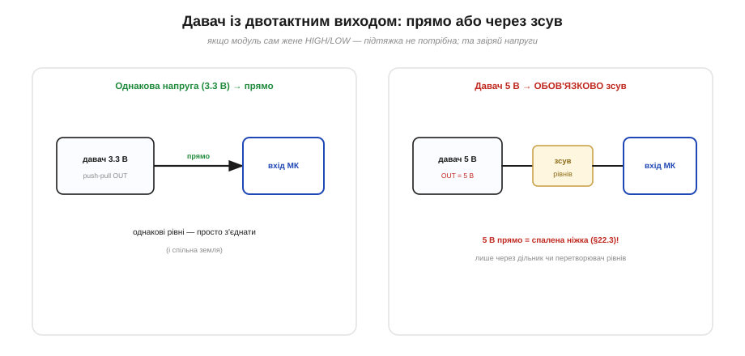
*Рис. 4.4.8.5. Давач, що сам жене вихід, під'єднують без підтяжки. Ліворуч: однакова напруга (3.3 В) — просто з'єднати (і спільна земля). Праворуч: давач 5 В — лише через дільник чи перетворювач рівнів, бо 5 В прямо спалять ніжку (§4.4.3).*

Помітьте, як ті самі чотири питання миттєво дають відповідь і тут: живлення (3.3 чи 5?), напрям (жене сам → без підтяжки), логіка (дивимося в опис давача), захист (зсув рівнів, якщо 5 В). Один і той самий чек-лист працює для **будь-якого** модуля — у цьому й сила абстракції.

Одне «але» варто підкреслити: **тип виходу не вгадують, а читають** в описі модуля. Виробник прямо вказує, чи вихід двотактний, чи open-drain, яка робоча напруга й який активний рівень. Дешеві модулі іноді мають перемички або резистори підтяжки просто на платі — тоді треба зважати ще й на них. П'ять хвилин із даташитом рятують від годин здогадок: усі чотири питання мають відповіді саме там, у таблиці характеристик.

Для прикладу пройдімо чотири питання для типового PIR-модуля руху. **Живлення:** багато PIR-плат живляться від 3.3–5 В і вже мають на борту стабілізатор та вихід 3.3-вольтової логіки — звіряємо з описом. **Напрям:** вихід активний, модуль сам жене HIGH при русі → підтяжка **не** потрібна. **Логіка:** active-high — спокій LOW, рух дає HIGH. **Захист:** вихід 3.3 В → під'єднуємо прямо, без зсуву. Код виходить дзеркальний до геркона, лише чекаємо на HIGH: `if (digitalRead(PIR) == HIGH) { /* рух */ }`. Помітно, що єдине, що змінилося проти геркона, — це **відповіді** на ті самі питання, а не самі питання. У цьому й уся практична цінність чотирьох питань: вони однакові для будь-якого модуля.

### Підсумок розділу: повна модель ніжки

Ми завершуємо розділ, тож зведімо все в одну картину. Ніжка, яка на початку була просто «виводом мікросхеми», тепер постає як цілісний **інтерфейс** із чотирма гранями.


*Рис. 4.4.8.6. Увесь розділ однією картинкою. Навколо ніжки — чотири грані: **вихід** (push-pull §4.4.1, open-drain §4.4.2), **вхід** (пороги §4.4.3, підтяжки §4.4.4), **захист** (струм і діоди §4.4.6, дребезг §4.4.5) і **код** (регістри й маски §4.4.7). Опанувавши їх, ви володієте ніжкою повністю.*

Оце і є головний здобуток розділу: ви бачите ніжку **на всіх рівнях абстракції одночасно** — як два транзистори, як вхід із порогами, як біт у регістрі та як вивід «модуля». Інженер вільно ковзає між цими рівнями: для швидкого скетчу думає «модуль і `digitalRead`», а коли треба до межі вичавити швидкість чи зрозуміти дивний баг — спускається до регістрів і транзисторів. Уся ця глибина тепер ваша.

Озирнімося на пройдений шлях. Розділ почався з двох транзисторів, що тримають рівень, а закінчується вмінням свідомо під'єднати реальний давач і прочитати його в коді. Між цими точками — пороги, підтяжки, дребезг, межі струму, регістри: усе, що відділяє «миготіння лампочкою за прикладом» від **розуміння**, чому воно працює і що робити, коли не працює. Ніжка GPIO — найпростіша периферія, та на ній тримається все інше: і кнопки, і давачі, і шини, які ми зустрінемо далі в курсі. Опанувавши її на всіх рівнях — від транзистора до модуля, — ви здобули надійний фундамент для всього, що буде попереду.

> 🔌 **А якщо ніжок бракує?** Коли виводів МК уже не вистачає на всі кнопки й світлодіоди, беруть **розширювач портів** — чип, що віддає 8 чи 16 нових GPIO за дві лінії I²C. Як він улаштований і підключається — у вставці [Розширювачі GPIO](ch22-s8-c-gpio-expander.md).

> ⚙️ **Багато кнопок — мало ніжок.** Інший шлях зекономити виводи — **матриця**: 16 клавіш читаються вісьмома ніжками скануванням рядків. Як це працює, що таке «привид» і навіщо діоди — у вставці [Матриця кнопок 4×4](ch22-s8-a-key-matrix.md).

А далі нас чекає те, що зробить реакцію мікроконтролера на ці сигнали по-справжньому миттєвою. Досі ми **опитували** ніжку — раз у раз питали «ну що, змінилося?». Та є кращий спосіб: дозволити самому залізу **смикнути** процесор тієї ж миті, коли сигнал змінився, відірвавши його від поточної роботи. Це — **переривання**, фундамент чуйних вбудованих систем.

> ▶️ Далі: [Розділ 4.5 — Переривання](../ch23-interrupts/ch23-interrupts.md)
