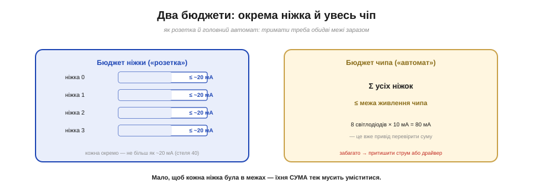
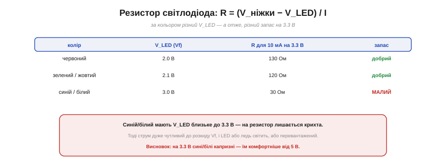

# 🧮 Бюджет ніжки й порту: сумарний струм, резистор світлодіода, запас

> Математична вставка до **теми [§4.4.6 «Навантажувальна здатність і захист ніжки»](ch22-gpio.md)**. Там ми порахували один світлодіод; тут — як рахувати **бюджет** у цілому: дві межі, резистор за кольором і навіщо лишати запас.

## Означення

Струм ніжки обмежують **два** бюджети заразом (Рис. 4.4.6m.1). **Перший** — на кожну окрему ніжку: I_ніжки ≤ межа (у ESP32 орієнтир ~20 мА, стеля ~40). **Другий** — на весь чіп: **сума** струмів усіх ніжок ≤ те, що витримує живлення кристала. Тримати треба **обидва**.


*Рис. 4.4.6m.1. Дві межі заразом, як розетка й головний автомат: кожна ніжка окремо ≤ ~20 мА (стеля 40), і сума всіх ніжок ≤ межа живлення чипа. Вісім світлодіодів по 10 мА = 80 мА через спільні VDD/GND — привід перевірити суму.*

## Інтуїція

Точна аналогія — електрика в домі. Кожна **розетка** має свою межу (не ввімкнеш у неї надпотужний прилад), і водночас **головний автомат** обмежує **сумарне** споживання всього дому. Можна не перевантажити жодної розетки — і все одно вибити автомат, увімкнувши багато всього разом. З ніжками так само: вісім світлодіодів по 10 мА — це 80 мА через спільні VDD/GND, і цю суму теж треба звірити з межею.

## Формальний апарат

**Резистор світлодіода** рахують із закону Ома, віднявши падіння на самому LED:

```
R = (V_ніжки − V_LED) / I
```

Тонкість, якої не видно з однієї формули: **V_LED залежить від кольору** (Рис. 4.4.6m.2). Для 10 мА на 3.3 В:

```
червоний (Vf 2.0): R = (3.3 − 2.0)/0.01 = 130 Ом   запас добрий
зелений  (Vf 2.1): R = (3.3 − 2.1)/0.01 = 120 Ом   запас добрий
синій    (Vf 3.0): R = (3.3 − 3.0)/0.01 =  30 Ом   запас МАЛИЙ
```


*Рис. 4.4.6m.2. R = (V_ніжки − V_LED)/I. Червоний і зелений (Vf ~2 В) мають добрий запас; синій/білий (Vf ~3 В) лишають на резистор крихту, тож струм дуже чутливий до розкиду Vf — на 3.3 В вони капризні, їм комфортніше від 5 В.*

У синіх і білих Vf близьке до **3.3 В** — на резистор лишається крихта, і струм стає **дуже** чутливим до розкиду Vf: трохи більший Vf — і LED ледь жевріє, трохи менший — перевантаження. Тому на 3.3 В сині/білі капризні.

**Запас (derating).** Чому орієнтир ~20 мА, а не стеля 40? Бо біля межі ніжка гріється, напруга на ній **просідає**, а надійність падає. Узяти струм **удвічі менший** за стелю — дешевий спосіб купити запас на нагрів, розкид і старіння. Те саме з резистором: трохи більший за розрахунковий — трохи тьмяніше, зате безпечніше.

## Де в курсі це працює

Це кількісний бік §4.4.6. Двобюджетне правило підказує, **коли вистачить ніжки, а коли — ні**: один-два світлодіоди ніжка тягне сама; десяток — рахуйте суму; реле чи моторчик (десятки-сотні мА) — одразу через **транзистор** (§4.4.6), бо й перша межа, і друга проти. А таблиця за кольором рятує від класичної загадки «чому мій синій світлодіод ледь світить на 3.3 вольтах».

Практично: тримайте кожну ніжку ближче до 10 мА, ніж до 40, а перш ніж розвішувати багато світлодіодів — додайте їхні струми й гляньте на суму. Це секундна перевірка, що рятує від загадкового «чіп гріється» чи «світло тьмяніє, коли ввімкнено все разом».
