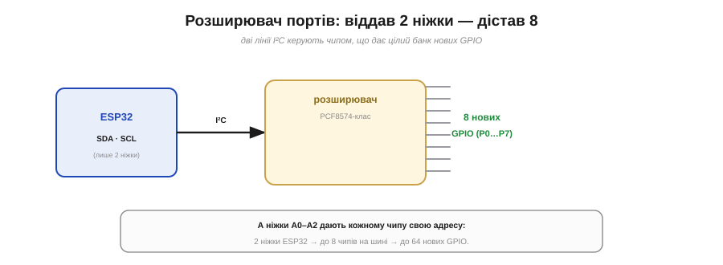
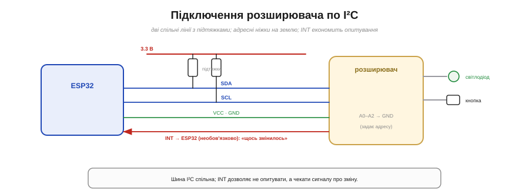

# 🔌 Розширювачі GPIO (PCF8574/MCP23017-класи): коли ніжок бракує

> Компонентна вставка до **теми [§4.4.8 «Абстрактна модель „модуля“»](ch22-gpio.md)**. Розширювач — сам по собі гарний приклад «модуля»: чотири питання з тієї теми (живлення, шина, рівні, перший байт) прикладаються до нього один в один.

## Що це за деталь

Ніжок у мікроконтролера скінченна кількість, і на великому пристрої — десяток кнопок, ряд світлодіодів, кілька реле — їх легко не вистачить. **Розширювач портів** (*I/O expander*) розв'язує це елегантно: це окремий чип, що віддає вам **8 або 16 нових GPIO**, а сам слухається по двох лініях шини **I²C** (Рис. 4.4.8c.1). Ви «витрачаєте» дві ніжки МК (SDA і SCL) — і дістаєте натомість цілий банк виводів.


*Рис. 4.4.8c.1. Розширювач бере дві лінії I²C і віддає цілий банк нових GPIO (8 у PCF8574, 16 у MCP23017). Ніжки A0–A2 дають кожному чипу свою адресу: дві ніжки ESP32 → до восьми чипів на шині → десятки нових виводів.*

Два канонічні представники: **PCF8574-клас** — простий 8-бітний розширювач, і **MCP23017-клас** — потужніший, 16-бітний. Обидва по I²C, обидва з адресними ніжками.

## Розпіновка й підключення

Назовні — знайома картина I²C плюс банк портів (Рис. 4.4.8c.2):

```
VCC, GND    — живлення
SDA, SCL    — шина I²C (спільна, з підтяжками)
A0, A1, A2  — адресні ніжки (кілька чипів на одній шині)
P0…P7       — власне нові GPIO (8 у PCF8574; 16 у MCP23017)
INT         — вихід переривання: «на якомусь вході щось змінилось»
```


*Рис. 4.4.8c.2. Дві лінії I²C (з підтяжками) спільні з рештою пристроїв; A0–A2 на землю задають адресу; виводи розширювача керують світлодіодами й читають кнопки. Вивід INT дозволяє не опитувати чип, а чекати від нього сигналу про зміну.*

Підключення: дві лінії I²C (спільні з іншими пристроями, з підтяжками на SDA/SCL), живлення, а ніжки A0–A2 завдають **адресу** — комбінуючи їх, на одну шину можна повісити кілька розширювачів і не сплутати. Корисний бонус — вивід **INT**: замість раз у раз опитувати чип, дозвольте йому **смикнути** МК, коли на вході щось змінилося (це вже тема переривань, далі в курсі).

## Перший байт

Логіка проста: щоб виставити 8 виходів, ви **пишете** в чип один байт по I²C; щоб прочитати 8 входів — **читаєте** байт. У MCP23017 додатково є регістри **напрямку** (який пін вхід, який вихід) і власні підтяжки — більше контролю. Тобто весь «протокол» — це пара I²C-транзакцій: написав байт станів — засвітив потрібні світлодіоди; прочитав — дізнався, які кнопки натиснуто.

## Типові граблі

- **Квазі-двонапрямні порти PCF8574.** Головна пастка: щоб уживати пін як **вхід**, треба спершу **записати в нього 1**. І «високий» рівень там тримає лише **слабка** підтяжка — сильно навантажити (скажімо, світлодіод напряму на плюс) такий вихід не можна: він добре **тягне вниз**, але слабко **штовхає вгору**. MCP23017 цим не страждає — у нього справжні двотактні виходи (§4.4.1).
- **Конфлікт адрес.** Два чипи з однаковими A0–A2 на одній шині — і обидва відгукуються разом. Задавайте різні.
- **Це повільніше за рідний GPIO.** Кожна зміна — транзакція по шині (мікросекунди), а не один такт. Для швидкого біт-бенгінгу (§4.4.7) розширювач не годиться — він для кнопок, індикаторів, реле, де темп людський.
- **Завис на шині — завис усюди.** Один несправний пристрій на спільній I²C може підвісити всю шину разом з усіма.

## Варіації класу

**PCF8574** — 8 біт, простий, квазі-двонапрямний; **PCF8574A** — той самий, але з іншим діапазоном адрес (тож разом їх на шині вдвічі більше). **MCP23017** — 16 біт, справжні двотактні виходи, регістри напряму й підтяжок, переривання; **MCP23008** — його 8-бітний родич; **MCP23S17** — той самий MCP, але по **SPI** замість I²C (швидше, ціною окремого CS). Вибір — за кількістю ніжок, потрібним контролем і шиною.
