# Розділ 23 — Переривання

Дотепер наш код працював одним-єдиним способом: ми **самі** раз у раз питали залізо «ну що, змінилося?» — читали ніжку в циклі, чекали, перевіряли знову. Це **опитування**. Воно просте й чесне, та має ваду: процесор прикутий до нескінченних перевірок і марнує на них час, а рідкісну чи коротку подію легко проґавити між двома читаннями. Цей розділ — про інший, набагато потужніший підхід: **переривання**, коли не процесор полює на подію, а **подія сама миттєво кличе** процесор. Саме на перериваннях тримається вся чуйність вбудованих систем — від кнопки, що реагує без затримки, до точного відліку часу, обміну даними й керування моторами.

Як ця ідея народилася (у диму аеродинамічних труб 1950-х і перших військових машин реального часу) — розповідає [історична вставка](ch23-history-interrupt.md). А цей розділ розбирає її **інженерно**: спершу що таке переривання й чим воно краще за опитування (ця тема); далі — [як це влаштовано всередині](ch23-interrupts.md) (контролер переривань і вектор), [чому обробник має бути коротким](ch23-interrupts.md), [пріоритети й вкладеність](ch23-interrupts.md), [навіщо `volatile`](ch23-interrupts.md), [атомарність і гонки даних](ch23-interrupts.md) і нарешті [коли що обирати](ch23-interrupts.md). Спираємося на все, що вже знаємо про GPIO (Розділ 22) і регістри ([§20.3](../ch20-mcu-esp32/ch20-mcu-esp32.md)).

---

## 23.1 Переривання: реагувати на подію вмить (проти опитування; «дверний дзвінок»)

Уявіть, що ви чекаєте на гостя. Можна щохвилини вставати з-за столу й **ходити до дверей** перевіряти, чи він уже прийшов, — і так доти, доки він з'явиться. А можна спокійно працювати, а коли гість прийде, він **подзвонить у дзвоник**, і ви відгукнетеся тієї ж миті. Перший спосіб — це **опитування**, другий — **переривання**. Уся ця тема — про те, чому дзвоник майже завжди кращий за біганину до дверей, і як «повісити дзвоник» на ніжку мікроконтролера.

### Опитування: процесор мусить сам перепитувати

Згадаймо, як ми читали кнопку в Розділі 22: у циклі `loop()` викликали `digitalRead` і дивилися, чи рівень став LOW. Поки кнопку не натиснуто — цикл крутиться даремно, лише перевіряючи знову й знову. Це й є опитування: процесор **сам** і **постійно** перепитує стан ніжки. Для однієї кнопки в короткому циклі це працює чудово й нікому не заважає.

Проблеми починаються, коли `loop()` має робити **ще щось**, та ще й довге. Реальна програма зазвичай зайнята: читає давачі, оновлює екран, рахує, спілкується мережею. Усе це — час, протягом якого до перевірки кнопки **черга не доходить**.

Тут є й глибша, структурна проблема. Опитувальний `loop()` — це **кооперативна** багатозадачність: усі справи мусять ділити один цикл і чемно поступатися часом одна одній. Додаєте нову задачу — і всі інші реагують повільніше, бо період циклу зростає. Виходить парадокс: що більше вміє ваша програма, то **гіршою** стає її чуйність до кнопки. Можна, звісно, дробити довгі задачі на шматки й розкидати перевірки густіше, та це ускладнює код і все одно не дає гарантії, що швидку подію буде впіймано. Опитування погано **масштабується**.

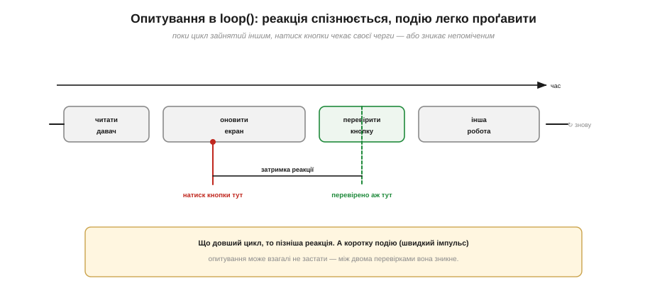
*Рис. 23.1.1. Поки цикл зайнятий оновленням екрана, натиск кнопки чекає, доки виконання дійде до перевірки, — звідси **затримка реакції**. А якщо подія коротша за період циклу (швидкий імпульс), вона може зникнути між двома перевірками — і програма її взагалі **не помітить**.*

Отже, опитування має три слабкі місця. **Затримка**: реакція приходить не одразу, а лише коли цикл добіжить до перевірки, — і що довший цикл, то більша затримка. **Марнування**: процесор витрачає такти на перевірки навіть тоді, коли нічого не відбувається. **Пропуск**: коротку подію, що сталася й минула між двома перевірками, опитування просто не застає. Для багатьох задач це неприйнятно — і тут на сцену виходить переривання.

### Переривання: подія кличе процесор сама

Ідея переривання дзеркальна до опитування. Замість того щоб процесор **сам** ходив перевіряти ніжку, ми домовляємося із залізом так: «щойно на цій ніжці станеться **ось така** подія (наприклад, рівень упаде з HIGH на LOW), **негайно** поклич мене». Тоді процесор спокійно займається своїми справами, а коли подія стається, спеціальна апаратура **перебиває** (звідси й назва) основний код, змушує процесор виконати коротку процедуру-відповідь і повернутися до перерваної роботи.

Звідки залізо «знає», що сталася подія? Біля кожної ніжки сидить маленька апаратна схема-сторож, що **стежить** за рівнем і вміє розпізнати потрібну зміну — спад, наростання чи будь-який перехід. Помітивши її, вона піднімає внутрішній сигнал «є подія!», який і перебиває процесор. Ключове тут — що це стеження діється **апаратно й безперервно**, паралельно з основним кодом, не забираючи ані такту процесора. Саме тому переривання й ловить навіть коротку подію: за неї відповідає окреме залізо, що не спить і не відволікається, поки ядро зайняте чимось іншим.

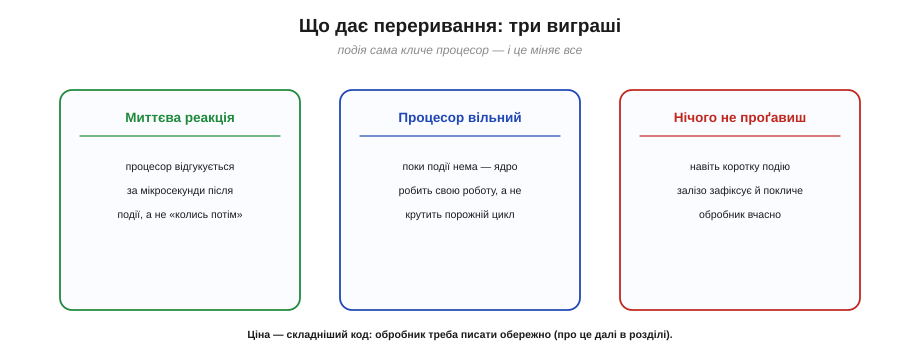
*Рис. 23.1.2. Переривання дає одразу три переваги. **Миттєва реакція** — відгук за мікросекунди, а не «колись потім». **Вільний процесор** — поки події нема, ядро робить корисну роботу, а не крутить порожній цикл. **Нічого не проґавиш** — навіть коротку подію залізо зафіксує й покличе обробник вчасно.*

Помітьте, як це знімає всі три вади опитування одним рухом. Затримки майже нема — реакція приходить за мікросекунди. Марнування нема — поки подія мовчить, процесор не робить жодної зайвої перевірки. І пропустити подію важко — її ловить апаратура, а не наш код, що міг бути зайнятий. За все це доводиться платити складнішим кодом (обробник треба писати обережно, і це тема кількох наступних розділів), але виграш зазвичай того вартий.

### Як це відбувається: пауза, обробник, повернення

Що ж фізично діється в момент переривання? Послідовність така. Процесор виконує основний код. Стається подія — апаратура піднімає сигнал. Процесор **дочікує** поточну машинну інструкцію, **запам'ятовує**, де спинився (зберігає «контекст» — лічильник команд і регістри), і **перестрибує** на спеціальну функцію-відповідь. Ця функція зветься **обробником переривання** — англійською *interrupt service routine*, скорочено **ISR**. Виконавши обробник, процесор **відновлює** збережений контекст і повертається точно в ту точку основного коду, де його перервали, — наче нічого й не було.

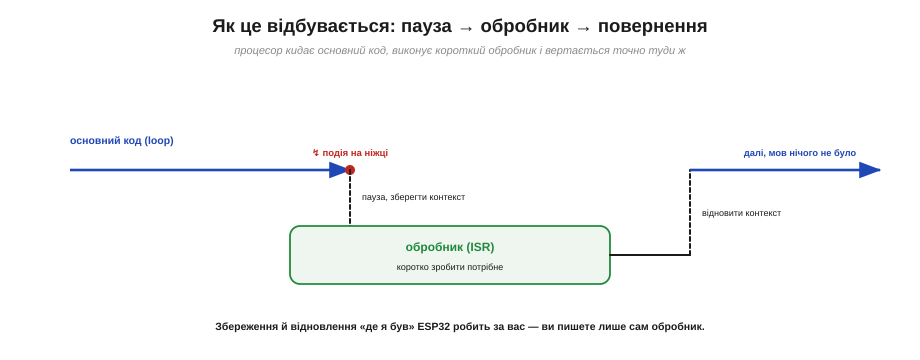
*Рис. 23.1.3. Механізм переривання: подія на ніжці перериває основний код; процесор зберігає контекст, виконує короткий обробник (ISR), відновлює контекст і вертається точно туди, де спинився. Збереження й відновлення «де я був» ESP32 робить **за вас** — ви пишете лише сам обробник.*

Найважливіше для нас зараз: усю марудну механіку «зберегти-перестрибнути-відновити» бере на себе **залізо й середовище**. Ви не пишете жодного рядка для збереження регістрів — ви пишете **тільки сам обробник**, коротку функцію, яка робить те, що треба зробити у відповідь на подію. Як саме залізо це влаштовує — через контролер переривань і таблицю-вектор — розбере [наступна тема §23.2](ch23-interrupts.md).

### Як «повісити дзвоник»: attachInterrupt

У середовищі Arduino для ESP32 переривання на ніжку чіпляють однією функцією — `attachInterrupt`. Їй треба сказати три речі: **яка ніжка**, **яка функція-обробник** і **на яку подію** реагувати.

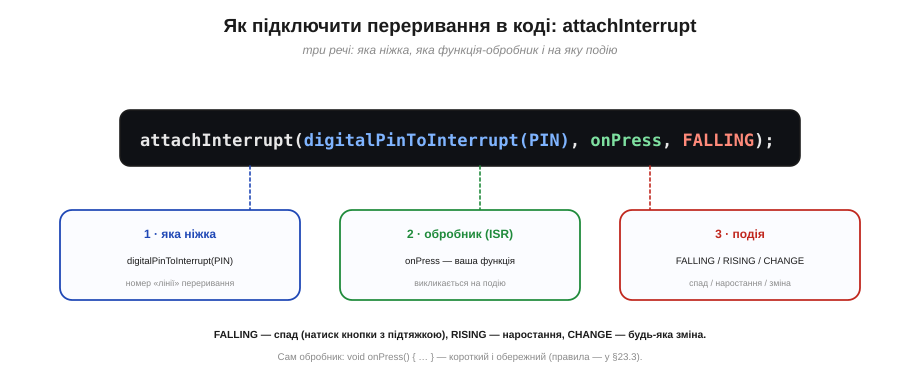
*Рис. 23.1.4. Виклик `attachInterrupt(digitalPinToInterrupt(PIN), onPress, FALLING)` складається з трьох частин: **яка ніжка** (через `digitalPinToInterrupt`), **який обробник** (`onPress` — ваша функція) і **на яку подію** (`FALLING` — спад рівня). Режими: `FALLING` (спад), `RISING` (наростання), `CHANGE` (будь-яка зміна).*

Режим події вибирають за змістом. Для кнопки з підтяжкою (§22.4), що в спокої тримає HIGH, а при натиску падає в LOW, природний режим — **`FALLING`** (момент натиску). Якщо цікавить відпускання — `RISING`; якщо будь-яка зміна — `CHANGE`. Сам обробник — це звичайна функція без аргументів і без результату, наприклад `void onPress() { … }`. На ESP32 її зазвичай позначають особливим словом `IRAM_ATTR` (щоб вона лежала у швидкій пам'яті) — про це й про інші правила обробника йтиметься в [§23.3](ch23-interrupts.md).

> 🔧 **Навіщо це.** `attachInterrupt` — ваш «дзвоник» на ніжці. Запам'ятайте формулу з трьох частин: **ніжка, обробник, подія**. Найчастіша помилка новачка — повісити переривання й чекати миттєвої магії, забувши, що ніжку ще треба налаштувати (`pinMode`, підтяжка з §22.4) і що обробник має свої суворі обмеження. Дзвоник дзвонить лише тоді, коли його правильно під'єднали.

Кілька корисних дрібниць наостанок. Переривання можна й **зняти** — `detachInterrupt(digitalPinToInterrupt(PIN))` прибирає «дзвоник» із ніжки. Режими `RISING`/`FALLING`/`CHANGE` — це реакція на **фронт** (момент зміни); бувають іще реакції на **рівень** (поки ніжка тримає певний стан), але для кнопок і більшості датчиків потрібен саме фронт. І остання тонкість: на одну ніжку звичайно вішають **один** обробник — повторний `attachInterrupt` замінює попередній. Тримайте це в голові, плануючи, які ніжки на що реагуватимуть.

### Скільки чекати на реакцію

Чим переривання так виграє? Часом реакції. При опитуванні відгук приходить **не раніше**, ніж цикл дійде до перевірки, — а це в найгіршому випадку **цілий період циклу** (мілісекунди, а то й більше, якщо `loop()` довгий). При перериванні відгук приходить за **мікросекунди** після події — рівно стільки, скільки залізу треба, щоб перебити процесор і стрибнути в обробник.

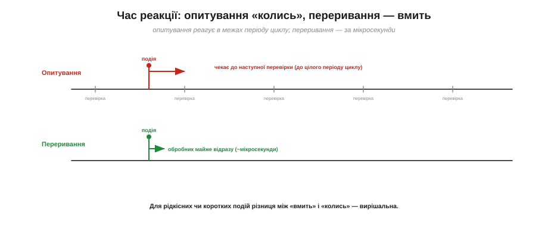
*Рис. 23.1.5. Подія сталася між двома перевірками. Опитування мусить **дочекатися** наступної перевірки — затримка аж до цілого періоду циклу. Переривання спрацьовує майже відразу (за мікросекунди). Для рідкісних чи коротких подій ця різниця між «вмить» і «колись» — вирішальна.*

Різниця в тисячі разів — не перебільшення. Якщо `loop()` триває, скажімо, 10 мілісекунд, то опитування може спізнитися на всі 10 мс; переривання відгукнеться за одиниці мікросекунд.

Утім, чесно зазначмо: «миттєво» в переривання теж не зовсім нульове. Є невелика, але реальна **затримка входу** в обробник (кілька тактів на збереження контексту й стрибок), а ще вона трохи «плаває»: процесор спершу дочікує поточну інструкцію, а вищопріоритетне переривання може на мить відсунути нижче. Цей розкид звуть **джитером** (*jitter*). Для більшості задач він мізерний проти періоду циклу, та в дуже точному вимірюванні часу його враховують.

Там, де треба **точно** зловити момент (порахувати швидкий імпульс, зреагувати на аварійний сигнал, відмітити час події), опитування програє безнадійно.

Конкретний приклад — лічильник обертів або витратомір, де датчик видає короткі імпульси, що йдуть **швидше**, ніж устигає крутитися `loop()`. Опитуванням ви порахували б лише частину з них, а решту проґавили б між перевірками, — і вимір вийшов би заниженим та непередбачуваним. На перериванні ж кожен імпульс чесно збільшує лічильник в обробнику, хоч би скільки їх приходило. Саме такі задачі — рахувати швидке, ловити рідкісне, відмічати точний час — і є рідною стихією переривань.

### То опитування — погане? Ні

З усього сказаного може скластися враження, що опитування — пережиток, а переривання — завжди краще. Це не так. Опитування **простіше**, **передбачуваніше** й вільне від цілого класу пасток, які приносять переривання (про них — далі в розділі: гонки даних, обмеження обробника, пріоритети). Для частих, очікуваних, рівномірних подій опитування — цілком правильний вибір.

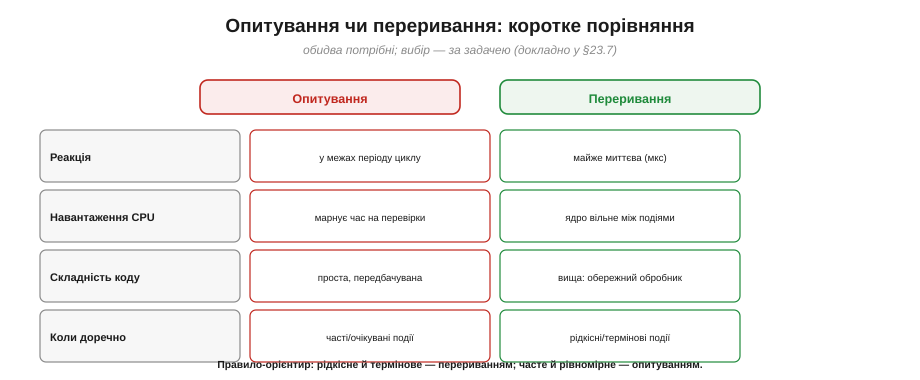
*Рис. 23.1.6. Дві стратегії доповнюють одна одну. Опитування — проста й передбачувана, але реагує в межах періоду циклу й марнує час; переривання — миттєве й ощадне, та складніше в коді. Орієнтир: **рідкісне й термінове — перериванням; часте й рівномірне — опитуванням**. Докладно цей вибір розбере §23.7.*

Тож переривання — це не заміна опитування, а **другий інструмент** у скрині, потужний для свого класу задач. Інженер володіє обома й щоразу обирає доречний. Детально зважувати «коли що» ми будемо в [§23.7](ch23-interrupts.md); поки що досить запам'ятати орієнтир із малюнка.

### Перший дотик: кнопка на перериванні

Зведімо ідею в найпростіший код. Канонічний прийом такий: обробник робить **якнайменше** — лише ставить «прапорець», що подія сталася, — а вся справжня робота діється потім, у `loop()`, коли той дійде до прапорця. Чому саме так (а не «зробити все в обробнику») — серцевина теми §23.3; поки що прийміть цей шаблон як зразок.

**Кнопка: опитування проти переривання.**

```
// --- Опитування: loop сам перевіряє ---
void loop() {
  if (digitalRead(BTN) == LOW) { /* натиснуто */ }
  // ... інша робота, що затримує перевірку
}

// --- Переривання: подія сама кличе ---
volatile bool pressed = false;          // прапорець (volatile — §23.5)

void IRAM_ATTR onPress() {               // обробник: КОРОТКО
  pressed = true;                        // лише підняти прапорець
}

void setup() {
  pinMode(BTN, INPUT_PULLUP);            // підтяжка (§22.4)
  attachInterrupt(digitalPinToInterrupt(BTN), onPress, FALLING);
}

void loop() {
  if (pressed) {                         // loop вільний, реакція вмить
    pressed = false;
    /* обробити натиск */
  }
}
```

У цьому крихітному прикладі вже видно всю архітектуру розділу: обробник `onPress` короткий і лише ставить прапорець `pressed`; слово `volatile` каже компіляторові не «оптимізувати» цей прапорець (бо його міняє обробник — деталі в §23.5); `IRAM_ATTR` кладе обробник у швидку пам'ять; а `loop()` тепер вільний робити іншу роботу, реагуючи на натиск практично вмить. Кожну з цих дрібниць ми розберемо окремо в наступних темах.

Один підступний нюанс варто назвати вже зараз. Механічна кнопка **деренчить** (§22.5): один натиск дає не один чистий спад, а пачку швидких перемикань. А переривання чесно спрацює на **кожне** з них — тож обробник `onPress` викличеться не раз, а п'ять чи десять разів поспіль. Тому кнопки на перериваннях майже завжди потребують **придушення дребезгу** — апаратного (RC-фільтр) чи програмного (ігнорувати повторні спрацювання протягом ~20 мс). Це чудовий приклад того, як теми зчіплюються: переривання без знання про дребезг із Розділу 22 поводилося б «загадково».

> 🔧 **Навіщо це.** Золотий шаблон переривання — **обробник лише піднімає прапорець, а робота діється в `loop()`**. Якщо ловите дивні «подвійні» спрацювання кнопки — згадайте про дребезг (§22.5); якщо ж змінна, яку міняє обробник, поводиться так, ніби `loop()` її «не бачить», — вам бракує `volatile` (§23.5). Ці дві граблі переривань новачки збирають найчастіше, тож знайте їх наперед.

Отже, переривання — це «дзвоник» на ніжці: замість того щоб процесор сам без упину перепитував стан, **подія сама миттєво кличе** його, змушує виконати короткий обробник і повернутися до роботи. Це знімає три вади опитування — затримку, марнування часу й пропуск коротких подій, — ціною складнішого коду. Вішають його викликом `attachInterrupt` із трьох частин (ніжка, обробник, подія), а сам обробник за прийнятим шаблоном лише піднімає прапорець. Запам'ятайте поки що головний образ розділу: ніжка з «дзвоником», короткий обробник, що тільки відмічає подію, і вільний `loop()`, який реагує на неї практично вмить. Але як саме залізо ловить подію й знаходить потрібний обробник — через **контролер переривань** і **вектор**? Це розбирає [наступна тема §23.2](ch23-interrupts.md).

## 23.2 Як це працює: контролер переривань і вектор (збереження контексту)

У [§23.1](ch23-interrupts.md) ми побачили, **що** робить переривання: подія миттєво кличе процесор, той виконує обробник і вертається. Тепер зазирнімо під капот і розберімо, **як** це влаштовано всередині. За простою картинкою «дзвоник смикнув процесор» стоять три цілком конкретні механізми: **контролер переривань**, що збирає й сортує запити; **вектор**, що вказує, куди стрибати; і **збереження контексту**, що дозволяє повернутися. Розберімо їх по черзі — і «магія» обернеться зрозумілою інженерією.

### Контролер переривань: регулювальник запитів

Джерел переривань у мікроконтролері **багато** — таймери, ніжки GPIO, послідовні порти, радіо, — а процесор один, і одночасно він може обробляти лише одне переривання. Хтось мусить стояти між юрбою джерел і ядром та керувати рухом. Цей «регулювальник» і називають **контролером переривань**. Він збирає запити від усіх джерел і для кожного вирішує три речі: чи це переривання взагалі **дозволене** (не замасковане), який у нього **пріоритет** і, якщо претендентів кілька, **кого пустити першим**.


*Рис. 23.2.1. Контролер — регулювальник між пристроями та ядром. Він приймає запити від багатьох джерел, відкидає замасковані, зважує пріоритети й лише тоді перебиває процесор. Без нього ядро потонуло б у сигналах; контролер — той, хто вирішує, **кого** і **коли** пускати.*

Завдяки контролеру процесор не мусить сам стежити за десятками джерел — він узагалі нічого не робить, поки контролер його не покличе. А коли кличе — уже з готовою відповіддю на питання «хто саме» й «наскільки терміново». Маскування й пріоритети, що ними керує контролер, — це прямі нащадки ідей Брукса з історичної вставки; ми ще повернемося до них у [§23.4](ch23-interrupts.md).

Варто розуміти, що складність контролера залежить від чипа. На простих 8-бітних МК (як Arduino Uno) джерел небагато, і кожному наперед відведено свій фіксований рядок у векторі — жодного «вибору» майже нема. А на потужному ESP32 джерел десятки, тож і контролер складніший: він уміє маскувати, розставляти пріоритети й навіть перекидати джерела між ядрами. Це загальна закономірність: що багатша периферія, то розумніший потрібен регулювальник переривань.

А що, коли два запити приходять **одночасно**? Саме для цього контролер і зважує **пріоритети**: він пускає першим важливіший, а менш важливий чекає своєї черги. Якщо ж переривання прийшло, поки ядро ще обробляє попереднє, контролер тримає його «на гачку» — запит не зникає — і подасть, щойно процесор звільниться; а може й **перебити** поточний обробник, якщо новий має вищий рівень. Цю гру пріоритетів і вкладеності ми докладно розберемо в [§23.4](ch23-interrupts.md); поки що досить знати, що контролер ніколи не «губить» запитів і завжди обслуговує важливіше першим.

### Повний шлях переривання — крок за кроком

Складімо тепер усю послідовність, від сигналу пристрою до повернення в основний код. Вона завжди та сама.


*Рис. 23.2.2. Вісім кроків переривання: (1) джерело піднімає запит; (2) контролер перевіряє дозвіл і пріоритет; (3) сигналить процесору; (4) той дочікує поточну інструкцію й **зберігає контекст**; (5) шукає адресу обробника у **векторі**; (6) стрибає в обробник; (7) обробник виконується; (8) контекст **відновлюється**, і код іде далі. Усе це — за мікросекунди.*

Зверніть увагу на два кроки, виділені кольором, — **4** і **8**. Саме збереження контексту перед обробником і його відновлення після — серце всього механізму; без них процесор не зміг би повернутися й продовжити перервану думку. Решту — дочекатися інструкції, стрибнути, повернутися — залізо робить само, без жодного рядка коду від нас. А от те, що між кроками 5 і 6 (вектор) і що саме ховається в кроках 4/8 (контекст), варто розглянути ближче.

### Вектор: телефонна книга обробників

Коли прийшло переривання, процесорові треба миттю дізнатися, **куди стрибати** — за адресою обробника саме цього джерела. Перебирати всіх по черзі («це таймер? ні. це UART? ні…») було б повільно. Тому адреси обробників складають наперед у спеціальну таблицю — **вектор переривань** (interrupt vector). Це по суті телефонна книга: номер переривання → адреса його обробника. Прийшло переривання №1 — процесор зазирає в рядок 1 вектора, бере звідти адресу й стрибає прямо туди.


*Рис. 23.2.3. Вектор — таблиця адрес: кожному номеру переривання зіставлено, де лежить його обробник. Прийшло переривання №1 (GPIO) — один погляд у вектор, і процесор стрибає прямо за потрібною адресою, без жодного перебору «а хто це був». Швидко й однозначно.*

Саме цю ідею — вектор — подарував світові проєкт Stretch у 1957-му (історична вставка). Відтоді вона незмінна: будь-який сучасний процесор, від ESP32 до настільного, знаходить обробник через таблицю векторів. Це класичний приклад того, як архітектурна знахідка живе десятиліттями.

Чесності заради додамо тонкість. На ESP32 (ядра Xtensa) вектор влаштований трохи інакше, ніж «один рядок на кожне джерело»: окрему адресу-вектор має кожен **рівень пріоритету** (1–7), а вже **всередині** рівня системний код з'ясовує, котре саме джерело спрацювало. Та з висоти нашої задачі ідея та сама: є таблиця, що веде від переривання до його обробника, і процесор користається нею замість сліпого перебору. Деталі цього диспетчингу бере на себе середовище, тож у звичайному коді ви їх не бачите.

### Збереження контексту: закладка, щоб не загубити думку

Тепер найтонше — кроки 4 і 8. Перш ніж кинутися виконувати обробник, процесор мусить **запам'ятати все, що йому знадобиться, щоб повернутися**. Цей набір даних і називають **контекстом**. До нього входять: **лічильник команд** (PC — адреса, де саме перервали основний код), **регістр статусу** (прапорці стану) і ті **робочі регістри**, які обробник може зачепити. Усе це ховається на **стек** — спеціальну ділянку пам'яті, що працює за принципом «останнім поклав — першим узяв».


*Рис. 23.2.4. Перед обробником ядро **складає** на стек свій контекст — лічильник команд, статус і робочі регістри (крок 1). Обробник тим часом вільно користається регістрами (крок 2), бо їхні попередні значення в безпеці. Після обробника ядро **знімає** контекст зі стека (крок 3) і повертається точно туди, де було, з тими ж значеннями. Стек — це закладка.*

Чому це так важливо? Бо обробник — теж програма, і він теж користається регістрами процесора. Якби він просто почав їх затирати, не зберігши, то, повернувшись, основний код знайшов би свої дані **зіпсованими** — наче ви, відволікшись на дзвінок, забули, на якому рядку книжки спинилися, та ще й хтось переставив ваші речі. Стек і є тією закладкою: він точно зберігає «де я був і що в мене було», тож після обробника все відновлюється **бездоганно**. На ESP32 цю роботу виконують залізо й системний код — ви пишете лише сам обробник, а про збереження-відновлення не дбаєте.

Цікаво, що зберігання контексту ділять між собою **залізо** й **системний код**. Частину найважливіших регістрів (як-от лічильник команд) ховає сам процесор апаратно, щойно входить у переривання; решту робочих регістрів, які може зачепити ваша C-функція, зберігає згенерований компілятором «пролог» обробника — за наперед обумовленими правилами (їх звуть ABI, угодою про виклики). Через це **вхід** у переривання й **вихід** із нього не безкоштовні: на них іде помітний шматочок часу ще до першого корисного рядка вашого коду. Саме тому переривання вигідне для рідкісних подій і марнотратне для дуже частих.

> 🔧 **Навіщо це.** Збереження контексту коштує часу — це кілька тактів на «скласти» й «зняти» регістри, та сама затримка входу й джитер, про які ми згадували в §23.1. Звідси два практичні висновки. По-перше, переривання не безкоштовне: дуже часті переривання самим лише збереженням-відновленням контексту здатні з'їсти відчутну частку процесора. По-друге, що більше регістрів зачіпає обробник, то більше їх доведеться зберігати, — ще одна причина тримати обробник **коротким** (про що — наступна тема).

### Як це влаштовано в ESP32: матриця переривань і два ядра

У ESP32 ця схема має свої особливості. По-перше, ядер **два** (PRO і APP), і кожне має власну логіку переривань зі своїми **рівнями пріоритету 1–7**. По-друге, периферійних джерел дуже багато (близько сімдесяти), а «слотів» переривань у ядра небагато, тож між ними стоїть гнучкий комутатор — **матриця переривань** (interrupt matrix). Вона дозволяє маршрутизувати **будь-яке** джерело до будь-якого вільного слота потрібного ядра.


*Рис. 23.2.5. У ESP32 десятки периферійних джерел проходять крізь **матрицю переривань** — комутатор, що скеровує будь-яке з них до слота потрібного ядра (PRO чи APP) із потрібним рівнем пріоритету (1–7). Кожне ядро має власну логіку переривань. Гнучкість матриці й дозволяє вільно «розкладати» переривання по ядрах.*

Завдяки матриці ви можете, наприклад, тримати переривання від зв'язку на одному ядрі, а свої — на іншому, щоб вони не заважали одне одному. У повсякденному коді на Arduino ці тонкощі найчастіше сховані за `attachInterrupt`, та знати про них корисно: коли проєкт виросте, саме розкладання переривань по ядрах і рівнях стане важелем продуктивності. Рівні пріоритету ми розберемо в [§23.4](ch23-interrupts.md).

На щастя, у щоденній практиці матрицю переривань напряму не чіпають. У Arduino за вас усе робить `attachInterrupt`, а в ESP-IDF — окрема системна функція, що сама знаходить вільний слот, прокладає маршрут через матрицю й чіпляє ваш обробник. Ручне керування матрицею знадобиться хіба що в дуже тонких випадках — коли важить, на якому ядрі й з яким рівнем працює конкретне переривання. Але знати, що цей шар існує, корисно: він пояснює, чому на ESP32 переривань може бути так багато й чому їх можна гнучко розкладати.

### Під капотом attachInterrupt: усі ніжки крізь одну лійку

Лишилася ще одна важлива для нас деталь: як проста `attachInterrupt(pin, …)` лягає на цю машинерію. Тут ховається несподіванка. У ESP32 **усі ніжки GPIO ділять одне-єдине** переривання (на ядро) — окремого переривання на кожну ніжку немає. Тому коли спрацьовує будь-яка ніжка, викликається один спільний обробник GPIO, а він уже з'ясовує, **хто саме** це був, читаючи регістр стану `GPIO_STATUS` (де біт відповідає ніжці — точнісінько як у §22.7), і кличе вашу функцію для тієї ніжки.

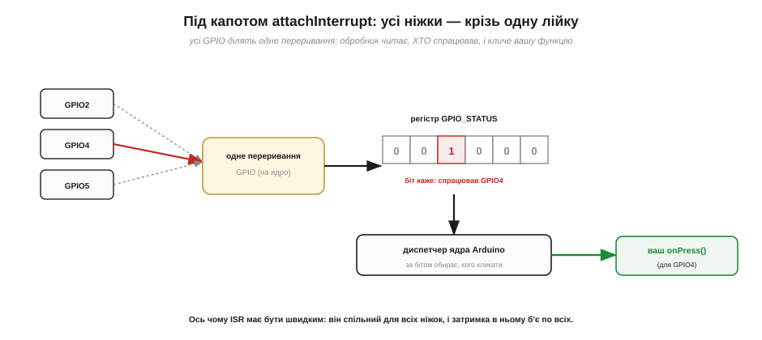
*Рис. 23.2.6. Усі GPIO ділять одне переривання. Коли спрацював GPIO4, біт у `GPIO_STATUS` це позначає; спільний обробник ядра Arduino читає статус, за бітом знаходить, чию функцію кликати, і викликає ваш `onPress()`. Ось чому спільний обробник має бути **швидким** — затримка в ньому б'є по **всіх** ніжках.*

Спрощено цей спільний обробник робить ось що:

**Що робить спільний GPIO-обробник (спрощено).**

```
void gpio_isr() {
  uint32_t status = GPIO.status;      // хто спрацював? (біти-ніжки)
  for (кожен піднятий біт n у status)
      handlers[n]();                  // викликати ВАШ обробник для ніжки n
  GPIO.status_w1tc = status;          // скинути прапорці (атомарно, §22.7)
}
```

Зверніть увагу на останній рядок: прапорці спрацювання скидають через регістр `W1TC` — той самий атомарний прийом, що ми вивчили в §22.7. А ще тепер ясно, чому обробник так наполегливо просять робити **коротким**: він **спільний** для всіх ніжок, і якщо ваша функція в ньому зависне, вона затримає реакцію на **всі** інші переривання GPIO.

Звідси й сумнозвісне правило «**жодного `Serial.print` в обробнику**». Друк у послідовний порт повільний (мілісекунди) і сам спирається на переривання; запхати його у спільний GPIO-обробник означає підвісити на ці мілісекунди реакцію всіх ніжок, а часом і зачепити систему загалом. Те саме стосується `delay`, складних обчислень, роботи з мережею чи файлами. Спільна «лійка» перетворює будь-яку повільну дію в обробнику на гальмо для всього заразом — тому в ISR пускають лише найнеобхідніше.

> 🔧 **Навіщо це.** Ця «лійка» пояснює дві речі, що дивують новачків. По-перше, чому обробник має бути блискавичним: він не лише ваш — він спільний, і повільність у ньому гальмує всіх. По-друге, чому всередині переривання так багато регістрової механіки (статус, маски, W1TC): `attachInterrupt` ховає її, та коли треба максимальна швидкість, досвідчені пишуть власний обробник прямо на регістрах — рівно тими прийомами з §22.7.

Отже, за простим «дзвоником» стоять три механізми: **контролер** збирає й сортує запити; **вектор** (телефонна книга обробників) показує, куди стрибати; а **збереження контексту** на стек — це закладка, що дозволяє повернутися точно туди, де перервали, з тими самими робочими значеннями. У ESP32 до цього додаються матриця переривань, два ядра з рівнями 1–7 і спільна «лійка» GPIO, що дає змогу `attachInterrupt` працювати по-простому. Усе це нагадувало нам про одне й те саме правило, яке ми досі лише проголошували: обробник **мусить бути коротким**. Чому саме коротким, що в обробнику можна робити, а чого категорично не варто, і як виглядає правильний короткий ISR — серцевина [наступної теми §23.3](ch23-interrupts.md).

## 23.3 Обробник (ISR): чому коротко (що можна й не можна)

Ми вже кілька разів проголосили правило «обробник має бути коротким», та ще не пояснили **чому** і, головне, що з цього випливає на практиці. Ця тема — про дисципліну написання обробника переривання (ISR). Розберемо, чому довгий обробник шкодить усій системі, що в ньому **можна** робити, а чого — **категорично ні**, який золотий шаблон рятує від помилок і що означає загадкове слово `IRAM_ATTR` на ESP32. Наприкінці складемо все в анатомію правильного ISR.

### Поки обробник працює — світ на паузі

Згадаймо §23.2: коли стається переривання, процесор **кидає** основний код і виконує обробник. А це означає, що **поки обробник працює, основний код стоїть**. Мало того: на час обробника зазвичай притримуються й інші переривання того ж або нижчого пріоритету — вони чекають своєї черги. Виходить, обробник на ті миті, що він триває, ставить на паузу **майже всю** систему.


*Рис. 23.3.1. Доки обробник виконується, основний код призупинено, а інші події змушені **чекати**. Що довший ISR, то довше «висить» уся система: спізнюються інші переривання, зростає джитер, гальмує планувальник. Звідси й головне правило — обробник якнайкоротший.*

Тепер видно, чому довжина обробника — не дрібниця, а питання справності всього пристрою. Затримався обробник на мілісекунду — і на цю мілісекунду оглухли всі інші переривання, збився точний відлік часу, підвис обмін даними. Обробник — це наче пожежна тривога: поки вона гуде, усі інші справи завмирають, тож гудіти вона має **коротко й по ділу**.

Є й жорсткіший наслідок, ніж просто спізнення. ESP32 має апаратного «сторожа» — **watchdog**, що стежить, чи не завис процесор. Якщо обробник (або ланцюг обробників) тримає систему надто довго, не даючи їй дихнути, сторожовий таймер вирішує, що сталося зависання, — і **перезавантажує** плату. Тобто задовгий ISR не просто гальмує: він здатен узагалі **скинути** пристрій. Те саме стосується планувальника операційної системи (про неї — далі в курсі): доки крутиться обробник, планувальник не може перемкнути задачі, і вся багатозадачність завмирає.

### Короткий встигає все, довгий губить події

Особливо боляче довгий обробник б'є тоді, коли події йдуть **часто**. Уявімо три імпульси підряд. Короткий обробник встигає опрацювати кожен і звільнитися до наступного. А довгий — усе ще «зайнятий» першим, коли приходять другий і третій, — і вони просто **пропадають**, бо обробник їх не почув.


*Рис. 23.3.2. Три події підряд. Угорі — короткий обробник: кожну опрацьовано вмить. Унизу — довгий: поки він порається з першою, друга й третя надходять і **губляться**, бо ISR ще зайнятий. Для частих подій довгий обробник означає втрачені дані.*

Це та сама біда, що з пропуском подій при опитуванні (§23.1), тільки тепер винне не опитування, а **сам обробник**, що задовго тримає систему. Парадоксально, але переривання з довгим обробником може бути **гіршим** за просте опитування. Тому ціль завжди одна: щоб обробник відпрацював за лічені мікросекунди й звільнив систему.

Наскільки ж коротким має бути «короткий»? Чіткого порога нема, але є робочий орієнтир: добрий обробник укладається в **одиниці мікросекунд**, прийнятний — у десятки; усе, що тягне на сотні мікросекунд і більше, майже напевно слід переробити. Корисний прийом самоперевірки — заміряти тривалість ISR, відмітивши `micros()` на вході й виході, або просто рахувати, скільки подій устигаєте обробити. Якщо лічильник «недобирає» подій — обробник задовгий, і частину роботи треба винести в `loop()`.

### Що в обробнику можна, а чого — ні

З цього випливає чіткий перелік дозволеного й забороненого. **Можна** все, що швидке й безпечне: підняти прапорець (`flag = true`), збільшити лічильник (`count++`), прочитати чи скинути апаратний регістр, запам'ятати мить події (`micros()`), покласти повідомлення в чергу спеціальним «з-переривання» викликом. **Не можна** нічого повільного чи блокувального.


*Рис. 23.3.3. Ліворуч (можна): прапорець, лічильник, читання/скидання регістра, мітка часу `micros()`, черга подій. Праворуч (не можна): `delay()`, `Serial.print`, мережа/файли/блокувальний I2C-SPI, `malloc`/`new`, важка математика й float. Правило просте: усе повільне чи блокувальне — у `loop()`.*

Розгляньмо заборони по черзі, бо кожна має причину. **`delay()`** в обробнику безглуздий і небезпечний — він спирається на лічильник часу, який сам потребує переривань, тож у ISR просто зависне. **`Serial.print`** повільний (мілісекунди) і теж переривальний — у §23.2 ми вже бачили, чим це загрожує. **Блокувальні** операції (чекати відповіді мережі, прочитати файл, дочекатися завершення I2C-обміну) можуть тривати скільки завгодно — а обробникові не можна. **`malloc`/`new`** (виділення пам'яті з купи) здатні **заклинити** систему: купу захищає замок, і якщо переривання застане основний код саме посеред роботи з нею, обробник або зруйнує її структури, або (на FreeRTOS) аварійно завершиться — бо брати замок-м'ютекс із переривання заборонено; до того ж саме виділення повільне й непередбачуване. І нарешті **важка математика** (особливо з дробовими числами, float) — і повільна, і на ESP32 вимагає обережності зі станом співпроцесора, тож їй місце в `loop()`.

Два пункти з «можна» варті уточнення. Мітка часу `micros()` безпечна тому, що лише **читає** апаратний лічильник, не чекаючи нічого, — тож зафіксувати в обробнику точний момент події цілком гаразд. А **черга** — це коли обробникові треба не просто крикнути «була подія», а **передати дані** (наприклад, який саме байт прийшов). Для цього в операційній системі є спеціальні «з-переривання» виклики (їхні назви закінчуються на `FromISR`), безпечні всередині обробника. Ми торкнемося їх із RTOS далі в курсі; поки що досить знати, що навіть передавання даних із ISR роблять особливим, швидким способом.

> 🔧 **Навіщо це.** Запам'ятайте один рятівний критерій: **сумнів — виноси в `loop()`**. Обробник має лише **відмітити**, що подія сталася, а не **обробляти** її. Майже всі «загадкові зависання» з перериваннями — це повільна або блокувальна дія, що пролізла в ISR. Якщо тримати обробник аскетично коротким, цілий клас цих бід просто не виникає.

### Золотий патерн: відмітити в обробнику, обробити в loop

Як же тоді робити щось серйозне у відповідь на подію, якщо в обробнику нічого не можна? Відповідь — **відкласти** роботу. Обробник робить мінімум (піднімає прапорець або кладе подію в чергу) і миттю звільняється, а вся справжня робота діється потім, у `loop()` чи окремій задачі, де немає жодних обмежень ISR. Це і є **золотий патерн** переривань, який ми вперше побачили ще в §23.1.


*Рис. 23.3.4. Обробник лише піднімає прапорець (мікросекунди) — і звільняє систему. А `loop()` чи задача, побачивши прапорець, виконує важку роботу без поспіху: друк, обчислення, мережу — будь-що. Так реакція лишається миттєвою, а складна обробка нікому не заважає.*

Цей розподіл «швидко відмітити — неквапом обробити» — головний прийом усієї роботи з перериваннями. Складніший його варіант використовує не простий прапорець, а **чергу** подій (щоб не загубити кілька подій поспіль і передати дані) — але це вже territory операційної системи реального часу, до якої ми дійдемо далі в курсі. Поки що шаблон «прапорець у ISR — обробка в `loop()`» закриває переважну більшість потреб.

Одну пастку простого прапорця назвімо одразу. Булева змінна `flag` лише каже «**хоч раз** сталося», але **не рахує**: якщо до того, як `loop()` її прочитає, подія станеться двічі, ви все одно побачите лише одне `true` — другу втрачено. Тому коли події треба **рахувати** (імпульси, натиски), у обробнику беруть не прапорець, а **лічильник** (`count++`), як у прикладі нижче. А коли важливі ще й **дані** кожної події — повноцінну чергу. Вибір «прапорець / лічильник / черга» визначається тим, що саме ви не маєте права втратити.

У цього розподілу є й усталена назва. Швидку частину, що діється просто в обробнику, інженери звуть «**верхньою половиною**» переривання, а відкладену, неквапну обробку в `loop()` чи задачі — «**нижньою половиною**». Поділ на дві половини — не примха конкретного чипа, а класичний прийом, що його застосовують скрізь, від крихітних мікроконтролерів до ядра великих операційних систем. Запам'ятавши цей образ, ви впізнаватимете його в будь-якій системі з перериваннями.

### IRAM_ATTR: щоб обробник не впав, коли флеш зайнятий

На ESP32 є ще одна специфічна, але важлива вимога до обробника. Код програми зазвичай живе у **флеш-пам'яті** (зовнішній SPI-флеш), звідки процесор його підвантажує через кеш. Проблема в тому, що флеш буває **тимчасово недоступний** — наприклад, коли система пише в нього дані або коли інше ядро виконує флеш-операцію. І якщо саме в цей момент станеться переривання, а код обробника лежить у флеші — процесор не зможе його дістати, і станеться **збій**.


*Рис. 23.3.5. Ліворуч — небезпека: обробник у флеші, а флеш саме зайнятий (запис чи кеш-промах) → код ISR недосяжний → краш. Праворуч — рятунок: слово `IRAM_ATTR` кладе обробник у внутрішню RAM (IRAM), доступну **завжди**, тож зайнятість флеша йому байдужа.*

Рятує спеціальне слово-позначка **`IRAM_ATTR`**: воно наказує покласти обробник у внутрішню оперативну пам'ять (IRAM), що доступна **завжди**, незалежно від стану флеша. Тому всі обробники переривань на ESP32 позначають `void IRAM_ATTR myISR() { … }`. Важлива тонкість: це стосується не лише самого обробника, а й **усього, що він викликає**, — будь-яка функція, яку ISR смикає, теж має бути в IRAM, інакше пастка повертається. Це ще одна причина тримати обробник простим: що менше він робить і викликає, то легше гарантувати, що все потрібне — у безпечній пам'яті.

Тонкість сягає й **даних**. Якщо обробник звертається до сталих (наприклад, рядка чи таблиці), вони теж не повинні лежати лише у флеші, інакше повертається та сама пастка недоступності. На щастя, прості змінні (лічильники, прапорці) живуть у швидкій RAM за замовчуванням, а Arduino-обгортка `attachInterrupt` сама дбає про чимало цих дрібниць, — тож для типового короткого обробника досить просто не забути `IRAM_ATTR` і не кликати «важких» бібліотек.

> 🔧 **Навіщо це.** Якщо переривання на ESP32 «іноді» вішає плату або скидає її без видимої причини — перша підозра саме на `IRAM_ATTR`: або його забули на обробнику, або ISR викликає функцію з флеша. Це підступний баг, бо проявляється **зрідка** (лише коли переривання збіглося з флеш-операцією). Узяти за звичку позначати кожен ISR `IRAM_ATTR` і не кликати з нього «важких» бібліотечних функцій — і проблеми не буде.

### Анатомія правильного обробника

Зведімо всі правила в один зразок. Добрий обробник має чотири ознаки: він **короткий** (лише найнеобхідніше), він у **IRAM** (`IRAM_ATTR`), спільні з основним кодом змінні він позначає **`volatile`** (щоб компілятор їх не «оптимізував» — це тема §23.5), і в ньому **нема** нічого повільного чи блокувального.

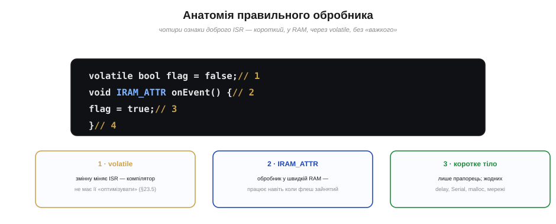
*Рис. 23.3.6. Чотири ознаки доброго обробника: (1) спільну змінну оголошено `volatile`; (2) сам обробник позначено `IRAM_ATTR`; (3) тіло — лише прапорець, жодних `delay`/`Serial`/`malloc`; (4) уся «важка» робота винесена в `loop()`.*

Складімо це в робочий приклад — лічильник імпульсів, де переривання справді необхідне (імпульси можуть іти швидше за цикл, §23.1), а вся обробка винесена в `loop()`.

**Лічильник імпульсів: правильний ISR і обробка в loop.**

```
volatile uint32_t pulses = 0;          // спільний лічильник (volatile, §23.5)

void IRAM_ATTR onPulse() {             // короткий обробник у RAM
  pulses++;                            // лише рахуємо — і все
}

void setup() {
  pinMode(SENSOR, INPUT_PULLUP);
  attachInterrupt(digitalPinToInterrupt(SENSOR), onPulse, FALLING);
}

void loop() {
  static uint32_t last = 0;
  if (millis() - last >= 1000) {       // раз на секунду
    last = millis();
    noInterrupts();                    // безпечно зняти значення (§23.6)
    uint32_t n = pulses; pulses = 0;
    interrupts();
    Serial.println(n);                 // друк — у loop(), НЕ в обробнику!
  }
}
```

Кожен рядок утілює правило теми: обробник `onPulse` короткий, у IRAM, лічильник `pulses` оголошено `volatile`, а вся «важка» робота — рахунок раз на секунду й `Serial.println` — діється в `loop()`, де їй ніщо не заважає. Зверніть увагу й на `noInterrupts()`/`interrupts()` навколо знімання значення — це безпечне «вихоплення» спільної змінної, до якого ми ще повернемося в §23.6.

Ще про форму обробника. Звичайний ISR для `attachInterrupt` — це функція **без аргументів і без результату** (`void onPulse()`): перериванню нема кому передати параметри й нема куди повернути значення, воно лише «трапляється». Якщо ж одну функцію-обробник хочеться повісити на кілька ніжок і розрізняти їх, у Arduino-ESP32 є варіант `attachInterruptArg`, що передасть в обробник вказівник на ваші дані. Та для перших кроків звичайного `attachInterrupt` із простим прапорцем чи лічильником цілком досить.

Отже, обробник мусить бути коротким, бо на час його роботи завмирає вся система: довгий ISR спізнює й губить інші події. У ньому **можна** лише швидке й безпечне (прапорець, лічильник, регістр, мітка часу), а все повільне чи блокувальне (`delay`, `Serial`, мережа, `malloc`, важка математика) виносять у `loop()` за золотим патерном «відмітити — обробити». На ESP32 обробник додатково позначають `IRAM_ATTR`, щоб він працював навіть при зайнятому флеші. Лишилося розібратися, що буде, коли переривань **кілька** й вони сперечаються за процесор: хто головніший і чи можна перебити обробник посеред роботи. Це — **пріоритети й вкладеність** у [наступній темі §23.4](ch23-interrupts.md).

## 23.4 Пріоритети й вкладеність (витіснення)

У [§23.2](ch23-interrupts.md) ми мимохідь сказали, що контролер зважує **пріоритети** й може навіть перебити поточний обробник важливішим. Тепер розберімо це докладно. Що відбувається, коли переривань **кілька** й вони сперечаються за єдиний процесор? Хто головніший, чи можна перервати сам обробник посеред роботи, і чим це загрожує? Відповіді тут — про **пріоритети** (хто важливіший), **витіснення** (важливіший перебиває менш важливого) і **вкладеність** (обробники складаються один на одного). А ще ми побачимо, чому на Arduino всі ці тонкощі зазвичай сховані — і коли вони раптом вилазять.

### Навіщо взагалі пріоритети

Події нерівноцінні. Сигнал «аварія живлення» треба обробити **негайно**, бо за мить буде пізно; точний таймер реального часу — теж важливо й вчасно; а натиск кнопки цілком може зачекати кілька мікросекунд. Якби контролер обслуговував усіх «як прийдуть», то термінова подія могла б застрягти за неспішною. Тому кожному джерелу призначають **пріоритет** — число, що каже контролеру, кого пускати першим і хто кого може перебити.

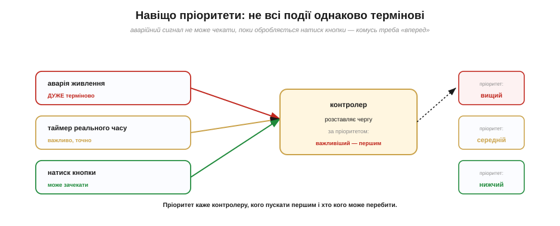
*Рис. 23.4.1. Не всі події однаково термінові: аварія живлення не може чекати, поки обробляється натиск кнопки. Пріоритет — це число терміновості; контролер за ним розставляє чергу й вирішує, кого пустити першим і хто кого має право перебити.*

Пріоритети — пряма спадщина регістра-маски Брукса з історичної вставки: уже тоді інженери зрозуміли, що переривання без упорядкування за важливістю перетворюється на хаос. Сучасний контролер робить рівно те саме, тільки апаратно й миттєво.

Пріоритет дає й інший важіль — **маскування за рівнем**. Контролер уміє тимчасово блокувати всі переривання, **нижчі** за певний поріг, пропускаючи лише найважливіші. Це зручно, коли треба ненадовго захиститися від «дрібних» переривань, не глушачи термінових. Саме так, до речі, влаштоване знайоме нам `noInterrupts()`: воно піднімає поріг і притримує звичайні переривання (а `interrupts()` опускає його назад). Єдине, чого не приховати в такий спосіб, — немаскований NMI (рівень 7): його не зупинить жоден поріг, на те він і «немаскований».

### Витіснення: важливіше перебиває менш важливе

Найцікавіше стається, коли важливе переривання приходить **посеред** обробки менш важливого. Тут діє правило **витіснення** (preemption): високопріоритетний обробник **перебиває** низькопріоритетний, що вже виконується. Процесор призупиняє низький обробник (зберігши його контекст — точно як у §23.2), виконує високий, а потім повертає низький рівно туди, де перервав, і той спокійно доробляє своє.

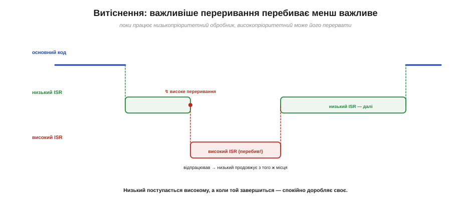
*Рис. 23.4.2. Поки працює низькопріоритетний обробник, надходить високопріоритетне переривання — і перебиває його. Високий обробник відпрацьовує, а тоді низький продовжує з того самого місця. Важливіше ніколи довго не чекає на менш важливе.*

Витіснення працює лише «згори вниз»: високий може перебити низького, але **не навпаки** — низькопріоритетне переривання чемно чекає, поки звільниться процесор, зайнятий важливішим. Це і є сенс пріоритетів: гарантувати, що термінова подія не застрягне за дрібною.

У витіснення є точна інженерна цінність: воно дає високопріоритетному перериванню **обмежений зверху** час реакції, хоч би скільки роботи висіло на нижчих рівнях. Якщо аварійний сигнал має рівень вищий за все інше, він спрацює майже миттєво навіть посеред найдовшого низького обробника. Платять за це нижчі рівні: їхня реакція стає менш передбачуваною, бо їх будь-коли можуть відсунути. Тому рівні розставляють обдумано: найвищий — тому, що по-справжньому не може чекати, а не «про всяк випадок усім по максимуму».

Добра аналогія — приймальня лікарні. Звичайних пацієнтів приймають по черзі, та коли привозять когось у критичному стані, його беруть **поза чергою**, відклавши поточного. Лікар (процесор) один, тож обслужити всіх одночасно не може — але порядок визначає **терміновість**, а не час прибуття. Так само й переривання: рівень — це «ступінь невідкладності», і саме він, а не «хто перший прийшов», вирішує, ким процесор займеться негайно, а кого попросить зачекати. Витіснення — це і є взяття «критичного пацієнта» поза чергою, з обіцянкою повернутися до відкладеного, щойно мине загроза.

### Вкладеність: контексти складаються на стек

Якщо високий обробник перебив низький, то в системі тепер **два** призупинені шари: основний код і низький обробник, обидва чекають. А якщо ще вищий перебе високого — шарів стане три. Це називають **вкладеністю** переривань, і тримається вона на тому самому стеку, що зберігав контекст у §23.2: кожне витіснення кладе ще один контекст **згори**.

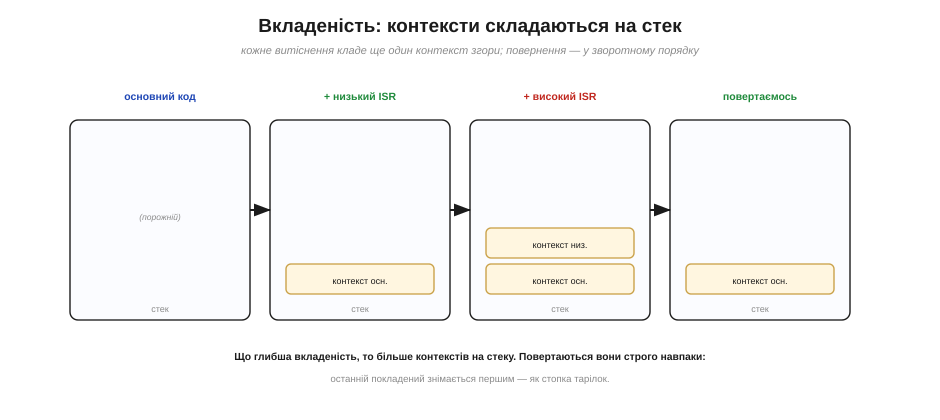
*Рис. 23.4.3. При вкладеності контексти складаються на стек стопкою: спершу контекст основного коду, потім — перерваного низького обробника. Повертаються вони строго навпаки — останній покладений знімається першим, як стопка тарілок. Так система не плутається, хто кого перервав.*

Ця дисципліна «останнім поклав — першим зняв» (її звуть LIFO) і дозволяє як завгодно глибоко вкладати переривання, не заплутавшись: процесор завжди повертається саме туди, звідки його смикнули востаннє. Стек — невидимий, але незамінний бухгалтер усієї цієї механіки.

Звідси випливає й практичний розрахунок пам'яті. Найгірший випадок глибини стека — це коли перервалися геть усі рівні поспіль: тоді на стеку лежать контекст основного коду й по одному на кожен рівень, що встиг витіснити. Тому під стек закладають запас із розрахунку на **повну** можливу вкладеність, а не на «звичайний» випадок. Недооцінити це — означає рано чи пізно впертися в переповнення саме тоді, коли збіглося найбільше переривань, тобто в найгірший і найменш передбачуваний момент.

### Однаковий пріоритет не витісняє

А що, як два переривання мають **однаковий** рівень? Тоді витіснення **не** буває: те, що прийшло другим, не перебиває першого, а **чекає**, поки той завершиться, і лише тоді виконується. Переривання одного рівня обслуговуються по черзі, одне за одним, — вони не можуть перервати одне одного.

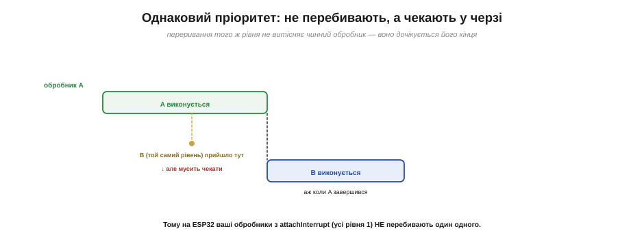
*Рис. 23.4.4. Два переривання однакового рівня не витісняють одне одного: коли під час обробника A приходить подія B того ж рівня, B **чекає** завершення A і лише потім виконується. Серіалізація замість вкладеності.*

> 🔧 **Навіщо це.** Ось практично найважливіший висновок теми для Arduino. Усі ваші обробники, повішені через `attachInterrupt`, мають **однаковий** (низький) рівень — а отже, **не перебивають один одного**: вони завжди виконуються по черзі. Це добра новина: між двома вашими обробниками гонок даних не буде, бо вони не можуть перетнутися в часі. Гонки лишаються тільки **між обробником і `loop()`** — і саме їх ми лікуватимемо в §23.5–§23.6. Тримайте це в голові: «мої ISR одне одного не перебивають».

Варто чітко розрізняти два види «зустрічей» спільних даних. Між двома обробниками **одного рівня** конфлікту нема — вони ніколи не виконуються одночасно. А от обробник і **основний код** перетинаються завжди: обробник може втрутитися в будь-який момент роботи `loop()`. Тому захищати треба саме цей стик — змінні, які пише обробник, а читає `loop()` (чи навпаки). Усе подальше — `volatile`, атомарність, критичні секції — стосується рівно цього єдиного небезпечного перетину.

Корисно усвідомити, що на ESP32 ваші переривання живуть не самі. Поряд працюють **системні** переривання — таймер планувальника RTOS, обробники Wi-Fi і Bluetooth, — і деякі з них мають вищий пріоритет за ваш рівень 1. Це означає, що навіть «ваш» короткий обробник теоретично може бути на мить відсунутий системним. На практиці це майже непомітно (системні обробники теж короткі), та пояснює дрібний джитер, який інколи видно у дуже точних вимірах часу. Монопольно володіє процесором хіба що код під вимкненими перериваннями — та й то лише до рівня NMI.

А що буде, коли кілька переривань **одного** рівня вже чекають своєї черги? Контролер обслужить їх одне за одним; точний порядок між рівними залежить від чипа (часто — за фіксованим внутрішнім номером джерела), але гарантовано одне: жодне з них не пропаде й не перерве інше на півслові. Для коду це означає приємну визначеність — обробники рівня 1 утворюють акуратну чергу, де кожен відпрацьовує цілком, перш ніж почнеться наступний.

### Рівні переривань ESP32

Конкретні числа залежать від чипа. У ESP32 (ядра Xtensa) рівнів **сім**, від 1 (найнижчий) до 7 (найвищий), і кожен має своє призначення.

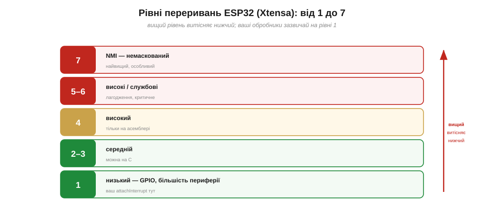
*Рис. 23.4.5. Сходинка рівнів ESP32. Рівень 1 — низький: тут сидять GPIO й більшість периферії, сюди ж лягають ваші `attachInterrupt`. Рівні 2–3 — середні, обробники для них теж можна писати на C. Рівень 4 і вище — високі, їх пишуть уже на асемблері; рівень 7 — немаскований (NMI). Вищий рівень витісняє нижчий.*

Для нас головне — нижній край цієї драбини. Майже вся периферія, з якою ви працюєте (зокрема GPIO), сидить на **рівні 1**, і саме туди `attachInterrupt` чіпляє ваші обробники. Високі рівні (4–7) зарезервовані для особливих, службових задач — критичного відліку часу, лагодження, аварійних сигналів — і вимагають писати обробник мовою асемблера, тож у звичайних проєктах їх не чіпають. Між цими краями (рівні 2–3) лежить «середня» зона, доступна з C, якою користуються, коли треба, щоб одне переривання таки могло витіснити інше.

Коли ж справді потрібні різні рівні? Класичний приклад — точний таймер, що мусить «тікати» рівно, навіть поки інші обробники зайняті: йому дають рівень вищий за решту, і він витісняє їх, гарантуючи незбитий відлік. Інший — критичний аварійний вхід (перегрів, обрив), реакція на який не має права запізнитися ні на мить. У таких випадках різниця рівнів — не примха, а вимога надійності. Для всього іншого однакового рівня 1 цілком досить, і простота того варта.

**Як задати рівень переривання.**

```
// Arduino: рівень НЕ задають — attachInterrupt завжди рівень 1,
// тож усі ваші обробники одного рівня й не витісняють один одного.

// ESP-IDF: рівень обирають прапорцем при виділенні переривання:
esp_intr_alloc(SOURCE, ESP_INTR_FLAG_LEVEL3, handler, arg, &h);
//                     ^^^^^^^^^^^^^^^^^^^^  рівень 3 (середній, можна на C)
// Обробник вищого рівня дістає право витісняти обробники нижчих.
```

### Небезпека: глибока вкладеність переповнює стек

Вкладеність зручна, та має ціну. Кожен вкладений обробник зберігає на стек **свій** контекст — а стек не безмежний. Якщо рівнів багато й вони вкладаються глибоко, контексти можуть з'їсти всю відведену пам'ять, і станеться **переповнення стека** (stack overflow) — одна з найнеприємніших аварій, бо вона тихо псує сусідні дані й валить програму в несподіваному місці.

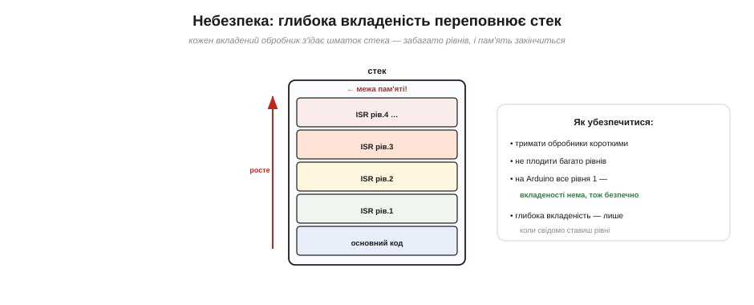
*Рис. 23.4.6. Кожен вкладений обробник додає кадр на стек. Забагато рівнів, що вкладаються один в одного, — і стек дійде до межі пам'яті, спричинивши переповнення. Захист простий: короткі обробники, небагато рівнів, а на Arduino — узагалі спокій, бо всі переривання одного рівня й не вкладаються.*

На щастя, у звичайному Arduino-коді ця небезпека вас не торкається: оскільки всі переривання `attachInterrupt` одного рівня й не витісняють одне одного, **вкладеності просто немає** — у будь-який момент виконується щонайбільше один ваш обробник. Глибока вкладеність виникає лише тоді, коли ви **свідомо** розставляєте різні рівні через `esp_intr_alloc`, — і там уже самі дбаєте, щоб обробники були короткими, а рівнів небагато.

> 🔧 **Навіщо це.** Підсумуймо практично. На Arduino з `attachInterrupt` пріоритети й вкладеність — це переважно теорія: усі ваші ISR рівня 1, не перебивають одне одного, стек у безпеці. Знати про них усе одно треба з двох причин: по-перше, щоб розуміти, чому термінові системні переривання (зв'язок, таймери) усе ж можуть «вклинитися» у вашу роботу; по-друге, щоб не злякатися й не наробити лиха, коли проєкт виросте до ручного призначення рівнів. Правило безпеки скрізь те саме: **короткий обробник** (§23.3) — і вкладеність ніколи не стане проблемою.

Насамкінець — про підступну рідкість, **інверсію пріоритетів**. Це коли високопріоритетна робота мусить чекати на низькопріоритетну, бо та тримає потрібний їй ресурс (чи надовго вимкнула переривання). Тоді «важливий» парадоксально застрягає за «дрібним» — усупереч усій ідеї пріоритетів. Найвідоміший випадок — марсіанський апарат Pathfinder (1997), що раз у раз перезавантажувався в польоті саме через інверсію пріоритетів, аж поки інженери не виправили це віддалено вже на Марсі. Глибше ця тема належить операційним системам реального часу, до яких ми ще дійдемо; тут досить запам'ятати, що довге утримання переривань вимкненими в «дрібному» коді здатне підкосити навіть найтерміновіше.

Отже, пріоритет визначає, кого з претендентів на процесор пустити першим; **витіснення** дозволяє важливішому перебити менш важливого; **вкладеність** складає перервані контексти на стек і повертає їх у зворотному порядку. Переривання **однакового** рівня одне одного не витісняють, а чекають у черзі — і саме тому ваші Arduino-обробники не перетинаються між собою. Для більшості проєктів стандартного рівня 1 цілком досить — він простий і безпечний; а ручне призначення рівнів лишається інструментом на потім, коли терміновість однієї конкретної події справді переважить усі інші й зажадає права витісняти. Лишається найпідступніше: спільні змінні між обробником і основним кодом. Чому компілятор може їх раптом «не побачити» й навіщо тут особливе слово `volatile` — [наступна тема §23.5](ch23-interrupts.md).

## 23.5 `volatile`: чому компілятор не має «оптимізувати»

У [§23.4](ch23-interrupts.md) ми звузили всю небезпеку переривань до одного місця — спільні змінні між обробником і основним кодом. Тепер беремося їх лікувати, і перші ліки — маленьке, але доленосне слово **`volatile`**. Ця тема пояснює один із найпідступніших багів у світі вбудованого програмування: код виглядає бездоганно, а програма «зависає» або поводиться безглуздо — і все через те, що компілятор **надто розумний**. Розберемо, як виникає ця пастка, як `volatile` її знімає, яким змінним воно потрібне, а яким ні, і — найважливіше — чого `volatile` **не** робить.

### Підступний баг: цикл, що зависає назавжди

Почнімо з прикладу, на якому спіткнувся кожен, хто вперше працював із перериваннями. Маємо прапорець `flag`, який обробник ставить у `true`, коли сталася подія, а основний код чекає на цю подію простим циклом `while (!flag) { }`. Виглядає очевидно правильно: щойно ISR підніме прапорець, цикл побачить це й вийде. Та насправді програма **зависає назавжди**, хоча обробник чесно спрацьовує й записує `flag = true`.

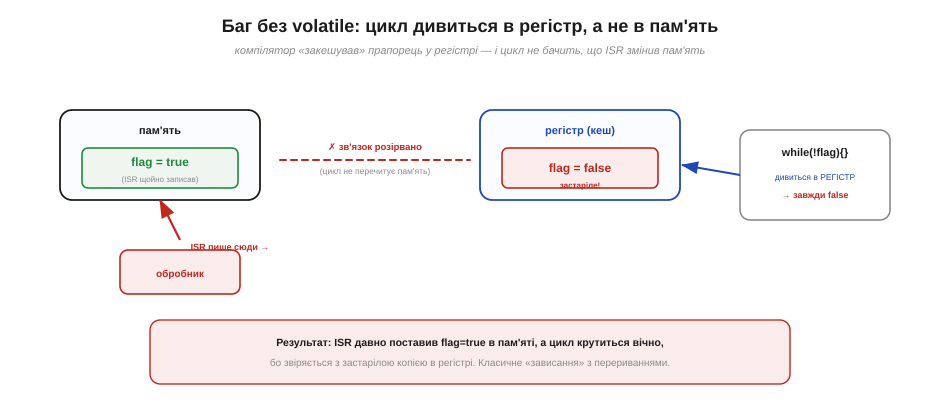
*Рис. 23.5.1. Компілятор задля швидкості «закешував» `flag` у регістрі процесора, тож цикл перевіряє **регістр**, а не пам'ять. Обробник тим часом записав `flag = true` у **пам'ять** — але цикл туди вже не зазирає й крутиться вічно, звіряючись із застарілою копією. Класичне «зависання» з перериваннями.*

Причина не в обробнику й не в логіці — вона у **відірваності** того, що бачить цикл, від того, що записав ISR. Цикл читає застарілу копію змінної в регістрі, а свіже значення лежить у пам'яті, куди він уже не зазирає. Поки ми не накажемо коду перечитувати змінну з пам'яті щоразу, баг невиліковний.

Найгидкіше в цьому багу — що він **примхливий**. Чи проявиться він, залежить від того, наскільки агресивно оптимізує компілятор. У «налагоджувальному» режимі (без оптимізацій) компілятор часто не кешує змінну, і код **працює**; а в «робочому» (з оптимізаціями) — кешує, і той самий код **зависає**. Звідси сумнозвісна примовка «працює в debug, ламається в release». Така мінливість збиває з пантелику: ви ж нічого не міняли в логіці! Тому покладатися на «у мене ж працює» тут не можна — спільну змінну треба позначати `volatile` **завжди**, незалежно від того, чи виліз баг сьогодні.

### volatile: «читай заново щоразу»

Ось тут і виходить на сцену `volatile`. Це слово ставлять перед оголошенням змінної (`volatile bool flag;`), і воно каже компіляторові буквально таке: «**ця змінна може змінитися поза твоїм видимим кодом — тому не кешуй її в регістрі, а читай і пиши прямо в пам'ять, щоразу, без жодних скорочень**». Для нашого циклу це означає, що кожна перевірка `!flag` тепер іде безпосередньо в пам'ять — і миттю бачить запис, який зробив обробник.

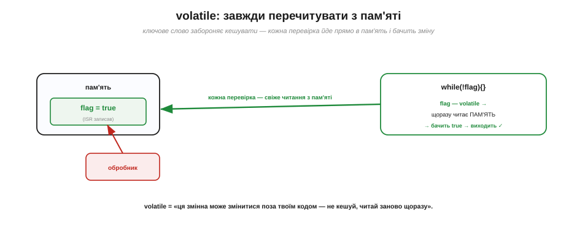
*Рис. 23.5.2. Оголосивши `flag` як `volatile`, ми забороняємо кешування: тепер цикл щоразу читає змінну **з пам'яті**, бачить `true`, який поставив обробник, і коректно виходить. Одне слово відновлює розірваний зв'язок між обробником і основним кодом.*

По суті `volatile` — це позначка «обережно, мінливе»: вона вимикає для конкретної змінної всі оптимізації, що припускають її незмінність «за спиною». Ціна — ця змінна стає трохи повільнішою (кожен доступ іде в пам'ять, а не в швидкий регістр), та для прапорця чи лічильника це абсолютно несуттєво порівняно з тим, що код нарешті **працює**.

Цікаво, що з тим самим `volatile` ви вже зустрічалися, навіть не помітивши. Апаратні **регістри** периферії (§20.3) у бібліотеках завжди описані як `volatile` — і не випадково: значення регістра `GPIO_IN` змінює саме залізо, «за спиною» компілятора, точнісінько як обробник міняє наш прапорець. Якби читання регістра дозволили кешувати, код бачив би старий стан ніжки замість реального. Тобто `volatile` — це загальний механізм «ця комірка живе власним життям»: він однаково потрібен і для змінних, спільних з ISR, і для будь-чого, що міняє апаратура.

Симетрія тут повна: `volatile` діє в **обидва** боки. Він змушує не лише **читати** свіже, а й **записувати** одразу в пам'ять, не відкладаючи. Це важливо, коли напрям обміну зворотний — основний код виставляє якийсь керівний прапорець, а обробник його читає: без `volatile` запис із `loop()` міг би «застрягти» в регістрі й не дійти до ISR вчасно. Тож правило «спільне з обробником — `volatile`» однакове, хоч хто кому пише: і коли обробник сповіщає `loop()`, і коли `loop()` керує обробником.

### Чому так стається: компілятор «надто розумний»

Щоб користуватися `volatile` свідомо, варто зрозуміти, **що** саме робить компілятор і чому. Сучасний оптимізатор постійно прискорює ваш код десятками способів. Серед них — тримати часто вживану змінну в **регістрі**, не бігаючи щоразу в повільну пам'ять; **прибирати** читання, які здаються зайвими (якщо між двома читаннями змінну ніхто не записував — навіщо читати двічі?); **переставляти** доступи до пам'яті задля швидкості.

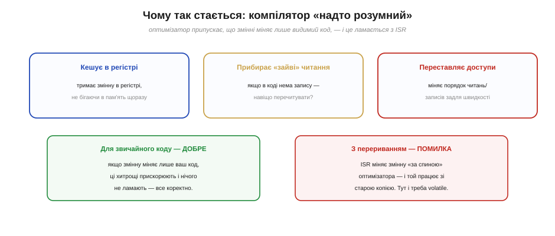
*Рис. 23.5.3. Три типові оптимізації: тримати змінну в регістрі, прибирати «зайві» перечитування, переставляти доступи. Для звичайного коду це **коректно** й корисно — якщо змінну міняє лише ваш код. Але обробник міняє її «за спиною» оптимізатора, тож той працює зі старою копією — і саме тут потрібен `volatile`.*

Головне розуміти: ці оптимізації **не помилкові**. Вони спираються на цілком слушне для звичайного коду припущення — що змінну міняє **лише той код, який компілятор бачить**. У однопотоковій програмі без переривань так і є, і всі скорочення абсолютно безпечні. Але переривання порушує це припущення: обробник може втрутитися будь-коли й змінити змінну **поза** видимим потоком виконання. Тоді чесна оптимізація обертається багом — і `volatile` саме й каже компіляторові «для цієї змінної те припущення не діє».

За цим стоїть фундаментальне правило мов C і C++ — так зване «**правило ніби**» (as-if rule): компілятор має право перетворювати ваш код як завгодно, **аби лиш** зберігалася його видима поведінка для однопотокового спостерігача. А доступи до `volatile`-змінних якраз і оголошено **видимою** (спостережуваною) поведінкою, що її чіпати **не можна**: їх не вільно ані прибирати, ані переставляти між собою. Тобто `volatile` не «просить» компілятор бути обережним — він формально виводить ці доступи з-під дії оптимізацій. Ось чому це надійно працює на всіх компіляторах і не залежить від їхньої доброї волі.

### Яким змінним потрібен volatile

Звідси чітке правило, кому потрібна позначка, а кому ні. `volatile` потрібен **кожній** змінній, яку міняє один контекст, а читає інший: прапорець, що його ставить ISR; лічильник подій із обробника; індекс чи буфер, спільний між обробником і `loop()`. Коротко — усе, що пише обробник, а читає основний код (чи навпаки).


*Рис. 23.5.4. Ліворуч — потребують `volatile`: прапорці, лічильники, буфери, спільні з обробником. Праворуч — не потребують: локальні змінні функцій, тимчасові в обчисленнях, константи, усе, чого обробник не чіпає. `volatile` ставлять не «про всяк випадок», а лише там, де змінну справді міняють поза видимим кодом.*

А от пхати `volatile` всюди «про всяк випадок» — погана ідея: для звичайних, не спільних змінних воно лише **відбирає** в компілятора законні оптимізації й сповільнює код, нічого не даючи натомість. Локальна змінна в функції, тимчасове значення в обчисленні, константа — їм `volatile` ні до чого. Точність тут важлива: позначайте рівно ті змінні, що живуть на стику обробника й основного коду.

> 🔧 **Навіщо це.** Візьміть за непорушну звичку: **оголосив змінну, яку чіпає обробник, — одразу пиши `volatile`**. Це найдешевша страховка від цілого класу «містичних» багів, де код виглядає правильним, але зависає, реагує через раз чи бачить старі значення. І навпаки — якщо переривання «не доходить» до `loop()`, перша підозра саме сюди: чи спільна змінна оголошена `volatile`? Дев'ять із десяти таких загадок — це забутий `volatile`.

Дрібна, але корисна тонкість: `volatile` стосується **всієї** змінної, тож складені дані (структуру, масив) оголошують `volatile` цілком, а не одне поле. З вказівниками ж буває плутанина: `volatile T*` і `T* volatile` — різні речі (мінливе те, **на що** вказують, чи **сам** вказівник). Для перших кроків це зайве, та варто знати, що позначка прив'язана до конкретної комірки, і помилитися, на яку саме, цілком реально. Якщо сумніваєтесь — оголошуйте `volatile` саме ту змінну, яку реально чіпає обробник.

### Чого volatile НЕ робить: це не атомарність

А тепер найважливіше застереження теми, яке рятує від хибної певності. `volatile` гарантує **свіжість** — що ви завжди прочитаєте/запишете актуальне значення з пам'яті. Але він **не** гарантує **атомарності** — тобто не робить операцію неподільною. Це різні речі, і плутати їх небезпечно.

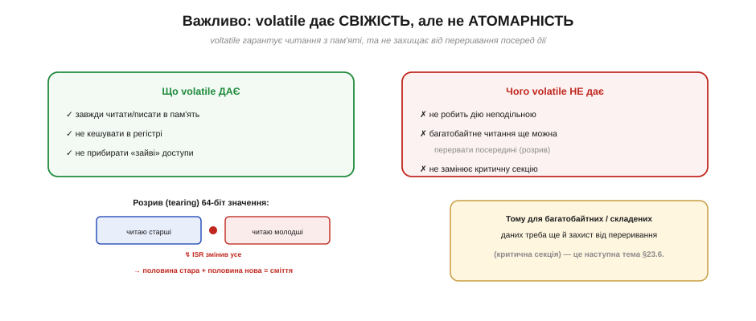
*Рис. 23.5.5. `volatile` забезпечує читання/запис прямо в пам'ять — але не захищає від переривання **посеред** дії. Якщо значення багатобайтне (наприклад, 64-бітне), обробник може втрутитися між читанням старшої й молодшої половини — і вийде «розрив» (tearing): половина стара, половина нова, тобто сміття. Для таких даних потрібен ще й захист — критична секція (§23.6).*

Тут варто додати точне уточнення, щоб не лякатися без потреби. На 32-бітному ESP32 читання чи запис **одного** вирівняного 32-бітного слова — це **одна** машинна операція, тож вона неподільна сама собою: простий `volatile bool` чи `volatile uint32_t`, який обробник лише **записує**, а `loop()` лише **читає**, у захисті не потребує — `volatile` тут достатньо. Розрив загрожує більшим за слово величинам (64-бітним `uint64_t`, `double`, структурам) або діям «прочитати-змінити-записати» (як `count++`), що складаються з кількох кроків. Тобто межа проста: одне слово, один доступ — безпечно; усе складніше — під захист.

Симптом розриву легко впізнати: значення, що зрідка «стрибає» в безглузду величину — величезну чи від'ємну там, де такого бути не може. Якщо багатобайтний лічильник раз на тисячу зчитувань видає сміття, а `volatile` уже стоїть, — це майже напевно розрив, і час брати захист із §23.6. Підступність у тому, що трапляється воно **рідко** (лише при точному збігу читання з перериванням), тож відтворити його важко, а пояснити — легко, коли знаєш про неподільність.

Уявімо 64-бітну змінну на 32-бітному процесорі: прочитати її — це **дві** машинні операції (старша половина, потім молодша). Якщо обробник втрутиться **між** ними й змінить усе значення, основний код складе докупи стару половину й нову — отримавши число, якого ніколи не існувало. Це називають **розривом** (tearing). `volatile` тут не рятує: він зробив кожну з двох половин свіжою, але не зробив їхнє читання **неподільним**. Тому для багатобайтних чи складених даних (структур, буферів) `volatile` — лише половина справи; другу половину — захист від переривання посеред дії — дає **критична секція**, якій присвячена [наступна тема §23.6](ch23-interrupts.md).

### Приклад: одне слово, що все вирішує

Складімо все в найпростіший приклад — той самий, з якого почали, у двох версіях.

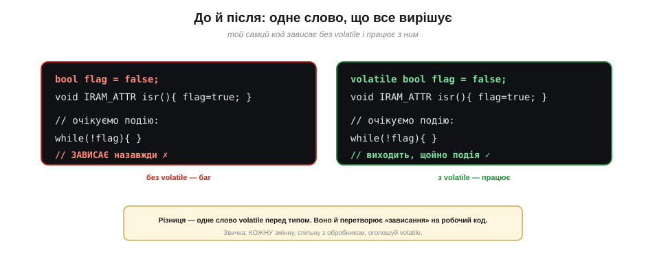
*Рис. 23.5.6. Той самий код у двох версіях. Ліворуч (без `volatile`) цикл `while(!flag){}` зависає назавжди, бо компілятор кешує прапорець. Праворуч — одне слово `volatile` перед типом, і код працює: цикл виходить, щойно обробник підніме прапорець. Різниця — справді в одному слові.*

**Зависання без volatile проти робочого коду з ним.**

```
// --- БЕЗ volatile: зависає назавжди ---
bool flag = false;
void IRAM_ATTR isr() { flag = true; }
…
while (!flag) { }          // компілятор кешує flag → цикл вічний ✗

// --- З volatile: працює ---
volatile bool flag = false;
void IRAM_ATTR isr() { flag = true; }
…
while (!flag) { }          // щоразу читає пам'ять → виходить по події ✓
```

Уся різниця — одне слово `volatile` перед типом. Без нього бездоганний на вигляд код зависає; з ним — працює. Те саме стосується й лічильника імпульсів із §23.3 (`volatile uint32_t pulses`): без `volatile` `loop()` бачив би застигле значення, скільки б обробник не рахував. Запам'ятайте це як рефлекс: будь-яка змінна, що перетинає межу «обробник ↔ основний код», має бути `volatile`.

Чесно згадаймо й сучасну альтернативу. У новому C++ є тип `std::atomic`, що розв'язує обидві проблеми заразом — і свіжість, і неподільність, — тож формально він «правильніший» за `volatile` для обміну між контекстами. Та у світі Arduino й вбудованих систем донині панує простіша й передбачуваніша класична зв'язка: **`volatile` для свіжості плюс критична секція для неподільності**, яку ми зберемо в [§23.6](ch23-interrupts.md). Саме її ви бачитимете в переважній більшості прикладів і бібліотек, тож опанувати варто насамперед її; а `std::atomic` нехай лишається знанням про те, що є й елегантніший шлях, коли доростете до нього.

Отже, `volatile` — це наказ компіляторові не «оптимізувати» доступ до змінної: не кешувати її в регістрі, не прибирати перечитувань, а щоразу йти в пам'ять. Він потрібен **кожній** змінній, спільній між обробником і основним кодом, і лише їм. Та пам'ятайте про його межу: `volatile` дає **свіжість, але не атомарність**, тож від «розриву» багатобайтних значень він не боронить. Цю другу частину захисту — як зробити дію зі спільними даними **неподільною** — і розбирає [наступна тема §23.6](ch23-interrupts.md).

## 23.6 Атомарність і гонки даних (критичні секції)

У [§23.5](ch23-interrupts.md) ми залатали половину проблеми спільних даних: `volatile` дав **свіжість**. Та сам же й попередив — свіжість це не **неподільність**. Лишилася друга половина, і вона тонша: що буде, коли переривання втрутиться **посеред** багатокрокової дії зі спільними даними? Ця тема — про **гонки даних** (коли результат залежить від випадкового збігу в часі), про поняття **атомарності** (неподільності дії) і про **критичну секцію** — інструмент, що робить дію цілісною. Це остання, найважливіша цеглина в умінні безпечно обмінюватися даними з обробником.

### Гонка даних: коли результат залежить від «хто коли встиг»

Розгляньмо невинну на вигляд дію — збільшити лічильник: `count++`. Здавалося б, одна операція. Та насправді процесор виконує її в **три** кроки: прочитати поточне значення, додати одиницю, записати назад. А тепер уявімо, що `count++` роблять **і** основний код, **і** обробник. Якщо переривання застане основний код між «прочитати» і «записати», станеться халепа.

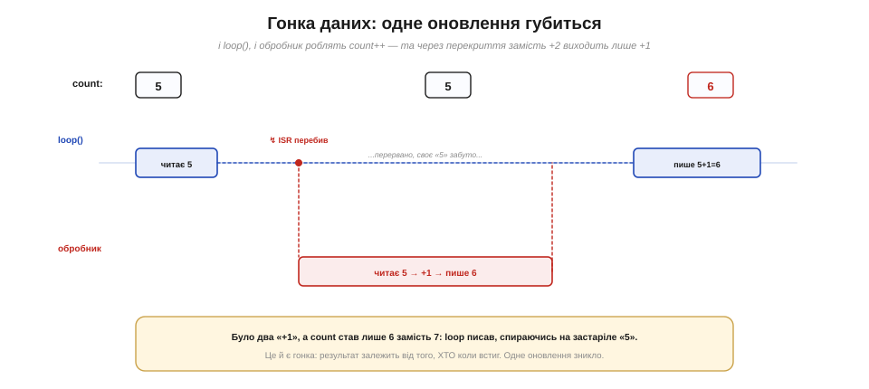
*Рис. 23.6.1. `count` дорівнює 5. `loop()` прочитав 5 — і тут його перебив обробник: прочитав 5, додав, записав 6. Коли `loop()` продовжив, він записав своє «5 + 1 = 6», спираючись на **застаріле** значення. Було два `+1`, а `count` став лише 6 замість 7 — одне оновлення **зникло**.*

Це і є **гонка даних** (race condition): результат залежить не від логіки, а від того, **хто коли встиг** — від випадкового збігу моментів. Найгидкіше, що проявляється вона **зрідка** й непередбачувано: лічильник «недобирає» одиницю раз на тисячу подій, програма поводиться майже завжди правильно — а потім раптом ні. Такі баги мучать місяцями, бо їх майже неможливо відтворити навмисно. І `volatile` тут не порятунок: він зробив кожен крок свіжим, але не зробив **усі три** кроки неподільними.

Інкремент — лише найпростіший приклад. Та сама пастка чигає в схемі «**перевірити, тоді діяти**»: код читає спільну змінну, ухвалює за нею рішення — а обробник між перевіркою й дією встигає її змінити, і рішення стає хибним. Скажімо, `loop()` бачить, що в буфері є дані, та поки збирається їх узяти, обробник буфер уже спорожнив. Цей різновид гонки навіть має назву — «**час перевірки проти часу дії**» (TOCTOU). Спільне в усіх цих бідах одне: між кількома кроками над спільними даними не має втручатися ніхто чужий.

Зрима аналогія — двоє редагують одну табличку. Перший прочитав «5», задумався вписати «6»; тим часом другий теж прочитав «5» і вписав «6». Перший, не помітивши, теж вписує своє «6». Двоє щось зробили — а в клітинці лише одна зміна: друга «затерла» першу. Точнісінько так переривання й основний код «затирають» одне одного, коли діють над спільним числом без черги.

### Що таке атомарність

Корінь біди — у **неатомарності**. Дію називають **атомарною** (від грецького «неподільний»), якщо її не можна застати на півдорозі: вона виконується вся повністю або не починається зовсім, і перерватися «всередині» їй ніде. Багатокрокова ж дія — як наш `count++` із трьох кроків, як читання 64-бітного числа двома half-словами (§23.5) чи як оновлення кількох полів структури — **подільна**, і переривання може розрізати її посередині.

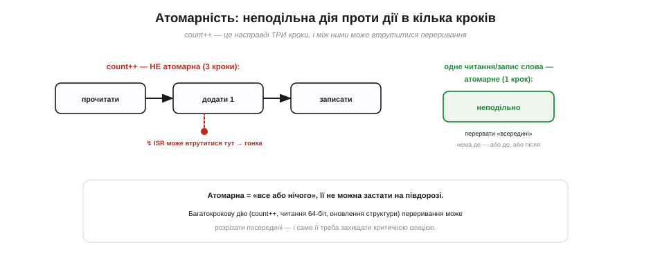
*Рис. 23.6.2. `count++` — це три кроки (прочитати → додати → записати), і між ними може втрутитися обробник: звідси гонка. Натомість одне читання чи запис вирівняного слова — **атомарне**: воно неподільне, перервати його «всередині» ніде. Захищати треба саме багатокрокові дії.*

Згадаймо точне уточнення з §23.5: на 32-бітному ESP32 читання чи запис **одного** вирівняного слова атомарні самі собою. Тому простий прапорець чи лічильник, який обробник лише **пише**, а `loop()` лише **читає**, гонки не утворює — там досить `volatile`. Гонка виникає, щойно з'являється **багатокрокова** дія над спільними даними: `count++` з обох боків, читання значення ширшого за слово, узгоджене оновлення кількох змінних. Саме ці випадки й треба захищати.

Варто наголосити, що гонки даних — не примха ESP32 чи мікроконтролерів узагалі. Це **фундаментальна** проблема будь-якої системи, де кілька «виконавців» ділять спільну пам'ять: обробник і основний код, два потоки на настільному комп'ютері, два ядра, два процеси. Слово «атомарність» і прийшло саме звідти — з теорії паралельних обчислень. Тож, опанувавши гонки на простому прикладі лічильника, ви здобуваєте знання, що стане в пригоді далеко за межами Arduino — скрізь, де щось діється водночас.

### Критична секція: на мить вимкнути переривання

Як зробити багатокрокову дію неподільною? Найпростіший і найнадійніший спосіб — на час цієї дії **заборонити перериванням втручатися**. Ділянку коду, на якій переривання тимчасово вимкнені, називають **критичною секцією**. У Arduino її огороджують парою викликів: `noInterrupts()` вимикає переривання, `interrupts()` вмикає назад. Усе, що між ними, виконується **цілісно** — обробник не може врізатися посередині.

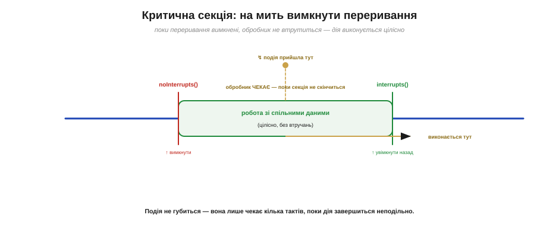
*Рис. 23.6.3. Між `noInterrupts()` і `interrupts()` переривання вимкнені, тож робота зі спільними даними виконується **цілісно**, без втручань. Подія, що прийшла всередині секції, не губиться — обробник просто **чекає** кілька тактів, поки секція скінчиться, і спрацьовує одразу по тому.*

Важливо зрозуміти: критична секція нічого не «викидає». Переривання, що надійшло, поки переривання вимкнені, не зникає — воно лише **притримується** й спрацьовує, щойно ми ввімкнемо переривання назад. Тобто ми платимо за неподільність крихітною затримкою тих переривань, що зібралися під час секції, — і ця плата прийнятна, якщо секція коротка.

> 🔧 **Навіщо це.** Зв'яжіть докупи обидві теми: **`volatile` — щоб бачити свіже, критична секція — щоб дія була цілісною**. Прапорець, що його лише ставить ISR, потребує тільки `volatile`. А щойно ви робите над спільними даними щось багатокрокове — інкремент з обох боків, читання-обнулення лічильника, копіювання структури — додавайте критичну секцію. Це найнадійніший спосіб прибрати гонку даних, і саме його ви бачитимете в бібліотеках.

Технічно є й тонший спосіб, ніж глушити **всі** переривання, — заборонити лише те **одне** джерело, що чіпає спільні дані. Та на практиці глобальні `noInterrupts()`/`interrupts()` майже завжди зручніші: вони прості, гарантовано покривають усі джерела, а на короткій секції їхня «грубість» не шкодить. Точкове маскування одного джерела беруть хіба що в дуже чутливих до затримок місцях, де глушити геть усе неприйнятно навіть на кілька тактів. Для перших кроків глобальної пари цілком досить.

### Патерн «знімок»: копіювати під захистом, працювати поза ним

З критичною секцією є спокуса огорнути нею забагато — і тим самим надовго заглушити переривання. Правильний прийом інший: під захистом зробити **мінімум** — швидко «сфотографувати» спільні дані в локальну змінну, — а одразу по тому ввімкнути переривання й працювати вже з **копією**, скільки треба. Цей прийом звуть **знімком** (snapshot).

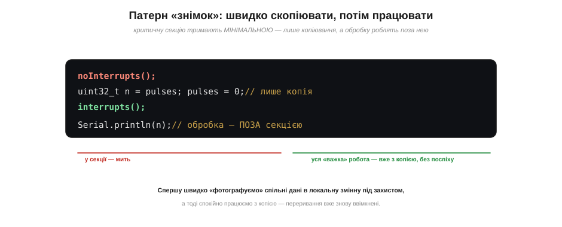
*Рис. 23.6.4. У критичній секції — лише копіювання спільної змінної в локальну (мить); уся «важка» робота (друк, обчислення) діється вже **поза** секцією, з копією, коли переривання знову ввімкнені. Так критична секція лишається якнайкоротшою, а обробка — необмеженою в часі.*

Саме цей патерн ми мигцем бачили в лічильнику імпульсів із §23.3: `noInterrupts(); n = pulses; pulses = 0; interrupts();` — а вже `Serial.println(n)` робили **після**, з локальним `n`. Усередині секції — два присвоєння, лічені такти; назовні — повільний друк, що нікому не заважає. Знімок — це золоте правило роботи зі спільними даними: захищай **копіювання**, а не обробку.

А коли критична секція взагалі **не** потрібна? Якщо спільні дані вкладаються в **одне** вирівняне слово і ви лише читаєте їх (а пише — лише обробник), то одне читання атомарне саме собою, і `volatile` достатньо — секцію можна не ставити. Тобто критична секція потрібна не «завжди про всяк випадок зі спільними даними», а саме для **багатокрокових** дій: інкремент з обох боків, читання ширшого за слово, узгоджене оновлення кількох змінних. Простий «обробник пише — `loop()` читає одне слово» обходиться без неї.

### Критичну секцію тримати короткою

Тут діє рівно те саме правило, що для обробника (§23.3): критична секція має бути **якнайкоротшою**. Адже поки переривання вимкнені, **сліпне вся система** — жодне переривання не обслуговується, точний час збивається, події накопичуються. По суті критична секція на ті такти, що вона триває, перетворює ваш код на «суперобробник», який не можна перебити, — з усіма наслідками довгого ISR.

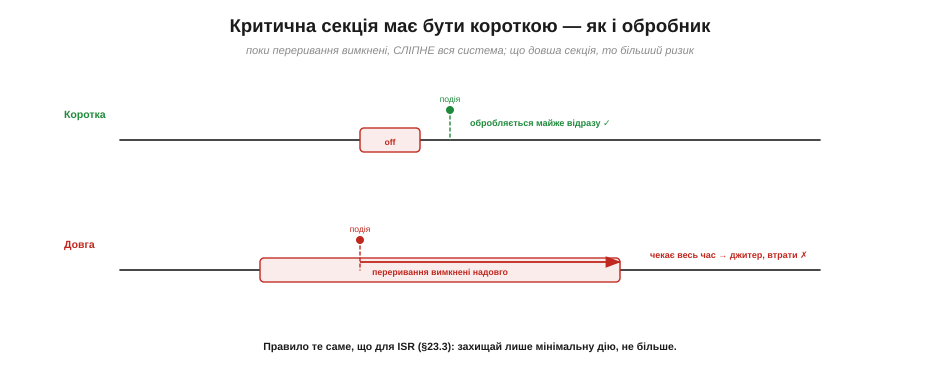
*Рис. 23.6.5. Угорі — коротка секція: подія, що прийшла, обслуговується майже відразу. Унизу — довга: переривання вимкнені надовго, і подія мусить чекати весь цей час, набігає джитер, можливі втрати. Захищають лише мінімальну дію — не більше.*

Звідси практичні висновки. Ніколи не кладіть у критичну секцію нічого повільного — ні `delay`, ні `Serial`, ні обчислень: тільки коротке копіювання чи інкремент. Чим менше тактів переривання вимкнені, тим менше страждає чуйність решти системи. Критична секція — потужний, але «важкий» інструмент: користуйтеся ним точково й коротко.

Наскільки коротко? Орієнтир той самий, що для обробника: лічені такти, одиниці мікросекунд. Скопіювати слово, інкрементувати, переставити пару значень — гаразд; цикл, виклик бібліотеки, очікування — зась. Якщо помічаєте, що під захистом опинилося щось довше за кілька простих присвоєнь, майже напевно це можна винести назовні через «знімок».

### Два ядра ESP32: коли потрібен спінлок

І остання, специфічна для ESP32 тонкість. У ESP32 **два** ядра, а `noInterrupts()` вимикає переривання лише на **тому** ядрі, де виконується. Якщо спільні дані ділять код і обробник на **одному** ядрі (звичайний випадок Arduino: `loop()` і ISR на тому самому ядрі), `noInterrupts()` цілком достатньо. Та якщо дані справді спільні між **різними** ядрами, друге ядро тим часом не спить — і гонка лишається.

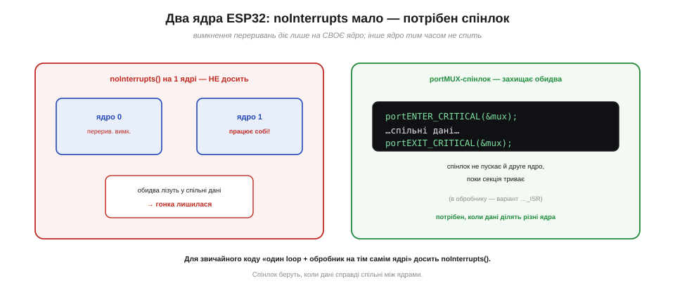
*Рис. 23.6.6. Ліворуч: `noInterrupts()` вимкнув переривання на ядрі 0, але ядро 1 працює собі далі — і теж лізе у спільні дані, тож гонка не зникла. Праворуч: пара `portENTER_CRITICAL(&mux)` / `portEXIT_CRITICAL(&mux)` бере **спінлок**, що не пускає й друге ядро, поки триває секція (в обробнику — варіант `…_ISR`).*

Для справжньої багатоядерної безпеки в ESP32 беруть **спінлок** — `portMUX_TYPE` разом із `portENTER_CRITICAL`/`portEXIT_CRITICAL` (а в обробнику — їхні `_ISR`-варіанти). Спінлок не лише вимикає переривання на поточному ядрі, а й змушує інше ядро **зачекати** біля захищеної ділянки. Звучить складно, та для перших кроків запам'ятайте просте: для звичайного «один `loop()` плюс обробник на тому ж ядрі» досить `noInterrupts()`; спінлок дістають, лише коли свідомо ділять дані між ядрами. Глибше багатоядерність ми розберемо з операційною системою далі в курсі.

**Безпечне читання спільного лічильника.**

```
volatile uint32_t pulses = 0;          // свіжість (§23.5)

void IRAM_ATTR onPulse() { pulses++; } // обробник лише рахує

void loop() {
  noInterrupts();                      // ← критична секція: цілісно
  uint32_t n = pulses;                 //   «знімок» спільних даних
  pulses = 0;
  interrupts();                        // ← переривання знову ввімкнені
  // ... далі працюємо з локальним n, поза секцією ...
  Serial.println(n);                   // повільний друк — НЕ в секції
}
```

Цей крихітний фрагмент поєднує все: `volatile` дає свіжість, критична секція робить пару «зчитати-обнулити» неподільною, а патерн «знімок» виносить повільний друк назовні. Так гонка даних усунена, а система лишається чуйною.

> 🔧 **Навіщо це.** Практичне рішення в один рядок думки: пишеш звичайний Arduino-скетч (один `loop()` плюс обробники на тому ж ядрі) — досить `noInterrupts()`/`interrupts()`. Свідомо ділиш дані між задачами на різних ядрах — береш `portMUX`-спінлок. Не вгадуй наперед: почни з простого `noInterrupts()`, а спінлок додавай, лише коли реально розносиш роботу по ядрах.

І найголовніша осторога наостанок: критичну секцію **обов'язково треба закрити**. Викликали `noInterrupts()` — мусите згодом викликати `interrupts()`, інакше переривання лишаться вимкненими **назавжди**, і система просто «оглухне», зависнувши без видимої причини. Особливо легко забути про це, коли в секції є кілька шляхів виходу (`return` чи помилка посередині). Тому секцію роблять короткою й прямою, без розгалужень, щоб `interrupts()` гарантовано виконався. Незакрита критична секція — підступний спосіб «повісити» цілий пристрій.

Як же запідозрити гонку на практиці? Прикмети характерні: баг рідкісний і «плаває», зникає під налагоджувачем (бо той міняє таймінг), а в коді є спільна змінна, яку чіпають і обробник, і `loop()`. Побачили такий набір — перевіряйте дві речі поспіль: чи стоїть `volatile` (§23.5) і чи захищена багатокрокова дія критичною секцією. Майже всі «привиди» переривань ховаються саме тут.

Отже, гонка даних виникає, коли переривання розрізає **багатокрокову** дію зі спільними даними, і результат стає залежним від випадкового збігу в часі. Лікують її **критичною секцією** — `noInterrupts()`/`interrupts()`, що на мить роблять дію неподільною; тримають її **якнайкоротшою** (патерн «знімок»), бо на цей час сліпне вся система; а на двох ядрах ESP32 для справді спільних даних беруть **спінлок**. Разом із `volatile` із §23.5 це повний набір для безпечного обміну з обробником. Ми пройшли переривання глибоко — від ідеї до тонкощів гонок. Лишилося звести все в одне практичне рішення: **коли ж обирати переривання, а коли опитування**? Цим підсумком — [остання тема розділу §23.7](ch23-interrupts.md).

## 23.7 Polling vs переривання: коли що

Ми пройшли переривання наскрізь — від ідеї (§23.1) до тонкощів гонок даних (§23.6). Тепер найпрактичніше питання, заради якого все й затівалося: **коли обирати переривання, а коли лишитися з простим опитуванням?** Ця остання тема розділу — про усвідомлений вибір. Ми зведемо обидва підходи в зрозумілі критерії, намалюємо блок-схему рішення, побачимо, що найчастіше їх **поєднують**, і розкладемо типові задачі по місцях. А наприкінці озирнемося на весь розділ.

### Два інструменти, а не суперники

Найперше позбудьмося хибної думки, ніби переривання — це «правильно», а опитування — «застаріло». Це не так. Опитування й переривання — **два інструменти**, кожен сильний у своєму, і добрий інженер володіє обома. Опитування сяє там, де події **часті, рівномірні й очікувані**, а понад усе цінується **простота** й передбачуваність коду. Переривання — там, де події **рідкісні чи випадкові**, реагувати треба **вмить**, а проґавити подію **не можна**.

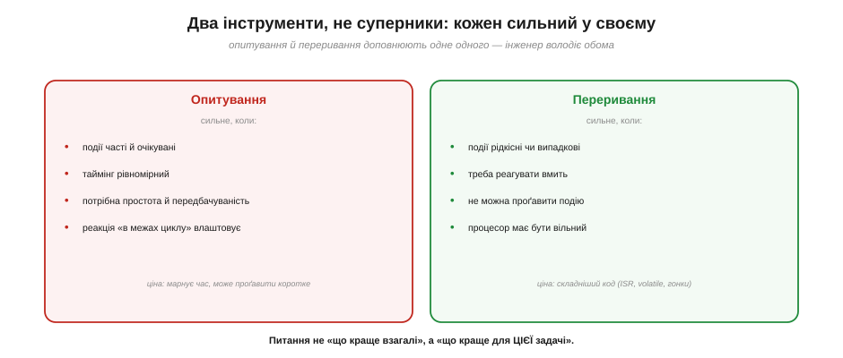
*Рис. 23.7.1. Опитування сильне для частих, очікуваних подій і там, де важить простота; його ціна — марнування часу й ризик проґавити коротке. Переривання сильне для рідкісних, термінових подій, яких не можна втратити; його ціна — складніший код (ISR, `volatile`, гонки). Питання не «що краще взагалі», а «що краще для **цієї** задачі».*

Зверніть увагу на симетрію їхніх «цін». Опитування платить **часом процесора** й ризиком пропуску; переривання — **складністю коду** (усе, що ми вивчали: правила ISR, `volatile`, критичні секції). Тому вибір — це завжди обмін: ви міняєте простоту на чуйність або навпаки, залежно від того, чого задача вимагає більше.

Корисно прикинути обмін у числах. Якщо `loop()` крутиться раз на 5 мс, то опитування кнопки коштує сотні зайвих перевірок на секунду — мізер для процесора, та реакція може спізнитися на ті ж 5 мс. Для кнопки під палець це непомітно (людина повільніша), тож опитування ідеальне. А для імпульсу, що триває 50 мкс, ті 5 мс — прірва: опитування його просто не побачить. Тобто та сама затримка циклу буває то цілком прийнятною, то фатальною — усе залежить від **масштабу часу** події.

Є й простіший спосіб відчути різницю — за тим, **хто кого питає**. Опитування — це коли **ви** раз у раз питаєте залізо «ну що?»; переривання — коли **залізо** саме каже вам «ось, сталося». Перше тримає ініціативу у вашому коді (зручно, передбачувано, але виснажливо), друге віддає її події (миттєво, ощадно, та доводиться бути готовим до раптовості). Уся різниця в підходах випливає з цього одного: хто кого турбує.

### Як обрати: три питання

На щастя, у переважній більшості випадків вибір очевидний, і його можна звести до трьох питань поспіль.

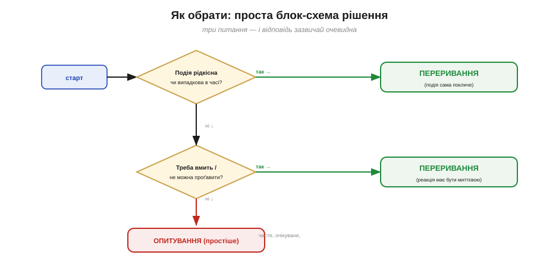
*Рис. 23.7.2. Проста блок-схема. Перше питання: **подія рідкісна чи випадкова в часі?** Друге: **треба реагувати вмить або не можна проґавити?** Якщо хоч на одне «так» — беріть **переривання**. Якщо на обидва «ні» (подія часта, очікувана, терпить затримку) — досить простішого **опитування**.*

Логіка проста. Випадкова в часі подія, яку легко пропустити між перевірками, проситься на переривання — бо тільки воно ловить її апаратно, не залежно від зайнятості циклу. Подія, реакція на яку має бути миттєвою (аварійний сигнал, точна відмітка часу), — теж переривання. А якщо подія приходить рівномірно, ви її очікуєте й маленька затримка нікому не шкодить, то городити переривання з усіма його пастками **нема сенсу**: опитування зробить те саме простіше й надійніше.

Пройдімо для прикладу дві задачі блок-схемою. **Кнопка ввімкнення світла**: подія не випадкова (натискає людина, коли захоче, та не «раптово й критично»), реагувати за мілісекунди не конче — на обидва питання «ні», отже опитування. **Давач обертів вентилятора**, що видає короткі імпульси: подія часта, але головне — кожен імпульс **не можна** проґавити, інакше лічильник збреше; «не можна проґавити» → так → переривання. Бачите, як два-три питання майже без роздумів виводять на правильний інструмент.

Звівши все докупи, дістаємо коротку шпаргалку рішення.

**Чек-лист вибору.**

```
Постав собі ці питання по черзі:
  • подія випадкова в часі АБО коротка й губиться?  → ПЕРЕРИВАННЯ
  • реагувати треба вмить АБО пропуск неприпустимий? → ПЕРЕРИВАННЯ
  • це безпека (аварія, перегрів)?                   → ПЕРЕРИВАННЯ (поза чергою)
  • інакше (часте, очікуване, терпить затримку)      → ОПИТУВАННЯ (простіше)

А саму обробку події майже завжди винось у loop():
  ISR: лише підняти прапорець / покласти в чергу
  loop(): зробити справжню роботу (друк, обчислення, мережу)
```

### П'ять критеріїв

Якщо трьох питань замало й задача гранична, зважте її за п'ятьма критеріями — кожен «хилить» в свій бік.

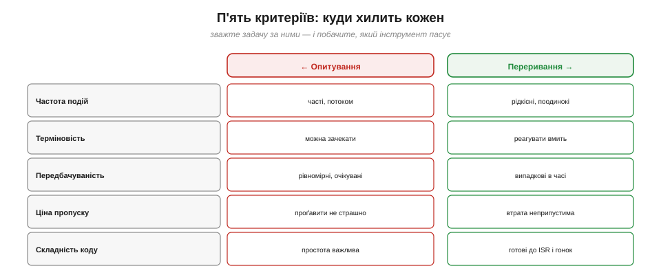
*Рис. 23.7.3. П'ять осей рішення. **Частота**: потік подій → опитування, поодинокі → переривання. **Терміновість**: можна зачекати → опитування, вмить → переривання. **Передбачуваність**: рівномірні → опитування, випадкові → переривання. **Ціна пропуску**: не страшно → опитування, неприпустимо → переривання. **Складність**: важить простота → опитування, готові до ISR → переривання.*

Жоден критерій не вирішує сам — дивляться на загальну картину. Часто вони вказують в один бік, і відповідь ясна. Якщо ж тягнуть у різні (наприклад, подія часта, але критична), — це сигнал, що, можливо, найкраще рішення **поєднує** обидва підходи.

Одне застереження до зважування: критерії **не рівноправні**. Якщо йдеться про безпеку — аварійний стоп, захист від перегріву, — критерій «ціна пропуску» переважує все інше. Хоч би якою частою чи «зручною для опитування» була подія, та якщо її пропуск загрожує шкодою, її роблять перериванням, і крапка. Так само непорушна вимога «реагувати за чітко обмежений час» сама собою тягне на переривання, навіть якщо решта критеріїв шепоче «опитування». Спершу — обов'язкові вимоги, і лише потім — зручність.

### Гібрид: найкраще з двох світів

І тут головне відкриття теми: на практиці найчастіше беруть **не** «чисте» опитування й **не** «чисте» переривання, а їхній **гібрид**. Переривання **ловить** подію вмить і ставить прапорець; а основний цикл у спокої **опитує** цей прапорець і неквапом обробляє подію. Так миттєвість бере від переривання, а простоту обробки — від опитування.

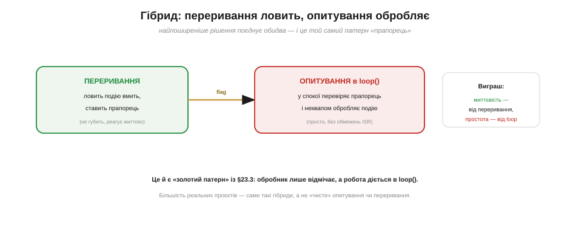
*Рис. 23.7.4. Гібрид поєднує сильні боки обох: переривання миттєво ловить подію й ставить прапорець (нічого не губить), а `loop()` у спокої перевіряє прапорець і обробляє подію без обмежень ISR. Виграш подвійний — миттєвість від переривання, простота від опитування.*

Ви вже знаєте цей гібрид — це **золотий патерн** із §23.3: обробник лише відмічає, а робота діється в `loop()`. Тепер видно, що він не просто «правило написання ISR», а й **відповідь на питання вибору**: бери переривання там, де треба зловити подію, але саму обробку лиши простому опитуванню прапорця. Більшість реальних проєктів влаштовані саме так.

> 🔧 **Навіщо це.** Практична стратегія на щодня: **починай із простого**. Спершу спробуй опитування — якщо воно справляється, далі й не йди, бо це найпростіший і найнадійніший шлях. Перейди на переривання (зазвичай у гібридній формі «прапорець + `loop()`»), **лише** коли впрешся в реальну потребу: подія коротка й губиться, реакція спізнюється, або процесор задихається від порожніх перевірок. Не «оптимізуй» наперед перериваннями те, що чудово працює опитуванням, — складність ISR має бути виправдана.

У гібрида є й «старший брат» для складніших випадків. Коли подій багато й кожна несе **дані** (скажімо, байти, що сиплються з порту), простого прапорця замало — тоді обробник кладе подію в **чергу** спеціальним `…FromISR`-викликом, а окрема задача неквапом її розгрібає. Це той самий принцип «лови перериванням, обробляй спокійно», лише надійніший. Саме так влаштований обмін і в операційних системах реального часу: переривання живить чергу, а задача її споживає. Докладніше — коли дійдемо до RTOS далі в курсі.

Чому гібрид такий надійний, варто проговорити окремо. Прапорець (чи черга) **розв'язує в часі** дві речі: **коли** подію впіймано і **коли** її оброблено. Переривання ловить її точно в мить появи, а обробка діється тоді, коли `loop()` дійде до прапорця, без жодного поспіху й без обмежень ISR. Завдяки цьому одне не тисне на інше: реакція лишається миттєвою, а складна обробка — вільною. Це загальний інженерний прийом — **розділяти швидке вловлювання й повільне опрацювання**.

### Типові задачі по місцях

Розкладімо звичні задачі на осі «опитування ↔ переривання», щоб відчути критерії на конкретиці.

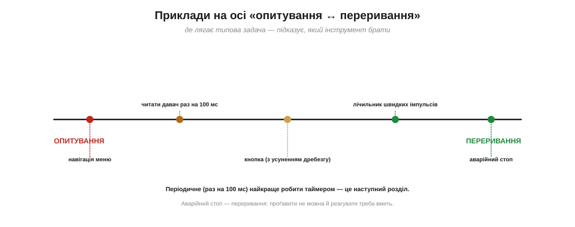
*Рис. 23.7.5. Навігація меню — спокійно опитуванням. Періодичне читання давача (раз на 100 мс) — найкраще таймером (наступний розділ). Кнопка — будь-як, але з усуненням дребезгу (§22.5). Лічильник швидких імпульсів — переривання (інакше проґавиш). Аварійний стоп — однозначно переривання: і вмить, і пропустити не можна.*

Кілька з цих прикладів варті слова. **Аварійний стоп** — еталон для переривання: і реагувати треба миттєво, і пропустити неприпустимо, тож тут переривання не розкіш, а вимога безпеки. **Лічильник швидких імпульсів** — теж переривання, бо опитуванням ви проґавите частину імпульсів між перевірками (згадаймо §23.1). А от **періодичне** читання давача «раз на 100 мс» — особливий випадок: його не варто робити ні брутальним опитуванням із `delay`, ні зовнішнім перериванням; для рівних інтервалів є власний, найкращий інструмент — **таймер**, якому й присвячено наступний розділ.

Ще кілька прикладів із практики варті згадки. **Прийом даних послідовним портом** (UART) — насправді гібрид: апаратура перериванням ловить кожен байт у буфер, а ви потім спокійно опитуєте `Serial.available()`; ось чому байти не губляться, навіть коли `loop()` зайнятий. **Енкодер** (ручка-крутилка) видає швидкі імпульси при обертанні — переривання, як і лічильник. А **«годування» сторожового таймера** чи блимання індикатором життя — навпаки, рівномірні дії, яким місце в циклі або на таймері, а не на перериванні. Що більше задач ви так розкладете, то швидше відчуття «чим це робити» стане автоматичним.

### Не ускладнюй без потреби

Підсумкова мудрість теми проста: **опитування недооцінюють**. Початківці, дізнавшись про переривання, кидаються чіпляти їх усюди — і наражаються на весь букет пасток: забутий `volatile`, гонки даних, зависання в довгому ISR. А переважну частину задач чудово розв'язує спокійне опитування в добре збудованому циклі. Переривання — потужний інструмент для **свого** класу задач (рідкісне, термінове, незамінне), і саме там воно безцінне; та діставати його варто свідомо, коли простіший шлях справді не тягне.

Є й ще один, дуже земний аргумент за простоту — **налагодження**. Баги переривань — чи не найпідступніші у всьому вбудованому програмуванні: вони рідкісні, «плавають», зникають під налагоджувачем і не відтворюються на вимогу (згадаймо гонки з §23.6). Код же на чистому опитуванні читається згори вниз і поводиться передбачувано. Тож кожне зайве переривання — це не лише складніший код, а й **важчий у пошуку помилок**. Простота, яку дарує опитування, має цілком конкретну ціну в зекономлених годинах відлагодження.

Це не заклик боятися переривань — без них не обійтися, і ви вже вмієте їх приборкувати. Це заклик до **співмірності**: брати рівно стільки складності, скільки задача справді потребує, і ні крихтою більше. Найкращий код — не той, де переривань найбільше, а той, де кожне з них **на своєму місці** й виправдане потребою, яку годі закрити простішим способом.

### Підсумок розділу

Ми завершуємо розділ про переривання — звідусіль зведімо його в одну картину.

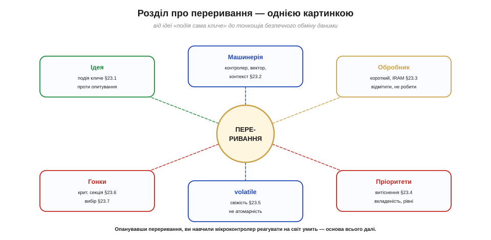
*Рис. 23.7.6. Увесь розділ навколо однієї ідеї. **Ідея** (§23.1): подія сама кличе процесор, замість того щоб він її випитував. **Машинерія** (§23.2): контролер, вектор, збереження контексту. **Обробник** (§23.3): короткий, у IRAM, лише відмічає. **Пріоритети** (§23.4): витіснення й вкладеність. **`volatile`** (§23.5): свіжість, але не атомарність. **Гонки** (§23.6): критична секція. І **вибір** (§23.7): коли що.*

Озирнімося на пройдене. Розділ почався з простої думки — нехай подія сама смикає процесор, а не він її випитує, — а закінчується вмінням свідомо вибрати інструмент і безпечно обмінятися з обробником даними. Між цими точками — контролер і вектор, дисципліна короткого ISR, пріоритети, `volatile` і критичні секції: усе, що відділяє «причепив `attachInterrupt` навмання» від **розуміння**, чому воно працює і де чигають пастки. Переривання — це той механізм, яким мікроконтролер реагує на світ **умить**, і він лежить в основі всього, що далі: і точного відліку часу, і швидких давачів, і зв'язку.

Варто наголосити, наскільки переривання **наскрізне** для всього модуля. Таймер із наступного розділу сповіщає про сплив часу — перериванням. Аналого-цифровий перетворювач каже «вимір готовий» — перериванням. Зв'язок, обмін по шинах, реакція на зовнішні сигнали — усе спирається на той самий механізм, що ми щойно розібрали. Тому переривання — не «ще одна тема», а **фундамент**, на якому стоїть решта периферії: опанувавши його, ви відімкнули двері до всього подальшого.

А наступний крок — приручити **час**. Ми вже не раз упиралися в потребу робити щось **через рівні проміжки** («раз на 100 мс», «раз на секунду») і бачили, що ні `delay`, ні переривання тут не ідеальні. Інструмент, створений саме для цього, — апаратний **таймер**: він рахує час сам, точно й без участі процесора, а коли треба — смикає те саме переривання, що ми щойно опанували. З нього й починається наступний розділ.

> ▶️ Далі: [Розділ 24 — Таймери й керування часом](../ch24-timers/ch24-timers.md)
