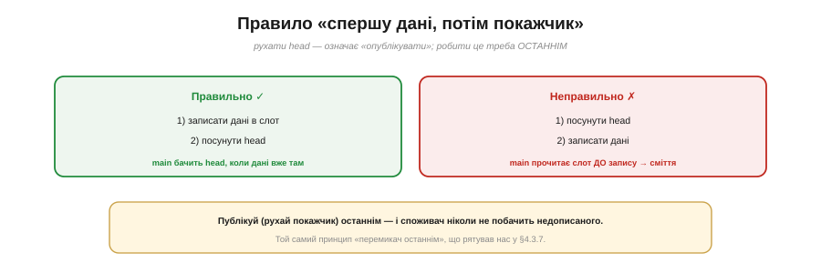

# ⚙️ Кільце «ISR пише — main читає»: SPSC-буфер без блокувань

> Алгоритмічна вставка до **теми [§4.5.1 «Опитування проти переривання»](ch23-interrupts.md)**. Прапорець передає одну подію. А як передати з обробника **потік** даних, не борючись із гонками й не вимикаючи переривань?

## Задача

Обробник (ISR) **виробляє** дані — байти з UART, відліки з АЦП, мітки часу імпульсів. Головний цикл (`main`/`loop`) їх **споживає**. Та вони працюють «одночасно»: ISR будь-якої миті **витісняє** main посеред роботи. Як безпечно передати дані від одного до іншого? Замок тут незручний: проти **власного** обробника main не «залочиться», а вимикати переривання на кожну передачу — груба й дорога зброя. Хочеться **без блокувань**.

## Ідея

Відповідь — **кільцева черга** для одного письменника й одного читача: **SPSC** (*single-producer, single-consumer*). Заводимо масив-кільце й **два покажчики** (Рис. 4.5.1a.1): **head** — куди писати, **tail** — звідки читати. ISR (єдиний письменник) кладе елемент у head і посуває head; main (єдиний читач) бере з tail і посуває tail. Порожньо, коли `head == tail`.


*Рис. 4.5.1a.1. Кільце з двома покажчиками: head (куди пише ISR) і tail (звідки читає main). head чіпає лише ISR, tail — лише main, тож кожен покажчик має одного хазяїна, а читання чужого атомарне. Через це замок і не потрібен; head == tail означає «порожньо».*

Уся магія — в **дисципліні власності**: head чіпає **лише** ISR, tail — **лише** main. Кожен покажчик має **одного хазяїна**, а **читання** чужого покажчика атомарне (одне вирівняне слово читається цілим). Тому жодного замка не треба: самі правила виключають гонку. Це не хитрий трюк, а простий контракт «один пише — один читає».

## Псевдокод

```
next(i) = (i + 1) & (SIZE − 1)       # SIZE — степінь двійки

push(item)  — у ISR (письменник):
    if next(head) == tail: return    # повно → відкинути (політика на ваш вибір)
    buf[head] = item                 # 1) спершу ДАНІ
    head = next(head)                # 2) потім ОПУБЛІКУВАТИ

pop() — у main (читач):
    if tail == head: return EMPTY    # порожньо
    item = buf[tail]                 # 1) спершу прочитати дані
    tail = next(tail)                # 2) потім звільнити слот
    return item
```

## Тонкість, що вирішує все: порядок

Як і в надійному сховищі (§4.3.7), **порядок** двох дій критичний (Рис. 4.5.1a.2). Письменник мусить **спершу записати дані**, а **тоді** посунути head. Інакше — посунув head першим — споживач побачить «новий» елемент і прочитає слот **до того**, як у нього лягли дані: сміття. Рух покажчика — це **публікація**; роби її **останньою**. Той самий принцип «перемикач останнім», що рятував нас із конфігом і прошивкою.


*Рис. 4.5.1a.2. Письменник: спершу записати дані в слот, і лише потім посунути head. Зробиш навпаки — споживач прочитає слот ще до запису й дістане сміття. Публікуй (рухай покажчик) останнім — той самий принцип «перемикач останнім», що в §4.3.7.*

## Складність і пастки на МК

- **Тільки один + один.** SPSC — рівно **один** письменник і **один** читач. Два обробники пишуть в одне кільце, або два читачі — і контракт ламається; тоді вже потрібен замок чи інша черга.
- **Атомарність покажчика.** Покажчик мусить читатися/писатися **одним** вирівняним словом. На 8-бітному МК 16-бітний індекс **не атомарний** — читач може спіймати його «напівоновленим»; тоді індекс беруть у машинне слово чи захищають.
- **volatile.** head і tail змінює інша сторона, тож вони **volatile** (§4.5.5) — інакше компілятор закешує старе значення, і черга «застрягне».
- **Через два ядра — ще й бар'єр.** ISR і main на **одному** ядрі: порядку інструкцій досить. Якщо ж письменник і читач на **різних** ядрах ESP32, самого `volatile` мало — потрібен **бар'єр пам'яті**, щоб дані напевно лягли **до** публікації head.
- **Степінь двійки.** Якщо SIZE — степінь двійки, замість дорогого `% SIZE` беруть швидку маску `& (SIZE−1)`.
- **Політика переповнення.** Кільце заповнилось — що робити: **відкинути новий**, **затерти старий** чи сигналити? Виберіть свідомо; мовчазна втрата даних підступна.

## Підсумок

SPSC-кільце — це **черга без замка** між обробником і main: два покажчики, по одному хазяїну на кожен, дані пишемо **перед** публікацією head. Простий контракт «один пише — один читає» робить непотрібним усе важке блокування — і це найкращий спосіб винести дані з ISR, не вимикаючи переривань.
