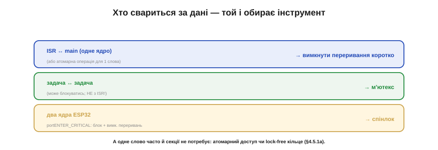
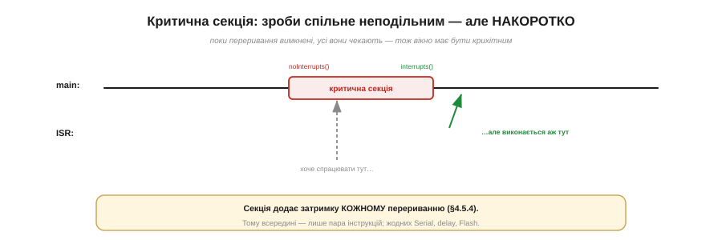

# ⚙️ Критичні секції на практиці: вимкнути переривання чи взяти м'ютекс

> Алгоритмічна вставка до **теми [§4.5.6 «Атомарність і гонки даних»](ch23-interrupts.md)**. Зробити дію неподільною можна по-різному. Який інструмент брати — залежить від того, **хто** свариться за дані, і кожен має свою ціну.

## Задача

Спільні дані чіпають двоє — ISR і main, або дві задачі. Багатокрокове оновлення (читати-міняти-писати чи правка кількох пов'язаних полів) можна **розрізати** посередині й дістати зіпсований стан (§4.5.6). Треба зробити доступ **неподільним** — огорнути його **критичною секцією**. Питання лише: **чим** її огороджувати?

## Ідея: три інструменти — за тим, хто свариться

Інструмент обирають не за смаком, а за тим, **хто** з ким змагається за дані (Рис. 4.5.6a.2):

- **ISR ↔ main (одне ядро): вимкнути переривання** коротко. `noInterrupts()` глушить обробники на час доступу — і main певно не переб'ють. Швидко й просто, та грубо.
- **Задача ↔ задача: м'ютекс.** Замок, який задача **бере**, а інша **чекає**, доки звільнять. М'ютекс уміє блокувати того, хто чекає, — тому годиться між задачами, але **не** з ISR (обробник не може чекати).
- **Два ядра ESP32: спінлок.** `portENTER_CRITICAL` бере замок **і** вимикає переривання — бо `noInterrupts()` саме по собі друге ядро не спинить (§4.5.6).


*Рис. 4.5.6a.2. Інструмент диктує контендер: ISR↔main — вимкнути переривання (чи атомарна операція); задача↔задача — м'ютекс (можна блокуватись, не з ISR); два ядра — спінлок. А одне вирівняне слово часто й секції не потребує — атомарний доступ чи lock-free кільце (§4.5.1a).*

А ще часто секція **взагалі не потрібна**: якщо дані — одне вирівняне слово й ви лише читаєте чи лише пишете, досить атомарного доступу або lock-free кільця (§4.5.1a).

## Псевдокод

```
Вимкнути переривання (ISR ↔ main):
    noInterrupts();              // вхід
    n = pulses; pulses = 0;      // пара інструкцій — неподільно
    interrupts();                // вихід — ОБОВ'ЯЗКОВО

М'ютекс (задача ↔ задача):
    lock(m);                     // може заблокуватись, чекаючи
    // доступ до спільного
    unlock(m);
```

## Ціна кожного

Безкоштовних замків не буває (Рис. 4.5.6a.1):

- **Вимкнені переривання** додають затримку **кожному** перериванню в системі (§4.5.4): поки секція триває, усі обробники чекають. Тому вона має бути **крихітна** — пара інструкцій, жодного `Serial`, `delay` чи Flash.
- **М'ютекс** важчий: він може **заблокувати** задачу надовго, несе ризик **взаємного блокування** (deadlock) і **інверсії пріоритетів** (низькопріоритетна задача тримає замок, якого жде високопріоритетна). І його **не можна** брати з ISR.
- **Спінлок** на час очікування **крутить** інше ядро намарно — тож теж лише на крихітні секції.


*Рис. 4.5.6a.1. Поки триває критична секція з вимкненими перериваннями, обробник, що хоче спрацювати, чекає до самого виходу. Секція додає затримку кожному перериванню (§4.5.4), тож усередині — лише пара інструкцій, без Serial, delay чи Flash.*

## Складність і пастки на МК

- **Секцію обов'язково закрити.** `noInterrupts()` без парного `interrupts()` глушить переривання назавжди — система «вмирає». Краще зберігати/відновлювати стан (`portENTER/EXIT_CRITICAL`), щоб вкладені секції не ввімкнули переривання зарано.
- **М'ютекс — не з обробника.** ISR не вміє чекати; з нього — лише вимкнення переривань чи `…FromISR`-примітиви.
- **Не огортайте забагато.** Спокуса «хай надійніше» подовжує секцію — і калічить чуйність. Прийом «знімок»: під захистом лише **скопіювати** спільне в локальне, а працювати з копією **поза** секцією.
- **Одне слово — можливо, без секції.** Спершу спитайте, чи потрібна вона взагалі: атомарний доступ чи SPSC-кільце (§4.5.1a) часто дешевші.

## Підсумок

Критична секція робить дію неподільною, а інструмент диктує **контендер**: ISR↔main — вимкнути переривання; задача↔задача — м'ютекс; два ядра — спінлок. Кожен коштує (затримка, блокування, заборона з ISR), тож тримайте секцію крихітною — або обійдіться без неї, якщо вистачить атомарного слова.
