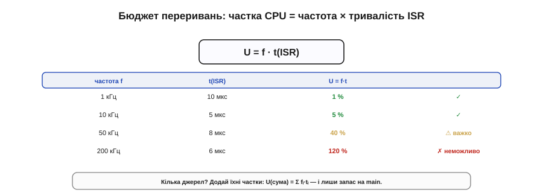
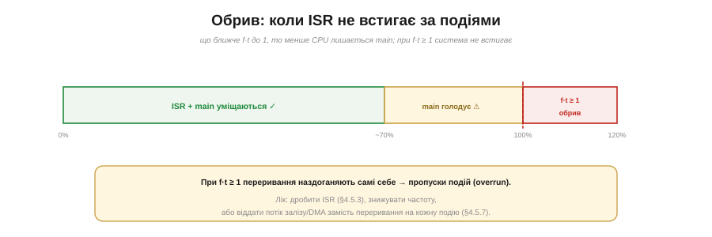

# 🧮 Бюджет переривань: частота × тривалість ISR = частка CPU

> Математична вставка до **теми [§4.5.7 «Polling vs переривання»](ch23-interrupts.md)**. Критерій «частоти» можна не вгадувати, а порахувати: ось формула, що показує, коли переривання на кожну подію з'їдає весь процесор.

## Означення

Кожне переривання «краде» в процесора час свого обробника. Якщо джерело спрацьовує **f** разів на секунду, а обробник триває **t(ISR)**, то частка процесорного часу, яку воно з'їдає, дорівнює (Рис. 4.5.7m.1):

```
U = f · t(ISR)
```

`U` — безрозмірна частка (від 0 до 1); помножена на 100, це відсоток CPU.


*Рис. 4.5.7m.1. Частка процесора, яку з'їдає джерело: U = f · t(ISR). 1 кГц × 10 мкс = 1% (дрібниця); 50 кГц × 8 мкс = 40% (важко); 200 кГц × 6 мкс = 120% (неможливо). Кілька джерел — додай їхні частки.*

## Інтуїція

Думайте про це як про податок: кожне спрацювання бере `t(ISR)` процесорного часу, а спрацювань — `f` за секунду. Дрібний обробник, що біжить **рідко**, майже непомітний. А ось дрібний обробник, що біжить **дуже часто**, може з'їсти процесор цілком: справа не в тривалості однієї ISR, а в її **добутку** на частоту.

## Формальний апарат

Кілька прикладів (Рис. 4.5.7m.1):

```
1 кГц   · 10 мкс = 0.01 = 1 %     ✓ дрібниця
10 кГц  ·  5 мкс = 0.05 = 5 %     ✓ норма
50 кГц  ·  8 мкс = 0.40 = 40 %    ⚠ важко
200 кГц ·  6 мкс = 1.20 = 120 %   ✗ неможливо
```

Кілька джерел? Додайте їхні частки:

```
U(сума) = Σ fᵢ · t(ISR)ᵢ
```

Сума має лишатися **помітно нижче 1**, щоб і `main` мав час працювати, і лишався запас на джитер.

Складімо живий приклад. Таймер 1 кГц × 10 мкс дає 1%; UART на ~11 тисяч байтів/с × 3 мкс — ще ≈3.5%; рідкі кнопкові переривання — мізер. Разом близько **5%**, і цілих 95% лишається `main` — чудово. А додайте сюди 50-кілогерцову вибірку по 8 мкс (це вже 40%), і сумарний бюджет стрибне за **45%**, відкусивши майже половину процесора одним джерелом. Ось чому суму рахують **наперед**, а не дивуються потім, чому `main` «затинається».

А коли `U` сягає **1** — настає **обрив** (Рис. 4.5.7m.2). Це фізична межа: ISR не встигає завершитися до **наступного** спрацювання, переривання починають **наздоганяти самі себе**, події **губляться** (overrun). Жодним прискоренням main цього не виправити — лік один із трьох: **дробити** обробник (§4.5.3), **знижувати** частоту або зовсім **зняти** потік із процесора, віддавши його залізу/DMA.


*Рис. 4.5.7m.2. Поки f·t малий — ISR і main уміщаються; ближче до 100% main голодує; при f·t ≥ 1 переривання наздоганяють самі себе й події губляться (overrun). Лік: коротша ISR, менша частота або передача потоку залізу/DMA (§4.5.7).*

## Де в курсі це працює

Це кількісний бік критерію «частоти» з §4.5.7. Він пояснює, **чому** дуже часті події (потік байтів, швидке АЦП) майже завжди віддають **залізу**, а не перериванню на кожну подію: бо `f · t` пробиває стелю. І ще раз підкреслює пораду §4.5.3: коротка ISR — це не лише мала латентність, а й малий **податок на CPU**, помножений на частоту. Порахувати цей бюджет — справа однієї хвилини, а рятує вона від найпідступнішого «то працює, то затинається».
