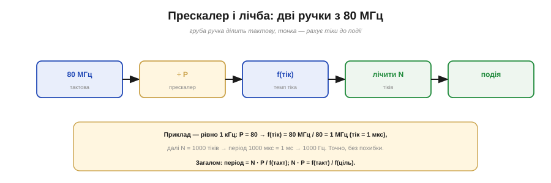
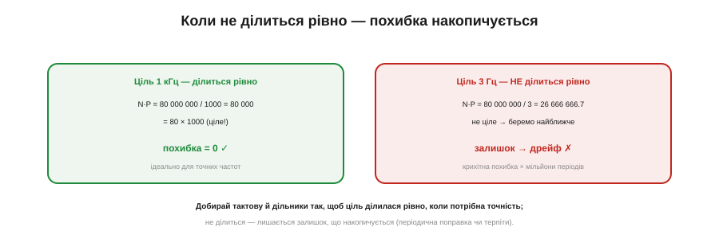

# 🧮 Прескалер і дільники: з 80 МГц зробити рівно 1 кГц

> Математична вставка до **теми [§4.6.1 «Таймер-лічильник»](ch24-timers.md)**. Там ми ділили 80 МГц на чистий приклад. Тут — коли частота лягає **рівно**, а коли лишає похибку, що накопичується.

## Означення

Таймер рахує тіки. Базова частота швидка (на ESP32 таймери йдуть від ~80 МГц). **Передільник** (прескалер) ділить її на P, сповільнюючи лічильник до зручного темпу; далі **лічба** N тіків задає період події. Дві ручки — груба (P) і тонка (N) — перетворюють швидкий такт на потрібну, повільну частоту (Рис. 4.6.1m.1).

Чому дві ручки, а не одна? Бо прескалер грубий — ділить на ціле P, і самим ним рідко влучиш точно; а лічба N домальовує решту. Разом вони покривають широкий діапазон частот цілими кроками — від часток герца до мегагерців.


*Рис. 4.6.1m.1. Дві ручки: прескалер ділить тактову (груба), лічба N тіків задає період (тонка). Рівно 1 кГц: P = 80 → тік 1 мкс, N = 1000 → період 1 мс. Загалом N·P = f(такт)/f(ціль).*

## Формальний апарат

```
темп тіка:   f(тік) = f(такт) / P
період:      T = N / f(тік) = N · P / f(такт)
```

Щоб дістати ціль f(ціль), треба:

```
N · P = f(такт) / f(ціль)
```

**Рівно 1 кГц із 80 МГц:**

```
N · P = 80 000 000 / 1000 = 80 000 = 80 × 1000
P = 80   → f(тік) = 1 МГц (тік = 1 мкс)
N = 1000 → період = 1 мс → 1000 Гц.   Похибка = 0.
```

Гарно: 80 000 розкладається на цілі множники, тож ціль лягає **точно**.

## Коли не ділиться рівно

А тепер підступний випадок (Рис. 4.6.1m.2). Нехай ціль — **3 Гц**:

```
N · P = 80 000 000 / 3 = 26 666 666.67…   — НЕ ціле!
```

Цілих P і N, що дали б рівно 3 Гц, **не існує** — добуток мусив би бути дробовим. Доводиться брати **найближче ціле** (26 666 667), і справжня частота виходить 80 000 000 / 26 666 667 ≈ 2.999 999 96 Гц — крихітна похибка. Сама по собі вона мізерна, але **накопичується**: помножена на мільйони періодів, вона обертається відчутним **дрейфом** — годинник на такому таймері поволі піде не туди (§4.6.8).

Звідси й хитрість підбору: коли потрібна якась незручна частота, інколи вигідно взяти **інший** опорний такт — такий, що ділиться на ціль рівно. Саме тому, приміром, для UART історично люблять «дивні» кварци на кшталт 11.0592 МГц: їх обрано так, щоб ходові швидкості зв'язку лягали **без залишку**.


*Рис. 4.6.1m.2. 1 кГц: N·P = 80 000 — ціле, похибка 0. 3 Гц: N·P = 26 666 666.7 — не ціле, беремо найближче, лишається залишок, що накопичується в дрейф. Добирай так, щоб ціль ділилася рівно, коли потрібна точність.*

## Де в курсі це працює

Це кількісний бік §4.6.1 — і він пояснює, **чому** деякі частоти «зручні», а інші ні. Точні частоти (звукові частоти дискретизації, швидкості UART, опорні для PWM) намагаються підібрати так, щоб ціль **ділилася рівно** на наявний такт — інакше залишок поволі псує точність. Коли рівно не виходить, є два шляхи: **періодична поправка** (час від часу підрівняти, як NTP для годинника §4.6.8) або просто **терпіти** похибку, якщо вона дрібна для задачі. А найперший крок — порахувати N·P і **глянути, чи ділиться**: одна формула рятує від загадкового «чому в мене все трохи пливе».
