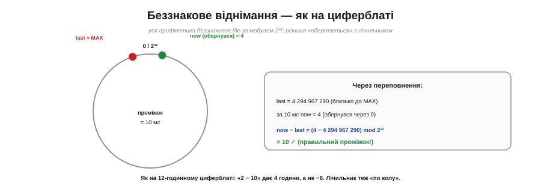
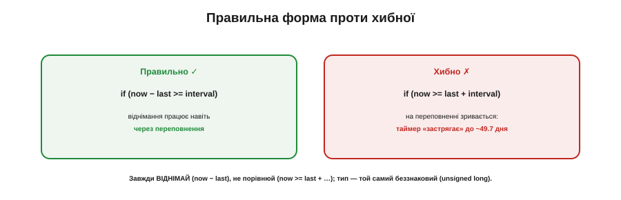

# 🧮 Чому millis() переживає переповнення: модульна арифметика беззнакових

> Математична вставка до **теми [§4.6.2 «Період і переповнення»](ch24-timers.md)**. Ми взяли як правило «віднімай, не порівнюй». Тут — **чому** воно працює навіть на самому переповненні. Магії нема — є модульна арифметика.

## Означення

`millis()` повертає **беззнакове** 32-бітне число; дійшовши до максимуму (2³² − 1 ≈ 4.29 млрд мс ≈ 49.7 дня), воно **обертається** в нуль. Ключ у тому, що вся беззнакова арифметика — **модульна**: кожна дія рахується за модулем 2³², тобто «по колу».

## Інтуїція

Це точнісінько як **циферблат** (Рис. 4.6.2m.1). На 12-годинному годиннику «2 − 10» дає не −8, а **4** години: відлік іде по колу, і різниця «обертається» разом із ним. Беззнаковий лічильник так само замкнений у кільце від 0 до 2³² − 1; тож і його різниця обчислюється **по колу** — і виходить правильною, навіть коли одне число вже перескочило через нуль, а друге ще ні.


*Рис. 4.6.2m.1. Лічильник замкнений у кільце 0…2³²−1. last близько до MAX, now обернувся через 0 у 4 — а now − last (за модулем 2³²) дає правильні 10. Як на циферблаті: «2 − 10» = 4 години, а не −8.*

## Формальний апарат

Уся арифметика — за модулем 2³²:

```
проміжок = (now − last) mod 2³²
```

Це дає **правильний** час, що минув, доки справжній проміжок менший за 2³² (тобто менш як ~49.7 дня між перевірками — на практиці завжди). Простежмо найгірший випадок — саме на переповненні (Рис. 4.6.2m.2):

```
last = 4 294 967 290              (близько до MAX)
за 10 мс лічильник обертається:
now  = (4 294 967 290 + 10) mod 2³² = 4
now − last = (4 − 4 294 967 290) mod 2³²
           = 4 + 2³² − 4 294 967 290
           = 4 + 6 = 10   ✓
```

Беззнакове віднімання **само** додало «повне коло» (2³²) і повернуло чесні 10 мс.


*Рис. 4.6.2m.2. Правильна форма `now − last >= interval` працює через переповнення. Хибна `now >= last + interval` на переповненні зривається: last+interval теж обертається, порівняння бреше, і таймер «застрягає» аж до наступного обороту (~49.7 дня).*

А хибна форма `now >= last + interval` саме тут і зривається: `last + interval` теж може обернутися, порівняння на мить дає неправду — і таймер «застрягає» аж до наступного обороту. Найпідступніше, що побачити цей зрив у розробці майже неможливо: треба тримати прошивку ввімкненою близько 50 днів поспіль.

## Де в курсі це працює

Це математичний фундамент правила з §4.6.2 — і не лише його. Та сама модульна різниця рятує **input capture** на переповненні таймера (§4.6.3) і **індекси кільцевого буфера** (§4.5.1a), що теж «обертаються». Дві перестороги наостанок: тип мітки мусить бути **той самий беззнаковий** розмір, що й лічильник (`unsigned long` для `millis`), інакше коло «не зійдеться»; і пам'ятайте, що `micros()` має менший діапазон — обертається вже за ~71 хвилину, тож там віднімати **тим паче** обов'язково.

Одне правило — «зберігай мітку беззнаковою й завжди віднімай» — і всі ці переповнення стають для вас невидимими: код просто працює, скільки б днів пристрій не пропрацював без перезавантаження. Тому-то досвідчені інженери пишуть `now − last` рефлекторно, навіть не згадуючи про ті 49.7 дня.
