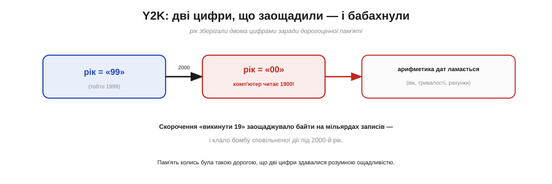
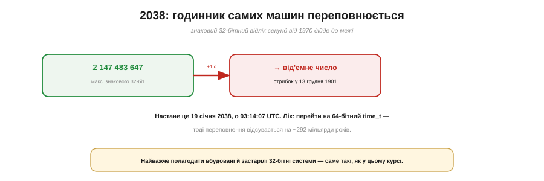
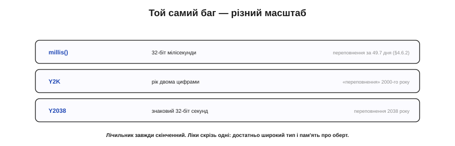

# 📜 Y2K і проблема 2038 року: коли переповнюється сам час

> Історична вставка до **теми [§4.6.8 «RTC і реальний час»](ch24-timers.md)**. Ми бачили, що лічильник скінченний і переповнюється (§4.6.2). Тепер — два випадки, коли переповнився **сам час**: один сколихнув увесь світ напередодні 2000-го, другий чекає на нас у 2038-му.

## Дві цифри, щоб заощадити

Щоб зрозуміти проблему 2000 року, треба згадати, якою **дорогою** колись була пам'ять. У 1960–80-х кожен байт коштував грошей, і програмісти заощаджували де могли. Рік у датах зберігали **двома цифрами**: «99» замість «1999», «85» замість «1985» — навіщо тримати незмінне «19», якщо, помножене на мільярди записів, воно з'їдає цілі дорогі мегабайти? Рішення було розумне для свого часу. Та в ньому тихо цокала бомба.

*Рис. 4.6.8i.1. Рік зберігали двома цифрами заради дорогої пам'яті. На 2000-й «99» перекидалось у «00» — і комп'ютер читав це як 1900, а не 2000. Уся арифметика дат (вік, тривалості, рахунки) ламалася.*

## Коли «00» означало 1900

Бомба мала спрацювати рівно опівночі **1 січня 2000 року** (Рис. 4.6.8i.1). Рік перекидався з «99» на «00» — і програма, що знала лише дві цифри, читала «00» як **1900**, а не 2000. А далі ламалося все, що рахує дати: вік людини виходив **від'ємним** чи в сто років; тривалості, відсотки, рахунки, сортування — усе плуталося, бо машина вважала, що час пішов **назад** на століття. Це й була **проблема 2000 року**, вона ж Y2K (*Year 2000*) чи «проблема тисячоліття».

## Найдорожчий ремонт в історії софту

Коли масштаб усвідомили, почався, мабуть, **найбільший ремонт коду** в історії. Упродовж 1998–1999 років тисячі інженерів по всьому світу перебирали застарілі системи — особливо написані старою мовою **COBOL**, на якій трималися банки, страхові, держустанови, — вишукуючи й виправляючи кожну дводижитну дату. Витратили на це, за оцінками, **сотні мільярдів** доларів. Світ готувався до 2000-го, як до стихійного лиха.

## Тиха ніч 2000-го — і суперечка

І ось настала ніч — а нічого страшного **не сталося**. Кілька дрібних збоїв тут і там, але жодної катастрофи. Звідси й донині триває суперечка: то Y2K був **роздутою панікою**? Чесна відповідь — **ні**. Лиха не сталося значною мірою **саме тому**, що його так ретельно відвернули: ремонт був справжній, і під час нього знайшли й полагодили багато реальних, серйозних помилок, які інакше неодмінно вистрелили б. Тиша 2000-го — це не доказ, що проблеми не було; це доказ, що з нею **впоралися**.

## 2038: годинник самих машин

А тепер — спадкоємець Y2K, тільки складніший (Рис. 4.6.8i.2). Згадаймо epoch (§4.6.8): час як секунди від 1970-го. Дуже багато систем зберігали це число в **знаковому 32-бітному** цілому. А знаковий 32-біт уміщає лише до **2 147 483 647** — і відлік секунд дійде до цієї межі **19 січня 2038 року, о 03:14:07 UTC**. Наступної секунди лічильник **переповниться** в від'ємне число — і час «стрибне» аж у **13 грудня 1901 року**. Це **проблема 2038 року** (Y2038), яку інколи звуть «Unix-апокаліпсисом».

*Рис. 4.6.8i.2. Знаковий 32-бітний відлік секунд від 1970-го впирається в 2 147 483 647 о 03:14:07 UTC 19 січня 2038 — і переповнюється у від'ємне, стрибаючи в 1901-й. Лік: 64-бітний time_t. Найважче — вбудовані й застарілі 32-бітні системи.*

Помітьте різницю від Y2K. Там винною була **людська** скорочена нотація (два розряди року). Тут — суто **машинний** лічильник, що вперся у стелю свого типу. Це той самісінький переповнений лічильник, що й `millis()` із §4.6.2 — лише цього разу це сам відлік часу мільярдів пристроїв.

## Лік той самий: ширший лічильник

І лікують його так само, як ми лікували `millis()`: беруть **ширший тип** — 64-бітний `time_t`. Тоді переповнення відсувається на ~292 **мільярди** років — фактично назавжди. Сучасні комп'ютери та операційні системи на це вже переходять. Та є прикра заковика: найважче полагодити **вбудовані** й **застарілі** 32-бітні системи — ті, що десятиліттями працюють у промисловості, інфраструктурі, дрібних пристроях і яких ніхто не оновлює. Тобто саме такі, як герой нашого курсу.

## Урок для вашого коду

Зведімо обидві історії в один урок (Рис. 4.6.8i.3). `millis()` переповнюється за 49.7 дня; дводижитний рік «переповнився» 2000-го; знаковий 32-біт секунд переповниться 2038-го. Це **одна й та сама** проблема — **скінченний лічильник доходить до краю** — у трьох масштабах: від тижнів до тисячоліть. І ліки скрізь однакові: **взяти достатньо широкий тип** і завжди **пам'ятати про оберт**. Тому, зберігаючи час на ESP32, потурбуйтеся, щоб epoch був **64-бітним**, — і ваш пристрій спокійно переживе 2038-й, коли довкола спотикатимуться ті, хто про це не подумав.

*Рис. 4.6.8i.3. Одна проблема — скінченний лічильник доходить до краю — у трьох масштабах: millis() (49.7 дня), Y2K (дводижитний рік), Y2038 (знаковий 32-біт секунд). Ліки скрізь одні: достатньо широкий тип і пам'ять про оберт.*

Скінченність лічильника — не теоретична дрібниця з §4.6.2, а річ, що вже двічі змусила здригнутися цілий світ.
