# Розділ 4.7 — PWM і ЦАП

Цифрова ніжка вміє лише два стани — увімкнено чи вимкнено, повна напруга або нуль (Розділ 4.4). Та світ навколо **аналоговий**: світлодіод хочеться притлумити, мотор пустити на пів швидкості, нагрівач — на чверть потужності. Як же цифровою ніжкою дістати «щось посередині»? Цей розділ — про дві відповіді на це питання. Перша — **ШІМ** (широтно-імпульсна модуляція, англ. *PWM*): вона хитро «вдає» аналог дуже швидким перемиканням, є всюдисущою й майже безкоштовною. Друга — **ЦАП** (цифро-аналоговий перетворювач, англ. *DAC*): він видає справжню аналогову напругу, точніший, та рідший. Більшу частину розділу присвячено ШІМ, бо саме нею ви користуватиметеся щодня.

Розділ побудовано так: спершу **сама ідея ШІМ** — як часткою часу «увімкнено» вдати середній рівень (ця тема); далі — [як таймер генерує ШІМ апаратно](ch25-pwm-dac.md), [шпаруватість, роздільність і частота](ch25-pwm-dac.md), [як відновити справжній аналог RC-фільтром](ch25-pwm-dac.md), [застосування](ch25-pwm-dac.md) і нарешті [справжній ЦАП проти ШІМ](ch25-pwm-dac.md). Спираємося на таймери ([Розділ 4.6](../ch24-timers/ch24-timers.md), особливо режим **порівняння** §4.6.3), бо ШІМ — прямий нащадок таймера.

---

## 4.7.1 ШІМ (PWM): «вдавати» аналог цифровою ніжкою (середнє значення)

Почнімо з суті проблеми. Цифрова ніжка — це **вмикач**: вона дає або повну напругу (HIGH, у нас 3.3 В), або нуль (LOW). Жодного «посередині» вона видати не вміє — між цими двома краями для неї нічого нема. А нам раз у раз потрібне саме посередині: світлодіод на половину яскравості, мотор на третину швидкості. Як подолати цю прірву між «лише два рівні» й «будь-який рівень»? Відповідь — **ШІМ** — настільки проста й хитра, що варта окремої теми.

### Ніжка вміє лише 0 або максимум

Уявімо ручку гучності, яку можна крутити лише в два крайні положення — «тиша» й «на повну», нічого між ними. Саме так поводиться цифрова ніжка: `digitalWrite` ставить або 0, або максимум. Та реальні задачі вимагають плавності.

Може, спитаєте, чому не поставити змінний резистор і не знизити напругу механічно? По-перше, його не покрутиш **із коду** — а нам потрібне програмне керування яскравістю. По-друге, дільник із резисторів **марнує** енергію: зайва напруга перетворюється на тепло. Існує й справжній цифровий розв'язок — ЦАП (про нього в кінці розділу), та він є не всюди й має свої межі. ШІМ же дає програмне, ощадне керування «середнім» на **будь-якій** звичайній цифровій ніжці — тому й переміг.


*Рис. 4.7.1.1. Цифрова ніжка — як ручка, що знає лише два крайні положення: 0 або максимум. А нам потрібне «середнє»: світлодіод на пів яскравості, мотор на пів швидкості, нагрівач на пів потужності. Прямо ніжка цього не дає — розв'язок у тому, щоб **швидко перемикати** її й керувати часткою часу «увімкнено».*

Перша наївна думка — «а може, ніжка видасть 1.65 В замість 3.3?». Ні: ми бачили в §4.4.1, що вихідний транзистор штовхає напругу або до VDD, або до GND — третього стану в нього нема. Тож пряму «половину напруги» цифрова ніжка не видасть **в принципі**. Хитрість зовсім інша — не в напрузі, а в **часі**.

### Ідея ШІМ: перемикай швидко, керуй часткою часу

Ось вона, ключова ідея. Якщо ніжку дуже **швидко** вмикати й вимикати, то важливою стає не миттєва напруга, а **середня** — усереднена за час. А середнє залежить від того, **яку частку** часу ніжка «увімкнено». Тримаємо її увімкненою половину часу — середнє виходить **половина** від максимуму. Чверть часу — чверть. Це й називають **широтно-імпульсною модуляцією**: ми не міняємо висоту імпульсів (вона завжди 0 або максимум), а міняємо їхню **ширину** — частку часу «увімкнено».

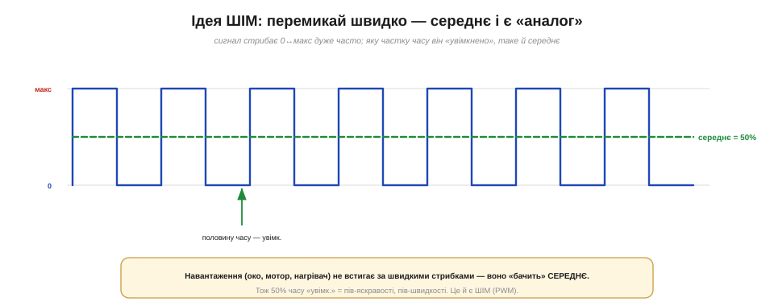
*Рис. 4.7.1.2. Сигнал ШІМ стрибає 0↔максимум дуже часто. Якщо половину часу він «увімкнено», то **середнє** (зелена пунктирна лінія) дорівнює 50% від максимуму. Навантаження — око, мотор, нагрівач — не встигає за швидкими стрибками й «бачить» саме це середнє. Тож 50% часу «увімк.» = пів яскравості, пів швидкості. Це і є ШІМ.*

Зверніть увагу: ніжка весь час робить лише те, що вміє, — стрибає між 0 і максимумом. Жодної «половинної напруги» вона не видає; «половина» з'являється **в середньому**, бо половину часу ніжка увімкнена, а половину — вимкнена. Це не справжній аналог, а спритна **імітація** його швидким миготінням. Та для більшості задач імітація працює не гірше за справжній аналог — і коштує однієї цифрової ніжки.

> 🔧 **Навіщо це.** ШІМ — чи не найуживаніший прийом у всьому вбудованому світі: ним притлумлюють світлодіоди й підсвітку, керують швидкістю моторів і вентиляторів, потужністю нагрівачів, навіть формують звук і команди сервоприводам. Запам'ятайте суть одним рядком: **не міняй напругу — міняй частку часу «увімкнено»**. Щойно вам треба «щось плавне» від цифрової ніжки, перша думка має бути «ШІМ».

### Шпаруватість: головна ручка ШІМ

Та частка часу «увімкнено» має ім'я — **шпаруватість**, або коефіцієнт заповнення (англ. *duty cycle*). Її задають у відсотках: 0% — ніжка завжди вимкнена (середнє 0), 100% — завжди увімкнена (середнє = максимум), 50% — половина на половину, і так будь-яке значення між ними. Шпаруватість — це і є головна «ручка» ШІМ: крутиш її — плавно повзе середній рівень.

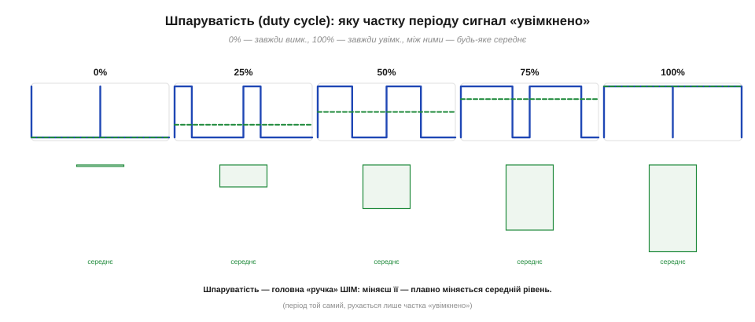
*Рис. 4.7.1.3. Шпаруватість — частка періоду, яку сигнал «увімкнено». 0% — завжди вимк., 100% — завжди увімк., між ними — будь-яке середнє. Період той самий, рухається лише ширина «увімкненої» ділянки. Міняючи шпаруватість, плавно міняємо середній рівень — від нуля до максимуму.*

Важлива деталь: коли міняєш шпаруватість, **період лишається той самий** — рухається лише межа між «увімк.» і «вимк.» усередині нього. Тобто частота миготіння стала, змінюється лише **ширина** імпульсу. Звідси й назва — «широтно-імпульсна»: модулюємо саме шириною імпульсів.

Кілька слів про назви — щоб упізнавати їх у документації. Шпаруватість англійською — *duty cycle*; іноді кажуть «співвідношення імпульс/пауза» (*mark-space ratio*) — те саме, лише іншими словами. Шпаруватість 50% дає симетричний сигнал (однакові «увімк.» і «вимк.» — звичайний меандр), а будь-яка інша робить імпульс або вужчим, або ширшим за паузу. Українською «шпаруватість» історично означала частку «пауз», тож у різних джерелах її подають то як частку «увімк.», то «вимк.» — звіряйте за контекстом, а краще просто думайте «яку частку часу ніжка увімкнена».

### Скільки виходить у вольтах: середнє = шпаруватість × живлення

Перевести шпаруватість у конкретну середню напругу дуже просто. Сигнал частку *d* часу тримає повне живлення *U*, а решту часу — нуль, тому середня напруга — це **добуток**: U_серед = шпаруватість × U_живлення.


*Рис. 4.7.1.4. Середній рівень прямо пропорційний шпаруватості: U_серед = шпаруватість × U_живлення. Для 50% на 3.3 В виходить 1.65 В; для 75% — 2.48 В; для 25% — 0.83 В. Потрібен конкретний середній рівень — поділи його на живлення, дістанеш шпаруватість.*

Залежність пряма: подвоїв частку «увімкнено» — подвоїв середню напругу. Це робить ШІМ надзвичайно зручним для керування: щоб дістати потрібний середній рівень, ділимо його на напругу живлення й одразу отримуємо шпаруватість. Хочемо середні 1 В на 3.3-вольтовому живленні? Шпаруватість 1/3.3 ≈ 30%. Жодних складних розрахунків.

Ця красива лінійність — наслідок того, що ніжка перемикається **різко**: вона майже миттєво стрибає між 0 і повним рівнем, без «розмазаних» переходів. Тому площа під імпульсами точно пропорційна шпаруватості, а середнє виходить лінійним. Насправді переходи трохи не миттєві, та для практики цим нехтують. Лінійність — велика зручність: подвоїти середню потужність означає просто подвоїти шпаруватість, без таблиць перерахунку.

### Чому це працює: навантаження саме «згладжує»

Лишилося пояснити, **чому** імітація переконлива — чому світло від миготливого світлодіода ми бачимо рівним, а не як стробоскоп. Уся справа в **інерції** навантаження. Око має інерцію зору (короткі спалахи зливаються), мотор — інерцію маси (не встигає здригатися за кожним імпульсом), нагрівач — теплову інерцію. Якщо перемикання **швидше**, ніж навантаження здатне реагувати, воно фізично усереднює імпульси й «відчуває» лише середнє.

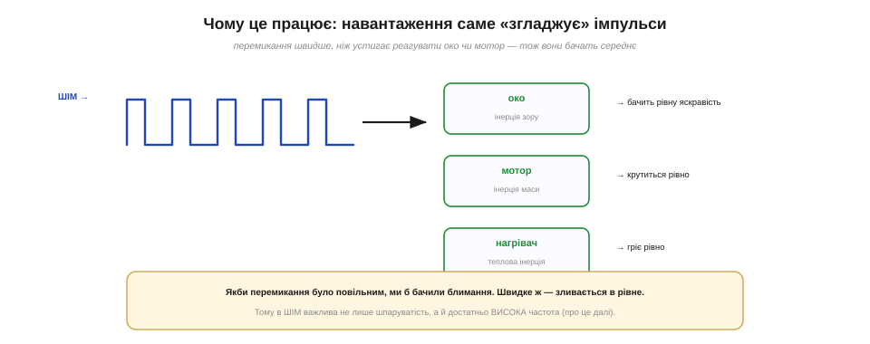
*Рис. 4.7.1.5. Навантаження саме «згладжує» ШІМ завдяки інерції: око (інерція зору) бачить рівну яскравість, мотор (інерція маси) крутиться рівно, нагрівач (теплова інерція) гріє рівно. Якби перемикання було повільним, ми б помічали блимання; швидке ж — зливається в рівне. Тому в ШІМ важлива не лише шпаруватість, а й достатньо **висока частота**.*

Звідси випливає важлива умова, до якої ми ще повернемося: частота ШІМ має бути **достатньо високою** для конкретного навантаження. Для світлодіода це сотні герц (щоб око не ловило мерехтіння), для мотора — свої значення. Якщо ж частота замала, інерції не вистачить, і замість плавного середнього ми побачимо (чи почуємо) миготіння. Підбір частоти — окрема тема (§4.7.3), та принцип уже ясний: ШІМ працює, **поки перемикання швидше за реакцію навантаження**.

Конкретні цифри такі. Людське око «зливає» мерехтіння приблизно від 50–90 герц (так звана критична частота злиття), тож для світлодіода беруть із запасом — зазвичай понад 100–200 Гц, аби позбутися блимання навіть на периферії зору й на відео. У моторів і котушок є своя пастка: якщо частота ШІМ потрапляє в **чутний** діапазон (від 20 Гц до ~20 кГц), вони можуть неприємно **свистіти** — обмотка ледь помітно вібрує в такт імпульсам. Тому для тихої роботи частоту ШІМ моторів іноді навмисне піднімають вище за поріг чутності.

### Звідки береться ШІМ: це таймер у режимі порівняння

А тепер найкраще: генерувати ШІМ не треба — ніжкою вручну смикати в коді нема потреби. Це робить **таймер** — той самий, що ми вивчили в Розділі 4.6, у режимі **порівняння** (§4.6.3). Згадаймо: лічильник рахує до ВЕРХУ (це задає **період**, тобто частоту), а **поріг порівняння** визначає, доки ніжка тримає високий рівень. Поки лічильник менший за поріг — ніжка увімкнена; досяг чи перевищив — вимкнена. Виходить, що **поріг порівняння — це і є шпаруватість**.

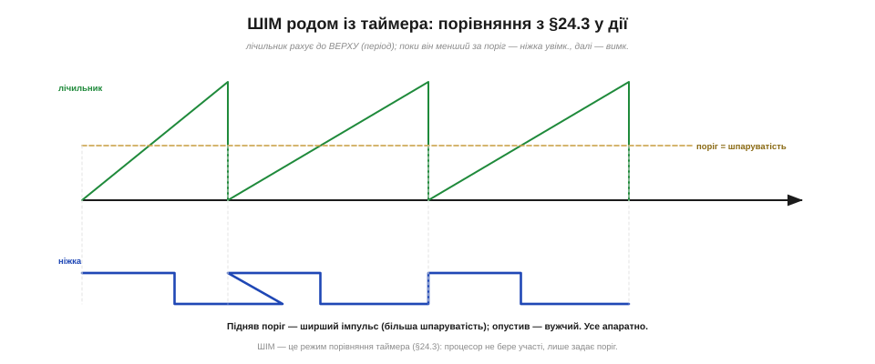
*Рис. 4.7.1.6. ШІМ генерує таймер у режимі порівняння (§4.6.3): лічильник рахує до ВЕРХУ (період = частота), а поки він менший за **поріг**, ніжка увімкнена. Підняв поріг — ширший імпульс (більша шпаруватість); опустив — вужчий. Усе діється апаратно: процесор лише задає поріг, а імпульси формує залізо.*

Це означає, що ШІМ — **апаратний** і майже безкоштовний для процесора: задавши частоту й поріг один раз, ви отримуєте бездоганно рівні імпульси — таймер формує їх сам, без жодного `loop()`. У коді — одна функція. На «класичному» Arduino це `analogWrite(pin, value)`, на ESP32 — `ledcWrite` (через окремий блок LEDC, §4.6.3), хоча сучасний Arduino-ESP32 розуміє й `analogWrite`. Передане значення — це шпаруватість у вибраній шкалі (наприклад, 0…255 для 8 біт), і ніжка одразу починає видавати ШІМ потрібної частки.

> 🔧 **Навіщо це.** Не пишіть ШІМ «руками» — не смикайте ніжку `digitalWrite` із `delay` у циклі. Така програмна ШІМ і вантажить процесор, і «пливе» джитером (§4.6.3), і збивається, щойно код займеться чимось іншим. Завжди беріть **апаратну** ШІМ через `ledcWrite`/`analogWrite`: задали частоту й шпаруватість — і таймер далі формує бездоганні імпульси сам. Ваш `loop()` лишається вільним, а сигнал — рівним.

Один таймер зазвичай живить **кілька** каналів ШІМ — кілька незалежних ніжок із власною шпаруватістю, але зі **спільною** частотою. Завдяки цьому одним блоком керують, наприклад, трьома каналами RGB-світлодіода чи кількома моторами водночас. Окремий поширений випадок — **сервопривід**: він очікує ШІМ особливого вигляду (короткий імпульс, ширина якого задає кут повороту), і та сама апаратна ШІМ для цього ідеально годиться. Деталі частоти й роздільності для різних задач — у наступних темах.

**Порахуймо: світлодіод на 30% яскравості.**

```
Ціль: світлодіод на ~30% яскравості, живлення 3.3 В.

  шпаруватість = 0.30  (30%)
  U_серед = 0.30 × 3.3 = 0.99 В  (середня напруга на навантаженні)

У коді (8-бітна шкала ШІМ, 0…255):
  значення = 0.30 × 256 ≈ 77
  ledcWrite(канал, 77);   // або analogWrite(pin, 77)

→ таймер видає імпульси шпаруватістю 30%, око бачить ~третину яскравості.
```

Зверніть увагу: ми **не** живили світлодіод напругою 0.99 В — ми давали йому повні 3.3 В 30% часу, і око усереднило це в «третину яскравості». Світлодіод і резистор (§4.4.6) лишаються ті самі; ШІМ лише керує тим, **яку частку часу** через них тече струм.

Варто окремо сказати про велику перевагу ШІМ — **ощадність**. Транзистор ніжки в кожен момент або повністю **відкритий** (малий опір — мало втрат), або повністю **закритий** (струму нема — втрат нема); у проміжному стані, де він гріється найдужче, він майже не перебуває. Тому ШІМ керує потужністю майже **без втрат на тепло** — на відміну від «лінійних» способів (резистор, лінійний стабілізатор), що гасять надлишок, просто перетворюючи його на жар. Саме ця ефективність і зробила ШІМ стандартом керування моторами, нагрівачами й живленням — від іграшок до електромобілів.

Варто оцінити цей трюк концептуально. ШІМ — місток між **цифровим** світом мікроконтролера (де є лише 0 і 1) і **аналоговим** світом речей (де яскравість і швидкість плавні). Не маючи жодної аналогової деталі, лише швидким перемиканням цифрової ніжки, ми дістаємо плавне керування. Це класичний інженерний прийом — замінити дороге (аналогову схему) дешевим і хитрим (час і лічбу). Недарма ШІМ вважають однією з найгеніальніших простих ідей практичної електроніки.

Отже, ШІМ розв'язує задачу «аналог цифровою ніжкою» хитрим обходом: ніжка, як завжди, стрибає лише між 0 і максимумом, але якщо робити це **швидко** й керувати **часткою часу «увімкнено»** (шпаруватістю), середній рівень виходить будь-який — від нуля до максимуму, за простою формулою «середнє = шпаруватість × живлення». Працює це тому, що інерційне навантаження само **згладжує** швидкі імпульси, а формує їх **таймер** у режимі порівняння, не навантажуючи процесора й майже без теплових втрат — за що ШІМ і люблять усюди. Лишилося розібрати, **як саме** таймер це робить крок за кроком — період, поріг, генерація імпульсу. Це [наступна тема §4.7.2](ch25-pwm-dac.md).

## 4.7.2 Як таймер генерує PWM апаратно (період/порівняння)

У [§4.7.1](ch25-pwm-dac.md) ми з'ясували, що ШІМ формує таймер у режимі порівняння (§4.6.3). Тепер розберімо цей механізм **детально** — крок за кроком, регістр за регістром. Це не лише задовольнить цікавість: розуміючи, як саме лічильник, ВЕРХ і поріг породжують імпульс, ви точно знатимете, що змінювати, аби дістати потрібну частоту й шпаруватість, і чому ними керують незалежно. А заразом побачимо, як це втілено в блоці LEDC мікросхеми ESP32.

### Механізм: лічильник, ВЕРХ і поріг порівняння

Згадаймо таймер із Розділу 4.6. Лічильник рахує вгору від нуля до заданого **ВЕРХУ** (значення авто-перезавантаження, §4.6.2), а дійшовши — скидається в нуль і починає знову. Це задає **період**. Тепер додаємо одну річ — **поріг порівняння** (*compare*): окреме число, з яким залізо весь час звіряє лічильник. Правило формування ніжки гранично просте: **поки лічильник менший за поріг — ніжка увімкнена; щойно дорівняв чи перевищив — вимкнена**.

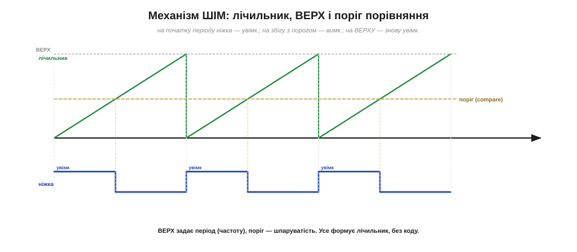
*Рис. 4.7.2.1. На початку періоду (лічильник = 0) ніжка вмикається. Лічильник росте; коли він дорівнює **порогу** — ніжка вимикається. На **ВЕРХУ** лічильник скидається, і все починається знову — ніжка знову вмикається. Так народжується періодичний імпульс, чия ширина = поріг, а період = ВЕРХ.*

Простежмо один період. Лічильник стартує з нуля — ніжка **увімкнена**. Він росте, доки не дорівняє порогу: у цю мить ніжка **вимикається** й лишається такою до кінця періоду. На ВЕРХУ лічильник скидається — ніжка знову вмикається, і цикл повторюється. Ширина «увімкненої» частини точно дорівнює значенню порога, а повна довжина періоду — ВЕРХУ. Звідси проста формула шпаруватості: **шпаруватість = поріг / (ВЕРХ + 1)**. Усе це лічильник робить **сам**, апаратно: процесор лише раз задає два числа.

Є й корисна гнучкість: яким рівнем починати період — обирають. Можна, як ми описали, тримати ніжку **увімкненою** до порога й вимикати після (активний високий); а можна навпаки — низький до порога, високий після (активний низький, інвертована ШІМ). Залізо підтримує обидва варіанти; це питання одного біта налаштування. Для світлодіода, що світиться за високого рівня, беруть прямий варіант; для схем, де «активним» є низький рівень (пор. open-drain §4.4.2), — інвертований. Суть механізму від цього не змінюється — лише полярність імпульсу.

Зверніть увагу: ми не вигадали нічого нового — це **дослівно** режим порівняння таймера з §4.6.3, лише застосований циклічно. Там ми казали «у певний тік зроби дію на ніжці»; тут ця «дія» — вимкнути ніжку на порозі, а на початку кожного нового періоду — знову ввімкнути. ШІМ — не окремий механізм, а **звичне порівняння**, повторюване період за періодом. Тому всі знання про таймери тут працюють одразу.

### Дві ручки: ВЕРХ → частота, поріг → шпаруватість

Найважливіше для практики — цими двома числами керують **дві окремі ручки**, і вони майже не залежать одна від одної. **ВЕРХ** (разом із передільником) задає **період**, а отже **частоту** ШІМ. **Поріг** задає **шпаруватість**, тобто середній рівень. Це різні регістри — змінюючи один, ви не зачіпаєте іншого.

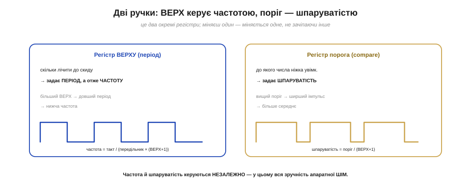
*Рис. 4.7.2.2. Регістр **ВЕРХУ** задає період (частоту): частота = такт / (передільник × (ВЕРХ+1)). Регістр **порога** задає шпаруватість: шпаруватість = поріг / (ВЕРХ+1). Це окремі регістри, тож частоту й шпаруватість крутять **незалежно** — у цьому вся зручність апаратної ШІМ.*

Ця незалежність — велика практична вигода. Налаштувавши частоту один раз (під своє навантаження, §4.7.1), далі керуєте лише **порогом** — плавно змінюєте яскравість чи швидкість, не чіпаючи частоти. Саме так і влаштовані функції ШІМ: частоту задають під час ініціалізації, а потім лише записують нове значення порога.

> 🔧 **Навіщо це.** Тримайте в голові розподіл праці двох ручок: **частоту обираєте один раз** (під навантаження — щоб не блимало й не пищало, §4.7.1), а далі весь час крутите лише **шпаруватість**. Якщо ШІМ блимає чи пищить — це майже завжди про **частоту** (її треба підняти); якщо не той середній рівень (яскравість, швидкість) — про **шпаруватість**. Не плутайте ці дві ручки, і налагодження ШІМ стане тривіальним.

Насправді ручок трохи більше: між тактом і лічильником, як завжди, стоїть **передільник** (§4.6.1), і частоту задають разом ВЕРХ і передільник за формулою частота = такт / (передільник × (ВЕРХ+1)). На практиці середовище ховає цю арифметику — ви кажете «хочу 5 кГц і 8 біт», а воно само підбирає передільник і ВЕРХ. Проте знати залежність корисно: вона пояснює, чому не кожну комбінацію частоти й роздільності можна отримати (про це — наступна тема).

Зручна аналогія для двох ручок: уявіть метроном і ноту. **Частота** — як швидко цокає метроном (скільки разів на секунду повторюється імпульс), а **шпаруватість** — яку частку кожного такту нота звучить. Можна змінювати темп, не зачіпаючи тривалості ноти, і навпаки. У ШІМ так само: ВЕРХ задає темп, поріг — «тривалість ноти» в кожному такті, і вони незалежні.

### Зміна шпаруватості на льоту

Оскільки шпаруватість — це просто значення порога, **змінити** її означає лише записати в регістр порога нове число. Підняли поріг — ніжка вимикатиметься пізніше, імпульс ширшає, середнє росте. Опустили — навпаки. Усе це відбувається без жодного переривання поточного періоду: лічильник собі рахує, а ви на льоту зсуваєте поріг.

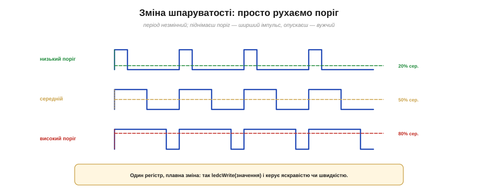
*Рис. 4.7.2.3. Один регістр порога керує всім: низький поріг — вузький імпульс (мале середнє), високий — широкий (велике). Період лишається незмінним. Саме цей рух порога й робить `ledcWrite(значення)`, плавно міняючи яскравість світлодіода чи швидкість мотора.*

Тут є тонкість, про яку дбає залізо. Якщо змінити поріг **посеред** поточного періоду, можна дістати «бракований» імпульс. Щоб цього не сталося, нове значення порога зазвичай записують у тіньовий (буферний) регістр, а в робочий воно переходить лише **на межі періоду** — коли лічильник скидається. Так зміна шпаруватості завжди дає чисті, повноцінні імпульси. Вам про це думати не треба — апаратура робить усе сама.

Окремо — **крайні** значення. Поріг 0 означає, що ніжка не ввімкнеться жодного разу за період: шпаруватість 0% (завжди вимкнено). Поріг більший за ВЕРХ — лічильник ніколи його не досягне, тож ніжка лишається увімкненою весь час: 100%. Залізо обробляє ці краї чисто, без жодних паразитних «хвостиків»: 0 — справжній постійний нуль, максимум — справжня постійна одиниця. Уся шкала, від повного вимкнення до повного ввімкнення, доступна без винятків.

### Один лічильник — багато каналів

Ще одна перевага апаратної ШІМ: до одного лічильника можна підключити **кілька** каналів порівняння, кожен на свою ніжку. Усі вони ділять **спільний** період (а отже, однакову частоту), але кожен має **власний** поріг — свою шпаруватість.

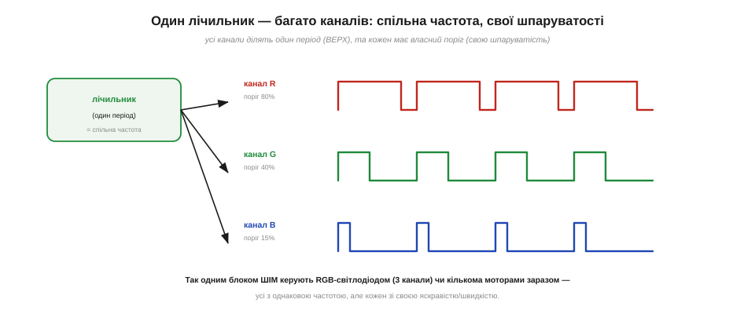
*Рис. 4.7.2.4. Один лічильник (один період → спільна частота) живить кілька каналів порівняння, кожен зі своїм порогом. Так одним блоком ШІМ керують RGB-світлодіодом (три канали — червоний, зелений, синій зі своєю яскравістю) чи кількома моторами — усі на одній частоті, але кожен зі своїм середнім рівнем.*

Це дуже зручно для багатоканальних задач. RGB-світлодіод — три канали ШІМ із незалежною яскравістю кожного кольору, з яких складається будь-який відтінок. Кілька моторів чи вентиляторів — кожен зі своєю швидкістю. Спільна частота тут не заважає: вона має бути «достатньо високою» для всіх, а різні середні рівні забезпечує різниця порогів.

Каналів, звісно, не безліч: у ESP32 блок LEDC має до шістнадцяти каналів і кілька таймерів. Кілька каналів можуть ділити один таймер (а отже, частоту) або користуватися різними таймерами з різними частотами — залежно від потреб задачі. Є й тонша можливість: оскільки всі канали одного таймера прив'язані до спільного лічильника, між їхніми імпульсами можна задати **зсув фази** — іноді це потрібно, щоб піки струму різних каналів не збігалися в часі. Але для звичайних задач досить простого «спільна частота, різні шпаруватості».

### Крайове й центроване вирівнювання

Наостанок — два різновиди ШІМ, які варто знати, хоча в простих задачах різниця й непомітна. Те, що ми описали (лічба лише вгору, імпульс на початку періоду), називають **крайовим** (*edge-aligned*) — найпоширеніший і найпростіший варіант. Є й **центрований** (*center-aligned*): там лічильник рахує вгору, а потім вниз, і імпульс виходить **по центру** періоду, симетричним.

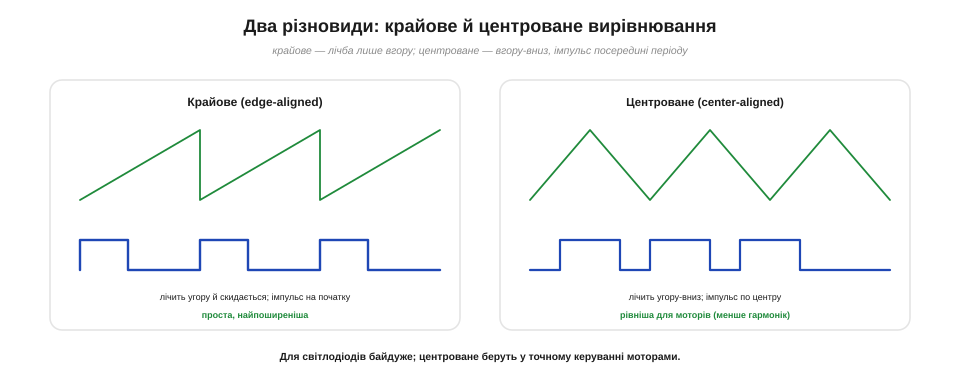
*Рис. 4.7.2.5. Крайове: лічильник рахує вгору й скидається, імпульс — на початку періоду; просто й найпоширеніше. Центроване: лічильник рахує вгору-вниз, імпульс — посередині, симетричний; його беруть у точному керуванні моторами (менше гармонік, рівніша робота). Для світлодіодів різниця несуттєва.*

Для яскравості світлодіода чи нагрівача спосіб вирівнювання геть байдужий — важить лише шпаруватість. А от у точному керуванні моторами центрований ШІМ кращий: симетричні імпульси дають менше небажаних гармонік і рівнішу роботу, тому в моторних драйверах часто обирають саме його. Для перших кроків досить знати, що такий вибір існує; за замовчуванням майже завжди працює крайовий.

У серйозному керуванні моторами до цього додають ще дві речі, тісно пов'язані з центрованим ШІМ: **комплементарні** виходи й **мертвий час**. Силовий міст мотора має пару транзисторів — верхній і нижній, — якими керують **протилежними** сигналами (один увімк. — другий вимк.). Та перемикати їх одночасно небезпечно: на якусь наносекунду обидва можуть бути прочиненими, і виникне те саме наскрізне коротке замикання, що ми розглядали в §4.4.1. Тому між їхніми перемиканнями навмисне лишають крихітну паузу — «мертвий час». Це вже ділянка спеціального блоку MCPWM, а не простого LEDC.

### ШІМ в ESP32: блок LEDC

Зведімо все стосовно ESP32. ШІМ там генерує спеціальний блок **LEDC** (*Light Emitting Diode Control* — «керування світлодіодами», хоча придатний не лише для них). Він складається з кількох **таймерів** і **каналів**: таймер задає частоту й роздільність (а отже, ВЕРХ), а канал прив'язує цей таймер до ніжки й зберігає свій поріг (шпаруватість).

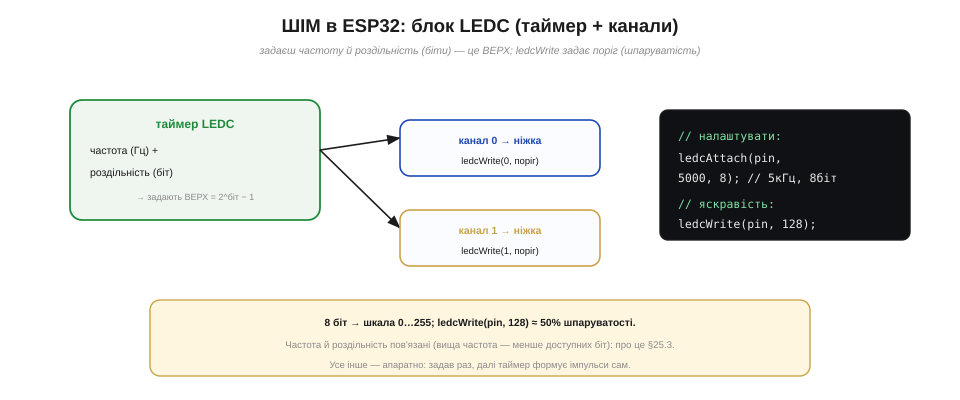
*Рис. 4.7.2.6. У ESP32 ШІМ дає блок LEDC: таймер налаштовують частотою й **роздільністю** (числом біт), що задає ВЕРХ = 2ᵇіт − 1, а кожен канал прив'язують до ніжки й керують його порогом через `ledcWrite`. У сучасному Arduino-ESP32: `ledcAttach(pin, частота, біти)` для налаштування і `ledcWrite(pin, значення)` для шпаруватості.*

У коді це дві дії: спершу **налаштувати** ніжку (задати частоту й роздільність), потім **записати** шпаруватість. Роздільність задають у бітах: 8 біт дають шкалу 0…255, 10 біт — 0…1023 тощо. Значення в `ledcWrite` — це поріг у цій шкалі, тобто шпаруватість.

**Порахуймо: налаштування LEDC і значення шпаруватості.**

```
Налаштування: частота 5 кГц, роздільність 8 біт.
  ВЕРХ = 2^8 − 1 = 255  →  шкала шпаруватості 0…255
  ledcAttach(pin, 5000, 8);   // 5 кГц, 8 біт

Шпаруватість 50%:
  значення = 0.50 × 256 = 128  →  ledcWrite(pin, 128);

Шпаруватість 30%:
  значення = 0.30 × 256 ≈ 77   →  ledcWrite(pin, 77);

→ далі таймер сам формує імпульси; loop() вільний.
```

> 🔧 **Навіщо це.** Запам'ятайте дві функції-робочих конячки: **`ledcAttach` налаштовує (частота + біти), `ledcWrite` керує яскравістю/швидкістю (поріг)**. Перше робите раз у `setup()`, друге — скільки завгодно в `loop()`. Значення в `ledcWrite` — це частка від `2^біт`, а не вольти: половина шкали = 50% шпаруватості. Якщо «яскравість стрибає» дивно — перевірте, чи ваше значення вкладається в обрану роздільність (для 8 біт — не більше 255).

Наостанок — приємний бонус LEDC: він уміє **плавно переходити** (*fade*) між двома значеннями шпаруватості **апаратно** — сам розганяє чи пригашає світлодіод за заданий час, без жодного коду в `loop()`. Тобто «м'яке» вмикання-вимикання світла — це не цикл із кроками яскравості, а одна команда залізу, яке далі веде перехід самостійно. Це ще один приклад того самого принципу: монотонну, але безперервну роботу делегують спеціальному блоку, звільняючи процесор.

Лишається одне «але», яке ми двічі обходили: частоту й роздільність не можна задавати цілком незалежно. Що вища частота, то менше тіків уміщається в один період, а отже, то менше **біт** роздільності лишається для шпаруватості. На 80-мегагерцовому такті 8 біт (256 кроків) легко дістати й на 5 кГц, і вище; а от 16 біт на високій частоті вже не вмістити. Цей компроміс «частота ↔ роздільність» — серцевина наступної теми; тут лише позначимо, що вони пов'язані.

Отже, апаратна ШІМ — це лічильник, що рахує до **ВЕРХУ** (задаючи період і частоту), і **поріг порівняння**, до якого ніжка тримає високий рівень (задаючи шпаруватість). Два параметри керуються незалежно, зміна порога плавно змінює середній рівень — і без збоїв, завдяки буферуванню, — а один лічильник живить кілька каналів зі спільною частотою. У ESP32 усе це забезпечує спеціальний блок LEDC, яким керують двома функціями: `ledcAttach` (налаштувати частоту й роздільність) і `ledcWrite` (задати шпаруватість). Ми вже двічі згадували, що частота й роздільність певним чином пов'язані й що частоту треба «обирати під навантаження». Ці компроміси — **шпаруватість, роздільність, частота** — і розбирає [наступна тема §4.7.3](ch25-pwm-dac.md).

## 4.7.3 Шпаруватість, роздільність, частота (компроміси)

ШІМ описують **три** числа, і важливо не плутати їх. **Шпаруватість** — який середній рівень ви хочете зараз (значення, яке записуєте). **Роздільність** — на скільки кроків поділено шкалу шпаруватості (наскільки тонко нею можна керувати). **Частота** — скільки разів на секунду повторюється імпульс. Перше крутять постійно, а друге й третє обирають раз — і, як ми вже двічі натякали, вони **пов'язані**: не можна одночасно мати дуже високу частоту й дуже тонку роздільність. Ця тема — про ці три параметри, головний компроміс між ними й про те, як обирати їх під конкретну задачу. А наприкінці — про пастку людського зору, через яку «рівні кроки» виглядають нерівними.

### Три параметри: що є що

Спершу чітко розкладімо три величини по полицях, щоб далі не плутати.


*Рис. 4.7.3.1. **Шпаруватість** — який середній рівень зараз (значення, яке пишемо). **Роздільність** — на скільки кроків ділиться шкала (число біт: 8 біт = 256 кроків). **Частота** — скільки періодів за секунду (наприклад, 5 кГц). Шпаруватість крутимо постійно; роздільність і частоту обираємо раз — і вони пов'язані.*

Ключова помилка, якої варто уникати: **роздільність — це не точність напруги, а кількість кроків шпаруватості**. Вісім біт означає, що між повним вимкненням і повним увімкненням є 256 ступенів — не більше й не менше. Чим більше біт, тим дрібніший крок між сусідніми рівнями шпаруватості — тим плавніше керування. Розберімо це докладніше.

Підкреслімо ще раз, бо це часто плутають: роздільність ШІМ ділить на кроки **час** (частку періоду), а не напругу безпосередньо. «256 рівнів» означає 256 можливих **ширин** імпульсу; а в яку середню напругу це виллється — залежить від живлення (§4.7.1). Тому не сприймайте роздільність ШІМ як «точність у вольтах» — це радше «дрібність ручки» шпаруватості. Справжню напругу зі ШІМ дістають згладжуванням (§4.7.4), і її рівність залежить не лише від кількості біт, а й від фільтра.

Зручна аналогія — фотоапарат: там теж три взаємопов'язані ручки (витримка, діафрагма, чутливість), і зміна однієї тягне за собою інші. У ШІМ так само: шпаруватість — це «що знімаємо» (конкретна картинка), а роздільність і частота — «налаштування камери», які ділять один бюджет і впливають одне на одне. Розібравшись, як ці троє взаємодіють, ви керуватимете ШІМ свідомо, а не навмання підбираючи числа, доки «запрацює».

### Роздільність — на скільки кроків ділиться шпаруватість

Уявімо регулятор яскравості. Якщо в нього лише **4** положення (2 біти) — вимк., третина, дві третини, повна — то керувати яскравістю можна тільки цими грубими сходинками; плавного переходу не вийде. А якщо положень **256** (8 біт), сусідні ступені майже не відрізняються, і яскравість змінюється практично неперервно.

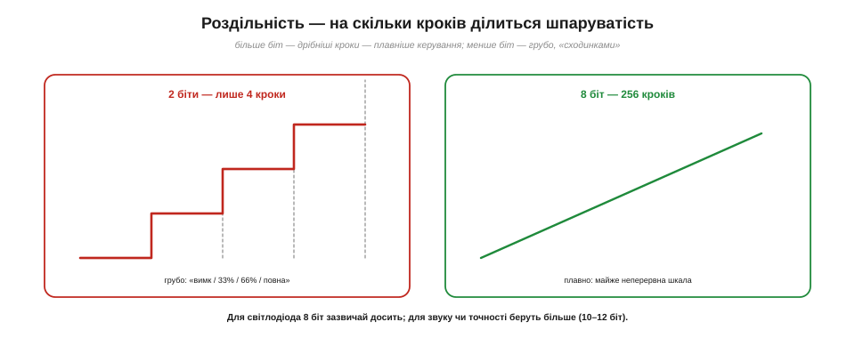
*Рис. 4.7.3.2. Роздільність — це кількість кроків шпаруватості. 2 біти — лише 4 рівні (груба «сходинка»: вимк./33%/66%/повна). 8 біт — 256 рівнів (майже неперервна, плавна шкала). Для світлодіода 8 біт зазвичай досить; для звуку чи точного керування беруть більше (10–12 біт).*

Скільки біт потрібно — залежить від задачі. Для дімування світлодіода 8 біт (256 кроків) майже завжди вистачає: око все одно не розрізнить тонших градацій (з поправкою на гамму, про яку нижче). Для відтворення звуку через ШІМ чи точного керування беруть більше — 10, 12 біт. Але скільки б біт ви не захотіли, є межа, і ставить її **частота**.

Замала роздільність дається взнаки **видимими стрибками**. У дімера на 4–8 рівнях око ловить різкі зміни яскравості замість плавного переходу; у ШІМ-звуці брак біт чути як «зернистий» шум квантування. Це та сама причина, чому якісний звук записують 16-бітним, а не двобітним форматом: чим грубіша шкала, тим помітніша «сходинковість». Тож роздільність беруть із запасом — не «скільки мінімально працює», а «скільки треба, щоб кроки стали непомітними для ока чи вуха».

### Головний компроміс: частота × кроки ≤ такт

Ось серцевина теми. Згадаймо §4.7.2: період таймера в тіках дорівнює числу кроків (2^роздільність), а частота = такт / період. Складемо це разом — і дістанемо залізне правило: **частота × 2^роздільність ≤ частота такту**. Інакше кажучи, за один період ШІМ має вміститися 2^роздільність тіків лічильника; що вища частота, то коротший період, то менше тіків у ньому — і то менше біт роздільності лишається.

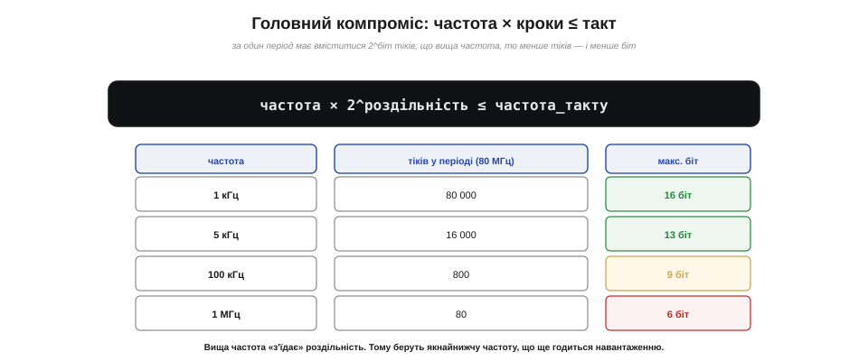
*Рис. 4.7.3.3. За один період ШІМ має вміститися 2^роздільність тіків. На 80 МГц: на 1 кГц у періоді 80 000 тіків (аж 16 біт), на 5 кГц — 16 000 (13 біт), на 100 кГц — лише 800 (9 біт), на 1 МГц — 80 (6 біт). Вища частота «з'їдає» роздільність — тому беруть якнайнижчу частоту, що ще годиться навантаженню.*

Подивіться на таблицю: підняли частоту вдесятеро — і втратили ~3 біти роздільності. Це прямий, неминучий компроміс: частота й роздільність ділять той самий «бюджет» тіків у періоді. Не можна мати водночас і мегагерцову частоту, і 16-бітну плавність — на це просто не вистачає швидкості такту.

Чи є вихід із цього компромісу? Частково. По-перше, на **низьких** частотах біт стає аж надміру (для сервопривода на 50 Гц формула дає близько 20 біт — більше, ніж будь-коли потрібно). По-друге, апаратний максимум LEDC — 20 біт, тож угору роздільність теж обмежена. А коли потрібні водночас і висока частота, і тонкі градації, вдаються до хитрощів на кшталт **дизерингу** — швидкого чергування двох сусідніх рівнів шпаруватості, чиє середнє лягає між ними й дає «ефективно» більше кроків. Але для типових задач досить просто розумно обрати пару «частота — роздільність».

### Скільки біт можна: формула

Перетворимо правило на просту формулу для розрахунку. Поділивши частоту такту на бажану частоту ШІМ, дістаємо число тіків у одному періоді; а скільки біт у це число вкладається — показує двійковий логарифм: **max біт = log₂(такт / частота)**.


*Рис. 4.7.3.4. Максимум біт = log₂(такт / частота). На 80 МГц: для 5 кГц виходить log₂(16000) ≈ 13.9 → 13 біт; для 100 кГц — log₂(800) ≈ 9.6 → 9 біт; для 1 МГц — log₂(80) ≈ 6.3 → 6 біт. Беремо ціле число біт, що не перевищує цю межу.*

Користуватися формулою просто: підставте частоту такту (на ESP32 зазвичай 80 МГц) і бажану частоту ШІМ — і дізнаєтеся стелю роздільності. Беруть ціле число біт **не вище** цієї стелі. На практиці середовище само перевірить сумісність і повідомить, якщо пара неприпустима, — але розуміти причину корисно, щоб одразу обирати робочі значення.

> 🔧 **Навіщо це.** Якщо ESP32 «не приймає» вашу пару частоти й роздільності або ШІМ поводиться дивно — майже завжди це порушений компроміс: ви замовили забагато біт для такої високої частоти. Лік простий: або **знизьте частоту** (якщо навантаження дозволяє), або **зменште роздільність**. Тримайте в голові орієнтир: на 80 МГц «8 біт + кілька кілогерц» завжди влізе з запасом, а от «16 біт + сотні кілогерц» — ні.

Формулу зручно читати й у зворотний бік. Якщо знаєте, скільки біт **потрібно**, — одразу бачите **стелю частоти**: вона дорівнює такт / 2^біт. Хочете 12 біт? Тоді частота не вища за 80 000 000 / 4096 ≈ 19.5 кГц. Хочете повних 16 біт? Стеля падає до ~1.2 кГц. Компроміс працює в обидва боки: задавши одне з двох — отримуєте обмеження на друге. Зручно прикинути обидві стелі ще до написання коду.

### Як обирати: спершу частота, тоді роздільність

Звідси готовий рецепт вибору, де порядок важливий. **Спершу** обирають частоту — її диктує **фізика навантаження**: для світлодіода понад ~200 Гц (щоб не блимало навіть на відео), для мотора найчастіше одиниці-десятки кілогерц (щоб не свистів, §4.7.1), для звуку — вище за поріг чутності. **Потім** беруть роздільність — найбільшу, що вміщається за формулою.


*Рис. 4.7.3.5. Порядок вибору: (1) частоту визначає навантаження (LED > 200 Гц; мотор 1–20 кГц; звук за чутністю); (2) роздільність беруть найбільшу, що вкладається за формулою (для LED 8 біт майже завжди досить). Правило — **найнижча частота, що годиться навантаженню**: так лишається найбільше біт на плавність.*

Золоте правило звідси таке: беріть **якнайнижчу** частоту, яка ще задовольняє навантаження. Що нижча частота — то більше тіків у періоді — то більше біт роздільності лишається на плавне керування. Надто висока частота дарма «з'їдає» роздільність. Задовольніть навантаження мінімально достатньою частотою, а решту «бюджету» віддайте плавності.

**Порахуймо: ШІМ-дімер для світлодіода.**

```
Ціль: плавне дімування світлодіода.

  1) Частота: 1 кГц — без видимого блимання, з великим запасом.
  2) Стеля роздільності: log2(80 000 000 / 1000) = log2(80000) ≈ 16 біт
  3) Беремо, скажімо, 10 біт — шкала 0…1023, більш ніж плавно для ока.

  ledcAttach(pin, 1000, 10);   // 1 кГц, 10 біт
  ledcWrite(pin, 512);         // ~50% яскравості

Для звуку через ШІМ: частота 40 кГц (за чутністю),
  стеля = log2(80M/40k) = log2(2000) ≈ 11 біт — теж досить.
```

Щоб не рахувати щоразу, запам'ятайте кілька робочих орієнтирів. **Світлодіод**: 1–5 кГц, 8–10 біт (понад 1 кГц ще й позбавляє смуг на відеозаписі). **RGB-світлодіод**: те саме, три канали. **Сервопривід**: рівно 50 Гц (період 20 мс), біт там удосталь. **Колекторний мотор або вентилятор**: 20 кГц і вище — за порогом чутності, щоб не свистів, 8–10 біт. **Звук через ШІМ**: десятки кілогерц і якомога більше біт (тут компроміс відчутний). Ці кілька цифр закривають більшість проєктів.

### Підступ сприйняття: око бачить нелінійно

Наостанок — практична пастка, що дивує всіх, хто вперше робить «плавне затемнення». Здавалося б, рівні кроки шпаруватості мають давати рівні кроки яскравості. Та **око так не працює**: воно сприймає яскравість приблизно **логарифмічно**. Тому за лінійної зміни шпаруватості внизу шкали світло різко «стрибає» (від ледь видимого до помітного), а вгорі майже не змінюється (між 80% і 100% різниці не видно).

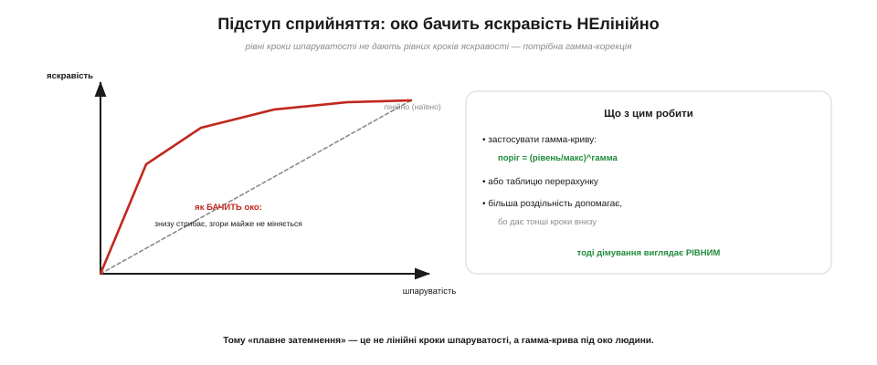
*Рис. 4.7.3.6. Лінійні кроки шпаруватості (сіра пряма) дають нерівне сприйняття: око (червона крива) бачить різкий стрибок унизу й майже сталий рівень угорі. Лік — **гамма-корекція**: поріг = (рівень/макс)^гамма, або таблиця перерахунку. Більша роздільність теж допомагає, бо дає тонші кроки внизу. Тоді дімування виглядає справді рівним.*

Засіб відомий — **гамма-корекція**: замість записувати шпаруватість прямо пропорційно бажаній яскравості, її пропускають через степеневу криву (поріг = (рівень/максимум)^гамма, де гамма ≈ 2). Це «розтягує» нижню частину шкали (де око найчутливіше) і стискає верхню. На практиці часто беруть готову **таблицю перерахунку** «рівень → шпаруватість». Більша роздільність тут теж до речі: вона дає тонші кроки внизу, де гамма-крива найкрутіша.

> 🔧 **Навіщо це.** Якщо ваше «плавне затемнення» виглядає так, ніби світло різко спалахує на старті й «застигає» в кінці, — це не баг, а **гамма** людського зору. Не намагайтеся «полагодити» це лінійними кроками — застосуйте гамма-криву чи таблицю перерахунку, і дімування стане візуально рівним. Те саме стосується звуку (гучність теж сприймається логарифмічно). Запам'ятайте: **рівне для приладу ≠ рівне для людини**.

Цю нелінійність давно стандартизовано: для світла є крива світлоти CIE L* (стандарт CIELAB, 1976), за якою будують таблиці гамма-корекції в серйозних драйверах світлодіодів. Звук іде тим самим шляхом: гучність ми чуємо логарифмічно (звідси й шкала децибел), тож регулятор гучності на ШІМ теж роблять логарифмічним, а не лінійним. А от у керуванні **положенням** (сервопривід, позиція мотора) нелінійності сприйняття нема — там шпаруватість має бути саме лінійною, бо вимірюємо фізичну величину, а не відчуття. Коротко: гамма потрібна там, де є **відчуття** (світло, звук), але не там, де є **механіка**.

Цей трикутник «шпаруватість — роздільність — частота» — окремий прояв загального інженерного закону: ресурс (тут — тіки такту за секунду) скінченний, і його доводиться **ділити** між суперечливими бажаннями (швидко повторювати проти тонко градуювати). Той самий компроміс зустрінеться ще не раз — у перетворенні аналогу на цифру (наступний розділ) він постане як «частота вимірів проти роздільності». Вміючи свідомо розподіляти такий бюджет, ви отримуєте ключ до багатьох тем цифрової електроніки.

Отже, ШІМ описують три числа: **шпаруватість** (який рівень), **роздільність** (на скільки кроків) і **частота** (як швидко). Роздільність і частота пов'язані залізним компромісом «частота × 2^роздільність ≤ такт», а стелю біт дає формула max біт = log₂(такт / частота). Обирають у порядку «спершу частота під навантаження, тоді роздільність, що вміщається»: найнижча прийнятна частота залишає найбільше тіків у бюджеті на плавність. І пам'ятайте про гамму: сприйняття ока й вуха нелінійне, тож «плавне» для людини — це крива, а не пряма. Досі ШІМ давав нам **середнє** значення, яке усереднює саме навантаження. А що, коли потрібна справжня, рівна **аналогова напруга** без миготіння? Для цього імпульси **згладжують** RC-фільтром — простим колом із резистора й конденсатора. Про це розповідає [наступна тема §4.7.4](ch25-pwm-dac.md).

## 4.7.4 Відновлення аналогу з PWM: RC-фільтр

Досі ШІМ давав нам **середнє** значення, але усереднювало його саме навантаження — око, мотор, нагрівач завдяки своїй інерції (§4.7.1). А що, коли потрібна не «середня потужність у лампочці», а **справжня рівна напруга** — щоб подати її на аналоговий вхід, в операційний підсилювач, у звуковий тракт? Голий сигнал ШІМ для цього не годиться: він стрибає між 0 і максимумом тисячі разів на секунду. Щоб перетворити ці стрибки на рівну напругу, їх **згладжують** — пропускають крізь **RC-фільтр**, просте коло з резистора й конденсатора. Ця тема — про те, як RC перетворює ШІМ на аналог, який тут компроміс і чому таке поєднання називають «ЦАП для бідних».

### Навіщо згладжувати

Спершу — коли це **не** потрібно, а коли потрібно. Якщо ШІМ керує світлодіодом чи мотором, фільтр зайвий: навантаження само усереднює імпульси. Та коли споживач не має власної інерції й реагує на кожен стрибок — наприклад, аналоговий вимірювальний вхід — або коли ви хочете згенерувати плавний сигнал (опорну напругу, повільну синусоїду, звук), — потрібна **справжня** рівна напруга без миготіння.

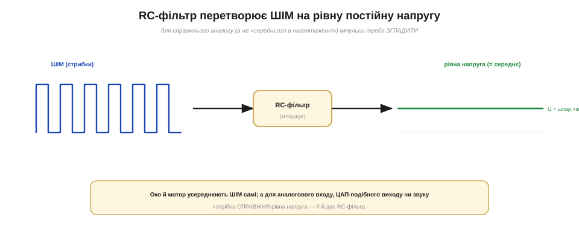
*Рис. 4.7.4.1. Голий ШІМ — це швидкі стрибки 0↔максимум. RC-фільтр **згладжує** їх у рівну постійну напругу, що дорівнює середньому (шпаруватість × живлення). Око й мотор усереднюють самі; а для аналогового входу, ЦАП-подібного виходу чи звуку потрібна справжня рівна напруга — її й дає RC-фільтр.*

Отже, фільтр витягує зі ШІМ його **постійну складову** (середнє) і відкидає швидке миготіння. На виході — та сама напруга «шпаруватість × живлення», що ми рахували в §4.7.1, але тепер **реальна й гладка**, придатна там, де усереднювати нема чому.

Якщо поглянути на ШІМ крізь призму частот, картина прояснюється. Будь-який періодичний сигнал розкладається на **постійну складову** (те саме середнє) і набір **гармонік** — коливань на частоті ШІМ та її кратних. Нам потрібна лише постійна складова; гармоніки — це і є небажане миготіння. Фільтр низьких частот робить рівно те, що треба: пропускає «нульову частоту» (постійне) і гасить вищі гармоніки. «Згладити ШІМ» і «відфільтрувати гармоніки» — два описи однієї дії.

Де ж на практиці потрібен справді рівний аналог? Наприклад: задати **опорну напругу** для іншої схеми; зсунути робочу точку (*bias*) операційного підсилювача; подати **керівну напругу** на регульоване джерело чи двигун з аналоговим входом; згенерувати повільний сигнал — пилку, синус, обвідну. В усіх цих випадках споживач зчитує **миттєву** напругу, а не усереднює її, тож голий ШІМ дав би «брудний» результат — і тут рятує фільтр.

### Схема: резистор послідовно, конденсатор на землю

Сам фільтр гранично простий: **резистор** R вмикають послідовно (між ніжкою ШІМ і виходом), а **конденсатор** C — від виходу до землі. Це класичний **фільтр низьких частот**: він пропускає повільне (постійну складову, середнє) і глушить швидке (різкі фронти імпульсів).

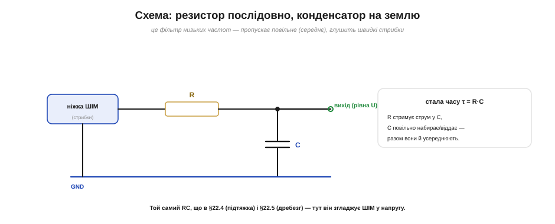
*Рис. 4.7.4.2. Резистор R — послідовно з ніжкою ШІМ, конденсатор C — від виходу до землі. Вихід знімають із конденсатора. R стримує струм у C, а C повільно набирає й віддає заряд — разом вони усереднюють імпульси в рівну напругу. Це той самий RC, що в §4.4.4 (підтяжка) і §4.4.5 (дребезг), тут — у ролі згладжувача.*

> 🔧 **Навіщо це.** Упізнайте старого знайомого: це той самий RC, що ми зустрічали в підтяжці (§4.4.4) і придушенні дребезгу (§4.4.5). Усюди він робить одне — **згладжує швидкі зміни** завдяки тому, що конденсатор не може миттєво змінити напругу. Запам'ятайте цей універсальний «цеглинку»: резистор плюс конденсатор = згладжувач, і він стане в пригоді щоразу, коли треба «причесати» різкий сигнал у плавний.

Чому саме така схема працює, легко зрозуміти через поведінку конденсатора на різних частотах. Для **швидких** змін конденсатор поводиться майже як коротке замикання на землю — він «з'їдає» різкі стрибки, шунтуючи їх. Для **повільних** (і постійної напруги) — навпаки, поводиться як розрив, тож постійна складова спокійно потрапляє на вихід. Резистор тут — «вузьке горло», що змушує швидке миготіння іти в конденсатор, а не на вихід. Разом вони сортують: повільне — на вихід, швидке — на землю.

### Як це працює: конденсатор не встигає за стрибками

Розгляньмо роботу детальніше. Поки ШІМ тримає високий рівень, конденсатор **набирає** заряд (напруга на ньому зростає), та повільно — бо резистор стримує струм. Щойно ШІМ упав у нуль, конденсатор **віддає** заряд (напруга спадає), також повільно. Якщо перемикання **швидше**, ніж конденсатор устигає помітно зарядитися чи розрядитися, його напруга лише злегка коливається навколо **середнього** — це й є гладкий аналог із дрібною «брижею».

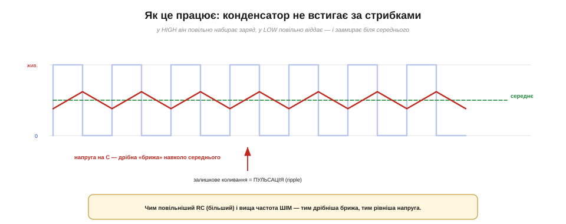
*Рис. 4.7.4.3. Напруга на конденсаторі росте в HIGH і спадає в LOW, але повільно (струм стримує R), тож вона лише дрібно «дрижить» навколо середнього рівня. Це залишкове коливання звуть **пульсацією** (ripple). Чим повільніший RC і вища частота ШІМ — тим менша пульсація, тим рівніша напруга.*

Це залишкове коливання — **пульсація** (ripple) — і є головний «дефект» такого аналогу. Ідеально рівної напруги RC-фільтр не дає ніколи: завжди лишається крихітна брижа на частоті ШІМ. Питання лише в її величині, а вона залежить від двох речей: наскільки «повільний» фільтр (велике RC) і наскільки висока частота ШІМ.

Цікаво, що пульсація не однакова по всій шкалі: вона **найбільша посередині** (близько 50% шпаруватості), де конденсатору доводиться однаково довго й набирати, і віддавати, і **найменша на краях** (близько 0% і 100%), де перемикань майже нема. Тому, проєктуючи фільтр, орієнтуються на найгірший випадок — 50%. А ще зарядження й розрядження йдуть не прямою, а плавною **експонентою** (як завжди з RC, §4.4.4), тож реальна брижа має закруглену, а не трикутну форму.

### Компроміс: пульсація проти швидкості

І тут знову той самий компроміс, що зустрічається нам іще з §4.4.4. Зробити RC **великим** — конденсатор реагуватиме дуже мляво, пульсація стане крихітною (напруга рівна), **але** й на зміну шпаруватості фільтр відгукуватиметься повільно: захочете різко змінити рівень — він «доповзе» туди лише за кілька сталих часу. Зробити RC **малим** — навпаки, швидка реакція, та помітна пульсація.

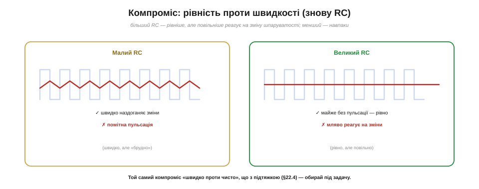
*Рис. 4.7.4.4. Малий RC: швидко наздоганяє зміни шпаруватості, але з помітною пульсацією («швидко, та брудно»). Великий RC: майже без пульсації, рівна напруга, проте мляво реагує на зміни («рівно, та повільно»). Це той самий компроміс «швидко проти чисто», що з підтяжкою (§4.4.4) — обирай під задачу.*

Звідси висновок: RC підбирають **під задачу**. Потрібна рівна опорна напруга, що змінюється рідко, — беріть великий RC, рівність важливіша за швидкість. Потрібно швидко «гойдати» рівень (генерувати сигнал) — доводиться миритися з пульсацією або підвищувати частоту ШІМ. Як завжди з RC, золотої середини нема — є вибір під конкретну ціль.

Корисно вміти прикинути «повільність» числом. Напруга на виході RC встановлюється до нового рівня приблизно за **п'ять сталих часу** (5·RC) — стільки потрібно, щоб конденсатор майже повністю перезарядився. Тому, обираючи RC, ви водночас обираєте, як **швидко** аналогова напруга зможе змінювати рівень: великий RC дає рівність, але реакцію в мілісекунди й більше. Цей простий орієнтир «5·RC» одразу показує, чи встигне фільтр за вашими змінами.

### Правило: зріз фільтра нижче за частоту ШІМ

Як же конкретно підібрати R і C? Фільтр характеризують його **частотою зрізу** fc = 1/(2πRC): нижче за неї сигнали проходять, вище — гасяться. Щоб постійна складова (середнє) пройшла, а імпульси ШІМ погасилися, зріз має бути **помітно нижчим** за частоту ШІМ — звичний орієнтир: у 10 і більше разів.

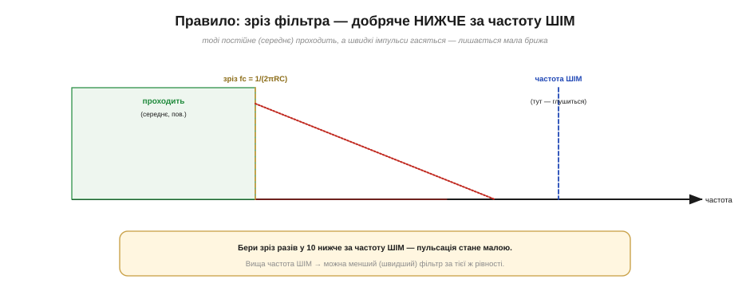
*Рис. 4.7.4.5. Зріз fc = 1/(2πRC) ставлять **нижче** за частоту ШІМ (разів у 10): тоді постійна складова (середнє) вільно проходить, а швидкі імпульси ШІМ потрапляють у зону згасання й гасяться. Звідси й правило: вища частота ШІМ дозволяє менший (швидший) фільтр за тієї ж рівності.*

Тут видно й чому **висока частота ШІМ — друг фільтра**: що далі частота ШІМ від зрізу, то сильніше гасяться імпульси, і за тієї ж рівності можна взяти менший, **швидший** RC. Це ще один аргумент на користь вищої частоти ШІМ там, де роздільність дозволяє (§4.7.3): вона полегшує згладжування.

**Порахуймо: RC-фільтр для ШІМ на 5 кГц.**

```
ШІМ 5 кГц, хочемо рівну напругу.

  зріз: fc ≈ 500 Гц  (у 10 разів нижче 5 кГц)
  fc = 1/(2π·R·C)  →  R·C = 1/(2π·500) ≈ 320 мкс

  беремо R = 10 кОм:
     C = 320 мкс / 10 000 Ом = 32 нФ  (≈ 33 нФ зі стандартного ряду)

  час встановлення ≈ 5·R·C = 5 × 320 мкс ≈ 1.6 мс
  → напруга «доповзає» до нового рівня за ~1.6 мс.
```

Якщо однієї RC-ланки для рівності мало, ставлять **дві** послідовно (фільтр другого порядку): після першого згладжування йде друге, і пульсація спадає набагато різкіше. Платять за це повільнішою реакцією й трохи складнішою схемою, але для якісного аналогу (наприклад, опорної напруги високої чистоти) це варте того. Загальне правило: кожна додаткова ланка «крутіше» зрізає вищі частоти, але й більше сповільнює зміни. Для більшості задач однієї ланки RC цілком достатньо.

### ШІМ + RC = «ЦАП для бідних»

Склавши все разом, ми дістали дешевий **цифро-аналоговий перетворювач**: ШІМ-ніжка задає рівень (шпаруватістю), а RC-фільтр перетворює його на справжню напругу. Це й називають «ЦАП для бідних» (*poor man's DAC*) — бо коштує він двох копійчаних деталей і працює на **будь-якій** ШІМ-ніжці.

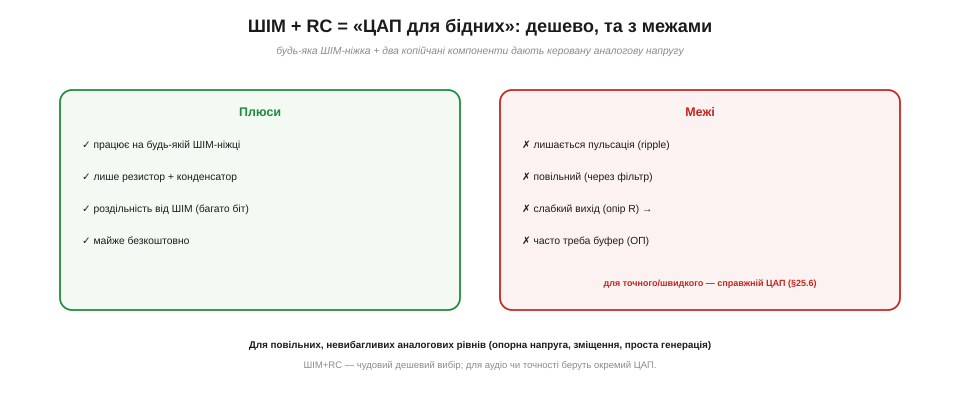
*Рис. 4.7.4.6. ШІМ + RC дає керовану аналогову напругу майже задарма й на будь-якій ШІМ-ніжці, з роздільністю від ШІМ. Та має межі: лишається пульсація, реакція повільна (через фільтр), а вихід «слабкий» (через опір R просідає під навантаженням), тож часто треба буфер-підсилювач. Для точного чи швидкого аналогу беруть справжній ЦАП (§4.7.6).*

Але знати його межі обов'язково. По-перше, **пульсація** — ідеальної рівності нема. По-друге, **повільність** — фільтр обмежує, як швидко можна змінювати напругу. По-третє, **слабкий вихід**: між ніжкою й виходом стоїть резистор, тому варто підключити навантаження, що споживає помітний струм, — і напруга «просяде». Тому до ШІМ-ЦАП часто додають **буфер** (повторювач на операційному підсилювачі), що підтримує напругу, беручи струм із окремого джерела.

> 🔧 **Навіщо це.** ШІМ+RC — чудовий вибір для **повільних, невибагливих** аналогових рівнів: задати опорну напругу, зміщення, плавно «покрутити» якийсь параметр. Дешево, на будь-якій ніжці, з гарною роздільністю. Та не беріть його для **швидкого чи точного** аналогу (якісне аудіо, миттєва зміна) — там пульсація й повільність завадять, і потрібен справжній ЦАП. І пам'ятайте про слабкий вихід: якщо до ШІМ-ЦАП щось підключаєте, або переконайтеся, що воно майже не бере струму, або ставте буфер.

Порівняймо чесно зі справжнім ЦАП. ШІМ-ЦАП може мати **багато** ефективних біт (бо роздільність бере від ШІМ, §4.7.3) — іноді навіть більше, ніж дешевий вбудований ЦАП. Його слабке місце не роздільність, а **швидкість**: фільтр не дає різко змінювати напругу, тож для сигналів, що швидко «бігають» (аудіо, керування в реальному часі), ШІМ-ЦАП повільний. Справжній ЦАП видає нове значення **миттєво**, без фільтра й пульсації. Тому вибір простий: повільне й точне — ШІМ+RC справляється; швидке — потрібен апаратний ЦАП (§4.7.6).

Дрібна практична порада щодо вибору R. Він входить і в сталу часу (τ = R·C), і у **вихідний опір** фільтра. Надто малий R незручний — конденсатор тоді потрібен великий; надто великий — вихід стає «кволим» і просідає від найменшого навантаження. Звичний компроміс — одиниці-десятки кілоомів, а потрібну сталу часу добирають конденсатором. Якщо до виходу підключено помітне навантаження — R беруть меншим або, надійніше, ставлять буфер.

Отже, щоб дістати зі ШІМ **справжню** рівну напругу (а не «середнє в навантаженні»), імпульси згладжують **RC-фільтром** — резистор послідовно, конденсатор на землю. Конденсатор не встигає за швидкими стрибками й тримається біля середнього, лишаючи дрібну **пульсацію**; її величина — компроміс між рівністю (великий RC) і швидкістю реакції (малий RC). Зріз фільтра ставлять разів у 10 нижче за частоту ШІМ, тому вища частота ШІМ іще й полегшує фільтрування. Разом ШІМ + RC дають дешевий ЦАП зі своїми межами (пульсація, повільність, слабкий вихід).

Наостанок — ефектний приклад того самого принципу у великому масштабі. Сучасні **підсилювачі звуку класу D** працюють саме так: звуковий сигнал перетворюють на ШІМ високої частоти, підсилюють потужними транзисторами (які майже не гріються, бо повністю відкриті чи закриті, §4.7.1), а потім **відфільтровують** назад в аналог — і дістають гучний звук із ККД, недосяжним для старих лінійних підсилювачів. Отже, «ШІМ плюс фільтр» — це не лише дешевий трюк для опорної напруги, а й технологія, що грає у ваших навушниках і колонках. Ми багато говорили «світло, мотор, нагрівач» абстрактно — час побачити це в **конкретних застосуваннях**: керування яскравістю, швидкістю, потужністю. Саме цьому присвячена [наступна тема §4.7.5](ch25-pwm-dac.md).

## 4.7.5 Застосування: яскравість, швидкість, керування потужністю

Тепер, розуміючи ШІМ зсередини, погляньмо, **що** нею роблять на практиці. Ця тема оглядова й прикладна: ми пройдемося чотирма найпоширенішими застосуваннями (яскравість світлодіода, швидкість мотора, керування сервоприводом і потужністю), а потім зведемо все в один універсальний патерн і карту. Спільна нитка проста: ШІМ керує **середнім рівнем** (а отже, потужністю) ефективно й майже задарма, а все, що потребує більшого струму, ніж дає світлодіод, вмикають через транзистор-ключ із Розділу 4.4.

Варто заздалегідь оцінити, наскільки ШІМ **усюдисуща**. Та сама ідея «керувати часткою часу» лежить в основі не лише дімерів і моторів, а й імпульсних блоків живлення (що живлять майже всю сучасну електроніку), зарядних пристроїв, інверторів і навіть передавання даних. Опанувавши ШІМ на простих прикладах цієї теми, ви впізнаватимете її принцип у незліченних пристроях навколо — від зарядки телефона до електромобіля. Це не вузький прийом, а один із наріжних каменів силової й керівної електроніки.

### Яскравість світлодіода

Найпряміше застосування — дімування світлодіода. Шпаруватість ШІМ безпосередньо задає **яскравість**: 100% — повна, 50% — приблизно вполовину (з поправкою на гамму, §4.7.3), 0% — погашено. Малий світлодіод вмикають **прямо з ніжки** через струмообмежувальний резистор (§4.4.6); а потужний світлодіод чи цілу стрічку, що потребує струму понад межу ніжки, — через **транзистор-ключ**.

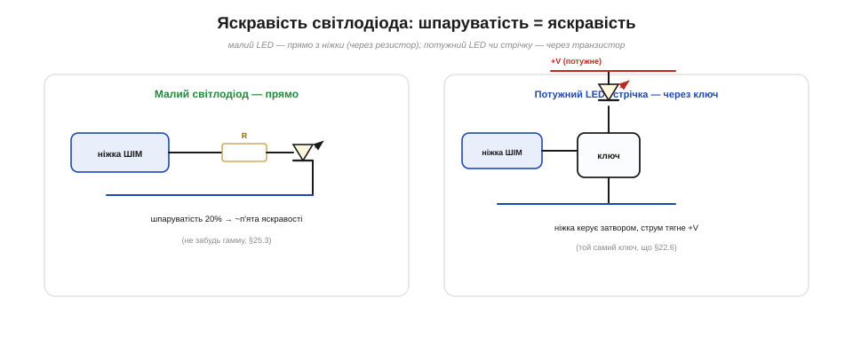
*Рис. 4.7.5.1. Шпаруватість ШІМ = яскравість світлодіода. Малий LED — прямо з ніжки через резистор (§4.4.6), шпаруватість 20% дає приблизно п'яту яскравості (не забудьте гамму, §4.7.3). Потужний світлодіод чи стрічку — через транзистор-ключ: ніжка керує затвором, а струм тягне окреме потужне живлення.*

Це класична «перша» задача ШІМ: світлорегулятор, плавне ввімкнення/вимкнення, індикація рівнем яскравості, RGB-підсвітка (три канали — три кольори, §4.7.2). Усе зводиться до запису потрібного значення шпаруватості; решту — таймер.

У ШІМ-дімування світлодіодів є й тонші переваги. По-перше, воно **зберігає колір**: коли світлодіод увімкнено, він горить на штатному струмі — лише меншу частку часу, тож відтінок не «пливе». А «аналогове» затемнення (просто менший струм) у багатьох світлодіодів зсуває колірну температуру — світло жовтішає чи синішає. По-друге, частоту дімування беруть вищою (понад кілогерц) не лише проти видимого мерехтіння, а й щоб уникнути **смуг на відео**: камери з повільнішим «затвором» вловлюють навіть непомітне оку миготіння як темні смуги на записі.

Якщо взяти **три** канали ШІМ — на червоний, зелений і синій світлодіоди — і змішати їхні яскравості, отримаємо майже **будь-який колір**: людське око сприймає три промені як один відтінок (адитивне змішування, як на екрані). Тут особливо важлива гамма-корекція з §4.7.3, причому **окремо для кожного** каналу — інакше переходи між кольорами виглядають брудно, а білий «пливе» в якийсь відтінок. Саме так працюють адресні стрічки WS2812 та RGB-підсвітки: три шпаруватості на піксель — і ціла палітра.

Для **потужних** світлодіодів (одиниці ват) одного резистора замало — він грубий і марнує енергію на тепло. Беруть **драйвер стабілізованого струму** й керують ним через ШІМ: світлодіод стабільний, коли крізь нього тече точно заданий струм, а не «яка вийде» напруга. ШІМ і тут перемагає плавне зниження струму, зберігаючи колір та ккд у кожному імпульсі й змінюючи лише їхню частку в часі.

### Швидкість мотора

Аналогічно керують **швидкістю** колекторного двигуна постійного струму. Його оберти приблизно пропорційні **середній напрузі** на ньому, а її задає шпаруватість: більша шпаруватість — вища середня напруга — швидше крутиться. Та мотор споживає струм, набагато більший за те, що дає ніжка, тож його завжди вмикають через **транзистор-ключ**, ще й із **флайбек-діодом** — бо мотор індуктивний (§4.4.6).

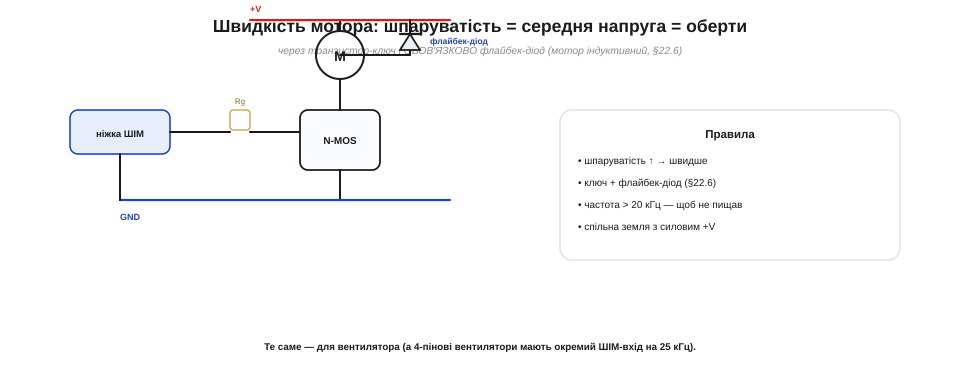
*Рис. 4.7.5.2. Шпаруватість = середня напруга = оберти мотора. Схема обов'язкова: ніжка ШІМ → транзистор-ключ → мотор, а паралельно мотору — **флайбек-діод** (мотор індуктивний, §4.4.6). Частоту беруть понад 20 кГц, щоб мотор не пищав; земля мікроконтролера й силового живлення — спільна. Те саме — для вентилятора.*

> 🔧 **Навіщо це.** Для мотора (і будь-якого індуктивного навантаження) запам'ятайте трійцю обов'язкового: **транзистор-ключ + флайбек-діод + спільна земля**. Пропустите діод — викид напруги (§4.4.6) спалить транзистор; забудете спільну землю — ключ не «бачитиме» сигналу. А частоту ШІМ беріть **вище за поріг чутності** (понад ~20 кГц), інакше мотор неприємно свистітиме на частоті ШІМ. Ці три речі рятують більшість «чому мій мотор не працює».

Дві важливі тонкощі моторного ШІМ. Перша: ШІМ дає кращий **момент на малих обертах**, ніж просте зниження напруги. Навіть за шпаруватості 20% мотор у моменти «увімк.» отримує **повну** напругу й повний ривок струму — тож має силу зрушити, тоді як постійні занижені 20% напруги ледве крутили б його. Друга: щоб мотор крутився в **обидва** боки, одного ключа замало — потрібен **H-міст** (чотири транзистори), що вміє подати на мотор напругу будь-якої полярності; його гілками керують комплементарною ШІМ із мертвим часом (§4.7.2), щоб уникнути наскрізного КЗ.

Окремо варто згадати **4-контактні вентилятори** (ті, що в комп'ютерах): у них ШІМ-керування виведено на окремий провід зі стандартною частотою близько 25 кГц — навмисно вище за поріг чутності, щоб вентилятор не свистів. Ще один провід (**tach**) повертає імпульси обертів, тому контролер не лише задає швидкість, а й **бачить** реальну — виходить замкнена петля керування охолодженням, а не «вистрелив і забув».

### Сервопривід: ширина імпульсу = кут

Сервопривід (моделістський «серво») керується ШІМ, **але по-особливому**. Тут важлива не «середня» напруга, а **ширина** конкретного імпульсу. Серво очікує імпульси з періодом 20 мс (частота 50 Гц), і **ширина** кожного кодує бажаний кут: 1 мс — крайнє положення (0°), 1.5 мс — центр (90°), 2 мс — інше крайнє (180°). Внутрішня електроніка серво сама вимірює цю ширину й переводить вал у відповідний кут.

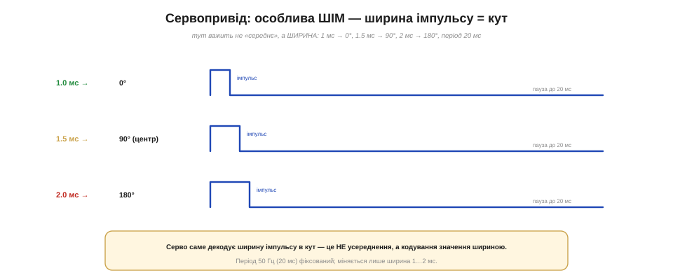
*Рис. 4.7.5.3. Серво — особлива ШІМ: значення кодоване **шириною** імпульсу, а не усередненням. Період фіксований 20 мс (50 Гц), а ширина 1.0 мс → 0°, 1.5 мс → 90°, 2.0 мс → 180°. Серво саме декодує ширину в кут. Це не «середня потужність», а **кодування значення тривалістю**.*

Це важлива концептуальна відмінність: у дімера чи мотора ми покладалися на **усереднення**, а серво **зчитує тривалість** конкретного імпульсу. З боку коду все однаково просто: задаєш потрібну ширину (зазвичай через готову бібліотеку серво чи ту ж апаратну ШІМ на 50 Гц), і вал встановлюється в потрібний кут. Серво — приклад того, що «ШІМ» ширше, ніж «середнє»: іноді цінна сама **ширина** як носій інформації.

Кілька слів про різновиди серво. Стандарт «50 Гц, 1–2 мс» прийшов із радіокерованих моделей і став майже загальноприйнятим, але конкретні серво часто розуміють і ширший діапазон (приблизно 0.5–2.5 мс) для повного кута. Існують і **серво безперервного обертання**: у них ширина імпульсу задає вже не кут, а **швидкість і напрям** обертання (1.5 мс — стоп, більше — в один бік, менше — в інший). Тому, працюючи з конкретним серво, варто звірятися з його описом — точні межі ширини й поведінка різняться.

З боку коду серво найпростіше крутити через готову бібліотеку (`Servo`): задаєш кут у градусах, а вона сама переводить його в потрібну ширину імпульсу на 50 Гц. Під капотом — та сама апаратна ШІМ, лише з «незручними» для дімування параметрами (низька частота, вузький робочий діапазон ширини). Серво — гарне нагадування, що «ШІМ» і «дімування» не синоніми: один і той самий механізм таймера обслуговує зовсім різні задачі.

### Керування потужністю: лінійно й ощадно

Найзагальніше застосування — керування **потужністю** навантаження: нагрівача, лампи, помпи. Тут є приємний факт: оскільки ШІМ дає **повну** потужність частку часу й нуль решту, **середня потужність = шпаруватість × повна потужність** — рівно лінійно. Це краще, ніж гасити напругу резистором: по-перше, лінійно (легко рахувати), по-друге, **ощадно** — транзистор завжди повністю відкритий чи закритий, тож майже не гріється (§4.7.1), і вся потужність іде в навантаження, а не розсіюється теплом на регуляторі.


*Рис. 4.7.5.4. Середня потужність прямо пропорційна шпаруватості: 50% → половина потужності, 30% → третина. Це і лінійно (легко рахувати), і ощадно (ключ, а не резистор, майже не гріється). Для низьковольтного — транзистор + ШІМ; для мережі ~220 В — твердотільне реле з повільною ШІМ (цілими півперіодами).*

Одне застереження: для **мережевого** (~220 В) навантаження звичайний транзистор і кілогерцова ШІМ не годяться. Там беруть **твердотільне реле** (SSR) і повільну ШІМ — вмикають і вимикають навантаження **цілими півперіодами** мережі (пакетне керування з перемиканням у нулі). Принцип той самий — керувати часткою часу «увімкнено» — лише на іншій, значно повільнішій «частоті» й через відповідний комутатор.

Керування потужністю рідко буває «навмання» — частіше це **замкнена петля**. До нагрівача додають давач температури, і код підлаштовує шпаруватість, тримаючи задану температуру: холодно — більше потужності, нагрілося — менше. Виходить простий, але справжній **термостат**. Цікаво, що для теплових навантажень частота ШІМ може бути дуже **низькою** — секунди й навіть хвилини, — бо теплова інерція величезна (нагрівач не охолоне за секунду). Тому мережевими нагрівачами й керують повільним пакетним перемиканням: швидка ШІМ там і не потрібна, і шкідлива.

ШІМ корисна тут і ще одним — **плавним пуском**. Лампа розжарювання чи мотор у момент вмикання беруть величезний кидок струму (холодна нитка чи нерухомий ротор). Якщо ж поступово піднімати шпаруватість від нуля до повної за частку секунди, цей кидок розтягується в часі й навантаження «розганяється» м'яко — менше зношується само й менше навантажує живлення. Той самий апаратний fade із §4.7.2 для цього й годиться.

### Універсальний патерн: усе сильніше за світлодіод — через ключ

Ви вже, мабуть, помітили спільне в моторі, потужному світлодіоді й нагрівачі: усі вони вмикаються **через транзистор-ключ**. Це й є універсальний патерн застосування ШІМ до будь-якого потужного навантаження.

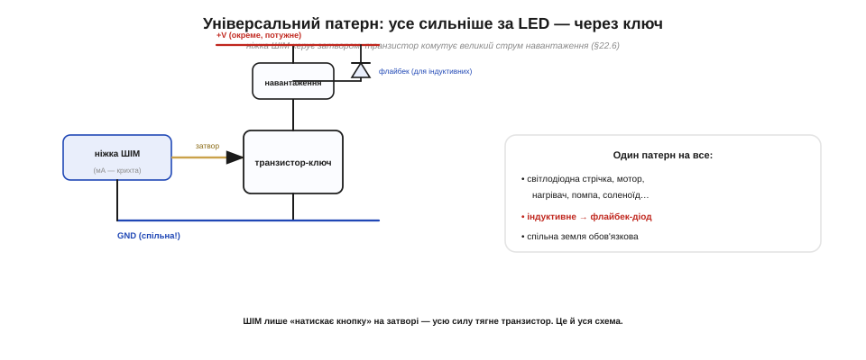
*Рис. 4.7.5.5. Один патерн на все потужне: ніжка ШІМ керує **затвором** транзистора (крихта струму), а транзистор комутує великий струм навантаження з окремого живлення (§4.4.6). Для індуктивних (мотор, соленоїд, помпа) — обов'язковий флайбек-діод; земля спільна. ШІМ лише «натискає кнопку» на затворі, силу тягне транзистор.*

> 🔧 **Навіщо це.** Запам'ятайте як шаблон: **ШІМ-ніжка → транзистор-ключ → навантаження**, плюс флайбек-діод для всього індуктивного й спільна земля. Ніжка дає лише керівний сигнал на затвор (мікроампери-міліампери), а весь робочий струм — світлодіодної стрічки, мотора, нагрівача — тягне транзистор з окремого, потужного живлення. Ніколи не вантажте саму ніжку понад її межу (§4.4.6): між нею й силою завжди має стояти ключ.

Ще кілька практичних штрихів до ключа. Найпростіший варіант — **нижній** ключ (транзистор між навантаженням і землею); коли ж навантаження має лишатися «прив'язаним» до землі, потрібен складніший **верхній** ключ. Для прямого керування з 3.3-вольтової ніжки беруть **«логічний»** MOSFET, що повністю відкривається вже від такого низького рівня на затворі, — звичайний може відкритися не повністю й гріться. А для потужних або дуже швидких ключів між ніжкою й затвором ставлять **драйвер затвора**: він дає сильний струм, щоб швидко «перекинути» затвор і зменшити втрати на перемиканні. Для перших кроків досить логічного N-MOS нижнім ключем.

Про сам **вибір** ключа: для слабких навантажень годиться біполярний транзистор, але він керується **струмом** бази й має помітне падіння напруги. Для потужних майже завжди беруть **MOSFET** — ним керує напруга затвора (майже без струму в усталеному стані), а у відкритому стані він поводиться як малий опір, тож гріється менше. Тому в силових ключах ШІМ панує саме MOSFET, і всі приклади цієї теми мають на увазі саме його.

### Карта застосувань

Зведімо все докупи — одна ідея ШІМ породжує десятки застосувань, кожне зі своїм типовим налаштуванням.

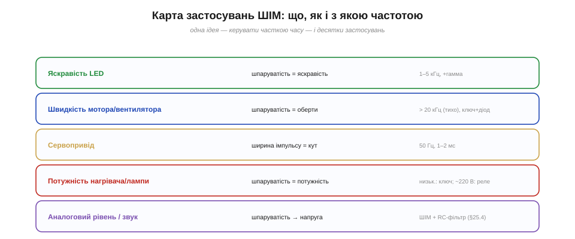
*Рис. 4.7.5.6. **Яскравість LED**: шпаруватість = яскравість, 1–5 кГц, + гамма. **Швидкість мотора/вентилятора**: шпаруватість = оберти, > 20 кГц, ключ+діод. **Сервопривід**: ширина = кут, 50 Гц, 1–2 мс. **Потужність нагрівача**: шпаруватість = потужність, низьк. — ключ, мережа — реле. **Аналог/звук**: шпаруватість → напруга через RC-фільтр (§4.7.4).*

**Порахуймо: швидкість мотора й потужність нагрівача.**

```
Мотор 12 В через N-MOS, ШІМ 25 кГц (тихо):
  шпаруватість 50% → середня напруга ≈ 6 В  → приблизно половина обертів
  шпаруватість 80% → середня напруга ≈ 9.6 В → майже повна швидкість

Нагрівач на 100 Вт:
  шпаруватість 30% → середня потужність = 0.30 × 100 = 30 Вт  (лінійно)
  шпаруватість 70% → 70 Вт
→ керуємо плавно й майже без втрат на регуляторі.
```

Отже, ШІМ — це універсальний інструмент керування: шпаруватість задає **яскравість** світлодіода, **швидкість** мотора чи вентилятора, **потужність** нагрівача — лінійно й ощадно; а сервопривід використовує ШІМ по-особливому, кодуючи кут **шириною** імпульсу. Усе потужне вмикають за єдиним патерном — **через транзистор-ключ** (з флайбек-діодом для індуктивного), а ніжка лише подає керівний сигнал. У всіх цих застосуваннях ШІМ давала **імітацію** аналога. Та в ESP32 є й **справжній** цифро-аналоговий перетворювач, що видає реальну напругу прямо, без миготіння й фільтра. Чим він відрізняється від ШІМ і коли який обирати — тема §4.7.6, до якої й переходимо.

## 4.7.6 Справжній ЦАП (DAC): пряме аналогове значення (проти PWM)

Весь цей розділ ми вчилися **вдавати** аналог цифровою ніжкою: швидко миготіти й покладатися на те, що навантаження побачить **середнє** (§4.7.1). ШІМ — чудовий, дешевий і всюдисущий спосіб, але це все-таки **імітація**: на ніжці насправді стрибає 0↔макс, а рівна напруга з'являється лише після усереднення (оком, мотором чи RC-фільтром, §4.7.4) і завжди з якоюсь пульсацією. А що, коли потрібна **справжня** аналогова напруга — рівно 1.37 В на виводі, негайно, без миготіння й фільтра? Саме для цього існує **цифро-аналоговий перетворювач (ЦАП, *digital-to-analog converter, DAC*)** — окремий апаратний блок, що перетворює число прямо на напругу. У цій завершальній темі розберемо, що таке ЦАП, як він влаштований, що вміє ЦАП всередині ESP32 — і, головне, **коли обирати ЦАП, а коли ШІМ**.

### ЦАП проти ШІМ: справжня напруга, а не усереднення

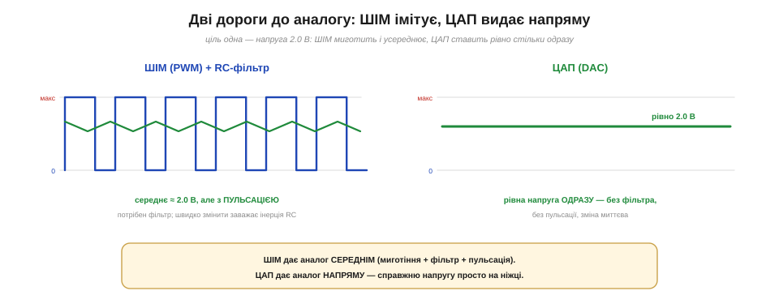
*Рис. 4.7.6.1. Та сама ціль — 2.0 В — двома шляхами. ШІМ (ліворуч) миготить 0↔макс і дає 2.0 В лише як **середнє**: потрібен RC-фільтр, лишається пульсація, а швидку зміну гальмує інерція кола. ЦАП (праворуч) просто **ставить** рівні 2.0 В одразу — без фільтра, без пульсації, зміна миттєва.*

Найкоротше пояснення ЦАП — через контраст із ШІМ. Уявімо, що обом поставили однакову задачу: видати 2.0 В. ШІМ зробить це **в часі** — відкриє ніжку на потрібну частку періоду, повторюючи стрибки 0↔3.3 В; щоб із цього миготіння дістати рівні 2.0 В, потрібен фільтр, і навіть тоді лишиться невелика **пульсація** (§4.7.4), а різко змінити значення заважатиме інерція RC. ЦАП зробить те саме **в напрузі** — він просто **виставить** на ніжці 2.0 В і тримає: рівну, чисту, без жодного миготіння й фільтра. Зміна теж миттєва: записав нове число — напруга перейшла на новий рівень.

Це принципово різні підходи. ШІМ — **широтно-імпульсний** метод: інформація закодована в *тривалості* імпульсу, а аналог виникає лише як наслідок усереднення. ЦАП — **рівневий**: він прямо синтезує потрібний потенціал. Тому там, де важлива чистота сигналу або миттєвість (опорна напруга для іншої схеми, звукова хвиля, керівний сигнал аналоговому вузлу), природніший ЦАП. Там, де ми й так керуємо потужним навантаженням, яке само інтегрує (світлодіод, мотор, нагрівач), зручніший і дешевший ШІМ.

> 🔧 **Навіщо це.** Коли потрібна **опорна чи задавальна напруга** — виставити поріг для компаратора, змістити робочу точку, дати «уставку» аналоговому регуляторові — бери ЦАП: він дає чисте, стабільне значення без жодного фільтра й пульсації. А для дімера чи мотора лишайся на ШІМ — там він кращий і дешевший. Питання, яке варто ставити щоразу: мені потрібна **справжня напруга** чи просто **середня потужність**? Перше — ЦАП, друге — ШІМ.

### Що таке ЦАП: число стає напругою

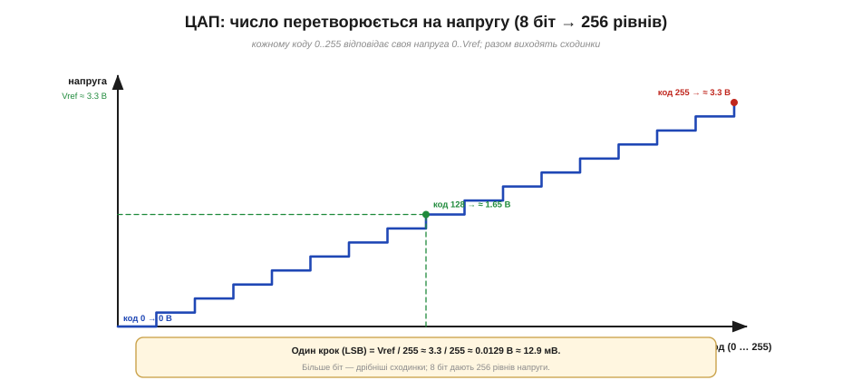
*Рис. 4.7.6.2. Передавальна характеристика ЦАП: код → напруга. 8 біт = 256 рівнів від 0 до Vref; сусідні рівні відстоять на один **крок (LSB)** ≈ Vref/255 ≈ 12.9 мВ. Код 0 → 0 В, 128 → ≈ 1.65 В, 255 → ≈ 3.3 В.*

ЦАП робить одну річ: бере ціле число (код) і видає пропорційну йому напругу. Якщо ЦАП **N-бітний**, код пробігає 0…2ᴺ−1, а напруга — від 0 до опорної (*reference*, Vref). Передавальна характеристика — **сходинки**: кожному коду відповідає свій рівень, а сусідні рівні відстоять на один **крок (LSB, *least significant bit*)**. Формули прості:

```
Vout       = Vref × код / (2ᴺ − 1)
крок (LSB) = Vref / (2ᴺ − 1)
```

ЦАП в ESP32 — **8-бітний**, тобто 2⁸ = **256 рівнів**. За Vref ≈ 3.3 В крок дорівнює ≈ 3.3 / 255 ≈ 0.0129 В ≈ **12.9 мВ**. Це й є «зернистість» ЦАП: тонше за ≈ 13 мВ він виставити не може — між сусідніми сходинками значень просто немає. Потрібен дрібніший крок — потрібно більше біт: 10-бітний ЦАП дав би 1024 рівні (крок ~3 мВ), 12-бітний — 4096. Тут видна перша межа вбудованого ЦАП ESP32: лише 8 біт, тоді як ШІМ-блок (LEDC) уміє й 12, і 16 біт «ефективної» роздільності (§4.7.3). Зате ЦАП дає **справжню** напругу, а не усереднену.

> 🔧 **Навіщо це.** Роздільність ЦАП — це **ціна одного кроку**. Якщо треба виставляти напругу з точністю, скажімо, 5 мВ, 8-бітного ЦАП з кроком ~13 мВ не вистачить — бери зовнішній ЦАП на більше біт або інший підхід. Тож, плануючи аналоговий вихід, завжди питай: «який крок дає мій ЦАП і чи влізе в нього потрібна точність?» — це рятує від розчарування «чому напруга стрибає грубо».

### Як влаштований ЦАП: драбина R-2R

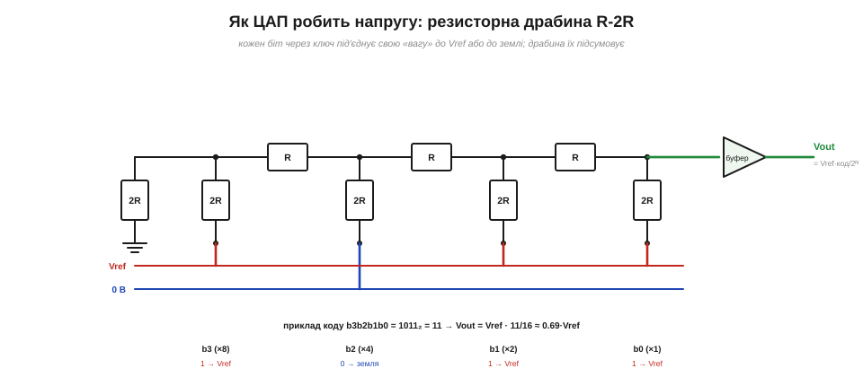
*Рис. 4.7.6.3. Резисторна драбина R-2R — серце багатьох ЦАП. Кожен біт через ключ під'єднує свою «вагу» до Vref (1) або до землі (0); драбина з двох номіналів R і 2R підсумовує двійкові ваги у напругу Vout = Vref·код/2ᴺ, яку далі знімає буфер. Відношення R:2R = 1:2 технологія тримає точно — тому саме R-2R.*

Звідки ж усередині береться напруга, точно пропорційна коду? Класична відповідь — **резисторна драбина R-2R (*R-2R ladder*)**. Це мережа з резисторів лише двох номіналів — R і 2R, — де кожен біт коду через свій **ключ** підключається або до Vref (якщо біт = 1), або до землі (якщо біт = 0). Драбину побудовано так, що внесок кожного біта в загальну напругу рівно **вдвічі** більший за внесок сусіда праворуч: старший біт важить ×128, наступний ×64, …, молодший ×1. Отже, драбина **підсумовує двійкові ваги** — так само, як і саме двійкове число. На виході дістаємо Vout = Vref × код / 2ᴺ, і далі сигнал зазвичай проводять через **буфер** (операційний підсилювач-повторювач), щоб слабке джерело драбини могло живити навантаження.

Чому саме R-2R, а не «прості» зважені резистори (R, R/2, R/4, …)? Бо зважена схема вимагала б номіналів із величезним розкидом (для 8 біт — від R до R/128), а **точно** витримати таке співвідношення на кристалі важко. Драбина R-2R обходиться **двома** номіналами у відношенні рівно 1:2 — а саме *відношення* (не абсолютні значення) напівпровідникова технологія тримає дуже точно. Тому R-2R десятиліттями лишалася основою ЦАП. Існує й інша архітектура — **резисторний рядок (*resistor string*)**: 2ᴺ однакових резисторів послідовно ділять Vref на рівні ступені, а код просто вибирає потрібний відвід ключем. Вона гарантовано **монотонна** (зі зростанням коду напруга ніколи не знижується), проте для багатьох біт потребує дуже багато резисторів. Вбудовані ЦАП мікроконтролерів — компроміс між цими ідеями; для нас важливий сам принцип: **код → зважена сума → напруга**.

### ЦАП в ESP32: два канали на GPIO25 і GPIO26

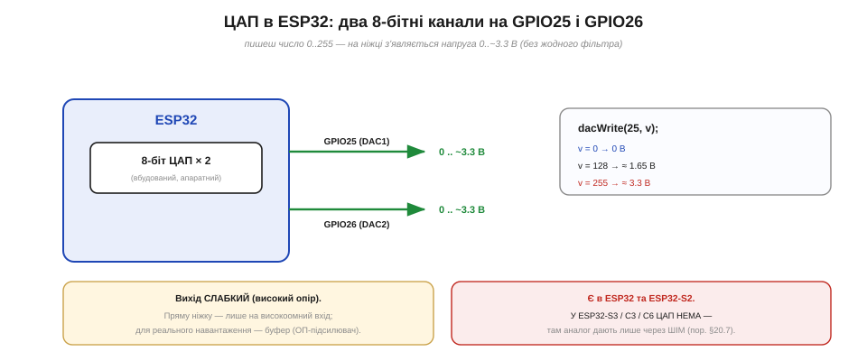
*Рис. 4.7.6.4. ЦАП в ESP32: два 8-бітні канали на GPIO25 (DAC1) і GPIO26 (DAC2). `dacWrite(пін, 0..255)` одразу дає 0..~3.3 В. Вихід слабкий — для навантаження потрібен буфер. Є в ESP32 і S2; у S3/C3/C6 ЦАП нема — там лише ШІМ.*

У класичного ESP32 є **два** незалежні 8-бітні ЦАП, жорстко прив'язані до конкретних ніжок: **GPIO25 (DAC1)** і **GPIO26 (DAC2)**. На відміну від ШІМ, який матриця виводів дозволяє скерувати майже на будь-який пін (§4.4, §4.7.2), ЦАП «живе» лише на цих двох — це апаратні виводи самого блоку. У Arduino керування гранично просте:

```
dacWrite(25, 128);   // GPIO25 → ≈ 1.65 В (половина шкали)
dacWrite(26, 255);   // GPIO26 → ≈ 3.3 В (максимум)
```

— один виклик, число 0…255, і на ніжці одразу стоїть відповідна напруга. Жодних періодів, шпаруватості й фільтрів.

Дві важливі практичні межі. Перша — **слабкий драйв**: вихід ЦАП має помітний внутрішній опір, тому до ніжки можна підключати лише **високоомні** входи (вхід АЦП, затвор транзистора, вхід підсилювача). Спробуєте живити з неї світлодіод чи навушник напряму — напруга «просяде» й точність зникне; для реального навантаження між ЦАП і навантаженням ставлять **буфер** (операційний підсилювач у режимі повторювача). Друга межа — **сімейство**: справжній ЦАП є лише в класичному **ESP32** та в **ESP32-S2**. У новіших **ESP32-S3, C3, C6** його прибрали зовсім — там аналогову напругу доводиться робити **тільки** через ШІМ + RC-фільтр (пор. огляд сімейства §4.1.7). Тому, обираючи чип під проєкт, варто заздалегідь перевірити наявність ЦАП.

> 🔧 **Навіщо це.** Перш ніж розраховувати на `dacWrite`, перевір дві речі: **(1)** чи є ЦАП у твоєму чипі — на S3/C3/C6 його нема, і код просто не дасть аналогу; **(2)** чи витримає навантаження слабкий вихід — якщо це не високоомний вхід, став буфер. Ці дві перевірки економлять години відлагодження «чому напруга не та».

### ЦАП для звуку й аналогових сигналів

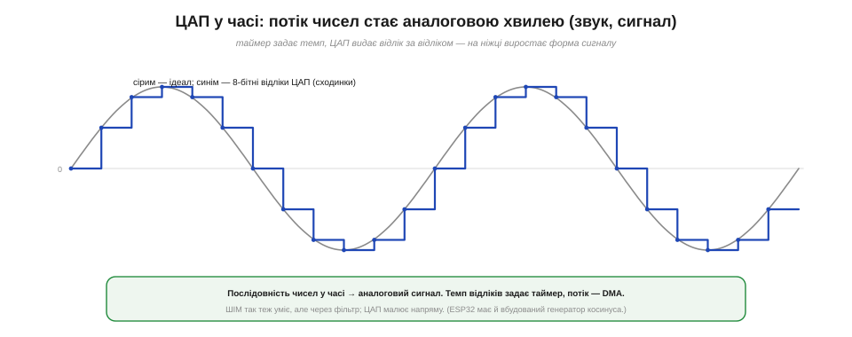
*Рис. 4.7.6.5. ЦАП у часі: потік чисел стає хвилею. Сірим — ідеальний сигнал, синім — 8-бітні відліки ЦАП (сходинки sample-hold). Темп відліків задає таймер, потік подає DMA. Так ЦАП напряму синтезує звук чи довільну форму — там, де ШІМ потребував би фільтра.*

Найцікавіше ЦАП показує себе **в часі**. Якщо швидко, одне за одним, записувати в нього числа, що описують форму сигналу, на ніжці з'явиться справжня **аналогова хвиля**. Потрібна синусоїда — подавайте відліки синуса; потрібен звук — подавайте оцифровані відліки звуку. Темп, з яким їх виставляють, — це **частота дискретизації** (докладно — наступний розділ); його задає таймер (§4.6), а сам потік відліків зручно «лити» через **DMA** (*direct memory access*, прямий доступ до пам'яті), щоб процесор не відволікався на кожен відлік. Так 8-бітний ЦАП ESP32 здатний відтворювати прості тони й навіть мову — не найвищої якості (256 рівнів грубуваті для гучномовця), але цілком розбірливо. ESP32 навіть має апаратний **генератор косинуса (*cosine wave generator, CW*)** прямо на ЦАП — він сам, без участі коду, генерує синусоїду заданої частоти.

Тут особливо видна різниця з ШІМ. Щоб дати таку ж хвилю через ШІМ, довелося б увесь час змінювати шпаруватість і ще й фільтрувати результат RC-колом (§4.7.4) — «бідняцький ЦАП». ЦАП же малює напряму: записав відлік — отримав рівень, без фільтра й пульсації. Для звуку, опорних напруг і керівних сигналів аналоговим вузлам це велика перевага. Платиш за неї лише 8 бітами роздільності та двома доступними каналами.

### Коли ЦАП, а коли ШІМ


*Рис. 4.7.6.6. Коли що: ЦАП дає справжню чисту напругу одразу (але 2 канали, 8 біт, слабкий драйв, не на всіх чипах); ШІМ імітує миготінням (зате будь-яка ніжка, багато каналів, вища роздільність, тягне силу). ЦАП — для звуку й опорних напруг; ШІМ — для яскравості, моторів, потужності.*

Звівши все докупи, отримаємо чітке правило вибору. Обирайте **ЦАП**, коли потрібна *справжня, чиста, миттєва* напруга і каналів треба небагато: опорна/задавальна напруга (поріг компаратора, уставка регулятора), генерація звуку чи довільної форми, керівний сигнал аналоговому вузлу. Обирайте **ШІМ**, коли керуєте *потужністю* навантаження, що само інтегрує (яскравість, мотор, нагрівач), коли потрібні *багато каналів* чи *вища роздільність*, або коли чип просто *не має* ЦАП. Часто вони й співіснують: ЦАП дає тонку опорну напругу, а ШІМ тим часом крутить мотор. Коротко: **ЦАП — пряма дорога до аналогу, ШІМ — обхідна, та дешева й потужна**; розуміючи обидва, завжди дібрати інструмент під задачу нескладно.

### Звідки взявся ЦАП: від ідеї PCM до цифрового звуку

За буденним `dacWrite()` стоїть одна з найбільших ідей XX століття — думка, що будь-який аналоговий сигнал можна звести до **потоку чисел**, а потім точно відтворити назад. Щоб ЦАП мав що перетворювати, спершу хтось мав повірити, що звук, голос, хвилю взагалі варто кодувати числами.

Першим це чітко сформулював британський інженер **Алек Рівз (Alec Harley Reeves)**. 1937 року, працюючи в паризькій лабораторії компанії ITT, він винайшов **імпульсно-кодову модуляцію (*pulse-code modulation, PCM*)** — спосіб передавати звук не безперервним сигналом, а послідовністю чисел: сигнал регулярно вимірюють і кодують двійковими числами. Рівз подав французький патент 1938 року (US-патент — 1942-го). Ідея була блискучою, але страшенно випереджала час: щоб кодувати й декодувати числа на льоту, у 1930-х існувала лише громіздка лампова техніка, тому практичної системи Рівз побудувати не зміг. PCM лишилася геніальним кресленням, що чекало на елементну базу.

Теоретичний фундамент під неї підвели в **Bell Labs**. У знаменитій статті 1948 року «The Philosophy of PCM» **Бернард Олівер (Bernard Oliver)**, **Джон Пірс (John Pierce)** і **Клод Шеннон (Claude Shannon)** показали, *скільки* саме вимірів і біт треба, щоб без втрат відновити сигнал, — і пов'язали PCM з теорією дискретизації (про неї — наступний розділ). Тепер бракувало лише практичного способу перетворювати числа на напругу й назад, тобто ЦАП і АЦП.

Цей спосіб дав **транзистор** (Bell Labs, 1947), а згодом — інтегральна схема. Тоді PCM зійшла з паперу: 1962 року телефонна система Bell запустила **T1** — першу комерційну цифрову лінію, де голос передавався як потік PCM-чисел, які на кінцях перетворювали ЦАП і АЦП. Тоді ж усталилася й класична архітектура перетворювача — **драбина R-2R** (резисторні «декодувальні мережі» формалізували в середині 1950-х). Жодна людина не «винайшла ЦАП» поодинці: це щабелі колективної праці — *ідея* Рівза, *теорія* Шеннона з колегами, *елементна база* транзистора, *інженерія* телефонних лабораторій.

Останній поштовх дала **музика**. У 1970-х цифровий звук вийшов зі студій, а 1982 року **компакт-диск** (спільна розробка Sony і Philips) приніс ЦАП у кожну оселю: програвач CD читав числа з диска й драбиною R-2R перетворював їх на музику. Саме масовий «цифровий звук» зробив якісні ЦАП доступними й дешевими. Скромний 8-бітний перетворювач на ніжці GPIO25 — прямий нащадок цієї довгої лінії: від паризького патенту Рівза через телефонні станції до CD-програвача й тепер до вашого ESP32.

**Приклад (крок 8-бітного ЦАП ESP32).** Який рівень напруги дасть код 100 і яка «зернистість» перетворювача?

```
Vref ≈ 3.3 В,  N = 8  →  2⁸ = 256 рівнів
крок (LSB) = 3.3 / 255 ≈ 0.0129 В ≈ 12.9 мВ
код 100 → Vout = 3.3 × 100 / 255 ≈ 1.29 В
код 101 → Vout ≈ 1.31 В      (різниця — один крок, ≈ 13 мВ)
```
Тонше за ≈ 13 мВ цей ЦАП виставити не може: між кодами 100 і 101 проміжних напруг немає. Треба дрібніше — потрібен ЦАП на більше біт.

Отже, ЦАП — це **пряма** дорога від числа до напруги: жодного миготіння, фільтра чи пульсації, лише рівний потенціал, який можна змінити вмить. Платиш за неї небагатьма каналами (в ESP32 лише два), 8 бітами роздільності, слабким виходом і відсутністю ЦАП у частині чипів сімейства. Там, де це прийнятно (опорні напруги, звук, керівні сигнали), ЦАП незамінний; там, де важлива потужність, — лишається ШІМ. На цьому розмову про перетворення «цифра → аналог» майже завершено — лишилося одне особливо яскраве застосування, що зводить докупи майже весь розділ: **адресні світлодіоди**.

## 4.7.7 Адресні світлодіоди: ШІМ усередині кожного пікселя (логічний протокол поверх одного дроту)

Упродовж цього розділу ШІМ керував **одним** світлодіодом: одна ніжка, одна шпаруватість, одна яскравість (§4.7.1). А що, якщо світлодіодів — **сотня**, кожен має світити **своїм** кольором і щомиті змінювати його? Гірлянда, екран із бахроми вогників, підсвітка клавіатури, «розумна» стрічка за телевізором — усе це десятки й сотні різнокольорових точок, кожна сама по собі. Як керувати ними всіма? Відповідь — **адресні світлодіоди** (їх часто звуть за найпопулярнішим чипом — **WS2812**, або торговою назвою **NeoPixel**). В основі — гарний інженерний трюк, що зводить докупи майже все, чого ми навчилися в Модулі 4: ШІМ, протокол на одному дроті, точний таймінг, переривання й живлення.

Спершу варто відрізнити їх від **звичайних** RGB-стрічок, які теж продають у крамницях. Стара «аналогова» RGB-стрічка має **чотири** дроти — спільний плюс і три лінії R, G, B — і всі світлодіоди на ній світять **одним** кольором водночас: регулюєш три канали ШІМ (§4.7.5), а змінюється вся стрічка цілком. Це дешево й годиться для рівної підсвітки, але «бігти» хвилею кольору чи малювати картинку така стрічка не вміє — у неї немає поняття **окремого** пікселя. Адресна стрічка — інша річ: кожен світлодіод **адресується** окремо (звідси й назва), і саме тому з неї виходять і ефекти, і екрани, і анімація. Ціна цієї свободи — складніший спосіб керування, до якого ми зараз і дійдемо.

### Чому «у лоб» не виходить

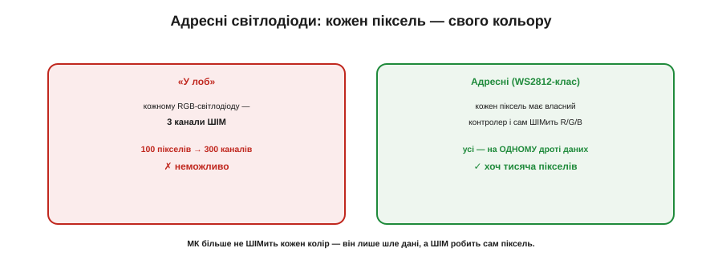
*Рис. 4.7.7.1. Два підходи. «У лоб»: кожному RGB-світлодіоду — три канали ШІМ; 100 пікселів = 300 каналів — неможливо. Адресні: кожен піксель має власний контролер і сам ШІМить R/G/B, а всі сидять на **одному** дроті даних — хоч тисяча пікселів.*

Спробуймо найочевидніше рішення. RGB-світлодіод — це три кристали (червоний, зелений, синій) в одному корпусі; щоб задати довільний колір, треба керувати **яскравістю кожного** — три канали ШІМ на один світлодіод (§4.7.1, §4.7.5). Для одного — гаразд. Але сто світлодіодів — це вже **300 каналів** ШІМ і відповідні дроти. У ESP32 стільки ніжок немає, та й апаратний ШІМ-блок (LEDC) дає лічені канали (§4.7.3). Підхід «кожному світлодіоду — свої дроти» розсипається вже на десятку. Потрібна зовсім інша ідея.

Ідея ось яка: **хай кожен світлодіод сам себе ШІМить**. Не мікроконтролер крутить триста каналів, а кожен піксель отримує своє число-колір і **власним** вбудованим контролером керує трьома субсвітлодіодами. Тоді МК звільняється від ШІМ зовсім — він лише **передає дані**, а всі пікселі висять на **одному** дроті. Саме так влаштовані адресні світлодіоди; далі розберемо цей трюк шар за шаром.

### ШІМ переїхав усередину пікселя

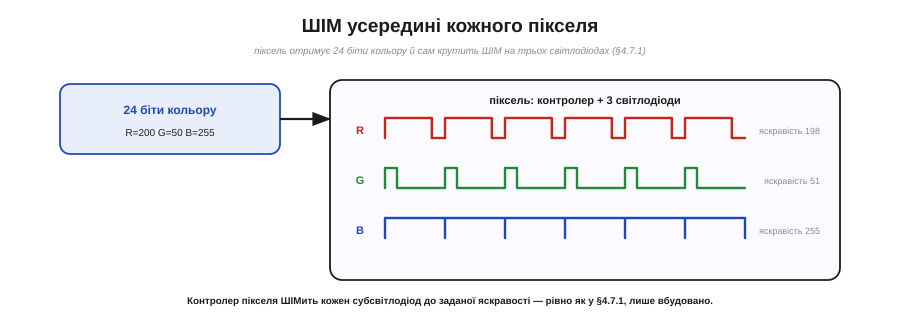
*Рис. 4.7.7.2. ШІМ усередині пікселя. МК шле 24 біти кольору (8+8+8 на R/G/B); вбудований контролер пікселя широтно-імпульсно запалює кожен субсвітлодіод до заданої яскравості — рівно той самий ШІМ із §4.7.1, лише вбудований у сам світлодіод.*

Розгляньмо один піксель WS2812 ближче. Це не просто світлодіод, а кристал **із власним мікроскопічним контролером** у тому самому корпусі. Контролер приймає **24 біти** кольору — по 8 біт на червоний, зелений і синій канал (класичний 24-бітний колір, понад 16 мільйонів відтінків) — і робить рівно те, що ми вивчали в §4.7.1: **широтно-імпульсно** керує яскравістю кожного з трьох субсвітлодіодів. Хочемо тепло-білий — шлемо, наприклад, (255, 180, 90); піксель внутрішнім ШІМ запалює червоний на повну, зелений приблизно на 70 %, синій на 35 % — і очі бачать теплий відтінок.

Це ключова думка теми: **ШІМ нікуди не подівся — він просто переїхав із мікроконтролера всередину кожного пікселя**. Раніше періоди й шпаруватість рахував LEDC у ESP32; тепер це робить вбудований контролер у самому світлодіоді, на власній частоті (зазвичай кілька кілогерц — достатньо, щоб очі не помічали мерехтіння, §4.7.1). МК більше не зайнятий миготінням — його єдина турбота тепер **доставити** кожному пікселю його 24 біти. До речі, класична пастка: багато WS2812 чекають байти в порядку **G-R-B**, а не R-G-B — переплутаєш і червоне стане зеленим; бібліотека це приховує, але знати корисно.

> 🔧 **Навіщо це.** Запам'ятай поділ праці: **МК шле числа, піксель робить ШІМ**. Через це адресним світлодіодом керувати концептуально простіше, ніж трьома окремими каналами ШІМ, — ти не задаєш шпаруватість, ти просто кажеш «червоний = 200, зелений = 50, синій = 255», а решта вже не твій клопіт. Уся складність зміщується з *яскравості* на *доставку даних* — і саме там починається найцікавіше.

### Один дріт на всіх: ланцюжок

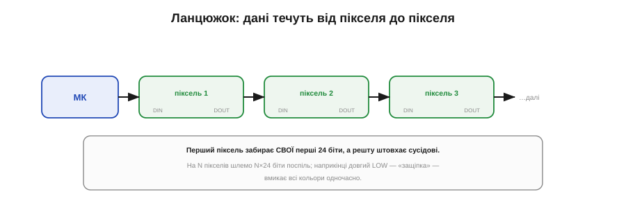
*Рис. 4.7.7.3. Ланцюжок (daisy chain). Вихід DOUT кожного пікселя йде на вхід DIN наступного. Перший піксель забирає СВОЇ перші 24 біти, а решту потоку штовхає далі. На N пікселів МК шле N×24 біти поспіль; завершальний довгий LOW — «скидання» — вмикає всі кольори одночасно.*

Якщо кожному пікселю потрібні його 24 біти, а пікселів сотня — як це передати **одним** дротом? Через **ланцюжок** (*daisy chain*). У кожного пікселя є вхід даних **DIN** і вихід **DOUT**; вихід одного йде на вхід наступного, і так уся стрічка. МК шле довгий потік бітів у перший піксель. Перший піксель робить хитру річ: забирає **собі** перші 24 біти (свій колір), а **решту** потоку пересилає далі — через DOUT до сусіда. Другий піксель так само бере наступні 24 біти собі, решту — далі. І так до кінця стрічки.

Отже, щоб оновити N пікселів, МК шле **N×24 біти** поспіль — кольори від першого пікселя до останнього. Коли потік скінчився, МК тримає лінію в **низькому** стані довше за певний поріг (десятки мікросекунд) — це сигнал **«скидання»** (*reset/latch*): усі пікселі одночасно фіксують отримані кольори й починають їх показувати. У коді це виглядає як один виклик «показати»:

```
strip.setPixelColor(0, 255, 180,  90);  // піксель 0 → теплий білий
strip.setPixelColor(1,   0,   0, 255);  // піксель 1 → синій
strip.show();                           // послати весь потік + скидання
```

Один дріт, скільки завгодно пікселів — лише потік даних довшає.

Є тут і важлива несподіванка: **окремий піксель не можна оновити осібно**. Хоч світлодіоди й «адресні», адреса — це лише позиція в потоці, а не справжня шина з вибором абонента. Щоб змінити колір 50-го пікселя, потрібно **переслати весь потік** від першого до останнього — інакше 50-й просто не дістане своїх бітів. Тому програма тримає в пам'яті **буфер кадру** — масив кольорів усіх пікселів (по 3 байти на кожен): малюєш у ньому потрібну картину, а тоді одним викликом `show()` виливаєш увесь буфер у стрічку. Це та сама ідея кадрового буфера, що й у дисплеїв: спочатку складаємо повний кадр у RAM, потім «показуємо» його цілком.

> 🔧 **Навіщо це.** Звідси три практичні наслідки. По-перше, час оновлення **росте з довжиною**: ~30 мкс на піксель (24 біти × ~1.25 мкс) дають для тисячі пікселів ~30 мс на кадр — тобто стеля близько 30 кадрів за секунду, довша стрічка оновлюється повільніше. По-друге, **порядок має значення**: піксель «не знає» свого номера, він просто бере перші біти, що до нього дійшли, — нумерацію задає лише фізичний порядок у ланцюжку; переплутав напрямок DIN/DOUT — і стрічка мовчить. По-третє, **пам'ять**: буфер кадру коштує 3 байти на піксель, тож 300 пікселів — це майже кілобайт RAM лише під картинку, і це варто закладати в бюджет пам'яті заздалегідь.

### Біти — шириною імпульсу, без лінії такту

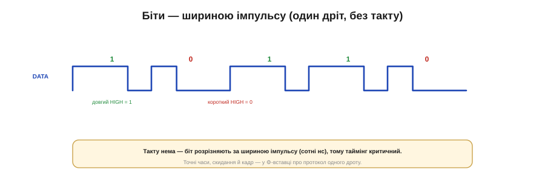
*Рис. 4.7.7.4. Біти кодують **шириною** імпульсу на одному дроті, без окремої лінії такту. Довгий HIGH = «1», короткий HIGH = «0»; вікно біта ~1.25 мкс, часи — сотні наносекунд. Розрізнити «1» і «0» можна лише за тривалістю, тому таймінг критичний.*

Найтонше місце — **як саме** кодуються нулі й одиниці на цьому єдиному дроті. У більшості послідовних протоколів поряд із даними йде окрема лінія **такту**, що каже «ось зараз дивись на дріт». Тут лінія **одна**, такту немає. Тому біт розрізняють **шириною імпульсу**: контролер пікселя вимірює, як **довго** лінія трималася у високому стані в межах одного «вікна» (~1.25 мкс). **Довгий** високий імпульс — це «1»; **короткий** високий — це «0». Інформація закодована не в рівні, а в **тривалості**.

Часи тут дрібні — сотні **наносекунд**, і витримати їх треба точно: сплутав довгий із коротким — піксель прочитає не той біт і колір «попливе». Саме тому WS2812 називають протоколом **«одного дроту на 800 кГц»**: близько 800 тисяч бітів за секунду, кожен — точно вивірений імпульс. Повна механіка — точні часи «1» і «0», тривалість скидання, структура цілого кадру — це окрема тема: **⚙️-вставка «Протокол одного дроту на 800 кГц»** до цієї теми.

### Чому таймінг доручають залізу, а не коду


*Рис. 4.7.7.5. Чому таймінг — для заліза. Біт-бенгінг у коді (ліворуч): переривання краде процесор на мікросекунди, точний таймінг збивається, піксель читає не той біт — глюки кольору. Спеціальний блок RMT чи DMA (праворуч) жене біти із залізно витриманим таймінгом сам, не залежачи від коду й переривань.*

Раз біти кодуються наносекундними імпульсами, виникає спокуса згенерувати їх **у коді** — швидко перемикати ніжку через регістри, як у біт-бенгінгу (§4.4.7). Але тут чатує пастка. Поки код старанно відмірює наносекунди, прилітає **переривання** (§4.5) — таймерне, від Wi-Fi, будь-яке — і на кілька мікросекунд відволікає процесор. Точний таймінг збивається, піксель читає сміття, стрічка спалахує **випадковими** кольорами. На ESP32, де радіомодуль постійно перебиває ядро, чистий програмний біт-бенгінг WS2812 майже приречений (хіба що з **вимкненими** перериваннями на весь час передачі — а це власні проблеми, §4.5.6).

Правильний шлях — **доручити таймінг спеціальному апаратному блокові**. В ESP32 для цього є **RMT** (*remote control* — периферія, задумана для інфрачервоних пультів, але ідеальна для будь-яких точних імпульсних послідовностей); є й варіант через **I²S + DMA**. Такий блок жене біти з бездоганно витриманим таймінгом **сам**, не залежачи від коду й не боячись переривань (§4.5) — а процесор тим часом вільний робити інше. Тому всі робочі бібліотеки адресних світлодіодів під капотом використовують не біт-бенгінг, а RMT чи DMA.

Цікаво, що інженери знайшли й **обхід** усієї цієї таймінгової мороки — ціною зайвого дроту. Існують адресні світлодіоди (клас **APA102**, він же DotStar), у яких **дві** лінії: дані **й** окремий такт. Повертається та сама ідея, що ми відкинули на початку: лінія такту каже «дивись на дріт **зараз**», — і точність часу стає неважливою: жени біти хоч повільно, хоч ривками після переривання, такт усе синхронізує. За це платиш другим дротом і трохи дорожчим чипом, зате керувати можна звичайним апаратним інтерфейсом «дані + такт» (SPI) без жодних наносекунд. Це класичний інженерний компроміс: **один дріт, але жорсткий таймінг** (WS2812) проти **два дроти, але простий таймінг** (APA102). Варто згадати й рідню WS2812 — чип **WS2811**: у нього контролер **окремий** від світлодіодів і керує він не вбудованими, а зовнішніми потужними RGB-вузлами (часто 12-вольтовими) — той самий протокол, інша «начинка». Усі вони вирішують одне завдання: винести ШІМ у піксель, а кольори передати потоком.

> 🔧 **Навіщо це.** Це жива ілюстрація принципу з §4.4.7 і §4.5: **жорсткий реальночасовий таймінг — не для програмного циклу, а для периферії**. Коли наступного разу побачиш, що якийсь протокол вимагає наносекундної точності, не пиши його циклом `digitalWrite` — шукай апаратний блок (RMT, SPI, I²S), що зробить це за тебе. Адресні світлодіоди — найкращий навчальний приклад, чому переривання й біт-бенгінг не дружать.

### Живлення: стрічка — це вже силова електроніка


*Рис. 4.7.7.6. Живлення. Один піксель на повну білизну ≈ 60 мА (3 × 20 мА); 100 пікселів ≈ 6 А — з ніжки МК такого не взяти (§4.4.6). Потрібні окремий блок 5 В, спільна земля, зсув рівнів даних, конденсатор на живленні й резистор на лінії даних.*

Останнє — і часто найбільш недооцінене. Адресні світлодіоди споживають **багато** струму. Один піксель на повну білизну (усі три субсвітлодіоди на максимум) бере близько **60 мА** (три по ~20 мА, §4.4.6). Помножмо: 30 пікселів — майже 2 А, **100 пікселів — близько 6 А**. Це вже не «ніжка мікроконтролера» (звідки беруть лише міліампери, §4.4.6) — це повноцінне силове живлення з окремого блока.

Звідси правила, без яких стрічка або не світиться, або псується. Потрібен **окремий блок живлення 5 В** на потрібні ампери — не намагайтеся живити стрічку з ESP32. Земля МК і земля стрічки мають бути **спільні** (інакше сигнал даних нема відносно чого читати). Дані з ESP32 ідуть на рівні **3.3 В**, а стрічка очікує **5 В** — тому між ними часто ставлять **зсув рівнів** (§4.4.2). На вхід живлення вмикають **конденсатор** (гасить кидок струму під час увімкнення), а на лінію даних — невеликий **резистор** (заспокоює фронти, захищає перший піксель).

Є ще непомітний ефект тих самих **6 ампер**: такий струм, течучи мідними доріжками стрічки, помітно **просаджує напругу по довжині**. Живите довгу стрічку лише з одного кінця — і близькі пікселі світять яскравим білим, а далекі тьмяніють і **жовтіють**: до них 5 В уже не доходять, лишається 4 або 3.5. Засіб відомий — **уприскування живлення** (*power injection*): підводити 5 В і землю не лише на початок, а й у середину та кінець стрічки товстими дротами, щоб струм не мусив проходити всю довжину тонкою доріжкою. Усі ці подробиці — номінали конденсатора й резистора, кількість точок уприскування, перетин дротів, захист — окрема практична тема: **🔌-вставка «Стрічка WS2812-класу»** до цієї теми.

> 🔧 **Навіщо це.** Перш ніж тішитися кольорами, **порахуй струм**: кількість пікселів × 60 мА — і добери блок живлення із запасом. Найчастіша помилка новачка — живити метрову стрічку з USB ESP32: перші кілька світлодіодів спалахнуть, плата просяде по живленню й вимкнеться по brownout (§4.1.8), і все зависне. Адресна стрічка — це світлодіоди, ШІМ і **силове живлення** в одному виробі.

### Підсумок теми

Адресні світлодіоди — природний фінал розмови про ШІМ, бо вони **збирають докупи** половину модуля. Кожен піксель усередині виконує той самий ШІМ із §4.7.1 — лише вбудований, на власному контролері. Кольори всіх пікселів МК передає **одним дротом** через ланцюжок, кодуючи біти **шириною наносекундних імпульсів** без лінії такту. Точність цього таймінгу несумісна з перериваннями (§4.5) і програмним біт-бенгінгом (§4.4.7), тому його доручають апаратному блокові (RMT/DMA). А живить усе це окреме **силове** джерело, бо сотня пікселів — це вже ампери (§4.4.6). Одна скромна стрічка — а в ній відлунюють ШІМ, протоколи, переривання, таймери й живлення; саме тому вона — гарна навчальна вершина розділу.

Отже, пройдено весь шлях «цифра → аналог»: від ШІМ, що **вдає** напругу швидким миготінням, через RC-фільтр і силові застосування, до справжнього ЦАП — і, нарешті, до адресних світлодіодів, де ШІМ ховається в кожному пікселі. Логічне наступне питання — **зворотне**: як мікроконтролер вимірює аналогову напругу із зовнішнього світу й перетворює її на число? Це робота **аналого-цифрового перетворювача (АЦП)** — тема наступного розділу.

> ▶️ Далі: [Розділ 4.8 — Аналого-цифрове перетворення (АЦП)](../ch26-adc/ch26-adc.md)
