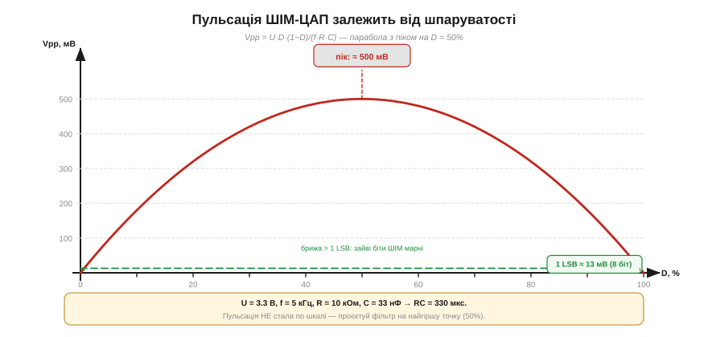

# 🧮 Проєктування RC-фільтра для ШІМ: зріз, пульсація в мВ, час встановлення

> Це математична вставка до теми [§4.7.4 «Відновлення аналогу з PWM: RC-фільтр»](ch25-pwm-dac.md).
>
> Тема дала якісну картину: зріз `fc = 1/(2πRC)`, правило «тримай зріз у 10 разів нижче від ШІМ» і формулу `5·RC` для часу встановлення. Проте жодного разу не прозвучало головне: **скільки саме мілівольт пульсації лишається на виході** і чи це прийнятно для конкретного завдання. Саме цю прогалину закриває вставка.
>
> Далі ми перетворимо три якісні гасла на три числа, які рахуються з R і C, і покажемо, що всі три тягнуть один R·C-бюджет у різні боки.

## Три цілі фільтра — три окремі числа

Коли ставиш RC-фільтр після ШІМ, у тебе є рівно три проєктні величини:

**Зріз (cutoff, fc)** — гранична частота, нижче якої фільтр «пропускає» сигнал, вище — гасить. Визначається добутком R·C і відповідає на запитання «чи прибираємо гармоніки взагалі».

**Пульсація (ripple, Vpp)** — залишкова амплітуда коливань на виході в мілівольтах. Це те, що бачить підключений пристрій: скільки «брижі» реально залишається. Зріз і пульсація — не одне й те саме: зріз каже, що гармоніка послаблюється, а пульсація каже — на скільки мілівольт.

**Час встановлення (settling time, t_s)** — скільки часу потрібно виходу, щоб після зміни шпаруватості дійти до нового рівня (з точністю ~1 %).

Усі три величини визначаються одним добутком R·C разом із зовнішніми даними (частота ШІМ і напруга живлення). Це означає, що між ними неминучий компроміс: одне значення R·C не може водночас забезпечити і мале Vpp, і малий t_s — доведеться вибирати.

Зріз ми вже знаємо з теми — тому почнемо з нього стисло, а потім виведемо те, чого там не було: пульсацію в мілівольтах.

## Зріз: нагадування з однієї рядки

З теми §4.7.4:

```
fc = 1 / (2π · R · C)

правило: fc ≤ f_ШІМ / 10
```

Зріз каже, **чи** придушуються гармоніки. А на **скільки мілівольт** — це окреме питання, і саме йому присвячений наступний розділ.

## Пульсація в мілівольтах: серце вставки

Скористаємося тією самою логікою «заряд = струм × час», що й вставка §4.7.3 у сусідньому розділі — там конденсатор фільтра живлення заряджався/розряджався піковим струмом навантаження. Тут схема інша (конденсатор заряджається й розряджається через R між рівнем ШІМ і шиною живлення), але математичний апарат той самий.

За один піввиток ШІМ конденсатор C підзаряджається: струм через R приблизно `I ≈ U / (2R)` поблизу середини шкали (D = 0,5), а тривалість підзаряду — `Δt ≈ D / f` для HIGH-фази і `(1−D) / f` для LOW-фази. Знайдений заряд `ΔQ = I · Δt`, а зміна напруги на конденсаторі `ΔU = ΔQ / C`. Підставляємо:

```
Vpp ≈ U · D · (1 − D) / (f · R · C)
```

Це **трикутне наближення першого порядку**: справжню експоненту заряду/розряду замінено лінійним трикутником. Наближення точне, поки пульсація мала (Δt ≪ τ = R·C) — інакше форма реально закруглена й теоретичний пік дещо нижчий. Тема §4.7.4 вже показувала це на Рис. 4.7.4.3.

При шпаруватості 50% добуток D·(1−D) досягає максимуму 0.25, тому:

```
при D = 0.5:  Vpp(max) ≈ U / (4 · f · R · C)
```

Це і є **найгірша точка** шкали. Тема §4.7.4 казала про неї словами («пульсація найбільша при 50%»); тут вона отримує числове значення.

Зв'язок із зрізом зручно побачити через підстановку: оскільки `RC = 1 / (2π·fc)`, формулу можна переписати як `Vpp(max) ≈ U · π · fc / (2 · f)`. Це означає, що кожне десятикратне збільшення відношення f/fc зменшує пульсацію рівно вдесятеро. Ось числовий зміст правила «зріз у 10 разів нижче»: воно не означає «майже нуль мілівольт», а означає «пульсація зменшена вдесятеро порівняно з тим, що було б без фільтра». Скільки саме мілівольт лишається — рахуємо окремо.

Побудуємо залежність на всій шкалі шпаруватості.



*Рис. 4.7.4m.1. Vpp = U·D·(1−D)/(f·R·C) — парабола, нуль на краях (0 % / 100 %), максимум посередині (50 %); вісь у мілівольтах для конкретних чисел прикладу нижче. Горизонтальна лінія — один крок ЦАП (1 LSB) для порівняння: де брижа перевищує LSB, зайва роздільність ШІМ марна. Проєктуй фільтр на найгіршу точку — 50 %.*

## Час встановлення: ціна рівності

Зменшили Vpp великим добутком R·C — заплатили швидкістю реакції.

```
t_s ≈ 5 · R · C       (до ~99 % нового рівня; τ = R·C)
```

Конфлікт прямий і неминучий: мала пульсація вимагає великого R·C, а малий t_s — навпаки, малого. Обидві вимоги тягнуть в різні боки — той самий «натяг ковдри», що в темах §4.7.4 і §4.7.3.

Зведімо тепер усі три величини на конкретних числах.

## Порахуймо: скільки мілівольт лишає фільтр із §4.7.4

**Вхідні дані** — рівно ті R і C, які тема вже підібрала:

```
Дано: f = 5 кГц, R = 10 кОм, C = 33 нФ, U = 3.3 В

RC = 10 000 · 33·10⁻⁹ = 3.3·10⁻⁴ с = 330 мкс

Зріз:
    fc = 1 / (2π · 330·10⁻⁶)
       = 1 / (2.073·10⁻³)
       ≈ 482 Гц   (≈ 1/10 від 5 кГц ✓)

Пульсація (найгірша точка, D = 0.5):
    Vpp(max) = U / (4 · f · R · C)
             = 3.3 / (4 · 5000 · 3.3·10⁻⁴)
             = 3.3 / 6.6
             ≈ 0.50 В = 500 мВ

Час встановлення:
    t_s = 5 · R · C = 5 · 330 мкс ≈ 1.65 мс
```

Результат чесний і трохи несподіваний: зріз справляється зі своїм завданням (482 Гц ≈ f/10, гармоніки ШІМ придушуються), а от пульсація на виході — 500 мВ. Це близько 6 % від напруги живлення 3,3 В, або приблизно 4 ефективні біти роздільності. Іншими словами, виводити 12-бітний ШІМ через такий фільтр немає сенсу: вихідна точність обмежена бриженням, а не лічильником.

Є два виходи, і обидва тема §4.7.4 вже згадувала:

**Збільшити R·C.** Щоб пульсація впала зі 500 мВ до, наприклад, 10 мВ, потрібне R·C у 50 разів більше. За того ж R = 10 кОм це C ≈ 1,65 мкФ; t_s зросте до 5·(50·330 мкс) ≈ 82 мс. Для датчика температури — прийнятно; для плавного звукового сигналу — ні.

**Додати другу ланку (фільтр 2-го порядку).** Кожна додаткова RC-ланка придушує гармоніку крутіше: перший порядок дає −20 дБ/дек, другий — −40 дБ/дек. На практиці це означає, що дві помірні ланки разом дадуть значно меншу пульсацію, ніж одна «монстроподібна» ланка з тим самим часом встановлення.

## Де в курсі це працює

**§4.7.3 (роздільність ШІМ).** Формула Vpp(max) дає реальну стелю корисних біт: якщо брижа перевищує крок (1 LSB) бажаної роздільності, зайві біти ШІМ — просто шум. Кількісно: ефективних біт ≈ log₂(U / Vpp). Саме це і є лінія LSB на Рис. 4.7.4m.1: нижче неї брижа непомітна, вище — роздільність втрачається.

**§4.7.4 (батьківська тема).** «ЦАП для бідних» тепер отримує числовий паспорт: зріз — 482 Гц, пульсація — 500 мВ, t_s — 1,65 мс. Видно, чому він «повільний» і чому пульсація — головна межа, а не зріз.

**§4.7.6 (справжній ЦАП).** Справжній ЦАП не має ані пульсації, ані часу встановлення фільтра. Формули цієї вставки кількісно показують, що саме виграєш, відмовившись від ШІМ+RC: усі 500 мВ пульсації та 1,65 мс затримки зникають.

Три величини — зріз, пульсація, час встановлення — це той самий «поділ скінченного бюджету» (тут R·C), що й трикутник §4.7.3 між частотою, роздільністю і тактом. Вміючи їх рахувати, проєктуєш ШІМ-ЦАП свідомо, а не навмання.

> 🔧 **Навіщо це.** Практичний алгоритм у три кроки: (1) бери частоту ШІМ якнайвищу — вона ділить Vpp; (2) постав зріз fc приблизно у 10 разів нижче від частоти ШІМ — це прибирає видиме миготіння; (3) перевір `Vpp(max) = U / (4·f·R·C)` у мілівольтах і порівняй з потрібним LSB — якщо забагато, нарощуй R·C (ціна: t_s = 5·RC зростає пропорційно) або додай другу ланку. Пам'ятай: зріз ≠ мілівольти — рахуй пульсацію окремо.
