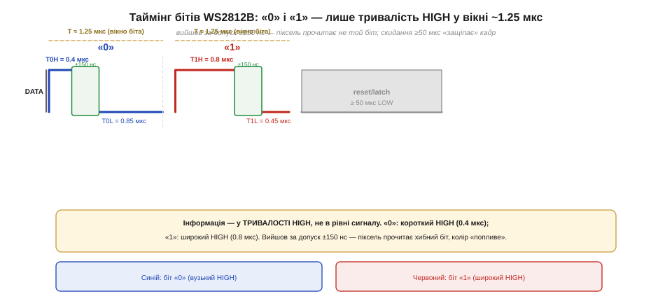
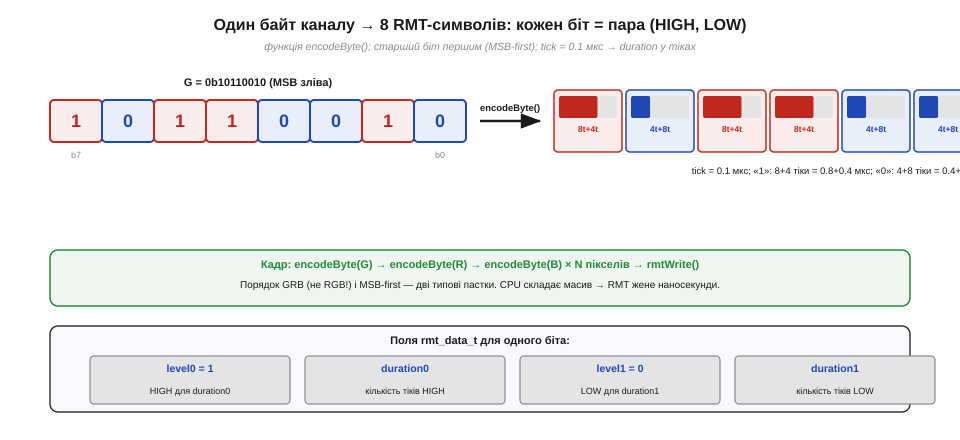

# ⚙️ Практика: Протокол одного дроту на 800 кГц (WS2812)

У §4.7.7 ми з'ясували, що кожен піксель WS2812 несе 24 біти кольору, а самі біти
кодуються «шириною наносекундних імпульсів» на єдиному дроті даних. Там ми свідомо
відклали дві речі: точну механіку — які саме тривалості відповідають «1» і «0», що
таке пауза скидання й як виглядає цілий кадр — і питання, хто фізично формує ці
імпульси з точністю до сотень наносекунд. Ця вставка закриває обидва борги: беремо
RGB-буфер кадру й перетворюємо його на точний потік імпульсів за допомогою
апаратного блоку RMT замість програмного циклу.

---

## Задача: біт — це тривалість, а помилка — сотні наносекунд

Протокол WS2812 будується на простій, але жорсткій ідеї: один дріт, один напрямок,
без тактового сигналу і без зворотного зв'язку. «1» і «0» розрізняються лише
тривалістю HIGH у фіксованому вікні приблизно 1.25 мкс — звідси й назва «800 кГц»
(1 ÷ 1.25 мкс ≈ 800 кбіт/с).

Точні числа за специфікацією Worldsemi WS2812B:

```
Параметр    Номінал    Допуск     Значення
─────────────────────────────────────────────
T0H          0.4 мкс   ±150 нс   HIGH для «0»
T0L          0.85 мкс  ±150 нс   LOW  для «0»
T1H          0.8 мкс   ±150 нс   HIGH для «1»
T1L          0.45 мкс  ±150 нс   LOW  для «1»
Tbit         1.25 мкс  (T·H + T·L)
Reset        ≥ 50 мкс            LOW після кадру
```



*Рис. 4.7.7a.1. Точний таймінг біта WS2812B: «0» і «1» різняться лише тривалістю HIGH у вікні ~1.25 мкс, плюс пауза reset ≥50 мкс.*

Головне, що тут треба зрозуміти: інформація закодована у тривалості HIGH, а не в
амплітуді. Якщо прошивка виходить за допуск ±150 нс — особливо якщо плутає
«довгий/короткий» — піксель зчитає інший біт і відобразить хибний колір. Саме
цей ризик реального часу змушує відмовитися від програмного циклу на кшталт
`digitalWrite` (§4.4.7): переривання (§4.5) можуть вклинитися між двома рядками коду
і зрушити момент перемикання на мікросекунди.

> 🔧 **Навіщо це**
>
> На практиці точні числа бере на себе бібліотека або блок RMT. Але знати вікно
> допуску необхідно, щоб розуміти, чому програмний цикл тут ненадійний і чому
> клони — SK6812, WS2813, WS2811 — мають дещо інші тривалості (не можна «прошити»
> одні константи назавжди і вважати їх вічними).

---

## Структура кадру: GRB, старший біт першим, N×24 + скидання

Другий борг §4.7.7 — структура цілого кадру. Розберемо пошарово.

Один піксель — 24 біти, але порядок каналів **G-R-B**, а не RGB. Всередині кожного
байта — **старший біт першим** (MSB-first). Якщо переплутати порядок байтів і
передати R перед G — відображений колір буде іншим; якщо передавати LSB-first —
кожен байт «перевернеться» і рожевий стане зовсім не рожевим. Обидві пастки
виглядають у коді невинно і дають неочевидний ефект.

Кадр — це послідовність байтів пікселів від найближчого до МК до найдальшого
(фізичний порядок ланцюжка, §4.7.7). Після останнього байта настає пауза скидання
(reset/latch) — тривалий рівень LOW ≥ 50 мкс, що «защіпає» всі прийняті кольори й
запускає ШІМ у кожному пікселі одночасно.

```
Структура кадру (один рядок = один піксель):

[G7..G0][R7..R0][B7..B0]  ← піксель 1 (ближній)
[G7..G0][R7..R0][B7..B0]  ← піксель 2
...
[G7..G0][R7..R0][B7..B0]  ← піксель N (дальній)
  ≥50 мкс LOW             ← reset / latch

Тривалість кадру ≈ N × 24 × 1.25 мкс + 50 мкс
Для 60 пікс: ≈ 60 × 24 × 1.25 + 0.05 ≈ 1.85 мс
```

Час кадру пов'язаний із межею FPS, про яку вже йшлося в §4.7.7. Тепер у нас є
точні тривалості й розкладка кадру — лишилося передати це апаратно.

---

## Ідея: один біт = один RMT-символ

RMT (Remote Control Transceiver) — блок ESP32, що надсилає послідовність
«символів» (`rmt_data_t`). Кожен символ — це два поля: рівень і тривалість,
потім наступний рівень і тривалість. Апаратура відтворює символи з точністю до
тактів власного джерела, незалежно від CPU і переривань. Це рівно те, чого вимагає
WS2812.

Ключ у тому, що один біт WS2812 точно відповідає одному RMT-символу:

```
Біт «0»: level0=HIGH, duration0=4 тіки (0.4 мкс)
          level1=LOW,  duration1=8–9 тіків (0.85 мкс)

Біт «1»: level0=HIGH, duration0=8 тіків (0.8 мкс)
          level1=LOW,  duration1=4–5 тіків (0.45 мкс)

tick = 0.1 мкс (джерело RMT на 10 МГц)
→ 1 тік = 100 нс; добре укладається в допуск ±150 нс
```

Кодування байта = 8 символів; кадр N пікселів = N × 24 символи + хвіст скидання.



*Рис. 4.7.7a.2. Один байт каналу → 8 RMT-символів: кожен біт стає парою (HIGH, LOW) потрібної тривалості; старший біт першим.*

---

## Робочий код: кодуємо буфер у RMT-символи й шлемо

Нижче — реальний Arduino-ESP32 на новому RMT-API (core 3.x), де стиль
`rmtInit`/`rmtWrite` узгоджується з `ledcAttach`-підходом §4.7.2.

**Кодувальник байта в RMT-символи (tick = 0.1 мкс).**

```cpp
#include <driver/rmt.h>          // Arduino ESP32 core 3.x
// або тільки: #include "esp32-hal-rmt.h"
// rmtInit(pin, RMT_TX_MODE, RMT_MEM_NUM_BLOCKS_1, 10000000)
// → tick = 1/10MHz = 100 нс = 0.1 мкс

// Тривалості у тіках (tick = 0.1 мкс)
#define T0H  4    // 0.4 мкс HIGH для «0»
#define T0L  9    // 0.85 мкс LOW для «0»  (9 × 0.1 ≈ 0.9, підходить до допуску)
#define T1H  8    // 0.8 мкс HIGH для «1»
#define T1L  5    // 0.45 мкс LOW для «1»  (5 × 0.1 = 0.5 мкс, у допуску)

// Кодує один байт у 8 RMT-символів; out — масив на 8 елементів
void encodeByte(uint8_t b, rmt_data_t* out) {
    for (int i = 0; i < 8; i++) {
        int bit = (b >> (7 - i)) & 1;   // MSB-first
        if (bit) {
            out[i].level0    = 1;
            out[i].duration0 = T1H;
            out[i].level1    = 0;
            out[i].duration1 = T1L;
        } else {
            out[i].level0    = 1;
            out[i].duration0 = T0H;
            out[i].level1    = 0;
            out[i].duration1 = T0L;
        }
    }
}
```

CPU тут лише заповнює масив символів у RAM — жодних наносекундно-точних затримок
у циклі. Після `rmtWrite` апаратура сама веде потік за апаратним таймером.

**Складання кадру GRB і відправлення.**

```cpp
#define N_PIXELS  60
#define DATA_PIN  5       // ніжка даних стрічки

// Буфер кольорів (R, G, B у логіці програми)
struct RGB { uint8_t r, g, b; };
RGB pix[N_PIXELS];

// Масив RMT-символів: 24 символи на піксель
rmt_data_t sym[N_PIXELS * 24];

void ws2812_setup() {
    // tick = 1/10_000_000 = 0.1 мкс
    rmtInit(DATA_PIN, RMT_TX_MODE, RMT_MEM_NUM_BLOCKS_1, 10000000);
}

void ws2812_show() {
    for (int i = 0; i < N_PIXELS; i++) {
        // GRB — НЕ RGB! (типова пастка WS2812)
        encodeByte(pix[i].g, &sym[i * 24 + 0]);   // G першим
        encodeByte(pix[i].r, &sym[i * 24 + 8]);   // R другим
        encodeByte(pix[i].b, &sym[i * 24 + 16]);  // B третім
    }
    // RMT жене всі N*24 символи, CPU вільний після виклику
    rmtWrite(DATA_PIN, sym, N_PIXELS * 24, RMT_WAIT_TX_DONE);
    // Пауза reset: ≥50 мкс між кадрами — зазвичай вистачає часу між
    // двома викликами ws2812_show() у loop(); якщо треба явно — delayMicroseconds(60)
}
```

Поділ праці рівно той, про який ішлося в §4.7.7: CPU складає масив чисел (ціна — O(N)
простих операцій), а RMT відмірює наносекунди апаратно — навіть коли Wi-Fi-переривання
(§4.5) займає ядро.

---

## Складність і пастки на МК

**Пам'ять.** Кожен `rmt_data_t` — 4 байти; буфер символів для 300 пікселів займає
300 × 24 × 4 = 28 800 байт (≈ 28 КБ) лише для RMT-символів, плюс 3 байти на
піксель для буфера кольорів. На ESP32 це реально, але не безкоштовно. Для великих
стрічок розглядають потокову передачу: кодувати й відправляти порціями через
callback RMT, тримаючи в пам'яті лише 24–48 символів одночасно.

**Час складання.** Заповнення N × 24 символів — O(N), і воно дешевше, ніж сама
передача (кожен піксель передається ≈ 30 мкс). Вузьке місце — фізика дроту, не CPU.
Це принципова відмінність від bit-bang (§4.4.7), де CPU зайнятий безперервно впродовж
усієї передачі.

**Допуск і клони.** Числа T0H/T0L/T1H/T1L специфічні для WS2812B. SK6812 і WS2813
мають схожий, але не ідентичний протокол; WS2811 і зовсім повільніший (400 кбіт/с,
T = 2.5 мкс). Не вважайте константи вічними — документуйте, для якого чипа
їх розраховано.

**Джерело такту RMT.** Тіки прив'язані до тактового джерела блоку RMT. Якщо
джерело зміниться (конфігурація APB), масштаб тіків «попливе» і тривалості
зрушаться — перегук із §4.7.3 про те, що тактова частота таймера визначає всі
похідні. На новому API (core 3.x) джерело фіксують при `rmtInit` явно, тому ризик
нижчий, але про нього варто знати.

**Рівні 3.3В→5В і живлення.** Електрика лінії — окрема тема 🔌-вставки про стрічку,
на яку вже посилається §4.7.7; тут лише таймінг.

**Чому не bit-bang.** Підсумок, що закриває борг §4.7.7: RMT утримує наносекундну
точність апаратно навіть під Wi-Fi-перериваннями (§4.5). Програмний цикл з
`digitalWrite` (§4.4.7) спрацює хіба якщо вимкнути всі переривання на час передачі —
а це блокує систему на десятки мілісекунд і руйнує решту логіки.

---

Маючи точні тривалості, розкладку кадру GRB і апаратний RMT, ти повністю розумієш,
як народжується кожен імпульс адресної стрічки — від числа в буфері до
мікросекундного фронту на дроті даних. Повертаємося до §4.7.7 із закритими боргами.
