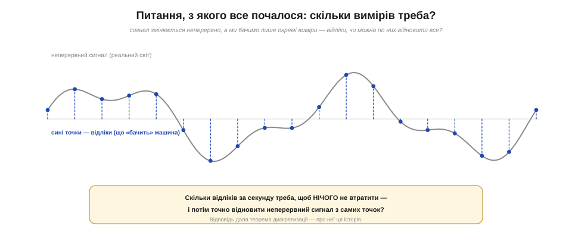
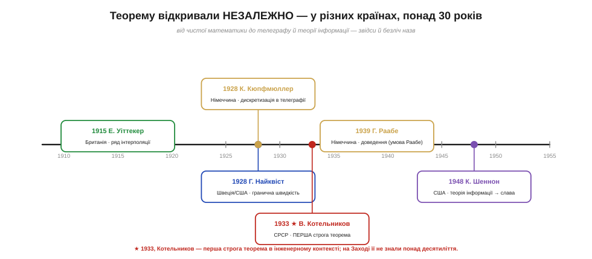
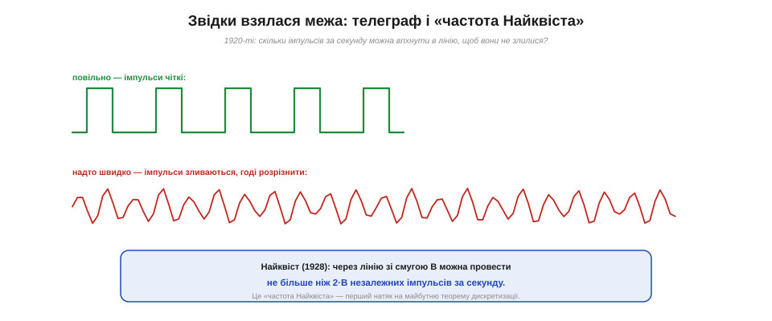
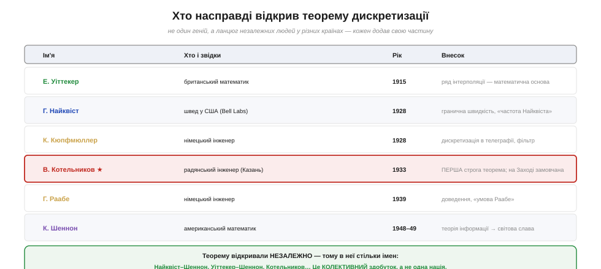
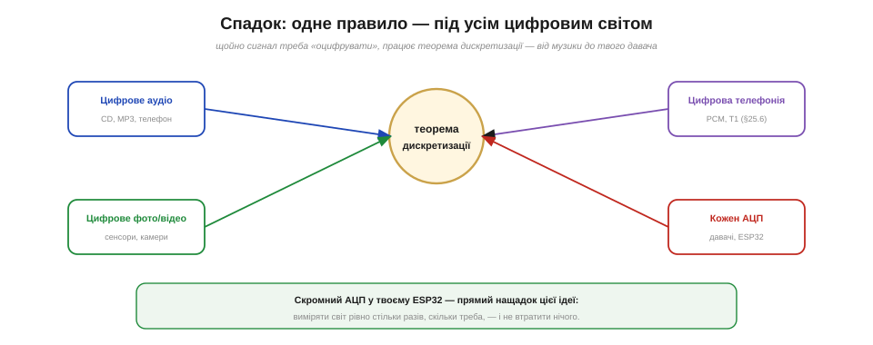

# 📜 Історія до Розділу 26 — Теорема дискретизації: скільки вимірів треба, щоб не втратити сигнал

> Це історична вставка до [Розділу 26 «Аналого-цифрове перетворення (АЦП)»](ch26-adc.md). Вона веде **ланцюгом питань** навколо однієї глибокої ідеї: будь-який неперервний сигнал — звук, напругу, хвилю — можна без утрат звести до **скінченного потоку чисел**, якщо міряти його досить часто. Скільки саме — каже теорема дискретизації (*sampling theorem*). Сьогодні на ній стоїть увесь цифровий світ: музика в телефоні, цифрове фото, голос у мережі й кожне читання давача у вашому ESP32. А історія її повчальна ще й тим, що теорему **відкривали незалежно** щонайменше п'ятеро людей у різних країнах — і найперший строгий доказ, що належить радянському інженерові, світ не помічав понад десять років.

У [Розділі 25](../ch25-pwm-dac/ch25-pwm-dac.md) ми йшли від числа до напруги — ЦАП «малював» аналог із цифри. Тепер задача зворотна: узяти живий аналоговий сигнал і записати його числами так, щоб **нічого не загубити**. І тут одразу постає тривожне питання. Сигнал тече неперервно, у ньому нескінченно багато миттєвостей; а ми встигаємо зробити лише **окремі виміри** — скажімо, тисячу за секунду. Хіба ж між сусідніми вимірами не ховається все найцікавіше? Хіба, дивлячись на світ «спалахами», ми не проґавимо те, що сталося в темряві між ними? Виявляється — за однієї умови — не проґавимо нічого. Сформулювати цю умову точно й означало розв'язати задачу.

*Рис. 26.0.1. Серцевина проблеми. Сірим — неперервний сигнал реального світу; синіми точками — окремі виміри (відліки, *samples*), що тільки й доступні машині. Чи можна по самих точках точно відновити всю криву між ними? І скільки точок за секунду для цього треба? Відповідь — теорема дискретизації.*

---

## Сигнал неперервний, а число — дискретне: у чому пастка

Уявімо, що ми спостерігаємо за хвилею, кліпаючи очима. Якщо кліпати часто, рух хвилі видно добре. Та якщо кліпати рідко, може статися кумедне: швидка хвиля між двома поглядами встигне зробити повний оберт — і нам здаватиметься, що вона **стоїть на місці**. Те саме бачимо в кіно, коли колесо воза «крутиться назад»: кадри — це теж рідкі виміри, і швидке обертання вони передають хибно. Ось вона, пастка рідкісних вимірів: дві геть різні хвилі можуть дати **однакові** відліки, і за самими числами вже не скажеш, яка з них була насправді. Цей самий ефект інженери здавна вживали й свідомо — у **стробоскопі**: підсвічуючи обертовий вал рідкими спалахами, його «зупиняли» оком, щоб роздивитися. Те, що для вимірювання — пастка, для стробоскопа — корисний трюк; але суть одна: рідкі виміри здатні **збрехати** про швидкий рух.

Звідси й тривога інженерів початку XX століття. Якщо оцифрувати звук замало частими вимірами, високі ноти «перевдягнуться» в низькі, і запис спотвориться невпізнанно. А якщо міряти **надто** часто — марнуються пам'ять, смуга каналу, гроші. Постало точне інженерне питання: яка **найменша** частота вимірів **гарантує**, що сигнал відновиться без утрат? Відповідь виявилася напрочуд чіткою — і, як часто буває з глибокими істинами, її незалежно знайшли кілька людей, ідучи зовсім різними шляхами: одні з боку чистої математики, інші — від практики телеграфу, ще інші — будуючи теорію зв'язку.

*Рис. 26.0.2. Понад тридцять років і кілька країн: математик Уіттекер (1915), інженери Найквіст і Кюпфмюллер (1928), Котельников із першою строгою теоремою (1933), Раабе з доведенням (1939) і нарешті Шеннон (1948–49), що дав їй світову славу. Жоден не «вкрав» в іншого — кожен дійшов сам, тому в теореми стільки імен.*

---

## Математики побачили це першими: інтерполяція Уіттекера

Найдавніший корінь історії — не інженерний, а суто математичний. Ще 1915 року британський математик **Едмунд Тейлор Уіттекер** (*Edmund Taylor Whittaker*) вивчав задачу інтерполяції: як по окремих точках провести «найгладшу» з можливих криву. Він показав, що серед усіх кривих, які проходять через задані рівновіддалені точки, є одна особлива — без зайвих «брижів», без частот, вищих за певну межу. Цей **кардинальний ряд** (*cardinal series*) і був, по суті, формулою відновлення сигналу з його відліків — тільки сформульованою мовою чистого аналізу, задовго до того, як комусь знадобилося оцифровувати звук.

Уіттекер не думав про телеграф чи радіо — його вело внутрішнє питання математики. Та згодом виявиться, що його ряд — це і є рецепт, як із синіх точок на рис. 26.0.1 точно зібрати сіру криву. Пізніше цю лінію продовжать інші математики — син Уіттекера **Джон Макнотен Уіттекер** (*J. M. Whittaker*), що наприкінці 1920-х розвинув батькову «кардинальну функцію», і японський математик **Огура** (*K. Ogura*), що уточнив умови ще в 1920-х. Так склалася важлива риса всієї історії: **ідея жила в математиці раніше, ніж її потребувала техніка**. Інженерам лишалося незалежно перевідкрити її — вже як практичний закон.

> 🔧 **Навіщо це.** Корисно пам'ятати, що «відновити неперервний сигнал з точок» — не магія, а точна математична операція (той самий кардинальний ряд). Саме тому цифрове аудіо звучить як справжнє: програвач не «вгадує» звук між відліками, а **обчислює** єдину гладку криву, що крізь них проходить. Коли далі в розділі ви читатимете аналоговий вхід, знайте: за лаштунками працює ця стара ідея інтерполяції.

---

## Телеграф ставить інженерне питання: Найквіст і його межа

Перший інженерний поштовх дав **телеграф**. У 1920-х компанії хотіли гнати лінією якомога більше крапок і тире за секунду — але занадто часті імпульси починали **зливатися**, і приймач уже не міг їх розрізнити. Скільки ж імпульсів за секунду витримає лінія з даною смугою пропускання? На це питання відповів інженер **Гаррі Найквіст** (*Harry Nyquist*). Народжений 1889 року в Швеції (село Нільсбю), він юнаком емігрував до США, здобув докторат у Єлі й працював у дослідницькому відділі AT&T, згодом — у Bell Labs. У статтях «Certain Factors Affecting Telegraph Speed» (1924) і «Certain Topics in Telegraph Transmission Theory» (1928) він довів: лінією зі смугою B можна провести **не більше ніж 2·B** незалежних імпульсів за секунду. Це число й назвали згодом **частотою (швидкістю) Найквіста**. Ім'я Найквіста взагалі рясно лишилося в техніці: його згадують і в **тепловому шумі Джонсона–Найквіста**, і в **критерії стійкості Найквіста** з теорії керування — ознака інженера, чиї ідеї проросли одразу в кількох галузях.

*Рис. 26.0.3. Звідки взялася «двійка». Повільні імпульси (зелене) приймач розрізняє чітко; надто часті (червоне) зливаються в нерозбірливу кашу. Найквіст (1928) показав: межа — 2·B імпульсів за секунду на смугу B. Це дзеркало майбутнього правила дискретизації: щоб схопити сигнал зі смугою B, треба ≈ 2·B відліків за секунду.*

Варто бути точним щодо внеску Найквіста, щоб не творити міфу. Він установив **межу швидкості** для телеграфних імпульсів — і це геніальний крок, з якого виросло поняття «частоти Найквіста», що його інженери шанують і досі. Та строгої теореми про **відновлення довільного сигналу** з його відліків Найквіст не формулював і не доводив — він розв'язував конкретну телеграфну задачу. Повна теорема, з умовою й доказом, була ще попереду; і, що цікаво, її перший суворий доказ з'явився геть не там, де на нього чекали.

---

## Казань, 1933: Котельников формулює й доводить теорему

Поки на Заході ідея визрівала шматками, у Радянському Союзі молодий інженер зробив повний крок. 1933 року **Володимир Олександрович Котельников** (*Vladimir Aleksandrovich Kotelnikov*) — родом із Казані, випускник Московського енергетичного інституту — подав на Першу всесоюзну конференцію з питань зв'язку доповідь, у якій **уперше строго сформулював і довів** теорему дискретизації для сигналів з обмеженою смугою (як низькочастотних, так і смугових). Саме там з'явилося чітке твердження, відоме нам сьогодні: щоб без утрат передати сигнал, чия найвища частота дорівнює *f*, достатньо брати відліки з частотою **2·*f*** — і не рідше. Рукопис прийняли до друку ще в листопаді 1932 року, тож пріоритет документально засвідчено.

І тут — найгіркіша частина історії. Доповідь Котельникова надрукували в матеріалах радянської конференції 1933 року, і вона **майже нікого не зацікавила** навіть удома, а на Заході її не знали **понад десять років**: вузьке відомче видання, мовний бар'єр, ізоляція. Світ перевідкривав теорему ще двічі, не підозрюючи, що повний доказ давно лежить надрукований. Лише згодом ім'я Котельникова повернули в назву — у російській традиції теорему так і звуть **теоремою Котельникова**, а в міжнародній зустрічається **Найквіста–Шеннона–Котельникова**.

Тут варто сказати прямо, без крайнощів. Котельников — **справжній** автор першого строгого доведення в інженерному контексті, і його внесок десятиліттями несправедливо губився в західних викладах; повертати його ім'я — питання елементарної точності, а не політики. Воднораз це не привід оголошувати теорему «винаходом однієї людини» чи «однієї країни»: поряд із Котельниковим стоять Уіттекер, Найквіст, німці Кюпфмюллер і Раабе та Шеннон, і кожен ішов **сам**. Чесна історія тримає в полі зору **всіх** — і не викреслює забутого радянського інженера, і не роздуває його на шкоду решті. Це класичний приклад **незалежного багаторазового відкриття**, а не чийогось одноосібного тріумфу.

Варто додати, що Котельников був постаттю далеко не одного відкриття. Проживши довге життя (1908–2005), він став одним із провідних учених СРСР: під час війни незалежно довів теоретичну незламність шифру з одноразовим ключем, згодом очолив радянську **планетну радіолокацію** (радарні дослідження Венери, Меркурія й Марса в 1960-х) і далекий космічний зв'язок, багато років був віцепрезидентом Академії наук. Тобто теорема дискретизації — лише один із його слідів у науці; тим прикріше, що саме за цей, чи не найфундаментальніший, світ так довго його не згадував.

> 🔧 **Навіщо це.** Коли натрапите на назву «теорема Найквіста–Шеннона» (а так її звуть найчастіше), пам'ятайте, що за звичним ярликом ховається довший і чесніший список імен. Для розробника тут не лише історична справедливість, а й корисна звичка: **перевіряти, кому насправді належить ідея**, і не вірити, що найгучніше ім'я завжди й перше. У техніці так буває рідко — майже все народжується колективно.

---

## Німецька гілка: Кюпфмюллер і Раабе

Була й третя, незалежна лінія — німецька. Ще 1928 року інженер **Карл Кюпфмюллер** (*Karl Küpfmüller*) розглядав дискретизацію в телеграфії й описав потрібний **обмежувальний фільтр** (його й досі звуть «фільтром Кюпфмюллера») — той самий, що відрізає зайві високі частоти перед оцифруванням. А 1939 року його асистент **Герберт Раабе** (*Herbert Raabe*) у докторській дисертації дав теоремі **повне доведення**; критерій «частота відліків більша за подвоєну смугу» в німецькій традиції назвали **умовою Раабе** (*Raabe-Bedingung*).

Те, що в один і той самий проміжок часу — кінець 1920-х і 1930-ті — теорему незалежно довели в Москві й під Берліном, а раніше намацали в Британії та США, найкраще й показує її природу. Це не примха однієї школи, а **об'єктивна істина** про сигнали, до якої різні люди неминуче приходили, щойно стикалися з оцифруванням. Великі ідеї часто «висять у повітрі»: коли визріває потреба й дозріває математика, відкриття стається одразу в кількох головах.

---

## Шеннон дає теоремі світ: теорія інформації, 1948–49

Чому ж тоді теорему найчастіше звуть іменем Шеннона? Бо саме він дав їй **домівку й світову сцену**. Американський математик та інженер **Клод Шеннон** (*Claude Shannon*) у Bell Labs у статтях «A Mathematical Theory of Communication» (1948) і «Communication in the Presence of Noise» (1949) побудував цілу **теорію інформації** — і теорема дискретизації стала в ній однією з опор, природним містком між неперервним сигналом і його скінченним цифровим описом. У Шеннона вона звучала вже не як телеграфний трюк, а як фундаментальний закон зв'язку, частина величної будови, що пояснювала, скільки інформації несе сигнал і як її передати крізь шум.

Сила Шеннонового підходу була така, що теорема ввійшла в підручники саме «через нього» — і заслужено, як **синтез і вершина**, а не як перший камінь. Сам Шеннон, до речі, був великодушний і не претендував на одноосібний пріоритет: він чесно посилався на попередників і знав, що йде второваною стежкою. Слава прийшла до його імені не тому, що він був перший, а тому, що він **поставив теорему в найпотужнішу рамку** — теорію інформації, яка живить цифровий світ донині. Так і склалося справедливе, але неповне ім'я «теорема Найквіста–Шеннона»: воно вшановує двох найвидиміших учасників, мовчки лишаючи в тіні Котельникова, Уіттекера й німецьку гілку.

*Рис. 26.0.4. Повний список замість зручного ярлика. Уіттекер дав математику, Найквіст — межу швидкості, Кюпфмюллер — фільтр, Котельников — першу строгу теорему (надовго замовчану), Раабе — доведення, Шеннон — теорію інформації й світову славу. Теорему відкривали незалежно — тому це колективний здобуток, а не тріумф однієї нації чи одного імені.*

---

## Що з цього бере розробник: правило, що пережило всіх

За всіма іменами й суперечками стоїть одне напрочуд просте правило, яким ви користуватиметеся щодня: **щоб оцифрувати сигнал без утрат, бери відліки щонайменше вдвічі частіше за його найвищу частоту**. Хочеш записати звук до 20 кГц — міряй понад 40 тисяч разів за секунду (компакт-диск так і робить: 44100 відліків/с). Порушиш правило — високі частоти «перевдягнуться» в низькі, і запис спотвориться; цю пастку (її звуть аліасингом) і способи її уникнути ми кількісно розберемо далі в розділі, у темі про частоту дискретизації. Зворотний бік теж практичний: міряти **набагато** частіше за потрібне — марно палити пам'ять і час.

*Рис. 26.0.5. Одне правило — під усім цифровим світом. Музика (CD, MP3), цифрове фото й відео, телефонія (PCM, §25.6) і кожен АЦП у кожному давачі спираються на ту саму теорему. Скромне `analogRead` у вашому ESP32 — прямий нащадок ідеї, яку незалежно виносили Уіттекер, Найквіст, Котельников, Раабе й Шеннон.*

Так одна теорема, народжена в чистій математиці, виплекана телеграфом і увінчана теорією інформації, стала тихим фундаментом усієї цифрової доби — від компакт-диска до голосу в месенджері. І щоразу, коли мікроконтролер вимірює напругу з давача, він мовчки кориться цьому правилу. Лишилося розібрати, **як саме** залізо перетворює виміряну напругу на число — і що при цьому неминуче втрачається й спотворюється. Саме цьому й присвячено [Розділ 26 «Аналого-цифрове перетворення»](ch26-adc.md), до якого ми тепер і переходимо.
