# Розділ 4.10 — Модель виконання й RTOS

Усі попередні розділи модуля дали нам **окремі вміння** мікроконтролера: рахувати час, реагувати на події, читати й видавати аналог, керувати ніжками. Та лишилося велике питання, що в'яже їх докупи: як МК **організовує свою роботу в часі**? Як змусити його робити кілька справ наче водночас — мигати світлодіодом, опитувати давач, слухати кнопку й говорити по радіо — не плутаючись і не «зависаючи»? Це і є **модель виконання (*execution model*)**. У цьому завершальному розділі модуля ми пройдемо шлях від найпростішого «одного великого циклу» до повноцінної **операційної системи реального часу (*real-time operating system, RTOS*)**, що сама розподіляє час між задачами. А почнемо з історії великої ідеї, на якій усе це стоїть, — [📜 поділу часу](ch27-history-time-sharing.md): як ще 1961 року один комп'ютер навчився служити багатьом.

Будуємо від простого до складного: спершу **super-loop** — один цикл, що робить усе по черзі ([§4.10.1](ch27-execution-rtos.md)); далі — [чому super-loop не масштабується](ch27-execution-rtos.md), [задачі як кілька «програм» водночас](ch27-execution-rtos.md), [планувальник: хто й коли виконується](ch27-execution-rtos.md), [RTOS і FreeRTOS на ESP32](ch27-execution-rtos.md), [обмін між задачами: черги, семафори, м'ютекси](ch27-execution-rtos.md), [пам'ять і стеки задач](ch27-execution-rtos.md) і нарешті [реальний час: детермінованість і пріоритети](ch27-execution-rtos.md). Спираємося на **переривання** ([Розділ 4.5](../ch23-interrupts/ch23-interrupts.md)) і **таймери** ([Розділ 4.6](../ch24-timers/ch24-timers.md)) — саме таймерне переривання дає планувальникові його «тік».

---

## 4.10.1 Super-loop: один великий цикл (setup/loop)

Історія показала, як великі машини вчилися ділити час між багатьма. Та мікроконтролер починає з куди простішого — з **одного нескінченного циклу**, що сам-один робить усе. Це й є **super-loop** (головний цикл), найпростіша з усіх моделей виконання й та сама, з якої ви, найпевніше, починали знайомство з Arduino. Перш ніж рватися до задач і RTOS, варто по-справжньому зрозуміти цю основу: як вона влаштована, чому така зручна — і де в ній уже причаїлися межі, що згодом штовхнуть нас далі.

### setup() раз, loop() вічно

Уся модель тримається на двох функціях. Спершу **один-єдиний раз** виконується `setup()` — там налаштовують усе, що задається на старті: режими ніжок, швидкість зв'язку, початкові значення. А далі **без кінця** крутиться `loop()` — робочий цикл, що повторюється знову й знову, доки живиться плата.

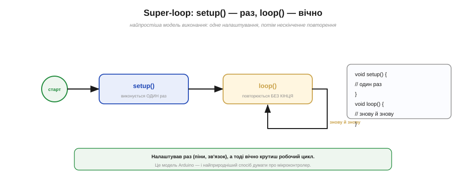
*Рис. 4.10.1.1. Уся модель — дві частини: `setup()` виконується раз (налаштування), а тоді `loop()` повторюється без кінця. Це модель Arduino й найприродніший спосіб думати про мікроконтролер: налаштував — і вічно тягнеш робочий цикл.*

Простота цієї схеми — її головна чеснота. Код читається згори вниз, поведінка передбачувана: що написано в `loop()`, те по черзі й виконується, оберт за обертом. Жодних прихованих механізмів, жодного планувальника — самий ваш код. Для безлічі реальних пристроїв (термостат, що міряє температуру й керує нагрівачем; лічильник; проста сигналізація) цього цілком досить, і ускладнювати нема потреби.

Варто уточнити, що саме кладуть у кожну частину. У `setup()` — усе разове: `pinMode()` для ніжок, `Serial.begin()` для зв'язку, `attachInterrupt()` для подій, початкові значення змінних. У `loop()` — повторювана робота. І тонкість, на якій спотикаються новачки: `loop()` не містить власного нескінченного циклу всередині — навпаки, вона щоразу **завершується** й одразу викликається знову; по колу її крутить сам каркас. Тому з `loop()` треба **виходити**, а не зависати в ній у власному `while(1)`, — інакше каркас утратить керування й усе, що він робить між обертами, спиниться.

### Що під капотом: звичайний main()

Може здатися, що `setup()` і `loop()` — якась особлива магія Arduino. Насправді ні: під ними ховається все знайоме з [Розділу 4.2](../ch21-toolchain/ch21-toolchain.md). Після **скидання** керування бере **завантажувач**, тоді запускається звичайна функція `main()` — і саме вона викликає `setup()` один раз, а потім заганяє `loop()` у вічний цикл.

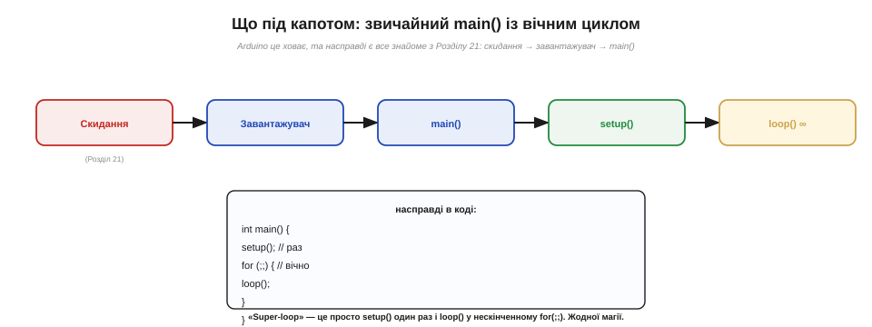
*Рис. 4.10.1.2. «Super-loop» — це не магія, а звичайний `main()`: скидання → завантажувач → `main()` → `setup()` один раз → `loop()` у нескінченному `for(;;)`. Arduino лише ховає цей `main()`, щоб новачкові було простіше.*

Тобто весь Arduino-каркас — це, по суті, ось такий код: `main()`, що викликає `setup()`, а тоді вічно повторює `loop()`. Розуміти це корисно з двох причин. По-перше, зникає відчуття «чорної магії»: ви бачите, що тут виконується звичайна програма мовою C з тим самим `main()`, що й деінде. По-друге, стає ясно, що super-loop — це **«голе залізо»** (§4.2.7): між вашим кодом і процесором немає жодної операційної системи, яка щось вирішувала б за вас. Уся відповідальність за те, що й коли виконується, лежить на самому циклі.

Цікавий нюанс саме для ESP32: тут `loop()` насправді вже крутиться **всередині задачі** операційної системи, бо ESP32 із самого початку несе на собі FreeRTOS. Тобто навіть «голий» super-loop на цьому чипі — це одна задача поверх планувальника, лише ви цього не бачите. Поки що сприймайте super-loop як найпростішу модель; та тримайте в пам'яті, що під ним на ESP32 уже є те, до чого ми дійдемо в темі про RTOS, — і перехід від одного циклу до багатьох задач буде природним продовженням, а не стрибком у прірву.

### Цикл «читай — обчисли — дій»

Що ж зазвичай кладуть усередину `loop()`? Майже завжди — той самий класичний візерунок вбудованих систем: **прочитати** входи, **обчислити** реакцію, **подіяти** на виходи. І так щооберту.

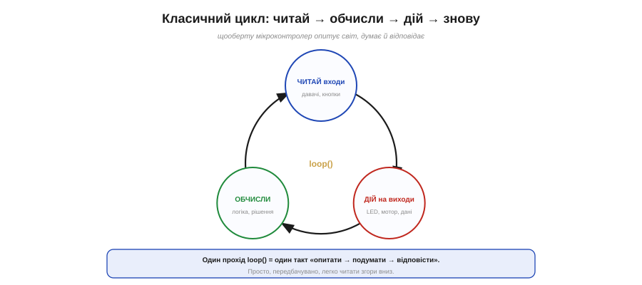
*Рис. 4.10.1.3. Типовий вміст `loop()` — цикл «читай → обчисли → дій»: опитати давачі й кнопки, ухвалити рішення, оновити виходи (світлодіод, мотор, дані), і знову спочатку. Один прохід `loop()` — один такт «опитати світ → подумати → відповісти».*

Цей ритм універсальний. Термостат щооберту читає температуру, порівнює з уставкою й вмикає чи вимикає нагрівач. Кнопковий пульт зчитує кнопки, оновлює стан, засвічує індикатори. Регулятор мотора читає задану швидкість, обчислює потрібну шпаруватість і записує її в ШІМ. Хоч би що робив пристрій, його `loop()` найчастіше зводиться до цих трьох кроків — і саме тому super-loop такий природний: він безпосередньо відображає те, як ми уявляємо роботу машини, що безперервно стежить за світом і відповідає на нього.

Коли логіка складніша за «прочитав — відповів», у циклі заводять **стан**: змінну, що пам'ятає, у якій фазі зараз пристрій (скажімо, «чекаю натискання» → «відлічую час» → «блимаю»). Щооберту `loop()` дивиться на стан, робить належне й, можливо, переходить до наступного. Така **машина станів (*state machine*)** — природний спосіб тримати непросту поведінку в межах одного циклу, не блокуючи його: замість того щоб «застрягти» й чекати, пристрій щоразу пригадує, де спинився, і робить лише наступний маленький крок.

### Дві сцени: головний цикл і переривання

Сам по собі цикл неквапний: він робить справи по черзі, у порядку коду. Та реальний світ не чекає — кнопку можуть натиснути будь-якої миті, байт прийти по зв'язку «просто зараз». Як цикл устигає за терміновим? Та він і не мусить — для цього є **переривання** (§4.5). Виходить класичний поділ на **дві сцени**: `loop()` тягне **передній план** (неквапна рутина), а обробники переривань (ISR) — **тло** (термінові події, що вихоплюють процесор на мить і повертають його назад).

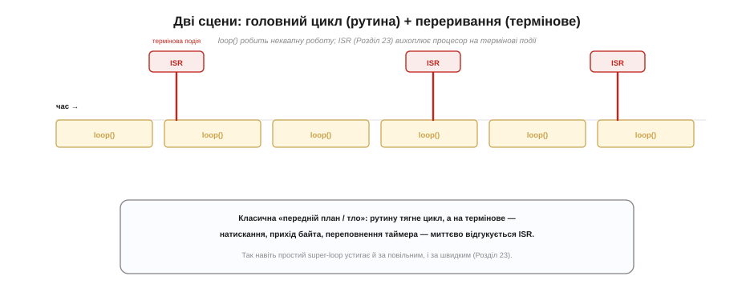
*Рис. 4.10.1.4. Архітектура «передній план / тло»: рутину неквапно тягне `loop()`, а на термінове — натискання, прихід байта, переповнення таймера — миттєво відгукується ISR (Розділ 4.5), після чого цикл біжить далі. Так навіть простий super-loop устигає й за повільним, і за швидким.*

Це поєднання — super-loop плюс переривання — напрочуд потужне й покриває величезну частину вбудованих задач. Цикл спокійно займається послідовною роботою, не переймаючись терміновим; а коли стається щось, на що треба зреагувати вмить, переривання робить це **поза чергою**, не чекаючи, доки цикл до нього дійде. Ми вже бачили цю ідею в Розділі 4.5; тут варто лише усвідомити, що це і є **базова модель виконання** простого мікроконтролера: один головний цикл попереду й переривання позаду.

Одне застереження до цієї пари: коли ISR і цикл **ділять** дані — прапорець події, лічильник імпульсів — із цими даними треба поводитися обережно: позначати їх `volatile` й читати атомарно, як ми розбирали в §4.5.5–4.5.6. Інакше цикл може не помітити змін, що зробила ISR, або впіймати напівоновлене число. Це класична пастка стику «переднього плану й тла», і про неї варто пам'ятати щоразу, коли переривання щось передає циклові.

> 🔧 **Навіщо це.** Тримайте в голові поділ праці «цикл / ISR». Усе **неквапне** (опитати давач, оновити екран, порахувати) — у `loop()`; усе **термінове й коротке** (зафіксувати натискання, лічити імпульси, прийняти байт) — в ISR. ISR має бути блискавичною (§4.5): схопила подію, лишила прапорець чи число — і назад. Тоді навіть найпростіший super-loop поводиться чуйно: рутина не заважає терміновому, а термінове — рутині.

### Як швидко крутиться цикл

Корисно відчути, з якою швидкістю обертається `loop()`. Якщо тіло циклу коротке, мікроконтролер прокручує його **дуже** часто — сотні тисяч, а то й мільйони разів за секунду (ESP32 працює на сотнях мегагерц). Тобто між двома послідовними поглядами на кнопку минає лише кілька мікросекунд, і реакція здається миттєвою.

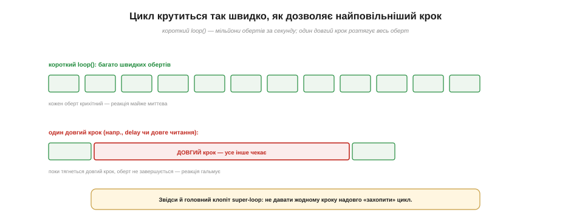
*Рис. 4.10.1.5. Короткий `loop()` робить багато швидких обертів — реакція майже миттєва. Та варто вкласти в цикл **один довгий крок** (наприклад, `delay()` чи неквапне читання) — і весь оберт розтягується, а все інше чекає, доки той крок завершиться.*

І ось тут уперше прозирає вразливість super-loop. Швидкість циклу визначає його **найповільніший** крок: поки тягнеться один тривалий виклик, увесь оберт стоїть і ніщо інше не виконується — ні наступне читання, ні оновлення виходу. Якщо десь у циклі трапиться `delay(1000)`, то цілу секунду пристрій буде наче «заморожений»: не зреагує на кнопку, не оновить екран. Поки кроки короткі, проблеми немає; та щойно якийсь із них **затягується**, чуйність усього пристрою провисає. Це перша тріщинка, з якої згодом виросте ціла потреба в задачах і планувальнику, — але про неї докладно вже в наступній темі.

Є тут і ще один практичний бік. Час одного оберту циклу неважко **виміряти** — запам'ятати `millis()` чи `micros()` на початку й наприкінці, — і це корисний діагностичний прийом, коли пристрій раптом «тупить». А ще довге зависання в циклі загрожує не лише чуйністю: за ним пильнує **сторожовий таймер** (watchdog, §4.6.7). Якщо `loop()` не завершиться надто довго, watchdog вирішить, що програма зависла, і **перезавантажить** чип. Тож затягнутий крок — це не просто неввічливо до інших справ, а й ризик несподіваного скидання.

### Кілька справ в одному циклі: патерн millis

Як же тоді змусити super-loop робити **кілька** справ «водночас», не блокуючи його довгими паузами? Відповідь ми вже знаємо з §4.6.5 — **неблокувальний патерн із `millis()`**. Замість того щоб зупинятися на `delay()`, цикл щооберту лише **питає годинник**: «а чи не час вже зробити оту справу?» — і виконує лише ті, чий час настав.

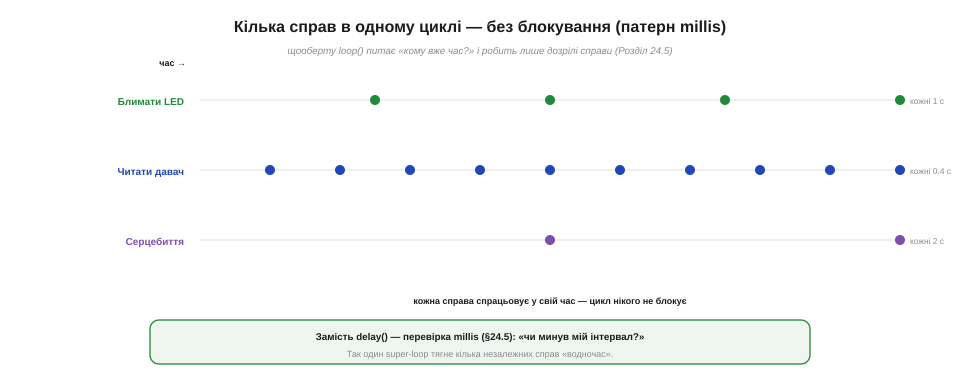
*Рис. 4.10.1.6. Один `loop()` тягне кілька незалежних справ: блимати світлодіодом щосекунди, читати давач щочверть секунди, слати «серцебиття» раз на кілька секунд. Кожна спрацьовує у свій час; цикл лише перевіряє `millis()` (§4.6.5) і нікого не блокує.*

Завдяки цьому патерну один-єдиний цикл здатний жонглювати кількома незалежними справами, кожна зі своїм ритмом. Світлодіод блимає раз на секунду, давач опитується п'ять разів на секунду, повідомлення йде раз на п'ять секунд — і все це в тому самому `loop()`, без жодного `delay()`. Секрет у тім, що цикл ніколи не **зупиняється** чекати: він пробігає по всіх справах, виконує ті, що дозріли, а решту лишає на потім і мчить далі. Так super-loop вдає багатозадачність — і для кількох нескладних справ робить це чудово.

Дрібна, але важлива деталь патерну: порівняння пишуть саме як `now - t >= interval` (різниця), а не `now >= t + interval`. Перше **переживає переповнення** лічильника `millis()` (§4.6.4), друге — ні. І все ж у цього підходу є стеля: коли незалежних справ стає багато, а деякі ще й мусять чекати або мають різну терміновість, цикл швидко перетворюється на плутанину перевірок `millis`, у якій легко загубити нитку. Саме тут super-loop і починає прогинатися — та про це вже наступна тема.

> 🔧 **Навіщо це.** Запам'ятайте як золоте правило простого вбудованого коду: **уникайте `delay()` у `loop()`** — він заморожує все. Замість нього звіряйтеся з `millis()`: «чи минув мій інтервал?» Це той самий прийом, що в §4.6.5, але тепер ви бачите його роль ширше — він і є той інструмент, яким super-loop тягне кілька справ заразом. Доки справ небагато й вони короткі, цього підходу вистачає надовго.

**Приклад (super-loop із трьома справами без блокування).** Один цикл, три незалежні ритми.

```
unsigned long tLed = 0, tSens = 0, tBeat = 0;

void loop() {
    unsigned long now = millis();                 // «котра година»
    if (now - tLed  >= 1000) { tLed  = now; toggleLed();   }  // блимати щосекунди
    if (now - tSens >=  200) { tSens = now; readSensor();   }  // читати 5 разів/с
    if (now - tBeat >= 5000) { tBeat = now; sendHeartbeat();}  // серцебиття раз на 5 с
    // цикл нікого не блокує — пробіг, зробив дозріле, помчав далі
}
```
Жодного `delay()`: цикл щооберту лише перевіряє годинник і робить ті справи, чий час настав. Три ритми живуть в одному циклі, не заважаючи один одному.

Не варто думати про super-loop як про щось «несерйозне» чи суто для новачків. Безліч реальних виробів — від побутових дрібниць до промислових контролерів — усе життя працюють саме на ньому, надійно й передбачувано. Простота тут — чеснота, а не вада: що менше рухомих частин, то менше способів зламатися. RTOS потрібен не «бо так солідніше», а лише тоді, коли super-loop справді вже не дає ради, — і важливо чесно відрізняти одне від одного, а не тягнути важку артилерію на просту задачу.

Отже, super-loop — це проста й міцна основа: `setup()` раз, `loop()` вічно, усередині цикл «читай — обчисли — дій», термінове на перериваннях, а кілька справ — через неблокувальний `millis()`. Для багатьох пристроїв цього достатньо назавжди. Та ви, мабуть, уже відчули слабке місце: усе тримається на тому, що **жоден крок не затягується** й справ **небагато**. А що, як справ стане десяток, а деякі таки муситимуть чекати — на відповідь давача, на зв'язок, на людину? Тоді чепурний super-loop починає тріщати. Чому саме — і що з цим робити — у наступній темі.

## 4.10.2 Чому super-loop не масштабується (блокування, чуйність)

Super-loop простий і надійний для кількох коротких справ — це ми бачили. Та варто навантажити його більшим — десятком справ, деякі з яких **мусять чекати**, — і чепурна модель починає тріщати. Важливо зрозуміти, що ламається не **здатність** (super-loop теоретично може все), а **простота**: складність коду росте швидше за можливості, аж доки програму стає годі втримати в голові. Розгляньмо, звідки ця біда береться — вона має кілька облич: блокування, в'яла чуйність, межі патерну `millis`, вибух машин станів і брак пріоритетів.

### Блокування: одна пауза заморожує все

Головний лиходій — **блокування (*blocking*)**. Так називають будь-який виклик, що **чекає**: класичний `delay()`, повільне читання давача, очікування байта по зв'язку, мережевий запит. Біда в тім, що в super-loop усе виконується **по черзі**, тож поки один крок чекає, **весь** цикл стоїть — нічого іншого не відбувається.

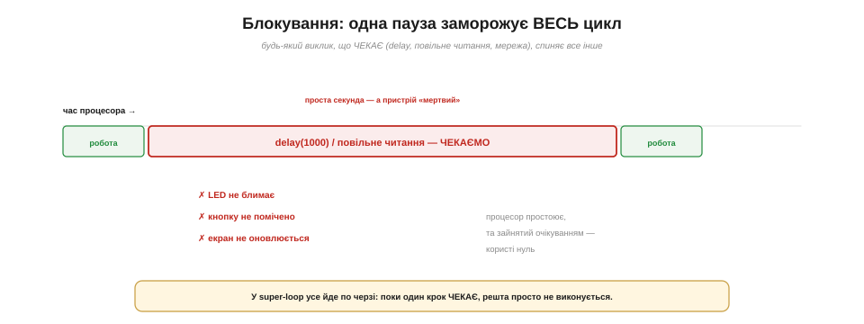
*Рис. 4.10.2.1. Поки в циклі тягнеться блокувальний крок (`delay(1000)` чи повільне читання), усе інше **завмирає**: світлодіод не блимає, кнопку не помічено, екран не оновлюється. Найприкріше — процесор тим часом простоює, але **зайнятий очікуванням**, тож користі з нього нуль.*

Подумаймо, наскільки це марнотратно. Сучасний чип робить сотні мільйонів операцій за секунду — а через одне-єдине `delay(1000)` він цілу секунду стоїть стовпом, нічого не роблячи й нікому не відповідаючи. Це гірше, ніж просто повільно: пристрій на цей час фактично **мертвий**. І що більше в коді таких блокувальних місць, то частіше й довше все застигає. Уже звідси видно межу super-loop: він зносить блокування лише доти, доки воно коротке й рідкісне.

Підступність блокування ще й у тім, що воно часто **приховане**. `delay()` видно одразу, а от що повільне читання вологоміра триває 50 мс, що `Serial.print` може **застрягти**, коли буфер переповнений, що бібліотека дисплея всередині чекає на готовність, — це з коду не впадає в око. Тож пристрій раптом починає «підморожувати» в найневиннішому місці. Перше правило діагностики тут: шукайте, **хто чекає**, — саме очікування, а не обчислення, найчастіше й краде чуйність. Тому досвідчений розробник, гортаючи чужу бібліотеку, насамперед видивляється в ній цикли очікування й виклики на кшталт `delay` чи `wait`.

### Чуйність = найдовший прохід

Друге обличчя проблеми — **чуйність (*responsiveness*)**, тобто як швидко пристрій реагує на події. У super-loop вона безжально проста: найгірша затримка реакції дорівнює тривалості **найдовшого проходу** циклу. Адже подію (натиснуту кнопку, прихід команди) цикл помітить лише тоді, коли дійде до відповідного кроку, — а в найгіршому разі вона трапиться якраз на початку довгого проходу й чекатиме майже до його кінця.

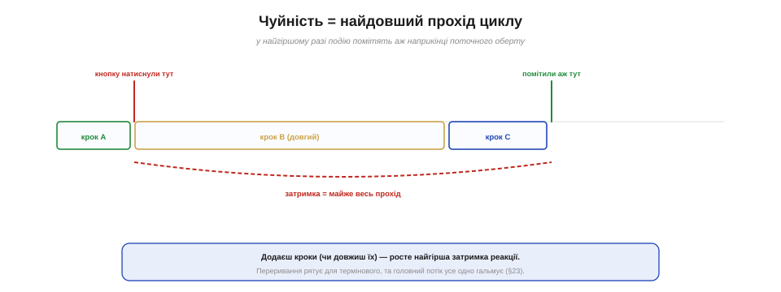
*Рис. 4.10.2.2. Кнопку натиснули на початку довгого кроку — а помітять її аж наприкінці проходу. Затримка реакції в найгіршому разі дорівнює тривалості найдовшого оберту. Додаєш кроки чи довжиш їх — росте й ця затримка.*

Звідси неприємний висновок: **що більше роботи в циклі, то млявіший пристрій**. Доки прохід триває мікросекунди, реакція здається миттєвою; та коли в циклі назбирується важких кроків на десятки чи сотні мілісекунд, кнопки починають «залипати», звук — заїкатися, керування — запізнюватися. Переривання (§4.5) рятують термінове — вони спрацьовують поза чергою, — але вони короткі й не годяться для повноцінної роботи; **головний потік** все одно гальмує, а більшість справ живе саме в ньому.

Окремо варто відрізняти **середню** затримку від **найгіршої**. Усереднено пристрій може здаватися жвавим, та керування й звук ламає саме найгірший випадок — рідкісний, але довгий прохід, що дає «затинку» (джитер). Для рівного звуку, плавного керування мотором чи точного опитування давача важлива не середня швидкість, а **гарантія**, що жоден прохід не затягнеться понад межу. Super-loop такої гарантії дати не може: досить однієї нової важкої справи — і найгірший випадок виростає, а з ним і помітні «затинки».

### Патерн millis рятує — але не завжди

«Стривайте, — скажете ви, — а патерн `millis` із §4.10.1 саме й рятує від блокування?» Так, рятує — але має власну, доволі низьку стелю. Він працює лише тоді, коли **кожну** справу можна порізати на крихітні шматочки, що виконуються по одному щооберту. Але багато операцій так **не вміють**: вони блокують **усередині себе**, і поділити їх не виходить.


*Рис. 4.10.2.3. Ліворуч — справа, яку легко порізати на шматочки (блимання, лічба): патерн `millis` із нею чудово дає раду. Праворуч — операція, що блокує зсередини (мережевий запит, читання SD-картки, повільний давач): це суцільний блок, який не поділиш, хіба що переписати з нуля. До того ж один довгий шматок усе одно затримує решту — бо потік один.*

Тут криються одразу дві халепи. Перша: чужий код (бібліотека для дисплея, мережі, картки пам'яті) часто написаний **блокувально** — він сам усередині чекає, і ви не маєте куди вставити свою перевірку `millis`. Друга, глибша: навіть якщо ви все порізали, потік виконання **один**, тож варто комусь одному взяти довший шматок — і решта чекає. Патерн `millis` лише **вручну імітує** одночасність, а під нею завжди той самий єдиний цикл, що виконує все по черзі.

Частково тут допомагають **подієві** бібліотеки — ті, що не чекають, а викликають вашу функцію-обробник, коли результат готовий (зворотний виклик). Вони допомагають не блокувати, та мають і свою ціну: логіка розсипається на розрізнені обробники, які важко зв'язати в єдину послідовну думку. Виходить той самий обмін: уникаєш блокування — платиш зрозумілістю. Цей компроміс і штовхає врешті до повноцінних задач, де «почекати» нарешті перестане бути проблемою.

> 🔧 **Навіщо це.** Перш ніж тягти важкий RTOS, чесно спитайте: а чи **всі** мої справи можна порізати на короткі неблокувальні шматки? Якщо так — патерн `millis` (§4.10.1) ще довго вас вестиме, і ускладнювати не варто. Якщо ж серед справ є принципово блокувальні (мережа, файли, повільні протоколи) або їх просто забагато — це чесний сигнал, що super-loop вичерпується й час дивитися в бік задач.

### Ручні машини станів вибухають

Припустімо, ви все ж вирішили порізати кожну справу на шматочки. Тоді просту послідовну думку — «зроби A, **почекай**, зроби B, почекай, зроби C» — доводиться **вивертати** в машину станів: завести змінну стану, на кожному оберті перевіряти, у якій фазі ви зараз, робити належне й переходити далі. Для **однієї** справи це ще терпимо. Але справ багато, вони переплітаються — і машини станів **вибухають**.


*Рис. 4.10.2.4. Ліворуч — як хочеться думати: проста послідовність «зроби — почекай — зроби», що читається згори вниз. Праворуч — на що вона перетворюється без блокування: плутана машина станів із купою переходів. А коли таких справ три й вони взаємодіють, їхні стани переплітаються в справжнє спагеті.*

Ось де ховається справжня причина, чому super-loop «не масштабується». Кожна нова справа не просто додає коду — вона **множить** заплутаність, бо мусить уживатися в часі з усіма іншими. Логіка, що в послідовному вигляді була б очевидною («увімкни мотор, зачекай дві секунди, вимкни»), розповзається на півдесятка станів, прапорців і таймерів, розкиданих по циклу. Люди **погано** тримають у голові таку ручну імітацію одночасності: легко забути перехід, переплутати стан, зламати чуже тонке налаштування часу однією правкою. Програма ще якось працює — але стає крихкою й страшною на дотик.

Найгірше виявляється під час супроводу. Машину станів важко **налагоджувати**: помилка — це не «не та формула», а неправильний перехід десь у плетиві умов, що спрацьовує лише за рідкісного збігу обставин. Класична фраза такого коду — «усе працювало, доки я не додав ще одну справу»: нова справа збила тонкий часовий баланс старих. Що більший проєкт, то страшніше до нього торкатися — а це вже не технічна межа, а **людська**, і саме вона зазвичай і вирішує перейти на задачі.

### Немає пріоритетів

І останнє обличчя проблеми — **відсутність пріоритетів**. У super-loop справи перевіряються строго в тому порядку, як написані в коді. А отже, **терміновому** нема як пробитися вперед: воно чекає своєї черги нарівні з найбуденнішою рутиною.

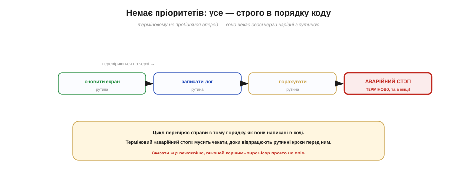
*Рис. 4.10.2.5. Цикл перебирає справи в порядку коду: оновити екран, записати лог, порахувати… і лише потім — терміновий «аварійний стоп». Сказати «це важливіше, виконай негайно» super-loop просто не вміє: терміновому доводиться чекати, доки відпрацює вся рутина перед ним.*

Для багатьох пристроїв це фатально. Уявіть верстат, де є рутина (оновлювати дисплей, писати журнал) і є критична реакція (аварійний стоп за сигналом давача). У super-loop стоп чекатиме, доки цикл дійде до нього, — а це можуть бути ті самі небезпечні сотні мілісекунд. Звісно, найкритичніше виносять на переривання; та переривань небагато, вони мають бути блискавичними, і всю складну реакцію в них не запхаєш. Бракує саме того, що дає операційна система: можливості сказати «**ця** робота важливіша за ту, тож хай іде першою».

> 🔧 **Навіщо це.** Навчіться впізнавати симптоми, що super-loop вичерпався: пристрій «підморожує» під час певних операцій; блимання чи звук «затинаються»; додавання нової справи ламає час старих; у коді розрослося плетиво прапорців і станів; є робота, яку конче треба робити **першою**, а вона чекає в черзі. Помітили кілька таких ознак разом — це не привід героїчно «дотискати» super-loop, а чесний сигнал, що настав час задач і планувальника. І навпаки: нема цих ознак — не ускладнюй на порожньому місці.

### Чого ми насправді хочемо

Зберемо всі скарги докупи — і з них сам собою проступить ідеал. Ми хочемо писати **кожну** справу як **окрему просту послідовну програму**: «зроби, почекай, зроби», читану згори вниз, ніби вона сама-одна володіє процесором. А нудне перемикання між цими програмами — хто коли біжить — хочемо **довірити комусь іншому**, хто робив би це чесно й, за потреби, з урахуванням пріоритетів.

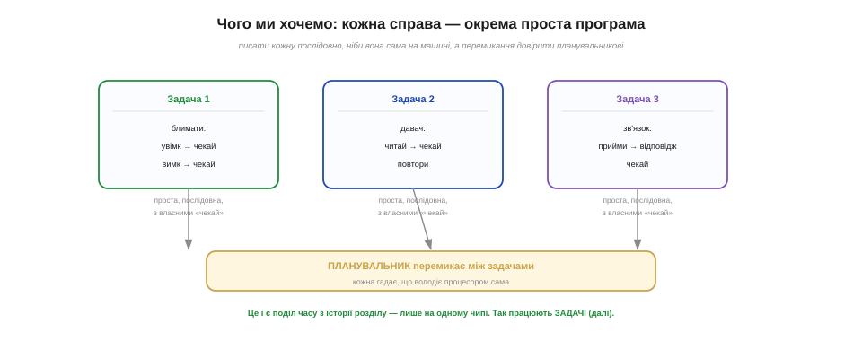
*Рис. 4.10.2.6. Омріяна картина: кожна справа — окрема проста послідовна задача з власними «чекай», написана так, ніби вона сама на машині. А **планувальник** перемикає між ними, і кожна гадає, що володіє процесором одноосібно. Упізнаєте? Це і є поділ часу з історії розділу — лише на одному чипі.*

А це ж — рівно та сама ідея, з якої починалася історія розділу: **поділ часу**. Те, що 1961 року дало багатьом людям ілюзію особистого комп'ютера, тепер дасть нашим **справам** ілюзію особистого процесора. Кожну справу пишемо просто й послідовно, з її власними паузами, а спеціальний механізм — **планувальник** — швидко перемикається між ними, зберігаючи й відновлюючи їхній стан. Так блокування однієї справи перестає морозити інші (поки одна чекає, планувальник віддає процесор іншій), чуйність відв'язується від найдовшого кроку, а пріоритети нарешті стають можливими. Ці окремі послідовні програми й звуться **задачами**, а механізм перемикання — серцем **RTOS**. Саме до них ми тепер і переходимо.

Ключове слово в цій мрії — **«чекай»**. У super-loop «почекати» означало заморозити все; у світі задач «почекати» означатиме інше — задача каже планувальникові «мені поки нема чого робити, віддай процесор іншим», і той радо віддає. Те саме блокувальне очікування, що нищило super-loop, у задачах стає **корисною паузою**, під час якої працюють інші. Саме ця зміна змісту слова «чекати» — і є серце переходу, який ми робимо далі.

Скажемо чесно й про ціну переходу, щоб не творити нового міфу. Задачі та планувальник аж ніяк не безкоштовні: кожна задача має власний **стек**, а отже, споживає пам'ять; саме перемикання контексту теж коштує процесорного часу; і, найголовніше, з'являється цілий новий клас турбот — про спільні дані між задачами, перегони й взаємні блокування. Тому RTOS — не «завжди краще», а **інструмент під певний клас задач**: коли блокувань і незалежних справ справді багато або конче потрібні пріоритети. Для простого ж пристрою super-loop і досі найрозумніший вибір — простіший, передбачуваніший і ощадніший до пам'яті. Уся наступна частина розділу саме про те, коли й як братися за задачі **свідомо**, зважуючи цю ціну, а не женучись за гучним словом.

**Приклад (де super-loop ламається — у числах).** Пристрій має одночасно блимати, читати давач і відповідати на запити.

```
Справи:  блимати щопівсекунди (500 мс)
         читати давач — блокує 50 мс
         відповісти на мережевий запит — блокує 200 мс

У super-loop, коли надходить мережевий запит:
   200 мс увесь цикл «заморожено» → LED не блимає, кнопка не помічена
   блимання збивається з ритму (пропускає свій момент 500 мс)
Найгірша затримка реакції ≈ сума блокувань в одному проході (тут до 250 мс)

Що більше таких блокувальних справ — то частіше й довше пристрій «зависає».
```
Висновок очевидний: доки справи короткі й їх мало, super-loop чудовий; та щойно з'являється принципове блокування чи багато взаємопов'язаних справ, він починає мучити і пристрій, і програміста. Вихід — дати кожній справі бути окремою простою програмою, а перемикання довірити планувальникові. Перший крок до цього — поняття **задачі**, яке і є наступна тема: те, що нарешті дозволить одній справі «почекати», не спиняючи всіх інших.

## 4.10.3 Задачі (tasks): кілька «програм» водночас

У попередній темі ми намалювали ідеал: писати кожну справу як окрему просту послідовну програму, а перемикання довірити планувальникові. Цей ідеал має ім'я — **задача (*task*)**. Задача — це і є та сама «окрема маленька програма»: незалежний шматок коду зі своїм нескінченним циклом, що виконується наче сам по собі, поряд з іншими задачами. Знайомлячись із ними, ми нарешті здобуваємо те, чого так бракувало super-loop: можливість **чекати, не морозячи інших**. Розберімо, що таке задача, як вона влаштована й чому вона розв'язує всі біди попередньої теми.

### Задача — це окрема маленька програма

Найпростіше уявити задачу як **власний маленький super-loop**. Це функція з нескінченним циклом усередині, написана просто й лінійно: зроби це, почекай, зроби те, повтори. Кілька задач — це кілька таких маленьких програм, кожна зі своїм ритмом, кожна нічого не знає про інших.

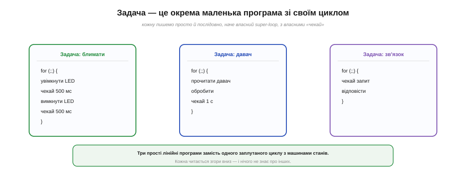
*Рис. 4.10.3.1. Три задачі — три прості лінійні програми: одна блимає (увімк → чекай → вимк → чекай), друга читає давач раз на секунду, третя відповідає на запити. Кожна має власний `for(;;)` і читається згори вниз, наче окремий super-loop, не відаючи про сусідів.*

Порівняйте це з тим, у що перетворювався super-loop наприкінці §4.10.2: один цикл, обплутаний машинами станів, де всі справи переплетені. Тут — навпаки: кожна справа **відокремлена** у свою задачу й написана найприроднішим, послідовним способом. Логіка «увімкни мотор, зачекай дві секунди, вимкни», що в super-loop розповзалася на півдесятка станів, у задачі лишається тими самими трьома рядками. Це і є головна перевага задач для **програміста**: складність більше не множиться — кожну справу пишеш так, ніби вона єдина на машині.

Звідси й проста порада, як ділити програму на задачі: **за окремими справами**, кожна зі своїм ритмом і призначенням. Одна задача опитує давач, друга веде дисплей, третя слухає мережу, четверта крутить мотор. Такий поділ не лише полегшує написання, а й робить код **зрозумілим**: глянувши на задачу, одразу бачиш, що вона робить, не продираючись крізь чужу логіку. А ще задачі легко додавати й прибирати — нова справа не чіпає старих, бо живе у власній програмі.

### Чарівна зміна: «чекати», не морозячи інших

Та сама важлива магія — у тому, що означає **«чекати»** всередині задачі. У super-loop пауза (`delay`) морозила геть усе. У задачі ж пауза (її роблять спеціальним викликом, як-от `vTaskDelay`) означає зовсім інше: задача каже планувальникові «мені поки нема чого робити», і той **негайно віддає процесор іншій** задачі. Процесор не простоює ані такту.

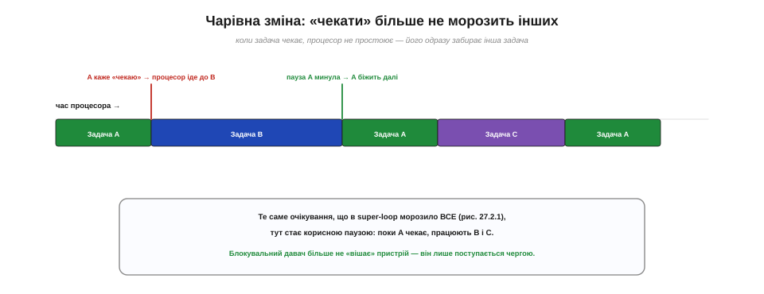
*Рис. 4.10.3.2. Те саме очікування, що в super-loop морозило все (рис. 4.10.2.1), тут стає корисною паузою: коли задача A каже «чекаю», процесор одразу переходить до B, а як пауза A минає — A біжить далі. Поки одна чекає, інші працюють.*

Ось де розчиняється головна біда §4.10.2 — **блокування**. Тепер повільне читання давача, що блокує на 50 мс, гальмує **лише свою** задачу; усі інші тим часом спокійно працюють. Світлодіод блимає точно за розкладом навіть тоді, коли задача-давач «зависла» на повільному читанні. Те, що в super-loop було отрутою, у світі задач стало нешкідливим: очікування однієї справи — це просто нагода попрацювати для решти. Саме ця **зміна сенсу слова «чекати»** є серцем усього переходу до задач.

Чекати задача може не лише на час. Вона так само «засинає», очікуючи на **дані** від іншої задачі, на **сигнал** від переривання, на звільнення спільного ресурсу — і щоразу чесно віддає процесор. Через це в багатозадачному середовищі слово «блокувати» з лайки перетворюється на **інструмент**: ми навмисне блокуємо задачу, щоб вона не крутилася намарно, а прокидалася рівно тоді, коли є робота. Як саме задачі чекають одна на одну й передають дані — тема §4.10.6; тут досить знати, що будь-яке таке очікування поступливе.

> 🔧 **Навіщо це.** Запам'ятайте різницю двох «пауз». У задачі **не** користуйтеся порожнім очікуванням, що крутить процесор намарно (як старий `delay` на простих платах); беріть «поступливу» паузу (`vTaskDelay` чи подібну), що **віддає** процесор іншим. Приємний нюанс саме для ESP32: там навіть звичайний `delay()` поступливий, бо Arduino на цьому чипі працює поверх FreeRTOS, — тож `delay()` усередині задачі не морозить інші задачі, а чесно поступається. І все ж звичка свідомо обирати поступливу паузу вбереже вас на інших платформах.

### У кожної задачі — свій стек

Як же задача примудряється «пам'ятати», де вона спинилася, поки бігали інші? Завдяки тому, що в кожної задачі є **власний стек (*stack*)**. Згадаймо з §4.2: стек зберігає локальні змінні, ланцюг викликів функцій і точку, куди повертатися. У задачі він додатково тримає **збережений контекст** — стан регістрів і лічильник команд тієї миті, коли задачу спинили.

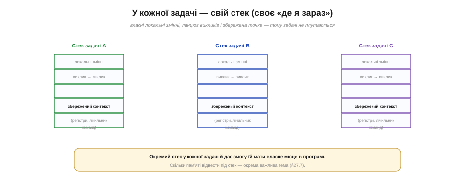
*Рис. 4.10.3.3. Кожна задача має свій окремий стек: власні локальні змінні, свій ланцюг викликів і збережений контекст (регістри, лічильник команд). Саме окремий стек і дає задачі змогу мати власне «місце» у своїй програмі, незалежне від інших.*

Це і є технічна основа ілюзії «власної машини». Коли планувальник перемикає задачі, він зберігає контекст поточної в **її** стек і відновлює контекст наступної з **її** стека — тож кожна, повертаючись до роботи, бачить рівно те, що залишила: ті самі локальні змінні, ту саму позицію в коді. Задачі не плутаються між собою саме тому, що їхні «робочі столи» — окремі. Платою за це є пам'ять: кожен стек її займає, і скільки саме відвести під стек кожної задачі — важливе практичне питання, якому присвячено окрему тему (§4.10.7).

Тут варто чесно назвати ціну. Що більше задач, то більше стеків, а отже, більше витраченої оперативної пам'яті — і на скромному мікроконтролері це відчутно. Тому задачі не плодять без міри: кожна має виправдовувати свій стек. Це ще одна причина не кидатися на багатозадачність, коли вистачає простого циклу, — і ще один привід уважно поставитися до розмірів стеків (§4.10.7), бо саме там легко або змарнувати пам'ять, або, навпаки, її не вистачити.

### Стани задачі: біжить, готова, заблокована

Щоб точно розуміти, що відбувається, корисно знати, що задача завжди перебуває в одному з кількох **станів**. На одному ядрі **біжить** (виконується) лише одна задача за раз; інші або **готові** (хочуть процесор і чекають своєї черги), або **заблоковані** (чекають на щось — на сплив паузи, на дані, на подію).

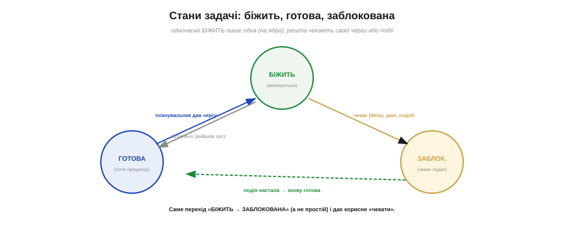
*Рис. 4.10.3.4. Життя задачі в трьох станах. БІЖИТЬ — виконується просто зараз (одна на ядро). ГОТОВА — хоче процесор, чекає черги. ЗАБЛОКОВАНА — чекає на подію (паузу, дані). Переходи: планувальник дає чергу (готова → біжить), витісняє (біжить → готова), задача чекає (біжить → заблокована), подія настала (заблокована → готова).*

Найважливіший із цих переходів — **«біжить → заблокована»**, бо саме він і дає корисне «чекати». Коли задача викликає `vTaskDelay` або чекає на дані, вона переходить у **заблокований** стан і **сходить** із процесора зовсім — не марнуючи його, як робив порожній `delay` у super-loop. Звільнене ядро планувальник одразу віддає котрійсь із **готових** задач. А коли очікувана подія настає (минула пауза, прийшли дані), заблокована задача знову стає **готовою** й чекає вже лише своєї черги на процесор. Цей кругообіг станів і є те, як насправді живе багатозадачна система.

Корисно усвідомити, що в **добре** збудованій системі задачі більшу частину часу саме **заблоковані** — вони сплять, чекаючи на свою подію, і прокидаються лише до діла. Коли ж усі задачі заблоковані разом, процесор не лишається без діла даремно: спрацьовує особлива **задача простою** (*idle task*), яка зазвичай присипляє ядро задля економії енергії. Тож добра багатозадачна програма не «крутить» процесор намарно, а більшість часу дрімає — і це ознака правильного дизайну, а не лінощів.

### Як створюють задачу

Лишилося побачити, як задачу **створюють**. У FreeRTOS (а саме він стоїть в ESP32) це робить один виклик — `xTaskCreate`, якому передають функцію-задачу та кілька параметрів. Сама функція-задача — це вічний цикл, що, на відміну від звичайної функції, **ніколи не повертається**.

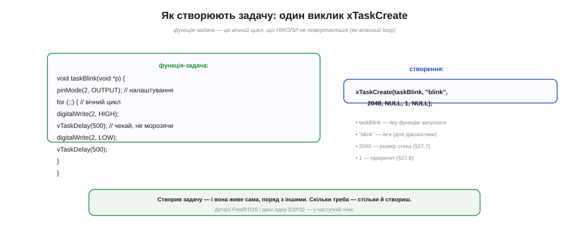
*Рис. 4.10.3.5. Функція-задача (ліворуч) — це налаштування плюс вічний `for(;;)` з поступливими паузами. Створюють її викликом `xTaskCreate` (праворуч), указавши: яку функцію запускати, ім'я (для діагностики), розмір стека (§4.10.7), параметр, пріоритет (§4.10.8) і дескриптор. Створив — і задача живе сама, поряд з іншими.*

Структура функції-задачі дуже схожа на знайому пару `setup`/`loop`: спершу разове налаштування, а тоді вічний цикл роботи — лише тепер таких «програм» може бути багато, кожна у своїй задачі. Створюєте їх стільки, скільки потрібно, кожним викликом `xTaskCreate`; від тієї миті задача живе самостійно, і планувальник вплітає її в спільний час. Глибші подробиці — як це робить FreeRTOS і як до справи долучається друге ядро ESP32 — ми розберемо в наступній темі; тут досить бачити, що задача з'являється одним рядком.

Останній аргумент `xTaskCreate` — **дескриптор** (*handle*): через нього потім можна керувати задачею ззовні — призупинити, відновити, видалити, змінити пріоритет. Якщо керувати не треба, туди передають `NULL`. До речі, звичний `loop()` на ESP32 — теж задача, яку каркас створив за вас (§4.10.1); тож, додаючи власні задачі, ви просто стаєте поряд із нею, а не починаєте з порожнього місця.

> 🔧 **Навіщо це.** Кожна функція-задача мусить **ніколи не «провалюватися» за свій вічний цикл**: або крутить `for(;;)` без кінця, або, якщо колись завершується, прибирає себе викликом на кшталт `vTaskDelete`. Звичайна функція, дійшовши до `}`, просто повертається — а задача, що «випала» з циклу й дійшла до кінця, поводиться непередбачувано. Тож пишіть тіло задачі як вічний цикл — рівно так, як писали `loop()`, лише тепер їх може бути кілька.

### Ілюзія багатьох програм на одному ядрі

Наостанок — чесно нагадаймо, що насправді відбувається «під капотом». Одне ядро процесора вміє робити лише **одне** за раз. То як же кілька задач біжать «водночас»? Так само, як у поділі часу 1961 року: ядро **дуже швидко перемикається** між задачами, і ззовні здається, ніби всі вони працюють безперервно.

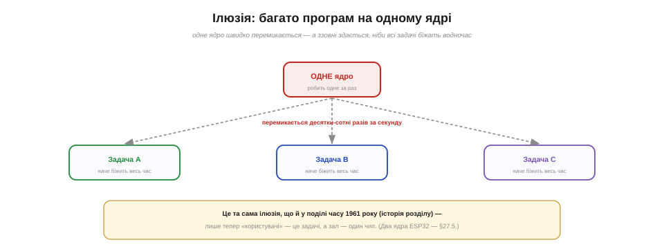
*Рис. 4.10.3.6. Одне ядро робить одне за раз, та перемикається між задачами десятки-сотні разів за секунду — тож кожна задача наче біжить весь час. Це достеменно та сама ілюзія, що й у поділі часу 1961 року: лише «користувачі» тепер — це задачі, а зал — один чип.*

Тут варто бути чесним і не вважати задачі «справжньою» одночасністю: на одному ядрі це майстерна ілюзія — та сама, що колись давала користувачам мейнфрейма відчуття особистої машини. Для більшості цілей ілюзії досить — пристрій поводиться так, **ніби** все відбувається паралельно. А ESP32 додає приємний козир: у нього **два** ядра, тож частину задач можна виконувати по-справжньому **одночасно**, а не лише почергово. Та про два ядра й про те, як ними розпоряджається FreeRTOS, — окрема розмова в наступних темах; тут головне засвоїти саму ідею задачі.

І хай це ілюзія для процесора — для **програміста** виграш цілком реальний. Не має значення, що насправді задачі чергуються, а не біжать пліч-о-пліч: код від цього стає справді простішим. Ви пишете кожну справу як окрему ясну програму, а не як заплутаний клубок станів, — і саме ця ясність, а не «справжня» одночасність, є головною винагородою за перехід до задач. Машина вдає паралельність — зате ваша голова справді відпочиває.

**Приклад (сценарій із §4.10.2, переписаний на задачах).** Ті самі три справи — але кожна окрема й проста.

```
void taskBlink(void *p)  { for(;;){ toggleLed(); vTaskDelay(500); } }   // блимати
void taskSensor(void *p) { for(;;){ readSensor();      // блокує 50 мс —
                                    vTaskDelay(1000); } }                //   та лише ЦЮ задачу
void taskComm(void *p)   { for(;;){ waitRequest();     // блокує, чекаючи —
                                    reply(); } }                         //   теж лише цю задачу

// у setup(): створюємо всі три
xTaskCreate(taskBlink,  "blink",  2048, NULL, 1, NULL);
xTaskCreate(taskSensor, "sensor", 2048, NULL, 1, NULL);
xTaskCreate(taskComm,   "comm",   4096, NULL, 1, NULL);
```
Тепер повільне читання давача (50 мс) гальмує **лише** `taskSensor`; `taskBlink` тим часом блимає точно за розкладом, а `taskComm` спокійно чекає запитів. Те саме очікування, що морозило super-loop, тут не шкодить нікому — кожна справа живе сама по собі. А додати четверту справу так само просто: ще одна задача, ще один `xTaskCreate`, і старі три навіть не помітять появи новенької.

Отже, задача — це окрема проста програма з власним стеком, що живе в станах «біжить / готова / заблокована» і, найважливіше, вміє **чекати**, не зупиняючи інших. Кілька задач разом дають ілюзію багатьох програм, що біжать водночас, — і знімають усі біди super-loop із §4.10.2. Лишилося велике питання: **хто** і **за яким правилом** вирішує, котра задача біжить цієї миті, котра чекає, кого витіснити? Цей розпорядник зветься **планувальником** — і саме він є наступною темою.

## 4.10.4 Планувальник: хто й коли виконується (витісняючий vs кооперативний)

Ми вже знаємо, що задачі живуть «водночас» завдяки швидкому перемиканню. Та хто ж ним керує — вирішує, котра задача біжить цієї миті, а котра чекає? Це робить **планувальник (*scheduler*)** — серце будь-якої багатозадачної системи. У нього два головні питання: **хто** має бігти і **коли** перемикати. Відповідь на «коли» ділить усі системи на дві філософії — **кооперативну** й **витісняючу**. Розберімо і самого розпорядника, і обидві філософії, і той «тік», що дає планувальникові пульс.

### Планувальник: розпорядник процесорного часу

Найперше уявімо роль планувальника просто. У будь-яку мить багато задач хочуть процесора (вони **готові**), а деякі чекають на свою подію (вони **заблоковані**, §4.10.3). Планувальник — це розпорядник, що серед **готових** обирає одну й віддає їй процесор. Заблоковані його не обходять: вони не змагаються за час, поки сплять.

Зручна аналогія — диспетчер на вокзалі: він не їде в поїздах, а лише вирішує, котрий відправити з єдиної колії наступним. Сам планувальник — це невеликий і дуже швидкий шматок коду: його робота має бути блискавичною, бо виконується він часто й сам відбирає час у задач. Тому планувальники роблять гранично простими — складна логіка вибору коштувала б дорожче, ніж користь від неї.

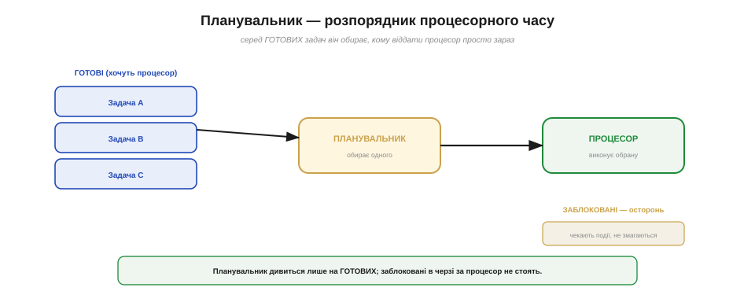
*Рис. 4.10.4.1. Планувальник — розпорядник процесорного часу: серед **готових** задач він обирає одну й віддає їй процесор. Заблоковані задачі стоять осторонь і за час не змагаються. Уся його робота — щоразу відповісти на питання «кому бігти тепер?».*

Важливо розуміти, що планувальник працює **не безперервно**, а лише в окремі моменти — коли є привід щось вирішувати. Решту часу процесор просто виконує обрану задачу, а планувальник «спить». Тож по-справжньому цікаве питання не «що він робить», а **коли він прокидається** й бере кермо у свої руки. Цих приводів рівно три.

### Коли перемикати: три приводи

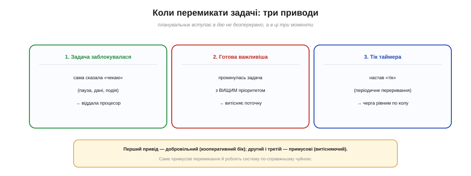
*Рис. 4.10.4.2. Планувальник вступає в дію з трьох причин: (1) задача сама заблокувалася («чекаю») і віддала процесор; (2) прокинулась готова задача з **вищим** пріоритетом і витісняє поточну; (3) настав **тік** таймера, за яким рівних діляться по черзі. Перший привід добровільний, два інші — примусові.*

Перший привід — **добровільний**: задача сама каже «чекаю» (пауза, дані, подія), переходить у заблокований стан і звільняє процесор; планувальник тоді обирає наступного. Другий і третій — **примусові**: планувальник забирає процесор у задачі, навіть якщо та й не думала поступатися. Другий спрацьовує, коли прокидається важливіша (вищопріоритетна) задача; третій — за «тіком» таймера, щоб рівні задачі не захопили час назавжди. І ось ключова думка: чи дозволено планувальникові **примусово** забирати процесор — це і є та межа, що ділить дві філософії планування.

Варто оцінити, який із приводів найважливіший для **ефективності**. Це перший — добровільне блокування: саме воно перетворює просте очікування на корисний час для інших (§4.10.3). Якби існував лише він, ми мали б кооперативну систему; додавання примусових приводів (другого й третього) і робить її витісняючою, придатною до роботи в реальному часі. Тобто блокування дає ощадність, а витіснення — надійність; добра система спирається на обидва.

### Кооперативний: задача сама поступається

У **кооперативному (*cooperative*)** плануванні дозволено лише **перший** привід — добровільний. Кожна задача біжить, аж доки **сама** не поступиться (не заблокується чи не покличе явний «поступись»). Планувальник тут увічливий: він не втручається, доки задача не віддасть процесор з власної волі.


*Рис. 4.10.4.3. Кооперативний планувальник перемикає задачі лише тоді, коли поточна **сама** поступається. Як задумано (вгорі) — кожна попрацювала й передала чергу. Біда (внизу) — задача, що зажерлася й не поступається, крутиться без кінця, і всі інші стоять, як у застряглому super-loop.*

Кооперативний підхід має свої принади: він простіший, і в ньому менше підступних «гонок» — адже задачу ніколи не зупиняють посеред справи, а лише на чітких, нею ж обраних точках. Та є й велика вада: уся система тримається на **чесності** задач. Досить одній зажертися — увійти в довге обчислення чи, боронь боже, у блокувальний цикл — і вона заморозить **усіх**, точнісінько як одна довга справа морозила super-loop (§4.10.2). Кооперативне планування годиться, лише коли ви певні, що всі задачі поводяться чемно; а в реальному світі такої певності зазвичай нема.

Це не теорія: цілі епохи персональних комп'ютерів жили на кооперативному плануванні — ранні версії Windows і Mac OS перемикали програми лише тоді, коли ті самі поступалися. Наслідок знайомий усім, хто застав ту добу: одна зависла програма морозила всю систему. Саме тому індустрія зрештою перейшла на витісняюче планування. Утім, кооперативне й досі живе там, де задач мало, усі вони свої й перевірені, а простота та відсутність гонок цінніші за гарантії, — у деяких крихітних вбудованих системах.

### Витісняючий: планувальник забирає силою

У **витісняючому (*preemptive*)** плануванні дозволені й примусові приводи. Планувальник може **відібрати** процесор у задачі, не питаючи її згоди, — і робить це у двох випадках: коли прокинулась важливіша задача або коли настав черговий «тік». Поточну задачу спиняють посеред роботи (зберігши її контекст, §4.10.3) і дають процесор іншій.

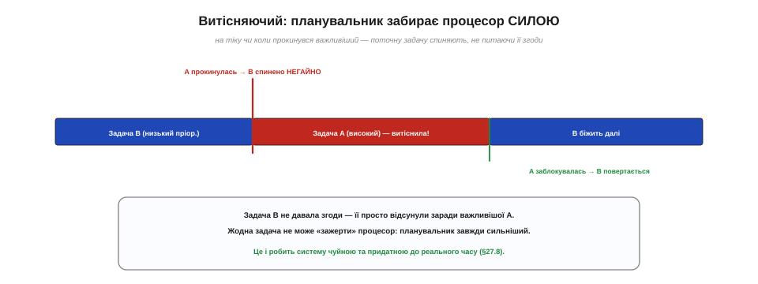
*Рис. 4.10.4.4. Витісняючий планувальник може спинити задачу примусово: щойно прокинулась важливіша (високопріоритетна) задача A, низькопріоритетну B **негайно** відсувають, не питаючи її згоди; а коли A знову заблокується, B повертається. Жодна задача не здатна «зажерти» процесор — планувальник завжди сильніший.*

Це принципово надійніше. Оскільки планувальник сильніший за будь-яку задачу, **жодна** з них не може захопити процесор назавжди: навіть зажерливу спинить найближчий тік. Тому витісняюче планування дає те, чого кооперативне обіцяти не може, — **гарантію чуйності**: важлива подія дочекається реакції за передбачений час, хоч би що робили інші задачі. Платою є складніші «гонки»: задачу можуть спинити **будь-якої** миті, навіть посеред оновлення спільних даних, — і про це доведеться дбати окремо (саме тут знадобляться засоби з §4.10.6). Та заради надійності й роботи в реальному часі на цю плату йдуть охоче; тому майже всі сучасні RTOS, зокрема й FreeRTOS на ESP32, витісняючі.

Не варто, однак, думати, що витіснення безкоштовне. Кожне перемикання контексту коштує процесорного часу — зберегти стан однієї задачі, відновити стан іншої, — тож **надто** часте перемикання саме по собі марнує ресурс. Тому й тут шукають баланс: перемикати досить часто для чуйності, але не настільки, щоб система більше «жонглювала» задачами, ніж виконувала корисну роботу. Витіснення — потужний інструмент, та, як і будь-який, має свою ціну.

> 🔧 **Навіщо це.** Тримайте в голові головний наслідок витіснення: вашу задачу можуть спинити **в будь-якому місці**, навіть на півдорозі зміни спільної змінної. Тому не покладайтеся на те, що «короткий шматок коду виконається цілісно» — це правда лише в кооперативній системі. У витісняючій (а саме така в ESP32) спільні дані між задачами треба захищати спеціально (§4.10.6), інакше отримаєте ту саму гонку, що й між циклом і ISR (§4.5.6), лише тепер між задачами.

### Тік: серцебиття планувальника

Звідки ж планувальник бере силу витісняти? З **тіку (*tick*)** — періодичного таймерного переривання, що править йому за пульс. Таймер (§4.6) налаштовують цокати через рівні проміжки (на ESP32 — зазвичай щомілісекунди), і кожен такий тік збуджує переривання (§4.5), яке на мить передає кермо планувальникові: «глянь, чи не час перемкнутися».

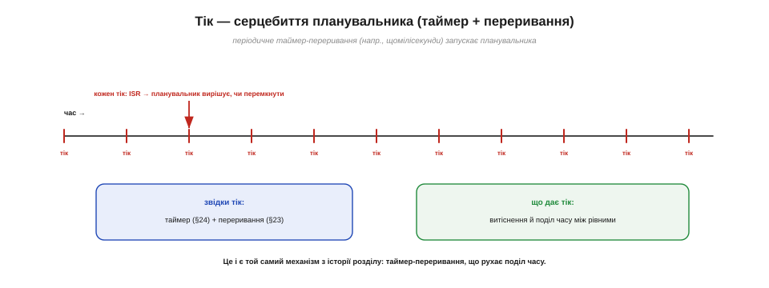
*Рис. 4.10.4.5. Тік — серцебиття планувальника: таймер (§4.6) рівно цокає, і кожен тік через переривання (§4.5) запускає планувальника, який вирішує, чи перемкнути задачі. Саме тік уможливлює і витіснення, і поділ часу між рівними. Це достеменно той механізм, про який ішлося в історії розділу.*

Ось де чудово замикаються попередні розділи модуля. Те, що в історії звучало абстрактно — «таймерне переривання рухає поділ часу», — тут стає буквальним: **таймер** дає рівний тік, **переривання** на кожному тіку будить планувальник, а той вирішує долю задач. Без тіку витіснення було б неможливе (нічого б не «штовхало» планувальник), і система скотилася б до кооперативної. Частоту тіку обирають як компроміс: частіший дає тонше перемикання, але з'їдає більше процесора на самі перемикання; тому беруть розумну середину — близько тисячі тіків на секунду.

Кілька корисних дрібниць про тік. По-перше, саме в тіках зазвичай і відміряють паузи задач: `vTaskDelay` рахує не мілісекунди, а **тіки**, тож реальна тривалість паузи залежить від частоти тіку (за тисячі тіків на секунду один тік — це якраз мілісекунда). По-друге, сучасні RTOS уміють **присипляти й сам тік**, коли всі задачі заблоковані надовго (так званий «безтіковий простій»), — щоб не будити процесор даремно й заощаджувати енергію. Тобто тік — не самоціль, а лише пульс, який за потреби можна притишити.

> ⚙️ **Зсередини.** Що насправді робить планувальник у мить перемикання — зберігає й відновлює регістри через стек — і як це **побачити та зміряти** на ESP32: [⚙️ Перемикання контексту зсередини](ch27-s4-a-context-switch.md).

### Як FreeRTOS обирає: пріоритет і round-robin

Лишилося відповісти на питання «**хто**?». FreeRTOS (планувальник ESP32) працює за простим і потужним правилом: завжди біжить **готова задача з найвищим пріоритетом**. Кожній задачі при створенні (§4.10.3) задають число-пріоритет; планувальник серед усіх готових обирає найпріоритетнішу. А якщо найвищий пріоритет ділять **кілька** готових задач — вони біжать **по черзі**, по тік-скибочці кожній (це й зветься **round-robin**, циклічний поділ часу).


*Рис. 4.10.4.6. Пріоритетно-витісняюче правило FreeRTOS: поки високопріоритетний давач готовий — біжить лише він, витісняючи все нижче. Щойно давач засне (заблокується), процесор дістається нижчому рівню, де лог і дисплей (рівні) ділять час по черзі — round-robin. Прокинеться давач — миттю забере процесор назад.*

Це правило поєднує дві ідеї: **пріоритет** вирішує, хто важливіший, а **round-robin** по-чесному ділить час між рівними. Завдяки цьому критична задача (скажімо, реакція на аварійний давач) дістає процесор миттєво, тільки-но стає готовою, а буденні справи мирно діляться рештою часу. Та є й пастка, про яку слід знати наперед: якщо високопріоритетна задача **ніколи не блокується** (крутиться без пауз), нижчі не дістануть процесора **взагалі** — це зветься **голодуванням (*starvation*)**. Тому пріоритети треба роздавати продумано, а високопріоритетні задачі мусять чесно засинати, віддаючи час іншим. Як саме проєктувати пріоритети для роботи в реальному часі — окрема тема (§4.10.8); тут досить засвоїти правило вибору.

Дві технічні дрібниці про пріоритети у FreeRTOS, щоб не плутатися згодом. По-перше, тут **більше число — вищий** пріоритет (0 — найнижчий); кількість рівнів задає налаштування системи. По-друге, на найнижчому пріоритеті 0 завжди живе вже знайома **задача простою** (§4.10.3): вона біжить лише тоді, коли більше нікому, і саме їй система доручає присипляти ядро. Тож усі ваші задачі завжди мають пріоритет не нижчий за неї — а отже, гарантовано колись дістануть процесор, якщо чесно блокуються.

> 🔧 **Навіщо це.** Двічі подумайте, перш ніж дати задачі високий пріоритет. Високий пріоритет — не «зробити швидше», а «витісняти інших»: така задача забере процесор у всіх нижчих, щойно стане готовою. Якщо вона до того ж погано засинає, нижчі **зголодніють**. Практичне правило: високий пріоритет — лише тим задачам, що рідко прокидаються, та мусять реагувати вмить (реакція на подію), а довгу рутину тримайте на низькому. І завжди давайте задачам блокуватися, а не крутитися намарно.

Для початку ж не переймайтеся пріоритетами надміру. Цілком розумна стартова стратегія — дати **всім** задачам однаковий пріоритет: тоді вони просто чесно ділять час по черзі (round-robin), як рівні, і жодна нікого не витісняє. Це найпростіша й найбезпечніша відправна точка, на якій багатозадачна програма вже добре працює. А вже потім, коли якась задача справді потребуватиме реагувати вмить, ви свідомо піднімете їй пріоритет — і знатимете, навіщо саме, а не тицятимете числа навмання.

**Приклад (що робить пріоритетно-витісняючий планувальник).** Три задачі, два рівні пріоритету.

```
Задачі:  давач  — ВИСОКИЙ пріоритет (має реагувати вчасно)
         лог    — низький
         дисплей — низький

Робота планувальника:
  давач готовий       → біжить ЛИШЕ давач (негайно витісняє лог/дисплей)
  давач заснув (delay) → лог і дисплей ділять час по черзі (round-robin)
  у давача нові дані   → він миттю витісняє того, хто саме біг
```
Так критичний давач завжди реагує вчасно, а лог і дисплей живуть із того часу, що лишається, — і ніхто нікого не блокує намертво. Жоден `delay` усередині будь-якої з них уже не страшний: він спиняє лише свою задачу, а планувальник тим часом віддає процесор готовим — рівно те, чого ми домагалися від самого початку розділу.

Отже, планувальник — це розпорядник, що в трьох випадках (блокування, поява важливішої задачі, тік) вирішує, кому бігти; витісняючий підхід (на відміну від кооперативного) дає йому силу відбирати процесор примусово, а таймерний тік — пульс для цього; FreeRTOS обирає за пріоритетом, а рівних ділить за принципом round-robin. Ми весь час називали цей планувальник «FreeRTOS» — час нарешті придивитися до нього самого: що це за система, чому вона вже є в кожному ESP32 і як усе змінюють **два ядра** цього чипа. Це — наступна тема.

## 4.10.5 RTOS і FreeRTOS на ESP32 (два ядра)

Досі ми говорили про задачі й планувальник абстрактно. Час назвати конкретику: систему, що все це робить у вашому ESP32, звуть **FreeRTOS**, і вона є прикладом **операційної системи реального часу (RTOS)**. У цій темі з'ясуємо, що таке RTOS узагалі, чому FreeRTOS вже працює в кожному ESP32, навіть коли ви про неї не думаєте, — і, головне, як усе змінює унікальний козир цього чипа: **два процесорні ядра**, що дають не лише ілюзію, а й справжню паралельність.

> **Застереження про слово «ядро».** Українське «ядро» тут означає дві різні речі: **ядро ОС** (*kernel* — серце операційної системи) і **процесорне ядро** (*core* — обчислювальний блок чипа). Щоб не плутатись, ядро ОС зватимемо «ядром FreeRTOS», а процесорне — «процесорним ядром» чи «Ядро 0 / Ядро 1».

### Що таке RTOS

**RTOS (*real-time operating system*, операційна система реального часу)** — це невелика програма-**ядро**, що надає готові «цеглинки» багатозадачності: задачі, планувальник, керування часом, засоби обміну між задачами й розподіл пам'яті. Усе, про що ми говорили в попередніх темах, — це і є послуги RTOS.

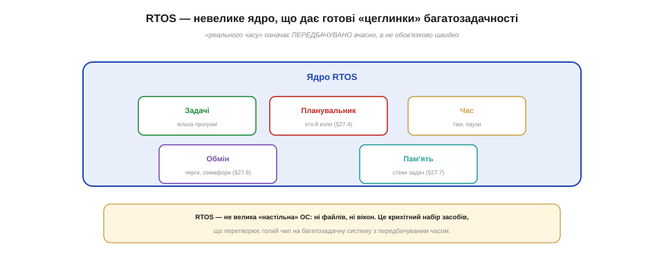
*Рис. 4.10.5.1. Ядро RTOS дає готовий набір засобів: задачі, планувальник (§4.10.4), керування часом (тіки, паузи), обмін між задачами (§4.10.6) і розподіл пам'яті під стеки (§4.10.7). Це не велика «настільна» ОС із файлами й вікнами, а крихітний набір, що перетворює голий чип на багатозадачну систему.*

Окремо варто розтлумачити слова **«реального часу»**, бо їх часто розуміють хибно. Вони означають не «дуже швидко», а «**передбачувано вчасно**»: система гарантує, що важлива задача дістане процесор у відомий, обмежений строк. Іноді система реального часу навіть повільніша за звичайну ОС у середньому — зате не дає прикрих несподіванок, і керівний імпульс ніколи не запізниться непередбачувано. Для пристрою, що керує мотором чи стежить за давачем, ця **передбачуваність** важливіша за рекордну швидкість. (Докладніше про реальний час — §4.10.8.)

Постає й резонне питання: а навіщо взагалі окрема ОС — хіба не можна самому написати перемикання задач? Можна, та це клопітно й легко наробити помилок, а головне — щоразу винаходити те саме. RTOS дає **перевірене, надійне** рішення тих самих задач, на яке можна спокійно спертися, зосередившись на власному ділі. До того ж RTOS — це саме **ядро**, а не повна ОС: воно дає механізми багатозадачності, та не нав'язує ні файлової системи, ні графіки, ні важкого баласту настільних ОС. Берете рівно стільки системи, скільки треба невеликому чипу.

### FreeRTOS: вже у твоєму ESP32

**FreeRTOS** — це конкретне, дуже популярне ядро RTOS. Воно крихітне (лічені кілобайти), вільне й відкрите, і перенесене на безліч мікроконтролерів. Створив його британський інженер **Річард Баррі (*Richard Barry*)** близько 2003 року; а 2017-го опіку над проєктом узяла компанія **Amazon (AWS)**, перевівши його під вільну ліцензію MIT, — і відтоді FreeRTOS став чи не найпоширенішим RTOS у світі вбудованих систем.

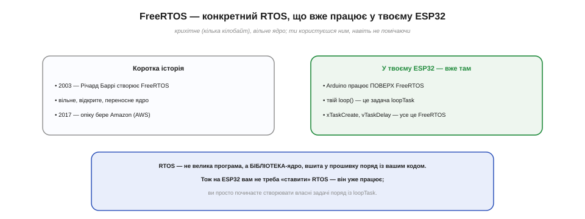
*Рис. 4.10.5.2. Коротка історія (Баррі, 2003 → Amazon, 2017) і головне для нас: у ESP32 FreeRTOS **уже працює**. Arduino на цьому чипі сам збудований поверх FreeRTOS, тож ваш `loop()` — насправді задача `loopTask`, а звичні `xTaskCreate` й `vTaskDelay` — це його виклики.*

Найважливіше тут — те, що на ESP32 FreeRTOS **вже вбудовано** в систему: фреймворк Espressif (ESP-IDF) збудований на ньому, а Arduino для ESP32 — поверх того. Це означає, що ви **вже** користуєтеся FreeRTOS, навіть у найпростішому скетчі: ваш `loop()` крутиться всередині створеної за вас задачі `loopTask` (з пріоритетом 1), а всі знайомі `xTaskCreate`, `vTaskDelay`, пріоритети й тіки — це його послуги. Тому вам нічого не потрібно «встановлювати»: RTOS — це не окрема велика програма, а **бібліотека-ядро**, вбудована у вашу прошивку поряд із вашим кодом. Ви просто починаєте додавати власні задачі поряд із тією, що вже є.

Варто оцінити, наскільки FreeRTOS поширений: він працює в незліченних мільярдах пристроїв — від іграшок до промислової автоматики, — тож набуті навички **переносяться** й на інші чипи, не лише ESP32. Мале технічне застереження: на ESP32 стоїть не зовсім «ванільний» FreeRTOS, а трохи допрацьована Espressif-версія з підтримкою двох ядер; та для нас, на рівні задач і пауз, вона поводиться так само, як класична, тож усе вивчене лишається в силі.

### Козир ESP32: два процесорні ядра

А тепер — головна особливість, заради якої цю тему й винесено окремо. Більшість мікроконтролерів мають **одне** обчислювальне ядро, тож уся їхня багатозадачність — лише ілюзія швидкого перемикання (§4.10.3). ESP32 ж має **два** процесорні ядра — велику рідкість у світі МК.


*Рис. 4.10.5.3. Два процесорні ядра ESP32: Ядро 0 (PRO_CPU, «протокольне») за умовчанням тягне Wi-Fi і Bluetooth; Ядро 1 (APP_CPU, «застосункове») за умовчанням виконує ваші `setup()` і `loop()`. Обидва працюють під одним FreeRTOS. (Не всі ESP32 такі: S2 і C3 — одноядерні, §4.1.7.)*

Ці два ядра традиційно розподілили за призначенням. **Ядро 0 (PRO_CPU)** — «протокольне»: на ньому за умовчанням працює стек Wi-Fi і Bluetooth, тобто все радіо. **Ядро 1 (APP_CPU)** — «застосункове»: саме на ньому крутяться ваші `setup()` і `loop()`, тобто звичайний код скетчу. Завдяки цьому поділу важка робота радіо живе на окремому ядрі й майже не заважає вашій логіці. Варто, однак, пам'ятати застереження з огляду сімейства (§4.1.7): **не всі** чипи ESP32 двоядерні — скажімо, ESP32-S2 і C3 мають лише одне ядро, і там багатозадачність знову стає чистою ілюзією.

Обидва ядра ESP32 рівноцінні — це однакові обчислювальні блоки (Xtensa LX6), що працюють на високій частоті (до 240 МГц) і здатні виконувати будь-який код. Поділ «протокольне/застосункове» — лише **усталена поведінка за умовчанням**, а не апаратний припис: ніщо не заважає вам запускати власні задачі й на Ядрі 0, якщо це доречно. Та для початку найкраще лишити радіо на Ядрі 0, а свою роботу тримати на Ядрі 1 — це найбезпечніший і найпередбачуваніший поділ.

### Ілюзія на одному ядрі — справжня паралельність на двох

Що ж практично дають два ядра? **Справжню** одночасність. На одному ядрі дві задачі ніколи не виконуються буквально в ту саму мить — вони лише швидко чергуються (§4.10.3). А на двох ядрах дві задачі можуть бігти **по-справжньому одночасно**, кожна на своєму ядрі.


*Рис. 4.10.5.4. Ліворуч — одне ядро: задачі чергуються, лише «наче» водночас. Праворуч — два ядра ESP32: радіо на Ядрі 0 і ваш код на Ядрі 1 працюють у ту саму мить, не крадучи час одне в одного. На кожному ядрі діє той самий пріоритетно-витісняючий планувальник (§4.10.4).*

Це не дрібниця, а суттєвий виграш. Поки Ядро 0 зайняте важкою обробкою Wi-Fi, ваше точне керування на Ядрі 1 біжить **рівно**, ніби радіо й нема, — бо воно фізично на іншому ядрі. Один FreeRTOS керує **обома** ядрами: на кожному діє той самий пріоритетно-витісняючий планувальник (§4.10.4), що ми вже знаємо, а разом вони можуть виконувати дві найпріоритетніші готові задачі **водночас**. Тобто два ядра не замінюють планувальник, а дають йому дві «руки» замість однієї.

Найприємніше, що цим виграшем ви користуєтеся **безкоштовно**, навіть нічого не роблячи. Щойно ви вмикаєте Wi-Fi у звичайному скетчі, його важка робота сама осідає на Ядрі 0, а ваш `loop()` лишається на Ядрі 1 — тож з'єднання з мережею не «підморожує» блимання чи опитування кнопки так, як підморожувало б на одноядерному чипі. Друге ядро тихо працює на вас іще до того, як ви свідомо створили хоч одну власну задачу.

> 🔧 **Навіщо це.** Якщо ваша робота мусить іти **рівно**, без «затинок» від мережі (точне керування мотором, генерація сигналу, опитування давача в реальному часі), — варто свідомо тримати її окремо від радіо. На ESP32 це робиться природно: радіо й так на Ядрі 0, а ви виносите критичну задачу на Ядро 1. Тоді сплеск роботи Wi-Fi (а він буває різким і довгим) не зачепить вашого точного циклу — вони просто на різних ядрах.

### Прив'язування задач до ядра

За умовчанням ваш код живе на Ядрі 1, та FreeRTOS на ESP32 дозволяє **обрати**, на якому ядрі запустити задачу. Для цього є особливий виклик — `xTaskCreatePinnedToCore`: він такий самий, як знайомий `xTaskCreate` (§4.10.3), лише з одним зайвим аргументом — **номером ядра**.


*Рис. 4.10.5.5. `xTaskCreatePinnedToCore` — як `xTaskCreate`, лише з номером ядра наприкінці (0 чи 1). Типовий поділ: радіо й мережа — на Ядрі 0, ваша важлива робота — на Ядрі 1, тож вони не заважають одне одному. Указавши «байдуже» (`tskNO_AFFINITY`), віддаєте вибір ядра планувальникові.*

Прив'язка корисна саме тоді, коли задача мусить бігти без перешкод. Виносите точне керування на Ядро 1 — і навіть найбурхливіший мережевий трафік на Ядрі 0 не зіб'є його з ритму. Якщо ж задачі байдуже, на якому ядрі бігти, указують `tskNO_AFFINITY` — і планувальник сам запустить її на тому, що вільніший, гнучко балансуючи навантаження. Більшість простих скетчів узагалі обходяться без прив'язки: усе живе на Ядрі 1 поряд із `loop()`, і цього досить. Прив'язка — інструмент для тих випадків, коли поділ між ядрами справді важливий.

На практиці більшість починає **без** прив'язки: створюють задачі звичайним `xTaskCreate`, і всі вони мирно живуть на Ядрі 1 поряд із `loop()`. Цього вистачає, доки немає важкої роботи, що мусить іти без перешкод. А коли така робота з'являється — точне керування, генерація сигналу — її свідомо виносять на окреме ядро через `xTaskCreatePinnedToCore`. Тобто прив'язка — не перший крок, а інструмент, по який тягнешся тоді, коли поділ між ядрами справді починає мати значення.

### Зворотний бік: спільні дані ще небезпечніші

Справжня паралельність дає не лише виграш, а й нову небезпеку, про яку треба знати наперед. На одному ядрі дві задачі торкалися спільної змінної бодай **по черзі** (одна, потім інша). На двох ядрах вони можуть зробити це **в ту саму мить** — обидві разом писати чи читати ту саму комірку.


*Рис. 4.10.5.6. Найгірший бік справжньої паралельності: задача на Ядрі 0 і задача на Ядрі 1 пишуть ту саму змінну **одночасно** — і значення псується (гонка). Тому в багатозадачній системі, а надто двоядерній, спільні дані конче треба захищати — це тема §4.10.6.*

Це загострює ту саму проблему, що ми вже зустрічали між циклом і ISR (§4.5.6): **гонку даних**. Лише тепер вона ще підступніша, бо доступ може бути по-справжньому одночасним, а не лише «майже». Тому з появою задач (а надто двох ядер) конче потрібні **засоби захисту спільних даних** — щоб упорядкувати, хто й коли торкається спільного. Саме їм — чергам, семафорам і м'ютексам — присвячено наступну тему; тут важливо лише усвідомити, що могутність двох ядер іде в парі з новою відповідальністю.

> 🔧 **Навіщо це.** Запам'ятайте просте правило перед наступною темою: **не діліть «голу» спільну змінну між задачами наосліп**, особливо на двох ядрах. Те, що в одному потоці виглядало б безпечним (прочитати, змінити, записати), між задачами легко ламається гонкою. Якщо задачам треба обмінятися даними чи поділити спільний ресурс — користуйтеся для цього спеціальними засобами RTOS (черги, семафори, м'ютекси, §4.10.6), а не звичайними змінними. Це вбереже від найпідступніших, невловимих помилок багатозадачності, які зринають раз на тисячу разів і зводять із розуму.

**Приклад (винести точне керування на окреме ядро).** Хай керування мотором має бігти рівно, попри Wi-Fi.

```
void taskControl(void *p) {
    for (;;) {
        stepMotor();          // точний крок керування
        vTaskDelay(1);        // ~1 мс, поступлива пауза
    }
}

void setup() {
    WiFi.begin(...);          // Wi-Fi сам осідає на Ядрі 0
    // керування — явно на Ядро 1, окремо від радіо:
    xTaskCreatePinnedToCore(taskControl, "ctrl", 4096, NULL, 2, NULL, 1);
}
```
Тепер `taskControl` біжить на Ядрі 1 із власним пріоритетом, а важкий Wi-Fi порається на Ядрі 0 — і навіть його сплески не зачеплять рівності керування. Те, що на одноядерному чипі вимагало б тонкого балансування, тут вирішується самим **фізичним** поділом на два ядра — рідкісна розкіш для мікроконтролера, і саме вона робить ESP32 таким зручним для проєктів, де радіо й реальний час потрібні водночас.

Отже, FreeRTOS — це і є той RTOS, що вже працює у вашому ESP32 й надає всі звичні задачі та планувальник; а два процесорні ядра додають до ілюзії багатозадачності іще й **справжню** паралельність, якою можна свідомо керувати, прив'язуючи задачі до ядер. Та сама паралельність загострює давню небезпеку — гонку за спільні дані. Як упорядкувати взаємодію задач і безпечно ділити між ними дані — черги, семафори й м'ютекси — і є наступна тема.

## 4.10.6 Обмін між задачами: черги, семафори, м'ютекси

Задачі ми зробили незалежними — і це чудово. Та цілком ізольованими вони бути не можуть: одна читає давач, а інша має ці виміри показати; одна приймає команду по мережі, а інша її виконує; кілька задач діляться однією шиною чи однією змінною. А ми вже знаємо (§4.10.5), що ділити «голі» спільні змінні наосліп — пряма дорога до **гонок даних**. Тому RTOS дає готові, **безпечні** засоби спілкування й поділу — і всі вони мають дві спільні чесноти: вони **поступливі** (задача, що чекає на них, блокується, не зупиняючи інших, §4.10.3) і **захищені** від гонок. Розберімо три головні: чергу, семафор і м'ютекс.

### Проблема: спілкуватися треба безпечно

Спершу чітко окреслимо, що саме задачам потрібно одна від одної. По суті, дві речі: **передати дані** (відлік, команду, повідомлення) і **поділити ресурс** (одну шину I2C чи SPI, одну периферію, одну спільну змінну). І те, і те «голими» змінними робиться небезпечно.

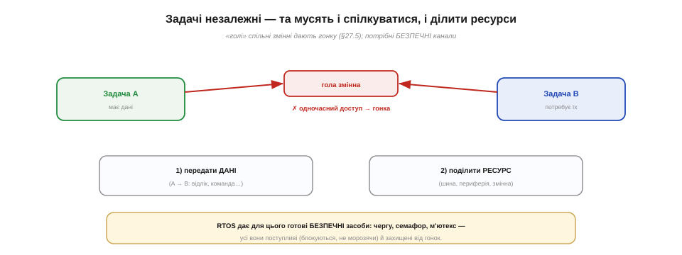
*Рис. 4.10.6.1. Дві потреби задач: передати дані (A → B) і поділити спільний ресурс. Робити це через «голу» спільну змінну небезпечно — одночасний доступ дає гонку (§4.10.5). RTOS пропонує натомість безпечні засоби: чергу, семафор і м'ютекс — усі поступливі й захищені від гонок.*

Чому ж не можна просто покласти дані у звичайну глобальну змінну, щоб інша задача їх звідти взяла? Бо без захисту дві задачі (а надто на двох ядрах) можуть торкнутися її **одночасно**: одна пише, інша читає напівоновлене — і дістає сміття. Потрібен механізм, що або **передає** дані атомарно (без спільної змінної взагалі), або **впорядковує** доступ до спільного (щоб ніколи не було двох одночасно). Перше дає черга, друге — м'ютекс; а семафор стоїть поряд як засіб **сигналити**. Розгляньмо кожен.

Зверніть увагу, що це та сама біда, з якою ми вже стикалися між циклом і перериванням (§4.5.6) — **гонка за спільні дані**, — лише тепер між рівноправними задачами, а на двох ядрах іще й по-справжньому одночасна. Там ми захищалися критичною секцією (на мить вимикали переривання); тут цей прийом не підійде — задач багато й вони незалежні. Тому RTOS і дає засоби вищого рівня, що роблять доступ **атомарним** (неподільним) без грубого глушіння всієї системи.

### Черга: безпечно передати дані

**Черга (*queue*)** — найчистіший спосіб передати дані між задачами. Це безпечна труба, що працює за принципом «перший прийшов — перший пішов» (FIFO): одна задача-**виробник** кладе в неї елементи (`xQueueSend`), інша задача-**споживач** їх звідти бере (`xQueueReceive`). Найважливіше: черга **копіює** дані всередину себе, тож спільної змінної, яку можна було б зіпсувати, просто немає.

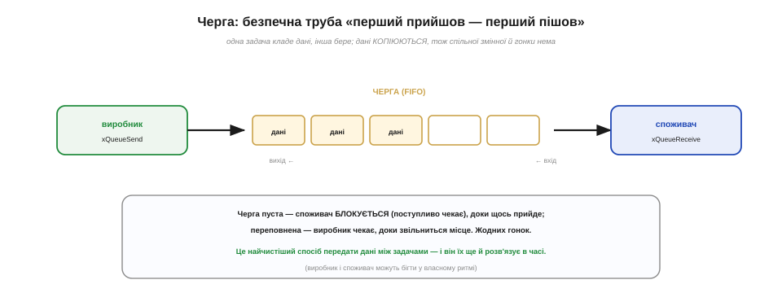
*Рис. 4.10.6.2. Черга — безпечна FIFO-труба між задачами. Виробник кладе дані (`xQueueSend`), споживач бере (`xQueueReceive`). Порожня черга — споживач поступливо чекає, доки щось прийде; переповнена — виробник чекає місця. Дані копіюються, тож гонок немає, а виробник і споживач можуть бігти кожен у своєму ритмі.*

Черга приваблює одразу кількома речами. По-перше, вона **безпечна**: усю синхронізацію RTOS бере на себе, і вам не треба думати про гонки. По-друге, вона **поступлива**: коли черга порожня, споживач не крутиться в очікуванні, а чесно блокується (віддає процесор), доки виробник щось не покладе; коли черга повна, чекає вже виробник. По-третє, вона **розв'язує задачі в часі**: виробник може видавати дані ривками, а споживач — обробляти їх рівномірно; черга згладжує різницю їхніх ритмів, як буфер. Саме тому передавати дані між задачами майже завжди варто **через чергу**, а не через спільну змінну.

Створюючи чергу, ви задаєте дві речі: **скільки** елементів вона вміщає і якого вони **розміру**. Глибина черги — це і є той буфер, що згладжує ривки: більша черга стерпить довші сплески від виробника, та й пам'яті з'їсть більше. Ця проста пара «виробник кладе — споживач бере» зветься патерном **виробник-споживач** і є, мабуть, найуживанішою схемою багатозадачних систем: нею передають відліки давачів, мережеві пакети, події інтерфейсу — будь-який потік даних від того, хто його породжує, до того, хто його споживає.

> 🔧 **Навіщо це.** Запам'ятайте як головне правило обміну: **треба передати дані між задачами — бери чергу**, а не глобальну змінну. Класичний приклад — задача читає давач і кладе відліки в чергу, а задача-обробник їх звідти забирає й малює графік. Жодної спільної змінної, жодних гонок, і обидві задачі прості та незалежні. Черга — це той «поштовий канал», що дає змогу задачам спілкуватися, лишаючись розв'язаними.

### Семафор: подати сигнал про подію

Інколи передавати дані й не треба — досить **сигналу**, що «сталася подія». Для цього є **семафор (*semaphore*)**. **Бінарний семафор** — це по суті дзвоник: одна сторона його «дає» (сигналить), а інша на нього «чекає» (спить, доки не подзвонять).

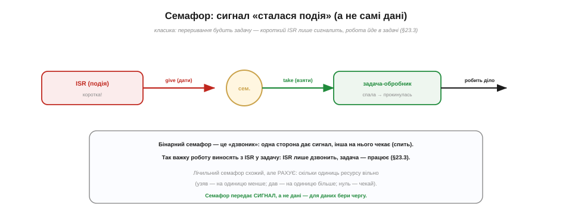
*Рис. 4.10.6.3. Бінарний семафор — «дзвоник» події. Класика: коротка ISR лише дає семафор («сталося!»), а задача-обробник, що спала на ньому, прокидається й робить важку роботу. Так переривання лишається блискавичним (§4.5.3), а обробка йде в задачі. Лічильний семафор схожий, але рахує вільні одиниці ресурсу.*

Найкласичніше застосування семафора чудово замикає Розділ 4.5. Згадаймо правило «**ISR має бути коротка**» (§4.5.3): обробник переривання лише схоплює подію і виходить. Семафор показує, **куди** піти: ISR, зафіксувавши подію (натискання, прихід байта), лише **дає** семафор — і миттю завершується; а спеціальна задача-обробник, що **чекала** (спала) на цьому семафорі, прокидається й робить усю важку роботу вже поза перериванням. Це зветься **відкладеним опрацюванням переривання**, і семафор — його природний інструмент. Поряд із бінарним є й **лічильний семафор**: він не просто «є/нема», а **рахує** — скільки одиниць ресурсу зараз вільно (взяв — на одну менше, дав — на одну більше, нуль — чекай). Та головне пам'ятати: семафор передає **сигнал**, а не дані; коли потрібні самі дані — це робота черги.

Варто згадати й легшу рідню семафора — **сповіщення задачі (*task notification*)**. Це швидший і ощадніший спосіб подати задачі простий сигнал «прокинься» безпосередньо, без окремого об'єкта-семафора. У сучасному FreeRTOS саме сповіщення часто радять для будіння задачі з переривання — воно робить те саме, що бінарний семафор, лише дешевше. Принцип той самий, тож, зрозумівши семафор, ви легко опануєте й сповіщення, коли воно знадобиться.

### М'ютекс: один за раз до спільного ресурсу

Лишилася третя потреба — **поділити спільний ресурс** так, щоб ним користувалися не водночас, а по черзі. Для цього є **м'ютекс (*mutex*, від *mutual exclusion* — взаємне виключення)** — замок, що допускає до ресурсу лише одну задачу за раз.

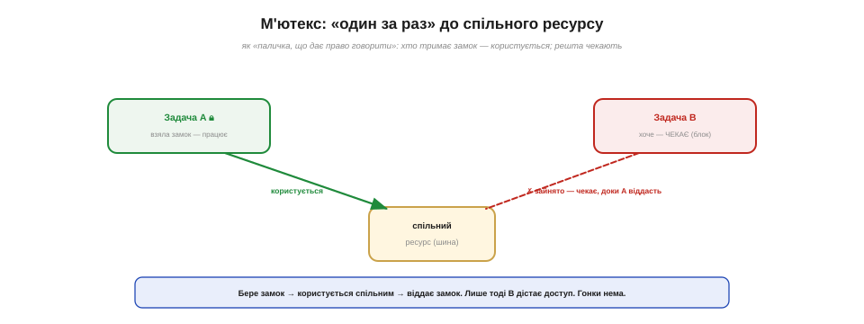
*Рис. 4.10.6.4. М'ютекс — як «паличка, що дає право говорити». Задача A бере замок, користується спільним ресурсом (скажімо, шиною I2C) і віддає замок; задача B, що теж хоче ресурс, поступливо **чекає**, доки A не звільнить. Жодних двох одночасно — отже, й жодної гонки.*

Працює це просто: задача, перш ніж торкнутися спільного ресурсу, **бере** м'ютекс (`xSemaphoreTake`); якщо він вільний — бере й користується, якщо зайнятий — поступливо чекає. Скінчивши, **віддає** м'ютекс (`xSemaphoreGive`), і тоді його дістає наступний охочий. Поки одна задача тримає замок, жодна інша до ресурсу не дістанеться. Це і є багатозадачний відповідник **критичної секції** (§4.5.6): ділянка, де може працювати лише хтось один. М'ютексом захищають спільну шину (I2C, SPI, якою користуються кілька задач), спільну периферію, спільну структуру даних — усе, що зламалося б від одночасного доступу.

З м'ютексами пов'язана й власна пастка — **взаємне блокування (*deadlock*)**. Воно стається, коли дві задачі тримають по одному замку й кожна чекає на замок іншої: жодна не поступиться, і обидві застигають назавжди. Класична профілактика проста: тримайте замки **недовго**, не беріть кількох замків одночасно без потреби, а якщо вже доводиться — завжди в **однаковому порядку** в усіх задачах. Більшість дедлоків — наслідок саме безладного захоплення кількох замків нараз.

> ⚙️ **Детально про дедлок** — чотири умови Коффмана і дисципліна порядку захоплення: [ch27-s6-a-deadlock.md](ch27-s6-a-deadlock.md).

> 🔧 **Навіщо це.** Якщо кілька задач користуються **одним** ресурсом — шиною, дисплеєм, файлом, складною спільною змінною, — обгорніть кожне звертання до нього парою «взяти м'ютекс → попрацювати → віддати м'ютекс». Це найдешевша страховка від найзагадковіших багатозадачних збоїв, коли дві задачі влізли в одну шину водночас і обидві отримали кашу. Лише не тримайте замок **довго**: узяли, швидко зробили потрібне, віддали — інакше решта задач даремно чекатимуть.

### М'ютекс проти семафора: власник і успадкування пріоритету

Може здатися, що м'ютекс — це той самий бінарний семафор (теж «взяти/віддати»). Та між ними дві важливі відмінності, через які м'ютекс і є правильним для захисту ресурсу.

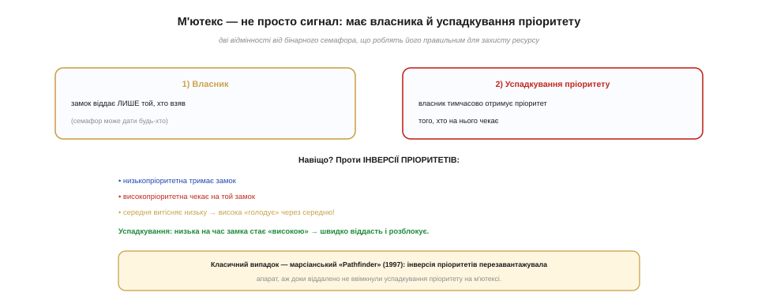
*Рис. 4.10.6.5. Дві відмінності м'ютекса від семафора. (1) **Власник**: замок віддає лише та задача, що його взяла (семафор може дати будь-хто). (2) **Успадкування пріоритету**: поки низькопріоритетна задача тримає замок, на який чекає високопріоритетна, їй тимчасово піднімають пріоритет — щоб вона швидше доробила й розблокувала. Це рятує від **інверсії пріоритетів**.*

Перша відмінність — **власник**: м'ютекс віддати може лише та задача, що його взяла (це логічно для замка), тоді як семафор-сигнал може дати будь-хто. Друга, тонша, — **успадкування пріоритету (*priority inheritance*)**, і вона лікує підступну ваду під назвою **інверсія пріоритетів**. Уявіть: низькопріоритетна задача взяла замок; високопріоритетна хоче той самий замок і чекає; аж тут середньопріоритетна витісняє низьку — і виходить, що **середня** задача не дає низькій доробити, а отже, блокує й **високу**. Високопріоритетна задача голодує через задачу, важливішу за низьку, але **менш** важливу за неї саму — це й є інверсія. Успадкування пріоритету вирішує це елегантно: поки низька тримає потрібний високій замок, їй **тимчасово піднімають** пріоритет до високого, тож її ніхто не витісняє, вона швидко доробляє й звільняє замок.

Це не книжкова вигадка: на ній колись «спіткнувся» космос. 1997 року марсіанський апарат **Mars Pathfinder** раз по раз самостійно перезавантажувався вже на Марсі — і причиною виявилася саме **інверсія пріоритетів** на одному з м'ютексів. Інженери NASA віддалено ввімкнули успадкування пріоритету — і апарат запрацював як слід. Тож ця, здавалося б, дрібна відмінність м'ютекса від семафора колись рятувала місію на іншій планеті; саме тому для захисту ресурсу беруть **м'ютекс**, а не бінарний семафор.

### Що коли обирати

Зведімо все в просту мапу рішень, щоб не плутати засоби.

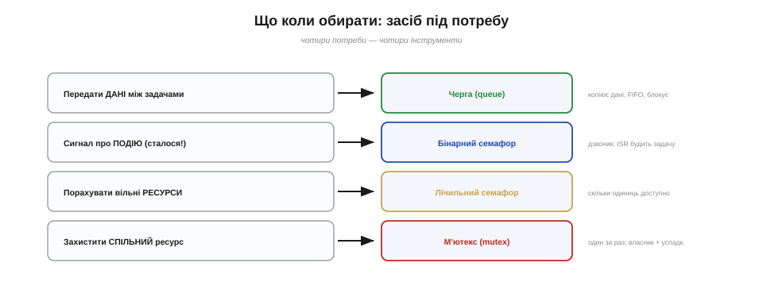
*Рис. 4.10.6.6. Чотири потреби — чотири засоби. Передати **дані** між задачами → **черга**. Сигнал про **подію** («сталося!») → **бінарний семафор**. Порахувати вільні **одиниці ресурсу** → **лічильний семафор**. Захистити **спільний ресурс** (один за раз) → **м'ютекс**.*

Це правило вибору варто запам'ятати, бо саме плутанина між засобами — найчастіша помилка початківця в RTOS. Коротко: **дані — черга; подія — семафор; ресурс — м'ютекс**. Передаєте відліки давача іншій задачі — черга. Будите задачу з переривання — бінарний семафор. Стежите, скільки вільних місць у буфері — лічильний семафор. Захищаєте спільну шину від двох задач — м'ютекс. Звикнувши щоразу питати «що мені треба — передати дані, подати сигнал чи захистити ресурс?», ви майже завжди одразу доберете правильний інструмент.

І остання, найважливіша порада: **найкращий обмін — це якомога менше спільного**. Що менше спільного стану між задачами, то менше потрібно замків, то менше нагод для гонок і дедлоків. Тому добрий дизайн прагне не «захистити всі спільні змінні», а **позбутися** більшості з них — передавати дані чергами, а не тримати їх у глобальних змінних. Менше спільного — простіша, надійніша й зрозуміліша система; це, мабуть, головна мудрість усієї багатозадачності.

**Приклад (виробник-споживач через чергу + м'ютекс на шину).**

```
QueueHandle_t q;            // черга відліків
SemaphoreHandle_t busMutex; // замок на спільну шину I2C

void taskSensor(void *p) {            // ВИРОБНИК
    for (;;) {
        int v = readSensor();
        xQueueSend(q, &v, portMAX_DELAY);   // безпечно передали відлік
        vTaskDelay(100);
    }
}
void taskLog(void *p) {               // СПОЖИВАЧ
    for (;;) {
        int v;
        xQueueReceive(q, &v, portMAX_DELAY);  // чекаємо й беремо (блок)
        xSemaphoreTake(busMutex, portMAX_DELAY);  // ← зайняли шину
        writeToDisplay(v);                        //   працюємо з нею
        xSemaphoreGive(busMutex);                 // ← звільнили шину
    }
}
```
Дані з давача йдуть **через чергу** (жодної спільної змінної), а спільну шину дисплея береже **м'ютекс** (ніколи двох одночасно). Дві задачі співпрацюють, не заважаючи одна одній і без жодної гонки — і, що важливо, кожну з них досі можна читати окремо, як просту послідовну програму: уся складність їхньої взаємодії охайно прихована в двох надійних засобах RTOS (черзі й м'ютексі), а не розмазана плутаниною прапорців по всьому коду.

Отже, RTOS перетворює небезпечне «голе» ділення даних на безпечну, структуровану взаємодію: **черга** передає дані, **семафор** сигналить про події (і виносить роботу з ISR), **м'ютекс** береже спільний ресурс, рятуючи ще й від інверсії пріоритетів. З цими засобами задачі нарешті можуть і працювати незалежно, і злагоджено співпрацювати. Лишилося два практичні питання, без яких надійної багатозадачності не буває: скільки пам'яті відвести під стек кожної задачі — і як зробити так, щоб усе це працювало не просто «якось», а **гарантовано вчасно**. Перше — про стеки — і є наступна тема.

## 4.10.7 Пам'ять у RTOS: стеки задач (розмір стека)

Ми вже знаємо (§4.10.3), що в кожної задачі — власний **стек**. Тепер настав час найпрактичнішого питання багатозадачності: **якого розміру** його робити? Це питання лише на вигляд дрібне, а насправді — одне з найважливіших і найпідступніших. Замалий стек — і задача його **переповнить**, спричинивши загадковий збій; завеликий — і ви **змарнуєте** дорогу пам'ять чипа. Правильно підібрати розмір стека — справжнє ремесло, і ця тема навчить вас його основ.

### Що лежить у стеку задачі

Спершу нагадаймо з [Розділу 4.2](../ch21-toolchain/ch21-toolchain.md), що взагалі тримає стек. По-перше, **локальні змінні** функцій. По-друге, **ланцюг викликів**: щоразу, коли одна функція кличе іншу, на стек лягає новий «кадр» з її локальними змінними й адресою повернення. По-третє (це додає RTOS) — **збережений контекст** задачі: коли її перемикають, стан регістрів і лічильник команд теж осідають у її стеку.

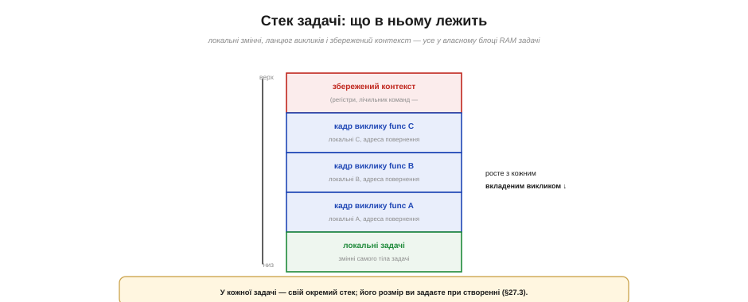
*Рис. 4.10.7.1. Стек задачі тримає: локальні змінні тіла задачі, кадр на кожен вкладений виклик функції (з її локальними й адресою повернення) і збережений контекст (регістри, лічильник команд) на час перемикання. Що глибша вкладеність викликів, то вище росте стек.*

Звідси видно головне: скільки стека витратить задача, залежить від того, **як глибоко** вона вкладає виклики й **скільки локальних даних** тримає на кожному рівні. Проста задача з кількома змінними обійдеться крихтою; задача, що заходить у десяток вкладених функцій та ще й тримає буфери, з'їсть значно більше. А оскільки розмір стека ви задаєте **наперед**, при створенні задачі (§4.10.3), треба якось угадати цей апетит — і не помилитися ні в той, ні в інший бік.

Важливо, що стек **дихає**: він росте, коли задача заходить глибше у виклики, і спадає, коли з них повертається. Тож витрата стека не стала — вона коливається, як приплив і відплив, і для нас важливий саме **найвищий приплив**: той найглибший момент, коли задача витратила стека найбільше. Саме його стек і мусить покрити з запасом — бо досить одного-єдиного разу перейти межу, щоб усе зламалося.

### Замало стека — переповнення

Почнімо з небезпечнішої помилки. Якщо задача спробує використати більше стека, ніж їй відвели, станеться **переповнення стека (*stack overflow*)**: задача «вилізе» за межу свого блоку й почне писати в **сусідню** пам'ять — у стек іншої задачі чи в чужі дані.

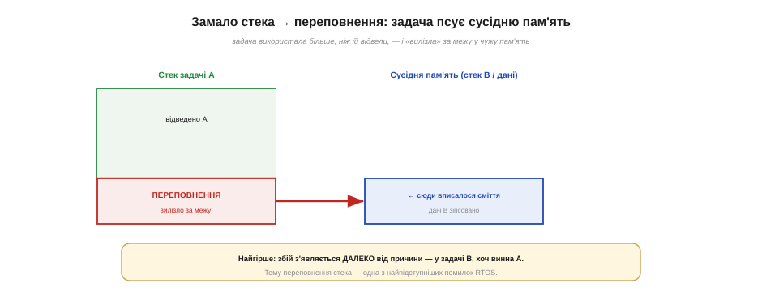
*Рис. 4.10.7.2. Переповнення: задача A використала більше, ніж їй відвели, перейшла свою межу й уписала «сміття» в сусідню пам'ять — наприклад, у стек задачі B. Найгірше, що збій тоді спливе **в задачі B**, хоч винна A: причина й симптом — у різних місцях.*

Це одна з найпідступніших помилок у всій багатозадачності — саме через те, що **симптом далеко від причини**. Переповнивши свій стек, задача A псує дані задачі B, і програма падає (чи поводиться дивно) **в задачі B** — там, де ви годинами шукатимете помилку, якої там немає. На щастя, RTOS уміють **ловити** переповнення: FreeRTOS має вбудовану перевірку стека, що б'є на сполох, коли задача підійшла до межі. Її варто вмикати під час налагодження — вона перетворює загадковий невловимий збій на чітке повідомлення «задача така-то переповнила стек».

Підступність переповнення ще й у тому, що воно часто **не детерміноване**: задача рве стек лише на певному, рідкісному шляху виконання — скажімо, коли заходить у глибшу гілку або спрацьовує якийсь обробник, — тож пристрій падає «раз на день» чи «лише під навантаженням». Такі невловимі збої впіймати найважче, і саме за ними найчастіше й ховається тихе переповнення стека, яке за звичайної роботи нічим себе не видає.

> 🔧 **Навіщо це.** Коли багатозадачна програма падає чи поводиться **незрозуміло** — особливо «не там, де мала б», — найперша підозра — **переповнення стека** в якійсь задачі. Увімкніть вбудовану перевірку стека FreeRTOS: замість ганятися за привидом у чужій задачі, ви одразу побачите винуватця. Це чи не найкорисніша звичка діагностики в RTOS, що економить дні марних пошуків.

### Забагато стека — змарнована пам'ять

Може здатися, що ліки прості: відведи всім задачам **величезні** стеки — і переповнення не буде. Та це інша крайність, теж погана. Уся пам'ять чипа — спільний, обмежений ресурс: у ньому мусять уміститися **всі** стеки задач, плюс купа, плюс глобальні змінні. Завеликі стеки просто **марнують** цю пам'ять, а коли задач багато — її може й забракнути.

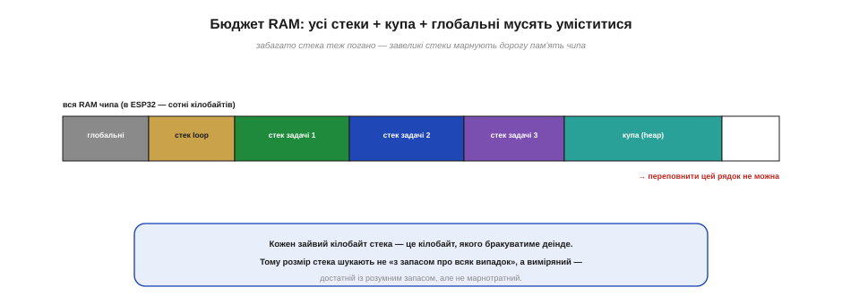
*Рис. 4.10.7.3. Уся RAM чипа — один бюджет: глобальні змінні, стек кожної задачі й купа мусять уміститися в нього разом. Кожен зайвий кілобайт стека — це кілобайт, якого бракуватиме деінде. Тому стеки роблять достатніми із запасом, але не марнотратними.*

Виходить, що розмір стека — це **компроміс** між двома бідами: замалий загрожує переповненням, завеликий марнує пам'ять. Кидатися в будь-який бік погано: «про всяк випадок по 16 кілобайтів кожній» швидко з'їсть усю RAM на десятку задач, а «аби менше» обернеться переповненнями. Тому розмір не вгадують навмання й не беруть «з величезним запасом» — його **вимірюють**. Як саме — далі.

Щоб числа були відчутні: ESP32 має сотні кілобайтів RAM, та значну її частину з'їдають система, стек радіо й буфери Wi-Fi/Bluetooth, тож на ваші задачі лишається менше, ніж здається. Типовій простій задачі вистачає кількох кілобайтів стека, а тій, що працює з мережею чи рядками, — помітно більше. Десяток задач по кілька кілобайтів — і ви вже відчутно «вкусили» бюджет; тому стеки й рахують, а не роздають наосліп.

### Як підібрати розмір: водяний знак

На щастя, є точний практичний інструмент — **«водяний знак» (*high-water mark*)**. RTOS веде облік, наскільки **глибоко** кожна задача колись заходила у свій стек, і вміє сказати, скільки стека лишалося **незайманим** у найгіршу мить. У FreeRTOS це робить виклик `uxTaskGetStackHighWaterMark`.

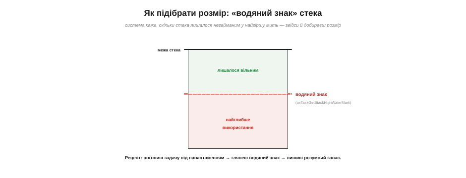
*Рис. 4.10.7.4. «Водяний знак» показує найглибше використання стека за весь час роботи — тобто скільки його лишалося вільним у найгірший момент. Знаючи це, розмір добирають просто: погонив задачу під навантаженням, глянув водяний знак — і лишив над ним розумний запас.*

Звідси й надійний рецепт добору стека, без угадування. Спершу дайте задачі щедрий стек «на старт». Потім **поганяйте** її під реальним (а краще — найважчим) навантаженням якийсь час. Тоді перевірте водяний знак: він покаже, скільки стека так і не чіпали. Якщо вільного залишалося багато — розмір можна сміливо зменшити; якщо мало (водяний знак близько до нуля) — терміново збільшуйте, бо ви на волосину від переповнення. Урешті залишають розмір, що покриває найглибше використання плюс **розумний запас** на непередбачене. Це емпіричний, але надійний шлях — куди кращий за гадання.

На практиці водяний знак зручно час від часу **виводити** — наприклад, друкувати в журнал разом з іншою діагностикою, — щоб бачити запас кожної задачі в живій системі, а не лише під час налагодження. Щодо «розумного запасу»: лишати впритул небезпечно (раптовий глибший шлях — і переповнення), а вдесятеро більше — марнотратно; здоровий орієнтир — запас у чверть-третину понад найглибше використання. Точну цифру диктує ризик: для критичної задачі запас беруть більший, для буденної — менший.

> 🔧 **Навіщо це.** Не вгадуйте розмір стека «зі стелі» й не лишайте «про всяк випадок побільше» — **виміряйте** його водяним знаком. Один раз погнавши задачу під навантаженням і глянувши `uxTaskGetStackHighWaterMark`, ви точно знатимете, скільки їй насправді треба, і відведете рівно стільки плюс запас. Ця проста звичка одразу прибирає і ризик переповнення, і марнування пам'яті — два болі однією дією.

### Що з'їдає стек: великі локальні масиви

Щоб не доводити до переповнення, корисно знати, **що** найбільше їсть стек. Винуватець номер один — **великий локальний масив** (буфер), оголошений усередині функції чи задачі. Адже всі локальні змінні лягають на стек, тож `char buf[4096]` усередині задачі миттю забирає чотири кілобайти стека — і легко його рве.

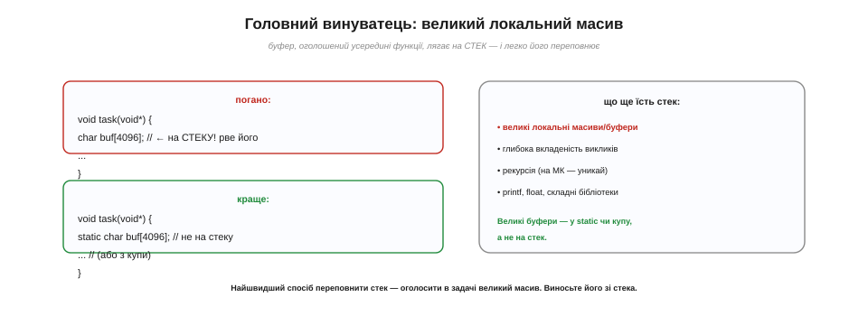
*Рис. 4.10.7.5. Найшвидший спосіб переповнити стек — оголосити в задачі великий масив: він лягає просто на стек. Вихід — винести великий буфер зі стека: зробити його `static` (статичним) або взяти з купи. Стек також їдять глибока вкладеність викликів, рекурсія та важкі бібліотечні виклики (`printf`, операції з `float`).*

Звідси кілька простих правил гігієни. **Великі буфери не тримайте на стеку**: оголошуйте їх `static` (тоді вони живуть окремо від стека) або беріть із купи. **Уникайте глибокої рекурсії** на мікроконтролері — кожен рівень додає кадр, і глибока рекурсія легко вичерпує стек (а часом неможливо й передбачити її глибину). Пам'ятайте, що деякі звичні виклики — форматований вивід (`printf`), операції з числами з плаваючою комою, важкі бібліотеки — теж потребують **відчутно більше** стека, тож задачам, які ними користуються, треба давати стек щедріший. Знаючи цих «ненажерів», ви заздалегідь убережетеся від більшості переповнень.

Виносячи буфер зі стека, варто знати про дрібні тонкощі обох шляхів. **`static`** означає **єдину** копію на всі виклики — це добре економить стек, та небезпечно, якщо ту саму функцію виконують **кілька** задач водночас: вони ділитимуть один буфер, а це знову гонка (§4.10.6). **Купа** ж гнучкіша, але вимагає не забути **звільнити** виділене й остерігатися фрагментації. Для простих сталих буферів `static` зазвичай найзручніший; для буферів змінного розміру — купа. Головне правило лишається тим самим: великим даним не місце на стеку.

### Стек і купа: два види пам'яті

Насамкінець розведімо два різні види пам'яті, які легко сплутати, — **стек** і **купу**. Стек, як ми бачили, у кожної задачі **свій**, фіксованого розміру, і служить для локальних змінних та викликів. **Купа (*heap*)** — це, навпаки, **спільний** пул, з якого беруть пам'ять **динамічно** (через `malloc`/`new`), коли наперед не відомо, скільки її знадобиться.

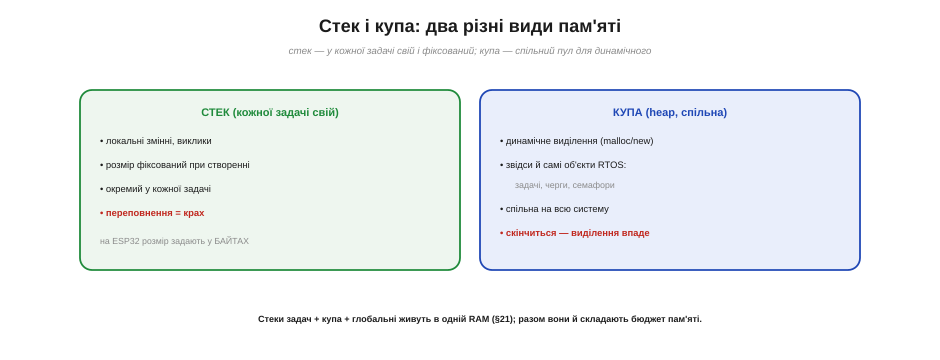
*Рис. 4.10.7.6. Два види пам'яті. Стек — у кожної задачі власний, фіксований при створенні, для локальних і викликів; його переповнення — крах. Купа — спільний пул для динамічного виділення (`malloc`, а також самі об'єкти RTOS: задачі, черги, семафори). На ESP32 розмір стека задають у **байтах**.*

Цей поділ корисно тримати в голові з двох причин. По-перше, самі об'єкти RTOS — задачі, черги, семафори — зазвичай створюються **в купі**: коли ви викликаєте `xTaskCreate` чи `xQueueCreate`, потрібна пам'ять береться саме звідти. Тому й купа має бути досить велика. По-друге, і стеки, і купа живуть в **одній і тій самій** RAM чипа (згадаймо карту пам'яті з §4.2) і разом складають той бюджет, що ми бачили на рис. 4.10.7.3. І остання практична дрібниця, обіцяна ще в §4.10.5: на ESP32 розмір стека в `xTaskCreate` задають у **байтах** (тоді як у «ванільному» FreeRTOS — у словах), тож «4096» на ESP32 означає рівно чотири кілобайти.

Наостанок — застереження про купу на мікроконтролері. Часте динамічне виділення й звільнення з часом **фрагментує** купу: вільна пам'ять начебто є, та розкидана дрібними шматками, і великий запит не вміщається в жоден із них. На пристрої, що працює тижнями без перезавантаження, це реальна проблема. Тому у вбудованих системах надають перевагу **статичному** виділенню: створити все потрібне один раз на старті й більше не чіпати купу — так надійніше, ніж постійно її перекроювати.

**Приклад (підібрати стек водяним знаком; винести масив зі стека).**

```
// створюємо задачу з 4 КБ стека (на ESP32 — у БАЙТАХ):
xTaskCreate(taskWork, "work", 4096, NULL, 1, NULL);

// під навантаженням перевіряємо водяний знак (з самої задачі):
UBaseType_t leftFree = uxTaskGetStackHighWaterMark(NULL);
//  leftFree велике  → стека з запасом, можна зменшити
//  leftFree ~ 0     → на межі переповнення, ТЕРМІНОВО збільшити

// небезпечний буфер на стеку → виносимо:
void task(void*) { char buf[4096];        ... }   // ✗ рве 4-КБ стек
void task(void*) { static char buf[4096]; ... }   // ✓ не на стеку
```
Спершу виміряли реальний апетит задачі водяним знаком — і відвели стільки, скільки треба, плюс запас; а великий буфер прибрали зі стека в `static`. Дві прості дії — і ні переповнення, ні марнування.

І ще одна порада для початку: не кидайтеся **оптимізувати** стеки передчасно. Розумна стратегія — спершу дати задачам **щедрі** стеки, щоб усе впевнено працювало, і лише коли пам'яті почне бракувати, виміряти водяні знаки й акуратно підрізати. Доки RAM вистачає, гнатися за кожним кілобайтом стека — марна морока; а от коли бюджет тисне, ця вміла обрізка стає рятівною. Як і скрізь у багатозадачності, тут важить почуття міри.

Отже, стеки — це неминуча ціна задач, і поводитися з ними треба свідомо: розмір **вимірювати** водяним знаком, а не вгадувати; великі буфери тримати **подалі** від стека; пам'ятати, що всі стеки разом із купою живуть в одному обмеженому бюджеті RAM. Тепер у нас є все, щоб будувати надійні багатозадачні системи. Лишилося останнє, найважливіше для багатьох пристроїв питання: як зробити, щоб така система працювала не просто «загалом добре», а **гарантовано вчасно** — детерміновано, із твердими строками. Це — **реальний час**, тема, що завершує і розділ, і весь модуль.

## 4.10.8 Реальний час: детермінованість і пріоритети

Ми не раз згадували слова «реального часу» в назві RTOS — час нарешті розкрити, що вони насправді означають. Це не просто гарна етикетка: за ними стоїть строга й глибока ідея, заради якої й існує більшість того, що ми вивчали в розділі. І ця ідея напрочуд неочікувана: «реальний час» — це **не про швидкість**. Розберімо, що це таке, як його досягають пріоритетами й детермінованістю і що йому загрожує, — а заразом побачимо, як усе вивчене в розділі сходиться докупи.

### «Реальний час» — це передбачуваність, не швидкість

Найперше — головне непорозуміння. «Реальний час» означає не «дуже швидко», а «**передбачувано вчасно**». Система реального часу не та, що в середньому реагує найшвидше, а та, що **гарантує** реакцію в межах відомого строку — **завжди**, навіть у найгіршому випадку.

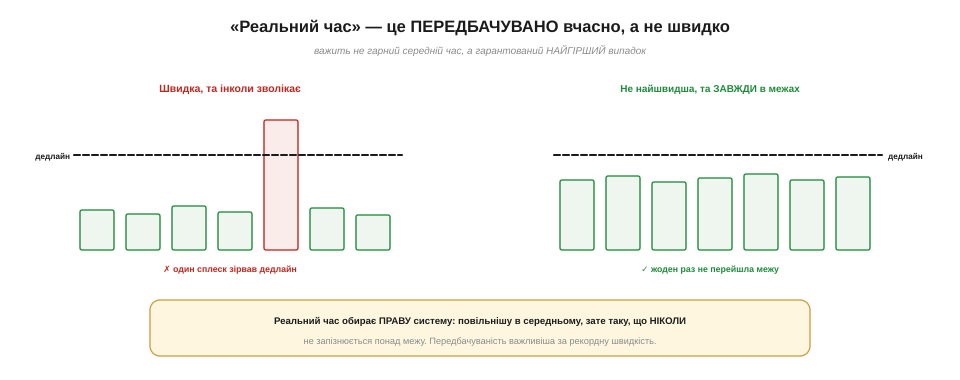
*Рис. 4.10.8.1. Дві системи проти спільного дедлайну. Ліва — швидша в середньому, та з рідкісним «сплеском», що зриває строк. Права — повільніша, зате жодного разу не переходить межу. Реальний час обирає **праву**: передбачуваність важливіша за рекордну середню швидкість.*

Цю різницю варто відчути глибоко. Звичайна, «настільна» операційна система оптимізує **середню** продуктивність і пропускну здатність: загалом усе летить, та зрідка може й «задуматися» надовго (через якусь фонову роботу), і передбачити цей найгірший випадок важко. Для відеоролика чи браузера це дрібниця. Але для пристрою, що мусить подати імпульс на мотор рівно щомілісекунди чи розкрити подушку безпеки за мілісекунди після удару, рідкісне «задумався» — катастрофа. Тут цінується не швидкість, а **гарантія**: краще повільніше, зате **ніколи** не пізніше за строк. Саме цю гарантію й дає система реального часу.

Звідси й парадокс, який варто прийняти: система реального часу часто **повільніша** за звичайну в середньому — бо витрачає зусилля на обмеження найгіршого випадку, а не на рекордну швидкість. Та саме ця «жертва» й робить її придатною там, де ціна запізнення висока. Швидкий, але непередбачуваний код — як водій, що женеться, а іноді безнадійно застрягає; повільніший, але рівний — завжди приїде вчасно. Для керування машиною оберуть другого.

### Дедлайни: жорсткий і м'який реальний час

У серці реального часу — поняття **дедлайну (*deadline*)**: робота задачі мусить **завершитися до певного строку**. Та не всі дедлайни однакові за суворістю, і реальний час ділять на два роди.

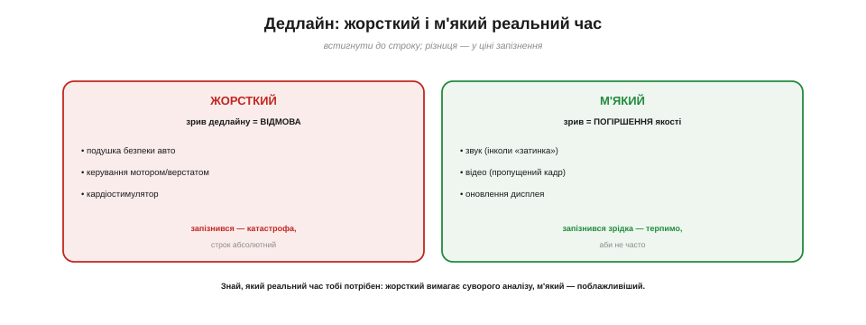
*Рис. 4.10.8.2. Дві суворості дедлайну. **Жорсткий** реальний час: зрив строку — це відмова (подушка безпеки, керування верстатом, кардіостимулятор), строк абсолютний. **М'який**: зрив лише погіршує якість (затинка звуку, пропущений кадр відео) і терпимий, аби траплявся зрідка.*

У **жорсткому (*hard*)** реальному часі пропустити дедлайн означає **відмову** системи — інколи небезпечну. Подушка безпеки, що спрацювала на мить запізно; верстат, що не спинив різець вчасно; кардіостимулятор, що проґавив імпульс, — тут строк **абсолютний**, і його зрив неприпустимий. У **м'якому (*soft*)** реальному часі пропущений дедлайн лише **псує якість**, не ламаючи системи: звук «затнувся», відео загубило кадр, дисплей оновився трохи пізніше. Прикро, та не страшно, якщо це нечасто. Розрізняти ці два роди важливо практично: жорсткий реальний час вимагає суворого аналізу й запасу, тоді як до м'якого можна підійти поблажливіше. Більшість аматорських пристроїв потребують саме **м'якого** — досить бути «достатньо чуйним»; а от жорсткий лишають для систем, де ціна помилки висока.

На практиці реальні пристрої часто **змішані**: в одному виробі є і жорсткі задачі (вчасно крутнути мотор), і м'які (оновити екран). Проєктують тоді **за найсуворішими**: жорстким дедлайнам віддають найвищі пріоритети й найкоротші, найпередбачуваніші шляхи коду, а м'яким дістається той час, що лишається. Тож перше питання дизайну — чесно скласти список: які задачі справді жорсткі, а які потерплять; від цього й залежить уся подальша розстановка пріоритетів.

### Детермінованість: знати найгірший випадок

Як же взагалі можна щось **гарантувати** в часі? Лише за однієї умови — якщо ти знаєш і обмежуєш **найгірший випадок**. Це і є **детермінованість (*determinism*)**: операція завжди вкладається у відому, обмежену зверху тривалість, хоч би що діялося.

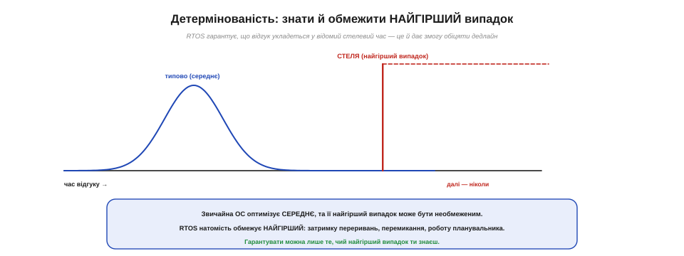
*Рис. 4.10.8.3. Звичайна ОС дбає про **середній** час, а її найгірший випадок може бути необмеженим. RTOS натомість **обмежує найгірший**: затримку реакції на переривання, час перемикання контексту, роботу планувальника — усе має відому стелю. Гарантувати можна лише те, чий найгірший випадок відомий.*

Ось чому RTOS так дбає про **обмеженість** власних дій. Затримка від події до запуску потрібної задачі, час перемикання контексту, тривалість роботи самого планувальника — усе це в RTOS мале й, головне, **обмежене зверху** відомою величиною. Завдяки цьому ви можете скласти бюджет часу: «у найгіршому разі від сигналу давача до реакції мотора мине не більше стількох мікросекунд» — і **гарантувати** дедлайн. Це принципово неможливо там, де найгірший випадок невідомий або безмежний. Тому реальний час — це передусім дисципліна **обмежувати й знати найгірше**, а не просто «писати швидкий код».

Для систем, де дедлайни справді жорсткі, цю «стелю» рахують прискіпливо — є навіть окрема дисципліна про **найгірший час виконання (*worst-case execution time, WCET*)**. Але для нас важливий простий висновок: **простота сприяє детермінованості**. Що простіший і коротший критичний шлях коду, то легше впевнено сказати, скільки він триватиме в найгіршому разі. Заплутаний код із багатьма гілками, викликами й очікуваннями важко обмежити зверху — а отже, важко й гарантувати.

### Пріоритети кодують терміновість

А тепер — практичний важіль, яким досягають дедлайнів. Це **пріоритети** (§4.10.4). Згадаймо: пріоритетно-витісняючий планувальник завжди дає процесор найпріоритетнішій готовій задачі. Отже, пріоритет — це спосіб **закодувати терміновість**: чим тісніший дедлайн у задачі, тим вищий пріоритет їй дають — і тоді вона витісняє все менш термінове й гарантовано встигає до строку.

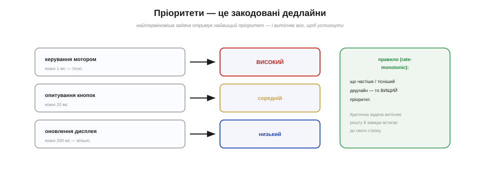
*Рис. 4.10.8.4. Пріоритети — це закодовані дедлайни. Керування мотором із дедлайном 1 мс дістає високий пріоритет, кнопки (20 мс) — середній, дисплей (200 мс) — низький. Правило (монотонність частоти, *rate-monotonic*): що тісніший дедлайн — то вищий пріоритет. Критична задача витісняє решту й завжди встигає.*

Існує навіть струнка теорія такого призначення — **монотонність частоти (*rate-monotonic*)**: для періодичних задач пріоритет дають **тим вищий, чим частіший** період (тісніший дедлайн). Тобто задача, що мусить спрацьовувати щомілісекунди, дістає вищий пріоритет за ту, що раз на сто мілісекунд. Інтуїція проста: найтерміновіше — першим. Проєктування пріоритетів під дедлайни — це і є серце інженерії реального часу: правильно розставив пріоритети — і планувальник сам подбає, щоб кожна задача встигла; помилився — і якийсь дедлайн зірветься.

> 🧮 **Математика за правилом.** Монотонність частоти — не лише чуйка, а доведено **оптимальна** схема серед усіх фіксованих пріоритетів (Liu & Layland, 1973). Більш того: існує проста формула U ≤ n·(2^(1/n)−1), яка одним числом гарантує виконання всіх дедлайнів ще до запуску коду. Чому коротший період заслуговує вищий пріоритет, як рахується «бюджет процесора» й що означає межа ~70 % — у вставці [🧮 Rate Monotonic: межа Лю–Лейленда](ch27-s8-m-rate-monotonic.md).

> 🔧 **Навіщо це.** Призначаючи пріоритети, думайте не «що важливіше для мене», а «**що має тісніший дедлайн**». Найчастіша й найшвидша реакція — найвищий пріоритет; неквапна рутина (дисплей, журнал) — найнижчий. Якщо повільній задачі помилково дати високий пріоритет, вона може **затримати** справді термінову — і зірвати її строк. А критичні до часу речі взагалі тримайте короткими й винесіть на високий пріоритет, щоб ніщо не стало їм на заваді.

### Вороги реального часу

Гарантію реального часу легко зруйнувати, тож корисно знати її **ворогів** — усе, що робить найгірший випадок невідомим чи величезним.

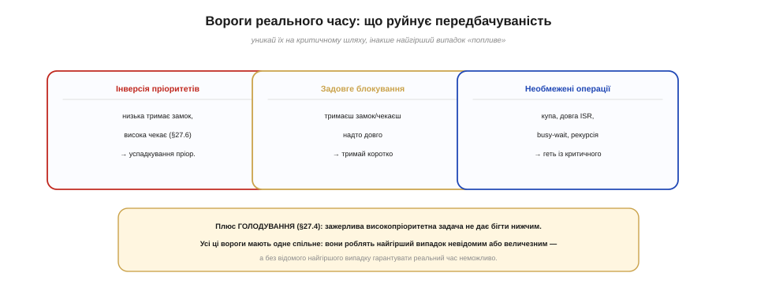
*Рис. 4.10.8.5. Чотири головні вороги передбачуваності: **інверсія пріоритетів** (§4.10.6, вихід — успадкування пріоритету), **задовге блокування** (тримати замок чи чекати надто довго), **необмежені операції** (купа, довга ISR, busy-wait, рекурсія) і **голодування** (§4.10.4). Усі вони роздувають або ховають найгірший випадок.*

Перший ворог — уже знайома **інверсія пріоритетів** (§4.10.6): низькопріоритетна задача тримає замок, потрібний високій, і та голодує; вихід — успадкування пріоритету на м'ютексі. Другий — **задовге блокування**: якщо тримати замок або чекати надто довго, термінова задача застрягне за ним; тому в критичних місцях усе роблять **коротко**. Третій — **необмежені операції**: динамічне виділення з купи (§4.10.7, з її фрагментацією), задовгий обробник переривання, активне очікування (busy-wait), глибока рекурсія — усе, чий час непередбачуваний; на критичному шляху їх уникають. Четвертий — **голодування** (§4.10.4): зажерлива високопріоритетна задача, що ніколи не блокується, не дає бігти нижчим. Спільне в усіх цих ворогів одне: вони роблять найгірший випадок **невідомим або безмежним** — а без відомого найгіршого випадку реальний час, як ми вже знаємо, гарантувати неможливо.

> 🔧 **Навіщо це.** Для надійного реального часу виробіть дисципліну критичного шляху: тримайте його **коротким, простим і «легким на замки»**. Жодних довгих обчислень, динамічного виділення пам'яті, активного очікування чи затягнутих замків у місцях, що мусять реагувати вчасно. Усе важке й неквапне — у низькопріоритетні задачі, подалі від термінового. Що менше «важкого» на шляху термінової реакції, то впевненіше ви обмежите її найгірший випадок — а отже, і гарантуєте дедлайн.

### Як усе сходиться

Ось ми й дійшли до місця, де весь розділ складається в єдину картину. Згадаймо шлях. Простий **super-loop** (§4.10.1) був зрозумілим, та не міг нічого **обіцяти** в часі: одне блокування — і все стояло (§4.10.2). **Задачі** (§4.10.3) дали змогу писати кожну справу просто й «чекати», не зупиняючи інших. **Планувальник** із пріоритетним витісненням (§4.10.4) дав важіль терміновості. **FreeRTOS** (§4.10.5) приніс усе це готовим у ваш ESP32, ще й із двома ядрами. **Засоби обміну** (§4.10.6) дозволили задачам безпечно співпрацювати. А **реальний час** (ця тема) увінчує все: з обмеженими затримками RTOS, правильними пріоритетами й уникненням ворогів детермінованості система не просто «якось працює», а **гарантовано встигає вчасно**.

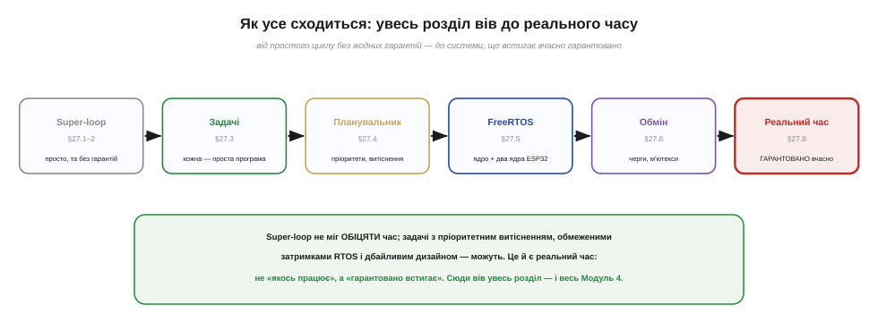
*Рис. 4.10.8.6. Увесь розділ вів сюди: super-loop без гарантій → задачі → планувальник із пріоритетами → FreeRTOS на двох ядрах → засоби обміну → реальний час. Кожен крок додавав те, чого бракувало попередньому, аж до головного — здатності **обіцяти** час, а не лише сподіватися на нього.*

**Приклад (призначити пріоритети за дедлайнами).** Три періодичні задачі.

```
Задача            період/дедлайн     пріоритет (rate-monotonic)
  керування мотором   1 мс (тісно)        ВИСОКИЙ
  опитування кнопок   20 мс               середній
  оновлення дисплея   200 мс (вільно)     низький

Що робить планувальник:
  настав час мотора → він ВИТІСНЯЄ кнопки й дисплей → встигає за 1 мс
  мотор заснув       → час дістається кнопкам, тоді дисплею
Помилка навпаки: дай дисплею високий пріоритет — його неквапне
малювання затримає мотор, і той зірве свій жорсткий дедлайн.
```
Правильно закодувавши терміновість у пріоритети, ви перетворюєте «сподіваюся, встигне» на «**гарантовано** встигне» — і це, по суті, і є вся інженерія реального часу в мініатюрі. Решта — деталі й аналіз, але серце саме тут: знай дедлайни, обмеж найгірший випадок, розстав пріоритети за терміновістю — і система триматиме слово.

Отже, реальний час — це дисципліна **гарантувати** час, а не просто бути швидким: вона спирається на детермінованість (відомий найгірший випадок), на пріоритети (закодована терміновість) і на уникнення ворогів, що руйнують передбачуваність. Маючи задачі, пріоритетний планувальник, безпечний обмін і обмежені затримки RTOS, ви тепер володієте всім, щоб будувати пристрої, які роблять багато справ — і роблять їх **вчасно**.

І останнє, що варто тримати в голові: **не кожен пристрій потребує суворого реального часу**. Для іграшкового світлофора чи метеостанції вистачить «достатньо чуйно», і ганятися за твердими гарантіями там — марна морока. А от керування мотором, обробка звуку, польотний контролер — це вже інша розмова. Мудрість інженера — дібрати рівень суворості під задачу: не легковажити там, де ціна висока, і не переускладнювати там, де й м'якого реального часу досить.

---

## 4.10.9 Профілювання: куди йдуть такти і байти

Весь розділ ми міркували про час і пам'ять **якісно**: «крок super-loop затягнувся» (§4.10.1), «задача не встигає, бо блокується» (§4.10.2), «стек переповнився» (§4.10.7), «дедлайн зірвано» (§4.10.8), «процесор простоює» (§4.10.3). Ці судження — мова відчуттів. Але реальний час (§4.10.8) вимагає більшого: **знати** найгірший випадок, а знати — означає **виміряти**. Профілювання — це дисципліна вимірювання: куди насправді йдуть процесорні такти і байти пам'яті. Гасло-інтуїція розділу: «не вгадуй — виміряй». Та сама ідея вже мигала у водяному знаку стека (§4.10.7) — але там лише один інструмент, а тут уся система поглядів. Теза: оптимізувати наосліп марно й шкідливо; спершу знайди, де ресурс справді витрачається, — тоді вирішуй, що і чи взагалі варто чіпати. Нижче — шість кроків від першопричини до методології: два бюджети, дві оптики, завантаженість CPU, профіль пам'яті, пастки вимірювання і замкнений цикл оптимізації.

### Два бюджети: такти і байти

ESP32 — невеликий чип із двома скінченними скарбничками. Перша — **процесорний час**: до 240 МГц на кожному з двох ядер, тобто 240 мільйонів тактів за секунду на ядро. Друга — **пам'ять**: кілька сотень кілобайт SRAM, розподілених між глобальними змінними, стеками задач і купою (§4.10.7). Усе, що робить пристрій — читає давач, обчислює, надсилає пакет, оновлює дисплей, — витрачає одне, друге або обидва. Більше нічого немає.

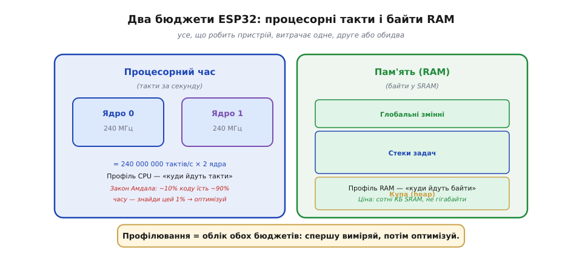

*Рис. 4.10.9.1. Дві скінченні скарбнички ESP32: процесорний час і оперативна пам'ять. Профілювання — облік обох.*

**Профілювання CPU** дає відповідь «куди йдуть такти», а **профілювання пам'яті** — «куди йдуть байти». Разом вони утворюють повний облік ресурсів чипа. Звідси природне запитання: а навіщо взагалі шукати, якщо можна просто зробити код «якомога швидшим»? Відповідь дає класичне спостереження, відоме як **правило 90/10** або закон Амдала в побутовому формулюванні: левову частку процесорного часу й пам'яті поглинає мала частина коду. У реальних прошивках це відчутно: одна функція читання давача або одна задача обробки протоколу зазвичай з'їдає більшість тактів, тоді як решта десятків функцій ділять між собою залишок. Оптимізувати цей «залишок», не знаючи, де головний апетит, — марна витрата зусиль. Більше того: оптимізація «не тих» функцій нерідко шкодить — ускладнений код стає важчим для розуміння, а виграш у швидкодії виходить мізерним або нульовим, бо «гаряча точка» живе зовсім в іншому місці.

> 🔧 **Навіщо це.** Спершу виміряй — потім оптимізуй. Інтуїція про вузьке місце майже завжди хибна: «підозрюваний» у пам'яті програміста рідко збігається з реальним «ненажерою» в профілі. Без вимірювання оптимізація — це здогади, що часто ускладнюють код, не прискорившись, а то й уповільнюючи систему через непередбачені ефекти. Водяний знак стека (§4.10.7) — окремий випадок того самого правила: ми замість здогаду «стеку вистачить?» ставимо вимір.

### Дві оптики на CPU: семплування проти інструментації

Знаючи, що шукати, обираємо інструмент. Для CPU-профілю є дві принципово різні оптики.

**Семплування (sampling)** працює як фотокамера з таймером: переривання від апаратного таймера (той самий тік-механізм, що рухає планувальник §4.10.4) через рівні проміжки — скажімо, тисячу разів за секунду — «фотографує» стан системи: яка функція виконується прямо зараз (лічильник команд, верх стека). Після тисяч таких знімків складається статистичний портрет: у яких функціях процесор **буває найчастіше** — там і гаряча точка. Ціна семплування низька: між знімками система жує свою роботу без перешкод, накладні витрати (overhead) мізерні. Але точність статистична: рідкісна, але важлива подія — короткий сплеск тривалістю 50 мкс — може проскочити між знімками непоміченою.

**Інструментація** — протилежний підхід: ми самі обвішуємо підозрілу ділянку мітками часу на вході й виході, читаємо апаратний **лічильник циклів** ESP32 до і після, а різниця — точний час виконання ділянки. Якщо лічильник дав 12 000 тактів, а ядро крутиться на 240 МГц, ділянка зайняла 12 000 / 240·10⁶ ≈ 50 мкс. Точно і конкретно. Але є ціна: самі мітки додають кілька тактів накладних витрат; код захаращується; і головне — видно лише те, що ви самі обвісили. Пропущена гаряча функція залишиться невидимою.


*Рис. 4.10.9.2. Зверху — семплування: тисячі «знімків», хто виконується зараз, → статистичний портрет. Знизу — інструментація: мітки часу на вході/виході → точний Δt.*

Практична стратегія — двофазна. Спершу **семплування**: пробіжіться по всій програмі, знайдіть «підозрюваного» — функцію, що з'їдає найбільше часу. Потім **інструментація**: обвісьте саме цю ділянку мітками й виміряйте точно, включно з максимальним часом виконання (а не лише середнім — бо для реального часу §4.10.8 важить саме найгірший прохід). Два інструменти доповнюють один одного; протиставляти їх немає сенсу.

Конкретика для ESP32: апаратний лічильник циклів доступний через `esp_cpu_get_cycle_count()` — дешевий, наносекундний, не потребує зупинки системи. Це основа будь-якого точного виміру на цій платформі. Варто наголосити: функція читає лічильник саме того ядра, на якому виконується код — отже, якщо задача може бути перенесена між ядрами (§4.10.5), виміри `t0` і `t1` мають братися в одному й тому самому контексті задачі, без перемикання між ядрами між знімками. Для задачі, прив'язаної до конкретного ядра, це не проблема — але варто пам'ятати про це для задач без прив'язки.

### Бюджет CPU: завантаженість і простій

Від окремої функції перейдемо до системного погляду. Метрика здоров'я всього чипа — **завантаженість CPU**: яку частку часу кожне ядро виконує корисну роботу задач, а скільки дрімає в **задачі простою** (§4.10.3). Якщо ядро майже завжди зайняте — запасу немає, і будь-яке нове навантаження або затримка RTOS може зірвати дедлайни (§4.10.8). Якщо ядро більшість часу простоює — є запас, система дихає вільно.

Механізм обліку в FreeRTOS: планувальник фіксує, скільки тактів отримала кожна задача. Функція `vTaskGetRunTimeStats()` повертає таблицю «задача — відсоток часу», з якої одразу видно «ненажера». RTOS рахує час задач через спеціальний лічильник, точніший за тік, тому навіть задачі, що живуть лише кілька мілісекунд між перемиканнями, потрапляють до статистики коректно. Зверніть увагу на порядок дій: спершу ввімкніть рантайм-статистику в конфігурації FreeRTOS (відповідна опція в menuconfig для ESP-IDF), виберіть джерело таймера з роздільною здатністю вищою за тік — і лічильники задач заповнюватимуться коректно. Без цього кроку `vTaskGetRunTimeStats()` або видає нулі, або взагалі не компілюється. Це дрібниця, але на неї натикаються майже всі, хто вперше береться за CPU-профіль у FreeRTOS.


*Рис. 4.10.9.3. Два «паливоміри» — Ядро 0 і Ядро 1 окремо. Ядро 0 (радіо) майже повне, idle ≈ 0. Ядро 1 має запас. Середнє по чипу бреше.*

Особливість двоядерного ESP32 (§4.10.5): завантаженість треба профілювати **поядрово**. Ядро 0 типово обслуговує стек Wi-Fi і Bluetooth — він може задихатися від трафіку, тоді як Ядро 1 з прикладним кодом вільне. «Середнє по чипу» у такому разі виглядає цілком здоровим, хоча Ядро 0 вже на межі. Висновок профілю в такій ситуації — перенести частину задач з Ядра 0 на Ядро 1 або знайти, яка задача на Ядрі 0 з'їдає надто багато, і оптимізувати її.

> 🔧 **Навіщо це.** Слідкуй за idle як за «датчиком запасу». Здорова система більшість часу дрімає — добрі задачі переважно заблоковані в очікуванні події (§4.10.3). Idle на котромусь ядрі впав до нуля — червоне світло: чуйність і дедлайни (§4.10.8) під загрозою. Перший крок — відкрити рантайм-статистику (run-time stats) й знайти «ненажеру»; другий — вирішити, що з нею робити: оптимізувати або розвантажити на інше ядро.

### Бюджет пам'яті: стеки, купа, фрагментація

Профіль пам'яті — це облік тієї самої RAM із рис. 4.10.7.3, але в **живій системі**, у часі, а не на папері під час проєктування. Три предмети нагляду: **вільна купа** — скільки RAM залишилося для динамічного виділення; **мінімум вільної купи за весь час роботи** (водяний знак купи — аналог водяного знаку стека §4.10.7, але для купи, і відлічується у зворотному напрямку: мінімум, а не максимум); і **запас стека кожної задачі** (§4.10.7 — прямий зворотний зв'язок до вже відомого інструменту).

Механізм простий: раз на N секунд або після значущих подій виводити ці три числа в послідовний порт або у внутрішній журнал. Накопичена «крива пам'яті» в часі розповідає про систему набагато більше, ніж миттєвий знімок у конкретну мить.

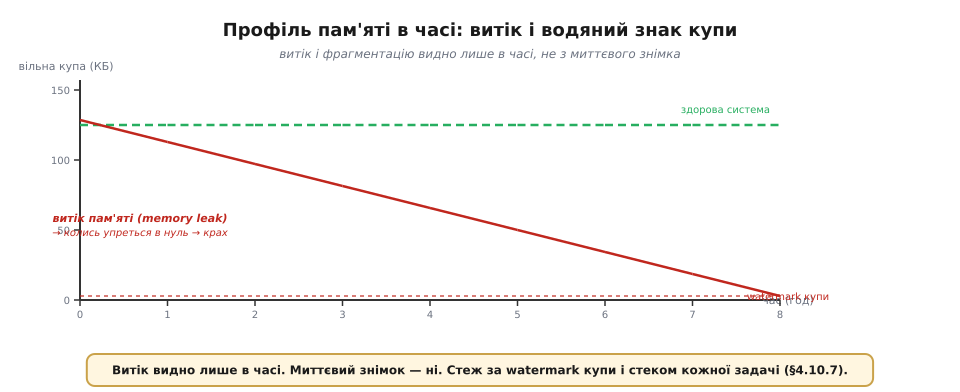

*Рис. 4.10.9.4. Вільна купа за годинами: рівна лінія — здорова система; монотонно спадна — витік пам'яті, що колись дасть крах.*

Ключовий патерн, видимий лише в часі, — **витік пам'яті**: вільна купа повільно й монотонно тане годинами. Кожен виклик виділяє трохи пам'яті й «забуває» її повернути. На короткому тесті система виглядає нормально; після доби роботи — крах через `NULL` з `malloc`. Профіль у часі ловить цей патерн задовго до катастрофи. Миттєвий знімок — ні: «вільно 120 КБ» нічого не каже про те, чи буде «вільно 0 КБ» через 48 годин.

Ще один ефект, невидимий без нагляду, — **фрагментація** (вже згадана в §4.10.7): вільної купи начебто достатньо, але найбільший суцільний шматок замалий для великого буфера. Це теж видно лише в часі — і лише якщо щоразу запитувати не тільки загальний вільний обсяг, а й максимальний суцільний блок.

Деталь ESP32: пам'ять неоднорідна. Wi-Fi і Bluetooth займають власні зарезервовані ділянки, частина SRAM доступна лише для DMA, IRAM відокремлена від DRAM. Коли API повідомляє «вільно X КБ», важливо розуміти, з якої саме ділянки: для динамічного виділення загального призначення важить DRAM, і лише вона. Для точнішого контролю ESP-IDF дозволяє запитувати вільний обсяг за конкретними можливостями пам'яті через `heap_caps_get_free_size()` — наприклад, окремо для MALLOC_CAP_INTERNAL (внутрішня SRAM) і MALLOC_CAP_DMA. Це особливо важливо, якщо у прошивці активні Wi-Fi або Bluetooth: стек бездротового зв'язку може раптово зарезервувати кілька десятків кілобайтів, і «загальна» вільна пам'ять просяде стрибком — без профілю в часі цей момент легко пропустити.

### Пастки вимірювання: спостерігач змінює систему

Профілювання саме споживає ресурс, який вимірює. У фізиці це зветься **ефектом спостерігача**, і в програмуванні МК він цілком реальний.

Перша пастка — **рясний друк у журнал**. `Serial.print()` або `printf()` під час роботи критичної ділянки — це той самий прихований блокувальник, про який ішлося в §4.10.2: UART передає байт за байтом на 115 200 бод, тобто кожен символ займає близько 87 мкс. Рядок «cycles = 12345, heap = 87400» (25 символів) блокує задачу майже на 2 мс. Якщо сама ділянка виконується за 50 мкс, ваш «профіль» покаже 2 мс — роздуття у 40 разів. Профіль бреше; рішення, прийняте на його підставі, буде хибним.


*Рис. 4.10.9.5. Ліворуч — легкий вимір: лічильник циклів, рідкісний друк. Тайминг не змінено. Праворуч — рясний Serial.print на кожній ітерації блокує задачу й роздуває виміряний час у десятки разів.*

Друга пастка — **вимір середнього замість максимуму**. Середній час виконання ділянки, можливо, цілком прийнятний. Але для реального часу (§4.10.8) важить **найгірший випадок**: коли кеш холодний, планувальник щойно перемкнувся, черга повна — тоді та сама ділянка може тривати вп'ятеро довше. Профіль, що показує лише середнє, пропускає саме ті піки, через які зриваються дедлайни. Інструментація з фіксацією максимуму — правильний підхід.

Третя пастка — **вимір на холостому ходу**. Якщо ви профілюєте задачу окремо, без конкурентів за CPU, без реального трафіку Wi-Fi, без одночасного запису в чергу — ви вимірюєте не бойову, а лабораторну систему. Вузьке місце може виявитися тільки під навантаженням: інша задача тримає м'ютекс, RTOS довше розподіляє такти, переривання додає затримку. Профілюйте завжди під **реальним, найважчим навантаженням** — так само, як водяний знак стека (§4.10.7) знімають «під навантаженням».

Четверта пастка — **переповнення лічильника** (перегук із §4.6.4 про переповнення `millis()`): лічильник циклів ESP32 — 32-розрядний, і при 240 МГц переповнюється приблизно за 18 секунд. Для коротких вимірів це не проблема, але якщо ділянка тривала дуже довго або ви порівнюєте знімки, зроблені з великим проміжком, арифметика може дати безглуздий результат. Рішення те саме, що й для `millis()`: рахувати різницю беззнакових чисел, не порівнювати знакові.

> 🔧 **Навіщо це.** Міряй легко і під навантаженням. Дешевий лічильник циклів дає точний результат без накладних; рясний друк на гарячому шляху сам стає вузьким місцем і бреше. Дивись на максимум (найгірший прохід), а не на середнє — тільки максимум визначає дедлайни. Профілюй завжди під реальним навантаженням — лабораторний стенд прихова́є справжні піки.

### Цикл оптимізації: виміряй → знайди → виправ → переміряй

Увесь сенс профілювання — не в самому вимірі, а в підґрунті для правильних дій. Інженерна петля виглядає так:

1. **Виміряй**: зніми CPU-профіль і профіль пам'яті — завантаженість по ядрах, рантайм-статистику задач, вільну купу і її watermark, запас стека кожної задачі.
2. **Знайди**: визнач одну — рівно одну — найгарячішу точку або найбільшу витрату. Не кілька, не все підряд. Одну.
3. **Виправ**: торкнися лише цієї однієї точки. Нічого більше не чіпай — побічні ефекти в суміжному коді непередбачувані.
4. **Переміряй**: повтори вимір. Стало краще? Чи не зламалось щось інше? Якщо бюджет ще не в нормі — повертайся до кроку 1.

Зв'язок із попередніми темами розділу — органічний. Профіль покаже, **коли** super-loop вичерпав свій ресурс (§4.10.2): проходи циклу почали затягуватися, завантаженість зросла. Підкаже, яка задача потребує більшого або меншого стека (§4.10.7). Підтвердить чи спростує, що дедлайни витримуються (§4.10.8). Вкаже, чи варто переносити роботу з перевантаженого Ядра 0 на вільне Ядро 1 (§4.10.5). Профілювання — спільний «вимірювальний прилад» для всіх рішень розділу; без нього ці рішення спираються на відчуття, а не на факти.

Практична деталь петлі: крок «виправ» найчастіше зводиться до одного з трьох ходів — **алгоритмічного** (замінити O(n²) на O(n log n), прибрати зайвий прохід масивом), **архітектурного** (перенести важку роботу в низькопріоритетну задачу, щоб вона не затримувала критичний шлях) або **апаратного** (перекласти обробку на DMA чи апаратний прискорювач, де він є). Перший хід зазвичай найефективніший — алгоритм із меншою складністю виграє більше, ніж будь-яке мікроналаштування вже написаного. Другий хід — улюблений у системах на RTOS: не прискорювати, а ізолювати повільне від швидкого за допомогою черг (§4.10.6). Третій хід рідший, але іноді єдиний: наприклад, передача SPI-буфера через DMA звільняє ядро повністю, поки периферія сама рухає байти.

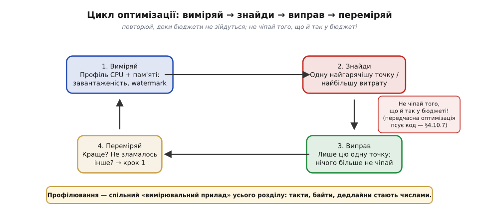

*Рис. 4.10.9.6. Замкнена петля чотирьох кроків. Збоку — застереження: не чіпай того, що й так у бюджеті.*

Важливе застереження, що є наскрізним мотивом розділу: **не профілюй і не оптимізуй те, що й так у бюджеті із запасом**. Якщо запас стека задачі — 800 байт при виділених 2 КБ, а купа вільна на 60 %, — там нічого поліпшувати. Передчасна оптимізація (перегук із §4.10.7: «не оптимізуй стеки передчасно») краде час, псує читабельність і нерідко вносить нові помилки. Профіль потрібен тоді, **коли** ресурс справді тисне.

---

**Приклад (зміряти ділянку лічильником циклів + глянути запас стека й купи).**

Умова: підозрюємо, що зчитування давача в задачі «опитування» затягується і їсть надто багато тактів; хочемо також впевнитися, що стек задачі і купа мають запас.

```c
#include "esp_cpu.h"          // esp_cpu_get_cycle_count()
#include "freertos/FreeRTOS.h"
#include "freertos/task.h"
#include "esp_heap_caps.h"    // esp_get_free_heap_size() і т.д.

static uint32_t max_cycles = 0;   // фіксуємо максимум (найгірший випадок)
static uint32_t iter = 0;

void sensor_task(void *arg) {
    for (;;) {
        // ── 1. Вимір тривалості ділянки лічильником циклів ──────────────
        uint32_t t0 = esp_cpu_get_cycle_count();

        read_sensor_and_process();   // підозрювана ділянка

        uint32_t t1 = esp_cpu_get_cycle_count();
        uint32_t dt = t1 - t0;      // різниця беззнакових → нема проблем
                                     // з переповненням для коротких ділянок
        if (dt > max_cycles) max_cycles = dt;
        // 240 МГц: 1 такт ≈ 4.17 нс → 12 000 тактів ≈ 50 мкс

        // ── 2. Друкуємо РІДКО — раз на 1000 ітерацій ────────────────────
        if (++iter % 1000 == 0) {
            UBaseType_t stack_hwm = uxTaskGetStackHighWaterMark(NULL);
            // §4.10.7: мінімальний залишок стека — чим менше, тим небезпечніше
            uint32_t free_heap = esp_get_free_heap_size();
            uint32_t min_heap  = esp_get_minimum_free_heap_size();
            // min_heap — watermark купи: найменше, що було за весь час
            // якщо він повільно тане між замірами — є витік

            printf("[profile] max Δt = %lu тактів (~%lu мкс) | "
                   "stack HWM = %u слів | "
                   "heap free = %lu / min = %lu Б\n",
                   (unsigned long)max_cycles,
                   (unsigned long)(max_cycles / 240),   // ÷240 → мкс при 240 МГц
                   (unsigned)stack_hwm,
                   (unsigned long)free_heap,
                   (unsigned long)min_heap);
            max_cycles = 0;   // скидаємо для наступного вікна 1000 ітерацій
        }

        vTaskDelay(pdMS_TO_TICKS(10));
    }
}
```

За кількома рядками виводу видно все: скільки тактів споживає ділянка в найгіршому випадку, чи тане купа між замірами (витік), чи близько стек до межі. Друк — раз на 1000 ітерацій, поза критичним шляхом: UART не заважає задачі. Виміряли, а не вгадали — тепер знаємо, що (і чи взагалі варто) оптимізувати.

---

Профілювання — це окуляри, крізь які весь розділ стає вимірним: такти, байти, завантаженість, дедлайни перестають бути відчуттям і стають числами. Підсумок-гасло: **не вгадуй — виміряй; виправ найгарячіше; переміряй; не чіпай того, що й так у бюджеті**. Набір інструментів моделі виконання тепер повний — від простого super-loop до реального часу й уміння його виміряти. Саме час озирнутися на весь пройдений шлях Модуля 4.

---

### Підсумок Модуля 4

На цьому завершується не лише розділ, а й увесь **Модуль 4 «Мікроконтролер і прошивка: ESP32»**. Озирнімося на пройдений шлях. Ми почали з найзагальнішого — **що таке мікроконтролер** і чим особливий ESP32 (Розділ 4.1), як **код стає прошивкою** через ланцюжок збірки (Розділ 4.2). Потім спустилися до заліза виводів — **GPIO** (Розділ 4.4), навчили чип **реагувати на події миттєво** перериваннями (Розділ 4.5) і **відчувати час** таймерами (Розділ 4.6). Далі — два мости між цифрою й аналогом: **ШІМ і ЦАП**, щоб видавати аналогові рівні (Розділ 4.7), та **АЦП**, щоб їх вимірювати (Розділ 4.8). І нарешті — **модель виконання й RTOS** (цей розділ): як організувати всю цю роботу в часі, від простого циклу до справжньої багатозадачності реального часу.

За цей шлях абстрактний «мікроконтролер» перетворився на знайомий, зрозумілий інструмент. Ви знаєте, що в ньому всередині, як туди потрапляє ваш код, як він спілкується зі світом через виводи, відчуває час і події, перетворює аналог на цифру й назад, і як змусити його робити багато справ злагоджено й вчасно. Це — міцний фундамент, на якому стоїть уся практична робота з розумними пристроями: від простого давача до польотного контролера. Попереду — застосовувати ці знання, поєднуючи цеглинки в живі проєкти; та хоч би що ви будували, воно спиратиметься саме на те, що ми пройшли в цьому модулі. Мікроконтролер більше не «чорна скринька» з даташита, а прозорий механізм, кожну частину якого ви розумієте зсередини — від першого транзистора виводу до планувальника реального часу. А з таким розумінням приходить і головне: свобода впевнено творити власні пристрої, не боячись магії, бо магії там і немає — лише ясна, послідовна інженерія, яку ви тепер знаєте.


