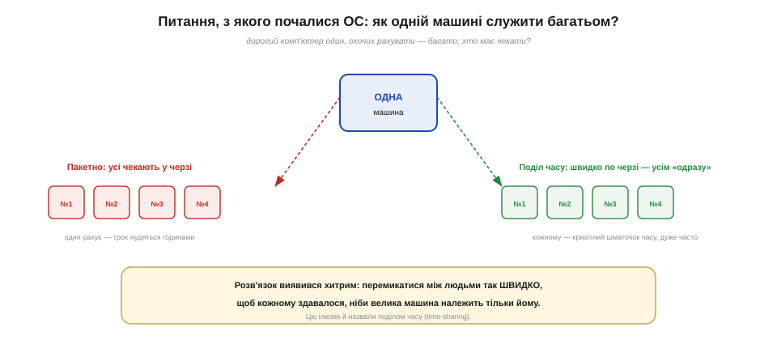
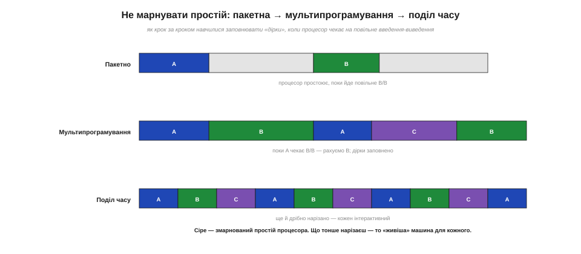
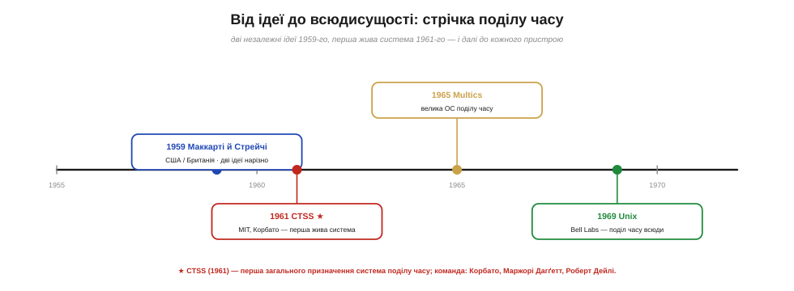
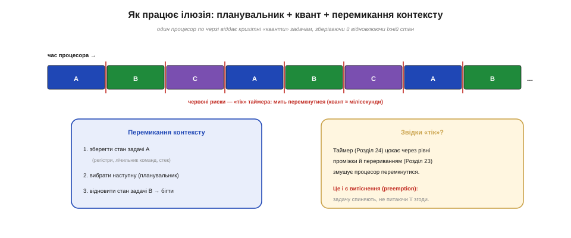
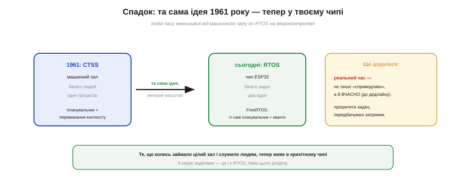

# 📜 Історія до Розділу 27 — Поділ часу: як один комп'ютер навчився служити багатьом

> Це історична вставка до [Розділу 27 «Модель виконання й RTOS»](ch27-execution-rtos.md). Вона веде **ланцюгом питань** навколо однієї нахабної на вигляд ідеї: змусити **один** комп'ютер, що вміє робити лише одну справу за раз, обслуговувати **багатьох** так, ніби кожен володіє ним одноосібно. Розв'язок — перемикатися між справами настільки **швидко**, щоб виникла ілюзія одночасності, — народився на мейнфреймах 1960-х і дав нам планувальник, кванти часу й перемикання контексту. Сьогодні та сама ідея, зменшена до крихітного чипа, працює у вашому ESP32 як **RTOS**: вона дає змогу одному (чи двом) ядрам тягти десяток задач водночас. Зрозумівши, звідки це взялося, ви зрозумієте й весь розділ наперед.

У [Розділі 24](../ch24-timers/ch24-timers.md) ми навчили мікроконтролер відмірювати рівні проміжки часу, а в [Розділі 23](../ch23-interrupts/ch23-interrupts.md) — миттєво відволікатися на події. Тепер настав час поставити велике питання: а як машині робити **багато справ заразом**, маючи лише один процесор, що по своїй суті виконує команди **одну за одною**? Це питання століттями не мало сенсу — бо машин не було; а щойно з'явилися перші дорогі комп'ютери, воно стало пекучим. І відповідь на нього виявилася не лише технічною, а й майже філософською: справжньої одночасності не буде, та її можна **переконливо вдати**.

*Рис. 27.0.1. Серцевина проблеми. Машина одна, охочих рахувати — багато. Можна шикувати їх у чергу (пакетно), і тоді троє нудяться, поки рахує один. А можна перемикатися між ними так швидко, що кожному здаватиметься, ніби велика машина належить лише йому. Цю ілюзію й назвали поділом часу.*

---

## Машина-одинак: епоха пакетної обробки

Щоб відчути проблему, перенесімося в 1950-ті. Комп'ютер тоді — це рідкісна, шалено дорога машина завбільшки з кімнату, одна на цілий університет чи корпорацію. Працювала вона **пакетно (*batch processing*)**: програміст набивав програму на перфокартах, відносив колоду операторові, і та ставала в **чергу**. Машина брала завдання одне за одним, виконувала **до кінця**, друкувала результат — і лише тоді бралася за наступне. Свій роздрук програміст міг отримати за годину, а часом і наступного дня.

Така організація мала дві болючі вади. Перша — **людська**: цикл «написав → здав → чекаєш → побачив помилку → виправив → знову чекаєш» розтягувався на дні, і налагодити програму було мукою. Друга — **машинна**, і ще прикріша: коштовний процесор половину часу **простоював**. Адже щойно програмі треба було щось прочитати зі стрічки чи надрукувати — а введення-виведення (*I/O*) тоді було страшенно повільним, — процесор просто **чекав**, нічого не роблячи. Найдорожчий пристрій у будівлі стояв без діла, поки крутилася якась стрічка. Інженери дивилися на це з болем: так марнувати найцінніший ресурс було соромно.

> 🔧 **Навіщо це.** Ця сама напруга — «процесор чекає на повільне В/В» — нікуди не зникла; вона жива й у вашому мікроконтролері. Коли в наступному розділі ви побачите, як `delay()` чи довге читання давача **блокує** весь скетч, знайте: це той самий простій, що мучив інженерів 1950-х. Уся наука про задачі й планувальники виросла з одного бажання — **не давати процесорові нудитися** без діла, поки можна зробити щось корисне.

---

## Не марнувати простій: мультипрограмування

Перший крок до розв'язку зробило **мультипрограмування (*multiprogramming*)**. Думка проста: якщо програма A зупинилася й чекає, поки крутиться стрічка, то чом би в цю паузу не дати процесорові порахувати програму B? Тримаймо в пам'яті **кілька** завдань водночас — і щойно одне впирається в повільне В/В, перемикаймо процесор на інше, готове рахувати. Дірки простою заповнюються корисною роботою, і машина перестає нудитися.

*Рис. 27.0.2. Еволюція в трьох рядках. Пакетно — процесор простоює (сіре), поки йде повільне В/В. Мультипрограмування заповнює ці дірки іншими завданнями. Поділ часу йде ще далі: нарізає час на дрібнесенькі кванти між усіма — так тонко, що кожен користувач почувається з машиною наодинці.*

Мультипрограмування навчило машину **перемикатися** між завданнями — але перемикалася вона лише з власної вигоди, коли поточне завдання саме спинялося на В/В. До живої взаємодії з людиною звідси був ще один, вирішальний крок. А що, як перемикатися не лише в паузах, а **примусово й дуже часто** — даючи кожному завданню крихітний шматочок часу, тоді відбираючи й передаючи наступному, і так по колу десятки разів на секунду? Тоді кілька людей могли б працювати з машиною **одночасно**, і жоден не помічав би, що його раз у раз спиняють: для людини, повільної проти електроніки, машина здавалася б цілком «своєю». Саме цю зухвалу ідею й назвали **поділом часу**.

---

## Дві ідеї 1959 року: Маккарті й Стрейчі

Як часто буває з великими думками, поділ часу «висів у повітрі» й народився **незалежно** обабіч океану майже одночасно — 1959 року.

У США його чітко сформулював **Джон Маккарті (*John McCarthy*)** — той самий математик, що роком раніше дав назву «штучний інтелект». У січні 1959-го він написав у MIT службову записку «A Time Sharing Operator Program for our Projected IBM 709», де прямо запропонував зробити так, щоб **багато користувачів** працювали з однією машиною водночас, кожен зі свого терміналу, ніби вона тільки його. Саме ця думка — багато живих, інтерактивних людей за однією машиною — і стала тим, що ми сьогодні звемо поділом часу.

У Британії тоді ж, 1959-го, незалежно виступив **Крістофер Стрейчі (*Christopher Strachey*)**: він подав патентну заявку на «поділ часу» й виголосив доповідь «Time Sharing in Large Fast Computers» на першій конференції ЮНЕСКО з обробки інформації в Парижі. Цю доповідь MIT згодом (1963) назве «першою працею про комп'ютери з поділом часу». Та ось важлива чесна обмовка: Стрейчі мав на думці **дещо інше**. Його «поділ часу» означав радше мультипрограмування — щоб один програміст міг налагоджувати свою програму, поки машина у фоні рахує інші завдання, — а не юрбу рівноправних інтерактивних користувачів. Маккарті, за власним зізнанням, прочитав доповідь Стрейчі побіжно й вирішив, що йдеться про те саме. Тож історія тут навмисне неоднозначна: дві людини незалежно вжили ті самі слова, але вкладали в них **різний** зміст — і обидва мали рацію по-своєму. Зводити це до «хтось один винайшов» було б спрощенням.

Чому ж ідея визріла саме тоді? Бо нарешті дозріла **техніка**: з'явилися термінали, якими людина могла друкувати команди й одразу бачити відповідь, а машини стали досить швидкими, щоб встигати перемикатися між людьми непомітно для них. Думка про поділ часу була б марною на машині, до якої не підступишся інакше, як колодою перфокарт. Великі ідеї приходять тоді, коли світ дозріває їх прийняти, — і поділ часу не виняток.

*Рис. 27.0.3. Дві незалежні ідеї 1959-го (Маккарті в США, Стрейчі в Британії — з різним розумінням «поділу часу»), перша жива система 1961-го (CTSS), велика ОС Multics (1965) і нарешті Unix (1969), що розніс поділ часу по всьому світу. Жоден не «вкрав» в іншого — ідея визріла одразу в багатьох головах.*

---

## MIT, 1961: CTSS оживляє поділ часу

Ідея — це ще не машина. Утілити поділ часу в **робочу** систему випало команді **Массачусетського технологічного інституту (MIT)** під проводом **Фернандо Корбато (*Fernando J. Corbató*)**. Їхній **CTSS (*Compatible Time-Sharing System*)** уперше показали публічно в **листопаді 1961 року** (перші команди запрацювали ще влітку), і це була **перша загального призначення** система поділу часу. На одному мейнфреймі IBM (709, згодом 7090/7094) кілька людей з різних терміналів водночас редагували й запускали програми — і кожному здавалося, ніби велика машина належить лише йому.

Варто назвати імена, бо CTSS була **колективним** здобутком, а не подвигом одинака: поряд із Корбато над нею працювали **Маржорі Дагґетт (*Marjorie Merwin-Daggett*)** і **Роберт Дейлі (*Robert Daley*)**. Ця деталь промовиста: біля витоків операційних систем стояла, зокрема, жінка-програмістка, чиє ім'я в популярних переказах згадують далеко не завжди. CTSS дала світові не лише поділ часу: саме на ній з'явилися речі, які ми вважаємо буденними, — текстове редагування на екрані й навіть прообраз **електронної пошти** (повідомлення між користувачами тієї самої машини). Регулярно обслуговувати користувачів MIT система почала з літа 1963-го в межах знаменитого **Project MAC** і пропрацювала більшу частину десятиліття.

До речі, слово «Compatible» (сумісна) у назві CTSS не випадкове: систему зробили так, щоб поділ часу **співіснував** зі звичною пакетною обробкою на тій самій машині — нова модель не ламала старої, а делікатно вросла поряд із нею. Це теж свого роду урок: великі зміни легше приживаються, коли не вимагають усе викинути й почати з нуля, а вміють якийсь час жити пліч-о-пліч зі старим.

> 🔧 **Навіщо це.** CTSS уперше довела на ділі те, чим живе кожен RTOS: **один процесор може переконливо вдавати багато**. Усе, що ви далі вивчатимете про задачі на ESP32, — це прямий нащадок тих експериментів 1961 року, тільки замість залу з терміналами тепер чип, а замість користувачів — програмні задачі. Принцип не змінився ні на йоту: швидко перемикайся — і вийде ілюзія, що всі працюють разом.

---

## Як працює ілюзія: планувальник, квант, перемикання контексту

Придивімося, **як** машина творить цю ілюзію, бо саме ці механізми — серце всього розділу. Час процесора нарізають на крихітні шматочки — **кванти (*time slice, quantum*)**, зазвичай по кілька мілісекунд. Щокванта окрема частина системи — **планувальник (*scheduler*)** — вирішує, **кому** з готових задач віддати наступний шматочок. А щоб перемкнутися з однієї задачі на іншу, машина робить **перемикання контексту (*context switch*)**: ретельно зберігає весь стан поточної задачі (вміст регістрів, лічильник команд, верхівку стека), а тоді відновлює раніше збережений стан наступної — і та біжить далі так, ніби її й не спиняли.

*Рис. 27.0.4. Один процесор по черзі віддає кванти задачам A, B, C. На кожній межі (червона риска — «тік» таймера) відбувається перемикання контексту: зберегти стан старої задачі, спитати планувальник, відновити стан нової. Звідки «тік»? Його дає **таймер** (Розділ 24), а **переривання** (Розділ 23) змушує процесор спинити задачу — це й зветься витісненням.*

І ось де чудово сходяться попередні розділи модуля. Що змушує процесор вчасно спинити задачу й перемкнутися, навіть якщо та сама й не думає поступатися? **Таймерне переривання**. Таймер (Розділ 24) рівно цокає, і його переривання (Розділ 23) періодично «штовхає» процесор: годі, час іншому. Коли задачу спиняють **примусово**, не питаючи її згоди, це звуть **витісняльною (*preemptive*)** багатозадачністю. Є й м'якший різновид — **кооперативна**, де задача працює, аж доки сама ласкаво не поступиться; вона простіша, та одна зажерлива задача здатна підвісити всіх. Сучасні системи переважно витісняльні — саме тому, що таймер із перериванням дає планувальникові надійний, незалежний від задач «батіг». Усе це ви детально розберете далі в розділі; тут важливо побачити корінь: **поділ часу = планувальник + кванти + перемикання контексту, підштовхувані таймером**.

---

## Від Multics до Unix — і до всього світу

Успіх CTSS надихнув на сміливіше: 1965 року MIT разом із Bell Labs та General Electric узялися за **Multics (*Multiplexed Information and Computing Service*)** — велику, амбітну операційну систему поділу часу, що мала стати «обчислювальною комунальною послугою», доступною як електрика з розетки. Multics випередила час багатьма ідеями, хоч і вийшла надто складною та забарилася.

З неї проросло дещо легендарне. Коли Bell Labs вийшла з проєкту, двоє її інженерів — **Кен Томпсон (*Ken Thompson*)** і **Денніс Рітчі (*Dennis Ritchie*)** — 1969 року зробили простішу, компактнішу систему поділу часу. Назвали її жартома **Unix** — як іронічний натяк на громіздку Multics. Unix (а згодом її ідейні нащадки, як-от Linux) розніс поділ часу по всьому світу: сьогодні він б'ється в кожному сервері, телефоні й ноутбуці. Так лінія, що почалася зі службової записки Маккарті й експерименту Корбато, стала **невидимим фундаментом** усієї цифрової доби. І, що важливо для нас, — той самий фундамент лежить і під операційними системами для мікроконтролерів.

---

## Спадок: RTOS — поділ часу на одному чипі

Найдивовижніше в цій історії те, як ідея **зменшилася**. Те, що 1961 року займало машинний зал і служило людям, сьогодні вміщається в крихітний чип і служить **програмним задачам**. Операційна система реального часу (**RTOS**) на вашому ESP32 — це, по суті, мініатюрна система поділу часу: той самий планувальник, ті самі кванти, те саме перемикання контексту, тільки замість терміналів — функції-задачі вашого коду.

*Рис. 27.0.5. Та сама ідея, новий масштаб. Планувальник і перемикання контексту, що колись керували залом терміналів, тепер живуть у чипі ESP32 як FreeRTOS і керують задачами. Додалося головне нове: **реальний час** — робити не лише «справедливо», а й ВЧАСНО, до дедлайну, з пріоритетами задач.*

Та одну важливу річ RTOS до старої ідеї **додає**. Класичний поділ часу прагнув **справедливості** — щоб усім користувачам діставалося порівну й нікого не «забули». А мікроконтролеру в реальному пристрої часто потрібне інше — **вчасність**: керівний імпульс на мотор має вийти точно в строк, давач треба опитати рівно щомилісекунди, інакше виріб поведеться неправильно чи небезпечно. Тому RTOS додає до поділу часу **пріоритети** задач і **гарантовані, передбачувані** затримки — це й означає слово «реального часу». Саме про це — про super-loop, задачі, планувальник, FreeRTOS на двох ядрах ESP32 і справжній реальний час — і піде мова в розділі.

Отже, за буденним словом «задача» у вашому коді стоїть довга й шляхетна історія: від соромної картини простоюючого мейнфрейма, через зухвалу думку Маккарті й Стрейчі та живу систему Корбато, Дагґетт і Дейлі, через Multics та Unix — аж до крихітного планувальника у вашому чипі. Один процесор, що переконливо вдає багато, — ідея, якій уже понад шістдесят років, і яку ви ось-ось опануєте на практиці. Розпочнімо з найпростішого її попередника — одного великого циклу: [Розділ 27 «Модель виконання й RTOS»](ch27-execution-rtos.md).
