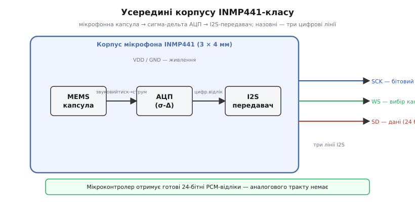
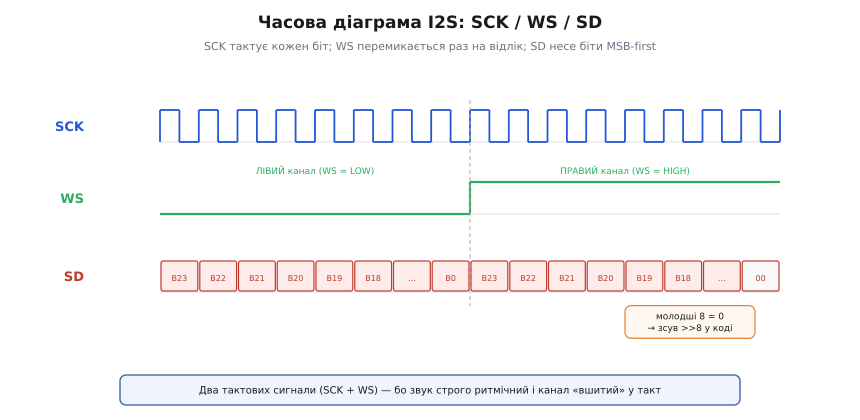

# 🔌 I2S-мікрофон INMP441-класу: цифровий звук безперервним потоком

> Компонентна вставка до **теми [§4.9.6 «DMA + SPI/I2S»](dma.md)**. У §4.9.6 ми з'ясували, що DMA годує периферію великими блоками без переривань на кожен байт; мікрофон I2S — найчистіший приклад, де **без DMA взагалі не вийде**: звук не має пауз, його не можна «доопитати пізніше».

## Що це за деталь

**INMP441-клас** — це мікроелектромеханічний (*MEMS*, micro-electro-mechanical system) мікрофон із цифровим виходом. Усередині одного корпусу 3×4 мм розміщені три блоки: мікрофонна капсула, сигма-дельта АЦП і I2S-передавач. Назовні мікрофон видає вже **готове число** — 24-бітний відлік звуку у форматі імпульсно-кодової модуляції (*PCM*, pulse-code modulation), а не аналогову напругу.



*Рис. 4.9.6c.1. Усередині корпусу INMP441-класу: капсула → сигма-дельта АЦП → I2S-передавач; назовні — три лінії I2S і живлення. Мікрофон віддає вже готові 24-бітні відліки, а не аналогову напругу.*

Звідси принципова відмінність від звичайного давача: давач можна «запитати в зручний момент» — потягнути GPIO, прочитати I²C-регістр, зняти відлік АЦП. Звук влаштований інакше: він надходить у темпі **16 000…48 000 відліків щосекунди** без жодної паузи. Пропустили вікно — у записі з'явиться «клац», артефакт. Саме тому мікрофон є потоковим пристроєм, а не «опитувальним» давачем, як у §4.5.1 чи §4.8. Цей режим роботи і ставить задачу для DMA та подвійного буфера з §4.9.4.

> 🔧 **Навіщо це.** Цифровий мікрофон знімає з мікроконтролера весь аналоговий головний біль — підсилювач, опорна напруга §4.8.4, екранування провідників. Назовні приходять чисті числа. Лишається тільки **встигати їх забирати**, а це якраз робота для DMA.

Важливо розрізняти два класи: **I2S/PCM** і **PDM**. INMP441-клас передає справжній I2S — готові 24-бітні слова. PDM-мікрофони (трапляються в інших модулях) видають однобітний потік, який треба ще фільтрувати в мікроконтролері. З'ясувати, що саме перед вами, — перший крок при купівлі компонента; без цього код просто не запрацює. Детальніше про цю різницю — в розділі «Типові граблі» нижче.

## Розпіновка й підключення

Мікрофон виставляє **шість виводів**:

```
VDD  — живлення 1.8…3.3 В (ESP32 — 3.3 В прямо)
GND  — спільна земля
SCK  — бітовий такт (BCLK): один фронт на кожен біт
WS   — вибір слова/каналу (LRCLK): лівий/правий відлік
SD   — серійні дані: біти відліку від мікрофона до ESP32
L/R  — вибір каналу: GND → лівий, VDD → правий
```

Шина I2S складається з **трьох ліній**, і кожна несе окрему роль. **SCK** — це метроном: один фронт на кожен переданий біт. **WS** (Word Select, він же LRCLK) перемикається рівно раз на повний 32-бітний слот і сигналізує, чий зараз черга — лівого чи правого каналу. **SD** несе самі біти, старший уперед (MSB-first). Порівняно зі звичайним SPI тут дві тактові лінії замість однієї, і причина зрозуміла: звук строго ритмічний, і канал «вшитий» у такт — мікроконтролеру не потрібен окремий сигнал вибору пристрою, як CS у SPI.



*Рис. 4.9.6c.2. Як читається I2S: SCK тактує кожен біт, WS перемиканням позначає лівий/правий відлік, на SD ідуть біти MSB-first. INMP441 кладе 24 значущі біти у старші розряди 32-бітного слова — звідси зсув `>> 8` у коді.*

Хто відповідає за такт? У режимі прийому мікрофона **ESP32 є майстром**: контролер I2S самостійно генерує SCK і WS, а мікрофон лише підкладає дані на SD у відповідний момент. INMP441 — завжди ведений.

Підключення: VDD і GND — на 3,3 В і землю ESP32, три GPIO (BCLK, WS, DIN) — на будь-які вільні через матрицю сигналів §4.4.7; [перетворювач рівнів](book:components/level-shifter) не потрібен, бо рівні збігаються (на відміну від SD-модуля r03-s6, де він міг знадобитися). **L/R на землю** — тоді мікрофон обслуговує лівий канал, що є стандартним вибором для моно.

## Перший потік

На відміну від одноразового читання регістра, тут мікроконтролер спочатку **налаштовує I2S-периферію разом із DMA** (деталі кільця буферів — у §4.9.4 і §4.9.6), а потім у нескінченному циклі **вибирає готові блоки** з DMA-кільця одним викликом. Периферія самостійно наповнює буфери, поки ядро обробляє попередній блок.

**Перший потік від INMP441 на ESP32 (ESP-IDF, класичний `driver/i2s.h`):**

```c
#include "driver/i2s.h"
#include "esp_log.h"

#define I2S_NUM        I2S_NUM_0
#define SAMPLE_RATE    16000
#define GPIO_BCLK      26
#define GPIO_WS        25
#define GPIO_DIN       34   // тільки вхід

void i2s_mic_init(void) {
    /* Конфігурація I2S-периферії з DMA-кільцем:
       8 буферів по 256 відліків — ping-pong з §4.9.4 у дії. */
    i2s_config_t cfg = {
        .mode                 = I2S_MODE_MASTER | I2S_MODE_RX,
        .sample_rate          = SAMPLE_RATE,
        .bits_per_sample      = I2S_BITS_PER_SAMPLE_32BIT,   /* слот 32 біти */
        .channel_format       = I2S_CHANNEL_FMT_ONLY_LEFT,   /* L/R на GND */
        .communication_format = I2S_COMM_FORMAT_STAND_I2S,   /* Philips */
        .dma_buf_count        = 8,    /* вісім DMA-буферів у кільці */
        .dma_buf_len          = 256,  /* 256 відліків кожен */
        .use_apll             = false,
        .intr_alloc_flags     = 0,
    };

    i2s_pin_config_t pins = {
        .bck_io_num   = GPIO_BCLK,
        .ws_io_num    = GPIO_WS,
        .data_in_num  = GPIO_DIN,
        .data_out_num = I2S_PIN_NO_CHANGE,  /* TX не потрібен */
    };

    i2s_driver_install(I2S_NUM, &cfg, 0, NULL);
    i2s_set_pin(I2S_NUM, &pins);
}

void i2s_mic_task(void *arg) {
    int32_t buf[256];
    size_t  bytes_read;

    for (;;) {
        /* Блокуємось, доки DMA не наповнить черговий буфер */
        i2s_read(I2S_NUM, buf, sizeof(buf), &bytes_read, portMAX_DELAY);

        /* INMP441: 24 значущих біти у старших розрядах 32-бітного слова */
        int64_t sum_sq = 0;
        int n = bytes_read / sizeof(int32_t);
        for (int i = 0; i < n; i++) {
            int32_t s = buf[i] >> 8;   /* зсунути: старші 24 → нижні розряди */
            sum_sq += (int64_t)s * s;
        }
        /* Корінь із середнього квадрату — ознака амплітуди */
        int32_t rms = (int32_t)sqrt((double)sum_sq / n);
        ESP_LOGI("MIC", "RMS = %ld", (long)rms);
    }
}
```

Один виклик `i2s_read` повертає цілий **DMA-блок** — 256 відліків, зібраних без жодного переривання ядра поки цикл обробляв попередній. Якщо RMS «дихає» від плескання долонями — весь ланцюг (мікрофон → I2S → DMA → буфер) живий. Це і є «перший потік» замість «першого байта».

Чому буфери мають розміщуватися у DMA-придатній пам'яті й бути вирівняні — ці деталі докладно розбираються в §4.9.7.

## Типові граблі

- **PDM ≠ I2S.** Половина «мікрофонів для ESP32» у популярних магазинах — PDM: однобітний потік, для якого потрібен фільтр-дециматор. Код I2S їх не прочитає — в буфері буде шум. INMP441-клас — справжній I2S/PCM; перед купівлею звіряйте тип інтерфейсу в даташиті.

- **Зсув 24→32.** Дані 24-бітні, вирівняні в 32-бітному слоті зліва (MSB у старшому розряді). Якщо пропустити `>> 8` (а на деяких партіях і `>> 14`), амплітуда виявиться заниженою в сотні разів або молодші біти «шумітимуть» нулями.

- **L/R і `channel_format` мусять збігатися.** Якщо L/R на GND (лівий канал), а в коді стоїть `I2S_CHANNEL_FMT_ONLY_RIGHT` — тиша: мікрофон кладе дані лише у «свій» півперіод WS, а ядро читає інший.

- **Замалі DMA-буфери.** Якщо обробка між читаннями забирає більше часу, ніж заповнення одного блоку, кільце переповнюється і у звуці з'являються клацання. Лікується збільшенням `dma_buf_len` / `dma_buf_count` або пришвидшенням обробки — пряме продовження теми розміру ping-pong із §4.9.4.

- **Конфлікт виводів або частоти.** BCLK і WS жорстко пов'язані з `sample_rate`; нестандартна частота або GPIO, зайнятий іншою периферією, дають пошкоджені дані. Перевіряйте матрицю сигналів §4.4.7.

- **Живлення і земля.** Спільна земля з ESP32 обов'язкова; шумне живлення підмішує гул у запис. Конденсатор 100 нФ по VDD якнайближче до модуля — стандартний прийом (та сама рекомендація, що й для SD-модуля r03-s6).

## Варіації класу

**Моно → стерео.** Два INMP441 на одній шині: L/R одного на GND, іншого на VDD — і обидва мікрофони передають дані по одній лінії SD без зайвих проводів. Саме для цього й існує WS-канал.

**I2S проти PDM-класу.** PDM-мікрофон дешевший і дрібніший, але потребує фільтра-дециматора в мікроконтролері (ESP32 має PDM-режим I2S). I2S/PCM-мікрофон типу INMP441 вже видає готові числа, без жодного фільтра на стороні МК.

**Той самий апарат — на вихід.** Контролер I2S ESP32 вміє не лише приймати (мікрофон), але й **відтворювати**: той самий блок у режимі TX передає PCM-дані на зовнішній I2S-ЦАП або підсилювач того самого класу. Шина двонаправлена.

**Розрядність і частота.** Типово 16 або 24 біти при 16…48 кГц — компроміс між якістю звуку і потоком байтів, який треба встигати вибирати (місток на пропускну здатність §4.9.1).

Хоч би яка варіація — пристрій видає **безперервний потік чисел**, і єдине завдання прошивки — встигати його вибирати. Саме тому мікрофон живе в розділі про DMA, а не серед звичайних давачів.
