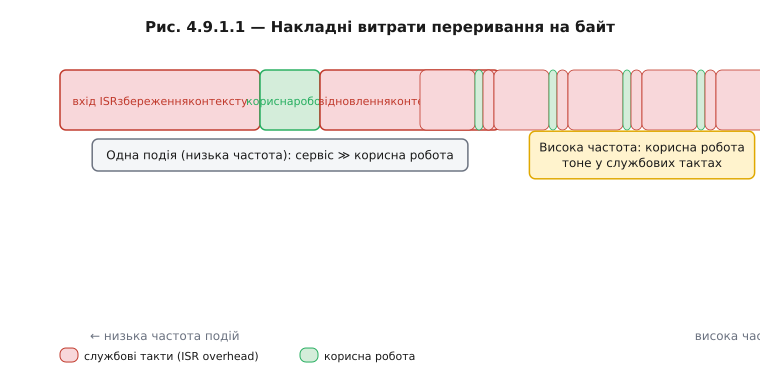
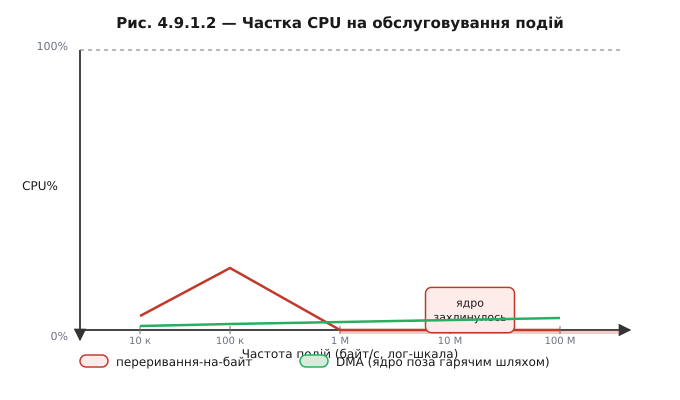
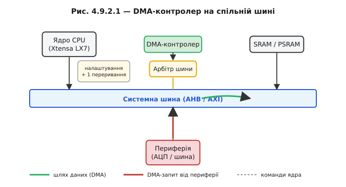
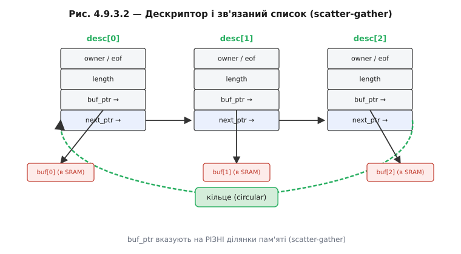
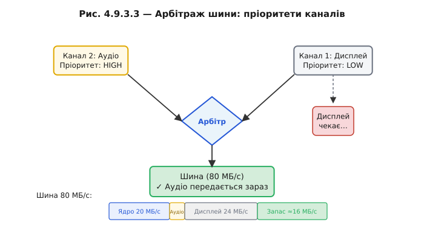
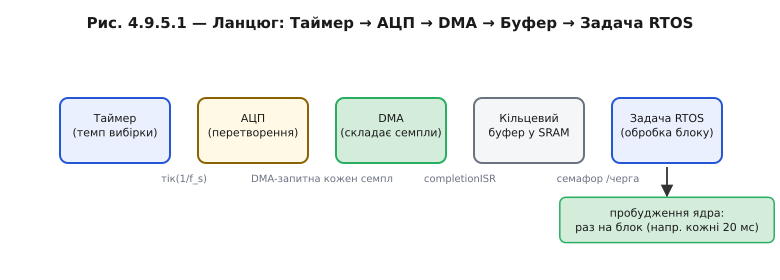
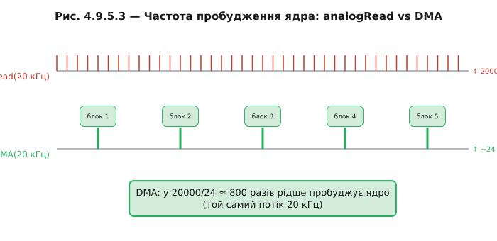
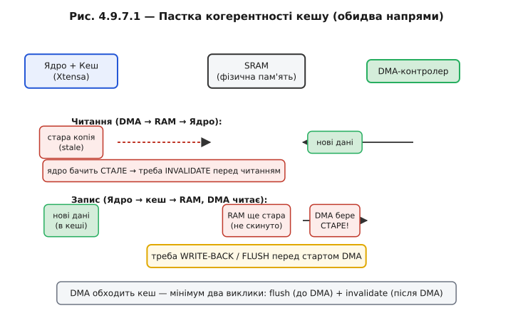

# Розділ 4.9 — DMA: дані без участі ядра

<!-- ФАЙЛ: E:/develop/courses/embedded/block-4-mcu-esp32/r09-dma/r09-dma.md -->
<!-- Нумерація М.Р.Т: модуль 4, розділ 9. Заголовки тем «## 4.9.k Назва», фігури «Рис. 4.9.k.n». -->

У §4.8 ми навчилися знімати окремі виміри з АЦП — `analogRead` повертало одне число, ядро записувало його у змінну, і цикл ішов далі. Для батарейного моніторингу або датчика освітленості цього достатньо: такі сигнали змінюються повільно, і ядро встигає їх опитувати між іншими справами. Але щойно ви захочете оцифрувати звук на 44,1 кГц, записати вібрацію підшипника чи безперервно живити дисплей свіжими пікселями — виникає нова перешкода. Потік даних стає швидшим за те, що ядро здатне переробити по одному елементу.

Ми вже знаємо, що переривання (§4.5) врятували нас від поллінгу: замість того щоб постійно запитувати «є нові дані?», ядро займалося своїм, а апаратна подія надходила сама. Це спрацювало чудово для поодиноких подій — натискання кнопки, приймання символу UART. Однак у потоці 500 кБ/с кожен байт породжує переривання. Кожне переривання — це збереження контексту, стрибок у ISR, корисна робота (скопіювати один байт!), відновлення контексту. Накладні витрати домінують над корисною роботою. Ядро тоне не в даних, а в обслуговуванні власного механізму переривань.

Герой цього розділу — DMA (*Direct Memory Access*, прямий доступ до пам'яті). Це невеликий апаратний автомат, вбудований поряд із ядром на тій самій шині. Він уміє рівно одне: переносити байти з адреси А на адресу Б за командою. Не виконує програм, не рахує формул — лише копіює. Ядро лише домовляється про маршрут: «ось джерело, ось призначення, ось скільки байтів — іди». Далі ядро звільнене.

У §4.9.1 ми кількісно покажемо, де саме ламається механізм «переривання-на-байт» і чому навіть бездоганно написаний ISR не рятує ситуацію. У §4.9.2 розкажемо, як DMA фізично розташований на шині і яким чином одне переривання замінює тисячі. §4.9.3 пояснить, як один контролер обслуговує кілька незалежних потоків — через канали й дескриптори. У §4.9.4 — центральна ідея безперервності: кільцевий буфер і ping-pong, де одну половину завжди заповнюють, а іншу обробляють. §4.9.5 зведе все це в конкретний приклад — безперервний потік вимірів із АЦП. §4.9.6 покаже дзеркальний напрям: як DMA виливає великі блоки у швидкі послідовні шини (дисплеї, аудіо). І нарешті §4.9.7 — найважливіша практична тема: три класи підступних помилок, які DMA може подарувати нерозважливому програмісту.

Цю розмову передує стара ідея: ще канальні процесори мейнфреймів IBM 1960-х (📜 r09-history-dma-channels.md) виконували введення-виведення на окремому «процесорі-копіювальнику», щоб не гальмувати центральний. Мікроконтролер ESP32 2024 року робить те саме — архітектурна думка не змінилась, лише масштаб.

Фундамент, на якому стоїмо: відображення периферії у пам'ять (§4.1.3), шина AHB/AXI та розкладка Flash/SRAM (§4.1.2, §4.1.5), механізм переривань (§4.5), RTOS і черги (§4.10).

---

## 4.9.1 Проблема: потік даних швидший за цикл

Уявімо найпростішу ситуацію — надходять дані з давача на 1 МГц (один байт на мікросекунду). Ядро в super-loop (§4.10.1) робить одне й те саме: питає статусний регістр «є новий байт?», зчитує, кладе в буфер, питає знову. Сто тисяч ітерацій на секунду, і жодного вікна для будь-якої іншої роботи — ядро в полоні поллінгу. Ми вже знаємо відповідь із §4.5: переривання. Нехай периферія сама повідомляє, коли байт готовий.

Але переривання теж коштують. Кожне входження в ISR — це збереження всіх використовуваних регістрів у стеку, перехід до адреси обробника, виконання корисної роботи, відновлення регістрів, повернення. На ESP32 (Xtensa LX7, 240 МГц) типовий повний цикл входу й виходу з ISR займає приблизно 80–150 тактів залежно від того, скільки регістрів потрібно зберегти. Для рідкісних подій це дрібниця. Для потоку 500 кБ/с — катастрофа.

**Бюджет переривань на потоці 500 кБ/с**

```
Дано:
  f_data    = 500 000 байт/с   (500 кБ/с)
  overhead  = 120 тактів/ISR   (вхід + корисна копія 1 байта + вихід)
  f_cpu     = 240 000 000 Гц   (240 МГц)

Такти/с на обслуговування ISR:
  T_isr = 500 000 × 120 = 60 000 000 тактів/с

Частка CPU:
  CPU% = T_isr / f_cpu = 60 000 000 / 240 000 000 = 25%

При 1 МБ/с:
  T_isr = 1 000 000 × 120 = 120 000 000 тактів/с
  CPU% = 50%

При 2 МБ/с:
  CPU% = 100%  → ядро більше ні на що не здатне
```

Двадцять п'ять відсотків тактів іде на «поштову службу», а не на обробку даних. При двох мегабайтах на секунду система захлинається — ISR не встигають розвантажуватись і черга переривань переповнюється.



*Рис. 4.9.1.1. Смуга обробки одного байта за перериванням: великий блок «вхід ISR / збереження контексту» плюс крихітна «корисна робота» плюс «вихід». На високій частоті службові блоки зливаються в суцільну стіну.*

Це перша стіна, в яку ми впираємось: **частка CPU на обслуговування** зростає лінійно з частотою подій і рано чи пізно з'їдає все ядро.

Друга стіна — **джитер**. Поки ядро сидить в одному ISR, наступне переривання чекає в черзі. Якщо обробник займає навіть 10 мікросекунд, а нові байти надходять кожні 2 мікросекунди, вибірки починають губитися. Реальна частота дискретизації стає нижчою за запрограмовану, і сигнал спотворюється — саме те, чого не можна допустити в аудіо чи вібродіагностиці.

Третя стіна — **енергія**. Ядро, що безперервно обробляє переривання, не може увійти в жоден режим сну. Навіть легкий сон між задачами — розкіш, недоступна при щільному потоці ISR. Ядро гаряче й зайняте цілодобово.

> 🔧 **Навіщо це:** правило великого пальця — якщо добуток (частота_подій × вартість_ISR) наближається до тактової частоти ядра, не треба далі оптимізувати ISR. Треба прибирати ядро з гарячого шляху цілком. Це і є задача DMA.



*Рис. 4.9.1.2. Крива «переривань-на-байт» повзе вгору і впирається в 100%. Горизонтальна лінія DMA залишається поблизу нуля при будь-якій частоті — ядро поза гарячим шляхом.*

Рішення одним реченням: треба, щоб дані їхали в пам'ять самостійно, а ядро дізнавалося лише про **готовий блок**, не про кожен байт. Ось що таке DMA. Детальніший розрахунок — у 🧮-вставці r09-s1-m-throughput, де точно прорахований поріг; а ⚙️-вставка r09-s2-a-memcpy-vs-dma показує, де коротші блоки краще скопіювати звичайним `memcpy`.

---

## 4.9.2 DMA-контролер: окремий «копіювальник» на шині

Ми сказали «дані їдуть самі» — але хто їх возить? Відповідь: окремий апаратний блок на тій самій шині, що й ядро. Подумайте про фізичну схему системи на кристалі: ядро Xtensa LX7, блок SRAM, блок периферії — і між ними системна шина AHB/AXI. Тепер уявіть, що до тієї самої шини підключений ще один невеликий автомат — **DMA-контролер** (*Direct Memory Access controller*). Він уміє рівно одне: отримати команду «перенеси N байтів з адреси src на адресу dst» і виконати її, посилаючи транзакції на шині так само, як це робило б ядро.

Різниця в тому, що ядро в цей час може займатися чим завгодно.



*Рис. 4.9.2.1. Ядро, DMA-контролер, RAM і периферія на спільній шині. Стрілка даних іде периферія → DMA → RAM, обходячи ядро. Ядро лише налаштовує маршрут і отримує одне переривання наприкінці.*

**Як ядро запускає DMA.** Контролер DMA — теж периферія з відображенням у пам'ять (§4.1.3). Ядро пише в кілька регістрів: адресу джерела, адресу призначення, кількість байтів, напрям і параметри (ширина слова, режим кільця тощо). Потім записує біт «старт» у регістр керування. Все — ядро більше не потрібне для цієї операції.

**Майстер шини.** Будь-хто, хто може починати транзакції на шині самостійно (без запиту до іншого пристрою), називається **майстром шини** (*bus master*). Ядро — майстер. DMA — теж майстер. Але шина одна, і два майстри не можуть говорити одночасно. Арбітр вирішує, чия черга. Якщо ядро не займає шину (наприклад, виконує код із кешу), DMA «краде» цикл шини й переносить черговий блок даних. Це явище називають **крадіжкою циклів** (*cycle stealing*): ядро навіть не помічає, що шина на мить перейшла до іншого майстра.

**Звідки сигнал.** Периферія не чекає, поки DMA сам здогадається прийти. Коли АЦП зробив вимір і регістр даних готовий, він піднімає лінію **DMA-запиту** (*DMA request*, DREQ). DMA-контролер реагує апаратно — без жодної участі ядра — і переносить слово даних у буфер. Так синхронізація потоку лягає цілком на залізо: ядро не бере участі ні в опитуванні, ні в копіюванні.

**Одне переривання на блок.** Коли DMA переніс весь замовлений блок, він піднімає переривання «готово» (transfer complete). Ядро прокидається, забирає готовий буфер і, можливо, ставить наступний. Це рідкісна і корисна подія, не щоразова. Згадайте §4.5 (де порівнювали поллінг і переривання): тепер переривання відбувається не на кожен байт, а на кожен буфер.

**Скільки переривань заощадив DMA**

```
Без DMA (переривання-на-байт):
  f_data   = 500 000 байт/с
  ISR/с    = 500 000

З DMA (буфер 1024 байти):
  ISR/с    = 500 000 / 1024 ≈ 488

Зменшення: 500 000 / 488 ≈ 1024 рази

Частка CPU при 120 тактів/ISR, 240 МГц:
  Без DMA: 60 000 000 / 240 000 000 = 25%
  З DMA:   488 × 120 / 240 000 000 ≈ 0.024%
```

Різниця в тисячу разів — не тому, що DMA «швидша» апаратура; байт транслюється через шину однаково довго. Різниця в тому, що **ядро звільнене**: воно не стоїть між кожним байтом і пам'яттю.

> 🔧 **Навіщо це:** DMA не прискорює шину — він прибирає ядро з циклу копіювання. Виграш вимірюється не тактами на байт, а звільненим часом ядра і різким скороченням кількості переривань.


*Рис. 4.9.2.2. Ліворуч (без DMA): ядро в постійному циклі copy-copy-copy. Праворуч (з DMA): ядро дало «старт», велика вільна зона, DMA веде копіювання, наприкінці — одна стрілка «done» назад у ядро.*

Варто зазначити й зворотний бік: для дуже коротких блоків (десятки байтів) DMA має **фіксований стартовий overhead** — записати регістри, налаштувати канал. Звичайний `memcpy` у цьому діапазоні виграє. Де саме проходить межа — залежить від конкретної периферії й шини, але зазвичай це 64–256 байтів (⚙️ r09-s2-a-memcpy-vs-dma).

---

## 4.9.3 Канали, дескриптори, пріоритети

Реальний пристрій рідко має один потік даних. Одночасно може йти безперервне оцифровування мікрофона, виливатися кадр на дисплей і наповнюватися буфер із шини. Якщо один DMA-контролер — один конвеєр, їх треба якось чергувати. Саме для цього служать **канали**.

### Канали

**Канал** (*DMA channel*) — це незалежний набір регістрів усередині одного контролера: своє джерело, своє призначення, свій лічильник, свій статус. Кілька каналів розділяють одну шину і один арбітр, але кожен веде власний потік — вони не плутають один одного, бо стан зберігається окремо.

На ESP32 DMA пройшов два покоління. У ранніх чіпах кожна периферія мала власний невеликий DMA-блок, вбудований у неї саму. Новіші серії отримали загальний **GDMA** (*General DMA*) — пул незалежних каналів, кожен з яких можна програмно прив'язати до будь-якої периферії. Це дає гнучкість: хочете більше каналів на АЦП — прив'яжіть кілька; звільнили дисплей — канал доступний для іншого.


*Рис. 4.9.3.1. Один DMA-контролер з пулом каналів: канал 0 — АЦП, канал 1 — дисплей-шина, канал 2 — аудіо. Кожен зі своїм джерелом, призначенням і лічильником довжини.*

### Дескриптори

Один канал із простим налаштуванням (src, dst, len) переносить **один** безперервний блок і зупиняється. Але що, якщо дані розкидані по пам'яті або потрібен нескінченний потік? Відповідь — **дескриптори** (*DMA descriptors*): невеликі структури, що описують окремі шматки передачі й пов'язані в список.

Типова структура дескриптора (спрощена версія `lldesc_t` із ESP-IDF):

```c
typedef struct dma_desc_s {
    uint32_t  owner     : 1;   /* 1 = DMA, 0 = CPU */
    uint32_t  eof       : 1;   /* кінець ланцюга (transfer-complete IRQ) */
    uint32_t  sosf      : 1;   /* start-of-sub-frame (аудіо) */
    uint32_t  length    : 12;  /* реальна кількість байтів у buf */
    uint32_t  size      : 12;  /* розмір buf (максимум) */
    uint8_t  *buf;             /* вказівник на буфер даних */
    struct dma_desc_s *next;   /* наступний дескриптор (NULL = кінець) */
} dma_desc_t;
```

Поле `owner` — ключове: якщо `1`, буфер «належить» DMA і CPU не сміє його чіпати; якщо `0` — DMA завершив і буфер повернутий CPU. Це апаратний замок без жодного mutex.

**Scatter-gather**: вказівники `buf` різних дескрипторів можуть показувати на розкидані ділянки пам'яті. DMA переносить їх поспіль у шину як суцільний потік — одержувач не бачить «зшивок». Це зручно для протоколів, де заголовок і дані зберігаються окремо.

**Кільцевий список**: якщо поле `next` останнього дескриптора вказує на перший, утворюється кільце. DMA безкінечно крутиться по ньому, доки ядро не скаже зупинитись. Це підготовка до §4.9.4.

```c
/* Два дескриптори для ping-pong (заготовка) */
static dma_desc_t descs[2];
static uint8_t buf_a[BUF_SIZE] __attribute__((aligned(32)));
static uint8_t buf_b[BUF_SIZE] __attribute__((aligned(32)));

void dma_descs_init(void) {
    descs[0].owner  = 1;          /* належить DMA */
    descs[0].eof    = 1;          /* переривання після цього буфера */
    descs[0].length = 0;          /* поки 0, DMA заповнить */
    descs[0].size   = BUF_SIZE;
    descs[0].buf    = buf_a;
    descs[0].next   = &descs[1];  /* → другий */

    descs[1].owner  = 1;
    descs[1].eof    = 1;
    descs[1].length = 0;
    descs[1].size   = BUF_SIZE;
    descs[1].buf    = buf_b;
    descs[1].next   = &descs[0];  /* → назад у перший (кільце) */
}
```



*Рис. 4.9.3.2. Анатомія дескриптора й зв'язаний список: поля buf-ptr, length, owner/eof, next-ptr. Стрілки next замикаються в кільце; buf-вказівники показують на розкидані буфери (scatter-gather).*

### Пріоритети й арбітраж шини

Два канали хочуть шину одночасно. Арбітр дивиться на пріоритет і пропускає вищий. Аудіо зазвичай отримує HIGH — будь-яка затримка чутна як клацання. Дисплей може почекати кілька мікросекунд — людське око не помітить затримки одного пікселя.

Але пріоритет вирішує тільки **порядок у черзі**, а не пропускну здатність. Якщо сумарний трафік перевищує те, що фізична шина здатна перенести, жоден пріоритет не врятує — вищий канал просто отримає свою квоту, а нижчий голодуватиме.

**Чи вистачить шини**

```
ESP32 AHB шина:  ≈ 80 МБ/с (практичний максимум при 80 МГц)
Ядро (код+стек): ≈ 20 МБ/с  (орієнтовно при активній роботі)

Навантаження каналів:
  Дисплей 320×240, RGB565, 30 FPS:
    = 320 × 240 × 2 × 30 ≈ 4.6 МБ/с  → назвемо 5 МБ/с

  Аудіо 48 кГц стерео 16 біт:
    = 48 000 × 2 × 2 = 192 кБ/с ≈ 0.2 МБ/с

Разом: 20 + 5 + 0.2 = 25.2 МБ/с < 80 МБ/с → запас ≈ 55 МБ/с, ОК.

Якби дисплей 60 FPS + 4K-текстури (гіпотетично, 50 МБ/с):
  20 + 50 + 0.2 = 70.2 МБ/с → залишок 10 МБ/с, пріоритет важить, але граничне.
```

> 🔧 **Навіщо це:** канал — «налаштування один раз», дескриптор — «маршрут», пріоритет — «хто перший на вузькій шині». Нерозуміння саме цих трьох речей дає 90% помилок DMA: або потоки плутають один одного (немає каналів), або DMA зупиняється на межі блоку (немає кільця дескрипторів), або аудіо клацає (хибний пріоритет при насиченій шині).



*Рис. 4.9.3.3. Арбітраж: два канали підняли запит, арбітр пропускає високопріоритетний (аудіо), притримує нижчий (дисплей). Смужка пропускної здатності шини ділиться між ядром і каналами.*

Детальніше про scatter-gather своїми словами — ⚙️ r09-s3-a-descriptors.

---

## 4.9.4 Кільцевий буфер і подвійна буферизація (ping-pong)

Замкнутий ланцюг дескрипторів із попереднього підрозділу дає нескінченний потік. Але щойно DMA починає писати в пам'ять безперервно, виникає нова проблема: ядро хоче читати той самий буфер. Якщо воно зробить це просто зараз, поки DMA ще пише, — дістане суміш нового й старого. Наполовину заповнений аудіофрейм, надірваний кадр із пікселями двох різних моментів. Це та сама гонка, яку ми вперше зустріли в §4.5 (ISR пише — main читає), але тепер на рівні блоків у реальному часі.

Конфлікт чіткий: DMA пише безперервно, ядро обробляє пачками. Ці два процеси не можна синхронізувати м'ютексом (DMA — не задача), але можна розвести у просторі або в часі.

### Подвійна буферизація (ping-pong)

Найінтуїтивніше рішення — два буфери. Поки DMA наповнює буфер A, ядро обробляє буфер B. Коли DMA закінчує A, він піднімає переривання — ядро одержує «свіжий» A і починає обробляти його, тоді як DMA тут же перемикається на B і починає наповнювати його. Два стани чергуються, як у пінг-понгу: поки один летить в один бік, інший летить у зворотний.

Конфлікту немає не тому, що є блокування, а тому що кожен буфер у будь-який момент **належить** комусь одному: або DMA (заповнює), або ядру (читає). Поле `owner` у дескрипторі якраз це й кодує.


*Рис. 4.9.4.1. Чотири фази ping-pong: DMA пише A — ядро читає B, потім навпаки. Обидва буфери в будь-який момент у різних руках.*

```c
/* Мінімальний каркас ping-pong */
#define BUF_SIZE 1024
static uint8_t buf_a[BUF_SIZE] __attribute__((aligned(32)));
static uint8_t buf_b[BUF_SIZE] __attribute__((aligned(32)));

static volatile bool use_buf_a = false;  /* який буфер зараз «ядра» */
static SemaphoreHandle_t sem_ready;

/* DMA completion ISR — викликається, коли DMA завершив черговий буфер */
void IRAM_ATTR dma_completion_isr(void *arg) {
    BaseType_t woken = pdFALSE;
    use_buf_a = !use_buf_a;              /* поміняти ролі */
    xSemaphoreGiveFromISR(sem_ready, &woken);
    portYIELD_FROM_ISR(woken);
}

/* Задача RTOS, що обробляє готовий буфер */
void process_task(void *pvParam) {
    while (1) {
        xSemaphoreTake(sem_ready, portMAX_DELAY);
        uint8_t *my_buf = use_buf_a ? buf_a : buf_b;
        /* DMA зараз пише в ІНШИЙ буфер — my_buf безпечний */
        process_block(my_buf, BUF_SIZE);
    }
}
```

Зверніть увагу: completion ISR безпосередньо пов'язаний із §4.5 і §4.10.6. Замість того щоб ядро опитувало прапорець, ISR роздає семафор — задача RTOS прокидається і забирає готовий буфер. Переривання рідкісне й корисне.

### Кільцевий буфер

Ping-pong чудово підходить, якщо блоки чітко розмежовані й час обробки передбачуваний. Але є ситуації, де ядро хоче читати дані рівним потоком, не чекаючи кінця цілого буфера. Тут допомагає **кільцевий буфер** (*ring buffer, circular buffer*).

Один великий масив, дескриптори замкнені в кільце. DMA іде вперед, заповнюючи чергові ділянки. Ядро слідує позаду з відставанням, читаючи вже готові ділянки. Доки ядро читає швидше, ніж DMA заповнює, між двома вказівниками завжди є «буфер безпеки».

Два переривання дають ядру точки входу:
- **Half-transfer interrupt**: DMA заповнив половину кільця → ядро може обробляти першу половину, поки DMA пише другу.
- **Transfer-complete interrupt**: DMA заповнив другу половину → ядро обробляє другу, поки DMA починає перший прохід знову.


*Рис. 4.9.4.2. Кільцевий буфер: вказівник запису DMA біжить попереду, ядро наздоганяє позаду. Позначено half-transfer і transfer-complete. Між вказівниками — безпечна дуга для обробки.*

### Який розмір буфера потрібен

Ключове правило: **час заповнення одного half-буфера ≥ часу обробки попереднього half-буфера**. Якщо обробка займає більше, ніж DMA встигає заповнити буфер, — вказівник DMA наздоганяє ядро, дані перезаписуються прямо під час читання. Це **overrun** — втрата даних без будь-якого повідомлення про помилку.

**Розрахунок мінімального розміру**

```
Потік: 96 000 семплів/с × 2 канали × 2 байти = 384 000 байт/с
Час обробки блоку ядром: T_proc = 4 мс = 0.004 с

Байтів за 4 мс = 384 000 × 0.004 = 1536 байт

Half-буфер ≥ 1536 байт → повний буфер ≥ 3072 байт
З запасом 2× → взяти 4096 байт (кожна половина 2048)

Перевірка:
  Час заповнення half-буфера (2048 байт):
    t_fill = 2048 / 384 000 ≈ 5.3 мс > 4 мс (T_proc) → ОК
```


*Рис. 4.9.4.3. Вище (ОК): обробка ядром коротша за заповнення блоку DMA. Нижче (overrun): обробка довша, читання наповзає на ще-не-готові дані — втрата.*

> 🔧 **Навіщо це:** правило вибору — час заповнення ≥ часу обробки. Ping-pong = «обробляй одне, заповнюй інше»; кільцевий буфер = «йди слідом із відставанням». Вибір між ними залежить від того, чи є чітка межа між блоками.

Розгорнутий розрахунок розміру буфера — у 🧮 r09-s4-m-buffer-sizing. Побудова кільцевого буфера з нуля — у ⚙️ r09-s4-a-ring-buffer.

---

## 4.9.5 DMA + АЦП: безперервний потік вимірів

У §4.8.1 ми читали АЦП одним викликом — `analogRead` повертало число, і ядро могло щось із ним зробити. У §4.8.5 з'явилося поняття частоти дискретизації і теорема Найквіста: щоб правильно зафіксувати сигнал із частотою f, треба пробувати його з частотою ≥ 2f. Для звуку стандарту телефонії (4 кГц) потрібно 8000 вимірів/с, для CD-якості — 44100/с, для вібродіагностики підшипників — нерідко 100000/с і більше.

Жодне з цих чисел не досяжне з `analogRead` у циклі — надто великий overhead на кожен виклик, надто нестабільний час між вимірами. Потрібне інше рішення: АЦП сам крокує по семплах з апаратною точністю, а результати складає в пам'ять через DMA.

### Як три відомі речі зчіплюються в конвеєр

Ви вже знаєте всі три компоненти. **АЦП** (§4.8) вміє перетворювати напругу в код. **Таймер** (§4.7) або вбудований лічильник темпу всередині АЦП задає рівний ритм вибірок. **DMA** (§4.9.2) переносить дані без ядра. Зчепіть їх:

1. Таймер тікає з частотою f_s (частота дискретизації).
2. На кожен тік АЦП робить вимір і поміщає результат у регістр даних; одночасно піднімає лінію DMA-запиту.
3. DMA реагує апаратно, забирає слово з регістра АЦП і кладе в черговий слот кільцевого буфера в SRAM.
4. Коли половина буфера заповнена — half-transfer ISR будить задачу RTOS.
5. Задача обробляє готову половину, поки DMA заповнює другу.

Ядро не торкнулося жодного окремого виміру. Воно прокидається раз на кілька десятків мілісекунд, бере блок і йде рахувати.



*Рис. 4.9.5.1. Ланцюг безперервного АЦП: таймер → АЦП (DMA-запит на кожен семпл) → DMA → кільцевий буфер → completion ISR → задача RTOS.*

### Режим безперервного перетворення

На ESP32 безперервне оцифровування АЦП реалізовано через драйвер `adc_continuous` (у ESP-IDF 5.x він вбудований і підтримує DMA нативно). Концептуально: драйвер налаштовує АЦП у **scan mode** (сам проходить по заданих каналах) і прив'язує його до DMA. Деталі регістрів від вас приховані за API; принципово важливо, що оцифровування і транспортування даних відбуваються повністю апаратно.

### Формат елемента потоку

Кожен семпл у потоці — це не просте 12-бітне число. Це слово, де закодовані й код вимірювання, і номер каналу:

```c
/* Спрощена структура елемента потоку АЦП (ESP-IDF-подібний формат) */
typedef union {
    struct {
        uint16_t val     : 12;  /* 12-бітний код (0..4095) */
        uint16_t channel :  4;  /* номер каналу ADC1 (0..7) */
    };
    uint16_t raw;
} adc_sample_t;

/* Розпакування блоку */
void process_block(const uint8_t *buf, size_t len) {
    const adc_sample_t *samples = (const adc_sample_t *)buf;
    size_t count = len / sizeof(adc_sample_t);
    for (size_t i = 0; i < count; ++i) {
        int ch  = samples[i].channel;
        float v = samples[i].val * 3.3f / 4095.0f;  /* Vin = code × Vref / (2¹² − 1) */
        /* далі — аналіз, фільтрація, буферизація тощо */
    }
}
```


*Рис. 4.9.5.2. 16/32-бітне слово розкладено на бітові поля «код» + «канал». Ядро розпаковує масив таких слів у пари (канал, вольти) формулою Vin = code × Vref / (2¹² − 1).*

### Калібрування в потоці

Формула `val × 3.3 / 4095` — перше наближення. Справжнє перетворення враховує нелінійність і зсув нуля з §4.8.6: коефіцієнти калібрування застосовуються до кожного семпла вже після вивантаження блоку, в задачі обробки. Це не на гарячому шляху DMA — не заважає потоку.

### Числовий приклад: потік 20 кГц

```
Потік: 20 000 семплів/с × 2 байти = 40 000 байт/с = 40 кБ/с

Розмір буфера (half = 2048 байт):
  Семплів у половині: 2048 / 2 = 1024

Інтервал між completion ISR:
  t = 1024 семпли / 20 000 семпл/с = 51.2 мс

Порівняння:
  analogRead: 20 000 ISR/с
  АЦП + DMA:  ≈ 20 ISR/с  (через half і full → ~40 разів/с при 2 half-interrupt)
  Зменшення: ~500 разів
```

Ядро прокидається 40 разів на секунду замість 20000. На решту 99,9% часу воно може рахувати FFT, керувати задачами або спати.



*Рис. 4.9.5.3. Вгорі — analogRead: 20000 ISR/с (густа гребінка). Внизу — АЦП+DMA: одне пробудження раз на 25 мс (рідкі мітки). Той самий потік 20 кГц — у 500 разів менше переривань.*

> 🔧 **Навіщо це:** будь-яке «справжнє» вимірювання сигналу (звук, вібрація, ЕКГ, осцилограф) означає АЦП у режимі DMA. Одиничний `analogRead` підходить лише для повільних величин — батарея, освітленість, температура (§4.8.1). Щойно потрібна частота вище кількох сотень Гц — DMA обов'язковий.

**Пастка ESP32.** ADC2 конфліктує з Wi-Fi (§4.8.1) — апаратне обмеження чіпа. Для безперервного DMA-потоку використовуйте ADC1.

Коли буфер заповнений семплами, він стає входом для подальшого аналізу — наприклад, частотного розкладання сигналу. Але це вже окрема тема, за межами §4.9.

---

## 4.9.6 DMA + SPI/I2S: великі блоки без переривань

У §4.9.5 DMA лив потік даних із периферії **у** пам'ять (АЦП → SRAM). Тепер розглянемо дзеркальний напрям: великий блок треба вилити з пам'яті **у** швидку послідовну шину. Класичні приклади — кадр пікселів на дисплей і буфер звукових семплів у цифровий підсилювач.

Таким шинам — SPI, I2S та подібним (детально — Модуль 6, §6.3) — ми присвятимо окрему розмову. Тут вони цікавлять нас як «послідовний канал, що бере по слову за раз на високій тактовій частоті». Фізичний рівень і формат кадрів поки в дужках — важливий сам факт «шина чекає слова дуже часто».

### Проблема без DMA

Кадр дисплея 320×240 пікселів у форматі RGB565 — це 153 600 байтів. Якщо ядро саме годує шину байт за байтом через поллінг або кожне переривання «поклади наступне слово»:

```
Шина 40 Мбіт/с:  1 байт ≈ 0.2 мкс
Кадр 150 кБ:     150 000 × 0.2 мкс ≈ 30 мс
```

Тридцять мілісекунд ядро заблоковане. При 30 FPS (33 мс/кадр) воно взагалі не встигає робити нічого іншого — весь час виливає пікселі. Результат: кадр виводиться нерівно, бо ядро відволікається на інші переривання; FPS нестабільний, картинка «смикається».

Якщо замість поллінгу використати переривання-на-слово — для 16-бітного слова це 150 000 / 2 = 75 000 ISR на кадр, або при 30 FPS — 2,25 мільйона ISR/с. Ми щойно рахували, що це означає для ядра.

### З DMA

Ядро готує буфер кадру, пише в регістр DMA «джерело = буфер, призначення = FIFO шини, довжина = 150 000», ставить «старт». Далі шина сама смикає DMA-запит на кожне готове слово, DMA посилає слово, шина надсилає наступний запит. Ядро вільне.

```c
/* Узагальнений патерн: відправити блок через DMA (деталі шини — Модуль 6) */

static volatile bool tx_done = false;

/* Колбек завершення передачі (викликається з ISR) */
static void on_tx_done(void *arg) {
    tx_done = true;
    /* Або: xSemaphoreGiveFromISR(sem_tx, &woken); */
}

/* Відправити буфер кадру (block = 150 кБ, деталі шини абстраговані) */
void display_flush(const uint8_t *frame_buf, size_t len) {
    tx_done = false;
    dma_send(frame_buf, len, on_tx_done, NULL);  /* один виклик — весь блок без ядра */
    while (!tx_done) { /* очікувати або yield задачу */ }
}
```

Ключова ідея — **один виклик → весь блок**. Що відбувається всередині шини — деталі протоколу з Модуля 6; тут важливо, що ядро не береться за кожне слово окремо.

### Два класи навантаження

**Дисплей.** Буфер кадру виливається порціями при кожному оновленні. З DMA кадр тече рівним потоком, ядро паралельно будує наступний. Без DMA — кадр виходить ривками, бо ядро відволікається.

**Аудіо і мікрофон.** Тут потік симетричний і безперервний: цифровий мікрофон постійно генерує семпли (мікрофон → шина → DMA → SRAM), і одночасно підсилювач очікує семплів (SRAM → DMA → шина → підсилювач). Обидва напрями — кільцеві буфери з §4.9.4. Про підключення цифрового мікрофона детальніше — 🔌 r09-s6-c-i2s-mic (forward-лінк до §5.1.10).

**Числовий приклад: кадр дисплея**

```
Кадр 320×240×2 байти = 153 600 байт
Шина 40 Мбіт/с = 5 МБ/с

Час передачі: 153 600 / 5 000 000 = 30.7 мс

Без DMA: ядро стоїть усі 30 мс, нічого іншого.
З DMA:   ядро вільне 30 мс → будує наступний кадр, керує RTOS-задачами.
         Реальний FPS: без DMA ≈ 16, з DMA → 30+ (ядро встигає і кадр, і логіку).
```

> 🔧 **Навіщо це:** щойно блок ≥ кількох сотень байтів і шина швидка — DMA обов'язковий. Саме так дисплеї дають плавну картинку, а аудіо — без клацань.


*Рис. 4.9.6.1. Великий буфер у RAM виливається через DMA у послідовну шину словом за словом; шина смикає DMA-запит на кожне готове слово, ядро вільне.*


*Рис. 4.9.6.2. Без DMA: кадр виходить ривками із провалами (ядро відволікається). З DMA: рівний потік, ядро паралельно рахує наступний кадр.*

Є приємна культурна довідка: ⚙️-вставка 📜 r09-s6-history-soundblaster розповідає, звідки геймери 1990-х знали слово «DMA» — Sound Blaster мав власний DMA-канал і вимагав вказувати його номер при встановленні. Це була перша точка контакту мільйонів людей із цим поняттям.

Дивіться також: 🔌 r09-s6-c-spi-display — чому дисплей «смикається» без DMA (покроковий розбір), 🔌 r09-s6-c-i2s-mic — цифровий мікрофон через шину.

---

## 4.9.7 Пастки DMA: когерентність кешу, вирівнювання, гонки

DMA здається майже безкоштовним дивом: ядро командує, залізо возить, усі задоволені. Але є ціна, і сплачують її зазвичай у найнепридатніший момент — помилки DMA «плавають», з'являються тільки при певній тактовій частоті або ступені оптимізації компілятора, і виглядають як хаотичне пошкодження даних. Три класи таких помилок варто знати напам'ять.

### Пастка 1: когерентність кешу

Ядро Xtensa LX7 на ESP32 має кеш: D-кеш для даних і I-кеш для інструкцій. Коли ядро читає або пише дані, воно спілкується насамперед із кешем, а не з фізичною SRAM. DMA, навпаки, підключений безпосередньо до шини і пише напряму в SRAM — **повз кеш**.

Звідси два симетричні баги:

**Читання (DMA → RAM, потім ядро читає):** DMA поклав свіжий блок у SRAM. Ядро хоче прочитати — але в D-кеші ще лежить стара копія того самого регіону. Ядро бачить застарілі дані. Рішення: перед читанням зробити **інвалідацію** (*cache invalidate*) — сказати кешу «вважай ці рядки недійсними, наступне читання піде в SRAM».

**Запис (ядро пише, потім DMA читає):** ядро підготувало буфер — записало дані в кеш, але не скинуло їх у SRAM (це може статися пізніше, за власним розкладом кешу). Ядро запускає DMA. DMA читає SRAM — а там ще старе! Рішення: перед стартом DMA зробити **запис назад** (*write-back / cache flush*) — примусово скинути кешовані рядки в SRAM.

```c
/* Правильна послідовність для DMA-прийому (периферія → SRAM → ядро) */

// 1. Інвалідувати кеш перед тим, як дати DMA записати в buf
esp_cache_msync(buf, BUF_SIZE, ESP_CACHE_MSYNC_FLAG_INVALIDATE);

// 2. Запустити DMA
dma_start_receive(buf, BUF_SIZE);

// 3. Чекати completion ISR / семафор
xSemaphoreTake(sem_ready, portMAX_DELAY);

// 4. Тепер читати buf — кеш показуватиме актуальне з SRAM
process_block(buf, BUF_SIZE);


/* Правильна послідовність для DMA-передачі (ядро → SRAM → периферія) */

// 1. Заповнити buf
fill_frame(buf, BUF_SIZE);

// 2. Flush: скинути кеш у SRAM
esp_cache_msync(buf, BUF_SIZE, ESP_CACHE_MSYNC_FLAG_DIR_C2M);

// 3. Тепер запускати DMA — він побачить актуальне
dma_start_send(buf, BUF_SIZE);
```

На ESP32S3 із зовнішньою PSRAM (підключеною через кеш) ці помилки особливо гострі: кожен буфер у PSRAM неявно проходить через кешований інтерфейс, і пропустити flush/invalidate — гарантоване пошкодження даних.

Два терміни варто знати в обох мовах: **інвалідація кешу** (*cache invalidation*) — зробити рядки кешу застарілими; **запис назад** (*write-back, cache flush*) — скинути «брудні» рядки в пам'ять.



*Рис. 4.9.7.1. Дві пастки когерентності. Зверху: DMA записав свіже в RAM, ядро бачить стале у кеші → invalidate. Знизу: ядро поклало нове в кеш, RAM стара, DMA повіз застаріле → flush.*

### Пастка 2: вирівнювання й розміщення буфера

DMA-контролер вимагає, щоб буфер починався на межі **рядка кешу** (*cache line*), зазвичай 32 або 64 байти. Якщо буфер невирівняний — два рядки кешу частково перекриваються із сусідніми даними. Операція flush або invalidate, що зачіпає «не ваш» рядок, може пошкодити сусідні змінні — ефектно і безшумно.

Три типові помилки розміщення:

**Буфер на стеку задачі.** Стек задачі RTOS малий (типово 4–8 кБ) і не гарантує вирівнювання. Час життя буфера обмежений поточним викликом функції — якщо DMA ще перевозить дані, а функція повернулась, стек перезаписується: DMA пише у чужу пам'ять.

**Буфер у PSRAM без обережності.** PSRAM доступна через кешований інтерфейс (Octal SPI). Без правильного flush/invalidate — все, що описано в пастці 1.

**Невирівняний статичний буфер.** Компілятор може розмістити глобальний масив `uint8_t buf[1024]` без гарантованого вирівнювання.

Правильно:

```c
/* Атрибут вирівнювання — компілятор вирівнює по 32 байти */
static uint8_t buf[BUF_SIZE] __attribute__((aligned(32)));

/* Або через макрос ESP-IDF (синонім, але читабельніший) */
static DMA_ATTR uint8_t buf[BUF_SIZE];
/* DMA_ATTR розгортається у __attribute__((aligned(32))) у internal SRAM */
```

`static` гарантує, що буфер живе весь час виконання — DMA ніколи не отримає «мертву» адресу.


*Рис. 4.9.7.2. Ліворуч (погано): буфер на стеку, невирівняний, або в PSRAM без flush. Праворуч (добре): static + DMA_ATTR + internal SRAM + flush/invalidate на місці.*

### Пастка 3: цілісність і час життя буфера, гонки

DMA асинхронний за своєю природою — він може ще перевозити дані, поки ядро вважає, що операція вже завершена. Кілька класичних помилок:

**Читати буфер, поки DMA пише.** Ми розбирали це в §4.9.4 (overrun), але варто повторити: якщо не дочекатись completion ISR перед читанням — отримаєте суміш нового й старого. Помилка нестабільна: іноді ISR встигає до читання, іноді ні.

**Звільнити або перевикористати буфер до кінця DMA.** Типово в RTOS: функція запустила DMA, повернулась, і стек звільнився. DMA ще пише в адресу, де вже інша функція кладе свої змінні.

**Забути `volatile` на прапорці завершення.** Якщо `bool tx_done` не `volatile`, компілятор може закешувати його в регістрі й ніколи не перевіряти пам'ять — нескінченне очікування або некоректна поведінка.

**Покладатись на порядок без бар'єрів пам'яті.** Компілятор і процесор можуть переставляти операції. Запис у буфер після `__DSB()` / `__DMB()` гарантує, що дані потраплять у RAM до того, як DMA стартує.

**Правильно vs неправильно — компактний приклад**

```c
/* НЕПРАВИЛЬНО */
void bad_dma_example(void) {
    uint8_t buf[1024];           /* на стеку, невирівняний */
    fill_data(buf, sizeof(buf));
    dma_start_send(buf, sizeof(buf));
    /* функція повертається → стек перезаписується, DMA ще зайнятий */
}

/* ПРАВИЛЬНО */
static uint8_t buf[1024] __attribute__((aligned(32)));  /* статичний, вирівняний */
static SemaphoreHandle_t sem_tx;

void good_dma_example(void) {
    fill_data(buf, sizeof(buf));
    esp_cache_msync(buf, sizeof(buf), ESP_CACHE_MSYNC_FLAG_DIR_C2M); /* flush */
    dma_start_send(buf, sizeof(buf));
    xSemaphoreTake(sem_tx, portMAX_DELAY);  /* чекаємо completion ISR */
    /* тепер buf вільний для наступного використання */
}

/* ISR завершення */
void IRAM_ATTR tx_done_isr(void *arg) {
    BaseType_t woken = pdFALSE;
    xSemaphoreGiveFromISR(sem_tx, &woken);
    portYIELD_FROM_ISR(woken);
}
```

### Діагностика «плаваючих» помилок

DMA-помилки особливо підступні, бо відтворюються не завжди:

- **Залежать від таймінгу.** На частоті 240 МГц кеш встигає записати в пам'ять між запуском DMA і першою транзакцією — помилка зникає. На 160 МГц або з іншим планувальником — з'являється.
- **Залежать від оптимізації компілятора.** З `-O0` компілятор не кешує змінні в регістрах, `volatile` не потрібний; з `-O2` — потрібний.
- **Залежать від вмісту кешу.** Якщо рядок кешу «гарячий» (нещодавно записувався), він може бути в SRAM; якщо «холодний» — ні.

Як ловити:

1. Заповнити буфер відомим патерном (`0xAA`, `0x55`, лічильник) перед DMA; після completion перевірити патерн — якщо пошкоджений, є overrun або гонка.
2. Перевірити вирівнювання: `assert(((uintptr_t)buf & 31) == 0)`.
3. Перевірити поле `owner` дескриптора після completion — якщо ще `1`, DMA не завершив.
4. Перевірити поле `eof` — якщо `0`, ланцюг не дійшов до кінця.

> 🔧 **Навіщо це:** чек-лист перед кожним DMA-буфером — (1) вирівняний по cache-line? (2) у DMA-придатній пам'яті (internal SRAM, static)? (3) flush/invalidate на місці? (4) хто власник зараз — ядро чи DMA (не обидва)? Пропустити хоча б один пункт — отримати «плаваючу» помилку, яка не відтворюється при налагодженні з точками зупинки.


*Рис. 4.9.7.3. Підсумковий чек-лист у вигляді блок-схеми: чотири ворота — вирівнювання, розміщення, flush/invalidate, власник. Кожне «ні» веде до конкретного класу помилки.*

Детально інвалідація, write-back і вирівнювання — у ⚙️-вставці r09-s7-a-cache-dma.

### Підсумок розділу

DMA — це делегування рутинного копіювання залізу. Ядро домовляється про маршрут, каже «іди» і звільняється для думання. Ціна свободи — дисципліна з пам'яттю: вирівняні буфери, flush перед відправкою, invalidate перед читанням, суворе дотримання права власності на буфер.

Нитка цього модуля проглядається чітко: переривання (§4.5) звільнили ядро від поллінгу — замість «постійно питати» ядро «чекає події». DMA звільнив ядро від копіювання — замість «обслуговувати кожен байт» ядро «чекає готового блоку». Наступний крок тієї самої ідеї — планувальник RTOS (§4.10), що звільняє ядро від ручного жонглювання задачами: замість «вирішувати, хто зараз» ядро «виконує задачу, поки та не блокується».

> ▶️ Далі: [Розділ 4.10 — Модель виконання й RTOS](../execution-rtos/execution-rtos.md)
