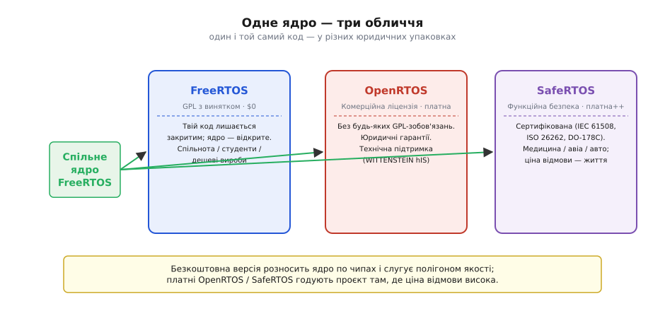
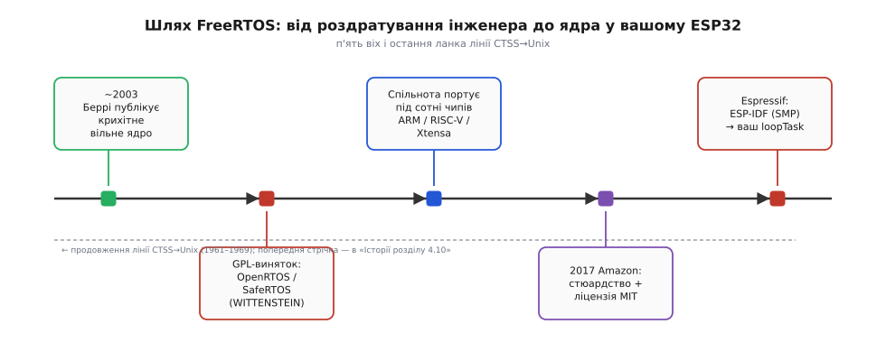

# 📜 FreeRTOS: Річард Беррі та операційна система, яку він роздав безкоштовно

> Це історична вставка до теми [4.10.5 «RTOS і FreeRTOS на ESP32»](./execution-rtos.md). Пряме продовження [«Історії розділу 4.10: Поділ часу»](./hist-time-sharing.md) — тільки тепер не про ідею поділу часу як таку, а про конкретне ядро, що цю ідею втілило у вашому чипі. У темі 4.10.5 ми весь час казали «FreeRTOS уже працює у вашому ESP32» і назвали ім'я — Річард Беррі — майже мимохідь. Але одне питання лишилося без відповіді: **чому серйозний інженер написав операційну систему й роздав її безкоштовно — і як вийшло, що саме вона тепер у мільярдах пристроїв і у вашому чипі?** Ця оповідь веде ниткою: людина → особисте роздратування → хитра бізнес-модель «вільне ядро, платні гарантії» → розповзання по чипах → стюардство Amazon → і чому Espressif обрала саме її для ESP32.

---

## Маленьке ядро з великого роздратування

На початку 2000-х життя вбудованого інженера ділилося між двома рівно неприємними виборами. Перший: взяти комерційну операційну систему реального часу. Тоді все було просто — ядро готове, перевірене, підтримується. Але ціна кусалася. VxWorks, ThreadX, pSOS — серйозні промислові RTOS коштували тисячі доларів за ліцензію, до того ж часто бралося роялті з кожного проданого пристрою. Для стартапу, студентського проєкту чи невеликого контрактного виробника це було непомірно дорого; а для тих, хто випускав тисячні тиражі дрібних і дешевих виробів, роялті робило всю ідею RTOS економічно безглуздою.

Другий вибір: написати свій власний планувальник. Технічно можливо, але «клопітно й легко наробити помилок» — ті самі слова, якими тема §4.10.5 описує цей шлях. Перемикання контексту, стеки задач, тік-таймер, пріоритети — усе це треба реалізовувати заново для кожного нового чипа. Без фундаментального знання апаратури процесора результат легко виявлявся крихким і погано відлагодженим. Більшість команд, спробувавши, або купували дорогу комерційну ОС, або назавжди полишали ідею багатозадачності й лишалися з super-loop.

**Річард Беррі (*Richard Barry*)**, британський вбудований інженер, бачив цю прірву щодня. Він писав прошивки під 8- і 16-бітні мікроконтролери і точно знав, скільки разів різні команди в різних місцях «винаходили велосипед» перемикання задач заново. Десь приблизно 2002–2003 року він зробив крок: Беррі написав **невеличке, ретельно спроектоване ядро RTOS** — і виклав його у вільний доступ. Назва вийшла прямолінійна: «Free» + «RTOS». «Вільна операційна система реального часу» — підкреслено безкоштовна й відкрита.

Ядро свідомо зроблено крихітним. Базові функції займали лічені кілобайти ROM і мінімум RAM — рівно те, що могли дозволити собі дешеві 8-бітні МК (саме про цей масштаб ми говорили в §4.10.5). Весь код написано на переносному C; тонкий «шар порту» (*port layer*) — мінімальна кількість рядків, специфічних для архітектури, — дозволяв перенести ядро на нову платформу в лічені дні. Це було не academic-proof-of-concept, а інженерна робота, розрахована на промислове використання.

> 🔧 **Навіщо це.** Безкоштовність зробила рівно один, але революційний крок: **поріг входу впав до нуля**. Студент чи хобіст міг узяти промисловий за якістю планувальник задарма, без реєстрацій і карток. Саме тому, коли ви ввімкнули IDE й завантажили ESP-IDF, FreeRTOS просто вже там — вам не треба було нічого купувати чи підписувати. Безкоштовність на старті і є причиною того, що ця ОС стала настільки всюдисущою, що виробники чипів самі почали вбудовувати її в свої SDK.

Але «безкоштовно» одразу породжує очевидне питання: а як же автор їсть?

---

## Як заробляти на тому, що роздаєш: ліцензія з винятком

Більшість відкритих проєктів того часу жили під ліцензією GPL (*GNU General Public License*). GPL зручна для спільноти, але для комерційних виробників містить незручну властивість: якщо ваш код **прилінкований** до бібліотеки під GPL, то весь ваш код теж підпадає під GPL і мусить бути відкритим. Для компанії, що вкладала в прошивку роки розробки й тримала її як комерційну таємницю, це рівнозначно смерті продукту. Більшість корпоративних юридичних відділів одразу вписувала «GPL-linked code» у список заборонених залежностей.

Беррі обрав розумніший підхід: **GPL з виключенням (*GPL with exception*)**, також відому як modified GPL. Ядро FreeRTOS лишається відкритим; але **ваш власний код**, який викликає функції FreeRTOS, **не зобов'язаний бути відкритим**. Відкривати треба лише власні зміни в самому ядрі, якщо ви їх зробили. Це зняло головний страх: виробник міг закрити свою прошивку й водночас вільно користуватися FreeRTOS у комерційному продукті. Ліцензійний замок, що блокував цілий клас користувачів, зник.

Але справжній геній схеми — **подвійне ліцензування (*dual licensing*)**. Те саме ядро доступне і як безкоштовний FreeRTOS (GPL-виняток), і як платний **OpenRTOS** — з комерційною ліцензією, без жодних відсилань до GPL, з офіційними юридичними гарантіями та технічною підтримкою. Компанія-носій комерційної гілки — **WITTENSTEIN high integrity systems**, британська фірма, що спеціалізується саме на надійному вбудованому ПЗ. Механізм простий: хто може ризикнути й скористатися безкоштовною версією — бере безкоштовно; хто потребує контракту підтримки й юридичного прикриття — платить за OpenRTOS.

Іще одна гілка — **SafeRTOS**: окрема, глибоко сертифікована версія для систем функційної безпеки. Медичні прилади, авіоніка, автомобільні блоки керування — там ціна програмної відмови може буквально бути чиїмось життям. Сертифікація за стандартами IEC 61508, ISO 26262, DO-178C коштує дорого — і SafeRTOS коштує відповідно. За кодову базу ту саму; за «упаковку» — зовсім іншу.

*Рис. 4.10.5i.1. Одне ядро — три ліцензійні «обличчя». Спільний код знизу, три юридичні упаковки вгорі: FreeRTOS ($0, GPL-виняток), OpenRTOS (комерційна ліцензія + підтримка, WITTENSTEIN) і SafeRTOS (сертифікована функційна безпека). Безкоштовна версія розносить ядро по чипах і слугує полігоном якості; платні годують проєкт там, де ціна відмови висока.*

> 🔧 **Навіщо це.** Схема «відкрите ядро + платні гарантії» — один із найстійкіших патернів у бізнесі відкритого ПЗ. Вона показує, що відкрите не означає безгосподарне: за FreeRTOS з першого дня стояла стала комерційна модель, яка давала Беррі й WITTENSTEIN стимул підтримувати й розвивати ядро. Для вас практичний висновок: коли ви спираєтеся на широко вживане відкрите ядро з такою структурою, ви спираєтеся на щось, у кого є господар і причина жити довго. Саме тому на FreeRTOS можна покластися серйозно, а не лише в аматорських проєктах.

Маючи і безкоштовність для широкої спільноти, і довіру корпорацій, ядро тепер могло розповзтися скрізь — лишалося тільки портувати його на кожен новий чип.

---

## Один порт за раз: як FreeRTOS захопив усі чипи

Ключ до успіху — **структурна переносність**. Вся логіка планувальника, черги, семафори, тайм-аути — написані на стандартному C і не залежать від заліза. Єдине, що треба написати для нового процесора, — мінімальний **шар порту (*port layer*)**: зазвичай кілька сотень рядків асемблера й C, що реалізують збереження й відновлення контексту задачі та підключення тік-таймера. Якщо ви читали §4.10.3 («перемикання контексту») і §4.10.4 («тік»), то вже розумієте, що саме треба зробити в цьому шарі — зберегти регістри й лічильник команд, налаштувати переривання від таймера. Усе, що специфічне для архітектури, стиснуто в ці кілька файлів.

Наслідок: перенести FreeRTOS на новий чип міг **будь-який досвідчений інженер**. Виробникам чипів це виявилося вигідно з очевидних причин: якщо разом зі своїм МК ви пропонуєте готовий порт FreeRTOS, ваші клієнти одразу мають перевірену багатозадачність і не мусять нічого робити самотужки — поріг входу в екосистему падає. Тож виробники самі починали фінансувати й публікувати порти. Паралельно спільнота додавала власні: ARM Cortex-M0/M3/M4/M7, Microchip PIC, Texas Instruments MSP430 і C28x, Renesas, AVR, Altera NIOS II, RISC-V і — важливо для нас — **Xtensa LX6**, архітектура ESP32 (про неї в §4.1.7). Сьогодні офіційних і підтримуваних спільнотою портів — понад тридцять архітектур, а реальна кількість задокументованих чипів іде на сотні.

Є ще один важливий наслідок цього поширення, на який тема §4.10.5 звертала увагу лише побіжно: **API FreeRTOS переноситься разом із ядром**. `xTaskCreate`, `vTaskDelay`, `xQueueSend` — ці виклики однакові на ARM Cortex-M і на Xtensa. Навичка, здобута на ESP32, виявиться корисною, коли ви наступного разу перейдете на STM32 чи nRF52. І ось тепер ви знаєте **чому**: це той самий код, тільки в іншому «шарі порту».

Масштаб поширення FreeRTOS за галузевими опитуваннями — зокрема щорічним *Embedded Markets Study* від EE Times та схожими дослідженнями — роками тримається в позиції найчастіше вживаного вбудованого ядра або ОС. Важливо бути точним: це «за опитуваннями розробників», а не абсолютна вимірювана істина; методологія опитувань різниться, і цифри варіюються. Але загальний образ стійкий: FreeRTOS є у смартфонах, медичних приладах, промислових контролерах, автомобільних ЕБУ — і в мільярдах Wi-Fi-чипів. Саме ця всюдисущість зробила його настільки привабливою ціллю для одного дуже великого гравця.

---

## 2017: Amazon бере кермо — і спільнота хвилюється

У середині 2010-х Amazon активно будувала **AWS IoT** — інфраструктуру для мільярдів пристроїв «інтернету речей», що мали постійно переговорюватися з хмарою. Архітектурний виклик на «краю» (*edge*): кожен такий пристрій має крутити мережевий стек, TLS, MQTT, буфери — і при цьому вкладатися в десятки кілобайт RAM. Amazon потрібне було **стандартне, всюдисуще ядро**, щоб поверх нього будувати свій стек зв'язку, — і щоб інженери по всьому світу вже знали це ядро і могли одразу писати код. FreeRTOS виявився ідеальним збігом: вже присутній у більшості цільових чипів, вільний, добре відомий.

У 2017 році Amazon взяла проєкт під крило. Річард Беррі перейшов до Amazon і **лишився провідним розробником** ядра — це важлива деталь. Мова не про корпоративне поглинання з подальшим занедбанням; стюардство означало, що автор продовжує роботу, просто тепер у рамках великої компанії з відповідними ресурсами.

Разом із переходом Amazon змінила ліцензію: GPL з виключенням поступилася місцем **MIT**. Це ще ліберальніша ліцензія — фактично мінімум обмежень: роби з кодом що хочеш, лише збережи рядок про авторство. Формально мета — ще знизити поріг входу для підприємств, що досі побоювалися навіть умовно-вільного GPL. Разом із ядром з'явився «Amazon FreeRTOS» (пізніше перейменований на *FreeRTOS LTS* із окремим шаром бібліотек для AWS) — пакет із ядром і бібліотеками для підключення до AWS IoT Core.

Але не всі в спільноті зустріли цю новину з радістю. Частина розробників відкрито хвилювалась: чи не перетворить «найпопулярніший RTOS» на інструмент просування власної хмарної платформи? Чи залишиться класичний FreeRTOS без прив'язки до AWS? Чи не визначатиме напрям розвитку ядра корпоративна дорожня карта замість потреб спільноти? Ці питання були реальними й законними — корпорація як господар спільнотного проєкту завжди ставить таке питання. Справедливо зазначити, що де-факто ядро лишилося вільним і живим: класичний FreeRTOS (без AWS-шару) продовжує розвиватися окремим репозиторієм на GitHub, MIT-ліцензія виключає закриття, а Беррі залишився. Але напруга між «відкрита спільнота» і «велика корпорація-стюард» нікуди не зникла — і кожен, хто працює з відкритим ПЗ, рано чи пізно зустрічає цю дилему.

> 🔧 **Навіщо це.** Для вас, практично, висновок такий: MIT-ліцензія означає, що FreeRTOS усередині ESP32 можна вільно використовувати в будь-яких проєктах — включно з комерційними — без жодних ліцензійних виплат і без зобов'язання відкривати свій код. Саме тому Espressif могла вшити FreeRTOS в ESP-IDF без юридичного клопоту, і саме тому ви не платите нічого, коли ваш `loop()` стає задачею — хоч продаєте пристрій тисячами.

*Рис. 4.10.5i.2. П'ять віх FreeRTOS: публікація ~2003 → подвійна модель OpenRTOS/SafeRTOS (WITTENSTEIN) → хвиля портів спільноти → стюардство Amazon + MIT (2017) → ESP-IDF Espressif на двох ядрах і ваш `loopTask`. Тонка пунктирна лінія внизу — нагадування, що ця стрічка є продовженням лінії CTSS→Unix з «Історії розділу 4.10».*

---

## Чому саме FreeRTOS опинився у вашому ESP32

Espressif, розробляючи ESP-IDF — офіційний framework для ESP32, — не писала власну ОС з нуля. Логіка була та сама, що й у Беррі двадцять років тому: навіщо винаходити велосипед? FreeRTOS на момент розробки ESP-IDF уже пройшов перевірку на мільярдах пристроїв, мав живу спільноту, чистий код, мінімальний обсяг і — після переходу до Amazon — ліцензію MIT, що знімала будь-які юридичні ускладнення. Жоден внутрішній проєкт з нуля не дав би такого рівня перевірки в такі ж терміни.

Конкретні переваги для Espressif можна перерахувати по пальцях. По-перше, **розмір**: базова конфігурація FreeRTOS займає менше 10 кілобайт ROM і кілька кілобайт RAM — а ESP32, при всьому своєму Wi-Fi і Bluetooth, має обмежену внутрішню оперативну пам'ять, де кожен кілобайт на рахунку. По-друге, **знайомість**: у 2016–2017 роках FreeRTOS уже добре знали вбудовані інженери по всьому світу. Вибираючи Espressif — чи то через ESP-IDF, чи через Arduino-ESP32 — розробники з досвідом FreeRTOS приходили з готовими знаннями. Це означало меншу криву навчання й ширшу екосистему прикладів. По-третє, **переносність знань** — саме та властивість, про яку тема §4.10.5 говорила окремо: API на ESP32 і API на STM32/nRF52 однакові, бо під капотом те саме ядро. Один раз освоїти FreeRTOS — і ви готові до більшості мікроконтролерних платформ.

Espressif **адаптувала** ядро під специфіку ESP32, а не просто скопіювала. ESP32 має **два ядра Xtensa LX6** (про них у §4.10.5 і §4.1.7), а «ванільний» FreeRTOS писався під одне ядро. Команда Espressif розширила планувальник для **SMP (*Symmetric Multi-Processing*)**: задачі можуть закріплюватися за конкретним ядром або вільно балансуватися між обома. Це не окрема ОС — це FreeRTOS із SMP-розширенням поверх Xtensa-порту. Тому офіційна документація ESP-IDF і каже «not a vanilla FreeRTOS». Але API лишається стандартним: `xTaskCreate`, `vTaskDelay`, черги, м'ютекси — усе те, що ви вивчали в §4.10.3–4.10.5, там під капотом.

Наслідок для вас прямий: коли Arduino-ESP32 запускається, він створює задачу `loopTask`, яка й виконує ваш `loop()`. Про це тема §4.10.5 сказала прямо. Але тепер ви знаєте повну картину: цю задачу обслуговує те саме ядро, яке Беррі виклав у вільний доступ ~2003 року, яке спільнота портувала на Xtensa, яке Amazon перевела під MIT, яке Espressif розширила під два ядра. Ви успадкували понад двадцять років роботи, навіть не знаючи імені автора — доки не прочитали це. Коло, що починалося з роздратування одного британського інженера, замкнулося прямо у вашому чипі на столі.

---

## Що з цього забрати

Оповідь описала дугу від одного роздратованого інженера до ядра у вашому чипі. Беррі побачив прірву між «дорогі комерційні RTOS» і «писати самому з нуля» — і заповнив її. Але ліцензійний виняток від GPL і партнерство з WITTENSTEIN дали моделі «дихати»: безкоштовне розносило ядро по чипах, платне OpenRTOS і SafeRTOS забезпечували розробку. Спільнота та виробники чипів портували ядро під сотні архітектур. Amazon у 2017-му взяла стюардство й відкрила ліцензію до MIT.

Важливо сказати це чітко: **це не подвиг одинака**. FreeRTOS не став тим, чим він є, завдяки лише Беррі. Без бізнес-моделі WITTENSTEIN у ядра не було б стабільного фінансування. Без сотень портувальників зі спільноти й виробників воно б лишилося нішевим інструментом для кількох архітектур. Без стюардства Amazon не набуло б MIT-ліцензії й не стало б стандартом IoT. Колективна, тривала праця — ось що перетворило «маленьке ядро» на всюдисущу основу. Саме так і живуть найуспішніші відкриті проєкти.

Практичний підсумок для вас: наступного разу, коли напишете `xTaskCreate` чи `vTaskDelay` (§4.10.3–4.10.5), знатимете, що спираєтеся на двадцятирічну, перевірену мільярдами пристроїв роботу — і саме тому на неї можна покластися серйозно, а не як на «якийсь безкоштовний інструмент». Поверніться тепер до теми [4.10.5 «RTOS і FreeRTOS на ESP32»](./execution-rtos.md) і подивіться на `loopTask`, черги й пріоритети вже іншими очима.
