# Розділ 4.15 — Відмовостійка прошивка: помилки, паніка, відновлення

До цього моменту ми навчили прошивку робити багато: читати GPIO (§4.4), реагувати на переривання за мікросекунди (§4.5), рахувати час і кусати сторожовим таймером (§4.6), зберігати дані у Flash так, щоб вони пережили знеструмлення (§4.3), крутити паралельні задачі в RTOS (§4.10), а коли щось іде не так — зазирати всередину живого МК налагоджувачем (§4.14). Усе це — про те, як зробити, щоб **працювало**. Цей розділ — про протилежне й доросліше запитання: що буде, коли щось піде **не так**, і як зробити, щоб пристрій це пережив. Бо в полі немає інженера й налагоджувача — є лише прошивка наодинці зі збоєм.

Різниця між аматорським і промисловим пристроєм — не в тому, що промисловий не має багів. Баги є в усіх. Різниця в тому, що промисловий поводиться **передбачувано**, коли баг таки стається. На столі все завжди працює, бо умови ідеальні: стабільне USB-живлення, кімнатна температура, давачі підключені правильно, жоден байт не зіпсований. У полі живлення просідає від сплеску Wi-Fi, давач відвалюється через пил або корозію, пам'ять псується від космічного чи радіаційного удару, а чужий код повертає сміття замість значення. Ці умови не виняток — це норма для кожного пристрою, що прожив довше місяця.

Ми пройдемо розділ як сходи реакції на біду — від «помітити помилку» (§4.15.1), через «правильно на неї зреагувати рівнем» (§4.15.2–4.15.3), «перейти в безпечний стан» (§4.15.4), «перезапуститися начисто» (§4.15.5), «не впасти в цикл смерті» (§4.15.6), «пережити погане живлення» (§4.15.7) і «працювати частково, коли все погано» (§4.15.8). Лейтмотив, що пронизує кожну сходинку: відмовостійкість — не героїзм і не магія, а **дисципліна дрібних правильних рішень**, кожне з яких можна прийняти ще на етапі написання коду.

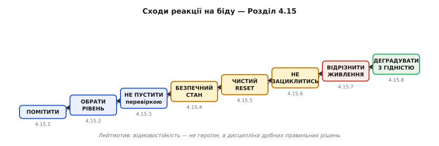

*Рис. 4.15.0.1. Карта розділу: сходи реакції на біду від «помітити» до «деградувати з гідністю».*

> 📜 **Перед матеріалом — історія:**
> [Ariane 5, рейс 501 (1996): необроблене переповнення, що за 37 секунд знищило ракету](hist-ariane5.md) — канонічний приклад того, що означає проковтнута помилка в реальному польоті, де повернення немає.

Важливо розмежувати цей розділ і §4.14. Там ішлося про те, як **ВИ** (інженер) розбираєте збій інструментами — JTAG, GDB, core dump, аналіз регістрів HardFault. Тут — про те, як **пристрій сам** дає собі раду без вас, у полі, без підключеного кабелю.

---

## 4.15.1 Жодна помилка не мовчить

Найдешевший і найпідступніший баг — той, де помилка СТАЛАСЯ, але код її проковтнув і поїхав далі на зіпсованих даних. Пристрій вмирає не від того, що впав гучно, — а від того, що тихо продовжив жити неправильно. Тиша гірша за гучне падіння, бо приховує відстань між причиною й симптомом.

**Анатомія проковтнутої помилки.** Функція повертає `esp_err_t` — або `NULL` для вказівника, або `-1` як ознаку збою. Виклик її не перевіряє. Далі код бере результат «як є» і продовжує роботу на зіпсованих даних. Проблема виринає не там, де помилка сталася, — а за «кілометр»: в іншій функції, через годину, в зовсім іншому місці коду. Між причиною і симптомом утворюється розрив у часі й просторі — і це головна шкода від «тихого збою». Кожна наступна функція, що довірилась зіпсованому результату, лише поглиблює яму.

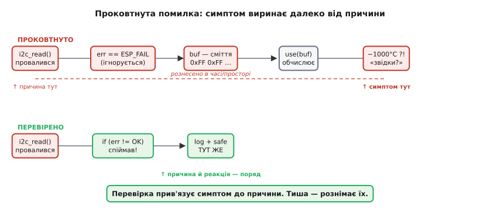

*Рис. 4.15.1.1. Проковтнута помилка: причина і симптом рознесені. Перевірка прив'язує їх разом — тиша розриває.*

**Дві філософії.** «Помилка має бути ГУЧНОЮ» — це принцип fail-fast: впасти якомога ближче до причини, не дати зіпсованому стану поширитися. Альтернатива — «тихо проігнорувати й поїхати далі» — здається м'якшою, але на МК особливо дорога. Немає людини, немає типового логу «за замовчуванням», а симптом виявиться в полі через тижні. Інженер відкрие тікет «пристрій раз на тиждень показує −1000°C», витратить день на налагодження і виявить, що причина — провалений I2C-read п'ятисот рядків вище. Один рядок `if (err != ESP_OK)` вартий тижня налагодження.

**Як помилка може заявити про себе — п'ять щаблів.** Від найтихішого до найгучнішого: (1) **код повернення або статус** — функція повертає `esp_err_t`, `NULL`, `-1`, а викликач вирішує, що робити; (2) **виняткове значення у стилі errno** — глобальна змінна, яку можна перевірити потім; (3) **запис у лог** — подія фіксується для майбутнього аналізу; (4) **assert** — перевірка припущення, при хибі зупинка з ім'ям файлу й рядком; (5) **паніка й reset** — далі працювати небезпечно, єдиний вихід — перезапуск. Деталі кожного рівня — у §4.15.2. Тут важливо розуміти сам спектр: від локальної «розберися сам» до глобальної «зупини все».

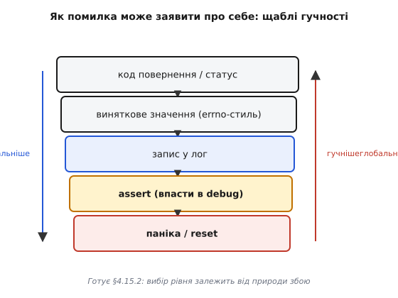

*Рис. 4.15.1.2. Щаблі гучності: п'ять рівнів сигналізації від тихого до глобального. Вибір рівня залежить від природи збою.*

**«Помилка, якої не може бути» — теж помилка.** `default` у `switch`, «недосяжна» гілка `else`, «цього індексу не буває» — саме там ховаються найгірші баги. Якщо ваш enum має п'ять значень і `switch` покриває всі п'ять, шостого не існує — але що станеться, якщо через рік хтось додасть шосте і забуде оновити `switch`? Правило просте: **неможливе теж обробити** — бодай залогувати й зупинитися. Один рядок `default: ESP_LOGE(TAG, "unexpected state %d", state); abort();` рятує від годин полювання за «неможливим» багом.

**Worked-приклад.** Уявіть ESP32, що кожну хвилину зчитує температуру з давача по I2C і логує її. Без перевірки — і з нею:

**Варіант 1 — проковтнута помилка:**
```c
// ПОГАНО: помилку проковтнуто
void read_and_log_temp(void) {
    uint8_t buf[2];
    // i2c_master_read повертає esp_err_t, але ми її ігноруємо
    i2c_master_read_from_device(I2C_NUM_0, SENSOR_ADDR,
                                buf, sizeof(buf), pdMS_TO_TICKS(50));
    // якщо зчитування провалилось — buf містить останній сміттєвий вміст
    // (або нулі після ініціалізації — але нуль теж брехня)
    int16_t raw = (buf[0] << 8) | buf[1];
    float temp_c = raw * 0.0625f;           // для LM75: 0.0625 °C/bit
    ESP_LOGI(TAG, "Temp: %.2f C", temp_c);  // може вивести -1000 °C
}
```
При збої I2C (обрив, зайнятість шини, тайм-аут) `buf` не оновлюється або заповнюється 0xFF. `raw = 0xFFFF` → `(int16_t)0xFFFF = -1` → `temp_c = -0.0625` — або ще гірше, коли попереднє значення буфера «0x8000» дає −2048 °C. Симптом «давач показує −1000°C раз на годину» інженер не зможе відтворити за столом, бо там I2C ніколи не падає.

**Варіант 2 — перевірений код:**
```c
// ДОБРЕ: помилка перевіряється й обробляється
void read_and_log_temp(void) {
    uint8_t buf[2];
    esp_err_t err = i2c_master_read_from_device(
        I2C_NUM_0, SENSOR_ADDR, buf, sizeof(buf), pdMS_TO_TICKS(50));

    if (err != ESP_OK) {
        ESP_LOGW(TAG, "I2C read failed: %s — skipping sample", esp_err_to_name(err));
        // не використовуємо buf — він ненадійний
        return;   // або: update_sensor_state(SENSOR_ERROR);
    }

    int16_t raw = (buf[0] << 8) | buf[1];
    float temp_c = raw * 0.0625f;
    ESP_LOGI(TAG, "Temp: %.2f C", temp_c);
}
```
Тепер провалений read лишає слід у логу точно там, де він стався. Пристрій не «падає», але й не бреше. Інженер, що бачитиме `[WARN] I2C read failed: ESP_ERR_TIMEOUT` раз на годину, одразу знає: проблема — шина, не температура.

> 🔧 **Навіщо це.** У полі проковтнута помилка = «загадкове перезавантаження раз на тиждень» або «давач зрідка показує нісенітницю» — і інженер гадає годинами, де саме зламалось. Одна перевірка return-коду перетворює загадку на конкретний запис у логу з файлом, рядком і назвою помилки. Це різниця між «хворим місцем, що мовчить» і «симптомом, що говорить».

Саме це й сталось з Ariane 5 (повна картина в [r15-history-ariane5.md](hist-ariane5.md)) у 1996: необроблене переповнення передало діагностичний код туди, де чекали дані польоту. Ракета відхилилась і самознищилась через 37 секунд. Збій стався в «резервній» системі, яку ніхто вже не підтримував.

Помітити — лише перший крок. Далі треба обрати **рівень** відповіді: не кожна біда варта скидання всього пристрою, і не кожну можна пробачити.

---

## 4.15.2 Код повернення, assert і паніка

Помітивши помилку, треба вибрати **силу відповіді** — від «поверни код і дай викликачу вирішити» до «зупини все негайно». Вибрати неправильно дорого в обидва боки: занадто гучно — пристрій падає від дрібниці; занадто тихо — їдемо далі з зіпсованим станом у прірву.

**Три рівні як вісь теми.** (1) **Код повернення / статус** — «це очікувана, відновна ситуація, хай вирішує викликач»: давач не відповів, файл не знайдено, буфер повний, мережа недоступна. Зовнішній світ ненадійний — це норма, не баг. (2) **Assert** — «це порушення припущення програміста; такого не має бути НІКОЛИ»: NULL-вказівник, де вказівник гарантовано не NULL, індекс за межами масиву, стан автомату в забороненому значенні. У розробці assert впадає гучно й одразу. (3) **Паніка / reset** — «стан невідновний, далі працювати небезпечно, рятуємося перезапуском»: пошкоджена критична структура в RAM, виявлене псування стеку, ситуація, коли будь-яка дія може зробити гірше.

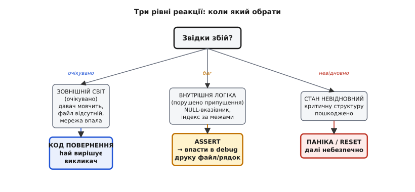

*Рис. 4.15.2.1. Дерево рішення: звідки збій — очікувано, порушення припущення чи невідновно.*

**Критерій вибору.** Ключове запитання: чи ситуація **очікувана** в нормальній роботі? Давач може не відповісти — це нормально (погані контакти, зайнята шина, тайм-аут). Хибний NULL-вказівник у таблиці обробників — це вже баг ініціалізації, якого «не має бути». А пошкоджена контрольна сума критичної структури в RAM — стан, коли продовжувати небезпечно. Зовнішній світ ненадійний → код повернення. Внутрішня логіка зламалась → assert або паніка.

**`assert` зсередини й чесно.** Макрос `assert(expr)` розгортається приблизно в:
```c
if (!(expr)) {
    fprintf(stderr, "Assertion failed: %s, file %s, line %d\n",
            #expr, __FILE__, __LINE__);
    abort();
}
```
У режимі релізу, де визначено `NDEBUG`, препроцесор вирізає весь рядок цілком — і тут криється **головна пастка**:

```c
// НЕБЕЗПЕЧНО: init() зникне разом із assert у релізі
assert(init_peripheral() == ESP_OK);   // NDEBUG → рядок вирізано → init не викликано!

// БЕЗПЕЧНО: перевірка і робота розділені
esp_err_t err = init_peripheral();
assert(err == ESP_OK);                 // лише перевірка — ok вирізати в релізі
```

Якщо `init_peripheral()` має побічний ефект (а ініціалізація периферії завжди має), то в релізі пристрій стартує без ініціалізації і падає «загадково». Правило незмінне: в `assert` — лише **чиста перевірка**, ніякої роботи.

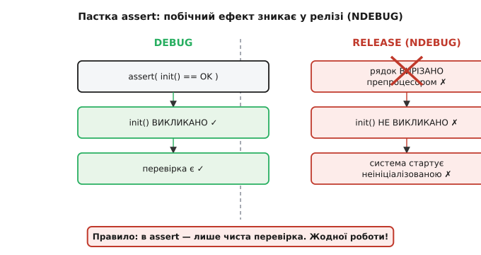

*Рис. 4.15.2.2. Пастка assert (NDEBUG): init() вирізається разом із перевіркою. Система стартує неініціалізованою.*

**Що таке «паніка» на ESP32 конкретно.** При критичному збої (HardFault, stack overflow, явний виклик `abort()` чи `esp_system_abort()`) ESP-IDF запускає panic handler: виводить зворотне трасування стека у консоль, причину збою і — залежно від налаштування menuconfig — або робить reset, або зависає в нескінченному циклі (для підключення JTAG), або записує core dump у Flash (§4.14.7). На відміну від «великих» ОС, де падіння одного процесу не б'є інші, на МК без MMU падіння будь-якого коду = падіння всього. Тому паніка на ESP32 майже завжди веде до reset — і це правильно (§4.15.5).

**Assert у продуктивному коді.** Вимкнути assert через `NDEBUG` — здається розумним (швидше, менше коду), але баги тихнуть. Лишити увімкненими — ловить, але reset у полі непередбачений. Зрілий компроміс: **критичні інваріанти залишати увімкненими навіть у релізі** (краще керований reset із відомою причиною, ніж невизначена робота на зіпсованому стані), а «дорогі» перевірки (обхід усього масиву для перевірки цілісності) — тільки під `#ifdef DEBUG`.

**Worked-приклад.** Одна функція обробки команди — три помилки трьох різних рівнів:

```c
#include "esp_log.h"
#include <assert.h>
static const char *TAG = "cmd_handler";

// Таблиця обробників — заповнюється при ініціалізації (не NULL!)
typedef void (*cmd_fn_t)(const uint8_t *payload, size_t len);
static cmd_fn_t s_handlers[CMD_COUNT];

// Критична структура зі своєю контрольною сумою
typedef struct {
    uint32_t magic;
    uint32_t value;
    uint32_t crc;
} critical_state_t;
extern critical_state_t g_state;  // у RAM

esp_err_t handle_command(uint8_t cmd_id, const uint8_t *payload, size_t len) {
    // Рівень 1: ОЧІКУВАНА ситуація — невідома команда від користувача
    if (cmd_id >= CMD_COUNT) {
        ESP_LOGW(TAG, "unknown cmd 0x%02x", cmd_id);
        return ESP_ERR_NOT_SUPPORTED;   // код повернення — викликач вирішить
    }

    // Рівень 2: ПОРУШЕННЯ ПРИПУЩЕННЯ — обробник мусить бути заповнений
    // (баг ініціалізації, якщо NULL)
    assert(s_handlers[cmd_id] != NULL);

    // Рівень 3: НЕВІДНОВНИЙ СТАН — структура в RAM зіпсована
    uint32_t expected_crc = crc32_calc(&g_state, offsetof(critical_state_t, crc));
    if (g_state.crc != expected_crc || g_state.magic != STATE_MAGIC) {
        ESP_LOGE(TAG, "state corrupt! crc=0x%08lx exp=0x%08lx", g_state.crc, expected_crc);
        esp_system_abort("state corrupt");   // паніка → reset
    }

    s_handlers[cmd_id](payload, len);
    return ESP_OK;
}
```

Той самий «збій» різного походження дістає різну відповідь. Невідома команда — цілком нормально, хай викликач поверне користувачу помилку. NULL-обробник — баг, якого не має бути; assert одразу вкаже на рядок у відладчику. Зіпсована структура — критичний стан, де продовжувати небезпечно; паніка з відомою причиною й перезапуск.

> 🔧 **Навіщо це.** Плутати рівні дорого в обидва боки: assert на те, що буває в нормі (давач відвалився) → пристрій падає від звичайної дрібниці, клієнт незадоволений. Код повернення там, де стан уже зіпсовано → їдемо далі в прірву і падаємо де-небудь непередбачувано. Правильний рівень = пристрій і стійкий, і чесний.

> ⚙️ Апаратний родич паніки — HardFault ядра, що зберігає зворотне трасування стека і регістри у момент збою. Про те, що саме ядро кладе в стек при HardFault і як це читати: §4.14.6. Core dump у Flash для подальшого аналізу: §4.14.7.

Assert і паніка — це реакція **в момент** збою. Але є кращий спосіб: не допустити збою взагалі, перевіривши припущення **до того**, як на них покладемось.

---

## 4.15.3 Перевірки на льоту

Дешевше не лікувати збій, а не пустити його: перевіряти припущення ДО того, як на них покладемось. Але є межа, за якою параноя сама стає багом і гальмом — і пройти цю межу правильно так само важливо, як і не ігнорувати помилки.

**Передумови і постумови.** Кожна функція має неявний **контракт**: що вона вимагає на вході (вказівник не NULL, довжина в межах, режим валідний) і що гарантує на виході. Перевіряти варто на межах модуля або публічного API — не в кожному рядку. Якщо внутрішня функція `_parse_header` завжди викликається лише після того, як `parse_packet` перевірила `buf != NULL`, то `_parse_header` не зобов'язана перевіряти ще раз. Дублювання перевірок створює шум і сповільнює читання, не підвищуючи надійності.

**Інваріанти.** Інваріант — це властивість, що **мусить триматися завжди**: індекс кільцевого буфера завжди менший за його розмір; сума «зайнятого» і «вільного» завжди дорівнює ємності; кінцевий автомат завжди в одному з дозволених станів. Перевірка інваріанта — рання сигналізація псування пам'яті або логіки. Якщо перевірка інваріанта раптом спрацювала там, де нібито «нічого не змінилось» — значить, щось змінилось, просто не там, де ви думали.

**Захисне програмування без параної — головна вісь теми.** Де перевіряти **варто**: межа з зовнішнім світом (UART, мережа, давач, NVS, ввід); межа між модулями (публічний API); будь-які дані, що прийшли ззовні. Де **не варто** перевіряти: всередині гарячого циклу (де кожна перевірка — такти реального часу); те, що щойно перевірив виклик вище; кожен арифметичний крок без підстав. Критерій: перевіряй **недовірене джерело** й **дорогу помилку**; не дублюй перевірку, за яку вже відповів хтось вище.

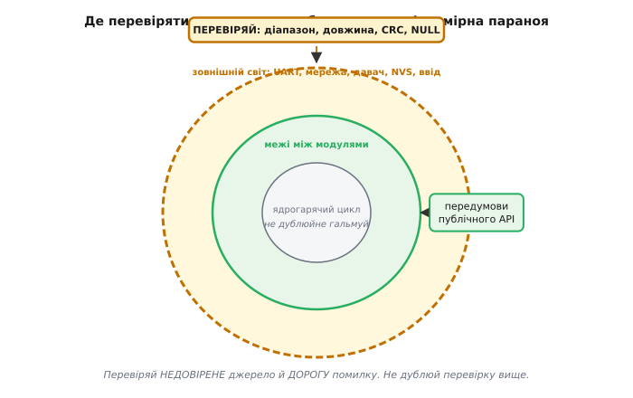

*Рис. 4.15.3.1. Периметрова оборона: перевірки на кордонах із недовіреним, а не рівномірно скрізь.*

**Перевірка зовнішніх даних — окремий клас.** Усе, що прийшло ззовні — кадр з UART, значення з NVS, відповідь давача, ввід користувача — апріорі ненадійне. Не тому, що хтось шкодить навмисно (хоч і це буває), а тому, що фізичний світ ненадійний: шум, обрив, погане з'єднання, стертий сектор Flash. Перевіряти варто: діапазон числових значень, довжину рядка або масиву, «магічне число» на початку структури (magic number), контрольну суму (CRC). Ці перевірки — перша лінія захисту від псування даних у Flash (§4.3.7) і від стертого значення NVS (§4.3.5), де `nvs_get_u32` після стирання може повернути 0xFFFFFFFF як «значення».

**Ціна перевірок.** Такти й місце коштують — особливо у hard real-time ISR (§4.5.7), де бюджет буквально в мікросекундах. Компроміс: «важкі» перевірки (обхід всього масиву для CRC) — під `#ifdef DEBUG`; «дешеві» (порівняти два числа, перевірити на NULL) — завжди. Важливо також: підписане переповнення, ділення на нуль, індекс за межами масиву — це не «помилки повернення», де можна «перевірити після». Це невизначена поведінка C (undefined behavior), яка дає компілятору право робити з вашим кодом що завгодно. Перевіряти — до операції, а не після. Ariane 5 (§r15-history-ariane5.md) загинув саме від переповнення при приведенні `float64` → `int16`, що ніхто не перевіряв.

**Worked-приклад.** Функція `parse_packet` отримує сирий буфер з UART. Показуємо ланцюг перевірок і що кожна ловить:

```c
#define FRAME_MAGIC  0xA55A
#define FRAME_HEADER_SIZE  6   // magic(2) + len(2) + type(1) + flags(1)
#define FRAME_MAX_PAYLOAD  128

typedef struct {
    uint16_t magic;
    uint16_t payload_len;
    uint8_t  type;
    uint8_t  flags;
    uint8_t  payload[FRAME_MAX_PAYLOAD];
    uint16_t crc;
} __attribute__((packed)) frame_t;

esp_err_t parse_packet(const uint8_t *buf, size_t len, frame_t *out) {
    // Перевірка 1: NULL-вказівник → крах вказівника без перевірки
    if (buf == NULL || out == NULL) {
        ESP_LOGE(TAG, "null ptr: buf=%p out=%p", buf, out);
        return ESP_ERR_INVALID_ARG;
    }

    // Перевірка 2: довжина щонайменше header → читання за межами без перевірки
    if (len < FRAME_HEADER_SIZE) {
        ESP_LOGW(TAG, "frame too short: %zu < %d", len, FRAME_HEADER_SIZE);
        return ESP_ERR_INVALID_SIZE;
    }

    uint16_t magic = (buf[0] << 8) | buf[1];
    uint16_t payload_len = (buf[2] << 8) | buf[3];

    // Перевірка 3: магічне число → чужий або зашумований кадр
    if (magic != FRAME_MAGIC) {
        ESP_LOGW(TAG, "bad magic: 0x%04x", magic);
        return ESP_ERR_INVALID_RESPONSE;
    }

    // Перевірка 4: поле довжини в межах буфера → читання за buf[len..] без перевірки
    if (payload_len > FRAME_MAX_PAYLOAD ||
        len < FRAME_HEADER_SIZE + payload_len + 2 /* crc */) {
        ESP_LOGW(TAG, "len field out of bounds: %u", payload_len);
        return ESP_ERR_INVALID_SIZE;
    }

    // Перевірка 5: CRC → биті дані
    uint16_t recv_crc = (buf[FRAME_HEADER_SIZE + payload_len] << 8) |
                         buf[FRAME_HEADER_SIZE + payload_len + 1];
    uint16_t calc_crc = crc16(buf, FRAME_HEADER_SIZE + payload_len);
    if (recv_crc != calc_crc) {
        ESP_LOGW(TAG, "CRC mismatch: recv=0x%04x calc=0x%04x", recv_crc, calc_crc);
        return ESP_ERR_INVALID_CRC;
    }

    // Лише тепер читаємо корисне навантаження
    out->magic       = magic;
    out->payload_len = payload_len;
    out->type        = buf[4];
    out->flags       = buf[5];
    memcpy(out->payload, buf + FRAME_HEADER_SIZE, payload_len);
    out->crc         = recv_crc;
    return ESP_OK;
}
```

Без перевірок будь-який `payload_len = 200` (більший за `FRAME_MAX_PAYLOAD`) дав би `memcpy` за межі масиву — класичне переповнення буфера. Підроблений `len = 1` при відсутності перевірки `len < FRAME_HEADER_SIZE` дав би читання за межами масиву вже на рядку `buf[2]`.


*Рис. 4.15.3.2. Кожна перевірка ловить свій клас загрози: NULL, переповнення буфера, чужий кадр, биті дані.*

> 🔧 **Навіщо це.** Більшість «нездоланних» багів у полі — невалідні дані, яким повірили: давач у кризі дав 0xFFFF, NVS повернув стертий 0xFF як «значення», UART зловив шум і склав із нього «кадр». Три перевірки діапазону на вході рятують від годин полювання за привидом.

> 🧮 Окремий клас «перевірки, що не потрібна»: беззнаковий лічильник ніколи не від'ємний — тут UB не загрожує і перевірка `if (u < 0)` зайва. Але підписане переповнення та ділення на нуль — це вже UB. Детальний розбір арифметики беззнакових і небезпечних переповнень у §4.6.2 (модульна арифметика таймерів).

Перевірки ловлять біду на вході. Але що **робити**, коли перевірка спрацювала й далі працювати небезпечно?

---

## 4.15.4 Безпечний стан і safe mode

Коли збій уже стався й довіряти системі не можна, найважливіше — **не зробити гірше**. У фізичного пристрою «зависнути на повній потужності» небезпечніше, ніж вимкнутись. Нагрівач, що продовжує гріти без нагляду, — це не збій прошивки, що впала, — це пожежа.

**Безпечний стан фізичного пристрою.** Запитання «який вихід кожного актуатора найменш шкідливий при невідомому збої?» не має універсальної відповіді. Мотор — стоп (PWM duty = 0). Нагрівач — вимкнути (реле розімкнуто). Клапан нормально-закритий — закрити. Але клапан нормально-відкритий — навпаки, відкрити (бо відсутність сигналу = відкрито). Гальмо пружинного типу — притиснути (de-energize = загальмовано). Ключове: **безпечний стан визначає інженер під конкретну систему**, а не береться з довідника.

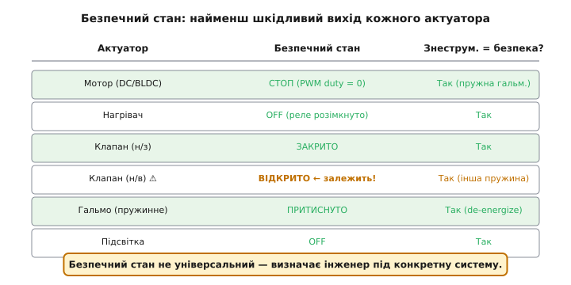

*Рис. 4.15.4.1. Матриця безпечних станів актуаторів. «Знеструмлено = безпечно» — правило, але не без винятків.*

**Fail-safe by de-energizing.** Багато актуаторів проєктуються так, щоб **відсутність сигналу** = безпека: пружина повертає клапан у закрите положення, гальмо стискається без струму, реле розмикається без напруги на котушці. Тоді навіть мертва прошивка або обрив живлення автоматично призводять до безпечного стану — «задарма», без жодного рядка коду. Контрприклад: шасі літака, де «знеструмлено» = «прибрано» (що катастрофічно при посадці без команди) — тут знеструмлення навпаки небезпечне, і потрібне резервне живлення.

**GPIO у момент reset — практична пастка.** Від початку reset до завершення ініціалізації GPIO ніжки перебувають у невизначеному/Hi-Z стані. Якщо до них підключений драйвер мотора або реле — вони можуть «смикнутись» ненадовго. Прошивка в цей момент мовчить — вона ще не дійшла до `gpio_set_direction()`. Тому безпечний стан виходів має забезпечуватися **апаратно**: зовнішня підтяжка (pull-up/pull-down) на вхід Enable драйвера тримає його в «вимкнено» ще до старту прошивки (§4.4.4). Це не паранойя — це фундаментальна вимога для будь-якої системи з силовою периферією.


*Рис. 4.15.4.2. «Вікно небезпеки» reset: GPIO Hi-Z від початку reset до ініціалізації. Апаратна підтяжка тримає «OFF» весь цей час.*

**Safe mode як режим зниженої функціональності.** Іноді пристрій сам розуміє, що нормально працювати не може: зіпсований конфіг у Flash, відмова критичного давача, цикл збоїв (§4.15.6). Замість нескінченних перезавантажень він може стартувати у **safe mode** — урізаному режимі, де лишається лише найнеобхідніше: зв'язок для діагностики й оновлення, базова індикація стану, безпечні виходи. Основна функція вимкнена. Це аналог «безпечного режиму» Windows або macOS — система підіймається мінімально, щоб дати можливість полагодити проблему.

**Перехід у безпечний стан — завжди ПЕРШИЙ крок.** При будь-якому тяжкому збої правильний порядок: спочатку зробити виходи безпечними → потім записати лог → потім ухвалювати рішення (reset, safe mode, деградація). Якщо зробити навпаки — логувати перед тим, як відключити нагрівач — між виявленням збою і відключенням виникає затримка. Для теплового нагрівача кілька секунд непомітні, для силового ключа у стані короткого замикання — ні.

**Worked-приклад.** Функція входу в безпечний стан — перша, що викликається при будь-якій критичній помилці:

```c
#include "driver/ledc.h"
#include "driver/gpio.h"
#include "esp_log.h"
static const char *TAG = "safe_state";

// GPIO призначення (приклад)
#define GPIO_HEATER_RELAY    GPIO_NUM_5   // active HIGH
#define GPIO_VALVE_CLOSE     GPIO_NUM_18  // active HIGH: закрити клапан
#define GPIO_FAULT_LED       GPIO_NUM_19  // active HIGH: індикатор аварії

// LEDC-канал для мотора (налаштований при ініціалізації)
#define MOTOR_LEDC_CHANNEL   LEDC_CHANNEL_0
#define MOTOR_LEDC_TIMER     LEDC_TIMER_0

void enter_safe_state(void) {
    ESP_LOGE(TAG, "ENTERING SAFE STATE");

    // 1. Зупинити мотор (LEDC duty → 0, потім зупинити таймер)
    ledc_set_duty(LEDC_HIGH_SPEED_MODE, MOTOR_LEDC_CHANNEL, 0);
    ledc_update_duty(LEDC_HIGH_SPEED_MODE, MOTOR_LEDC_CHANNEL);
    ledc_stop(LEDC_HIGH_SPEED_MODE, MOTOR_LEDC_CHANNEL, 0);  // idle_level = 0

    // 2. Вимкнути нагрівач (реле — LOW = розімкнуто)
    gpio_set_level(GPIO_HEATER_RELAY, 0);

    // 3. Закрити клапан (HIGH = закрити для н/з клапана)
    gpio_set_level(GPIO_VALVE_CLOSE, 1);

    // 4. Увімкнути індикатор аварії
    gpio_set_level(GPIO_FAULT_LED, 1);

    // 5. Тут може залишатися зв'язок для діагностики/OTA
    // (Wi-Fi/BLE стек не зупиняємо — він потрібен для допомоги)

    ESP_LOGI(TAG, "safe state: motor stopped, heater off, valve closed, fault LED on");
}
```

Виклик цієї функції має бути першим рядком будь-якого обробника критичної помилки — до будь-якого запису в лог, до будь-якого reset.

> 🔧 **Навіщо це.** «Впав і завис із увімкненим нагрівачем» — це не теорія, а спалені прилади й, у гіршому випадку, пожежі. Правильно спроєктований безпечний стан означає, що найгірший наслідок збою прошивки — пристрій **перестав** діяти, а не почав діяти **небезпечно**. Це і є різниця між «іграшкою» і промисловим пристроєм.

> 🔌 Апаратна сторона безпечного стану: плаваючий пін і підтяжки §4.4.4; push-pull виходи §4.4.1. Supervisor-IC для контролю напруги живлення: §4.1.8 (вставка про brownout-детектор).

Безпечний стан — це пауза. Часто найкращий спосіб **одужати** зі зіпсованого стану — перезапуститися начисто.

---

## 4.15.5 Перезавантаження як стратегія

Контрінтуїтивна, але перевірена промислова істина: навмисний reset часто **кращий** за спробу «полагодити» зіпсований стан на льоту. Чистий старт відомий і передбачуваний. Латання невідомого стану — ні.

**Чому reset лікує.** Після перезапуску стан **повністю визначений**: RAM очищена, периферія в стані reset, змінні ініціалізовані з нуля або з відомих початкових значень. Зіпсований стан, навпаки, невідомий і непередбачуваний — ніхто не знає, скільки в ньому прихованих «мін». «Вимкни-увімкни» працює, бо **викидає накопичене пошкодження**. Зв'язок із reset-послідовністю §4.2.6: саме там описано, що відбувається від натискання RESET до першого рядка `app_main`.

**Коли reset доречний.** Невідновна помилка (виявлено псування критичної структури). Deadlock або зависання — ловить watchdog (§4.6.7). Вичерпання ресурсу: фрагментація купи після тривалої роботи, витік файлових дескрипторів. Невідновна помилка периферії, що не «очищається» деініціалізацією.

**Коли reset НЕ доречний.** Очікувана відновна ситуація: давач не відповів — спробуй ще раз через 100 мс, не перезавантажуй весь пристрій через одне невдале читання. Тимчасовий збій мережі — wait & retry, а не esp_restart(). Логіка «спробуй, потім вирішуй» підвищує стійкість без непотрібних перезапусків.

**Watchdog як автоматичний reset зависання.** Сторожовий таймер (§4.6.7) — автоматичний тригер reset при зависанні: прошивка «годує» сторожа в нормі, перестала — сторож робить reset. Тут важливо: **правильне «годування»** — це не `esp_task_wdt_reset()` у кожному циклі наосліп, а контрольні точки (checkpoints) реальних завдань задачі. Якщо задача зависла в одній гілці й ніколи не дійшла до чекпоінту — watchdog спрацює. Якщо «годування» сліпе — watchdog стане безкорисним. Деталі й патерни: ⚙️ §4.6.7 (`ch24-s7-a-watchdog-patterns.md`).

**ВАЖЛИВО: зберегти стан ЧЕРЕЗ reset.** Reset чистить усю SRAM. Тому все, що треба пам'ятати після перезапуску — причину збою, лічильник рестартів, прапорець safe mode — треба записати **до** reset: у RTC-пам'ять (§4.13.9, що переживає reset і навіть deep-sleep) або в NVS Flash (§4.3.5, що переживає знеструмлення). Якщо цього не зробити — reset зітре сам доказ того, ЧОМУ він стався. Налагодження перетвориться в детектив без свідків.

**Грамотний reset, а не панічний.** Правильний порядок — той самий, що вже показаний у §4.15.4: спочатку безпечний стан, потім flush критичних даних, потім reset. Якщо скинути пристрій посеред активного запису в NVS (§4.3.7) — є шанс зіпсувати саме той файл, де зберігається причина збою. Програмний reset на ESP32 — `esp_restart()`.

**Worked-приклад.** Обробник критичної помилки з правильним порядком і лічильником у RTC-пам'яті:

```c
#include "esp_system.h"
#include "nvs_flash.h"
#include "esp_log.h"
static const char *TAG = "fault_handler";

// RTC_NOINIT_ATTR: змінна у RTC slow memory, переживає reset та deep-sleep
// Але НЕ переживає повне знеструмлення!
RTC_NOINIT_ATTR static uint32_t s_boot_fail_cnt;
RTC_NOINIT_ATTR static uint32_t s_last_fault_code;

// Ініціалізація при першому увімкненні (power-on)
void fault_counter_init(void) {
    esp_reset_reason_t reason = esp_reset_reason();
    if (reason == ESP_RST_POWERON || reason == ESP_RST_BROWNOUT) {
        // Справжнє знеструмлення або brownout → скинути лічильник
        // (RTC-пам'ять могла зіпсуватись)
        s_boot_fail_cnt  = 0;
        s_last_fault_code = 0;
    }
    // При watchdog/panic — НЕ скидаємо: лічильник вже інкрементований
    // перед reset-ом (або буде прочитаний далі)
}

// Викликається при будь-якій критичній помилці
void fault_handler(uint32_t fault_code) {
    // Крок 1: безпечний стан — ПЕРЕДУСІМ
    enter_safe_state();

    // Крок 2: зберегти причину і збільшити лічильник (до reset!)
    s_last_fault_code = fault_code;
    s_boot_fail_cnt++;

    // Крок 3: залогувати
    ESP_LOGE(TAG, "FAULT 0x%08lx — reboot #%lu", fault_code, s_boot_fail_cnt);

    // Крок 4: flush NVS (якщо були відкладені записи)
    nvs_flash_deinit();   // комітить незакриті транзакції

    // Невелика пауза — дати UART вивести лог
    vTaskDelay(pdMS_TO_TICKS(200));

    // Крок 5: перезавантаження
    esp_restart();
}
```

Покроковий аналіз: `s_boot_fail_cnt` у `RTC_NOINIT_ATTR` пережив reset, тому після перезапуску ми точно знаємо, котрий це раз. `enter_safe_state()` перший — між виявленням збою та reset мотор не крутиться. `nvs_flash_deinit()` гарантує, що незакриті записи не залишають NVS у непослідовному стані.

> 🔧 **Навіщо це.** «Спробувати акуратно відновити пошкоджений стан» — спокуса, що породжує найзаплутаніші баги: латка накладається на непередбачуваний стан і дає непередбачуваний результат. Промислові системи натомість тримаються правила «сумніваєшся — перезавантажся чисто», бо передбачуваний рестарт надійніший за героїчне латання.

Reset лікує **разовий** збій. Але якщо причина стала — зіпсований конфіг, апаратна вада — пристрій входить у «boot loop», нескінченний цикл перезавантажень. Reset — ліки, але передозування вбиває.

---

## 4.15.6 Лічильник перезавантажень

Reset як ліки має дозу. Пристрій, що перезавантажується раз на місяць — здоровий; той, що кожні три секунди — у «циклі смерті». Відрізнити їх можна лише **рахуючи**.

**Ідея лічильника.** Персистентний лічильник (RTC-пам'ять §4.13.9 або NVS §4.3.5), що інкрементується при кожному ненормальному старті й обнуляється після N секунд **стабільної** роботи. Малий лічильник — норма; перевищив поріг за короткий час — система зрозуміла, що зациклилась.

**Причина reset як ключ — місток до §4.1.8.** Не кожен reset однаково «підозрілий». `esp_reset_reason()` повертає:
- `ESP_RST_POWERON` — нормальне увімкнення, людина підключила живлення;
- `ESP_RST_SW` — програмний reset (наш `esp_restart()`), очікуваний;
- `ESP_RST_TASK_WDT` / `ESP_RST_INT_WDT` — watchdog, підозріло;
- `ESP_RST_PANIC` — паніка, підозріло;
- `ESP_RST_BROWNOUT` — просіло живлення, окремий клас (§4.15.7);
- `ESP_RST_DEEPSLEEP` — вихід з deep-sleep, очікуваний (§4.13.9).

Реагувати треба на **патологічні** причини — watchdog і panic. Power-on, deep-sleep wake, програмний reset — не рахувати.

**Стратегія ескалації за лічильником.** Один рядок в описі не передає правильного порядку мислення — тут саме місце для наскрізної структури. Лічильник збоїв — це не просто «скільки разів впали», а **підказка, що пробувати далі**:

1. **1–2 збої** → просто перезавантажся (разовий збій, без зміни поведінки);
2. **Досяг порогу** (наприклад, 5 за хвилину) → **не повторюй те саме**: переходь у **safe mode** (§4.15.4);
3. **Safe mode не виправив** → **відкоти конфіг** до дефолтного або попереднього (атомарний конфіг §4.3.7);
4. **Конфіг не допоміг** → **відкоти прошивку** на попередній OTA-слот (§4.3.8);
5. **Все не допомогло** → **застрягни в safe mode** і кличь на допомогу (яскравий індикатор + доступний канал зв'язку).


*Рис. 4.15.6.1. Драбина ескалації: що пробувати далі, коли просте не допомогло.*

**Де лічильник мусить жити.** RTC-пам'ять переживає reset і навіть brownout-reset, але **не** повне знеструмлення. NVS переживає знеструмлення, але зношує Flash кожним записом (§4.3.3). Компроміс: **лічильник у RTC** (швидко, без зносу), **порогові події** (вирішення про відкат конфігу, про safe mode) — **у NVS** (потрібна персистентність через знеструмлення). При старті після power-on RTC-лічильник скидається явно.

**Обнулення лічильника — критична деталь.** Коли вважати, що «вижили»? Не після першого успішного запуску — після **T секунд безперервної нормальної роботи**. Наприклад, 60 секунд без аварій → обнулити. Без цього пристрій із рідкими (але реальними) збоями накопичить лічильник і хибно піде в safe mode. Таймер запускати в кінці `app_main`, після ініціалізації всіх підсистем, і скидати лічильник лише при його спрацюванні.


*Рис. 4.15.6.2. Серія швидких рестартів → лічильник росте → поріг → safe mode. Після >60 с стабільності → скинути в 0.*

**Worked-приклад.** Логіка старту з лічильником і стратегією ескалації:

```c
#include "esp_system.h"
#include "nvs_flash.h"
#include "freertos/FreeRTOS.h"
#include "freertos/timers.h"

#define FAULT_THRESHOLD       5       // збоїв за "вікно"
#define STABILITY_TIMEOUT_MS  60000   // 60 с стабільності → скинути лічильник

RTC_NOINIT_ATTR static uint32_t s_boot_fail_cnt;
static TimerHandle_t s_stability_timer;

static void stability_timer_cb(TimerHandle_t xTimer) {
    // 60 с без аварій — вважаємо пристрій здоровим
    ESP_LOGI(TAG, "stable for 60s — resetting fault counter");
    s_boot_fail_cnt = 0;
}

void startup_check(void) {
    esp_reset_reason_t reason = esp_reset_reason();

    // Патологічні причини — рахувати
    bool pathological = (reason == ESP_RST_TASK_WDT ||
                         reason == ESP_RST_INT_WDT  ||
                         reason == ESP_RST_PANIC);

    if (reason == ESP_RST_POWERON) {
        // Повне знеструмлення: скинути RTC-лічильник
        s_boot_fail_cnt = 0;
    }

    if (pathological) {
        s_boot_fail_cnt++;
        ESP_LOGW(TAG, "pathological reset reason %d, fault_cnt=%lu",
                 reason, s_boot_fail_cnt);
    }

    // Стратегія ескалації
    if (s_boot_fail_cnt >= FAULT_THRESHOLD) {
        ESP_LOGE(TAG, "fault loop detected! cnt=%lu — entering safe mode / rollback",
                 s_boot_fail_cnt);

        // Спробувати відкотити конфіг (§4.3.7: читати backup-слот)
        if (!config_rollback_if_available()) {
            // Конфіг не допоміг → відкотити прошивку (§4.3.8)
            esp_ota_mark_app_invalid_rollback_and_reboot();
            // Якщо й це не допоможе — safe mode назавжди
        }
        enter_safe_mode();   // запустити мінімальну конфігурацію
        return;
    }

    // Нормальний старт — завести таймер стабільності
    s_stability_timer = xTimerCreate("stability", pdMS_TO_TICKS(STABILITY_TIMEOUT_MS),
                                     pdFALSE, NULL, stability_timer_cb);
    xTimerStart(s_stability_timer, 0);

    // ... далі нормальна ініціалізація
}
```

> 🔧 **Навіщо це.** Без лічильника пристрій із поганим конфігом перезавантажується вічно й виглядає «мертвим» — залізо ціле, але до нього не дістатись. З лічильником він **сам** розуміє «я зациклився», відкочується до робочого стану й оживає. Це різниця між цеглиною й самовідновним пристроєм.

> ⚙️ Атомарне оновлення конфігу (два слоти + версія + CRC, база безпечного відкоту): §4.3.7 (`r03-s7-a-atomic-config.md`). OTA-слоти і механіка відкату прошивки: §4.3.8.

Лічильник ловить цикл смерті. Але є одна підступна причина рестартів, що **маскується під баг прошивки** — нестабільне живлення.

---

## 4.15.7 Brown-out і нестабільне живлення

Найпідступніший «баг прошивки», якого немає у прошивці — просіле живлення. Пристрій «глючить, зависає, перезавантажується», а код бездоганний. Інженер тижнями шукає баг у software, якого там немає.

**Що таке brown-out фізично.** Коли напруга живлення просідає нижче порога коректної роботи, але **не до нуля** — чіп потрапляє у «сіру зону»: логіка ще намагається щось робити, але результати напівправильні. RAM видає неправильні дані при читанні. Flash-контролер може перервати запис посередині. Program Counter стрибає на хибну адресу. Це не «вимкнено» (де все чисто зупиняється) — це **недокормлено**, і саме цей стан найгірший з усіх можливих.

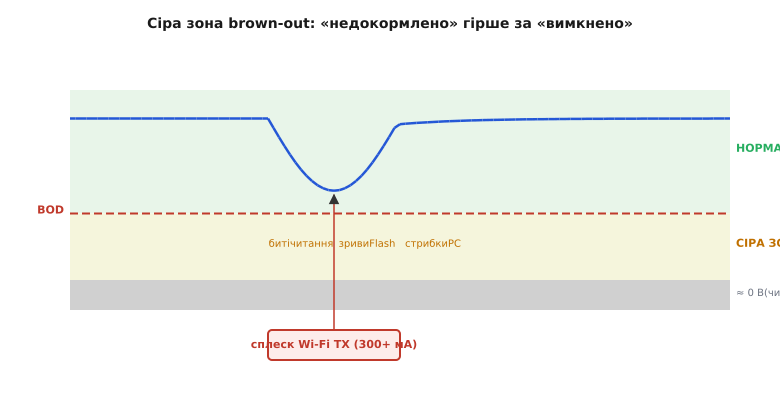

*Рис. 4.15.7.1. Три зони: норма, сіра зона (недетермінований збій), чисте вимкнення. «Недокормлено» — найгірше.*

**Чому маскується під баг прошивки — головна думка.** Симптоми brown-out — зависання, перезавантаження, псування даних — ідентичні симптомам поганого коду. Різниця лише в **причині**. Як відрізнити: причина reset = `ESP_RST_BROWNOUT` (перевірити `esp_reset_reason()`); збій **корелює з навантаженням** (запустився Wi-Fi, увімкнувся мотор — і одразу reset); зникає від кращого блоку живлення, товщого кабелю або конденсатора поруч із чіпом. Якщо баг відтворюється на стенді при стабільному живленні — це код. Якщо лише «в полі» і корелює з навантаженням — живлення.

**Типові джерела просідання на ESP32.** Піковий струм радіо при Wi-Fi/BLE передачі — 300–400 мА короткими імпульсами. Слабкий USB-порт або дешевий кабель (наші розрахунки дають до 1 В падіння на 100 мОм × 300 мА). Тонкі проводи живлення при великій довжині. Спільне живлення з мотором або соленоїдом, що дають зворотний сплеск. Розряджений Li-Ion під навантаженням. Усі ці джерела детально розглянуті в Розділі 7.4 (бюджет живлення) — тут важливо розуміти лише **причинний зв'язок**.

**Апаратна оборона.** Локальний конденсатор-резервуар 10–100 мкФ поруч із чіпом гасить короткий імпульс без просідання на лінії. Адекватний LDO або DC-DC перетворювач із запасом по струму (мінімум вдвічі більше максимального споживання). Товщі доріжки або проводи живлення. Окреме живлення силових вузлів із власним конденсатором. Детальний розрахунок — §7.4; тут тільки «чому це лікує»: конденсатор миттєво дає локальний заряд під час імпульсу, поки джерело живлення «не встигло» відреагувати.

**Brown-out детектор / supervisor як внутрішня оборона.** ESP32 має вбудований brown-out detector (BOD): якщо VDD просідає нижче налаштованого порогу, чіп **сам тримає себе в reset**, щоб не виконувати код на ненадійному живленні. Краще керований reset (з відомою причиною у `esp_reset_reason()`) ніж випадкове псування даних. Поріг налаштовується — більш консервативне налаштування захищає краще, але підвищує чутливість до тимчасових просідань. Детальна анатомія детектора: 🔌 §4.1.8 (`ch20-s8-c-brownout.md`). Це апаратний аналог §4.15.4: не роби гірше на ненадійному живленні.

**Реакція прошивки.** Brown-out — не баг логіки, тому в reset-лічильнику (§4.15.6) його треба **відокремити**: рахувати в окремому лічильнику brownout, бо ліки різні. При panic-loop — відкочуємо конфіг або прошивку. При brownout-loop — знижуємо споживання (вимикаємо радіо, знижуємо такт), попереджаємо користувача «перевір живлення», але **не** відкочуємо прошивку (вона ні при чому).

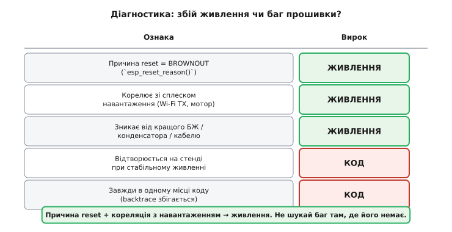

*Рис. 4.15.7.2. Діагностична таблиця: п'ять ознак, що вказують на живлення або на код.*

**Worked-приклад.** На старті розрізняємо brownout від panic і реагуємо по-різному:

```c
RTC_NOINIT_ATTR static uint32_t s_brownout_cnt;   // окремий лічильник
RTC_NOINIT_ATTR static uint32_t s_panic_cnt;

void startup_analyze_reset(void) {
    esp_reset_reason_t reason = esp_reset_reason();

    switch (reason) {
    case ESP_RST_POWERON:
        // Справжній старт — скинути обидва лічильники
        s_brownout_cnt = 0;
        s_panic_cnt    = 0;
        break;

    case ESP_RST_BROWNOUT:
        s_brownout_cnt++;
        ESP_LOGW(TAG, "brownout reset #%lu — check power supply!", s_brownout_cnt);

        // При серії brownout — тимчасово знизити споживання
        if (s_brownout_cnt >= 3) {
            ESP_LOGW(TAG, "repeated brownout — disabling WiFi TX to reduce current");
            // esp_wifi_stop() або зниження TX power
            wifi_tx_power_reduce();   // власна функція
        }
        // Записати в NVS для звіту
        nvs_set_u32(nvs_h, "brownout_cnt", s_brownout_cnt);
        nvs_commit(nvs_h);
        break;

    case ESP_RST_TASK_WDT:
    case ESP_RST_INT_WDT:
    case ESP_RST_PANIC:
        s_panic_cnt++;
        ESP_LOGE(TAG, "watchdog/panic reset #%lu", s_panic_cnt);
        // Ескалація — логіка з §4.15.6
        if (s_panic_cnt >= FAULT_THRESHOLD) {
            config_rollback_if_available();
        }
        break;

    default:
        break;
    }
}
```

Окремий лічильник `s_brownout_cnt` дозволяє зробити правильний висновок: три brownout поспіль — знизити Wi-Fi TX power і попередити користувача; три panic — відкочувати прошивку. Якщо б обидва рахувалися разом, реакція могла б бути неправильною.

> 🔧 **Навіщо це.** Найдорожче налагодження — те, де баг шукають не там. Уміння з причини reset і кореляції з навантаженням сказати «це живлення, не код» економить тижні марного полювання в software і одразу вказує на конденсатор, блок живлення або кабель.

> 🔌 Апаратна анатомія brownout-детектора, налаштування порогу BOD, supervisor-IC: §4.1.8 (`ch20-s8-c-brownout.md`).

Іноді не можна ні полагодити, ні безпечно стати, ні перезапуститися в повну силу. Тоді лишається найскладніше — **працювати частково, з гідністю**.

---

## 4.15.8 Деградація з гідністю

Вершина відмовостійкості — не «все або нічого», а здатність втратити одну підсистему і **продовжити робити решту**. Зрілий пристрій при частковій відмові слабшає, а не вмирає.

**Поняття graceful degradation.** Контраст із «крихким» дизайном: у крихкому пристрої відмова будь-якого компонента валить усе — один несправний давач = повна зупинка системи. У стійкому — пристрій втрачає одну здатність і **чесно продовжує** решту роботи. Приклад-інтуїція: відвалився давач температури у клімат-пристрої. Чи треба глушити весь пристрій? Можливо, ні: перейди на запасний давач або останнє відоме значення, продовжуй підтримувати базову температуру, але **познач**, що система деградувала — і не приховуй це від користувача.

**П'ять стратегій деградації.** (1) **Запасне джерело** — другий давач або резервний канал зв'язку. (2) **Last-known-good** — останнє відоме правильне значення, збережене в NVS (§4.3.5) або FRAM (§4.3.3). (3) **Розумний дефолт** — безпечне передбачуване число замість збожеволілого (наприклад, 20°C замість −1000°C). (4) **Вимкнути лише уражену функцію**, лишивши решту. (5) **Знизити якість або частоту** — рідше міряти, грубіше керувати — замість повної відмови.

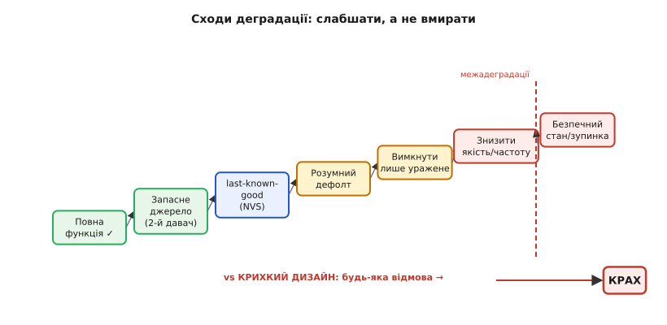

*Рис. 4.15.8.1. Спектр відповіді від повної функції до безпечного стану/зупинки. Крихкий дизайн — одна стрілка в крах.*

**Ізоляція відмов — передумова деградації.** Щоб відмова однієї підсистеми не тягла інші, вони мають бути **розв'язані**. У RTOS (§4.10) це означає: кожна задача у своєму стеку та зі своєю структурою стану; якщо одна задача «впала» або захоплена watchdog-ом, інші продовжують жити. Аргумент за модульність — не лише архітектурна естетика, а конкретна вимога стійкості.

**«Позначити деградацію» — критичне правило.** Деградований режим **мусить бути видимим**: індикатор аварії, запис у лог, статус у телеметрії чи MQTT-топіку. Якщо пристрій перейшов на запасний давач мовчки і показує «нормальні» значення, не сигналізуючи — він **тихо бреше**. Користувач вважає систему здоровою, а насправді вона вже частково відмовила. Це повернення до §4.15.1: тихий збій — найгірше, що може статися. Деградація **чесна**: я знаю, що неповний, і кажу про це.

**Межа деградації.** Не будь-яка підсистема може деградувати. Якщо відмовила підсистема, без якої робота **небезпечна** — давач полум'я в котлі, давач положення в маніпуляторі, — деградація неприпустима. Це випадок для безпечного стану/зупинки (§4.15.4), а не для «продовжуй із дефолтом». Інженер визначає список «деградовне / критичне» при проєктуванні, а не при першій аварії в полі.

**Проєктування під деградацію — думати FMEA.** Для кожної підсистеми запитати: «Що буде, якщо ЦЕ відмовить?» Скласти список: деградовне (з резервом / дефолтом) або критичне (безпечний стан / зупинка). Дефолти й резерви закладати **заздалегідь** — бо якщо давач відмовить у полі і в коді немає жодного fallback-шляху, нашвидкуруч написане «рішення» буде неперевірене й небезпечне.

**Worked-приклад.** Функція читання температури з повним ланцюгом fallback і чесним прапорцем деградації:

```c
#include "nvs_flash.h"
#include "esp_log.h"
static const char *TAG = "temp_reader";

// Статус деградації — видимий іншим підсистемам
typedef enum {
    SENSOR_OK         = 0,
    SENSOR_DEGRADED   = 1,   // резерв або last-known-good
    SENSOR_FAILED     = 2,   // повна відмова, консервативний режим
} sensor_status_t;

static sensor_status_t s_temp_status = SENSOR_OK;

// Зовнішні API давачів
esp_err_t primary_sensor_read(float *out_c);    // основний (I2C)
esp_err_t backup_sensor_read(float *out_c);     // запасний (ADC)

float read_temperature_degc(void) {
    float temp;

    // Спроба 1: основний давач
    if (primary_sensor_read(&temp) == ESP_OK) {
        if (s_temp_status != SENSOR_OK) {
            ESP_LOGI(TAG, "primary sensor restored");
        }
        s_temp_status = SENSOR_OK;
        // Оновити last-known-good (але не кожного разу — зношує Flash)
        static uint32_t s_lkg_update_tick = 0;
        if (xTaskGetTickCount() - s_lkg_update_tick > pdMS_TO_TICKS(60000)) {
            nvs_set_i32(nvs_h, "temp_lkg", (int32_t)(temp * 100));
            nvs_commit(nvs_h);
            s_lkg_update_tick = xTaskGetTickCount();
        }
        return temp;
    }

    ESP_LOGW(TAG, "primary sensor failed — trying backup");

    // Спроба 2: запасний давач
    if (backup_sensor_read(&temp) == ESP_OK) {
        s_temp_status = SENSOR_DEGRADED;
        ESP_LOGW(TAG, "DEGRADED: using backup sensor, temp=%.1f C", temp);
        // Позначити деградацію (індикатор, телеметрія)
        gpio_set_level(GPIO_FAULT_LED, 1);
        mqtt_publish("status/sensor", "degraded:backup");
        return temp;
    }

    ESP_LOGE(TAG, "BOTH sensors failed — using last-known-good");

    // Спроба 3: last-known-good із NVS
    int32_t lkg_raw = 2000;   // дефолт 20.0 °C якщо NVS ще не писали
    nvs_get_i32(nvs_h, "temp_lkg", &lkg_raw);

    s_temp_status = SENSOR_FAILED;
    // Перейти в консервативний режим — нагрівач лише до 50% потужності
    heating_set_max_power(50);
    gpio_set_level(GPIO_FAULT_LED, 1);
    mqtt_publish("status/sensor", "failed:last-known-good");

    // ЗАБОРОНЕНО: повернути дефолт мовчки — це тихий збій §4.15.1
    return lkg_raw / 100.0f;   // ЗАВЖДИ з прапорцем, ніколи мовчки
}

sensor_status_t get_temperature_status(void) {
    return s_temp_status;
}
```

Зверніть увагу на три критичні деталі: (1) `s_temp_status` — публічний стан, доступний будь-якій підсистемі; (2) last-known-good записується раз на 60 секунд, а не щосекунди (щоб не зношувати Flash); (3) `mqtt_publish` і `gpio_set_level` для індикатора — деградація **завжди видима**, ніколи мовчазна.

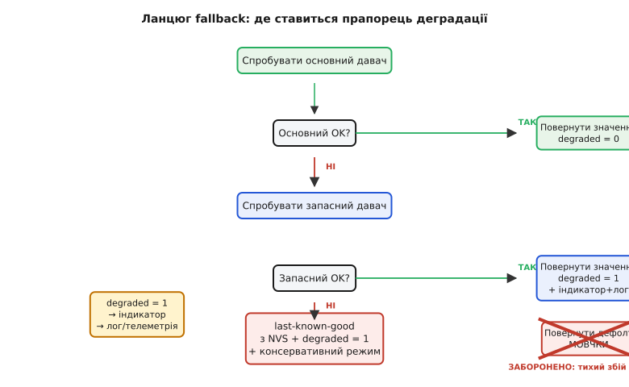

*Рис. 4.15.8.2. Блок-схема ланцюга fallback. Мовчазний дефолт — заборонена гілка (тихий збій §4.15.1).*

> 🔧 **Навіщо це.** Різниця між іграшкою і надійним приладом: іграшка від першої відмови «вмирає» вся, надійний прилад втрачає одну здатність і чесно працює рештою — поки його не полагодять. Саме деградація з гідністю робить пристрій таким, якому **довіряють у полі**: він не збрехує й не зупиниться несподівано від дрібниці.

> ⚙️ Ізоляція задач і що буває, коли одна задача «падає»: §4.10.3–§4.10.8 (RTOS-задачі). Last-known-good через NVS: §4.3.5. FRAM як надійне сховище без зносу: §4.3.3.

---

Ми пройшли весь ланцюг — від «помітити помилку» (§4.15.1) до «деградувати з гідністю» (§4.15.8). Кожна сходинка — самостійна, але всі вони складаються в єдину архітектуру реакції на біду. Помітити, де стався збій, а не де він виявився. Обрати силу відповіді, що відповідає природі збою — не занадто тихо, не занадто гучно. Не довіряти тому, що прийшло ззовні. Зробити виходи безпечними передусім. Перезавантажитись начисто, якщо стан невідомий. Рахувати перезавантаження, щоб не застрягти в петлі. Відрізнити живлення від коду. І нарешті — слабшати поступово, а не вмирати повністю.

Лейтмотив залишається незмінним: **відмовостійкість — не героїзм, а дисципліна дрібних правильних рішень**. Кожне з них — одна перевірка return-коду, один assert на інваріант, один безпечний дефолт для актуатора, один рядок у лічильнику RTC-пам'яті. Жодне з них не дивовижне й не складне саме по собі. Але разом вони роблять різницю між столовим прототипом, що «працює в ідеальних умовах», і промисловим пристроєм, що **виживає в реальних**. Ariane 5 загинула за 37 секунд саме тому, що одне рішення — перевірити переповнення при приведенні типів — не було прийняте. Одна перевірка. Один рядок коду.

> ▶️ Далі — Модуль 5: Давачі, сигнали й керування. Ми навчили прошивку виживати — тепер навчимо її правильно **чути** фізичний світ, від якого залежить її робота.
