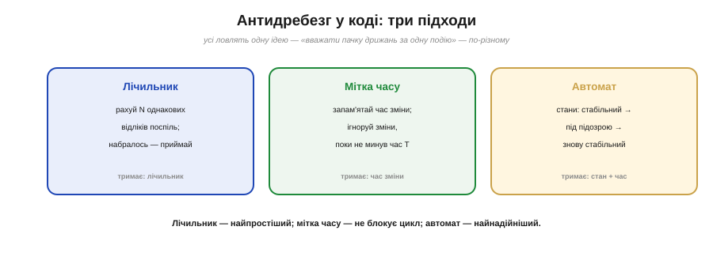
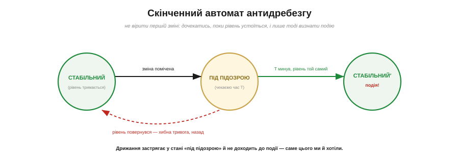

# ⚙️ Антидребезг у коді: лічильник, мітка часу, автомат станів

> Алгоритмічна вставка до **теми [§4.4.5 «Дребезг контактів»](gpio.md)**. Там ми розібрали, чому контакт дзвенить; тут — три ідіоматичні способи прибрати дрижання **в коді**, від найпростішого до найнадійнішого.

## Задача

Кнопка при натиску дає не один чистий перехід, а пачку швидких перемикань на ~1–10 мс (§4.4.5). Сире читання ніжки порахує цю пачку за кілька натисків. Треба, не чіпаючи заліза, **звести пачку до однієї події** — і бажано так, щоб не **блокувати** решту програми на час очікування.

## Ідея

Усі три способи ловлять одну думку — «**не вір миттєвому рівню, дочекайся, поки він устоїться**», — але міряють «устоявся» по-різному (Рис. 4.4.5a.1): один **рахує** однакові відліки, другий **дивиться на годинник**, третій веде **явний автомат станів**.


*Рис. 4.4.5a.1. Три способи зробити те саме. Лічильник тримає число однакових відліків; мітка часу — час останньої зміни (не блокуючи цикл); автомат — явний стан плюс час. Простіше — лічильник; чуйніше — мітка часу; надійніше — автомат.*

## Спосіб 1: лічильник однакових відліків

Найпростіший. Раз у раз (скажімо, кожну 1 мс) читаємо ніжку. Рівень той самий, що минулого разу, — **збільшуємо лічильник**; змінився — **скидаємо**. Коли лічильник набрав N (напр. 5), вважаємо рівень стабільним і приймаємо.

```
кожен тік (1 мс):
    s = читати(пін)
    якщо s == попередній: лічильник += 1
    інакше:               лічильник = 0
    попередній = s
    якщо лічильник == N і s != прийнятий:
        прийнятий = s          # стабільна нова подія
```

## Спосіб 2: мітка часу (не блокуючи цикл)

Краще для чуйних програм. Замість блокуючого «зачекати 20 мс» ми **запам'ятовуємо час** останньої зміни рівня й **ігноруємо** нові зміни, поки не мине вікно T. Цикл не стоїть — лише поглядає на годинник.

```
кожен прохід циклу:
    s = читати(пін)
    якщо s != останній_сирий:
        час_зміни = зараз()        # рівень смикнувся — засікли
        останній_сирий = s
    якщо зараз() - час_зміни >= T  і  s != прийнятий:
        прийнятий = s              # рівень устоявся за T → подія
```

Це класичний **неблокуючий** debounce: жодних затримок, програма крутиться далі й паралельно стежить за кнопкою.

## Спосіб 3: автомат станів

Найнадійніший і найясніший для складних випадків (Рис. 4.4.5a.2). Кнопка живе в явних станах: **СТАБІЛЬНИЙ → ПІД ПІДОЗРОЮ → СТАБІЛЬНИЙ′**. Помітивши зміну, переходимо в «під підозрою» й чекаємо T; якщо за цей час рівень **устояв** — визнаємо подію; якщо **повернувся** — то була хибна тривога, вертаємось назад.


*Рис. 4.4.5a.2. Автомат не вірить першій зміні: помітивши її, переходить у «під підозрою» й чекає T. Устояв рівень — визнає подію; повернувся — хибна тривога, назад. Дрижання застрягає в «під підозрою» й до події не доходить.*

Дрижання просто застрягає у стані «під підозрою» й ніколи не доходить до події — саме цього ми й хотіли. Автомат легко розширити (довге натискання, подвійний клац) — бо стани вже є.

## Складність і пастки на МК

- **Виявляйте фронт, не рівень.** Зазвичай потрібен **момент** переходу «відпущено→натиснуто», а не сам рівень. Тому приймайте подію лише коли новий стабільний стан **відрізняється** від попереднього — інакше «натиск» спрацьовуватиме весь час, поки кнопка втиснута.
- **Кожну кнопку — окремо.** Свій лічильник/мітка/стан на **кожну** кнопку; спільні змінні плутають сусідів.
- **Не блокуйте.** `delay(20)` на кнопці заморожує все інше (мигання, мережу). Способи 2 і 3 цього уникають; блокуючий «зачекати» прийнятний хіба в найпростішому коді.
- **Вибір вікна T.** Замале — пропустиш не всі дрижання; завелике — кнопка «тупить». ~10–20 мс зазвичай у самий раз (порахунок — в основній темі §4.4.5).
- **Лічильник прив'язаний до темпу опитування.** N відліків означає різний час за різної частоти опитування; підбирайте N під свій тік.

## Підсумок

Лічильник — для найпростішого; мітка часу — коли не можна блокувати; автомат — коли треба надійність і простір для розвитку. Усі троє роблять одне: **перетворюють пачку дрижань на одну чесну подію**.
