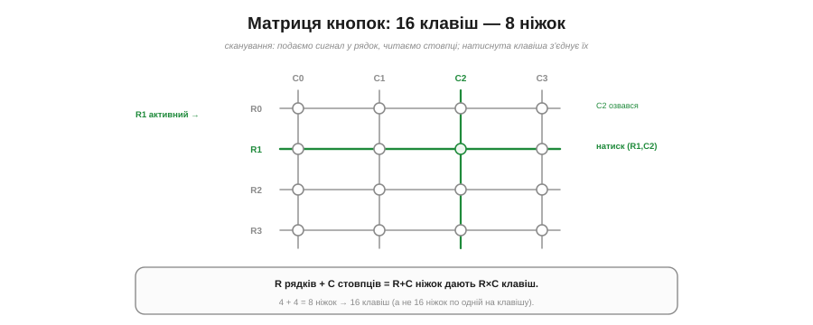
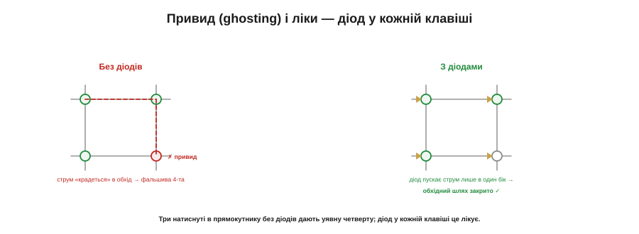

# ⚙️ Матриця кнопок 4×4: сканування рядків, привиди, діоди

> Алгоритмічна вставка до **теми [§4.4.8 «Абстрактна модель „модуля“»](gpio.md)**. Клавіатура — це багатокнопковий «модуль»; тут — як прочитати багато клавіш малою кількістю ніжок.

## Задача

Шістнадцять кнопок (клавіатура 4×4) «в лоб» — це 16 ніжок, по одній на клавішу. Розкішно й марнотратно: на дрібному МК ніжки на вагу золота. Як прочитати 16 клавіш, не витративши 16 виводів?

## Ідея

Розкладімо кнопки **сіткою** з рядків і стовпців (Рис. 4.4.8a.1). Кожна клавіша сидить на перетині одного **рядка** й одного **стовпця** і з'єднує їх, коли натиснута. Тоді R рядків і C стовпців дають **R×C** клавіш, а ніжок треба лише **R+C**. Для 4×4: 4 + 4 = **8 ніжок** замість 16.


*Рис. 4.4.8a.1. Клавіші сидять на перетинах рядків і стовпців. Скануючи, активуємо один рядок (R1) і читаємо стовпці; натиснута клавіша (R1,C2) з'єднує рядок зі своїм стовпцем, і той озивається. R+C ніжок дають R×C клавіш: 8 → 16.*

Читають матрицю **скануванням**: по черзі «активуємо» один рядок і **читаємо всі стовпці**. Якщо в активному рядку якусь клавішу натиснуто, вона **простягне** активний рядок до свого стовпця — і той стовпець озветься. Пробігли всі рядки — знаємо стан усіх 16 клавіш. Зазвичай стовпці тримають на **підтяжках** (§4.4.4), а активний рядок **притягують до землі**: натиснута клавіша тоді тягне свій стовпець у LOW.

## Псевдокод

```
scan():
    для кожного рядка r:
        активувати рядок r          # притягнути r до землі, решта — неактивні
        для кожного стовпця c:
            якщо стовпець c у LOW:   # клавіша (r,c) натиснута
                зафіксувати (r, c)
        деактивувати рядок r
```

Сканування роблять **швидко й часто** (десятки разів на секунду), щоб не пропустити натиск; кожну знайдену клавішу ще й **антидребежать** (§4.4.5), як звичайну кнопку.

## Пастка: привиди (ghosting)

Поки натиснуто одну-дві клавіші — усе чесно. Але натисніть **три** клавіші, що утворюють «кут» прямокутника, — і з'явиться **фальшива четверта**, якої ніхто не торкався (Рис. 4.4.8a.2). Це **привид** (*ghosting*): струм «прокрадається» в обхід через три замкнені клавіші й удає натиск у четвертому, порожньому перетині. Сканування чесно бачить активний стовпець — і помиляється.


*Рис. 4.4.8a.2. Без діодів три натиснуті клавіші в куті прямокутника породжують фальшиву четверту (привид): струм крадеться в обхід. Діод у кожній клавіші пропускає струм лише в один бік і закриває обхідний шлях — привиди зникають.*

Ліки — **діод** у кожній клавіші. Діод пропускає струм лише **в один бік**, тож обхідний (зворотний) шлях, яким крадеться привид, виявляється **закритим**. З діодами матриця не бреше навіть при багатьох одночасних натисках (повний *N-key rollover*) — саме тому в ігрових клавіатурах діод стоїть під кожною клавішею.

## Складність і пастки на МК

- **Без діодів — щонайбільше дві.** Надійно розрізнити можна одне-два одночасні натискання; три в куті вже дають привид. Треба багато разом — ставте діоди.
- **Антидребезг нікуди не дівся.** Кожна клавіша матриці дзвенить так само (§4.4.5); фільтруйте кожну окремо.
- **Темп сканування.** Скануйте досить часто, щоб ловити швидкі натиски, але не марнуйте на це весь час процесора.
- **Напрям ніжок.** Рядки — виходи (активують), стовпці — входи з підтяжками; не переплутайте, інакше «активний» рядок нікого не притягне.
- **Коли матриця, а коли розширювач?** Матриця економить ніжки ціною діодів і логіки сканування; **розширювач портів** (§4.4.8, вставка) — ціною чипа й шини. Багато клавіш у сітці — матриця; розкидані входи-виходи — розширювач.

## Підсумок

Матриця міняє **ніжки на сканування**: R+C виводів читають R×C клавіш, якщо по черзі активувати рядки й читати стовпці. Платять за це привидами (лікуються діодами) і потребою сканувати й антидребежити. Класичний прийом, що живе в кожній цифровій клавіатурі.
