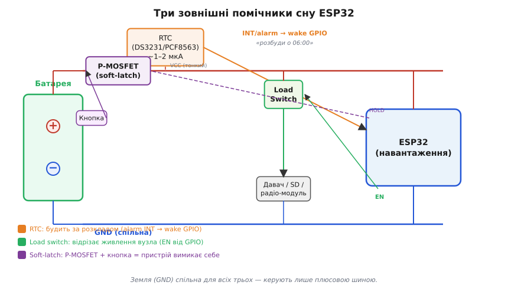
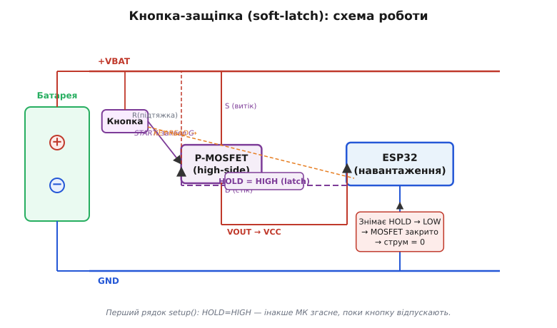

# 🔌 Залізні будильники: RTC з alarm-виходом, load switch і кнопка-защіпка живлення

> Компонентна вставка до **теми [§4.13.4 «Джерела пробудження»](low-power.md)**. У темі 4.13.4 ми перебрали внутрішні джерела пробудження ESP32 — таймер, GPIO, дотик, ULP — і побачили, що кожне коштує свої мікроампери: чип у deep-sleep усе одно тримає живими RTC-домен і лічильник. Тут — три залізні помічники ззовні чипа, що дають те, чого внутрішні не можуть: будити за розкладом майже задарма або взагалі відрізати живлення в нуль.

## Що це за деталі — спільний клас і наскрізна ідея

Найглибший сон — це коли струму нема зовсім. Внутрішні джерела пробудження (§4.13.4) лишають чип живим на одиниці-десятки мікроампер; ці три прийоми передають рішення «коли прокинутись» тупому зовнішньому кремнію, що їсть наноампери, або фізично рвуть коло живлення до нуля. Різниця між «чип тихо тліє» і «чип мертвий» — саме ці три пристрої.

Зручно думати про них як про три сходинки ескалації. Перша — **RTC з alarm-виходом**: будить за часом, поки чип спить найглибше, і сам споживає лічені мікро- чи навіть наноампери. Друга — **load switch**: відрізає живлення цілому вузлу (давач, SD-карта, радіомодуль) на час, поки він не потрібен, — не deep-sleep для вузла, а повне вимкнення. Третя — **кнопка-защіпка живлення (soft-latch / soft-power)**: пристрій вимикає сам себе в нуль, а кнопка вмикає назад. Ось де знаходиться кожен у колі:


*Рис. 4.13.4c.1. Родина зовнішніх помічників сну: RTC смикає wake-пін ESP32 за розкладом (мкА/нА); load switch вимикає живлення цілому вузлу (давач/SD); кнопка-защіпка тримає або рве живлення самого ESP32. Земля спільна — керують лише плюсом.*

## Сходинка 1 — RTC з alarm-виходом: будильник за розкладом

Зовнішній RTC — це не «точний час» (про анатомію DS3231 докладно в §4.6.8 і вставці `ch24-s8-c-rtc-module`), а один конкретний вивід: **SQW/INT**, який модуль смикне рівно тоді, коли настане заданий час. Цей вивід іде на wake-здатний GPIO ESP32, і чип прокидається по фронту або рівню — так само, як від зовнішнього GPIO-пробудження (§4.13.4).

Чому зовнішній RTC краще за внутрішній таймер deep-sleep? Внутрішній таймер «будить через N секунд», але лічильник у RTC-домені весь цей час живий і тече — кілька мікроампер. Зовнішній RTC дозволяє чипу спати **найглибше** — навіть із вимкненим живленням через load switch — і прокинутись на **календарну подію**: «о 06:00», «раз на годину рівно». DS3231-клас (термокомпенсований кварц усередині) споживає близько 1–2 мкА; PCF8563-клас — сотні наноампер, дрейф більший, але для будильника-пробудження часто достатньо.

Підключення просте: вивід SQW/INT — це відкритий колектор (active-low), тож потрібна підтяжка до живлення. Налаштовуєте alarm у RTC по I²C, дозволяєте переривання, підключаєте INT до wake-здатного GPIO ESP32 (пін **мусить** пережити deep-sleep — це RTC-GPIO домен, §4.13.3), налаштовуєте пробудження по рівню LOW або по фронту.

**Граблі саме цього застосування.** По-перше, відкритий колектор без підтяжки не дасть чіткого фронту — GPIO буде «плисти», і чип прокидатиметься хаотично. По-друге, і це найважливіше: прокинулися — **скиньте прапор alarm у RTC**. Поки прапор не знято, лінія INT утримана низькою, і чип не може повернутись у сон: перша ж спроба `esp_deep_sleep_start()` одразу його розбудить.

## Сходинка 2 — Load switch: відрізати живлення в нуль

Деякі давачі та модулі не мають пристойного режиму сну (§4.13.2 — куди тече струм): їхній standby може сягати десятки-сотні мікроампер. Найчесніший «сон» для таких компонентів — **взагалі вимкнути живлення** між вимірами. Load switch і є таким вимикачем під керуванням МК.

Є два варіанти реалізації. Перший — **інтегрований high-side ключ** (TPS22xxx-клас): один корпус, вбудований м'який старт (controlled rise time), малий опір увімкненого стану, опціональне швидке розрядження VOUT. Другий — **дискретний P-MOSFET у верхньому плечі**: витік на живлення, стік на вузол, затвор через резистор на GPIO. Дешево, але підтяжку затвора і захист від інрашу додаєте самостійно.

У вимкненому стані ключ споживає одиниці наноампер витоку — практично нуль. В увімкненому — тягне ампери (якщо треба) і майже не гріється при малому R_on. Для МК це один рядок: `digitalWrite(EN_PIN, HIGH)` — і вузол живий; `digitalWrite(EN_PIN, LOW)` — мертвий.

```
+VCC ── Load Switch ─┬── VOUT (давач/SD/радіо)
                     └── GND
          ↑
        EN ← GPIO ESP32
```

**Граблі.** Найлютіша: **підтяжка затвора P-MOSFET обов'язкова** — поки GPIO у Hi-Z під час скидання чи deep-sleep, затвор може «плисти» на невизначений потенціал, і ключ ненароком відкриється. Підтяжка резистором до живлення тримає затвор у HIGH = ключ закрито (P-MOSFET відкривається від LOW на затворі). Друга гралі — **інраш**: при різкому ввімкненні на конденсаторах вузла виникає кидок струму; беріть ключ із м'яким стартом або вставте невеликий резистор у серію. Третє — **рвіть плюс, не мінус**: земля має бути спільною, інакше давач «ввімкнеться» через паразитні шляхи.

## Сходинка 3 — Кнопка-защіпка живлення (soft-latch): пристрій вимикає сам себе

Це найхитріший прийом — і найменш очевидний для тих, хто не стикався з ним раніше. Задача: deep-sleep усе одно тече (одиниці-десятки мкА, §4.13.3); якщо пристрій має лежати **місяцями на полиці** і вмикатись від кнопки, єдиний по-справжньому нульовий стан — розімкнуте живлення. Але як мікроконтролер вимкне сам себе? І як потім знову ввімкнеться від кнопки?

Механіка защіпки — покроково, це серце всієї схеми:

1. Кнопка через діод або резистор **на мить** відкриває P-MOSFET у верхньому плечі — живлення подається на ESP32.
2. ESP32 стартує і **першим рядком** `setup()` переводить HOLD-пін у `OUTPUT HIGH`, утримуючи затвор MOSFET відкритим. Тепер кнопку можна відпустити — чип тримає себе за живлення сам.
3. Пристрій виконує роботу. Та сама кнопка читається як вхід (KEY-READ) через інший GPIO.
4. Щоб вимкнутись (команда з кнопки або логіка програми): `digitalWrite(HOLD_PIN, LOW)` — MOSFET закривається, живлення зникає, струм = 0.

> 🔧 **Навіщо HOLD — першим рядком.** Між «кнопку натиснули» і «GPIO взяв утримання» є вікно часу. Якщо `setup()` займається чим завгодно, перш ніж виставити HOLD, а користувач відпустить кнопку за цей час — живлення зникне і МК згасне, не завершивши старт. Це не питання стилю, а **виживання**: `HOLD = HIGH` — це перша інструкція, ще до ініціалізації Serial.

```cpp
const int HOLD_PIN = 4;   // утримує P-MOSFET відкритим
const int KEY_PIN  = 5;   // читає стан кнопки

void setup() {
    // ПЕРШИМ — утримати живлення, поки кнопку ще тримають
    pinMode(HOLD_PIN, OUTPUT);
    digitalWrite(HOLD_PIN, HIGH);  // latch on

    pinMode(KEY_PIN, INPUT_PULLUP);

    // ... решта ініціалізації ...
}

void power_off() {
    // Самовимкнення: знімаємо утримання — живлення рветься
    digitalWrite(HOLD_PIN, LOW);
    // Цей рядок вже не виконається — МК мертвий
}
```

Різниця між soft-latch і deep-sleep принципова: deep-sleep — «тихо тліє» зі збереженою RTC-пам'яттю і незбитими даними (§4.13.9); soft-latch — **справжня смерть**, повний cold-boot після ввімкнення, рівно як після power-on reset (§4.1.8). Вибір залежить від тривалості очікування: годинами — deep-sleep; місяцями на полиці — защіпка.


*Рис. 4.13.4c.2. Кнопка-защіпка: натиск на мить відкриває P-MOSFET і подає живлення; ESP32 першим рядком виставляє HOLD=HIGH і тримає затвор сам; зняття HOLD закриває ключ — повне вимкнення в нуль. Та сама кнопка читається як вхід для команди «вимкнись».*

## Типові граблі — наскрізні для всіх трьох

- **RTC: не скинули прапор alarm** — лінія INT залишиться утримана, чип негайно прокинеться щойно спробує заснути.
- **RTC: INT без підтяжки** — відкритий колектор без підтяжки дає плаваючий пін; хаотичні пробудження без жодного alarm.
- **Load switch: затвор P-MOSFET без підтяжки** — під час скидання і deep-sleep GPIO у Hi-Z; затвор плаває, ключ може відкритись сам.
- **Soft-latch: HOLD не першим рядком** — якщо користувач відпустив кнопку, поки ESP32 ще ініціалізувався, живлення зникне і старт не завершиться.
- **Soft-latch: cold boot після вимкнення** — RTC-пам'ять очищена (§4.13.9), глобальні змінні — теж. Не плутайте з deep-sleep: там стан зберігається.
- **Спільне для всіх трьох** — земля завжди спільна; керують лише плюсовою шиною.

## Варіації класу

**RTC**: DS3231-клас — точний, термокомпенсований, ~2 мкА, alarm з підтяжкою. PCF8563/PCF8523-клас — сотні наноампер, дешевші, дрейф більший; для будильника-пробудження часто достатньо.

**Load switch**: інтегрований (TPS22xxx-клас — м'який старт, швидке розрядження виходу, малий R_on, один корпус) проти дискретного P-MOSFET (дешевше, але підтяжку і захист від інрашу додаєте самі). Для більшості давачів підійде дискретний варіант.

**Soft-latch**: дискретна схема на P-MOSFET (максимальна гнучкість, потребує уваги до підтяжки і діода ізоляції) проти спеціалізованих мікросхем «push-button on/off controller» — вони ховають усю логіку защіпки в один корпус і часто мають вбудований захист від брязкоту кнопки.

Три сходинки — час, відрізання, самовимкнення — і разом вони дають те, чого внутрішні джерела §4.13.4 не вміють: справжній нуль на полиці.
