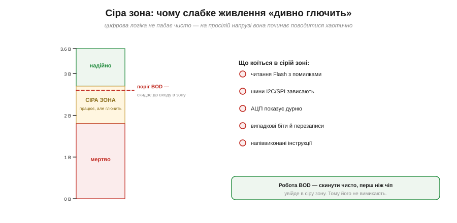
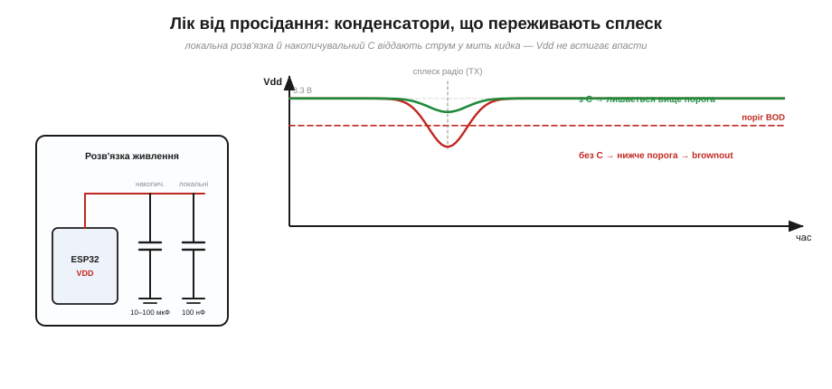

# 🔌 Супервізор живлення і brownout-детектор: чому МК «дивно глючить»

> Компонентна вставка до **теми [§4.1.8 «Причини reset»](mcu-esp32.md)**. У темі brownout був однією з **причин скидання**; тут копаємо глибше: чому просіле живлення дає не чистий збій, а **хаотичні глюки**, що таке детектор як вузол і чим це лікують на платі.

## Чому просіла напруга — це гірше за вимкнення

Здавалося б, менше живлення — повільніша робота, та й по всьому. Насправді — навпаки. Коли Vdd падає нижче надійного рівня, але **ще не до нуля**, чіп опиняється в **сірій зоні** (Рис. 4.1.8c.1): транзистори перемикаються на межі, рівні «0» і «1» розпливаються, а Flash читається з помилками. Цифрова логіка не вміє «трохи недопрацьовувати» — вона ламається **непередбачувано**: зависають шини I2C/SPI, АЦП видає дурню, у пам'яті спливають биті біти, інструкція виконується наполовину. Звідси й репутація слабкого живлення як «проклятого»: симптоми хаотичні й не вказують на причину.

*Рис. 4.1.8c.1. Три зони напруги. Угорі — надійна робота. Унизу — чіп мертвий, і це чесно. А між ними — підступна **сіра зона**, де логіка ще жива, але робить дурниці. Завдання детектора — скинути чіп чисто **до** входу в неї.*

## Детектор як вузол: вбудований BOD

Щоб не пускати чіп у сіру зону, всередині є **детектор просідання (*brownout detector*, BOD)** — компаратор, що безперервно звіряє Vdd з порогом і, щойно напруга падає нижче, **примусово скидає** чіп. У ESP32 поріг налаштовний, а сам BOD типово **увімкнений** — і вимикати його, аби «прибрати перезавантаження», — велика помилка: ти не лікуєш хворобу, а гасиш сигналізацію, лишаючи чіп блукати в сірій зоні.

## Зовнішній супервізор живлення

Коли вбудованого BOD замало — потрібен точніший поріг, нагляд за кількома лініями живлення чи захист зовнішніх компонентів, — ставлять окрему мікросхему-**супервізор** (*voltage supervisor / reset IC*, класів на кшталт **MCP1xx** чи **TPS3xxx**). Це крихітний чип, що стежить за напругою й тримає лінію RESET притиснутою, поки живлення не стане надійним; багато з них додають затримку, гістерезис, а інколи й власний сторожовий таймер. По суті це той самий BOD, але **зовнішній і незалежний** від самого МК.

## Лік: конденсатори, що переживають сплеск

Найкраще, однак, **не доводити** до просідання. Кидок струму (передача Wi-Fi, пуск мотора) короткий — і його можна перекрити **конденсаторами** поряд із чипом (Рис. 4.1.8c.2): локальні **100 нФ** біля кожної ніжки VDD гасять швидкі піки, а накопичувальний **10–100 мкФ** віддає заряд у мить великого кидка, не даючи Vdd просісти до порога. Це та сама причина, чому дешевий стабілізатор і тонкий кабель так часто винні (див. [DevKit-плату](comp-devkit.md)): їм бракує саме цього запасу.

*Рис. 4.1.8c.2. Той самий сплеск струму, два випадки. Без розв'язки Vdd провалюється нижче порога BOD → скидання. З локальними й накопичувальним конденсаторами заряд віддається миттєво, і напруга лишається у безпечній зоні.*

## Типові граблі

- **Вимкнути BOD «щоб не скидався»** — найгірше рішення: ховає проблему й пускає чіп у сіру зону.
- **Немає накопичувального C** — кожна передача Wi-Fi провокує просідання.
- **Тонкий кабель / слабкий стабілізатор** — той самий брак запасу під кидок.
- **Поріг BOD заниженій** — детектор спрацьовує надто пізно, уже на межі сірої зони.

## Варіації

Буває вбудований BOD, зовнішній супервізор, а ще комбіновані чипи «супервізор + сторож» в одному корпусі. Розрізняють детектори **просідання** (стежать за роботою) і **power-on** супервізори (тримають reset на старті); часто це той самий вузол із двома порогами. Багато супервізорів мають і вхід **ручного скидання** — кнопку RESET виводять саме на них.

> ▶️ Повернутися до теми: [§4.1.8 — Причини reset](mcu-esp32.md)
