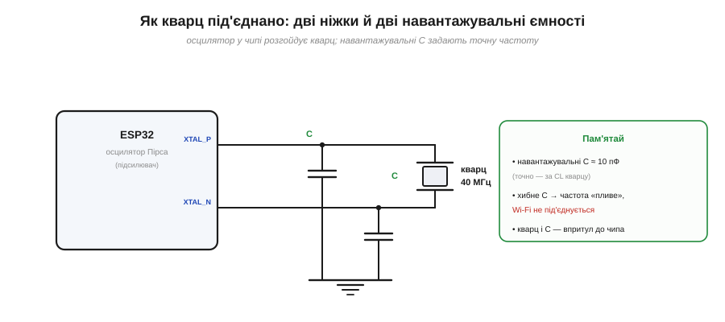
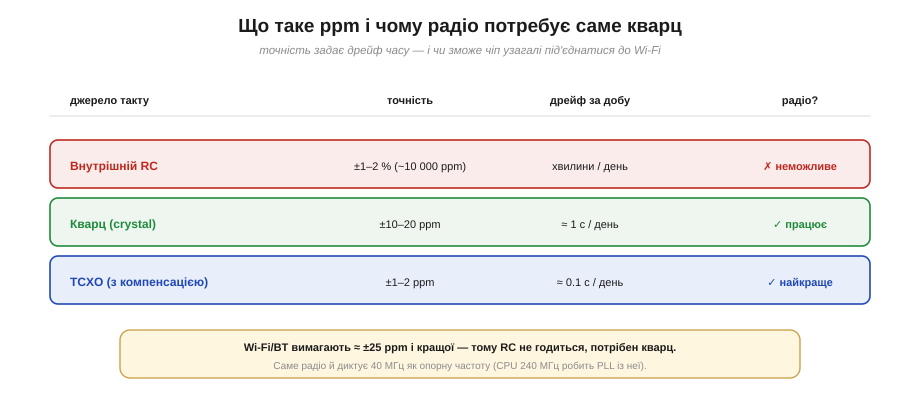

# 🔌 Кварц на платі: навантажувальні C, ppm і чому саме 40 МГц

> Компонентна вставка до **теми [§4.1.4 «Тактування й живлення»](mcu-esp32.md)**. Там ми бачили, що чіп стартує на грубому RC, а тоді переходить на **кварц** заради точності. Тут дивимося на кварц як на **деталь на платі**: як його під'єднують, що таке ppm і чому в ESP32 він саме на 40 МГц.

## Що це за деталь

**Кварцовий резонатор** (*crystal*) — шматочок кварцу, що механічно вібрує на дуже сталій частоті й дає чипу **точний еталон часу**. Сам по собі він пасивний; розгойдує його **осцилятор** усередині чипа (схема Пірса — підсилювач зі зворотним зв'язком). Під'єднують кварц завжди однаково: двома ніжками й **двома навантажувальними конденсаторами** на землю (Рис. 4.1.4c.1).

*Рис. 4.1.4c.1. Кварц між ніжками XTAL_P і XTAL_N, а від кожної ніжки — навантажувальний конденсатор на землю. Підсилювач у чипі підтримує коливання; навантажувальні **C** «підстроюють» резонанс на точну частоту. Усе це тримають **впритул до чипа**, короткими доріжками.*

## Навантажувальні конденсатори: дрібниця, що зриває Wi-Fi

Ці два конденсатори — не формальність. Кварц видає рівно свою частоту лише за певної **навантажувальної ємності** (*load capacitance*, **CL**), яку він «бачить». Її й задають ці C (з урахуванням паразитної ємності доріжок). Поставив не те значення — і частота **трохи з'їжджає**. Для миготіння світлодіода це байдуже, а от для радіо — фатально: воно вимагає дуже точної опорної частоти, і «попливлий» кварц обертається тим, що **Wi-Fi не під'єднується** або рве зв'язок. Тому навантажувальні C добирають **за CL конкретного кварцу**, а не «на око».

## Що таке ppm і чому радіо потребує кварц

Точність такту міряють у **ppm** (*parts per million*, мільйонних частках). 10 ppm означає відхил у 10 мільйонних — це приблизно **1 секунда дрейфу на добу**. Звідси видно, навіщо взагалі кварц (Рис. 4.1.4c.2): внутрішній RC-генератор має точність на рівні відсотків (десятки тисяч ppm) — годинник «втече» на хвилини за день, і для радіо він **не годиться**; кварц дає ±10–20 ppm; а кварц із термокомпенсацією (**TCXO**) — ще на порядок точніше.

*Рис. 4.1.4c.2. Точність і дрейф. RC — хвилини на день, радіо неможливе. Кварц — близько секунди на день, радіо працює. TCXO — найточніше. Wi-Fi/BT вимагають приблизно ±25 ppm і кращої — тому кварц обов'язковий.*

## Чому 40 МГц

Може здатися, що частота кварцу пов'язана з частотою ядра (240 МГц), але це не так. **40 МГц диктує радіо**: саме така опорна частота потрібна високочастотному синтезатору (*PLL*), що формує сигнали Wi-Fi і Bluetooth. А вже з цих 40 МГц чіп робить і 240 МГц для ядра — помножує їх своїм PLL (тактове дерево ми бачили в §4.1.4). Тобто опорну частоту обирає **найвибагливіший споживач — радіо**, а ядро бере її як похідну.

## Типові граблі

- **Хибні навантажувальні C** — найчастіша причина «модуль є, а Wi-Fi не ловить»: частота поза допуском радіо.
- **Кварц задалеко від чипа** — довгі доріжки додають паразитну ємність і шум; тримай його впритул.
- **Завеликий ppm** — кварц «для годинника» може не вкластися в допуск радіо.
- **Забути, що кварц потрібен саме радіо** — суто обчислювальний МК без радіо часто цілком живе на внутрішньому RC.

## Варіації

Замість простого кварцу бувають **TCXO** (де потрібна стабільність на спеці й морозі) і навіть зовнішній генератор. ESP32-сімейство переважно очікує **40 МГц** (деякі підтримують 26 МГц). Окремо стоїть маленький **годинниковий кварц 32.768 кГц**: його інколи ставлять для точного відліку часу уві сні (deep-sleep), хоча чіп уміє рахувати й на внутрішньому RC — просто менш точно.

> ▶️ Повернутися до теми: [§4.1.4 — Тактування й живлення](mcu-esp32.md)
