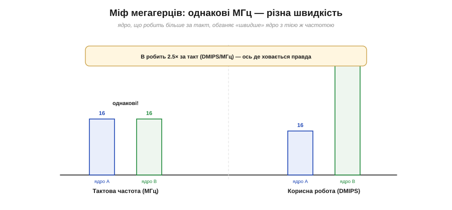
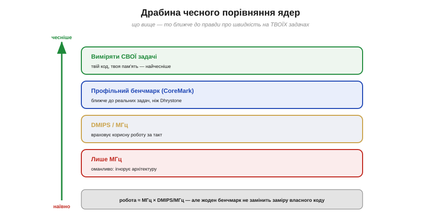

# 🧮 Мегагерци проти DMIPS: як чесно порівняти ядра

> Математична вставка до **теми [§4.1.6 «ESP32 проти простого 8-біт МК»](mcu-esp32.md)**. Там ми казали: більше мегагерців не завжди означає краще. Тут — як **чесно** виміряти продуктивність ядра, не ведучись на гучну цифру частоти.

## Означення

- **МГц** — тактова частота, скільки циклів за секунду.
- **MIPS / DMIPS** — мільйони інструкцій за секунду; **DMIPS** (*Dhrystone MIPS*) — те саме, але міряне відомим тестом-бенчмарком Dhrystone.
- **CPI** (*cycles per instruction*) — скільки тактів коштує середня інструкція.
- **DMIPS/МГц** — корисна робота **за один такт**; саме ця величина відбиває «розумність» архітектури.

## Інтуїція: міф мегагерців

Спокусливо порівнювати ядра за частотою: 240 МГц проти 16 МГц — очевидно, перше в 15 разів швидше? Ні. Частота каже лише, **як часто** ядро крокує, але не **скільки** воно робить за крок. Одне ядро за такт виконує просту інструкцію, інше — множення, ще інше встигає кілька дій конвеєром. Тому ядра з **однаковими** мегагерцами легко різняться удвічі-втричі за реальною роботою (Рис. 4.1.6m.1). Класичний приклад — апаратне множення: де одне ядро множить за **один** такт, інше крутить десяток тактів циклом; на задачі з арифметикою це й дає кратну різницю за тих самих мегагерців.


*Рис. 4.1.6m.1. Обидва ядра на 16 МГц — частота однакова. Та ядро B робить у 2.5 раза більше корисної роботи за такт (вищий DMIPS/МГц), тож насправді значно швидше. Мегагерці приховують саме цю різницю.*

## Формальний апарат

Корисна продуктивність — це **частота, помножена на роботу за такт**:

```
робота (DMIPS) = МГц × (DMIPS/МГц)
інструкцій/с   = частота ÷ CPI
```

Грубі, **ілюстративні** орієнтири DMIPS/МГц (точні числа залежать від чипа й версії тесту):

```
8-бітне ядро (AVR-клас)     ~ 1.0   DMIPS/МГц
32-бітне ядро (Cortex-M3/4) ~ 1.2–1.3
сильніше ядро (M7, Xtensa)  ~ 2     і вище
```

Отже 16-мегагерцове 8-бітне ядро дає ≈16 DMIPS, а 240-мегагерцове сучасне — кількасот: різниця не в 15 разів, а більша, бо множиться **і** частота, **і** робота за такт.

## Чесність порівняння: драбина

Та навіть DMIPS — не остаточна правда (Рис. 4.1.6m.2). Dhrystone **старий** і його легко «накрутити» компілятором; чесніший сучасний тест — **CoreMark**. А головне — жоден бенчмарк не знає **твоєї** задачі: чи багато в ній дробових обчислень (потрібен FPU), чи вона впирається в пам'ять, чи в роботу з рядками. Тому найчесніший вимір — **прогнати власний код**.


*Рис. 4.1.6m.2. Сходинки чесності. Найнижче — гола частота (оманлива). Вище — DMIPS/МГц (враховує архітектуру), тоді профільний бенчмарк (CoreMark), і нагорі — замір на власних задачах.*

## Де це працює в курсі

Цей погляд прямо потрібен, коли обираєш чіп (§4.1.6 і далі §4.1.7): не бери ядро «бо більше мегагерців». Дивись на роботу за такт, на наявність FPU чи DSP-інструкцій під твою задачу, а якщо вибір важливий — заміряй власний код. Саме тому, як ми бачили в §4.1.6, формально «потужніший» чіп інколи виявляється гіршим вибором: цифри на коробці — не те саме, що швидкість на твоїй роботі.

> ▶️ Повернутися до теми: [§4.1.6 — ESP32 проти простого 8-біт МК](mcu-esp32.md)
