# Розділ 4.1 — Анатомія мікроконтролера й архітектура ESP32

У [Модулі 3](../../block-3-digital-processor/processor-architecture/processor-architecture.md) ми зібрали комп'ютер **із принципів**: логічні рівні, вентилі, тригери, число, процесор із циклом «вибірка → виконання», пам'ять, стек. Усе це жило радше в уяві — як ідея машини. Цей розділ ставить ідею на землю: ми беремо **реальну** крихту, яку можна тримати в руці й прошивати, — **мікроконтролер** (*microcontroller*, MCU), — і розбираємо її по кісточках. Що в ній усередині (ядро, пам'ять, периферія), як код «торкається» заліза, звідки береться такт, чим вона живиться — і чому саме **ESP32** став улюбленцем мільйонів інженерів і аматорів.

Будуємо, як завжди, від першопричин: спершу **що таке мікроконтролер узагалі** й чим він відрізняється від «комп'ютера», який ми звикли бачити (ця тема); далі — його [складові](mcu-esp32.md), [регістри периферії](mcu-esp32.md), [тактування й живлення](mcu-esp32.md); і лише потім — конкретна [архітектура ESP32](mcu-esp32.md) з її двома ядрами й радіо. Нічого з Модуля 3 повторювати не доведеться — навпаки, усе те тут нарешті набуде фізичного тіла.

> 📜 **Перед матеріалом — історія:** [перший мікроконтролер — комп'ютер, що виріс із калькулятора](hist-first-mcu.md). Вона показує, *звідки* взялося саме розрізнення «мікропроцесор проти мікроконтролера», чому революцію штовхнув калькулятор і як лінія TMS1000 дотягнулася до ESP32. Ця тема робить ту історію строгою.

---

## 4.1.1 Мікроконтролер: комп'ютер на одному чіпі (проти мікропроцесора)

Слово «комп'ютер» малює в уяві ноутбук чи телефон: екран, гігабайти пам'яті, операційна система, десятки застосунків. Тож коли кажуть, що в зарядці, навушниках чи термостаті «теж є комп'ютер», це звучить як перебільшення. А це чиста правда — і навіть більша, ніж здається: таких прихованих комп'ютерів у світі **більше, ніж людей**, по кілька десятків на кожного з нас. Просто вони іншого роду — **мікроконтролери**. Перш ніж розбирати ESP32 по нутрощах, треба чітко зрозуміти, **що** це за клас машин і чим він відрізняється і від «великого» комп'ютера, і від свого близького родича — **мікропроцесора**. Від цього розрізнення залежить, що ви взагалі можете побудувати й як.

### Що таке мікроконтролер: цілий комп'ютер на одному кристалі

**Мікроконтролер** (*microcontroller*, MCU або µC) — це **повноцінний комп'ютер, упакований в один чіп**. «Повноцінний» означає, що на одному кремнієвому кристалі зібрано все, що робить машину машиною (усе це ми розбирали в Модулі 3, лише поодинці):

- **ядро** (*core*, CPU) — процесор із [§3.5](../../block-3-digital-processor/processor-architecture/processor-architecture.md): регістри, АЛП, лічильник команд, що крутить цикл «вибірка → декодування → виконання»;
- **програмна пам'ять** — там лежить ваш код (зазвичай це Flash; деталі типів — у [§4.1.2](mcu-esp32.md));
- **пам'ять даних** — там живуть змінні під час роботи (зазвичай SRAM);
- **периферія** (*peripherals*) — вбудовані вузли для зв'язку зі світом: цифрові ніжки, таймери, перетворювачі, інтерфейси зв'язку;
- **генератор такту** й схеми **живлення/скидання**, щоб усе це билося в єдиному ритмі.


*Рис. 4.1.1.1. Мікроконтролер у функційному вигляді: на одному кристалі — ядро, програмна пам'ять, пам'ять даних, периферія й такт, з'єднані внутрішньою шиною. Назовні стирчать **ніжки** (*pins*), якими чіп торкається світу: читає кнопку й давач, крутить мотор, світить діодом, говорить по шині з іншими чіпами. Усе потрібне для самостійної роботи — **всередині**.*

Ключове слово — **«усе»**. Мікроконтролеру не потрібні сусідні чипи, щоб ожити: підведіть живлення й такт — і він одразу починає виконувати зашиту в нього програму. Це самодостатній комп'ютер, тільки маленький, дешевий і «заточений» не показувати кіно, а **керувати** залізом — звідси й «контролер» у назві (*to control* — керувати).

### Мікропроцесор проти мікроконтролера: ядро окремо чи все разом

Тепер — головне розрізнення, заради якого й написана ця тема. Поряд із мікроконтролером живе його близький родич — **мікропроцесор** (*microprocessor*, MPU). Обидва походять від одного 1971 року (див. історію розділу), обидва — кремнієві крихти, та влаштовані принципово по-різному.

**Мікропроцесор — це лише ядро.** На його чипі є тільки CPU (АЛП, регістри, керування) — і все. Пам'яті для програми, пам'яті для даних, периферії в ньому **немає**: їх треба додати **окремими** чипами поруч на платі й з'єднати зовнішніми шинами. Сам по собі мікропроцесор — не комп'ютер, а лише його «мозок без тіла»; комп'ютер виникає аж тоді, коли довкола нього розпаяно пам'ять, контролери й живлення. Саме так влаштований ваш ноутбук: потужний процесор у центрі, а навколо — окремі мікросхеми оперативної пам'яті, накопичувач, набір системної логіки.

**Мікроконтролер — це весь комп'ютер.** Ядро, обидві пам'яті, периферія, такт — на **одному** кристалі. Нічого довкола паяти не треба; чіп самодостатній.

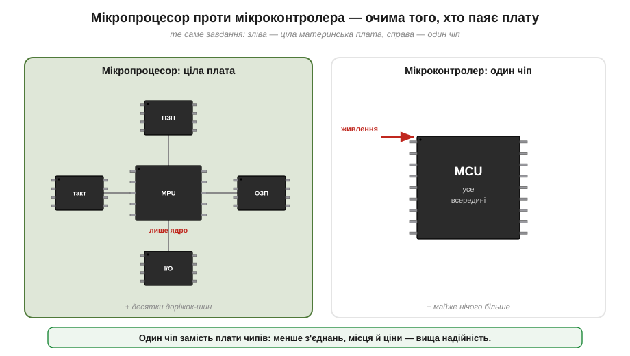
*Рис. 4.1.1.2. Та сама різниця, але вже очима того, хто паяє плату. **Зліва (мікропроцесор):** ядро марне саме по собі — потрібні окремі чипи ПЗП, ОЗП, периферії та такту, з'єднані доріжками-шинами; це повноцінна материнська плата. **Справа (мікроконтролер):** один чіп робить усе те саме — лишилося підвести живлення. Менше деталей, менше з'єднань, менше місця, нижча ціна, вища надійність.*

Підкреслимо: різниця **не в потужності**, а в **повноті й призначенні**. Мікропроцесор віддає весь кремній під обчислювальну силу, а пам'ять і периферію виносить назовні — щоб їх можна було нарощувати (гігабайти RAM, терабайти диска) під універсальні задачі. Мікроконтролер жертвує цією гнучкістю заради **інтеграції**: усе вбудоване, скромне за обсягом, зате одразу готове й дешеве. Перший — двигун, до якого ще треба зібрати автомобіль; другий — уже готовий самокат.

Зведімо відмінності в таблицю — її варто перечитати, коли обиратимете «серце» для свого пристрою:

| Ознака | Мікропроцесор (MPU) | Мікроконтролер (MCU) |
|---|---|---|
| Що на чипі | лише ядро (CPU) | ядро + пам'ять + периферія + такт |
| Пам'ять | зовнішня, окремими чипами | вбудована, на тому ж кристалі |
| Щоб запрацювати | потрібна плата з пам'яттю й логікою | досить живлення й такту |
| Обсяг пам'яті | гігабайти (нарощується) | кілобайти–мегабайти (фіксовано) |
| Операційна система | майже завжди (Windows, Linux…) | часто без неї («голе залізо») |
| Типове застосування | універсальні машини: ПК, сервер, смартфон | вбудоване керування: давачі, прилади, дрони |
| Ціна, споживання | вищі | копійчані, ощадні |

> 🔧 **Навіщо це.** Це перше інженерне рішення в будь-якому проєкті: брати мікроконтролер чи повноцінний комп'ютер (мікропроцесор + ОС, як одноплатний Raspberry Pi). Треба надійно й дешево читати давачі й крутити мотори, працювати роками без нагляду, стартувати миттєво — **мікроконтролер**. Треба екран, файли, мережу, важкі обчислення, камеру з розпізнаванням — **одноплатник** на мікропроцесорі з ОС. Помилитися дорого: на МК не запустиш браузер, а одноплатник довго вантажиться, більше їсть і боїться раптового вимкнення живлення.

### Чому «контролер»: машина, що керує, а не рахує

Чому в назві саме «контролер», а не «процесор» чи «комп'ютер»? Бо призначення цієї крихти — не рахувати для людини, а **керувати залізом** (*to control* — керувати, тримати під орудою). Великий комп'ютер обслуговує користувача: показує, рахує, зберігає, чекає на наші команди. Мікроконтролер обслуговує **пристрій**: він вмонтований у річ і безперервно стежить за її давачами та смикає її виконавчі органи — реле, мотор, клапан, індикатор. Його співрозмовник — не людина з клавіатурою, а **фізичний світ** із його кнопками, температурами й обертами.

Із цього випливає риса, якої «настільний» комп'ютер не має: мікроконтролер мусить реагувати **вчасно**. Якщо давач видав короткий імпульс, відповісти треба за мікросекунди, інакше мить утрачено; якщо керма мотора потребує поправки — то саме зараз, а не «коли звільниться процесор». Така робота **в реальному часі** (*real-time*), прив'язана до подій світу, а не до примх користувача, — і є суттю керування. Почасти тому в мікроконтролері так багато вбудованої периферії: вона бере на себе точну, своєчасну взаємодію із залізом, поки ядро зайняте логікою. Як саме це влаштовано — побачимо далі в модулі (периферія, переривання, таймери); тут важлива сама думка: МК **живе вплетеним у фізичний світ і мусить устигати за ним**.

Звідси й образ, який варто тримати в голові на весь модуль: мікропроцесор — це **мозок-обчислювач**, а мікроконтролер — **мозок-керманич**, зрощений із тілом машини. Перший думає; другий думає **й діє руками**, не випускаючи світу з-під контролю.

### Чому «все на одному чіпі» — це інша філософія

Інтеграція — не просто зручність пакування. Вона тягне за собою низку наслідків, що визначають, **як** ми програмуємо мікроконтролер і чого від нього чекаємо.

**Він самодостатній і стартує миттєво.** Програма вже лежить у вбудованій пам'яті чипа. Тільки-но з'явилося живлення — ядро бере першу команду й починає виконувати, без жодного «завантаження». Немає диска, з якого треба підняти операційну систему, немає зовнішньої пам'яті, яку треба ініціалізувати по шині. Це робить МК ідеальним там, де пристрій має ожити за частку секунди й працювати без оператора.


*Рис. 4.1.1.4. Що відбувається після ввімкнення живлення. **Мікроконтролер:** скидання → ядро читає програму з вбудованої пам'яті → код працює (мілісекунди). **Комп'ютер на мікропроцесорі:** скидання → завантажувач → пошук диска → підняття операційної системи → драйвери → робочий стіл (десятки секунд). МК не «вмикається», він просто **одразу є**.*

**Він дешевий і ощадний.** Один чіп замість плати чипів — це менше кремнію, менше корпусів, менше з'єднань, менша плата. Тому мікроконтролер коштує копійки й споживає мізерну потужність (часто — мілівати, а в режимі сну й мікровати). Саме це дало змогу ставити комп'ютер **усюди**, де раніше було б нерозумно: у вимикач, у лампочку, у зубну щітку.

**Він надійний.** Кожне зовнішнє з'єднання між чипами — потенційна точка відмови (холодна пайка, завада, паразитна ємність). Коли все на одному кристалі, цих стиків майже немає, а зв'язки всередині — короткі й швидкі. Менше деталей — менше що ламатися.

**Але ресурси скромні й фіксовані.** Плата за інтеграцію — обмеженість. Пам'ять мікроконтролера вимірюють у **кілобайтах і мегабайтах**, а не гігабайтах, і наростити її, доклавши планку, **не можна** — скільки вбудовано, стільки й є. Обчислювальна сила теж скромніша. Тому програмування МК — це завжди ще й **облік ресурсів**: чи влізе код, чи вистачить пам'яті на змінні, чи встигне ядро.

### Наскільки він менший за «справжній» комп'ютер

Щоб відчути масштаб, порівняймо типовий мікроконтролер із настільним комп'ютером (нащадком лінії мікропроцесора) по головних числах. Різниця — у **тисячі й мільйони разів**, і це не вада, а свідомий вибір на користь дешевизни, ощадності й простоти.

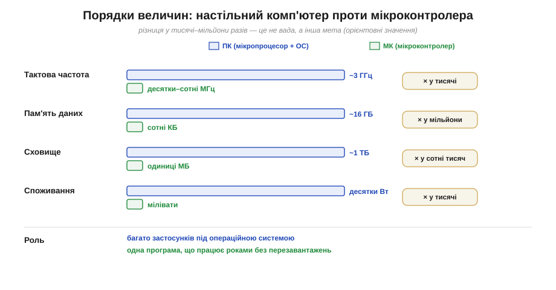
*Рис. 4.1.1.3. Орієнтовні порядки величин. Тактова частота: одиниці ГГц проти десятків–сотень МГц (× у тисячі). Пам'ять даних: гігабайти проти кілобайтів (× у мільйони). Сховище: терабайти проти мегабайтів. Споживання: десятки ват проти міліватів. Роль: «багато застосунків під операційною системою» проти «одна програма, що працює роками». Мікроконтролер не «слабкий комп'ютер» — він **інший** комп'ютер, заточений під іншу мету.*

Зверніть увагу на останній рядок — він найважливіший. Великий комп'ютер створений **жонглювати багатьма задачами** під орудою операційної системи: зараз браузер, за мить — музика, потім — гра. Мікроконтролер зазвичай робить **одну** справу, зате **завжди й передбачувано**: опитати давач, порахувати, видати сигнал — і так мільйони разів поспіль, роками, без перезавантажень. Тому йому й не потрібні ні гігабайти, ні операційна система: уся його «увага» віддана одній чітко окресленій роботі в реальному часі.

> 🔧 **Навіщо це.** Звідси випливає стиль програмування, який ми побачимо в усьому модулі. На МК ви пишете програму, що **володіє всім чипом одноосібно** й крутиться у вічному циклі, а не «застосунок» серед інших під наглядом ОС. Немає кому за вас керувати пам'яттю чи рятувати від зависання — ви ближче до заліза, маєте більше влади й більше відповідальності. Це й приваблює: ви тримаєте в руках **весь** комп'ютер цілком.

### Порахуймо: чи влізе програма в мікроконтролер

Оскільки ресурси скромні й полічені, найперша інженерна звичка — **прикинути бюджет пам'яті** ще до того, як писати код. Зробімо це на простому прикладі: чи помістяться типова програма керування й її змінні в мікроконтролер середнього класу.

**Приклад (бюджет пам'яті).** Програма читає давач, фільтрує дані й керує мотором. Компілятор повідомив: код займає **180 КБ**, а змінні в роботі — **45 КБ**. Маємо чіп із **4 МБ** програмної пам'яті й **320 КБ** пам'яті даних. Чи влізе — і скільки лишиться про запас?

```
Програмна пам'ять (код):
  є           = 4 МБ = 4 × 1024 КБ = 4096 КБ
  треба       = 180 КБ
  зайнято     = 180 / 4096 ≈ 4.4 %
  лишається   = 4096 − 180 = 3916 КБ  (величезний запас)

Пам'ять даних (змінні):
  є           = 320 КБ
  треба       = 45 КБ
  зайнято     = 45 / 320 ≈ 14 %
  лишається   = 320 − 45 = 275 КБ
```

Програма влазить із великим запасом — навіть «середній» мікроконтролер для такої задачі просторий. Але зверніть увагу на самі числа: ми рахуємо в **кілобайтах**. На настільному комп'ютері 45 КБ змінних — пил, про який ніхто й не згадає; тут це **14 %** усієї пам'яті даних, і якби задача була складніша (буфер відео, велика таблиця), запас зник би вмить. Звідси правило: на МК **пам'ять рахують**, а не витрачають наосліп.

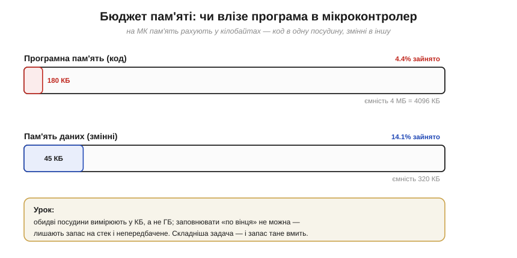
*Рис. 4.1.1.6. Дві «посудини» пам'яті мікроконтролера й що в них наливають. Програмна пам'ять (4 МБ) майже порожня — код займає тонку смужку. Пам'ять даних (320 КБ) заповнена на ~14 %. Заповнити будь-яку «по вінця» не можна — лишають запас на стек і непередбачене. Саме цей облік у кілобайтах і відрізняє мислення вбудованого розробника.*

### Де в цьому всьому ESP32

Межа між мікроконтролером і мікропроцесором не різка, а радше **шкала**. На одному її кінці — крихітні 8-бітні МК за центи з кількома кілобайтами пам'яті; на іншому — потужні процесори ПК. І сучасні мікроконтролери дедалі ближче підповзають до «дорослого» кінця: кілька ядер, сотні мегагерц, мегабайти пам'яті, а часом і власна (хоч і компактна) операційна система реального часу.


*Рис. 4.1.1.5. Неперервна шкала «обчислювальної ваги». Зліва направо: простий 8-біт МК → потужний МК / **система-на-чипі** (тут і ESP32) → одноплатний комп'ютер з ОС (мікропроцесор) → настільний ПК і сервер. ESP32 сидить у мікроконтролерній частині, але близько до межі: він потужний, багатоядерний і несе на чипі ще й **радіо** — тому його часто звуть не просто МК, а **системою-на-чипі** (*system-on-chip*, SoC).*

**ESP32 — це мікроконтролер**, нащадок правої, інтегрованої лінії з історії розділу: цілий комп'ютер на чипі. Але мікроконтролер **незвично потужний** як на свій клас, та ще й із вбудованим радіо (Wi-Fi і Bluetooth) — стільки всього на одному кристалі, що його справедливо називають **системою-на-чипі**. Саме ця рідкісна комбінація — повнота мікроконтролера, чимала сила й зв'язок зі світом по радіо — і зробила його таким популярним. Чим конкретно він наповнений усередині — ядра, пам'ять, периферія, радіо, — ми розберемо в [§4.1.5](mcu-esp32.md); а вже наступна тема почне з фундаменту: [із яких складових узагалі будується будь-який мікроконтролер](mcu-esp32.md).

---

## 4.1.2 Складові МК: ядро, пам'ять (Flash/SRAM), периферія

Ми з'ясували, що мікроконтролер — це цілий комп'ютер на одному кристалі. Тепер відкриймо цю «скриньку» й роздивімося, **з чого** саме він зібраний. Попри тисячі різних моделей від десятків виробників, усередині будь-якого МК — той самий набір частин трьох сімейств: **ядро**, що рахує; **пам'ять**, що зберігає (двох різних видів); і **периферія**, що зв'язує чіп зі світом. Усе це нанизане на спільну внутрішню **шину**. Хто вивчить цю карту один раз, той читатиме даташит **будь-якого** мікроконтролера, як знайому місцевість.

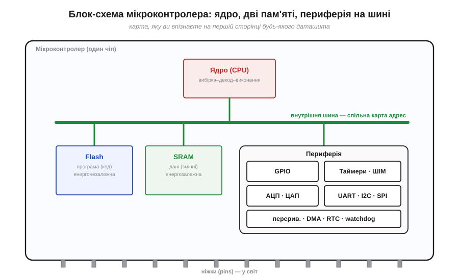
*Рис. 4.1.2.1. Внутрішня будова типового мікроконтролера. У центрі — **ядро** (CPU). Ліворуч дві пам'яті: **Flash** (програма) і **SRAM** (дані). Праворуч — гроно **периферії** (порти, таймери, перетворювачі, інтерфейси зв'язку). Усе з'єднує **внутрішня шина**: ядро по ній звертається і до пам'яті, і до кожного периферійного вузла. Назовні виходять **ніжки**. Саме цю схему — у різних варіаціях — ви побачите на першій сторінці будь-якого даташита.*

### Ядро: процесор із Модуля 3, лише скромніший

**Ядро** (*core*, CPU) — це той самий процесор, який ми по цеглинці зібрали в [Модулі 3](../../block-3-digital-processor/processor-architecture/processor-architecture.md): лічильник команд, що вказує на наступну інструкцію; **АЛП**, що виконує арифметику й логіку; **регістри** для проміжних значень; схема керування, що крутить вічний цикл «вибірка → декодування → виконання». У мікроконтролері це ядро зазвичай **скромне** — йому не треба тягнути операційну систему чи гру, лише чітко робити свою керувальну роботу, тож гнатися за гігагерцами ні до чого.

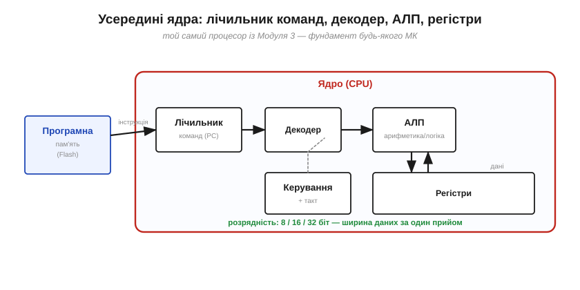
*Рис. 4.1.2.2. Зум у ядро. Лічильник команд (PC) бере інструкцію з програмної пам'яті; декодер її розпізнає; АЛП виконує дію над даними з регістрів; результат лягає назад. Усе крокує в ритмі такту. **Розрядність** (8/16/32 біт) — це ширина «шматка», з яким ядро працює за один раз.*

Дві характеристики ядра ви читатимете першими в кожному даташиті. Перша — **розрядність** (*word width*): скільки бітів ядро обробляє за один прийом. **8-бітне** ядро (класика дешевих МК) оперує байтом за раз; **32-бітне** (як в ESP32) — чотирма байтами, тож природно крутить більші числа й адресує більше пам'яті, не розбиваючи роботу на дрібні кроки. Друга — **тактова частота** в мегагерцах: грубо, скільки інструкцій за секунду (звідки береться такт і чому саме стільки — окрема [тема §4.1.4](mcu-esp32.md)). Разом вони задають «силу» ядра.

> 🔧 **Навіщо це.** Обираючи МК під задачу, ви насамперед дивитеся на ці два числа. Просте миготіння й опитування кнопки потягне й 8-бітне ядро на 16 МГц. А обробка звуку, керування з математикою з рухомою комою чи робота з мережею вимагають 32-бітного ядра на десятки–сотні МГц — звідси й популярність потужних МК на кшталт ESP32.

### Дві пам'яті: Flash для коду, SRAM для даних

Найважливіша тонкість будови МК — у нього **дві різні** пам'яті, з різними ролями. Це пряме втілення поділу «постійне vs тимчасове» з [Модуля 3 (§3.6)](../../block-3-digital-processor/memory-stack-heap/memory-stack-heap.md).

**Flash (флеш) — програмна пам'ять.** Тут лежить ваш **код** і незмінні дані (константи, текстові рядки, таблиці). Головна її риса — **енергонезалежність** (*non-volatile*): вимкнули живлення, увімкнули за тиждень — програма на місці. Flash записують **рідко** (один раз під час прошивання), а читають **постійно** — ядро бере звідти інструкцію за інструкцією. Вона щільна й дешева на біт, зате повільна й незручна на запис, тому для робочих змінних не годиться.

**SRAM — пам'ять даних.** Тут під час роботи живуть **змінні**, стек викликів і динамічна пам'ять (купа) з [Модуля 3](../../block-3-digital-processor/memory-stack-heap/memory-stack-heap.md). Вона **швидка** й вільно перезаписується скільки завгодно разів — саме те, що треба для мінливих даних. Та за це плата — **енергозалежність** (*volatile*): зникло живлення, і весь її вміст миттєво стерто.

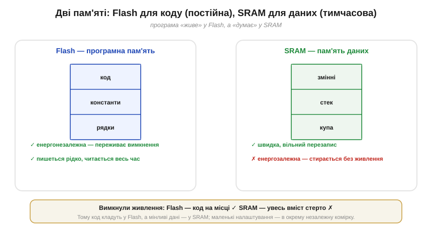
*Рис. 4.1.2.3. Дві комірчини пам'яті й хто в них живе. **Flash:** код, константи, рядки — переживає вимкнення, пишеться рідко, читається весь час. **SRAM:** змінні, стек, купа — швидка й вільна на запис, але стирається без живлення. Програма «живе» у Flash, а «думає» у SRAM. Обсяги — від кілобайтів до мегабайтів (Flash) і кілобайтів до сотень кілобайтів (SRAM).*

Часто є й третя, маленька **енергонезалежна** комірка для налаштувань, що мають пережити вимкнення (історично — EEPROM; у багатьох сучасних чипів її роль грає виділена ділянка Flash). Туди кладуть калібрування, лічильники, останній режим — те, що шкода втратити, але чого мало.

> 🔧 **Навіщо це.** Цей поділ — джерело і зручностей, і класичних багів. Великий масив-константу варто лишити у Flash (його там багато), а не копіювати в дефіцитну SRAM. А найпоширеніша «раптова» поломка на МК — це **переповнення SRAM**: змінних і стека стало більше, ніж є пам'яті даних, — і програма падає, хоча Flash іще напівпорожній. Тому два лічильники пам'яті — коду й даних — ви тримаєте окремо (ми вже бачили це в бюджеті §4.1.1).

> 🔌 **Де ця Flash фізично.** На ESP32 мікросхема Flash (а в WROVER — іще й додаткова PSRAM) лежить не в самому чипі, а поряд із ним у спільному корпусі — **модулі**, накритому металевим екраном. Що там під екраном і чому радіочип узагалі ховають у модуль — у вставці [Модуль WROOM/WROVER-класу](comp-wroom-module.md).

### Чому пам'ятей саме дві: гарвардський поділ

Два окремі сховища — це не лише про «постійне й тимчасове». Це ще й архітектурний виграш у швидкості, прямий нащадок **гарвардської** ідеї з [Модуля 3 (§3.5)](../../block-3-digital-processor/processor-architecture/processor-architecture.md): коли програма й дані лежать у **різних** пам'ятях зі своїми шинами, ядро може **одночасно** брати наступну інструкцію з Flash і читати-писати дані в SRAM, не чекаючи, поки звільниться спільна дорога. У «настільному» комп'ютері з єдиною зовнішньою пам'яттю (фон-нейманівській моделі) код і дані тиснуться одним каналом; маленький МК завдяки поділу дістає безкоштовну паралельність саме там, де вона найдорожча, — на кожній інструкції.

Звідси й важливий практичний наслідок: код на МК **виконується прямо з Flash**, його не треба спершу переписувати в оперативну пам'ять, як на великих машинах. А отже, велика незмінна таблиця чи довгий текстовий рядок, покладені у Flash, **не з'їдають** ані байта дефіцитної SRAM — вони читаються на місці. Це і є найперший прийом, коли SRAM добігає кінця: усе, що не змінюється, пересувають у Flash і лишають там. Тримати в голові, **що** живе у Flash, а **що** — у SRAM, виявляється однією з головних щоденних звичок вбудованого розробника.

### Периферія: апаратні «органи» зв'язку зі світом

Якби в МК були лише ядро й пам'ять, він умів би рахувати — але був би **сліпий і німий**, без жодного зв'язку зі світом. Цю прірву закриває **периферія** (*peripherals*) — набір окремих апаратних вузлів поряд із ядром, кожен заточений під свою справу. Це й є та частина, що найбільше різнить мікроконтролери між собою: ядра в багатьох схожі, а от **набір периферії** — те, заради чого обирають конкретний чіп.

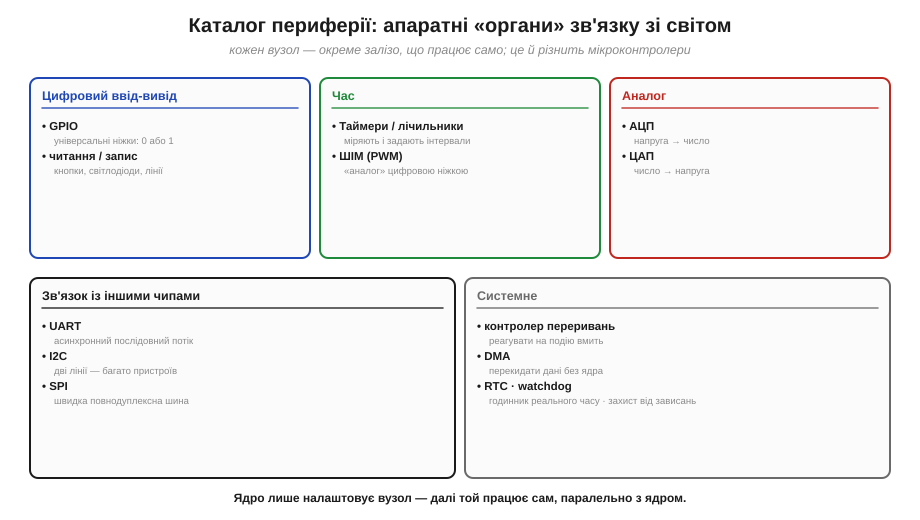
*Рис. 4.1.2.4. Типовий набір периферії, згрупований за призначенням. **Цифровий ввід-вивід:** GPIO — універсальні ніжки (0/1). **Час:** таймери/лічильники й ШІМ. **Аналог:** АЦП (напруга → число) і ЦАП (число → напруга). **Зв'язок:** UART, I2C, SPI — шини до інших чипів і давачів. **Системне:** контролер переривань, DMA, годинник реального часу (RTC), сторожовий таймер. Кожен вузол — окреме залізо, що працює само.*

Периферія приходить **числом**: не «один таймер», а, скажімо, чотири; не «UART», а два чи три. Тому даташит і рясніє записами на кшталт «4×Timer», «2×UART» — обираючи чіп, ви звіряєте **кількість** кожного вузла з потребами проєкту, як товар на полиці. І ще одна тонкість, що ловить новачків: периферійних вузлів усередині зазвичай **більше, ніж ніжок** назовні, тож одна фізична ніжка вміє слугувати кільком вузлам — по черзі, але не разом (так зване **мультиплексування виводів**, *pin multiplexing*). Наслідок суто практичний: задіяти геть усю периферію водночас не вийде — доводиться розподіляти обмежені ніжки між тим, що справді потрібно цьому пристрою. Деталі мультиплексування — у розділі про GPIO; тут досить запам'ятати, що **ніжки — спільний і обмежений ресурс**, який планують наперед.

Кожен із цих вузлів ми розберемо детально далі в модулі — кожному присвячено окремий розділ. Тут важлива загальна картина: периферія — це **руки, очі й вуха** ядра, апаратні й самостійні.

> 🔌 **А «рот і вуха» радіо — антена.** В ESP32 серед периферії є й радіо (детально в §4.1.5), а говорити зі світом йому дає **антена** на модулі. Які вони бувають і чому корпус та рука «садять» зв'язок — у вставці [Антена: PCB, керамічна, IPEX](comp-antenna.md).

### Чому периферія, а не «все програмою»

Постає природне питання: навіщо стільки окремого заліза, якщо ядро — універсальне й могло б усе зробити **програмою**? Скажімо, видати імпульси на ніжку, вмикаючи й вимикаючи її в циклі (це називають *bit-banging* — «смикання вручну»). Могло б. Але тоді ядро **застрягло** б у цьому циклі, рахуючи такти, і не могло б робити нічого іншого, — а точність усе одно «плавала» б від будь-якої перерви.

Периферійний вузол вирішує це інакше: ядро **один раз** його налаштовує, а далі вузол робить свою справу **сам, у залізі, паралельно** з ядром — і робить її **точно**. Поки таймер відлічує точні інтервали, а інтерфейс зв'язку перекидає байти, ядро вільне думати над логікою.

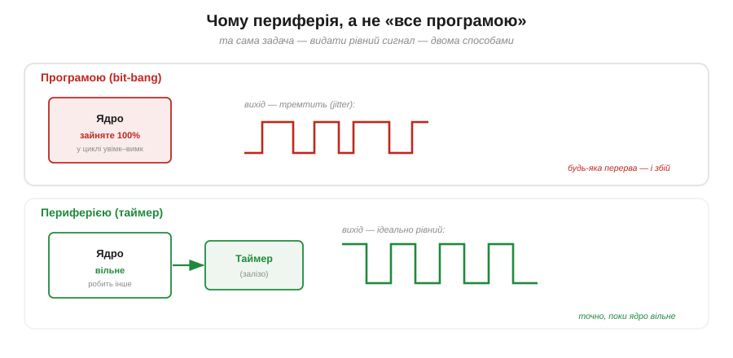
*Рис. 4.1.2.5. Та сама задача — видати рівний сигнал — двома способами. **Зверху (програмою):** ядро застрягло в циклі «увімк–вимк», зайняте на 100 %, а імпульси все одно тремтять від збоїв. **Знизу (периферією):** ядро лише налаштувало таймер — і звільнилося; вузол видає ідеально рівний сигнал сам. Це і є глибинна причина, чому МК — «контролер»: апаратне розвантаження заради **точної роботи в реальному часі**.*

> 🔧 **Навіщо це.** Правило вбудованого розробника: **усе, що можна, перекладай на периферію**, а ядру лишай рішення. Точний імпульс — таймером, а не циклом; передачу даних — інтерфейсом, а не ручним смиканням ніжки; вимір напруги — АЦП, а не здогадами. Так програма лишається чуйною, а сигнали — точними; цьому, по суті, і присвячено половину нашого модуля.

### Така ж складова: такт і живлення

Повна анатомія МК має ще один, легко забутний шар — **системну обв'язку**: генератор **такту** (*clock*), що задає всім спільний ритм; схему **живлення**; і сигнал **скидання** (*reset*), що приводить чіп у відомий початковий стан при ввімкненні. Без такту ні ядро, ні периферія не зроблять жодного кроку — це їхній «пульс»; без чистого живлення вони працюватимуть ненадійно. Ці вузли теж сидять на тому самому кристалі, поряд з усім іншим, і так само є **складовими** мікроконтролера. Ми навмисне виносимо їх в окрему [тему §4.1.4](mcu-esp32.md), де розберемо, звідки береться такт, чому важлива його стабільність і як МК уміє приспати сам себе, щоб ощадити енергію. Поки що достатньо запам'ятати: такт і живлення такі ж невіддільні частини, як ядро чи пам'ять, — без них решта мертва.

### Як усе з'єднано: внутрішня шина й карта пам'яті

Лишилося спитати: як ядро **дотягується** до пам'яті й кожного периферійного вузла? Через спільну **внутрішню шину** (*bus*) — набір ліній, якими ядро надсилає адресу й дані. І ось ключова, майже фокусницька деталь: і комірки пам'яті, і керувальні вузли периферії **сидять на спільній «карті адрес»** (*memory map*). Для ядра звернутися до периферії — це теж саме, що записати число за певною адресою; «торкнутися заліза» виявляється тим самим рухом, що й «покласти значення в пам'ять».

*Як саме* це влаштовано — що за кожним периферійним вузлом стоять **регістри** з власними адресами, і запис у них керує залізом, — то вже тема [наступного §4.1.3](mcu-esp32.md). Тут досить великої картини: одна шина, одна карта адрес, на якій впереміш живуть пам'ять і периферія.

> 🔧 **Навіщо це.** Саме ця єдина карта адрес пояснює, чому в коді на МК «увімкнути світлодіод» і «покласти число у змінну» виглядають майже однаково: і там, і там ви пишете значення за певною адресою. Завдяки цьому те саме ядро з тією самою парою дій «прочитати / записати» керує і пам'яттю, і мотором, і радіо — без жодних особливих «команд для заліза». Як цією властивістю користуються на практиці, побачимо вже в [наступній темі](mcu-esp32.md).

### Читаємо складові з даташита

Зведімо все докупи так, як це робить інженер: глянувши на **рядок специфікації** чипа. За сухим переліком тепер видно знайому будову.

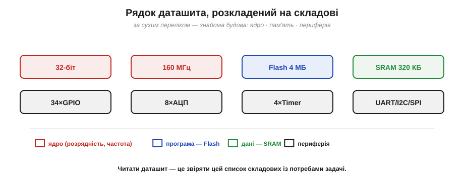
*Рис. 4.1.2.6. Типовий рядок даташита, розібраний на частини: розрядність і частота (ядро) · обсяг Flash (програма) · обсяг SRAM (дані) · перелік периферії (GPIO, АЦП, таймери, UART/I2C/SPI). Кожне число — це одна зі складових, які ми щойно розглянули.*

**Приклад (добір чипа за складовими).** Проєкту треба: 12 цифрових ніжок, 2 аналогові входи, зв'язок із двома іншими чипами, ~180 КБ коду й ~45 КБ змінних. Кандидат — чіп «32-біт @ 160 МГц, Flash 4 МБ, SRAM 320 КБ, 34×GPIO, 8×АЦП, UART/I2C/SPI». Чи підходить?

```
Потрібно проєкту          Чіп пропонує           Вистачає?
  цифрових ніжок: 12   →   GPIO: 34            ✓  (запас 22)
  аналогових входів: 2 →   АЦП-каналів: 8      ✓  (запас 6)
  шин до інших чипів: 2 →  UART + I2C + SPI    ✓  (на вибір)
  пам'ять коду: 180 КБ →   Flash: 4096 КБ      ✓  (зайнято 4 %)
  пам'ять даних: 45 КБ →   SRAM: 320 КБ        ✓  (зайнято 14 %)
```

Підходить із запасом по кожній позиції. Саме так і читають даташит: не як суцільний текст, а як **список складових**, що його звіряють із потребами задачі — ніжка до ніжки, кілобайт до кілобайта.

Отже, мікроконтролер — це ядро, дві пам'яті й периферія на спільній шині. Ми знаємо, **що** це за частини й **навіщо** кожна. Лишилося найцікавіше: як програма **насправді дотягується** до периферії — через регістри на карті адрес. Це й розбирає [наступна тема §4.1.3](mcu-esp32.md).

---

## 4.1.3 Регістри периферії: як код «торкається» заліза (memory-mapped IO)

Наприкінці минулої теми прозвучала майже фокусницька обіцянка: щоб запалити світлодіод чи крутнути мотор, ядро просто **записує число за певною адресою** — тим самим рухом, що й кладе значення у звичайну змінну. Тепер розкриємо цей фокус до останньої деталі. Це — найважливіша межа всього модуля: тут **програма торкається заліза**, абстрактні числа стають напругою на ніжці. Хто зрозуміє цей стик, той розумітиме, що насправді робить **кожен** рядок коду для МК, навіть схований за зручною бібліотекою.

### Периферія живе на карті пам'яті

Згадаймо велику картину з [§4.1.2](mcu-esp32.md): ядро, пам'ять і периферія сидять на одній **карті адрес** (*memory map*), з'єднані спільною шиною. Кожному вузлу відведено свій діапазон адрес. І ось у чому суть: коли ядро читає чи пише за адресою з **периферійного** діапазону, воно звертається **не до комірки пам'яті, а до заліза**. Та сама операція «запиши число за адресою», що для адреси з SRAM поклала б значення у змінну, для адреси з периферійного діапазону — **перемикає реальну схему**.

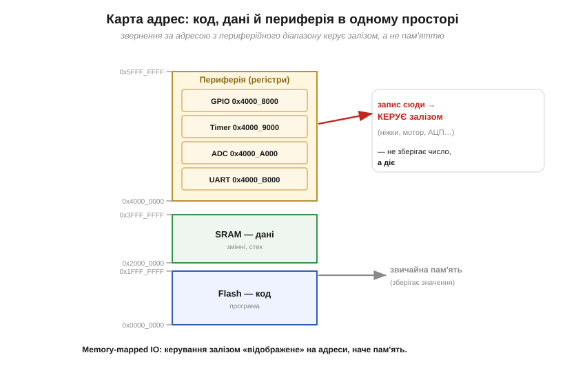
*Рис. 4.1.3.1. Єдиний адресний простір МК. Низ — **Flash** (код), далі **SRAM** (дані), а вище — **периферійний** діапазон, де кожному вузлу (GPIO, таймер, АЦП, UART…) відведено свій блок адрес. Звернення за адресою з периферійної ділянки керує **залізом**, а не пам'яттю. Це і є **відображений у пам'ять ввід-вивід** (*memory-mapped IO*).*

Така схема й зветься **відображений у пам'ять ввід-вивід** (*memory-mapped input/output*, MMIO): керування залізом «відображене» на адреси, наче воно теж пам'ять. Її велика перевага — **простота**: ядру не потрібні жодні особливі інструкції для роботи з пристроями, вистачає звичайних «прочитати з адреси» й «записати за адресою», якими воно й так працює з пам'яттю. (Існує й інший підхід — **окремий простір вводу-виводу** з власними командами `IN`/`OUT`, як у старих процесорах x86; але майже всі сучасні мікроконтролери — і ESP32, і ядра ARM, і RISC-V — обрали саме memory-mapped, бо так простіше і для заліза, і для програміста.)

Влаштовано це охайно: кожному периферійному вузлу відведено **суцільний блок** адрес — одна **базова адреса** (*base address*) на вузол, а всередині, один за одним, лежать його регістри. Тому й увесь GPIO, і весь таймер, і весь АЦП — це просто сусідні діапазони на тій самій великій карті. Знайшли в даташиті базу вузла — і всі його регістри поруч, на відомих зсувах від неї.

### Що таке регістр периферії

Комірки в периферійному діапазоні називають **регістрами** (*registers*). Регістр периферії — це невелика комірка фіксованого розміру (часто 32 біти) за фіксованою адресою, але її біти **дротами заведені на залізо**, а не на пам'ять. Фізично це здебільшого рядок **тригерів** (*flip-flops* із [Модуля 3](../../block-3-digital-processor/flip-flops-registers/flip-flops-registers.md)): вихід кожного біта тягнеться до якоїсь керувальної лінії вузла або, навпаки, вхід кожного біта знімає стан якоїсь лінії.

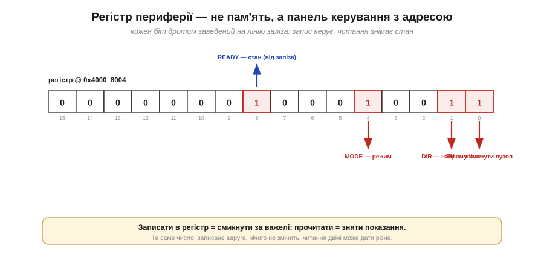
*Рис. 4.1.3.2. Регістр зблизька. Це не комірка пам'яті, а **панель керування** з адресою: кожен біт під'єднаний до конкретної лінії периферії. Записали 1 у біт «enable» — увімкнули вузол; записали біт «dir» — задали напрям ніжки; прочитали біт «ready» — дізналися, чи готове залізо. Один рядок бітів — десяток окремих перемикачів і лампочок.*

Тому «записати в регістр» — це не «запам'ятати число», а **смикнути за важелі**: кожен біт, який ви виставили, тієї ж миті щось умикає, перемикає або задає в апаратурі. А «прочитати регістр» — це **зняти показання** з давачів самого заліза.

> 🔧 **Навіщо це.** Це найважливіша зміна способу думати. Адреса регістра виглядає як адреса пам'яті, але регістр — **не пам'ять**: він не «зберігає, що поклали», а діє. Записали те саме число вдруге — і нічого не змінилось (вже ввімкнено); прочитали двічі поспіль — і дістали різні значення (стан заліза тим часом змінився). Тому до регістрів і ставляться особливо: компілятор не сміє «оптимізувати» такі звертання, вирішивши, що значення не змінилося (про цей нюанс — `volatile` — докладно в розділі про переривання).

### Три види регістрів

Хоч регістрів у периферії багато, за роллю вони бувають трьох ґатунків — і це варто впізнавати з першого погляду в даташит:

- **Керування / налаштування** (*control/config*) — у них ви **пишете**, щоб налаштувати чи скомандувати: увімкнути вузол, задати режим, частоту, напрям.
- **Стану** (*status*) — їх ви **читаєте**, щоб дізнатися, що відбувається: чи готові дані, чи стався збій, чи зайнятий вузол.
- **Даних** (*data*) — крізь них тече власне корисний вантаж: прочитати щойно отриманий байт, записати байт на відправлення, узяти результат виміру.

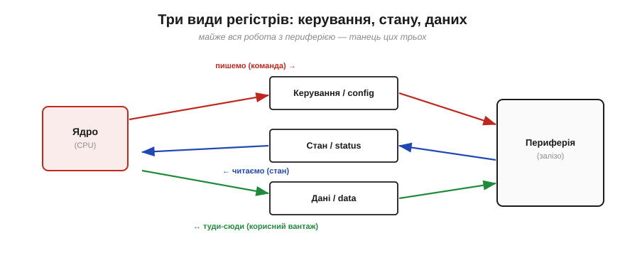
*Рис. 4.1.3.3. Три ролі регістрів і напрям руху. У **керування** ядро пише (команда → залізу); зі **стану** читає (показання ← від заліза); регістр **даних** двосторонній (туди-сюди тече корисний вантаж). Майже будь-яка робота з периферією — це танець саме цих трьох: налаштував → дочекався стану → перекинув дані.*

### Слово пишемо, а сенс — побітовий: маски

Тут чигає головна пастка новачка. Звертаються до регістра **цілим словом** (усі 32 біти за раз), а от **сенс** у кожного біта — свій. Якщо вам треба змінити **один** біт (скажімо, увімкнути одну ніжку), ви не можете записати «лише його» — доведеться записати все слово, а отже, ризикуєте **зачепити сусідні** біти, що відповідають за зовсім інше.

Розв'язок — **маски** (*bitmask*) і прийом **читай-зміни-запиши** (*read-modify-write*), на побітових діях із [Модуля 3 (§3.2, §3.4)](../../block-3-digital-processor/logic-gates/logic-gates.md). Чотири канонічні операції, які ви робитимете щодня:

```
встановити біт n:   reg |= (1 << n)      // АБО з маскою — кладе 1, інші не чіпає
скинути біт n:      reg &= ~(1 << n)     // І з інверсною маскою — кладе 0
перемкнути біт n:   reg ^= (1 << n)      // XOR — міняє на протилежне
перевірити біт n:   reg & (1 << n)       // І з маскою — ≠0, якщо біт стояв
```

Запис `(1 << n)` — це «одиниця, зсунута на n позицій», тобто маска з одиничкою точно в потрібному біті. Логіка проста: **АБО** з одиницею завжди дає 1 (вмикає), а з нулем — лишає як було; **І** з нулем завжди дає 0 (вимикає), а з одиницею — лишає; **XOR** з одиницею перевертає біт. Так ви точково керуєте окремими бітами, **не торкаючись** решти слова.

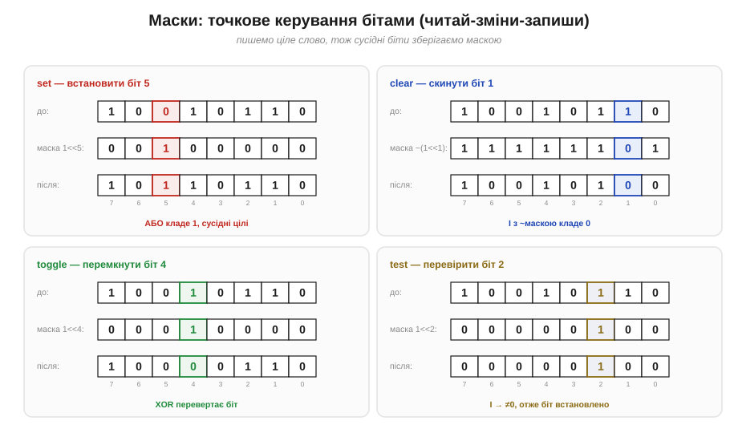
*Рис. 4.1.3.4. Маски в дії над тим самим словом. **set** (АБО): вмикає вибраний біт, сусідні цілі. **clear** (І з ~маскою): вимикає вибраний. **toggle** (XOR): перемикає. **test** (І): дізнається стан біта. Сіро — недоторкані біти; кольором — той, що ми змінюємо. Це і є «читай-зміни-запиши».*

> 🔧 **Навіщо це.** Read-modify-write — найповсякденніша навичка вбудованого розробника, і найчастіше джерело багів. Записали в регістр «голе» число замість маски — і ненароком вимкнули половину периферії разом із потрібним бітом. Тому правило: міняєш один біт — користуйся `|=`, `&= ~`, `^=`, а не простим присвоєнням, **якщо** не маєш наміру переписати все слово свідомо.

### Поля з кількох бітів

Не кожне налаштування вміщається в один біт. Часто кілька сусідніх бітів утворюють **поле** (*bitfield*), що кодує число: скажімо, двобітове поле SPEED (біти 2–3) задає одну з чотирьох швидкостей (00, 01, 10, 11), трибітове — одну з восьми. Записати таке поле однією простою маскою вже не вийде — потрібен трохи довший, але той самий за духом прийом: **спершу очистити все поле, тоді вкласти нове значення**.

```
вкласти у поле SPEED (біти 2–3) значення 2 (= 0b10):
  reg = (reg & ~(0b11 << 2)) | (0b10 << 2);
         \____ очистити поле ___/   \_ вкласти _/

прочитати поле SPEED:
  speed = (reg >> 2) & 0b11;        // зсунути вниз і відрізати зайве
```

Перша частина — `reg & ~(0b11 << 2)` — інверсною маскою обнуляє **обидва** біти поля, не чіпаючи решти слова. Друга — `(0b10 << 2)` — зсуває нове значення точно на місце поля. Операція **АБО** з'єднує їх. Читання дзеркальне: зсунути потрібні біти вниз і відрізати маскою все стороннє. Цей шаблон «очисти — зсунь — уклади» — той самий read-modify-write, лише над **групою** бітів; ним задають режими, дільники частоти, підсилення — усе, що кодується не «увімк/вимк», а числом із кількох варіантів. Половина рядків у будь-якому драйвері периферії — саме такі.

> ⚙️ **Стережися read-modify-write.** Сам `|=` не атомарний: якщо переривання змінить регістр між читанням і записом, твій запис його затре. Як цього уникати (атомарні SET/CLR-регістри, пастка write-1-to-clear, бітові поля C) — у вставці [Доступ до регістрів](proj-reg-access.md).

### Приклад: запалити світлодіод через регістри GPIO

Складімо все докупи на найпростішій дії — запаленні світлодіода. Візьмімо узагальнений вузол цифрових ніжок (GPIO) із трьома регістрами: **DIR** (напрям кожної ніжки: вхід чи вихід), **OUT** (який рівень видавати на ніжки-виходи) і **IN** (зчитати рівень на ніжках-входах). Світлодіод під'єднано до ніжки 2.

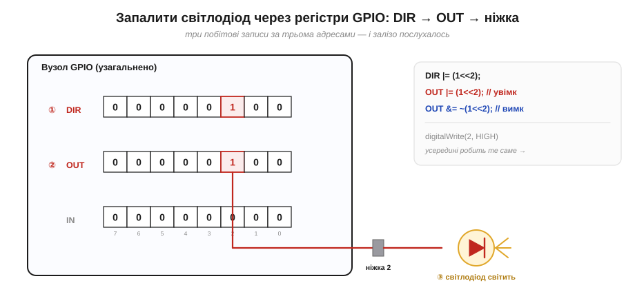
*Рис. 4.1.3.5. Шлях від коду до світла. (1) `DIR |= (1<<2)` — ніжку 2 призначено виходом. (2) `OUT |= (1<<2)` — у біт 2 регістра OUT записано 1, і вузол виставляє на ніжці високий рівень. (3) Напруга на ніжці засвічує світлодіод. Щоб згасити — `OUT &= ~(1<<2)`. Жодної «магії»: три записи в регістри — і залізо послухалось.*

Крок за кроком: спершу налаштовуємо напрям (`DIR |= (1<<2)` — біт 2 у одиницю, ніжка стає виходом), потім виставляємо рівень (`OUT |= (1<<2)` — світлодіод спалахує), а щоб згасити — скидаємо той самий біт (`OUT &= ~(1<<2)`). Усе — три побітові записи за трьома адресами. Саме це, до останнього біта, відбувається й тоді, коли ви пишете звичне `digitalWrite(2, HIGH)`: зручна функція **усередині робить точно такий запис у регістр OUT**.

### І навпаки — прочитати стан

Запис у регістр **керує** залізом; читання — його **питає**. Робиться це так само просто: прочитати регістр стану й виділити маскою потрібний біт. Хай вузол має регістр STATUS, у якому біт READY стає одиницею, коли готові свіжі дані, а сам корисний байт лежить у регістрі DATA. Тоді класичний зразок «дочекатися й забрати» виглядає так:

```
while ( (STATUS & (1 << READY)) == 0 ) { }   // чекаємо, поки READY стане 1
value = DATA;                                // забираємо готовий байт
```

Перший рядок крутиться доти, доки вираз `STATUS & (1<<READY)` лишається нулем (біта READY ще немає). Щойно залізо виставило READY, умова уривається, цикл випускає — і ми читаємо DATA. Тут зійшлися всі три ґатунки регістрів із малюнка 20.3.3: ми **дочекалися стану** й **забрали дані**. Часто саме читання регістра даних має й **побічний наслідок** — скидає прапорець READY, звільняючи місце для наступного байта: у регістрів буває «пам'ять дії», а не лише значення.

> 🔧 **Навіщо це.** Чекати готовності «крутінням» циклу (*polling*) — найпростіший, але не завжди найкращий шлях: ядро марнує час, опитуючи біт, замість робити корисне. Ефективнішу альтернативу — коли залізо саме смикне ядро по готовності — курс розбере в розділі про переривання. Та хоч би як ви дізнавалися про готовність, **сам акт** читання стану й даних — це завжди ті самі memory-mapped регістри й маски, що й тут.

### Як дізнатися регістри: карта з даташита

Звідки взяти адреси й значення бітів? З **карти регістрів** (*register map*) у даташиті. Вона дає **базову адресу** вузла, **зсуви** (*offsets*) кожного регістра від неї та **розшифровку кожного біта**. Адреса конкретного регістра — це база плюс зсув.

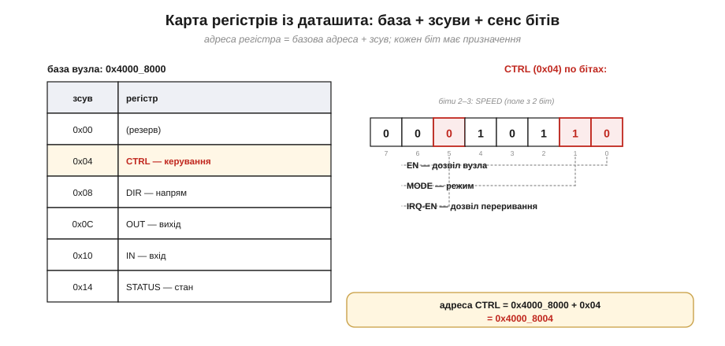
*Рис. 4.1.3.6. Фрагмент карти регістрів вузла GPIO. Ліворуч — таблиця: базова адреса, зсув і назва кожного регістра. Праворуч — побітова розшифровка одного регістра (що означає кожен біт). Уміти читати таку таблицю — і є вся «таємниця» спілкування з периферією.*

**Приклад (адреса й маска).** Регістр керування `CTRL` вузла лежить за зсувом `0x04` від базової адреси `0x4000_8000`. Спершу `CTRL` = `0b1001_0110`. Треба **увімкнути** біт 5 (дозвіл) і **вимкнути** біт 1 (режим), не чіпаючи решти. Порахуймо адресу й нові біти:

```
адреса CTRL = база + зсув = 0x4000_8000 + 0x04 = 0x4000_8004

вихідне:        CTRL = 1001 0110   (0x96)

увімкнути біт 5:  CTRL |= (1<<5)
  (1<<5)        =      0010 0000
  CTRL | маска  =      1011 0110   (0xB6)   ← біт5 став 1, інші цілі

вимкнути біт 1:   CTRL &= ~(1<<1)
  (1<<1)        =      0000 0010
  ~(1<<1)       =      1111 1101
  CTRL & маска  =      1011 0100   (0xB4)   ← біт1 став 0, інші цілі

результат:      CTRL = 1011 0100   (0xB4)
```

Жодної здогадки — лише адреса з даташита й дві маски. Так, рядок за рядком, і пишеться вся «низькорівнева» робота з МК.

### Чому це зазвичай ховають за бібліотекою

На практиці ви рідко пишете маски в регістри власноруч — частіше кличете готові функції чи макроси (`digitalWrite`, налаштування периферії однією командою). Це зручно й безпечно. Але **під** будь-якою такою функцією завжди лежить той самий запис у memory-mapped регістр, який ми щойно розібрали; «голого заліза» не оминути, його лише прикрито. Ціну й вигоду цієї прикритості — абстракції фреймворку проти прямої роботи з регістрами — ми зважимо в розділі про тулчейн. А знати шар під бібліотекою конче треба з трьох причин: коли бібліотека робить **не те**, що вам треба, ви йдете в карту регістрів і робите по-своєму; коли потрібна **швидкість**, прямий запис у регістр незрівнянно проворніший; а коли щось **не працює**, причину часто видно лише на рівні бітів. Класичний приклад швидкості: перемкнути десяток ніжок **одночасно** одним записом у регістр OUT — рівніше й у рази швидше, ніж десять окремих викликів зручної функції, кожен зі своїм read-modify-write. Коли така дрібниця стає критичною (а в керуванні моторами чи швидкими шинами вона стає), ви свідомо спускаєтесь до регістрів.

Отже, ми побачили найголовніший стик: програма керує залізом, записуючи біти в memory-mapped регістри за адресами з даташита. Усе ядро тим часом крокувало в ритмі такту, який ми досі брали як належне. Звідки ж береться цей такт, чому його стабільність важлива і як МК уміє приспати сам себе заради економії — про це [наступна тема §4.1.4](mcu-esp32.md).

---

## 4.1.4 Тактування й живлення МК (джерела такту; режими сну)

Дотепер у кожній темі за лаштунками невпинно цокав **такт** — той пульс, що змушував ядро робити крок за кроком, а синхронну периферію — ловити ритм. Ми брали його як належне. Час придивитися: **звідки** береться цей пульс, **чому** важлива його рівність і точність — і як із такту випливає друга, нерозлучна турбота вбудованого розробника: **живлення**. Адже МК часто працює від батарейки, а гнати пульс — означає палити енергію. Виявиться, що такт і живлення — два боки однієї монети, і найглибший спосіб заощадити струм — це **спинити такт**.

### Такт — спільний пульс чипа

Згадаймо з [Модуля 3](../../block-3-digital-processor/flip-flops-registers/flip-flops-registers.md): цифрова машина **синхронна** — усе в ній крокує разом, по фронтах одного тактового сигналу. **Такт** (*clock*) — це проста прямокутна хвиля (меандр) сталої частоти: на кожному висхідному фронті ядро просувається на крок свого циклу «вибірка → виконання», а синхронні периферійні вузли роблять своє цокання.

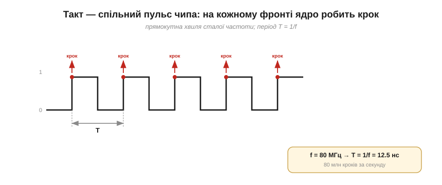
*Рис. 4.1.4.1. Тактовий сигнал — рівні прямокутні імпульси частотою f. Кожен висхідний фронт — команда «крок!» для всього чипа. **Період** T = 1/f: на 80 МГц один такт триває лише 12.5 нс. Частота й задає темп усієї машини — скільки кроків за секунду вона здатна зробити.*

Частота такту (у мегагерцах) — це, грубо, **темп життя** мікроконтролера: 80 МГц означає 80 мільйонів пульсів за секунду. Звідси й проста рівність, якою ви користуватиметеся постійно: **період T = 1 / f**. Що вища частота, то коротший крок і то більше ядро встигає — але, як побачимо, тим більше й споживає.

### Звідки береться такт: джерела

Сам пульс мусить хтось **народжувати** — і тут є вибір між точністю й дешевизною.

- **Внутрішній RC-генератор** (*internal RC oscillator*). Простий генератор на резисторі й конденсаторі, вбудований у сам чіп. Безкоштовний (жодних зовнішніх деталей), стартує миттєво, мало їсть — але **неточний**: його частота «плаває» від температури й напруги на відсотки. Годиться там, де точний час не критичний.
- **Кварцовий резонатор** (*crystal oscillator*). Зовнішній кристалик кварцу, що коливається на дуже точно визначеній частоті. Винятково **стабільний** (відхилення — лічені мільйонні частки), але коштує окремої деталі, повільніше запускається й трохи більше споживає. Його ставлять, коли час має бути точним. (Чому саме кварц такий точний — захоплива історія, яку розкаже окремий розділ про таймери.)
- **ФАПЧ / PLL** (*phase-locked loop*). Хитрий вузол, що **множить** низьку вхідну частоту до високої робочої. Скажімо, стабільний кварц на 40 МГц через PLL розганяється до 240 МГц для ядра. Так чіп дістає і **точність** дешевого низькочастотного джерела, і **швидкість** високої частоти.

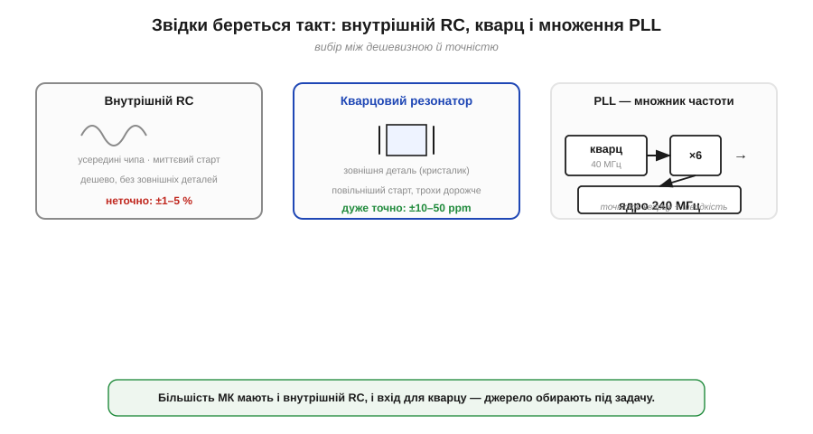
*Рис. 4.1.4.2. Три способи здобути такт. **RC** — усередині чипа, дешево й швидко, та неточно (плаває на відсотки). **Кварц** — зовні, дуже точно (мільйонні частки), та дорожче й повільніше на старті. **PLL** множить низьку опорну частоту до високої робочої — звідси «кварц 40 МГц → ядро 240 МГц». Більшість МК мають і RC, і вхід для кварцу, обираючи джерело під задачу.*

> 🔧 **Навіщо це.** Вибір джерела — інженерне рішення під задачу. Просто помиготіти світлодіодом чи покрутити мотор — досить внутрішнього RC, не паяючи нічого. А от тільки-но потрібен **точний час** — зв'язок із заданою швидкістю (де передавач і приймач мають збігатися), годинник, точні інтервали — ставлять **кварц**. Тому майже на кожній платі з МК ви побачите поряд маленький блискучий кристалик кварцу: це і є джерело точного пульсу.

### Старт із RC, перехід на кварц

У кварца є й вада: він **повільно розгойдується**. Щоб кристал вийшов на стабільну частоту, потрібні мілісекунди — ціла вічність для чипа, що робить мільйони кроків за ту саму мить. Внутрішній RC, навпаки, готовий **миттєво**. Тому багато МК стартують хитро: одразу по ввімкненні біжать на швидкому, хай і неточному, RC — щоб не марнувати час, — а коли кварц нарешті розгойдається й устабілізується, **на ходу перемикаються** на нього. Так чіп дістає і миттєвий старт, і точність у роботі. Цей перехід зазвичай робить завантажувач ще до вашого коду (про послідовність старту — в розділі про тулчейн), тож на практиці ви просто отримуєте вже точний такт. Але знати про двоступеневий старт корисно, коли налагоджуєте дивні збої в перші мілісекунди після подачі живлення.

> 🔌 **Кварц як деталь на платі.** Як його фізично під'єднують (дві ніжки й навантажувальні конденсатори), що таке ppm і чому в ESP32 він саме на 40 МГц — у вставці [Кварц на платі](comp-crystal.md).

### Чому стабільність такту важлива

Чому ж не завжди вистачає дешевого RC? Бо багато чого в МК **звіряється з тактом**, як із годинником, — і якщо годинник бреше, валиться все, що на нього спиралося.

Найболючіше це у **зв'язку**. Коли два пристрої обмінюються даними із заданою швидкістю, кожен відлічує біти **за власним тактом**. Якщо такти розійшлися надто далеко, приймач «зчитує» біти не в ті моменти — і потік перетворюється на кашу. Так само **відлік часу** (годинник, точні інтервали) накопичує похибку: неточний такт за добу «втече» на хвилини. А ось миготіння світлодіода чи груба затримка переживуть будь-яку похибку такту — оку байдуже до відсотка.

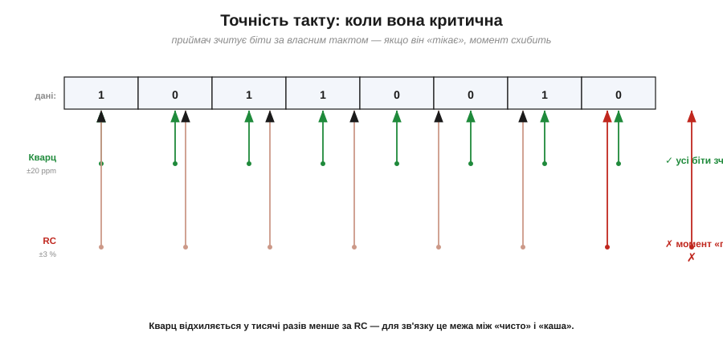
*Рис. 4.1.4.3. Та сама похибка — різні наслідки. Кварц відхиляється на ~20 мільйонних часток (ppm), RC — на відсотки, тобто в тисячі разів гірше. Для зв'язку на заданій швидкості це межа між «дані пройшли чисто» і «суцільна каша» (праворуч приймач схибив момент зчитування). Для миготіння світлодіода ж — байдуже. Точність такту купують рівно там, де вона потрібна.*

Числами: типовий кварц відхиляється на **10–50 ppm** (мільйонних часток — тобто стотисячні відсотка), а внутрішній RC — на **1–5 %**, у тисячі разів гірше. Тому правило просте: терпить задача неточність — бери RC; ні — став кварц.

Щоб відчути цю різницю на годиннику: похибка 1 % означає втечу часу на **~14 хвилин за добу** (1 % від 1440 хв) — за тиждень це вже півтори години розбіжності. Кварц на 20 ppm за ту саму добу схибить лише на **~1.7 секунди**. Ось чому будь-який реальний годинник — від наручного до того, що в МК веде календар, — цокає саме від кварцу, а дешевий RC лишають задачам, де хвилини туди-сюди байдужі.

### Тактове дерево: один пульс, багато ритмів

У чипі не все мусить крокувати в одному темпі. Зазвичай один **майстер-генератор** дає високу частоту, а далі вона **ділиться** на простих дільниках (*prescalers*) для різних споживачів: ядро — на повній швидкості, повільна периферія — на поділеній удесятеро, ще щось — на сотій частці. Виходить **тактове дерево** (*clock tree*): від одного кореня-джерела розгалужуються гілки різних частот.

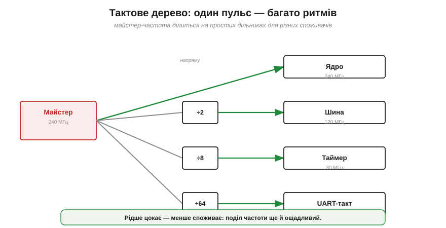
*Рис. 4.1.4.4. Один корінь — багато ритмів. Майстер-частота йде на ядро напряму (повна швидкість), а до периферії — крізь **дільники** (÷2, ÷8, ÷64…), бо їй стільки не треба. Поділити частоту легко (лічильник), і це ще й **ощадніше**: вузол, що цокає рідше, менше споживає. Звідси й налаштування «частоти периферії» в коді — це вибір дільника на її гілці дерева.*

> 🧮 **Порахувати дерево.** Звідки беруться самі числа — як PLL множить 40 МГц кварцу до 480, а дільники роблять 240 МГц ядру й 80 МГц шині — з формулами й прикладом у вставці [Дерево тактування: PLL і дільники](math-clock-tree.md).

### Живлення: чому МК має спати

Тепер про другий бік монети. Кожен пульс такту коштує **енергії**: на кожному фронті крихітні CMOS-ключі всередині чипа (із [Модуля 2](../../block-2-components-analog/mosfet/mosfet.md)) перемикаються, і кожне перемикання спалює дещицю заряду. Звідси груба, але важлива залежність: динамічне споживання зростає **з частотою такту й квадратом напруги живлення** (P ∝ f · V²). Простими словами: що швидше женеш чіп і що вища напруга — то більше він їсть.

Для пристрою від мережі це дрібниця. Але МК **часто живиться від батарейки** — і має протягнути місяці, а то й роки. Тоді важить кожен мікроампер, і постає питання: як рахувати **по краплі**? Перша відповідь напрошується — гнати ядро не швидше, ніж треба. Та головний важіль інший і набагато потужніший: **спати**.

### Режими сну: вимикаємо те, що не потрібно

Ключова ідея економії — **спинити такт** там і тоді, де він зараз не потрібен. Адже спинений вузол майже не споживає. На цьому й побудовані **режими сну** (*sleep modes*) — сходинки від повної активності до глибокого заціпеніння:

- **Активний** (*active*): усе працює на повну, повне споживання.
- **Легкий сон** (*light sleep*): такт ядра **зупинено** (ядро завмерло), але периферія й пам'ять живі; прокидається миттєво, тільки-но станеться подія. Споживання вже помітно менше.
- **Глибокий сон** (*deep sleep*): вимкнено майже все — такти спинено, більшість пам'яті знеструмлено (виживає хіба крихітна «комірка пам'яті стану»); жевріє лише дрібний маловитратний вузол, здатний розбудити чіп. Споживання — мікроампери, але прокидання повільніше, і більшість стану втрачено.

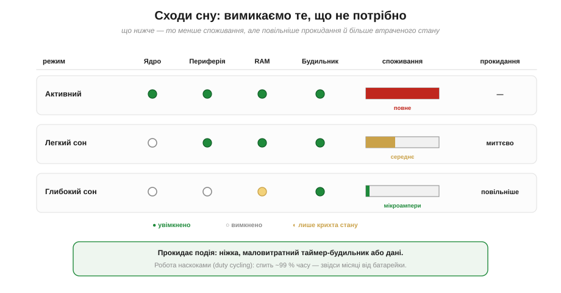
*Рис. 4.1.4.5. Сходинки від активності до глибокого сну. Що нижче — то більше вузлів знеструмлено, то менше споживання (від міліампер до мікроампер), але то повільніше прокидання й то більше втраченого стану. **Активний** — усе живе; **легкий сон** — спить ядро, периферія напоготові; **глибокий сон** — живий лише будильник. Розробник свідомо обирає, як глибоко занурити чіп між нападами роботи.*

Прокинути МК зі сну може **подія**: сигнал на ніжці (натиснули кнопку, давач смикнув), спрацював маловитратний таймер-будильник або надійшли дані. Звідси й рецепт довгого життя від батареї — **робота наскоками** (*duty cycling*): чіп спить ~99 % часу, прокидається на коротку мить зробити справу — виміряти, надіслати — і знову засинає. Саме так давачі й живуть місяцями на одній батарейці.

Як **глибоко** занурювати чіп — вирішує **частота пробуджень**. Треба реагувати часто й миттєво (стежити за швидкою шиною) — обирають легкий сон: економія менша, зате прокидання без затримки й без втрати стану. Треба прокидатися зрідка (виміряти раз на десять хвилин) — глибокий сон: максимальна економія варта і повільнішого старту, і клопоту зі збереженням дрібки стану в комірці, що пережила сон.

> 🔧 **Навіщо це.** Найголовніший важіль автономності — **не** потужніший процесор і не більша батарея, а **сон**. Пристрій, що весь час активний, з'їсть батарейку за день; той самий пристрій, що 99 % часу спить, протягне місяці — на тій самій батарейці. Тому архітектуру вбудованої програми часто будують навколо питання «як швидше зробити справу й заснути назад», а не «як завантажити ядро».

### Не лише сон: знизити частоту й вимкнути зайве

Сон — найпотужніший важіль, та не єдиний. Якщо згадати залежність P ∝ f · V², напрошуються ще два прийоми, і обидва спираються на вже знайоме **тактове дерево**.

Перший — **знизити частоту**, коли повна швидкість не потрібна. Ядро, що тимчасово не поспішає, переводять на нижчий такт (а часом і нижчу напругу) — і споживання падає пропорційно. Це **масштабування частоти** (*frequency scaling*): не «завжди на максимумі», а «рівно стільки, скільки треба зараз».

Другий — **вимкнути такт непотрібним вузлам** (*clock gating*). Якщо АЦП чи інтерфейс зв'язку зараз не працює, навіщо йому цокати? Перекривши такт на його гілці тактового дерева, ви майже занулюєте споживання цього вузла, не чіпаючи решту чипа. Саме тому периферію часто треба спершу явно «увімкнути» в коді (подати на неї такт): за замовчуванням вона мовчить, щоб не палити струм.

> 🔧 **Навіщо це.** Три важелі економії — **сон**, **нижча частота** й **вимкнений такт зайвому** — складають справжню «дисципліну живлення» вбудованого розробника. Найбільший виграш дає сон; та коли пристрій мусить бути активним, у пригоді стають інші два: не жени ядро швидше за потребу й не лишай цокати те, чим зараз не користуєшся.

### Порахуймо: скільки протягне на батарейці

Покажімо цей важіль числами — це і є та арифметика, яку роблять, проєктуючи автономний пристрій.

**Приклад (життя від батареї з duty cycling).** Давач прокидається на **100 мс** кожні **10 с**, щоб виміряти й надіслати. В активну мить він бере **40 мА**, а уві сні — лише **10 мкА** (0.01 мА). Живлення — елемент на **1000 мА·год**. Скільки протягне — і що дав би сон проти «завжди ввімкнено»?

```
частка активного часу = 0.1 с / 10 с = 0.01  (1 %)

середній струм:
  активно:  0.01 × 40 мА    = 0.400 мА
  уві сні:  0.99 × 0.01 мА  = 0.0099 мА
  разом                     ≈ 0.41 мА

життя = 1000 мА·год / 0.41 мА ≈ 2440 год ≈ 102 доби  (~3.4 місяця)

а якби чіп НЕ спав (завжди 40 мА):
  життя = 1000 / 40 = 25 год ≈ 1 доба
```

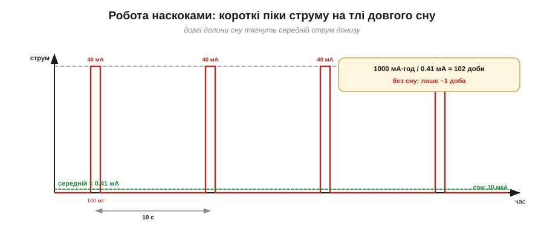
*Рис. 4.1.4.6. Струм у часі за duty cycling. Високі вузькі піки (40 мА, активна мить) розділені довгими низькими долинами сну (10 мкА). Площа під кривою — спожитий заряд; завдяки тому, що долини довгі, а піки вузькі, **середній** струм (пунктир) виходить крихітним. Той самий пристрій без сну — суцільна висока лінія, що осушує батарею в сотні разів швидше.*

Різниця приголомшлива: сон перетворив **одну добу** на **три з гаком місяці** — у сотню разів довше, на тій самій батарейці. Ось чому сон — це не «приємний бонус», а **серце** будь-якого автономного пристрою.

Отже, ми зібрали повну анатомію будь-якого мікроконтролера: ядро, дві пам'яті, периферія на спільній шині, регістри як стик із залізом, такт, що всім задає ритм, і живлення зі сном, що тримає його живим. Тепер ми готові навести цю карту на **конкретний** чіп — і побачити, чому ESP32 особливий: два ядра, багата периферія і, найнезвичніше, **радіо** на тому самому кристалі. Це й розбирає [наступна тема §4.1.5](mcu-esp32.md).

---

## 4.1.5 Архітектура ESP32: два ядра, радіо, багата периферія

Чотири попередні теми збудували **загальну** анатомію мікроконтролера: ядро, дві пам'яті, периферія, регістри, такт, сон. Це була карта, придатна до **будь-якого** МК. Тепер наведімо її на головного героя нашого модуля — **ESP32** від компанії **Espressif** — і побачимо два сюрпризи. Перший: ESP32 — це той самий знайомий мікроконтролер, лише **незвично щедрий** на все (два ядра, гори пам'яті, десятки периферійних вузлів). Другий, і найголовніший: у ньому є те, чого в загальній анатомії не було зовсім, — **радіо**. Саме поєднання «повноцінний комп'ютер + щедра периферія + бездротовий зв'язок + копійчана ціна» й зробило цей чіп улюбленцем мільйонів інженерів і аматорів.

> 📜 **Історія до теми:** [як дешевий Wi-Fi чип підкорив аматорів: ESP8266 → ESP32](hist-esp.md). Вона показує, *звідки* взялася ця незвична комбінація й чому саме Espressif перевернула ринок аматорської електроніки.

### ESP32 з висоти пташиного польоту: система-на-чипі

Пам'ятаєте блок-схему мікроконтролера з [§4.1.2](mcu-esp32.md)? ESP32 — це вона ж, лише розрослася й обзавелася антеною. На одному кристалі вмістили **два** обчислювальні ядра, сотні кілобайтів пам'яті, **радіоблок** Wi-Fi та Bluetooth і цілий «зоопарк» периферії — стільки всього, що чіп заслужено звуть **системою-на-чипі** (*system-on-chip*, SoC), а не просто мікроконтролером.

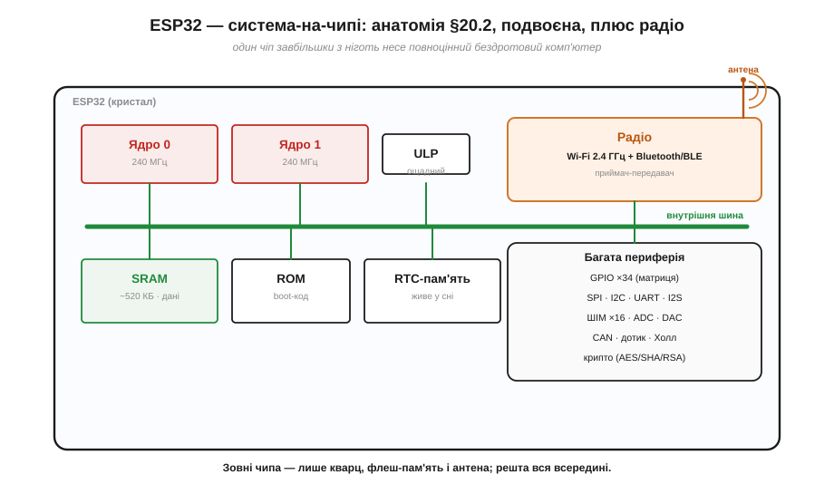
*Рис. 4.1.5.1. ESP32 як система-на-чипі. Та сама анатомія §4.1.2 — ядра, пам'ять, периферія на шині, — але **подвоєна й розширена**, плюс цілий **радіоблок** (Wi-Fi + Bluetooth) з антеною. Зовні — лише кварц, флеш-пам'ять і живлення. Один чіп завбільшки з ніготь несе повноцінний бездротовий комп'ютер.*

Пройдімося по цій карті частина за частиною — кожну з них ми вже вміємо «читати» із загальних тем.

### Два ядра (і ще одне крихітне)

Там, де простий МК має одне ядро, ESP32 має **два** — два 32-бітні процесори (архітектури Xtensa LX6), кожен здатний бігти до **240 МГц**. Їх історично звуть PRO та APP (за традиційним поділом праці: одне більше зайняте системними справами, друге — вашою програмою), та насправді вони рівноцінні. Два ядра означають справжню **паралельність**: поки одне крутить, скажімо, складний обмін по радіо, друге без затримок виконує вашу логіку. Користь не лише для зв'язку: друге ядро можна віддати й під вашу власну важку роботу — поки одне ядро обробляє сигнал чи зображення, друге лишається чуйним до кнопок і давачів. Як саме закріпити роботу за ядрами — справа моделі виконання в кінці модуля; тут важливо, що сама **можливість** двох паралельних потоків закладена в залізо.

А на додачу до двох «великих» ядер ESP32 несе ще одне, **крихітне й ультраощадне** — співпроцесор **ULP** (*ultra-low-power*). Він такий простий, що майже не споживає, зате вміє працювати **тоді, коли вся решта чипа спить** глибоким сном (до цього повернемося нижче).

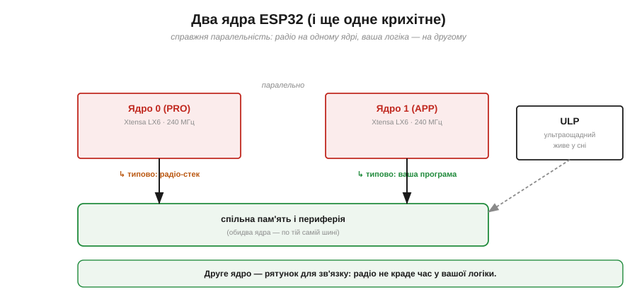
*Рис. 4.1.5.2. Обчислювальна частина ESP32. Два рівноцінні 32-бітні ядра (до 240 МГц) ділять спільну пам'ять і периферію й працюють **паралельно**: типово одне веде радіо-стек, друге — вашу програму. Окремо стоїть **ULP** — крихітний співпроцесор, що жевріє навіть у глибокому сні, коли великі ядра вимкнено.*

> 🔧 **Навіщо це.** Друге ядро — не розкіш, а рятунок для зв'язку. Радіо-стек (Wi-Fi, Bluetooth) вимагає **постійної своєчасної** уваги: пропустив момент — загубив пакет. На одноядерному чипі це постійно крало б час у вашої логіки. На ESP32 радіо живе на одному ядрі, а ваша програма — на другому, і вони не заважають одне одному. Як саме розкласти роботу по ядрах і задачах — велика тема моделі виконання, що чекає в кінці модуля.

### Пам'ять: своя на чипі та зовнішня через кеш

Тут ESP32 підносить цікавий сюрприз порівняно із загальною картиною §4.1.2. **Пам'ять даних** — як і належить, на чипі: близько **520 КБ SRAM** (щедро як на МК), плюс вбудований ROM із завантажувальним кодом і крихітна **RTC-пам'ять**, що переживає глибокий сон. А ось **програмна пам'ять** — здебільшого **зовнішня**: флеш-мікросхема (типово **4 МБ**) сидить окремим корпусом поряд і під'єднана по швидкій послідовній шині.

Як же ядро виконує код, що лежить у **зовнішньому** чипі? Через **кеш** і блок керування пам'яттю: ділянки зовнішньої флеш «відображаються» в адресний простір ядра, а кеш підкачує потрібні шматки коду в швидку внутрішню пам'ять. Для програми це **непомітно** — вона бачить код так, ніби він на чипі (згадаймо memory-mapped підхід із [§4.1.3](mcu-esp32.md)), хоча фізично він зовні.

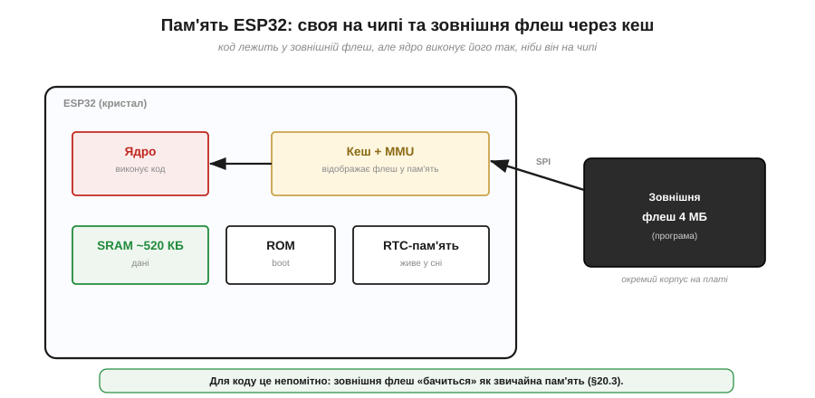
*Рис. 4.1.5.3. Пам'ять ESP32. На кристалі — швидка **SRAM** (~520 КБ), ROM і крихітна RTC-пам'ять. Програма ж зазвичай лежить у **зовнішній** флеш (4 МБ) поряд; ядро виконує її **крізь кеш**, що відображає флеш в адресний простір і підкачує код у внутрішню пам'ять. Для коду це невидимо — він «бачить» флеш як звичайну пам'ять.*

> 🔧 **Навіщо це.** Звідси дві практичні дрібниці. По-перше, **розмір флеш — на ваш вибір**: модулі ESP32 бувають із 4, 8, 16 МБ, і це визначає, скільки коду й даних влізе. По-друге, для великих даних (картинки, буфери) до деяких модулів додають окрему мікросхему **PSRAM** — ще пам'яті даних поряд із чипом. Тобто, читаючи специфікацію модуля ESP32, дивіться не лише на сам чіп, а й на те, **скільки флеш і PSRAM** на платі.

### Радіо — те, чого не було в загальній анатомії

А тепер — головна зірка, риса, що вирізняє ESP32 з-поміж тисяч звичайних МК. На тому самому кристалі вмонтовано **радіоблок**, який дає чипу одразу два види бездротового зв'язку: **Wi-Fi** (802.11 b/g/n, діапазон 2.4 ГГц) і **Bluetooth** — і класичний, і енергоощадний BLE. Обидва ділять один радіотракт на 2.4 ГГц.

Що це означає на практиці? Що крихітний дешевий чіп — самодостатній комп'ютер — уміє **сам**, без жодних додаткових модулів, під'єднатися до домашньої мережі та інтернету, підняти власний вебсервер, поговорити зі смартфоном по Bluetooth. Доти бездротовий зв'язок коштував окремого, часто дорожчого за сам МК, модуля; ESP32 поклав його **просто в чіп**, майже задарма. Це й перевернуло аматорську електроніку.

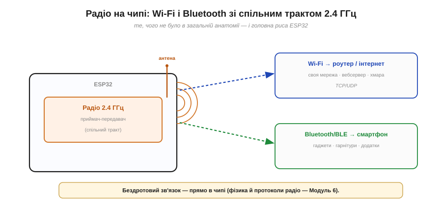
*Рис. 4.1.5.4. Радіоблок ESP32. На кристалі — приймач-передавач на 2.4 ГГц, який обслуговує і **Wi-Fi** (до роутера й інтернету), і **Bluetooth/BLE** (до смартфона й гаджетів). Антена — єдина зовнішня деталь. Радіо керується ядрами через периферійні регістри, як і будь-який інший вузол.*

Саме звідси й вибух популярності. За ціну заледве кількох доларів за модуль ви дістаєте комп'ютер, що сам виходить у мережу: давач, який щохвилини викладає показання у хмару; розумний вимикач, що ним керують зі смартфона; пристрій, який сам піднімає сторінку налаштувань по Wi-Fi. Доти кожне таке «під'єднати до інтернету» вимагало окремого модуля зв'язку й мороки з ним; ESP32 зробив бездротовий зв'язок звичайною, дешевою, **вбудованою** рисою — і тим відчинив двері тисячам аматорських і промислових проєктів «розумних речей».

Підкреслимо межу: тут ми кажемо лише, що радіо **є** і **що** воно дає. **Як** улаштована радіохвиля, модуляція, антена й протоколи зв'язку — окрема велика історія Модуля 6; зараз досить розуміти, що ESP32 несе бездротовий зв'язок усередині себе, а керують ним ядра звичними записами в регістри.

### Багата периферія й гнучка матриця ніжок

Периферійний «зоопарк» ESP32 вражає навіть на тлі звичайних МК. На чипі є близько **34 програмованих ніжок (GPIO)**; по кілька інтерфейсів зв'язку кожного виду (**SPI, I2C, UART, I2S**); **16 каналів апаратного ШІМ**; **два ЦАП** і **два 12-бітні АЦП** (разом ≈18 каналів); ємнісні давачі **дотику**, давач Холла, вбудований давач температури; контролер шини **CAN**, інтерфейс карт пам'яті; і навіть апаратні прискорювачі **шифрування** (AES, SHA, RSA) з генератором випадкових чисел.

Та найцікавіша — **матриця ніжок** (*GPIO matrix*), яка доводить ідею мультиплексування виводів із [§4.1.2](mcu-esp32.md) до краю: майже **будь-який** периферійний сигнал можна вивести майже на **будь-яку** ніжку. Там, де простий МК жорстко прив'язує «UART — лише до цих двох ніжок», ESP32 дає свободу розкладати інтерфейси по ніжках майже як завгодно — величезна зручність при розведенні плати.

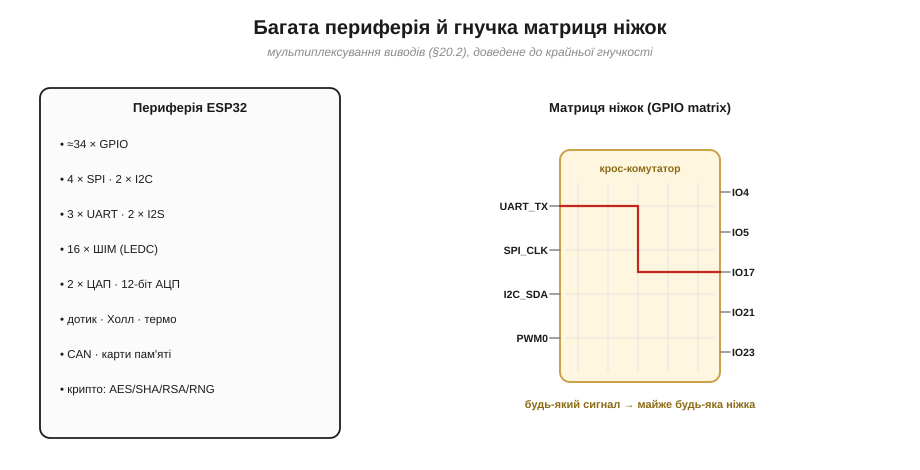
*Рис. 4.1.5.5. Ліворуч — щедрий набір периферії ESP32 (кілька SPI/I2C/UART/I2S, 16 ШІМ, АЦП/ЦАП, дотик, Холл, CAN, крипто). Праворуч — **матриця ніжок**: комутатор, що з'єднує майже будь-який сигнал периферії з майже будь-якою з ~34 ніжок. Це мультиплексування виводів (§4.1.2), доведене до крайньої гнучкості.*

> 🔧 **Навіщо це.** Свобода матриці ніжок величезна, але **не безмежна**: кілька ніжок особливі — вони задіяні під зовнішню флеш, ще кілька в момент скидання «зчитуються» як налаштування завантаження (strapping) і тому вередливі. На практиці це означає: периферію розкладаєте по ніжках вільно, але кілька «зайнятих» ніжок звіряєте з даташитом, перш ніж до них чіплятися. Подробиці керування самими ніжками — у розділі про GPIO далі в модулі.

### Такт і сон по-ESP32-ному

Загальні правила [§4.1.4](mcu-esp32.md) ESP32 утілює сповна. Точний такт він бере від зовнішнього **кварцу** (типово 40 МГц) і розганяє його через **PLL** до робочих **240 МГц**; для дрібних і сонних задач має внутрішні **RC-генератори** й повільний **RTC-генератор**. Режими сну — повний набір, від активного до глибокого.

І ось де ESP32 показує родзинку. У **глибокому сні** великі ядра й радіо вимкнено, та живими лишаються три речі: вже згаданий **ULP-співпроцесор**, частина **RTC-периферії** й крихітна **RTC-пам'ять**. Завдяки цьому чіп уміє, **майже не споживаючи**, періодично прокидати ULP, той тихенько зніме показання давача, вирішить, чи варто будити «велику» машину, — і знову занурить усе в сон. Це й дає ті місяці автономності, про які ми рахували в [§4.1.4](mcu-esp32.md).

Уявіть давач у полі: цілу добу він лежить у глибокому сні, ULP раз на хвилину знімає показання, і лише коли воно вийшло за межі — будить великі ядра з радіо, щоб надіслати тривогу по Wi-Fi. Решту часу чіп спить, споживаючи мікроампери, — і одна батарейка тягне місяцями. Без цієї двоступеневої схеми «ULP сторожує — ядра працюють наскоками» такий пристрій довелося б або живити від мережі, або міняти батарейки щотижня.

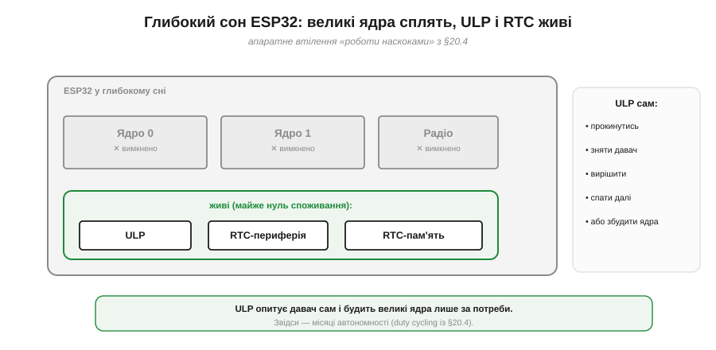
*Рис. 4.1.5.6. Глибокий сон ESP32. Два великі ядра й радіо знеструмлено (майже нуль споживання), але жевріють **ULP-співпроцесор**, **RTC-периферія** й **RTC-пам'ять**. ULP може сам опитати давач і збудити чіп лише за потреби. Це апаратне втілення «роботи наскоками» з §4.1.4 — звідси й місяці від батарейки.*

### Чіп, модуль чи плата: що ви тримаєте в руках

Тут варто розвести три речі, які початківці часто плутають. **ESP32** у вузькому сенсі — це сам **кристал** (чіп), що ми його розбирали. Але голий чіп не працює сам: йому потрібні зовнішній кварц, флеш-пам'ять і антена. Тому на практиці купують не чіп, а **модуль** (як-от поширені модулі серії ESP32-WROOM): маленьку плату, де чіп уже спаяний разом із флеш, кварцом і антеною — готовий до встановлення. А щоб із модулем було зручно експериментувати, його ставлять на **плату розробника** (*dev board*): той самий модуль плюс роз'єм USB, перетворювач живлення, кнопки скидання й гребінки виводів.

Тому, читаючи опис, розрізняйте рівні: «чіп ESP32» (серце), «модуль» (чіп + обв'язка + флеш + антена) і «плата» (модуль + зручності для роботи). Скільки на ній флеш, чи є PSRAM, яка антена — це здебільшого властивості **модуля**, а не самого чипа. Коли в курсі ми кажемо «ESP32», то майже завжди маємо на увазі саме модуль чи плату — те, що реально тримаєш у руках.

> 🔌 **Що саме на платі розробника.** USB-роз'єм, перетворювач живлення, кнопки й схема, що прошиває чіп без перемичок, — усе це розкладено у вставці [DevKit-плата ESP32 зсередини](comp-devkit.md).

### Прочитаймо ESP32 як специфікацію

Зведімо все докупи так, як ви читатимете даташит чи опис модуля, — наклавши специфікацію ESP32 на знайому анатомію.

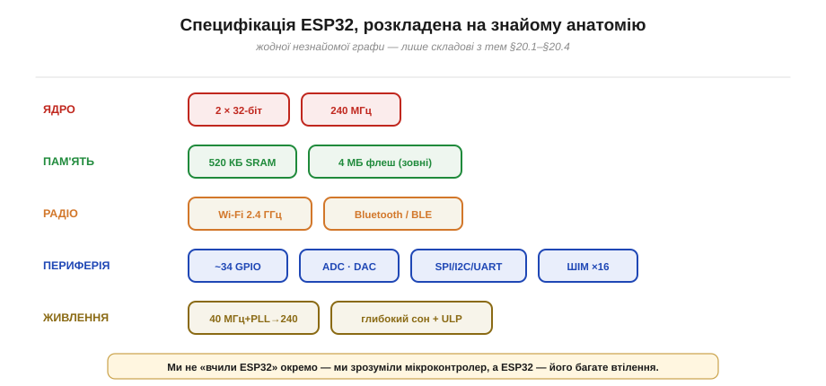
*Рис. 4.1.5.7. Рядок специфікації ESP32, розібраний на складові з тем §4.1.1–§4.1.4: ядра й частота · пам'ять (своя + зовнішня) · радіо · периферія · живлення/сон. Жодної незнайомої графи — лише наша анатомія, застосована до конкретного чипа.*

**Приклад (читаємо ESP32 за анатомією).** Опис каже: «**2× 32-біт @ 240 МГц · 520 КБ SRAM · 4 МБ флеш · Wi-Fi + BT · ~34 GPIO, ADC/DAC, SPI/I2C/UART · глибокий сон + ULP**». Розкладімо за складовими:

```
ЯДРО:       2 × 32-біт @ 240 МГц
            → грубо до ~480 млн простих операцій/с сукупно (§4.1.1–4.1.2)
ПАМ'ЯТЬ:    дані — 520 КБ SRAM на чипі
            код  — 4 МБ флеш ЗОВНІ, виконується крізь кеш (§4.1.2)
РАДІО:      Wi-Fi (2.4 ГГц) + Bluetooth/BLE — на чипі (нове проти §4.1.2)
ПЕРИФЕРІЯ:  ~34 GPIO (матриця ніжок), ADC/DAC, SPI/I2C/UART, ШІМ… (§4.1.2)
ЖИВЛЕННЯ:   кварц 40 МГц + PLL → 240 МГц; глибокий сон з ULP (§4.1.4)
```

Жодного рядка, який ми не вміли б прочитати: уся специфікація ESP32 лягає на анатомію, зібрану в темах §4.1.1–§4.1.4. У цьому й сенс — ми не «вчили ESP32» окремо, ми зрозуміли **мікроконтролер**, а ESP32 виявився його багатим, бездротовим утіленням. Тому й даташит ESP32, хоч і грубший за брошуру простого 8-бітного МК, не лякає: він описує ті самі п'ять речей — ядро, пам'ять, периферію, такт і живлення, — лише в більшій кількості й з радіо на додачу.

Тепер, коли ми знаємо, **що** в ESP32 всередині, варто спитати, **звідки** він такий узявся — як дешевий китайський Wi-Fi чип за кілька років перевернув аматорську електроніку: про це [історія до цієї теми](hist-esp.md). А далі ми тверезо зважимо, чи завжди потрібна така потужність, — і коли простого 8-бітного МК цілком досить ([§4.1.6](mcu-esp32.md)).

---

## 4.1.6 ESP32 проти простого 8-біт МК (коли більша потужність важлива)

Після [§4.1.5](mcu-esp32.md) ESP32 може здатися очевидним вибором на будь-що: стільки сили, радіо на борту, та ще й копійки. Спокуса завжди брати найпотужніше — велика й оманлива. Зрілий інженер питає не «що найкрутіше?», а «що **потрібно саме цій задачі**?» — і дуже часто правильною відповіддю виявляється скромний **8-бітний мікроконтролер**, дешевший, простіший, ощадніший і надійніший за ESP32. Ця тема — про **інженерне чуття вибору**: коли потужність ESP32 справді потрібна, а коли вона лише зайвий тягар.

### Інший кінець шкали: простий 8-біт МК

Згадаймо шкалу «обчислювальної ваги» з [§4.1.1](mcu-esp32.md). ESP32 сидить на її потужному краю. А на **протилежному** — класичний **8-бітний МК** (родини на кшталт **AVR**, **PIC**, **8051**; саме AVR стоїть у класичних платах Arduino). Це той самий мікроконтролер за анатомією [§4.1.2](mcu-esp32.md) — ядро, пам'ять, периферія, — лише **навмисне скромний**: 8-бітне ядро на 8–20 МГц, кілька кілобайтів флеш, сотні байтів — кілька кілобайтів SRAM, **жодного радіо**, проста периферія. Зате — копійки за штуку, мізерне споживання, крихітний корпус (інколи 6–8 ніжок) і **гранична простота**.

І не варто думати, що це «застарілий» клас, який ось-ось витіснять потужні SoC. Навпаки: прості 8-бітні МК — **мовчазні робочі конячки** всієї електроніки, їх випускають **мільярдами** штук на рік. Вони сидять у пультах, зарядках, іграшках, побутовій техніці, автомобільних дрібницях — усюди, де треба надійно й дешево робити невелику справу. Гучні новинки потрапляють у заголовки, а ці скромники тихо керують половиною речей навколо вас. Тож питання не в тому, котрий чіп «новіший», а в тому, котрий **пасує задачі**.

> 📜 **Архетип цього класу — Intel 8051.** Архітектура 1980 року, яку досі тиражують десятками мільярдів і ховають усередині Bluetooth- та USB-чипів. Її історія — найдовший доказ тези цього розділу, що «потужніший» ≠ «кращий»: [Intel 8051 — архітектура, яка досі всюди](hist-8051.md).

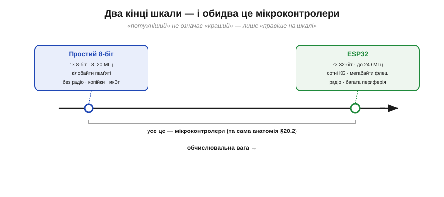
*Рис. 4.1.6.1. Обидва — мікроконтролери (та сама анатомія §4.1.2), але на **протилежних кінцях** шкали. Ліворуч — простий 8-біт: одне 8-бітне ядро, кілобайти пам'яті, без радіо, копійки, мікровати. Праворуч — ESP32: два 32-бітні ядра, сотні КБ, радіо, багата периферія. «Потужніший» — не означає «кращий»; означає лише «правіше на шкалі».*

### По яких осях вони різняться

Щоб вибирати свідомо, треба знати, **де саме** проходить різниця. А вона — по багатьох осях одразу, і не всі вони на користь потужнішого:

| Вісь | Простий 8-біт МК | ESP32 |
|---|---|---|
| Ядро | 8-біт, 8–20 МГц | 2× 32-біт, до 240 МГц |
| Пам'ять | сотні Б – кілька КБ RAM | ~520 КБ RAM, мегабайти флеш |
| Радіо | немає | Wi-Fi + Bluetooth |
| Периферія | скромна | дуже багата |
| Ціна (орієнтовно) | копійки ($0.3–1) | кілька доларів за модуль |
| Споживання уві сні | одиниці мкА | трохи більше (складніший) |
| Складність, надійність | гранично проста, передбачувана | складний SoC (RTOS, радіо-стек) |
| Корпус, розмір | крихітний (6–8 ніжок) | модуль помітно більший |

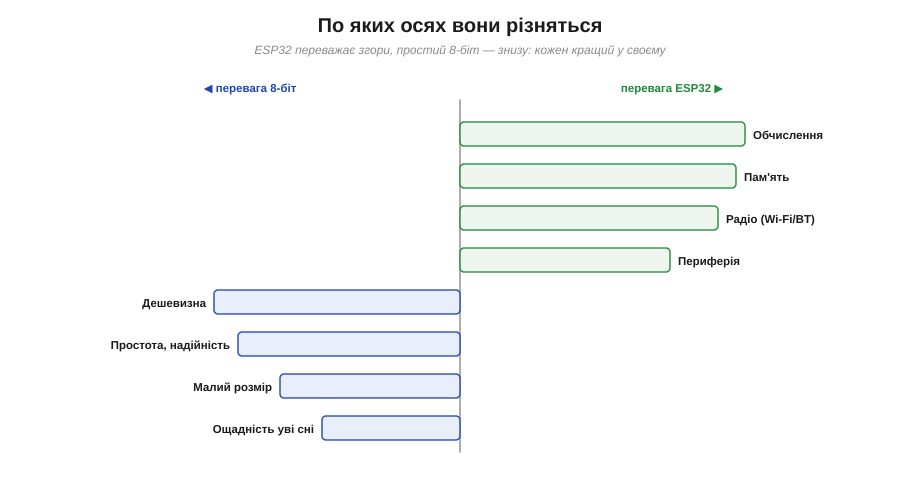
*Рис. 4.1.6.2. Порівняння по осях. По обчисленнях, пам'яті, радіо й периферії ESP32 переважає в рази й порядки. Але зверніть увагу на **нижні** осі — ціна, простота, розмір, а почасти й ощадність: тут уже **8-біт попереду**. Тому вибір — не «хто сильніший», а «що важить саме в цій задачі».*

Найважливіше тут — сам **перехрест**: жоден чіп не виграє по **всіх** осях. ESP32 платить за свою силу ціною, складністю, розміром і апетитом; 8-біт платить за дешевизну й простоту браком потужності та зв'язку. Тому й немає «загалом кращого» — є лише кращий **під конкретний набір вимог**. Уся майстерність вибору зводиться до того, щоб чесно визначити, які осі важать **саме у вашій** задачі, а на які можна заплющити очі.

> 🧮 **Обережно з рядком «МГц».** У таблиці частоти стоять поряд, та порівнювати ядра за самими мегагерцами — пастка: ядро може робити більше або менше за такт. Як міряти продуктивність чесно (DMIPS/МГц, бенчмарки, замір власного коду) — у вставці [Мегагерци проти DMIPS](math-benchmarks.md).

### Коли ESP32 виправданий, а коли кращий 8-біт

Звідси й два списки — коли яка чаша терезів переважує.

**ESP32 справді потрібен**, коли задача вимагає його сили:
- потрібен **бездротовий зв'язок** (Wi-Fi чи Bluetooth) — це його коронна риса, і 8-біт тут просто безсилий;
- **важкі обчислення**: обробка звуку, сигналів, зображень, легке машинне навчання, керування дисплеєм;
- треба **багато пам'яті**: буфери, вебсторінки, великі таблиці;
- багато **периферії** або **два потоки** роботи водночас (наприклад, зв'язок + логіка).

**Простий 8-біт кращий**, коли задача скромна й затиснута:
- **гранична дешевизна на масштабі**: коли виробів **мільйони**, кожен цент на чипі — це купа грошей;
- **роки від батарейки**: простий чіп уві сні споживає менше й має менше що живити;
- **крихітний розмір** і місце на платі в обріз;
- потрібні **максимальна простота й надійність**, миттєвий старт, передбачуваність — і **нема** потреби в радіо.

Помітьте логіку обох списків: вони описують не «гарне» й «погане», а **відповідність вимогам**. Ліва колонка — це задачі, що **впираються** в стелю простого чипа (йому бракне сили, пам'яті чи радіо); права — задачі, де сила ESP32 **не потрібна**, зате на перший план виходять ціна, простота й автономність. Зрілий добір — це не «взяти найкраще», а **зняти мірку** з задачі й підібрати чіп точно по ній, без надлишку й без нестачі.


*Рис. 4.1.6.3. Дві колонки тригерів. Ліворуч — ознаки, що **тягнуть до ESP32** (зв'язок, важкі обчислення, багато пам'яті/периферії). Праворуч — ознаки, що **тягнуть до 8-біт** (копійки × мільйони, роки від батарейки, гранична простота, радіо не треба). Часто задача чітко світиться однією з колонок.*

> 🔧 **Навіщо це.** Народна мудрість інженерії: **не пали з гармати по горобцях**. Поставити могутній ESP32 туди, де треба лише блимнути світлодіодом за таймером, — це як возити пошту літаком: дорожче, складніше й, як не дивно, ненадійніше. Уміння **не** взяти найпотужніше — така сама ознака майстерності, як і вміння взяти його, коли воно справді потрібне.

### Контрінтуїтивне: потужніший чіп може бути гіршим

Тут варто зруйнувати інтуїцію новачка «більше — завжди краще». Узяти ESP32 на тривіальну задачу — це не «із запасом», а часто **програш** за кількома статтями одразу. Він **більше споживає** (зайва батарея чи коротше життя), **дорожчий** (на масштабі — суттєво), **складніший** (повноцінна операційна система й радіо-стек усередині — більше того, що може піти не так), **повільніше стартує** й узагалі дає більше «поверхні» для збоїв. Простий 8-біт, навпаки, стартує миттєво, поводиться передбачувано до такту й рідко чимось дивує. Для багатьох задач саме **простота — це і є якість**, а не компроміс.

Простий приклад: автоматичний нічник, що вмикає світло в темряві. Усе, що йому треба, — зчитати фотодавач і смикнути ключ; це робота для копійчаного 8-біт, що спить майже весь час і прокидається на мить. Поставити сюди ESP32 — означає додати вартість, складнішу прошивку, гірший сон і цілий радіо-вузол, яким нічник ніколи не скористається. «Запас потужності» тут обертається суцільними мінусами, не давши **жодного** плюса, — ось вам і «гірше від потужнішого» в чистому вигляді.

### Прихована ціна потужності: складність і дозволи

Є й менш очевидні витрати «крутого» чипа, про які новачок не здогадується, доки не вколеться. Перша — **складність розробки**. ESP32 несе всередині повноцінну операційну систему й радіо-стек; це означає більше шарів, більше налаштувань, більше місць, де щось іде не так, і важче відлагодження. Простий 8-біт ви тримаєте «у голові» цілком — кожен такт передбачуваний; великий SoC такої прозорості не дає.

Друга, геть невидима новачкам, — **радіо тягне за собою дозволи**. Щойно у виробі є передавач, на нього лягають вимоги регуляторів (на кшталт FCC чи CE), випробування, погодження антени — час і гроші, яких пристрій **без** радіо просто не знає. Тому навіть там, де ESP32 «потягнув би», виробники масової немережевої речі часто свідомо лишаються на простому МК — щоб **не відчиняти** цю скриньку складності й сертифікації. Потужність, яка не потрібна, — це не запас, а **борг**, який доведеться обслуговувати.

> 🔧 **Навіщо це.** Оцінюючи чіп, рахуйте не лише його ціну й швидкість, а й **повну вартість володіння**: час на освоєння й відлагодження, складність прошивки, дозволи на радіо, ризик нових збоїв. Часто простий 8-біт виграє саме тут — не на папері специфікації, а в реальних тижнях розробки й спокої експлуатації. «Дешевший і простіший» нерідко означає ще й «швидше випущений і менше клопоту потім».

### Як вирішувати: коротке дерево рішень

На практиці вибір зводиться до кількох питань, поставлених по черзі. Порядок не випадковий: спершу відсіюємо **категоричні** вимоги — радіо чи важкі обчислення, яких простий чіп не подужає в принципі, — і лише коли вони відпали, зважуємо **економічні**: ціну, сон, простоту, де зазвичай виграє скромний МК. А якщо жодне питання не дало твердого «так» убік потужності — беріть простіше: невикористану силу ви оплатите грошима, струмом і складністю, а невикористана простота не коштує **нічого**.

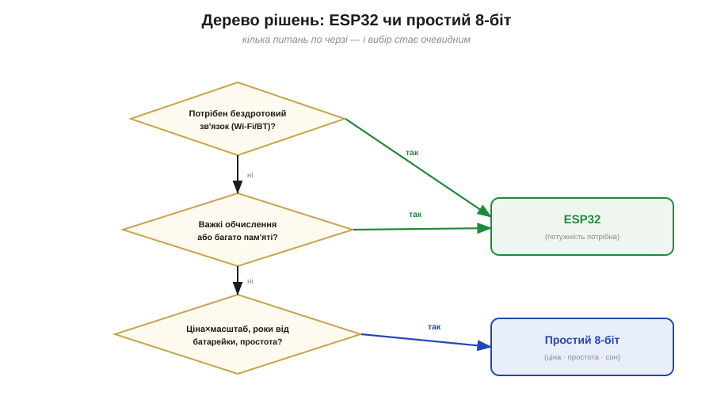
*Рис. 4.1.6.4. Просте дерево рішень. Спитайте по черзі: чи треба **бездротовий зв'язок**? чи **важкі обчислення / багато пам'яті**? Якщо хоч на одне «так» — це по ESP32. Якщо на всі «ні», а натомість важать **ціна × масштаб**, **роки від батарейки** чи **гранична простота** — беріть **простий 8-біт**. Сумнівів немає лише там, де потрібне радіо: 8-біт його не має зовсім.*

### Чому копійки й мікроампери вирішують на масштабі

Двом аргументам на користь 8-біт — **ціні** та **ощадності** — варто дати числа, бо саме вони часто переважують усю «крутість» ESP32, коли виробів багато.

Спрацьовує проста, але немилосердна арифметика **масштабу**. На одному пристрої зайвий долар-два на чипі — дрібниця, її й не помітиш. Та коли виробів **мільйон**, ця дрібниця стає **мільйонами** — статтею, заради якої інженери б'ються за кожен цент специфікації. Те саме з енергією: зайвий мікроампер на одному автономному давачі непомітний, а на тисячах таких давачів у полі він обертається на купи передчасно розряджених батарейок і виїздів на заміну. Тому те, що в одиничному аматорському проєкті — «байдуже», у серійному виробі стає **головним** аргументом. Великий тираж та автономність — це саме той контекст, де простий, дешевий і ощадний 8-біт упевнено бере гору, щойно радіо й сила ESP32 виявляються зайвими.

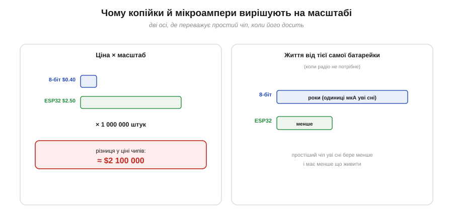
*Рис. 4.1.6.5. Дві осі, де переважує простий чіп. **Ціна × масштаб:** різниця у пару доларів на штуці, помножена на мільйон виробів, — це мільйони доларів. **Споживання:** простіший чіп уві сні бере менше й має менше що живити, тож від тієї самої батарейки тягне відчутно довше. Коли радіо не потрібне, ці дві осі часто й вирішують справу.*

**Приклад (два сценарії — і протилежні відповіді).** Порівняймо ту саму «розумну річ» у двох контекстах.

```
СЦЕНАРІЙ A — метеостанція, що сама шле погоду в інтернет
  вимога: Wi-Fi (бездротовий зв'язок у мережу)
  8-біт:  ✗  радіо немає взагалі — задача неможлива
  ESP32:  ✓  Wi-Fi на борту — єдиний розумний вибір
  → ВИСНОВОК: ESP32 (тут потужність справді потрібна)

СЦЕНАРІЙ B — реєстратор температури на монетній батарейці,
             1 000 000 штук, має жити 2 роки, без зв'язку
  ціна:   8-біт ~$0.40   проти   ESP32-модуль ~$2.50
  на 1 млн штук: різниця = (2.50 − 0.40) × 1 000 000 = $2 100 000
  сон:    8-біт ~3 мкА (живити майже нічого)
          ESP32 більше + зайвий радіо-вузол, якого не треба
  → ВИСНОВОК: простий 8-біт (дешевше на $2 млн і довше живе)
```

Та сама на вигляд річ — і дві протилежні правильні відповіді. У сценарії A потужність ESP32 **необхідна** (без радіо ніяк), у сценарії B вона — **тягар**, що коштує мільйони зайвих доларів і зайвий струм. Ось чому питання «ESP32 чи 8-біт?» не має універсальної відповіді: вона завжди криється не в чипі, а в **задачі**.

Звідси й практичний рецепт: добір чипа починають **не** з каталогу ефектних чипів, а зі списку **вимог задачі** — що вона мусить уміти, скільки коштувати, як довго жити від батареї, чи виходити в мережу, в якому корпусі вміститися. Лише склавши таку мірку, прикладають до неї кандидатів і дивляться, хто проходить. Хто робить навпаки — спершу закохується в гарний чіп, а тоді підганяє під нього задачу — раз у раз або переплачує потужністю там, де її ніхто не просив, або впирається в стелю там, де поскупився. **Мірку знімають із задачі, а не з чипа.**

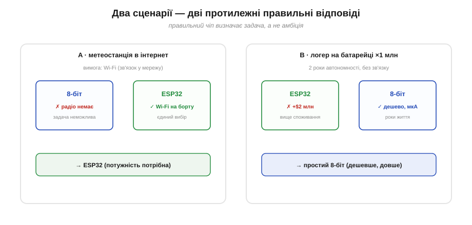
*Рис. 4.1.6.6. Той самий клас пристрою, два контексти. **A — потрібен Wi-Fi:** 8-біт безсилий, ESP32 — єдиний вибір. **B — копійчаний автономний логер мільйонним тиражем:** ESP32 коштував би на $2 млн дорожче й жив би менше, тож переможець — простий 8-біт. Правильний чіп визначає задача, а не амбіція.*

Підсумуймо чуття, яке варто винести: ESP32 — чудовий, але **не універсальний** молоток. Беріть його, коли потрібні його зв'язок, сила чи пам'ять; беріть скромний 8-біт, коли важать ціна, простота й роки від батарейки. І ще одне, що приходить лише з досвідом: страх «а раптом не вистачить потужності?» лякає сильніше, ніж заслуговує, бо **недобір** видно одразу й він легко лікується, а **перебір** тихо коштує грошей, струму й складності всю дорогу — і його ніхто не помічає. Тому свідомо обрати **менше**, ніж здається безпечним, — частіше правильно, ніж навпаки. А якщо ESP32 таки ваш вибір — лишається останнє питання цього розділу: ESP32 нині не один, а ціла **родина** (S2, S3, C3, C6…), і всередині неї теж треба вибирати з розумом. Це й розбере [наступна тема §4.1.7](mcu-esp32.md).

---

## 4.1.7 Сімейство ESP32 (S2/S3/C3/C6): що обирати

У [§4.1.6](mcu-esp32.md) ми вирішили, що для нашої задачі потрібен ESP32. Та коли доходить до купівлі, новачка чекає несподіванка: «ESP32» сьогодні — **не один чіп**, а ціла родина варіантів із загадковими суфіксами S2, S3, C3, C6 і далі. Espressif, побачивши, наскільки різні задачі люди розв'язують її чипами, наробила під різні потреби окремих **різновидів** — дешевших, потужніших, із різним набором зв'язку. Вибір **усередині** родини — це та сама логіка §4.1.6, лише на один щабель дрібніша: знову зважуємо, що важить задачі. Гарна новина: попри страшні назви, члени родини різняться лише **кількома** ясними осями, і розібратися в них — справа кількох хвилин.

І родина ця не випадкова. Espressif побачила, що її чипами розв'язують **геть різні** задачі — від копійчаного вимикача до камери з розпізнаванням — і зробила під кожен ринок свій варіант: один гранично дешевий, інший потужніший із прискоренням обчислень, третій заточений під новітні протоколи розумного дому. Тобто варіанти — це та сама «мірка від задачі» з §4.1.6, лише втілена наперед самим виробником: він уже нарізав родину під типові потреби, а вам лишається тільки впізнати серед них **свою**.

### Не один чіп, а родина

Почнімо зі знайомства. Корінь родини — **оригінальний ESP32** (2016), той самий, що ми розбирали: два ядра Xtensa, Wi-Fi і Bluetooth (класичний та BLE). Від нього Espressif відгалузила різновиди, кожен зі своїм характером.

Назви спершу збивають із пантелику — S2, S3, C3, C6, ще й WROOM із WROVER на додачу, — але за цією абеткою ховається проста система: **літера** натякає на характер чипа (S — потужніший, на Xtensa; C — дешевший і новіший, на RISC-V), а **цифра** — на покоління всередині лінійки. Розгадавши цей шифр один раз, ви читатимете назви легко й без таблиці під рукою.

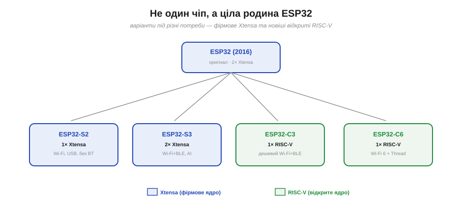
*Рис. 4.1.7.1. Родина одним поглядом. Корінь — оригінальний **ESP32** (2× Xtensa, Wi-Fi+Bluetooth). Від нього — гілки: **S2** (один Xtensa, Wi-Fi+USB, без BT), **S3** (два Xtensa, +AI-прискорення, для камер і звуку), **C3** і **C6** на **відкритому ядрі RISC-V** (дешеві сучасні, причому C6 несе ще й Wi-Fi 6 і Thread). Колір розрізняє фірмове ядро Xtensa й відкрите RISC-V.*

### По яких осях вони різняться

Щоб не загубитися серед суфіксів, треба знати, **на що взагалі дивитися**. А осей, по яких члени родини відрізняються одна від одної, лише кілька:

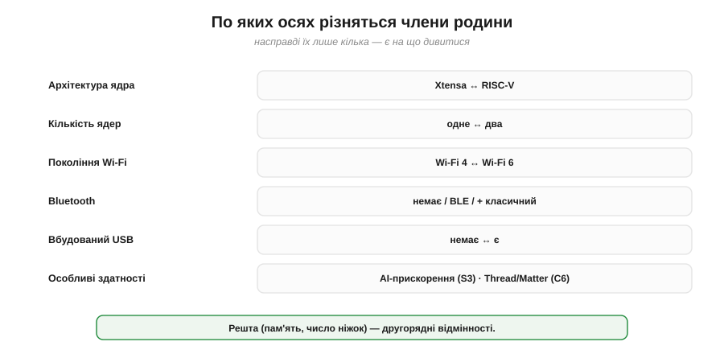
*Рис. 4.1.7.2. Дивитися треба лише на кілька речей: **архітектура ядра** (фірмове Xtensa чи відкрите RISC-V), **кількість ядер** (одне чи два), **покоління Wi-Fi** (4 чи 6), наявність і тип **Bluetooth**, наявність **вбудованого USB** і **особливі здатності** (AI-прискорення в S3, Thread/Matter у C6). Решта (пам'ять, ніжки) — другорядні відмінності.*

Розгляньмо два найважливіші з цих вододілів окремо — архітектуру ядра й набір зв'язку, бо саме вони найчастіше вирішують вибір.

### Великий зсув: від Xtensa до відкритого RISC-V

Перша глибока відмінність — у самому **ядрі**. Оригінальний ESP32 та серія S (S2, S3) збудовані на ядрі **Xtensa** — це фірмова, ліцензована архітектура. А новіша серія C (C3, C6) перейшла на **RISC-V** — **відкриту** архітектуру набору команд, яку може використовувати будь-хто без ліцензійних відрахувань.

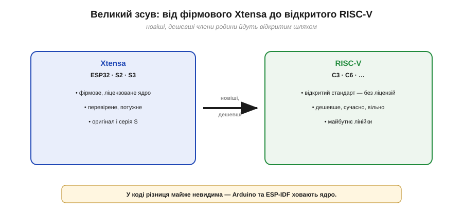
*Рис. 4.1.7.3. Дві «школи» ядер у родині. Ліворуч — **Xtensa** (ESP32, S2, S3): перевірене фірмове ядро, ліцензоване в стороннього розробника. Праворуч — **RISC-V** (C3, C6…): відкритий стандарт без ліцензійних відрахувань, що дає змогу робити чипи **дешевшими** й вільнішими. Новіші, ощадливіші члени родини йдуть саме цим, відкритим шляхом.*

> 🔧 **Навіщо це.** У повсякденній роботі вам **майже байдуже**, яке ядро всередині: і Arduino, і ESP-IDF ховають цю різницю, тож той самий код переважно збирається під обидва. Але знати про зсув корисно: серія C на RISC-V — це **дешевий сучасний** напрям родини, і саме звідти Espressif черпає найдоступніші чипи для простих задач. Коли побачите в назві «C» — думайте «недорогий, новий, RISC-V».

Чи варто цим перейматися на практиці? Майже ні — і це найкраща новина. Який саме набір команд у ядрі, ховають від вас і Arduino, і ESP-IDF: ви пишете звичний код, а інструментарій сам збирає його під потрібну архітектуру. Тому перехід Espressif на RISC-V — це переважно **внутрішня** зміна, що стосується вас хіба що ціною: чипи серії C виходять дешевшими й сучаснішими. Запам'ятати варто одне правило-підказку: суфікс **«C» у назві означає «дешевий, новий, на RISC-V»**, а серія **S** і оригінал — потужніше, на Xtensa.

> 📜 **Чому ціла галузь іде на RISC-V.** Зсув Espressif — частина великої міграції виробників від ліцензованих ядер до відкритої архітектури. Що таке «податок на ARM», чому копійки на чип вирішують на мільярдних тиражах і чим за свободу доводиться платити — в історичній вставці [Чому виробники МК мігрують на RISC-V](hist-riscv.md).

### Хто що вміє по зв'язку

Друга — і часто найважливіша на практиці — вісь це **набір бездротового зв'язку**. Тут члени родини помітно різняться, і саме це нерідко й вирішує вибір.

Власне, ця вісь часто й розрубує вузол одним махом. Потрібен **класичний** Bluetooth (скажімо, для бездротового аудіо старого зразка) — і коло миттєво звужується до **оригінального ESP32**, єдиного, хто його має. Потрібен **802.15.4** для Matter чи Zigbee — лишається тільки **C6**. Не треба Bluetooth узагалі, зате кортить USB і дешевизни — дивіться на **S2**. Тому, перш ніж порівнювати ядра й кілобайти, спитайте найперше: **який зв'язок вимагає задача?** — і половина варіантів часто відпадає сама собою.


*Рис. 4.1.7.4. Зв'язок по членах родини. Оригінальний ESP32 — єдиний із **класичним** Bluetooth. Більшість новіших мають Wi-Fi 4 та BLE, а S2 — лише Wi-Fi (без BT зовсім). Особняком стоїть **C6**: він несе сучасніший **Wi-Fi 6** і додає **802.15.4** — основу для Thread, Zigbee й Matter, протоколів «розумного дому». Потрібен конкретний зв'язок — і вибір часто звужується до одного-двох чипів.*

### Хто на що заточений

Зведімо характери членів родини докупи — цю табличку зручно тримати під рукою при доборі:

| Чіп | Ядро | Зв'язок | USB | Чим вирізняється |
|---|---|---|---|---|
| **ESP32** (оригінал) | 2× Xtensa | Wi-Fi 4 + BT класичний + BLE | немає | універсал, **найбільше прикладів і підтримки** |
| **ESP32-S2** | 1× Xtensa | Wi-Fi 4 (без BT) | є | дешевий, вбудований USB, без Bluetooth |
| **ESP32-S3** | 2× Xtensa | Wi-Fi 4 + BLE | є | **AI-прискорення**, більше RAM — камери, звук, ML |
| **ESP32-C3** | 1× RISC-V | Wi-Fi 4 + BLE | є | **дешевий сучасний**, проста заміна базовому |
| **ESP32-C6** | 1× RISC-V | Wi-Fi 6 + BLE + 802.15.4 | є | **Thread/Zigbee/Matter** — розумний дім |

Коротко про кожного. **Оригінальний ESP32** лишається безпрограшним «робочим конем»: дешевий, з двома ядрами, єдиний із класичним Bluetooth і — найцінніше для новачка — з **горою готових прикладів** та найбільшою спільнотою (пряме відлуння його історії з §4.1.5). **S2** — скромний і дешевий, з USB, але без Bluetooth. **S3** — «силач» родини: два ядра, спеціальні **AI-інструкції** й більше пам'яті, тож саме його беруть під камери, обробку звуку й легке машинне навчання. **C3** — дешевий сучасний мінімум (Wi-Fi + BLE на RISC-V), чудовий для простих під'єднаних дрібниць. **C6** дивиться в майбутнє розумного дому: Wi-Fi 6 і підтримка Thread/Zigbee/Matter.

А родина на цих п'ятьох не закінчується: є ще дешевший за C3 варіант для зовсім простих задач, чип лише з 802.15.4 (геть **без** Wi-Fi) для суто-Zigbee/Thread пристроїв, і навіть потужний застосунковий чип **без жодного радіо** — для важких обчислень, де зв'язок не потрібен. Усіх запам'ятовувати ні до чого; досить тримати в голові **кістяк** — оригінал, серію S (потужність) і серію C (дешевизна + новий зв'язок), — а екзотику дивитися за потреби.

### Що спільне для всієї родини

Перш ніж лякатися розмаїття, заспокоймося головним: **уся родина — це той самий ESP32 за духом**, і спільного в них куди більше, ніж відмінного. У кожного — та сама анатомія з [§4.1.2](mcu-esp32.md) (ядро, пам'ять, периферія, регістри), той самий підхід memory-mapped IO з [§4.1.3](mcu-esp32.md), ті самі режими сну з [§4.1.4](mcu-esp32.md). А найважливіше для практика: усі вони програмуються **тим самим інструментарієм** — і Arduino, і ESP-IDF підтримують усю родину, тож ваш код переважно **переноситься** з чипа на чіп майже без змін.

Це знімає головний страх новачка перед вибором. Обрати «не той» варіант — рідко катастрофа: здебільшого досить **перезібрати** проєкт під інший чіп, а не переписувати його. Тобто ви вчите **мікроконтролер ESP32 загалом**, а конкретний суфікс — лише деталь, яку легко поміняти, коли задача проясниться. Тому й не варто впадати в параліч вибору на самому початку: візьміть розумне «за замовчуванням» і рушайте.

### Чіп, модуль, плата — знову

І остання, дуже практична засторога, що перегукується з [§4.1.5](mcu-esp32.md). Купуєте ви, як правило, **не голий чіп**, а **модуль** (з відомих імен — WROOM, WROVER, MINI) чи готову **плату** на його основі. А модуль додає до чипа свої важливі властивості: **скільки на ньому флеш-пам'яті**, чи є додаткова **PSRAM**, яка антена. Той самий чіп S3 у модулі з 2 МБ флеш і без PSRAM — і в модулі з 16 МБ флеш та 8 МБ PSRAM — це, по суті, **різні можливості** під вашу задачу.

Тому, обравши **чіп** (скажімо, S3 під камеру), не забудьте дочитати специфікацію до кінця й вибрати **модуль** із достатньою пам'яттю. Вибір усередині родини — це завжди два кроки: спершу чіп (за архітектурою й зв'язком), потім модуль на ньому (за пам'яттю й корпусом).

### Що обирати: короткий порадник

Зведімо все до простих відповідностей «потреба → чіп»:

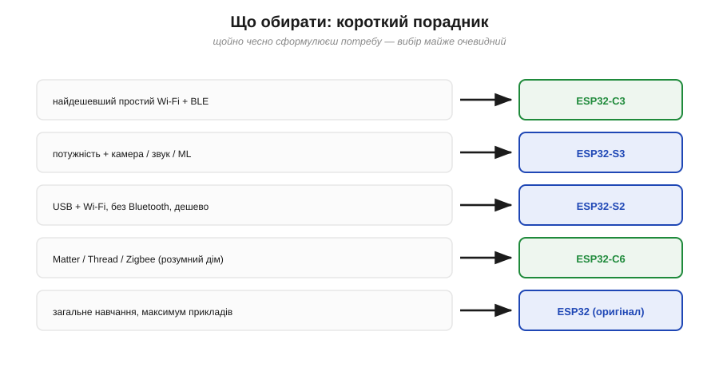
*Рис. 4.1.7.5. Швидкий порадник. **Найдешевший простий Wi-Fi+BLE** → C3. **Потужність, камера, звук, ML** → S3. **USB і Wi-Fi без Bluetooth, дешево** → S2. **Matter / Thread / Zigbee** → C6. **Загальне навчання й максимум прикладів** → оригінальний ESP32. У більшості випадків вибір очевидний, щойно ви чесно сформулюєте, що задачі справді потрібно.*

> 🔧 **Навіщо це.** Для **навчання** й більшості перших проєктів сміливо беріть **оригінальний ESP32** або **C3**: вони дешеві, добре підтримані, і на них є відповідь чи не на будь-яке питання. До спеціальних чипів (S3 під камеру, C6 під розумний дім) переходьте, коли задача **конкретно** того вимагає. Не женіться за найновішим суфіксом «про запас» — це той самий перебір потужності з §4.1.6, лише в межах родини.

Звідси й розумна стратегія новачка: **починай із типового, ускладнюй за потреби**. Зберіть і налагодьте задум на звичному ESP32 чи C3 — швидко, дешево, з горою прикладів напохваті, — і лише коли впретеся в **конкретну** стіну (забракне пам'яті під камеру, знадобиться Thread), переходьте на спеціальний чіп. Так ви не платите за можливості наперед і не вгадуєте потреб, яких ще навіть не маєте.

### Порахуймо: добір під проєкт

Застосуймо все на конкретних задачах — той самий метод «мірка від задачі», що й у §4.1.6, тільки тепер обираємо всередині родини.

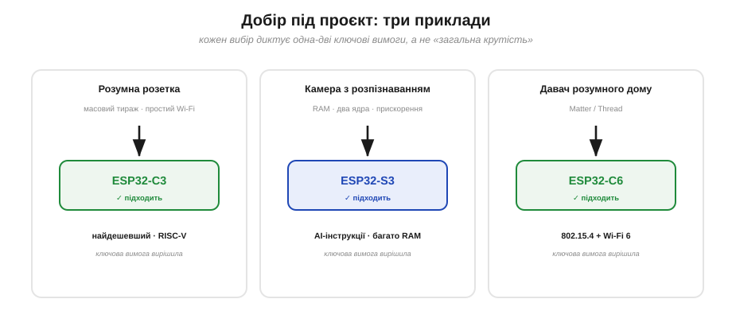
*Рис. 4.1.7.6. Три задачі — три відповіді. **Розумна розетка** масовим тиражем (простий Wi-Fi, кожен цент важить) → **C3**, найдешевший. **Камера з розпізнаванням** (потрібні RAM, два ядра, прискорення) → **S3**. **Давач для розумного дому** на Matter/Thread → **C6** з його 802.15.4. Кожен вибір диктує одна-дві ключові вимоги.*

```
ПРОЄКТ 1 — розумна розетка, масовий тираж
  вирішальне: проста справа + ціна × мільйони
  → ESP32-C3  (найдешевший сучасний Wi-Fi+BLE, RISC-V)

ПРОЄКТ 2 — камера з розпізнаванням на пристрої
  вирішальне: пам'ять, два ядра, прискорення обчислень
  → ESP32-S3  (AI-інструкції, більше RAM)

ПРОЄКТ 3 — давач для розумного дому (Matter/Thread)
  вирішальне: протокол 802.15.4
  → ESP32-C6  (єдиний із 802.15.4 + Wi-Fi 6)
```

Зверніть увагу: у кожному випадку вибір диктувала **одна-дві ключові вимоги**, а не «загальна крутість». Саме так і працює добір усередині родини — знаходиш ту вимогу, що звужує коло, і вона майже сама вказує на чіп. А якщо жодна вимога не звужує коло до одного чипа — це **гарна новина**, а не проблема: бери найдешевший і найкраще підтриманий з тих, що проходять (часто це оригінальний ESP32 або C3), і спокійно працюй. Як ми вже знаємо з §4.1.6, невикористаний «запас» оплачувати не варто, а зайвий клопіт із рідкісним чипом — то вже борг, який нічим не окупиться.

---

## 4.1.8 Причини reset: power-on, brownout, watchdog, вихід із deep-sleep

Щойно чіп заробив, його програма почалася **з початку** — з тієї самої першої інструкції, що й завжди. Лічильник команд стрибнув на вектор скидання, регістри впали в стан за умовчанням, змінні втратили старі значення, і `setup()` побіг наново. Це сталося не само собою: **щось** його викликало. Найочевидніша відповідь — «я ввімкнув живлення». Але придивімося уважніше: пристрій, що вже спокійно працював, теж раптом може стартувати з нуля. І причин у цього багато — ще й здебільшого таких, що сигналять про халепу: напруга на мить просіла, програма зависла й її довелося перезавантажити силоміць, або вона сама свідомо пішла спати, а потім прокинулась.

Хороша новина в тому, що чіп **запам'ятовує**, чому востаннє скинувся, — і лишає цей запис там, де прошивка прочитає його на самому старті. Це одне з найпрактичніших діагностичних знарядь у вбудованій розробці. Воно відрізняє безпорадне «мій пристрій сам перезавантажується, і я не розумію чому» від упевненого «лог каже brownout щоразу, коли вмикається помпа, — отже, винне живлення». У цій темі розберемо всі типові причини скидання, навчимося їх розрізняти й видобувати з цього користь.

### Що таке скидання і чому причин багато

Нагадаємо з §4.1.3 і з розмови про завантаження: **скидання (reset)** повертає чіп у відомий початковий стан. Лічильник команд (*program counter*, PC) стрибає на сталу адресу — **вектор скидання (reset vector)**, — звідки починається код; периферійні регістри набувають значень за умовчанням; уся звичайна оперативна пам'ять вважається «сміттям». Це не те саме, що вимкнути живлення: під час скидання чіп лишається під напругою, просто його логіку примусово ставлять на старт. По суті reset — це «почати життя наново, не вмираючи».

Корисно одразу провести межу: що скидання **стирає**, а що — **ні**. Зникає вміст звичайної SRAM — а отже, всі глобальні й локальні змінні, купа, стеки задач — і налаштування периферії, що повертаються до значень за умовчанням. А **переживають** скидання речі, які лежать поза цією зоною: код і незмінні дані у Flash, вміст пам'яті RTC-домену (за умов, про які скажемо нижче) і, звісно, сам **регістр причини**. Тому надійний спосіб щось пронести крізь reset — покласти це туди, що не стирається, а не в звичайну змінну, яка випарується разом з усією SRAM.

Найважливіше, що тут варто вкласти в голову, показує Рис. 4.1.8.1: до одного **входу скидання** ведуть **кілька джерел**. Натиснули кнопку, просіла напруга, спрацював сторож, програма сама себе перезапустила, чіп прокинувся зі сну — усе це різні події, але **результат однаковий**: ядро рестартує з вектора скидання. А щоб після рестарту можна було дізнатися, котре саме джерело спрацювало, чіп тримає окремий **регістр причини (reset reason)** — крихітну засувку, яка переживає сам reset.

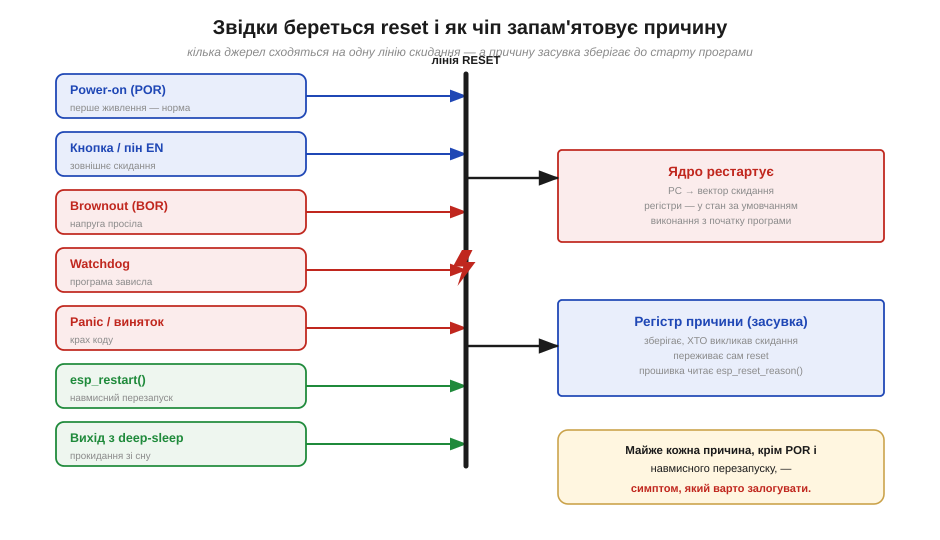
*Рис. 4.1.8.1. Анатомія скидання. Зліва — джерела (синім — нормальні, червоним — симптоми біди, зеленим — навмисні); усі сходяться на спільну лінію RESET. Праворуч — два наслідки: ядро стартує з вектора скидання, а причина лишається в засувці, яку прочитає `esp_reset_reason()`. Висновок: майже все, крім увімкнення живлення й свідомого перезапуску, варто залогувати.*

Пройдімо джерелами по черзі — від найбуденнішого до найпідступнішого.

### Power-on reset (POR): нормальний старт

Коли на чіп уперше подають живлення, напруга на ньому не зринає миттєво до 3.3 В — вона **наростає** за якісь мікросекунди-мілісекунди, поки заряджаються конденсатори на платі. І в цей перехідний момент чіп **не має права** виконувати код: при напрузі, нижчій за робочу, транзистори перемикаються ненадійно, рівні «нуля» й «одиниці» розпливаються, а Flash іще не читається коректно. Запусти ядро зарано — і воно почне виконувати не інструкції, а хаос.

Саме тому всередині є схема **power-on reset (POR)**: вона стежить, як Vdd перетинає поріг надійної роботи, і **тримає** чіп у скиданні, доки живлення не стане певним, та ще й додає коротку затримку, щоб устиг стабілізуватися такт (Рис. 4.1.8.2). Лише тоді reset відпускають — і програма стартує. POR — це **очікувана** причина: так і має бути щоразу, коли пристрій вмикають із цілковито знеструмленого стану.


*Рис. 4.1.8.2. Power-on reset у часі. Поки напруга нижча за поріг (червона зона — логіка невизначена, Flash не читається), лінія RESET утримується в активному стані. Коли Vdd стала і минула затримка на стабілізацію такту — reset відпускають, і саме тут починає виконуватися програма. Висновок: затримка старту не баг, а захист від запуску в невизначеному стані.*

Варто розуміти й **межу** POR. Він стереже лише **наростання** напруги на старті; що буде з Vdd **далі** — уже не його клопіт. Якщо живлення підніметься, POR відпустить reset, а тоді напруга просяде — бо ввімкнулося потужне навантаження чи бракує струму, — цього POR уже не помітить. На сторожі такого випадку стоїть інша схема, до якої ми й переходимо.

### Brownout (BOR): підступний сусід POR

А тепер найцікавіше. Що, як напруга просідає **не на старті, а посеред роботи**? Радіо ESP32 під час передачі вихоплює з живлення короткий, але потужний кидок струму — сотні міліампер; смикнувся мотор, сів акумулятор, виявився надто тонкий USB-кабель чи кепський блок живлення — і Vdd на мить провалюється. Якщо вона впаде нижче робочого порога, але не до нуля, чіп опиняється в **найгіршій із можливих зон**: він іще «живий», ще намагається виконувати код, але робить це вже ненадійно. Це загрожує не просто збоєм — спотворені записи можуть пошкодити дані у Flash чи лишити периферію в безглуздому стані.

Щоб цього не сталося, є **детектор просідання — brownout reset (BOR)**. Він **безперервно** порівнює Vdd з порогом і, щойно вона провалюється нижче, **примусово й чисто** скидає чіп (Рис. 4.1.8.3). Логіка тут проста й сувора: **контрольоване скидання краще за неконтрольовану дурницю**. Хай краще пристрій чесно перезавантажиться, ніж тишком зіпсує дані й піде працювати «якось не так». Дрібний провал, що лишився вище порога, BOR пропускає — система його переживе; а глибокий — обриває негайно.


*Рис. 4.1.8.3. Brownout під час роботи. Перший провал (сплеск радіо чи пуск мотора) сягає нижче порога BOR → детектор б'є скидання. Другий, дрібніший, лишається вище порога → система працює далі. Висновок: BOR жертвує одним перезапуском, щоб урятувати стан і Flash від запису сміттям.*

> 🔧 **Навіщо це.** Brownout — найчастіша причина «чіп поводиться як проклятий»: пристрій на столі від USB працює, а в полі від акумулятора чи слабкого блока перезавантажується саме в мить, коли вмикає радіо. Знаючи це, інженер не шукає міфічний баг у коді, а дивиться на живлення: товщий кабель, конденсатор побільше біля чипа, окрема лінія для сильнострумних споживачів. Сам факт «причина = BROWNOUT» економить години.

> 🔌 **Глибше — компонентна вставка.** Як саме влаштований супервізор живлення й детектор brownout, чому МК «дивно глючить» на просілій напрузі та що ставлять на платі, щоб цьому зарадити, — у вставці [Супервізор живлення і brownout-детектор](comp-brownout.md).

### Watchdog: страховка від зависання

Буває й геть інша біда: живлення в нормі, але **програма зависла**. Потрапила в нескінченний цикл, заклинила в очікуванні події, що ніколи не настане, або наштовхнулася на дефект, який спинив виконання. Завислий код не здатен полагодити сам себе — нікому віддати команду, нема кому помітити проблему. Потрібен сторож **ззовні самої програми**.

Цю роль грає **сторожовий таймер (watchdog)** — апаратний лічильник, який невпинно рахує вгору. Прошивка мусить періодично його **скидати** — у жаргоні «годувати» (*feed*, *kick*). Поки програма здорова й проходить свій цикл, вона годує сторожа вчасно, і той ніколи не доходить до межі. А от якщо програма зависла й годувати перестала — лічильник доповзає до межі та **перезавантажує чіп** (Рис. 4.1.8.4). Це остання лінія оборони: навіть коли все інше відмовило, watchdog поверне пристрій до життя. Тут ми лише знайомимося зі сторожем як із **причиною** скидання; його механіку — як годувати правильно, як зловити зависання окремих задач — докладно розберемо в Розділі 4.6.

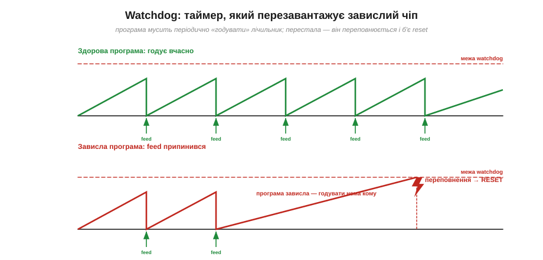
*Рис. 4.1.8.4. Дві долі сторожового таймера. Угорі — здорова програма: регулярні «feed» скидають лічильник, він не сягає межі. Внизу — програма зависла після кількох годувань: лічильник безперешкодно доповзає до межі й б'є RESET. Висновок: watchdog ловить саме той клас відмов, із яким код не впорається сам.*

На ESP32 сторожів насправді кілька, і прошивка розрізняє їх у причині скидання: **task watchdog** спрацьовує, коли якась задача надто довго не віддає процесор, а **interrupt watchdog** — коли надовго застрягли в обробнику переривання чи в критичній секції із вимкненими перериваннями. Обидва кажуть про одне: щось у коді заклинило й не відпускає процесор.

### Навмисний перезапуск: програма сама себе

Не кожне скидання — лихо. Часто прошивка перезавантажує себе **свідомо**, викликом на кшталт `esp_restart()`. Так роблять після оновлення прошивки «по повітрю» (щоб запуститися вже з нового образу), після зміни критичних налаштувань, за командою «перезавантажити» з інтерфейсу або коли код сам вирішив, що чистий старт — найпростіший вихід зі скрутного стану. Це **очікувана** причина: бачимо її в логах — і знаємо, що так і було задумано, а не зламалося.

### Зовнішнє скидання: пін EN

Нарешті, чіп можна скинути **ззовні** — притиснувши до землі спеціальний пін (на ESP32 він зветься **EN**, від *enable*). Це роблять руками — кнопкою скидання на платі; автоматично — зовнішньою мікросхемою-супервізором, що смикає EN на просіданні живлення чи за сигналом; або через відлагоджувач під час розробки. Для самого чипа це найпростіше з усіх скидань: зовнішній сигнал просто тримає його в стані старту, доки активний, а щойно відпустить — чіп піде з вектора скидання, як і завжди.

### Вихід із deep-sleep: «старт», а не «продовжити»

І остання, особлива причина — та, що збиває з пантелику новачків. Згадаймо глибокий сон із §4.1.4 і §4.1.5: у режимі **deep-sleep** ESP32 майже знеструмлений — ядра вимкнені, звичайна SRAM втрачає вміст, живим лишається тільки крихітний **RTC-домен**. Тому **прокидання з глибокого сну — це по суті скидання**: програма починається не з того місця, де заснула, а **знову з початку**, з вектора скидання (Рис. 4.1.8.5). Хто чекав, що код «продовжиться з рядка після виклику сну», щиро дивується.

Щоб із цим можна було жити, чіп **відрізняє** пробудження зі сну від свіжого ввімкнення живлення: причина скидання так і називається — «вихід із deep-sleep». Прочитавши її на старті, прошивка не марнує час на повну ініціалізацію (мережа, калібрування, привітання) — а одразу відновлює потрібний контекст із пам'яті RTC-домену, що пережила сон, і працює далі. Що саме й як там зберігати між пробудженнями — тема Розділу 4.13; нам поки досить знати, що **deep-sleep = перезапуск**, і програму треба писати з цією думкою.


*Рис. 4.1.8.5. Два шляхи до `setup()`. Ліворуч — холодний старт (причина POWERON): RAM порожня, повна ініціалізація. Праворуч — прокидання зі сну (причина DEEPSLEEP): та сама точка входу, але жива пам'ять RTC-домену дає змогу пропустити важку ініціалізацію й відновити контекст. Висновок: код мусить уміти обидва сценарії, бо точка входу в них одна.*

Тут проступає чітка межа між двома режимами сну з §4.1.4. **Легкий сон (light-sleep)** зберігає живлення SRAM і стан ядра, тому з нього програма **продовжується** — рядок після виклику сну виконається, наче й не спали. **Глибокий сон (deep-sleep)** жертвує цим заради мікроамперів, і ціна жертви — саме перезапуск. Тож вибір між ними не лише про економію струму, а й про те, чи готова твоя програма починатися спочатку щоразу, як прокинеться.

### Як прошивка читає причину

Усі ці джерела зводяться до одного практичного питання: **як код дізнається, чому стартував**? Відповідь — той самий **регістр причини**, засувка, що пережила скидання. У середовищі ESP32 його зчитує один виклик — `esp_reset_reason()`, — який повертає значення з переліку (*enum*): `ESP_RST_POWERON`, `ESP_RST_BROWNOUT`, `ESP_RST_TASK_WDT`, `ESP_RST_PANIC`, `ESP_RST_SW`, `ESP_RST_DEEPSLEEP` і кілька інших (Рис. 4.1.8.6). Прошивка викликає його **рано** — ще до основної ініціалізації — і далі гілкується: залогувати причину, полічити підозрілі перезапуски, перейти в безпечний режим, відновити контекст після сну.

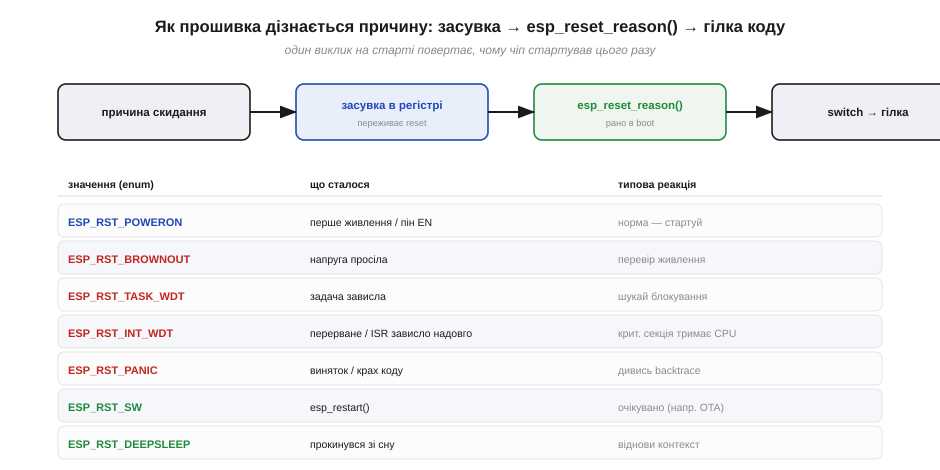
*Рис. 4.1.8.6. Від засувки до рішення. Угорі — потік: причина фіксується в регістрі (переживає reset) → `esp_reset_reason()` на старті → `switch` із гілкою на кожен випадок. Унизу — що означає кожне значення й яка типова реакція. Висновок: один виклик перетворює невидиму причину на конкретну дію.*

Окремо вирізняється `ESP_RST_PANIC` — скидання після **винятку**: звернення за хибним вказівником, ділення на нуль, переповнення стека. Перед таким перезапуском система зазвичай встигає виплюнути в лог **backtrace** — ланцюжок адрес, який інструменти розробника розгортають у назви функцій, показуючи, де саме впало. Тобто ця причина не лише називає клас біди, а й нерідко веде до конкретного рядка коду — найцінніша підказка, яку дає регістр.

Одна чесна дрібниця наостанок. На класичному ESP32 натискання кнопки скидання (пін **EN**) прошивка бачить як `ESP_RST_POWERON` — чіп не вміє відрізнити зовнішнє скидання від увімкнення живлення (окреме значення `ESP_RST_EXT` для нього не передбачене). Тож «POWERON» інколи означає не «щойно ввімкнули», а «хтось смикнув reset» — про це варто пам'ятати, коли читаєш логи.

### Навіщо це: від «привида» до діагнозу

Зберімо все докупи на типовій історії. Пристрій у полі **сам перезавантажується**, на вигляд — випадково. Без причини скидання це години здогадів: баг у коді? перегрів? космічні промені? А з нею діагностика стає прямою (Рис. 4.1.8.7): читаємо `esp_reset_reason()` — і йдемо просто до джерела. `BROWNOUT` → слабке живлення, шукай конденсатор і кабель. `TASK_WDT` → задача десь блокується. `PANIC` → справжній баг, дивись backtrace. Несподіваний `POWERON` → поганий контакт живлення чи дребезг EN. «Привид» перетворюється на конкретну несправність, яку видно й можна полагодити.

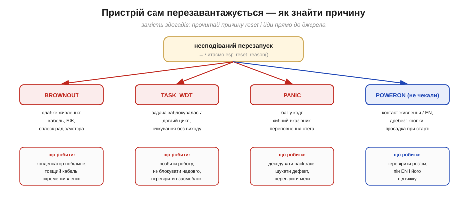
*Рис. 4.1.8.7. Триаж несподіваного перезапуску. Від кореня «читаємо причину» — чотири найчастіші гілки, кожна з типовим джерелом і конкретними діями. Висновок: причина скидання звужує пошук від «усього коду й заліза» до однієї ділянки.*

> 🔧 **Навіщо це.** Залогувати причину скидання на кожному старті — звичка, що окупається стократ. У полі, де немає ні відлагоджувача, ні очей розробника, цей єдиний рядок у логах нерідко єдине, що відрізняє «знаю, у чому річ» від «гадки не маю». Тому професійна прошивка робить це **завжди**.

**Приклад (лічильник brownout і безпечний режим).** Хай пристрій із сильнострумним навантаженням (помпа, радіо) інколи просідає по живленню. Розумна тактика: рахувати **поспіль** скидання через brownout, і якщо їх забагато — не вмикати важке навантаження, а перейти в безпечний режим і повідомити. Лічильник кладемо в пам'ять RTC-домену, що переживає скидання (на відміну від звичайної RAM — пор. §4.1.5).

```
// дуже рано в boot, ще до важкої ініціалізації
RTC_DATA_ATTR static int brownouts;      // переживає reset (RTC-домен)
esp_reset_reason_t r = esp_reset_reason();

switch (r) {
  case ESP_RST_POWERON:                   // звичайний старт від живлення
    brownouts = 0;                        // починаємо з чистого аркуша
    break;
  case ESP_RST_BROWNOUT:
    brownouts = brownouts + 1;            // рахуємо просідання поспіль
    log("brownout #%d", brownouts);
    if (brownouts >= 3)
        enter_safe_mode();                // не вмикати помпу/радіо
    break;
  case ESP_RST_TASK_WDT:
  case ESP_RST_INT_WDT:
    log("watchdog: щось зависло");        // привід шукати блокування
    break;
  case ESP_RST_DEEPSLEEP:
    restore_context();                    // прокинулись — не ініціалізуємо все наново
    break;
  default:
    log("reset reason = %d", r);          // решта — просто в лог
}
```

Тут варто помітити три речі. По-перше, гілка `POWERON` **обнуляє** лічильник: справжнє ввімкнення живлення означає «нова сесія, рахуємо заново». По-друге, три brownout поспіль — це вже не випадковість, а діагноз «живлення не тягне», і розумніше захиститися, ніж уперто перезавантажуватися по колу. По-третє, гілка `DEEPSLEEP` свідомо **пропускає** повну ініціалізацію — інакше кожне пробудження коштувало б зайвих витрат і часу. Усе це — лише завдяки одному значенню, яке чіп зберіг для нас крізь скидання.

---

На цьому **Розділ 4.1 завершено**. Ми пройшли весь шлях: від питання «що таке мікроконтролер і чим він відрізняється від процесора» — через його складові (ядро, дві пам'яті, периферію), **регістри** як стик коду із залізом, **такт**, що задає ритм, **живлення зі сном**, що дарує місяці автономності, і нарешті — **причини скидання**, з яких прошивка читає власну історію й розуміє, чому щойно стартувала. Усе це ми звели на конкретний ESP32: його два ядра, радіо, багату периферію, історію підкорення аматорів, тверезий вибір між ним і простим 8-біт та добір усередині самої родини. По дорозі ми навчилися читати будь-який мікроконтролер як **знайому анатомію**, а будь-який даташит — як список складових, звірений із потребами задачі.

Тепер ми знаємо, **що** це за крихта, **чому** вона так влаштована й **яку саме** взяти. Лишилося найголовніше практичне питання, з якого почнеться наступний розділ: **як** наш код із тексту на екрані перетворюється на прошивку, що оживляє цей чіп? Адже досі ми писали `reg |= (1<<n)` й `OUT |= ...`, ніби за помахом чарівної палички, — а час побачити, що ж насправді коїться між «натиснув Compile» і «чіп ожив».

> ▶️ Далі: [Розділ 4.2 — Тулчейн: як код стає прошивкою](../toolchain/toolchain.md)
