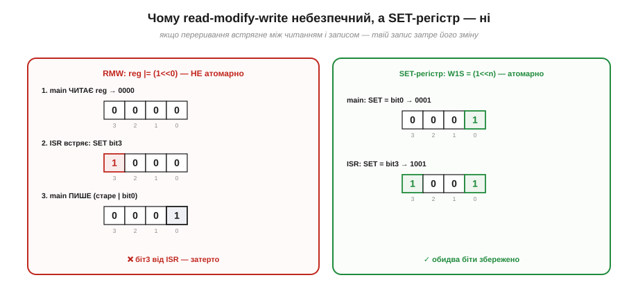
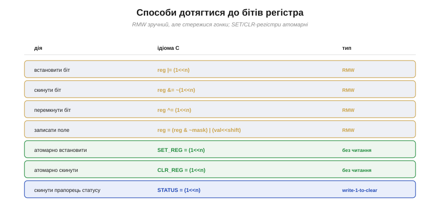

# ⚙️ Доступ до регістрів: read-modify-write, set/clear, бітові поля

> Алгоритмічна вставка до **теми [§4.1.3 «Регістри периферії»](mcu-esp32.md)**. Там ми навчилися чіпати окремі біти масками. Тут — як робити це **безпечно**: чому звичний `|=` інколи зраджує і які є надійніші способи.

## Задача

Треба змінити **один-два біти** в регістрі периферії, не зачепивши решту (вони керують іншими речами). Здавалося б, маска з §4.1.3 усе вирішує. Та є підступ: класична ідіома `reg |= (1<<n)` — це насправді **три** окремі дії, і між ними може щось статися.

## Ідея: read-modify-write і чому він ламається

`reg |= mask` розгортається в **read-modify-write (RMW)**: прочитати регістр, змінити біти, записати назад. Поки виконання лінійне — усе гаразд. Але якщо між «прочитати» і «записати» встряне **переривання** й теж змінить цей регістр, наш запис, зроблений на основі **застарілого** прочитаного значення, **затре** його зміну (Рис. 4.1.3a.1).


*Рис. 4.1.3a.1. Зліва — RMW: main читає 0000, тим часом ISR ставить біт3 (1000), а main записує старе-АБО-біт0 (0001) і **затирає** біт3. Справа — атомарний SET-регістр: і main, і ISR роблять по одному неподільному запису, обидва біти лишаються.*

Рятунок дає **залізо**: у багатьох МК поряд зі звичайним регістром є окремі **SET- і CLR-регістри** (write-1-to-set / write-1-to-clear). Запис у них — **одна неподільна дія** без читання: пишеш `SET_REG = (1<<n)` — і саме біт n стає 1, решта недоторкані. Гонки немає, бо немає кроку «прочитати старе».

## Псевдокод: набір способів

```
// RMW (зручно, але не атомарно):
reg |=  (1u << n);                  // встановити біт
reg &= ~(1u << n);                  // скинути біт
reg ^=  (1u << n);                  // перемкнути біт
reg = (reg & ~mask) | (val<<shift); // записати поле з кількох бітів

// Атомарно (одним записом, без читання):
SET_REG = (1u << n);                // встановити
CLR_REG = (1u << n);                // скинути
```

Коли який спосіб доречний — підсумовано на картці (Рис. 4.1.3a.2).


*Рис. 4.1.3a.2. Картка способів. Жовте — RMW (читання+запис, стережися гонки). Зелене — атомарні SET/CLR (один запис). Синє — скидання прапорця статусу записом одиниці (write-1-to-clear).*

## Складність і пастки на МК

- **RMW не атомарний.** Якщо той самий регістр чіпають і `main`, і перерування — RMW відкриває гонку (Рис. 4.1.3a.1). Як її закрити критичною секцією або як уникнути взагалі — у Розділі 4.5; тут головне правило: для регістрів, спільних з ISR, **бери атомарні SET/CLR**, а не `|=`.
- **Прапорці write-1-to-clear (w1c).** Багато регістрів статусу скидають біт **записом одиниці** в нього. Якщо «скидати» такий прапорець через RMW `STATUS |= flag`, читання захопить **інші** вже зведені прапорці, а зворотний запис їх **випадково скине** — загублені події. Правильно — писати лише потрібний біт: `STATUS = flag`.
- **Бітові поля C (`struct { unsigned x:1; }`)** читаються зручно, але **непереносні** (порядок бітів і пакування — на розсуд компілятора), а під капотом усе одно компілюються в RMW. Для апаратних регістрів надійніше явні маски.
- **`volatile`.** Регістр може змінитися «сам» (залізом), тож компілятору не можна кешувати його значення в C-змінній чи переставляти доступи; деталі — у §4.5.
- **Право доступу.** Бувають регістри лише для читання, лише для запису й «скидаються читанням» (clear-on-read) — звіряйся з даташитом, перш ніж робити RMW.

> ▶️ Повернутися до теми: [§4.1.3 — Регістри периферії](mcu-esp32.md)
