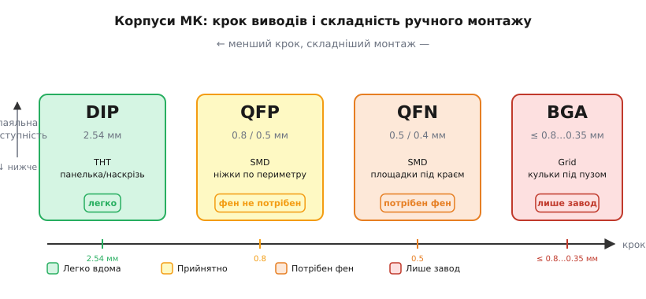
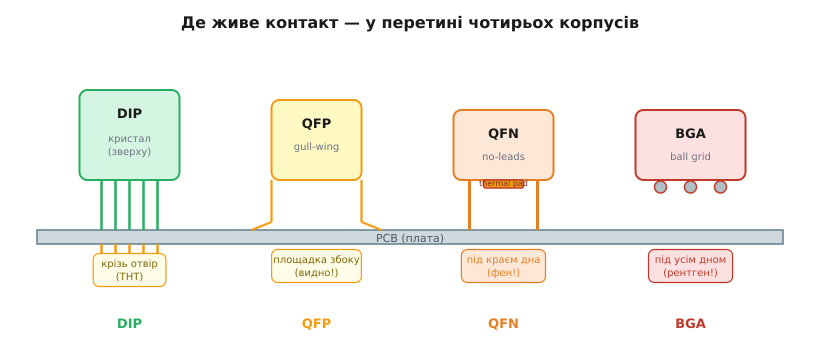

# 🔌 Корпуси МК: DIP, QFP, QFN, BGA — що реально запаяти вдома

> Компонентна вставка до **теми [§4.11.8 «Як обрати МК під проєкт»](mcu-landscape.md)**. У чеклисті вибору поряд із периферією та ціною стоїть пункт «корпус» — і він не косметичний: він вирішує, чи зможеш ти взагалі тримати цей чип у руках, паяти його на столі й купити поштучно. Тут розкладаємо чотири головні класи корпусів — від DIP, який ставиться в макетку пальцями, до BGA, кульки якого сховані під чипом і вимагають заводського обладнання.

---

## Чому корпус — це окреме питання

Кремнієвий кристал МК займає кілька мм² і прямого торкання не витримує. *Корпус* (*package*) вирішує три завдання: виводить мікроскопічні контакти кристала на ніжки зручного кроку, захищає від зовнішніх впливів і відводить тепло, визначає спосіб монтажу. Один і той самий кристал часто продають у кількох корпусах — STM32F103 буває і в LQFP-48, і в UFQFPN-36.

Головна вісь усієї вставки: **крок виводів** (*pitch*) і **де розташовані контакти** — по периметру чи під корпусом — це і є «паяльна доступність вдома». Двомовні терміни: наскрізний монтаж (*through-hole, THT*), поверхневий (*surface-mount, SMD/SMT*), крок (*pitch*), контактна площадка (*land/pad*), теплова площадка (*thermal/exposed pad*).

> 🔧 **Навіщо це.** Розробник дивиться на корпус *до* замовлення: прототип на столі потребує THT або широкого SMD, серійне виробництво допускає QFN/BGA. Ще один момент — наявність: DIP і QFP продаються поштучно всюди, BGA часто — лише котушками від 100 шт.



*Рис. 4.11.8c.1. Чотири корпуси на одній осі: крок виводів і складність ручного монтажу. Зліва направо контакти дрібнішають і ховаються — DIP (2.54 мм, у руках) → QFP (ніжки по периметру) → QFN (площадки під краєм + теплова площадка) → BGA (кульки під корпусом, лише завод).*

---

## Чотири класи — шпаргалка і деталі

```
Корпус  | Монтаж | Крок, мм      | Контакти          | Паяти вдома
--------|--------|---------------|-------------------|------------------
DIP     | THT    | 2.54 (0.1″)   | по боках, крізь   | так, без питань
QFP     | SMD    | 0.8 / 0.5     | по периметру дна  | так, зручно
QFN     | SMD    | 0.5 / 0.4     | під краєм + пуп   | можна, з феном
BGA     | SMD    | ≤0.8…0.35     | під усім дном     | ні, лише завод
```

**DIP** (*Dual In-line Package*) — крок 2.54 мм: той самий, що отвори макетної плати. Чип вставляється в *панельку* (socket) без пайки взагалі, прошивається й замінюється пальцями. Сучасних швидких або радіо-МК у DIP немає — довгі ніжки дають паразитну індуктивність, яка псує сигнал на частотах вище десятків МГц. Для порівняння: той самий AVR у DIP-28 займає ~36 × 14 мм, у QFN-28 — лише 4 × 4 мм.

**QFP** (*Quad Flat Package*) — ніжки-«крильця» (*gull-wing*) по чотирьох боках, крок 0.8/0.5 мм. Контакти видно збоку, до них дістає жало й оплітка — техніка *drag soldering* з подальшим видаленням перемичок оплітком. Саме тому більшість «дорослих» МК для аматорів (STM32-клас LQFP-48/64 — §4.11.4) живуть у QFP: багато виводів, малий слід, ще паяльно-дружні.

**QFN** (*Quad Flat No-leads*) — плоскі площадки по краю дна і велика **теплова площадка** (*exposed pad*) по центру. Контактів збоку не видно, жало не дістає, теплову площадку вручну не запаяти — потрібен фен (*hot air*), паяльна паста, флюс. Проте саме QFN обирають для радіочипів (ESP32, nRF — §4.11.6): мала індуктивність коротких контактів критична для ВЧ. ESP32 живе в QFN-40 (5 × 5 мм) — цей корпус «ховається під екраном» модуля WROOM (§4.1.2c).

**BGA** (*Ball Grid Array*) — матриця припойних кульок під *усім* дном, крок ≤0.8…0.35 мм, сотні й тисячі контактів. Жодного доступу ззовні: з'єднання утворюються тільки при загальному оплавленні в пічці. Без рентгена якість не перевірити. Для аматора BGA означає «лише завод» або «купуй готовий модуль».



*Рис. 4.11.8c.2. Де живе контакт — у перетині. DIP проходить крізь плату (паяй з будь-якого боку); QFP кладе «крильця» збоку на площадку (видно й доступно); QFN ховає площадки під краєм і додає теплову площадку під корпусом (потрібен фен); BGA тримає всі з'єднання на кульках під корпусом (видно лише на рентгені).*

---

## Як це реально запаяти (зведений «перший байт»)

**Розрахунок бюджету точності** — геометрія кроку визначає, чи дістане жало:

```
Крок     | Ширина площадки | Зазор між площ. | Реально вдома?
---------|-----------------|-----------------|------------------
2.54 мм  | ~1.5 мм         | ~1.0 мм         | так, легко
0.80 мм  | ~0.45 мм        | ~0.35 мм        | так, зручно
0.50 мм  | ~0.25 мм        | ~0.25 мм        | так, акуратно
0.40 мм  | ~0.20 мм        | ~0.20 мм        | важко, потрібен фен
≤0.35 мм | <0.18 мм        | <0.17 мм        | ні (BGA)
```

Жало 0.8 мм фізично не поміщається між площадками QFN з кроком 0.4 мм — звідси й вимога фену.

- **DIP:** панелька або наскрізні отвори, будь-який паяльник.
- **QFP:** тонке жало (≤0.5 мм), флюс, оплітка; drag-soldering + лупа 10×.
- **QFN:** фен ~350 °C, паяльна паста, трафарет; теплова площадка — обов'язково.
- **BGA:** пічка, профіль оплавлення, рентген — фактично делегувати заводу.

> 🔧 **Навіщо це.** Правило для чеклиста: *обирай найбільший корпус, що вміщає потрібні виводи*. Для прототипу на столі — THT або QFP; QFN тільки з феном; BGA уникай або бери готовий модуль.

---

## Типові граблі

- **«Куплю в DIP» — а його нема.** Швидкі й радіо-МК у THT не існують; не плануй макетку під чип, якого немає в DIP.
- **Забута теплова площадка QFN.** Не припаяв центральний pad — перегрів і дивні збої навіть при правильному живленні.
- **Крок переоцінили.** 0.4 мм QFN без фену — перемички й непропаї; це фізика, а не рівень навичок.
- **1-й вивід наосліп.** Ключ (виямка/скошений кут/крапка) є в кожному корпусі; завжди звіряй із даташитом.
- **Footprint ≠ корпус.** QFN-32 від різних виробників може мати різний land pattern; звіряй із конкретним даташитом.
- **BGA «якось зроблю».** Без пічки й рентгена — приховані непропаї; для аматора це тупик.

---

## Варіації класів

**DIP-сімейка:** PDIP (пластик), SDIP (вужчий крок між рядами), SIP (один ряд); SMD-родичі — SOIC (1.27 мм), SSOP (0.65 мм), TSSOP (0.5 мм) — ті самі «два ряди», але вже поверхнево.

**QFP-сімейка:** PQFP / LQFP («low-profile») / TQFP («thin») — різна висота, однакова логіка ніжок-крилець.

**QFN-сімейка:** QFN (4 боки), DFN (2 боки); модулі ESP-MINI ховають QFN двобічного типу (§4.1.2c).

**BGA-сімейка:** BGA → FBGA → WLCSP (кульки прямо на кристалі, чип = корпус). Напрям незмінний: дедалі густіше й дедалі далі від «паяти вдома».

Тому в чеклисті §4.11.8 пункт «корпус» читай як «де я це паятиму» — і починай вибір саме звідси, нарівні з периферією та ціною.

---

> ▶️ Повернутися до теми: [§4.11.8 — Як обрати МК під проєкт](mcu-landscape.md)
