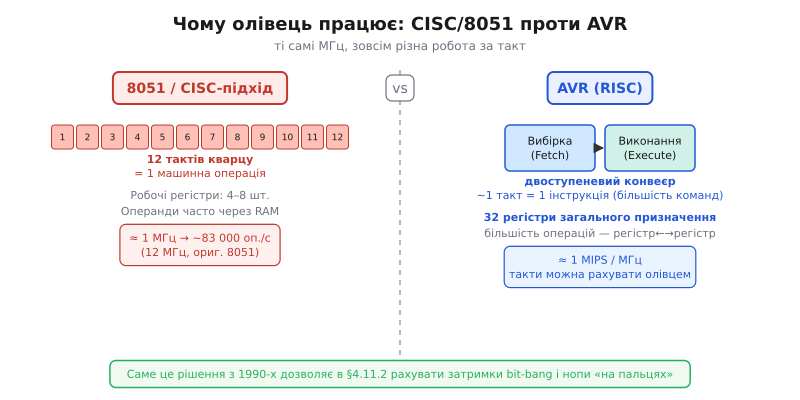
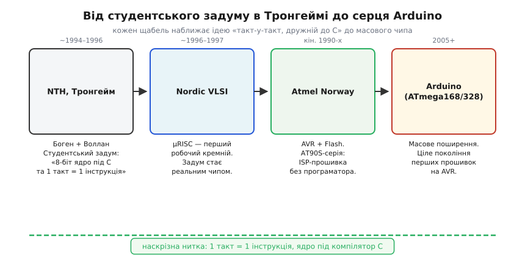

# 📜 AVR: два студенти з Тронгейма й архітектура, що почалася як студентський проєкт

> Історична вставка до **теми [§4.11.2 «8-бітна класика: AVR-клас»](mcu-landscape.md)**. У тій темі ми хвалили AVR за рідкісну серед мікроконтролерів рису: такти можна порахувати олівцем, а периферія не підкидає сюрпризів. Звідки така передбачуваність у дешевого 8-бітника? Відповідь ховається в тому, ЯК і ХТО цей чип придумав: двоє студентів у Норвегії, які проєктували ядро з нуля, відразу орієнтуючись на компілятор C і принцип «кожна інструкція — один такт». Ця вставка веде ланцюгом від студентського задуму через кремній Nordic VLSI і продукт Atmel до серця Arduino, і по дорозі пояснює, чому AVR-передбачуваність — не випадковість, а свідомо закладена властивість. Попереду також невелика детективна пауза: три літери «AVR» — звідки вони? Відповідь виявиться несподіваною.

## Тронгейм, середина 1990-х: двоє студентів і незручні 8-бітники

Щоб зрозуміти, чому AVR вийшов таким передбачуваним, почнімо з того, що дратувало його творців. Місце дії — **Norges Tekniske Høgskole (NTH)**, університет у Тронгеймі (Trondheim), Норвегія, приблизно 1994–1996 роки. Діючі особи: **Альф-Егіль Боген** (*Alf-Egil Bogen*) і **Вегард Воллан** (*Vegard Wollan*). Це суто **норвезька** інженерна історія без жодних сторонніх нашарувань — NTH (нині частина NTNU) є звичайним скандинавським технічним університетом.

Що саме їх дратувало? Панівні 8-бітні мікроконтролери тієї епохи — нащадки Intel 8051 і родина PIC — були спроєктовані під асемблер, а не під C. Про самого 8051 ми вже говорили в §4.1.6: оригінальне ядро потребувало **дванадцяти тактів кварцу** на одну машинну операцію, а набір команд з маленькою кількістю регістрів і незручною адресацією змушував компілятор C генерувати роздутий, повільний код. Програмісти або писали вручну асемблером — незручно, повільно — або мирилися з тим, що C-код займає втричі більше Flash, ніж міг би.

Боген і Воллан поставили собі центральне запитання: а що, якщо спроєктувати 8-бітне ядро з чистого аркуша так, щоб (а) компілятор C давав щільний, ефективний код, і (б) майже кожна інструкція виконувалась рівно за **один такт**? Саме з цього питання й народилася та передбачуваність, яку ми хвалимо в §4.11.2.

## Чому «такт = інструкція»: RISC-ідея, перенесена у 8 біт

Відповідь авторів була сміливою для дешевого мікроконтролера: взяти принцип RISC — знайомий нам із §3.5 у контексті архітектури процесора — і втиснути його в 8-бітний мікроконтролерний світ. Інтуїція RISC коротка: невелика кількість простих інструкцій фіксованої довжини, багато робочих регістрів, виконання через короткий конвеєр. Завдяки цьому кожна команда завершується передбачувано — і такт чесно перетворюється на зроблену роботу. На противагу CISC-підходу (де одна команда могла означати десятки внутрішніх мікрооперацій і займати непередбачувану кількість тактів), RISC зробив виконання «плоским»: те, що бачить програміст, — саме те, що робить залізо, без прихованих шарів мікрокоду.

Для AVR ключові рішення склалися так: **32 робочих регістри** загального призначення замість традиційних чотирьох-восьми; більшість арифметично-логічних команд виконуються за **один такт**; двоступеневий конвеєр вибірки й виконання дозволяє готувати наступну команду, поки виконується поточна. Прямий практичний наслідок: при тактовій частоті 8 МГц AVR виконує близько **8 мільйонів інструкцій** за секунду — ≈1 MIPS на 1 МГц. Жодної магії, просто чесна арифметика. Порівняйте з оригінальним 8051 на тій самій тактовій частоті 8 МГц: через дванадцятитактовий машинний цикл він дає менше 700 000 операцій за секунду — в одинадцять разів менше при тих самих мегагерцях кварцу.


*Рис. 4.11.2i.2. Чому олівець працює: однакові короткі інструкції + конвеєр + 32 регістри дають передбачуваний такт, тоді як у старших 8-бітників одна операція розтягувалась на кілька тактів кварцу.*

> 🔧 **Навіщо це.** Коли в §4.11.2 ви рахуєте, скільки циклів займе bit-bang протоколу або кілька `NOP`-ів у циклі затримки, ви спираєтесь саме на це рішення 1990-х: детермінований такт. На ESP32 з його глибоким конвеєром, кешами інструкцій і RTOS такий «ручний» підрахунок уже ненадійний — ESP32 робить більше, але ціною передбачуваності на рівні окремих тактів. AVR «слабший», зате «прозоріший» — і це не дефект, а свідомо закладена перевага.

Важливо при цьому бути чесними: AVR **не винайшов** ані RISC-ідею, ані однотактність. Ці принципи прийшли з великих процесорів (MIPS, SPARC), де їх відпрацьовували ще в 1980-х. Боген і Воллан вдало **перенесли** відому ідею в нішу дешевих вбудованих 8-бітників і довели її до масового чипа. Цінність — не в оригінальності концепції, а в тому, що хтось таки взяв і **зробив** — та сама теза, яку ми вже бачили в §4.1.6 про 8051.

## Архітектура «під компілятор»: чому C на AVR полетів

Однотактність — половина задуму. Друга половина — щоб цим ядром було зручно керувати з C, а не лише з асемблера. Це окремий, нерідко недооцінюваний крок, і саме він відрізняє «швидке залізо» від «заліза, на якому приємно писати».

Зв'язок між архітектурою й компілятором простий, але не завжди очевидний. Коли регістрів мало — компілятор змушений весь час перевантажувати змінні між регістрами й RAM, генеруючи зайві команди читання-запису. Кожен такий «рейс» до пам'яті — додаткові такти й роздутий код. Коли регістрів багато і набір команд «ортогональний» (тобто майже будь-яку операцію можна застосувати до будь-якого регістра) — компілятор може розкласти змінні прямо по регістрах і будувати щільний, швидкий код без зайвих завантажень. AVR із його 32-регістровим файлом і симетричним набором команд дав компілятору саме цей простір.

```c
// AVR C (avr-gcc, <avr/io.h>): встановити біт 0 порту B
PORTB |= (1 << PB0);
// Компілюється приблизно в:
// in   r24, PORTB   ; 1 такт — зчитати порт у регістр
// ori  r24, 0x01    ; 1 такт — встановити біт
// out  PORTB, r24   ; 1 такт — записати назад
// Разом: 3 такти. Порахувати олівцем — тривіально.
```

Пізніше це утвердив **avr-gcc** — вільний компілятор GCC для AVR, згадуваний нами в контексті ланцюжка інструментів у §4.2. Саме avr-gcc зробив C на AVR повноправним інструментом: студент міг писати «нормальною» мовою і не турбуватися про ручне розміщення змінних. Поріг входу впав — і саме «дружність до C» у підсумку зробила AVR улюбленцем аматорів і навчальних курсів.

## Народження кремнію: Nordic VLSI і µRISC

Задум на папері — ще не чип. Де він став залізом? У тронгеймській ASIC-фірмі **Nordic VLSI** (нині **Nordic Semiconductor**), де Боген і Воллан працювали ще студентами. Всередині компанії архітектуру назвали **µRISC (Micro RISC)**.

Тут варто бути точними щодо того, що саме підтверджують джерела. Широко поширений рядок «архітектура з дипломної роботи» описує дух справи вірно — архітектура виросла зі студентської роботи в Тронгеймі в ті роки, — але конкретний документ «ось дипломна, ось сторінка» у відкритих джерелах не зафіксовано. Правильніше говорити: **студентський задум, доведений до кремнію в тій же компанії, де обидва автори тоді й працювали**. Ця деталь, до речі, нагадує нам урок зі §4.1.6 та §4.1.0: в «красивих» зачинах техніки варто розрізняти документально підтверджений факт і барвисту ілюстрацію.

Але ключовий перехід — від скетча до кремнію — стався: µRISC перетворився на реальні транзистори на реальному кристалі. Це вже не вікенд-ескіз, а справжня виробнича робота з усіма її нюансами: таймінг, верифікація логіки, топологія кристала, корпусування, відповідність технологічним нормам фаундрі. Інженери добре знають, яка прірва лежить між «ось, я намалював блок-схему на дошці» і «ось, чип уже прийшов із виробництва і правильно відповідає на першу команду». Саме тут задум Богена і Воллана перетнув цю прірву й став інженерним фактом, а не лише інтелектуальною вправою.

## Atmel купує архітектуру: від µRISC до AVR

Маленька ASIC-фірма не зробить світовий стандарт самостійно — потрібен масштаб. Технологію **придбала Atmel**, а Боген і Воллан перейшли до **Atmel Norway** — норвезького підрозділу, заснованого, по суті, самими архітекторами для продовження розробки ядра. Перші серійні AVR з'явились у другій половині 1990-х під маркою **AT90S**.

У Atmel був вирішальний козир епохи — **Flash-пам'ять прямо на чипі**. Ми вже згадували в §4.3 (r03), як Flash змінила правила гри для зберігання прошивок. Поєднання «передбачуване RISC-ядро» + «вбудований Flash з ISP (In-System Programming)» означало, що розробник міг прошивати мікроконтролер прямо в платі, через звичайний програматор або навіть через завантажувач (bootloader), без жодного ультрафіолету й заводського обладнання.

> 🔧 **Навіщо це.** Доля архітектури вирішується не лише транзисторами, а й тим, хто дасть виробництво, Flash і інструменти. Гарне ядро без масштабу лишилось би лабораторним курйозом — як і багато хороших технічних ідей до і після. Atmel дала AVR і те, й інше.


*Рис. 4.11.2i.1. Від студентського задуму в Тронгеймі до серця Arduino: чотири щаблі, на кожному ідея «такт-у-такт, дружній до C» стає ближчою до масового чипа.*

## Загадка трьох літер: що насправді означає «AVR»

Найпоширеніша легенда: **AVR = Alf + Vegard + RISC**, перші літери імен Богена та Воллана плюс принцип архітектури. Красиво, симетрично — і здавалось би, очевидно. Чому б авторам не вписати свої ініціали в назву власного витвору?

Але **Atmel офіційно заявляла: AVR — не акронім і нічого конкретного не означає**. У відомому інтерв'ю самі Боген і Воллан ухилялися від прямої відповіді — і, за переказами, з помітним гумором. Тобто «Alf + Vegard + RISC» — це популярний **backronym**, вигаданий постфактум для краси, а не офіційне пояснення. Можливо, ці три букви взагалі обрали довільно — у мікроелектроніці назви часто народжуються саме так, зі звичного слова чи звуку, а не з акронімічної логіки.

Якщо заглянути в технічну літературу різних років, можна знайти ще й «Advanced Virtual RISC» — але це теж пізня вигадка без офіційного підґрунтя. Принцип тут ширший і знайомий нам зі §4.1.0: біля будь-якої «красивої» технічної етимології варто одразу запитати, хто й коли її задокументував. Якщо документа нема — маємо легенду, а не факт. Легенди — не брехня, вони частина культури спільноти; але знати їхній статус корисно. Розробник, що відрізняє задокументований факт від фольклору, рідше помиляється і в технічних рішеннях.

## Чому AVR полюбили: Arduino і Flash, що перепрошивається вдома

Передбачуване ядро і Flash-пам'ять зустрілися з третім інгредієнтом у 2005 році — дешевою платою, яку можна перепрошити вдома без жодного програматора з ультрафіолетовою лампою. Контраст із 8051 першого покоління — де зміна програми вимагала окремого EPROM-програматора чи взагалі заводського фотошаблону — разючий.

**Arduino** (Ivrea, Італія, 2005) поставив у центр своєї платформи саме AVR — спочатку ATmega168, потім ATmega328. Не тому що AVR найшвидший або найпотужніший. А тому що: передбачуваний у поведінці, добре задокументований, з безкоштовним avr-gcc, дешевим ISP-інтерфейсом і масою готових прикладів. Для навчального середовища і перших кроків у прошивках це поєднання виявилось ідеальним.

Тут доречно ще раз пригадати урок про 8051 із §4.1.6: **екосистема важить не менше за мегагерци**. AVR переміг не у швидкісних перегонах — він переміг завдяки тому, що інструменти, документація, плати й спільнота склалися в єдине зручне ціле. Подальшу роль екосистем у доборі платформи ми розберемо детальніше в §4.11.7 — тут лише позначимо цю думку як повторювану закономірність.

AVR став чипом, на якому ціле покоління написало першу прошивку — рима до того, що 8051-файл сказав про «чип, на якому світ учився». Лише у AVR цей момент прийшов на двадцять років пізніше і стався не в університетській аудиторії, а в кімнаті аматора з паяльником і дешевою платою. Щонайменше кілька мільйонів людей, що сьогодні пишуть прошивки для виробничих систем, колись мигали першим світлодіодом саме на Arduino з ATmega328 — і ця спорідненість між початківцями та серйозним ринком теж є частиною AVR-спадщини.

## Куди AVR прийшов і де він поряд з ESP32

Де AVR доречний сьогодні — чесне питання. Він повільніший і «бідніший» за ESP32 за майже всіма числами: немає Wi-Fi, Flash і RAM менше на порядки, тактова частота скромна. ESP32 робить за секунду роботи незрівнянно більше і має засоби зв'язку, яких у AVR взагалі не існує.

Але AVR виграє там, де саме ці обмеження стають перевагами: **детермінізм, простота, мінімальне споживання**. Якщо задача — клацати реле з точними часовими інтервалами або читати кілька датчиків раз на секунду від батарейок, простий ATtiny із кількома рядками C без RTOS відпрацює роками й не підкине несподіванок. ESP32 на ту саму задачу витратить у сотні разів більше енергії та вимагає розбиратися з диспетчером задач FreeRTOS і конфігурацією wireless-стека. Для завдання, де «ніяких сюрпризів» важливіше за «максимум функцій», AVR залишається розумним вибором у 2025 році не менше, ніж у 2005-му.

Щодо подальшої долі архітектури: Боген і Воллан стояли і за переходом «AVR → ARM» (через компанію Energy Micro), а Atmel зрештою влилась у Microchip. Ядро AVR живе й досі — нові ATmega і ATtiny виходять під маркою Microchip. Але це вже ARM-тематика, яку ми розберемо в §4.11.3.

Коли наступного разу ви рахуватимете такти AVR олівцем і периферія поводиться рівно так, як написано в даташиті — згадайте, що ця передбачуваність не випадковість і не дефект дизайну. Вона закладена двома студентами з Тронгейма, які від самого початку проєктували ядро під «1 такт = 1 інструкція» і під компілятор C. ESP32 потужніший; AVR — прозоріший. Майстерність у тому, щоб обирати потрібне — думка, до якої ми повернемось у §4.11.8 із конкретним чеклистом.

> ▶️ Повернутися до теми: [§4.11.2 — 8-бітна класика: AVR-клас](mcu-landscape.md)
