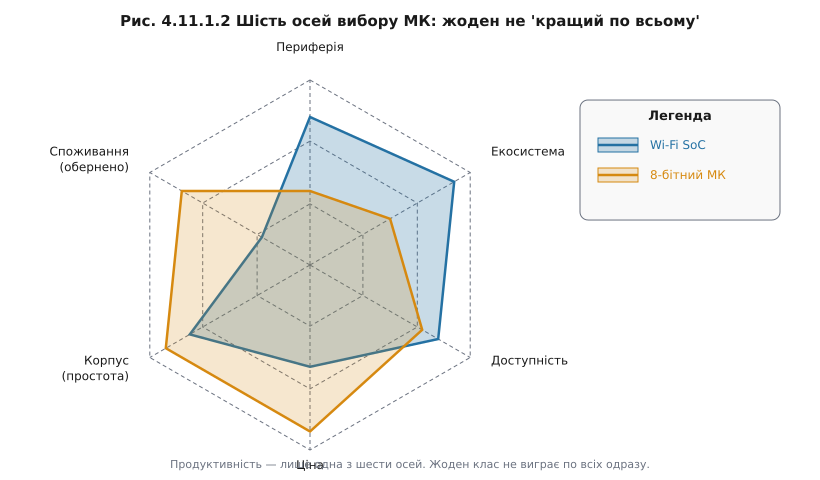
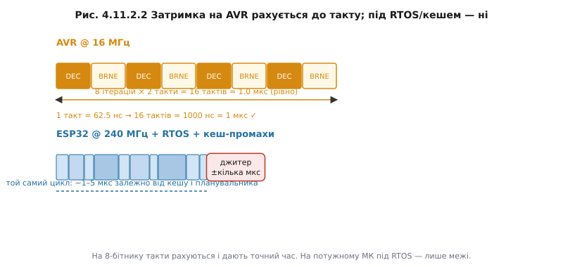
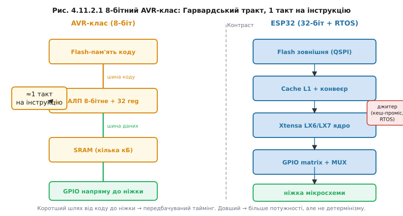
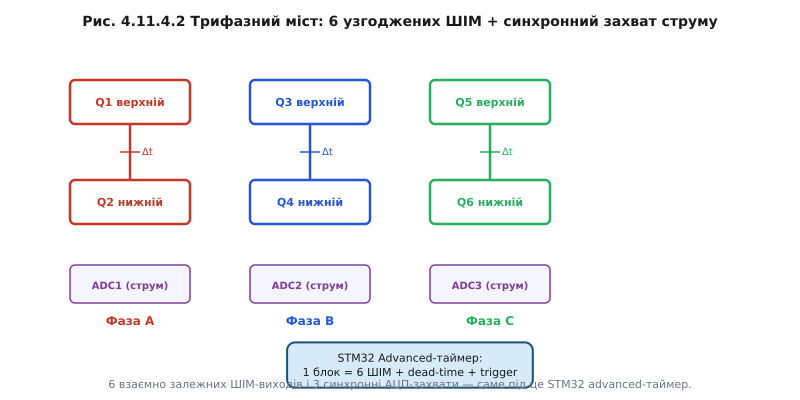
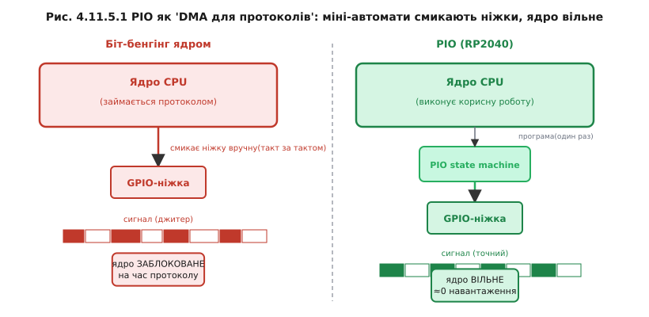
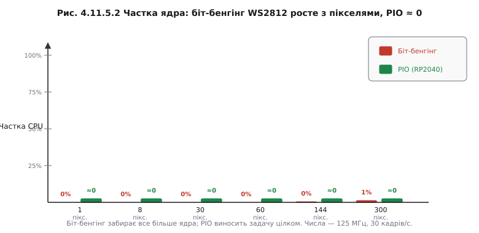
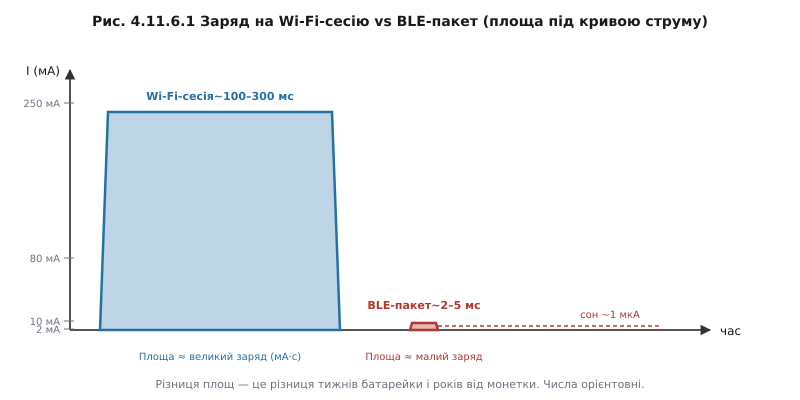
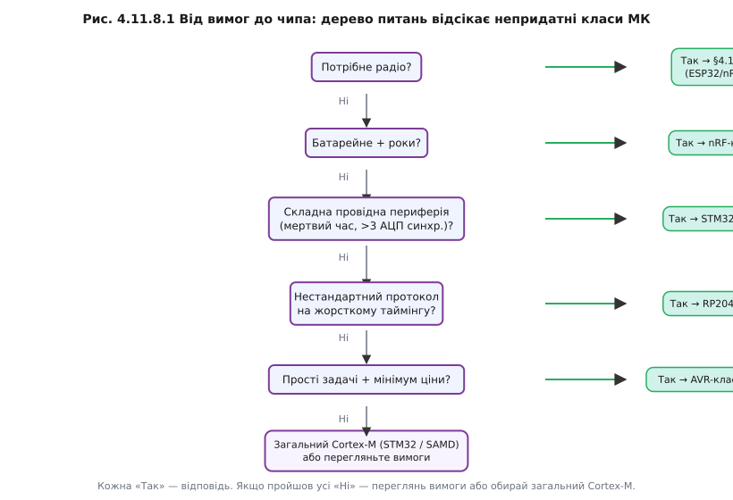

# Розділ 4.11 — Пейзаж мікроконтролерів

<!-- ВСТУП-МОТИВАЦІЯ -->

Десять розділів поспіль ми заглиблювались в одне конкретне залізо. Починаючи з §4.1, де виявили, що ESP32 — двоядерна Xtensa-машина з цифровою матрицею GPIO, і закінчуючи §4.10, де поверх цього заліза виросла ОС реального часу FreeRTOS з планувальником, м'ютексами і чергами. За ці десять розділів ESP32 перестав бути «якоюсь платою» і став відчутним — знаємо, звідки беруться такти, як влаштовані переривання (§4.5), де живуть таймери (§4.6), чому АЦП у ньому специфічний (§4.8), і як DMA (§4.9) дозволяє пересилати байти без участі процесора. Тепер саме час підняти голову й подивитись навколо: ESP32 — чудовий чіп, але в широкому пейзажі мікроконтролерів він лише одна крапка.

Коли йдеш на ринок і бачиш лише один продукт, то купуєш його незалежно від того, чи він підходить під твою задачу. Коли ж знаєш асортимент — купуєш те, що потрібно. Інженерне мислення починається не зі звички «у мене є ESP32, зроблю все на ньому», а зі звички ставити питання: що ця задача справді вимагає, і який клас мікроконтролерів закриє ці вимоги найдешевше, найощадніше, найнадійніше? Хто знає лише один чіп, той мимоволі тягне Wi-Fi-SoC туди, де вистачило б копійчаного 8-бітника, або навпаки — бере слабкий мікроконтролер там, де треба апаратний BLE і роки автономної роботи.

Але перед тим, як вийти на цей широкий ринок, варто сказати головне: продуктивність — не єдиний і далеко не головний критерій вибору. Мегагерци брешуть. Чіп із 240 МГц під товстим SDK, що постійно промахується кешем і чекає Wi-Fi-стеку, реально повільніший для конкретної задачі, ніж 16-МГц 8-бітник, де кожен такт на місці. Справжні осі вибору — периферія (що вбудовано), споживання (скільки мікроамперів у сні), корпус (чи реально запаяти), ціна (множена на тираж), доступність (чи купиш через рік), і понад усе — екосистема (SDK, драйвери, спільнота, приклади). Ось вісь, яка насправді вирішує — і саме до неї повернемося наприкінці.

Цей розділ будується так: спочатку §4.11.1 розставляє шість осей вибору і пояснює, чому питання «який МК найкращий» безглузде без контексту задачі. Далі чотири «материки» пейзажу: 8-бітна класика AVR (§4.11.2), спільна основа ARM Cortex-M (§4.11.3) і два її яскраві представники — STM32-клас (§4.11.4) та радикально незвичний RP2040/PIO (§4.11.5). Окремо стоїть острів радіо-мікроконтролерів nRF-класу (§4.11.6) — де головне не мегагерци, а мікроампери. Потім §4.11.7 розповідає про те, що важить більше за залізо, — екосистему. І нарешті §4.11.8 зводить усе в конкретний метод вибору під реальний проєкт.

Один важливий зв'язок до архітектурної основи всього цього пейзажу — ARM. Ядро, яке ліцензують ST, Nordic, Raspberry Pi Foundation і десятки інших виробників, народилось у маленькій британській компанії Acorn Computing і коштувало так мало електрики, що спочатку вирішили просто не робити на мікросхемі ланцюг живлення. Ця передісторія допомагає зрозуміти, чому модель «ядро розробили одні, виробляють усі» перекроїла ринок і чому в §4.11.3–4.11.6 різні чіпи від різних компаній мають однакові регістри переривань.

> 📜 **Перед матеріалом — історія розділу:** [ARM — Софі Вілсон, Стів Фербер і маленька команда Acorn](hist-arm.md). Показує, *звідки* взялося ядро, що тепер живе всередині STM32, RP2040 і nRF (§4.11.3–§4.11.6), і чому модель «розробив одні — виробляють усі» перекроїла весь пейзаж МК.

---

## 4.11.1 Навіщо знати інші МК

У §4.1.7 ми вже обирали всередині одного бренду: ESP32, ESP32-S2 без Bluetooth, ESP32-S3 з двома ядрами і PSRAM, ESP32-C3 на RISC-V, ESP32-C6 із 802.15.4. Це вже був вибір — але між варіантами одного виробника в одній екосистемі. Тепер рівень вище: вибір між принципово різними архітектурами, брендами і навіть підходами до того, що таке «периферія». І тут стає очевидною теза, яку легко проголосити, але важко відчути: «найкращого МК» не існує. Є найкращий-під-задачу.

ESP32 чудовий. Але він несе з собою ціну: споживання в режимі активного Wi-Fi від 80 мА до 300 мА, базову вартість у кілька доларів, час старту від скидання до готовності прошивки понад секунду. Для пристрою, що підключається до хмари і стримить дані, — це абсолютно нормально. Для масового датчика на батарейці, де треба раз на хвилину прокинутись, виміряти температуру і заснути, — три ці числа роблять ESP32 програшним варіантом за всіма трьома осями. Подивимося на це в числах.

**Worked-приклад «Ціна надлишку»**

Задача: мигати світлодіодом, зчитувати кнопку, раз на хвилину слати одне число по UART.

```
Критерій          ESP32            8-бітний МК
──────────────────────────────────────────────
Струм спокою      ~80 мА (deep     ~0.8 мкА (power-down)
                  sleep ~10 мкА,  
                  але Wi-Fi не    
                  спить сам)      
Ціна × 1000 шт   ~5200 USD        ~800 USD
Час старту        ~1800 мс         ~15 мс
                  (bootloader +   
                  Wi-Fi-init)      

Числа орієнтовні; залежать від конкретної моделі та прошивки.
```

Висновок прямий: для масового простого виробу без зв'язку ESP32 програє за всіма трьома числами. Але варто додати Wi-Fi або BLE-координацію — і баланс миттєво зміщується: вбудоване радіо, велика спільнота, готові бібліотеки для хмарних сервісів. Правильний вибір залежить від задачі, а не від звички.


*Рис. 4.11.1.3. Ціна надлишку: потужний SoC проти простого МК на елементарній задачі — три осі програшу.*

Щоб вибір не був стрибком у темряву, потрібен каркас. Пропоную шість осей, до яких повернемося у §4.11.8:

1. **Периферія** — яких інтерфейсів, каналів, таймерів, АЦП вимагає задача (§4.4–§4.9)? Є вони у чіпі або треба зовнішні мікросхеми?
2. **Споживання** — пристрій від мережі чи від батареї? Якщо батарея — скільки мікроамперів у сні? (Детальна математика — Розділ 4.13, тут лише як критерій.)
3. **Корпус** — DIP, QFP, QFN, BGA. Що реально запаяти в умовах виробництва? (🔌 r11-s8-c-packages розбирає це детально.)
4. **Ціна** — ціна одного чіпа в тиражі. Різниця в 30 центів за штуку на 100 000 виробів — це 30 000 доларів.
5. **Доступність** — чи буде цей чіп на ринку через рік, два, п'ять? Дефіцит 2020–2022 років навчив багатьох дорогим урокам.
6. **Екосистема** — SDK, драйвери, приклади, спільнота, інструменти (головна тема §4.11.7).



*Рис. 4.11.1.2. Шість осей, за якими інженер обирає мікроконтролер; продуктивність — лише одна з них.*

Чому продуктивність оманлива? Тому що мегагерци — це максимум того, що може зробити ядро за секунду у вакуумі. Реальна пропускна здатність залежить від ширини шини пам'яті, наявності кешу, поведінки планувальника ОС, кількості переривань. У §4.1.6 ми вже бачили порівняння DMIPS і те, як 8-бітний МК із апаратним таймером часом «реальніший» для конкретної задачі, ніж 240-МГц монстр під товстим SDK. Числа DMIPS — орієнтир, а не вирок.

Зрозуміти, що вибір МК — це серйозне інженерне рішення, допомагає порівняння з §4.1.1. Там ми обирали між МК і одноплатним комп'ютером. Тут — між різними МК. І ціна помилки схожа: переробка плати, корпусу, прошивки. Тому вибір варто робити свідомо, до того як замовлені компоненти.

> 🔧 **Навіщо це**
>
> Знати пейзаж МК потрібно, щоб не тягнути Wi-Fi-SoC у батарейний датчик і не ставити копійчаний 8-бітник туди, де потрібен TLS. Половина прикладів у відкритих репозиторіях написана на AVR або STM32 — вміти читати чужий код означає розуміти ці платформи хоч на рівні «де шукати регістр переривання».


*Рис. 4.11.1.1. Пейзаж мікроконтролерів: де на ньому ESP32 і куди тягнуться інші класи.*

Почнімо з протилежного кінця шкали від ESP32: найпростіших, передбачуваних 8-бітників.

---

## 4.11.2 8-бітна класика: AVR-клас

Визначивши шість осей вибору, одразу приміряємо їх до найпростішого «материка» в пейзажі мікроконтролерів. AVR-клас (8-bit RISC MCU) — це еталон мінімалізму: жодного зайвого шару між кодом і залізом, жодного кешу між інструкцією і її виконанням. Якщо 8051 (ch20-s6-history-8051) — це діди-засновники 8-бітної епохи, то AVR — їхній модернізований спадкоємець, що у 1996–1997 роках студенти Альф-Еґіль Боґен і Вегард Воллан із Університету Тронгейма принесли зі своєї дипломної роботи в Atmel.

> 📜 Звідки взявся AVR як «народний» 8-бітник — у вставці [r11-s2-history-avr](hist-avr.md): два студенти з Норвегії, дипломний проєкт, підхоплений виробником і перетворений на мільйонні тиражі Arduino.

Архітектурне рішення, що зробило AVR популярним у навчанні, — **Гарвардська модель із однотактними інструкціями**. У більшості інструкцій AVR одна операція = один такт. Декремент регістра — один такт. Умовний стрибок — два такти (якщо стрибок відбувається). Порівняйте з конвеєром Xtensa LX6 ESP32 із кешем L1 (§4.1): там та сама операція може зайняти від двох до двадцяти тактів залежно від промаху кешу, стану конвеєра й активності планувальника FreeRTOS. Це не вада ESP32 — це ціна потужності. Але для задач, де треба точно знати, скільки часу займе цикл, ціна висока.

Із цього однотактного детермінізму виростає вся «простота, яку можна порахувати». Якщо потрібно згенерувати сигнал із точним таймінгом, наприклад імітувати нестандартний протокол — на AVR-класі це робиться підрахунком тактів у голові. На ESP32 під RTOS (§4.10) це практично неможливо без апаратного таймера або спеціального блока типу RMT.

**Worked-приклад «Скільки тактів»**

Задача: програмна затримка рівно 100 мкс на 8-бітнику @ 16 МГц.

```c
// Цикл затримки: 2 такти на ітерацію при оптимізації -O1
// (DEC Rd: 1 такт, BRNE: 2 такти якщо перехід відбувся, 1 такт якщо ні)
// В середньому: 2 такти/ітерацію крім останньої

void delay_100us(void) {
    uint8_t n = 200;          // 1 такт (LDI)
    while (n--) {             // DEC + BRNE = 2 такти × 200 = 400 тактів
        __asm__("nop");       // + 1 NOP = 3 такти/цикл × 200 ≈ 600 тактів
    }
}

// Покроково:
// Такт за цикл ≈ 3 (NOP + DEC + BRNE)
// Ітерацій: ~200
// Разом: 3 × 200 = 600 тактів
// 600 тактів / 16 000 000 Гц = 37.5 мкс
//
// → підібрати N і структуру, щоб отримати рівно 100 мкс = 1600 тактів
// Це рахується точно. На ESP32 під RTOS — ні (§4.6.5, §4.10).
```

На ESP32 спроба робити такі затримки в задачі FreeRTOS призводить до джитеру в мікросекунди і більше — планувальник може перемкнути контекст у будь-який момент. Ось де AVR-клас принципово інший: немає RTOS, немає кешу, немає Wi-Fi-стеку в сусідньому ядрі. Чистий детермінізм.



*Рис. 4.11.2.2. Чому затримку на 8-бітнику можна порахувати до такту, а на потужному МК під RTOS — ні.*

Периферія AVR-класу влаштована так само прозоро, як і ядро. GPIO-ніжки керуються трьома регістрами (DDRx, PORTx, PINx) — без матриці перемикань, без мультиплексора (контраст із §4.4.7, де ESP32 GPIO Matrix дозволяє перенаправити будь-який сигнал на будь-яку ніжку). Таймери 8/16-бітні (§4.6 порівняти: ESP32 має 64-бітні таймери). АЦП простий і лінійний (контраст із нелінійним АЦП ESP32 §4.8). Поріг входу низький: хочеш увімкнути переривання на зміну рівня на ніжці — пишеш два рядки в два регістри, і все.

Ціна цієї простоти очевидна. Кілобайти Flash і SRAM замість мегабайтів. Десятки МГц замість сотень. 8-бітний АЛП означає, що арифметика на числах більших за 255 вимагає кількох інструкцій. Операції з числами з рухомою комою виконуються програмно і повільно — немає апаратного FPU (контраст із Cortex-M4 у §4.11.3). Немає радіо, немає DMA на базових моделях.

Але сьогодні AVR-клас живий і активно використовується. Є три ніші, де він незамінний: масові прості вироби без зв'язку (де ціна і споживання вирішують), навчання (видно залізо наскрізь, нічого зайвого між студентом і тактом), і задачі з жорстким таймінгом на голих регістрах без ОС. Остання ніша — це і є головна причина, чому Arduino Uno і Nano залишаються в продажу після тридцяти років.

> 🔌 Плати AVR-класу поряд із ESP32: [r11-s2-c-uno-nano.md](comp-uno-nano.md) — анатомія Uno/Nano, де дебаг-інтерфейс, де скинути мікроконтролер.

> 🔧 **Навіщо це**
>
> Свідомо обрати 8-бітник замість ESP32 варто тоді, коли одночасно виконуються три умови: задача проста (нема мережі, нема складних протоколів), тираж значний (сотні або тисячі штук, де копійки за чіп множаться), і або потрібна передбачувана затримка без ОС, або просто немає сенсу нести надлишок.



*Рис. 4.11.2.1. 8-бітний AVR-клас зсередини: Гарвардський тракт, де майже кожна інструкція — рівно один такт.*

AVR — 8-бітна стеля. Коли задача виходить за неї і потрібні 32-бітні числа, складний протокол або апаратна рухома кома, виникає природне питання: брати потужний, але монолітний ESP32, або є щось посередині? На сцену виходить ARM Cortex-M.

---

## 4.11.3 ARM Cortex-M

У світі 8-бітників кожен виробник мав власне ядро: AVR, 8051, PIC. Вивчив одне — знаєш одне. ARM перевернув цю модель. Компанія ARM Holdings не виробляє жодного мікроконтролера — вона продає інтелектуальну власність: специфікацію і верифіковані IP-блоки ядра Cortex-M (32-bit MCU core family). ST Microelectronics купує ліцензію і додає до ядра свою периферію — отримуємо STM32. Nordic Semiconductor купує ту саму ліцензію і додає BLE-радіо — отримуємо nRF52. Raspberry Pi Foundation — додає PIO — отримуємо RP2040. Результат: одне ядро живе в тисячах чіпів від десятків виробників.

Інженерний наслідок цієї моделі: вивчив ядро раз — упізнаєш його в будь-якому Cortex-M чіпі. NVIC (Nested Vectored Interrupt Controller) — однаковий. SysTick — однаковий. Модель винятків (порядок входу/виходу, пріоритети) — однакова. Набір регістрів ядра (r0–r15, xPSR) — однаковий. CMSIS-заголовки від ARM дають стандартні макроси для роботи з ядром — і вони однаково компілюються для STM32, nRF і RP2040. Саме в цьому — головна цінність ARM: переносний навик замість прив'язки до одного SDK.

Ієрархія Cortex-M не є маркетинговою шкалою «дешево–дорого». Це реальна технічна прогресія:

- **M0 / M0+** — мінімальне ядро, менше 12 тисяч вентилів, виграє у AVR-класу за тим, що дає 32-бітну арифметику майже за ту саму ціну й споживання. Конкурент 8-бітника, але 32-бітний.
- **M3** — робоча конячка з апаратним дільником і підтримкою складніших режимів адресації. Саме на M3 побудовано перші масові STM32.
- **M4** — додає DSP-інструкції (SIMD, MAC за один такт) і опціональний апаратний FPU. Float тепер обчислюється апаратно — контраст із §4.11.2, де float на AVR-класі — це програмний емулятор і десятки тактів.
- **M7** — подвійний конвеєр із результатом за один такт у більшості інструкцій, кеш L1 інструкцій і даних, TCM (Tightly Coupled Memory) для детермінованого доступу до критичних ділянок. Продуктивність порівнянна з процесорами загального призначення попереднього покоління.

Що **однакове** у всіх M0–M7: NVIC, SysTick, модель виходу зі стеку при винятках, Thumb-2 ISA (підмножина). Що **додається** з кожним рівнем: продуктивність, FPU, DSP-розширення, кеш. Це важливо розуміти при читанні чужого коду: якщо в прикладі на STM32 викликається `NVIC_EnableIRQ()` — ця функція CMSIS буде працювати на будь-якому Cortex-M, бо NVIC стандартизований.

**Worked-приклад «Та сама ідея, інший регістр»**

```c
// ── Cortex-M (будь-який) ─────────────────────────────────────────────────
// Дозволити переривання від таймера (NVIC — §4.5 у STM32-реалізації):
NVIC_EnableIRQ(TIM2_IRQn);       // CMSIS: стандарт для ВСІХ Cortex-M
NVIC_SetPriority(TIM2_IRQn, 3); // той самий NVIC API

// ── ESP32 (ESP-IDF) ──────────────────────────────────────────────────────
// Та сама ідея — дозволити переривання від апаратного таймера (§4.5):
esp_intr_alloc(ETS_TIM1_INTR_SOURCE,
               ESP_INTR_FLAG_LEVEL3,
               timer_isr, NULL, &handle);

// Логіка: «додати джерело переривань, дати пріоритет» — ідентична §4.5.2.
// Ім'я регістру/функції — різне. ESP32 не Cortex-M (Xtensa/RISC-V, §4.1.7).
```

Саме про Xtensa і RISC-V: ESP32 (LX6/LX7) і ESP32-C3/C6 (RISC-V) не є Cortex-M (§4.1.7, ch20-s7-history-riscv). Вони не ліцензують ядро ARM — у них власна архітектура. Тому все, що ми вивчили в модулі 4 про ESP32, переноситься концептуально (ідея NVIC, ідея DMA, ідея таймера), але регістри ядра інші. Це і є причина, чому вивчати ядро Cortex-M окремо — цінна інвестиція.

> 🔧 **Навіщо це**
>
> Знання Cortex-M — це переносний навик. STM32, nRF, RP2040, NXP iMX RT — усі вони на Cortex-M. Вивчив NVIC раз — читаєш datasheet будь-якого з них без «де тут дозволити переривання?».


*Рис. 4.11.3.1. Одне ядро — багато виробників: ARM ліцензує Cortex-M, кожен обростає його власною периферією.*


*Рис. 4.11.3.2. Сходи Cortex-M: спільне ядро внизу, продуктивність і FPU/кеш додаються вгору; ESP32 стоїть осторонь.*

Абстрактне ядро Cortex-M стає відчутним, коли обростає периферією. Найбагатший і найпоширеніший приклад «дорослого» Cortex-M у вбудованих системах — STM32.

---

## 4.11.4 STM32-клас

Cortex-M — це лише ядро. STM32-клас показує, що буває, коли до цього ядра додати периферію «дорослого» мікроконтролера: не одне ядро-мінімум, а повний набір таймерів, АЦП, DMA-каналів, інтерфейсів. Якщо ESP32 несе радіо, STM32-клас (Cortex-M MCU family by ST) несе багатшу й точнішу провідну периферію — і саме це визначає його нішу.

Поглянемо на периферію через призму того, що вже знаємо. Таймери у STM32-класі діляться на «basic», «general-purpose» і **«advanced-control»** — останній має вбудовану підтримку мертвого часу (dead time), комплементарні пари виходів і апаратний захист від «прострілу» (shoot-through). У §4.7.2 ми бачили ESP32 MCPWM — він теж уміє генерувати мертвий час, але advanced-control таймер STM32 вміє це з меншими зусиллями конфігурації і суворішим детермінізмом (ch25-s2-a-pwm-alignment). АЦП у STM32-класі можна конфігурувати на **синхронний** запуск від таймера — кілька АЦП одночасно виробляють вибірку в точно визначений момент ШІМ-циклу, що критично для вимірювання струму фазових обмоток (§4.8, контраст із нелінійним АЦП ESP32 §4.8.6). DMA-контролер у STM32-класі має кілька незалежних каналів із пріоритетами — де ESP32 DMA прив'язаний здебільшого до SPI/I2S, там STM32 DMA незалежно обслуговує таймери, АЦП і UART паралельно (§4.9).

**Worked-приклад «Скільки PWM-каналів треба»**

Задача: керувати трифазним мостом (6 комплементарних ШІМ-виходів із мертвим часом) і одночасно вимірювати струм у трьох фазах синхронно з ШІМ.

```
Вимога                     Потрібно  STM32 adv-timer   ESP32 MCPWM
──────────────────────────────────────────────────────────────────
ШІМ-каналів (комплем.)     6         6 (1 таймер)      6 (2 блоки)
Мертвий час апаратно       так        так               так (MCPWM)
Синхронний запуск АЦП      3 канали  так (TRGO)        потребує доп. налаштувань
Незалежна конфігурація     повна     так               часткова
────────────────────────────────────────────────────────────────────
Висновок: обидва вміють, але STM32 advanced-control таймер
накриває задачу ОДНИМ блоком; на ESP32 потрібні два MCPWM-блоки
і додаткові зусилля для синхронного АЦП-запуску.
```

Для задачі силового керування двигуном STM32-клас пропонує більш компактне і детерміноване рішення. Але є важлива відмінність від ESP32: немає вбудованого радіо. Якщо потрібна бездротова комунікація — треба зовнішній модуль (місток до §4.11.6). Натомість ширший вибір корпусів і мікроструктур: від M0+ для простих задач до M7 для вибагливих. SWD (Serial Wire Debug) — відлагоджувальний інтерфейс, який дозволяє ставити точки зупину і читати пам'ять прямо через два дроти (детально — Розділ 4.14).

> 🔌 Плати STM32-класу: [r11-s4-c-stm32-boards.md](comp-stm32-boards.md) — анатомія Nucleo і «Blue Pill», де живе вбудований ST-Link, як харчуються від USB і від зовнішнього джерела.

Доступність і зрілість середовища розробки ST — це і перевага, і вага. STM32CubeMX дозволяє клацати периферію мишею і генерувати ініціалізацію. З одного боку, не треба вручну заповнювати регістри — зручно. З іншого — генерований HAL-код товстий і приховує деталі, які іноді важливо розуміти. Контраст із AVR (§4.11.2): там все прозоро аж до відомих регістрів. Ця дилема «HAL vs голі регістри» — частина більшої теми екосистеми, до якої повернемося у §4.11.7.

> 🔧 **Навіщо це**
>
> STM32-клас доречніший за ESP32, коли задача — точне керування силовою електронікою: трифазний міст, сервопривід, перетворювач. Кілька синхронних АЦП-каналів із запуском від ШІМ і апаратний мертвий час — це не «опційні функції», а архітектурні рішення STM32-класу, заточені саме під це.


*Рис. 4.11.4.1. Дві філософії інтеграції: точна провідна периферія STM32-класу проти радіо й гнучких блоків ESP32.*



*Рис. 4.11.4.2. Чому керування трифазним мостом любить advanced-таймер: шість узгоджених виходів і синхронний захват струму.*

STM32 дає БАГАТО готової фіксованої периферії. RP2040 пропонує протилежну ідею: периферії, якої в нього немає, ти програмуєш сам.

---

## 4.11.5 RP2040-клас / PIO

STM32-клас — це стратегія «більше готового заліза». RP2040 ставить принципово іншу ідею: менше фіксованих блоків, зате є механізм, що дозволяє запрограмувати власний блок. Цей механізм — PIO (Programmable I/O). Сам чіп — подвійний Cortex-M0+ (зв'язок із §4.11.3), і в цьому сенсі він нічим особливим не вирізняється. Але PIO — це те, чого до RP2040 в масовому мікроконтролері не було.

> 📜 Звідки взявся RP2040 — у вставці [r11-s5-history-rp2040.md](hist-rp2040.md): як британська Raspberry Pi Foundation, що завоювала ринок одноплатних комп'ютерів, вирішила зробити власний мікроконтролер і що з цього вийшло.

Щоб зрозуміти PIO, треба спочатку зрозуміти проблему. У будь-якому мікроконтролері кількість апаратних блоків периферії скінченна і зафіксована при виготовленні. Є два UART — двох і вистачає. Якщо потрібен третій — складно. Якщо потрібен UART із нестандартним таймінгом, або протокол WS2812 (§4.7.7), або DVI для відеовиходу — треба або шукати чіп із підтримкою, або робити **біт-бенгінг**: ядро процесора саме «смикає» ніжку GPIO за суворим таймінгом, інструкція за інструкцією. Ми вже бачили, що таке біт-бенгінг у ch22-s7-a-bitbang: він їсть такти, створює джитер (бо переривання можуть «зіпсувати» таймінг), і блокує ядро на весь час передачі.

PIO — це вихід. Ідея проста і в певному сенсі схожа на DMA (§4.9): так само, як DMA звільнив ядро від копіювання даних, PIO звільняє ядро від генерації протоколу. Але якщо DMA переміщує байти з готовим адресним автоматом, PIO — це **незалежні програмовані скінченні автомати** поруч із ядром. Їх у RP2040 вісім (два блоки по чотири), і кожен виконує свою крихітну «програму» — послідовність спеціалізованих команд, що безпосередньо смикають ніжки GPIO з точністю до одного такту системного клоку, без будь-якої участі основного ядра.

Мова PIO дуже мала: менше двадцяти команд. Але цього достатньо для генерації сигналів I²S, DVI, кількох паралельних UART, протоколу WS2812 із точним субмікросекундним таймінгом. Один дешевий чіп «прикидається» периферією, якої в нього немає — і робить це апаратно, з нульовим навантаженням на ядро.

**Worked-приклад «PIO проти біт-бенгінгу — бюджет тактів»**

WS2812 вимагає передачі 24 біт на піксель із таймінгом T0H≈350 нс, T1H≈700 нс, T0L/T1L ≈ 800/600 нс при 800 кГц (ch25-s7-a-ws2812-timing). На RP2040 @ 125 МГц один такт — 8 нс.

```
Біт-бенгінг: скільки тактів з'їдає біт кадру?
───────────────────────────────────────────────
Тактів/біт (мінімум при жорсткій петлі):  ~10 тактів
Біт/піксель:                              24
Пікселів/кадр:                             N
Кадрів/секунду:                           30

Навантаження ядра = N × 24 × 10 × 30 / 125_000_000

N=1:    0.06 %   (несерйозно)
N=30:   1.7 %    (терпимо, але переривання б'ють по таймінгу)
N=144:  8.3 %    (з RTOS уже проблема — джитер)
N=300:  17 %     (блокує важливі задачі)

З PIO: навантаження ядра ≈ 0 % при будь-якому N.
Ядро лише кладе байти у FIFO буфер PIO.
```

Детальна анатомія автоматів PIO — у вставці [r11-s5-a-pio.md](proj-pio.md). Там — реальна програма PIO для WS2812, розбита по командах, і пояснення, як автомат сам рахує такти й читає дані з FIFO.

> 🔌 Плата Pico і клас RP2040: [r11-s5-c-pico-board.md](comp-pico-board.md) — зовнішня QSPI-Flash (коду на борту нема!), прошивка перетягуванням файлу UF2, харчування від USB.



*Рис. 4.11.5.1. PIO як «DMA для протоколів»: міні-автомати смикають ніжки з точним таймінгом, лишаючи ядро вільним.*



*Рис. 4.11.5.2. Частка ядра, з'їдена біт-бенгінгом світлодіодів, проти нуля з PIO — у міру зростання кількості пікселів.*

Ціна ідеї PIO — реальна. Програмувати автомати треба окремою мовою, налагоджувати важче (немає точок зупину в NVIC-сенсі), автоматів всього вісім — ресурс не безмежний. І прошивка перетягуванням UF2-файлу зручна для прототипів, але не для масового виробництва, де потрібен SWD (Розділ 4.14).

> 🔧 **Навіщо це**
>
> RP2040/PIO — правильний вибір, коли потрібен нестандартний або кількаканальний цифровий протокол із жорстким таймінгом, де біт-бенгінг ядром не тягне, а спеціального апаратного блока в доступних чіпах немає. Або коли треба реалізувати кілька UART/I2S паралельно в межах одного недорогого чіпа.

PIO — про цифрові протоколи. Інший край пейзажу — чіпи, що заточені під одну задачу: радіо і мікроампери.

---

## 4.11.6 nRF-клас і радіо-МК

AVR-клас, STM32-клас і RP2040 — усі без вбудованого радіо. Це їхня перевага (дешевше, менше споживають) і обмеження (радіо треба доклеювати ззовні). ESP32 (§4.1.5) закрив цю потребу повним Wi-Fi і Bluetooth на борту — але ціною: вже у Wi-Fi-сні — нерегулярно підтримуючи зв'язок із точкою доступу — ESP32 споживає десятки міліамперів. Є третій клас радіо-мікроконтролерів, де все підпорядковане одній меті: BLE-зв'язок і мікроампери. Це nRF-клас (nRF — Cortex-M MCU with integrated BLE radio by Nordic).

nRF — теж Cortex-M (§4.11.3), і це важливо: ядро знайоме. NVIC, SysTick, CMSIS — усе те саме. Специфіка не в ядрі, а в тому, навколо чого весь чіп сконструйований: BLE-стек і радіоблок спроєктовані так, що активний час передачі — лічені мілісекунди, споживання під час передачі — порядку 5–10 мА, а в глибокому сні — одиниці або навіть долі мікроампера. Порівняйте з ESP32: Wi-Fi-асоціація займає сотні мілісекунд і потребує 150–300 мА. Це не різниця в налаштуваннях — це різниця в архітектурному пріоритеті.

**Worked-приклад «Wi-Fi vs BLE — роки від монетки»**

Датчик прокидається раз на хвилину, вимірює і передає дані.

```
Параметр                        Wi-Fi (ESP32)       BLE (nRF)
────────────────────────────────────────────────────────────────────
Час активного TX                ~200 мс             ~4 мс
Струм під час TX                ~180 мА             ~8 мА
Заряд на одну сесію             200e-3 × 180e-3     4e-3 × 8e-3
                                ≈ 36 мА·с            ≈ 0.032 мА·с
Сесій на добу                   1440 (1/хв)         1440
Заряд на добу                   ~51.8 А·с = 14.4 мА·год   ~0.046 мА·год
CR2032 ємність                  ~220 мА·год         ~220 мА·год
Автономність (без сну)          ~15 діб             ~13 років

Де тут сон: якщо nRF спить між сесіями @ 2 мкА:
  Заряд сну: 1440×56 с × 2e-6 А ≈ 0.161 мА·год/добу
  Всього: 0.046 + 0.161 ≈ 0.207 мА·год/добу
  Автономність ≈ 220 / 0.207 ≈ 1060 днів ≈ ~3 роки

Числа орієнтовні. Детальна математика батареї — Розділ 4.13.
```

Різниця між 15 добами і 3 роками — не налаштування SDK. Це архітектурне рішення, яке приймається на початку проєктування. BLE передає менше даних, на меншу відстань (до ~100 м vs кілометри Wi-Fi у відкритому просторі), не підходить для потокового відео і потребує смартфон або BLE-шлюз поруч замість звичного Wi-Fi роутера. Але якщо ці обмеження прийнятні — nRF дає роки автономної роботи від монетки.

> 🔌 Модулі nRF52-класу: [r11-s6-c-nrf-modules.md](comp-nrf-modules.md) — сертифіковані радіо-антени з коробки, де лежать BLE-стек і як підключити до хост-МК.

Ще одна точка перетину — ESP32-C6, що підтримує 802.15.4 (Thread/Zigbee) поруч із Wi-Fi і BLE (§4.1.7). Це гібрид: де потрібна і мережева гнучкість, і ощадні mesh-мережі. Але він не замінює nRF там, де ключове — мікроампери в сні: ESP32-C6 у deep sleep все ще споживає більше, ніж nRF у звичайному режимі.

> 🔧 **Навіщо це**
>
> Радіо-МК nRF-класу — єдиний правильний вибір, коли пристрій носимий або розкиданий на великій площі, мусить жити роки від крихітної батареї і лише зрідка надсилати невеликий пакет даних поруч. Носимий датчик пульсу, маяк-«пінг» на склад, датчик вологості в полі — ось ніша nRF.



*Рис. 4.11.6.1. Чому радіо вирішує бюджет батареї: заряд на одну Wi-Fi-сесію проти одного BLE-пакета (площа під кривою струму).*

Ми перебрали п'ять класів за залізом. Але на практиці вибір частіше вирішує не залізо, а те, що довкола нього.

---

## 4.11.7 Екосистема важить більше за мегагерци

§4.11.2–§4.11.6 порівнювали залізо: такти, каналів периферії, мікроампери сну. Тепер головний поворот розділу. На практиці проєкт частіше виграє або гине не на залізі, а на **екосистемі**: SDK і фреймворк, HAL і драйвери, документація й приклади, спільнота, інструменти прошивки і налагодження.

Екосистема — не абстракція. Це конкретний список питань, відповідь на кожне з яких коштує часу:
- Чи є приклад, що читає саме цей датчик із саме цим чіпом?
- Чи є драйвер для BLE-профілю, що потрібен?
- Якщо не знаєш — хтось у форумі вже відповів?
- Чи можна прошити з командного рядка, або треба спеціальна GUI?
- Чи буде цей SDK підтримуватись через три роки?

У §4.2.7 ми вже бачили компроміс «голе залізо vs фреймворк» — ціна абстракції. Тут той самий компроміс, але як критерій вибору чіпа. Потужніший чіп із поганим SDK програє слабшому з відмінним — час інженера дорожчий за центи різниці в ціні кремнію. Якщо готовий I²C-драйвер для потрібного датчика лежить у репозиторії і компілюється з першого разу — це тижні зекономленої роботи.

**Worked-приклад «Дві дороги до того самого пристрою»**

Задача: читати I²C-датчик температури і слати значення по UART.

```
Критерій               Чіп А (з екосистемою)   Чіп Б (технічно кращий)
──────────────────────────────────────────────────────────────────────
Тактова частота        180 МГц                 240 МГц       ← Б «виграє»
Документація           відмінна, 600 стор.     часткова, 200 стор.
Драйвер I²C+датчик     є готовий, компілюється треба писати з нуля
Приклади в GitHub      >500 репо               ~10 репо
Спільнота (forum)      активна, відповідь <24 год   мало питань, мало відповідей
Прошивка               USB drag-and-drop        спеціальний програматор
──────────────────────────────────────────────────────────────────────
Час до робочого прото- ~2–3 дні                ~3–4 тижні
  типу (оцінка):
Ризик застрягти:       низький                  середній–високий

Висновок: Чіп Б швидший. Але Чіп А — кращий вибір.
```

Чому ESP32 і Arduino-світ так перемогли, попри те що архітектура ядра не Cortex-M (§4.11.3)? Не завдяки мегагерцам — завдяки гігантській спільноті, морю прикладів, безкоштовному і зрілому SDK ESP-IDF. Бібліотека для практично будь-якого популярного датчика є на GitHub. Відповідь на Stack Overflow знайдеться за хвилину. Це жива ілюстрація тези.

Але є і зворотний бік: екосистема прив'язує. Код, написаний під ESP-IDF і Arduino, не перекомпілюється без змін під STM32-HAL. Один код на різні МК — мрія, до якої наближають HAL-шар і умовна компіляція (⚙️ [r11-s7-a-portability.md](proj-portability.md)), але повної переносності нема. Як зменшити прив'язку архітектурно: відокремити бізнес-логіку від драйверів у власний HAL-шар — так зміна платформи чіпатиме лише нижній рівень, а логіка лишається незмінною.


*Рис. 4.11.7.1. Що насправді купуєш разом із чипом: шари екосистеми, які важать більше за мегагерци.*


*Рис. 4.11.7.2. Швидший чіп — довша дорога: час до робочого прототипу й ризик вирішує екосистема, а не тактова частота.*

> 🔧 **Навіщо це**
>
> Перш ніж захоплюватись мегагерцами нового чіпа — спитати: «А чи є приклад, драйвер, спільнота й документація?» Часто ця відповідь вирішує більше, ніж уся таблиця характеристик у datasheet.

Ми зібрали всі осі: залізо (§4.11.2–6) і екосистему (§4.11.7). Час звести їх у метод, як обирати під конкретний проєкт.

---

## 4.11.8 Як обрати МК під проєкт

Розділ дав «материки» й важіль. Тепер — метод. Головна теза, яку ми вже починали у §4.11.1: питання ставлять до проєкту, а не до чіпа. Спершу вимоги — потім чіп. Аж ніяк не навпаки.

Новачок обирає так: «Знаю ESP32, люблю ESP32 — зроблю на ESP32». Потім виявляється, що батарейний датчик живе три доби замість трьох років, або що для точного ШІМ-контролера двигуна бракує синхронних АЦП-каналів. Переробка плати після першої ревізії — це завжди дорого: час, нові компоненти, нові помилки. Інженер виписує вимоги і потім дивиться, який клас їх закриває.

> 🔧 **Навіщо це**
>
> Чеклист — не бюрократія, а страховка від дорогої переробки. Десять хвилин питань на початку економлять місяць роботи на середині проєкту.

**Чеклист вибору (шість осей §4.11.1 + екосистема §4.11.7 у послідовності питань):**

1. **Периферія**: які саме інтерфейси, скільки каналів, чи потрібен advanced-timer або синхронний АЦП (§4.4–§4.9)?
2. **Зв'язок**: провід, Wi-Fi, BLE, нема зовсім? Якщо радіо — це перша «killer-вимога», що відсіває цілі класи (§4.11.6).
3. **Живлення**: від мережі або від батареї-роками? Якщо батарея — все: цикл wake/sleep і струм сну (§4.11.6, Розділ 4.13).
4. **Продуктивність**: що реально потрібно для задачі, а не «більше — краще»? Чи справді потрібен FPU або DSP (§4.11.3)? (§4.1.6 — DMIPS ≠ реальна продуктивність.)
5. **Корпус і пайка**: що реально запаяти у своєму виробництві чи вдома? DIP — можна вручну, BGA — потрібна піч і рентген. (🔌 r11-s8-c-packages.)
6. **Ціна × тираж**: різниця в 50 центів за чіп на тисячі виробів — це реальні гроші.
7. **Екосистема і доступність** (§4.11.7): SDK, драйвери, спільнота, довговічність постачальника. Чи буде цей чіп через три роки?

Порядок не випадковий. Питання 2 і 3 — «killer-вимоги», що одним «так» відсіяють цілий клас і суттєво звузять пошук. Питання 4–7 — тонке налаштування всередині звуженого поля.

**Worked-приклад «Від вимог до чіпа»**

*Пристрій 1: датчик якості повітря на батарейці*

```
Вимога                      Відповідь         Наслідок
──────────────────────────────────────────────────────────────────────
Зв'язок?                    BLE               → ESP32 надміру, Wi-Fi не треба
Батарейне+роки?             CR2032, ~3 роки   → мікроампери, Wi-Fi відпадає
Складна провідна перифер.?  I²C датчик, UART  → простої хватить
Нестандартний протокол?     Ні                → PIO не потрібен
Тираж?                      ~10 000 шт         → ціна важить
Екосистема?                 Активна бажано    → nRF має гарну
──────────────────────────────────────────────────────────────────────
Відсіяно: ESP32 (Wi-Fi, струм), STM32 (немає BLE), AVR (немає BLE),
          RP2040 (немає BLE)
Залишився: nRF-клас  ✓
```

*Пристрій 2: силовий драйвер двигуна (постійне живлення)*

```
Вимога                      Відповідь         Наслідок
──────────────────────────────────────────────────────────────────────
Зв'язок?                    Провід (CAN/UART) → радіо не потрібне
Батарейне?                  Мережа 24 В       → споживання не критично
Складна перифер.?           6 ШІМ+dead-time,  → advanced-timer потрібен
                             3 синхронних АЦП
Нестандартний протокол?     Ні                → PIO не потрібен
──────────────────────────────────────────────────────────────────────
Відсіяно: ESP32 (надлишок, нестандартний АЦП), nRF (немає ШІМ),
          AVR (8-біт, без FPU), RP2040 (M0+, нема advanced-timer)
Залишився: STM32-клас  ✓
```


*Рис. 4.11.8.2. Один метод — різні відповіді: як два несхожі проєкти приводять чеклист до різних класів МК.*

Типові помилки, зібрані з усього розділу:

- **Гонитися за МГц** (§4.11.1, §4.11.7): швидший чіп ≠ кращий пристрій.
- **Ігнорувати струм спокою** в батарейному пристрої (§4.11.6): різниця між мікроамперами і міліамперами — це рік проти тижня.
- **Вибрати чіп без екосистеми** (§4.11.7): технічно чудовий чіп без драйверів і спільноти стоїть тижнів.
- **Взяти дефіцитний або EOL-чіп**: вісь доступності (§4.11.1) реальна — 2020–2022 навчили.
- **Закласти корпус, який не запаяти**: BGA 0.4 мм у домашньому виробництві — катастрофа. (🔌 r11-s8-c-packages.)
- **Надлишок «про всяк випадок»**: роздуває ціну, струм і час старту (worked-приклад §4.11.1).

Коли осі конфліктують — наприклад, найдешевший чіп має гіршу екосистему, а найкраща екосистема не найдешевша — допомагає **вагова матриця**: кожному критерію присвоюється вага (важливість для цього проєкту), кожен кандидат оцінюється за кожним критерієм, результат — зважена сума. Приклад живого застосування — у вставці 🧮 [r11-s8-m-decision-matrix.md](math-decision-matrix.md). Сам метод trade studies і його пастки — у §14.1.4, куди повернемося пізніше.

> 🔌 Корпуси DIP/QFP/QFN/BGA і що реально запаяти: [r11-s8-c-packages.md](comp-packages.md).



*Рис. 4.11.8.1. Від вимог до чипа: дерево питань, де кожна відповідь відсікає непридатні класи МК.*

Пейзаж мікроконтролерів широкий — від 8-бітного детерміністичного AVR-класу до програмованих автоматів PIO і BLE-мікроамперних nRF. Але всі вони підкоряються одному методу: спочатку вимоги, потім чіп. ESP32 залишається чудовим вибором там, де потрібен Wi-Fi і великий обсяг коду. AVR-клас — де важлива ціна і детермінізм без ОС. STM32-клас — де потрібна точна провідна периферія. RP2040 — де потрібен нестандартний протокол. nRF — де роки від батарейки. Жоден не «найкращий» — кожен правильний у своїй ніші.

---

> ▶️ Далі: [Розділ 4.12 — USB на мікроконтролері](../usb-mcu/usb-mcu.md)
