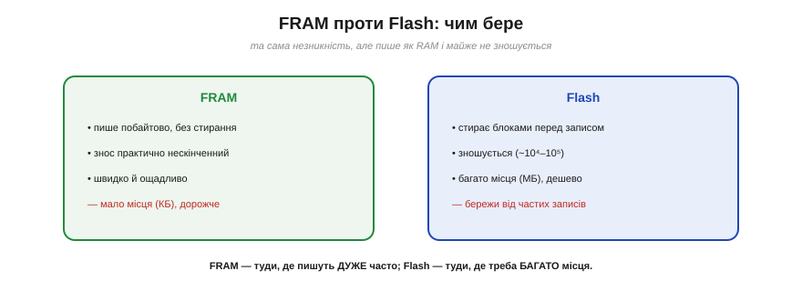
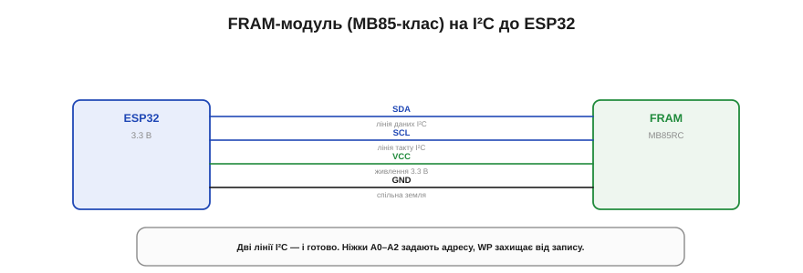

# 🔌 FRAM (MB85-клас): пам'ять, яку не зносити

> Компонентна вставка до **теми [§4.3.3 «Зношування комірок і вирівнювання»](persistent-storage.md)**. Там ми побачили, що Flash зношується від частих записів і його доводиться берегти; FRAM — деталь, що знімає цю турботу зовсім.

## Що це за деталь

FRAM (*ferroelectric RAM*, сегнетоелектрична пам'ять) — окрема мікросхемка, що поєднує дві несумісні, здавалося б, чесноти: вона **незникна**, як Flash (зберігає дані без живлення), але **пишеться, як RAM** — побайтово, миттєво й **без стирання**. А головне — її майже **неможливо зносити**: де Flash витримує десятки тисяч перезаписів комірки (§4.3.3), FRAM витримує трильйони (Рис. 4.3.3c.1). Для практики це означає просте: «пиши скільки хочеш і не рахуй».


*Рис. 4.3.3c.1. FRAM пише побайтово, без стирання, і знос її практично нескінченний — та її мало (КБ) і вона дорожча. Flash дешевий і місткий (МБ), але стирає блоками й зношується. FRAM — де пишуть дуже часто; Flash — де треба багато місця.*

Розплата за ці чесноти — **обсяг і ціна**. FRAM маленька: типово одиниці–десятки кілобайтів, а не мегабайти, як Flash, і коштує за байт помітно дорожче. Тому її не беруть під файли чи прошивку — її беруть туди, де треба **часто й надійно** зберігати **трохи**.

## Куди вона ідеально лягає

Згадайте дві задачі з §4.3.3, на яких Flash потерпає:

- **лічильник, що тікає щосекунди** — на Flash він з'їв би ресурс сектора за дні; на FRAM крутиться роками без оглядки;
- **«чорна скринька»** — реєстратор, що мусить зберегти останній стан **просто перед** зникненням живлення: FRAM пише так швидко й дешево, що встигає записати буквально на згасанні.

Це її стихія: дані малі, але оновлюються невпинно.

## Розпіновка й підключення

Модулі MB85-класу бувають двох ґатунків за шиною. **MB85RC** говорить по **I²C** — дві лінії, найпоширеніший варіант:

```
VCC    — живлення 3.3 В
GND    — спільна земля
SDA    — лінія даних I²C
SCL    — лінія такту I²C
A0..A2 — задають адресу (кілька чипів на одній шині)
WP     — захист від запису (необов'язковий)
```


*Рис. 4.3.3c.2. Підключення MB85RC по I²C: дві сигнальні лінії (SDA, SCL) плюс живлення й земля. Ніжки A0–A2 задають адресу на шині, WP за бажання захищає від запису.*

**MB85RS** — те саме, але по **SPI** (швидше, з окремим CS, як у SD-модуля). Для ESP32 живлення 3.3 В, дві (I²C) чи чотири (SPI) сигнальні лінії — і все готово.

## Перший байт

З FRAM працюють найприродніше з усіх сховищ: для програми це просто **пам'ять за адресою**. Підключаєте бібліотеку, кажете «запиши за зсувом 0 число 42» — і воно там, миттєво й назавжди. Жодних секторів, стирань чи commit'ів — пишеш байт і йдеш далі. Перша перевірка: записати значення, перечитати, вимкнути-увімкнути живлення й переконатися, що воно вціліло.

## Типові граблі

- **Адреса на шині.** На I²C адресу задають ніжки A0–A2; лишите їх «висіти» абияк чи зіткнете з адресою іншого пристрою — чип не озветься.
- **Переплутати з EEPROM.** Зовні модуль FRAM схожий на дешевий EEPROM тих самих обрисів — але EEPROM повільний і **теж зношується**. Перевіряйте марку: MB85… — це справді FRAM.
- **Обсяг.** Легко забути, яка вона крихітна: спроба покласти туди кілобайти логів швидко впреться в стелю. FRAM — для дрібного й частого, не для об'ємного.
- **WP лишився активним.** Якщо вивід захисту від запису випадково підтягнутий — запис мовчки не проходить.

## Варіації класу

Ємність — від часток кілобайта до десятків КБ. Шина — I²C (простіше, повільніше) або SPI (швидше, більше дротів). Трапляються й окремі мікросхеми для пайки, і готові модулі-«брелоки» для макетної плати. Принцип скрізь однаковий: незникна пам'ять, яку не треба берегти від зносу, — саме те, чого бракувало Flash у §4.3.3.
