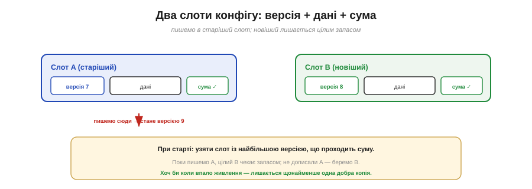
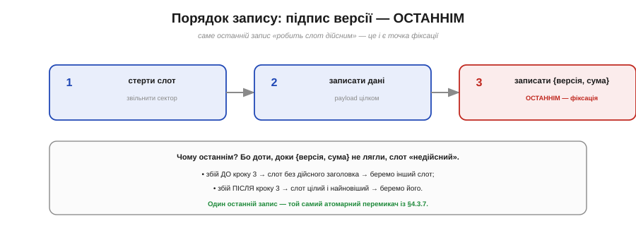

# ⚙️ Атомарне оновлення конфігурації: два слоти + лічильник версії + контрольна сума

> Алгоритмічна вставка до **теми [§4.3.7 «Цілісність даних»](persistent-storage.md)**. Там ми вивели рецепт у загальних рисах; тут — крок за кроком, із наголосом на тонкощі **порядку** записів.

## Задача

Маємо конфіг — невелику грудку даних (налаштування, калібрування), яку час від часу **оновлюють**. Треба, щоб збій живлення в будь-яку мить оновлення лишив нас або з **повністю старим**, або з **повністю новим** конфігом — але ніколи з напіврозбитим (§4.3.7). NVS і LittleFS роблять це за вас; та коли ви пишете в «голий» Flash самотужки, рецепт треба знати.

## Ідея

Заводимо **два слоти** — A і B — в **окремих** секторах (щоб стирання одного не чіпало іншого). Кожен слот містить три речі: **версію** (число, що росте), **дані** й **контрольну суму** (Рис. 4.3.7a.1). Правило оновлення:

```
пиши завжди в той слот, що ЗАРАЗ старіший (не чинний),
а новій копії дай більший номер версії
```

Поки ми заповнюємо старіший слот, чинний (новіший) стоїть недоторканий — отже, є запас на випадок збою. А при старті беремо слот із **найбільшою версією серед тих, що проходять суму**.


*Рис. 4.3.7a.1. Два слоти, у кожного версія, дані й сума. Пишемо завжди в старіший слот, давши новій копії більший номер; новіший стоїть цілим запасом. При старті беремо слот із найбільшою версією, що проходить суму, — тож добра копія є завжди.*

## Тонкість, що вирішує все: порядок запису

Уся надійність тримається на **одній** деталі — у якому порядку класти три частини слота (Рис. 4.3.7a.2). Підпис «версія + сума», що **робить слот дійсним**, треба писати **ОСТАННІМ**, уже після того, як дані повністю лягли:

```
1) стерти слот
2) записати дані (payload)
3) записати { версія, сума }   ← ОСТАННІМ: це точка фіксації
```

Чому саме так? Бо доти, доки крок 3 не зроблено, слот не має дійсного заголовка — і відновлення його просто не візьме. Збій **до** кроку 3 → слот «недійсний», беремо інший (старий, цілий). Збій **після** → слот цілий і найновіший, беремо його. Той самий **атомарний перемикач** із §4.3.7: один останній запис вирішує все.


*Рис. 4.3.7a.2. Порядок усередині слота: стерти → записати дані → і лише ОСТАННІМ записати {версія, сума}. Доти слот недійсний; збій до кроку 3 лишає чинним інший слот, після — цей. Один останній запис — точка фіксації (§4.3.7).*

Якби ж ми писали навпаки — спершу версію, потім дані, — то збій між ними лишив би слот із «дійсною» версією, але **напіврозбитими** даними, і відновлення повірило б у сміття. Тому порядок тут не косметичний, а критичний.

## Псевдокод

```
save(config):
    s = слот, що зараз НЕ найновіший           (старіший із двох)
    v = найбільша наявна версія + 1
    стерти s
    записати дані config у s
    записати { v, crc(v, config) } у s         ← останнім!

load():
    для кожного слота: перевірити суму
    серед тих, що пройшли → узяти з найбільшою версією
    жодного дійсного → це перший старт: узяти типові значення
```

## Складність і пастки на МК

- **Порядок — понад усе.** Підпис (версія+сума) — лише після даних. Це головна й найлегша для забуття помилка.
- **Окремі сектори.** Слоти мусять лежати в **різних** секторах, вирівняні на 4 КБ (§4.3.4): інакше, стираючи один, зачепиш інший — і втратиш обидві копії разом.
- **Лічильник версії.** Беріть достатньо широкий, щоб не «обернувся». Порівнюєте лише дві версії — тож можна й нормалізувати (після читання звести до 0/1), аби число не зростало вічно.
- **Сума, не підпис.** Контрольна сума ловить **випадкове** псування, але не зловмисну підміну (§4.3.9) — для конфігу зазвичай цього й досить.
- **Знос.** Кожне `save` стирає сектор слота — отже, зношує. Але два слоти **чергуються**, тож знос ділиться навпіл проти одного слота; для рідкісних оновлень конфігу це некритично.
- **Не винаходьте, якщо є NVS.** Усе це NVS уже робить усередині (§4.3.5). Писати руками варто лише там, де NVS чомусь недоступний, — інакше беріть готове.

## Підсумок

Два слоти, версія, сума — і **підпис останнім кроком**. Ось і весь секрет відмовостійкого конфігу: завжди є ціла копія, а останній запис чесно перемикає «чинне» з одного на інше, не лишаючи місця для «напіврозбитого».
