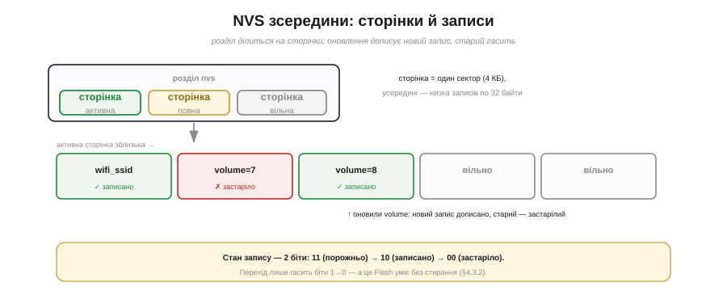
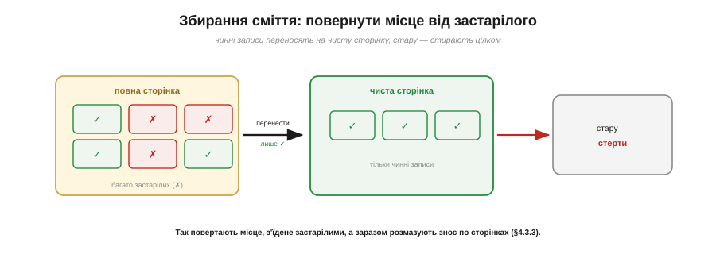

# ⚙️ NVS зсередини: журнал записів, сторінки, збирання сміття

> Алгоритмічна вставка до **теми [§4.3.5 «NVS: сховище ключ–значення»](persistent-storage.md)**. Там NVS був чарівним словником; тут зазирнемо під капот — як він тримає слово «надійно» на впертому Flash.

## Задача

NVS обіцяв багато: побайтово оновлювані пари «ключ → значення», стійкість до втрати живлення й бережливість до зносу. Але Flash нічого з цього **задарма** не дає: переписати на місці не можна (спершу стерти сектор, §4.3.2), а кожне стирання наближає знос (§4.3.3). Як же побудувати зручний словник на такому неподатливому фундаменті?

## Ідея

NVS не переписує — він **дописує** (Рис. 4.3.5a.1). Розділ nvs ділиться на **сторінки** (кожна = один сектор, 4 КБ), а сторінка — на однакові **записи**. Щоб задати чи змінити ключ, NVS бере вільний запис, кладе туди {ключ, значення} і позначає його «записаний». Старий запис того ж ключа він фізично не чіпає — лише позначає «застарілий». Прочитати ключ — означає знайти **останній** запис із позначкою «записаний» для нього.


*Рис. 4.3.5a.1. Розділ nvs ділиться на сторінки (по сектору), сторінка — на записи. Оновлення дописує новий запис і гасить старий. Стан запису — 2 біти: 11 (порожньо) → 10 (записано) → 00 (застаріло); кожен перехід лише гасить біт, а це Flash уміє без стирання (§4.3.2).*

Найхитріше — як **міняти позначку** запису, не стираючи сектор. Тут NVS спирається на фізику з §4.3.2: Flash уміє **гасити** окремі біти (1→0) без стирання, а от ставити (0→1) — лише стиранням цілого сектора. Тому стан запису кодують **двома бітами**: `11` — порожньо, `10` — записано, `00` — застаріло. Кожен перехід (`11→10`, `10→00`) лише **гасить** біт — і робиться без жодного стирання. Елегантно: рух стану в один бік ідеально лягає на правило «гасити можна, ставити — ні».

Застарілі записи, звісно, накопичуються й з'їдають місце. Коли сторінка заповнюється, вступає **збирання сміття** (Рис. 4.3.5a.2): NVS бере повну сторінку, **переносить** із неї живі (ще «записані») записи на чисту сторінку, а стару **цілком стирає**. Місце, з'їдене застарілими, повертається у вжиток, а заразом записи переїжджають на нову сторінку — і знос розмазується по всьому розділу сам собою.


*Рис. 4.3.5a.2. Коли сторінка повна й застарілих багато, NVS переносить лише чинні записи на чисту сторінку, а стару стирає цілком. Так повертають місце, з'їдене застарілими, і заразом розмазують знос по сторінках (§4.3.3).*

## Псевдокод

```
set(ключ, значення):
    e = вільний запис на активній сторінці   (нема місця → збирання сміття)
    записати { ключ, значення } у e
    позначити e = «записаний»                (11 → 10)
    якщо для ключа був старий запис:
        позначити старий = «застарілий»       (10 → 00)

get(ключ):
    знайти останній запис із позначкою «записаний» і цим ключем
    повернути його значення

збирання сміття:
    обрати повну сторінку з багатьма «застарілими»
    перенести всі «записані» записи на чисту сторінку
    стерти стару сторінку цілком
```

## Складність і пастки на МК

- **Читання — це пошук.** `get` пробігає записи: O(n). NVS тримає це швидким, бо розділ малий, а службові дані кешуються; та все ж не сподівайтеся на «миттєво, як у RAM».
- **Великі значення дробляться.** Рядок чи blob, що не влазить в один (32-байтовий) запис, NVS ріже на **шматки** в кількох записах і збирає назад при читанні.
- **Цілість кожного запису.** Запис несе свою позначку (а дані — контрольну суму), тож збій посеред дописування лишає запис у стані «не дописано» — і NVS його ігнорує (той самий захист, що в §4.3.7).
- **Потрібен запас сторінок.** Збиранню сміття **нема куди** переносити живе, якщо немає вільної сторінки. Тому розділ nvs не може бути в одну сторінку — потрібно щонайменше кілька (мінімум — три сектори, 0x3000).
- **Збій під час збирання.** NVS стирає стару сторінку **лише після** того, як нова повністю готова, — отже, перерване збирання відновлюване, бо живі записи весь час є щонайменше в одному місці (атомарний перемикач, §4.3.7).
- **Часті записи все одно коштують.** Кожен `set` — це дописування, а ланцюжок дописувань рано чи пізно запускає стирання через збирання сміття. Тому порада з §4.3.5 лишається: не пишіть у щільному циклі.

## Підсумок

NVS — це **журнал**, що прикидається словником: дописуй, гаси старе двома бітами, прибирай повні сторінки збиранням сміття. Три прості правила — і на впертому Flash виходить зручне, надійне й бережливе сховище «ключ → значення».
