# Розділ 4.3 — Постійні дані: Flash-розділи, NVS і файлові системи

У [Розділі 4.1](../ch20-mcu-esp32/ch20-mcu-esp32.md) ми розвели дві пам'яті чипа: **Flash** для коду й **SRAM** для робочих даних. А в [Розділі 4.2](../ch21-toolchain/ch21-toolchain.md) побачили, як ваш образ лягає у Flash. Та лишилося питання, від якого нікуди не дітися в реальному пристрої: куди подіти **дані, що мусять пережити вимкнення**? SRAM їх миттю забуває; область з образом коду — не місце для ваших змінних. Налаштування, калібрування, лічильники, журнали — усе це треба десь **зберігати надовго**, і єдине підхоже місце на чипі — той самий **Flash**, але вже не під код, а під ваші дані.

Цей розділ — про те, як жити з Flash як зі сховищем: як він улаштований зсередини (сторінки, сектори, **стирання перед записом**), чому він **зношується** і що з цим робить вирівнювання зносу, як Flash ділять на **розділи**, як зберігати дрібні налаштування через **NVS** («ключ–значення») і великі дані через **файлові системи** (LittleFS, SPIFFS, SD-картка), як уберегти запис від **втрати живлення** посеред нього, як влаштовано подвійний образ для оновлень і, нарешті, як захистити прошивку й дані **secure boot**-ом і шифруванням. Наскрізна думка проста: Flash — пам'ять примхлива, і вся майстерність постійного зберігання — у тому, щоб поважати її правила.

> 📜 **Перед матеріалом — історія:** [Фудзіо Масуока і Flash — пам'ять, названа за спалахом](r03-history-flash.md). Вона показує, *звідки* взялася ця пам'ять, чому її назвали «flash», і як проривний винахід одного інженера дав світові і вашу прошивку, і кожну флешку та SD-картку.

---

## 4.3.1 Навіщо зберігати: конфігурація, калібрування, логи

Перш ніж занурюватись у тонкощі Flash, спитаймо найпростіше: а **що** взагалі пристрою треба зберігати «надовго» — і навіщо? Бо відповідь визначить усе подальше: який механізм брати, скільки місця виділяти, як часто писати. Почнімо з болю, який це все вирішує.

### Чому самої SRAM не досить

Згадаймо з [§4.1.2](../ch20-mcu-esp32/ch20-mcu-esp32.md): робочі дані пристрою живуть у **SRAM**, а вона **енергозалежна** — зникло живлення, і весь її вміст миттю стерто. Для багато чого це байдуже: поточне показання давача, лічильник у циклі, проміжний результат — усе це пристрій порахує **наново** після ввімкнення, тож втрачати його не шкода. Але є дані **іншого ґатунку** — ті, що відновити нізвідки (Рис. 4.3.1.1). Wi-Fi пароль, який ввів користувач; поправку, що робить давач точним; журнал того, що пішло не так. Якщо вони живуть лише в SRAM, то кожне вимкнення стирає їх **назавжди** — і пристрій щоразу прокидається безпорадним немовлям.

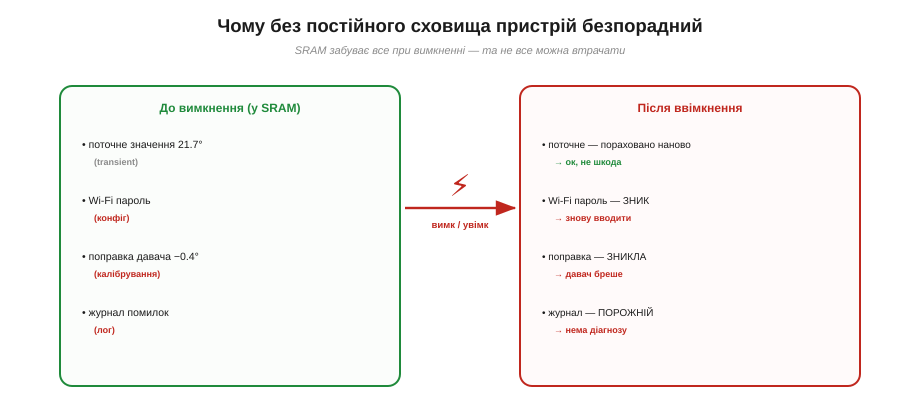
*Рис. 4.3.1.1. Вимкнення стирає всю SRAM. Поточне значення зникає — і не шкода, бо його міряють наново. А от Wi-Fi пароль, поправку давача й журнал відновити нізвідки: зникли — то й по всьому. Висновок: частину даних втрачати не можна, але SRAM берегти їх не вміє.*

Варто на мить відчути всю абсурдність пристрою без постійного сховища. З самою лише SRAM він страждає на повну **амнезію**: кожне ввімкнення для нього — народження з чистого аркуша, без жодної пам'яті про те, ким він був мить тому. Хоч скільки його налаштовуй, хоч як ретельно калібруй — одне моргання живлення, і він знову нічого не знає. Жити з таким неможливо: реальному пристрою потрібна **тяглість**, ниточка пам'яті, що з'єднує його «вчора» і «сьогодні» крізь вимкнення. Цю ниточку й дає постійне сховище.

Корисно одразу прийняти просту картину: у будь-якому пристрої стан живе у **двох** місцях. Швидкий, **робочий** стан — у SRAM: він мінливий, його не шкода, він зникає при вимкненні й відроджується сам. А **тривкий** стан — у Flash: те, що визначає, ким пристрій лишається між запусками. Уся ця тема, по суті, про те, як провести межу між цими двома — що лишити мінливому, а що довірити тривкому. І більшість новачкових багів зі сховищем — це або забуте «зберегти потрібне», або зайве «зберегти непотрібне»; обидва — наслідок розмитої межі.

Звідси й потреба в **постійному сховищі** — місці, що переживає вимкнення. На чипі таке місце одне — **Flash** (той самий, з історії розділу), тільки тепер не під код, а під ваші дані. Лишається зрозуміти, які саме дані туди класти. Їх зручно розділити на **три роди** (Рис. 4.3.1.2), бо в кожного — своя природа й свої правила.

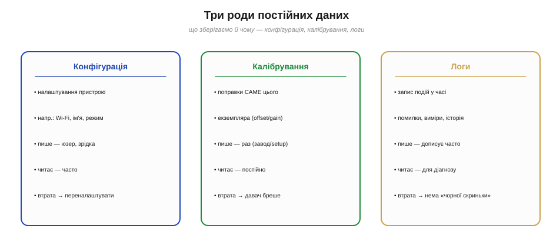
*Рис. 4.3.1.2. Три роди даних, що мусять пережити вимкнення. **Конфігурація** — налаштування (пише користувач, зрідка). **Калібрування** — поправки саме цього екземпляра (пише раз). **Логи** — запис подій у часі (дописує часто). У кожного — своя ціна втрати.*

### Конфігурація: налаштування, що пам'ятає пристрій

Перший рід — **конфігурація** (*configuration*): те, що користувач чи установник **налаштував**, і що має лишитися таким після перезавантаження. Wi-Fi мережа й пароль, ім'я пристрою, задана температура, обраний режим, мережеві адреси. Цей рід має характерний візерунок: його пишуть **зрідка** (коли користувач щось змінив), а читають **часто** (щостарту, а то й постійно). Втратити конфігурацію — означає змусити людину **переналаштовувати** все наново, що з боку користувача виглядає як поломка: «я ж усе налаштував, а воно забуло».

Конфігурації в реальному пристрої набирається чимало: окрім Wi-Fi — розклад роботи розумної розетки, пороги спрацювання давача, яскравість екрана, мова інтерфейсу, адреса сервера, куди слати дані, обрані одиниці вимірювання. Усе це людина задає **один раз** і слушно очікує, що пристрій це **запам'ятає** — назавжди, а не до першого відключення світла. Що складніший пристрій, то більше в нього таких налаштувань і то болючіше їх загубити.

> 🔧 **Навіщо це.** Будь-який пристрій, складніший за ліхтарик, має конфігурацію — і користувач очікує, що вона **запам'ятається**. Уявіть розетку, що забуває розклад при кожному блиманні світла, або термостат, який після відключення живлення скидає вашу комфортну температуру на заводську. Збереження конфігурації — не розкіш, а базова гідність пристрою.

### Калібрування: поправки саме цього екземпляра

Другий рід тонший — **калібрування** (*calibration*). Жоден реальний давач не ідеальний: один термістор показує на пів градуса більше, інший — менше; АЦП у кожному чипі трішки зміщений (пам'ятаєте нелінійність АЦП ESP32 з §4.8.6?). Калібрування — це **поправки**, що роблять **саме цей екземпляр** точним: зсув, нахил, заводський підлаштунок. Їхній візерунок — найхарактерніший: пишуть їх **раз** (на заводі чи під час першого налаштування), а читають **постійно**, на кожному вимірі. Втратити калібрування — означає, що давач почне **брехати**: не зламається явно, а тихо даватиме криві числа, і це найпідступніший вид поломки.

Ключове тут — слово «**саме цього**». Конфігурація в усіх пристроях однієї моделі може бути різна, але задається людиною; а калібрування **унікальне для кожної фізичної одиниці** й відображає її крихітні апаратні відмінності. Тому його не можна ані зашити в код (він однаковий для всіх), ані відновити обчисленням — лише виміряти й **зберегти** для цього конкретного пристрою.

Найчастіша форма калібрування — два числа: **зсув** (offset) і **нахил** (slope), тобто «на скільки додати» й «на скільки помножити», щоб сире показання збіглося з правдою. Звідки беруться самі ці числа — окрема тема (двоточкове калібрування розберемо ближче до §4.8); а от звідки береться **потреба** в них, варто відчути вже тут. Дві однакові на вигляд плати, зійшовши з одного конвеєра, дадуть трохи різні покази: різнобій компонентів, температура паяння, мікроскопічні відмінності кремнію. Зашити одну спільну поправку в код **не можна** — для сусідньої плати вона буде хибною. Тому кожен екземпляр калібрують **окремо** й зберігають його власні числа в його власному Flash. Це і є причина, чому калібрування — не код і не спільне налаштування, а **персональні дані конкретної залізяки**.

### Логи: чорна скринька пристрою

Третій рід — **логи** (*logs*): запис того, що **відбувалося** в часі. Помилки й збої, важливі виміри, історія причин reset (із §4.1.8), моменти ввімкнення. На відміну від перших двох, лог не «налаштування», а **літопис**: його не перезаписують, а **дописують**, і він **росте**. Читають його рідко — зазвичай тоді, коли щось пішло не так і треба зрозуміти, **що саме** передувало біді. Це **чорна скринька** пристрою: поки все гаразд, вона мовчки накопичує, а в годину розслідування стає безцінною.

Що саме варто заносити в лог? Передусім **рідкісне й важливе**: помилки, збої, причини перезавантажень (ту саму історію reset із §4.1.8), перемикання режимів, виходи значень за межі. У полі, де немає ні відлагоджувача, ні очей інженера, лог часто — **єдиний** свідок того, що сталося о третій ночі за тиждень до того, як пристрій принесли в сервіс. Авіаційна «чорна скринька» тут не просто метафора: так само, як вона переживає катастрофу, щоб розповісти про її причини, лог пристрою має пережити збій і донести передісторію. Тому його не лише пишуть, а й дбають, щоб він **уцілів** при аварії, — але це вже тонкощі наступних тем.

> 🔧 **Навіщо це.** Лог — інженерна звичка, що окупається саме тоді, коли все вже погано. Поки пристрій працює, ви про нього не згадуєте; але першого ж разу, коли він «загадково перезавантажується в полі», саме збережений лог відрізнить безпорадне «годинами гадаю» від упевненого «бачу: brownout щовечора о 20:00, коли вмикається сусідній насос». Кілька кілобайтів під лог — чи не найдешевша страховка в усьому пристрої.

> ⚙️ **Як вести лог, не вбиваючи Flash.** Журнал росте безкінечно, а Flash скінченний і зношується — як це поєднати? Класична відповідь — **кільцевий лог**: пишемо по колу, рівномірно розмазуючи знос. Алгоритм розбираємо у вставці [Кільцевий лог у Flash](r03-s1-a-flash-ring-log.md).

### Чому їм потрібні різні сховища

Тепер найважливіше для всього розділу. Ці три роди не просто «різні дані» — у них **різні візерунки доступу**, і саме тому їх не можна звалити в одне сховище (Рис. 4.3.1.3). Калібрування пишуть **раз**, читають **завжди**, і воно дрібне. Конфігурацію пишуть **зрідка**, читають **часто**, вона мала. А лог **дописують часто** й він **росте** без межі. Сховище, ідеальне для дрібного «запиши раз — читай завжди», геть не годиться для «дописуй щохвилини й рости», і навпаки.

Гляньмо на конкретну незручність. Спробуйте тримати лог у сховищі «ключ–значення»: кожен новий запис — новий ключ, їх тисячі, і структура, розрахована на десяток іменованих налаштувань, тріщить по швах. І навпаки: тримати єдине налаштування «задана температура» як рядок у файлі-журналі — це гарматою по горобцях, ще й шукати останнє значення доведеться, гортаючи всю історію. Кожен інструмент гострий під свою форму даних: дрібне й іменоване — в одне, велике й послідовне — в інше. Сплутати їх — значить весь час боротися зі сховищем замість того, щоб ним користуватися.


*Рис. 4.3.1.3. Чому одне сховище не годиться всім. Калібрування: пишуть раз, читають постійно, дрібне. Конфіг: пишуть зрідка, читають часто, мале. Лог: дописують часто, ще й росте. Різні візерунки доступу → різні механізми зберігання.*

Саме з цієї різниці й виростає весь розділ попереду (Рис. 4.3.1.4). Дрібні конфіг і калібрування — це по суті кілька **іменованих значень**, тож їм пасує сховище «**ключ–значення**» (**NVS**, що його розберемо в §4.3.5): мале, швидке, надійне. А логи й великі дані, що ростуть, просяться у **файлову систему** чи **кільцевий лог** (§4.3.6) — туди, де можна дописувати й гортати. Поки що це лише попередній погляд; деталі кожного механізму — у своїх темах.

Не лякайтеся, що механізмів кілька: це не ускладнення заради ускладнення, а та сама мудрість «кожному своє». NVS бере на себе нудну, але важливу роботу з дрібними налаштуваннями — атомарно, надійно, не змушуючи вас думати про сектори й стирання. Файлові системи дають звичні «файли» там, де даних багато. А під усім цим лежить той самий Flash із його примхами, які ці механізми **ховають** від вас, поводячись із ним правильно за вас. Зрозуміти ці примхи — наступний крок; а тоді стане видно, **чому** кожен механізм улаштований саме так.

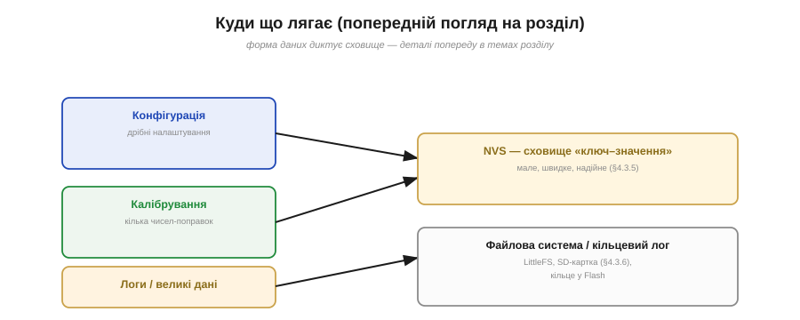
*Рис. 4.3.1.4. Форма даних диктує сховище. Дрібні конфіг і калібрування лягають у NVS («ключ–значення», §4.3.5); великі дані, що ростуть, — у файлову систему чи кільцевий лог (§4.3.6). Деталі — попереду в розділі.*

### Коли що пишуть і читають

Корисно глянути на ці три роди ще й **у часі** — за все життя пристрою (Рис. 4.3.1.5). **Калібрування** записують найраніше — **на заводі** чи під час першого налаштування, коли вимірюють поправки саме для цієї одиниці. **Конфігурацію** — пізніше, коли пристрій уперше потрапляє до користувача й той його налаштовує. А **лог** дописується **впродовж усієї роботи**. Читають же їх усі — постійно, поки пристрій живе, аж до години **сервісу**, коли лог стає головним свідком. Ця часова картина теж підказує вимоги: те, що пишуть раз, можна зробити майже незмінним; те, що дописують щодня, мусить витримати тисячі записів (а тут уже постає **знос** Flash — про нього в §4.3.3).

Має цей поділ і суто практичний наслідок для того, **хто** й **коли** записує дані. Калібрування зазвичай заносить **виробник** — на спеціальному стенді, де еталонним приладом міряють поправку для кожної одиниці; користувач його ніколи не бачить і не чіпає. Конфігурацію, навпаки, пише **користувач** — через інтерфейс налаштування, не знаючи й не бажаючи знати, що там у Flash. А лог веде **сама прошивка**, без жодної людини. Три роди даних — троє різних «авторів» у три різні моменти; і добре спроєктоване сховище це враховує, відводячи кожному своє місце.

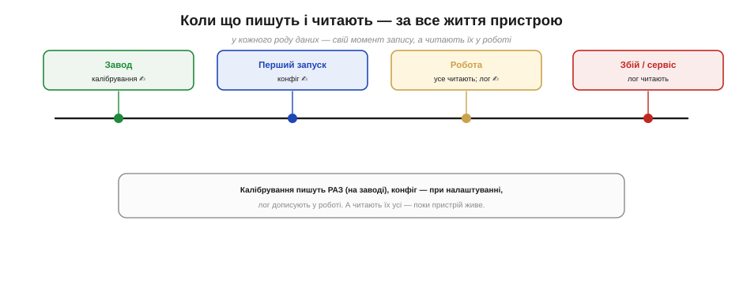
*Рис. 4.3.1.5. Кожен рід даних має свій момент запису: калібрування — на заводі, конфіг — при налаштуванні, лог — у роботі. А читають їх усі, поки пристрій живе. Звідси й різні вимоги до сховища.*

### Приклад: термостат

Зведімо все на простому пристрої — кімнатному **термостаті** (Рис. 4.3.1.6). Що йому треба пам'ятати крізь вимкнення, а що ні?

```
ЗБЕРЕГТИ (переживає вимкнення):
  задана температура  22.0°   → конфігурація (її задав користувач)
  поправка давача    −0.4°    → калібрування (цей термістор так зміщений)
  журнал збоїв                 → лог (коли й чому вимикався обігрів)

НЕ зберігати (відновлюється саме):
  поточна температура 21.7°    → міряється наново щосекунди — у Flash їй не місце
```

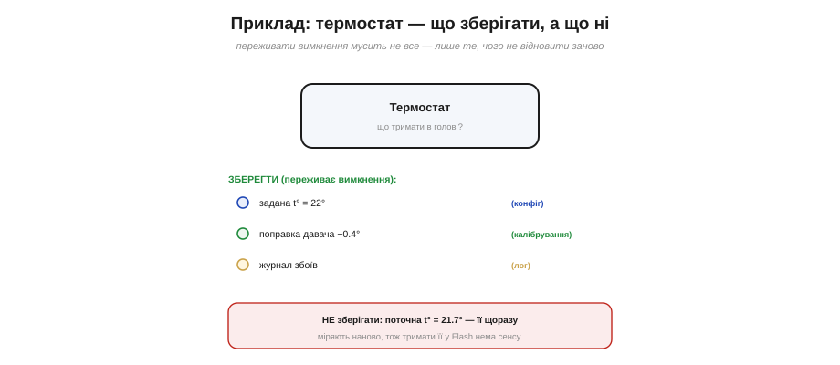
*Рис. 4.3.1.6. Термостат бережений у Flash тримає задану температуру (конфіг), поправку давача (калібрування) і журнал збоїв (лог). А поточну температуру — ні: її щоразу міряють наново, тож класти її в постійне сховище нема сенсу. Правило просте: бережемо лише те, чого не відновити заново.*

### Ціна забудькуватості

Щоб остаточно переконатися, навіщо все це, гляньмо, що буває **без** постійного сховища — по кожному роду окремо. Без **конфігурації** користувач переналаштовує пристрій після кожного відключення живлення: вводить Wi-Fi, виставляє розклад, обирає режим — щоразу; за кілька повторень це сприймається як справжня поломка, і пристрій летить у смітник. Без **калібрування** давач тихо бреше — не падає з помилкою, а просто дає криві числа, на які хтось покладається; це найдорожчий вид збою, бо його довго не помічають. Без **логів** будь-яка халепа в полі стає нерозв'язною загадкою: пристрій перезавантажився, а **чому** — невідомо, бо свідок зник разом із живленням. Усі три біди ріднить одне: вони **тихі**. Пристрій начебто працює — а насправді щоразу гублить те, що мав би пам'ятати.

### Висновок: бережи потрібне — і тільки його

Це правило — головний висновок теми, і воно економить і місце, і знос Flash: **зберігай те, чого не відновити, і нічого зайвого**. Поточні показання, проміжні розрахунки, тимчасові стани лиши SRAM — вони на те й тимчасові. А конфігурацію, калібрування й важливі події віддай постійному сховищу.

Тут є й зворотний бік, який легко проґавити: зберігати **зайве** — теж погано. Кожен запис у Flash повільніший за запис у RAM і потроху **зношує** пам'ять (про це — у §4.3.3). Тому тримати в постійному сховищі те, що й так відновлюється — поточну температуру, лічильник циклу, проміжний результат, — не лише марно, а й шкідливо: ви платите зносом і складністю ні за що. Гарне правило протилежне до жадібності: у Flash потрапляє **мінімум** потрібного, а не максимум можливого.

І ще: ці три роди — не вичерпний канон, а зручний орієнтир. Трапляються й проміжні випадки: лічильник напрацювання — щось середнє між конфігом і логом; знімок стану перед сном — окрема історія. Та хай би якими були ваші дані, перші питання до них ті самі: чи переживуть вони вимкнення **самі**? якщо ні — чи варто їх **берегти**? і **куди**, за їхньою формою, їх покласти? Відповіси чесно на ці три — і половину рішень про сховище вже ухвалено.

Розібравшись, **що** і **навіщо** зберігати, ми готові спуститися на рівень нижче — до самого Flash, і побачити, **як** він улаштований зсередини та чому вимагає особливого поводження.

## 4.3.2 Flash зсередини: сторінки, сектори, стирання перед записом

Історія розділу дала нам красиву ідею: Flash тримає біт у **пастці з електронів** (плаваючий затвор). Тепер перетворимо цю ідею на практичні правила — бо саме з фізики Flash випливає його головна примха, через яку поводитися з ним доводиться зовсім не так, як зі звичайною пам'яттю. Зрозумівши ці правила, ви назавжди позбудетеся подиву «чому не можна просто взяти й переписати байт» — найпершого, на яке спотикається кожен, хто вперше зберігає дані у Flash: пише в нього, як у звичайну змінну, і дивується, чому виходить сміття. Розберемо правило за правилом, від найголовнішого.

### Головне правило: спершу стерти, тоді писати

Ось серце всієї теми (Рис. 4.3.2.1). У Flash запис уміє рухати біти **лише в один бік**: він може **гасити** одиниці в нулі (1→0), але **не може** підняти нуль назад в одиницю (0→1). А **стерта** комірка — це всі **одиниці** (байт 0xFF). Тому запис — це завжди «взяти стерте поле з самих одиниць і **погасити** в ньому потрібні біти до нуля».

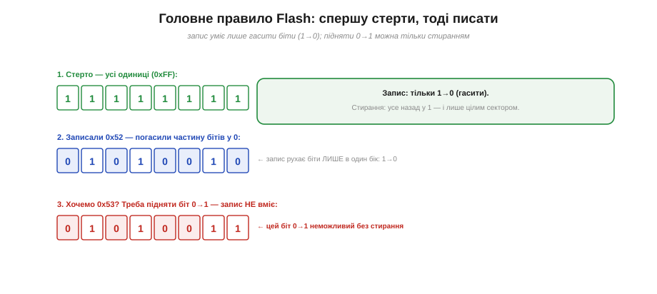
*Рис. 4.3.2.1. Стерта комірка — усі одиниці. Запис рухає біти лише в один бік: гасить 1→0. Тому щоб змінити байт так, що десь потрібен біт 0→1, доводиться спершу **стерти** (повернути все в одиниці), а вже тоді писати наново.*

Звідси й випливає **непорушне** правило: щоб **змінити** вже записане значення (а зміна майже завжди десь вимагає підняти біт 0→1), треба спершу **стерти**, і лише тоді писати. Не «перезаписати», а саме «стерти, потім записати». Чому фізично так — бо запис **заштовхує** заряд у плаваючий затвор (це й гасить біт), а витягти заряд назад можна лише операцією стирання (детальніше фізику ми зачіпали в §3.6.8). Образно: записати — це **накапати** чорнила в комірку (долити ще завжди можна), а стерти — **відбілити** цілий аркуш одразу. Долити чорнила в окрему літеру легко; а відбілити одну-єдину літеру, не чіпаючи решти, — ні, лише весь аркуш разом. Ми вже бачили цей порядок у дії: пам'ятаєте, у §4.2.5 заливання прошивки теж ішло «**стерти ділянку → записати**»? Тепер зрозуміло, **чому** інакше не можна.

### Писати дрібно, стирати гуртом

Якби стирати можна було теж по одному байту, з правилом «стерти-тоді-писати» ще можна було б легко жити. Але тут друга примха, що все ускладнює, — **асиметрія гранулярності** (Рис. 4.3.2.2). **Писати** Flash дозволяє дрібно — невеликими порціями-**сторінками** (*page*, типово ~256 байтів). А **стирати** — лише великими кусками-**секторами** (*sector*, типово ~4 кілобайти). Тобто найменше, що можна стерти за раз, у багато разів більше за найменше, що можна записати. Щоб відчути цифрами: типовий сектор у 4 КБ вміщає 16 сторінок по 256 байтів. Записати можна будь-яку **одну** з цих 16 окремо; а от стерти — лише всі 16 заразом. Дрібнішої «гумки», ніж сектор, у Flash просто немає.

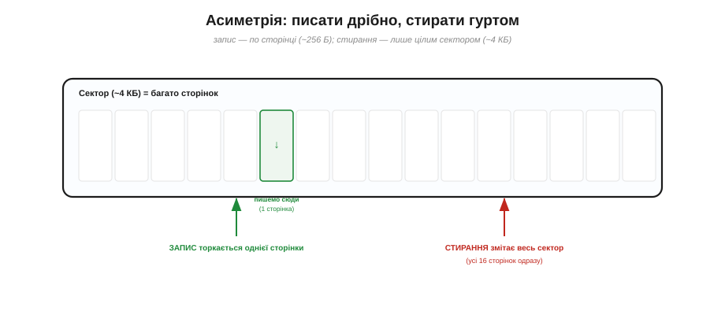
*Рис. 4.3.2.2. Писати можна дрібно — по сторінці (~256 Б). А стирати — лише цілим сектором (~4 КБ): одне стирання змітає **всі** сторінки сектора одразу. Саме з цієї асиметрії й виростає вся морока зі зміною дрібних даних.*

Наслідок драматичний: щоб **стерти** (а отже й по-справжньому змінити) бодай один байт, доводиться стерти **весь сектор**, у якому він лежить, — а разом із ним і всі інші дані, що там сусідили. Уявіть, що для виправлення одного слова на сторінці книжки треба **спалити цілий аркуш** і надрукувати його наново. Саме так і поводиться Flash.

А чому стирати взагалі доводиться так грубо, цілими секторами? Бо стирання — це фізично **різке витягування заряду** одразу з великої групи комірок, об'єднаних спільними лініями; зробити це точково, для однієї комірки, було б і складно, і дорого в кремнії. Той самий компроміс, що дав Flash дешевизну (згадайте історію розділу), і прив'язав стирання до великих блоків. Дешевизна й блочне стирання — дві сторони однієї медалі.

### Читати — миттєво; писати й стирати — повільно

Важлива річ, яку легко проґавити: усі ці примхи стосуються **запису й стирання**, а **читати** Flash — навпаки, легко й швидко. Читання довільне (як у RAM) і майже миттєве — недарма ж код виконується **прямо з Flash** (NOR, §4.1.5), не переписуючись у RAM. Тобто Flash несиметричний не лише в гранулярності, а й у **швидкості**.

Числа дають відчути масштаб. Читання — наносекунди, як у звичайної пам'яті. Запис сторінки — уже мікросекунди. А стирання сектора — аж **мілісекунди**, тобто в тисячі разів повільніше за читання. Ось чому «оновити налаштування», що тягне за собою стирання, — не миттєва дрібниця, а помітна за часом операція, під час якої чіп нерідко ще й не може читати з того самого Flash (а отже, і виконувати з нього код). Це, до речі, ще одна причина не стирати посеред чутливої до часу роботи: поки триває стирання (а це цілі мілісекунди), виконання коду з того ж чипа може **застопоритися**, і всі точні таймінги попливуть. Тривалі записи у Flash і реальний час — погані сусіди. Запам'ятати просто: **читай скільки завгодно, а писати й надто стирати — ощадливо й до діла**.

### Сторінки, сектори, блоки

Зведімо одиниці Flash в охайну ієрархію за розміром (Рис. 4.3.2.3): найдрібніше — **байт/слово**, яким ви оперуєте в коді; **сторінка** (~256 Б) — найменша одиниця **запису**; **сектор** (~4 КБ) — найменша одиниця **стирання**; **блок** (~64 КБ) — більший блок стирання, яким інколи зручніше орудувати гуртом. Числа тут орієнтовні й саме для **NOR**-Flash (того, що в чипах); у **NAND** (картки, SSD) і сторінки, і блоки помітно більші, та принцип той самий. Це не випадково: NAND жертвує зручністю дрібного доступу заради **щільності** — комірки в ній злиті в довгі ланцюжки, тож і пишуть, і стирають її більшими порціями, ніж NOR. Звідси й розподіл праці з історії розділу: дрібніший, зручніший NOR тримає **код**, а щільніший, грубіший NAND — гори **даних**. Для нас, хто має справу з кодовим Flash ESP32, головні саме NOR-числа: сторінка близько чверті кілобайта, сектор — кілька кілобайтів.

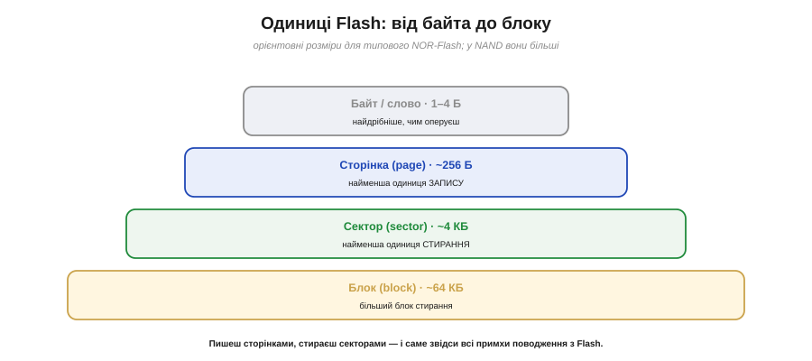
*Рис. 4.3.2.3. Одиниці Flash за розміром: байт/слово → сторінка (одиниця запису) → сектор (одиниця стирання) → блок. Орієнтовні числа для NOR; у NAND вони більші. Ключове, що варто закарбувати: **пишеш сторінками, стираєш секторами**.*

Запам'ятати варто саме ці дві «одиниці дії»: **сторінка — для запису, сектор — для стирання**. З них двох і випливає майже все подальше поводження з Flash.

### Що насправді коштує «змінити одне налаштування»

Тепер видно, чому невинне «оновити одне налаштування у Flash» насправді ховає цілий обряд (Рис. 4.3.2.4). Не можна просто взяти й перезаписати потрібні байти на місці. Доводиться: (1) **прочитати** весь сектор у RAM; (2) **змінити** там потрібний байт; (3) **стерти** весь сектор у Flash; (4) **записати** сектор назад уже з правкою. Тобто заради зміни **одного байта** перетасовують цілі **4 кілобайти** — це і повільно, і марнує ресурс.

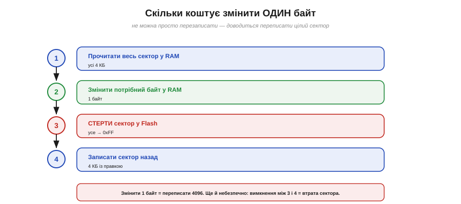
*Рис. 4.3.2.4. Що коштує змінити один байт: прочитати весь сектор у RAM, виправити байт, стерти сектор, записати назад. Заради 1 байта переписують 4096 — повільно й ризиковано: вимкнення між кроками «стерти» й «записати» лишає сектор **порожнім**, а дані — втраченими.*

І зверніть увагу, як підступно це ховається: у коді ви пишете щось на кшталт `save_setting(x)` — один невинний рядок, — а за ним коїться цілий обряд із читанням, стиранням і переписуванням кількох кілобайтів. Те, що в RAM було б одним присвоєнням за наносекунди, у Flash перетворюється на мілісекундну процедуру з ризиком утрати даних. Саме ця **прірва** між «виглядає просто» і «коштує дорого» й робить наївне поводження з Flash таким небезпечним: легко написати код, що бездоганно працює на столі, але роками тихо вбиває пам'ять у полі. Тому перший крок до правильного зберігання — навчитися **бачити** за невинним рядком коду весь той дорогий обряд, що ховається під ним.

Завважте й приховану ціну кроку «прочитати весь сектор у RAM»: щоб переписати сектор, його треба десь **тримати** — потрібні вільні кілька кілобайтів RAM під буфер. На щедрому ESP32 це дрібниця, а на крихітному 8-біт МК із сотнями байтів RAM цілий сектор може просто **не вміститися**, і доводиться хитрувати, переписуючи його частинами. Іще одна причина, чому сирий Flash незручний, а розумні менеджери цінні.

> 🔧 **Навіщо це.** Звідси два щоденні висновки. По-перше, **запис у Flash — дорога операція**: ніколи не оновлюйте там щось у гарячому циклі чи щосекунди — переплатите і часом, і зносом (про знос — наступна тема). По-друге, той момент між «стерти» і «записати» — **вікно вразливості**: якщо живлення зникне саме там, сектор лишиться стертим, а старі дані вже пропадуть. Цілісність при втраті живлення — окрема важлива тема (§4.3.7), і коріння її — саме тут, у не-атомарності циклу «стерти-записати».

Звідси й цілком конкретне правило проєктування: **групуй** записи й роби їх **рідко**. Треба оновити п'ять налаштувань — онови їх **разом**, одним переписуванням сектора, а не п'ятьма поспіль. Значення змінюється часто (лічильник, що тикає щосекунди) — тримай його в RAM, а у Flash скидай **зрідка**: раз на годину чи перед сном. Питання «а скільки разів я тут стираю?» варто ставити собі на етапі проєктування, а не тоді, коли пристрій у полі вже почав збоїти через затертий сектор.

### Хитрість зі стирання-в-один-бік

Та сама однобічність запису, що здавалася лише незручністю, насправді ховає елегантний прийом (Рис. 4.3.2.5). Якщо в стертій сторінці (усе одиниці) ви записали один запис, **решта** сторінки лишається незайманою — усе ще в одиницях. А отже, туди можна **дописати** наступний запис, **не стираючи** нічого. Більше того: щоб «скасувати» старий запис, не обов'язково його стирати — досить **погасити** в ньому один біт-прапорець (1→0, а це запис уміє!), позначивши «недійсний».

У цьому й елегантність: те, що спершу здавалося чистою вадою — «запис уміє лише в один бік», — обертається **перевагою**. Однобічність гарантує, що дописаний пізніше запис ніколи випадково не «оживить» скасований раніше: погашений біт сам не підніметься. Тобто Flash дарує безкоштовну властивість «зробленого не повернути без явного стирання» — а на ній уже легко будувати надійні журнали, де кожна дія лишає чіткий, незворотний слід.

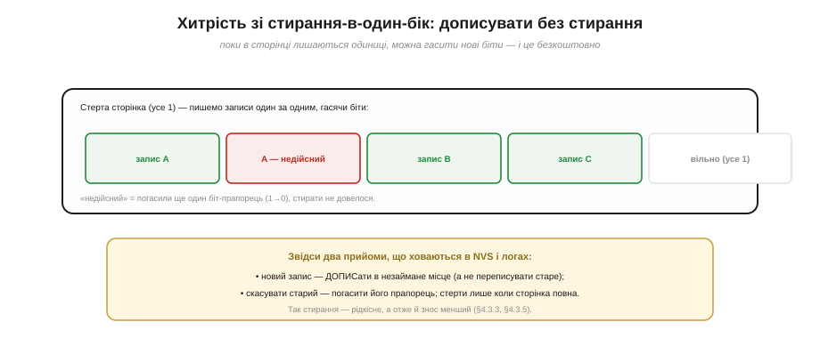
*Рис. 4.3.2.5. Поки в стертій сторінці лишаються одиниці, нові біти можна гасити без стирання. Звідси два прийоми: новий запис — **дописати** в незаймане місце (а не переписувати старий), а скасувати старий — погасити його прапорець-«дійсний». Стирати ж доводиться лише коли місце скінчилося.*

Це не дрібний фокус, а **основа** того, як улаштовані розумні сховища поверх Flash. Замість дорогого «стерти-переписати» при кожній зміні вони **дописують** нову версію в незаймане місце й гасять прапорець у старої, а ціле стирання роблять **зрідка** — коли сторінка чи сектор справді заповнилися. Так дорогих стирань стає в рази менше, а отже, менше й зносу. Саме на цій ідеї стоять і журнал NVS (§4.3.5), і кільцеві логи (§4.3.1) — ми ще побачимо її в дії.

**Приклад (оновити Wi-Fi пароль).** Наївно: пароль лежить у секторі; міняємо — отже, читаємо весь сектор у RAM, стираємо його (мілісекунди!) і пишемо назад зі зміненим паролем. Одне стирання **щоразу**. Розумно (як робить NVS): новий пароль **дописуємо** новим записом у вільне місце того ж сектора, а старий **гасимо** прапорцем-«застарів». Стирання — **жодного**, поки сектор не заповниться вщент. Десятки змін пароля — і лише одне-єдине стирання наприкінці замість десятків. Та сама дія, у рази менший знос; уся різниця — у тому, чи поважаєш ти однобічність запису.

І це підводить до того, **навіщо** взагалі всі ці хитрощі: кожне стирання потроху **виснажує** сектор — комірки витримують лише обмежене число циклів, після чого починають збоїти. Тому «менше стирати» — не просто «швидше», а ще й «довше прожити». Скільки саме циклів і як розтягти їх на роки — головна турбота наступної теми (§4.3.3); але корінь усього — тут: стирання дороге не лише часом, а й **ресурсом**.

### Чому це ховають за NVS і файловими системами

Підсумуймо чесно: сирі правила Flash **легко порушити** (Рис. 4.3.2.6). Забув стерти перед записом — отримав сміття (бо біти не піднялися). Оновив байт без read-erase-rewrite — зіпсував сусідні дані. Не подумав про знос — затер сектор «до дірки». Не вберігся від вимкнення — втратив сектор. Тримати все це в голові при кожному записі — прямий шлях до багів.

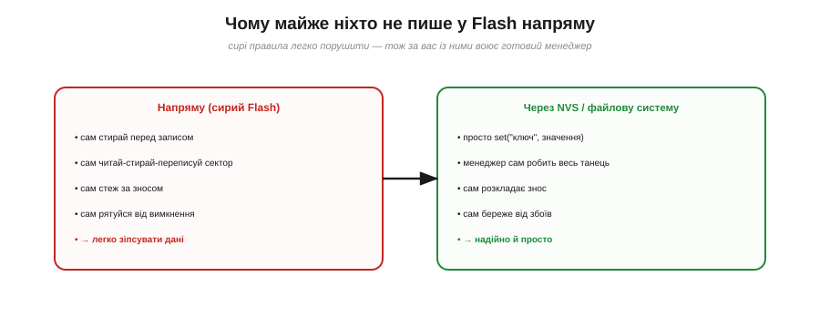
*Рис. 4.3.2.6. Сирі правила Flash легко порушити, тож напряму в нього майже не пишуть. NVS і файлові системи роблять увесь танець — стерти-переписати, розкласти знос, уберегти від збоїв — **за вас**, а ви просто кажете `set("ключ", значення)`.*

Тому в реальній розробці у сирий Flash **майже ніхто не пише руками**. Між вами й ним стоїть **менеджер** — NVS для дрібних налаштувань чи файлова система для великих даних, — який бере на себе весь цей танець зі стиранням, дописуванням і зносом, а вам лишає просте `set("ключ", значення)` чи звичні файли.

Що саме беруть на себе ці менеджери? Чимало. Вони стирають перед записом, коли треба, — і ніколи, коли не треба. Вони застосовують ту саму хитрість «дописуй, а стирай зрідка», щоб берегти ресурс. Вони **розкладають** записи по секторах так, щоб знос лягав рівномірно, а не вбивав один і той самий клаптик (вирівнювання зносу — §4.3.3). Вони дбають про цілісність, щоб раптове вимкнення не лишило вас із пів-записаним сміттям (§4.3.7). Усе це — рутина, яку легко зробити неправильно вручну, та ще й важко помітити, що зробив неправильно, аж поки дані не зіпсуються в найгірший момент.

### Підсумок: модель Flash у голові

Зведімо все в одну просту картину, яку варто тримати в голові щоразу, коли торкаєтесь Flash. **Читати** — будь-коли, будь-що, миттєво. **Писати** — лише гасити біти (1→0), сторінками. **Стирати** — лише цілими секторами, повільно, і це єдиний спосіб підняти біти назад в одиниці. А кожне стирання ще й **зношує**. З цих чотирьох тверджень механічно випливає геть усе інше: і чому зміна одного байта тягне переписування цілого сектора, і чому розумні сховища **дописують** замість переписувати, і чому в сирий Flash руками майже не пишуть. Тримайте цю четвірку в голові — і Flash перестане вас дивувати.

Решта розділу — по суті про те, **як** менеджери (NVS, файлові системи) втілюють цю модель усередині й чому саме так. Кожен їхній прийом, хай яким мудрованим здаватиметься, виявиться лише розумною відповіддю на одне з чотирьох тверджень нашої моделі. А щоб зрозуміти їхню найпершу турботу — **знос** Flash, який чигає за словами «кожне стирання зношує», — переходьмо до наступної теми.

## 4.3.3 Зношування комірок і wear leveling

Минула тема закінчилася тривожною ноткою: кожне стирання потроху **виснажує** Flash. Це не дрібна примітка, а одна з найважливіших властивостей цієї пам'яті — і та, що найчастіше вбиває пристрої в полі, причому **тихо** й непомітно. Тому розберімося як слід: чому Flash зношується, наскільки його вистачає, як його найлегше вбити необережністю — і як розумні сховища розтягують його ресурс на роки.

Тримайте при цьому в голові головну відмінність від звичної пам'яті. RAM байдуже, скільки разів у неї писати, — вона переживе мільярди перезаписів і не зморгне. Flash же — пам'ять із **обмеженим числом життів**: у кожної комірки їх лічена кількість, і витративши всі, вона вмирає. Через те звичка «пишу куди хочу й скільки хочу», цілком безпечна для RAM, для Flash стає **згубною**. Уся ця тема, по суті, про те, як перенести звички з безмежної RAM у скінченний світ Flash, нічого там не спаливши.

### Чому Flash зношується

Згадаймо фізику з історії розділу: біт у Flash — це **заряд**, замкнений у плаваючому затворі за стіною ізолятора. Щоб **записати** чи **стерти** комірку, цей заряд треба заштовхати всередину або витягти назовні — а зробити це можна, лише **продерши** електрони **крізь** саму ізоляцію (фізики звуть це тунелюванням). І щоразу, проходячи крізь ізолятор, електрони лишають у ньому мікроскопічні пошкодження (Рис. 4.3.3.1). Один прохід — дрібниця; але цикли «стерти-записати» множаться, пошкодження накопичуються, і поступово ізоляція перестає тримати заряд надійно: він починає **витікати**, або, навпаки, не заштовхується як слід. Комірка ще жива, та її біт стає **ненадійним** — то нуль, то одиниця, як пощастить.

Фізично шкода буває двоякою: частина зарядів **застрягає** в самій ізоляції, де їм не місце, а частина ламає її структуру, утворюючи «**пастки**», крізь які заряд легше тікає. Перше зміщує поріг, за яким комірку читають як нуль чи одиницю; друге пришвидшує витік. Обидва ефекти з кожним циклом наростають, аж поки межа між «нуль» і «одиниця» розмивається настільки, що комірці більше не можна вірити. Це не раптова поломка, а **поступове старіння**: спершу комірка лише гірше тримає дані з часом, а вже потім зовсім відмовляє.

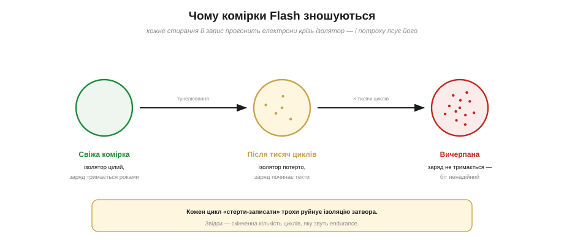
*Рис. 4.3.3.1. Знос комірки. Кожен цикл «стерти-записати» прогонить електрони крізь ізоляцію плаваючого затвора, трохи її псуючи. Свіжа комірка тримає заряд роками; після тисяч циклів ізоляція потерта й заряд починає текти; вичерпана — біт уже ненадійний. Звідси й скінченне число циклів, яке звуть **endurance**.*

Ключове слово тут — **endurance** (витривалість, ресурс): скільки циклів стирання комірка витримає, перш ніж стане ненадійною. На відміну від звичайної RAM, яку можна переписувати **безкінечно**, Flash має цей ресурс **скінченним**. І це принципово міняє те, як із ним треба поводитися: кожне стирання — не безкоштовне, а **витрата** з обмеженого рахунку.

### Скільки циклів: число endurance

Наскільки ж обмеженого? Тут добра новина: для більшості задач ресурсу **багато** (Рис. 4.3.3.2). Типовий **NOR**-Flash, що тримає код у чипах, витримує близько **100 000** циклів стирання — на кожен сектор. **NAND** (картки, SSD) витриваліший на біт по-різному, часто менше; а **багатобітові** комірки (де в одну фізичну комірку пакують два-три біти заради щільності) платять за щільність саме ресурсом — їх вистачає лише на одиниці тисяч циклів. На іншому полюсі стоїть **FRAM** — інша пам'ять, що практично **не зношується** (трильйони циклів), і саме тому її беруть там, де треба писати дуже часто.

Цей компроміс «щільність проти ресурсу» варто розкрити, бо він всюди. У найпростішій комірці зберігають **один** біт (SLC, *single-level*): лише два рівні заряду, «є» і «нема», їх легко розрізнити, тож і циклів вона витримує найбільше. Щоб подвоїти ємність, у ту саму комірку пакують **два** біти (MLC) — уже чотири рівні заряду, ближчі один до одного, а отже чутливіші до найменшого зносу; ресурс падає. Три біти (TLC) і чотири (QLC) ідуть іще далі цим шляхом: щораз більше ємності за щораз менший ресурс. Тому дешеві об'ємні SSD внутрішньо тримають **запас** зайвих секторів і агресивно вирівнюють знос — інакше їхні куці кілька тисяч циклів вичерпалися б надто швидко.

Поряд із числом циклів варто знати й про сусідній бік старіння — **утримання** (*retention*): як довго комірка тримає заряд **без** перезапису. Свіжий Flash береже дані багато років; але **зношена** комірка тримає їх гірше й коротше, бо ізоляція вже дірява. Тобто знос б'є двічі: спершу комірці важче переписуватись, а потім вона ще й гірше зберігає вже записане. Для більшості пристроїв це не клопіт — роки утримання з запасом; але для тих, що десятиліттями лежать без живлення, це окреме питання.

Ще одна втішна тонкість: число endurance у даташиті — це **гарантований мінімум**, а не межа. Виробник обіцяє, що **будь-яка** комірка витримає принаймні стільки; на практиці більшість живе помітно довше, а збоїти першими починають лише найслабші. Тому «100 000» — це радше «не менше ста тисяч», ніж «рівно сто тисяч»; запас зазвичай є. Але закладатися на нього не варто: проєктують завжди на **гарантоване** число, а несподіваний надлишок приймають як подарунок, а не як план.

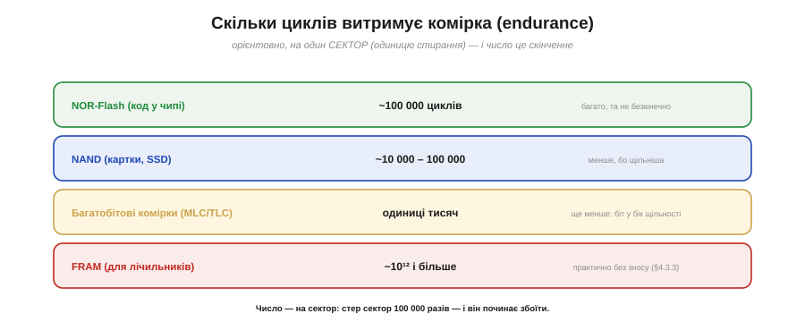
*Рис. 4.3.3.2. Орієнтовний ресурс у циклах стирання, на один **сектор**. NOR (код у чипі) ~100 000; NAND менше; багатобітові комірки ще менше (платять ресурсом за щільність); FRAM — практично без зносу. Число скінченне: стер сектор стільки разів — і він починає збоїти.*

Тут критично зрозуміти **одиницю**: ресурс рахують **на сектор** — тобто на одиницю стирання з минулої теми. Сто тисяч циклів — це сто тисяч **стирань того самого сектора**. І саме тут ховається пастка, через яку гинуть навіть пристрої з нібито «вічного» NOR.

### Пастка: гаряча точка

Уявімо найприродніший, найневинніший код: лічильник напрацювання, який ми оновлюємо у Flash, **зберігаючи його щоразу в тому самому місці**. Логічно ж — є поле «лічильник», у нього й пишемо нове значення. Але згадайте з §4.3.2: «змінити» у Flash означає «стерти сектор і переписати». Отже, кожне оновлення лічильника **стирає той самий сектор** (Рис. 4.3.3.3). Десять оновлень на хвилину — і за кілька місяців той єдиний сектор вичерпає свої 100 000 циклів і почне збоїти — а разом із ним загинуть і дані лічильника.

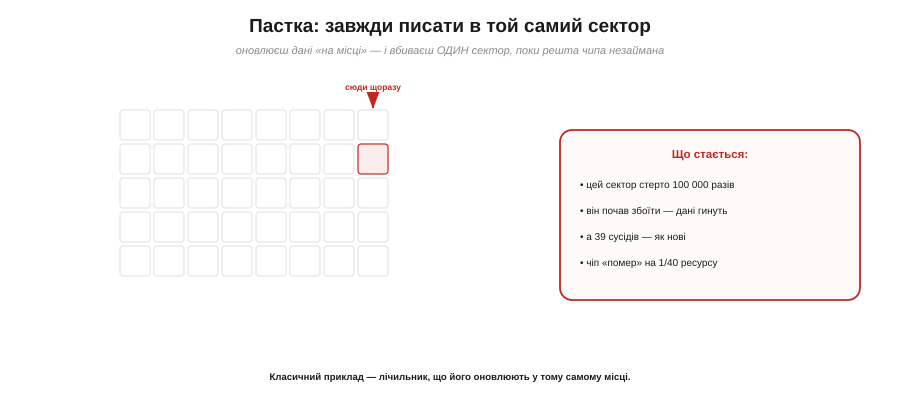
*Рис. 4.3.3.3. Пастка гарячої точки: оновлюючи дані «на місці», ви довбаєте **один** сектор. Він вичерпує ресурс і починає збоїти, поки решта чипа — як нова. Чіп «помирає» на крихітній частці справжнього ресурсу. Класичний винуватець — лічильник, що його оновлюють у тому самому байті.*

Найгірше тут — **марнотратство**: ви вбили чіп, використавши лише **дрібну частку** його сукупного ресурсу. Решта сорока секторів так і лишилися незайманими, по нулю циклів кожен, поки один-єдиний горів за всіх. Це як зносити одну сходинку до дірки, ходячи лише по ній, тоді як уся решта сходів — нові. І найпідступніше — що проявляється це не одразу: пристрій місяцями працює бездоганно, а тоді раптом починає «забувати» чи глючити, і причину — затертий до смерті сектор — знайти геть непросто.

Лічильник — лише найочевидніший винуватець; та сама пастка ховається й під іншими невинними звичками. Зберігати конфігурацію **при кожній найдрібнішій зміні** (посунув повзунок — записав) — і ось уже сектор налаштувань горить. Вести «лог», **перезаписуючи** той самий запис останньої події. Складати у Flash проміжний стан машини щокроку. Усе це — той самий гріх «довбати одне місце», лише в різних масках. Спільна ознака проста: якщо якесь дане **часто змінюється**, а ви пишете його у Flash **щоразу**, — ви на прямій дорозі до гарячої точки.

### Wear leveling: розкласти знос рівно

Рішення напрошується саме собою: не довбати один сектор, а **розподіляти** записи рівномірно по **всіх** секторах. Цей прийом і зветься **вирівнюванням зносу** (*wear leveling*) (Рис. 4.3.3.4). Замість того щоб переписувати лічильник у тому самому місці, система пише його нове значення в **наступний вільний** сектор, а старий лишає позначеним «застарілий» (пам'ятаєте хитрість «дописуй, а не переписуй» із §4.3.2?). Наступне оновлення йде в ще наступний сектор — і так по колу. У підсумку **кожен** сектор стирається приблизно **однакову** кількість разів, і жоден не вичерпується раніше за інших.

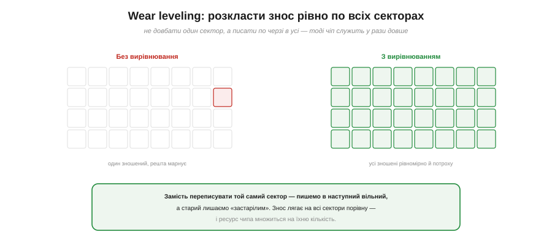
*Рис. 4.3.3.4. Wear leveling розкладає знос рівно. Замість переписувати той самий сектор — пишемо в наступний вільний, а старий лишаємо «застарілим». Знос лягає на всі сектори порівну, і строк служби множиться на їхню кількість.*

Виграш від цього **величезний**: якщо знос розкладено на, скажімо, 256 секторів порівну, то весь чіп витримає в **256 разів** більше записів, ніж витримав би один сектор. Розрізняють два ґатунки вирівнювання: **динамічне** (рівняє лише ті сектори, що активно перезаписуються) і **статичне** (час від часу пересуває й давні, незмінні дані, щоб звільнити «недознесені» сектори під ротацію). Для нас деталі не такі важливі, як головна думка: **рівномірність множить ресурс**.

А як менеджер устигає за цією ротацією, не плутаючись, де що лежить? За допомогою **відображення**. Ви звертаєтесь до даних за **логічним** іменем («лічильник», «конфіг»), а менеджер тримає окрему табличку, що каже, у якому **фізичному** секторі лежить остання, дійсна версія. Перемістив дані в інший сектор задля рівномірності — оновив табличку; для вас же ім'я лишилося тим самим. Цей шар-перекладач між «логічним, що бачите ви» і «фізичним, де воно насправді лежить» — серце і wear leveling, і файлових систем на Flash; саме він дозволяє їм **сховати** від вас усю ротацію секторів, лишивши просте `set("ключ", значення)`.

### Порахуймо строк служби

Зведімо це в просту арифметику, бо вона разюча (Рис. 4.3.3.5). Строк служби в записах — це приблизно `endurance × кількість_секторів ÷ записів_за_добу`. Без вирівнювання, коли всі записи б'ють в один сектор, чисельник губить множник «сектори»: 100 000 циклів, поділені на десяток записів за хвилину, — і пристрій мертвий за **місяці**. А з вирівнюванням той самий потік записів розкладається на сотні секторів, чисельник зростає в сотні разів — і той самий пристрій живе **роками** навіть під шквалом записів.

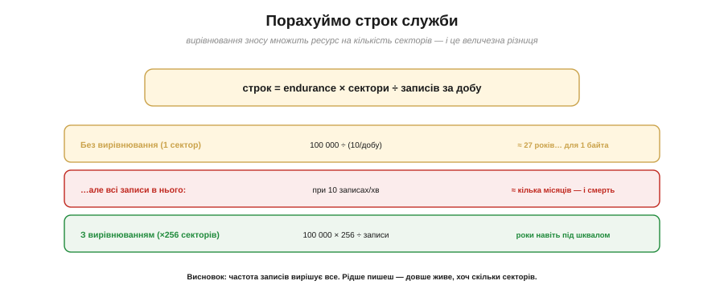
*Рис. 4.3.3.5. Строк = endurance × сектори ÷ записів за добу. Без вирівнювання всі записи б'ють в один сектор — і він гине за місяці. З вирівнюванням ресурс множиться на число секторів — роки навіть під шквалом. Висновок: **частота записів вирішує все**.*

> 🧮 **Порахувати точно.** Скільки саме років протягне ваш Flash під заданим темпом записів — від циклів стирання через вирівнювання до конкретних чисел — рахуємо у вставці [Арифметика ресурсу](r03-s3-m-endurance.md).

Прикиньмо на конкретних числах. Хай endurance — 100 000 циклів, а ви пишете налаштування **раз на хвилину** (1440 разів на добу). Б'ючи в один сектор: 100 000 ÷ 1440 ≈ **69 діб** — і за два з лишком місяці сектор мертвий. Тепер увімкнімо вирівнювання на, скажімо, 64 сектори: ресурс множиться на 64, виходить 100 000 × 64 ÷ 1440 ≈ **12 років**. А якщо ще й писати не щохвилини, а раз на годину — додайте множник 60, і строк сягне століть, тобто практично «назавжди». Ті самі дані, той самий чіп — а різниця між «два місяці» і «назавжди» лише в двох рішеннях: вирівнювати знос і не писати марно.

З цієї формули видно й головний важіль, на який ви впливаєте найбільше: **частота записів**. Хоч скільки секторів і яке вирівнювання — якщо ви пишете надто часто, ресурс однаково розтане. Тому найдієвіше — не стільки покладатися на вирівнювання, скільки **писати рідше**.

### Практика: як не вбити Flash

Зведімо все в звички на щодень (Рис. 4.3.3.6). Чого **не** робити: оновлювати дані «на місці» в тому самому секторі; писати у Flash щосекунди чи в гарячому циклі; вести швидкий лічильник, перезаписуючи той самий байт; лити логи без жодного обмеження; узагалі забувати, що в Flash скінченний ресурс. Що **робити** натомість: довірити вирівнювання зносу **менеджерові** (NVS чи файловій системі — вони роблять його за вас); тримати гаряче, мінливе значення в **RAM**, а у Flash скидати **зрідка** (раз на годину, перед сном); **групувати** й **відкладати** записи; обмежувати лог **кільцем** фіксованого розміру (§4.3.1); а для справді інтенсивних лічильників брати пам'ять, що не зношується, — **FRAM**.

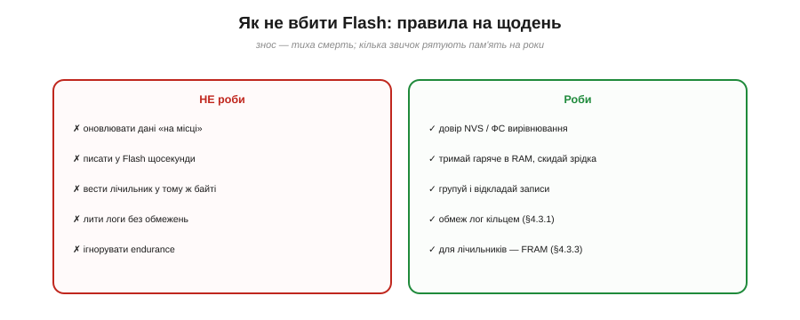
*Рис. 4.3.3.6. Як не вбити Flash. **Не:** оновлювати на місці, писати щосекунди, вести лічильник у тому ж байті, лити логи без меж. **Роби:** довірити вирівнювання NVS/ФС, тримати гаряче в RAM, групувати записи, обмежувати лог кільцем, а для справжніх лічильників брати FRAM.*

> 🔌 **Коли Flash не годиться.** Якщо лічильник чи «чорна скринька» оновлюються **дуже** часто — десятки разів на секунду, — навіть вирівнювання не врятує, і тоді беруть пам'ять без зносу: FRAM. Її розбираємо у вставці [FRAM для лічильників](r03-s3-c-fram.md).

> 🔧 **Навіщо це.** Знос Flash — найпідступніший клас помилок, бо він **тихий і відкладений**: код, що оновлює налаштування в циклі, на столі працює бездоганно, проходить усі тести — і вбиває пам'ять лише за пів року в полі, коли пристрій уже в стіні замовника. Тому питання «скільки разів я тут пишу у Flash?» треба ставити собі **на етапі проєктування**, дивлячись на код тверезими очима, а не чекати, поки перші пристрої почнуть масово «дуріти». Гарна звичка — у думці множити частоту запису на час життя пристрою й порівнювати з endurance.

А як менеджер узагалі дізнається, що сектор почав збоїти? Найпростіше — **перевіряти запис**: записав — одразу прочитав і звірив; не збіглося — отже, сектор уже ненадійний, і його позначають «битим», більше туди не пишучи. Так сховище не лише розкладає знос, а й **відстежує** його, граційно списуючи мертві сектори, поки лишаються живі. Знати це вам не обов'язково — та приємно розуміти, що під простим `set("ключ", значення)` ховається ще й тиха турбота про здоров'я пам'яті.

Підсумок простий: Flash щедрий, але **не вічний**, і вбити його найлегше одноманітністю — довбаючи те саме місце. Розумні сховища рятують вас, розкладаючи знос; ваша ж частина угоди — **писати рідко й не в одне місце**. Це знання й відрізняє іграшку від продукту: зробити пристрій, що працює тиждень на столі, легко; зробити такий, що працює **десять років** у стіні замовника, — означає, серед іншого, поважати знос Flash на кожному записі. Інженери, що цього не знають, регулярно випускають вироби, які масово «вмирають» через рік-два однаковим чином, — і довго не розуміють чому. А ви тепер знаєте. Отож, знаючи і про блочне стирання, і про знос, ми готові побачити, **як саме** Flash ділять на придатні до життя шматки — **розділи**.

## 4.3.4 Таблиця розділів (partition table) ESP32

Досі ми говорили про Flash так, ніби це один суцільний простір. Але на справжньому чипі він **не один** — у ньому одночасно живе кілька геть різних речей: і завантажувач, і ваш додаток, і сховище налаштувань NVS, і, можливо, файлова система та слоти для оновлень. Кожному з них потрібна своя, чітко окреслена ділянка Flash із власним початком і розміром. А щоб ніхто нікому не наступав на п'яти й кожен знав, де його межі, існує **таблиця розділів** (*partition table*) — карта, що ділить Flash на іменовані шматки. Розберімо, як вона влаштована й навіщо вам про неї знати.

### Flash — не один моноліт, а карта ділянок

Уявіть Flash як довгу смугу пам'яті (Рис. 4.3.4.1). На самому її початку сидить **завантажувач** — той розпорядник із §4.2.6, що першим бере керування. Десь далі лежить **ваш додаток** — власне прошивка. Окрему зону займає **NVS** для дрібних налаштувань (§4.3.5), ще одну — **файлова система** для великих даних (§4.3.6). А якщо пристрій уміє оновлюватися «по повітрю», то під додаток виділено навіть **два** слоти, щоб нову прошивку прийняти, не стираючи стару (§4.3.8). Усе це — на одному чипі, поряд.

Різноманіття цих мешканців варто оцінити окремо, бо саме воно й створює всю потребу в карті. Тут поряд лежать речі **геть несхожої** природи: незмінний завантажувач, який чіпають хіба раз на виробництві; ваш додаток, що оновлюється з кожною новою прошивкою; налаштування, що міняються від руки користувача; файли, що ростуть у роботі; службове калібрування радіо, зашите назавжди. У кожного — свій ритм життя, свій розмір, свої права на запис. Звалити їх в одну купу без меж означало б, що, оновлюючи додаток, ви ризикуєте затерти налаштування, а пишучи файл — зачепити код. Межі між ними — не бюрократія, а **захист** одного від іншого: кожен має жити у власній кімнаті, за власними дверима.

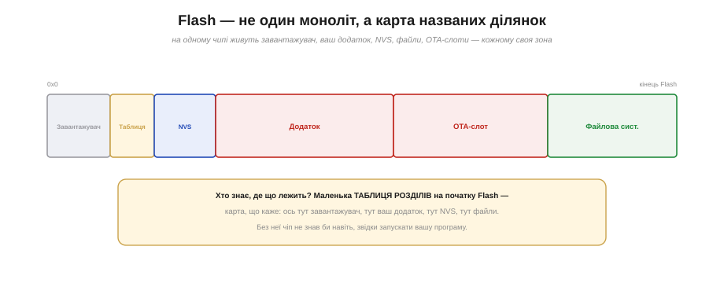
*Рис. 4.3.4.1. Flash — не суцільний шматок, а низка названих ділянок: завантажувач, таблиця, NVS, ваш додаток, OTA-слот, файлова система. Хто де лежить, каже маленька **таблиця розділів** на початку Flash — карта, без якої чіп не знав би навіть, звідки запускати програму.*

І ось ключове питання: **звідки** кожен учасник знає, де його зона? Адже Flash — це просто послідовність байтів; самі по собі вони не підписані «тут починається додаток». Відповідь — у тій самій **таблиці розділів**: невеликій структурі на початку Flash, що буквально каже «з адреси такої-то й завдовжки стільки-то лежить додаток; ось тут NVS; ось тут файлова система». Це карта чипа — і без неї завантажувач не знав би навіть, звідки запускати вашу програму.

### Таблиця розділів: маленький список-карта

Сама таблиця проста до краю (Рис. 4.3.4.2). Це короткий список, де кожен **рядок** описує одну ділянку чотирма речами: **ім'я** (як її звати — `nvs`, `factory`, `storage`), **тип** (що це за рід даних), **зсув** (*offset* — з якої адреси Flash вона починається) і **розмір** (скільки байтів займає). От і все. Завантажувач, прокидаючись, читає цю таблицю **першою** — і з неї дізнається, де лежить додаток, який треба запустити, і де всі інші зони.

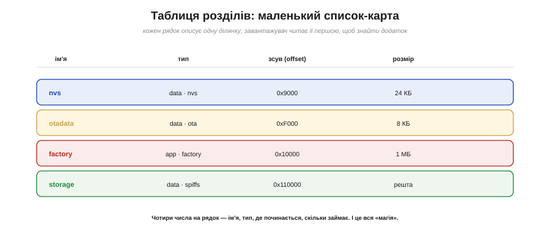
*Рис. 4.3.4.2. Таблиця розділів — короткий список, по рядку на ділянку: ім'я, тип, зсув (де починається) і розмір. Завантажувач читає її першою, щоб знайти ваш додаток. Чотири числа на рядок — і це вся «магія».*

Жодної магії тут немає — лише охайний облік. Та саме завдяки цьому простому списку Flash із безликої смуги байтів перетворюється на впорядкований простір, де в кожного мешканця своя адреса й свої межі. Поміняти розкладку — означає просто переписати цей список; додати нову зону — додати рядок.

Простежмо, як цей список оживає при старті. Завантажувач, узявши керування після скидання, знає **одну** зашиту в нього адресу — 0x8000, де лежить таблиця. Він читає її, пробігає рядки й знаходить, який app-розділ запускати (`factory` чи активний OTA-слот — про вибір трохи далі). Тоді стрибає на початок того розділу й передає керування вашому коду. Тобто таблиця — це **перший довідник**, з якого починається все життя прошивки: помилишся в ньому, і чіп або не знайде додатка, або стрибне не туди. Саме тому її розташування й формат сталі та строгі — це фундамент, на якому стоїть решта.

Ідея, до речі, не нова й не унікальна для ESP32. Так само влаштований і ваш комп'ютер: на його диску є таблиця розділів (колись MBR, тепер GPT), що ділить диск на томи — «тут система, тут дані». Espressif просто переніс цей давній і перевірений підхід на крихітний Flash мікроконтролера. Скрізь, де один носій тримає різні речі, рано чи пізно з'являється така карта-таблиця — це універсальний спосіб дати лад спільному простору.

### Типова розкладка ESP32

Щоб це не лишалося абстракцією, гляньмо на типову розкладку Flash на ESP32 «за умовчанням» (Рис. 4.3.4.3). Знизу, від найменших адрес, ідуть службові речі. Найперше — **завантажувач** (десь біля 0x1000). За ним, на фіксованій адресі **0x8000**, — сама **таблиця розділів** (її місце сталі, бо завантажувач має знати, де її шукати). Далі — **NVS** (зазвичай від 0x9000), невеличка зона для налаштувань. Потім крихітна **otadata** (від 0xF000) — лічильник, що каже, який саме OTA-слот зараз активний. І нарешті, від круглої адреси **0x10000**, починається **ваш додаток** — основна частина Flash. А за додатком, до самого кінця чипа, часто простягається **файлова система**.

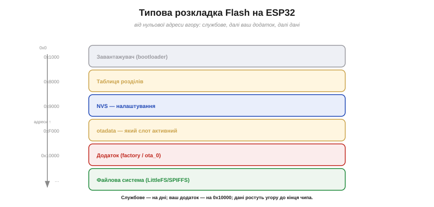
*Рис. 4.3.4.3. Типова розкладка ESP32 від нульової адреси вгору: завантажувач (~0x1000), таблиця (0x8000), NVS (0x9000), otadata (0xF000), ваш додаток (0x10000), а далі — файлова система до кінця чипа. Службове на дні, ваш код і дані — вище.*

Запам'ятовувати ці числа напам'ять не треба — їх дає середовище за умовчанням. Важливо інше: **бачити загальну логіку**. Дно Flash — під службове (завантажувач, таблиця, дрібні дані); більша середина — під ваш код; а верх — під дані, що ростуть. Коли ви побачите ці адреси в логах прошивання чи в помилці «не влізло», ви знатимете, на що дивитесь.

Чому службове тулиться саме на дні, до найменших адрес? Бо завантажувач має знаходити його **завжди й одразу**, не маючи ще жодної карти: він стартує з фіксованих, заздалегідь відомих адрес (0x1000 для себе, 0x8000 для таблиці). Якби ці адреси «плавали», курка-яйце замкнулося б — щоб прочитати карту, треба знати, де карта. Тому найнижчі адреси віддано тому, що мусить бути на місці безумовно, а все змінне й рухоме виштовхнуто вище, де його вільно совати, не зачіпаючи цей непорушний фундамент.

### Два роди розділів: app і data

Розділи бувають двох головних родів, і це поділ не формальний (Рис. 4.3.4.4). Розділи типу **app** тримають **код**, який завантажувач може **запустити**: серед них `factory` (основна, заводська прошивка) і `ota_0`/`ota_1` (два слоти під оновлення «по повітрю»). Завантажувач дивиться саме на app-розділи, вирішуючи, **що** цього разу пускати. Розділи типу **data** тримають **дані**, а не виконуваний код: сюди належать `nvs` (наше сховище ключ–значення, §4.3.5), `spiffs` чи `littlefs` (файлова система, §4.3.6), `otadata` (той лічильник активного слота) і `phy` (заводське калібрування радіо).

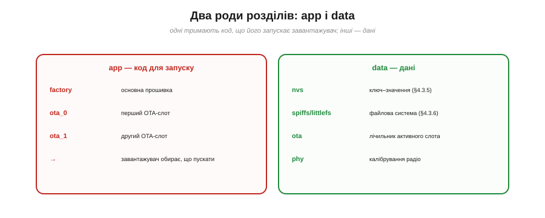
*Рис. 4.3.4.4. Два роди розділів. **app** тримає код, який запускає завантажувач: factory (основна) і ota_0/ota_1 (слоти оновлення). **data** тримає дані: nvs (ключ–значення), файлова система, otadata (який слот активний), phy (калібрування радіо).*

Цей поділ важить, бо завантажувач поводиться з ними **по-різному**: app-розділи він уміє запускати (і вибирає між ними), а data-розділи лише надає у користування вашій програмі. Сплутати їх не можна: оголосити сховище налаштувань як app — і завантажувач спробує «запустити» ваші налаштування, мов код, що, звісно, нічим добрим не скінчиться.

Підтипів data насправді більше, ніж видно в простій розкладці: бувають окремі розділи під **аварійний дамп** (куди прошивка скидає стан при паніці — згадайте backtrace із §4.2.8), під **ключі шифрування** NVS, під заводські дані. Вам рідко доведеться їх чіпати, але побачивши незнайому назву в таблиці, не лякайтеся: це просто ще одна спеціалізована зона зі своїм призначенням, описана тим самим рядком «ім'я-тип-зсув-розмір». Уся сила цієї системи саме в одноманітності: хоч би що ви додавали — лічильник, дамп, файли, — формат рядка той самий.

### Скільки всього Flash і як його поділити

Уся ця розкладка існує в межах **сукупного** обсягу Flash чипа — типово 4 МБ на поширених модулях ESP32, інколи 8 чи 16. Це і є той пиріг, що його треба поділити між усіма претендентами, і сума всіх розділів не може його перевищити. Звідси й щоденна арифметика планувальника.

Прикиньмо для уявного пристрою з 4 МБ Flash. Службове (завантажувач, таблиця, otadata) з'їдає десь 64 КБ. NVS під налаштування — ще 24 КБ, з запасом. Лишається близько 3.9 МБ на «велике»: ваш додаток і файлову систему. Хочете звичайний додаток без оновлень? Віддайте йому, скажімо, 1.5 МБ, а решту — під файли. Хочете оновлення по повітрю? Тоді під додаток треба **два** однакові слоти — а отже, по ~1.5 МБ кожен, разом 3 МБ, і на файли лишиться куди менше. Кожне «хочу» відкушує від спільного пирога, і таблиця розділів — це саме той документ, де ви чесно ділите його між бажаннями. Тому планувати розкладку варто **наперед**, ще до того, як додаток і файли почнуть тіснитися й виштовхувати одне одного.

### Чому межі «клацають» на секторах

Є в розділах одна непомітна, але важлива дисципліна: їхні межі не можна ставити будь-де — вони мусять **збігатися з межами секторів** (Рис. 4.3.4.5). Звичайний розділ вирівнюють на межу **4 КБ** (розмір сектора), а app-розділи — навіть на **64 КБ**. Причина пряма й випливає з §4.3.2: **стирання йде цілими секторами**. Якби розділ починався чи закінчувався **посеред** сектора, то, стираючи один розділ, ви неминуче зачепили б сусідній, що ділить із ним той самий сектор, — і зіпсували б його дані.

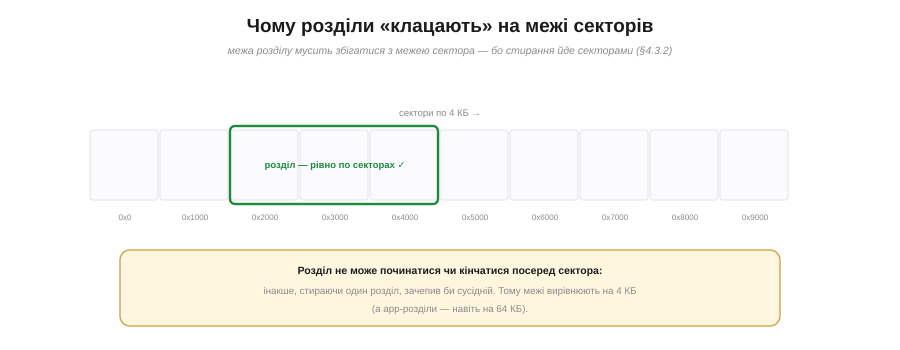
*Рис. 4.3.4.5. Межі розділів «клацають» на межу секторів (4 КБ), а app-розділи — навіть на 64 КБ. Причина: стирання йде секторами (§4.3.2), тож якби розділ починався посеред сектора, стирання одного зачіпало б сусіда. Вирівнювання тримає розділи **незалежними**.*

Тому вирівнювання — не примха, а умова **незалежності** розділів: кожен можна стерти й переписати, не торкаючись сусідів, лише якщо їхні межі чисто збігаються з межами секторів. Це гарний приклад того, як примха нижнього рівня (секторне стирання) піднімається вгору й диктує правило вищому (розкладці розділів).

Є тут і практичний наслідок, на який натикаються, складаючи власну таблицю: якщо вказати розділові зсув чи розмір, не кратний 4 КБ, інструмент або **відмовиться** будувати таблицю, або мовчки округлить — і ваша ретельно порахована розкладка попливе. Тому всі числа в таблиці прийнято писати «круглими» в одиницях сектора: 0x1000 (4 КБ), 0x10000 (64 КБ) тощо. Коли бачите в чужих розкладках саме такі адреси — тепер знаєте, що це не випадковість, а данина секторному стиранню.

### Своя таблиця: з CSV у двійкову карту

Звідки ж береться сама таблиця? Її **описують текстом** — простим файлом CSV, де кожен рядок це «ім'я, тип, підтип, зсув, розмір» (Рис. 4.3.4.6). Ви правите цей зрозумілий текст, а **збірка** під час компіляції перетворює його на компактну **двійкову** таблицю, яку й кладуть у Flash на адресу 0x8000 — і яку читає завантажувач. Зручний поділ: людина працює з читабельним CSV, а машина — з двійковим форматом.

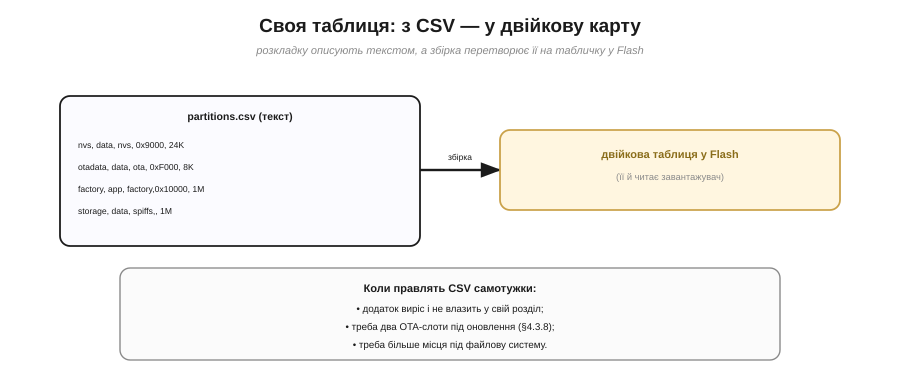
*Рис. 4.3.4.6. Свою розкладку описують текстом — CSV із рядками «ім'я, тип, підтип, зсув, розмір», — а збірка перетворює його на двійкову таблицю у Flash. Правлять CSV, коли додаток виріс і не влазить, треба два OTA-слоти або більше місця під файлову систему.*

> ⚙️ **Як писати CSV самотужки.** Тонкощі формату, зміщень і вирівнювання на 4 КіБ — коли стандартної розкладки бракує — розбираємо у вставці [Власна таблиця розділів](r03-s4-a-partition-table.md).

Навіщо взагалі лізти в цей CSV? Здебільшого через три потреби. Перша — **додаток виріс** і не вміщається у свій розділ: треба збільшити app-розділ (а отже, посунути решту). Друга — ви хочете **оновлення по повітрю**, а для нього потрібні **два** app-слоти замість одного (§4.3.8). Третя — вам потрібно **більше місця** під файлову систему чи, навпаки, під більший NVS. У всіх трьох випадках ви відкриваєте CSV і перерозподіляєте Flash між тими, хто на нього претендує.

Правлячи CSV руками, легко й помилитися, тож варто знати про три класичні граблі. **Перекриття**: два розділи ненароком налазять адресами один на одного — і, пишучи в один, ви нишком трощите інший. **Дірки**: між розділами лишилося невикористане місце — не страшно, та шкода. І **вихід за межі чипа**: сума розділів перевищила фізичний Flash, і останній розділ просто нема куди покласти. Усі три інструмент зазвичай ловить уже при збірці й свариться — але зрозуміти його скарги набагато легше, коли тримаєш у голові, що таблиця — це чесний поділ обмеженого простору, без перекриттів і без виходів за край.

Покажу на крихітному прикладі, як це читається. Уявіть три рядки: `factory, app, …, 0x10000, 0x100000`, далі `storage, data, …, 0x110000, 0x80000`, далі `extra, data, …, 0x190000, 0x80000`. Перший розділ починається на 0x10000 і займає 0x100000 (1 МБ), отже, тягнеться до 0x110000 — рівно туди, де починається другий. Другий завдовжки 0x80000 (512 КБ) доходить до 0x190000 — і там стартує третій. Жодного перекриття, жодної дірки: межі стикуються «впритул». Навчившись подумки додавати зсув і розмір та звіряти суму з наступним зсувом, ви прочитаєте будь-яку чужу розкладку, як розклад поверхів у під'їзді.

> 🔧 **Навіщо це.** Найчастіша зустріч новачка з таблицею розділів — це помилка «**не влізло**»: додаток розрісся більше за свій розділ, і збірка відмовляється заливатися. Тоді й доводиться вперше зазирнути в розкладку й зрозуміти, що Flash — обмежений простір, поділений між учасниками, і додати одному — означає відняти в іншого. Тримати в голові цю «карту» корисно ще до першої такої помилки: коли плануєте великий додаток плюс файлову систему плюс OTA, варто наперед прикинути, чи вистачить Flash усім, і як його поділити.

Підсумуймо. Таблиця розділів — це **карта Flash**: маленький список, що ділить чіп на іменовані зони (код, налаштування, файли, OTA-слоти), кожній відводячи початок і розмір. Завантажувач читає її, щоб знати, що запускати; ви правите її, коли треба перерозподілити місце. А найперша з тих зон, у яку ви зазвичай складаєте дані власноруч, — це **NVS**, сховище «ключ–значення». Саме до нього — наступна тема.

## 4.3.5 NVS: сховище «ключ–значення»

Уявіть найзвичайнісіньку потребу: пристрій має **запам'ятати** дрібницю. Ім'я Wi-Fi-мережі, яку йому задали. Гучність, що її востаннє виставив користувач. Скільки разів його вмикали. Дрібниці ці мусять пережити вимкнення живлення — отже, їм місце у Flash (§4.3.1). Та писати їх у Flash **власноруч** — морока: треба знайти вільну адресу, стерти сектор перед записом (§4.3.2), не зачепити сусідні дані, подбати про знос (§4.3.3), та ще й не загубити все це при раптовому збої. Робити таке щоразу для кожної дрібнички — справжнє покарання.

На щастя, цю роботу вже зроблено за вас. В ESP32 є готове сховище для таких-от дрібниць — **NVS** (*Non-Volatile Storage*, «незникна пам'ять»). Воно ховає всю Flash-механіку за простим і звичним образом: **словником пар «ключ → значення»**. Ви кажете «запам'ятай: гучність дорівнює сім» — і більше не думаєте ні про сектори, ні про стирання, ні про знос. Сховище саме знайде місце, саме впише, саме переживе вимкнення. Розберімо, як воно влаштоване й чому ним так зручно користуватися.

### Словник на Flash

В основі NVS — найпростіша і найзнайоміша структура на світі: **словник** (Рис. 4.3.5.1). Кожен запис — це пара: коротке ім'я (**ключ**) і прив'язане до нього **значення**. `wifi_ssid → "Home_5G"`. `boot_count → 42`. `volume → 7`. Точнісінько як записник, де навпроти кожного імені стоїть телефон, або як етикетки на банках у коморі: глянув на напис — знаєш, що всередині.

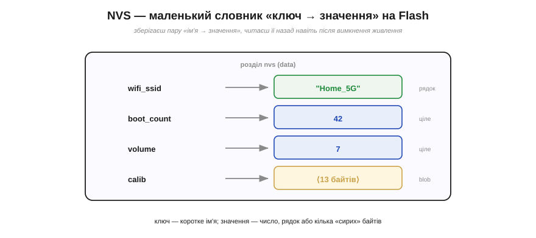
*Рис. 4.3.5.1. NVS — це словник на Flash: кожен запис є парою «ключ → значення». Ключ — коротке ім'я (`volume`, `wifi_ssid`), значення — число, рядок або кілька «сирих» байтів. Ви звертаєтесь до даних на ім'я, а не за адресою.*

Уся принадність у тому, що ви працюєте зі **зрозумілими іменами**, а не з голими адресами Flash. Вам байдуже, на якому саме байті чипа лежить гучність, — ви звертаєтесь до неї на ім'я: «дай мені `volume`». NVS сам тримає в голові, де фізично покладено кожен ключ, і подає вам значення на перший поклик. Зник той клопіт із адресами та зсувами, що мучив нас у попередніх темах: лишилися самі лиш імена, які легко й писати, й читати. Це класичний крок інженерної думки — сховати незручну механіку за звичною, людською моделлю.

Варто на мить спинитися на слові «незникна» в самій назві. Значення в NVS живе не в оперативній пам'яті, яку §4.3.1 змиває з кожним вимкненням, а у Flash — отже, переживає і висмикнуту з розетки виделку, і скидання кнопкою, і розряджену батарею. Виставив користувач якось гучність на сім — і за тиждень, за місяць, за сотню перезавантажень вона все ще сім, доки хтось не змінить її навмисно. Саме ця тривкість і робить NVS тим місцем, куди складають усе, що пристрій має пам'ятати «назавжди».

### Щоб ключі не плуталися: простори імен

Коли пристрій росте, ключів стає багато, і різні частини програми починають вигадувати імена незалежно одна від одної. Модуль Wi-Fi заведе собі `retries` (скільки разів пробувати з'єднання), і модуль гри теж захоче `retries` (скільки спроб дає гравцеві). Імена збіглися — а значення геть різні. Як їх не сплутати?

NVS розв'язує це **просторами імен** (*namespaces*) — Рис. 4.3.5.2. Простір імен — це наче окрема шухляда чи окрема сторінка записника: усередині неї ключі живуть самі по собі й не бачать ключів з інших шухляд. Модуль Wi-Fi працює у просторі `wifi`, модуль гри — у просторі `app`, і їхні однойменні `retries` спокійно існують поряд, бо повне ім'я кожного — це **простір плюс ключ**: `wifi/retries` та `app/retries` різні, як двоє Іванів із різних сіл.

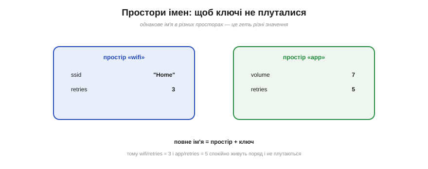
*Рис. 4.3.5.2. Простори імен розводять однойменні ключі: `retries` у просторі «wifi» і `retries` у просторі «app» — різні значення, бо повне ім'я це простір + ключ. Кожна частина пристрою працює у своїй «шухляді» й не затирає чужого.*

Звідси проста й корисна звичка: давайте кожній логічній частині свого пристрою власний простір імен. Тоді ви ніколи не затрете випадково чужу настройку, плутанини не буде, а сховище лишиться охайним і зрозумілим, навіть коли ключів набереться кілька десятків.

Якщо ж простір не назвати, NVS покладе ключ у простір за умовчанням — і доти, доки пристрій маленький, цього навіть досить. Та щойно частин стає дві чи більше, безіменне звалювання всього в одну купу починає зраджувати: рано чи пізно дві з них захочуть ключ з однаковим іменем — і одна тихо затре дані іншої. Тому звичка одразу розводити модулі по власних просторах — це та дешева обачність, що згодом економить години розплутування дивних, ніби нізвідки взятих помилок.

### Що можна покласти у значення

Значення в NVS бувають трьох родів (Рис. 4.3.5.3), і цього набору вистачає на майже все, що треба пам'ятати дрібному пристрою.

Перший рід — **цілі числа**. Лічильник увімкнень, гучність, номер режиму, яскравість. NVS розрізняє цілі різного розміру — від однобайтового до восьмибайтового, зі знаком і без, — але вам зазвичай досить знати, що «число туди кладеться й звідти береться незмінним».

Другий рід — **рядки**: будь-який текст. Ім'я мережі, пароль, назва пристрою, адреса сервера. Кладете рядок під ключем — дістаєте той самий рядок після перезавантаження.

Третій рід — **blob** (від *binary large object*, «велика двійкова грудка»): просто кілька «сирих» байтів, зміст яких знаєте лише ви. Сюди добре лягає невелика структура налаштувань цілком, або табличка калібрування датчика, або ключ шифрування. NVS не вникає, що то за байти, — він чесно зберігає їх і повертає байт у байт.

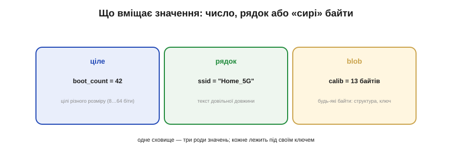
*Рис. 4.3.5.3. Значення бувають трьох родів: ціле (лічильники, гучність), рядок (імена, паролі) і blob — «сирі» байти (структура, ключ, калібрування). Трьох цих родів досить, щоб описати майже будь-яку настройку пристрою.*

Трьох цих родів — число, рядок, грудка байтів — досить, щоб описати майже будь-яку настройку. А якщо настройок багато й вони пов'язані, їх часто складають в одну структуру й кладуть однією грудкою-blob, щоб зберегти й прочитати все разом.

### Як цим користуються

Користуватися NVS просто, і весь обряд складається з кількох кроків (Рис. 4.3.5.4). Спершу ви **відкриваєте** потрібний простір імен — кажете «працюватиму з шухлядою `app`». Потім **читаєте** значення за ключем (`get`) або **задаєте** його (`set`): «постав `volume` на сім». А насамкінець — і це найважливіше — робите **commit**: команду «а тепер справді запиши все це у Flash».

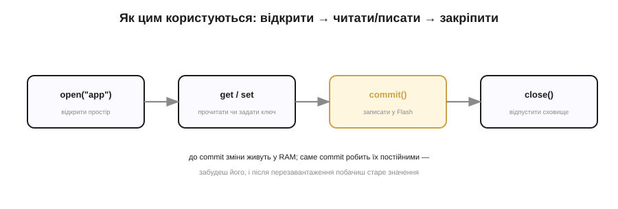
*Рис. 4.3.5.4. Обряд роботи з NVS: відкрити простір → читати/задавати ключі → commit (записати у Flash) → закрити. До commit зміни живуть лише в RAM; забудеш його — і після перезавантаження побачиш старе значення.*

На цьому commit варто спинитися, бо тут ховається класична пастка новачка. Доки ви не викликали commit, ваші зміни живуть лише в оперативній пам'яті — швидкій, але такій, що зникає при вимкненні. Забули закріпити їх через commit — і після перезавантаження побачите старе значення, наче нічого й не міняли. Тож правило просте: **поміняв — закріпи**. Робиться commit нечасто й гуртом (одразу по кількох змінах), бо саме він торкається Flash, а кожен дотик до Flash — це і час, і крихта зносу.

Є й друга зручність, про яку легко не здогадатися: читаючи ключ, ви подаєте **значення-замовчування** на випадок, якщо його ще немає. Перший запуск нового пристрою — ключів іще нема жодного; і замість того щоб щоразу перевіряти «а чи існує вже `volume`?», ви просто кажете: «дай `volume`, а як його нема — вважай, що сім». Першого разу повернеться сім, далі — те, що збережено. Це позбавляє код купи марудних перевірок «перший це запуск чи ні» й робить читання налаштувань коротким і охайним.

> 🔧 **Навіщо це.** Розділення на «задати в пам'яті» (`set`) і «записати у Flash» (`commit`) — не зайва церемонія, а захист вашого Flash. Якби кожне `set` бігло одразу у Flash, то, міняючи десять налаштувань поспіль, ви зробили б десять записів замість одного. NVS дає вам згрупувати зміни й закріпити їх **разом**, одним дотиком, — менше записів, менше зносу, довше життя чипа.

З цього випливає й практична осторога щодо **частоти** записів. NVS бережливий, але не чарівний: щоразу, коли ви робите commit, десь у Flash таки лягає новий запис, а Flash, пам'ятаємо, має скінченний ресурс стирань (§4.3.3). Тому не закріплюйте налаштування в кожному оберті головного циклу чи на кожен дотик датчика — збирайте зміни й commit'те їх зрідка: коли користувач справді щось перемкнув, перед самим вимкненням, раз на хвилину. Лічильник, що тисне commit десять разів на секунду, з'їсть ресурс свого сектора за лічені дні; той самий лічильник, закріплюваний раз на хвилину, переживе сам пристрій.

### Чому NVS надійний і береже Flash

Тут варто прочинити дверцята й глянути, як NVS поводиться з Flash усередині, — бо саме звідти його надійність. Здавалося б, оновити ключ просто: знайди старе значення й перепиши на те саме місце. Та згадаймо §4.3.2: у Flash **не можна** просто так переписати — спершу довелося б стерти весь сектор, а під час того стирання, обірвись живлення, ви лишилися б і без старого, і без нового значення.

Тому NVS чинить розумніше (Рис. 4.3.5.5). Оновлюючи ключ, він **не чіпає** старий запис, а **дописує новий** у вільне місце далі по сторінці. Старий запис лише позначається застарілим — мовляв, «це вже не чинне». Нове значення з'являється цілим **перш ніж** старе оголошено недійсним, тож у будь-яку мить — навіть якщо живлення обірветься рівно посеред оновлення — на чипі є щонайменше одне справне значення ключа. Збій не псує того, що вже було записано.

Аби це справді працювало, кожен запис NVS несе при собі маленьку **позначку цілості** — щось на кшталт прапорця «запис завершено». Якщо живлення обірвалося рівно посеред дописування, новий запис вийде недописаним — і за цією позначкою NVS при наступному старті впізнає його як **зіпсований**, просто його зігнорує й лишить чинним попереднє, ціле значення. Виходить акуратний ланцюжок: нове пишемо поряд, старе не чіпаємо, а позначка цілості розсуджує, чи можна новому довіряти. Саме тому раптове вимкнення посеред запису для NVS не катастрофа, а буденність, до якої він готовий за самою своєю будовою. До ширшої теми цілості й втрати живлення ми ще вернемося окремо в §4.3.7.

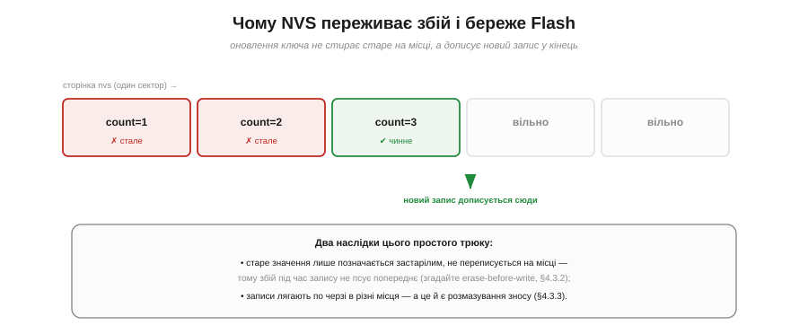
*Рис. 4.3.5.5. Оновлюючи ключ, NVS дописує новий запис у кінець, а старий лише позначає застарілим (✗) — не переписує на місці. Тому збій під час запису не псує попереднього значення (erase-before-write, §4.3.2), а записи самі розповзаються по сторінці, розмазуючи знос (§4.3.3).*

У цього прийому є приємний побічний наслідок. Оскільки кожне оновлення лягає у **нове** місце, записи самі собою розповзаються по сторінці, а не б'ють раз у раз в одну комірку, — а це ж і є те саме **розмазування зносу**, про яке ми говорили в §4.3.3. NVS, виходить, дбає про ресурс Flash автоматично, просто за своєю будовою. Звісно, застарілі записи поступово з'їдають місце; коли сторінка заповнюється, у дію вступає **збирач сміття**: він переносить чинні записи на чисту сторінку, а стару цілком стирає й повертає у вжиток. Уся ця кухня прихована від вас — ви бачите лише охайний словник, а сектори, стирання й переїзди NVS улаштовує сам.

> ⚙️ **Як це влаштовано всередині.** Журнал записів, сторінки, позначки «застаріло» і збирання сміття в NVS — у вставці [NVS зсередини](r03-s5-a-nvs-internals.md). Тут досить запам'ятати головне: NVS **дописує**, а не переписує, і прибирає за собою сам.

### NVS чи файлова система?

NVS чудовий, але не всемогутній, і важливо відчувати межу його застосунку (Рис. 4.3.5.6). Він створений для **дрібних іменованих налаштувань**: ім'я мережі, пароль, гучність, лічильники, прапорці, табличка калібрування. Це одиниці чи сотні байтів під коротким ключем, кілька десятків ключів — і не більше. У такій ролі NVS неперевершений.

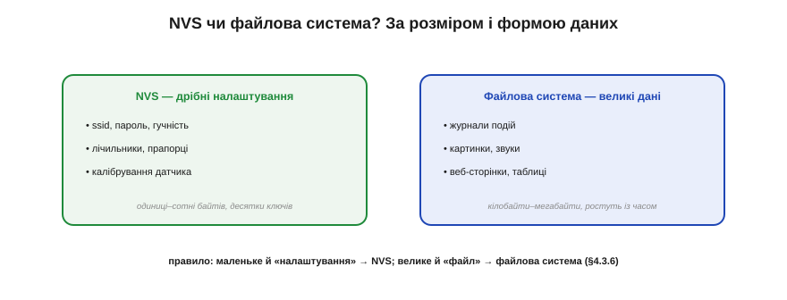
*Рис. 4.3.5.6. NVS — для дрібних іменованих налаштувань (байти–сотні байтів, десятки ключів). Файлова система — для великих даних, схожих на файли (журнали, картинки, сторінки; кілобайти–мегабайти). Правило: маленьке й «налаштування» → NVS; велике й «файл» → файлова система.*

Та коли даних стає **багато** й вони схожі радше на **файли** — журнал подій на тисячі рядків, картинка, звук, ціла веб-сторінка, велика таблиця, — NVS уже не годиться: він не для того зроблений, і пхати туди мегабайти означало б боротися з інструментом. Для такого є **файлова система** (§4.3.6) — наступна наша тема. Правило, що його варто закарбувати: **маленьке й «налаштування» → NVS; велике й «файл» → файлова система**. Сплутаєте ці двоє — і або мучитимете NVS завеликими грудками, або городитимете цілу файлову систему там, де вистачило б трьох ключів.

### Маленький приклад: лічильник увімкнень

Зберімо все докупи на крихітному, але повчальному прикладі — лічильнику того, скільки разів пристрій вмикали. При кожному старті ми хочемо прочитати збережене число, додати одиницю й покласти назад, щоб воно пережило наступне вимкнення.

```
відкрити простір "app"
n = get("boot_count")        # якщо ключа ще нема — береться 0
n = n + 1
set("boot_count", n)
commit()                     # ось тепер n справді у Flash
закрити простір
```

Перший запуск: ключа ще немає, тож `get` віддає наперед домовлене значення-замовчування — нуль. Додаємо одиницю, кладемо `1`, закріплюємо. Вимкнули, увімкнули знову — і цього разу `get` повертає `1`, ми робимо `2`, і так далі. Просте читання-плюс-один-запис, а пристрій уже **пам'ятає свою історію** між вимкненнями. На цьому ж кістяку — «прочитати, змінити, закріпити» — будуються й усі серйозніші налаштування: відмінність лише в тому, скільки ключів ви чіпаєте за один commit.

Зверніть увагу, як мало тут коду й як багато він робить. Жодного слова про адреси, сектори, стирання чи знос — усе це NVS узяв на себе, лишивши вам три рядки змісту: прочитати, додати, закріпити. Саме в цьому й суть гарної бібліотеки сховища: вона не дає вам можливостей, яких не дав би «голий» Flash, — вона **прибирає клопіт**, дозволяючи думати про сам пристрій, а не про фізику пам'яті під ним.

Підсумуймо. **NVS** — це готове сховище для дрібних постійних даних, що ховає всю складність Flash за простим словником «ключ → значення». Воно саме шукає місце, само бережно оновлює дописуванням, само розмазує знос і прибирає за собою — а вам лишає тільки імена та значення. Для дрібних налаштувань кращого годі й шукати. А коли даних забагато й вони схожі на файли — настає черга **файлової системи**, до якої ми переходимо далі.

## 4.3.6 Файлові системи на Flash: LittleFS/SPIFFS; SD-картка

У попередній темі NVS чудово впорався з дрібницями: гучність, ім'я мережі, лічильник. Та що, коли даних **багато** й вони не схожі на дрібні налаштування? Пристрій веде журнал подій, що росте день за днем. Камера зняла картинку на сорок кілобайтів. Веб-сервер на ESP32 має віддати браузеру цілу сторінку зі стилями й малюнками. Усе це — не пара «ключ → значення», а радше **файли**: названі, що ростуть, грудки даних, які зручно складати в теки, відкривати, дописувати й стирати. А там, де з'являються файли, з'являється й **файлова система** — та сама звична штука, що й на вашому комп'ютері, тільки втиснена в крихітний Flash мікроконтролера.

### Файл і тека — навіщо вони

Файл — це проста й могутня ідея (Рис. 4.3.6.1). Це названа порція даних, яка може **рости**: відкрив `log.txt`, дописав рядок, закрив — а завтра допишеш іще. На відміну від крихітного значення в NVS, файл не має наперед заданого маленького розміру; він тягнеться, скільки треба, доки є місце на чипі. А щоб у багатьох файлах був лад, їх складають у **теки** (директорії): `web/index.html`, `web/style.css`, `logs/today.txt`. Виходить знайоме деревце — корінь, гілки-теки, листя-файли.

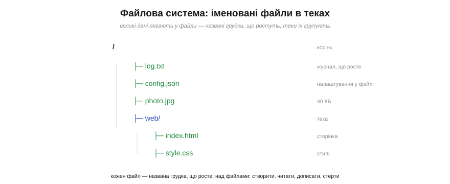
*Рис. 4.3.6.1. Файлова система — знайоме деревце: корінь, теки, файли. Файл — названа грудка даних, що росте (журнал, картинка, сторінка). Над файлами роблять звичні дії: створити, читати, дописати, стерти.*

Над файлами роблять звичні дії: **створити**, **відкрити**, **читати**, **писати** чи **дописувати** в кінець, **закрити**, **стерти**. Це той самий набір, яким ви користуєтесь на ПК, не замислюючись, — і саме його файлова система дає вашій програмі на ESP32. Різниця лише в масштабі: там терабайти, тут — кілька мегабайтів, але образ той самий, і це безцінно: знайоме не доводиться вчити наново, і код, що працює з файлами на комп'ютері, тут читається майже так само.

Варто відчути різницю між файлом і значенням NVS на дотик. Значення NVS — це маленька, цілісна річ: ти кладеш число чи рядок **цілком** і дістаєш його **цілком**. Файл — інакший: він **потоковий**, його наповнюють **поступово**, шматок за шматком, дописуючи в кінець, і читають так само — від початку, скільки треба. Тому журнал, що поповнюється рядком на хвилину цілий тиждень, природно лягає у файл (дописуй та й дописуй), а в NVS був би незграбним. Форма даних — разова дрібничка чи довгий потік — і підказує, котре сховище брати.

### Що робить файлова система

За зручним образом файлів і тек ховається неабияка бухгалтерія (Рис. 4.3.6.2). Адже Flash — це просто низка блоків байтів; самі по собі вони не знають, що ось ці три блоки — то `log.txt`, а он ті два — `photo.jpg`. Усю цю відповідність тримає **файлова система**: вона веде карту «який файл із яких фізичних блоків складається» і список **вільних** блоків, куди можна класти нові дані.

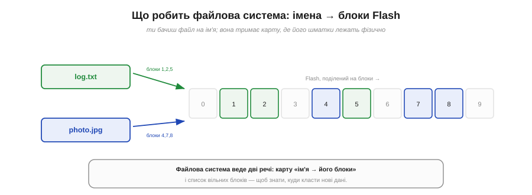
*Рис. 4.3.6.2. Ви бачите файл на ім'я; файлова система тримає карту, з яких фізичних блоків Flash він складається (хай навіть розкиданих), і список вільних блоків. Збирати клапті докупи — її робота, не ваша.*

Через це файл навіть не мусить лежати на чипі суцільно: він може бути розкиданий по блоках 1, 2 і 5, а файлова система просто пам'ятає цей порядок і збирає його для вас, коли ви читаєте. Ви ж бачите тільки рівний потік байтів «від початку до кінця файлу» й гадки не маєте (та й не мусите), що фізично вони лежать клаптями. Уся ця карта, список вільного місця, збирання клаптів докупи — робота, яку файлова система бере на себе, лишаючи вам прості «відкрий — читай — пиши».

Чому ж файл доводиться розкидати клаптями, а не класти суцільно? Бо місце на чипі звільняється й займається нерівномірно: стерли один файл посередині — лишилася дірка; новий файл більший за неї — доводиться брати ще шматок деінде. З часом вільне місце дробиться на острівці, і файлова система складає файли з того, що є. Це зветься **фрагментацією**, і на Flash вона болить не так, як на старих дисках (тут нема голівки, що мусить бігати до кожного клаптя), та все ж монтування й читання трохи сповільнює. Гарна файлова система намагається класти суміжне поряд, але диво-ладу від неї не ждіть: трохи клаптів — нормальна ціна за гнучкість «файли ростуть і стираються будь-коли».

### Чому файлову систему з ПК не взяти просто так

Може здатися: візьмімо звичайну файлову систему з комп'ютера — скажімо, FAT — та й по всьому. Але тут чигає та сама пастка, що супроводжує нас увесь розділ: **фізика Flash** (Рис. 4.3.6.3). Згадаймо §4.3.2 — у Flash не можна переписати байт на місці, спершу треба стерти цілий сектор; і §4.3.3 — кожен сектор має скінченний ресурс стирань.

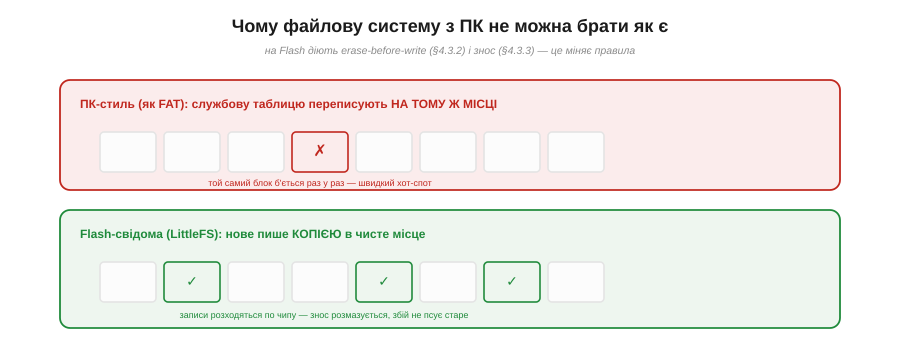
*Рис. 4.3.6.3. ПК-стиль (як FAT) переписує службову таблицю на тому ж місці — один сектор б'ється раз у раз і швидко зношується. Flash-свідома (LittleFS) пише копією в чисте місце — записи розходяться по чипу, знос розмазується, збій не псує старого.*

А класична ПК-файлова система влаштована так, що раз у раз переписує одну й ту саму службову таблицю **на тому ж місці**. На жорсткому диску це байдуже, а на Flash — згубно: один сектор лупцюється тисячі разів, доки не зноситься, тоді як решта чипа стоїть свіжою. Тому для Flash зробили **спеціальні** файлові системи, що від народження знають про erase-before-write і знос: вони не переписують на місці, а пишуть **копією в нове, чисте місце**, розмазуючи записи по всьому чипу — точнісінько як це робив NVS зі своїми записами (§4.3.5). Та сама ідея «не чіпай старе, допиши поряд», тільки тепер для цілих файлів.

### SPIFFS і LittleFS

На ESP32 такі Flash-свідомі файлові системи представлені двома іменами, і варто знати різницю (Рис. 4.3.6.4).

Старіша — **SPIFFS** (*SPI Flash File System*). Свого часу вона добре послужила, та має прикрі вади: вона **плоска** — справжніх тек у ній нема, лише імена з косими рисками, що вдають теки; вона **не захищена** від втрати живлення — обірвись струм посеред запису, і файлова система може лишитися пошкодженою; і вона помітно **сповільнюється**, коли заповнюється майже до краю. Нині SPIFFS поступово виходить з ужитку.

Новіша й тепер **рекомендована** — **LittleFS**. Вона має справжні теки, рівномірно розмазує знос, працює швидше — а головне, вона **стійка до втрати живлення**: пише за принципом «копія в нове місце» (*copy-on-write*), тож раптове вимкнення посеред запису не руйнує того, що вже було. Це та сама надійність, яку ми бачили в NVS, тільки піднята на рівень файлів.

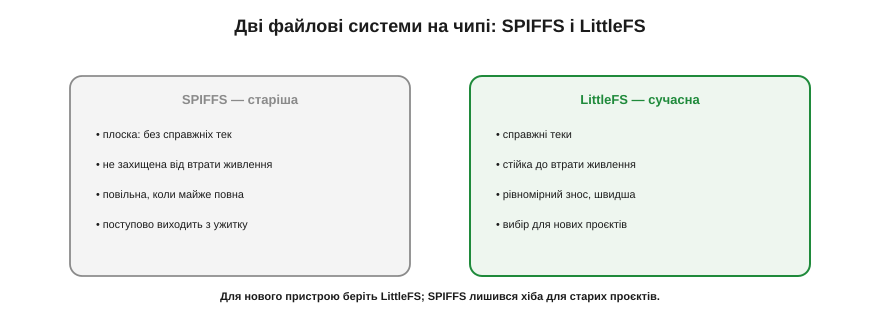
*Рис. 4.3.6.4. SPIFFS (старіша): плоска, не захищена від втрати живлення, повільна під заповнення, виходить з ужитку. LittleFS (сучасна): справжні теки, стійка до втрати живлення, рівномірний знос, швидша — вибір для нових проєктів.*

Висновок простий: для нового пристрою беріть **LittleFS**. SPIFFS лишився хіба в старих проєктах, які ще не перейшли, — і знати про нього варто радше для того, щоб упізнати його в чужому коді й не злякатися.

Варто на секунду оцінити, що означає «стійка до втрати живлення» на прикладі. Уявіть: ви переписуєте файл налаштувань, і рівно посеред запису гасне струм. У наївній файловій системі ви ризикуєте лишитися ні з чим — ні старого файлу (його вже почали затирати), ні нового (його не дописали). LittleFS же спершу пише новий вміст у чисте місце й лише останнім, **єдиним** коротким кроком перемикає внутрішній вказівник «ось тепер дійсний цей». Гасне струм до того кроку — лишається старий, цілий файл; після — новий, цілий. Проміжного «півфайлу», що його не прочитати, не буває ніколи. Запам'ятайте цей прийом — «спершу нове поряд, потім один крок-перемикач» — ми зустрінемо його ще не раз, він наскрізний для надійних сховищ.

### SD-картка: коли місця треба справді багато

Внутрішнього Flash на ESP32 — одиниці мегабайтів, і ділити їх доводиться між кодом, налаштуваннями й файлами (згадайте таблицю розділів, §4.3.4). А що, коли треба зберігати **гігабайти** — багатоденний журнал, фотографії, відео? Тоді на сцену виходить **SD-картка** — те саме зовнішнє сховище, що у фотоапаратах і телефонах (Рис. 4.3.6.5).

SD-картка під'єднується до ESP32 кількома дротами по знайомій нам шині **SPI** (а на деяких платах — швидшим інтерфейсом). На відміну від внутрішнього Flash, вона **виймається** — її можна дістати й прочитати на комп'ютері; вона вміщає **гігабайти**; і — що важливо — вона має **власний контролер** усередині, який сам дбає про знос своїх комірок. Тобто вам про вирівнювання зносу на SD думати не треба: картка робить це сама, прозоро для вас.

Є в SD-картки й свої клопоти, про які чесно сказати. Її контакти — це механічне з'єднання, гірше за намертво припаяний внутрішній Flash: від вібрації чи бруду картка може «моргнути» й на мить пропасти. Дешеві картки трапляються повільні й недовговічні, а декотрі підробки ще й брешуть про свій обсяг. І, на відміну від внутрішнього Flash, картку легко **вийняти посеред запису** — а отже, ризик недописаного файлу тут навіть більший, ніж усередині. Тому SD беруть саме тоді, коли її переваги — обсяг і знімність — справді потрібні, а не «про всяк випадок»; для дрібниць надійніший і простіший внутрішній Flash.

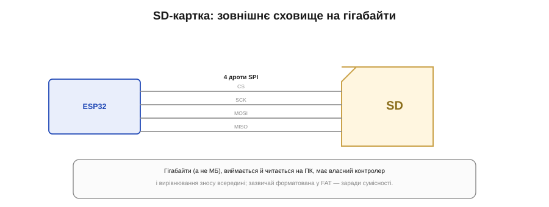
*Рис. 4.3.6.5. SD-картка під'єднується до ESP32 кількома дротами SPI. Вона вміщає гігабайти (а не МБ), виймається й читається на ПК, має власний контролер із вирівнюванням зносу всередині, а форматують її зазвичай у FAT — заради сумісності з комп'ютером.*

Через те що картку часто носять між пристроєм і комп'ютером, її майже завжди форматують у **FAT** — стару, всюдисущу файлову систему, яку розуміє і Windows, і macOS, і Linux, і ваш ESP32. Тут її «переписування на місці» вже не лякає: внутрішній контролер картки розмазує знос за лаштунками, тож FAT можна спокійно класти зверху. Сама ця файлова система FAT — поважного віку, родом ще з 1970-х, і її довге життя варте окремої оповіді.

> 🔌 **Залізна сторона.** Як фізично під'єднати тримач SD-картки до ESP32 — живлення, зсув рівнів, дроти SPI — у вставці [SD-модуль](r03-s6-c-sd-module.md).

> 📜 **Звідки взялася FAT.** Файлова система 1977 року, що пережила всіх і живе в кожній картці, — історія у вставці [FAT](r03-s6-history-fat.md).

### Маленький приклад: журнал у файл

Зберімо все докупи на типовій задачі — вести журнал подій. Хочемо, щоб пристрій дописував у файл рядок щоразу, коли щось стається, і щоб ці рядки пережили вимкнення.

```
змонтувати LittleFS
f = відкрити("/log.txt", дописування)
записати(f, "08:01  старт\n")
записати(f, "08:05  кнопка\n")
закрити(f)
```

Відкрили файл у режимі **дописування** (не перезапису!) — і кожен новий рядок лягає в кінець, не чіпаючи попередніх. Закрили — дані на Flash. Назавтра відкрили знову тим самим способом, дописали ще — журнал росте день за днем. Прочитати його потім просто: відкрив на читання, пробіг від початку до кінця. Зверніть увагу на дрібницю, що рятує Flash: ми **не** відкриваємо-дописуємо-закриваємо на кожнісінький рядок у щільному циклі, а збираємо події й пишемо їх рідше — бо кожне закриття торкається Flash, а Flash, як ми знаємо, любить, коли його чіпають ощадливо (§4.3.3). І ще: якщо журнал може рости без упину, варто наперед подумати, що робити, коли він займе все місце, — зазвичай старі рядки відрізають або заводять кілька файлів по черзі, щоб найдавніше затиралося найпершим.

### Що куди класти

Маємо тепер три сховища — і кожне для свого (Рис. 4.3.6.6). **Дрібні налаштування** — гучність, ім'я мережі, лічильники, прапорці — складають у **NVS** (§4.3.5): байти під короткими ключами. **Внутрішні файли** середнього розміру, які не треба виймати, — журнал, веб-сторінка, звук — кладуть на **LittleFS** у Flash. А **великі чи знімні** дані — відео, багатоденний лог, дамп на гігабайти — пишуть на **SD-картку** з FAT.

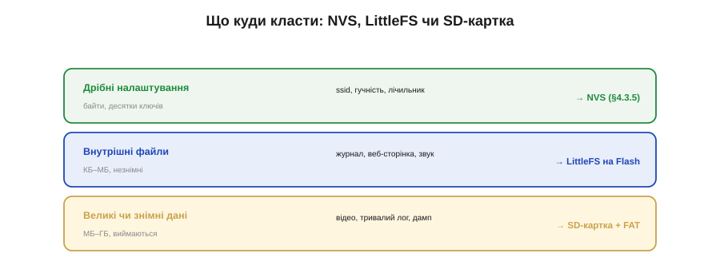
*Рис. 4.3.6.6. Три сховища — кожне для свого: дрібні налаштування → NVS; внутрішні файли (КБ–МБ) → LittleFS на Flash; великі чи знімні дані (МБ–ГБ) → SD-картка з FAT. Вибір читається за двома питаннями: наскільки велике й чи треба виймати.*

Правило, по суті, читається за двома питаннями: «**наскільки воно велике?**» і «**чи треба його виймати?**». Маленьке й незмінне за формою — NVS. Більше, файлоподібне, але внутрішнє — LittleFS. Велике або знімне — SD. Тримаючи в голові цю трійку, ви майже завжди одразу знатимете, куди покласти нові дані, і не мучитимете один інструмент роботою іншого.

### Ціна файлової системи

Наостанок — чесно про плату. Файлова система не безкоштовна: вона тримає на чипі **службові дані** (ту саму карту блоків), потребує **часу на монтування** при старті (треба прочитати й перевірити її структуру) і з'їдає трохи **оперативної пам'яті** на буфери та кеш. Для великих файлів усе це окупається з лишком. А от заради того, щоб запам'ятати одне число «гучність = 7», городити цілу файлову систему — марнотратство: саме тому й існує NVS, легкий і дешевий для дрібниць. Кожен інструмент — на своєму місці.

Та сама службова карта блоків, до речі, теж лежить на Flash і теж зношується від оновлень — тож файлова система «їсть» потроху і ємність, і ресурс чипа навіть тоді, коли ви лише створюєте та стираєте файли, не чіпаючи їхнього вмісту. А монтування при кожному старті — це зайві мілісекунди (а на великому, майже повному томі — і більше), поки система звіряє свою структуру, перш ніж пустити вас до файлів. Усе це дрібниці на тлі зручності, яку дають файли, але платити їх задарма, заради одного-єдиного числа, немає сенсу.

> 🔧 **Навіщо це.** Новачок часто хапається за файлову систему для всього підряд — і витрачає пам'ять та час на монтування там, де вистачило б трьох ключів NVS. Або, навпаки, пхає мегабайтну картинку в NVS і дивується, чому тісно. Уся хитрість — у виборі правильного сховища під розмір і форму даних: дрібне й іменоване → NVS; файлоподібне → файлова система; величезне чи знімне → SD-картка.

Підсумуймо. Коли даних багато й вони мають форму **файлів**, на допомогу приходить **файлова система** — звичний образ названих файлів у теках поверх непростого Flash. Усередині чипа сьогодні беруть **LittleFS** (сучасну, стійку до втрати живлення), лишаючи SPIFFS старим проєктам. А коли потрібні гігабайти чи знімне сховище — ставлять **SD-картку**, найчастіше з файловою системою FAT. Лишилося велике питання, що нависало над усім розділом: а що буде, коли живлення обірветься саме **посеред** запису? Чи не лишимося ми з напівзаписаним, зіпсованим файлом? Саме цьому — цілісності даних при втраті живлення — присвячена наступна тема.

## 4.3.7 Цілісність даних: збій живлення посеред запису

Через увесь цей розділ, мов тінь, ішло одне неприємне запитання, і час нарешті глянути йому в очі. Живлення може зникнути будь-якої миті — висмикнули виделку, сіла батарея, просіла напруга. Найчастіше це байдуже: ну, вимкнувся пристрій, увімкнеться знову. Та є одна **найгірша** мить для збою — рівно тоді, коли пристрій **щось записує** у Flash. Що станеться з даними, якщо струм пропаде на півдорозі? Чи не лишимося ми з понівеченим, недописаним сміттям замість налаштувань? Це і є питання **цілісності** даних, і воно — серцевина надійного сховища.

### Найнебезпечніша мить

Щоб відчути загрозу, згадаймо з §4.3.2: запис у Flash **не миттєвий**. Щоб оновити дані, треба спершу **стерти** цілий сектор, а тоді **записати** в нього нові байти — і кожна з цих дій триває відчутний час (Рис. 4.3.7.1). Поки вона триває, дані в секторі — у проміжному, **нецілому** стані: старе вже затерте, нове ще не лягло повністю.

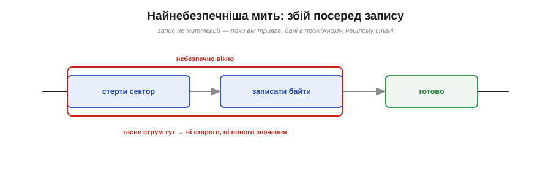
*Рис. 4.3.7.1. Запис — це стерти сектор, потім записати байти; обидва кроки тривають час. Поки триває це «небезпечне вікно», збій живлення лишає ні старого значення (вже затерте), ні нового (ще недописане).*

Ось воно, небезпечне вікно. Обірвись живлення в розпал стирання чи запису — і на чипі лишиться ні старе значення (його вже немає), ні нове (воно недописане), а щось середнє, безладне. Найприкріше, що тривалість цього вікна — не нуль: це не одна блискавична мить, а помітний відрізок часу, протягом якого збій справді ймовірний, надто якщо живлення вже й так хитке. Тож питання не в тому, **чи** колись струм пропаде посеред запису, а в тому, **що пристрій робитиме**, коли це станеться.

Наскільки ж велике це вікно? Стирання сектора — найповільніша операція Flash, воно тягнеться **мілісекунди** (а цілого великого блока — й десятки); запис байтів швидший, та теж не миттєвий. Як на людину — оком не змигнути; як на пристрій, що пише налаштування десятки разів на день роками, — досить нагод, щоб колись та й збігтися з обривом живлення. Саме тому надійні сховища не сподіваються на «пронесе», а будуються так, ніби збій посеред запису — не виняток, а коли-небудь неминучість.

### Чому півзапис гірший за втрату

Може здатися: ну загубиться оновлення — то й нехай, невелика біда. І тут криється важлива різниця (Рис. 4.3.7.2). Одна річ — **втратити оновлення**: пристрій просто лишиться зі **старим**, цілим значенням, наче ви й не міняли його. Це майже завжди прийнятно: старе працювало вчора, попрацює й сьогодні. Зовсім інша річ — **розірваний запис** (англійці звуть це *torn write*): коли половина даних уже нова, а половина ще стара, і разом вони — нісенітниця.

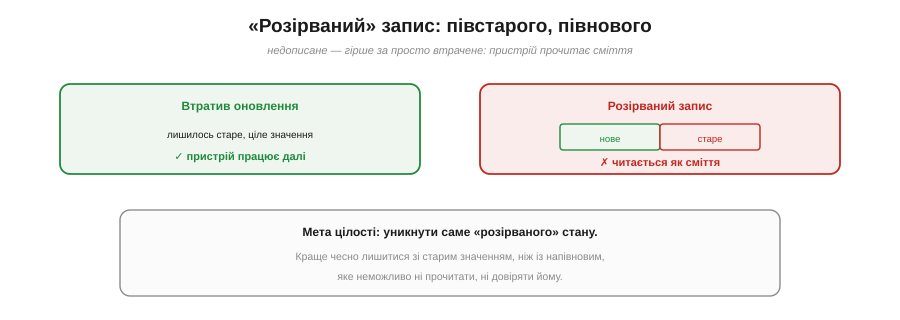
*Рис. 4.3.7.2. Втратити оновлення — ще пів біди: лишається старе, ціле значення, і пристрій працює далі. Розірваний запис (півнового, півстарого) читається як сміття — і це гірше, бо пристрій повірить йому як справжнім даним.*

Розірваний запис підступніший, бо при наступному старті пристрій прочитає це місиво **як справжні дані** й повірить йому. Налаштування виявляться зіпсованими, структура — поламаною, а поведінка пристрою — непередбачуваною: він може зависнути, перезавантажуватися по колу чи робити дурниці. Тому головна мета захисту цілості формулюється так: **за будь-якого збою лишитися або з повністю старим, або з повністю новим — але ніколи з «півнового»**. Чесно зберегти старе — не поразка; поразка — лишити нечитабельне сміття, якому пристрій довірятиме.

Уявімо це на пальцях. Хай у конфігу поряд лежать два пов'язані поля: «режим = автоматичний» і «цільова температура = 22». Ви міняєте обидва — на «ручний» і «18». Збій ловить вас на півдорозі, і на чипі лишається безглузда суміш: режим уже «ручний», а температура ще «22» — або й гірше, самі поля недописані до якихось напівбайтів. Пристрій, прочитавши таке, діятиме за станом, якого ви **ніколи не задавали**. Ось чому половинчастість така страшна: вона породжує комбінації, що не мали б існувати, — і саме їх захист цілості мусить унеможливити.

### Рятунок перший: усе або нічого

Перша й головна зброя проти розірваного запису зветься мудрим словом **атомарність** (Рис. 4.3.7.3). «Атомарний» тут означає **неподільний**: дія або сталася **повністю**, або не сталася **зовсім**, третього не дано. Як домогтися цього на Flash, де сам запис довгий і подільний? Хитрим обхідним маневром, який ми вже двічі бачили в цьому розділі.

Не чіпаймо старі дані, поки пишемо. Спершу запишімо нове значення в **інше, вільне** місце — поряд зі старим, не зачіпаючи його. Старе при цьому лишається цілим і чинним. І аж коли нове повністю лягло й перевірене, зробімо **один-єдиний крихітний крок**: перемкнімо маленький покажчик чи прапорець, що каже «віднині чинне — оте нове». Оцей крок і є **точка фіксації**.

Цей маневр знайомий і поза мікроконтролерами. Коли програма на комп'ютері «безпечно» зберігає документ, вона часто робить те саме: пише новий вміст у тимчасовий файл поряд, а тоді одним рухом **перейменовує** його на місце старого. Перейменування — дія коротка й неподільна: або сталося, або ні. Доти, доки новий файл не готовий, старий лишається недоторканим. Та сама обачність, лише на іншому поверсі: ніколи не руйнуй єдину добру копію, поки не маєш готової заміни.

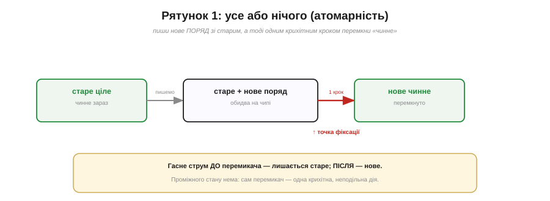
*Рис. 4.3.7.3. Атомарне оновлення: старе ціле → пишемо нове поряд (обидва на чипі) → один крихітний крок-перемикач робить нове чинним. Збій до перемикача лишає старе, після — нове; проміжного стану не буває.*

Уся сила в тому, що сам перемикач — крихітний і робиться однією неподільною дією. Обірвись живлення **до** нього — лишається старе, ціле значення, бо нове ще не оголошене чинним. Обірвись **після** — лишається нове, ціле, бо воно вже повністю записане. А **посередині** опинитися неможливо: перемикач або клацнув, або ні. Згадайте: саме так працює NVS, дописуючи новий запис і позначаючи старий застарілим (§4.3.5), і саме так працює LittleFS зі своїм copy-on-write (§4.3.6). Один і той самий прийом — «пиши нове поряд, потім перемкни одним кроком» — наскрізний для всіх надійних сховищ.

Може майнути спокуса: а що, як просто писати **дуже швидко** — проскочити небезпечне вікно, поки струм не зник? Не вийде. Швидкість лише зменшує ймовірність, але не прибирає її: вікно ніколи не стає нульовим, а Flash має свою фізичну мінімальну тривалість стирання, яку не обігнати. Надійність дають не перегони з блискавкою, а будова, за якої **байдуже**, коли саме впаде струм. Атомарність — це відмова від ставки на щастя на користь конструкції, що тримається за будь-якого розкладу.

### Рятунок другий: контрольна сума

Атомарність береже від півзапису. Та лишається ще одне питання: а **як узагалі дізнатися**, чи запис цілий? Раптом він таки недописаний — як це **помітити** при читанні? Тут на сцену виходить **контрольна сума** (Рис. 4.3.7.4).

Ідея проста й елегантна. Записуючи дані, ми тут-таки рахуємо з них коротке «контрольне число» — за певним нескладним правилом, що перемішує всі байти, — і кладемо це число **поруч** із даними. Читаючи дані назад, ми рахуємо число **ще раз**, за тим самим правилом, і звіряємо з тим, що збережене. Збіглося — дані цілі, їм можна вірити. Не збіглося — десь усередині щось зіпсувалося чи недописалося, і запис треба **відкинути**.

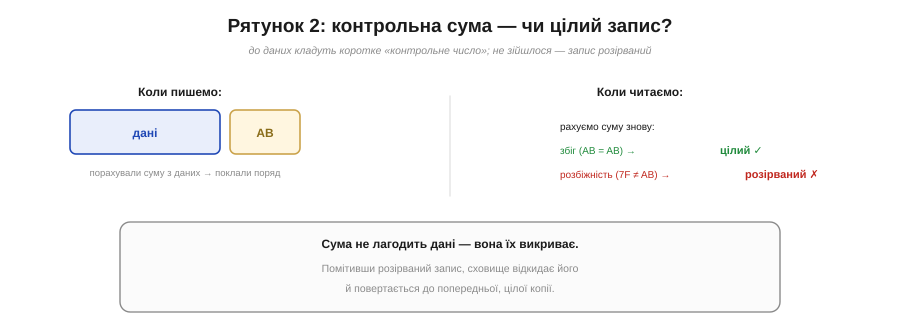
*Рис. 4.3.7.4. Контрольна сума: при записі рахуємо коротке число з даних і кладемо поряд; при читанні рахуємо знову й звіряємо. Збіг — запис цілий; розбіжність — розірваний, його відкидають. Сума не лагодить дані, а викриває зіпсовані.*

Тут важливо вловити: контрольна сума нічого не **лагодить** — вона лише **викриває**. Її робота — чесно сказати «цьому запису довіряти не можна», щоб сховище встигло відступити до попередньої, цілої копії, а не подати програмі сміття під виглядом даних. Це наче печатка на конверті: зламана печатка не повертає лист, але попереджає, що його чіпали. У парі з атомарністю сума й дає повний захист: атомарність гарантує, що **десь** є ціла копія, а сума дозволяє **впізнати** її серед, можливо, недописаної.

Саме правило підрахунку буває різним за хитрістю. Найпростіше — поскладати чи побітово додати (XOR) усі байти; надійніше — так звана **CRC**, що ловить навіть дрібні, підступні ушкодження, які проста сума проґавила б. Але затямте межу: контрольна сума захищає від **випадкового** псування — недопису, збою, перешкоди, — а не від **навмисної** підробки, бо зловмисник перерахував би й суму під свої підмінені дані. Боротьба з підробкою — то вже інша зброя, цифровий підпис, і про неї мова в §4.3.9.

### Подвійний слот і лічильник версії

Складімо обидва рятунки в один практичний візерунок, яким бережуть важливі налаштування (Рис. 4.3.7.5). Заведімо **два слоти** під конфіг — назвімо їх A і B. У кожному, крім самих даних, лежить **номер версії** й **контрольна сума**. У будь-яку мить щонайменше один слот містить добру, цілу копію.

Оновлюємо так: ніколи не пишемо в той слот, що зараз чинний, — пишемо в **інший**, старіший. Поки ми його заповнюємо, чинний слот стоїть цілий і недоторканий: трапся збій — ми нічого не втратили, бо стару добру копію не чіпали. Коли новий слот дописано, він дістає **більший** номер версії — і цим стає найновішим.

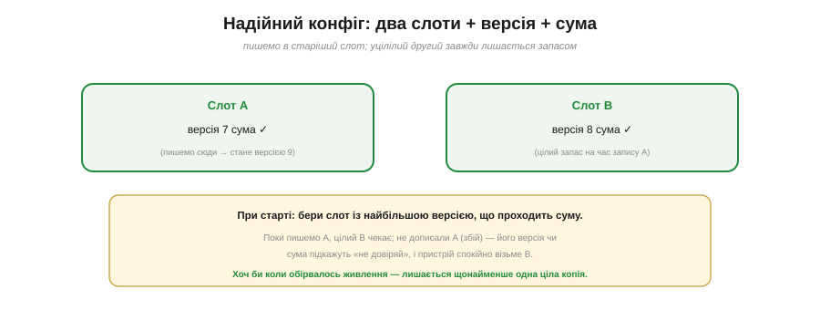
*Рис. 4.3.7.5. Надійний конфіг: два слоти, у кожного версія й сума. Пишемо завжди в старіший слот; другий стоїть цілий запасом. При старті беремо слот із найбільшою версією, що проходить суму, — тож хоч би коли обірвалось живлення, ціла копія є.*

А при старті пристрій робить просту річ: дивиться на обидва слоти й бере той, що має **найбільшу версію серед тих, що проходять контрольну суму**. Якщо новий слот дописався — у нього свіжіша версія, беремо його. Якщо збій застав нас на півзаписі — у нового слота або ще стара версія, або сума не сходиться, і пристрій спокійно бере **старий**, цілий слот. Хоч би коли обірвалося живлення, завжди лишається принаймні одна копія, якій можна вірити. Це і є надійне, **відмовостійке** оновлення — і саме воно ховається всередині того, як ESP32 зберігає важливі дані.

Простежмо це на трьох обірваннях живлення, щоб переконатися, що діри нема. Нехай чинний слот B має версію 8, і ми починаємо писати новий конфіг у слот A. **Збій на початку запису A**: слот A недописаний (сума не зійдеться), B цілий, версія 8 — пристрій бере B, ми лишилися з попереднім конфігом. **Збій під кінець, перед оновленням версії A**: A фізично майже повний, але його версія ще стара чи сума ще не дописана — однаково неприйнятний; знову беремо B. **Збій уже після того, як A став версією 9**: A цілий і найновіший — беремо A, оновлення вдалося. У жодному з трьох випадків нема стану «нема жодної доброї копії» — оце і є відмовостійкість на практиці, а не на словах.

> ⚙️ **Як це зробити власноруч.** Готовий рецепт «два слоти + лічильник версії + контрольна сума» — крок за кроком, із порядком записів — у вставці [Атомарне оновлення конфігурації](r03-s7-a-atomic-config.md).

### Хто це робить за вас

Тут варто видихнути з полегшенням (Рис. 4.3.7.6). Усю цю хитру механіку — атомарний перемикач, контрольні суми, запас на випадок збою — **NVS** і **LittleFS** уже роблять **усередині, самі**. Користуєтесь NVS для налаштувань чи LittleFS для файлів — і захист цілості дістаєте задарма, навіть не думаючи про нього: вони спроєктовані так, щоб переживати раптове вимкнення.

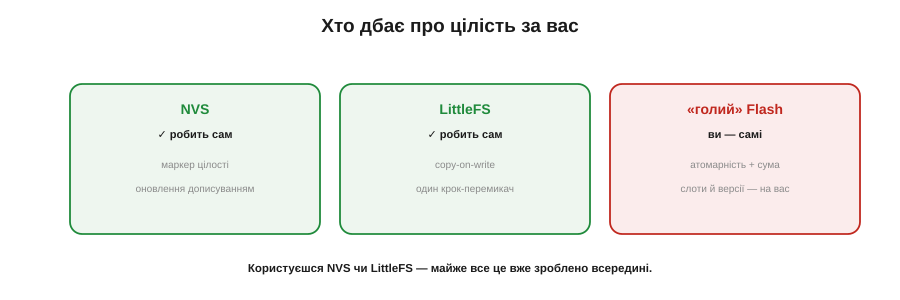
*Рис. 4.3.7.6. NVS і LittleFS несуть захист цілості всередині (маркери, copy-on-write, перемикачі) — ви дістаєте його задарма. Самому клопотатися атомарністю, сумами й слотами доводиться лише при записі в «голий» Flash повз ці бібліотеки.*

Самотужки клопотатися атомарністю й сумами доводиться лише тоді, коли ви пишете в **«голий»** Flash повз ці бібліотеки — рідкісний для новачка випадок. Тож практичний висновок підбадьорливий: **тримайтеся NVS і LittleFS — і більшість роботи зі збереження цілості вже зроблено за вас**. Знати ж, **як** саме вона зроблена, корисно не щоб винаходити це наново, а щоб довіряти інструментам із розумінням і впізнавати ту саму ідею, коли вона трапиться знову.

Один практичний застереж: «майже» не дорівнює «завжди». Навіть з NVS чи LittleFS можна нашкодити собі — скажімо, тримати важливу зміну незакріпленою й смикнути живлення (незакріплене загубиться, і це нормально), або писати в обхід бібліотеки нестандартним способом, що повертає весь клопіт вам на плечі. Тому правило просте: пишіть через ці бібліотеки їхнім звичайним способом — і їхній захист працюватиме сам; обходьте їх — і захищайте себе самотужки.

> 🔧 **Навіщо це.** Цілість — не абстракція: це різниця між пристроєм, що спокійно переживає тисячі вимикань, і тим, що раз на місяць «псує собі налаштування» й вимагає скидання. Дві практичні поради звідси. Перша: **закріплюйте дані вчасно** — не тримайте важливу зміну лише в RAM надто довго, зробіть commit, доки живлення є. Друга: якщо напруга буває хисткою, згадайте про захист від просідання (brownout, §4.1) — хай пристрій радше **не почне** запис, ніж обірве його на півдорозі.

Варто чесно окреслити й межу цих обіцянок. Цілість не означає «ніколи нічого не загубиться». Якщо збій застав вас рівно тоді, коли найновіша зміна ще не закріплена, ви її **втратите** — повернетесь до попереднього доброго стану. Цілість обіцяє інше, скромніше, та безцінне: ви ніколи не лишитеся зі **сміттям**. Між «втратив останню зміну, маю передостанній цілий стан» і «маю нечитабельне місиво, якому пристрій повірив» різниця величезна — і весь захист саме про те, щоб гарантувати перше й виключити друге.

Підсумуймо. Збій живлення посеред запису — реальна загроза, і відповідь на неї стоїть на двох опорах. **Атомарність** (пиши нове поряд, тоді перемкни одним кроком) гарантує, що ціла копія завжди десь є — стара чи нова, але не «півнова». **Контрольна сума** дозволяє ту цілу копію впізнати, відкинувши недописану. Разом, та ще й у візерунку «два слоти + версія», вони роблять сховище **відмовостійким**. І найкраща новина: NVS та LittleFS уже несуть це в собі. А тепер обернімо цю саму ідею на найбільше з усього, що зберігає пристрій, — на **саму прошивку**: як оновити код «по повітрю», не ризикуючи лишитися з напівоновленим, мертвим пристроєм? Про два слоти для прошивки — наступна тема.

## 4.3.8 Два OTA-слоти: механіка подвійного образу

У попередній темі ми навчилися безпечно оновлювати **налаштування** — двома слотами, версією й контрольною сумою, так щоб жоден збій не лишив сміття. А тепер застосуймо той самий прийом до найбільшого й найризикованішого, що зберігає пристрій, — до **самої прошивки**. Уявіть: ваш термостат висить на стіні, працює, а ви хочете залити в нього нову версію коду — виправити помилку, додати можливість. Як це зробити, не лишивши пристрій мертвою «цеглиною», якщо щось піде не так?

Одразу домовмося про межу теми. **Як** нова прошивка дістається до пристрою — по Wi-Fi, із сервера, шматками — це окрема велика історія, і їй місце в Модулі 6, де йтиметься про мережу й оновлення «по повітрю» (*OTA, over-the-air*). Тут нас цікавить інше, ближче до Flash: **де** новий образ зберігається й **як** пристрій безпечно на нього перемикається. Тобто механіка зберігання, а не доставка.

Чому взагалі стільки уваги одному оновленню? Бо для підключеного пристрою це питання майже життя і смерті: оновлення, яке інколи лишає «цеглину», — не зручність, а лотерея, у яку ніхто не захоче грати з тисячею пристроїв, розкиданих по полю. Тож механіка, яку ми зараз розберемо, — не дрібний технічний нюанс, а те, що відрізняє іграшку на столі від виробу, якому можна довірити роботу роками без нагляду.

### Чому прошивку не можна писати поверх себе

Почнімо з пастки, яка й породжує всю конструкцію (Рис. 4.3.8.1). Прошивка — це код, що **виконується просто зараз**: процесор крок за кроком читає з Flash інструкції чинної програми. Спробувати переписати цей самий Flash новою прошивкою — однаково що міняти двигун літакові в польоті чи пиляти гілку, на якій сидиш. У найкращому разі процесор спіткнеться, дочитавши до місця, яке щойно затерли; а якщо живлення обірветься посеред такого запису (а ми вже знаємо з §4.3.7, яке це небезпечне вікно), на чипі лишиться напівстара-напівнова прошивка — нежиттєздатне місиво. Пристрій більше не завантажиться. Це і є страшна «цегла» (*brick*): пристрій, що перетворився на дорогий шматок пластику.


*Рис. 4.3.8.1. Поточна прошивка виконується просто зараз; переписати її поверх — однаково що пиляти гілку, на якій сидиш. Збій посеред такого запису лишає напівстару-напівнову прошивку — «цеглину». Потрібне друге місце, щоб писати нове, не чіпаючи робочого.*

Щоб відчути це до кінця, згадаймо, як процесор бере код. Він **раз у раз** читає інструкції просто з Flash, по ходу виконання (це зветься *execute-in-place* — «виконання на місці»). Тобто Flash із робочою прошивкою — не архів, який чіпають зрідка, а жива стрічка, з якої щомиті зчитується наступний крок. Затерти в ній щось — означає вибити з-під процесора сходинку рівно тоді, коли він на неї ступає. Ось чому робочий слот має лишатися абсолютно недоторканим аж до самого перемикання.

Висновок очевидний: писати нову прошивку **поверх робочої** не можна. Потрібне **друге місце** — окрема ділянка Flash, куди можна спокійно скласти новий образ, доки старий працює собі далі, нічого не підозрюючи.

### Два слоти для прошивки

Це друге місце нам уже знайоме з таблиці розділів (§4.3.4): пам'ятаєте app-розділи `ota_0` і `ota_1`? Ось вони й є двома **слотами** під прошивку (Рис. 4.3.8.2). У будь-яку мить один слот — **робочий**: із нього зараз виконується пристрій. Другий — **запасний**: саме в нього заливають новий образ.


*Рис. 4.3.8.2. У будь-яку мить один слот (ota_0) працює, другий (ota_1) вільний — у нього й пишуть новий образ. Поки триває запис, робочий слот недоторканий, тож збій під час заливання не чіпає чинної прошивки.*

Механіка проста й безпечна. Пристрій працює, скажімо, зі слота `ota_0`. Нову прошивку записують у **вільний** `ota_1` — поки йде запис, робочий `ota_0` стоїть цілий і незмінний, а програма з нього спокійно крутиться далі. Обірвись живлення посеред заливання `ota_1` — і байдуже: робочий слот не зачеплено, пристрій просто перезавантажиться зі старої, доброї прошивки, наче нічого й не починалося. Ось де ключ: **той, що пишемо, і той, що виконуємо, — завжди різні**. Ризикуємо лише запасним слотом, ніколи — робочим.

А що після наступного оновлення? Ролі просто **міняються місцями**. Цього разу працював `ota_0`, новий образ лягав у `ota_1`; коли оновлюватимемось іще раз, уже `ota_1` буде робочим, а новий образ ляже в `ota_0`. Слоти ніби пінг-понг: щоразу пишемо в той, що зараз не зайнятий. Завдяки цьому ще й знос розкладається на обидва слоти порівну, а не б'є в один. У деяких розкладках є й третій, незмінний слот `factory` — заводська прошивка як остання лінія оборони, на яку можна впасти, якщо обидва робочі образи раптом зіпсуються.

### Перемикач: крихітна otadata

Гаразд, новий образ повністю лежить у `ota_1`. Як тепер сказати пристроєві «віднині завантажуйся звідси»? Тут на сцену виходить ще один давній знайомий із §4.3.4 — крихітний розділ **otadata** (Рис. 4.3.8.3). Це і є той самий **перемикач**: маленький запис, що каже завантажувачу, з якого слота стартувати наступного разу.


*Рис. 4.3.8.3. otadata — крихітний розділ-перемикач: каже завантажувачу, з якого слота стартувати. Порядок як у §4.3.7: записати образ повністю → перевірити → і лише тоді перемкнути otadata одним коротким кроком. Без проміжного «напівоновлення».*

Порядок дій — точнісінько **атомарний перемикач** із §4.3.7, лише застосований до прошивки. Спершу записуємо новий образ у вільний слот **повністю**. Тоді **перевіряємо** його (тут стане в пригоді контрольна сума — чи цілий образ доїхав). І аж насамкінець — **перемикаємо otadata** на новий слот, одним коротким кроком. Доти, доки цей крок не зроблено, пристрій завантажується зі старого слота; щойно зроблено — з нового. Проміжного «напівоновленого» стану не буває: збій до перемикача лишає стару прошивку, після — нову, обидві цілі. Та сама ідея «пиши нове поряд, перемкни одним кроком» — тільки тепер ідеться не про число налаштування, а про мегабайт коду.

Сама otadata, до речі, теж зроблена надійно — інакше вона була б ахіллесовою п'ятою всієї схеми. Це ж єдиний запис, що вирішує долю завантаження; зіпсуйся він посеред перемикання — і пристрій не знав би, звідки стартувати. Тому otadata веде дві свої копії й оновлює їх по черзі — тим самим прийомом «нове поряд, потім перемкни», що й усе решта. Перемикач, який береже інших, сам не може дозволити собі бути незахищеним.

### Перше вмикання й відкат

Та з прошивкою є тонкість, якої не було в налаштуваннях. Конфіг або цілий, або ні — це видно по контрольній сумі. А прошивка може бути **цілою як файл**, але **поганою як програма**: образ доїхав без жодного зіпсованого байта, перемкнулися ми на нього — а він через помилку в коді одразу падає чи зациклюється в нескінченних перезавантаженнях. Контрольна сума тут безсила: байти ж правильні, поганий сам код. Як уберегтися від цього?

Відповідь — **пробний запуск із відкатом** (Рис. 4.3.8.4). Перемкнувшись на новий образ, пристрій запускає його не остаточно, а **на випробуванні**. Якщо нова прошивка успішно піднялася, попрацювала й сама **підтвердила**: «я в нормі» — тоді otadata закріплює її назавжди, оновлення вдалося. А якщо новий образ падає, зависає чи так і не дійшов до свого «я в нормі» (приміром, застряг у циклі перезавантажень), завантажувач розуміє: щось не так — і **відкочується** на старий, перевірений слот, який нікуди не дівся.

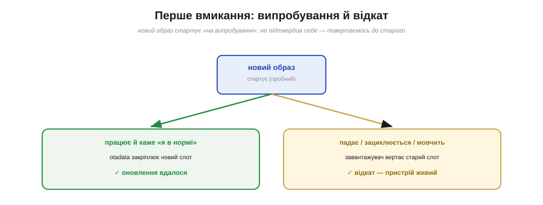
*Рис. 4.3.8.4. Новий образ стартує «на випробуванні». Підтвердив «я в нормі» — otadata закріплює його. Упав, завис чи мовчить — завантажувач відкочується на старий, робочий слот. Відкат рятує навіть від цілого, але поганого коду — пристрій лишається живий.*

Оце і є **відкат** (*rollback*) — страхувальна сітка всієї конструкції. Завдяки їй навіть прошивка з прикрою помилкою не перетворює пристрій на цеглину: у найгіршому разі він повернеться до попередньої робочої версії й житиме далі, чекаючи на виправлене оновлення. Старий слот навмисно **не стирають** одразу — він лишається як запас саме доти, доки новий не довів, що він добрий.

Тут варто наголосити на обов'язку, що лягає на вас, автора прошивки. Відкат спрацює лише тоді, коли новий образ **зобов'язаний сам себе підтвердити** — десь у коді, піднявшись і переконавшись, що головне працює (мережа є, датчики відповідають), він має явно гукнути «я справний». Забудете цей виклик — і навіть бездоганна прошивка вічно лишатиметься «на випробуванні», а завантажувач, не дочекавшись підтвердження, відкотить її назад, ніби вона зламана. Тож пробний режим — це угода: система дає вам сітку безпеки, але ви маєте подати їй знак, що приземлилися вдало.

Намалюймо найгірший випадок до кінця. Залили новий образ, перемкнули otadata, пристрій стартує з нього — і той одразу падає, перезавантажується, знову падає. Здавалося б, вічна петля. Та ні: завантажувач **рахує** ці невдалі спроби й, не дочекавшись жодного «я справний» за кілька разів, виносить вирок — образ поганий — і сам повертає otadata на старий слот. Наступний старт уже піднімає стару, перевірену прошивку. Користувач у гіршому разі помітив, що пристрій на хвилину «задумався» й перезавантажився, — і по всьому; цеглини не сталося.

### Чому це коштує місця

За все добре треба платити, і плата тут — **місце** (Рис. 4.3.8.5). Два повні слоти під прошивку означають, що ваш код мусить уміститися щонайбільше в **половину** області, відведеної під застосунок: адже друга половина зайнята слотом-близнюком. Якщо весь app-простір — два мегабайти, то на одну прошивку лишається близько одного.


*Рис. 4.3.8.5. Два повні слоти ділять область під код навпіл: прошивка вміщається щонайбільше в половину. Це той самий бюджет Flash із §4.3.4 — за надійне оновлення з відкатом платять половиною місця, тож закладати його треба наперед.*

Згадайте розмову про бюджет Flash із §4.3.4: ось він, той самий поділ пирога, тільки тепер ми бачимо, **навіщо** він такий. Хочеш безпечні оновлення з відкатом — закладай під код **удвічі** більше місця, ніж займає сама прошивка. Це свідомий вибір: трохи тісніше з кодом — зате оновлення, яке ніколи не лишить пристрій мертвим. Тому, плануючи розкладку Flash наперед, серйозний пристрій одразу резервує місце під **два** образи, а не дізнається про цю потребу болісно, коли прошивка вже не влазить.

Є, звісно, й дешевший шлях — **один** слот, без близнюка: оновлюйся прямо поверх, заощаджуй половину Flash. Так інколи й роблять там, де оновлення рідкісні, живлення надійне, а пристрій легко дістати й перепрошити вручну, якщо не пощастить. Але за цю ощадливість платять страхом: будь-яка обірвана заливка чи лиха помилка стають фатальними. Подвійний слот — це усвідомлений обмін **місця на спокій**, і для пристрою, до якого не дотягнешся рукою, спокій майже завжди дорожчий.

### Налаштування переживають оновлення

Може зринути тривога: якщо ми перемикаємо цілу прошивку, чи не зітруться часом усі збережені налаштування й файли? Ні — і це навмисно. Згадайте таблицю розділів (§4.3.4): прошивка живе в app-слотах, а NVS і файлова система — в **окремих** data-розділах, яких оновлення коду **не чіпає**. Тому, залив нову версію, пристрій бачить ті самі налаштування Wi-Fi, ті самі лічильники, ті самі файли, що й до оновлення. Код змінився — пам'ять користувача лишилась. Саме цей чіткий поділ «код окремо, дані окремо» й робить оновлення непомітним для того, хто пристроєм користується: ні наново налаштовувати, ні втрачати нажите йому не доводиться. Через те оновлення й відчувається як легке «пристрій трохи моргнув і поновішав», а не як болісне скидання до заводського стану.

### Та сама ідея, більший масштаб

Озирніться — і ви впізнаєте знайомий візерунок (Рис. 4.3.8.6). Надійне оновлення конфігу (§4.3.7) і надійне оновлення прошивки — це **одна й та сама ідея**, лише різного розміру. Там — два маленькі слоти й перемикач-версія; тут — два великі слоти й перемикач-otadata. Там берегли число налаштування, тут — мегабайт коду. Але кістяк ідентичний: **пиши нове поряд зі старим → перемкни одним коротким кроком → тримай старе як запас на випадок відкату**.


*Рис. 4.3.8.6. Той самий прийом у двох масштабах: конфіг — два маленькі слоти + перемикач-версія (§4.3.7); прошивка — два великі слоти + перемикач-otadata. Кістяк один: пиши нове поряд, перемкни одним кроком, тримай старе на відкат.*

Це не випадковість, а глибокий принцип надійних систем, який варто закарбувати раз і назавжди: ніколи не руйнуй єдину добру копію, поки не маєш готової й перевіреної заміни. Побачивши цю схему ще раз — у базах даних, у системах розгортання застосунків, де завгодно, — ви впізнаєте давнього знайомого.

Корисно й тримати в голові, чому цей принцип такий живучий. Він нічого не прискорює й не здешевлює — навпаки, коштує зайвого місця та зайвого кроку. Купує він одне: **певність**, що хоч би що сталося посеред оновлення — обрив, помилка, збій, — у вас завжди лишиться щось ціле, на що можна спертися. У світі, де живлення зникає без попередження, а оновлення прилітають по ненадійній мережі, ця певність варта і місця, і кроку.

> 🔧 **Навіщо це.** Без двох слотів і відкату будь-яке оновлення «в полі» — рулетка: одна обірвана заливка чи одна лиха помилка — і пристрій на стіні (чи на вишці, чи в глибині приладу) стає цеглиною, по яку треба їхати з викруткою. Саме тому **кожен** серйозний підключений пристрій — від розумної лампочки до автомобіля — оновлюється через подвійний образ. Платить він за це половиною місця під код — і вважає це найвигіднішою угодою на світі: місце на Flash дешеве й одноразове, а виїзд до пристрою по його «оживлення» — дорогий і щоразу новий.

Підсумуймо. Щоб безпечно оновлювати прошивку, її тримають у **двох слотах** (`ota_0`/`ota_1`): один працює, у другий пишуть новий образ, не чіпаючи робочого. Крихітна **otadata** — атомарний перемикач, що каже, звідки завантажуватись; його перемикають **останнім** кроком, уже після повного запису й перевірки. А **пробний запуск із відкатом** рятує навіть від цілого, але поганого образу: не підтвердив себе — повертаємось до старого. Усе це — той самий атомарний прийом із §4.3.7, піднятий до масштабу цілої прошивки. Лишилося останнє питання надійного сховища: а що, коли хтось захоче не зіпсувати, а **підмінити** нашу прошивку чи підгледіти наші дані? Як захистити пристрій від зловмисника? Про secure boot і шифрування Flash — наступна, завершальна тема розділу.

## 4.3.9 Secure boot і шифрування Flash: захист прошивки й даних

Через увесь цей розділ ми боронили дані від **випадку**: від зносу, від обірваного живлення, від недописаного запису. Та є й інша загроза, геть іншої природи — **зловмисник**. Людина, що навмисно хоче або **підмінити** нашу прошивку своєю (щоб пристрій робив, що їй заманеться), або **вичитати** з Flash наші секрети — ключі, паролі, цінний код. Випадок не має наміру; зловмисник має. І від нього потрібні інші щити. ESP32 несе два таких: **secure boot** — проти підміни прошивки, і **шифрування Flash** — проти читання секретів. Розберімо обидва якісно, без занурення в математику, щоб уловити саму ідею.

Перш ніж почати, одне зауваження, щоб не лякатися слова «безпека». Усе, що тут буде, — це **прості, людські ідеї**, одягнені в технічні назви: «впізнати своє за печаткою», «тримати таємницю в замкненій скриньці», «не довіряти, доки не перевірив». Математика, що робить ці ідеї непробивними, лишиться під капотом — зазирнути в неї можна буде у вставці наприкінці. Нам же зараз важливо вхопити **зміст**: що від чого боронить і чому працює.

### Дві різні загрози — два різні щити

Найперше треба чітко **розрізнити** дві загрози, бо їх легко сплутати, а щити від них зовсім різні (Рис. 4.3.9.1).

Перша загроза — **підміна**. Зловмисник хоче, щоб пристрій виконував **його** код: перепрошив термостат, щоб той відмикав двері, або щоб камера слала картинку йому. Щит від цього — **secure boot** («безпечне завантаження»): він стежить, щоб пристрій запускав **лише прошивку, яка справді наша**, і відмовлявся стартувати з чужої.

Друга загроза — **підглядання**. Зловмисник не хоче нічого міняти — він хоче **прочитати** вміст Flash: вивудити вкладений ключ шифрування, пароль від хмари, секрет вашого алгоритму. Щит від цього — **шифрування Flash**: воно робить вміст чипа **нечитним** для будь-кого, хто не має ключа, замкненого всередині.

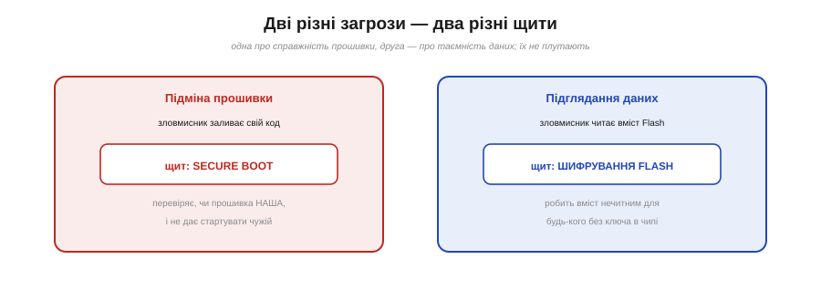
*Рис. 4.3.9.1. Дві різні загрози: підміна прошивки (зловмисник заливає свій код) і підглядання (читає вміст Flash). Два різні щити: secure boot перевіряє, чи прошивка наша; шифрування Flash робить вміст нечитним. Один про справжність, другий — про таємність.*

Затямте цю різницю раз і назавжди: secure boot — про **справжність** (чи це наше?), шифрування — про **таємність** (чи зможуть прочитати?). Один не замінює іншого: можна підписати прошивку, та лишити її відкритою для читання, або зашифрувати, та не перевіряти підпис. Серйозний захист вмикає **обидва**.

Щоб це не лишалось абстракцією, ось два побутові приклади. Підміна: хтось дістав ваш розумний замок, залив у нього свою прошивку — і тепер замок відмикається з його телефона; secure boot не дав би тій прошивці навіть стартувати. Підглядання: ви викинули стару Wi-Fi-розетку, а хтось підібрав її, висмикнув Flash і вичитав звідти пароль вашої домашньої мережі, що там зберігався; шифрування Flash лишило б йому в руках саму нісенітницю. Різні біди — різні щити, і кожен закриває те, проти чого інший безсилий.

### Підпис: «це справді наше?»

Серце secure boot — **цифровий підпис** (Рис. 4.3.9.2). Ідея спирається на хитру, та доступну річ: пару ключів, що працюють у парі, — **таємний** і **відкритий**.

Виробник, складаючи прошивку, **підписує** її своїм **таємним** ключем, який тримає в найбільшому секреті й нікому не віддає. Підпис — це особлива позначка, яку можна поставити **лише** цим таємним ключем. А в сам пристрій назавжди зашивають **відкритий** ключ — пару до таємного. Цим відкритим ключем пристрій **перевіряє** підпис: збігся — образ справді від виробника; не збігся — чужий або підроблений, геть його.

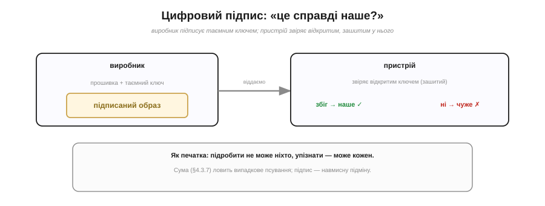
*Рис. 4.3.9.2. Виробник підписує прошивку таємним ключем (його має лише він); пристрій звіряє підпис відкритим ключем, зашитим у нього. Як печатка: підробити не може ніхто, упізнати — кожен. Контрольна сума (§4.3.7) ловить випадкове псування, підпис — навмисну підміну.*

Найкраща аналогія — **печатка**. Колись король скріплював листи відбитком персня, якого мав лише він: підробити такий відбиток ніхто не міг, а **впізнати** — кожен, хто бачив справжній. Таємний ключ — це той перстень (лише у виробника), відкритий — знання, як виглядає справжня печатка (зашите в пристрої). І ось важлива звʼязка з §4.3.7: пам'ятаєте контрольну суму? Вона ловила **випадкове** псування, але зловмисник легко перерахував би її під свою підробку. Підпис інакший: його **не підробити** без таємного ключа. Сума боронить від випадку, підпис — від злого наміру.

Чому ж відкритий ключ дозволяє **перевірити** підпис, але не дозволяє його **підробити**? У цьому й уся магія пари ключів: дії таємного й відкритого несиметричні. Таємним ключем підпис **ставлять**, відкритим — лише **звіряють**; а знаючи відкритий, обчислити таємний практично неможливо (на цьому стоїть ціла галузь математики). Тому відкритий ключ можна сміливо роздавати хоч усьому світу — вкласти в кожен пристрій, надрукувати в книжці, — і це анітрохи не наблизить нікого до підробки підпису. Секрет один-єдиний, і він лишається у виробника.

### Ланцюг довіри

Та виникає підступне питання: пристрій перевіряє прошивку — а хто перевіряє **самого перевіряльника**? Що, як зловмисник підмінить ту частину, яка робить перевірку? Відповідь — **ланцюг довіри** (*chain of trust*), і це одна з найкрасивіших ідей у безпеці (Рис. 4.3.9.3).

Влаштовано його як естафету довіри. На самому дні є **корінь** — щось у чипі, чого **неможливо змінити**: відкритий ключ (чи його відбиток), назавжди «перепалений» у крихітних одноразових запобіжниках (*fuses*) усередині кристала. Цей корінь незмінний — це **якір довіри**. Корінь вивіряє підпис **завантажувача**: лише справжній завантажувач піде в роботу. Перевірений завантажувач вивіряє підпис **вашого додатка**. І так ланка за ланкою: кожна, **перш ніж** передати керування наступній, переконується, що та — справжня, підписана.

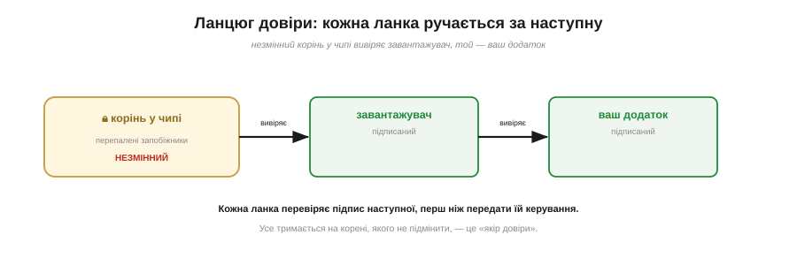
*Рис. 4.3.9.3. Ланцюг довіри: незмінний корінь у чипі (перепалені запобіжники) вивіряє підпис завантажувача, той — підпис вашого додатка. Кожна ланка перевіряє наступну, перш ніж віддати їй керування. Усе тримається на корені, якого не підмінити, — «якорі довіри».*

Виходить нерозривний ланцюг від незмінного кореня до вашого коду. Підмінити середину не вийде: щойно одна ланка не пройде перевірку в попередньої, естафета обірветься. Уся міцність тримається на тому, що **найперша** ланка — корінь — лежить там, куди зловмисникові не дотягтися: у перепалених запобіжниках, яких не переписати. Прибери незмінний корінь — і весь ланцюг повисне в повітрі; саме тому його й «випікають» у кремнії раз і назавжди.

Дві тонкощі роблять ланцюг по-справжньому міцним. Перша: кожна ланка перевіряє наступну **до того**, як віддати їй керування, — бо віддати спершу, а перевірити потім було б пізно: зловмисний код, уже отримавши владу, просто збрехав би про себе. Друга: найперший перевіряльник — не сам завантажувач (його ж теж перевіряють!), а крихітна, **незмінна** програмка, «випечена» в чипі ще на заводі, у недоторканній пам'яті ROM. Вона стартує першою й саме вона звіряє підпис завантажувача коренем. Від цього непорушного зерна й розгортається вся довіра — знизу вгору, ланка за ланкою.

Образ для цього такий: уявіть низку вартових, що передають із рук у руки запечатаний лист. Кожен, перш ніж віддати лист наступному, перевіряє на ньому печатку — і лише впевнившись, що вона справжня, передає далі. Найперший вартовий стоїть біля незмінних, замурованих воріт (це наш корінь у запобіжниках), і саме від нього починається довіра. Підмінити будь-кого в низці марно: наступний одразу побачить чужу печатку й не візьме листа. Так довіра тече від замурованих воріт аж до вашого коду, ніде не розриваючись.

### Secure boot: стартує лише наше

Складімо це докупи (Рис. 4.3.9.4). **Secure boot** — це і є робота всього ланцюга при **кожному** вмиканні. Щойно подали живлення, чип не кидається сліпо виконувати те, що лежить у Flash, а спершу **проходить ланцюг** і звіряє підписи згори донизу. Усе сходиться — пристрій стартує. Хоч щось не на місці — підпис не той, образ підмінено — чип **відмовляється запускатися**.

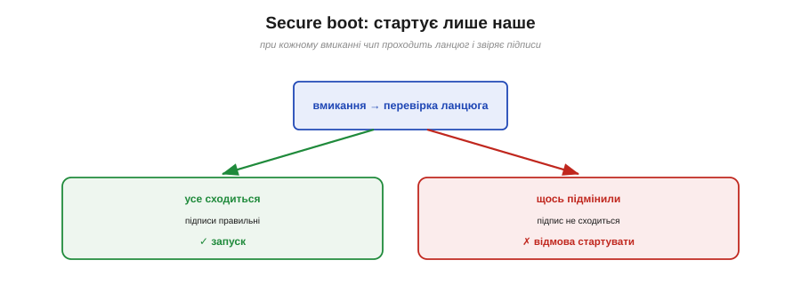
*Рис. 4.3.9.4. При кожному вмиканні чип проходить ланцюг і звіряє підписи. Усе сходиться — запуск. Щось підмінили, підпис не той — відмова стартувати. Тому навіть перезаписавши Flash своїм кодом, зловмисник не змусить його виконатися: без правильного підпису він мертвий.*

Ось чому secure boot такий потужний: навіть якщо зловмисник якось **перезапише** Flash своєю прошивкою, вона **не має правильного підпису** — і чип просто не дасть їй стартувати. Здобути фізичний доступ і залити свій код уже **недостатньо**; без таємного ключа виробника чужа прошивка лишається мертвою. Підміна знешкоджена.

Звідси випливає й тиха вимога до оновлень із §4.3.8: **кожен** новий OTA-образ теж мусить бути підписаний — інакше secure boot чесно відмовиться його запускати, прийнявши за чужий. Тобто два механізми складаються в один лад: подвійний слот дбає, щоб оновлення не лишило цеглини, а secure boot — щоб під виглядом оновлення не проскочила ворожа прошивка. Зловмисник не обдурить пристрій, підсунувши «оновлення» зі своїм кодом: без правильного підпису воно не пройде ту саму перевірку при старті, що й первісна прошивка.

### Шифрування Flash: секрети лишаються нечитними

Другий щит закриває другу загрозу — **підглядання** (Рис. 4.3.9.5). **Шифрування Flash** означає, що вміст чипа зберігається не відкрито, а **переплутаним** особливим ключем. Висмикнув зловмисник чип, зчитав його байти — і дістав **нісенітницю**, безладну купу, з якої нічого не виловиш.

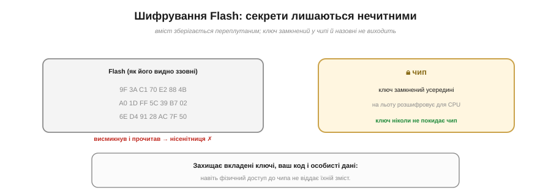
*Рис. 4.3.9.5. Вміст Flash зберігається переплутаним; ключ розшифрування замкнений усередині чипа й назовні не виходить. Висмикнув чип, зчитав байти — дістав нісенітницю. Чип сам на льоту розшифровує дані для процесора, та ключ нікому не віддає.*

Уся хитрість у тому, **де** живе ключ розшифрування: він **замкнений усередині чипа** й ніколи не виходить назовні. Чип сам, на льоту, розшифровує дані для процесора, коли той їх читає, — але назовні віддати ключ не може. Тому навіть фізичний доступ до Flash не зраджує таємниць: без ключа, схованого в кремнії, дамп — це сміття. Так бережуть і вкладені ключі, і паролі, і ваш цінний код, і особисті дані користувача: усе, що не має потрапити в чужі руки, навіть якщо пристрій украдено.

Варто чесно окреслити, від чого шифрування Flash **не** боронить. Воно береже дані **в спокої** — поки вони лежать у мікросхемі. Якщо ж пристрій працює й сам має право користуватися своїм секретом (скажімо, ходить із ним у мережу), то, хитро **обдуривши живий пристрій**, зловмисник інколи може змусити його зробити щось від свого імені — і тут шифрування на диску вже не зарадить, це інша лінія оборони. Тож пам'ятайте межу: шифрування Flash закриває «висмикнув і прочитав», а не «обманув робочий пристрій».

### Ціна й обережність

Така сила вимагає поваги, бо ці щити — **двері в один бік** (Рис. 4.3.9.6). Запобіжники, якими «випікають» корінь і вмикають захист, — **одноразові**: перепалив — назад не повернеш, чип уже не стане «звичайним». Ключ стає **найціннішим** у всій системі: загубив його — можеш утратити змогу оновлювати пристрій; виказав — упав увесь захист. А ще за все це платять трохи **швидкістю** й **складністю**.

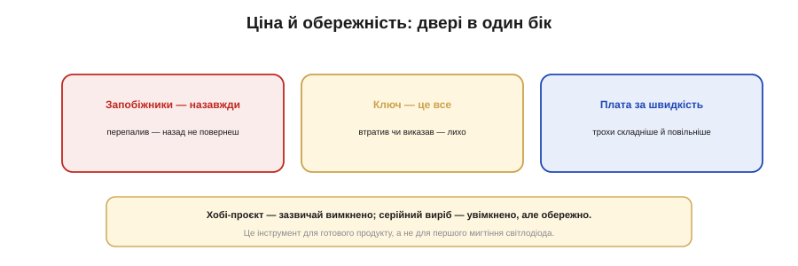
*Рис. 4.3.9.6. Захист — двері в один бік: запобіжники одноразові (назад не повернути), ключ стає найціннішим (втратив — лихо), є плата за швидкість і складність. Тому хобі-проєкт зазвичай лишає це вимкненим, а серійний виріб вмикає — обережно.*

Тому практичне правило таке: для **хобі-проєкту**, де ви блимаєте світлодіодом на столі, ці щити зазвичай **вимкнені** — вони лише заважали б. А от **серійний виріб**, що піде в люди й нестиме чужі секрети, їх **вмикає** — але обережно, із належним поводженням із ключами. Це інструмент зрілого продукту, а не першого знайомства з платою; знати про нього варто змолоду, а вмикати — коли справді розумієш, навіщо й якою ціною.

Найважче в усьому цьому — не ввімкнути захист, а **берегти ключ**. Таємний ключ підпису — серце всієї безпеки: уся міцність ланцюга важить рівно стільки, скільки важить його таємність. Виробники тримають такі ключі в особливих захищених сховищах, не дають їм потрапити у звичайні файли чи репозиторії, обмежують, хто має доступ. Бо вкрадений ключ підпису означає, що зловмисник зможе підписати свою прошивку «від вашого імені» — і всі ваші пристрої радо її приймуть. Захист надійний рівно настільки, наскільки надійно схований ключ, — і ні на крихту більше.

> 🧮 **Трохи математики.** Як саме підпис «не підробити», що таке хеш і чому пара ключів працює, — якісно, без формул-страшилок — у вставці [Хеш і цифровий підпис](r03-s9-m-hash-signature.md).

> 🔧 **Навіщо це.** Підключений пристрій — це не лише зручність, а й **мішень**: розумний замок, камера, лічильник. Secure boot не дає зробити з нього знаряддя проти вас, шифрування — не дає вкрасти те, що в ньому сховано. Навіть якщо ви ще не вмикаєте їх у своїх перших проєктах, розуміти, **від чого** вони бороняться, треба вже зараз: безпека, прибудована потім, майже завжди гірша за продуману змалку.

І останнє, що варто винести. Два щити найсильніші **разом**, бо закривають проломи один одного. Сама лише перевірка підпису без шифрування лишає секрети відкритими для читання; саме лише шифрування без підпису не завадить запустити чужий код. Увімкнені вкупі, вони дають те, що інженери звуть «обороною вглиб»: щоб зламати пристрій, ворогові довелося б подолати **обидва** незалежні рубежі, а не один. Саме тому в серйозному виробі їх ставлять у парі, а не вибирають котрийсь один.

На цьому ми завершуємо **Розділ 4.3** про постійні дані. Ми пройшли довгий шлях: від простого питання «як пам'ятати щось після вимкнення» — через фізику Flash, його знос і стирання, через таблицю розділів, NVS і файлові системи, через цілісність при втраті живлення й безпечні оновлення прошивки — аж до захисту від зловмисника. Червона нитка всього розділу проста: **постійна пам'ять — це не просто «місце, куди кладуть байти», а ціла дисципліна** дбайливого, надійного, захищеного поводження з ними. Засвоївши її, ви знатимете не лише *як* зберегти дані на ESP32, а й *чому* саме так, — а це і є інженерне розуміння. Далі ми повернемося від внутрішнього світу пам'яті до зовнішнього — до того, як мікроконтролер торкається фізичного світу через свої ніжки-виводи. Але багаж цього розділу лишиться з нами: де б не зберігалися дані, їх треба берегти від зносу, від збою й від чужих рук.
