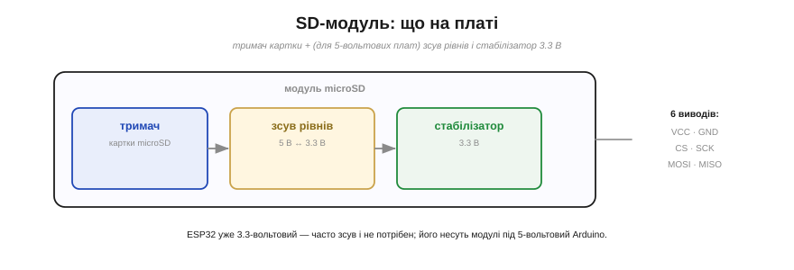
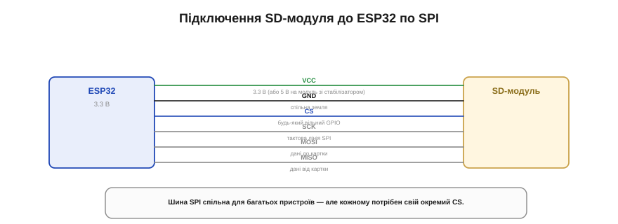

# 🔌 SD-модуль: тримач картки, зсув рівнів і SPI

> Компонентна вставка до **теми [§4.3.6 «Файлові системи на Flash»](r03-persistent-storage.md)**. Там ми вирішили, що великі чи знімні дані просяться на SD-картку; тут — як її фізично під'єднати до ESP32, щоб усе ожило.

## Що це за деталь

**SD-модуль** (адаптер-клас microSD) — невелика плата, що тримає **гніздо** під картку й перетворює її на кілька зручних виводів для під'єднання. Сама картка — це 3.3-вольтовий пристрій зі швидкою послідовною шиною; модуль додає до неї **обв'язку**, щоб картку було легко чіпляти до різних плат (Рис. 4.3.6c.1).


*Рис. 4.3.6c.1. На платі модуля три речі: гніздо з пружинними контактами, зсув рівнів (5 В ↔ 3.3 В) на випадок 5-вольтової плати й стабілізатор 3.3 В, якщо живити від 5 В. Назовні — шість виводів. ESP32 уже 3.3-вольтовий, тож зсув йому часто й не потрібен.*

На платі модуля зазвичай три речі: саме **гніздо** з пружинними контактами; **зсув рівнів** (*level shifter*) — на випадок, якщо керує 5-вольтова плата, бо подати на картку 5 В означало б її зіпсувати; і маленький **стабілізатор 3.3 В**, якщо живити модуль від 5 В. Тут є приємна деталь: **ESP32 і сам 3.3-вольтовий**, тож часто зсув рівнів йому й не потрібен — він стоїть на модулях, зроблених під 5-вольтовий Arduino, і просто не заважає.

## Розпіновка й підключення

Назовні модуль виставляє **шість виводів** — це знайома нам шина **SPI** плюс живлення (Рис. 4.3.6c.2):

```
VCC   — живлення (3.3 В; або 5 В, якщо на модулі є стабілізатор)
GND   — спільна земля
CS    — вибір пристрою (chip select) → будь-який вільний GPIO
SCK   — тактова лінія SPI
MOSI  — дані від ESP32 до картки
MISO  — дані від картки до ESP32
```


*Рис. 4.3.6c.2. Шість дротів: живлення, земля, чотири лінії SPI. CS — на будь-який вільний GPIO (його номер потім називають у коді). Шину SPI можна ділити з іншими пристроями, але кожному потрібен свій окремий CS.*

Підключення прямолінійне: живлення й земля, чотири дроти SPI, а **CS** — на будь-який вільний GPIO (саме його номер ви потім назвете в коді). Шину SPI можна ділити з іншими пристроями, та **кожному потрібен свій окремий CS**: спільна шина, різні «адресати».

## Перший байт

Заговорити з карткою просто: підключаєте бібліотеку SD (вона ховає під собою і SPI, і файлову систему FAT із §4.3.6), **монтуєте** картку, указавши номер CS-піна, — і далі працюєте звичними файловими діями: відкрити, читати, дописати. Найперша корисна перевірка — вивести список файлів кореня або записати один рядок у пробний файл: вийшло — отже, увесь ланцюг (дроти → SPI → картка → FAT) живий.

## Типові граблі

Більшість проблем зі SD — не в коді, а в дрібницях довкола:

- **Картка не та.** Бібліотека чекає **FAT** (§4.3.6); свіжа велика картка буває в exFAT — переформатуйте у FAT32. Не вставлена до клацання — теж класика.
- **CS не збігається.** Номер CS-піна в коді мусить точно відповідати тому, куди ви його підключили; переплутали — мовчазна відмова монтування.
- **Довгі дроти.** SPI не любить довгих, шумних перемичок: на макетці частий винуватець «то працює, то ні» — саме вони. Коротше й охайніше.
- **Просідання живлення.** Дешевий стабілізатор модуля під час сплеску струму на запис інколи «просідає», і картка скидається. Лікується конденсатором по живленню ближче до модуля.
- **Конфлікт на шині.** Якщо на тій самій SPI висить ще щось — переконайтеся, що в кожного **свій** CS і що чужий CS не лишається активним.

## Варіації класу

Модулі бувають під **повнорозмірну SD** і під **microSD** — електрично це те саме, різниця лише в гнізді. Дешеві варіанти можуть не мати зсуву рівнів (для ESP32 це нормально). А ще, крім простого режиму **SPI**, картка вміє швидший режим **SDMMC** — він дає більшу швидкість, але потребує більше виводів і акуратнішого розведення; для першого знайомства SPI простіший, і його цілком досить.
