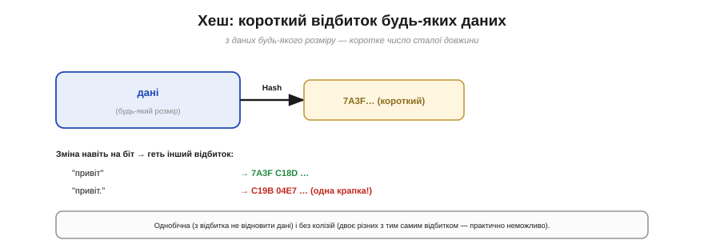
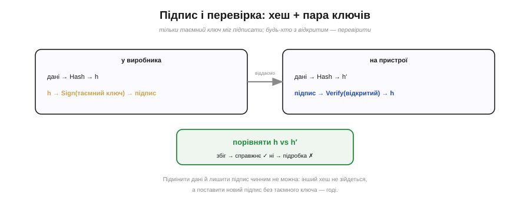

# 🧮 Хеш і цифровий підпис: математика ланцюга довіри

> Математична вставка до **теми [§4.3.9 «Secure boot і шифрування Flash»](r03-persistent-storage.md)**. Там підпис «просто працював»; тут — як саме, якісно й без страшних формул.

## Означення

Дві ідеї стоять за всім захистом прошивки.

**Хеш** (*hash*) — функція, що з даних **будь-якого** розміру дає коротке число **сталої** довжини — «відбиток» (Рис. 4.3.9m.1). У нього три цінні властивості: він **однобічний** (з відбитка не відновити дані); зміна даних навіть **на біт** дає геть інший відбиток; і знайти **двоє різних** даних з однаковим відбитком практично неможливо (стійкість до колізій).


*Рис. 4.3.9m.1. Хеш бере дані будь-якого розміру й дає коротке число сталої довжини. Зміна навіть на біт («привіт» проти «привіт.») дає геть інший відбиток. Він однобічний (назад не відновити) і практично без колізій.*

**Цифровий підпис** спирається на **пару ключів** — таємний і відкритий (§4.3.9). Підписати — це поставити на відбиток позначку таємним ключем; перевірити — звірити її відкритим.

## Інтуїція

Хеш — це **контрольна сума на стероїдах**. Звичайна сума (§4.3.7) теж міняється від псування даних, але її легко **підробити**: підмінив дані — перерахував суму. Хеш так просто не обдуриш: щоб лишити той самий відбиток, треба знайти інші дані з тією самою «пломбою», а це практично неможливо. Хеш ловить не лише випадок, а й **намір**.

Підпис додає до хеша **асиметрію**: позначку може поставити лише власник **таємного** ключа, а перевірити — будь-хто з **відкритим**. Це й перетворює «відбиток» на «печатку, яку не підробити».

## Формальний апарат (якісно)

```
відбиток:    h = Hash(дані)
підпис:      s = Sign(h, таємний_ключ)         ← може лише виробник
перевірка:   Verify(s, відкритий_ключ) = h     ← може будь-хто
             порівняти h з Hash(дані)
             збіг → справжнє;  ні → підробка
```

Пристрій робить так (Рис. 4.3.9m.2): сам рахує `Hash(дані)` від отриманої прошивки, відкритим ключем добуває з підпису той `h`, що його заклав виробник, — і **звіряє**. Збіглося — прошивка і справжня (підпис від виробника), і ціла (хеш сходиться).


*Рис. 4.3.9m.2. Виробник хешує дані й підписує відбиток таємним ключем. Пристрій сам хешує отримане, відкритим ключем добуває закладений відбиток із підпису й звіряє. Збіг — прошивка справжня і ціла; розбіжність — підробка.*

Чому це не зламати? Щоб підмінити прошивку й лишити підпис чинним, зловмисникові треба або:

- знайти **інші** дані з тим самим хешем — стійкість до колізій не дає; або
- поставити **новий** підпис під свою прошивку — а для цього потрібен таємний ключ, якого в нього нема.

Обидва шляхи закриті — тому й secure boot непробивний, поки таємний ключ у секреті (§4.3.9).

## Де в курсі це працює

Це математичне серце §4.3.9: підпис прошивки в secure boot і кожна ланка **ланцюга довіри** перевіряються саме так — хешем і відкритим ключем. А ще тут видно різницю з §4.3.7: проста контрольна сума боронить від **випадку**, хеш із підписом — від **зловмисника**. Те саме «звірити відбиток», але піднесене на рівень, де його не обдурити навмисно.
