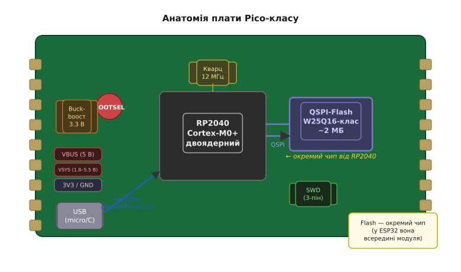
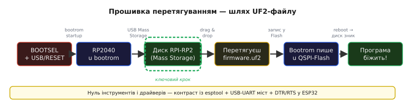

# 🔌 Плата Pico-класу: зовнішня QSPI-Flash і прошивка перетягуванням (UF2)

> Компонентна вставка до **теми [§4.11.5 — RP2040-клас: PIO — периферія, яку програмуєш сам](r11-mcu-landscape.md)**

У темі §4.11.5 ми побачили RP2040 з його головною родзинкою — програмованим інтерфейсом PIO. Але чип сам по собі — це ще не система: він потребує плати-носія. Тут ми розглядаємо саме її — **плату Pico-класу** — і дві речі, якими вона помітно відрізняється від ESP32-плат: **окрема мікросхема Flash** і **прошивка простим перетягуванням файлу**. Периферію PIO розбираємо окремо — у ⚙️ `r11-s5-a-pio.md`.

---

## Що це за клас

**Pico-клас** — це Raspberry Pi Pico та сумісні з нею плати розробника, що будуються навколо чипа **RP2040**. На перший погляд вони нагадують ESP32-DevKit: прямокутна плата, гребінка контактів по краях, USB-роз'єм, кнопка. Але всередині — принципова відмінність.

У RP2040 **немає вбудованої Flash-пам'яті на кристалі**. Це не технічний недолік — це свідоме архітектурне рішення: Flash встановлюють **зовні**, на окремій мікросхемі, яка спілкується з чипом по шині **QSPI (Quad-SPI)**. Якщо ви вже читали §4.3, де зовнішня Flash розглядалась як окрема пам'ять, — ось вона в дії, але тепер не як сховище файлів, а як основна програмна пам'ять. У WROOM-модулі (§4.1.2) Flash теж стояла окремим чипом, проте захована під металевим екраном модуля; тут вона лежить відкрито поряд із RP2040 і добре видна на платі.

Зовні плата впізнається по фрезерованих краях (пронизані пів-отвори, як у модуля §4.1.2c) — це дозволяє паяти її поверхнево на материнську плату. Доповнюють картину звична гребінка з двостороннім кроком і USB-роз'єм. Деталі — нижче, а поки що подивімося на архітектуру з висоти.



*Рис. 4.11.5c.1. Анатомія плати Pico-класу. У центрі — RP2040 (двоядерний Cortex-M0+); поруч, окремою мікросхемою — QSPI-Flash класу W25Q16 (~2 МБ). USB іде напряму до чипа — без жодного USB-UART моста. Buck-boost (SMPS) живить усю схему від 3.3 В незалежно від джерела. Гребінка GPIO з фрезерованими контактами — по боках.*

---

## Що на платі додано

- **Зовнішня QSPI-Flash (Quad-SPI, QSPI)** — типово мікросхема класу W25Q16 або аналог: 2 МБ пам'яті на чотирьох лініях даних. RP2040 читає код звідси безпосередньо у режимі **XIP (execute-in-place)** — не копіюючи у RAM, а виконуючи на місці. Саме тому обсяг Flash має значення: програма разом із даними (наприклад, файлова система LittleFS; детальніше — §4.3) мають у ньому вміститися. Більші плати ставлять 4 або 16 МБ.

- **Кнопка BOOTSEL** — головна дійова особа цієї вставки. Утримуєш її в момент подачі живлення або скидання — і RP2040 стартує не зі звичайного ланцюга завантаження Flash, а з **вбудованого ROM-завантажувача (bootrom)**. Це апаратна гарантія: bootrom прошитий у ROM самого чипа і його неможливо затерти жодним невдалим прошиванням. «Цеглу» зробити практично нереально.

- **USB напряму від чипа** — RP2040 має власний повноцінний USB-контролер, як і ESP32-S2/S3 (§4.1.5c). Це означає, що **жодного USB-UART моста не потрібно**. Саме пряме USB-з'єднання й уможливлює режим накопичувача, про який ідеться нижче.

- **Buck-boost (SMPS) на 3.3 В** — перетворювач приймає будь-яку напругу від ~1.8 до 5.5 В (контакт **VSYS**) або 5 В з USB (контакт **VBUS**) і стабілізує їх до **3.3 В** (контакт **3V3**). Рівні логіки — 3.3 В, як і в ESP32 (§4.2.5c). Правило збігу рівнів незмінне: 5 В на GPIO гарантовано пошкодять плату.

- **Без вбудованого налагоджувача** — на відміну від Nucleo (§4.11.4c), де є вбудований ST-Link, на Pico виведений лише 3-контактний роз'єм **SWD** (SWCLK, SWDIO, GND). Для повноцінного налагодження потрібен зовнішній програматор — або друга Pico у ролі picoprobe.

---

## Розпіновка й живлення

```
VBUS    — 5 В прямо з USB (виходить від роз'єму, не регулюється)
VSYS    — вхід живлення 1.8…5.5 В (сюди ж і buck-boost прийом)
3V3     — вихід 3.3 В (живить RP2040 і периферію; до 300 мА)
GND     — спільна земля
GPxx    — GPIO (рівні 3.3 В; кожен контакт підтримує будь-яку функцію
                через PIO і апаратний мультиплексор)
SWCLK   — тактування SWD (налагодження)
SWDIO   — дані SWD
```

Характерна риса RP2040 — майже повна рівноцінність GPIO. На відміну від службових контактів ESP32 (§4.2.6), де деякі піни при завантаженні визначають режим роботи чипа і їх треба обходити стороною, тут обмежень значно менше: гнучкий апаратний комутатор дозволяє призначити будь-яку периферійну функцію на будь-який контакт. Три контакти зайняті службово (USB D+/D− і один SWD), решта — у вашому розпорядженні. Точні номери завжди в коді, не в голові.

---

## «Перший байт»: прошивка перетягуванням (UF2)

Це головне, чим Pico-клас здивує новачка, що прийшов від ESP32.

1. **Утримуєш BOOTSEL**, підключаєш USB до комп'ютера (або натискаєш RESET, якщо кнопка є) — RP2040 перехоплює керування на старті й переходить у **bootrom**.
2. **Bootrom підіймає USB-режим Mass Storage** — у вашій системі з'являється диск із міткою **`RPI-RP2`**, наче звичайна флешка. Жодних драйверів, жодних встановлень, будь-яка ОС.
3. **Перетягуєш** файл `firmware.uf2` на цей диск — так само, як перетягуєш документ у папку.
4. **Bootrom записує UF2 у зовнішню QSPI-Flash**, плата сама перезавантажується — і вже виконує вашу програму. Диск `RPI-RP2` зникає.

Формат **UF2 (USB Flashing Format)** — спільна розробка Microsoft і Adafruit, спочатку для micro:bit. Файл складається з 512-байтних блоків; кожен несе адресу, 256 байт корисних даних і магічні числа-маркери. Маркери потрібні саме для того, щоб ОС не сплутала образ прошивки зі звичайними файлами при копіюванні — файлова система не знає про структуру UF2, але bootrom розпізнає її бездоганно.

Для порівняння: прошивка ESP32 вимагала `esptool`, USB-UART моста і точного керування сигналами DTR/RTS для переведення чипа в режим прошивання (§4.1.5c, §4.2.5c). Тут — **drag-and-drop, нуль інструментів і нуль налаштувань**. Саме тому Pico така популярна у навчанні та швидкому прототипуванні.



*Рис. 4.11.5c.2. Прошивка перетягуванням: від BOOTSEL до запущеної програми. Ключовий крок — поява диска RPI-RP2 у системі; далі bootrom сам записує у QSPI-Flash і перезавантажує плату. Нуль інструментів — контраст із esptool + міст + DTR/RTS у ESP32.*

> 🔧 **Навіщо це знати**
>
> **Зовнішня Flash + ROM-завантажувач = майже непробивне залізо.** Bootrom зашитий у чип при виробництві й не може бути стертий жодним кодом. Хоч би що ви залили у Flash — неправильний образ, випадкові байти, код що зависає — BOOTSEL завжди поверне плату у режим накопичувача. Відновлення без програматора, без спеціальних кабелів, без командного рядка. Це інша філософія, ніж у ESP32, де ROM-завантажувач також надійний, але активується через UART з обов'язковими DTR/RTS: обидва підходи захищені, проте UF2-диск — найзручніший для тих, хто тільки починає.

---

## Що насправді записується у Flash

Ланцюг збірки Pico SDK (CMake + arm-none-eabi-gcc) видає на виході не `.bin` і не `.hex`, а одразу готовий **`.uf2`-файл** — саме той, що тягнеш на диск. Тобто ланцюг замикається без жодної утиліти-прошивача: написав, зібрав, перетягнув, забликало.

Канонічний приклад — blink з Pico SDK (мова курсу — C):

```c
#include "pico/stdlib.h"

int main(void) {
    const uint LED = PICO_DEFAULT_LED_PIN;   // GP25 на Pico
    gpio_init(LED);
    gpio_set_dir(LED, GPIO_OUT);
    while (true) {
        gpio_put(LED, 1);
        sleep_ms(500);
        gpio_put(LED, 0);
        sleep_ms(500);
    }
}
```

`gpio_init`, `gpio_set_dir`, `gpio_put`, `sleep_ms` — це реальне API Pico SDK; `PICO_DEFAULT_LED_PIN` — константа, яка для стандартної Pico дорівнює 25. Збірка через CMake дає `blink.uf2`: перетягнув на диск RPI-RP2, і через секунду світлодіод блимає. PIO-код у цій вставці не потрібен — він у ⚙️ `r11-s5-a-pio.md`.

---

## Типові граблі

- **Диск RPI-RP2 не з'явився** — найчастіша причина: не утримував BOOTSEL у момент підключення USB, або кабель «тільки для заряджання» (без ліній даних). Ця класика знайома всім, хто стикався з просадкою живлення у DevKit (§4.1.8): спочатку перевір кабель, потім платформу.

- **Скопіював `.bin` або `.hex` замість `.uf2`** — диск очікує саме формат UF2; інший файл або проігнорується, або плата не стартує. Збірка через SDK дає `.uf2` автоматично — перевір розширення.

- **Менше Flash, ніж очікував** — на найдешевших платах стоїть W25Q16 (2 МБ); якщо програма разом із LittleFS-розділом (§4.3) перевищує цей обсяг, місця не вистачить. Перевір обсяг Flash конкретної плати перед замовленням.

- **Плутанина рівнів** — Pico розрахована на 3.3 В: 5 В на GPIO пошкодить чип так само, як і в ESP32 (§4.2.5c). Правило збігу рівнів — незмінне для всіх сучасних мікроконтролерів.

- **Думав, GPIO «магічно» знають протокол** — будь-який контакт і будь-який протокол реалізує **PIO**, а не апаратний блок у звичному розумінні. Деталі — у ⚙️ `r11-s5-a-pio.md`; тут лише нагадування, щоб не дивуватися такій гнучкості.

---

## Варіації класу

**Pico** і **Pico W** — перший і найпоширеніший виток сімейства. Pico W додає до тієї самої плати чип Infineon CYW43 (Wi-Fi 802.11n + Bluetooth 5.2) — але через SPI, як зовнішня периферія. Радіо тут окреме від RP2040, на відміну від ESP32, де воно інтегроване на кристалі разом із ядром.

Сторонні виробники (SparkFun, Adafruit, WeAct та інші) випускають власні RP2040-плати з різним оснащенням: 4 або 16 МБ QSPI-Flash замість 2 МБ, USB-C замість micro-USB, додатковий PSRAM для вимогливих застосувань, бортовий RGB-світлодіод, кнопка RESET. Механізм UF2-прошивання незмінний на всіх.

Спадкоємець **RP2350** (плата Pico 2, 2024) зберігає ту саму UF2-філософію і той самий формат файлу, розширюючи вибір: Cortex-M33, RISC-V Hazard3 або обидва ядра одночасно в режимі спарювання. UF2-нитка проходить через усе сімейство незмінною.

Drag-and-drop — це не лише Raspberry Pi: Adafruit на мікроконтролерах SAMD51, оригінальний micro:bit на nRF51 та його нащадки підтримують той самий UF2-підхід. Це **концепція**, а не фірмова прив'язка — корисно знати під час вибору платформи для навчального стенда або масштабованого продукту.

---

> ▶️ Повернутися до теми: [§4.11.5 — RP2040-клас: PIO](r11-mcu-landscape.md)
