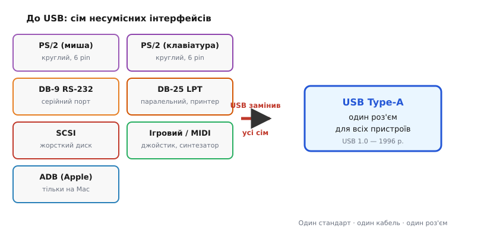
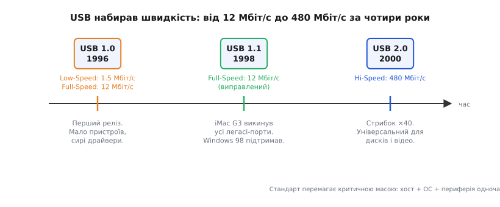

# 📜 Історія до Розділу 4.12 — USB: сім компаній проти зоопарку роз'ємів

> Це історична вставка до [Розділу 4.12 «USB на мікроконтролері»](r12-usb-mcu.md). Вона веде **ланцюгом питань** навколо однієї, здавалося б, простої ідеї: замінити десяток несумісних роз'ємів на задній панелі ПК одним-єдиним портом. Але USB народився не як технічний подвиг самотнього генія — він народився як **акт колективної втоми**, спроба семи конкуруючих корпорацій разом убити «зоопарк роз'ємів» 1990-х. Це, отже, не стільки історія про винахід, скільки про **консорціум і стандарт** — про те, як потреба, що визріла одночасно в багатьох місцях, породила рішення, яким усі ми досі користуємося. (Рівно та сама мораль, що й у розділі про переривання: «перший» залежить від визначення, і за ним стоять не одна фірма й не одна людина.) А «гачок» для розробника простий: саме тому ваш ESP32 і прошивається, і живиться через один і той самий кабель — це пряма спадщина інженерних рішень 1996 року.

У [§4.11](../r11-mcu-landscape/r11-mcu-landscape.md) ми обирали мікроконтролер і дивилися на нього як на чип серед чипів: ядра, пам'ять, периферія, споживання. Та щойно чип обрано — постає наступне, приземленіше питання: **як підключити його до світу?** Чим прошити? Чим живити? Як підключити клавіатуру, флешку, UART-міст? І тут виявляється дивовижна річ: та сама дірочка в платі ESP32-DevKit і прошиває, і годує, і за потреби перетворює плату на клавіатуру. Один роз'єм — і все це одразу. Щоб зрозуміти, **чому** це стало можливим, треба повернутися в середину 1990-х, коли інженери ставили собі абсолютно протилежне питання: чому ж їх так **багато** — і як це виправити?

На рис. 4.12.0.1 — той самий контраст між «до» і «після», і він наочніший за будь-який словесний опис.

---

## Доба зоопарку роз'ємів: чому під столом був жах

Задня панель типового ПК початку 1990-х була схожа на колекцію артефактів різних цивілізацій. Там можна було знайти: два **PS/2**-роз'єми (круглі, 6-pin, фіолетовий для клавіатури, зелений для миші — перетнути кольори, і нічого не запрацює); **DB-9 RS-232** для модему або послідовного пристрою (дев'ять штирків у трапецієподібному корпусі, гвинтики для фіксації); **DB-25 LPT** для принтера (двадцять п'ять контактів, паралельна передача, 8 біт одночасно — і теж гвинтики); **SCSI** для зовнішнього диска або сканера (цей міг виглядати по-різному залежно від версії); 15-контактний **ігровий порт** для джойстика, що він же умів MIDI; а на комп'ютерах Apple — **ADB** (Apple Desktop Bus), зовсім несумісний ні з чим вищепереліченим.

Кожен із цих роз'ємів мав свій кабель, свої рівні напруги, свою швидкість передачі, свою логіку й свій драйвер. Але найгірше навіть не несумісність, а **умови роботи з ними**. Щоб переткнути периферію, треба було **вимкнути комп'ютер**: послідовний і паралельний порти не підтримували «гарячого» під'єднання, і вмикання «наживу» могло пошкодити порт або пристрій. Для SCSI-пристрою слід було ще й виставити DIP-перемикачами унікальний SCSI ID — і не забути про термінуючий резистор на кінці ланцюжка. IRQ-конфлікти («хто займе IRQ 5?») доводилося вирішувати вручну в налаштуваннях BIOS або навіть перемичками на платі. Жоден із цих портів не давав пристрою живлення по сигнальному кабелю — зовнішній пристрій мав власний блок живлення, ще один шнур до розетки. Кількість портів була строго обмежена: зазвичай один-два COM, один LPT, два PS/2 — і ніяких хабів.

Чому ж так склалося? Не через злий умисел, а через **закони фрагментації**: кожен порт проєктувала інша епоха й інша фірма під одну конкретну задачу. RS-232 стандартизували ще в 1960-х для з'єднання телетайпів і модемів; Centronics/LPT — для принтерів у 1970-х; ADB Apple розробила для власної екосистеми; SCSI оптимізувався для дисків з максимальною пропускною спроможністю. Сумісність нікого не турбувала, бо кожен проєктував «свій» шматочок і не думав про сусідів.

І ця фрагментація мала справжню економічну ціну. Кожен новий порт означав окремий чип на материнській платі, окремий BIOS-ресурс, окрему схему захисту від статики. Виробнику ПК доводилося тримати в дизайні шість-сім незалежних контролерів — і кожен займав місце, споживав струм і коштував грошей. Те саме з боку розробника периферії: хочеш продавати і в PC-світ, і в Mac-світ — роби два варіанти пристрою, два кабелі, два набори драйверів. Тиск на стандартизацію йшов не тільки від кінцевих користувачів, а й від самих виробників заліза, яким ця різнобарвність банально дорого обходилася.

*Рис. 4.12.0.1. Зоопарк роз'ємів 1990-х — і один порт, що їх замінив. USB згорнув сім несумісних інтерфейсів (кожен зі своїм кабелем, рівнями, драйвером) в один універсальний роз'єм — це й була його головна обіцянка, а не лише швидкість.*

> 🔧 **Навіщо це.** Для розробника мікроконтролера «зоопарк» — не абстрактна проблема. Він означав: для кожного нового пристрою — своє питання «який кабель, який драйвер, який ресурс?», і своя нагода щось переплутати. USB замінив усе це єдиною шиною з єдиними правилами. Саме тому ESP32-DevKit має лише USB і нічого більше — і саме тому ви ніколи не думаєте про IRQ-конфлікти між своїм налагоджувальником і мишею.

---

## Сім компаній за столом: народження USB-IF (1994–1996)

У 1994 році в Гіллсборо, штат Орегон, на об'єкті Intel під назвою Jones Farm Conference Center зібралися інженери семи компаній: **Intel, Compaq, DEC (Digital Equipment Corporation), IBM, Microsoft, NEC і Nortel**. Завдання — сформулювати, чого всі вони хочуть від «ідеального» порту, і домовитися про єдину специфікацію (specification, spec). Первинну внутрішню чернетку специфікації підготувала Intel ще у 1994-му, а вже потім передала її на суд партнерів. У 1995-му консорціум (consortium) USB-IF (USB Implementers Forum) організаційно оформився, а в **січні 1996 року** з'явився USB 1.0.

Зверніть увагу на склад: сім конкурентів за одним столом, і кожен мав власний корисливий інтерес. Але саме ця напруга між конкурентами й зробила стандарт живучим. **Чому консорціум, а не одна фірма?** Тому що стандарт мертвий без екосистеми. Intel могла зробити ідеальний чипсет із USB-контролером — але якщо ПК-виробники не поставлять порт на материнські плати, а Microsoft не напише драйвер, а виробники периферії не зроблять USB-пристроїв, — порт залишиться на папері. Потрібні одночасно всі ланки.

Ролі учасників розподілилися логічно. **Intel** вкладала в USB кремній: розробляла чипсети й перші хост-контролери (host controller), що мали сидіти на материнській платі й керувати шиною. **NEC** теж включилася в розробку хост-контролера, і між реалізаціями Intel та NEC згодом виникне цікава технічна розбіжність (UHCI проти OHCI) — але про це в §4.12, а не тут. **Microsoft** брала на себе найважливішу для кінцевого користувача частину: підтримку в операційній системі, тобто систему plug-and-play і стандартні драйвери, вбудовані у Windows. Без «драйвер уже в системі» жоден порт не перетвориться на масовий. **Compaq, IBM і DEC** — великі ПК-виробники — гарантували, що порт з'явиться на материнських платах мільйонів комп'ютерів. **Nortel** (тоді ще Northern Telecom, канадський телекомунікаційний гігант) привносила досвід надійних цифрових комунікацій і мала власний інтерес у пристроях зв'язку.

Двомовні терміни для розуміння §4.12: «консорціум (consortium)», «специфікація (specification, spec)», «зворотна сумісність (backward compatibility)», «хост (host)».

Але коли хтось ставить питання «а хто ж **винайшов** USB?» — і хтось відповідає одним прізвищем — це вже початок спрощення, яке варто розібрати.

---

## Аджай Бхатт і пастка «єдиного винахідника»

Масова культура закріпила за USB одне обличчя і одне ім'я: **Аджай Бхатт (Ajay Bhatt)**, інженер Intel. Якщо ввести «хто винайшов USB» у будь-який пошуковик, ця відповідь стоятиме першою. Вікіпедія в різних версіях то називає його «головним архітектором», то «одним зі співавторів». І все це — **напівправда**. Розберемо її по частинах, як це має робити добра інженерна аналітика, — із розмежуванням того, що підтверджено, і того, що є спрощенням.

Що **правда**: Бхатт — інженер Intel індійського походження, який працював у США і був **одним із провідних архітекторів USB**. Сам він описує себе як «co-creator» — співстворювача, — завжди згадуючи колег. Ключові підтверджені співархітектори всередині Intel: **Бала Кадамбі (Bala Cadambi)** і **Джим Паппас (Jim Pappas)**. Кадамбі брав участь безпосередньо в розробці технічної специфікації. Паппас прийшов з DEC, де вже займався проблемами сумісності, перейшов до Intel і став менеджером програми USB — людиною, що організовувала колективну роботу семи компаній. Крім них, свій внесок у специфікацію зробили інженери NEC, що розробляли власну реалізацію хост-контролера, і десятки людей у решті шести компаній-фундаторів.

Звідки ж взявся міф про одного батька? З **реклами**. У 2009 році Intel запустила кампанію «Our Rock Stars Aren't Like Your Rock Stars» («Наші рок-зірки — не як ваші рок-зірки»), в якій реальний Аджай Бхатт з'являвся як «винахідник USB» під звуки рок-гітари в офісних коридорах. Деталь, яку ЗМІ часто губили: у рекламі **Бхатта зіграв актор Суніл Наркар (Sunil Narkar)**, а не сам Бхатт. Ролик став вірусним і розійшовся парафразами: його пародіювали в нічному шоу Конана О'Браєна. Ім'я Бхатта закріпилося в масовій уяві як «людина-USB» — не тому, що він утаємничений одинак-винахідник, а тому що Intel вміло скористалася його постаттю для брендингу.

Сам Бхатт про це говорив чесно: роялті з USB він **не отримував** — відкритий стандарт, яким керує форум, не дає власнику авторських відрахувань. Це, до речі, чудова ілюстрація різниці між «винахідником» і «власником патенту»: Бхатт — один із архітекторів, але USB-IF належить всій галузі. Саме тому будь-хто може виробляти USB-пристрої, платячи лише за реєстрацію VID/PID у реєстрі — і цим ми скористаємося в §4.12.3.

Статус доказів, як і в розділі про переривання, треба проговорити явно. «Хто винайшов USB» залежить від того, що рахувати «винаходом». Якщо — «мав ідею»: ідея замінити зоопарк роз'ємів одним портом визрівала колективно ще до 1994-го, у різних компаніях незалежно. Якщо — «написав специфікацію»: це команда в семи компаніях, сотні інженерів, сотні сторінок тексту. Якщо — «зробив робочий кремній»: Intel розробила один хост-контролер (UHCI), NEC — інший (OHCI); обидва вийшли майже одночасно і були несумісні на рівні регістрів, хоч і сумісні на рівні USB-протоколу. Якщо — «створив екосистему»: це всі сім разом плюс тисячі виробників периферії, що приєдналися пізніше. USB — колективний стандарт, а не чийсь особистий патент. Одне ім'я в рекламному ролику, яке зіграв найнятий актор, не скасовує цього факту.

> 🔧 **Навіщо це.** Для інженера урок практичний: відкритий стандарт, яким керує форум, а не фірма, — саме тому USB-стек доступний усім без роялті, а VID/PID-реєстр відкритий для реєстрації. Коли в §4.12.3 ви побачите, як ESP32 рекомендується хосту як USB-пристрій із власним VID і PID, — це прямий наслідок рішення 1994 року: зробити стандарт спільним.

---

## Що мусив уміти один-єдиний порт: чотири інженерні обіцянки

Щоб один роз'єм витіснив сім, він мусив дати те, чого не давав **жоден** із попередників. Розробники консорціуму сформулювали для себе чотири ключові вимоги — і кожна з них була прямою відповіддю на конкретний «біль» зоопарку.

**Перша: «гаряче» під'єднання (hot-plug) без перезавантаження.** Жоден старий порт цього не вмів. RS-232 і LPT проєктувалися за припущенням, що пристрій підключений ще до ввімкнення ПК — і наслідком стала «гаряча» смерть порту або пристрою від перехідного струму при неправильному під'єднанні наживу. PS/2 просто ніколи не перевіряв, чи підключено щось нове. USB мав дозволити будь-коли ввімкнути пристрій і так само будь-коли безпечно вийняти — і це вимагало зовсім іншої електричної схеми (із захистом від перехідних струмів) і протокольної архітектури (хост постійно опитує шину на появу нового пристрою). (Як саме USB помічає появу нового пристрою — у §4.12.3, де ми розберемо енумерацію (enumeration).)

**Друга: самоналаштування (plug-and-play) — драйвер знаходиться сам.** Для кожного SCSI-пристрою або COM-пристрою треба було знайти й встановити драйвер вручну. USB мав влаштувати це автоматично: пристрій сам повідомляє, хто він, і система знаходить відповідний драйвер зі стандартного набору. Саме тому Microsoft зайняла місце за столом — без «драйвер уже в Windows» ця обіцянка лишалася б порожньою. (Механізм — класи USB (USB classes) у §4.12.5.)

**Третя: живлення прямо по кабелю (5 В).** Жоден старий порт не давав пристрою живлення. Кожен модем, сканер, зовнішній диск мав власний блок живлення і ще один шнур до розетки — і це означало: два кабелі до кожного периферійного пристрою замість одного, ще один слот у мережевому фільтрі, ще один адаптер у валізі. USB пообіцяв 5 вольт і до 500 міліампер — достатньо для клавіатури, миші, флешки, невеликого хабу. Мишу тепер можна живити прямо від порту, не тягнучи окремий шнур. (Деталі — у §4.12.7, де ми розберемо, як ESP32 споживає шинне живлення і як воно обмежується.)

**Четверта: розгалуження — один порт, багато пристроїв через хаби (hub).** Стара проблема: портів фізично мало, а пристроїв більшає. COM-портів зазвичай два (COM1 і COM2), і обидва вже зайняті модемом і мишею — куди підключати третій COM-пристрій? USB вирішив це структурно: хост (host) має один (або кілька) кореневих портів, а далі можна нарощувати дерево через хаби — до 127 пристроїв на одну шину. Хаб — сам USB-пристрій, що розгалужує один порт у чотири або сім, і кожен із них може вести до іншого хабу або до листового пристрою. Так один USB-контролер на материнській платі обслуговує всю периферію — і новий монітор із вбудованим хабом стає природним продовженням шини, а не окремим контролером. (Топологія дерева — у §4.12.1.)

Кожен із цих чотирьох пунктів — не технічний капріз і не маркетинговий слоган. Кожен — конкретна відповідь на конкретний біль, задокументований у скаргах покупців і в звітах служб підтримки. Не «давайте зробимо швидше» — а «давайте зробимо так, щоб ніхто більше не гвинтив DB-25 руками і не перезавантажував ПК для нової миші». Саме тому, коли USB нарешті потрапив до широкого вжитку і виявилося, що всі чотири обіцянки виконуються, перехід стався швидко і без жалю за старими роз'ємами.

*Рис. 4.12.0.2. Як USB набирав швидкість: від 12 Мбіт/с у 1996-му до 480 Мбіт/с у 2000-му. Технічна досконалість першого релізу не дала перемоги одразу — її здобули екосистема й стрибок швидкості. Стандарт перемагає критичною масою: хост + ОС + периферія одночасно.*

---

## Повільний старт і перемога: чому USB «вистрілив» не одразу

Коли в січні 1996 року з'явився USB 1.0, інженери могли б виголосити тост за перемогу. Але ринок відповів прохолодно. Причин було кілька. Специфікація передбачала два режими: Low-Speed (1.5 Мбіт/с) для клавіатур і мишей та Full-Speed (12 Мбіт/с) для складніших пристроїв. Для 1996 року 12 Мбіт/с — непогано, особливо порівняно з RS-232 (максимум 115 кБіт/с) або навіть LPT. Але реальні USB-пристрої на полицях магазинів майже не з'являлися: виробники периферії не поспішали вкладатися в новий стандарт, поки не бачили достатньо USB-комп'ютерів; виробники ПК не поспішали ставити порти, поки не бачили попиту на USB-пристрої. Класичний двосторонній тупик, що паралізував не один перспективний стандарт до USB і ще кількох після нього.

До того ж у перших версіях специфікації хост-контролери від Intel (UHCI, Universal Host Controller Interface) і від NEC (OHCI, Open Host Controller Interface) реалізовували низькорівневе керування шиною по-різному — вони були несумісні на рівні регістрів, хоча на рівні USB-протоколу працювали однаково. Виробники периферії мусили писати різні драйвери для різних чипсетів, що додавало плутанини.

Додавали проблем і сирі драйвери у Windows 95: перша підтримка USB там була експериментальною й ненадійною. Пристрій підключиш — може розпізнатися, а може й ні.

Перелом стався в **1998 році** на двох фронтах одночасно. По-перше, з'явився **USB 1.1** — технічно несуттєве оновлення (швидкості лишилися тими ж: 1.5 Мбіт/с і 12 Мбіт/с), але принципово важливе тим, що усунуло низку помилок і неясностей у специфікації. Виробники нарешті отримали стабільний документ, на який можна спиратися, не боячись, що наступна версія все переламає. По-друге, і це важливіше, **Apple** зробила хід, від якого галузь здригнулася: новий **iMac G3** вийшов взагалі **без PS/2, без COM-порту, без LPT** — тільки USB і Ethernet. Купивши iMac, ви не мали іншого вибору, крім як купити USB-клавіатуру й USB-мишу. Інший варіант: нічого не підключити взагалі. Це рішення Стіва Джобса критикували за самовпевненість — мовляв, не можна так різко рвати з легасі-портами, люди вже мають периферію. Але саме ця рішучість дала індустрії той поштовх, якого бракувало. Виробники периферії ринули робити USB-версії всього: спершу клавіатури й миші, потім принтери, сканери, флешки. **Windows 98**, що вийшла того ж 1998 року, нарешті дала нормальну, стабільну підтримку USB прямо в системі — без окремого пошуку драйверів, без «перезавантажте й спробуйте ще раз».

Але остаточну перемогу USB здобув у **2000 році**, коли з'явився **USB 2.0** зі швидкістю Hi-Speed **480 Мбіт/с** — у сорок разів більше за Full-Speed. При такій пропускній спроможності USB став придатним для зовнішніх жорстких дисків, веб-камер, відеозахоплення. Потреба тримати SCSI для диска чи окремий відеовхід зникла. До 2003 року USB перейшов з категорії «новий стандарт» у категорію «звичайно USB — а що ще?».

Урок для будь-якого стандарту: технічна досконалість — необхідна, але не достатня умова перемоги. Потрібна **критична маса**: достатньо хостів (хост, host), достатньо пристроїв і підтримка в ОС — і все це **одночасно**. Саме тому і знадобилося сім фірм: жодна одна не могла закрити всі три сторони трикутника. Це явище добре знайоме економістам під назвою «мережевий ефект» (network effect): цінність стандарту зростає пропорційно числу тих, хто його використовує. USB 1.0 мав малу цінність, бо пристроїв бракувало; пристроїв бракувало, бо USB-комп'ютерів було мало. Замкнене коло розірвали Apple з боку хостів і Windows 98 з боку ОС — і колесо нарешті покотилося саме.

---

## Що з цього лишилося нам: USB у вашому ESP32

Тридцять років — довгий шлях для технічного стандарту, і USB пройшов його майже без утрат. Кожна з чотирьох обіцянок 1996 року живе в тому, що ви робите з ESP32.

Той самий кабель, яким ви під'єднуєте плату до комп'ютера, **прошиває** мікроконтролер через USB-UART-міст (детально — у [§4.2.5](../ch21-toolchain/ch21-s5-c-usb-uart.md)) і водночас **живить** ESP32 від 5 В шини (§4.12.7). ESP32 може «прикинутися» USB-клавіатурою або USB-диском завдяки механізму класів (§4.12.5) — і тоді ваш комп'ютер навіть не здивується: він побачить звичайний HID або Mass Storage, бо Microsoft ще 1998 року пообіцяла «драйвер уже в системі».

Різні сімейства ESP32 успадкували цю шину по-різному, і варто хоча б назвати ці гілки, перш ніж поринати в деталі §4.12. Класичний **ESP32** не має нативного USB-контролера — тому між мікроконтролером і портом стоїть зовнішній UART-міст (CP210x, CH340 або схожий), якого ми вже зустрічали в §4.2.5: чип перекладає між USB-пакетами і звичайним послідовним UART, яким ESP32 і отримує прошивку. **ESP32-S2 і S3** отримали нативний **USB-OTG** (On-The-Go) — тобто вбудований USB-контролер, що може бути і хостом (підключати флешки, клавіатури), і пристроєм (прикидатися клавіатурою або диском перед комп'ютером), без жодного зовнішнього чипа. **ESP32-C3, C6** мають **USB-Serial/JTAG** — спрощений блок, достатній для прошивки й апаратного налагодження, але без повноцінного OTG. Усі ці гілки — пряма спадщина рішень, ухвалених у Гіллсборо 1994 року, і в §4.12.6 ми розберемо відмінності докладно.

І ще один урок, ширший за техніку. Як і з перериваннями, тут немає одного «батька» — є **спільна потреба** (вбити зоопарк) і консорціум із семи конкурентів, кожен з яких хотів стандарту, але лише разом могли його нав'язати ринку. «Винахідник USB» — відшліфована рекламна легенда 2009 року; правда — це Аджай Бхатт разом із Балою Кадамбі, Джимом Паппасом, командою NEC та десятками інженерів у семи фірмах. Обличчя на екрані ≠ єдиний автор специфікації, і актор у рекламі ≠ навіть та людина з обличчям. Саме так і варто читати будь-яку «першість» в історії техніки: не як точку, а як простір, де зустрілися потреба, ресурси й люди. Усі інші «перші» — від переривань до мікропроцесорів — мають таку саму складну внутрішню будову, як тільки зазирнути уважніше.

З цим розумінням ми й переходимо до тіла Розділу 4.12: як USB бачить хост, як новий пристрій рекомендується шині (енумерація), які бувають типи передач і класи пристроїв, і як ESP32 стає то пристроєм, то хостом — залежно від сімейства і завдання.
