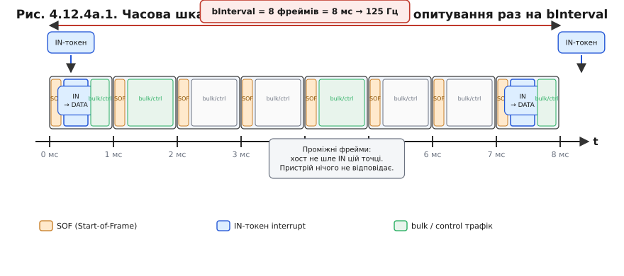

# ⚙️ Розклад шини: фрейми 1 мс і чому миша «125 Гц»

> Алгоритмічна вставка до **теми [§4.12.4 «Кінцеві точки й типи передач»](r12-usb-mcu.md)**.
> У темі ми поділили передачі на типи і зустріли **interrupt**-кінцеву точку, що нібито «сама шле, коли є дані». Тут показуємо: насправді темп задає **хост**, і саме звідси береться магічне число «125 Гц» у налаштуваннях миші.

---

## Задача

Після §4.12.4 лишається одна неприємна плутанина. Interrupt-передачу часто описують так: «пристрій сам сигналить хосту, коли з'являються нові дані». Це хибна картинка, і вона тягне за собою цілий хвіст помилок у дизайні прошивки. На шині USB **немає** ініціативи з боку пристрою: говорить лише той, кого спитав хост. Тоді як миша взагалі «доповідає» про рух? Вона ж не може чекати, поки її спитають — вона мусить реагувати швидко.

Питання вставки сформулюємо точно: **як хост вкладає опитування interrupt-точки в час, і яка одна цифра в дескрипторі визначає максимальний темп звітів?** Щоб відповісти — поглянемо, як шина ділить час.

---

## Ідея

### Час шини нарізаний на фрейми

Хост — диригент шини, а не пасивний одержувач. Він ділить час на рівні **фрейми (*frame*)** по **1 мс** для Full-Speed (12 Мбіт/с) — саме цей режим реалізують ESP32-S2 та ESP32-S3. На початку кожного фрейму хост відправляє **SOF-пакет** (*Start of Frame*), що синхронізує всіх учасників. Далі він заповнює фрейм транзакціями за власним розкладом: спочатку гарантований час для interrupt- та isochronous-точок, потім решта — bulk і control. Пристрій просто чекає своєї черги.

Для довідки: High-Speed (480 Мбіт/с) ділить час на **мікрофрейми** (*microframe*) по 125 мкс — у вісім разів дрібніше, — але ESP32 до HS не доростає, тому далі говоримо лише про FS.

### Interrupt = «хост періодично питає»

Тепер розвіємо міф. Interrupt-точка не «перериває» нікого по дроту. Жодного окремого сигналу, жодного асинхронного пакету від пристрою. Хост сам, за власним годинником, надсилає **IN-токен** interrupt-точці раз на N фреймів. Якщо в пристрою є свіжий звіт — він відповідає даними; якщо нічого немає — відповідає **NAK** («поки нічого»). Хост спокійно отримує NAK і рухається далі, а в наступному вікні спитає знову.

Затримка від події до звіту хоста тоді дорівнює **не більше одного періоду опитування (*polling*)** — тобто ≤ N мс. Це та сама ідея, що й неблокуючий millis-патерн із §4.6.5: замість того щоб зупинити весь код на `delay()`, ти перевіряєш прапорець; тут замість того щоб зупинити шину в очікуванні пристрою, хост перевіряє точку за розкладом.

### Один байт задає темп: bInterval

У дескрипторі кінцевої точки є поле **bInterval**. Для Full-Speed воно вимірюється **прямо у фреймах**, тобто прямо у мілісекундах — жодного кодування. Діапазон: 1..255. Звідси проста формула:

```
period_ms = bInterval          // для Full-Speed
rate_hz   = 1000 / bInterval
```

Кульмінація: **«125 Гц» у налаштуваннях миші — це просто bInterval = 8**. Хост питає interrupt-точку раз на 8 фреймів (8 мс), а 1000 / 8 = 125 опитувань за секунду. Ігровий 1000 Гц-маніпулятор? bInterval = 1, одне опитування кожен фрейм. Головне: **пристрій не може слати частіше, ніж його питають**. Стеля темпу «зашита» в цей байт при енумерації (§4.12.3) і не залежить від того, наскільки часто прошивка викликає функцію звіту.



*Рис. 4.12.4a.1. Full-Speed-шина: вісь часу поділена на рівні фрейми по 1 мс (SOF-мітки). Interrupt-точка з bInterval = 8 отримує IN-токен від хоста лише на початку фреймів 0 і 8 (сині блоки); проміжні фрейми для неї порожні — хост заповнює їх bulk/control-трафіком. Формула праворуч: 8 мс → 125 Гц.*

---

## Робочий код (C/C++, TinyUSB на ESP32-S2/S3)

Покажемо два місця, де ця механіка живе в прошивці.

**Приклад 1. bInterval у дескрипторі endpoint — один байт визначає темп.**

```c
// Дескриптор HID-endpoint через TinyUSB
// bInterval = 8 → хост опитує раз на 8 мс = 125 Гц
static const tusb_desc_endpoint_t hid_ep_desc = {
    .bLength          = sizeof(tusb_desc_endpoint_t),
    .bDescriptorType  = TUSB_DESC_ENDPOINT,
    .bEndpointAddress = 0x81,          // EP1 IN
    .bmAttributes = {
        .xfer = TUSB_XFER_INTERRUPT,   // interrupt-тип
    },
    .wMaxPacketSize   = 8,             // байтів у звіті
    .bInterval        = 8,             // 8 фреймів = 8 мс → 125 Гц
};
```

Цей один байт хост прочитає при енумерації (§4.12.3) — і відтоді опитуватиме точку раз на 8 мс, незалежно від того, що відбувається в прошивці.

**Приклад 2. Пристрій віддає звіт тільки у відповідь на запит хоста.**

```c
// Поточний стан (оновлюється з loop або ISR)
static hid_gamepad_report_t g_state;   // або mouse_report_t — тип залежить від §4.12.5

// Прапорець: стек TinyUSB готовий слати наступний звіт
static volatile bool g_can_send = true;

// Callback: хост забрав попередній звіт, можна готувати наступний
void tud_hid_report_complete_cb(uint8_t instance,
                                uint8_t const *report,
                                uint16_t len)
{
    (void)instance; (void)report; (void)len;
    g_can_send = true;
}

// Виклик у loop() або по таймеру — НЕ частіше, ніж раз на bInterval мс
void hid_send_if_ready(void)
{
    if (!tud_hid_ready() || !g_can_send) return;
    g_can_send = false;
    // Що саме лежить у g_state — байти руху, кнопки тощо — у §4.12.5
    tud_hid_report(HID_ITF_PROTOCOL_NONE, &g_state, sizeof(g_state));
    // Реальний вихід на дріт станеться в IN-токені від хоста, не тут
}
```

Хоч би як часто виконувався `loop()`, на дріт дані підуть не частіше за bInterval; зайві виклики `hid_send_if_ready` лише перезапишуть буфер свіжішим станом — що якраз і треба.

---

## Складність і пастки на МК

- **Темп — стеля, не гарантія.** bInterval каже «не частіше, ніж», а не «рівно стільки». Хост може опитувати рідше: зайнята шина, дешевий контролер-хост, велике навантаження від інших пристроїв. Пристрій нічого з цим не вдіє. Закладатися на точний період подій від interrupt-точки не можна — це не таймер реального часу.

- **«Прискорити» з боку пристрою не можна.** Поширена помилка: кидати `tud_hid_report()` у гарячому циклі, сподіваючись підняти Гц. Дарма — між опитуваннями стек просто перезаписуватиме той самий буфер; реальний темп зріже bInterval. Підняти частоту можна ЛИШЕ меншим bInterval (і то якщо хост і шина потягнуть).

- **bInterval = 1 — не безкоштовно.** Одне опитування на фрейм означає, що хост мусить щомілісекунди виділяти вікно для цієї точки. На FS-шині з кількома пристроями 1000 Гц на кожному — реальне навантаження на смугу й на процесор хоста, що будиться кожну мілісекунду. Для давача, що міняється рідко (термометр, кнопки), 10–50 мс цілком досить і не «їсть» бюджет шини (аналогія з бюджетом ISR — §4.5.7).

- **NAK — це нормально, не помилка.** Якщо свіжих даних нема, пристрій штатно відповідає NAK; хост спокійно спитає в наступному вікні. Не плутати з реальною помилкою передачі: NAK — протокольна відповідь «нічого немає», а не збій.

- **HS vs FS — різні одиниці bInterval.** На Full-Speed (ESP32-S2/S3) bInterval — це фрейми (мс) напряму. На High-Speed те саме поле кодується інакше: значення N задає показник степеня 2^(N−1) від 125-мкс мікрофрейму. Якщо переносити дескриптор із HS-пристрою на FS-код без виправлення bInterval — отримаєте помилковий темп.

---

## Підсумок

На шині USB ініціатива завжди в хоста: interrupt-точку він опитує за власним годинником раз на bInterval фреймів по 1 мс. Один байт дескриптора задає стелю темпу: bInterval = 8 → 125 Гц, bInterval = 1 → 1000 Гц. Прошивка лише тримає напоготові найсвіжіший звіт; коли і скільки разів він піде на дріт — вирішує не `loop()`, а розклад хоста. Що саме лежить у тому звіті — байти руху, кнопки, вісі — розглянемо в §4.12.5 (вставка [r12-s5-a-hid-reports](r12-s5-a-hid-reports.md)).
