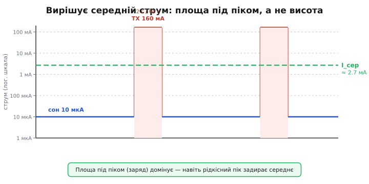
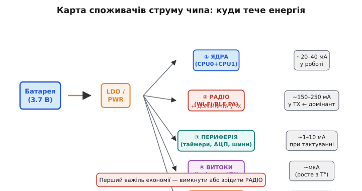
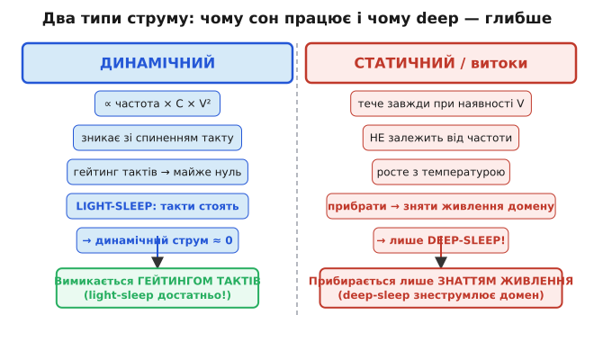
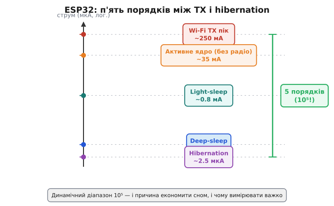
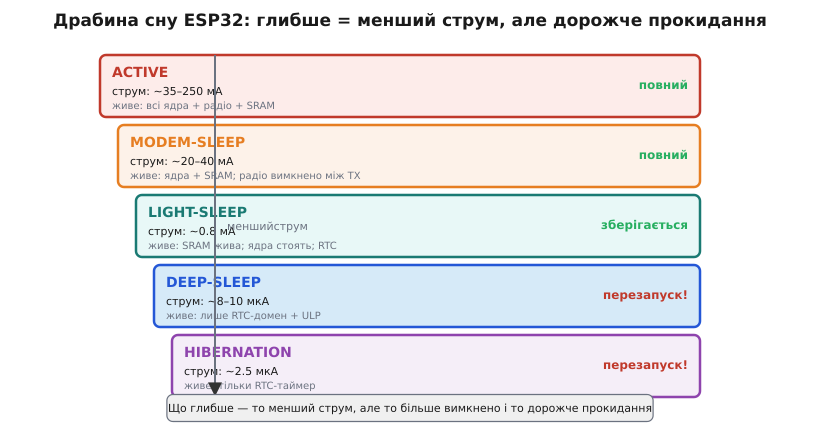
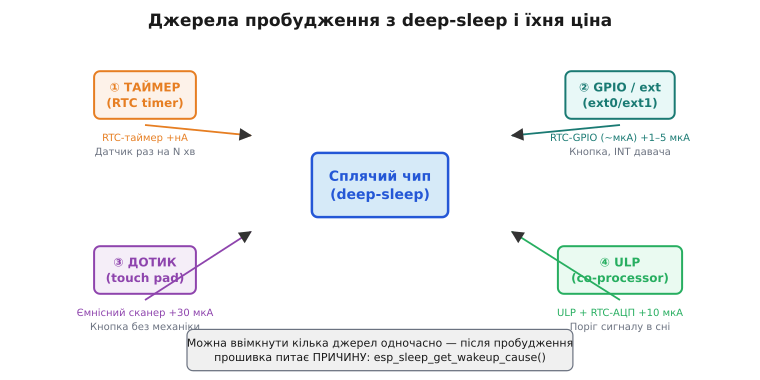
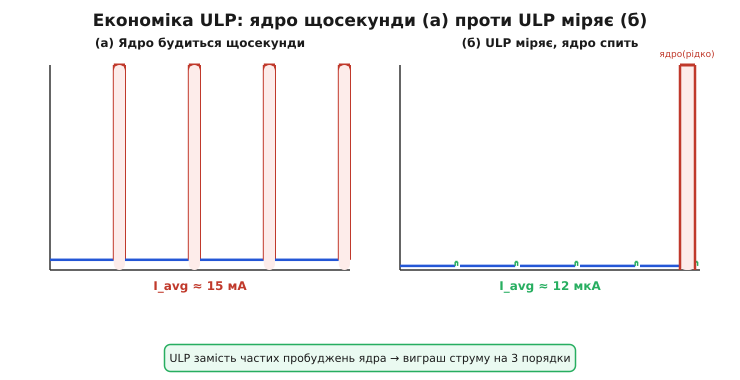
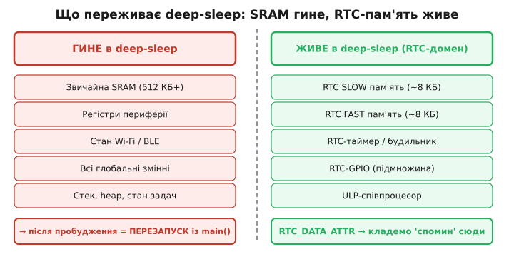
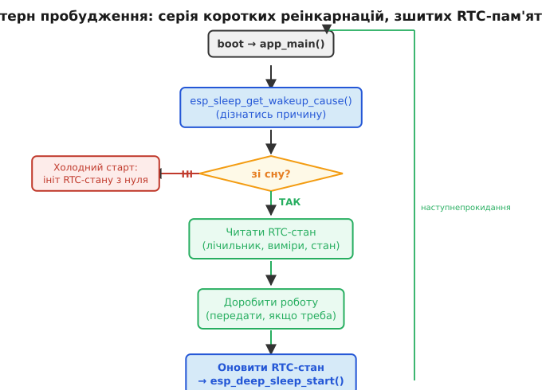

# Розділ 4.13 — Енергоощадність глибоко: жити роками від однієї батарейки

До цього моменту модуль 4 вчив мікроконтролер рахувати і відповідати на зовнішній світ: розділ 4.1 розкрив, як ядро тактується і виконує команди, 4.5 показав, що переривання дають реакцію без марнотратного опитування, 4.6.8 навчив вести час уві сні через RTC, а 4.3 — зберігати стан у Flash між перезапусками. Усі ці механізми складаються в пристрій, що вміє думати й запам'ятовувати. Але є питання, від якого залежить, чи проживе цей пристрій у полі: питання енергії. Давач вологості у лісовому ґрунті, лічильник електроенергії в замурованій ніші, нашийник на ведмедеві в заповіднику — у всіх цих місцях немає розетки. Є батарейка, і вона мусить протриматися не тиждень, а місяці або роки.

Саме тут виникає центральний парадокс розділу. ESP32 у момент Wi-Fi передачі споживає від 150 до 250 міліампер. Батарейка CR2032 — та сама кругла таблетка, що живить годинник на стіні — має ємність близько 220 мА·год. Ділимо: якби чип не спав ні хвилини, він помер би за годину з невеликим. Ціла карта можливостей — бездротовий зв'язок, точний вимір, цифрова логіка — перетворюється на пил без відповіді на одне питання: як провести 99.9% часу у стані майже нульового споживання і прокидатися лише на мить, щоб зробити потрібне. Звідси наскрізна нитка розділу: ми рахуємо не піковий струм, а **середній**, і саме він визначає час життя пристрою.

Межі розділу варто окреслити одразу. Тут ми займаємося мікроамперними сплячими пристроями: давачами, маячками, лічильниками — усім, що живе від первинного елемента місяці й роки. Силові системи, дрони, мотори, вибір хімії акумуляторів, сонячні панелі й зарядні контролери — це Розділ 7.4: суміжна, але окрема інженерна дисципліна. Тут ми спираємося лише на те, що вже пройшли: модулі 1–4 дають усі необхідні інструменти.

Маршрут розділу такий: спочатку бюджет батареї — формула часу життя і шокуючий підрахунок, який каже, що бюджет у мікроампери; потім карта споживання чипа, де видно, звідки цей струм береться; потім три режими сну ESP32 і джерела пробудження; потім ULP-співпроцесор як інструмент, що дає вимірювати, поки ядра сплять; потім кульмінація — арифметика циклу, що зводить усе до одного числа; і нарешті дві технічні пастки: мультиметр, який бреше на імпульсах, і плата, яка їсть більше за чип. Замикає все розповідь про те, як виглядає прошивка, що живе у вічному сні, зшиваючи пробудження ниткою RTC-пам'яті.

> 📜 Перед матеріалом — історія: [Кардіостимулятор і батарейка: роки життя від одного елемента](r13-history-pacemaker.md). Показує, чому «середній струм у мікроамперах» — питання життя і смерті, і як інженери навчилися розтягувати один елемент на роки.

---

## 4.13.1 Бюджет батареї: мА·год ÷ середній струм

Кожна батарея — резервуар заряду. Ємність вимірюють у міліампер-годинах: якщо щось споживає 1 мА і батарейка може живити його 100 годин, ємність — 100 мА·год. Чому не в кулонах, хоча 1 мА·год = 3.6 Кл? Суто практично: коли в знаменнику стоїть споживання в мА, ділиш ємність на нього і одразу отримуєш час у годинах без переведення одиниць. Уявіть резервуар із водою: ємність — об'єм, струм споживання — швидкість витоку внизу. Час, поки вода не скінчиться, — об'єм поділений на швидкість витоку. Проста аналогія, що працює щоразу, коли потрібно прикинути бюджет.

Звідси **головна формула розділу**:

```
t_життя [год] ≈ C [мА·год] / I_сер [мА]
```

> 🔧 **Навіщо це.** Бюджет рахують ДО проєктування, не після. Перше питання, яке ставить досвідчений інженер, — «скільки маю мА·год і скільки годин потрібно прожити» → отримує стелю середнього струму → і вже під цю стелю обирає режим сну та частоту прокидань. Пристрій, що «добре працює на столі», але у полі здихає за тиждень, — результат пропущеного бюджету.

Підкреслимо головне: у цій формулі вирішує **середній** струм, а не піковий. Це не очевидно з першого погляду, але саме на цьому тримається вся дисципліна розділу. Навіть якщо чип раз на хвилину на дві секунди виходить у радіо при 80 мА, а решту часу лежить у глибокому сні при 10 мкА — не обманюйтеся малим струмом сну. Ці дві секунди тягнуть середнє вгору набагато дужче, ніж 10 мкА.

Щоб відчути масштаб, зробімо обернену задачу. Типові ємності: CR2032 (кнопкова таблетка) — близько 220 мА·год, лужна АА — 2000–3000 мА·год, літій-іонний 18650 — 2500–3500 мА·год. Ціль часу — рік: 8760 годин. Ділимо 220 на 8760 і отримуємо **25 мкА**. Це і є стеля середнього струму, щоб прожити рік від CR2032. Двадцять п'ять мікроампер — у шість тисяч разів менше, ніж ESP32 при передачі. Це і є «шок» бюджету: не просто «треба спати», а треба тримати середнє в межах мікроампер, поки пікові потреби залишаються в міліамперах.


*Рис. 4.13.1.1. Час життя = ємність ÷ середній струм. Ліворуч — аналогія резервуару: ємність C [мА·год] — об'єм, I_сер — витік, час = об'єм ÷ витік. Праворуч — обернена задача: щоб CR2032 прожила рік (8760 год), середній струм не може перевищити ~25 мкА. Звідси мікроамперна дисципліна розділу.*

Ідеальна формула — лише відправна точка. Реальний час життя завжди менший через три поправки. **Саморозряд**: батарея повільно витрачає заряд сама, навіть без підключеного кола — це еквівалентний постійний внутрішній струм витоку. Для якісних літієвих елементів він становить близько 1–3% на рік, для лужних — більше. Якщо пристрій споживає 10 мкА, а батарея сама губить еквівалент 3–5 мкА, саморозряд стає відчутним доданком. **Температура**: на холоді хімічні реакції уповільнюються, внутрішній опір зростає, і доступна ємність помітно зменшується — литій-іонний акумулятор при -20°C може дати вдвічі менше, ніж при +20°C. **Недосяжний «хвіст»**: кожна схема має нижню напругу відсічки, нижче якої вона перестає правильно працювати — останні відсотки ємності батарея тримає, але при занадто низькій напрузі. Детальна математика цих поправок — у вставці [🧮 r13-s1-m-battery-math.md](r13-s1-m-battery-math.md).



*Рис. 4.13.1.2. Профіль струму пристрою в часі: довгий низький сон (синій) і рідкісні піки передачі (червоні). Пунктир — I_сер: він стоїть значно вище плато сну, бо площа під піками (заряд) домінує над площею під плато, навіть коли піки вузькі. Вирішує не висота і не тривалість окремо — вирішує добуток: заряд за цикл.*

**Worked-приклад. Скільки проживе давач від CR2032?**

```
Дано:   CR2032 = 220 мА·год
        сон:    I_sleep = 10 мкА
        активність: 1 раз на хвилину, тривалість 2 с, струм 80 мА

Крок 1. Частка активного часу (duty cycle):
        D = t_act / T = 2 с / 60 с = 0.0333

Крок 2. Середній струм:
        I_сер = I_sleep × (1 - D) + I_act × D
              = 0.010 мА × 0.9667 + 80 мА × 0.0333
              = 0.010 + 2.667 мА
              ≈ 2.677 мА

Крок 3. Час життя:
        t = 220 / 2.677 ≈ 82 год ≈ 3.4 доби
```

Три дні замість очікуваних місяців — і це при «рідкісному» прокиданні раз на хвилину. Причина: 80 мА × 2 с = 160 мА·с заряду щохвилини; 10 мкА × 58 с = лише 0.58 мА·с за весь сон. Радіо з'їло у 275 разів більше за сон, хоч і тривало у 29 разів менше. Це і є ключова теза: **домінує заряд активної фази, а не струм сну**. Решта розділу — про те, як цим зарядом керувати.

---

## 4.13.2 Куди тече струм: карта споживання чипа

Тепер, коли формула бюджету зрозуміла, постає наступне питання: звідки береться той самий «активний» струм і чи можна його зменшити? Доки не бачиш, куди тече струм, — не зменшиш його. Розкладемо повний струм чипа на складові.

Є п'ять головних споживачів. **Ядро або ядра** — обчислювальне серце чипа. На ESP32 їх два, Xtensa LX6, кожне до 240 МГц. Їхній струм — динамічний: він пропорційний тактовій частоті, ємності транзисторних перемикачів і квадрату напруги живлення. Зв'яжімо це з §4.1.4: менший такт → менший динамічний струм. Пристрій, що «думає» на 80 МГц замість 240, споживає ядром утричі менше. Але навіть на мінімальній частоті при активному ядрі це одиниці–десятки міліампер.

**Радіо (Wi-Fi / BLE)** — найбільший пожирач у момент передачі. Підсилювач потужності (PA, power amplifier) мусить гнати радіочастотний сигнал в антену з потужністю, достатньою для доставки пакета. При Wi-Fi передачі ESP32 споживає 150–250 мА залежно від модуляції і відстані — це два-три порядки більше, ніж сплячий чип. Навіть прийом і підтримка Wi-Fi з'єднання у фоні коштує десятки міліампер.

**Периферія** — таймери, АЦП, I²C-контролери, SPI, UART тощо. Кожен модуль, якому дають тактовий сигнал, споживає: перемикає регістри, перевіряє стани, генерує переривання. Вимкнути тактування конкретного модуля (clock gating) — один зі способів знизити споживання без повного сну.

**Витоки (leakage)** — статичний струм через запірні переходи транзисторів. Він невеликий при кімнатній температурі — одиниці мікроампер — але помітно зростає при нагріванні (у теплих промислових умовах може бути вдесятеро більшим). Витоки є завжди, навіть коли «нічого не роблять», і прибрати їх можна лише знявши живлення з домену.

**Стабілізатор живлення (LDO)** — у реальній схемі між батареєю і чипом стоїть лінійний стабілізатор, що підтримує стабільну напругу. Він сам споживає власний «струм спокою» (quiescent current, Iq) — і про це докладно в §4.13.8.



*Рис. 4.13.2.1. Карта п'яти споживачів струму. Стрілки від батареї через LDO до кожного домену із типовими частками. Радіо виділено як домінанту при передачі — саме там лежить найбільший важіль.*

Тепер розберімо принциповий поділ природи цих струмів — він ключовий для розуміння того, чому сон взагалі працює.

> 🔧 **Навіщо це.** Перш ніж «оптимізувати», виміряй розклад — інакше борешся з ядром (одиниці відсотків заряду), коли винне радіо (90%). Профіль струму в часі — карта, що каже, де копати.

**Динамічний струм** виникає від перемикання транзисторів: щоразу, коли транзистор перемикається між станами, він перезаряджає паразитні ємності. Потужність на це перемикання P = C·V²·f — пропорційна частоті та квадрату напруги. Якщо зупинити тактовий сигнал (clock gating), транзистори перестають перемикатися і динамічний струм падає майже до нуля. Саме це відбувається в режимах сну: light-sleep зупиняє такти більшості блоків — і динамічний струм зникає.



*Рис. 4.13.2.2. Два стовпці: динамічний струм (ліворуч) і статичний витік (праворуч). Гейтинг тактів ліквідує динамічний — це light-sleep. Для статичного потрібно зняти живлення з домену — це deep-sleep. Звідси ієрархія глибини сну.*

**Статичний струм / витоки** течуть незалежно від тактового сигналу: це просочування через запірні переходи при ненульовій напрузі. Він не зникає від зупинки тактів. Прибрати його можна лише фізично знявши живлення з домену — саме це і робить deep-sleep, знеструмлюючи більшість чипа і залишаючи живим тільки RTC-домен.

Порядки величин на ESP32 — найважливіше число, яке варто запам'ятати:



*Рис. 4.13.2.3. Логарифмічна шкала струму ESP32: від ~250 мА у Wi-Fi передачі до ~2.5 мкА у режимі hibernation. П'ять порядків (10⁵) — і причина, чому сон дає такий виграш, і причина, чому виміряти струм одним приладом важко (§4.13.7).*

Від Wi-Fi TX (~250 мА) до hibernation (~2.5 мкА) — п'ять порядків. Динамічний діапазон 10⁵. Це важливо в обох напрямках: сон дає колосальний виграш, але й вимірювати такий розкид одним приладом надзвичайно важко — до цього повернемося в §4.13.7.

З карти споживання одразу видно стратегію: більшість споживачів — динамічні. Зупинити такти або зняти живлення з домену — і струм падає на порядки. Як це реалізовано в ESP32 через режими сну — §4.13.3.

**Worked-приклад. Розклад струму за один цикл вимірювання.**

```
Фази одного циклу (рідкісний сенсор, T = 10 хв = 600 с):
  boot + ініт:     40 мА,  100 мс  → заряд = 40 × 0.1/3600  = 1.11 мкА·год
  вимір АЦП:       20 мА,   50 мс  → заряд = 20 × 0.05/3600 = 0.28 мкА·год
  Wi-Fi передача: 180 мА, 1500 мс  → заряд = 180 × 1.5/3600 = 75.0 мкА·год
  deep-sleep:     0.008 мА, ~598 с → заряд = 0.008 × 598/3600 = 1.33 мкА·год

Разом за цикл: 1.11 + 0.28 + 75.0 + 1.33 = 77.7 мкА·год
Частка радіо:  75.0 / 77.7 ≈ 96.5%

I_сер = 77.7 мкА·год / (600 с / 3600) год = 77.7 / 0.1667 ≈ 466 мкА
```

Радіо з'їдає 96.5% заряду активної частини. Оптимізувати треба передусім **передачу**: рідше, коротше, менша потужність — а не ядро чи режим сну (що дають 3.5%). Числа ведуть інженера до правильного важеля.

---

## 4.13.3 Режими сну ESP32: modem-sleep, light-sleep, deep-sleep

Карта споживання показала: більшість струму — динамічний, і більшість його — в радіо та ядрах. Сон — це систематичне вимкнення цих доданків. Чим більше вимикаєш, тим менший струм, але тим довше й «дорожче» прокидатися і тим більше стану губиш. Це наскрізний компроміс, що проходить крізь усі режими.

ESP32 має чотири рівні «глибини» сну — від активного стану до майже повного знеструмлення.



*Рис. 4.13.3.1. Драбина режимів сну: ACTIVE → MODEM-SLEEP → LIGHT-SLEEP → DEEP-SLEEP → HIBERNATION. Для кожного щабля: що залишається живим, орієнтовний струм, чи зберігається контекст після пробудження.*

**MODEM-SLEEP** — найлегший рівень: вимкнено лише радіо (між пакетами), ядра продовжують виконувати код на повній швидкості. Корисний для пристроїв «на розетці», де потрібен Wi-Fi, але не весь час. Чіп прокидає радіо лише на маяки точки доступу (DTIM, delivery traffic indication message) — це так зване beacon-based powersave. Економія помірна — десятки відсотків порівняно з повним активним режимом, але не порядки.

**LIGHT-SLEEP** — ядра зупинені (такти загейтовані), але вміст SRAM і стан периферії збережено. Прокидання відбувається за мікросекунди, і програма продовжується з того ж місця, де зупинилася — без перезапуску, без реініціалізації. Аналогія: «пауза» замість «вимкнення». Струм — близько 0.8 мА. Це ефективно зменшує динамічний струм ядер і периферії (їхні такти зупинені), але статичні витоки SRAM і RTC-домену тривають, бо живлення не знімається.

**DEEP-SLEEP** — знеструмлено майже все: ядра, SRAM, більшість периферії. Живим залишається лише RTC-домен: RTC-таймер, RTC-пам'ять (~16 КБ), RTC-GPIO і ULP-співпроцесор (§4.13.5). Струм — 5–10 мкА, у hibernation ще нижче — ~2.5 мкА (коли вимкнено навіть RTC-периферію, лишається тільки таймер). Аналогія: «вимкнути й завести наново, лишивши записку в RTC-пам'яті». Прокидання — це повний перезапуск із `app_main()`, що принципово відрізняє deep-sleep від light-sleep.


*Рис. 4.13.3.2. Порівняльна таблиця режимів: струм, що живе, час прокидання, характер старту. Ключова відмінність — light-sleep продовжує виконання з місця зупинки, deep-sleep щоразу перезапускає.*

> 🔧 **Навіщо це.** Правило великого пальця для вибору режиму: рідко й надовго засинаєш → deep-sleep; часто й коротко → light-sleep; треба тримати Wi-Fi «живим» між пакетами → modem-sleep. Хибний вибір легко з'їдає весь виграш від сну.

> ⚙️ Крайній випадок глибокого сну — ULP як єдиний живий процесор: [r13-s5-a-ulp-program.md](r13-s5-a-ulp-program.md). Навіть велике ядро не прокидається — ULP сам вирішує, коли будити.

Чому не завжди обирають найглибший режим? Deep-sleep скорочує струм сну до мкА, але кожне прокидання тягне за собою boot, реініціалізацію стеку, повторне підключення до Wi-Fi — це секунди при 120 мА. Якщо прокидатися часто, вартість boot-фази домінує. При частих прокиданнях (раз на секунду) light-sleep вигідніший, бо не платить за реініціалізацію щоразу. При рідких (раз на 10–30 хвилин) deep-sleep дає виграш у десятки разів. Поріг «коли що» рахується в §4.13.6.

**Worked-приклад. Light-sleep vs deep-sleep при різних частотах прокидань.**

```c
// ESP-IDF: налаштування джерел пробудження для deep-sleep
#include "esp_sleep.h"

void sleep_deep_with_timer(uint32_t sleep_seconds) {
    // Таймер пробудження: мікросекунди
    esp_sleep_enable_timer_wakeup((uint64_t)sleep_seconds * 1000000ULL);
    esp_deep_sleep_start();
    // Після цього рядка — перезапуск із main()
}

void sleep_light_with_timer(uint32_t sleep_seconds) {
    esp_sleep_enable_timer_wakeup((uint64_t)sleep_seconds * 1000000ULL);
    esp_light_sleep_start();
    // Виконання ПРОДОВЖУЄТЬСЯ звідси — без перезапуску
}
```

```
Сценарій А: прокидання раз на 1 с, активна фаза 50 мс при 30 мА.

Deep-sleep:
  boot-вартість за прокидання: 300 мс при 45 мА = 3.75 мА·с
  корисна робота: 50 мс при 30 мА = 1.5 мА·с
  сон: 650 мс при 0.008 мА = 0.005 мА·с
  Разом за 1 с: 5.255 мА·с → I_сер ≈ 5.3 мА

Light-sleep (без boot-вартості):
  активна фаза: 50 мс при 30 мА = 1.5 мА·с
  сон: 950 мс при 0.8 мА = 0.76 мА·с
  Разом: 2.26 мА·с → I_сер ≈ 2.3 мА

Light-sleep виграє вдвічі при частих прокиданнях!

Сценарій Б: прокидання раз на 10 хв (600 с), активна фаза 50 мс.

Deep-sleep:
  boot + робота: 350 мс при ~40 мА = 14 мА·с
  сон: 599.65 с при 0.008 мА = 4.8 мА·с
  Разом: 18.8 мА·с / 600 с → I_сер ≈ 0.031 мА

Light-sleep:
  активна фаза: 50 мс при 30 мА = 1.5 мА·с
  сон: 599.95 с при 0.8 мА = 480 мА·с
  Разом: 481.5 мА·с / 600 с → I_сер ≈ 0.80 мА

Deep-sleep виграє у 25 разів при рідких прокиданнях!
```

Глибина сну обирається **під частоту прокидань**, а не «що менше — те й бери».

---

## 4.13.4 Джерела пробудження: таймер, GPIO, дотик, ULP

Сон без пробудження — смерть. Пристрій мусить уміти прокинутися на подію — і кожне джерело пробудження має свою ціну в мікроамперах, бо щось мусить залишатися живим, щоб стежити за цією подією. Вибір джерела — це вибір, що тримати ввімкненим уві сні.

**Таймер (RTC timer)**: «розбуди через N секунд». Найдешевший і найпростіший варіант. Живим лишається лише RTC-таймер, що споживає одиниці наноампер — практично безкоштовно. Зв'язок із §4.6.8: той самий RTC-таймер, що веде час уві сні. Основа будь-якого давача з «рідкісним семплуванням» — прокидатися раз на хвилину, виміряти, заснути.

**GPIO / зовнішнє пробудження (ext0/ext1)**: «розбуди, коли ніжка змінить рівень». Для кнопки чи для INT-виходу зовнішнього давача, що сам сигналізує про подію (§4.5.1). ext0 стежить за однією ніжкою, ext1 — за маскою кількох (умова АБО або І). Ціна: тримати RTC-GPIO живим — кілька мікроампер.

**Дотик (touch pad)**: ємнісна площадка на ніжці ESP32 може будити чип, коли хтось торкнувся. Корисно для кнопок без механіки — кнопки ламаються, площадки — ні. Трохи дорожче: потрібне періодичне сканування ємності, тому струм вищий — близько 30 мкА.

**ULP (co-processor)**: крихітний процесор у RTC-домені сам прокидається за таймером, щось вимірює і вирішує, будити велике ядро чи ні. Найрозумніший і найгнучкіший, але й найскладніший у програмуванні. Детально — §4.13.5.



*Рис. 4.13.4.1. Карта чотирьох джерел пробудження навкруги сплячого чипа: таймер, GPIO/ext, touch, ULP — із підписом «що тримає живим» і доданим струмом у мкА. Критерій вибору: найдешевше джерело, що закриває задачу.*

Важлива практична деталь: у deep-sleep **тільки RTC-GPIO зберігає здатність будити**. Звичайні GPIO в deep-sleep мертві — логіка їхньої периферії знеструмлена. Це лише підмножина пінів ESP32, і прив'язана вона до конкретних номерів.


*Рис. 4.13.4.2. Ліворуч — RTC-GPIO (спроможні будити з deep-sleep), праворуч — звичайні GPIO (у deep-sleep мертві). Пастка при розведенні плати: якщо INT-вихід давача потрапить на не-RTC-пін, чип не прокинеться на подію.*

> 🔧 **Навіщо це.** Джерело пробудження — це те, що тримаєш увімкненим уві сні. Бери найдешевше, що закриває задачу: для рідкісного давача — таймер; для реакції на зовнішню подію — GPIO; будити ядро на кожен дрібний поріг — марно, краще ULP.

> 🔌 Зовнішні залізні будильники — [r13-s4-c-wake-hw.md](r13-s4-c-wake-hw.md): зовнішній RTC з alarm-виходом, load switch, кнопка-защіпка. Коли треба знеструмити ESP32 **повністю** і будити ззовні — це окремий клас схемних рішень.

Особливість deep-sleep: джерел пробудження можна ввімкнути кілька одночасно. Таймер і кнопка — і чип прокинеться від того, що настало раніше. Після пробудження прошивка питає причину через `esp_sleep_get_wakeup_cause()` — той самий патерн «чому я стартував», що ми бачили в §4.1.8 для reset.

**Worked-приклад. Пробудження від кнопки АБО таймеру.**

```c
#include "esp_sleep.h"
#include "driver/gpio.h"

#define WAKEUP_GPIO GPIO_NUM_36   // мусить бути RTC-здатним піном!
#define SLEEP_MINUTES 15

void app_main(void) {
    // Дізнатися причину пробудження
    esp_sleep_wakeup_cause_t cause = esp_sleep_get_wakeup_cause();
    switch (cause) {
        case ESP_SLEEP_WAKEUP_TIMER:
            handle_periodic_measurement();
            break;
        case ESP_SLEEP_WAKEUP_EXT0:
            handle_button_press();
            break;
        default:
            cold_start_init();  // перше ввімкнення
            break;
    }

    // Налаштувати ОБИДВА джерела пробудження
    esp_sleep_enable_timer_wakeup((uint64_t)SLEEP_MINUTES * 60 * 1000000ULL);
    esp_sleep_enable_ext0_wakeup(WAKEUP_GPIO, 0);  // рівень LOW будить

    esp_deep_sleep_start();
}
```

Два рядки налаштування — і пристрій реагує і на розклад, і на кнопку. Причину розрізняє при старті і обирає відповідну гілку коду.

---

## 4.13.5 ULP-співпроцесор: міряти, поки ядра сплять

§4.13.4 показав, що будити велике ядро на кожну подію — дорого: boot плюс реініціалізація коштують заряду. Ідея ULP (Ultra-Low-Power coprocessor) радикально проста: нехай у deep-sleep залишається живим **крихітний** процесор у RTC-домені, що сам прокидається за таймером, читає давач, порівнює з порогом — і будить «велике» ядро ЛИШЕ тоді, коли є що повідомити. Дев'яносто дев'ять відсотків вимірів він відсіює за наноджоулі.

ESP32 має два варіанти ULP-ядра. Класичний ESP32 містить ULP-FSM — примітивний автомат на мінімальному наборі інструкцій асемблера, достатньому для читання АЦП і GPIO та прийняття простих рішень. Новіші ESP32-S2/S3 отримали ULP-RISC-V — справжнє RISC-V ядро, яке програмують на підмножині C через ESP-IDF. Деталі конкретних програм — у вставці [⚙️ r13-s5-a-ulp-program.md](r13-s5-a-ulp-program.md); тут розберімо принцип і економіку.

Що ULP вміє і чого ні — межа важлива. Вміє: читати RTC-АЦП і RTC-GPIO, рахувати, порівнювати, записувати в RTC-пам'ять, будити велике ядро. **Не вміє**: Wi-Fi, складних обчислень, доступу до основної SRAM або Flash. Його сила — не потужність, а те, що він **не вимагає будити дорогі домени** для виконання частих простих перевірок.


*Рис. 4.13.5.1. Потокова діаграма: ULP за таймером прокидається → читає RTC-АЦП → у нормі? пише в RTC-пам'ять, засинає (велике ядро спить!); поріг перевищено? → будить ядро, що передає тривогу. Велике ядро активується лише на «так».*

Патерн «сторож порога» — найпоширеніший сценарій ULP. Уявіть термостат у глибокому сні: раз на секунду ULP зчитує термістор через RTC-АЦП, обчислює температуру, порівнює з межами [-10°C, +40°C]. Якщо в нормі — записує в RTC-пам'ять і йде назад у halt. Якщо поза межами — будить ядро, яке підключається до Wi-Fi і надсилає тривогу. Ядро прокидається раз на кілька годин, хоч вимірювань відбулося тисячі.

Економіка ULP переконлива числами:



*Рис. 4.13.5.2. Два профілі заряду в часі. (а) Ядро будиться щосекунди — рівномірні дорогі сплески. (б) ULP міряє щосекунди, ядро будиться раз на годину — плаский мікроамперний фон із рідкісним сплеском. Площі під кривими — заряд — відрізняються на порядки.*

```
Порівняння стратегій для «частий вимір, рідка реакція»:

Стратегія А: будити ядро щосекунди на 50 мс при 30 мА
  заряд за прокидання: 30 мА × 50 мс = 1.5 мА·с
  за годину (3600 прокидань): 3600 × 1.5 = 5400 мА·с = 1.5 мА·год
  I_сер ≈ 1.5 мА

Стратегія Б: ULP міряє щосекунди (~10 мкА × 5 мс + halt),
  ядро будиться раз на годину на 2 с при 120 мА:
  ULP за годину: 3600 × (0.01 мА × 5 мс) = 0.18 мА·с = 0.00005 мА·год
  Ядро 1 раз: 120 мА × 2 с = 240 мА·с = 0.067 мА·год
  I_сер ≈ 0.067 мА·год / 1 год ≈ 0.067 мА = 67 мкА

Виграш: 1.5 мА / 0.067 мА ≈ 22 рази!
```

> 🔧 **Навіщо це.** ULP вартий заходу, коли треба **часто дивитися** на повільний сигнал (температура, рівень, рух), але **рідко реагувати**. Якщо реагувати треба на кожен вимір — ULP не дасть виграшу, простіше будити ядро таймером.

RTC-пам'ять, в яку ULP пише проміжні результати, переживає deep-sleep і доступна ядру після пробудження. Це «склад» між снами — до нього повернемося в §4.13.9.

**Worked-приклад. Сторож температури на ULP-RISC-V.**

```c
// Це код, що виконується на ULP-RISC-V ядрі (ESP-IDF)
// Компілюється окремо і завантажується в RTC-пам'ять до запуску deep-sleep

#include "ulp_riscv.h"
#include "driver/rtc_io.h"

// Змінні в RTC-пам'яті — доступні і ULP, і великому ядру
uint32_t ulp_last_adc_value;
uint32_t ulp_alarm_count;

#define THRESHOLD_LOW  400   // ~15°C на 12-бітному АЦП при 3.3 В
#define THRESHOLD_HIGH 700   // ~35°C

void ulp_main(void) {
    while (1) {
        // Читаємо RTC-АЦП (канал термістора)
        uint32_t adc_val = adc1_get_raw(ADC1_CHANNEL_6);
        ulp_last_adc_value = adc_val;

        if (adc_val < THRESHOLD_LOW || adc_val > THRESHOLD_HIGH) {
            // Поріг перевищено — будимо велике ядро
            ulp_alarm_count++;
            ulp_riscv_wakeup_main_processor();
        }
        // У нормі — засинаємо знову; RTC-таймер розбудить через X мс
        ulp_riscv_halt();
    }
}
```

Велике ядро прокидається лише на тривогу. Двадцять три години п'ятдесят дев'ять хвилин з двадцяти чотирьох ULP веде спостереження самотужки, тримаючи середній струм у мкА — і реагує на аномалію за секунди.

---

## 4.13.6 Цикл «прокинувся → виміряв → передав → заснув»: середній струм

Попередні теми дали деталі: звідки береться струм (§4.13.2), як його знизити через сон (§4.13.3), хто будить і що робить ULP (§4.13.4–4.13.5). Тепер головна навичка інженера з енергоощадності: звести профіль струму в часі до одного числа — **середнього струму** — і від нього отримати час життя батареї. Це арифметика скважності (duty cycle).

Уявімо, як виглядає профіль струму типового IoT-давача в часі. Спочатку коротке пробудження і boot: чип стартує, ядра на повній швидкості, ємності заряджаються — сплеск до 40–80 мА протягом кількох сотень мілісекунд. Потім вимір: активний АЦП або шина даних, помірний струм 15–25 мА на десятки мілісекунд. Далі — Wi-Fi передача: найвищий пік 150–200 мА, що може тривати кілька секунд. І нарешті більша частина циклу — глибокий сон: 8–10 мкА на хвилини чи години. Намалюємо цей профіль.


*Рис. 4.13.6.1. Профіль струму в часі з підписаними фазами і заштрихованими площами (зарядами). Площа TX домінує попри короткість — бо висота × ширина найбільша. Пунктир — I_сер, що стоїть далеко вище плато сну.*

**Формула середнього струму:**

```
I_сер = Q_цикл / T_цикл = (Σ I_фази_k × t_фази_k) / T_цикл
```

Або простіше: середній струм — це **повний заряд за цикл, поділений на тривалість циклу**. Еквівалентно — зважене за часом середнє струмів фаз. Якщо інтуїтивніше: загальна площа під кривою струму в часі, поділена на весь відрізок часу.

Чому саме сон є таким важливим важелем? Якщо заряд активної частини фіксований (змінити його важко), єдиний спосіб знизити I_сер — **розтягнути T_цикл**: спати довше, прокидатися рідше. Подвоїв T — удвічі менший I_сер при тому ж заряді активної фази. Звідси проєктне питання: «а чи можна цей давач прокидати не раз на хвилину, а раз на п'ять?».

Є два важелі оптимізації, і в реальному проєктуванні треба балансувати обидва.


*Рис. 4.13.6.2. Графіки трьох сценаріїв: (а) базовий, (б) скорочена передача — нижчий пік, (в) рідші прокидання — довший сон. Обидва важелі знижують I_сер, але по-різному: (б) зменшує заряд за цикл, (в) збільшує T_цикл.*

**Перший важіль — зменшити заряд активної частини**: коротша Wi-Fi передача (батчинг кількох вимірів в одному пакеті), нижча тактова частота під час обчислень, ULP замість великого ядра для частих вимірів (§4.13.5), кешування Wi-Fi-сесії, щоб не перепідключатися щоразу.

**Другий важіль — збільшити T_цикл**: прокидатися рідше. Це компроміс зі свіжістю даних — якщо бізнес-логіка вимагає оновлення раз на хвилину, фізично не можна спати годину.

Є ще одна пастка, пов'язана саме з deep-sleep: **boot-вартість**. Щоразу після прокидання витрачається 100–500 мс на ініціалізацію, і якщо до того потрібне Wi-Fi підключення — ще 0.5–2 секунди при 120–150 мА. Цей заряд є завжди, незалежно від того, наскільки рідко прокидаєшся. При занадто частих прокиданнях boot-вартість домінує — тоді краще або light-sleep (§4.13.3), або батчити кілька вимірів на одну передачу.

> 🔧 **Навіщо це.** Цей розрахунок — **головний артефакт проєкту на батареї**. Перш ніж паяти, складаєш профіль фаз у табличку, рахуєш I_сер, ділиш ємність — і знаєш, місяць чи рік прослужить пристрій. Якщо мало — видно з таблиці, який важіль тягнути.

**Worked-приклад. Середній струм метеостанції — три сценарії.**

```
Дано фази (сценарій А: прокидання раз на 10 хв):
  deep-sleep:       0.008 мА   весь час між прокиданнями
  boot + Wi-Fi конект: 120 мА,  1.2 с
  вимір:             25 мА,   0.2 с
  TX:               180 мА,   0.3 с
  T_цикл = 600 с

Заряд активної частини:
  boot:  120 × 1.2  = 144 мА·с
  вимір:  25 × 0.2  =   5 мА·с
  TX:    180 × 0.3  =  54 мА·с
  Разом:             203 мА·с

Заряд сну: 0.008 мА × (600 - 1.7) с = 4.79 мА·с

Q_цикл = 207.8 мА·с
I_сер = 207.8 / 600 = 0.346 мА = 346 мкА

Час від AA 2000 мА·год:
  t = 2000 / 0.346 ≈ 5780 год ≈ 241 доба ≈ 8 місяців


Сценарій Б: прокидання раз на 30 хв (T = 1800 с):
  активна частина незмінна: 203 мА·с
  сон: 0.008 × 1798.3 = 14.4 мА·с
  Q = 217.4 мА·с
  I_сер = 217.4 / 1800 = 0.121 мА = 121 мкА
  t ≈ 2000 / 0.121 ≈ 16500 год ≈ 688 днів ≈ 23 місяці

  Виграш: 23 міс проти 8 міс — у 2.85 рази, прокидаємося втричі рідше.


Сценарій В: прокидання раз на 10 хв, але Wi-Fi конект 0.3 с (кешована сесія):
  boot+конект:  120 × 0.3  =  36 мА·с
  вимір:         25 × 0.2  =   5 мА·с
  TX:           180 × 0.3  =  54 мА·с
  Разом:                       95 мА·с
  + сон:                       4.8 мА·с
  Q = 99.8 мА·с
  I_сер = 99.8 / 600 = 0.166 мА
  t ≈ 2000 / 0.166 ≈ 12050 год ≈ 502 дні ≈ 16.7 місяців

Висновок: скорочення Wi-Fi конекту з 1.2 до 0.3 с дало більше, ніж
подвоєння інтервалу прокидань. Заряд boot-фази домінує — там і копати.
```

> 🧮 Уточнення з урахуванням саморозряду, температури і ефекту Пейкерта — у вставці [r13-s1-m-battery-math.md](r13-s1-m-battery-math.md).

---

## 4.13.7 Виміряти споживання чесно: мультиметр бреше на імпульсах

§4.13.6 дав розрахунковий середній струм. Тепер перевірка реальністю — і тут новачка чекає пастка, через яку проходить більшість. Розробник чіпляє звичайний мультиметр у розрив живлення, бачить на дисплеї «3 мА» і вірить. Реальне середнє — 90 мкА. Батарейка сідає за тиждень замість року. Де помилка?

Помилка в тому, що мультиметр **брехливо показує середнє** для імпульсного профілю. У пристрою, що описаний у §4.13.6, профіль струму — різкі рідкісні піки від 10 мкА до 180 мА. Три причини, чому мультиметр цьому не вірить.

**Перша: усереднення і повільність.** Звичайний цифровий мультиметр оновлює показання 2–5 разів на секунду і показує якесь усереднення за своє вікно вимірювання. Пік Wi-Fi передачі тривалістю 300 мс він або «розмазує» по великому вікну (і показує щось посередині між сном і піком), або взагалі пропускає між оновленнями. Показане число не є ні піком, ні чесним середнім — воно просто неточне.


*Рис. 4.13.7.1. Реальний профіль (синій і червоний) проти того, що «бачить» мультиметр (жовте вікно). Результат: ~3 мА замість реальних ~90 мкА середнього. Мультиметр вловлює хвіст піку TX, ігноруючи довгий сон.*

**Друга: динамічний діапазон.** Між сном (~10 мкА) і передачею (~180 мА) — чотири порядки. На діапазоні «мА» струм сну тоне в шумі приладу і власному Iq шунта, а результат завищений. На діапазоні «мкА» або «нА» — пік передачі вирве прилад за межі, або захист спрацює. Жоден один діапазон мультиметра не покриває чесно весь профіль. Це пряме продовження Рис. 4.13.2.3: 10⁵ динамічного діапазону одним приладом не взяти.

**Третя: burden voltage (падіння на шунті).** Мультиметр вимірює струм як спад напруги на своєму внутрішньому шунті (зазвичай 0.1–10 Ом). На піку 180 мА спад може становити 0.5–1.8 В — і це з'їдає з напруги живлення чипа. При живленні 3.3 В просадка на 0.5 В означає, що чип отримує 2.8 В замість 3.3 В. Якщо є brownout detector (§4.1.8), він скинує чип, спотворивши сам експеримент. Прилад змінює те, що вимірює.

**Як вимірювати правильно.** Перший і найнадійніший метод — **малий шунт + осцилограф або логер**. Малий шунт (0.1–1 Ом) у розрив живлення дає напругу V_шунт = I × R, яка пропорційна струму. Осцилограф із достатньою пам'яттю показує профіль I(t) у часі — видно кожну фазу, її висоту і тривалість. Потім інтегруємо: I_сер = площа під кривою / час. Малий шунт тримає burden voltage в допустимих межах (0.1 Ом × 180 мА = 18 мВ — прийнятно).


*Рис. 4.13.7.2. Схема правильного вимірювання: малий шунт у розрив живлення, осцилограф зчитує V_шунт(t), перетворює в I(t). Площа під профілем — це заряд, поділений на час = I_сер. Праворуч — попередження про burden voltage при великому шунті.*

Другий метод — **спеціалізований профілювальник струму** класу Nordic PPK2, Otii Arc, Joulescope. Ці прилади перемикають вимірювальний діапазон автоматично: нА сну і сотні мА передачі в одному часовому вікні, з підрахунком заряду і відображенням профілю. Саме такий інструмент дає те число, що збігається з розрахунком §4.13.6. Детально — у вставці [🔌 r13-s7-c-current-profiler.md](r13-s7-c-current-profiler.md).

Третій метод — **метод великого конденсатора**: зарядити відому ємність C до напруги V₀, живити від неї пристрій N секунд, виміряти нову напругу V₁. Тоді I_сер ≈ C × (V₀ - V₁) / N. Грубо — точність залежить від того, наскільки стабільна напруга за час вимірювання, — але не вимагає нічого, крім конденсатора і мультиметра. Корисно як «перша оцінка» без спецобладнання.

> 🔧 **Навіщо це.** «Виміряв мультиметром — здається норм» — найдорожча ілюзія в розробці на батареї, бо помилка вилазить лише в полі через тижні після відправлення. Єдина чесна метрика — площа під профілем струму. Хочеш гарантії часу життя — дивись профіль у часі, не середнє на дисплеї.

**Worked-приклад. Чому мультиметр показав 3 мА, а батарейка сіла за тиждень.**

```
Спостереження: мультиметр на діапазоні 20 мА показує 3 мА «середнього».
Розрахунок із §4.13.6 давав 90 мкА.
Розбіжність: у 33 рази.

Аналіз:
  — Мультиметр на діапазоні 20 мА має шум/Iq ~100 мкА, тому струм сну
    10 мкА тоне в шумі — фаза сну не видна взагалі.
  — Хвіст піку TX (180 мА, 300 мс) потрапляє у вікно вимірювання
    приладу і «заважує» середнє вгору.
  — Осцилограф через шунт 1 Ом показує реальний профіль:
      boot 120 мА × 100 мс = 12 мА·с
      TX   180 мА × 300 мс = 54 мА·с
      сон  0.010 мА × 599.6 с = 6 мА·с
      Q = 72 мА·с, T = 600 с → I_сер = 120 мкА

  — Але: на платі виявився LDO зі струмом спокою 1.5 мА — він тече
    весь час, навіть поки чип у deep-sleep. Додаємо:
      1.5 мА × 600 с = 900 мА·с
      Новий I_сер = (72 + 900) / 600 = 1.62 мА

  → Батарея АА 2000 мА·год: 2000 / 1.62 ≈ 1235 год ≈ 51 доба
    (мультиметр і «паразитний» LDO разом дали хибну картину)

Висновок: вір профілю й інтегралу. І шукай паразитів плати — §4.13.8.
```

---

## 4.13.8 Плата теж їсть: LDO, світлодіоди, підтяжки, давачі

§4.13.7 виявив: у спокої тече більше, ніж мав би чип сам. Винна — **плата навколо чипа**. Кожен її компонент потроху п'є струм, і вночі, коли чип спить у мікроамперах, ці «паразити» починають домінувати. Звідси гірка правда: зручна DevKit-плата для розробки майже ніколи не годиться для роботи від батареї.

**LDO-стабілізатор** — перший і найбільший підозрюваний. Лінійний стабілізатор має власний струм спокою Iq (quiescent current): він тече навіть коли чип нічого не споживає. Дешевий LDO може мати Iq = 1–5 мА. При чипі у deep-sleep з 8 мкА — LDO-паразит у сто разів більший. Спеціальні «low-Iq» LDO (Texas Instruments TLV702, Torex XC6220 тощо) мають Iq у одиниці мікроампер — різниця в тисячу разів. Вибір LDO часто є **найбільшим одиничним рішенням** у батарейному проєкті.

**Світлодіоди живлення і статусу** — «power LED» на DevKit горить завжди, споживаючи 1–5 мА залежно від резистора. Це у сто–п'ятсот разів більше, ніж сплячий чип. Перший пункт при переході від прототипу до батарейного виробу: викусити або не встановлювати power-LED.

**USB-UART міст**: чип-перетворювач (CP2102, CH340, FTDI) на DevKit живиться від тієї ж лінії 3.3 В і споживає кілька сотень мікроампер–кілька міліампер, навіть коли USB-кабель не підключений. У готовому виробі цього компонента немає — але на DevKit він є завжди. Деталі анатомії DevKit — у [🔌 ch20-s5-c-devkit.md](../ch20-s5-c-devkit.md).

**Підтяжки (pull-up/pull-down)**: кожен активний пін із підтяжкою через резистор тягне струм. Пін у стані HIGH і підтяжка 10 кОм до GND: I = 3.3 В / 10 кОм = 330 мкА. Десяток таких пінів — вже кілька мА. Зайві або занадто низькоомні підтяжки — часта пастка. Правило: у батарейному пристрої підтяжки або відключаються уві сні (через GPIO в режим Hi-Z), або обираються номінально 100 кОм і вище. Розрахунок оптимального номіналу — у [🧮 ch22-s4-m-pullup-value.md](../ch22-s4-m-pullup-value.md).

**Давачі й периферія в standby**: зовнішній давач температури, акселерометр, барометр — усі мають власний режим standby зі своїм струмом споживання. Якісний давач у standby тягне 100–500 нА; дешевий або неправильно налаштований — може тягнути мікроампери або навіть сотні мікроампер. Перед deep-sleep треба явно переводити кожен давач у найглибший power-down командою через шину. Деталі — у [🔌 r13-s2-c-sensor-standby.md](r13-s2-c-sensor-standby.md).


*Рис. 4.13.8.1. Стовпчики паразитного струму від кожного компонента DevKit у спокої. Чип (крайній праворуч) майже невидимий — 0.01 мА. Сума паразитів — 6+ мА: у 600 разів більше.*

> 🔧 **Навіщо це.** Перший крок батарейного проєкту — поглянути на плату і спитати «що тут НЕ спить?». Power-LED і щедрий LDO з'їдять усе перш, ніж чип устигне поекономити. Бюджет спокою плати рахують поряд із бюджетом чипа — інакше місяці перетворюються на дні.

**Стратегії усунення паразитів.** Прибрати або відключити power-LED. Обрати low-Iq LDO (Iq < 10 мкА) — детальніше в [🔌 r13-s8-c-ldo-vs-buck.md](r13-s8-c-ldo-vs-buck.md). Знеструмлювати цілі гілки плати через load switch або MOSFET на час сну — вся «зовнішня» периферія відключається від живлення, а будить чип зовнішній сигнал на RTC-GPIO (§4.13.4, [🔌 r13-s4-c-wake-hw.md](r13-s4-c-wake-hw.md)). Переводити кожен давач у power-down перед deep-sleep. Перевірити кожну підтяжку: чи дійсно потрібна, і чи не занадто низький номінал.

> 🔌 LDO проти buck-конвертора для батарейного пристрою — [r13-s8-c-ldo-vs-buck.md](r13-s8-c-ldo-vs-buck.md). Quiescent current вирішує при мікроамперному навантаженні.

**Worked-приклад. Бюджет спокою DevKit.**

```
Компоненти DevKit у режимі спокою ESP32 (deep-sleep):

  Power-LED  (з резистором 330 Ом від 3.3 В): ~4.0 мА
  LDO Iq     (типовий AMS1117):               ~1.2 мА
  USB-UART міст (CP2102 без USB-кабелю):      ~0.5 мА
  3× підтяжки 10 кОм (лінії в активному стані): ~0.33 мА
  ESP32 deep-sleep:                            ~0.010 мА

  Разом:                                       ~6.04 мА
  Частка чипа:  0.010 / 6.04 ≈ 0.2%

Час від CR2032 (220 мА·год): 220 / 6.04 ≈ 36 год ≈ 1.5 доби

━━━━━━━━━━━━━━━━━━━━━━━━━━━━━━━━━━━━━━━━━━━━━━━
Після оптимізації:
  Power-LED:   прибрано                        → 0 мА
  LDO Iq:      замінено на low-Iq (TLV70233)  → 0.005 мА
  USB-UART:    немає в готовому виробі         → 0 мА
  Підтяжки:    замінено на 100 кОм             → 0.033 мА
  Давач:       standby після налаштування      → 0.0005 мА
  ESP32:                                       → 0.010 мА

  Разом:                                       ~0.048 мА = 48 мкА

Час від CR2032: 220 / 0.048 ≈ 4583 год ≈ 191 доба ≈ 6.3 місяця

Виграш: 4583 / 36 ≈ 127 разів — лише від плати, без зміни прошивки!
```


*Рис. 4.13.8.2. Стовпчиковий бюджет до (ліворуч) і після оптимізації (праворуч). Основний виграш — power-LED та LDO. Після оптимізації чип стає помітним внеском, а не нанометровою смужкою на дні.*

---

## 4.13.9 Життя після deep-sleep: RTC-пам'ять і відновлення контексту

§4.13.3 кинув тезу, що deep-sleep — це перезапуск, і ми не одразу розкрили всіх її наслідків. Тепер розберімо докладно: вийти з deep-sleep — це **НЕ «прокинутися й продовжити»**. Це стартувати заново з `app_main()`, із чистою SRAM, порожнім стеком, нульовими глобальними змінними. Усе, що було в пам'яті під час активної фази, — зникло. Саме це змінює те, як пишеться прошивка сплячого пристрою.

Зв'язок із §4.1.8: прокидання з deep-sleep — одна з причин скидання (reset), яку прошивка розрізняє при старті. Код запускається заново, але через `esp_sleep_get_wakeup_cause()` або `esp_reset_reason()` дізнається: «я стартував не від холодного увімкнення, а зі сну». Це відкриває дві дороги в `app_main()`: свіжий старт — і відновлення після сну.

Що ж **переживає** deep-sleep, а що ні?



*Рис. 4.13.9.1. Карта пам'яті уві сні. Ліворуч — що гине (SRAM, регістри, Wi-Fi, глобальні змінні). Праворуч — що живе (RTC SLOW/FAST пам'ять, RTC-таймер, RTC-GPIO, ULP). Єдина ниточка між снами — RTC-пам'ять.*

**Гине**: звичайна SRAM (~520 КБ), регістри периферії, стан Wi-Fi і BLE, усі глобальні та локальні змінні, стек задач RTOS, структури heap.

**Живе**: RTC SLOW пам'ять (~8 КБ) і RTC FAST пам'ять (~8 КБ) — обидві перебувають у RTC-домені, що залишається під живленням. Також живуть RTC-таймер, підмножина RTC-GPIO і ULP.

**RTC-пам'ять як ниточка пам'яті крізь сон.** В ESP-IDF атрибут `RTC_DATA_ATTR` розміщує змінну в RTC-пам'яті. Ця змінна переживе deep-sleep і дасть наступному запуску «спомин»: лічильник прокидань, накопичені виміри від ULP (§4.13.5), стан кінцевого автомата, час останньої передачі, кешовані параметри Wi-Fi підключення. Це прямий аналог Flash-сховища (§4.3), але значно швидший і дешевший в енергії — для того, що потрібно тримати лише між двома снами, а не вічно. Важлива межа: RTC-пам'ять зникає при **повному знеструмленні** (виймеш батарею), Flash — ні. Тому критичні конфігурації — у Flash; тимчасові накопичені дані між снами — у RTC.

**Патерн пробудження** — той самий для будь-якого сплячого пристрою:



*Рис. 4.13.9.2. Блок-схема старту після сну: boot → дізнатись причину → зі сну? прочитати RTC-стан, доробити, оновити, заснути знову; холодний старт? ініціалізувати RTC з нуля. Замкнуте кільце реінкарнацій, зшитих RTC-пам'яттю.*

Думати про прошивку сплячого пристрою потрібно не як про «цикл, що триває», а як про **серію коротких реінкарнацій**, кожна з яких починається з нуля і отримує «спадщину» від попередньої через RTC-пам'ять.

Зв'язок із §4.13.6: оскільки кожне прокидання коштує заряду (boot-вартість), відновлення має бути **якомога швидшим**. Що можна взяти з RTC-пам'яті замість перечитування з Flash або переузгодження через мережу — те не платить ціну реініціалізації. Кешування Wi-Fi SSID/ключа в RTC-пам'яті (разом із PMK), IP-адреси, часу останньої синхронізації NTP — дає змогу скоротити boot-фазу вдвічі-вчетверо і відповідно знизити I_сер.

> 🔧 **Навіщо це.** Писати прошивку сплячого пристрою — означає думати не «цикл триває», а «я щоразу народжуюся заново й маю лише записку в RTC-пам'яті». Усе, що дорого відновлювати (мережа, калібрування, накопичені дані), тримай у RTC-пам'яті — і кожне прокидання буде коротким, отже дешевим.

**Worked-приклад. Лічильник прокидань і батчинг через RTC-пам'ять.**

```c
#include "esp_sleep.h"
#include "nvs_flash.h"
#include <string.h>

// Ці змінні живуть у RTC SLOW пам'яті — переживають deep-sleep
RTC_DATA_ATTR int   boot_count = 0;
RTC_DATA_ATTR float samples[6];
RTC_DATA_ATTR int   sample_idx = 0;

#define BATCH_SIZE 6
#define SLEEP_PERIOD_US (10ULL * 60 * 1000000)  // 10 хвилин

// Зчитати поточний вимір (умовно: ADC або I2C давач)
static float read_sensor(void) {
    // ... реальне зчитування ...
    return 22.5f;  // приклад
}

// Передати батч із 6 вимірів по Wi-Fi (умовно)
static void send_batch(float *data, int count) {
    // ... підключення Wi-Fi, MQTT/HTTP, відключення ...
}

void app_main(void) {
    boot_count++;

    esp_sleep_wakeup_cause_t cause = esp_sleep_get_wakeup_cause();

    if (cause == ESP_SLEEP_WAKEUP_UNDEFINED) {
        // Перший холодний старт — ініціалізація
        sample_idx = 0;
        memset(samples, 0, sizeof(samples));
    }

    // Зчитати вимір і накопичити в RTC-пам'яті
    samples[sample_idx % BATCH_SIZE] = read_sensor();
    sample_idx++;

    // Кожне 6-те прокидання — передати накопичене
    if (sample_idx % BATCH_SIZE == 0) {
        send_batch(samples, BATCH_SIZE);  // дорога Wi-Fi фаза — раз на 60 хв
    }

    // Повернутися у deep-sleep — RTC-пам'ять збережена
    esp_sleep_enable_timer_wakeup(SLEEP_PERIOD_US);
    esp_deep_sleep_start();
}
```

Радіо (найдорожча фаза) вмикається вшестеро рідше — передаємо пачкою. Заряд Wi-Fi-фази тепер амортизується на 6 вимірів, а не 1. З розрахунку §4.13.6 (сценарій В): якщо кожна передача коштує 95 мА·с, то при батчингу × 6 — лише ~16 мА·с на вимір замість 95 мА·с. I_сер зменшується майже пропорційно.

```
Без батчингу:  I_сер ≈ 346 мкА (з worked-example §4.13.6, сценарій А)
З батчингом:   95 мА·с / 6 + 6 мА·с сну = ~22 мА·с на цикл
               I_сер = 22 / 600 ≈ 37 мкА
               Виграш: 346 / 37 ≈ 9.3 рази!
```

Прошивка тієї самої складності, а час роботи від АА 2000 мА·год виріс з 8 місяців до 6+ років — завдяки одному патерну: зберігай у RTC-пам'яті, передавай рідше.

---

Уся енергоощадність, якщо узагальнити, зводиться до єдиного принципу: тримати чип у глибокому сні якомога довше, прокидатися якомога рідше й коротше, зшиваючи ці пробудження ниткою RTC-пам'яті. Бюджет батареї дав стелю мікроампер (§4.13.1). Карта споживання показала, що радіо — домінант (§4.13.2). Режими сну дали інструмент знизити фонові мікроампери (§4.13.3). Джерела пробудження навчили чіпляти будильники майже безкоштовно (§4.13.4). ULP відсіює більшість вимірів, не будячи ядро (§4.13.5). Арифметика циклу перетворила всю цю якісну розмову на одне практичне число (§4.13.6). Чесний вимір підтвердив або спростував розрахунок (§4.13.7). Аналіз плати виявив «невидимих» паразитів (§4.13.8). А патерн RTC-пам'яті зшив усе в робочу прошивку (§4.13.9).

> ▶️ Далі: [Розділ 4.14 — Налагодження глибоко: JTAG/SWD, GDB і посмертний аналіз](../r14-debug-deep/r14-debug-deep.md)
