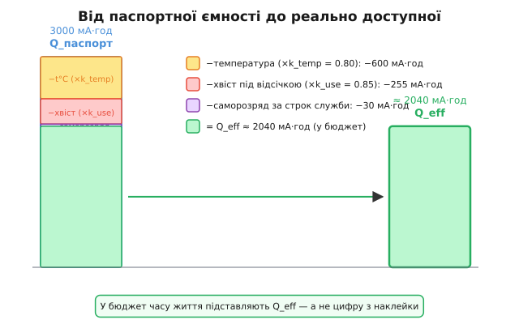
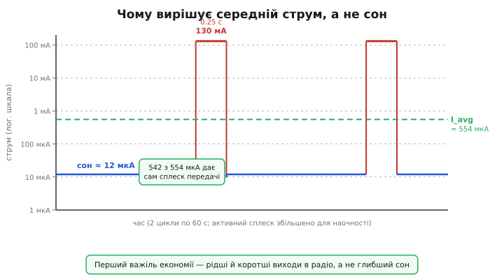

# 🧮 Математика батареї: чесний час життя сплячого пристрою

> Числова вставка до теми [§4.13.1 «Бюджет батареї: мА·год ÷ середній струм»](r13-low-power.md). Там увели базову формулу часу життя — ємність поділити на середній струм. Тут доводимо її до чесного числа: чому паспортні мА·год — це стеля, а не правда, і як три поправки (саморозряд, температура, недосяжний «хвіст» ємності) та правильно злічений середній струм перетворюють оптимістичні «10 років» на реальні «14 місяців».

---

Формула з §4.13.1 виглядає невинно: `час = ємність ÷ середній струм`. Але варто підставити в неї конкретні числа — і результат викликає підозру. Батарея CR123A з паспортними 3000 мА·год, мікроконтролер у режимі глибокого сну 12 мкА: ділимо — отримуємо 250 000 годин, це майже 28 років. Будь-який досвідчений інженер одразу скаже, що так не буває. Але чому?

Відповідь проста і трохи невтішна: у формулі брешуть обидва числа. Чисельник — паспортна ємність — це стеля, якої батарея ніколи не досягне в реальних умовах. Знаменник — середній струм — занижений, якщо порахувати лише сон і «забути» про короткі, але потужні сплески активності. Виправити обидві помилки — і число стане правдою: не фантастичні роки, а місяці, на які справді можна закладатись у технічному завданні. Це не песимізм — це інженерна чесність. Краще закласти запас і приємно здивувати замовника, ніж пообіцяти 10 років і отримати рекламацію через рік.

---

## Підрозділ 1 — Чому паспортні мА·год — це стеля

Ємність (capacity, Q) вимірюють у мА·год — це заряд, що батарея здатна віддати в стандартних умовах. За §1.2.1, q = I·t: ампери помножити на години — вийде кількість заряду. Зв'язок із енергією та роль напруги — у §1.3.5; тут ми навмисно залишаємось у мА·год, бо напруга комірки за розряду майже стала і переходити у ват-години для нашого розрахунку не потрібно.

Перший злодій, що краде з цього паспортного числа, — саморозряд (self-discharge). Батарея витрачає заряд навіть тоді, коли нічого не живить: всередині комірки постійно тривають хімічні реакції, незалежно від того, чи підключений зовнішній ланцюг. Це можна уявити як внутрішній струм витоку I_sd, що повільно й невпинно спустошує резервуар заряду. Порядки величин: літій-іонні комірки (Li-ion) втрачають кілька відсотків на місяць, лужні — десь посередині, а літій-тіонілхлоридні (LiSOCl₂) — одні з найкращих у класі, близько 1% на рік.

Для потужного пристрою саморозряд — дрібниця: якщо споживання сотні міліампер, кілька мкА витоку непомітні. Але для мікроамперного сплячого давача це принциповий перелом. Якщо пристрій тягне 12 мкА, а батарея сама втрачає еквівалент 15 мкА — більшу частину ємності з'їдає не пристрій, а власна хімія комірки. Саме тут лежить важлива межа: нижче певного струму споживання подальше зниження майже нічого не дає, бо впираєшся в саморозряд і строк зберігання (shelf life) батареї.

В арифметиці саморозряд додається в знаменник як паралельний споживач: `I_sd ≈ Q · (частка/місяць) / 730 год`. Для LiSOCl₂ 3000 мА·год з витоком 1%/рік це ≈ 3.4 мкА — невеликий доданок, але він присутній увесь час, навіть поки пристрій спить.

---

## Підрозділ 2 — Недосяжний хвіст і температура

Саморозряд поглинав заряд згори, поки пристрій лежав на полиці. Але є ще одна причина, чому не весь заряд узагалі доступний для роботи.

Кожна схема має напругу відсічки (cutoff): стабілізатор або мікроконтролер перестає коректно працювати, коли напруга живлення падає нижче певного порога. Останні 10–30% ємності формально «є» в комірці, але вони лежать «під підлогою» робочого діапазону напруги. Вилучити їх не вийде — пристрій уже вимкнеться раніше. Врахуємо це через коефіцієнт використання k_use (usable fraction), типово 0.70–0.90 залежно від хімії і схеми живлення. Детальніша картина кривої розряду та вплив внутрішнього опору — у §7.4.5; тут лише посилання.

Другий ефект — температура (temperature). На холоді хімічні реакції уповільнюються, внутрішній опір зростає, і доступна ємність помітно падає. Польовий давач, що проходив тести у теплій лабораторії при +20 °C, узимку в полі може отримати від тієї самої батареї вдвічі менше. Коефіцієнт k_temp типово 0.50–0.90 залежно від хімії та температури; LiSOCl₂ тримається на морозі краще за більшість.

Зводимо всі поправки в одну формулу ефективної ємності:

```
Q_eff = Q_паспорт · k_use · k_temp − (втрати на саморозряд за весь строк)
```

> 🔧 **Навіщо це.** Проєктувальник автономного давача закладає в розрахунок часу життя саме Q_eff, а не цифру з наклейки. Якщо цього не зробити, «розрахунковий» рік у теплій лабораторії перетворюється на квартал у зимовому полі — і пристрій замовкає раніше строку. Q_eff — це чесна ставка, на яку можна обіцяти.



*Рис. 4.13.1m.1. Від паспортної ємності до реально доступної. Зліва — повний стовпчик Q_паспорт (3000 мА·год). Послідовні відрахування: температурна поправка (×k_temp = 0.80), недосяжний хвіст під напругою відсічки (×k_use = 0.85), саморозряд за строк служби. Праворуч — підсумковий стовпчик Q_eff ≈ 2040 мА·год. У бюджет часу життя підставляють саме Q_eff — а не цифру з наклейки.*

---

## Підрозділ 3 — Знаменник: середній струм і скважність

Із чисельником розібрались: паспортні мА·год стискуються до Q_eff через три поправки. Тепер — чесний знаменник.

Нагадаємо з §4.13.1: вирішує СЕРЕДНІЙ струм, а не піковий — саме тому ємність ділять на середнє. Але як правильно порахувати це середнє для пристрою, що живе у двох станах?

Більшість автономних сенсорів або маячків мають типовий двостановий цикл (детально режими сну — §4.13.3): глибокий сон зі струмом I_sleep (одиниці–десятки мкА; deep-sleep ESP32 ≈ 10 мкА) і короткий спалах активності зі струмом I_act (десятки–сотні мА: увімкнулось радіо, запрацювало ядро) тривалістю t_act раз на кожен період T. Скважність (duty cycle) D = t_act / T. Середній струм за часом:

```
I_avg = (I_sleep·(T − t_act) + I_act·t_act) / T
      = I_sleep + (I_act − I_sleep)·D
```

Тут прихована інтуїція, яку легко пропустити. Одна-єдина передача по радіо на 150 мА тривалістю 0.25 с раз на хвилину «розмазується» по всьому циклу і дає ~0.6 мА середнього — це у 50 разів більше, ніж 12 мкА сну. Висновок §4.13.1 стає очевидним: у бюджеті домінують не години сну, а рідкісні сплески помножені на свою тривалість. Повний цикл «прокинувся → виміряв → передав → заснув» з детальним розбором скважності — у §4.13.6.

До I_avg потрібно також додати I_sd — саморозряд як постійний паралельний споживач. Повний знаменник: `I_avg + I_sd`.



*Рис. 4.13.1m.2. Чому вирішує середній струм, а не сон. Вісь струму — логарифмічна (мкА…сотні мА): довге плато сну (≈12 мкА) і вузькі піки активності (≈130 мА на 0.25 с раз на 60 с). Пунктир — середній струм I_avg ≈ 554 мкА: він лежить набагато вище плато сну, бо площа під вузькими піками (заряд передачі) домінує. 542 з 554 мкА дає сама передача — перший важіль економії не глибший сон, а рідші й коротші сплески радіо.*

---

## Worked example

**Приклад (польовий давач: маячок раз на хвилину від CR-елемента 3000 мА·год).**

```
Дано:  Q = 3000 мА·год      I_sleep = 12 мкА
       I_act = 130 мА        t_act = 0.25 с (вимір + радіо)
       T = 60 с              k_use = 0.85   k_temp = 0.8 (холодна частина року)
       саморозряд = 1 %/рік (LiSOCl₂-клас)

Середній струм споживача:
  D     = 0.25 / 60          = 0.00417
  I_avg = 12 мкА + (130 мА − 12 мкА)·0.00417
        = 12 мкА + 542 мкА    ≈ 554 мкА

Еквівалент саморозряду:
  I_sd  = 3000 мА·год · 0.01/рік / 8766 год ≈ 3.4 мкА  (мізерний тут)

Ефективна ємність:
  Q_eff = 3000 · 0.85 · 0.8   = 2040 мА·год

Чесний час життя:
  t     = Q_eff / (I_avg + I_sd)
        = 2040 / (0.554 + 0.0034) мА·год / мА
        ≈ 3659 год ≈ 152 доби ≈ 5 місяців
```

«Наївний» розрахунок (3000 ÷ 0.012 мА) дав би близько 250 000 годин — у 68 разів оптимістичніше. Ємнісні поправки відняли ще трохи, але ключовий «вбивця» точності — сплеск передачі: 542 з 554 мкА середнього дає саме він, а не сон. Звідси прямий висновок для оптимізації: перший важіль — рідше й коротше виходити в радіо, а не заглиблюватись у сон на зайвий десяток мкА.

```c
#include <stdint.h>

// Усе в цілих: струми — мкА, час — секунди, ємність — мкА·год.
// Середній струм (мкА) для дводстанового циклу сон/активність.
static inline uint32_t avg_current_ua(uint32_t i_sleep_ua, uint32_t i_act_ua,
                                      uint32_t t_act_ms, uint32_t period_ms) {
    // I_avg = I_sleep + (I_act - I_sleep) * t_act / T
    uint64_t extra = (uint64_t)(i_act_ua - i_sleep_ua) * t_act_ms / period_ms;
    return i_sleep_ua + (uint32_t)extra;
}

// Прогноз життя в годинах від ЕФЕКТИВНОЇ ємності (мкА·год) і повного струму.
static inline uint32_t life_hours(uint32_t q_eff_uah, uint32_t i_total_ua) {
    return i_total_ua ? q_eff_uah / i_total_ua : 0;
}

// Приклад використання:
//   uint32_t iavg = avg_current_ua(12, 130000, 250, 60000);   // ≈ 554 мкА
//   uint32_t qeff = (uint32_t)(3000ull * 1000 * 85 * 80 / 10000); // мкА·год
//   uint32_t h    = life_hours(qeff, iavg + 3);  // + саморозряд ≈ 3 мкА → ≈ 3650 год
```

Цілі мкА та мкА·год обрано навмисно: на мікроконтролері без FPU так рахують прогноз без плаваючої коми. Пастка переповнення в проміжному множенні знята через `uint64_t` — `130000 · 250` не влізе в 32 біти.

---

## Де в курсі це працює

Ця арифметика — фундамент усього Розділу 4.13. Карта споживання (§4.13.2) дає реальні числа для I_sleep і I_act. Режими сну (§4.13.3) і джерела пробудження (§4.13.4) визначають, наскільки малим може бути I_sleep і наскільки рідкісним — сплеск. Повний цикл wake і його скважність деталізує §4.13.6. Чесний ВИМІР цих струмів — бо звичайний мультиметр бреше на коротких імпульсах — §4.13.7.

Дві формули на пам'ять:

```
Q_eff = Q · k_use · k_temp − втрати_саморозряду
t     = Q_eff / (I_avg + I_sd),   I_avg = I_sleep + (I_act − I_sleep)·D
```

Для мікроамперних пристроїв виграш тут вирішують саморозряд батареї і скважність активних сплесків. Для силових систем — дронів, моторів, потужних приводів — у грі натомість питома енергія, маса акумулятора і просадка під навантаженням: це окрема математика §7.4, до якої ця вставка не заходить.
