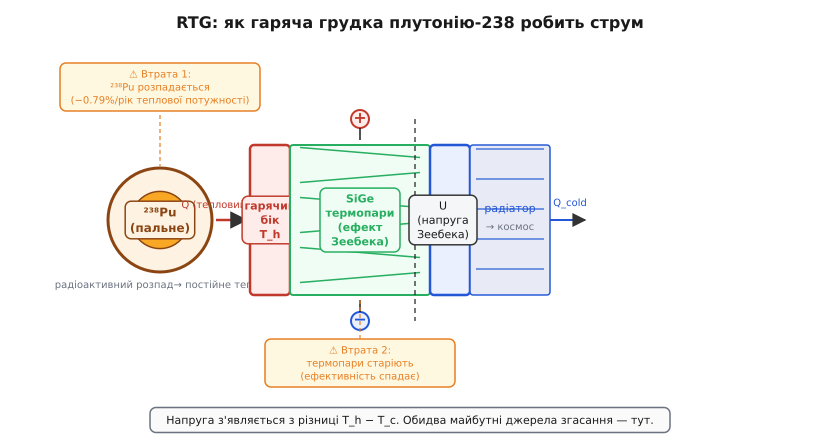
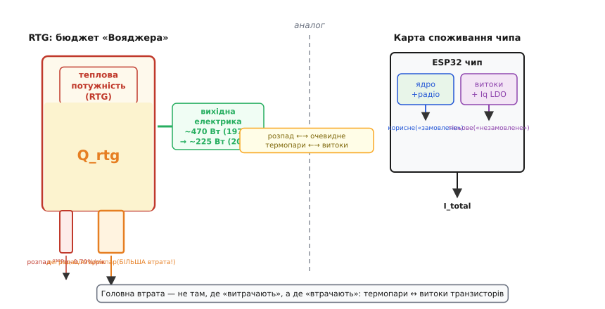
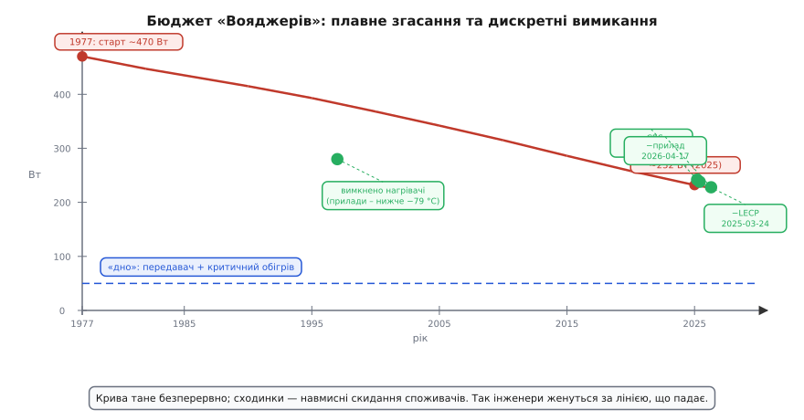

# 📜 «Вояджери»: бюджет ват, який скорочується пів століття

> Історична вставка до **теми [§4.13.2 «Куди тече струм»](r13-low-power.md)**.
> Карта споживання — не суха бухгалтерія; на двох апаратах за межами Сонячної системи
> від неї пів століття залежить, чи долетить іще хоч один біт до Землі.

Апарати 1977 року досі говорять із нами з міжзоряного простору. Єдине, що поволі їх убиває, — це арифметика ват.

---

## Лампочка, що світить із міжзоряного простору

«Вояджер-1» (Voyager 1) — найдальший рукотворний об'єкт у Всесвіті. Станом на 2026 рік він перебуває на відстані приблизно 25 світлогодин від Землі — понад 27 мільярдів кілометрів. Уявіть: сигнал, що летить зі швидкістю світла, добирається до нього понад добу. Відповідь повертається ще стільки ж. Щоб отримати відповідь на запит, надісланий сьогодні о полудні, оператори місії чекатимуть до завтрашнього вечора.

І все ж відповідь приходить. Мережа DSN (Deep Space Network, «мережа далекого космосу») — гігантські параболічні антени діаметром до 70 метрів у Каліфорнії, Мадриді й Канберрі — ловить сигнал, потужність якого на прийомному кінці менша за 10⁻¹⁶ ват. Це в трильйон разів слабше від звичної кімнатної лампочки. Але те, що передавач досі посилає в космос хоч щось, — уже диво саме по собі. Потужність цього передавача — лічені вати. Слабша за лампочку у вашому холодильнику. З міжзоряного простору.

Цей факт не просто вражає. Він ставить дуже конкретне запитання: звідки на борту апарата, запущеного майже п'ятдесят років тому, досі береться електрика? І скільки її лишилось? На Землі будь-яка батарея давно б сіла — і не одна. Але «Вояджери» живуть. Понад те, вони й досі науково активні, хоч і в щораз скромнішому обсязі.

Відповідь — не в хімічних батареях і не в сонячних панелях. І саме ця відповідь відкриває нам ключовий інженерний урок: уся місія — це п'ятдесят років керування бюджетом, який невпинно тане. Інструмент — та сама карта споживання, яку ми щойно будували в §4.13.2, лише з горизонтом у десятиліття і без права на перезарядку.

Важливо розуміти: мова йде про *два* апарати. «Вояджер-2» (Voyager 2), запущений трохи раніше за «Вояджер-1» у серпні 1977 року, рухається в іншому напрямку і досі також функціонує — він єдиний апарат, що пролетів повз усі чотири планети-гіганти й продовжує шляхом у міжзоряний простір. Обидва мають однакові RTG-генератори, однакову архітектуру й однакову проблему: бюджет, що тає. Тому все, про що піде мова далі, стосується обох.

Перш ніж рахувати ватти й споживачів, треба зрозуміти, звідки в далекому космосі береться електрика — адже Сонце там лише яскрава точка серед зірок, нічим не відмінна від сотні інших.

---

## Чому не сонячні панелі: ядерна батарейка на термопарах

На орбіті Юпітера інтенсивність сонячного світла вже впала до 4% від земної. Далі — Сатурн (близько 1%), Уран, Нептун, і за ними — практично повна темрява. Сонячна панель, що поблизу Землі витягує 1–2 кіловати на квадратний метр, на орбіті Нептуна дала б менше 15 ватів із того самого метра — за умов чистого неба, яких там немає. Для зовнішньої Сонячної системи фотоелектрика просто не варіант.

Потрібне джерело, що не залежить від відстані до Сонця взагалі. Таке джерело є — радіоактивний ізотоп. Деякі ізотопи розпадаються самостійно, виділяючи тепло — не від горіння, не від хімічної реакції, а від самої природи нестабільного ядра. Правильно підібраний ізотоп робить це повільно, рівно й передбачувано роками й десятиліттями.

Для «Вояджерів» обрали плутоній-238 (²³⁸Pu, plutonium-238). Він має дивовижну для інженерних цілей рівновагу: не надто радіоактивний (тобто не «прогорає» за роки), але достатньо активний, щоб виробляти реальне тепло. Переважний тип розпаду — альфа-розпад: ядро ²³⁸Pu випускає альфа-частинку (ядро гелію), яка гальмується у матеріалі грудки й перетворює кінетичну енергію на тепло. Гамма-випромінювання при цьому дуже мале, тому радіаційний захист апарата не додає великої маси, а самі RTG можна винести на кронштейн далеко від чутливої апаратури. Грудка ²³⁸Pu просто гаряча від природи — без палива, без насосів, без турбін, без жодного рухомого елемента. Їй не потрібна атмосфера, не страшний вакуум і радіаційний пояс Юпітера. Вона просто гріє — рік за роком, десятиліття за десятиліттям.

Але саме тепло ще не струм. Щоб перетворити теплову потужність на електричну, навколо гарячої грудки встановлюють термопари (thermocouple). Принцип — ефект Зеебека (Seebeck effect, відкритий Томасом Йоганном Зеебеком у 1821 році): якщо два різні провідники з'єднати і підтримувати різні температури на їхніх спаях, між точками з'єднання виникає різниця потенціалів — електрорушійна сила. Жодної хімії, жодного руху — лише температурний градієнт. На «Вояджерах» роль термопарного матеріалу грає сплав кремній-германій (silicon-germanium, SiGe): гарячий бік (T_h) прилягає безпосередньо до грудки ²³⁸Pu, холодний бік (T_c) — радіатор, охолоджуваний у космос. Різниця T_h − T_c народжує напругу, а навантаження (прилади й передавач) тягне струм.



*Рис. 4.13.2i.1. Як RTG робить струм — і де ховаються майбутні втрати.*

Такий пристрій називається RTG — radioisotope thermoelectric generator, радіоізотопний термоелектричний генератор. На кожному з «Вояджерів» встановлено три генератори типу MHW-RTG (Multi-Hundred-Watt RTG). Разом на старті 1977 року вони давали приблизно 470 Вт електричної потужності — близько 157 Вт з кожного. Це *весь* бюджет місії: і на вимірювальні прилади, і на бортовий комп'ютер, і на передавач, і — важлива стаття, до якої ми ще повернемось — на обігрів. У відкритому космосі температура навколишнього середовища близька до абсолютного нуля; без підігріву електроніка й паливні магістралі системи орієнтації просто замерзнуть.

> 🔧 **Навіщо це.** RTG — гранична ілюстрація теми §4.13.2: джерело фіксоване й непоповнюване, тож єдиний спосіб подовжити місію — знати кожного споживача поіменно і вимикати зайвих. Та сама логіка, що в батарейному пристрої з §4.13.1: ємність (чи початкова потужність RTG) ÷ середнє споживання. Лише без права на помилку й без зарядки.

Якби грудка ²³⁸Pu давала стале незмінне тепло, а термопари не змінювались із роками, — апарат міг би жити вічно. Але є дві причини, чому ватів щороку меншає. І друга з них виявилась підступнішою за першу.

---

## Дві текучі діри: розпад пального і втома термопар

Перша діра — очевидна й передбачена від самого початку. Плутоній-238 розпадається. Кожне ядро, що розпадається, дає тепловий імпульс і вивільняє альфа-частинку. Але поступово ядер ²³⁸Pu у грудці стає менше, і теплова потужність спадає. Період напіврозпаду (half-life) ²³⁸Pu — 87.7 року. Це означає: за 88 років тепла лишиться рівно вдвічі менше. Переводимо у річний темп:

```
período напіврозпаду ²³⁸Pu:   T½ = 87.7 року
річна частка, що лишається:  0.5^(1/87.7) ≈ 0.99213
річна втрата теплової потужності ≈ 1 − 0.99213 ≈ 0.79 %/рік
```

Менше відсотка на рік — здається, нічого. Але пам'ятай: це втрата *теплової* потужності. Вона перекладається на електричну не один до одного — через коефіцієнт корисної дії (КПД) термоелектричного перетворення, який для SiGe-термопар становить лише близько 6–7%. Тобто навіть за незмінної теплової потужності кожен відсоток деградації КПД дає пропорційне падіння електричної потужності. І ось тут з'являється друга діра.

Друга діра — підступна. Термопари з кремній-германію, що перетворюють тепло на напругу, з роками деградують. Спаї матеріалу поступово змінюють кристалічну структуру внаслідок дифузії атомів і термічних напружень. Той самий перепад T_h − T_c, що на початку місії породжував певну напругу, через десятиліття породжує меншу — бо ефективність перетворення впала. Жодний фізичний закон не забороняє цього процесу, і від початку місії інженери JPL (Jet Propulsion Laboratory) розуміли, що деградація відбуватиметься. Але ступінь її виявився більшим, ніж очікувалось.

Ось що важливо: ця друга втрата — деградація термопар — виявилась *більшою* за пряму втрату від розпаду пального. Тобто значна частина ватів «тікала» не там, де очікували, — у паливі, — а у самому перетворювачі. Хтось, хто враховував лише перший бік — «пальне розпадається зі швидкістю 0.79%/рік» — отримував надто оптимістичний прогноз. Реальний темп спаду був швидшим.

Зверніть на це пряму увагу, бо тут — серцевинний зв'язок із темою §4.13.2. Карта споживання чипа завжди має два боки. Перший — «корисні» споживачі, яких ти свідомо ввімкнув: ядро, радіо, сенсори, актуатори. Другий — те, що п'є струм без твого замовлення: витоки транзисторів крізь тонкий оксид затвора (leakage current), струм спокою стабілізатора (quiescent current, Iq) навіть коли навантаження нуль. Новачок рахує лише перший бік — і дивується, чому батарея сіла раніше прогнозу. «Вояджери» — космічний доказ того, що другий бік буває вагомішим за перший: розпад пального відповідає «очевидному» споживанню; деградація термопар відповідає «витокам», яких не видно, поки не склав чесну карту обох боків.



*Рис. 4.13.2i.2. Дві діри в бюджеті — і їхній прямий аналог на карті споживання чипа.*

Разом обидві діри знімали близько 4 Вт електричної потужності щороку з кожного апарата. Не різкий обрив — тихий, невпинний витік. Рахуємо «на серветці», щоб число «~половина у 2025» не падало з неба:

**Груба оцінка: скільки ватів лишилось у 2025**
```
старт (1977):              P₀ ≈ 470 Вт (електр., обидва RTG × 3 × 2 апарати)
середня швидкість спаду:   ≈ 4 Вт/рік (паливо + деградація термопар разом)
від 1977 до 2025:          Δt = 48 років
груба лінійна оцінка:      470 − 4·48 = 470 − 192 ≈ 278 Вт
(з нелінійністю деградації) ≈ 225…250 Вт (реальніша оцінка JPL)
```

Навіть груба арифметика показує: за піввіку бюджет упав приблизно вдвічі. Кожен наступний ват треба вивільняти — вимикаючи когось зі списку споживачів. Але від кого відмовитись? Як вибирати? Саме цим інженери місії «Вояджер» і займаються вже п'ятдесят років.

> 🔧 **Навіщо це.** Будуючи карту споживання чипа в §4.13.2, завжди питай не лише «що я ввімкнув?», а й «що тече повз — у витоки й у стабілізатор?». На «Вояджерах» саме невидимий бік (деградація термопар) визначив реальний темп згасання, а оптимістичний прогноз, що спирався лише на розпад пального, виявлявся завищеним. На твоїй платі аналог цієї помилки — розрахунок автономії, який враховує лише корисне навантаження, ігноруючи Iq LDO і витоки.

---

## Пів століття вимикань: як звужують карту споживачів

Коли джерело фіксоване й тане, єдиний важіль залишається незмінним: зменшувати споживання. Але не безладно — а системно, рухаючись зверху карти вниз, від найдорожчих і найменш критичних статей до «ядра», яке вимикати не можна. Це буквально той алгоритм, що ми описали в §4.13.2: відсортувати споживачів за добутком «ват × потрібність зараз», усунути тих, без кого ще можна жити, і зберегти мінімально функційний пристрій.

Перша велика стаття — **обігрів**. У далекому космосі, де температура довкілля опустилась нижче −200 °C, чимало ватів із бюджету «Вояджерів» ішло суто на те, щоб нагрівачі тримали вузли в допустимому діапазоні. Паливні магістралі системи орієнтації, активні прилади, вузли, що містять мастила та герметики, — все це потребувало підігріву. Це «невидима» стаття карти, аналог струму спокою LDO або витоків транзисторів: не виконує жодної «корисної» функції з погляду науки, але без неї апарат просто перестає існувати.

Коли бюджет почав давити, інженери JPL зважились на сміливий крок — почали вимикати нагрівачі. Прилади стали отримувати менше тепла й охолоджувались нижче проєктного діапазону. Очікувалось, що деякі почнуть відмовляти. Але сталось дивне: вони продовжили працювати. Ультрафіолетовий спектрометр «Вояджера-1», розрахований на мінімальну робочу температуру −35 °C, справно працював за −79 °C. Прилади «Вояджера-2» витримали −59 °C. Жоден із цих режимів не перевірявся наземними тестами — апарат сам довів, що межа виявилась ширшою, ніж у технічному завданні. Урок прямо в дусі §4.13.2: реальний бюджет завжди має «приховані» статті, і найбільший виграш часом саме там, а не в «головних» функційних блоках.

Друга стаття — самі **наукові прилади**. Їх на борту обох «Вояджерів» спочатку було по десятку: магнетометри, детектори космічних променів, прилади для вимірювання плазми, ультрафіолетові спектрометри, фотополяриметри, детектори заряджених частинок. Кожен мав свій апетит у ватах. У міру того як бюджет звужувався, їх гасили по одному — і кожне вимикання траплялось лише після ретельного зважування: що дасть більше — ще кілька років даних від цього приладу, чи роки роботи всіх решти?

Ці рішення конкретні й датовані. 25 лютого 2025 року на «Вояджері-1» вимкнено Cosmic Ray Subsystem (CRS) — детектор космічних променів, що понад 47 років реєстрував потоки частинок у міжзоряному просторі. 24 березня 2025 вимкнено Low-Energy Charged Particle (LECP) на «Вояджері-2» — детектор низькоенергетичних заряджених частинок. 17 квітня 2026 вимкнено ще один прилад на «Вояджері-1». Станом на середину 2026 року на кожному апараті залишаються лише одиниці діючих наукових інструментів. Кожен із них досі шле дані — бо хтось за нього «заплатив» вимиканням свого сусіда по карті.

Ця практика — дзеркальне відображення того, що ми в §4.13.6 робимо зі скважністю й режимами сну: зменшуємо середній струм, рідше прокидаючись або скорочуючи активну фазу. Там горизонт — години й дні; тут — десятиліття. Але математика та сама: середнє споживання × час = витрачений заряд (чи ватти-години). Прибрати споживача — це зменшити множник ліворуч, подовживши тим самим ресурс фіксованого запасу. Те, що JPL робить з «Вояджерами» глобально і на багаторічних горизонтах, розробник вбудованої системи робить локально й щогодини: «що ще тут не спить — і чи треба йому не спати?»

Є одне, що вимкнути неможливо за жодних умов. **Передавач.** Варто зупинити його — і місія закінчена миттєво: зв'язок обірветься назавжди, і жодна команда «увімкнися знову» вже не дійде. Сигнал із Землі до «Вояджера-1» летить понад добу — тобто навіть теоретично «вимкнути і ввімкнути» неможливо у реальному часі. Другий незнижуваний рядок — гідразинові двигуни системи орієнтації, що тримають антену точно спрямованою на Землю. Без орієнтації передавач марний: він пошле сигнал, але не туди. А отже, мінімум обігріву гідразинових магістралей теж обов'язковий — за надто низької температури паливо застигне. Це «ядро+радіо» системи «Вояджер», незнижуваний поверх карти. Паралель з §4.13.2 пряма: на будь-якій карті споживання є недоторканне дно — набір функцій, без яких пристрій перестає бути собою. Для смарт-замка це може бути Bluetooth і RTC; для «Вояджера» — передавач, орієнтація й тепло для гідразину.



*Рис. 4.13.2i.3. Плавне згасання джерела проти дискретних вимикань: інженери женуться за лінією, що падає.*

> 🔧 **Навіщо це.** Практика «Вояджерів» — це алгоритм роботи з картою споживання у часі: відсортуй споживачів за критерієм «ват × важливість зараз», усунь найдорожчих і найменш критичних першими, лиши недоторканним лише ядро й зв'язок. Той самий порядок дій в оптимізації батарейного пристрою подовжує автономність від тижнів до місяців — навіть не змінюючи апаратну частину.

---

## Той самий рахунок — від зонда до твоєї плати

«Вояджери» й твій ESP32 розв'язують одне рівняння: фіксований (або поповнюваний, але обмежений) запас енергії проти суми всіх споживачів — запрошених і тіньових. Різниця лише в масштабі ватів і в тому, що зонду нікуди вставити нову батарею — і в часових константах: на платі ти помічаєш помилку в бюджеті за дні або тижні, коли батарея сідає раніше прогнозу; на «Вояджерах» та сама помилка виявляється за роки, але вже нічого не виправити — апарат за три мільярди кілометрів. Звідси — однакова дисципліна на обох кінцях масштабу. Спершу *склади повну карту*: хто п'є, зокрема витоки й стабілізатор — те, чого не замовляв. Потім ріж зайве і лишай лише те, без чого пристрій перестає бути собою.

Найдорожча помилка в енергобюджеті — рахувати лише «корисних» споживачів. На «Вояджерах» долю місії визначив тіньовий бік: деградація термопар, непередбачені ватти на обігрів, поступовий знос кожного перетворювача. На твоїй платі ту саму роль грають струм спокою LDO, витоки транзисторів крізь оксидний шар і недооцінений мікрострум, що тягне «вимкнений» датчик через підтяжку на шині. Тому тема й зветься «*куди* тече струм»: поки не побачив кожного струмопровідного шляху — твій бюджет неповний, а прогноз автономності неправдивий.

Десь у міжзоряному мороці лампочка-передавач світить рівно стільки, скільки дозволяє чесно складений бюджет ватів. Кожен її біт, що долинає до великих антен на Землі після 25-годинної подорожі, — це свідоцтво того, що хтось п'ятдесят років тому і кожного дня після цього вів ту карту чесно.

---

*Для арифметики самого батарейного бюджету — §4.13.1 і математична вставка до неї; для режимів сну і скважності, якими зменшують середнє споживання чипа, — далі в цьому розділі.*
