# Розділ 4.14 — Налагодження глибоко: JTAG/SWD, GDB і посмертний аналіз

У §4.2.8 ми вперше назвали інструменти налагодження — Serial, JTAG/SWD — на рівні «що існує». Відтоді ми пройшли довгий шлях: навчились записувати прошивку (§4.2), ловити збої логами (§4.2.8), розуміти причини скидання (§4.1.8), відчувати природу переривань (§4.5) і жити з RTOS (§4.10). Кожна з цих тем давала нові засоби реагування на проблеми. Але всі вони мали одне спільне: ми спостерігали за системою, поки вона рухалась. Тепер — наступний щабель, і він принципово інший.

Serial.print — це запитати у бігуна «де ти?» прямо на ходу. Він кидає відповідь через плече, не зупиняючись, і вона містить лише те, про що ти здогадався запитати. Відлагоджувач — це натиснути «пауза» на цілому всесвіті. Ядро завмирає між двома інструкціями, програма не рухається, і ти можеш неспішно оглядати все завмерле: читати будь-який регістр, будь-яку комірку пам'яті, весь стек викликів — без жодного додаткового рядка у прошивці. Це принципово різні сили, і саме про другу йтиметься в цьому розділі.

Наша нитка розгортатиметься від «навіщо» до «як» і від живого до мертвого. Спочатку — чому друк не всесильний і що саме дає відлагоджувач (§4.14.1). Потім — як зонд фізично «бачить» ядро крізь кілька дротів (§4.14.2) і як змусити ядро зупинитись у потрібній точці (§4.14.3). Далі — хто керує всім цим на боці хоста (§4.14.4) і що робити, опинившись усередині завмерлого всесвіту (§4.14.5). Завершуємо двома темами, де відлагоджувач показує найбільше: читання збою, що стався прямо зараз (§4.14.6), і розслідування смерті, якої ніхто не бачив (§4.14.7).

> 📜 Перед матеріалом — [Межовий скан і JTAG](r14-history-jtag.md): звідки взялась магія «заглянути в чип без доступу до ніжок».

Одразу позначимо межу з сусідніми розділами. Тут — інструмент і механіка налагодження: як зупинити, як подивитись, як прочитати збій. Питання «що робити після збою» — як безпечно перезавантажитись, як зберегти стан, як реалізувати стратегію відновлення — це Розділ 4.15. Туди ми повернемось наприкінці.

---

## 4.14.1 Де друк безсилий: навіщо відлагоджувач, коли є Serial

Serial.print — чудовий інструмент, і ми користуємося ним щодня. Він простий, не потребує жодного обладнання крім кабелю і дає безперервний потік подій у реальному часі. Для більшості завдань — відстеження стану, трасування потоку виконання, перевірки значень на різних етапах — він бездоганний. Перш ніж говорити про обмеження, слід чесно віддати йому належне.

Але Serial.print має одне фундаментальне обмеження, що випливає з самої його природи: він **змінює час**. Кожен виклик `printf` тягне за собою форматування рядка, заповнення буфера UART і — залежно від налаштувань — або очікування передачі, або обробку переривання UART. На ESP32 при 115200 бод один символ передається за ~87 мкс; рядок із 40 символів — понад 3 мс. Для алгоритму, що виконується за 500 мкс, або для гонок між задачами з часовими вікнами у кілька мікросекунд — це катастрофічна зміна. Баг, що відтворюється без друку, зникає, щойно додаєш `Serial.print`, — і навпаки. Цей клас помилок отримав власну назву: **heisenbug**, від принципу невизначеності Гайзенберга. Саме тому в §4.5.3 ми попереджали, що друкувати всередині ISR небезпечно: ти не просто «спостерігаєш» за обробником, а втручаєшся в нього.

Є ще глибша проблема. Друк показує лише те, що ти **заздалегідь вирішив** надрукувати. Ти ставиш `Serial.print` у місцях, де підозрюєш проблему. Але збій стається там, де ти не підозрюєш, — там, де немає жодного друку. Ця сліпа пляма — не технічна вада і не лінь розробника, а структурне обмеження самого підходу. Не можна надрукувати те, про що не здогадався.

Відлагоджувач вирішує обидві проблеми одразу. Його ключова операція — **halt**: ядро завмирає між двома машинними командами. Програма не рухається, таймери зупинені, жодних нових даних не надходить. У цьому стані можна прочитати будь-який регістр (PC, SP, LR і всі загальні), будь-яку комірку оперативної чи Flash-пам'яті, весь стек викликів — і жодна частина коду прошивки при цьому не виконується. Порівняймо: друк — розпитувати бігуна на ходу; відлагоджувач — натиснути «пауза» на цілому всесвіті й ходити між завмерлими.

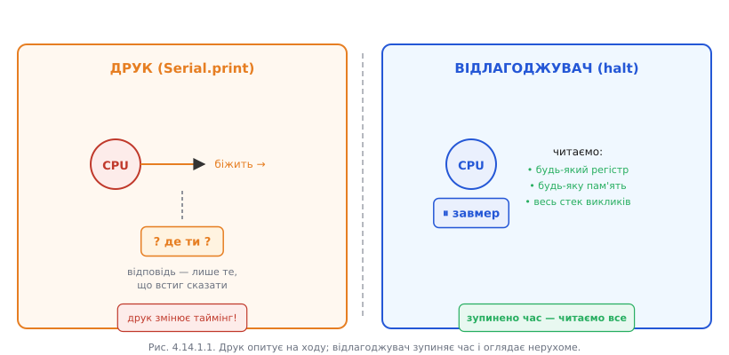

*Рис. 4.14.1.1. Друк опитує живе на ходу; відлагоджувач зупиняє час і оглядає нерухоме.*

З цього базового принципу випливають три **суперсили**, недоступні для друку. Перша — зупинитись у точній точці коду: **брейкпоінт** (детально в §4.14.3). Ти кажеш «зупинись, коли виконання дійде до функції `process_packet`» — і ядро зупиняється там, незалежно від того, наскільки далеко ця функція від будь-якого друку. Друга сила — зупинитись на **доступі до даних**: вотчпоінт. «Зупинись, коли хтось запише у змінну `g_sensor_val`» — ядро зупиняється і показує, який саме рядок коду це зробив. Це пряма відповідь на запитання «хто псує мою змінну?», яке ніякою кількістю рядків `Serial.print` не розв'язати. Третя сила — крок по одній команді, що дає змогу спостерігати виконання покроково, перевіряючи стан між кожними двома інструкціями.

До цих трьох додається четверта: **посмертний знімок**. Якщо ядро впало в обробник збою, воно саме зберігає знімок свого стану на стеку. Відлагоджувач або спеціальний обробник може прочитати цей знімок і відновити повну картину — де саме стався збій, які були значення регістрів. Про це — у §4.14.6 і §4.14.7.

**Worked-приклад. Баг, який зникає від друку.**

Розглянемо типовий heisenbug: спільна змінна між ISR і головним циклом — без `volatile`.

```c
// Без volatile — компілятор кешує значення в регістрі
uint32_t g_counter = 0;

void IRAM_ATTR timer_isr(void *arg) {
    g_counter++;                     // ISR збільшує лічильник
}

void app_main(void) {
    esp_timer_start_periodic(timer, 100);  // ISR кожні 100 мкс

    while (1) {
        if (g_counter >= 1000) {
            do_something();
            g_counter = 0;
        }
        // Варіант A (без друку): компілятор може закешувати g_counter
        // у регістрі — цикл ніколи не бачить оновлень ISR → deadlock
    }
}
```

Додаєш `Serial.printf("cnt=%lu\n", g_counter)` у цикл — баг зникає. Чому? Друк змушує компілятор перечитати `g_counter` з пам'яті (функція `printf` непрозора для оптимізатора), і гонка зникає. Прибираєш друк — повертається. Зв'язок із §4.5.5: саме для цього існує `volatile`.

З відлагоджувачем ситуація інша. Ти ставиш брейкпоінт у `do_something()`, чекаєш — брейк не спрацьовує ніколи. Тоді виконуєш `halt` вручну в довільний момент, `info registers` → бачиш, що `g_counter` у регістрі CPU стоїть на 0 від початку і жодного разу не читається з пам'яті. Компілятор «оптимізував» змінну з пам'яті до регістра. Причина — відсутність `volatile`. Жодного рядка друку не потрібно.

> 🔧 **Навіщо це:** у польовому пристрої без екрана й UART відлагоджувач — єдиний спосіб побачити, що насправді в пам'яті о третій ночі. Друк туди не достукається.

Але відлагоджувач — не срібна куля. Є ситуації, де друк кращий: системи реального часу, де ядро не можна зупиняти (двигун крутиться, радіо в ефірі, петля керування з жорстким часовим обмеженням). Halt розриває таймінги і може вивести систему зі стабільного стану. У такому разі — лише асинхронний друк або апаратний трасувальник (ITM/ETM, але це за межами курсу). Обидва інструменти існують поруч і доповнюють одне одного.


*Рис. 4.14.1.2. Інструменти доповнюють одне одного — відлагоджувач не заміна друку, а інша сила.*

---

## 4.14.2 SWD і JTAG зсередини: лінії, скан-ланцюг і як зонд «бачить» ядро

Ми щойно сказали, що відлагоджувач «зупиняє час», читає регістри й передає команди ядру. Але як фізично дріт ззовні дотягується до нутрощів кремнію? Відповідь закладена в сам чип ще на етапі виробництва: у кожному сучасному мікроконтролері є спеціальний **відлагоджувальний порт** — апаратний блок, що постійно увімкнений і слухає окремий протокол на кількох виводах.

### JTAG: чотири дроти і скан-ланцюг

JTAG (IEEE 1149.1, «Joint Test Action Group») народився наприкінці 1980-х як інструмент тестування паяних з'єднань — «межовий скан» (boundary scan), про який детально розповідає супровідна [📜 Межовий скан і JTAG](r14-history-jtag.md). Але механізм виявився настільки потужним, що його взяли за основу для відлагодження.

Стандартний JTAG використовує чотири (іноді п'ять) ліній: **TCK** (Test Clock — такт, без якого нічого не відбувається), **TMS** (Test Mode Select — керує станами скінченного автомата), **TDI** (Test Data In — вхід даних) і **TDO** (Test Data Out — вихід даних). Опційний **TRST** скидає автомат у початковий стан.

Серце JTAG — **скан-ланцюг** (scan chain). Уявіть: усі ключові регістри чипа — апаратні регістри керування, регістри стану ядра, ланцюжки тестових клітинок — з'єднані послідовно в один довгий зсувний регістр. Один кінець ланцюга — TDI, інший — TDO. Щоб прочитати або записати дані в будь-який із цих регістрів, зонд «вдвигає» потрібну кількість бітів через TDI і водночас «видвигає» попередній стан через TDO, тактуючи ланцюг імпульсами TCK. Образ: один тонкий дріт-нитка, на яку нанизані всі регістри чипа; смикаючи такт, протягуєш дані крізь усе ядро.

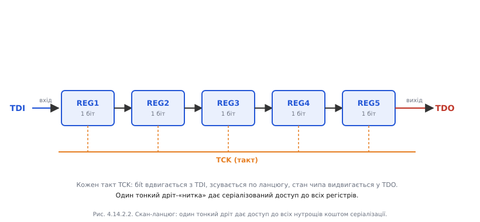

*Рис. 4.14.2.2. Один тонкий дріт дає доступ до всіх нутрощів коштом серіалізації.*

Керування тим, **який** регістр обирається для доступу, відбувається через **скінченний автомат TAP** (Test Access Port). TMS-послідовність переводить його між станами (`Test-Logic-Reset → Run-Test/Idle → Select-DR-Scan → Capture-DR → Shift-DR → Update-DR → ...`). Наприклад, щоб завантажити команду «читати регістр ядра», зонд подає специфічну TMS-послідовність, яка веде TAP у стан `Shift-IR` (інструкційний регістр), вдвигає код команди, потім переводить у `Shift-DR` і читає результат. Кожен цикл — кілька десятків тактів TCK; для інженера це непомітно, але знання цієї механіки пояснює, чому задіяти кілька ніжок є обов'язковим.

### SWD: два дроти — та сама сила

ARM розробив SWD (Serial Wire Debug) як спрощений транспорт для тих самих можливостей — але лише на двох лініях. **SWCLK** — такт (аналог TCK), **SWDIO** — двоспрямовані дані (об'єднує TDI, TDO і TMS в одну лінію з перемиканням напрямку). Саме тому SWD незамінний на дрібних корпусах — TSSOP-20 чи QFN-32, де кожна ніжка на рахунку.

За функціональністю SWD і JTAG рівноцінні: обидва ведуть до одного відлагоджувального блока у чипі — просто різними «транспортними маршрутами».

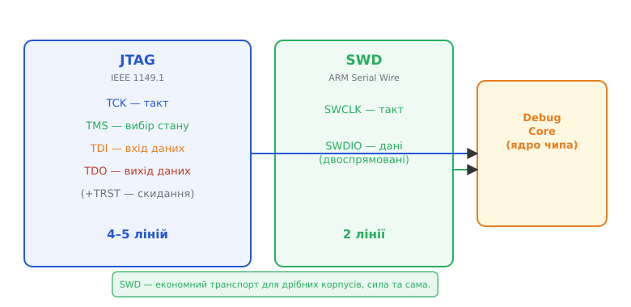

*Рис. 4.14.2.3. SWD — економний транспорт для дрібних корпусів, сила та сама.*

### Що по той бік порту: відлагоджувальний блок у ядрі

JTAG чи SWD — це лише транспорт. Справжня магія відбувається всередині чипа, де розташований **відлагоджувальний блок**. У Cortex-M це DAP (Debug Access Port) з блоками halt, FPB (Flash Patch and Breakpoint) і DWT (Data Watchpoint and Trace). В Xtensa-ядрах ESP32 — власний OCD-блок (On-Chip Debugger). Зонд через JTAG/SWD записує команди у реальні регістри цього блоку: «записати 1 у біт HALT» → ядро зупиняється після поточної інструкції; «завантажити адресу в CMP0» → апаратний брейкпоінт встановлено. Halt — не магія, а звичайний запис у апаратний регістр через скан-ланцюг.

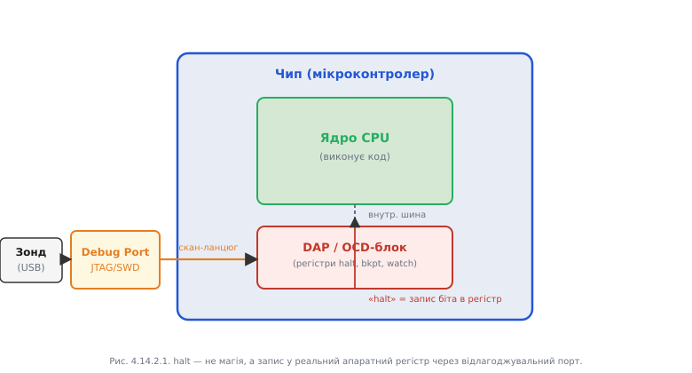

*Рис. 4.14.2.1. halt — не магія, а запис у реальний апаратний регістр через відлагоджувальний порт.*

### ESP32: специфіка підключення

Класичний ESP32 і ESP32-S2 використовують JTAG через Xtensa-ядро. Чотири виводи відведені виключно для відлагодження: **MTCK** (GPIO13), **MTDI** (GPIO12), **MTDO** (GPIO15), **MTMS** (GPIO14). Зовнішній зонд — ESP-Prog або будь-який CMSIS-DAP-сумісний — підключається саме до них. Проблема в тому, що GPIO12 і GPIO15 є **strapping-пінами** (§4.2.6): їхній стан під час скидання впливає на завантаження. Якщо зонд тримає ці лінії на хибному рівні, чип може не завантажитись зовсім або завантажитись у неправильний режим.

ESP32-S3, C3 і C6 отримали **USB-Serial-JTAG** — вбудований JTAG-інтерфейс, що передається прямо по USB без жодного зовнішнього зонда (пор. §4.12.6). Це дуже зручно для розробки: один USB-кабель забезпечує і запис прошивки, і відлагодження, і консоль. Лінії зайняті всередині чипа, конфлікту з GPIO немає.

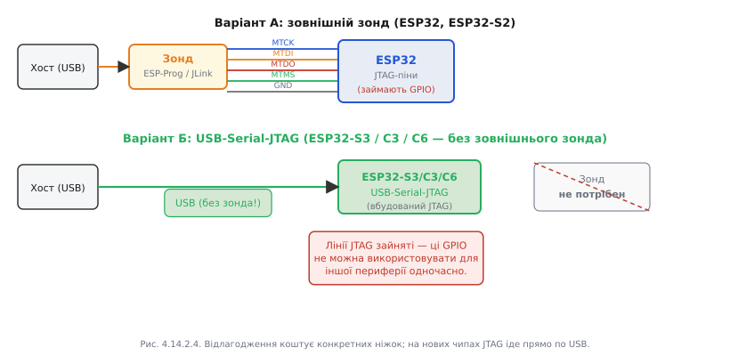

*Рис. 4.14.2.4. Відлагодження коштує конкретних ніжок; на нових чипах JTAG іде прямо по USB.*

**Worked-приклад. Один такт скан-ланцюга на TAP-рівні.**

Щоб вибрати регістр даних і прочитати PC ядра, зонд виконує таку послідовність (символи — рівні TMS на кожен такт TCK, D — дані на TDI):

```
Стан:        Test-Logic-Reset → Run-Test/Idle → Select-DR-Scan → Capture-DR → Shift-DR
TMS-біти:    1 1 1 1 1         0                1                0              0 0 0 ...
TDI:         x x x x x         x                x                x              D D D ...
TDO:         x x x x x         x                x                x              Q Q Q ...
```

На кожен такт у стані `Shift-DR` один біт вдвигається через TDI і один зчитується з TDO. Після N тактів весь регістр прочитано. Команда `Update-DR` (TMS=1 після останнього біта в `Shift-DR`) фіксує нові дані у регістрі-призначенні. Це і є «один такт» на апаратному рівні — серіалізований доступ до нутрощів ядра.

> 🔧 **Навіщо це:** розуміти лінії JTAG/SWD потрібно, щоб правильно підключити зонд, не зайняти ці піни іншою периферією і не дивуватись, чому відлагодження «не чіпляється» після підключення нового компонента до GPIO12–15.

---

## 4.14.3 Брейкпоінти й вотчпоінти: апаратні проти програмних і чому їх лічена кількість

Зонд навчився зупиняти ядро (§4.14.2). Але зупинити «в довільний момент» — не те, що потрібно. Нам треба зупинитись **саме там, де щось відбувається**: на конкретному рядку коду або в ту мить, коли хтось торкнеться певної змінної в пам'яті. Для цього існують дві різні «пастки»: брейкпоінт і вотчпоінт.

### Апаратний брейкпоінт: компаратор адрес у залізі

Усередині відлагоджувального блока ядра є невелика кількість **компараторів адрес** — спеціальних апаратних схем. На кожній вибірці команди ядро порівнює значення програмного лічильника PC із завантаженими адресами у цих компараторах. Якщо збіг — ядро само зупиняється, ще до виконання інструкції.

Ця схема абсолютно прозора для коду прошивки: жодної зміни у Flash не відбувається. Саме тому апаратні брейкпоінти **працюють у Flash-пам'яті** — там, де зберігається звичайний код прошивки. Проте компараторів **лічена кількість**: у Cortex-M3/M4 зазвичай 6–8 FPB-компараторів, у Xtensa ESP32 — 2. Це не архітектурна дивацтво, а пряме відображення фізичних транзисторів у кремнії: кожен компаратор займає площу кристала і коштує чипу продуктивності й струму.

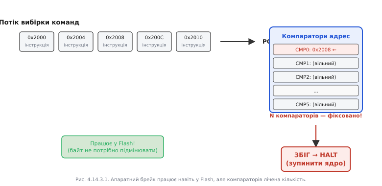

*Рис. 4.14.3.1. Апаратний брейк працює навіть у Flash, але компараторів лічена кількість.*

### Програмний брейкпоінт: підміна команди пасткою

Програмний брейкпоінт працює зовсім інакше. Відлагоджувач читає оригінальну інструкцію за вказаною адресою, зберігає її, а на її місце **записує спеціальну команду-пастку** — `BKPT` у ARM Thumb або `BREAK` в Xtensa. Ядро, дійшовши до пастки, зупиняється; відлагоджувач відновлює оригінальну інструкцію, виконує її і знову ставить пастку назад.

Таких брейкпоінтів може бути скільки завгодно — обмежується лише пам'яттю хоста. Але є критичне обмеження: вони **не працюють у Flash**. У §4.3.2 ми вже бачили: щоб змінити байт у Flash, треба стерти весь сектор і записати заново — операція тривалістю мілісекунди з обмеженим ресурсом стирань. «Підмінити байт на льоту» технічно неможливо.


*Рис. 4.14.3.2. Програмних брейків скільки завгодно, але не у Flash.*

### Вотчпоінт: пастка на доступ до даних

Вотчпоінт — це компаратор не на адресу **коду**, а на адресу **даних** разом із умовою (читання, запис або обидва). Ядро відстежує кожне звернення до шини даних; коли адреса збігається з умовою вотчпоінта — halt.

Це найпотужніший інструмент проти загадкового псування пам'яті. Уявіть: глобальна змінна `g_config.rate` набуває хибного значення, але ти не знаєш, хто і де її змінює. Тисячі рядків коду, три задачі RTOS (§4.10.3), кілька ISR (§4.5.6) — кожен потенційний підозрюваний. Ставиш `watch g_config.rate` — і наступного разу, коли **будь-який** рядок будь-якої задачі або ISR запише у цю змінну, ядро зупиниться. Винуватця буде показано: рядок коду, ім'я функції, стек викликів.

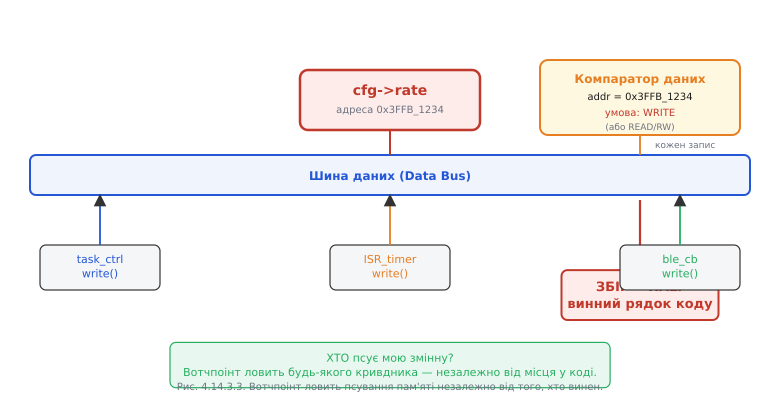

*Рис. 4.14.3.3. Вотчпоінт ловить псування пам'яті незалежно від того, хто винен.*

### Стратегія: як економити обмежений ресурс

Апаратних брейкпоінтів і вотчпоінтів мало — і вони спільні: ті самі компаратори обслуговують обидва типи пасток. Звідси правило економії: **апаратні** компаратори берегти для Flash-коду і вотчпоінтів; у RAM-коді завжди доступні **програмні** брейкпоінти — їх ставте скільки потрібно.

Кілька тонкощів. Брейкпоінт усередині ISR (§4.5.3) технічно спрацює, але ядро зупиняється з активним рівнем пріоритету переривання — деякі дії після halt стають небезпечними. **Умовні** брейкпоінти (GDB перевіряє умову, відновлює виконання, якщо вона хибна) реалізовані програмно на хості: ядро все одно зупиняється на кожному спрацюванні, GDB перевіряє умову і може одразу відновити виконання — але при частих спрацюваннях це дуже повільно. Вотчпоінт на **діапазон** адрес можливий, але апаратно компаратор маскує молодші біти адреси — покритий діапазон має бути степенем двійки і вирівняним.

**Worked-приклад. Бюджет пасток на Xtensa ESP32 і як вкластись.**

| Тип | Ресурс | Де працює |
|---|---|---|
| Апаратний брейкпоінт | 2 компаратори | Flash + RAM |
| Програмний брейкпоінт | необмежено | тільки RAM |
| Вотчпоінт | 2 компаратори (спільні) | RAM (дані) |

Сценарій: треба відлагодити код у Flash — 2 місця інтересу — плюс стежити за `g_queue_len`. Маємо лише 2 апаратні компаратори. Рішення:

```
# GDB-команди
hbreak flash_handler    # апаратний — у Flash, використовує CMP0
watch  g_queue_len      # вотчпоінт — CMP1 (залишився)
# Третій брейк — у RAM-коді або на буфері, програмний:
break  ram_buffer_fill  # програмний — не витрачає апаратних
```

> 🔧 **Навіщо це:** знати межу «лічена кількість» треба, щоб не витрачати дорогі апаратні брейкпоінти даремно і щоб розуміти, чому у Flash звичайний `break` іноді мовчки не спрацьовує.

---

## 4.14.4 OpenOCD і GDB: хост говорить із чипом

Тепер у нас є зонд, що вміє підключатись до JTAG/SWD (§4.14.2) і встановлювати пастки (§4.14.3). Але зонд — «німий» виконавець: він знає лише, як зрушити тактовий сигнал і перетворити USB-команди на JTAG-послідовності. Осмислення, символіка, імена функцій, рядки вихідного коду — нічого з цього в зонді немає. Щоб виникло повноцінне відлагодження, потрібні ще дві ланки.

### Три ланки: зонд → OpenOCD → GDB

**Перша ланка — зонд.** Це фізичний міст USB↔JTAG/SWD. Він отримує команди від хоста, перетворює їх у тактові послідовності на JTAG/SWD-ніжках і повертає відповіді. Зонд нічого не знає про ваш код, ядро чи прошивку.

**Друга ланка — OpenOCD** (Open On-Chip Debugger). Це програма на хості, що знає **конкретний чип** і **конкретний зонд**: де який регістр, скільки компараторів, що означають ті чи інші JTAG-послідовності для Xtensa ESP32 або Cortex-M4. OpenOCD приймає абстрактні запити («прочитай регістр r0», «зупинись»), перекладає їх у конкретні скан-послідовності і відкриває **GDB-сервер** — зазвичай на TCP-порту 3333. Саме тут відбувається перехід від апаратного рівня до протокольного.

**Третя ланка — GDB** (GNU Debugger). Це той самий GDB із тулчейна §4.2.1, але тепер він підключений не до процесу в ОС, а до реального чипа через **Remote Serial Protocol** (RSP) по TCP. GDB читає **символи з .elf-файлу** і знає: адреса `0x400D2ABC` — це функція `process_packet` у файлі `proto.c`, рядок 47. Він перетворює «голі» числа адрес, що надходять від OpenOCD, на осмислений вигляд: імена функцій, рядки вихідного коду, значення змінних.

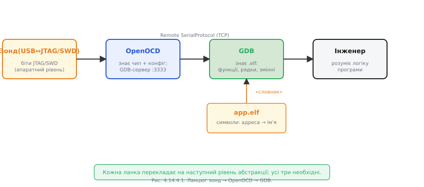

*Рис. 4.14.4.1. Кожна ланка перекладає на наступний рівень абстракції; усі три необхідні.*

### Роль .elf: словник для мертвих чисел

Коли записуєш прошивку у Flash, туди потрапляє `.bin` або `.hex` — «голий» бінарний образ без жодних символів. Усередині чипа немає нічого, крім машинних кодів і числових адрес. .elf-файл — це той самий код, але з повною **таблицею символів**: кожна адреса відображена на ім'я функції або змінної, прив'язана до рядка у файлі `.c` або `.cpp`. GDB читає цей «словник» і повертає числам їхні імена.

Звідси критичне правило: GDB **мусить** мати той самий .elf, що відповідає прошивці у Flash. Якщо перекомпілював код після запису прошивки, але не записав знову, адреси функцій зсунулись — і GDB показуватиме хибні рядки або взагалі не зможе знайти символи. Цей принцип (§4.2.4) особливо важливий для посмертного аналізу (§4.14.7): дамп без рідного .elf — це набір незрозумілих чисел.

### Базові команди GDB

Мінімальний словник команд, що покриває 90% щоденного налагодження:

```
target remote :3333   # підключитись до OpenOCD-сервера (на localhost)
load                  # завантажити прошивку з .elf у Flash
break app_main        # програмний брейкпоінт на функцію
hbreak flash_isr      # апаратний брейкпоінт (Flash)
continue / c          # продовжити виконання
next / n              # крок (не входить у функцію)
step / s              # крок (входить у функцію)
finish                # вийти з поточної функції
print g_counter       # значення змінної
print *cfg            # розіменувати вказівник і показати структуру
backtrace / bt        # стек викликів
frame 2               # перейти до фрейму #2
info registers        # всі регістри CPU (PC, SP, LR, ...)
x/16xw 0x3FFB0000     # дамп 16 слів по 4 байти з адреси
set var g_mode = 1    # змінити змінну наживо для експерименту
monitor reset halt    # скинути ядро та зупинитись (команда OpenOCD)
watch g_config.rate   # вотчпоінт
```

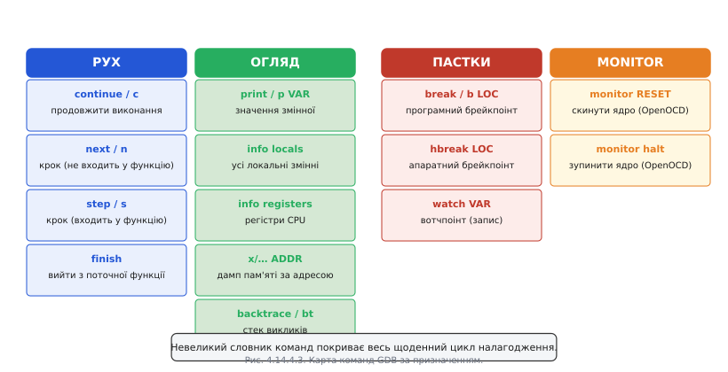

*Рис. 4.14.4.3. Невеликий словник команд покриває весь щоденний цикл налагодження.*

### ESP32 і ESP-IDF: готовий стек

ESP-IDF надає все необхідне одразу. Конфіги для OpenOCD вже написані командою Espressif: `board/esp32-wrover-kit.cfg`, `board/esp32s3-builtin.cfg` тощо. Запуск:

```bash
# Термінал 1: запускаємо OpenOCD
idf.py openocd

# Термінал 2: GDB з автоматичним конфігом
idf.py gdb
```

Для ESP32-S3/C3/C6 з USB-Serial-JTAG конфіг сам вибирає USB-транспорт, зовнішній зонд не потрібен. OpenOCD для ESP32 **обізнаний із FreeRTOS**: він знає про задачі, може показувати їхні стеки і перемикатись між ними — про це в §4.14.5.

**Worked-приклад. Повний міні-сеанс: підключитись і прочитати змінну.**

```bash
# === Термінал 1: OpenOCD ===
$ idf.py openocd
Open On-Chip Debugger v0.12.0
Info : esp32: Target halted, PC=0x400D1ABC
Info : Listening on port 3333 for gdb connections

# === Термінал 2: GDB ===
$ idf.py gdb
(gdb) target remote :3333
Remote debugging using :3333
0x400D1ABC in esp_restart ()

(gdb) break app_main
Breakpoint 1 at 0x400D2010: file main/main.c, line 42.

(gdb) c
Continuing.
Breakpoint 1, app_main () at main/main.c:42
42          config_t cfg = { .rate = DEFAULT_RATE };

(gdb) p cfg.rate
$1 = 100

(gdb) bt
#0  app_main () at main/main.c:42
#1  0x400D0888 in main_task (args=0x0) at /idf/components/freertos/app_startup.c:208
```

> 🔧 **Навіщо це:** розуміти три ланки треба, щоб діагностувати «не підключається» — майже завжди винна одна конкретна ланка: зонд не видно в USB / OpenOCD не той конфіг / GDB не той .elf.

---

## 4.14.5 Кроком по коду: стек викликів, фрейми, перегляд пам'яті й регістрів живої системи

Ми підключились і зупинили ядро (§4.14.4). Тепер ми всередині завмерлого всесвіту. Що тут можна побачити і як рухатись далі? Це і є щоденне ремесло налагодження — набагато багатше, ніж просто «кроки вперед».

### Три види кроку

Коли ядро зупинене, є три різні способи рухатись далі по коду.

**`step` (s)** — крок із входженням: виконати один рядок вихідного коду, але якщо цей рядок містить виклик функції — **увійти** в неї і зупинитись на першому рядку. Корисний, коли підозрюєш, що проблема всередині конкретної функції.

**`next` (n)** — крок без входження: виконати один рядок вихідного коду, а якщо там виклик функції — **виконати її цілком** і зупинитись на наступному рядку. Рятує від провалювання в бібліотечні функції, HAL-драйвери та інший код, де проблеми не очікуєш.

**`finish`** — виконати поточну функцію до кінця і зупинитись одразу після повернення з неї. Якщо випадково провалився кроком углиб і хочеш вийти на рівень вище — `finish` без зайвих кроків.

**`stepi` (si)** — крок по одній **машинній** інструкції, незалежно від рядків вихідного коду. Потрібний при аналізі асемблерного виходу або коли оптимізатор «склеїв» кілька рядків C в одну інструкцію.

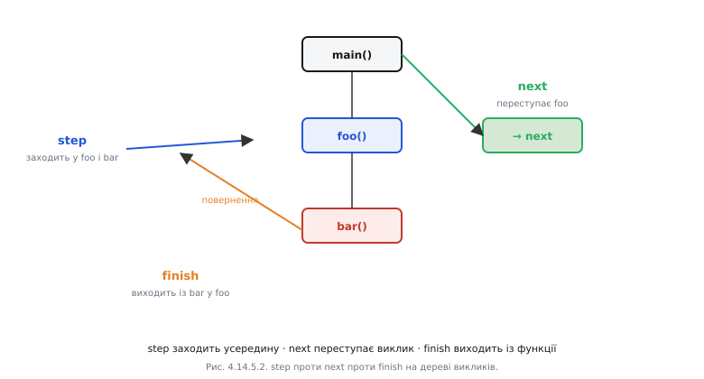

*Рис. 4.14.5.2. Вибір кроку керує тим, провалюєшся ти у функцію чи переступаєш її.*

### Стек викликів і фрейми

Зупинившись у довільному місці, ти хочеш знати: **як сюди потрапили?** Відповідь — команда `backtrace` (або `bt`). Вона читає стек з пам'яті й відновлює ланцюг «хто кого викликав»: від поточної функції (#0) угору через усі проміжні виклики до самої вершини.

Кожен запис у backtrace — це **фрейм**: знімок стану однієї функції в момент, коли вона викликала іншу. Фрейм містить локальні змінні функції, значення ключових регістрів, збережений LR (адреса повернення) і SP (покажчик стека). Саме тому backtrace і можливий: стек — це фізичний слід із хлібних крихт назад до `main`.

```
(gdb) bt
#0  sensor_read (dev=0x3FFB1234, buf=0x0) at sensor.c:88
#1  0x400D2ABC in update_sensors () at tasks/sensors.c:45
#2  0x400D2F10 in sensor_task (arg=0x0) at tasks/sensors.c:120
#3  0x400D0888 in freertos_task_entry () at freertos/tasks.c:512
```

Перейти у конкретний фрейм: `frame 1` або `up`/`down`. Перемкнувшись у фрейм #1, команди `info locals` і `print` покажуть локальні змінні саме цієї функції, а не поточної. Це важливо: якщо шукаєш, яким аргументом тебе викликали, треба перейти у фрейм виклику.


*Рис. 4.14.5.1. backtrace відновлює ланцюг «хто кого викликав» із завмерлого стека.*

### Перегляд живого стану

Зупинившись у фреймі, ти бачиш **все**, а не лише те, що надруковано — у цьому і є принципова відмінність від §4.14.1.

```
(gdb) info locals           # всі локальні змінні поточного фрейму
buf = 0x0                   # ось він, нульовий вказівник
len = 64

(gdb) info registers        # всі регістри CPU
pc  0x400D2034  sensor_read+12
sp  0x3FFB6E80
lr  0x400D2ABD

(gdb) x/8xb 0x3FFB1234      # дамп 8 байт з адреси (зручно для перевірки структур)
0x3FFB1234: 0x01 0x00 0x00 0x00 0x64 0x00 0x00 0x00

(gdb) set var buf = &local_buf    # змінити вказівник наживо для перевірки гіпотези
```

Команда `set var` дозволяє **змінювати** значення змінних наживо. Це потужний інструмент перевірки гіпотез: «а що якщо `buf` вказував би на правильний буфер — чи завершилась би функція успішно?» — змінюємо `buf`, відновлюємо виконання й дивимось.

### RTOS-обізнаність: бачимо всі задачі

Одна з найважливіших переваг підключеного відлагоджувача над друком — він бачить **усі задачі FreeRTOS** одночасно. OpenOCD для ESP32 вміє читати список задач зі структур RTOS у RAM, і GDB відображає їх як окремі «потоки».

```
(gdb) info threads
  Id  Target Id   Frame
  1   Task "app_task"   xQueueReceive () at queue.c:112
  2   Task "wifi_task"  esp_wifi_scan () at wifi_api.c:55
* 3   Task "sensor_task"  sensor_read () at sensor.c:88

(gdb) thread 2              # переключитись на wifi_task
(gdb) bt                    # побачити її backtrace
#0  esp_wifi_scan (...)
#1  wifi_connect_handler ()
...
```

Кожна задача має власний стек у RAM (§4.10.7) і власне значення PC у точці, де вона зупинилась або заблокувалась. Відлагоджувач надає окремий backtrace для кожної — і ти бачиш картину всієї системи одночасно.

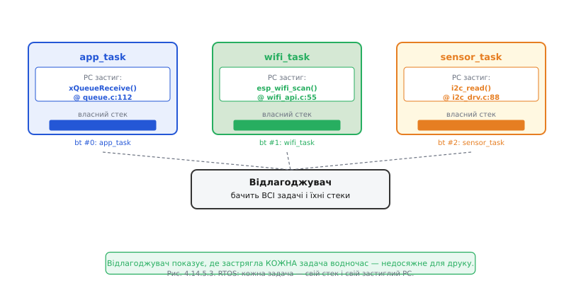

*Рис. 4.14.5.3. Відлагоджувач показує, де застрягла КОЖНА задача водночас — недосяжне для друку.*

### Пастки оптимізованого коду

При компіляції з `-O2` або вище компілятор агресивно перетворює код: вбудовує функції, видаляє «зайві» змінні, об'єднує рядки. Наслідок для налагодження — GDB «стрибає» по рядках непередбачувано, а значення змінних часто показуються як `<optimized out>`. Це не баг GDB; це наслідок того, що конкретна змінна взагалі не існує в пам'яті — вона «живе» у регістрі, і компілятор вирішив її не зберігати.

Для налагодження рекомендується прапорець `-Og` (оптимізація, що не заважає налагодженню) або `-O0` (без оптимізації). Ця тема пов'язана з §4.2.2-⚙️: там ми розглядали, що робить оптимізатор із кодом.

**Worked-приклад. Backtrace падіння з неправильним аргументом.**

```
(gdb) bt
#0  memcpy (dst=0x0, src=0x3FFB5000, n=64) at memcpy.c:34
#1  0x400D2F88 in pack_response (out=0x0, data=0x3FFB5000) at proto.c:156
    out = 0x0    ← nullptr!
#2  0x400D2ABC in handle_command (cmd=0x3FFB4800) at proto.c:89
    cmd = 0x3FFB4800

(gdb) frame 2
(gdb) info locals
out_buf = 0x0       ← не ініціалізований, залишився nullptr
cmd     = 0x3FFB4800

(gdb) p cmd->response_buf
$1 = 0x0            ← поле не заповнене перед викликом
```

Ланцюг зрозумілий: `handle_command` не ініціалізувала `out_buf` перед передачею у `pack_response`, яка передала `0x0` у `memcpy` — і впала. Без backtrace і перегляду фреймів цей ланцюг міг би ховатись за десятками `Serial.print`.

> 🔧 **Навіщо це:** backtrace — найшвидший шлях від «воно впало десь там» до «ось функція й ось аргумент, що це спричинив»; вміти читати фрейми — половина ремесла налагодження.

---

## 4.14.6 Розбір HardFault: що ядро зберігає при збої і як прочитати причину падіння

До цього ми зупиняли **справну** програму своєю волею. Але найчастіший сценарій у реальній розробці — пристрій зупиняється **сам**: потрапляє в обробник збою і перезавантажується. Саме тоді відлагоджувач (або хоча б правильно написаний обробник) показує найбільше.

### Природа збою: що таке HardFault

Процесор сам ловить «неможливі» ситуації — події, що порушують правила архітектури. Для Cortex-M це ієрархія виключень: **MemManageFault** (доступ до забороненої адреси MPU), **BusFault** (помилка на шині, наприклад звернення до неіснуючої периферії), **UsageFault** (невідома інструкція, ділення на нуль, невирівняний доступ) і **HardFault** — «останній рубіж», що перехоплює все, чого не спіймали вищі обробники. Для Xtensa в ESP32 — власний набір виключень: `LoadProhibited`, `StoreProhibited`, `IllegalInstruction`, `Unaligned`.

Зв'язок із §4.15: HardFault — це **подія**; що з нею зробити (перезавантажитись, зберегти стан, блимнути світлодіодом) — питання наступного розділу. Тут — як **прочитати** цю подію.

### Передсмертна записка: exception-фрейм

У мить збою ядро Cortex-M виконує критично важливу дію ще **до** виклику будь-якого обробника: воно автоматично зберігає знімок свого стану на стеку. Цей знімок, що з'явився на стеку, називається **exception-фреймом**. Він містить: R0, R1, R2, R3, R12, LR (звідки прийшли), **PC** (де саме виникло виключення) і xPSR (стан процесора). Якщо використовується FPU — також регістри S0–S15 і FPSCR.

Ключове тут — **PC**. Це точна адреса інструкції, яка спричинила збій. Маючи цю адресу і .elf-файл (той самий, що у Flash, — §4.14.4), можна отримати точний рядок вихідного коду через `addr2line` або `GDB list *PC`.

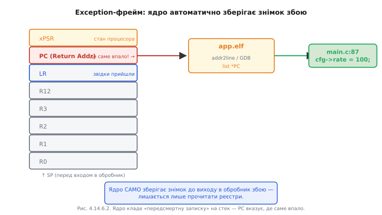

*Рис. 4.14.6.2. Ядро кладе «передсмертну записку» на стек — PC вказує, де саме впало.*

### Fault-регістри: закодований діагноз

Exception-фрейм дає PC — де саме впало. Але чому — пояснюють **fault-статусні регістри**.

**CFSR** (Configurable Fault Status Register) — 32-бітний регістр, поділений на три частини. Старші 16 бітів — UsageFault, середні 8 — BusFault, молодші 8 — MemManageFault. Кожна частина має бітові прапори, що кодують конкретну причину:

- `IACCVIOL` — спроба виконати код з адреси, заблокованої MPU
- `DACCVIOL` — доступ до даних за адресою, заблокованою MPU
- `IMPRECISERR` — неточна помилка шини (через буфер запису: справжня адреса вже втрачена до появи помилки)
- `PRECISERR` — точна помилка шини (адреса збережена в BFAR)
- `DIVBYZERO` — ділення на нуль (якщо увімкнено в UFSR)
- `UNALIGNED` — невирівняний доступ (якщо увімкнено)

**MMFAR** і **BFAR** — адреса, за якою сталась помилка пам'яті чи шини відповідно. Вони дійсні лише тоді, коли встановлені прапори `MMARVALID`/`BFARVALID` у CFSR — перевіряти це треба насамперед.

**HFSR** — HardFault Status Register. Прапор `FORCED` означає, що первинний збій стався в нижчому обробнику (наприклад, BusFault), але той був замаскований і ескалував до HardFault. `VECTTBL` — помилка при читанні таблиці векторів.


*Рис. 4.14.6.1. Збій закодовано в конкретних бітах — їх читають як діагноз.*

Хитрий випадок — `IMPRECISERR`. Через буфер запису в Cortex-M3/M4 процесор може виконати кілька інструкцій **після** реально помилкового запису, перш ніж помилка шини до нього дійде. Тому PC у exception-фреймі вказує не на рядок з помилкою, а на кілька інструкцій далі — і BFARVALID буде нульовим. Обхід: тимчасово вимкнути буфер запису (`ACTLR.DISDEFWBUF`) для відтворення точної адреси.

### Від адреси до рядка: addr2line

На ESP32 з Xtensa-ядром панічний обробник ESP-IDF автоматично виводить backtrace у вигляді адрес при будь-якому збої. Перетворити адреси на рядки:

```bash
# idf.py monitor робить це автоматично у реальному часі
idf.py monitor

# Або вручну:
xtensa-esp32-elf-addr2line -pfiaC -e build/myapp.elf 0x400D2ABC 0x400D1F44
```

Результат:
```
0x400D2ABC: sensor_read at /project/main/sensor.c:88
0x400D1F44: update_sensors at /project/main/tasks.c:45
```


*Рис. 4.14.6.3. Адреси без .elf — німі числа; з .elf — читана траса падіння.*

**Worked-приклад. Повний розбір HardFault.**

Стан регістрів при збої:

```
HFSR  = 0x40000000  (FORCED — ескалований з BusFault)
CFSR  = 0x00008200  (BusFault: PRECISERR=1, BFARVALID=1)
BFAR  = 0x00000000  (спроба запису за адресою 0x0!)
PC    = 0x400D1F88
LR    = 0x400D2ABD
```

Крок 1 — декодуємо CFSR. Біти `[15:8]` (BusFault): `PRECISERR=1`, `BFARVALID=1`. Точна шинна помилка, BFAR валідний.

Крок 2 — читаємо BFAR = `0x00000000`. Запис за нульовим вказівником.

Крок 3 — addr2line за PC:
```bash
xtensa-esp32-elf-addr2line -e build/app.elf 0x400D1F88
# → cfg_write at /project/main/config.c:42
```

Крок 4 — дивимося рядок `config.c:42`:
```c
void cfg_write(config_t *cfg, uint32_t val) {
    cfg->rate = val;          // рядок 42 — запис через вказівник
}
```

Крок 5 — backtrace з LR показує, що `cfg_write` викликали з `init_system()`, де `cfg` не ініціалізовано і залишилось `NULL`. Справа закрита.

> 🔧 **Навіщо це:** HardFault у полі — не «біла стіна», а лист із точною адресою злочину; вміння прочитати скорочує розслідування з днів до хвилин.

---

## 4.14.7 Посмертний аналіз: core dump і відновлення картини після того, як пристрій уже впав

У §4.14.6 ми читали HardFault, **сидячи поруч із відлагоджувачем**, підключеним у мить збою. Але реальний світ рідко буває таким зручним. Пристрій встановлено у клієнта за тисячу кілометрів. Збій стався о третій ночі. Пристрій уже перезавантажився і знову «нормально» працює — або, навпаки, впав остаточно. Як розслідувати смерть, якої ти не бачив? Відповідь — заздалегідь підготовлена «чорна скринька»: **core dump**.

### Ідея: зберегти кадр смерті

У мить збою, перш ніж перезавантажитись, спеціальний **панічний обробник** ESP-IDF встигає виконати кілька сотень мілісекунд корисної роботи: він обходить усі задачі FreeRTOS, зчитує їхні регістри й стеки та зберігає цей знімок у надійне місце — окремий розділ Flash або виводить у UART.

Пізніше — можливо, через тижні — цей знімок «оживляють» на хості за допомогою GDB і того самого .elf: відкривається звичайна GDB-сесія, де видно стан системи рівно в момент збою. Жодних запитань «чому не підключив відлагоджувач» — момент смерті зафіксовано.

Образ: якщо §4.3.1 описував «чорну скриньку» як лог того, що **передувало** збою, то core dump — це повний кадр **самого моменту смерті**.


*Рис. 4.14.7.1. Core dump відв'язує момент збою від моменту розслідування.*

### Механіка на ESP32: куди писати і як читати

ESP-IDF має вбудовану підтримку core dump. Головне рішення — **куди зберігати**:

- **У Flash**: потрібен окремий розділ у таблиці розділів (§4.3.4) з типом `coredump`. Зазвичай 64–256 КБ. Після перезавантаження дані залишаються до явного очищення.
- **У UART**: знімок виводиться у консоль при збої у форматі Base64. Зручно для лабораторії, непрактично у полі.

Конфігурація у `sdkconfig`:
```
CONFIG_ESP_COREDUMP_ENABLE_TO_FLASH=y
CONFIG_ESP_COREDUMP_DATA_FORMAT_ELF=y
```

Таблиця розділів (`partitions.csv`):
```
# Name,   Type, SubType,  Offset,  Size
nvs,      data, nvs,      0x9000,  0x6000
coredump, data, coredump, 0xF000,  0x40000
factory,  app,  factory,  0x10000, 0x300000
```

Після збою і перезавантаження зчитуємо та аналізуємо:
```bash
# Спосіб 1: через idf.py (зчитує з пристрою і відразу аналізує)
idf.py coredump-info

# Спосіб 2: зберегти у файл, аналізувати пізніше
idf.py coredump-info -o coredump.bin
python $IDF_PATH/components/espcoredump/espcoredump.py \
    info_corefile -c coredump.bin build/myapp.elf
```

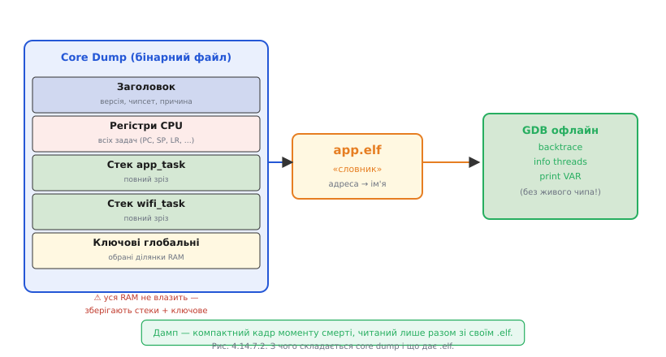

*Рис. 4.14.7.2. Дамп — компактний кадр моменту смерті, читаний лише разом зі своїм .elf.*

### Що видобуваємо з дампа

Офлайн-аналіз дає майже те саме, що і живий відлагоджувач, — з одним винятком: ти не можеш «крокнути далі».

- **Backtrace кожної задачі** — де саме перебувала кожна задача у момент збою. Яка задача впала, яка чекала на семафор, яка виконувала мережевий виклик.
- **Стан регістрів** для кожної задачі — PC, SP, LR та всі загальні регістри.
- **Значення глобальних змінних** — якщо вони потрапили у збережену ділянку пам'яті.
- **Fault-розбір** (§4.14.6) — якщо збій був HardFault, CFSR/BFAR збережені в дампі.

```
======== Backtrace for task 'sensor_task' ========
#0  sensor_read (dev=0x3FFB1234, buf=0x0) at sensor.c:88
#1  update_sensors () at tasks/sensors.c:45
#2  sensor_task (arg=0x0) at tasks/sensors.c:120

======== Backtrace for task 'wifi_task' ========
#0  xQueueReceive () at queue.c:112
#1  wifi_handler () at wifi.c:67

Crash reason: StoreProhibited (write to address 0x0)
```

### Межі і чесні компроміси

Core dump не всесильний. Обробник збою виконується в момент паніки, коли RTOS зупинена, — він мусить бути максимально надійним і не спричиняти нових збоїв (пор. §4.5.3: реєнтерабельність і безпека обробника). Запис у Flash займає час і потребує нормальної роботи Flash-драйвера — якщо збій стався у Flash-драйвері, дамп не збережеться.

Не вся пам'ять потрапляє у дамп: зберігають стеки задач і критичні ділянки. Купа (heap) зазвичай не включається — занадто велика. Якщо збій пошкодив сам стек (§4.10.7 — переповнення), backtrace може бути неповним або хибним.

### Стратегія поля: дамп плюс причина reset

Core dump розповідає «де і як впало». Але для повної картини він поєднується з ще одним інструментом: **причиною скидання** (§4.1.8). Причина скидання зберігається в регістрі `RTC_CNTL_RESET_CAUSE` і доступна після будь-якого перезавантаження:

```c
esp_reset_reason_t reason = esp_reset_reason();
// ESP_RST_PANIC    — впав у паніку (core dump може бути доступний)
// ESP_RST_BROWNOUT — просадка живлення
// ESP_RST_WDT      — watchdog
// ESP_RST_DEEPSLEEP — прокинувся з глибокого сну
```

Причина скидання каже **ЩО** (паніка, brownout, WDT), core dump каже **ДЕ і ЧОМУ**. Разом вони дають повне посмертне розслідування без жодного інженера на місці.


*Рис. 4.14.7.3. Вибір шляху диктують доступність зонда і те, чи момент збою ще «живий».*

**Worked-приклад. Видобути core dump і отримати backtrace.**

```bash
# Пристрій перезавантажився, підключаємо USB, читаємо дамп
$ idf.py coredump-info
Loading core dump from device...

==================== CURRENT THREAD REGISTERS =====================
pc             0x400d1f88   0x400d1f88 <sensor_read+12>
sp             0x3ffb6e80
...

==================== BACKTRACE =======================
#0  sensor_read (dev=0x3ffb1234, buf=0x0) at main/sensor.c:88
    buf = 0x0
#1  0x400d2abc in update_sensors () at main/tasks.c:45
#2  0x400d2f10 in sensor_task (arg=0x0) at main/tasks.c:120

==================== ALL THREADS =======================
Task 'sensor_task' (current, panicked):
  → sensor_read, sensor.c:88
Task 'wifi_task' (blocked on queue):
  → xQueueReceive, queue.c:112
Task 'app_task' (blocked on semaphore):
  → xSemaphoreTake, semphr.h:340

PANIC REASON: StoreProhibited
EXCEPTION ADDR: 0x00000000 (NULL pointer write)
```

Результат: той самий ланцюг, що і в §4.14.6, але без жодного підключеного зонда в мить збою. `sensor_read` спробував записати через `buf = NULL`.

> 🔧 **Навіщо це:** core dump перетворює «загадково перезавантажується раз на тиждень у клієнта» на конкретний стек і рядок — без відрядження, без відлагоджувача на місці, з одного збереженого файлу.

---

Цим розділ завершує розповідь про інструментальну сторону налагодження: від фізичних дротів JTAG/SWD (§4.14.2) через пастки й команди (§4.14.3–4.14.5) до читання збоїв у живому (§4.14.6) і посмертного (§4.14.7). Ми навчились зупиняти час, ходити між завмерлими і розслідувати смерті, яких не бачили. Але знайти причину і вміти на неї реагувати — різні речі. Як прошивка має поводитись, отримавши паніку? Як відновитись безпечно, не зашкодивши даним і апаратурі? Як зробити систему стійкою до несподіваного від самого початку?

> ▶️ Далі: [Розділ 4.15 — Відмовостійка прошивка: помилки, паніка, відновлення](../r15-fault-tolerant/r15-fault-tolerant.md)
