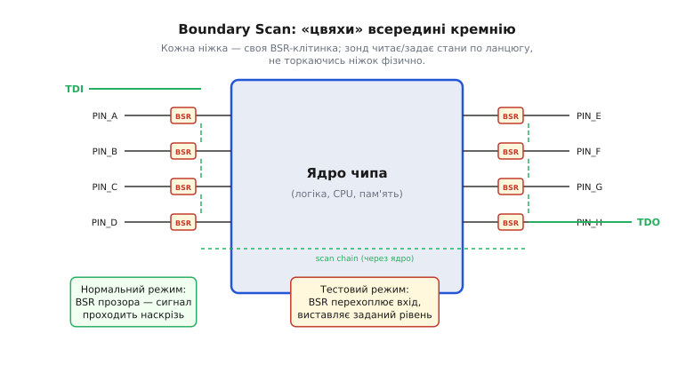
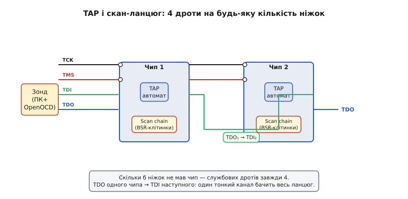

# 📜 Межовий скан і JTAG: як навчилися заглядати в чип без доступу до ніжок

> Це історична вставка до [Розділу 4.14 «Налагодження глибоко: JTAG/SWD, GDB і посмертний аналіз»](r14-debug-deep.md). Вона веде **однією наскрізною ниткою** від виробничого болю 1980-х до чотирьох дротів, якими ви відлагоджуєте ESP32 сьогодні: **коли всі виводи чипа сховані під корпусом і припаяні до плати, як інженер усе одно дотягнеться до них — щоб перевірити пайку, а згодом і зупинити саме ядро?** Звідси ростуть і слово «JTAG», і ті сигнали TDI/TDO/TMS/TCK, і розумний «воротар» TAP, крізь який сьогодні ходить ваш OpenOCD.

У [§4.2.8](../ch21-toolchain/ch21-toolchain.md) ми вже згадували, що поруч із `Serial` існує апаратне відлагодження по JTAG/SWD — інструменти, що дають зазирнути значно глибше. А у вставці [ch21-s8](../ch21-toolchain/ch21-s8-c-debug-probes.md) побачили зонди класу J-Link/ST-Link/ESP-Prog — ті маленькі адаптери, що стоять між ПК і портом відлагодження чипа. Та що це за «порт», звідки він узявся і чому виглядає саме так — чотири дроти, послідовний ланцюг, автомат станів? Це питання і є предметом нашої розповіді.

*Рис. 4.14.0.1. Ідея межового скану (boundary scan). Біля кожного виводу чипа стоїть крихітна реєстрова клітинка. У нормальному режимі вона прозоро пропускає сигнал між ніжкою і ядром; у тестовому — перехоплює те, що приходить ззовні, і може сама виставляти потрібний рівень назовні. Усі клітинки зшиті в один послідовний ланцюг, тож стан кожної ніжки можна прочитати чи задати, НЕ торкаючись її фізично, — саме це рятує там, де виводи сховані під корпусом (BGA).*

Щоб зрозуміти, навіщо знадобився такий ланцюг, повернімося в середину 1980-х — у час, коли плати раптом стало неможливо тестувати по-старому.

---

## Доба «ліжка з цвяхів»: як тестували плати, поки виводи були на видноті

У 1970-х і на початку 1980-х більшість електронних плат виглядала так: наскрізні отвори (through-hole), широкі мідні доріжки, компоненти з ніжками, що стирчать знизу і залужені в олово. Перевірити таку плату після виробництва було справою відпрацьованою й дешевою. На конвеєрі стояв **ICT** — *in-circuit test* — пристрій, відомий у народі як **«ліжко з цвяхів»** (*bed of nails*): рама з десятками чи сотнями підпружинених контактів-«цвяхів», кожен з яких точно потрапляв у тестову точку або просто в контактну площадку на платі. Тестер подавав напруги, міряв струми і перевіряв цілість кожного з'єднання — непропай виявлявся миттєво, коротке замикання між доріжками — теж.

Це був золотий стандарт: швидко, надійно, прямолінійно. Для масового виробництва ICT давав ту прозорість, яку неможливо отримати, просто подавши живлення і сподіваючись, що плата «якось запрацює». Кожен вузол схеми мав свою фізичну точку доступу; тестер знав, де саме шукати дефект.

Але за цим золотим стандартом ховалося одне фундаментальне припущення, яке ніхто тоді навіть не формулював вголос — настільки воно здавалося очевидним: **до кожного електричного вузла можна фізично доторкнутися знизу**. Поки це було так, «ліжко з цвяхів» працювало бездоганно. Та саме це припущення невдовзі розсиплеться під натиском нової технології монтажу.

> 🔧 **Навіщо це.** Коли ви тицяєте мультиметром у тестову точку на платі DevKit ESP32 — ви і є рукотворний міні-ICT: один щуп, один вузол. Розуміти, чому цього підходу стало замало для дрібних корпусів, — значить розуміти, навіщо на платі взагалі є JTAG-роз'єм і куди той роз'єм веде.

---

## Криза тестопридатності: SMT, дрібний крок і BGA закривають доступ

Технологічний злам прийшов із середини 1980-х. Перехід на **поверхневий монтаж** (*SMT — surface-mount technology*) різко змінив правила гри: замість наскрізних отворів компоненти почали просто класти на поверхню плати й припаювати до мідних площадок. Перші SMT-корпуси ще мали виводи по периметру — SOP, QFP — але крок між ними ставав усе дрібнішим: спочатку 1.27 мм, потім 0.8, потім 0.5. Площадки стали такими маленькими, що «цвяхи» вже не могли надійно в них тицятися: або промахувались, або закорочували сусідні.

А далі з'явилася ідея, що остаточно вбила старий підхід, — **BGA** (*ball grid array*): виводи як кульки на днищі корпусу, масивом під самим чипом. Це геніальне рішення з точки зору щільності й паразитних індуктивностей, і абсолютний кошмар з точки зору тестопридатності. Виводи BGA **фізично недосяжні** після монтажу — вони між чипом і платою, повністю заховані. Ніяким «цвяхом» туди не дотягнутися. Непропай під BGA не видно оком, не дістати щупом і не виявити простим тестером напруги.

Оцініть масштаб проблеми. До середини 1980-х частка вузлів на платі, що мали фізично доступні точки тестування, впала у складних виробах з майже 100% до 60, 50, ще менше — і падала далі. ICT перестав покривати плату. Виробники отримали прилади, які треба було якось перевіряти — і не могли. Повернути плату на переробку після того, як дефект знайдено методом «ввімкнули — не запрацювало», — то дорого, повільно і не дає ніякого розуміння причини.

Тут і виникла інженерна дилема, формулювання якої одразу підказує відповідь: якщо не можна дотягнутися до вузла **ззовні** — треба, щоб чип сам, **зсередини**, міг показувати і керувати станом своїх виводів. Інакше кажучи, треба перенести «цвяхи» з тестера всередину кремнію.

Ця ідея і стала зерном **межового скану** (*boundary scan*): поставити біля кожного виводу крихітну реєстрову клітинку, зшити всі клітинки в один зсувний ланцюг і керувати ним кількома службовими дротами — незалежно від того, під яким корпусом ховається чип. Цвяхи нікуди не ділися — вони просто перебрались усередину.

---

## Joint Test Action Group: консорціум, що домовився (≈1985–1988)

Ідея межового скану сама по собі ще не вирішувала проблему. Якби кожен виробник чипів реалізував власний механізм тесту зі своїм протоколом і своїм набором дротів, галузь отримала б зоопарк несумісних рішень — і тестове обладнання для кожного чипа довелося б купувати окремо, що позбавляло весь задум економічного сенсу. Потрібен був **єдиний стандарт**.

Близько **1985–1986 років** провідні електронні компанії Європи і Північної Америки об'єдналися в неформальний консорціум, що отримав назву **JTAG — Joint Test Action Group**. Це була добровільна робоча група промисловості: Philips, IBM, Texas Instruments, Northern Telecom та інші виробники чипів і обладнання сіли за спільний стіл і почали виробляти спільну мову. Серед координаторів процесу часто називають ім'я **Harilaos «Harry» Bandukwala** — та важливо розуміти: JTAG — це продукт колективної інженерної роботи цілої галузі, а не винахід однієї людини чи однієї компанії. Саме спільна домовленість і зробила рішення універсальним.

Те, що вони виробили за кілька років, — проект єдиного мінімального інтерфейсу: послідовний доступ до межового скану будь-якого чипа, чотири службові дроти, один протокол. Чип будь-якого виробника, що реалізував цей інтерфейс, міг тестуватися одним і тим самим обладнанням.

Тут варто пояснити одну плутанину з назвою, з якою ви напевно стикнетесь. «JTAG» — спочатку скорочення від *Joint Test Action Group*, тобто назва **комітету**, а не технології. Але коли комітет видав результат своєї роботи, цей результат успадкував ім'я свого творця. Сьогодні, коли програміст каже «під'єднай JTAG», він має на увазі чотири дроти і стандартний протокол — і вже не думає про робочу групу 1985 року. Це той самий дрейф значення, що відбувся з «компілятором» (спочатку — людина-перекладач, потім — програма): слово міцно прилипло до продукту замість до процесу.

> 🔧 **Навіщо це.** Те, що JTAG народився як консорціумний стандарт, а не як фірмове рішення — пояснює, чому сьогодні один зонд (J-Link, ESP-Prog, CMSIS-DAP) працює з чипами десятків різних виробників. Стандартність не виникла сама — її виторгували за одним столом. Якби кожна компанія пішла своїм шляхом, ваш esp-prog не знав би, що робити з STM32, а J-Link не вмів би торкатися ESP32. Сумісність — дочка домовленості.

---

## IEEE 1149.1 (1990): чотири дроти й автомат-«воротар» (TAP)

Результат роботи консорціуму у **1990 році** став офіційним стандартом IEEE під номером **1149.1** — «Standard Test Access Port and Boundary-Scan Architecture» (*Стандарт порту тестового доступу і архітектури межового скану*). Саме після цього JTAG перетворився зі спільної домовленості на юридично закріплений міжнародний стандарт: будь-хто міг реалізувати сумісний інтерфейс і гарантовано отримати сумісність.

Ключове рішення, яке зробило IEEE 1149.1 елегантним, — **мінімалізм у кількості зовнішніх контактів**. Незалежно від того, скільки виводів має чип — 48, 256 чи 1024, — для доступу до межового скану завжди потрібно лише чотири службові сигнали:

- **TCK** (*Test Clock*) — тактовий сигнал, що синхронізує весь обмін;
- **TMS** (*Test Mode Select*) — один біт, що керує станом інтерфейсу;
- **TDI** (*Test Data In*) — послідовний вхід даних;
- **TDO** (*Test Data Out*) — послідовний вихід даних.

Є ще **TRST** — скидання, але він необов'язковий. Чотири дроти — і доступ до будь-якої кількості виводів. Це і є відповідь на кризу BGA: кількість зовнішніх контактів **не залежить** від числа виводів чипа.

Але сам по собі набір чотирьох ліній — ще не архітектура. Кістяком стандарту є **TAP** — *Test Access Port* — невеликий скінченний автомат (у специфікації він має **16 станів**), що живе на кристалі і керує всім процесом. Зовні видно лише один «кермо» — TMS — і один «такт» — TCK. На кожному фронті TCK TAP зчитує один біт TMS і переходить в один з можливих станів: вхід у режим зсуву інструкції, вхід у режим зсуву даних, захоплення, оновлення, пауза... Звучить складно, але інтуїція проста: **один дріт-«кермо» по одному біту за такт веде складний процес** — так само, як ви крутите кермо автомобіля маленькими рухами, а машина виконує кожен.

Механіка така: спочатку через TDI зсувається **інструкція** (яку операцію виконати — зчитати межовий регістр, завантажити тестові дані, або щось інше). Потім — **дані** (вміст клітинок або те, що треба задати). Щоб зрозуміти детально, як відбувається кожен стан TAP і яка команда що означає, ми розберемо це вже в самому [Розділі 4.14](r14-debug-deep.md) — тут достатньо образу «розумного воротаря на чотирьох дротах».

Є ще одне архітектурне рішення, що відразу стає зрозумілим, якщо побачити його на схемі.

*Рис. 4.14.0.2. Порт доступу TAP і скан-ланцюг. Назовні — лише чотири службові дроти: TCK (такт), TMS (керма-вибір режиму), TDI (вхід даних), TDO (вихід). Усередині дані по одному біту просуваються ланцюгом клітинок навколо ядра. Кілька чипів зшиваються послідовно — TDO одного йде в TDI наступного, — і весь ланцюг обслуговують ті самі чотири дроти. Скільки б ніжок не мав чип, доступ лишається вузьким і однаковим: у цьому й відповідь на кризу дрібних корпусів.*

Кілька чипів на одній платі можна з'єднати у **спільний ланцюг**: TDO першого чипа іде в TDI другого, TDO другого — у TDI третього, і так далі. TCK і TMS — паралельно всім. Результат: один тестер, чотири дроти, а бачить усі чипи на платі один за одним. Це і є те, чого неможливо досягти «ліжком з цвяхів» у BGA-еру — один тонкий послідовний канал замість сотень фізичних точок тестування.

> 🔧 **Навіщо це.** Той самий TAP — ті самі TDI/TDO/TMS/TCK — ви фізично підключаєте до ESP32, коли запускаєте OpenOCD. Роз'єм або піни, що їх розпаює DevKit, — пряме фізичне втілення IEEE 1149.1 зразка 1990 року. Стандарт написаний заради виробничого тесту пайки, але дроти лишилися ті самі — і вже не для тесту.

---

## Несподіваний поворот: тестовий порт стає дверима для відлагодження

Тут наш сюжет робить поворот, що нагадує іншу інженерну легенду — наприклад, як Grace Hopper будувала компілятор із «автоматичного складача бібліотек», а не свідомо придумувала мову. JTAG задумували **виключно для виробничого тесту**: перевірити, чи добре припаяний кожен вивід, чи немає короткого замикання між сусідніми площадками, чи всі з'єднання на платі відповідають схемі. Нічого більшого від нього не очікувалося.

Але через кілька років після появи стандарту інженери зрозуміли дещо очевидно важливе. Якщо через TAP можна **читати** стан кожного виводу і **задавати** його — то через той самий TAP можна спробувати дотягнутися й до **внутрішніх** вузлів кристала. А якщо виробник ядра додасть поверх TAP ще один внутрішній ланцюг — відлагоджувальний реєстр, що веде до регістрів процесора і пам'яті — то через ті самі чотири дроти можна буде **зупинити ядро**, прочитати PC і SP, переглянути оперативну пам'ять, крокувати по інструкціях. Тестовий чорний хід перетворився на **порт відлагодження**.

Ця трансформація не сталася миттєво і не була запланована у специфікації IEEE 1149.1. Вона відбулася органічно: виробники мікропроцесорів і мікроконтролерів побачили готову інфраструктуру — стандартний порт, стандартний ланцюг, стандартні інструменти — і додали до неї власні відлагоджувальні блоки. Загальна схема в усіх схожа: до TAP підключається **debug-модуль** всередині кристала, що має доступ до шини процесора; через нього зовнішній інструмент може читати й писати пам'ять, керувати виконанням (зупиняти, відновлювати, крокувати), ставити апаратні точки зупину (*hardware breakpoints*) і точки спостереження (*watchpoints*).

В ARM-світі ця ідея дозріла до **SWD** — *Serial Wire Debug* — двопровідного варіанта, що передає ту саму семантику (доступ до debug-модуля ядра) лише по двох лініях замість чотирьох: SWCLK і SWDIO. SWD — молодший брат JTAG, оптимізований для малих корпусів і компактних роз'ємів; детально відмінності ліній та електрики ми розберемо в темі про SWD і JTAG зсередини в [Розділі 4.14](r14-debug-deep.md). Важливо інше: SWD вирішує ту саму задачу — стандартний, мінімальний за дротами доступ до відлагоджувального порту — і виростає з тієї ж традиції, що й IEEE 1149.1.

ESP32 іде власним шляхом, але в тому самому напрямку. Xtensa LX6/LX7 і RISC-V ядра у різних сімействах ESP32 мають JTAG TAP прямо на кристалі; зонд класу ESP-Prog підключається до тих самих чотирьох ліній. Новіші чипи — ESP32-S3, C3, C6 — пішли ще далі: вони реалізують **USB-Serial-JTAG** прямо на кристалі, загортаючи TAP у USB, так що окремий апаратний зонд їм часом не потрібен зовсім (про це детальніше — в §4.12.6, якщо у вашій версії книги цей розділ є). Це показує, наскільки ідея 1989–1990 років виявилася живою і масштабованою.

> 🔧 **Навіщо це.** Коли у наступних темах [Розділу 4.14](r14-debug-deep.md) ви скажете GDB «зупинись тут» і прочитаєте регістри живого ESP32 — фізично ці дані їдуть по тих самих TDI/TDO, що їх стандартизували для перевірки пайки BGA-корпусів. Інструмент тесту став інструментом розуміння. Це ключовий урок: найкорисніші переходи в інженерії часто трапляються не за планом, а коли хтось помічає, що вже готова інфраструктура придатна для чогось зовсім нового.

---

## Що з цього лишилось нам

Озирнімося на шлях від «ліжка з цвяхів» до `openocd -f esp32.cfg` і побачимо кілька конкретних спадщин, що живуть у вашому щоденному інструментарії:

- **Сам JTAG-роз'єм і піни на платі** — фізичне втілення консорціуму 1985-го і стандарту IEEE 1149.1 (1990). Те, що він є на вашому DevKit, — не випадковість і не лише мода, а пряма лінія від виробничої кризи BGA.

- **TAP і scan chain** — те, як зонд «бачить» ядро по чотирьох дротах. Детальніше — автомат станів, команди і регістри — розбираємо в темі про SWD і JTAG зсередини в [Розділі 4.14](r14-debug-deep.md).

- **Boundary scan** і досі живий у виробництві: він тестує пайку BGA-корпусів там, де «цвяхи» ніколи не дістануть. Це не застаріла технологія — це активний метод контролю якості на сучасних заводах.

- **Ідея послідовного доступу, що не масштабується з кількістю виводів** — саме вона пояснює, чому відлагоджувач взагалі можливий на мініатюрному BGA-корпусі. Чотири дроти завжди чотири — хоч ніжок 48, хоч 512.

- **Перепрофілювання тесту в debug** — прямий предок усього, що робить OpenOCD разом із GDB (тема §4.14.4 у [Розділі 4.14](r14-debug-deep.md)), і розбір HardFault (§4.14.6) — у тому ж розділі.

Коли наступного разу зонд «зупинить час» у вашому ESP32 і покаже стек живої системи — згадайте: ці двері прорубали зовсім не для відлагодження. Їх прорубали, щоб перевірити, чи добре припаяний чип, до якого не дотягнутися рукою. Хтось просто помітив, що ті самі двері можна використати по-іншому. Найкорисніший інструмент часто народжується з зовсім іншої потреби — і JTAG тут аж ніяк не виняток.

> ▶️ Далі: [§4.14.1 Де друк безсилий: навіщо відлагоджувач, коли є Serial](r14-debug-deep.md)
