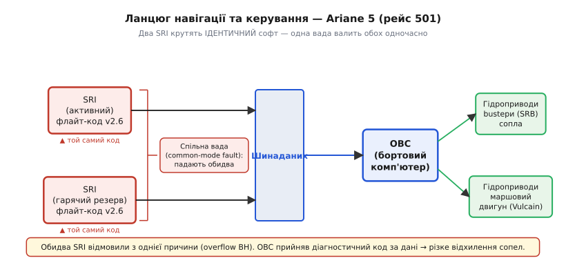
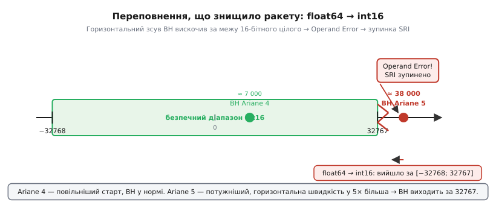

# 📜 Ariane 5, рейс 501: 37 секунд і необроблене переповнення

> Відмовостійка прошивка — це дисципліна, а не набір трюків, і найкраще це підтверджують аварії, де дисципліни не було. У [Розділі 4.15](r15-fault-tolerant.md) ми розбираємо принципи захисту від помилок: жодна з них не мовчить, кожне припущення перевіряється, надлишковість — не просто копія. 4 червня 1996 р. перший політ найпотужнішої на той час європейської ракети Ariane 5 тривав ~37 секунд і коштував ~$370 млн разом із чотирма науковими супутниками місії Cluster. Знищив його не вибух пального й не відмова двигуна, а **один необроблений виняток** — перетворення числа, що не влізло в 16 біт. Майже кожен принцип розділу 4.15 — «жодна помилка не мовчить», «перевіряй передумови», «надлишковість ≠ відмовостійкість», «діагностику не можна плутати з даними» — вписаний кров'ю саме цього польоту; пройдемо аварію крок за кроком і побачимо, як кожен крок відповідає темі розділу.

---

## Ракета за $7 мільярдів і вантаж, якого більше нема

Ariane 5 — не апгрейд попередника, а нове сімейство. З кінця 1980-х ESA вклала близько $7 млрд і майже десять років розробки, щоб отримати носій для важких комерційних і наукових пусків. Порівняно з Ariane 4 ракета несла вдвічі більший вантаж на геостаціонарну орбіту і мала значно потужніший перший ступінь. Два твердопаливні бустери і маршовий двигун Vulcain на рідкому водні давали тягу близько 11 МН при відриві — для 1996 року це був один із найпотужніших ракет-носіїв у світі.

Для ESA рейс 501 був не просто польотом — це була демонстрація. Перший комерційний пуск нового сімейства, після якого мали іти контракти. Тим гострішою стала поразка.

Вантаж першого польоту — чотири однакові супутники місії **Cluster**. Cluster — спільний проєкт ESA і NASA з вивчення магнітосфери Землі та сонячного вітру: збір даних у чотирьох точках одночасно дозволяв уперше побудувати тривимірну карту магнітних структур. Команди дослідників із кількох країн чекали на ці дані роками. Супутники не мали аналогів — заново виготовити їх зайняло б іще кілька років і сотні мільйонів доларів. На борту не було людей; людський вимір аварії — суто науковий і фінансовий, але від цього не менш болючий.

Апаратно ракета була справна. Двигуни пройшли всі стендові випробування, пневматика й гідравліка — у нормі. Коли слідчий комітет Комісії ESA (голова — Жак Лайонс, Jacques-Louis Lions) завершив аналіз, він виявив, що механічної відмови не було. Усе вирішили рядки коду в блоці, який тієї миті вже **не мав робити нічого корисного**.

> 🔧 **Навіщо це**
> Для прошивки мікроконтролера масштаб інший, але механізм той самий: один проковтнутий або, навпаки, нікому не потрібний шлях виконання здатен покласти всю систему. Розділ 4.15 — саме про дисципліну, що це відвертає.

---

## Що таке SRI: очі, без яких ракета сліпа

Ракета під час польоту не може дивитися назовні: ні GPS (тоді — з обмеженим цивільним доступом), ні радіокоманди із Землі не мають достатньо малого часу затримки для активного керування за швидкостями Ariane 5. Єдине джерело правди — бортова інерціальна навігація, що не залежить ні від чого зовнішнього.

Блок **SRI** (*Système de Référence Inertielle*, система інерціального відліку) — це автономний комп'ютер зі своїми акселерометрами і лазерними гіроскопами. Він безперервно інтегрує вектор прискорення і кутові швидкості: одне інтегрування прискорення дає швидкість, друге — положення; гіроскопи дають кут орієнтації. Ці числа по внутрішній шині надходять до **OBC** (*On-Board Computer*, бортовий комп'ютер), який на основі навігаційних даних і заданої траєкторії обчислює, як відхилити сопла, і видає команди гідравліці. Немає достовірних даних від SRI — немає орієнтації, немає керування, ракета летить «сліпою».

Особливо важливою є одна величина, яку SRI постійно рахував у процесі вирівнювання: **горизонтальний зсув** (*horizontal bias*, BH) — внутрішня оцінка похибки в горизонтальній осі, що накопичується і коригується під час юстирування інерціальної платформи. Значення BH відображає, наскільки точно SRI «знає» горизонт і відповідно обчислює курс. Саме BH стало початком ланцюга.

Щоб видавати числа з першої мілісекунди після команди «пуск», SRI потрібно вирівнятися заздалегідь. Для цього блок вмикається ще на стартовому столі — за десятки хвилин до старту — і поступово звужує похибку вимірів, «заспокоюючи» платформу гіроскопів відносно вертикалі і заданого азимуту. Цей процес отримав назву вирівнювання (alignment). Після відриву алгоритм вирівнювання вже завершив своє завдання — платформа вирівняна, навігація перейшла в режим відстеження польоту. Але алгоритм продовжував виконуватися і рахувати BH. Саме в цьому рахуванні й ховалася міна.



*Рис. 4.15.0.1. Ланцюг навігації та керування Ariane 5. Два однакові SRI (активний і резервний) подають дані на шину, OBC перетворює їх на команди соплам. Оскільки програмне забезпечення обох SRI ідентичне, однакова вада валить обидва водночас — це надлишковість лише на вигляд.*

За підручником надлишковість виглядає так: два незалежні SRI, один активний, інший — гарячий резерв; якщо активний відмовляє, OBC миттєво перемикається на резервний і продовжує роботу без перерви. На Ariane 5 саме так і було побудовано. Але в цій схемі ховалася фундаментальна вада: **обидва блоки містили ідентичне програмне забезпечення**. Їх виготовляв один виробник, за однією специфікацією, і вони виконували точно той самий код. Ця деталь «вистрелить» пізніше з руйнівними наслідками.

---

## Рядок коду з минулого: спадок Ariane 4

Підсистему вирівнювання SRI — ту саму, що рахувала BH, — **скопіювали з Ariane 4** без переробки. На Ariane 4 цей код літав роками бездоганно, пройшов сотні годин тестування і десятки реальних пусків. Повторне використання перевіреного компонента здавалося не лише виправданим, але й інженерно правильним рішенням — «не чіпай те, що працює».

Є тонка деталь, яку важливо назвати точно, бо вона визначає всю наступну логіку. Алгоритм вирівнювання мав сенс лише ДО старту: він юстирував інерціальну платформу на стартовому столі, зводячи до мінімуму накопичену похибку перед польотом. Але на Ariane 4 цей блок **лишали активним ще ~50 секунд після команди старту**. Причина була практичною і виваженою: якщо відлік перервався на короткий час (технічна затримка, аномалія), краще не переривати вирівнювання — запустити його заново і дорого, і довго. Тому «зайві» 50 секунд слугували страховкою. На Ariane 4 це рішення себе виправдало.

На Ariane 5 ця функція після старту вже **не була потрібна взагалі**. Профіль польоту новий, сценарій короткого переривання після відриву в специфікації не розглядався. Але код за інерцією лишили виконуватися — не тому що хтось вважав це корисним, а просто тому що ніхто не ставив питання «а чи потрібне це тут?». Рішення «не чіпати» перейшло автоматично разом із кодом.

Іронія, яку підкреслює звіт Комісії ESA (опублікований 19 липня 1996 р.): систему вбив фрагмент, що тієї миті не виконував жодної корисної роботи. Він просто рахував і конвертував BH — величину, яка вже нікому не була потрібна, нікуди не передавалась і ніяк не впливала на навігацію. Але вона споживала процесорний час і зберігала в собі міну.

> 🔧 **Навіщо це**
> Повторне використання коду — благо, але «працювало там» ≠ «працюватиме тут». Межі застосовності — це передумови (§4.15.3). Мертвий код, що виконується «про всяк випадок», — теж небезпека: він споживає ресурс і може відмовити в неочікуваний момент. Прибирати такий код — частина гігієни відмовостійкої системи.

---

## Число, що не влізло: float64 → int16

Це технічне серце аварії, і його треба розібрати повільно і точно.

SRI рахував горизонтальний зсув BH у **64-бітному числі з рухомою комою** (double, float64). Для передачі і подальшої обробки у внутрішній процедурі це число конвертували у **16-бітне ціле зі знаком** (int16). Діапазон int16 — лише −32768…+32767: трохи більше 65 тисяч різних значень.

На Ariane 4 горизонтальна швидкість на цьому етапі фізично не могла дати BH поза цим діапазоном. Ракета повільніша, траєкторія пологіша — значення BH залишалося десь у районі 7 000, із запасом. Переповнення було **неможливим за побудовою траєкторії Ariane 4**.

Ariane 5 значно потужніша. Горизонтальна складова швидкості на старті в кілька разів більша, ніж у попередниці. Відповідно і BH зростало — і на 30-й секунді після відриву вийшло далеко за позначку 32767.



*Рис. 4.15.0.2. Переповнення, що знищило ракету. 64-бітне значення горизонтального зсуву BH перетворювали в 16-бітне ціле (діапазон лише −32768…32767). На Ariane 4 BH завжди вкладалося; потужніша Ariane 5 дала значення далеко за 32767 — і незахищене перетворення кинуло виняток.*

Що тоді робить процесор? Код SRI написано мовою **Ada** — промисловою мовою, яку обирають для критичних систем саме за суворий контроль типів, явне управління винятками і передбачувану поведінку. У Ada перетворення числа з виходом за межі цільового типу — не тиха невизначена поведінка: воно кидає виняток **Constraint_Error** (у термінах звіту — Operand Error). Це явне сповіщення про помилку. У правильно написаній Ada-програмі для критичної системи такий виняток мав бути перехоплений і оброблений: записати в журнал, перейти у безпечний стан, передати управління резервному каналу.

Але цей конкретний шлях перетворення **не був обгорнутий обробником винятку**. Виняток пішов угору стеком без обробника і **зупинив задачу SRI повністю**. Замість навігаційних даних SRI виставив на шину **діагностичний код** — бітовий патерн зі специфікою відмови: у форматі, що збігається з форматом навігаційних повідомлень, але містить не кут і швидкість, а код помилки.

Ось мінімальний приклад на C/C++ (мова курсу), що демонструє саме цей клас помилки:

```cpp
#include <stdint.h>

// ──────────────────────────────────────────────────────────────────
// Те, що вбило SRI: float64 → int16 без перевірки діапазону.
// ──────────────────────────────────────────────────────────────────
double bh = 38000.0;        // горизонтальний зсув; на Ariane 5 — велике число

// У C це мовчазне (але технічно — невизначена поведінка при переповненні).
// Компілятор не зупиняє виконання; результат — «сміття» або wrap-around.
int16_t out_bad = (int16_t)bh;  // UB: out_bad отримує непередбачуване значення

// ──────────────────────────────────────────────────────────────────
// Як треба: спершу перевір діапазон, лише потім звужуй.
// ──────────────────────────────────────────────────────────────────
if (bh < -32768.0 || bh > 32767.0) {
    // Явна, керована реакція: перехід у безпечний стан (§4.15.4).
    // На реальному МК: виставити прапор «дані недостовірні»,
    // передати керування резервному каналу, зупинити небезпечну дію.
    enter_safe_state();
} else {
    out_bad = (int16_t)bh;      // тут звуження безпечне, діапазон доведено
}
```

Зверніть увагу на контраст із Ada: у C не було б навіть винятку. Звуження `(int16_t)bh` при значенні поза діапазоном — це невизначена поведінка (UB): компілятор формально може дати нуль, wrap-around, сатурацію або щось зовсім несподіване залежно від архітектури й оптимізатора. На ARM Cortex-M зазвичай отримаємо результат від `VCVT` з насиченням або wrap-around від цілочисельного переповнення, але стандарт C жодного з них не гарантує. Головне — виконання продовжиться без жодної індикації, що щось пішло не так. Мовчазне псування даних.

У Ada зупинило — але без обробника це виявилось так само погано: процесор зупинився і послав діагностику замість даних. Правильна відповідь не «краще б мова не зупиняла» і не «краще б мова мовчки спотворила значення». Правильна відповідь — **«перевір діапазон до конвертації»** — тоді ані UB, ані незахоплений виняток просто неможливі. Код стає явним щодо своїх очікувань і явним у реакції на їхнє порушення.

> 🔧 **Навіщо це**
> На МК звуження типів трапляється щодня: int → uint8 для запису в регістр, float → int16 для DAC, uint32 → uint8 для буфера. Відсутність перевірки діапазону — або тиха корупція даних (C-style UB), або гучна паніка без відновлення (Ada-style). Перевірка перед конвертацією — стандарт MISRA-C R10.3, і вона тут не бюрократія, а реальна потреба.

---

## Чому захист зняли саме там, де він був потрібен

Найважливіша — і найменш очевидна — частина аварії стосується не того, що сталося, а того, чому захист не спрацював. Тут немає «ледачого програміста» чи «необережного менеджера» — є системна проблема, яку звіт Комісії описує з хірургічною точністю.

При розробці SRI-коду команда проаналізувала **7 змінних**, для яких операція Operand Error теоретично можлива. Для 4 із них були додані явні перевірки діапазону, і це видно у коді Ada — розробники думали про безпеку. Але для **3 змінних, зокрема BH**, захист свідомо **лишили відключеним**.

Аргумент звучав розумно: ці величини або обмежені фізично, або мають такий запас, що вихід за діапазон неможливий за природою задачі. Для Ariane 4 це було правдою. Але розрахунок спирався на **траєкторію Ariane 4** — і ніхто не перерахував межі для нового носія.

Друга причина — продуктивність. Перед командою стояла конкретна вимога: завантаження процесора SRI не більше 80%. Зайві перевірки діапазону коштують тактів, і розробники берегли їх як «бюджет CPU». Це реальний інженерний компроміс між безпекою і ресурсом, прийнятий на основі цілком раціонального аналізу — але аналізу неправильних вхідних даних.

Системний корінь іще глибший. Було **вирішено не вносити траєкторію Ariane 5 у специфікацію SRI** — вважалося, що SRI повинен бути незалежною підсистемою, яку не треба прив'язувати до конкретного носія. Це мало сенс як архітектурний принцип: інерціальна система — це абстракція, що вимірює фізику, а не залежить від того, якою ракетою вона летить.

Але на практиці це рішення означало: ніхто офіційно не мав завдання перевірити, чи залишаються старі числові інваріанти SRI дійсними для нового носія. Не було кроку в процесі розробки, що вимагав би: «перелічіть всі внутрішні обмеження SRI і перевірте їх для льотних умов Ariane 5». Цю перевірку не забули зробити — її **не було в плані**. А раз її не було в плані, ніхто не ніс відповідальності за те, що вона не відбулась.

Звіт Комісії особливо підкреслює: це не помилка кодера, не помилка тест-інженера і не помилка менеджера. Це **помилка процесу**: не було механізму, який вимагав перепідтвердження меж при зміні контексту застосування компонента.

> 🔧 **Навіщо це**
> «Захисне програмування без параної» (§4.15.3) — це мистецтво вирішувати, ДЕ перевірка обов'язкова. Економити перевірки можна лише там, де інваріант **доведено** — доведено для поточного контексту, а не для минулої системи. На МК та сама спокуса: «тут переповнення не буде» — поки залізо, частота або вхідний сигнал не зміняться. Перевірку треба обґрунтовувати доказом, а не інтуїцією.

---

## 37 секунд: ланцюг подій крок за кроком

Якщо зібрати все докупи, аварія постає як єдина безперервна ланцюгова реакція — жодного «другого удару долі», жодної незалежної збійної події. Лише одне невдале рішення п'ятирічної давності, наслідки якого розгорнулися за 37 секунд.

**H0 — відрив.** О 09:33 UTC з космодрому Куру у Французькій Гвіані двигуни вийшли на повну тягу, ракета відокремилась від стартового столу. Телеметрія — зелена, бортова апаратура — у штатному режимі. Обидва SRI — активний (SRI-2) і резервний (SRI-1) — перейшли в польотний режим і продовжили виконувати алгоритм вирівнювання, успадкований від Ariane 4. Ніхто на борту і в центрі управління не знав, що цей алгоритм уже відлічує секунди до катастрофи.

**H0 + ~30 секунд.** Горизонтальна швидкість ракети досягла критичної точки: горизонтальний зсув BH вийшов за 32767 — за межу діапазону int16. Процедура float64→int16 в задачі вирівнювання активного SRI-2 кидає Operand Error. Обробника для цього шляху немає. Задача зупиняється. SRI-2 фіксує відмову внутрішнього процесу і починає формувати вихідне повідомлення.

**SRI-2 виставляє на шину діагностичний пакет** замість навігаційних даних. У форматі повідомлення — ті самі поля, що і в звичайних навігаційних пакетах, але замість кута і швидкості — бітовий патерн кодів відмови. Протокол шини не розрізняє «навігаційний пакет» і «діагностичний пакет» на рівні заголовка. OBC отримує те, що виглядає як навігаційні дані.

**Критичний поворот: резервний SRI-1 уже мертвий.** Він відмовив за кілька мілісекунд ДО активного — з тієї самої причини, з тим самим кодом, на тій самій конвертації. Фактично SRI-1 вийшов із ладу першим. Коли активний SRI-2 відмовив і OBC мав би перемкнутись на резерв — резерву вже не існувало. Обидва блоки несуть **спільну (common-mode) ваду**: вони ідентичні програмно, тож однакова умова вразила їх практично одночасно. Надлишковість із двох копій однакового коду — це не відмовостійкість.

**OBC читає з шини діагностичний патерн і сприймає його як дані орієнтації.** З погляду OBC він отримав повідомлення від SRI (хоча й незвичне за значеннями), і його завдання — відреагувати на нього. Числа свідчать про величезне неочікуване відхилення ракети від розрахункового курсу — відхилення, якого насправді не існує. OBC не розрізняє «навігаційні дані» і «діагностику» — і це окремий системний прорахунок.

**OBC командує максимальне відхилення сопел** — і твердопаливних бустерів, і маршового двигуна Vulcain — щоб «виправити» неіснуюче відхилення. Гідравліка відпрацьовує команду точно і швидко: сопла різко відхиляються від осі.

**Аеродинамічні навантаження від різкого повороту перевищують розрахункову міцність корпусу.** Ракета іще летить вертикально вгору зі швидкістю близько 450 м/с, і бічні навантаження від відхилення сопел виявляються руйнівними. На ~H0+37 с корпус починає механічно деформуватись. Спрацьовує **штатна система автопідриву** (*Flight Termination System*): вона постійно відстежує кутове відхилення і кутову швидкість, і при виявленні неконтрольованого руйнування автоматично підриває ракету. Це не «підірвали помилково» і не «паніка операторів» — це саме той сценарій, для якого система підриву існує: не дати уламкам впасти на населені райони. Вона спрацювала штатно.

Від моменту зупинки SRI-1 до фінального вибуху — менше однієї секунди реального часу. Одна незахищена конвертація послідовно перетворилась на втрату обох SRI, хибну команду, механічне руйнування і автопідрив. Жодної другої причини не було, жодного незалежного збою — один ланцюг, одне першоджерело.

---

## Що з цього забрати: вісім уроків — вісім тем розділу

Кожна ланка цього ланцюга не просто «цікаве місце в хроніці» — вона безпосередньо відображає один із принципів §4.15. Ось як аварія відображається на розділі:

**§4.15.1 — Жодна помилка не мовчить.** Operand Error таки «гукнув» — Ada не проковтнула його мовчки. Але виняток без обробника = зупинка процесора, що не краще мовчазної UB. Урок ширший і важливіший за «вибір мови»: і тиха UB у стилі C (звуження типів без перевірки дає сміттєве значення, виконання продовжується), і незахоплена паніка (виконання зупиняється, на шину іде діагностика замість даних) однаково ведуть до катастрофи. Помилку треба **очікувати, перехопити і явно обробити** — не сподіватися, що її не буде, і не покладатися на те, що «мова сама впорається».

**§4.15.2 — Вибір стратегії реагування: код повернення / assert / паніка.** Виняток без обробника означав, що реакція на помилку не була свідомо обрана — процесор «впав за замовчуванням» з передачею у форматі навігаційних даних. Для критичної системи реакція має бути явно обрана відповідно до рівня загрози: для навігаційного блоку це «виставити прапор "дані недостовірні", зупинити тільки функцію вирівнювання, повідомити OBC через виділений канал помилок» — а не «впасти та слати патерн помилки туди, де OBC очікує координати».

**§4.15.3 — Передумови, інваріанти, захисне програмування.** Три незахищені конвертації — це не «недбалість», а приклад «оптимізували перевірку на правильних підставах для неправильного контексту». Інваріант «BH завжди в межах int16» був доведений для Ariane 4 — і лише для неї. Перенесення коду без перенесення аналізу меж — це перенесення без передумов. У §4.15.3 це і є «помилка передумови»: перевірку прибрали не тому що «довели», а тому що «так було».

**§4.15.4 — Безпечний стан / safe mode.** При невалідній конвертації правильна дія — перейти у безпечний стан тільки тієї функції, де виникла проблема: виставити прапор «дані недостовірні», передати пріоритет резервному каналу, зупинити функцію вирівнювання — але не зупиняти весь процесор SRI і не виставляти на навігаційну шину діагностичний патерн, який OBC не відрізняє від реальних навігаційних даних. Безпечний стан — це мінімально деструктивна реакція, що зберігає керованість системи.

**§4.15.5 + §4.15.6 — Перезавантаження, причина reset і межі відновлення.** Гарячий рестарт SRI не врятував би: стан блоку не був пошкоджений збоєм — **вхідні умови** вийшли за проєктні межі, і вони нікуди не зникли б після рестарту. Рестарт повторив би те саме переповнення за частки секунди. Це принципове розрізнення: «збій стану» (bit-flip у RAM, stack corruption) — reset може відновити систему; «вихід за специфікацію» (вхід за межами проєктного діапазону) — reset не допоможе, потрібне інше рішення.

**§4.15.8 — Деградація з гідністю і справжні межі надлишковості.** Два ідентичні SRI — це захист лише від апаратних відмов в одному екземплярі, але не від програмних вад. Однаковий код = спільна вада (*common-mode fault*), і при програмній помилці вони падають разом, практично одночасно. Справжня стійкість проти common-mode fault потребує або **різнорідності** (diverse redundancy: різні реалізації, різні компілятори, різні алгоритми для тієї самої функції), або коректної **деградації з явною позначкою «канал недостовірний»** і передачею керування в безпечний режим, а не мовчазної подачі «чогось» на шину.

*(§4.15.7 — brown-out / провал живлення — тут не є причиною; але загальна мораль збігається: збій однієї підсистеми не має каскадно валити весь апарат. Degrade gracefully, а не fail catastrophically.)*

---

Найдорожчі помилки ховаються не там, де код складний. Вони ховаються там, де **припущення тихо застаріло**: добре перевірений код перемістився в новий контекст, і ніхто не поставив питання «а чи залишаються старі інваріанти справедливими тут?». Ariane 5 довела це ціною $370 млн, чотирьох наукових місій і кількох років очікування команд дослідників.

Є зворотний бік цього уроку, не менш важливий. Комісія не покарала нікого з команди. Звіт Lions констатував: люди приймали раціональні рішення на основі правильного аналізу — але аналізу системи, яка вже перестала існувати у своєму первинному вигляді. Це не людська помилка — це системна помилка процесу: не було механізму, який би вимагав перевірити інваріанти при перенесенні коду в новий контекст.

Відмовостійкість — це не набір трюків, а дисципліна постійного сумніву у власних передумовах. Кожне «тут переповнення не буде» має бути обґрунтоване доказом — для цього носія, цього датчика, цього діапазону вхідних значень. А не прийняте за замовчуванням із минулого проєкту.

▶️ Далі: [Розділ 4.15 — Відмовостійка прошивка](r15-fault-tolerant.md) <!-- TODO: узгодити ім'я головного файлу розділу -->
